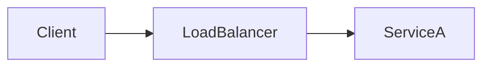

# Authoring Conventions

These rules keep the book consistent **and** make the future website build
(Phase 2) almost entirely scriptable. Follow them for every file.

> [!IMPORTANT]
> The website renderer will parse these files mechanically. If a file
> breaks these rules, it may render incorrectly later. When in doubt,
> match an existing file and the templates in [`templates/`](templates/).

> [!NOTE]
> This file covers **formatting**. For **how much substance** a topic needs —
> the depth/coverage bar every topic must clear before it's `complete` — see
> [DEPTH-CHECKLIST.md](DEPTH-CHECKLIST.md).

---

## 1. File & folder naming

Everything is addressed by a stable **`L#/C##/T##`** code path, so any topic has
an unambiguous handle (e.g. `L0/C01/T01`). The code is an **uppercase** prefix;
the rest of every name is lowercase, hyphen-separated (kebab-case).

- **Levels** — module folders are prefixed `L0`–`L6`: `L#-module-slug/`
  → e.g. `L0-foundations/`.
- **Chapters** — section folders are prefixed `C` + zero-padded order:
  `C##-section-slug/` → e.g. `C07-interview-prep/`.
- **Topics** — topic files are prefixed `T` + zero-padded order:
  `T##-topic-slug.md` → e.g. `T03-variables-and-types.md`.
- Every folder has a `README.md` that acts as that folder's index page.
- Refer to any topic by its **code path** (`L1/C01/T01`); the codes are unique
  prefixes, so a descriptive slug can be reworded without breaking references.

```
content/L1-core-java/
├── README.md                      ← module index
├── C01-oop/
│   ├── README.md                  ← section (chapter) index
│   ├── T01-classes-and-objects.md
│   └── T02-constructors-and-this.md
└── C07-interview-prep/
    ├── README.md
    └── T01-core-java-questions.md
```

---

## 2. Frontmatter (required on every content file)

Every `.md` file (except the root `README.md`, `CURRICULUM.md`, and this
file) starts with a YAML frontmatter block. The web build reads these
fields to generate routes, navigation, tags, and metadata.

```yaml
---
title: "Variables and Data Types"      # human title; also the page <h1>
slug: variables-and-types              # URL slug; matches filename minus NN-
level: L0                              # L0..L6
module: "Foundations"                  # human module name
section: "Concepts"                    # section type or thematic section
type: concept                          # concept | exercise | project | interview-qa | cheatsheet | reference | index
difficulty: beginner                   # beginner | intermediate | advanced | senior | lead
order: 6                               # order within the section
tags: [variables, types, primitives]   # lowercase tags for search/filtering
prerequisites: []                      # list of slugs that should come first
status: planned                        # planned | draft | in-progress | review | complete
estimated_minutes: 15                  # rough reading/working time
last_updated: 2026-05-28               # ISO date
---
```

**Rules**

- `slug` must be globally unique across the whole book.
- `status` mirrors the status shown in [CURRICULUM.md](CURRICULUM.md); keep
  them in sync.
- `prerequisites` use slugs, not file paths, so links survive reorg.

---

## 3. Headings

- **Exactly one `#` (H1) per file**, and it must match the frontmatter
  `title`. The body starts at `##` (H2).
- Use Title Case for headings.
- Don't skip levels (no `##` → `####`).

---

## 4. Code blocks

- Every fenced block declares a language: ```` ```java ````, ```` ```bash ````,
  ```` ```sql ````, ```` ```yaml ````, etc. Never leave it blank — syntax
  highlighting on the site depends on it.
- Code should be complete enough to compile/run unless clearly a fragment
  (mark fragments with `// ...`).
- Runnable examples that accompany a topic live under the repo-root
  **[`examples/`](examples/)** tree (see §12) and are linked from the topic.
- Terminal commands use `bash` and a `$` prompt; readers don't type the `$`.

```bash
$ javac HelloWorld.java
$ java HelloWorld
```

---

## 5. Callouts / admonitions

Use **GitHub-style alerts**. They render on GitHub today and map cleanly to
web callout components later. Supported types:

```markdown
> [!NOTE]
> Neutral, useful context.

> [!TIP]
> A shortcut or best practice.

> [!IMPORTANT]
> Something the reader must not miss.

> [!WARNING]
> A common mistake or risk.
```

Plus one **custom** convention the build will style specially:

```markdown
> [!INTERVIEW]
> A point that frequently comes up in interviews.
```

---

## 6. Links

- Link between docs with **relative paths including the `.md`** extension
  (e.g. `[generics](content/L1-core-java/C02-collections-and-core-apis/T11-generics-basics.md)`).
  The build rewrites these to clean web routes.
- Link to images relatively from `assets/`.
- Don't hard-code absolute file-system paths or full GitHub URLs for
  internal links.

---

## 7. Images & diagrams

- Store under `assets/` (global) or a module-local `assets/` folder.
- Always provide alt text: ``.
- Prefer **Mermaid** for diagrams where possible (renders as text, easy to
  diff and to render on the web):

````markdown

````

---

## 8. Tables

Use GitHub-Flavored Markdown pipe tables. Keep a header row and alignment
consistent.

---

## 9. Interview Q&A format

Interview content (in each module's Interview Prep section and in L6) uses a
**fixed structure per question** so the build can turn each into a
collapsible card / flashcard. One question = one `###` block:

```markdown
### Q: What is the difference between `==` and `.equals()`?

- **Difficulty:** beginner
- **Asked at:** TCS, Infosys, Accenture (entry level)

**Answer.** `==` compares references (identity) for objects and value for
primitives. `.equals()` compares logical equality and can be overridden…

**Follow-ups:**
- What happens if you override `equals` but not `hashCode`?
- How does `String` interning affect `==`?
```

Required parts: the `### Q:` line, a **Difficulty** line, an **Asked at**
line, an **Answer** paragraph. **Follow-ups** are optional but encouraged.

---

## 10. Page structure (content topics)

Standard skeleton for a Concept topic (see `templates/topic-template.md`):

1. H1 title (matches frontmatter)
2. One-paragraph intro: what this is and why it matters
3. Prerequisites callout (if any)
4. The content (H2 sections)
5. **Practice** — exercises
6. **Recap** — what the reader can now do
7. **Next** — link to the next topic

---

## 11. Tone

- Direct and concrete. Short sentences. Real examples over abstractions.
- Explain **why** before **how**, especially at L3+.
- Define jargon on first use. Assume curiosity, not prior knowledge
  (within the module's tier).

---

## 12. Runnable Examples (`examples/`)

Companion code lives in a repo-root **`examples/`** tree, grouped by purpose:

```
examples/
├── starter-templates/   # copy-me project skeletons
├── system-designs/      # classic designs made runnable (url-shortener, saga, …)
├── labs/                # guided, time-boxed hands-on exercises
└── k8s-manifests/       # deployment & operations YAML (k8s + Istio)
```

Rules for any project added here:

- **Self-contained & runnable.** A standard **Maven** project (`pom.xml`), groupId
  `com.javamastery.examples`, **Java 21** baseline (compile to Java 21 bytecode so it
  runs on any JDK 21+). `mvn test` is the definition of done.
- **Zero external infra by default** — use **H2** or in-process stand-ins. If a project
  genuinely needs infra (Redis, a broker), use **Testcontainers** so `mvn test` provisions
  it (and keep the pure-logic tests passing without Docker).
- **Every project has a `README.md`** that opens with a `Backs: L#/C##/T## — <topic>` line
  linking the chapter it supports, then: what it demonstrates, prerequisites, exact run
  commands, expected output, and "Files to read first."
- **Labs that demonstrate failure** (OOM, deadlock, a misleading benchmark) gate the
  destructive behavior behind a `main`/flag so the test suite stays green and never hangs.
- The top-level [`examples/README.md`](examples/README.md) is the index mapping every
  project back to its topic — update it when adding a project.

## 13. Indexes For Expansion-Phase Additions

The skeleton generator (`scripts/generate_skeleton.py`) predates the post-skeleton
expansion phases and prints every topic as `planned`. **Do not re-run it to "fix" an
index** — it will overwrite hand-authored chapter READMEs and drop the expansion
chapters/topics. Instead:

- When adding a topic to an existing chapter, **hand-add its row** to that chapter's
  `README.md` (status `complete`) and add a short `> [!NOTE]` flagging it as a
  phase addition.
- The **per-topic frontmatter `status`** is the source of truth for completion, not the
  generated tables.
