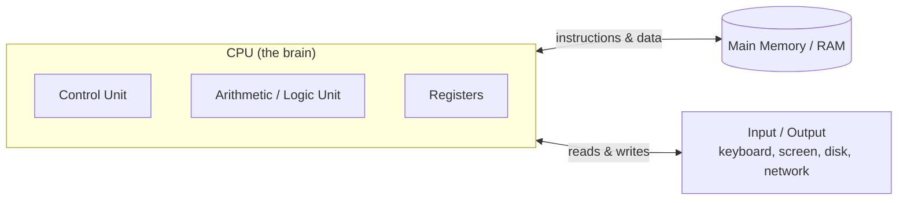
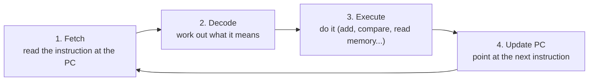
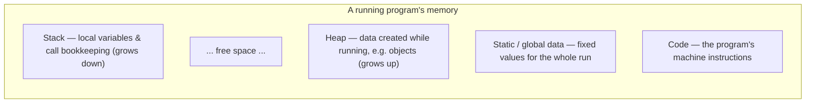
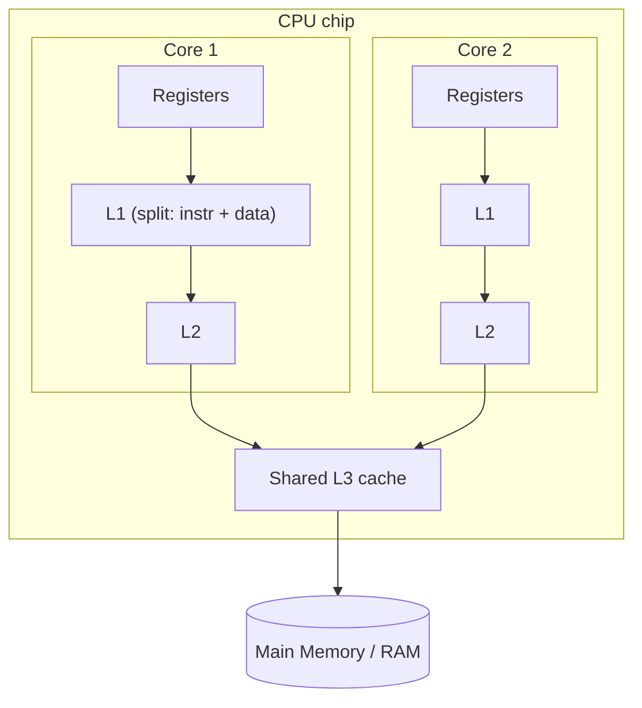

# How Computers Run Programs

Before you write a single line of Java, it pays to know what actually happens when a program runs. A computer has no idea what "Java", a "variable", or a "loop" is. Underneath every language is the same machine doing the same simple thing, billions of times a second: read a number, do something with it, repeat. This topic builds that mental model from the ground up — **bits**, the **CPU**, **memory and its addresses**, the **operating system**, **multiple cores** — and finally how your Java reaches the silicon. Get this, and everything later (why types have sizes, why some code is slow, what the JVM is for, why objects live on a "heap", why concurrency is hard) has something solid to attach to.

It is by far the longest topic in L0, on purpose. Spend the time here and the next hundred topics get easier.

> [!NOTE]
> This is the very first topic in the book. It assumes **no** prior programming or hardware knowledge. Sidebars marked **"Going deeper"** add advanced context (history, edge cases, hardware detail) — a first-time reader can safely skim or skip them and come back later. Everything outside those sidebars is core.

## A Little History: The Stored-Program Idea

The earliest electronic computers were programmed by physically **rewiring** them — flipping switches and re-plugging cables for days to change what they computed. The breakthrough, set out in a 1945 report associated with mathematician **John von Neumann**, was the **stored-program** concept: keep the program *in the same memory as the data*, as just more numbers. Now "reprogramming" meant loading different numbers — software, in the modern sense, was born.

That design — one CPU, one memory holding both instructions and data — is the **von Neumann architecture**, and it still describes the laptop, phone, and server you use today. You'll meet its fingerprints throughout this topic.

> [!NOTE]
> **Going deeper — Harvard vs von Neumann.** A few systems use the *Harvard architecture*, which keeps instructions and data in physically separate memories (common in small embedded chips and, in spirit, inside CPU caches — see the split instruction/data cache later). The trade-off: Harvard can fetch an instruction and a data value at the same time, but von Neumann's single memory is simpler and more flexible. Your computer is von Neumann at the system level.

## Everything Is Just Bits

At the lowest level, a computer only stores and moves **bits**. A bit is a single value that is either `0` or `1` — nothing else. Physically, a bit is a tiny switch (a *transistor*) that is either off (`0`) or on (`1`), represented by low or high voltage.

Why only two states? Because two states are *easy to tell apart reliably*. A wire either has voltage or it doesn't. If computers tried to use ten voltage levels for the digits 0–9, a little electrical noise could turn a `7` into an `8`. Two well-separated states almost never get confused, so hardware built on them is fast and dependable. This is why the whole industry runs on **binary** (base-2).

Bits are grouped to be useful:

| Unit | Size | Holds (roughly) |
|------|------|-----------------|
| bit | 1 bit | a single 0 or 1 |
| nibble | 4 bits | one hexadecimal digit (`0`–`F`) |
| byte | 8 bits | one character like `A`, a number 0–255 |
| word | 32 or 64 bits | the CPU's natural chunk (today usually 64) |
| kilobyte (KB) | ~1,000 bytes | a short paragraph of text |
| megabyte (MB) | ~1 million bytes | a small image |
| gigabyte (GB) | ~1 billion bytes | a movie |

> [!NOTE]
> **Going deeper — KB vs KiB.** Memory is naturally counted in powers of two, so 2¹⁰ = **1,024** bytes is one *kibibyte* (KiB), while the SI "kilobyte" (KB) strictly means **1,000** bytes. This is why a "500 GB" disk shows up as ~465 GB in your OS: the maker counts in powers of ten, the OS in powers of two. In casual use people say "KB" for both; just know the 1000-vs-1024 gap exists.

### Reading a Binary Number

A binary number works exactly like the decimal numbers you know, except each position is worth **twice** the one to its right instead of ten times. The rightmost bit is the 1s place, then 2s, 4s, 8s, and so on:

```text
 bit:    0   1   0   0   0   0   0   1
 value: 128  64  32  16   8   4   2   1
        ─────────────────────────────────
 set bits: 64 + 1 = 65
```

So `01000001` = 64 + 1 = **65**. With 8 bits you can make 2⁸ = **256** different patterns, representing the whole numbers 0 through 255. Add more bits and the range explodes: 16 bits → 65,536 values, 32 bits → about 4.3 billion. You'll practice converting in the [next topic](./T02-number-systems-binary-hex-and-basic-bit-math.md); for now just absorb that *binary is ordinary counting with two symbols*.

### From Bits to Logic

Storing bits is only half the story — the magic is that simple electrical circuits can *compute* with them. Transistors are wired into **logic gates**, circuits that take one or two input bits and produce an output bit. The three to know by name are **AND**, **OR**, and **NOT**.

`AND` outputs `1` only when *both* inputs are `1`:

| A | B | A AND B |
|---|---|---------|
| 0 | 0 | 0 |
| 0 | 1 | 0 |
| 1 | 0 | 0 |
| 1 | 1 | 1 |

`OR` outputs `1` when *either* input is `1`; `NOT` flips its single input (`0`→`1`, `1`→`0`). This seems almost too humble to matter — but here is the remarkable part: **you can build every operation a computer does out of these gates.** Wire a handful together correctly and you get a circuit that *adds* two bits (a "half-adder"); chain those and you add full numbers; combine more and you can subtract, compare, and select between values. A modern CPU is, at bottom, **billions of transistors** arranged into gates arranged into adders, comparators, and memory cells. There is no deeper magic — just an astonishing quantity of very simple switches, switching very fast.

### Signed Numbers, Overflow, and Other Edge Cases

So far, so tidy — but a fixed number of bits has fixed limits, and that creates real behavior you'll hit in Java.

**Negative numbers.** Computers represent negatives with a scheme called **two's complement** (covered fully in the next topic). The practical consequence: a signed 8-bit value covers −128 to 127, a signed 32-bit `int` in Java covers about −2.1 billion to +2.1 billion.

**Overflow.** Because the width is fixed, adding past the top **wraps around** to the bottom, like a car odometer rolling over. This is not a Java quirk — it's how fixed-width binary arithmetic works everywhere:

```java
int max = Integer.MAX_VALUE;   // 2_147_483_647  (the largest int)
System.out.println(max + 1);   // prints -2147483648, the most NEGATIVE int!
```

That surprising result is the wrap-around in action. Knowing *why* turns a baffling bug into an obvious one.

> [!NOTE]
> **Going deeper — endianness.** A number bigger than one byte (say a 4-byte `int`) must be split across several memory addresses — but in which order? *Little-endian* machines (x86, and ARM as normally run) store the least-significant byte first; *big-endian* systems store the most-significant first (also called "network byte order"). It rarely matters until you read a binary file or a network packet written by a different system and the bytes come out reversed.

### The Same Bits, Different Meanings

A crucial idea beginners often miss: **a pattern of bits has no built-in meaning. The program decides what it means.** The byte `01000001` is:

- the **number** `65` if you treat it as an integer,
- the **letter** `A` if you treat it as text (in the ASCII encoding),
- or just part of a bigger value (a pixel's color, one slice of a larger number).

So how does text become bits? By an agreed **encoding** — a lookup table everyone follows. The old **ASCII** scheme used one byte per character and covered English letters, digits, and punctuation. The world needs far more than 256 characters (`é`, `中`, `🙂`), so modern systems use **Unicode**, most often stored as **UTF-8**. Numbers with fractions use a separate scheme called **floating point**; images, audio, and video are their own agreed encodings. Java leans on this directly — its `char` holds a Unicode character — and you'll meet encodings again the first time a file or network message arrives as raw bytes.

> [!TIP]
> Internalizing "everything is bits, and meaning is assigned by interpretation" explains a whole category of bugs: integer overflow (above), garbled text from the wrong encoding, and why comparing a number to a string is nonsense to the machine.

## The Three Pieces: CPU, Memory, Storage

Almost every computer, from a phone to a server, is organized around three parts.

- **CPU (Central Processing Unit)** — the "brain". It does the actual work: arithmetic, comparisons, and deciding what to do next. It is astonishingly fast but has almost no space to hold things.
- **Main memory (RAM — Random Access Memory)** — the "desk". A large, fast scratch space that holds the program currently running *and* the data it's working on. RAM is **volatile**: switch the power off and everything in it vanishes.
- **Storage (disk — SSD or hard drive)** — the "filing cabinet". Huge and **persistent** (survives a power-off), but far slower than RAM. Your files, and the Java program *before* you run it, live here.



Inside the CPU:

- The **Control Unit** directs traffic — it fetches instructions and tells the other parts what to do.
- The **Arithmetic/Logic Unit (ALU)** is the adder/comparator circuitry from the last section: it does the math and the logic.
- The **registers** are a handful of tiny slots (often only a few dozen) holding the few values the CPU is touching *this instant*. They are the fastest storage in the machine — effectively instant — but there's almost no room. Several are special-purpose:
  - the **Program Counter (PC)** holds the address of the *next* instruction to run;
  - the **stack pointer** tracks the top of the call stack (more soon);
  - the **flags/status register** holds single-bit results of the last operation — was it zero? did it overflow? — which is exactly how the CPU later decides whether to take an `if` branch.

The natural chunk of bits a CPU handles is its **word**. On a modern **64-bit** CPU the word is 64 bits, so registers are 64 bits wide.

> [!NOTE]
> **Going deeper — instruction sets (x86 vs ARM).** The exact menu of machine instructions a CPU understands is its *Instruction Set Architecture (ISA)*. The two that matter today are **x86-64** (Intel and AMD chips, most desktops/servers) and **ARM/AArch64** (phones, and Apple Silicon Macs like the M-series). Code compiled to machine code for one will *not* run on the other. This is precisely the problem Java's bytecode + JVM solve — the same Java program runs on an Intel server and an ARM MacBook because only the JVM is rebuilt per ISA, not your code.

## Memory Is One Giant Array of Addresses

Think of RAM as an enormously long street of identical mailboxes, each holding **one byte**. Every mailbox has a unique number — its **address** — starting at 0 and counting up. To read or write memory, the CPU doesn't say "the box near the middle"; it says "give me the byte at address 5,128,994". *Random access* means it can jump straight to any address in roughly the same time, the way you walk straight to any house number without passing the earlier ones.

This is what **32-bit** versus **64-bit** is really about. An address is itself a binary number, and its width caps how many mailboxes you can name:

- A 32-bit address counts up to 2³² ≈ 4.3 billion — so a 32-bit machine uses at most about **4 GB** of RAM. Older computers hit exactly this wall.
- A 64-bit address counts up to 2⁶⁴ ≈ 18 *quintillion* — effectively unlimited.

The payoff for you as a programmer: **a variable in your code is, underneath, a human-friendly name for an address in memory.** When you later write `int age = 30;`, the machine sets aside a slot at some address, calls it `age` for your benefit, and stores the bits for 30 there. When two variables "point to the same object" (a phrase you'll meet constantly in Java), it means they hold the same address. Keep this picture; it makes references, `null`, and a lot of Java behavior click.

> [!NOTE]
> You'll almost never touch raw addresses in Java — the language hides them for safety. But knowing they exist demystifies references and why two objects can be *equal in value* yet live at *different addresses*.

## What a Program Actually Is

A program is a long list of very small, very specific **instructions** stored in memory as bits — "copy this number into a register", "add these two registers", "if the last result was zero, jump to the instruction at address 840". These low-level instructions are **machine code**, the *only* thing a CPU understands; each instruction is itself a pattern of bits.

Because raw machine-code bits are unreadable, we write them in a thin human-readable shorthand called **assembly language**, where each line maps to one machine instruction. You'll rarely write assembly, but seeing it once makes the CPU concrete. Here is an illustrative (simplified, not a real ISA) program computing `2 + 3`:

```text
; Each line is one instruction. R1, R2, R3 are registers.
LOAD  R1, 2        ; put the number 2 into register R1
LOAD  R2, 3        ; put the number 3 into register R2
ADD   R3, R1, R2   ; R3 = R1 + R2   (the ALU does the add) -> 5
STORE sum, R3      ; copy R3 into the memory slot we named "sum"
```

In the von Neumann model **these instructions live in the same memory as the data** — to the hardware your program is just more bits at some addresses, and the Program Counter walks through them.

## The Heartbeat: Fetch–Decode–Execute

The CPU does one thing over and over, the **instruction cycle**:



1. **Fetch** — read the instruction at the address in the Program Counter.
2. **Decode** — the Control Unit works out what it's asking for.
3. **Execute** — carry it out: the ALU adds, a value moves to/from memory, or the PC jumps.
4. **Update the PC** — normally advance to the next instruction; if it was a jump, set the PC to the target.

Trace our `2 + 3` program, with the four instructions at addresses 0–3:

| Step | PC before | Instruction fetched | What happens | Registers after |
|------|-----------|---------------------|--------------|-----------------|
| 1 | 0 | `LOAD R1, 2` | put 2 in R1 | R1=2 |
| 2 | 1 | `LOAD R2, 3` | put 3 in R2 | R1=2, R2=3 |
| 3 | 2 | `ADD R3, R1, R2` | ALU adds → 5 | R1=2, R2=3, R3=5 |
| 4 | 3 | `STORE sum, R3` | write 5 to memory | (5 now in RAM at `sum`) |

### Loops and Ifs Are Just Jumps

Here's the whole secret to control flow: a **loop** is an instruction that sets the PC *backward* to repeat earlier instructions, and an **`if`** is a *conditional* jump that goes one way or another based on the flags register. Watch a loop that sums 1 + 2 + 3:

```text
        LOAD  R1, 0       ; sum = 0
        LOAD  R2, 1       ; i = 1
loop:   CMP   R2, 4       ; compare i with 4  -> sets the flags register
        JGE   end         ; if i >= 4, jump to 'end'
        ADD   R1, R1, R2  ; sum = sum + i
        ADD   R2, R2, 1   ; i = i + 1
        JMP   loop        ; jump back to 'loop'
end:    STORE sum, R1     ; sum is now 6
```

`CMP` subtracts and throws away the result, keeping only the flags ("was it negative/zero?"). `JGE` ("jump if greater-or-equal") reads those flags to decide whether to move the PC. `JMP loop` unconditionally rewinds the PC. Run it by hand and you'll watch `i` climb 1→2→3→4 and the PC bounce between `loop` and the body until the comparison finally sends it to `end`. **Every `for`, `while`, and `if` you ever write compiles down to exactly this: comparisons that set flags and jumps that move the PC.**

### How Fast, and How It Goes Faster

A CPU's **clock speed** (gigahertz, GHz) is how many cycles it runs per second. A 3 GHz core ticks **3 billion times per second**, so one tick lasts about a third of a *nanosecond*. That relentless speed — not cleverness — is the source of a computer's power: each step is dumb; there are just an enormous number of them.

> [!NOTE]
> **Going deeper — pipelining and friends.** Real CPUs don't finish one instruction before starting the next. Like a laundromat overlapping wash/dry/fold across several loads, a CPU **pipelines**: while one instruction executes, the next is being decoded and a third fetched. They also run *multiple* instructions per cycle and use *speculative execution* — guessing which way a branch will go and starting work before it's confirmed (undoing it if wrong). Fetch–decode–execute is still the right mental model; these are optimizations bolted on top to keep the expensive ALU busy.

## How a Running Program Is Laid Out in Memory

When a program runs, its memory isn't a random jumble — the system organizes it into regions, each with a job. You don't manage this directly in Java, but this vocabulary is the foundation for how the JVM manages memory later, so meet it now:



- **Code** — the instructions themselves (our `LOAD`/`ADD`/`STORE`), loaded from disk at startup.
- **Static/global data** — values that exist for the program's entire lifetime.
- **Heap** — a large pool for data created *while the program runs*, whose size isn't known in advance. In Java, **every object you create lives on the heap.**
- **Stack** — a tidy, fast region tracking function calls. Each time one function calls another, a **stack frame** holding that call's local variables is pushed on; when the call returns, its frame is popped off. The stack pointer register marks the top. In Java, **local variables and references sit on the stack** while the objects they refer to sit on the heap.

> [!NOTE]
> This split is why, much later, you'll hit a `StackOverflowError` (too many nested calls piled up the stack — often runaway recursion) or an `OutOfMemoryError` (the heap filled with objects). Same two regions you just learned.

## The Operating System: Who's Really in Charge

So far it sounds like your program owns the machine. It doesn't. Between every program and the hardware sits the **operating system (OS)** — Windows, macOS, or Linux — a master program that starts at boot and manages everything else. Three big jobs:

- **Scheduling (multitasking).** You have dozens of programs open but only a few CPU cores. The OS rapidly switches each core between programs — a slice of time here, save state, hand the core to the next — so fast they *appear* simultaneous. Each switch is a **context switch**. This illusion is the seed of *concurrency*, a major topic later.
- **Memory management.** The OS gives each program its own private **virtual address space**, so program A's "address 1000" and program B's "address 1000" are actually different physical locations. Hardware (the *Memory Management Unit*) translates virtual addresses to real RAM. This stops a buggy program from corrupting others — which is why one app crashing doesn't take down the machine.
- **Mediating hardware.** Programs don't poke the disk or network card directly; they ask the OS, which arbitrates so everyone shares safely.

> [!NOTE]
> **Going deeper — interrupts and paging.** Two mechanisms make the above work. (1) **Interrupts:** rather than the CPU constantly checking the keyboard, a device sends an *interrupt* — a signal that makes the CPU pause, run a small handler, and resume. A periodic *timer interrupt* is also what lets the OS forcibly take a core back from a program to give another a turn. (2) **Paging:** virtual memory is managed in fixed-size chunks called **pages** (often 4 KB). If a program touches a page that isn't currently in RAM, a **page fault** occurs and the OS loads it — possibly evicting another page to disk. When RAM is badly oversubscribed the machine spends all its time shuffling pages to and from disk: *thrashing*, and why a low-memory computer crawls.

## Multiple Cores, and Why Concurrency Is Hard

For decades, computers got faster mainly by raising the clock speed. Around the mid-2000s that hit a wall: higher frequencies meant more heat and power than chips could shed. So the industry pivoted — instead of one ever-faster core, put **many cores** on a chip. Today even a phone has several. More cores means real **parallelism**: different cores genuinely running different instructions at the same instant, not just the OS time-slicing one core.

That power comes with a deep problem. Each core has its *own* fast caches (L1/L2), with a larger cache (L3) and RAM shared:



If Core 1 and Core 2 both hold a copy of the same memory in their private caches, and Core 1 changes its copy, Core 2 could keep reading a **stale** value. Hardware *cache-coherence* protocols paper over much of this, but not all — and at the software level it means that when two threads share data, one thread's writes are **not automatically visible** to another in a predictable order. Taming that is the entire reason Java has a *memory model*, the `volatile` keyword, locks, and the concurrency machinery you'll study in L3. For now, just bank the intuition: **multiple cores are why programs can do things truly at once, and why doing so safely is one of the hardest parts of our craft.**

## From Disk to CPU: What Happens When You Launch a Program

Tie it together. When you double-click an app or run a command:

1. The program lives as a file on **disk** (storage).
2. The **OS** finds it, creates a new process, and **copies its code and initial data into RAM**, laying out the code/data/heap/stack regions above.
3. The OS sets the **Program Counter** to the first instruction and puts the process in line for a CPU core.
4. When the scheduler grants a core, the CPU runs the **fetch–decode–execute** loop, racing through instructions until the program finishes or the OS pauses it for someone else.

For Java specifically, the program the OS launches isn't *your* code directly — it's the **JVM**, which then loads your compiled bytecode and runs it. That's the bridge we turn to now.

## Why Memory Speed Rules Your Life as a Programmer

Here's the catch that shapes a huge amount of performance work: **the CPU is much faster than memory.** If it waited on RAM for every instruction it would sit idle most of the time. So computers stack layers of memory — fastest-and-tiniest near the CPU, slowest-and-biggest far away — the **memory hierarchy**, each step down roughly an order of magnitude slower.

To feel the gaps, imagine slowing everything so **one CPU cycle takes 1 second**:

| Where the data is | Real-world latency | At "1 cycle = 1 second" scale |
|-------------------|--------------------|-------------------------------|
| CPU register | ~0 (immediate) | this very second |
| L1 cache | ~1 ns | a couple of seconds |
| L2 cache | ~4 ns | ~10 seconds |
| L3 cache | ~15 ns | ~1 minute |
| Main memory (RAM) | ~100 ns | ~5 minutes |
| SSD (solid-state disk) | ~100 µs | ~4 days |
| Hard disk seek | ~10 ms | ~1 year |
| Network round-trip across the world | ~150 ms | ~15 years |

(Rough orders of magnitude — but the *ratios* are real, and they're what matter.)

Small, fast **caches** (L1/L2/L3) automatically keep recently- and frequently-used data close. Two principles make them work, both worth knowing by name:

- **Temporal locality** — data used recently is likely used again soon, so the cache keeps it.
- **Spatial locality** — data moves between levels not byte-by-byte but in fixed chunks called **cache lines** (commonly 64 bytes), so touching one value drags its neighbors along for free.

This is the root of a rule you'll meet again and again: **a program is fast when the data it needs is already close to the CPU, and slow when the CPU keeps reaching far away.** It's *why* looping over a compact array is dramatically faster than chasing objects scattered across the heap, even for the "same" number of operations. Don't act on it yet — just plant the flag: when you study data structures and performance later, this table is *why* the answers come out as they do.

> [!INTERVIEW]
> "Why is sequential access faster than random access?" and "What is a cache miss?" are common warm-ups. One-liner: because of the memory hierarchy — the CPU stalls ~100 ns (an age in CPU time) on a **cache miss**, when wanted data isn't in a nearby cache and must come from RAM. Sequential access wins because each 64-byte cache line read brings the next items too (spatial locality).

## Where Java Fits In

A CPU only runs machine code, and machine code is specific to a CPU family *and* OS. So how does one Java program run unchanged on a Windows laptop, an Intel server, and an ARM-based MacBook? The chain, end to end:

1. You write **source code** — readable text in a `.java` file.
2. The compiler (`javac`) translates it into **bytecode** (`.class` files) — a compact, portable instruction set tied to *no* real CPU. Think of it as machine code for an idealized, imaginary machine.
3. The **JVM (Java Virtual Machine)** is itself a program — the one the OS actually launches. It reads your bytecode and turns it into the **native machine code** of your real CPU, then runs that through the fetch–decode–execute loop you now understand.

```java
// Source you write: human-readable text.
public class Add {
    public static void main(String[] args) {
        int sum = 2 + 3;            // looks trivial...
        System.out.println(sum);    // prints 5
    }
}
```

That harmless `2 + 3` becomes, after compilation and the JVM, almost exactly the `LOAD`/`LOAD`/`ADD`/`STORE` instructions you traced earlier. Every layer above the hardware exists to let you *think* in `2 + 3` instead of registers and addresses, while a beautifully engineered stack does the translation.

The JVM has one more trick worth previewing: it starts by **interpreting** bytecode (running it step by step), watches which parts run hot, and then **just-in-time (JIT) compiles** those into optimized native machine code — which is why a long-running Java program can approach the speed of languages compiled straight to machine code. And because only the JVM is ported per platform (per ISA + OS), *your* program is "write once, run anywhere".

The next topics open up each layer:

- [Number systems & basic bit math](./T02-number-systems-binary-hex-and-basic-bit-math.md) — read binary and hex fluently; two's-complement and overflow up close.
- [What is a programming language; compiled vs interpreted](./T03-what-is-a-programming-language-compiled-vs-interpreted.md) — why we don't hand-write machine code, and what "compiled vs interpreted" really means.
- [Source to bytecode to JVM to machine code](./T04-source-to-bytecode-to-jvm-to-machine-code.md) — the Java chain in full detail.

> [!WARNING]
> A common beginner misconception is that Java code runs "directly" on the computer the way it appears on screen. It doesn't — there is *always* a translation down to machine code, and *always* the OS scheduling it onto a core alongside everything else. Hold the layered picture: your code → bytecode → JVM → OS → cores → CPU cycles.

## Practice

1. **Read binary.** Convert `00101010` and `11111111` to decimal using the place-value method. Then state how many distinct values 12 bits can represent.
2. **Bits and meaning.** The byte `01000001` is 65 in decimal. Name *two different things* it could represent, and say who or what decides the interpretation.
3. **Build-up from gates.** In one sentence each, explain how you get from (a) transistors to logic gates, (b) gates to an adder, (c) an adder to a CPU. What single building block is underneath it all?
4. **Overflow.** Explain in plain words why `Integer.MAX_VALUE + 1` is negative in Java. Why is this not really a "Java bug"?
5. **Addressing limits.** Explain why a 32-bit computer can use only ~4 GB of RAM. What does a variable name correspond to at the hardware level?
6. **Trace a calculation.** Using the `2 + 3` table as a model, write the PC/register trace for `10 - 4`, with instructions `LOAD`, `SUB dest, a, b`, `STORE` at addresses 0–3.
7. **Trace a loop.** Hand-execute the 1+2+3 loop from the text, writing the values of `R1` (sum), `R2` (i), and which label the PC is at, after each instruction, until it reaches `end`.
8. **Control flow.** Using only the PC and the flags register, explain how the CPU performs (a) a `while` loop and (b) an `if/else`. What exactly changes, and what sets the flags?
9. **Memory hierarchy.** From the latency table, estimate how many times slower RAM is than L1. Define *temporal* and *spatial locality* in one sentence each, and say why caches exploit them.
10. **Concurrency intuition.** On a 4-core CPU running 40 open programs, explain (a) how they appear simultaneous and what a *context switch* is, and (b) why two cores caching the same value can disagree.
11. **The Java chain.** A friend says "Java is slow because it's interpreted line by line." Give a more accurate one-paragraph description of how Java reaches the CPU, including bytecode, the JVM, and the JIT.

## Recap

You should now be able to:

- Explain the **stored-program** idea and why the **von Neumann architecture** still describes today's machines.
- Explain that all data and programs are ultimately **bits**, **read a binary number** by place value, describe how **logic gates** built from transistors let circuits *compute*, and explain why a bit pattern's meaning is **assigned by interpretation** (integers, two's-complement negatives, overflow, ASCII/Unicode text, endianness).
- Name the three core parts — **CPU**, **RAM**, **storage** — their trade-offs, and the pieces inside the CPU: Control Unit, ALU, registers including the **PC**, **stack pointer**, and **flags register**.
- Describe memory as a giant array of **addressed** bytes, explain what **32-bit vs 64-bit** changes, and what a variable is underneath.
- Walk through **fetch–decode–execute**, trace a small program's effect on the PC and registers, and explain how **loops and `if`s are just conditional jumps** driven by flags.
- Identify the regions of a **running program's memory** (code, static, heap, stack) and connect them to Java's stack/heap and to `StackOverflowError`/`OutOfMemoryError`.
- Explain what the **operating system** does — scheduling/multitasking, context switches, virtual memory, interrupts, paging — and what happens when a program is **launched** from disk.
- Explain why CPUs went **multi-core**, what real **parallelism** buys, and why shared data across cores makes **concurrency** hard (the seed of Java's memory model and `volatile`).
- Explain the **memory hierarchy**, caches, cache lines, locality, and why "keeping data close to the CPU" underlies much real-world performance.
- Sketch how Java source becomes **bytecode** then native machine code via the **JVM** (including the **JIT**), and why that enables "write once, run anywhere" across x86 and ARM.

## Next

Continue to [Number Systems & Basic Bit Math](./T02-number-systems-binary-hex-and-basic-bit-math.md).
