# Number Systems & Basic Bit Math

In the [previous topic](./T01-how-computers-run-programs-cpu-memory-binary.md) you learned that everything inside a computer is **bits**, that a bit is a tiny switch (a transistor) that is on or off, and that a bit pattern means nothing on its own — *the program decides* whether `01000001` is the number 65 or the letter `A`. This topic makes you **fluent** in that raw layer and shows you **what is physically happening underneath**: how a bit is stored as electricity, how the CPU *adds* binary numbers with logic gates, how negative numbers are encoded so one circuit can both add and subtract, why arithmetic **overflows wrap around**, and how the **bitwise operators** are just gates wired across the bits. Every idea here comes with a picture of the machinery beneath it.

> [!NOTE]
> Prerequisite: [How Computers Run Programs](./T01-how-computers-run-programs-cpu-memory-binary.md) (`L0/C01/T01`) — "Everything Is Just Bits", logic gates, the ALU, registers, and the flags register. We build directly on all of those.

## Positional Notation: Counting in Any Base

You already read base-10 numbers without thinking. `352` means *three hundreds, five tens, two ones* — each position is worth **ten times** the one to its right. The same machine works for **any base `b`**: there are `b` digit symbols (`0` to `b-1`), and the digit at position `i` (from the right, starting at 0) is worth `b^i`.

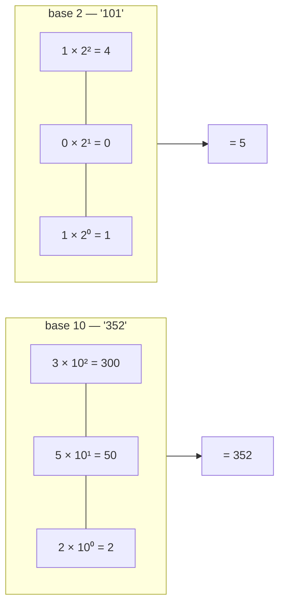

Change the base and only the "× how much per step" changes:

| Base | Name | Digits | Step per position | Used by |
|------|------|--------|-------------------|---------|
| 10 | decimal | `0`–`9` | ×10 | humans |
| 2 | binary | `0`, `1` | ×2 | the hardware (the actual bits) |
| 16 | hexadecimal | `0`–`9`, `A`–`F` | ×16 | humans, as shorthand for binary |
| 8 | octal | `0`–`7` | ×8 | a few legacy corners |

A programmer lives in **base 10** (how we think), **base 2** (what the machine stores), and **base 16** (a compact way to write base 2). But before the math, let's see where a bit *physically is*.

## Under the Hood: How a Bit Is Actually Stored

A bit is one **transistor** — an electrically controlled switch. A small voltage on its *gate* either lets current flow or not. We agree on a convention: **high voltage = `1`, low voltage = `0`** (recall from T01 why only two levels: they're easy to tell apart reliably).

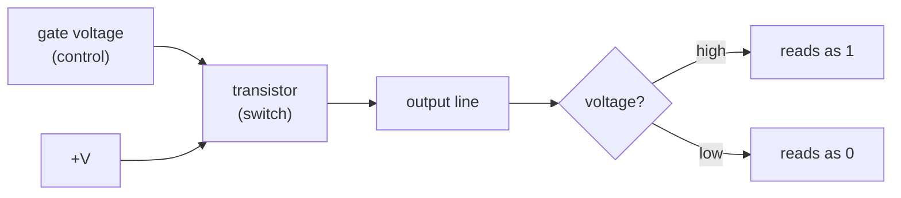

Different memory uses different transistor arrangements — this is *why* the memory hierarchy from T01 has the speeds it does:

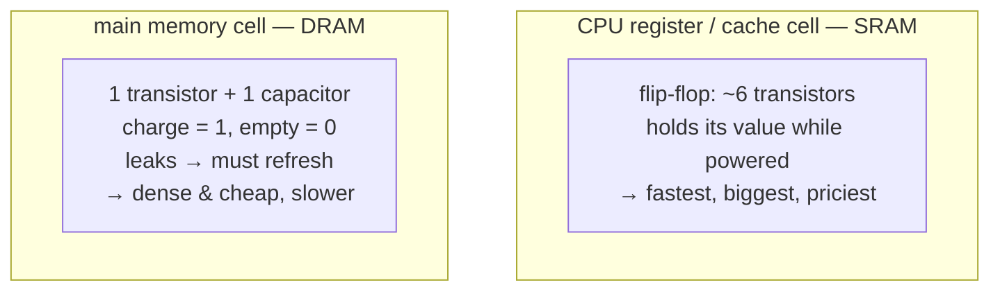

A single number doesn't sit in "a bit" — it spans **many** cells side by side. Eight cells make one **byte**; thirty-two flip-flops make a 32-bit **register**. Each byte in main memory has a numeric **address** (the "mailboxes" from T01):

```text
 a 32-bit register (32 flip-flops, one per bit):
 ┌──┬──┬──┬── … ──┬──┬──┬──┐
 │31│30│29│       │ 2│ 1│ 0│   ← bit positions
 └──┴──┴──┴── … ──┴──┴──┴──┘

 main memory (one byte per address):
 addr:  1000   1001   1002   1003
       ┌────┐ ┌────┐ ┌────┐ ┌────┐
       │byte│ │byte│ │byte│ │byte│   ← 8 bits each
       └────┘ └────┘ └────┘ └────┘
```

Keep this picture: when we "convert" or "add" numbers below, we are really setting and reading these cells, and pushing their voltages through gates.

## Binary (Base 2)

Binary has two digits, `0` and `1` — one per bit. Each position is worth twice the one to its right: `1, 2, 4, 8, 16, 32, 64, 128, …`.

### Reading Binary (binary → decimal)

Add up the place values wherever there is a `1`:

```text
 bit position:  7   6   5   4   3   2   1   0
 stored bit:    1   0   0   1   1   1   0   0
 place value: 128  64  32  16   8   4   2   1
               │           │   │   │
               └─ 128  +   16 + 8 + 4              = 156
```

So `10011100` = **156**. A `1` means "add this column's value." Each of those eight columns is one of the physical cells from the diagram above.

### Writing Binary (decimal → binary)

Go the other way by **repeatedly dividing by 2** and collecting remainders, read **bottom to top**:

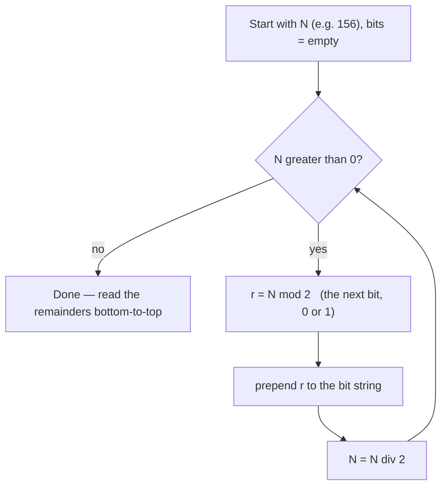

Worked for **156**:

| Step | N | N ÷ 2 | remainder (bit) |
|------|---|-------|-----------------|
| 1 | 156 | 78 | **0** |
| 2 | 78 | 39 | **0** |
| 3 | 39 | 19 | **1** |
| 4 | 19 | 9 | **1** |
| 5 | 9 | 4 | **1** |
| 6 | 4 | 2 | **0** |
| 7 | 2 | 1 | **0** |
| 8 | 1 | 0 | **1** |

Bottom-up: `1001 1100`. ✓

> [!TIP]
> Faster by hand: subtract the largest power of 2 that fits and mark a `1`. 156 → 128(`1`), leaves 28 → 16(`1`), leaves 12 → 8(`1`), leaves 4 → 4(`1`), leaves 0 → `10011100`.

### Counting and Bit Width

With **n bits** you can make **2ⁿ** distinct patterns — these widths are exactly Java's integer sizes:

| Bits | Patterns (2ⁿ) | Unsigned range | Java type |
|------|---------------|----------------|-----------|
| 8 | 256 | 0–255 | `byte` (as raw bits) |
| 16 | 65,536 | 0–65,535 | `short`, `char` |
| 32 | ~4.3 billion | 0 … ~4.29×10⁹ | `int` |
| 64 | ~1.8×10¹⁹ | 0 … ~1.8×10¹⁹ | `long` |

### Under the Hood: How the CPU *Adds* Two Binary Numbers

This is where T01's "gates build adders" becomes concrete. Adding one column of binary has only four cases — and they are exactly the outputs of an **XOR** gate (the sum bit) and an **AND** gate (the carry). That two-gate circuit is a **half-adder**:

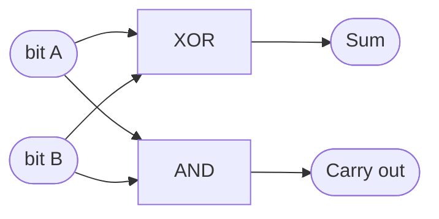

| A | B | Sum (A XOR B) | Carry (A AND B) |
|:-:|:-:|:-:|:-:|
| 0 | 0 | 0 | 0 |
| 0 | 1 | 1 | 0 |
| 1 | 0 | 1 | 0 |
| 1 | 1 | 0 | 1 |

But a real column also receives a **carry-in** from the column to its right, so we need three inputs. Chaining gives a **full-adder** (sum = A XOR B XOR Cin):

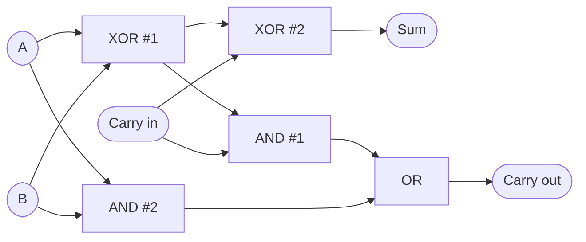

To add whole numbers, wire one full-adder per bit and feed each carry-out into the next bit's carry-in — a **ripple-carry adder**. This *is* the heart of the ALU from T01:

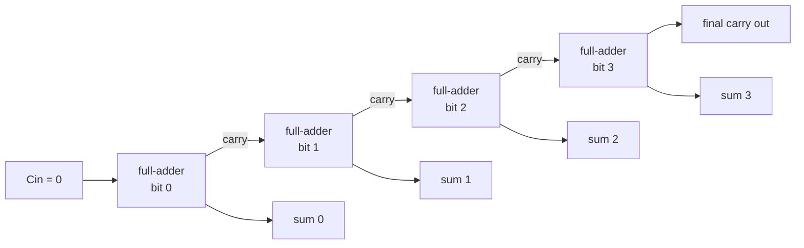

Watch the carry ripple through `1011 + 0110`:

```text
 carry:  1 1 1
         1 0 1 1     (11)
       + 0 1 1 0     ( 6)
       ─────────
       1 0 0 0 1     (17)
```

The voltages settle through these gates in a fraction of a nanosecond — *that* is what "the CPU added two numbers" physically means.

## Hexadecimal (Base 16)

### Why Hex Exists

Binary is correct but painful — `10011100` is easy to miscount. Because **16 = 2⁴**, one hex digit encodes exactly **four bits** (a *nibble*), so hex compresses binary 4×:

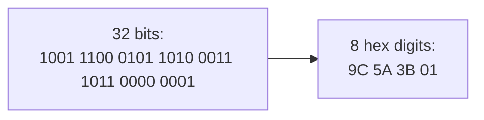

Hex needs 16 symbols, so after `9` it uses letters:

| Hex | Dec | Binary | Hex | Dec | Binary |
|----:|----:|:------:|----:|----:|:------:|
| 0 | 0 | 0000 | 8 | 8 | 1000 |
| 1 | 1 | 0001 | 9 | 9 | 1001 |
| 2 | 2 | 0010 | A | 10 | 1010 |
| 3 | 3 | 0011 | B | 11 | 1011 |
| 4 | 4 | 0100 | C | 12 | 1100 |
| 5 | 5 | 0101 | D | 13 | 1101 |
| 6 | 6 | 0110 | E | 14 | 1110 |
| 7 | 7 | 0111 | F | 15 | 1111 |

### Hex ↔ Binary (the nibble trick)

Because each hex digit *is* four bits, you convert by **grouping** — no arithmetic. Split the binary into 4-bit chunks from the right and translate each:

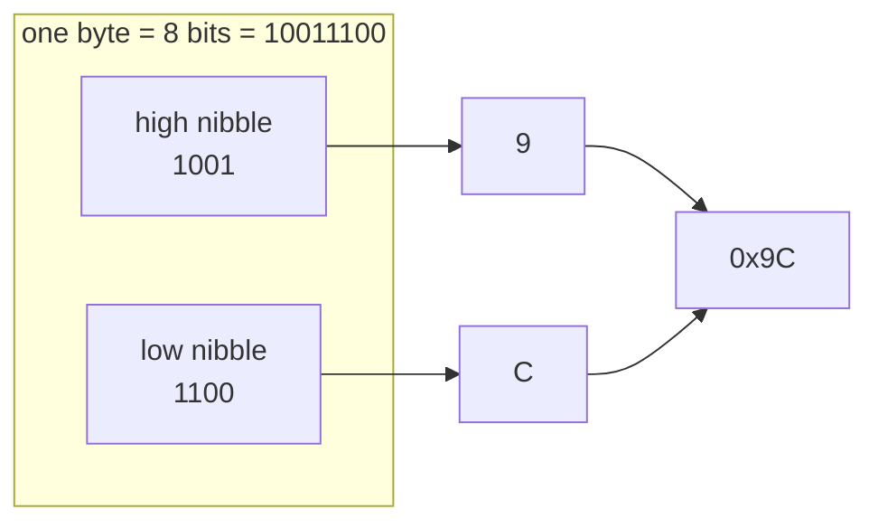

### Hex ↔ Decimal

Same positional rule, base 16 (place values `1, 16, 256, …`): `0x9C = 9×16 + 12 = 156`. Decimal → hex divides by 16: `156 ÷ 16 = 9 r 12 (C)` → `0x9C`. So `156` = `0b10011100` = `0x9C`.

### Under the Hood: Why Programmers See Hex in Memory Dumps

A debugger shows memory as hex because it maps cleanly onto bytes — two hex digits per byte. But a multi-byte number raises a question from T01: *in what order* are its bytes stored across addresses? That's **endianness**:

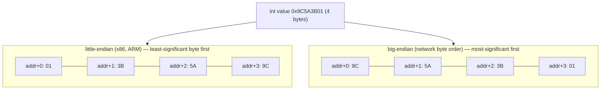

This is why a 4-byte integer written by one machine can read back byte-reversed on another (you met this note in T01). The JVM hides it from you, but you'll meet it the first time you parse a binary file or network packet.

## Octal and Writing Numbers in Java

### Octal (Base 8) — brief

`8 = 2³`, so one octal digit = **three bits**. Its main survivor is **Unix file permissions** (`chmod 755`, where `7 = 111` = read+write+execute):

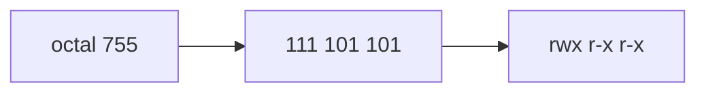

### Writing Numbers in Java (integer literals)

The same value can be written in any base — the *stored bits are identical*, only the notation differs:

```java
int a = 156;            // decimal
int b = 0b1001_1100;    // binary   (0b prefix, Java 7+)
int c = 0x9C;           // hex      (0x prefix; hex digits case-insensitive)
int d = 0234;           // OCTAL    (leading 0!) — also 156
// a == b && b == c && c == d  →  all true
```

Underscores (`0b1001_1100`, `1_000_000`) are **digit separators** — visual only, ignored by the compiler.

> [!WARNING]
> **The leading-zero octal trap.** A literal starting with `0` (with more digits) is **octal**. So `int x = 010;` is **8**, not 10, and `0123` is **83**. Never zero-pad an `int` literal unless you mean octal.

### Under the Hood: A Literal's Journey

Crucially, once compiled there are no characters `'1' '5' '6'` anywhere — only the bit pattern. Here is where `156` actually goes:

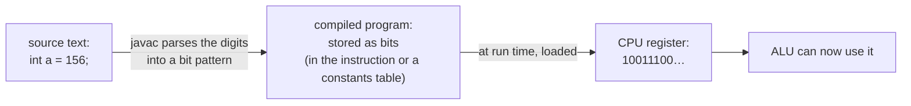

The base you wrote it in (`156`, `0x9C`, `0b…`) vanishes at compile time — it was only ever for *your* eyes. (The Java side of this chain is the subject of `L0/C01/T04`.)

### Converting and Printing in Java

```java
System.out.println(Integer.toBinaryString(156)); // "10011100"
System.out.println(Integer.toHexString(156));     // "9c"
System.out.println(Integer.toOctalString(156));   // "234"

System.out.println(Integer.parseInt("9C", 16));        // 156 (parse with a radix)
System.out.println(Integer.parseInt("10011100", 2));   // 156
System.out.println(Integer.decode("0x9C"));            // 156 (understands prefixes)
```

> [!TIP]
> `parseInt("0x9C", 16)` **fails** — `parseInt` wants bare digits. Use `Integer.decode(...)` when the string carries a `0x`/`0b`/`0` prefix.

## Negative Numbers: Two's Complement

T01 promised the full story here. With only bits and a fixed width, how do you store **−5**? You can't write a minus sign in hardware. The answer the whole industry uses is **two's complement** — and its genius is that it lets the *exact same adder circuit you just saw* also subtract.

### Why the Naive Idea Fails

The obvious **sign-magnitude** scheme reserves the top bit as a sign. It "works" but produces **two zeros** and needs special subtraction hardware:

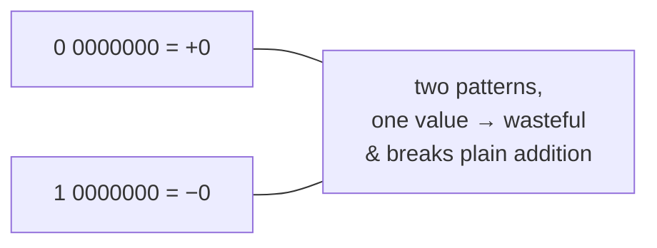

### The Rule, as a Bit Transformation

To get **−x**: **invert every bit, then add 1.** Negating `5` in 8 bits:

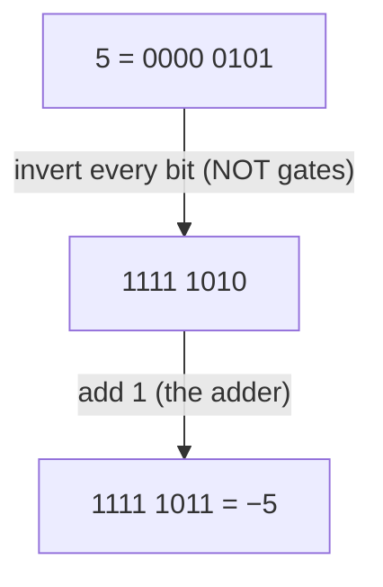

The most-significant bit still acts as a **sign bit** (`1` ⇒ negative), but the rest is this inverted-plus-one encoding, *not* a plain magnitude. Check via the formula: 8-bit `−5` should be `2⁸ − 5 = 251 = 11111011`. ✓

### Why It Works — the Number Wheel

Picture an 8-bit counter as an **odometer with 256 positions wrapped in a circle**. Counting up past 255 rolls to 0; counting down past 0 rolls to 255. Two's complement simply **relabels the top half as negatives**:

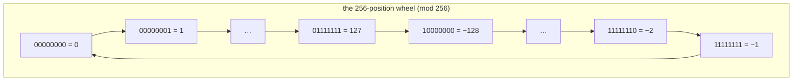

Because everything is **mod 2ⁿ**, ordinary addition just works for signed numbers, and **subtraction becomes "add the negative"**. Computing `7 + (−5)`:

```text
   0000 0111   ( 7)
 + 1111 1011   (−5)
 ───────────
 1 0000 0010   the carry-out off the top is simply discarded
   0000 0010   = 2   ✓
```

### Under the Hood: One Circuit That Adds *and* Subtracts

Here is the payoff. Put a **mode line M** (0 = add, 1 = subtract). Run each bit of B through an **XOR with M** (XOR-with-1 inverts a bit; XOR-with-0 leaves it). Feed M into the adder's carry-in. Now the single ripple-carry adder computes `A + B` when M = 0, and `A + (~B) + 1 = A − B` when M = 1:

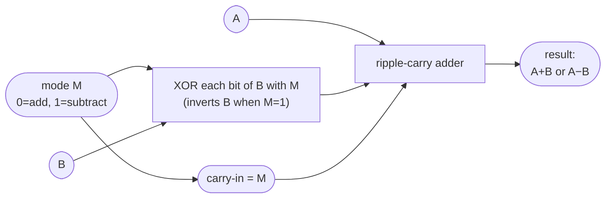

*This* is why two's complement won: **one adder, one zero, no special subtract unit.** Subtraction, comparison (`a < b` is "subtract and check the sign"), and negation all reuse this circuit.

### Java's Integer Types and Their Ranges

In n bits, two's complement covers **−2ⁿ⁻¹ … +2ⁿ⁻¹−1** — slightly asymmetric (one more negative than positive, since zero takes a positive slot). Every Java integer type is signed two's complement:

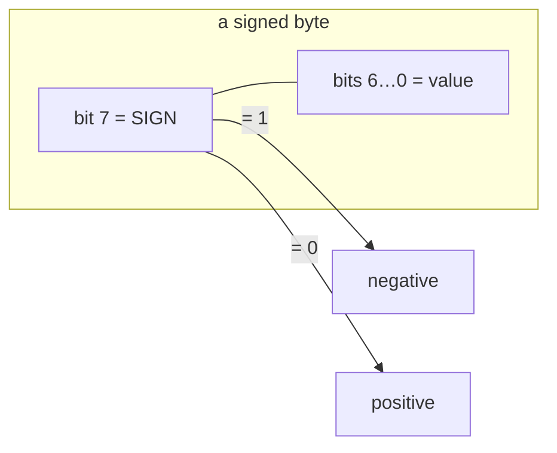

| Type | Bits | Range |
|------|-----:|-------|
| `byte` | 8 | −128 … 127 |
| `short` | 16 | −32,768 … 32,767 |
| `int` | 32 | −2,147,483,648 … 2,147,483,647 |
| `long` | 64 | −9.22×10¹⁸ … 9.22×10¹⁸ |
| `char` | 16 | **0 … 65,535 (unsigned!)** |

> [!IMPORTANT]
> `char` is the **one unsigned** integral type in Java (a 16-bit Unicode code unit, 0–65,535). Every *other* integer type is signed two's complement.

```java
System.out.println(Integer.toBinaryString(-1)); // 32 ones
System.out.println(~5);                           // -6   (~x == -x - 1)
```

### Under the Hood: Sign Extension When Widening

When a narrow signed value is copied into a wider one (`byte` → `int`), the hardware can't just pad with zeros — that would turn `−1` into `255`. It **replicates the sign bit** to preserve the value:

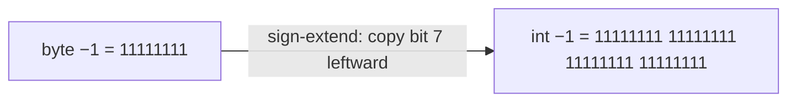

This is why reading a raw byte as unsigned needs a mask:

```java
byte b = (byte) 0xFF;     // -1   (sign bit set)
int signed = b;            // -1   (sign-extended)
int unsigned = b & 0xFF;   // 255  (mask keeps only the low 8 bits)
```

> [!WARNING]
> Sign extension is the #1 bug when reading bytes from files or networks: a byte `0xFF` becomes `int` `−1`, not `255`. Always `b & 0xFF` to get the 0–255 value.

## Overflow and Wrap-Around

T01 showed `Integer.MAX_VALUE + 1` going negative; now you can see *why* in the circuit. The adder is fixed-width, so a carry off the top bit is **discarded** — the value wraps around the number wheel, **mod 2ⁿ**:

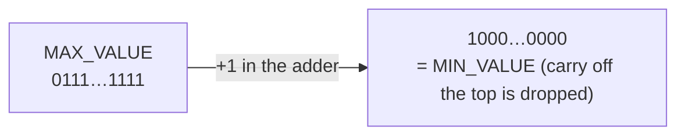

The CPU records this in the **flags register** from T01: the adder produces a **carry flag** (unsigned overflow) and an **overflow flag** (signed overflow = carry-into-sign-bit XOR carry-out-of-sign-bit):

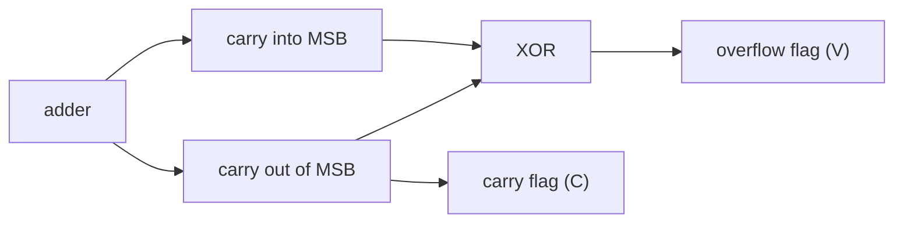

```java
int max = Integer.MAX_VALUE;        // 2147483647 = 0x7FFFFFFF
System.out.println(max + 1);         // -2147483648 = 0x80000000 (wrapped)
System.out.println(Math.abs(Integer.MIN_VALUE)); // -2147483648 (still negative!)
int safe = Math.addExact(max, 1);    // throws ArithmeticException instead of wrapping
```

> [!WARNING]
> Overflow is silent by default. `int ms = days * 24 * 60 * 60 * 1000;` overflows above ~24 days with no error. Use `long`, or `Math.*Exact`, when a value can be large.

> [!NOTE]
> **Going deeper — beyond 64 bits.** When even `long` overflows, `java.math.BigInteger` gives arbitrary-precision integers (limited only by memory) by storing the number across an array of words and doing grade-school carry in software — no fixed width, so no wrap, at the cost of speed. You'll meet it in L1.

## Basic Bit Math: The Bitwise Operators

Sometimes you operate on the bits *themselves* — pack flags into one integer, read a color channel, test evenness. Java's **bitwise operators** are, in hardware, just **banks of gates run across every bit in parallel**.

### AND, OR, XOR, NOT

| A | B | `A & B` | `A \| B` | `A ^ B` |
|:-:|:-:|:----:|:----:|:----:|
| 0 | 0 | 0 | 0 | 0 |
| 0 | 1 | 0 | 1 | 1 |
| 1 | 0 | 0 | 1 | 1 |
| 1 | 1 | 1 | 1 | 0 |

A 4-bit `AND` is literally four AND gates side by side, one per bit lane — no carries, so it's instantaneous:

```mermaid
flowchart LR
  a3["A.3"] --> g3["AND"] --> r3["R.3"]
  b3["B.3"] --> g3
  a2["A.2"] --> g2["AND"] --> r2["R.2"]
  b2["B.2"] --> g2
  a1["A.1"] --> g1["AND"] --> r1["R.1"]
  b1["B.1"] --> g1
  a0["A.0"] --> g0["AND"] --> r0["R.0"]
  b0["B.0"] --> g0
```

`~` (NOT) flips every bit via an inverter per lane; in two's complement that means `~x == -x - 1` (so `~0 == -1`).

```java
int x = 12, y = 10;          // 1100 and 1010
System.out.println(x & y);    // 8   (1000) — set in BOTH
System.out.println(x | y);    // 14  (1110) — set in EITHER
System.out.println(x ^ y);    // 6   (0110) — bits that DIFFER
System.out.println(~x);       // -13        — every bit flipped
```

### Shifts: `<<`, `>>`, `>>>`

A shift slides every bit left or right. In hardware a **barrel shifter** (a grid of multiplexers) moves all bits in one pass — which is why shifting is as cheap as one operation, not a loop:

```mermaid
flowchart LR
  In["bits: b3 b2 b1 b0"] -->|"left shift by 1"| L["b2 b1 b0 0  (a 0 shifts in on the right)"]
  In -->|"right shift by 1"| R["fill the top, then b3 b2 b1"]
```

What fills the vacated top bits is the whole difference between the two right-shifts:

| Operator | Name | Fills with | Effect |
|----------|------|------------|--------|
| `<<` | left shift | `0` on the right | ×2ᵏ (within range) |
| `>>` | **arithmetic** (signed) right | copies of the **sign bit** | ÷2ᵏ, sign preserved |
| `>>>` | **logical** (unsigned) right | `0` | shifts in zeros regardless of sign |

```mermaid
flowchart TB
  Neg["−8 = 11111000"]
  Neg -->|"arithmetic right shift (copies sign)"| AR["11111100 = −4"]
  Neg -->|"logical right shift (fills 0)"| LR["01111100 = 124"]
```

```java
System.out.println(1 << 4);     // 16
System.out.println(-8 >> 1);     // -4   sign bit copied in
System.out.println(-8 >>> 28);   // 15   zero-filled
```

> [!WARNING]
> **The shift count wraps.** For `int`, only the low **5 bits** of the count are used (count mod 32); for `long`, the low 6 (mod 64). So `1 << 32` is **`1`**, not `0` (because `32 % 32 == 0`).

### Common Bit Idioms (and the masking mechanism)

The workhorse is **masking**: `AND` with a *mask* keeps only the bits the mask has set, zeroing the rest — exactly how you extract one field from a packed integer:

```mermaid
flowchart LR
  Val["value:  1001 1100"] --> A["AND"]
  Mask["mask:   0000 1111"] --> A
  A --> Out["result: 0000 1100  (kept only the low 4 bits)"]
```

```java
int flags = 0b1001_1100;                 // 156
boolean isSet = ((flags >> 2) & 1) == 1; // test bit 2          -> true
int set       = flags | (1 << 0);        // set   bit 0         -> 157
int cleared   = flags & ~(1 << 2);       // clear bit 2         -> 152
int toggled   = flags ^ (1 << 1);        // toggle bit 1        -> 158
boolean even  = (flags & 1) == 0;        // even? (test bit 0)  -> true
boolean pow2  = (16 & (16 - 1)) == 0;    // power of two?       -> true
int ones      = Integer.bitCount(flags); // count set bits      -> 4
int lowestSet = flags & -flags;          // isolate lowest 1    -> 4
```

### Under the Hood: Where a Bitwise Op Happens

`flags & mask` follows the same path as any arithmetic — both operands ride into the ALU's logic unit, the per-bit gates fire, the result lands back in a register (this is the fetch-decode-execute cycle from T01, with the ALU doing logic instead of addition):

```mermaid
flowchart LR
  M1["flags (in a register)"] --> ALU["ALU — bitwise unit (gate bank)"]
  M2["mask (in a register)"] --> ALU
  ALU --> R["result register"]
  R -->|"store"| Mem["back to memory / variable"]
```

> [!WARNING]
> **Precedence trap.** Bitwise operators bind **looser** than `==`. So `if (n & 1 == 0)` parses as `n & (1 == 0)` — which won't even compile in Java (`int & boolean`) and silently misbehaves in C. Always parenthesize: `if ((n & 1) == 0)`.

> [!INTERVIEW]
> Bit manipulation is interview bread-and-butter. Be ready to: check a power of two `(n & (n-1)) == 0`; count set bits (`Integer.bitCount` or the `n &= n-1` Kernighan loop); swap two ints without a temp (`a^=b; b^=a; a^=b;`); and find the unique number when all others appear twice (XOR everything — duplicates cancel). Knowing *why* each works (e.g. `n & (n-1)` clears the lowest set bit) is the real test.

## Practice

1. **Read binary.** Convert `00101010` and `11111111` to decimal by place value. How many values can 12 bits represent?
2. **Write binary.** Convert `200` to 8-bit binary with the divide-by-2 method; show the remainder table.
3. **Hex fluency.** Convert `0xB4` to binary (nibble trick) and to decimal; then convert decimal `90` to hex.
4. **Trace the adder.** Using full-adders, add `0110 + 0111` bit by bit, writing each column's carry-in, sum, and carry-out. What's the decimal result?
5. **Predict the output.**
   ```java
   System.out.println(0b1010 + 0x0A);   // (a)
   int z = 020;                          // (b) value of z?
   System.out.println(1 << 5);           // (c)
   System.out.println(-16 >> 2);         // (d)
   ```
6. **Explain the mechanism.** In your own words, how does *one* adder circuit perform subtraction? What roles do the XOR-with-M gates and the carry-in play?
7. **Negate by hand.** Show the 8-bit two's-complement pattern for `−20` (invert-and-add-1); verify with the `2ⁿ − x` formula.
8. **Overflow & flags.** Explain, using the number wheel and the discarded carry, why `Integer.MAX_VALUE + 1` is negative, and why `Math.abs(Integer.MIN_VALUE)` stays negative.
9. **Bitwise trace.** With `a = 0b1100`, `b = 0b1010`, compute `a & b`, `a | b`, `a ^ b`, and `~a` (give `~a` in decimal).
10. **Shifts.** Predict `-1 >> 1`, `-1 >>> 1`, and `1 << 32`; explain each using the fill rules.
11. **Masking.** Write expressions to (a) extract the low 4 bits of `n`, (b) test whether bit 3 is set, (c) clear bit 0.
12. **The byte gotcha.** `byte b = (byte) 200;` — what is `(int) b`, and what is `b & 0xFF`? Explain via sign extension.

## Recap

You should now be able to:

- Explain **positional notation** and read/write **binary** (both directions) and state how many values **n bits** hold.
- Describe, with the picture, **how a bit is physically stored** (transistor voltage; SRAM flip-flop vs DRAM capacitor) and how bits group into **registers and addressed bytes**.
- Explain **how the CPU adds** binary using **half-adders, full-adders, and a ripple-carry chain** built from XOR/AND/OR gates.
- Use **hexadecimal** as compact binary (the nibble trick), convert across bases, and explain why memory dumps use hex and what **endianness** is.
- Recognize **octal**, write Java integer literals in every base (avoiding the octal trap), and trace a **literal's journey** from source text to bits in a register.
- Explain **two's complement** as a bit transformation and as the number wheel, **and how one adder+XOR circuit does both addition and subtraction**, plus the asymmetric ranges and `char` being the lone unsigned type.
- Explain **sign extension** when widening, and why reading a byte unsigned needs `& 0xFF`.
- Explain **overflow/wrap-around** as the discarded carry (mod 2ⁿ) and how the **carry/overflow flags** are set, plus `Math.addExact`/`long`/`BigInteger`.
- Apply the **bitwise operators** knowing they are **parallel gate banks**, use **masking/shifts** and the standard idioms, and avoid the shift-count and precedence traps.

## Next

Continue to [What Is a Programming Language; Compiled vs Interpreted](./T03-what-is-a-programming-language-compiled-vs-interpreted.md).
