# What Is a Programming Language; Compiled vs Interpreted

In [How Computers Run Programs](./T01-how-computers-run-programs-cpu-memory-binary.md) you saw that a CPU understands exactly one thing — **machine code**, raw bits run through logic gates — and that *assembly* is only a thin shorthand for it. Nobody builds real software by hand-writing those instructions; we write in a **programming language** and let a *translator* turn it into something the machine can run. This topic answers two questions that confuse almost every beginner — **what a programming language actually is**, and **what "compiled" vs "interpreted" really means** — but it does so **under the hood**: what a compiler *does* internally (the stages your code passes through), what an interpreter's *loop* looks like, **where your code lives in memory** in each case, and how both ultimately reach the gates. Every step has a diagram.

> [!NOTE]
> Prerequisite: [How Computers Run Programs](./T01-how-computers-run-programs-cpu-memory-binary.md) (`L0/C01/T01`) — machine code, assembly, the **fetch–decode–execute** cycle, the process **memory layout** (code/data/heap/stack), the JVM, and the JIT. We lean on all of these.

## Why Not Just Write Machine Code?

Recall the `2 + 3` program from `L0/C01/T01`: in machine code it's bit patterns; in assembly, a few `LOAD`/`ADD`/`STORE` lines. Writing a *real* program that way is impossible for four reasons: it's **unreadable** (bits carry no intent), **not portable** (machine code is tied to one CPU family — x86 code won't run on ARM), **unproductive** (one high-level line stands for dozens of instructions), and **unsafe** (nothing protects you from corrupting memory).

So we invented **programming languages** — readable notations — plus **translators** that convert them down toward the hardware. That's a *ladder of abstraction*: the higher you stand, the more readable and portable, but the more translation must happen before the CPU can run it.

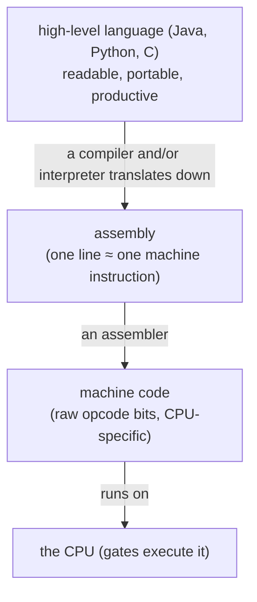

This topic lives at the top rung: high-level languages, and the two ways their translators work.

## Under the Hood: What a Language Actually Is

A programming language is defined by two things. Its **syntax** is the grammar — which arrangements of symbols are legal. Its **semantics** is the meaning — what those arrangements *do*. Your source code is, physically, just **plain text** (bytes encoding characters, as you saw in T01). A translator's first job is therefore to check that text against the grammar, then carry out its meaning:

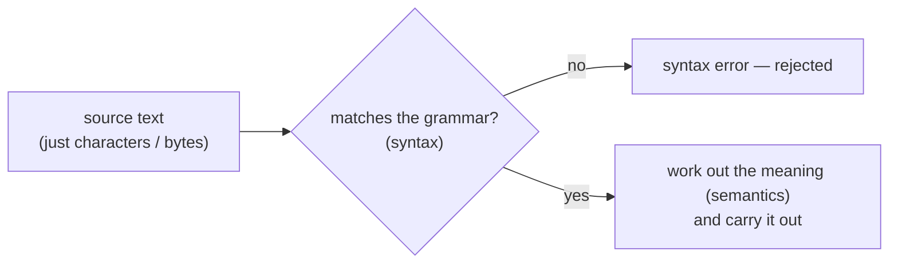

That "matches the grammar?" check is the source of every *syntax error* you'll ever see. What happens *after* it — translate-everything-now, or do-it-as-we-read — is the compiled-vs-interpreted split.

## The Two Strategies: Compile or Interpret

A simple analogy captures the whole difference:

> You have a French book and read only English. **Compiling** is hiring a translator to render the *entire book* into English once, up front; afterward you read the fast English copy alone, no translator present. **Interpreting** is a live translator reading you each French sentence in English *as you go* — no English copy is ever made, and the translator must be there *every* time you "run" the book.

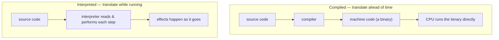

**Compilation:** a *compiler* reads your whole program ahead of time and produces a runnable machine-code **binary**; you ship and run that, compiler no longer needed (C, C++, Go, Rust).

```bash
$ gcc hello.c -o hello   # compile once: source -> a native binary
$ ./hello                # run the binary directly on the CPU
```

**Interpretation:** an *interpreter* is itself a running program that reads your source and **executes it directly**, each time you run it; no machine-code file is produced (Python, Ruby, classic JavaScript, shell).

```bash
$ python3 hello.py       # the interpreter reads the source and runs it on the spot
```

### The Trade-offs

| Dimension | Compiled (to native) | Interpreted |
|-----------|----------------------|-------------|
| **Run speed** | Fast — translation already done | Slower — translating while running |
| **Startup** | Instant (just run the binary) | Must spin up the interpreter |
| **Portability** | Binary tied to one CPU/OS | Runs anywhere the interpreter exists |
| **When errors surface** | Many at **compile time**, before running | Often at **run time**, when the line executes |
| **Edit→run loop** | Slower — rebuild after each change | Fast — just run again |
| **What you ship** | A binary (source can stay private) | Usually the source |

That "when errors surface" row matters in practice. Because a compiler inspects the whole program before anything runs, it rejects whole classes of mistakes early:

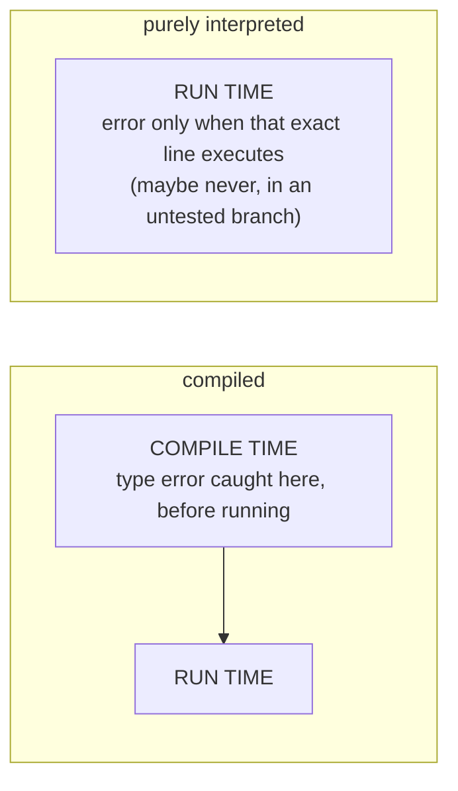

```java
public class Errors {
    public static void main(String[] args) {
        int x = "hello";   // compile-time error: javac refuses — incompatible types
    }
}
```

## Under the Hood: Inside a Compiler

A compiler is not one magic step — it's a **pipeline of phases**, each transforming your program into a more machine-ready shape. Knowing these stages demystifies error messages and makes the next topic (Java's chain) obvious:

```mermaid
flowchart LR
  Src["source text:<br/>x = b + 2;"] --> Lex["1. lexer / tokenizer"]
  Lex --> Tok["tokens:<br/>[id x] [=] [id b] [+] [num 2] [;]"]
  Tok --> Par["2. parser"]
  Par --> AST["3. AST (a tree)"]
  AST --> Sem["4. semantic analysis<br/>(type-check, symbol table)"]
  Sem --> IR["5. intermediate representation"]
  IR --> Opt["6. optimizer"]
  Opt --> Gen["7. code generator"]
  Gen --> Out["machine code / bytecode"]
```

- **Lexer (tokenizer)** chops the raw character stream into **tokens** — the "words" of the language (an identifier, an operator, a number). `x = b + 2;` becomes six tokens.
- **Parser** checks those tokens against the grammar and builds an **Abstract Syntax Tree (AST)** — the sentence's structure as a tree. Operator precedence lives here (which is why `b + 2 * 3` groups the `*` first). For `x = b + 2`:

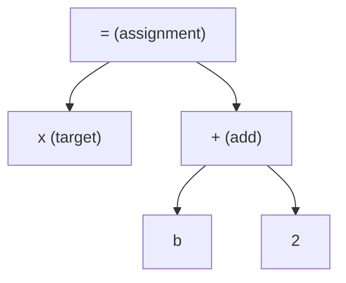

- **Semantic analysis** walks the tree to check *meaning*: do the types match, is `b` actually declared? A **symbol table** tracks every name and its type. This is where `int x = "hello";` is rejected.
- **IR + optimizer** rewrite the program into a simpler internal form and improve it (fold constants, drop dead code).
- **Code generator** emits the final target — native machine code, or, for Java, **bytecode**.

> [!TIP]
> You can *see* a compiler's earlier-vs-later stages in the errors it gives: a "`;` expected" is the **parser** complaining about structure; an "incompatible types" is **semantic analysis** complaining about meaning.

## Under the Hood: Inside an Interpreter

An interpreter never produces a machine-code file. It is itself a program (already compiled to machine code) that sits in a **loop** — and that loop is the software twin of the CPU's **fetch–decode–execute** cycle from T01:

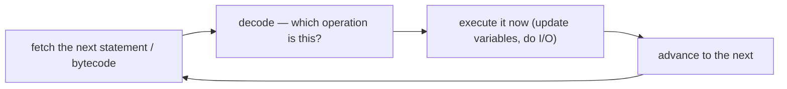

The crucial difference from compiled code is **what sits in memory** while the program runs. Lay both out using T01's process memory layout (code / data / heap / stack):

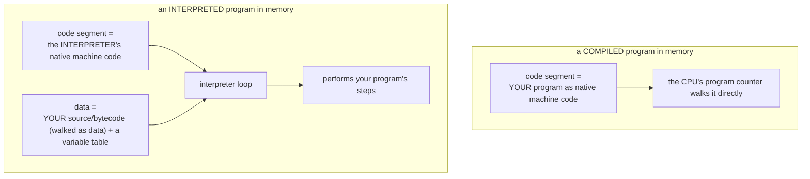

In the compiled case, *your* code **is** the machine code the CPU executes. In the interpreted case, the **interpreter** is the machine code the CPU executes, and *your* program is just **data** it reads and acts upon — which is exactly why it's slower (every step pays for the fetch-decode-dispatch overhead) and why the interpreter must be present each run.

### Both Bottom Out at the Gates

Either way, the silicon only ever runs machine code through logic gates (T01). The real distinction is **when** translation happens and **what is in memory** as a result:

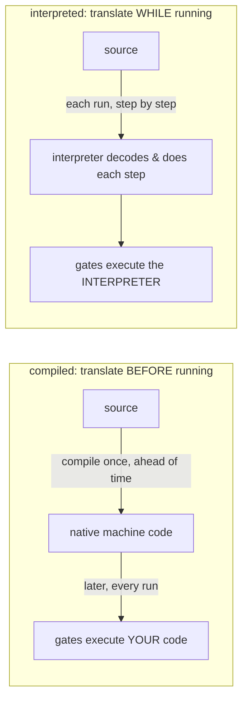

## It's a Spectrum, Not a Switch

Most real languages are **hybrids**, and the cleanest middle — the one Java uses — is **bytecode running on a virtual machine.**

- **Bytecode** is a compact, CPU-independent instruction set: "machine code for an *imaginary* machine" (the idea from T01). You compile to it *ahead of time*, but it's tied to no real chip.
- A **virtual machine (VM)** is a program that runs that bytecode. It can **interpret** it, and use a **JIT (Just-In-Time) compiler** to translate the **hot** (frequently run) parts into real native code *while the program runs*.
- **AOT (Ahead-Of-Time)** compilation instead turns bytecode/source straight into a native binary *before* running — trading portability for instant startup.

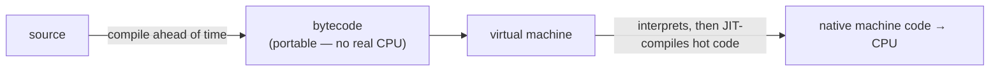

The JIT is worth seeing in motion, because it's *why* a "VM language" can be fast. The VM interprets at first while a **profiler** counts how often each method runs; once a method gets hot, the **JIT** compiles it to native code stored in a **code cache** in memory, and future calls jump straight to that fast native code:

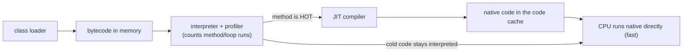

> [!IMPORTANT]
> **Compiled vs interpreted is a property of the *implementation*, not the *language*.** "Is C compiled?" — usually, but C interpreters exist. "Is Python interpreted?" — usually, yet Python is first compiled to bytecode internally, and can be compiled to native. A language is just rules on paper; *how you choose to run it* is what's compiled or interpreted — and it's frequently **both**.

> [!NOTE]
> **Going deeper — more points on the spectrum.** A **transpiler** (source-to-source compiler) translates one high-level language to another — TypeScript → JavaScript — not to machine code. A **REPL** is an interactive interpreter you type into line by line. And even "interpreted" CPython compiles your `.py` to `.pyc` **bytecode** first, then interprets *that* — the same shape as Java, with the compile step hidden. The categories blur on purpose.

## Where Java Fits

Java deliberately sits in that hybrid sweet spot — it is **both compiled and interpreted**:

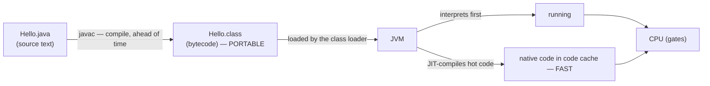

1. You write **source** in `Hello.java` (plain text).
2. **`javac`** runs the compiler pipeline above and emits **bytecode** (`Hello.class`) — portable, tied to no real CPU.
3. The **JVM** loads that bytecode and runs it: **interpreting** first, then **JIT-compiling** the hot paths to native machine code.

```bash
$ javac Hello.java   # compile: source  ->  Hello.class (bytecode)
$ java Hello         # the JVM loads the bytecode and runs it
```

Compiling to **bytecode** (not native) keeps Java **portable** — the same `.class` runs on an x86 server and an ARM laptop because only the JVM is rebuilt per platform ("write once, run anywhere"). Adding the **JIT** recovers most of native's **speed** for long-running programs.

### Under the Hood: Bytecode Is Stack-Based

What *is* in a `.class` file? Stack-machine instructions that push and pop an **operand stack**. You can look directly with `javap -c`. For this method:

```java
int add(int a, int b) {
    return a + b;
}
```

```text
$ javap -c Example.class
  int add(int, int);
    Code:
       0: iload_1      // push parameter a onto the operand stack
       1: iload_2      // push parameter b
       2: iadd         // pop the top two, push their sum
       3: ireturn      // return the value on top of the stack
```

Watch the operand stack while running `add(5, 3)` — *this* is what "the JVM interprets bytecode" concretely means:

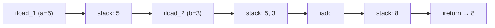

When this method gets hot, the JIT turns those four bytecodes into a couple of native instructions (a register add) — the same `ADD` you traced in T01. (The full Java chain, class files, and the JVM's runtime areas are the subject of `L0/C01/T04` and L3.)

> [!WARNING]
> **"Java is slow because it's interpreted."** Outdated folklore. The JVM JIT-compiles hot code to native, so steady-state Java is often within a small factor of C. What Java *does* pay is **startup/warm-up** (interpreting before the JIT kicks in) and memory for the VM. Drop the "compiled = always fast, interpreted = always slow" oversimplification.

> [!INTERVIEW]
> **"Is Java compiled or interpreted?"** — Both. `javac` compiles source to platform-independent **bytecode** ahead of time; the **JVM** interprets that bytecode and **JIT-compiles** hot parts to native at runtime. Follow-ups: **"Compiler vs interpreter?"** (compiler translates the whole program up front, producing output to run later; interpreter executes the source directly, each run); **"Why bytecode, not native?"** (portability — one artifact runs on any CPU with a JVM); **"What does the JIT buy?"** (near-native speed for hot code, without giving up portability).

> [!NOTE]
> **Going deeper — other ways languages differ.** "Compiled vs interpreted" is one axis. Languages also vary by **typing** (static like Java, checked at compile time, vs dynamic like Python — L1/L2) and **paradigm** (imperative, object-oriented, functional — Java is primarily OO, L1). Those are separate from *how the code is translated*, and each has its own later topics.

## Practice

1. **In your own words.** Explain to a non-programmer why we write in languages like Java instead of machine code — give three distinct reasons tied to the abstraction ladder.
2. **Compiler vs interpreter.** Using the book-translation analogy, state the difference and two practical consequences of each (speed, portability, when errors appear).
3. **Trace the compiler.** For `total = price + 2;`, list the **tokens** the lexer produces, then sketch the **AST** the parser builds. Which phase would catch it if `price` was never declared?
4. **Explain the mechanism.** Describe an interpreter's main **loop** and how it mirrors the CPU's fetch–decode–execute cycle. Why is interpreting generally slower than running compiled native code?
5. **Memory layout.** In your own words: when a *compiled* program runs, what's in the code segment? When an *interpreted* program runs, what's in the code segment, and where does *your* program live? Why must the interpreter be present every run?
6. **Trace the stack.** Hand-execute the bytecode `iload_1; iload_2; iadd; ireturn` for `add(7, 4)`, writing the operand stack after each instruction.
7. **The hybrid.** List the steps from `Hello.java` to instructions on the CPU, naming `javac`, bytecode, the class loader, the JVM interpreter, the profiler, and the JIT/code cache. Which step gives portability, and which gives speed?
8. **Bust the myth.** A teammate says "Java is slow because it's interpreted." Give an accurate one-paragraph correction that mentions the JIT.
9. **Implementation, not language.** Explain the claim "compiled vs interpreted is a property of the implementation, not the language," with one supporting example.

## Recap

You should now be able to:

- Explain **why** we use programming languages instead of machine code, and place machine code, assembly, and high-level languages on a **ladder of abstraction**.
- Define a language by its **syntax** and **semantics**, and explain that source code is just text a translator checks (the origin of syntax errors).
- Explain what a **compiler** and an **interpreter** each do (the translate-the-whole-book vs live-translator analogy) and compare their **trade-offs**, including *when errors surface*.
- Describe the **phases inside a compiler** — lexer → parser → **AST** → semantic analysis → IR/optimizer → code generator — and what each does.
- Describe the **interpreter loop** as the software twin of fetch–decode–execute, and explain — using the **process memory layout** — what sits in memory in the compiled vs interpreted case and why interpreting is slower.
- Explain the **spectrum**: **bytecode + VM**, the **JIT** mechanism (profiler → hot method → code cache), **AOT**, transpilers — and that compiled-vs-interpreted is a property of the **implementation**.
- Describe precisely **where Java fits**: `javac` → portable **bytecode** → JVM interpret + JIT, why that's both portable *and* fast, how a **stack-based** bytecode method executes on the **operand stack**, and why "Java is slow because it's interpreted" is a myth.

## Next

Continue to [Source to Bytecode to JVM to Machine Code](./T04-source-to-bytecode-to-jvm-to-machine-code.md).
