# Source to Bytecode to JVM to Machine Code

[The previous topic](./T03-what-is-a-programming-language-compiled-vs-interpreted.md) showed *at a high level* that Java is both compiled and interpreted: `javac` makes bytecode, the JVM runs it and JIT-compiles the hot parts. Now we trace that chain **in full detail and under the hood** — what is actually *inside* a `.class` file, how bytecode uses an operand stack and local variables, how the JVM **loads and verifies** your classes, **where every value lives in memory** while the program runs (heap, per-thread stacks, the method area, the code cache), and how the execution engine turns stack-based bytecode into the register machine code from `L0/C01/T01`. We'll follow one tiny program the whole way down, with a diagram at every step.

> [!NOTE]
> Prerequisites: [How Computers Run Programs](./T01-how-computers-run-programs-cpu-memory-binary.md) (`L0/C01/T01`) — fetch–decode–execute, the process memory layout, registers; and [What Is a Programming Language](./T03-what-is-a-programming-language-compiled-vs-interpreted.md) (`L0/C01/T03`) — compiler phases, interpreter loop, the operand stack, the JIT.

> [!NOTE]
> **Going deeper, on purpose.** This is an L0 topic but it reaches into the JVM. The *core path* is followable by a beginner; the deepest internals (GC, JIT tiers, metaspace details) get their own full treatment in **L3**, and "Going deeper" sidebars here are safe to skim on a first read.

## The Whole Chain at a Glance

Here is the entire journey, from text you type to voltages switching in the CPU. The rest of the topic zooms into each box:

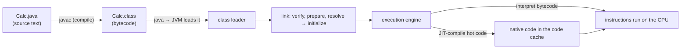

Our running example for the whole topic:

```java
public class Calc {
    public static void main(String[] args) {
        int result = add(5, 3);
        System.out.println(result);
    }
    static int add(int a, int b) {
        return a + b;
    }
}
```

## Step 1 — Source: Just Text

`Calc.java` is **plain text** — bytes encoding characters (T01). It is human-only; the CPU can do nothing with it directly. Everything below is about turning this text into runnable instructions and then running them.

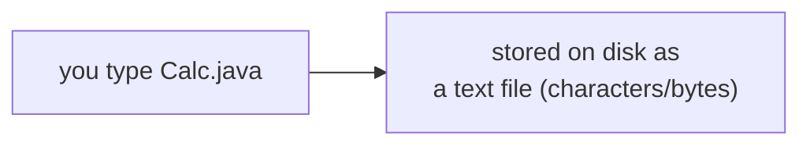

## Step 2 — `javac`: Source → Bytecode

`javac` is a **compiler** and runs the phase pipeline you met in T03 — lexer → parser → **AST** → semantic analysis (type-checking) → code generation — but its *output* is not native machine code. It emits **bytecode** into a `.class` file:

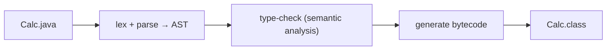

```bash
$ javac Calc.java     # produces Calc.class (bytecode), no native code yet
```

Crucially, `javac` does **little optimization** — it produces straightforward bytecode and leaves the heavy, machine-specific optimization to the JIT at runtime (it can't know your CPU yet). That division of labour is the whole reason Java is portable *and* fast.

## Under the Hood: Anatomy of a `.class` File

A `.class` file is a precisely-specified binary format — not random bytes. Its first four bytes are the **magic number `0xCAFEBABE`** (hex, from T02 — yes, really), which tells the JVM "this is a class file." After that comes structured metadata and the code:

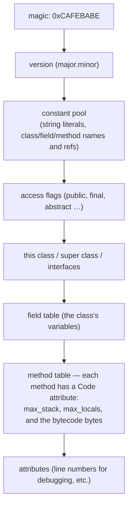

The **constant pool** is the class's shared table of constants and *symbolic references* — when bytecode mentions another method or field, it points into this pool by index (you'll see `#2`, `#3` below). You can dump all of this with `javap -v Calc.class`:

```text
$ javap -v Calc.class      (excerpt)
  magic: 0xCAFEBABE
  major version: 65            // Java 21
  Constant pool:
     #2 = Methodref   Calc.add:(II)I
     #3 = Fieldref    java/lang/System.out:Ljava/io/PrintStream;
     #4 = Methodref   java/io/PrintStream.println:(I)V
```

> [!NOTE]
> **Going deeper — descriptors.** `(II)I` means "takes two `int`s, returns an `int`"; `(I)V` means "takes one `int`, returns `void`" (`V`). These compact **type descriptors** are how the JVM records signatures. You rarely write them, but you'll see them in stack traces and tools.

## Under the Hood: Bytecode Is a Stack Machine

Real CPUs (T01) use **registers**. The JVM's bytecode instead uses an **operand stack** plus a **local variable array**, both living inside the method's *stack frame* (more on frames soon). Instructions push operands, an operation pops them and pushes its result. Look at our two methods with `javap -c`:

```text
$ javap -c Calc.class

static int add(int, int);
  Code:
     0: iload_0        // push local 0 (a) onto the operand stack
     1: iload_1        // push local 1 (b)
     2: iadd           // pop b and a, push a+b
     3: ireturn        // return the int on top of the stack

public static void main(java.lang.String[]);
  Code:
     0: iconst_5       // push 5
     1: iconst_3       // push 3
     2: invokestatic  #2   // call add(int,int) — pops 5,3; pushes result
     5: istore_1       // pop result into local 1 (result)
     6: getstatic     #3   // push System.out
     9: iload_1        // push result
    10: invokevirtual #4   // call println(int)
    13: return
```

Watch `add(5, 3)`'s operand stack evolve — *this* is the interpreter executing bytecode:

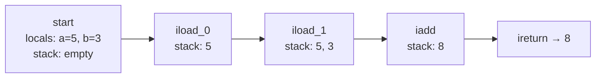

> [!NOTE]
> **Going deeper — why a stack, not registers?** A stack machine needs no decisions about *which* register to use, so bytecode stays tiny and totally portable across CPUs that have wildly different register counts. The JIT later maps the stack operations onto the real CPU's registers — getting register speed from portable stack code.

## Step 3 — The JVM Starts: Class Loading

Running `java Calc` launches the **JVM**, which must get `Calc.class` from disk into a usable in-memory form before a single instruction runs. That's **class loading**, and it has a defined lifecycle:

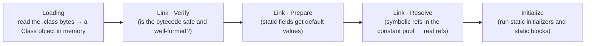

**Verification** is a safety gate unique to managed runtimes: before trusting bytecode (which might come from anywhere), the JVM proves it can't corrupt the stack, jump to invalid places, or violate types. This is a big reason Java is memory-safe where raw machine code is not.

Classes are found and loaded by a hierarchy of **class loaders** using **parent-delegation** — a loader asks its parent before trying itself, so core classes always come from the trusted bootstrap loader and can't be spoofed:

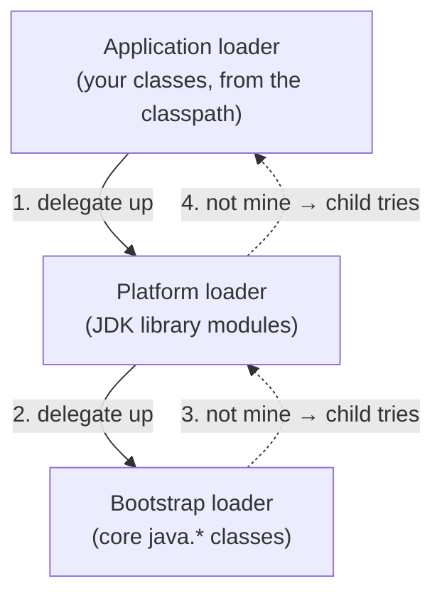

## Under the Hood: JVM Runtime Data Areas — Where Everything Lives

Once classes are loading, the JVM organizes memory into well-defined regions. These are the Java-specific refinement of the generic code/data/heap/stack layout from T01. Some are **shared by all threads**, some are **per-thread**:

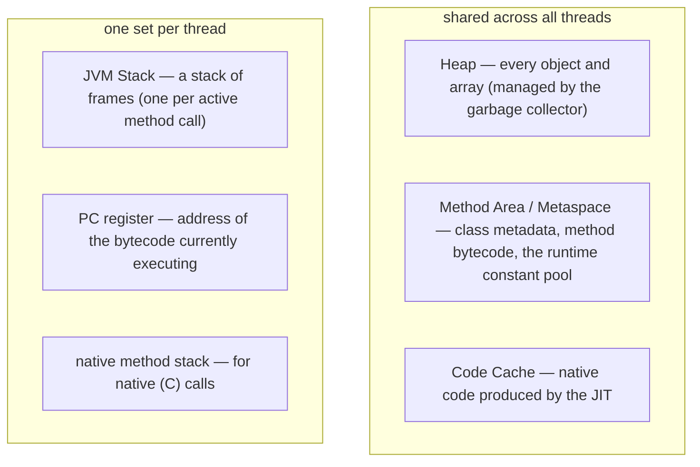

| Area | Shared or per-thread | Holds |
|------|----------------------|-------|
| **Heap** | shared | all objects and arrays; reclaimed by GC |
| **Method Area / Metaspace** | shared | class structures, method bytecode, runtime constant pool |
| **Code Cache** | shared | JIT-compiled native methods |
| **JVM Stack** | per thread | stack frames (locals + operand stack) |
| **PC register** | per thread | which bytecode instruction is next |
| **Native method stack** | per thread | state for calls into native code |

> [!NOTE]
> **Going deeper.** "Method Area" is the JVM *spec's* name; HotSpot (the standard JVM) implements it as **Metaspace** in native memory since Java 8 (it replaced the older fixed-size *PermGen*). The Heap and GC algorithms get their own deep topics in **L3**.

### A Stack Frame Up Close

Each method **call** gets a fresh **stack frame** pushed onto that thread's JVM stack. The frame holds exactly the per-call data the bytecode needs — the **local variable array** (parameters and locals) and the **operand stack** (the scratch space from above):

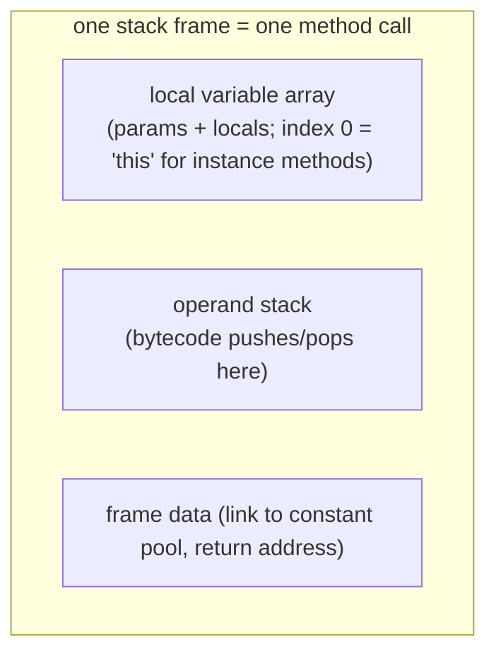

When `main` calls `add`, a **new frame for `add` is pushed**; when `add` returns, its frame is **popped** and the result is handed back to `main`'s operand stack. This is the JVM-level view of the call stack from T01 (and why deep recursion throws `StackOverflowError`):

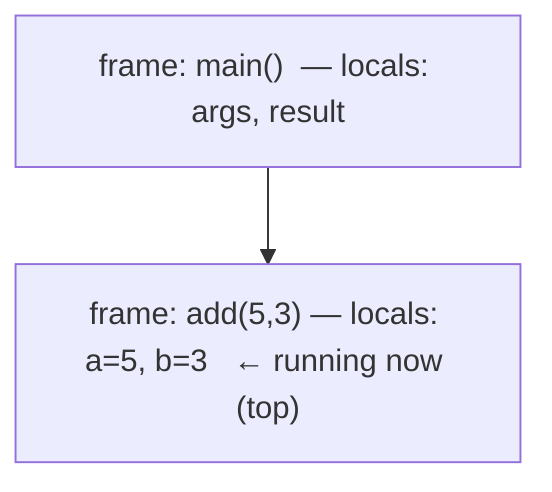

## Step 4 — Execution: Interpret First, Then JIT to Native

Now the execution engine runs the bytecode. It starts by **interpreting** — the loop from T03, which is the software twin of T01's fetch–decode–execute, walking instructions and operating the current frame's operand stack. Meanwhile a **profiler** counts how often each method runs and how often loops spin back.

When a method crosses a "hot" threshold, the **JIT compiler** translates its bytecode into native machine code for *your* CPU, stores it in the **code cache**, and redirects future calls there. HotSpot uses **tiered compilation** — quick-but-light C1 first, then heavily-optimized C2 for the hottest code:

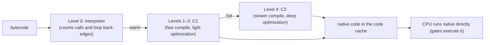

So our `add` method, once hot, stops being four interpreted bytecodes and becomes essentially the single register `ADD` you traced by hand in T01 — *the chain closes back onto the silicon.*

> [!NOTE]
> **Going deeper — deoptimization.** The JIT *speculates* (e.g. "this method is never overridden") to optimize hard. If a later class load breaks an assumption, the JVM can **deoptimize** — throw away that native code and fall back to the interpreter — then recompile. This is how Java stays both aggressively fast and correct. Full story in L3.

## Write Once, Run Anywhere

Because the portable artifact is **bytecode**, the *same* `Calc.class` runs on any platform that has a JVM — only the JVM (and the native code it generates) differs per CPU/OS. This is the promise from T01 and T03, now made concrete:

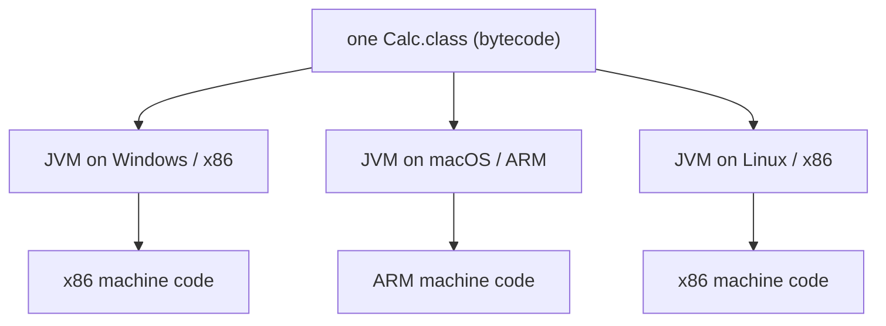

## End to End: Following `Calc` All the Way Down

Putting every step together for `java Calc`:

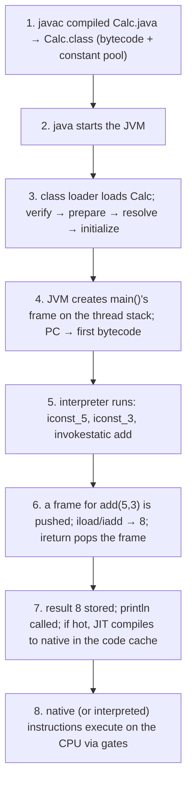

> [!WARNING]
> **"Compiling Java produces an `.exe`."** No — `javac` produces **bytecode**, not a native executable. You ship `.class`/`.jar` files and they need a JVM to run. (Tools like GraalVM `native-image` *can* AOT-compile to a native binary — the exception, not the default; see T03.)

> [!WARNING]
> **"The JVM just interprets, so it's slow."** After warm-up the JIT runs native code from the code cache (see T03's myth-bust). The interpreter is only the starting point, not the steady state.

> [!INTERVIEW]
> Common chain: **"What happens when you run `java Calc`?"** — JVM starts → class loader **loads** `Calc.class` → **links** (verify, prepare, resolve) → **initializes** → execution engine **interprets** the bytecode, the **JIT** compiles hot methods to native in the **code cache**. Follow-ups: **"What's in a `.class` file?"** (magic `0xCAFEBABE`, version, constant pool, fields, methods with Code attributes); **"Heap vs stack in the JVM?"** (objects on the shared heap; locals + operand stack in per-thread frames); **"Why is bytecode portable?"** (it targets the abstract JVM, not a real CPU).

## Worked Examples: Five Constructs from Source to Machine Code

Let's take five everyday constructs and follow each through the three layers. The **bytecode** is exactly what `javac` emits (reproduce it with `javap -c`). The **native assembly** is *representative* x86-64 (Intel syntax) of what the JIT might emit — simplified to the essence (real JIT output adds a method prologue, GC safepoints, and may pick different registers). A few instructions are annotated with their **machine-code bytes** to close the loop from assembly to raw hex.

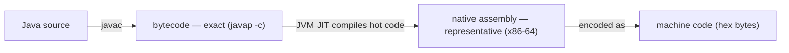

### 1. Loops — a `for` Loop

```java
// Sum 1 + 2 + ... + n
static int sumToN(int n) {
    int sum = 0;
    for (int i = 1; i <= n; i++) {
        sum += i;
    }
    return sum;
}
```

```text
BYTECODE (javap -c) — locals: 0=n, 1=sum, 2=i
 0: iconst_0          // push 0
 1: istore_1          // sum = 0
 2: iconst_1          // push 1
 3: istore_2          // i = 1
 4: iload_2           // ┐ loop test: push i
 5: iload_0           // │ push n
 6: if_icmpgt 19      // ┘ if i > n, jump OUT to offset 19
 9: iload_1           //   push sum
10: iload_2           //   push i
11: iadd              //   sum + i
12: istore_1          //   sum = result
13: iinc 2, 1         //   i++  (increment local 2 by 1, in place)
16: goto 4            //   jump back to the test
19: iload_1           // push sum
20: ireturn           // return sum
```

```nasm
; NATIVE x86-64 (representative).  n=edi, sum=eax, i=edx
  xor   eax, eax        ; sum = 0             ; bytes: 31 C0
  mov   edx, 1          ; i = 1
.Lcond:
  cmp   edx, edi        ; compare i, n        ; bytes: 39 FA
  jg    .Ldone          ; if i > n, exit      ; bytes: 7F 05
  add   eax, edx        ; sum += i            ; bytes: 01 D0
  inc   edx             ; i++                 ; bytes: FF C2
  jmp   .Lcond
.Ldone:
  ret                   ; return sum (in eax) ; bytes: C3
```

**What to notice:** a `for` loop is no special machine concept — exactly as T01 promised, it becomes a **compare + conditional jump + jump-back**. Bytecode (`if_icmpgt`/`goto`) and native code (`cmp`/`jg`/`jmp`) are the same shape; `iinc` is a dedicated in-place increment that becomes `inc`.

### 2. Functions — a Method Call

```java
static int square(int x)              { return x * x; }
static int sumOfSquares(int a, int b) { return square(a) + square(b); }
```

```text
BYTECODE — square(int): local 0 = x
0: iload_0            // push x
1: iload_0            // push x again
2: imul               // x * x
3: ireturn

BYTECODE — sumOfSquares(int,int): locals 0=a, 1=b
0: iload_0            // push a
1: invokestatic square   // call square(a) → result left on the stack
4: iload_1            // push b
5: invokestatic square   // call square(b)
8: iadd               // add the two results
9: ireturn
```

```nasm
; NATIVE x86-64 (representative).  args in edi, esi; return in eax
square:                 ; x in edi
  mov   eax, edi        ; eax = x           ; bytes: 89 F8
  imul  eax, edi        ; eax = x * x       ; bytes: 0F AF C7
  ret                   ;                   ; bytes: C3

sumOfSquares:           ; a=edi, b=esi
  call  square          ; jump in; CPU pushes a return address on the stack
  ; ... keep the result, pass b, call square again, then add ...
  ret
```

**What to notice:** a call is bytecode `invokestatic` → native `call` (pushes a return address and jumps) paired with `ret` (pops it and returns). Arguments ride in registers; the result comes back in `eax`.

> [!NOTE]
> **Going deeper — inlining.** `square` is tiny, so the JIT usually **inlines** it: `square(a) + square(b)` becomes `a*a + b*b` with *no* `call` at all. Eliminating call overhead for hot, small methods is one of the JIT's biggest wins.

### 3. Classes and Objects

```java
class Point {
    int x, y;
    Point(int x, int y) { this.x = x; this.y = y; }
    int sum() { return x + y; }
}
// usage elsewhere:
Point p = new Point(3, 4);
int s = p.sum();
```

```text
BYTECODE — creating and using the object
 0: new Point             // allocate a raw Point on the HEAP (fields zeroed)
 3: dup                   // duplicate the reference (one for <init>, one to keep)
 4: iconst_3
 5: iconst_4
 6: invokespecial <init>  // run the constructor on the new object
 9: astore_1              // p = reference
10: aload_1               // push p
11: invokevirtual sum     // p.sum()
14: istore_2              // s = result

BYTECODE — sum(): local 0 = this
0: aload_0                // push this
1: getfield Point.x       // this.x
4: aload_0
5: getfield Point.y       // this.y
8: iadd
9: ireturn
```

```nasm
; NATIVE x86-64 (representative).  object pointer in rbx
; a Point on the heap looks like: [ header ][ x ][ y ]   (offsets are JVM-specific)
  mov   dword [rbx+12], 3   ; this.x = 3   (putfield → store at obj+offset)
  mov   dword [rbx+16], 4   ; this.y = 4
  ; sum():
  mov   eax, [rbx+12]       ; load this.x  ; bytes: 8B 43 0C
  add   eax, [rbx+16]       ; + this.y → eax
  ret
```

**What to notice:** `new` allocates on the **heap** (T01); the object is a memory block of a header plus its fields. A field access (`getfield`/`putfield`) is a plain memory `mov` at `[object + offset]` — your `x`/`y` are just bytes at fixed offsets from the object pointer (T02's addresses, made real). `invokevirtual` dispatches to the method for the object's actual class.

### 4. Static vs Instance

```java
class Counter {
    static int count = 0;   // ONE shared copy, lives with the class
    int id;                 // one copy PER object, lives inside each object
    static void inc() { count++; }
}
```

```text
BYTECODE — inc(): a static method, so there is NO 'this'
0: getstatic Counter.count   // read the single shared field
3: iconst_1
4: iadd
5: putstatic Counter.count   // write it back
8: return
```

```nasm
; NATIVE x86-64 (representative)
; 'count' lives at a FIXED address (class static storage), not inside any object
  mov   eax, [rel Counter_count]   ; getstatic count
  inc   eax                         ; count + 1     ; bytes: FF C0
  mov   [rel Counter_count], eax    ; putstatic count
  ret
```

**What to notice — the static-vs-instance difference, visible in the machinery:**

| | Static (`count`, `inc`) | Instance (`id`, `sum`) |
|---|---|---|
| Bytecode field op | `getstatic` / `putstatic` | `getfield` / `putfield` |
| Where it lives | **fixed address** (class storage) | `[object + offset]`, per object |
| Bytecode call op | `invokestatic` | `invokevirtual` |
| Receives `this`? | **No** | Yes (local 0) |

A static member needs no object because it has one fixed home; an instance member is addressed *relative to* an object pointer — exactly why you call `Counter.inc()` but `point.sum()`.

### 5. if / else

```java
static int max(int a, int b) {
    if (a > b) {
        return a;
    } else {
        return b;
    }
}
```

```text
BYTECODE — locals 0=a, 1=b
0: iload_0            // push a
1: iload_1            // push b
2: if_icmple 7        // if a <= b, jump to the ELSE at offset 7
5: iload_0            // (then) push a
6: ireturn            // return a
7: iload_1            // (else) push b
8: ireturn            // return b
```

```nasm
; NATIVE x86-64 (representative).  a=edi, b=esi
  cmp   edi, esi        ; compare a, b        ; bytes: 39 F7
  jle   .Lelse          ; if a <= b → else    ; bytes: 7E 03
  mov   eax, edi        ; return a
  ret
.Lelse:
  mov   eax, esi        ; return b
  ret
```

**What to notice:** you wrote `if (a > b)`, but the bytecode tests the **opposite** — `if_icmple` ("if a ≤ b") — and the native code does the same with `jle`. The compiler **inverts** the condition so it can *jump over* the then-branch to the else. Like loops, an `if` is just a **conditional jump** (T01).

### Summary: Construct → Bytecode → Native

| Java construct | Key bytecode | Native pattern |
|----------------|--------------|----------------|
| `for` / `while` loop | `if_icmp*` + `goto` + `iinc` | `cmp` + conditional jump + `jmp` back |
| method call | `invokestatic` / `invokevirtual` | `call` + `ret` (args in registers); often inlined |
| object create / fields | `new` + `dup` + `invokespecial`; `get/putfield` | heap allocation; `mov [obj+offset]` |
| static member | `get/putstatic`; `invokestatic` | `mov [fixed addr]`; no `this` |
| `if` / `else` | `if_icmp<inverted>` + branch | `cmp` + conditional jump |

> [!TIP]
> **Reproduce it yourself.** Bytecode: `javac Calc.java && javap -c Calc`. Real native code: `java -XX:+UnlockDiagnosticVMOptions -XX:+PrintAssembly Calc` (needs the `hsdis` disassembler plug-in) — messier than the simplified listings above (prologues, safepoints, register choices), but the same shapes are there.

## Practice

1. **Name the steps.** List every stage from `Calc.java` to instructions executing on the CPU, in order, naming `javac`, the `.class` file, the class loader, verify/prepare/resolve/initialize, the interpreter, the profiler, and the JIT/code cache.
2. **Read a `.class`.** What are the first four bytes of every class file, and what are they for? Name three other things the file contains.
3. **Trace the stack.** Hand-execute `add(9, 4)`'s bytecode (`iload_0; iload_1; iadd; ireturn`), writing the local variables and the operand stack after each instruction.
4. **Frames.** When `main` calls `add`, what happens to the JVM stack? What happens when `add` returns? Which JVM error comes from pushing too many frames, and why?
5. **Where does it live?** For our program, say which runtime data area holds: (a) the `args` array object, (b) the local variable `result`, (c) `add`'s bytecode, (d) `add`'s JIT-compiled native code.
6. **Explain the mechanism.** In your own words, why does the JVM *interpret first and JIT later* instead of compiling everything to native up front? What does the profiler contribute?
7. **Portability.** A colleague compiles `Calc.java` on an x86 Linux box and copies `Calc.class` to an ARM Mac. Will it run? What differs between the two machines, and what stays the same?
8. **Bust the myth.** Respond to "compiling Java gives you an `.exe` you can run without anything installed."
9. **Verification.** Why does the JVM verify bytecode before running it, and what kind of problems does that prevent that raw machine code (from T01) would not?
10. **Across the layers.** Pick a `while` loop or a `switch`. Predict its **bytecode** and sketch the **native** pattern (a compare + jump? a `call`?), then check the bytecode with `javap -c`.

## Recap

You should now be able to:

- Trace the **full chain** `Calc.java` → `javac` → bytecode `.class` → JVM load/link/init → interpret + JIT → native machine code → CPU.
- Explain what **`javac`** does (the compiler phases) and why it emits **bytecode** rather than native code, leaving optimization to the JIT.
- Describe the **anatomy of a `.class` file** — magic `0xCAFEBABE`, version, **constant pool**, access flags, fields, methods with their **Code attribute** — and read it with `javap`.
- Explain that bytecode is a **stack machine** using an **operand stack** and **local variable array**, and trace a method's operand stack by hand.
- Describe **class loading**: loading → linking (**verify, prepare, resolve**) → initialization, plus **parent-delegation** class loaders and why **verification** matters.
- Map the **JVM runtime data areas** (heap, method area/metaspace, code cache — shared; JVM stack, PC, native stack — per thread) and say where any given value lives, including the contents of a **stack frame**.
- Explain the **execution engine**: interpret first, profile, then **JIT** (tiered C1/C2) to native in the **code cache**, and how that closes back onto T01's register machine code.
- Explain **write once, run anywhere** in terms of portable bytecode plus a per-platform JVM.
- Read the **same construct across all three layers** — Java source, bytecode, and native assembly/machine code — for **loops, functions, objects, static members, and if/else**, and recognize the recurring patterns (loops/ifs are jumps; calls are `call`/`ret`; fields are memory at offsets; statics live at a fixed address).

## Next

Continue to [JDK vs JRE vs JVM](./T05-jdk-vs-jre-vs-jvm.md).
