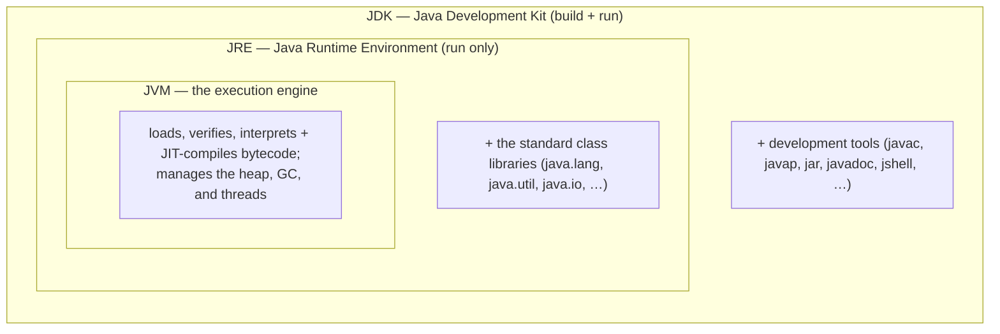
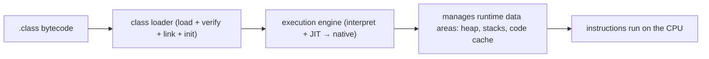
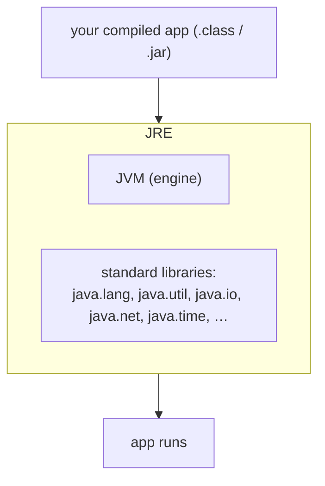
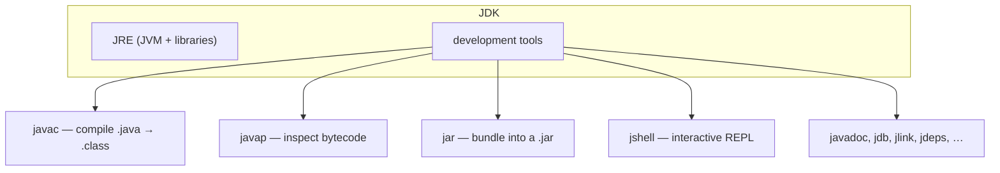
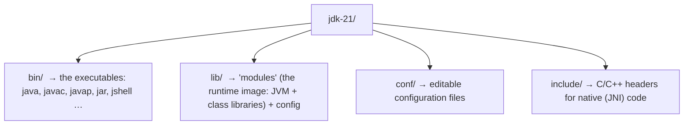
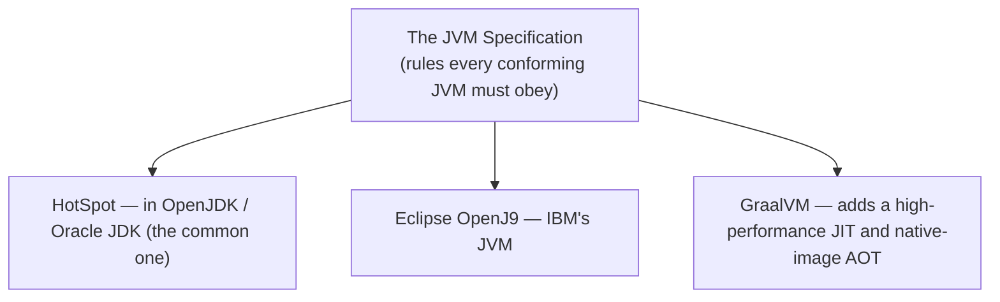
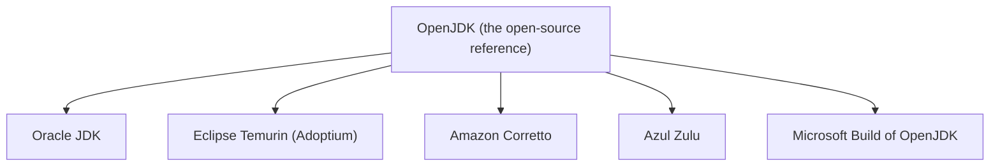
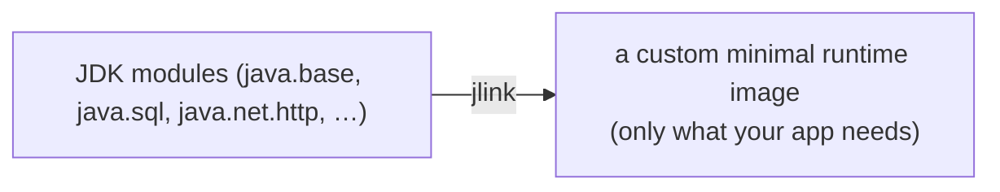

# JDK vs JRE vs JVM

Three acronyms confuse nearly every Java beginner — **JVM**, **JRE**, **JDK** — partly because people use them interchangeably and partly because they're **nested inside one another**. The good news: you already met the hard part. In [Source to Bytecode to JVM to Machine Code](./T04-source-to-bytecode-to-jvm-to-machine-code.md) you dissected the **JVM** — the engine that loads, verifies, interprets, and JIT-compiles bytecode. This topic places that engine inside the two layers that wrap it, shows **what each one physically is on disk**, explains the **specification-vs-implementation** distinction (why there are many JVMs), and tells you **which one you actually need** for which job. Every layer gets a diagram.

> [!NOTE]
> Prerequisite: [Source to Bytecode to JVM to Machine Code](./T04-source-to-bytecode-to-jvm-to-machine-code.md) (`L0/C01/T04`) — the JVM, bytecode, `javac`, and the run-time pipeline. We build straight on it.

## The Big Picture: Three Nested Things

The single most important idea: these are **concentric layers**, not three separate downloads. The JDK *contains* a JRE, which *contains* a JVM:



Read it inside-out: the **JVM** runs bytecode; add the **libraries** and you have a **JRE** that can *run* finished apps; add the **compiler and tools** and you have a **JDK** that can *build* apps. Now each layer in detail.

## The JVM — the Engine

The **Java Virtual Machine** is the part you studied in T04: it takes `.class` bytecode and actually executes it. Condensed, its job is:



Two things to underline:

- The JVM understands **bytecode, not Java**. Any language that compiles to valid bytecode (Kotlin, Scala, Groovy, Clojure) runs on it — the JVM doesn't know or care that your source was Java.
- The JVM is a **specification**, and there are several **implementations** of it (more below). When people say "the JVM" they usually mean the most common implementation, **HotSpot**.

> [!NOTE]
> The JVM is the *abstract machine* whose imaginary instruction set is bytecode (the idea from T01/T03). It exists only as a running program — you never download "a JVM" by itself; it ships inside a JRE/JDK.

## The JRE — Engine + Libraries

A bare engine isn't enough to run real programs. Even `System.out.println("hi")` calls into `java.lang.System` and `java.io.PrintStream` — code *you* didn't write. The **Java Runtime Environment** bundles the JVM together with those **standard class libraries** (and supporting files):



A JRE can **run** Java applications but **cannot compile** them — it has no `javac`. Historically, this is what an end user installed just to run a Java program.

## The JDK — Runtime + Development Tools

To *write and build* Java, you need the **Java Development Kit**: a full JRE **plus** the development tools. The most important is `javac` (the compiler from T04), but there are many:



| Tool | What it does |
|------|--------------|
| `java` | launch the JVM and run a class or `.jar` |
| `javac` | compile `.java` source into `.class` bytecode |
| `javap` | disassemble/inspect bytecode (you used it in T04) |
| `jar` | package many `.class` files into one `.jar` archive |
| `javadoc` | generate HTML API docs from `/** … */` comments |
| `jshell` | a REPL for trying Java snippets live (Java 9+) |
| `jdb` | command-line debugger |
| `jlink` | build a custom, minimal runtime image (Java 9+) |
| `jdeps` | analyze class and module dependencies |

**If you are learning or developing Java, you install the JDK** — it includes everything in the JRE, so you can both build and run.

## Under the Hood: What's Actually on Disk

These aren't abstractions — a JDK is a folder of files. A modern (Java 9+) JDK looks like this:



The commands you type are small programs in **`bin/`**:

```bash
$ java -version      # prints the JVM/runtime version
$ javac -version     # present ONLY in a JDK (the compiler)
$ ls $JAVA_HOME/bin  # see every tool the JDK gives you
```

> [!NOTE]
> **Going deeper — `javac` is itself a Java program.** `bin/javac` is a tiny native **launcher**: it starts a JVM and runs the *real* compiler, which is written in Java and ships as bytecode in the runtime image. Likewise `bin/java` is a launcher that boots the JVM, loads your main class, and calls `main`. So the tool that compiles Java is *itself* Java running on the JVM.


## Which One Do You Need? — and the Workflow

Map the three layers onto the build-and-run workflow from T03/T04 — notice the **compile** step needs the JDK, while the **run** step needs only the JRE/JVM:


| You want to… | You need | Why |
|--------------|----------|-----|
| **Run** a finished Java app | a JRE (or any JDK) | only the JVM + libraries are required |
| **Develop** Java | the **JDK** | you need `javac` and the other tools |
| Inspect bytecode, debug, REPL | the **JDK** | those tools live only in the JDK |

For this book, and for any Java work, **install the JDK** — it is the superset.

## Under the Hood: Specification vs Implementation

"The JVM" and "Java" are **specifications** — written standards — and what you download is an **implementation** of them. The Java platform is actually three specs: the **Java Language Specification**, the **JVM Specification**, and the **API (libraries) Specification**. Multiple vendors implement the JVM spec:



Similarly, the **JDK** itself has many builds — all derived from the open-source **OpenJDK** reference:



> [!TIP]
> For learning, a free **OpenJDK** build like **Eclipse Temurin** is the standard, no-fuss choice. They are functionally the same Java; vendors differ mainly in support, licensing, and update cadence. (Installing one is the subject of the next topic.)

## Modern Java: No More Standalone JRE

A historical wrinkle worth knowing, because old tutorials still say "download the JRE":

- **Java 9 (2017)** split the once-monolithic platform into **modules** (e.g. `java.base`, `java.sql`). The old `rt.jar` is gone; the runtime image in `lib/modules` is modular.
- **Since Java 11**, Oracle/OpenJDK **no longer ship a standalone JRE** download. You get a **JDK**, and if you need a small runtime to ship an app, you build a custom one with **`jlink`** containing only the modules your app uses.



> [!WARNING]
> So "install the JRE" is increasingly outdated advice. On modern Java you **install a JDK**; a trimmed runtime is produced with `jlink` when packaging an app, not downloaded separately.

> [!INTERVIEW]
> **"Difference between JDK, JRE, and JVM?"** — The **JVM** executes bytecode; the **JRE** = JVM + standard libraries (enough to *run* apps); the **JDK** = JRE + development tools like `javac` (enough to *build* apps). They're nested: JDK ⊃ JRE ⊃ JVM. Follow-ups: **"Which do you need to develop?"** (the JDK); **"Is the JVM one program?"** (it's a *spec* with implementations — HotSpot, OpenJ9, GraalVM); **"Can the JVM run non-Java languages?"** (yes — anything that compiles to valid bytecode: Kotlin, Scala, …).

## Practice

1. **Draw the nesting.** From memory, sketch JDK / JRE / JVM as nested boxes and label what each layer *adds*.
2. **In your own words.** Why can a JRE run a program but not compile one? What single tool's absence is the reason?
3. **Pick the layer.** For each, name the minimum you need: (a) a user double-clicks a Java game; (b) you write and compile a Java class; (c) you run `javap` to inspect bytecode; (d) you debug with `jdb`.
4. **Spec vs implementation.** Explain "the JVM is a specification, not a single program," and name two implementations.
5. **Trace the tools.** Which layer (JVM / JRE / JDK) provides each: `java`, `javac`, the `java.util` classes, `jar`, the garbage collector?
6. **Explain the mechanism.** Your friend says "`javac` is written in C." Correct them: what is `bin/javac` really, and what runs the actual compiler?
7. **Modern Java.** A 2015 tutorial says "install the JRE to run the app." What changed in Java 9 and Java 11, and what would you do today to get a small runtime?
8. **Non-Java on the JVM.** Explain how Kotlin or Scala can run on the JVM even though the JVM was built for Java.

## Recap

You should now be able to:

- Explain that **JDK ⊃ JRE ⊃ JVM** are **nested layers**, and state what each layer *adds* (engine → + libraries → + tools).
- Describe the **JVM** as the bytecode execution engine (from T04) that understands *bytecode, not Java*, so other languages can target it.
- Describe the **JRE** as JVM + standard class libraries — enough to **run** apps but not compile them.
- Describe the **JDK** as JRE + development tools (`javac`, `javap`, `jar`, `jshell`, `jlink`, …) — what you install to **develop**.
- Navigate **what's on disk** (`bin/`, `lib/modules`, …) and explain that `java`/`javac` are launchers, and that the compiler is itself a Java program on the JVM.
- Choose the right layer for a task, and map **compile → JDK** vs **run → JRE/JVM** onto the workflow.
- Explain **specification vs implementation** (JVM spec → HotSpot / OpenJ9 / GraalVM; OpenJDK → Temurin / Corretto / Zulu …).
- Explain the **modern** situation: modular runtime (Java 9), no standalone JRE since Java 11, and `jlink` for custom runtimes.

## Next

Continue to [Installing Java & Setting Up PATH / JAVA_HOME](./T06-installing-java-and-setting-up-path-java-home-windows-macos-linux.md).
