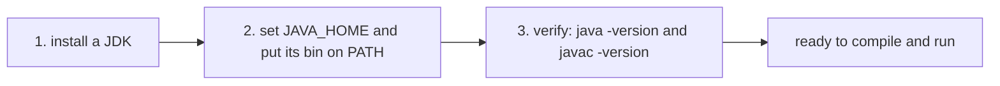
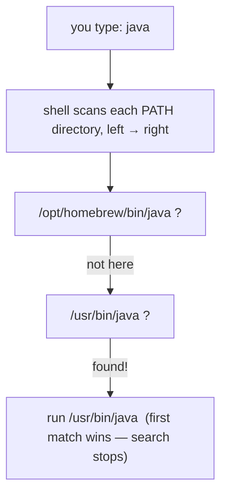
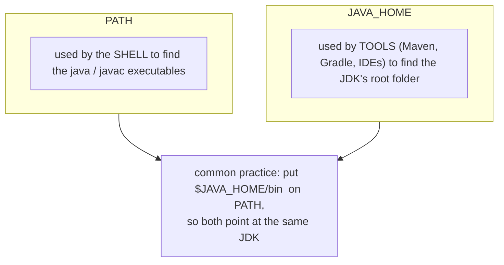
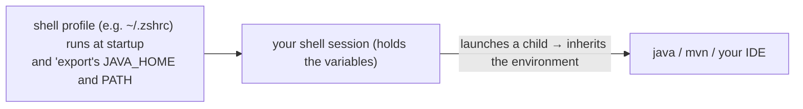
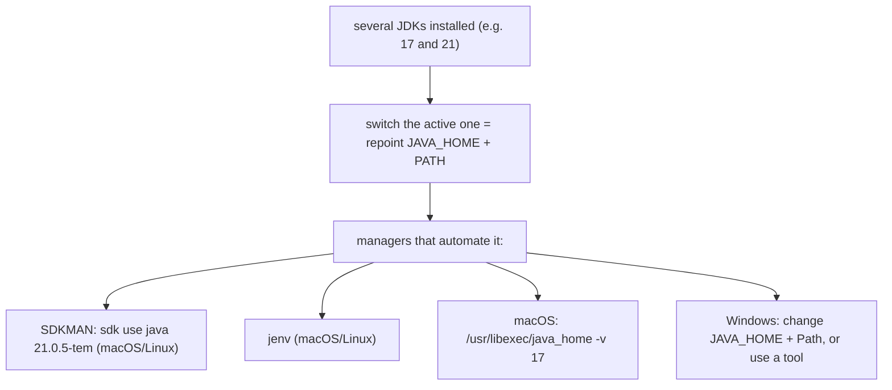
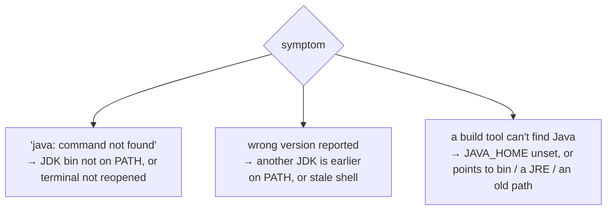

# Installing Java & Setting Up PATH / JAVA_HOME (Windows, macOS, Linux)

Now we make it real: get a working **JDK** on your machine and be able to type `java` and `javac` in *any* terminal. [The last topic](./T05-jdk-vs-jre-vs-jvm.md) settled *what* to install — a **JDK** (the superset), not a bare JRE. This topic does the install on **Windows, macOS, and Linux**, and then goes deep on the two things that trip up every beginner: **`PATH`** (how your shell even finds the `java` program) and **`JAVA_HOME`** (how other tools find your JDK). Understand those two and "command not found" and "wrong Java version" stop being mysteries.

> [!NOTE]
> Prerequisite: [JDK vs JRE vs JVM](./T05-jdk-vs-jre-vs-jvm.md) (`L0/C01/T05`) — install the **JDK**; you'll use its `bin/` tools (`java`, `javac`) throughout.

## The Plan

Three steps, the same on every OS:



## Step 1 — Choose and Install a JDK

**Version:** pick a current **LTS** (Long-Term Support) release — **Java 21** is a great default (17 is also fine). **Distribution:** any OpenJDK build works; **Eclipse Temurin (Adoptium)** is the popular, free, no-fuss choice (recall the vendor list from T05).

### macOS

```bash
# Option A — Homebrew (a popular macOS package manager)
$ brew install --cask temurin          # installs the latest Temurin JDK

# Option B — SDKMAN (best if you'll juggle multiple versions; see below)
$ curl -s "https://get.sdkman.io" | bash
$ sdk install java 21.0.5-tem
```

### Windows

```powershell
# Option A — winget (built-in package manager)
PS> winget install EclipseAdoptium.Temurin.21.JDK

# Option B — download the .msi installer from adoptium.net and run it.
#   IMPORTANT: on the install screen, enable
#   "Set JAVA_HOME variable" and "Add to PATH" — it does Step 2 for you.
```

### Linux

```bash
# Debian / Ubuntu
$ sudo apt update && sudo apt install openjdk-21-jdk

# Fedora / RHEL
$ sudo dnf install java-21-openjdk-devel

# Or SDKMAN (any distro), as in the macOS example
```

> [!TIP]
> A version manager like **SDKMAN** (macOS/Linux) installs the JDK *and* wires up `PATH`/`JAVA_HOME` for you, and makes switching versions a one-liner. If you choose it, you can often skip the manual Step 2.

## Under the Hood: What `PATH` Is, and How `java` Is Found

When you type `java`, how does the OS know *which* file to run? It searches an environment variable called **`PATH`** — an ordered list of directories. The shell checks each directory **left to right** and runs the **first** executable named `java` it finds:



Two consequences fall straight out of this picture:

- If **no** directory on `PATH` contains `java`, you get **"command not found"** — the program exists on disk, but the shell wasn't told where to look.
- If **several** JDKs are installed, the one whose `bin/` appears **earliest** on `PATH` wins. That's why "I have Java 21 but `java -version` says 17" is almost always a `PATH`-order problem.

You can see exactly which one wins:

```bash
$ which java        # macOS / Linux  → prints the full path that will run
$ where java        # Windows (cmd)  → lists all matches, in search order
```

## Under the Hood: What `JAVA_HOME` Is (and how it differs from `PATH`)

`JAVA_HOME` is a separate environment variable that points to the **root folder of your JDK** (the directory that *contains* `bin/`, `lib/`, …). The shell does **not** use it to find `java` — that's `PATH`'s job. Instead, **other tools** (Maven, Gradle, Tomcat, IDEs, app servers) read `JAVA_HOME` to locate the JDK they should build/run with:



> [!WARNING]
> `JAVA_HOME` must point to the **JDK root**, *not* to its `bin/` subfolder and *not* to a JRE. A classic bug: `JAVA_HOME=/path/to/jdk/bin` — tools then look for `bin/bin/...` and fail. Point it at the folder that *contains* `bin`.

## Environment Variables, Briefly

Both `PATH` and `JAVA_HOME` are **environment variables**: named values that live in a process's environment. The key fact (rooted in the OS/process model from T01): when a process starts a child, the child **inherits** a copy of the parent's environment. So if your shell has `JAVA_HOME` set, every program you launch *from* that shell sees it:



This is also why **changes don't take effect in already-open terminals**: a running shell keeps its environment; you must **open a new terminal** (or re-load the profile) for new values to appear.

## Step 2 — Set `JAVA_HOME` and `PATH`

### macOS and Linux (zsh / bash)

Add these lines to your shell profile — `~/.zshrc` (modern macOS default) or `~/.bashrc` / `~/.bash_profile` (common on Linux):

```bash
# macOS: the built-in helper returns the JDK path for a version
export JAVA_HOME="$(/usr/libexec/java_home -v 21)"

# Linux: point at the JDK root (path varies by distro/install)
# export JAVA_HOME="/usr/lib/jvm/java-21-openjdk-amd64"

# put the JDK's bin first on PATH so its java/javac win
export PATH="$JAVA_HOME/bin:$PATH"
```

Then reload the profile in the current shell (or just open a new terminal):

```bash
$ source ~/.zshrc
```

### Windows

The reliable way is the GUI: **Settings → System → About → Advanced system settings → Environment Variables**. Add a variable `JAVA_HOME` = your JDK root (e.g. `C:\Program Files\Eclipse Adoptium\jdk-21...`), then **edit `Path`** and add a new entry `%JAVA_HOME%\bin`.

```powershell
# Or from a terminal — setx writes PERMANENTLY (affects NEW shells, not the current one)
PS> setx JAVA_HOME "C:\Program Files\Eclipse Adoptium\jdk-21.0.5.11-hotspot"
# then add %JAVA_HOME%\bin to Path via the GUI (see the warning below)
```

> [!WARNING]
> Avoid `setx PATH "...%PATH%..."` to edit `Path` on Windows — `setx` truncates long values and can corrupt your `PATH`. Edit `Path` through the **GUI** instead. And remember: open a **new** terminal after any change.

## Step 3 — Verify

Open a **fresh** terminal and check all three:

```bash
$ java -version
$ javac -version      # proves you have a JDK, not just a JRE (recall T05)
$ echo "$JAVA_HOME"   # Windows: echo %JAVA_HOME%
$ which java          # Windows: where java
```

Good output looks like this — the versions match and `which java` points inside your `JAVA_HOME`:

```text
$ java -version
openjdk version "21.0.5" 2024-10-15 LTS
OpenJDK Runtime Environment Temurin-21.0.5+11 (build 21.0.5+11-LTS)
OpenJDK 64-Bit Server VM Temurin-21.0.5+11 (build 21.0.5+11-LTS, mixed mode)
```

If `javac -version` works, you can compile (T04's `javac`) and run — you're set up.

## Managing Multiple JDK Versions

Real developers keep several JDKs (one project needs 17, another 21). "Switching" simply means **repointing `JAVA_HOME` and `PATH`** at a different JDK — a manager automates that:



## Troubleshooting

Almost every setup problem is one of three things — and you now know why each happens:



> [!WARNING]
> The most common gotcha by far: **you changed a variable but the old terminal still shows the old value.** Environment changes only reach **new** processes (the inheritance diagram above). Close and reopen the terminal — or `source` your profile — every time.

> [!INTERVIEW]
> A frequent practical/junior question: **"Difference between `PATH` and `JAVA_HOME`?"** — `PATH` is the OS's search list of directories for **executables**, so the *shell* uses it to locate `java`/`javac`; `JAVA_HOME` points to the **JDK's root folder**, which *tools* (Maven, Gradle, IDEs) read to find the JDK. They're usually linked by putting `$JAVA_HOME/bin` on `PATH`.

## Practice

1. **Trace the lookup.** You type `java`. In your own words, how does the shell decide which file to execute? What does it use, and what happens if nothing matches?
2. **PATH order.** You installed JDK 21 but `java -version` prints 17. Give the most likely cause and how you'd confirm it (name the command).
3. **PATH vs JAVA_HOME.** Explain the difference in one sentence each, and describe how they're typically connected.
4. **Find the winner.** Which command shows the exact `java` that will run on your OS? What would its output look like relative to `JAVA_HOME`?
5. **Inheritance.** You add `export JAVA_HOME=...` to `~/.zshrc` but an open terminal still says it's empty. Why, and what are two ways to fix it?
6. **Spot the bug.** A teammate set `JAVA_HOME=C:\...\jdk-21\bin`. Why will tools fail, and what's the correct value?
7. **Install it.** On your machine, install a JDK 21, set `JAVA_HOME` + `PATH`, open a new terminal, and confirm `java -version` and `javac -version` both report 21.
8. **Multiple versions.** Describe one way to keep both JDK 17 and 21 and switch between them.

## Recap

You should now be able to:

- **Install a JDK** (Temurin/OpenJDK, an LTS like 21) on **Windows, macOS, or Linux** via an installer, a package manager (`brew`, `winget`, `apt`/`dnf`), or **SDKMAN**.
- Explain **`PATH`** as the shell's ordered search list for executables, how `java` is resolved (**first match wins**), and why that explains "command not found" and "wrong version".
- Explain **`JAVA_HOME`** as the pointer to the **JDK root** that *tools* use, how it differs from `PATH`, and that they're linked via `$JAVA_HOME/bin` on `PATH`.
- Explain **environment variables** and that child processes **inherit** them — hence changes need a **new terminal**.
- **Set** `JAVA_HOME` and `PATH` correctly on each OS, and **verify** with `java -version`, `javac -version`, `echo $JAVA_HOME`, and `which`/`where java`.
- **Manage multiple JDKs** by repointing `JAVA_HOME`/`PATH` (or with SDKMAN/jenv), and **troubleshoot** the three classic setup failures.

## Next

Continue to [Choosing & Using an IDE](./T07-choosing-and-using-an-ide.md).
