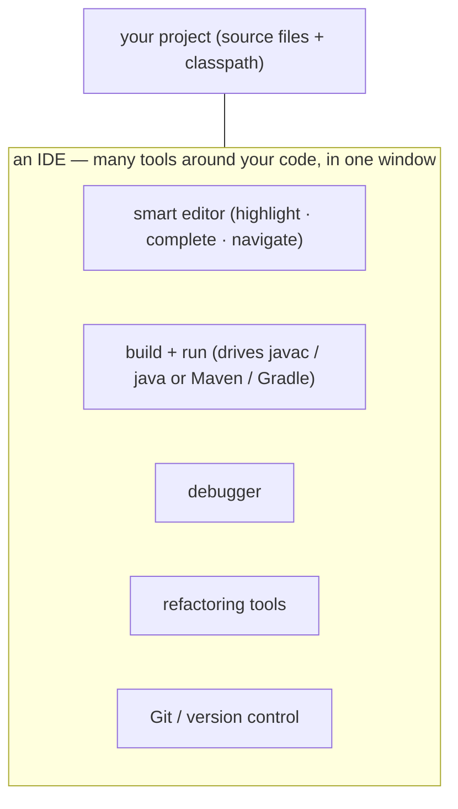
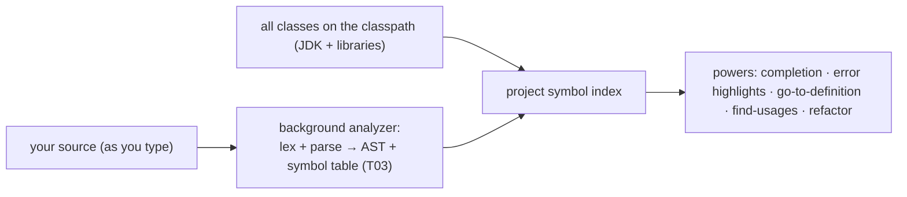
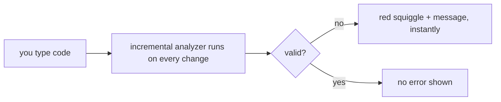
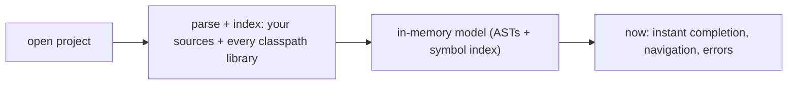
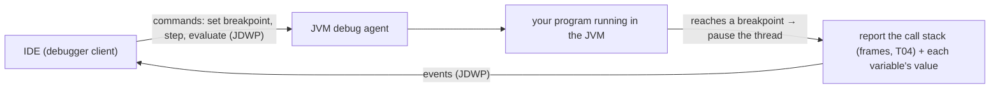

# Choosing & Using an IDE

You can write Java in any text editor and compile it with `javac` from a terminal (exactly what you set up in [the last topic](./T06-installing-java-and-setting-up-path-java-home-windows-macos-linux.md)). But almost no professional does that all day — they use an **IDE** (Integrated Development Environment), which bundles the editor, compiler, runner, debugger, and more into one tool that *understands your code*. This topic helps you **choose** one and shows what it does — but, true to this book, it also opens the hood: an IDE is **not** a magic alternative to `javac`/`java`; its "Run" button literally invokes the chain from `L0/C01/T04`, and its smart features (completion, live errors, the debugger) are real, explainable mechanisms. Knowing that keeps you in control instead of dependent.

> [!NOTE]
> Prerequisites: [Source to Bytecode to JVM to Machine Code](./T04-source-to-bytecode-to-jvm-to-machine-code.md) (`L0/C01/T04`) — `javac`, `java`, bytecode, stack frames; and [Installing Java](./T06-installing-java-and-setting-up-path-java-home-windows-macos-linux.md) (`L0/C01/T06`) — the JDK the IDE drives.

## What an IDE Is

An IDE gathers the tools you'd otherwise run separately into a single window, all aware of the same project:

Compared with a plain editor + terminal, the IDE's edge is that it **parses and indexes your whole project** continuously, so it can complete code, flag errors as you type, jump to definitions, and refactor safely — things a dumb editor can't do.

## Under the Hood: the "Run" Button Is Just `javac` + `java`

The single most important demystification: clicking **Run** does *not* bypass anything you learned. The IDE runs the same two steps from T04 for you, then shows the output in its console:

It also manages the **classpath** (where to find your classes and libraries — recall how `java` needs to locate classes) and, for real projects, usually delegates to a **build tool** (Maven/Gradle, covered in L2). The IDE is an automation layer over the exact commands you can still run by hand.

## The Main Choices

| IDE | Cost | Best for | Notes |
|-----|------|----------|-------|
| **IntelliJ IDEA** | Community **free** / Ultimate paid | Java — the de-facto standard | Smartest Java analysis; start here |
| **Eclipse** | free, open-source | enterprise / long-standing teams | Uses its own compiler (ECJ) |
| **VS Code** + *Extension Pack for Java* | free | lightweight, multi-language | Editor + a Java **language server** |
| **Apache NetBeans** | free | all-in-one, beginners | Bundled tooling |

> [!TIP]
> For learning Java, **IntelliJ IDEA Community Edition** is the easiest, most capable free choice and what most Java developers use. If you already live in **VS Code**, the *Extension Pack for Java* is a fine lightweight alternative.

## What an IDE Does for You — and How

Each "magic" feature is a concrete mechanism, mostly built on the **compiler phases from `L0/C01/T03`** (lex → parse → AST → semantic analysis) running *continuously in the background* over your project.

### Smart Editing and Code Completion

As you type, the IDE keeps a parsed model of your code (an **AST**) plus an **index of every symbol** — your classes/methods/fields *and* every class on the classpath (the JDK and libraries). So at the cursor it knows exactly what names are valid:

### Live Error Highlighting

A plain editor finds errors only when you compile. An IDE runs an **incremental compiler/analyzer continuously**, so it shows the *same* errors `javac` would (the semantic-analysis phase from T03) as a red squiggle — *before* you ever build:

### Navigation and Refactoring

Because the IDE holds that symbol index and AST, **Go to Definition** and **Find Usages** are index lookups, and **refactorings** (rename a method, extract a variable) are safe **AST transformations** applied consistently across every file — not blind text find-and-replace, so they don't break unrelated code that happens to share a name.

## Under the Hood: How the IDE "Knows" Your Code

That index isn't free — when you first open a project, the IDE **parses and indexes** all your sources *and* all library classes on the classpath. This is the "Indexing…" progress bar, and why the first open is slow but everything afterward is instant. VS Code does the same via a **language server** (the Java extension talks to a background server using the **Language Server Protocol**, which parses/analyzes and answers completion/error queries).

## Under the Hood: How the Debugger Works

A debugger lets you **pause** a running program and inspect it — and it works through a standard JVM facility, not sorcery. The JVM is started in **debug mode** (a JDWP agent listening on a port); the IDE connects to it and exchanges messages over the **Java Debug Wire Protocol (JDWP)**:

When execution hits a **breakpoint**, the JVM pauses that thread and hands the IDE the **stack of frames** (exactly the frames from T04) and the **local variables and operand values** in each. You can then **step** (over/into/out), **watch** expressions (the IDE asks the JVM to evaluate them in the paused frame), and resume. Setting a breakpoint and stepping through code is the single fastest way to understand a program — far better than scattering `println`s.

## Using an IDE: Your First Run

The flow in any IDE (IntelliJ wording shown):

1. **New Project** → select your JDK (the one from T06) → create.
2. Add a class, e.g. `Calc`, with a `main` method.
3. Click **Run**. The IDE compiles and launches it; output shows in the **Run/console** panel.
4. Click in the left gutter to set a **breakpoint**, then click **Debug**. Execution pauses there; inspect variables, **Step Over** (F8) line by line, then **Resume**.
5. Watch the editor flag errors live as you type, and try **completion** (Ctrl/⌘-Space) and **Rename** (Shift-F6) refactoring.

## IDE vs Editor + Terminal

Both are valid; they trade convenience for transparency:

| | IDE | Editor + terminal |
|---|-----|-------------------|
| Speed on big projects | High (completion, navigation, refactor) | Slower |
| Debugging | Visual breakpoints, variable inspection | `println` or `jdb` |
| Sees what's happening | Hidden behind buttons | Fully explicit (`javac`, `java`) |
| Good for | day-to-day development | learning the chain, small scripts, servers |

> [!WARNING]
> Don't let the IDE *replace* your mental model. It auto-compiles, manages the classpath, and hides `javac`/`java` — wonderful for speed, risky for understanding. When something "works in the IDE but fails on the command line," it's almost always a **classpath or build-config** difference. Because you learned the chain in T04/T06, you can diagnose that; someone who only ever clicked Run cannot.

> [!INTERVIEW]
> Practical questions you should be able to answer: **"How do you debug?"** — set a breakpoint, run in debug mode, inspect the **call stack and variables** at the pause, **step** through, use **watches**; know the difference between **step over / into / out**. Bonus depth: the IDE talks to the JVM over **JDWP**, pausing threads and reading stack frames.

## Practice

1. **Demystify Run.** In your own words, what two command-line steps does the IDE's Run button perform for you? Tie each to T04.
2. **Pick one.** Choose an IDE for learning Java and justify it in one sentence. Install it and point it at the JDK you set up in T06.
3. **First program.** Create a project, write a class that prints something, and Run it. Where does the output appear?
4. **Explain a feature.** How does live error highlighting show you a mistake *before* you build? Which compiler phase from T03 is doing the work?
5. **Completion mechanism.** Why can the IDE suggest only valid methods at the cursor? What two things must it have built to do that?
6. **Debug it.** Set a breakpoint in a small loop, run in debug mode, and step through it watching a variable change. What does the JVM hand the IDE when it pauses?
7. **Refactor vs find-replace.** Why is "Rename method" in an IDE safer than a text find-and-replace across files?
8. **Works here, not there.** A program runs in the IDE but throws "class not found" on the terminal. Name the most likely cause and why your T04/T06 knowledge helps.

## Recap

You should now be able to:

- Explain what an **IDE** is and how it differs from a plain editor + terminal.
- Explain that the **Run button is just `javac` + `java`** (the T04 chain) plus classpath management — not a separate runtime.
- **Choose** an IDE (IntelliJ IDEA Community recommended; Eclipse, VS Code, NetBeans as alternatives).
- Explain **how** core features work: completion and navigation from a background **AST + symbol index** (T03), **live errors** from a continuous incremental analyzer, and **refactorings** as safe AST transformations.
- Explain **indexing** (why the first open is slow) and that VS Code uses a **language server (LSP)**.
- Explain **how the debugger works** — the IDE talks to the JVM over **JDWP**, pausing threads at breakpoints and reading the **stack frames and variables** (T04) — and use breakpoints, stepping, and watches.
- Decide when to use an IDE vs the command line, and diagnose "works in the IDE but not on the CLI" as a classpath/build issue.

## Next

Continue to [Command-Line / Terminal Basics](./T08-command-line-terminal-basics.md).
