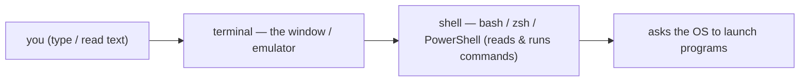
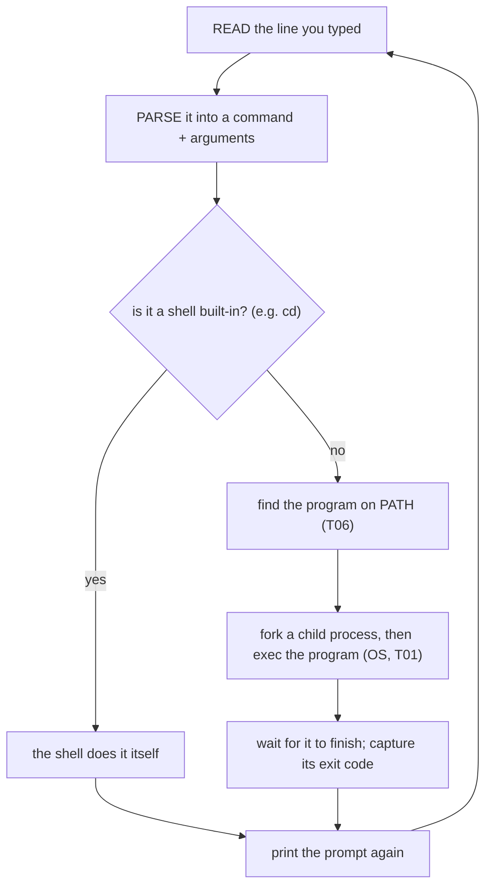
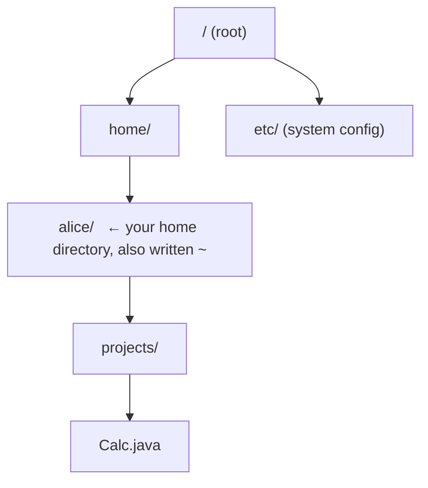
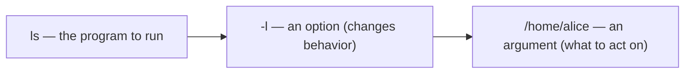
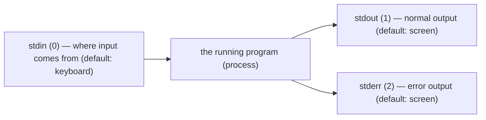
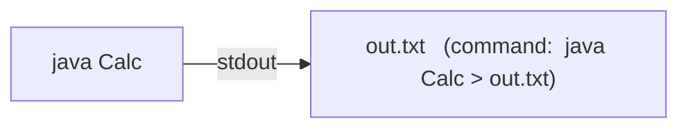
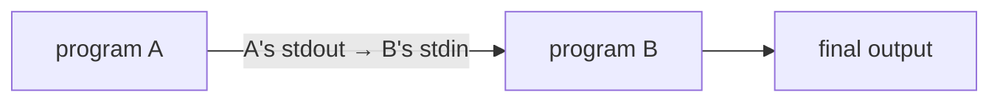
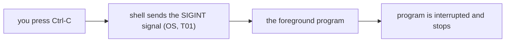
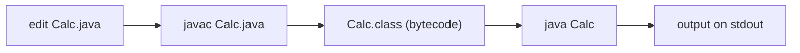

# Command-Line / Terminal Basics

The terminal looks intimidating — a blinking cursor and no buttons — but it is the most direct, honest way to drive a computer, and indispensable for Java: you compiled with `javac` and ran with `java` there in earlier topics. This topic teaches the everyday commands (move around, manage files, run programs) **and** opens the hood on what's really happening: what the **shell** actually does with each line you type (it's a small loop that finds and launches programs — building directly on `PATH` from `L0/C01/T06` and the OS/process model from `L0/C01/T01`), how the **filesystem tree** works, and the powerful ideas of **standard streams, pipes, redirection, exit codes, and signals**. Every concept has a diagram.

> [!NOTE]
> Prerequisite: [Installing Java & PATH/JAVA_HOME](./T06-installing-java-and-setting-up-path-java-home-windows-macos-linux.md) (`L0/C01/T06`) — `PATH`, environment variables. We also lean on the OS, processes, and interrupts from [How Computers Run Programs](./T01-how-computers-run-programs-cpu-memory-binary.md) (`L0/C01/T01`).

## Terminal vs Shell

People say "the terminal," but two things are really involved. The **terminal** is the *window* (a text in/out device, historically a physical teletype, now an emulator app). The **shell** is the *program running inside it* that actually reads your commands and runs them — `bash` or `zsh` on macOS/Linux, `PowerShell` on Windows:



## Under the Hood: What the Shell Actually Does

A shell is essentially a **loop** — a Read-Eval-Print Loop, like the interpreter idea from T03. For every line you type it does this, and the steps connect straight to things you already know (`PATH` from T06, processes from T01):



Two consequences worth internalizing:

- Most commands (`ls`, `java`, `git`) are **separate programs** the shell finds on `PATH` and launches as child processes. A few — like `cd` — are **built-ins** the shell must do *itself* (it has to change *its own* working directory; a child process couldn't).
- "command not found" is now obvious: the shell parsed a name, searched every `PATH` directory, and found no such program (exactly the `PATH` story from T06).

## The Filesystem as a Tree

Files live in a single tree of directories (folders). The top is the **root** — `/` on macOS/Linux (Windows has a tree per drive, like `C:\`):



You refer to a location by a **path**, and there are two kinds:

- **Absolute** — from the root: `/home/alice/projects/Calc.java`.
- **Relative** — from your **current working directory** (cwd): `projects/Calc.java`.

A few shorthands appear everywhere: `.` = the current directory, `..` = the parent, `~` = your home directory. Crucially, **every process has its own current working directory** (inherited from its parent — the process model from T01); relative paths are resolved against it.

## Navigating

```bash
$ pwd                      # print working directory — "where am I?"
/home/alice
$ ls                       # list the files here
projects  notes.txt
$ ls -l projects           # -l = long format (an option), projects = an argument
$ cd projects              # change directory (a shell built-in)
$ cd ..                    # go up to the parent
$ cd ~                     # go home (or just: cd)
```

## Anatomy of a Command

Every command line is: the **program name**, then **options** (flags that change behavior, usually `-x` or `--name`), then **arguments** (what to act on). The shell splits the line on spaces, so paths *with* spaces must be **quoted**:



```bash
$ ls -la "My Documents"    # quotes keep the space from splitting into two arguments
```

## Working with Files

```bash
$ mkdir demo               # make a directory
$ cd demo
$ touch Hello.java         # create an empty file (macOS/Linux)
$ cp Hello.java Bak.java   # copy
$ mv Bak.java old.java     # move or rename
$ cat Hello.java           # print a file's contents to the screen
$ rm old.java              # remove a file  (no undo — see the warning!)
```

> [!WARNING]
> `rm` (and especially `rm -rf folder`) **deletes permanently** — there is no Recycle Bin. Double-check the path before you press Enter; never run `rm -rf` on a path you're unsure of. On Windows PowerShell the equivalent is `Remove-Item`.

## Under the Hood: Standard Streams, Redirection, and Pipes

This is the command line's superpower. Every program the OS runs is automatically given **three standard streams** (channels of bytes — recall a process from T01):



In Java, `System.out` is **stdout** and `System.err` is **stderr** — so `System.out.println(...)` writes to stream 1. By default these point at your terminal, but the shell can **redirect** them:

```bash
$ java Calc > out.txt       # send stdout to a file (overwrite)
$ java Calc >> out.txt      # append instead of overwrite
$ java Calc 2> errors.txt   # send stderr (stream 2) to a file
$ java Calc < input.txt     # feed a file into stdin
```



And the famous **pipe** `|` connects one program's **stdout** to the next program's **stdin**, so you build pipelines that filter and transform data — small tools composed into big effects:



```bash
$ ls -l | grep ".java"      # list files, keep only lines containing ".java"
$ cat big.log | sort | uniq # show, sort, then drop duplicate lines
```

> [!TIP]
> "Do one thing well, then pipe" is the core Unix philosophy. `grep` (search), `sort`, `wc` (count), `head`/`tail` are the everyday filters — combine them instead of looking for one giant tool.

## Exit Codes

When a program finishes it returns a small integer **exit code** to the shell: **`0` means success**, anything else means a specific error. This is how scripts know whether a step worked:

```bash
$ javac Calc.java
$ echo $?                   # bash/zsh: prints the last exit code (0 = compiled OK)
0
```

(On Windows PowerShell it's `$LASTEXITCODE`.) For Java specifically, the JVM exits `0` when `main` returns normally, and non-zero if it ends with an uncaught exception or you call `System.exit(n)` — connecting right back to how `java` launches `main` in T04.

## Signals: Ctrl-C and Friends

A running program in the foreground can be interrupted from the keyboard. Pressing **Ctrl-C** makes the shell send the program a **signal** — `SIGINT` — an OS message (the *interrupts* idea from T01) that by default tells it to stop:



Also handy: **Ctrl-D** = end-of-input (EOF, e.g. to stop a program reading stdin), **Ctrl-Z** = suspend, the **Up arrow** = recall previous commands (history), **Tab** = auto-complete a name, and `clear` wipes the screen.

## Running Java from the Terminal

Pull it together — this is the whole edit-compile-run loop, by hand, that an IDE (T07) automates for you:



```bash
$ javac Calc.java     # compile (needs the JDK — T05/T06)
$ java Calc           # run on the JVM (T04)
8
```

## Cross-Platform Notes

The *concepts* (shell loop, tree, streams, pipes) are universal; the command *names* differ a little. macOS/Linux use `bash`/`zsh`; Windows uses **PowerShell** (which conveniently aliases many Unix names) or the older `cmd`. On Windows, **WSL** (Windows Subsystem for Linux) gives you a real Linux shell.

| Task | bash / zsh (macOS, Linux) | PowerShell (Windows) | cmd |
|------|---------------------------|----------------------|-----|
| list files | `ls` | `ls` / `Get-ChildItem` | `dir` |
| where am I | `pwd` | `pwd` | `cd` |
| change dir | `cd` | `cd` | `cd` |
| make dir | `mkdir` | `mkdir` | `mkdir` |
| copy / move | `cp` / `mv` | `Copy-Item` / `Move-Item` | `copy` / `move` |
| delete | `rm` | `Remove-Item` | `del` |
| show file | `cat` | `cat` / `Get-Content` | `type` |
| read a var | `echo $VAR` | `echo $env:VAR` | `echo %VAR%` |

> [!INTERVIEW]
> "**What happens when you type a command and hit Enter?**" is a classic. Short answer: the **shell** parses the line; if it's a built-in it runs it directly, otherwise it searches **`PATH`** for the program, **forks** a child process and **execs** it, wires up **stdin/stdout/stderr**, **waits** for it, and reads its **exit code**. Bonus: pipes connect one program's stdout to the next's stdin.

## Practice

1. **Terminal vs shell.** Explain the difference in one sentence each, and name the shell on your own machine.
2. **Trace the loop.** In your own words, what does the shell do, step by step, when you type `java Calc` and press Enter? Tie two steps to earlier topics.
3. **Built-in vs program.** Why is `cd` a shell built-in while `ls` is a separate program? (Hint: whose working directory must change?)
4. **Paths.** Given cwd `/home/alice`, write the absolute path of `projects/Calc.java`, and rewrite `/home/alice/notes.txt` as a relative path. What do `.`, `..`, and `~` mean?
5. **Streams & redirection.** What are stdin/stdout/stderr? Write a command that runs `java Calc` and saves its normal output to `out.txt` but its errors to `errors.txt`. Which Java calls write to each?
6. **Pipes.** Explain what `ls -l | grep ".java"` does, naming which stream connects the two programs.
7. **Exit codes.** After `javac Bad.java` fails, what would `echo $?` likely print, and why do scripts care?
8. **Signals.** What does Ctrl-C do under the hood, and which T01 concept is it an example of?
9. **Do the loop.** From a terminal, compile and run a small Java program by hand with `javac` and `java`.

## Recap

You should now be able to:

- Distinguish the **terminal** (window) from the **shell** (the program running in it).
- Explain **what the shell does** with each line — read → parse → (built-in or find on `PATH`) → **fork/exec** a child → **wait** → exit code — connecting to T06's `PATH` and T01's processes.
- Navigate the **filesystem tree** with absolute vs relative **paths**, `.`/`..`/`~`, and the per-process **current working directory** (`pwd`, `ls`, `cd`).
- Run everyday **file commands** (`mkdir`, `cp`, `mv`, `rm`, `cat`) safely, and parse a command into **program · options · arguments** (quoting spaces).
- Explain **standard streams** (stdin/stdout/stderr, = Java's `System.in/out/err`), use **redirection** (`>`, `>>`, `2>`, `<`) and **pipes** (`|`).
- Read **exit codes** (`0` = success) and connect them to how `java` runs `main`.
- Explain **signals** like `SIGINT` from Ctrl-C as an OS interrupt (T01).
- Run the **edit → `javac` → `java`** loop by hand, and map common commands across **bash/zsh, PowerShell, and cmd**.

## Next

Continue to [Problem Solving & Pseudocode](./T09-problem-solving-and-pseudocode.md).
