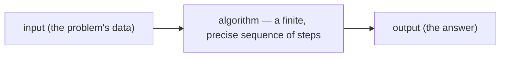
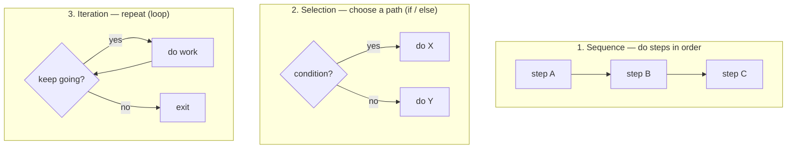
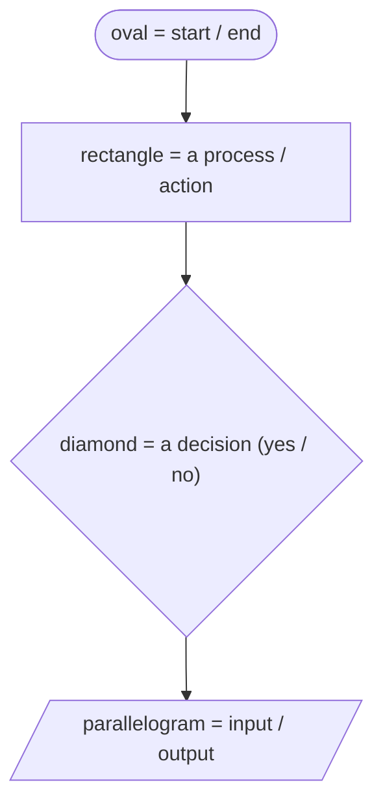
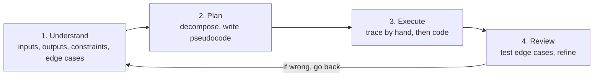
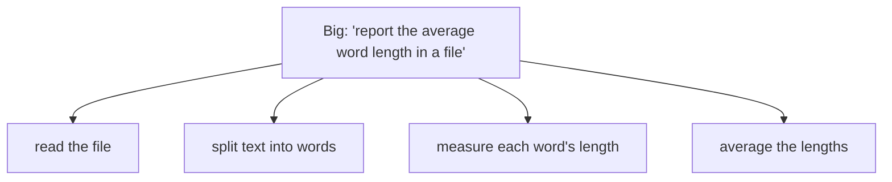
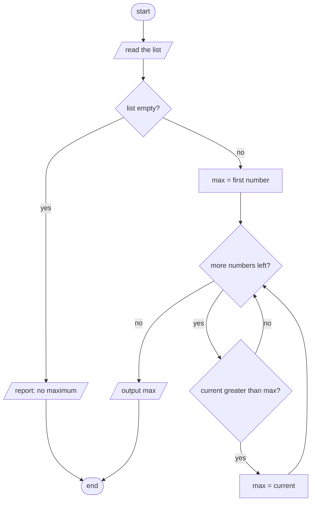

# Problem Solving & Pseudocode

Most beginners think the hard part of programming is the *syntax* — the semicolons and braces. It isn't. The hard part is **figuring out what to tell the computer in the first place**: turning a fuzzy goal ("find the cheapest flight") into a precise, step-by-step recipe. Code is just the final translation of that recipe into a language. This topic teaches the thinking that comes *before* code — **algorithms**, **pseudocode**, **flowcharts**, **decomposition**, and a repeatable **method** for cracking problems — and shows that the building blocks are exactly the control-flow primitives you met in `L0/C01/T01`. We'll solve a real problem end to end, with a diagram at each step.

> [!NOTE]
> Prerequisite: [How Computers Run Programs](./T01-how-computers-run-programs-cpu-memory-binary.md) (`L0/C01/T01`) — especially "loops and ifs are just jumps." Pseudocode is built from those same pieces.

## Programming Is Problem-Solving First

There are two distinct activities, and beginners fail when they blur them:

1. **Plan** — *what* steps solve the problem (language-independent thinking).
2. **Code** — *how* to write those steps in Java (mere translation).

Separating them is the single biggest leap from "I can read Java" to "I can build things." You plan in **pseudocode**; you translate to Java after. Jumping straight to code is like writing an essay with no outline — you get lost.

## What an Algorithm Is

An **algorithm** is a finite, precise sequence of steps that turns input into the desired output:



A good algorithm is **unambiguous** (each step is clear), **terminating** (it finishes — no forever loops), and **correct** (it gives the right answer for *all* valid inputs, including the tricky ones). A recipe ("crack 2 eggs, whisk, fry 3 min") is an everyday algorithm.

## Pseudocode: Thinking Before Syntax

**Pseudocode** is an informal, language-agnostic way to write an algorithm — structured like code but readable, with no strict rules to trip over. You use it to *think*: it's fast to write, easy to change, and works no matter which programming language you'll target. A typical style:

```text
FUNCTION findMax(numbers):
    IF numbers is empty:
        RETURN "no maximum"
    SET max ← first number
    FOR EACH n IN the rest of numbers:
        IF n is greater than max:
            SET max ← n
    RETURN max
```

No semicolons, no imports — just the logic. We'll turn this exact pseudocode into Java below.

## The Three Building Blocks

Here's the reassuring part: *every* algorithm is built from just **three** control structures — and they're the same ones the CPU does with jumps (T01):



Recall from T01 that **selection** compiles to a *conditional jump* and **iteration** to a *jump backwards*. So pseudocode isn't hand-wavy — each construct has an exact machine meaning. (A classic result, the *structured program theorem*, says these three are enough to express *any* algorithm.)

## Flowcharts: Seeing an Algorithm

A **flowchart** is the same algorithm drawn as a picture, using standard shapes:



Pseudocode and flowcharts are two views of one algorithm — text is faster to write, a flowchart is easier to *see*, especially the branches and loops. Use whichever clarifies your thinking.

## A Repeatable Method

When stuck, don't stare — run this loop (a version of Polya's classic "How to Solve It"):



Step 1 is the one beginners skip and the one that matters most: **restate the problem, list the inputs and outputs, and write down concrete examples — including the awkward ones** (empty input, duplicates, negatives, the biggest/smallest case).

## Decomposition: Divide and Conquer

Big problems are solved by breaking them into smaller ones you *can* solve, then combining the results — **top-down decomposition**:



Each leaf is now a small, obvious task. (This also maps directly to **methods** in code — each sub-problem tends to become a function, which you'll formalize in `C02`.)

## Worked Example: Find the Largest Number

Let's run the whole method on a real problem.

**1. Understand.** Input: a list of numbers. Output: the largest one. Edge cases: an *empty* list (no answer), a single number (it's the max), duplicates/negatives (must still work).

**2. Example by hand.** For `[3, 7, 2, 9, 4]`, the answer is `9`. *How* did you get it? You kept a "biggest so far," scanning left to right. That intuition *is* the algorithm.

**3. Plan (pseudocode).** (the `findMax` pseudocode from above) — start `max` at the first number, then for each later number, if it's bigger, update `max`.

**4. Flowchart.**



**5. Trace it by hand** ("desk-checking") on `[3, 7, 2, 9, 4]` — fill a table of variables, exactly like the CPU traces in T01/T02:

| current | comparison | max after |
|---------|------------|-----------|
| (init) | — | 3 |
| 7 | 7 > 3 → true | 7 |
| 2 | 2 > 7 → false | 7 |
| 9 | 9 > 7 → true | 9 |
| 4 | 4 > 9 → false | 9 |
| — | end | **9** |

It matches our by-hand answer, and we confirmed the empty-list branch returns "no maximum." *Now* we code.

**6. Translate to Java.**

```java
static int findMax(int[] numbers) {
    if (numbers.length == 0) {                 // the edge case we found in step 1
        throw new IllegalArgumentException("empty list has no maximum");
    }
    int max = numbers[0];                       // SET max ← first number
    for (int i = 1; i < numbers.length; i++) {  // FOR EACH later number
        if (numbers[i] > max) {                 // IF it's greater
            max = numbers[i];                   // SET max ← it
        }
    }
    return max;
}
```

Notice the Java is a near-mechanical translation of the pseudocode — because the *thinking* was already done.

## From Pseudocode to Java

That translation is so regular it's almost a lookup table (you'll learn each Java form in `C02`):

| Pseudocode | Java |
|------------|------|
| `SET x ← 0` | `int x = 0;` |
| `IF cond: …` | `if (cond) { … }` |
| `ELSE …` | `else { … }` |
| `WHILE cond: …` | `while (cond) { … }` |
| `FOR EACH n IN list: …` | `for (int n : list) { … }` |
| `RETURN v` | `return v;` |

## A Second Pass: FizzBuzz

The same method on the classic warm-up — print 1..n, but multiples of 3 → "Fizz", of 5 → "Buzz", of both → "FizzBuzz". It's pure **selection inside iteration**:

```text
FOR i FROM 1 TO n:
    IF i divisible by 15: PRINT "FizzBuzz"     ← check both FIRST
    ELSE IF i divisible by 3: PRINT "Fizz"
    ELSE IF i divisible by 5: PRINT "Buzz"
    ELSE: PRINT i
```

The subtlety you'd catch while *tracing* (and miss if you code-first): check divisible-by-15 **before** 3 and 5, or 15 prints "Fizz" and stops. Planning surfaces that; flailing in code doesn't.

> [!WARNING]
> The four classic beginner traps, all avoided by planning + tracing: (1) **coding before understanding** the problem; (2) **ignoring edge cases** (empty input, ties, negatives, zero); (3) **infinite loops** — forgetting to advance the loop toward its end; (4) **off-by-one** errors (start at 0 or 1? `<` or `<=`?). Trace your algorithm on paper and these surface *before* you ever run it.

> [!INTERVIEW]
> In a coding interview, **the process is the point.** Before writing code: restate the problem, ask about inputs/edge cases, give a concrete example, then **think out loud in pseudocode** and trace it — *then* code. Interviewers hire the candidate who decomposes calmly, not the one who types fastest. "Can I assume the list is non-empty?" earns more points than a quick wrong answer.

## Practice

1. **Plan, don't code (yet).** In pseudocode, describe how to compute the **average** of a list of numbers. What edge case must you handle?
2. **Three blocks.** Identify the sequence, selection, and iteration in your average algorithm. Which two map to "jumps" from T01?
3. **Trace it.** Desk-check your `findMax` understanding: trace `[5, 5, 2, 8]` in a table of `current`/`max`. What's the result, and does it handle the duplicate `5`s?
4. **Flowchart.** Draw a flowchart for: "given a number, print whether it is positive, negative, or zero." Which shape holds the decision?
5. **Decompose.** Break "check whether a word is a palindrome" into 2–4 sub-problems.
6. **FizzBuzz order.** Explain why the `divisible by 15` check must come first. What goes wrong otherwise?
7. **Edge cases.** List the edge cases for "find the index of a target value in a list." What should happen if it's not present?
8. **Translate.** Convert this pseudocode to Java: `SET count ← 0; FOR EACH n IN list: IF n is greater than 0: SET count ← count + 1; RETURN count`.

## Recap

You should now be able to:

- Separate **planning** (problem-solving) from **coding** (translation), and explain why planning first is the real skill.
- Define an **algorithm** and its properties (unambiguous, terminating, correct).
- Write **pseudocode** to express an algorithm independent of any language.
- Build any algorithm from the **three structures** — **sequence, selection, iteration** — and connect selection/iteration to T01's conditional and backward **jumps**.
- Draw and read a **flowchart** with the standard shapes, as a visual twin of pseudocode.
- Apply a repeatable **method** (Understand → Plan → Execute → Review) and **decompose** a big problem top-down into sub-problems (future methods).
- **Trace/desk-check** an algorithm on examples and edge cases *before* coding, and **translate pseudocode to Java** construct by construct.
- Avoid the classic traps (code-first, missed edge cases, infinite loops, off-by-one) and approach an interview problem the way interviewers reward.

## Next

Continue to [Introduction to Git & Version Control](./T10-introduction-to-git-and-version-control.md).
