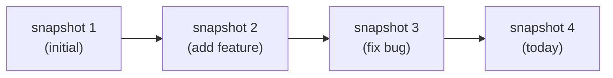
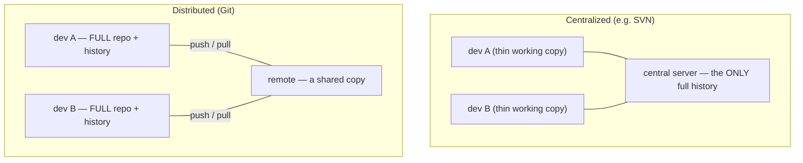
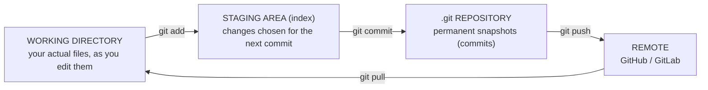
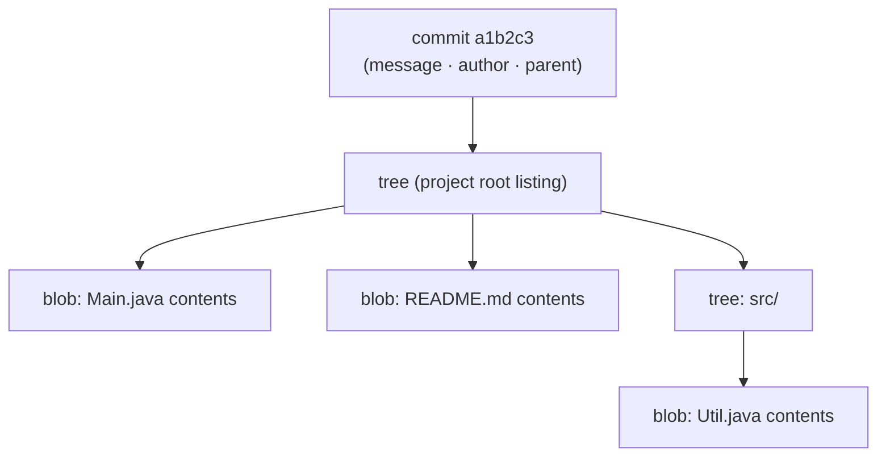
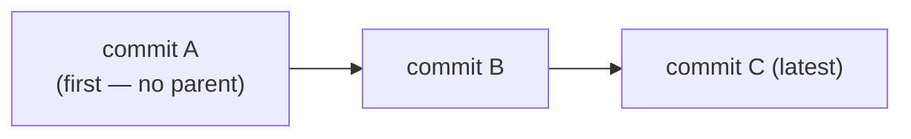
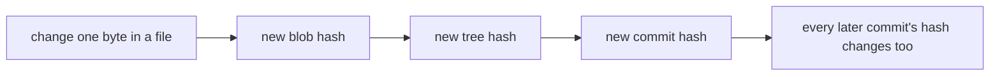
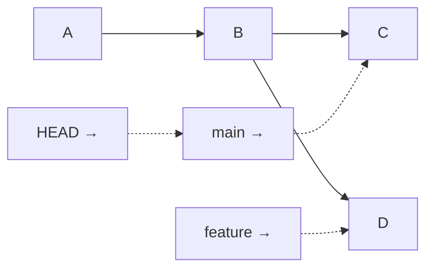
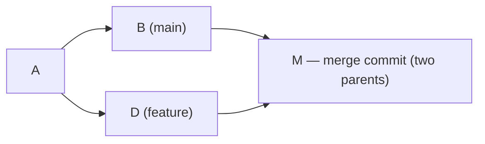
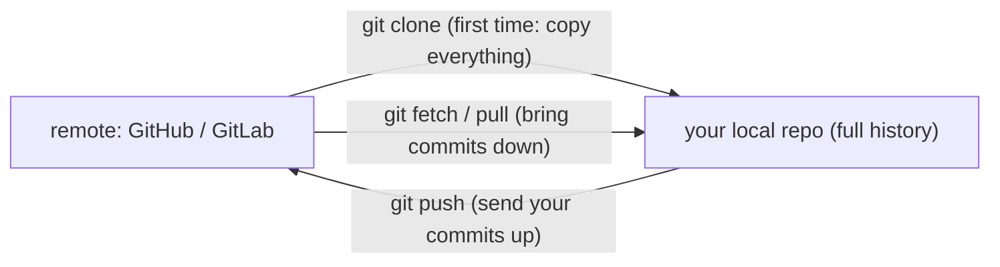

# Introduction to Git & Version Control

Every real project — and every job — runs on **version control**, and in practice that means **Git**. It's how you save the history of your work, undo mistakes, try ideas on a branch, and collaborate without overwriting each other. Most tutorials teach Git as a list of commands to memorize; you'll learn the commands too, but the reason Git feels confusing is that people never see **what it's actually doing underneath**. So this topic does both: the everyday workflow (`add`, `commit`, `branch`, `merge`, `push`) *and* Git's elegant **object model** — how it stores your history as content-addressed **snapshots**, which makes branches almost free and history tamper-evident. Each idea has a diagram.

> [!NOTE]
> Prerequisite: [Command-Line / Terminal Basics](./T08-command-line-terminal-basics.md) (`L0/C01/T08`) — you'll run Git as commands in a shell.

## Why Version Control

Without version control you get `report_final_v2_FINAL_really.docx` and no way to answer "what changed, when, and why?" A **Version Control System (VCS)** records your project as a series of **snapshots** over time, each labeled with who made it and why — so you can review history, compare versions, and roll back:



It also lets many people work in parallel and merge their work, and it's your safety net: every committed state can be recovered.

## Centralized vs Distributed — and Why Git Is Distributed

Older systems (like SVN) are **centralized**: one server holds the history, and you check out a working copy. Git is **distributed**: when you clone, you get the **entire repository and its full history** locally. You can commit, branch, and view history with no network; you sync with others only when you choose to.



This is why Git is fast (most operations are local) and resilient (every clone is a full backup).

## The Three Areas: Working Directory, Staging, Repository

The mental model that unlocks Git: your project lives in **three places**, and commands move changes between them.



- **Working directory** — the files you see and edit.
- **Staging area (index)** — a "draft" of your next commit; `git add` puts changes here, letting you commit *some* changes and not others.
- **Repository** (`.git/`) — the permanent history of commits; `git commit` writes the staged draft as a new snapshot.

The staging area is the part beginners find odd, but it's the key to crafting clean, deliberate commits.

## The Basic Workflow

```bash
$ git init                      # start a repo here (creates the .git/ folder)
$ git status                    # what's changed / staged?
$ git add Main.java             # stage Main.java for the next commit
$ git commit -m "Add greeting"  # snapshot the staged changes, with a message
$ git log --oneline             # view history
```

Each `commit` permanently records a snapshot you can return to. A good message says *why* the change was made — future-you will thank present-you.

## Under the Hood: How Git Stores Your History

Here's the part that makes everything else click. A common myth is that Git stores **diffs** (the lines that changed). It doesn't, conceptually — Git stores **complete snapshots**, built from four kinds of **object**, all identified by a hash of their content:

- **blob** — the *contents* of a file (just the bytes; no name).
- **tree** — a *directory listing*: names mapped to blobs (files) and other trees (subdirectories).
- **commit** — a *snapshot pointer*: the top tree, the **parent** commit(s), author, date, and message.
- **tag** — a friendly name for a specific commit (e.g. a release).

So one commit points to a tree, which points to blobs and subtrees — a complete picture of your project at that moment:



**Content addressing is the trick.** Every object's *name* is the **SHA hash of its content** (that `a1b2c3…`). Identical content always hashes to the same name, so Git automatically **deduplicates** — unchanged files in a new commit just reuse the existing blob (no copying), which is why snapshots are cheap despite "storing everything."

> [!NOTE]
> **Going deeper.** "Snapshots, not diffs" is the *model*; for storage efficiency Git later compresses objects into **packfiles** using deltas behind the scenes. And while classic Git uses **SHA-1**, it is migrating to **SHA-256**. You think in snapshots; Git optimizes the bytes.

## Under the Hood: History Is a Chain of Snapshots

Because each commit records its **parent**, the history forms a chain (more precisely a **DAG** — directed acyclic graph, since merges have two parents). Newest to oldest:



(The arrows show time order; internally each commit *points back* to its parent — `C`→`B`→`A`.) This chaining gives Git a powerful integrity property: since a commit's hash is computed from its tree **and** its parent's hash, changing anything in the past changes that commit's hash — and therefore every descendant's hash too. History is **tamper-evident**, like a chain of fingerprints:



## Branches Are Just Pointers

A **branch** sounds heavy — like copying all your files — but in Git it's just a **movable pointer to a commit** (a tiny file holding one hash). **`HEAD`** is a pointer to the branch you're currently on. That's why creating a branch is instant and free:



When you commit, Git creates the new commit and just **moves the current branch pointer forward**. Switching branches repoints `HEAD`.

```bash
$ git branch feature        # create a pointer at the current commit
$ git switch feature        # move HEAD onto it (older: git checkout)
$ git switch -c feature     # create + switch in one step
```

## Merging

**Merging** brings one branch's work into another. If nothing diverged, Git just **fast-forwards** the pointer. If both branches changed, Git creates a **merge commit** with **two parents**, combining both histories:



```bash
$ git switch main
$ git merge feature         # fast-forward, or create a merge commit
```

If both branches edited the **same lines**, Git can't decide and reports a **merge conflict** — it marks the spots and you choose the right result, then commit. (Rebase, an alternative that replays commits onto a new base, comes later.)

## Remotes & Collaboration

A **remote** is a shared copy of the repo (often on **GitHub** or **GitLab**). You sync your local full repo with it:



```bash
$ git clone https://github.com/user/project.git   # copy a repo locally
$ git push                                          # upload your commits
$ git pull                                          # download + merge others' commits
```

`git pull` is really `git fetch` (download) **+** `git merge` (combine). Day-to-day teamwork is: branch → commit → push → open a Pull Request for review → merge.

## What Not to Commit

Commit your **source**, not things that are generated or secret. Tell Git to ignore those with a **`.gitignore`** file:

```text
# build output (the .class files javac produces — see T04 — are regenerated)
target/
out/
*.class

# secrets and local config — NEVER commit these
.env
*.key
```

> [!WARNING]
> Two costly mistakes: (1) **committing secrets** (passwords, API keys, `.env`) — once pushed, treat them as leaked even if you delete them later, because they remain in history (the tamper-evident chain above). (2) **committing build artifacts** (`*.class`, `target/`, `node_modules/`) — they bloat the repo and cause noise; they're rebuildable, so ignore them.

> [!INTERVIEW]
> Git is effectively required. Be ready for: **`git add` vs `git commit`?** (stage changes into the index vs record the staged snapshot in history); **"What is a branch?"** (a movable pointer to a commit — cheap, not a copy); **"How does Git store data?"** (content-addressed snapshots: blobs, trees, commits, named by SHA hash); **"`fetch` vs `pull`?"** (fetch downloads; pull = fetch + merge). Knowing the object model makes you stand out.

## Practice

1. **Why VCS.** Give three concrete things version control gives you that "save copies in folders" does not.
2. **Three areas.** Name the three areas a file moves through and the command that moves it from each to the next. What is the staging area *for*?
3. **First repo.** From a terminal: `git init` a folder, create a file, and make your first commit. Then `git log --oneline` — what do you see?
4. **Object model.** In your own words, what are a blob, a tree, and a commit, and how do they reference each other? Why does Git store snapshots rather than diffs?
5. **Content addressing.** Why do two identical files anywhere in your project share one blob? What's the benefit?
6. **Branch = pointer.** Explain why creating a branch is instant. What does `HEAD` point to, and what moves when you commit?
7. **Merge.** Draw two branches that diverged from commit A and the merge commit M that joins them. How many parents does M have?
8. **Remotes.** Explain `clone`, `push`, and `pull` (and why pull is two operations). 
9. **Ignore it.** Write a `.gitignore` for a Java project, and explain why `*.class` belongs there (tie it to T04).

## Recap

You should now be able to:

- Explain what a **VCS** is and why Git is **distributed** (every clone is a full repo + history).
- Use the **three-area model** — working directory → (`git add`) staging → (`git commit`) repository → (`git push`) remote — and the basic workflow.
- Explain Git's **object model** under the hood: **blobs, trees, commits, tags**, stored as **content-addressed snapshots** (named by SHA hash), with automatic **deduplication**.
- Explain that history is a **chain/DAG** of commits linked by **parent** pointers, and why that makes it **tamper-evident**.
- Explain that **branches are movable pointers** (with `HEAD`), why branching is cheap, and how **merging** works (fast-forward vs a two-parent merge commit, and conflicts).
- Collaborate with **remotes** (`clone`, `push`, `fetch`/`pull`) on GitHub/GitLab.
- Use **`.gitignore`** to keep secrets and build artifacts (like `*.class`) out of history.

## Next

Continue to [Reading Errors & Stack Traces](./T11-reading-errors-and-stack-traces.md).
