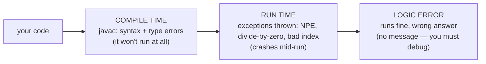
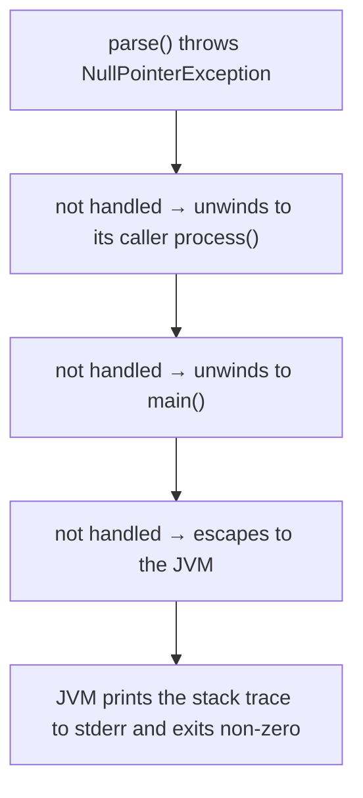
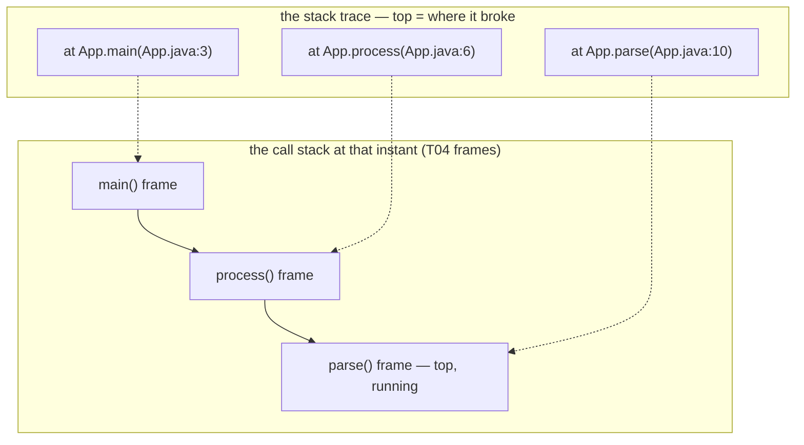
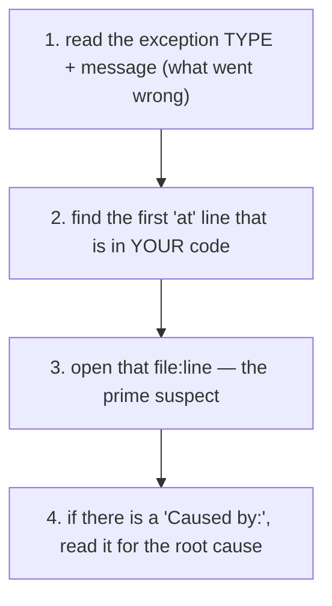
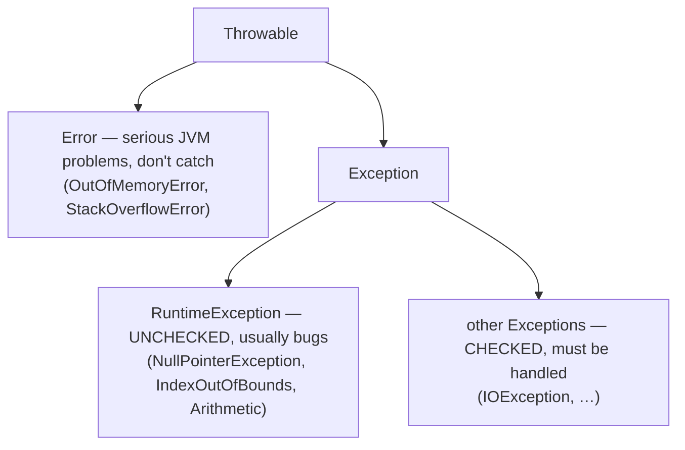

# Reading Errors & Stack Traces

Beginners see a red wall of error text and panic; experienced developers **read it** and go straight to the problem. That difference is a *learnable* skill, and it's the perfect close to this chapter because it ties everything together: a **stack trace is literally a snapshot of the call stack** — the very frames you met in `L0/C01/T04`. This topic teaches you to distinguish the **three kinds of problems**, read a **compiler error**, and — the main event — dissect a **runtime exception's stack trace** to find exactly where and why your program broke. Each idea has a diagram, and we'll debug a real exception end to end.

> [!NOTE]
> Prerequisite: [Source to Bytecode to JVM to Machine Code](./T04-source-to-bytecode-to-jvm-to-machine-code.md) (`L0/C01/T04`) — **stack frames** and the call stack. We also build on compile-vs-runtime from `T03`, the debugger from `T07`, and **stderr/exit codes** from `T08`.

> [!TIP]
> Reframe errors as **feedback, not failure**. The compiler and JVM are telling you precisely what's wrong, with a file and a line number. Read the message *first* — most of the answer is right there.

## Three Kinds of Problems

Problems show up at different moments, and knowing *which* kind you have tells you how to fix it:



- **Compile-time errors** — `javac` rejects the code; nothing runs (caught by the parser/semantic-analysis phases from `T03`, and shown live by your IDE, `T07`).
- **Runtime errors (exceptions)** — it compiled, but something illegal happens *while running*.
- **Logic errors** — it runs without complaint but produces the wrong result; there's no error to read, so you trace/debug (`T09`/`T07`).

## Compile-Time Errors

`javac` reports these as `file:line: error: message`. Read the **line** and the **message**:

```text
$ javac App.java
App.java:6: error: ';' expected
        int n = parse(s)
                        ^
App.java:9: error: incompatible types: String cannot be converted to int
        int x = "hi";
                ^
2 errors
```

The `^` points at the spot. Common ones and what they mean:

| Message | Meaning |
|---------|---------|
| `';' expected` | missing punctuation — a **parser** (syntax) complaint (`T03`) |
| `cannot find symbol` | a name (variable/method/class) isn't declared or is misspelled / not imported |
| `incompatible types` | a **type** mismatch — the **semantic-analysis** phase (`T03`) |
| `missing return statement` | a non-`void` method can finish without returning |

Fix them top-to-bottom — a single early mistake often cascades into several later messages.

## Runtime Errors Are Exceptions

Once running, when something illegal happens (using a `null`, dividing by zero, indexing past an array), the JVM **throws an exception** — it creates an exception *object* describing the problem and stops normal flow. If your code doesn't **catch** it (you'll learn `try/catch` in L1), the exception **propagates up the call stack**; if it escapes `main`, the JVM prints a **stack trace** to **stderr** (`T08`) and exits with a **non-zero** code (`T08`):



## Under the Hood: Anatomy of a Stack Trace

This is the key skill. A **stack trace is a photograph of the call stack at the instant the exception was thrown** — the exact frames from `T04`. Consider:

```text
Exception in thread "main" java.lang.NullPointerException: Cannot invoke
        "String.length()" because "s" is null
        at App.parse(App.java:10)
        at App.process(App.java:6)
        at App.main(App.java:3)
```

Read it in two parts:

- **First line** — the **exception type** (`java.lang.NullPointerException`) and a **message** explaining it. (Since Java 14, NPE messages even name *which* variable was null.)
- **The `at …` lines** — the **stack frames**, newest on **top**. The top line is **where the exception was thrown**; each line below is the **caller**, down to `main` at the bottom. Each shows `Class.method(File.java:line)`.

Line-for-line, the trace *is* the call stack:



> [!NOTE]
> **`Caused by:`** — when one exception wraps another, the trace shows a `Caused by:` section beneath the first. That chained exception is the **original root cause** (e.g. a low-level `SQLException` wrapped in a higher-level one). When you see `Caused by:`, read *it* for the real problem.

## How to Read a Trace, Fast

Don't read top-to-bottom word by word. Use this:



The trick in step 2: the very top frames are often inside **library** code (e.g. deep in `java.base`), which is rarely *your* bug. Scan down to the first frame in **your** package/file — that's almost always where to start looking.

> [!WARNING]
> Don't paste the trace into a search engine before *reading* it. The exception **type**, the **message**, and the **file:line in your code** usually tell you the answer directly. Searching helps for unfamiliar library errors — but read first.

## Worked Example: Finding a NullPointerException

```java
public class App {
    public static void main(String[] args) {
        process(null);            // line 3 — passes null down
    }
    static void process(String s) {
        int n = parse(s);         // line 6
        System.out.println(n);
    }
    static int parse(String s) {
        return s.length();        // line 10 — NPE: s is null here
    }
}
```

It compiles fine, but running it prints (to stderr):

```text
Exception in thread "main" java.lang.NullPointerException: Cannot invoke
        "String.length()" because "s" is null
        at App.parse(App.java:10)
        at App.process(App.java:6)
        at App.main(App.java:3)
```

**Reading it:** (1) type = `NullPointerException`, message = `"s" is null`. (2) top frame in our code is `App.parse(App.java:10)`. (3) open line 10: `return s.length();` — we called `.length()` on `s`, which is `null`. (4) no `Caused by`. The trace below line 10 shows *how we got here*: `main` (line 3) passed `null` → `process` (line 6) passed it on → `parse` (line 10) dereferenced it. **Fix:** don't pass `null` (or guard with a null check). The trace handed us the whole story.

## The Common Exceptions

You'll meet these constantly; learn to recognize them on sight:

| Exception | Typical cause | Usual fix |
|-----------|---------------|-----------|
| `NullPointerException` | using a reference that is `null` | initialize it / check for `null` |
| `ArrayIndexOutOfBoundsException` | index outside `0 .. length-1` | check bounds / fix off-by-one (`T09`) |
| `StringIndexOutOfBoundsException` | char index past the string | check `length()` |
| `ClassCastException` | casting to the wrong type | verify type / use `instanceof` |
| `NumberFormatException` | `Integer.parseInt("abc")` | validate input before parsing |
| `ArithmeticException` | integer `/ 0` | guard the divisor |
| `StackOverflowError` | infinite recursion — frames pile up (`T04` stack) | add/fix a base case |
| `OutOfMemoryError` | the heap fills up (`T04` heap) | fix a leak / raise heap size |
| `NoClassDefFoundError` | a class isn't on the classpath (`T05`/`T07`) | fix the classpath |

Notice `StackOverflowError` and `OutOfMemoryError` are exactly the two `T04` memory regions overflowing — the stack and the heap.

## The Exception Family

Everything throwable descends from **`Throwable`**, and the split matters (full treatment in L1):



- **Errors** signal the JVM is in trouble — you generally don't catch them.
- **`RuntimeException`s are unchecked** — typically programming bugs you should *fix*, not catch.
- **Checked exceptions** the compiler forces you to handle (you'll do `try/catch` and `throws` in L1).

## Logic Errors: No Trace to Read

The trickiest bugs throw **nothing** — the program runs and quietly gives a wrong answer. There's no stack trace, so you fall back on the skills from earlier topics: **trace it by hand** (`T09`), add `System.out.println` checkpoints, or — best — set a **breakpoint and step through in the debugger** (`T07`), watching variables until reality diverges from what you expected.

> [!INTERVIEW]
> Expect: **"How do you read a stack trace?"** — read the exception type + message, then find the first frame in your own code (top of the trace = where it was thrown), then follow `Caused by:` for the root cause. **"Error vs Exception?"** — `Error` = serious JVM failures (don't catch); `Exception` = recoverable, split into **checked** (compiler-enforced) and **unchecked** (`RuntimeException`, usually bugs). Naming the common exceptions and their causes is expected.

## Practice

1. **Classify.** For each, say compile-time, runtime, or logic: (a) a missing semicolon; (b) `int x = arr[5]` on a length-3 array; (c) an average that's always off by one. How would you find each?
2. **Read the message.** Given `App.java:9: error: cannot find symbol`, list two likely causes.
3. **Trace = stack.** In your own words, what is a stack trace a snapshot of? Which `T04` concept is each `at …` line?
4. **Top or bottom?** In a trace, which line is *where the exception was thrown*, and which is `main`? Which line do you usually open first, and why not the very top?
5. **Walk the example.** Using the worked `App` trace, explain in one sentence each how `main`, `process`, and `parse` contributed to the NPE, and give a fix.
6. **Name that exception.** Which exception for: indexing `s.charAt(10)` on a 4-char string? `Integer.parseInt("12x")`? `10 / 0` (ints)? infinite recursion?
7. **Caused by.** What does a `Caused by:` section tell you, and how should it change where you look?
8. **No trace.** Your method returns the wrong sum but throws nothing. Describe two ways to find the bug (tie to `T07`/`T09`).

## Recap

You should now be able to:

- Distinguish **compile-time errors**, **runtime exceptions**, and **logic errors**, and know the right approach for each.
- Read a **`javac` error** (`file:line: error: message`) and recognize the common ones (`';' expected`, `cannot find symbol`, `incompatible types`).
- Explain that an uncaught **exception propagates up the call stack** and the JVM prints a **stack trace to stderr** and exits **non-zero** (`T08`).
- **Dissect a stack trace**: the exception **type + message**, and the `at …` frames as the **call stack** from `T04` (top = thrown, bottom = `main`), including **`Caused by:`** chains.
- Read a trace **efficiently** — type/message first, then the first frame in *your* code.
- Recognize the **common exceptions** and their causes, including `StackOverflowError`/`OutOfMemoryError` as the `T04` stack/heap overflowing.
- Place exceptions in the **`Throwable` hierarchy** (Error vs Exception; checked vs unchecked — full detail in L1).
- Fall back to **debugging/tracing** (`T07`/`T09`) for logic errors that produce no trace.

## Next

You've finished **`L0/C01` — CS & Programming Foundations**. Continue to the next chapter: [Program Structure (class, main, statements)](../C02-java-core/T01-program-structure-class-main-statements.md) — your first real Java code.
