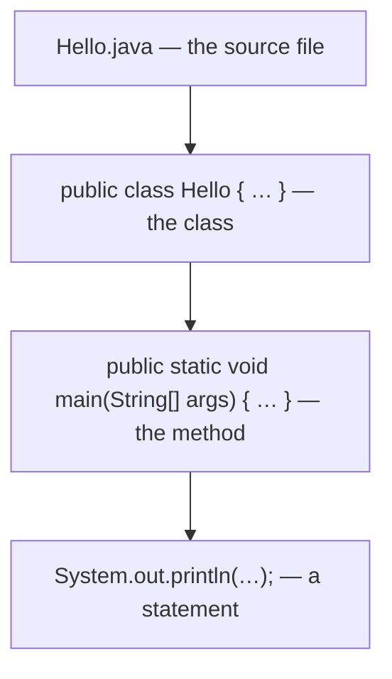
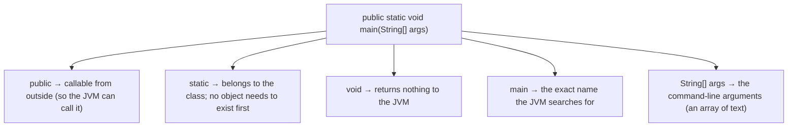
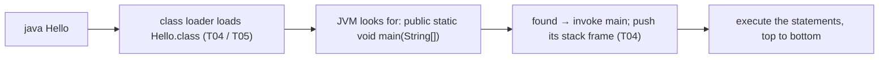
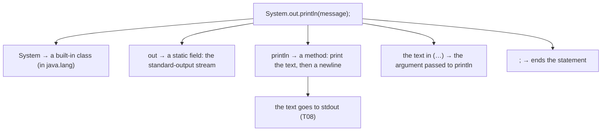
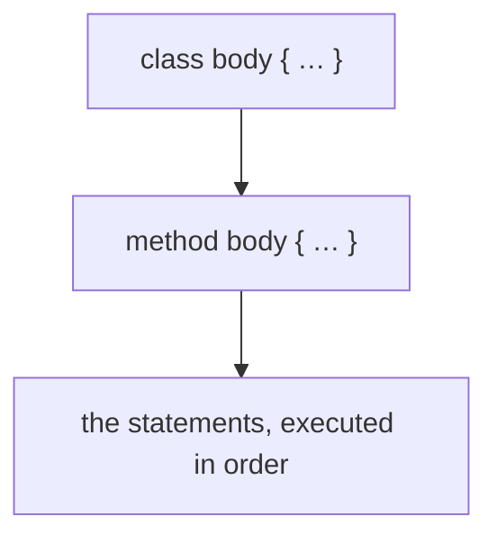
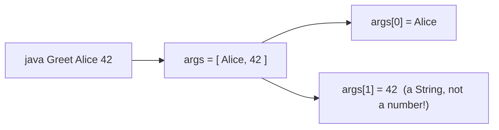

# Program Structure (class, main, statements)

This is where you write your first real Java. In `L0/C01` you built the whole mental model *underneath* the language — bits, the CPU, bytecode, the JVM, the tools. Now we cash that in: we'll write the classic "Hello, World!" and **dissect every single token**, because in this book nothing is magic. By the end you'll know *why* a Java program needs a **class**, what every word in `public static void main(String[] args)` means, how the **JVM finds and calls** that method (the exact chain from `L0/C01/T04`), and what a **statement** is. Each piece comes with a diagram.

> [!NOTE]
> Prerequisites: [Source to Bytecode to JVM to Machine Code](../C01-cs-foundations/T04-source-to-bytecode-to-jvm-to-machine-code.md) (`L0/C01/T04`) — how `java` loads a class and calls `main`; and [Command-Line / Terminal Basics](../C01-cs-foundations/T08-command-line-terminal-basics.md) (`L0/C01/T08`) — to compile and run it, and for `stdout` and arguments.

## Your First Program

Here it is — save it as `Hello.java`:

```java
public class Hello {
    public static void main(String[] args) {
        System.out.println("Hello, World!");
    }
}
```

Compile and run it (the cycle from `L0/C01/T06`/`T08`):

```bash
$ javac Hello.java     # compile → Hello.class (bytecode)
$ java Hello           # run on the JVM
Hello, World!
```

Five lines, but *every* token is there for a reason. Let's take it apart from the outside in: **file → class → method → statement**.



## Everything Lives in a Class

In Java, **all code lives inside a class** — there are no free-floating functions like in some languages. A class is the basic unit of code (you'll learn what classes *model* in `C02`/`L1`; for now it's the container your program lives in).

```java
public class Hello {
    // ... everything goes inside these braces ...
}
```

Two rules to absorb now:

- The **file name must match the public class name**: `public class Hello` must be in `Hello.java`. (This is how `javac` and the JVM map names to files.)
- Each class compiles to its **own `.class` file** — `Hello.class` (exactly the bytecode artifact from `L0/C01/T04`).

> [!WARNING]
> `public class Hello` in a file named `hello.java` or `Main.java` → compile error like *"class Hello is public, should be declared in a file named Hello.java."* The name and case must match.

## The `main` Method: the Entry Point

When you run a program, the JVM has to start *somewhere*. By universal convention that somewhere is a method with this **exact signature** — `main`. Memorize it, then understand each part:



- **`public`** — an *access modifier*; the JVM calls `main` from "outside" your code, so it must be visible.
- **`static`** — `main` belongs to the **class itself**, not to an object. This matters: when the program starts there are *no objects yet*, so the JVM must be able to call `main` without creating one. (Full meaning of `static` comes in its own topic.)
- **`void`** — `main` hands no value back to the JVM. (The program's success/failure is reported via exit codes — `L0/C01/T08` — not a return value.)
- **`main`** — the special name; the JVM looks for precisely this.
- **`String[] args`** — an **array** of `String`s holding any command-line arguments (more below). `String[]` means "array of String."

## Under the Hood: How the JVM Calls `main`

This connects the first line of code straight to all of `L0/C01`. Running `java Hello` does this:



If the JVM *can't* find that exact method, it stops before running anything with `Error: Main method not found in class Hello` — which is why the signature must be exact (a lowercase `Main`, a missing `static`, or a wrong parameter type all break it). The `main` frame is the **bottom** frame of every stack trace you read in `L0/C01/T11` — now you know why.

## Statements

Inside `main` are **statements** — the individual instructions, each ending with a **semicolon** `;`, executed **top to bottom** (the *sequence* building block from `L0/C01/T09`). Our program has one:



So `System.out.println("Hello, World!");` reads as: on the `out` stream of the `System` class, call `println` with the text `"Hello, World!"`. The text in double quotes is a **String literal** (text data — recall encodings from `L0/C01/T01`). `println` adds a newline; `print` does not. And `System.out` *is* the **stdout** stream from `L0/C01/T08` — redirect it with `java Hello > out.txt` and "Hello, World!" lands in the file.

> [!WARNING]
> A missing semicolon is the most common first error: `';' expected` (the parser complaint from `L0/C01/T03`). Every statement needs its `;`.

## Blocks and Braces

Curly braces `{ }` group statements into a **block**. The class has a body block; the method has a body block; blocks nest:



Braces always come in pairs, and the indentation (4 spaces per level, by convention) exists purely to make that nesting visible to humans — the compiler ignores it (next section). Blocks also define **scope** (where a name is visible), which you'll meet properly in a later topic.

## Comments

**Comments** are notes for humans; the compiler ignores them entirely. Three forms:

```java
// a single-line comment — to the end of the line

/* a block comment
   spanning multiple lines */

/** a Javadoc comment — documents the code below it (covered later) */
```

Use them to explain *why*, not to restate the obvious.

## Whitespace and Style

Java is **free-form**: extra spaces, blank lines, and line breaks don't change meaning — the lexer (from `L0/C01/T03`) discards them. These two compile identically:

```java
public class Hello{public static void main(String[]args){System.out.println("Hello, World!");}}
```

But you'd never write that — **readability is the point.** Conventions you should adopt from day one: one statement per line, 4-space indentation per block, class names in `PascalCase` (`Hello`), method/variable names in `camelCase` (`main`, `args`). And Java is **case-sensitive**: `System` is not `system`, `String` is not `string`.

## Command-Line Arguments

`String[] args` receives whatever you type after the class name — exactly the arguments the shell passes (from `L0/C01/T08`):

```java
public class Greet {
    public static void main(String[] args) {
        System.out.println("Hello, " + args[0] + "!");  // args[0] = first argument
    }
}
```

```bash
$ java Greet Alice
Hello, Alice!
```



Note `args[1]` is the **text** `"42"`, not the number — converting text to numbers (`Integer.parseInt`) comes later. (Arrays and the `+` string concatenation here are covered in their own topics; this is just a taste.)

> [!NOTE]
> **Going deeper — the modern shorter `main`.** Recent Java versions (a preview feature around Java 21+, aimed at beginners) let you write a much smaller program — even just `void main() { System.out.println("Hi"); }` in an unnamed class. It's lovely for first steps, but the **full `public static void main(String[] args)` is universal** and what you'll see everywhere, so learn it first.

## Common Beginner Errors

```java
public class Hello {
    public static void main(String[] args) {
        System.out.println("Hello, World!")   // ← missing semicolon
    }
}
```

The usual first stumbles, all explainable with what you now know:

- **Filename ≠ class name** → "should be declared in a file named …" (the name-to-file rule).
- **Missing `;`** → `';' expected` (parser, `T03`).
- **Wrong `main` signature** (no `static`, lowercase `main`, wrong params) → `Main method not found` (the JVM lookup above).
- **Capitalization** → `system.out` or `String` vs `string` → `cannot find symbol` (Java is case-sensitive).

> [!INTERVIEW]
> A classic warm-up: **"Explain `public static void main(String[] args)`."** Cover each token, and especially **why `static`** — the JVM must call `main` *without creating an object*, since none exist when the program starts. Likely follow-ups: *what if you drop `static`?* (the JVM can't invoke it → runtime "main not found"); *what is `String[] args`?* (command-line arguments); *what is `System.out`?* (the standard-output `PrintStream`).

## Practice

1. **Write and run.** Type the `Hello.java` program, compile with `javac`, run with `java`, and confirm the output. Which command produces `Hello.class`?
2. **Dissect `main`.** Explain each of `public`, `static`, `void`, `main`, and `String[] args` in your own words. Why is `static` essential at program start?
3. **Break it on purpose.** Remove the semicolon and recompile — what's the exact error and which compiler phase (from `T03`) produced it? Restore it, then rename the file to `hi.java` and recompile — what error now?
4. **Trace the launch.** In your own words, list what `java Hello` does from class loading to running the first statement (tie to `T04`).
5. **Dissect the statement.** Break `System.out.println("Hello, World!");` into its parts and say where the text ends up (tie to `T08`).
6. **Arguments.** Write a program that prints `Hello, X!` where `X` is the first command-line argument, and run it with your name. What type is `args[0]`?
7. **Whitespace.** Reformat Hello World onto a single line; does it still compile? What does that tell you about how Java treats whitespace?
8. **Comments.** Add a `//` comment and a `/* */` comment to your program. Do they change the output? Why not?

## Recap

You should now be able to:

- Write, compile, and run a minimal Java program, and explain the **file → class → method → statement** structure.
- Explain that **all Java code lives in a class**, that the **file name must match the public class**, and that each class becomes its own **`.class`** (`T04`).
- Dissect **`public static void main(String[] args)`** token by token — especially **why `static`** (the JVM calls it with no object yet) — and recognize `String[] args` as command-line arguments.
- Describe **how the JVM finds and calls `main`** (load → find the exact signature → invoke → push its frame), connecting to `T04`/`T05` and why `main` sits at the bottom of every stack trace (`T11`).
- Explain **statements** (semicolon-terminated, run in sequence) and dissect `System.out.println(...)`, including that `System.out` is **stdout** (`T08`).
- Use **blocks/braces**, **comments** (`//`, `/* */`, `/** */`), and good **whitespace/naming** conventions, knowing Java is **case-sensitive** and free-form.
- Read **command-line arguments** via `args`, and recognize the **common beginner errors** and their precise causes.

## Next

Continue to [Variables & Primitive Types](./T02-variables-and-primitive-types.md).
