# Variables & Primitive Types

A program is **data plus operations on that data**. So far we have the skeleton — class, `main`, statements — but no data of our own. This topic gives us both: how to **name a piece of data** (a *variable*) and the **eight built-in types** Java offers for the simplest kinds of data (numbers, true/false, characters).

But we will not stop at the language level. For a real backend engineer, "what is a variable" is a chain that runs from **a name in source code → a slot in a stack frame → bytes at a real address in RAM → bits in a CPU register**. By the end of this topic you should be able to point to where every single primitive lives, count its bytes, explain what happens during a method call, distinguish a 32-bit JVM from a 64-bit JVM, and read the actual x86-64 / ARM64 instructions the JIT emits for `int x = 42;`. We will go layer by layer.

> [!NOTE]
> Prerequisites: [Program Structure](./T01-program-structure-class-main-statements.md) (`L0/C02/T01`); [How Computers Run Programs](../C01-cs-foundations/T01-how-computers-run-programs-cpu-memory-binary.md) (`L0/C01/T01`) — CPU, registers, RAM, fetch-decode-execute; [Number Systems & Basic Bit Math](../C01-cs-foundations/T02-number-systems-binary-hex-and-basic-bit-math.md) (`L0/C01/T02`) — binary, two's complement, integer ranges, overflow; [Source to Bytecode to JVM to Machine Code](../C01-cs-foundations/T04-source-to-bytecode-to-jvm-to-machine-code.md) (`L0/C01/T04`) — stack frames, local variable array, operand stack, JIT.

## What Is a Variable? (Memory-Level)

A **variable** is a **name** the language gives to a **typed region of memory** that holds a **value**. Three pieces, always — *name* (so source code can refer to it), *type* (so the compiler knows the size and the legal operations), and *value* (the bit pattern stored right now).

But that's the language-level view. One layer down, a variable is **an address** (a number naming a specific byte in RAM) plus a **width** (how many bytes from that address belong to this variable). At the deepest layer, it's a **physical region of silicon** holding electrical charge — DRAM capacitors for heap memory, SRAM cells for cache, flip-flop circuits for CPU registers (recall `L0/C01/T01`).

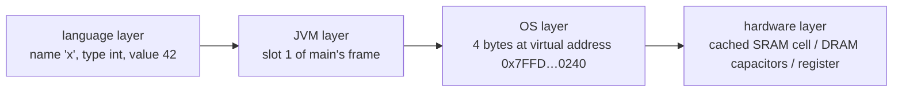

Each layer is an **abstraction**: the JVM hides the address from you, the OS hides physical RAM, the CPU hides the cache. Every layer has a story, and a fluent backend engineer can drop down a level when the bug or performance question demands it.

In Java you write a variable's declaration in this shape:

```java
int x = 42;
```

That single line says all three things: **type** = `int`, **name** = `x`, **initial value** = `42`. Compile this inside a method and the JVM will reserve a slot for `x` (we'll see exactly where), `javac` will emit bytecode that pushes 42 onto the operand stack and stores it into that slot, and at runtime — if the JIT compiles the method — a CPU register or memory location will end up holding the 32-bit pattern `0x0000002A`.

> [!IMPORTANT]
> Java is **statically and strongly typed**. *Statically* = every variable's type is decided at compile time and **cannot change** (`x` is an `int` forever; you can't later store text in it). *Strongly* = the compiler refuses operations that don't fit the type (`x.length()` is not legal — `int` has no methods). This catches a huge class of bugs before the program runs, and it lets the compiler pre-compute things like "this slot is 4 bytes wide" — which is what makes the rest of the mechanism in this topic possible.

## Declaring and Assigning

There are three syntactic forms — the third bundles the first two:

```java
int a;          // 1) declaration only  — reserves the slot, leaves it uninitialised (for locals)
a = 10;         // 2) assignment        — writes a value into the existing slot
int b = 20;     // 3) declaration + assignment (combined, the form you'll use 99% of the time)
```

Once declared, a variable can be **re-assigned** as often as you like — that *is* the point of a "variable":

```java
int x = 42;
x = x + 1;      // read x (42), add 1, write back → x is now 43
x = 100;        // overwrite again
```

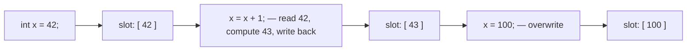

What you **cannot** do is change `x`'s **type**. `x = "hello";` is a compile error — the slot is sized and interpreted as a 32-bit signed integer; a String reference doesn't belong there.

> [!WARNING]
> **Definite assignment (locals).** A *local* variable (declared inside a method) **must be assigned before it's read** — otherwise the compiler refuses to build the program:
> ```java
> int x;
> System.out.println(x);   // ERROR: variable x might not have been initialized
> ```
> This is the **definite-assignment** rule. Class fields are different — they get an automatic default; see the [Default Values](#default-values-vs-definite-assignment-locals) section. The reason fields and locals differ is mechanical: a field lives in heap memory the JVM zero-initialises on allocation, while a local lives in a stack-frame slot that the previous call may have left dirty. The rule plugs that hole at compile time.

## Java's Type System: Primitives vs References

Every value in Java is either a **primitive** (one of the eight built-in non-object types we're about to learn) or a **reference** (a pointer to an object on the heap — `String`, arrays, your own classes). Primitives carry their **value directly** in the slot; references carry a **pointer** to a separately-allocated object elsewhere in memory.

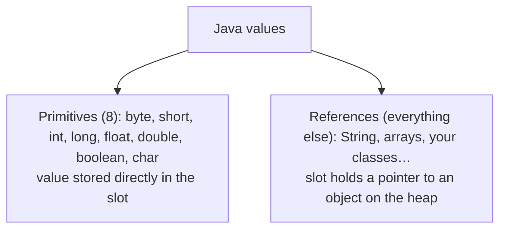

This distinction drives **every** memory question you will ever ask about Java. Primitives live wherever their owner lives (stack slot, object field, array element). References live with their owner — but the *object they point to* always lives on the **heap**, separately. We'll revisit this in the "Where Variables Actually Live" section.

This whole topic is about the eight primitives. References, objects, and the heap (in language terms) are the subject of `L1/C01`; we still touch their *memory* shape here because it's the only way to compare costs honestly.

## The Eight Primitive Types — Overview

Java has **exactly eight** primitive types. Memorise this table — every Java program is built on it:

| Type      | Size (bits) | Kind            | Range / values                                      | Default     | Literal suffix | JVM slots¹ |
|-----------|:-----------:|-----------------|-----------------------------------------------------|-------------|:--------------:|:----------:|
| `byte`    | 8           | signed integer  | −128 … 127                                          | `0`         | —              | 1          |
| `short`   | 16          | signed integer  | −32 768 … 32 767                                    | `0`         | —              | 1          |
| `int`     | 32          | signed integer  | −2 147 483 648 … 2 147 483 647                      | `0`         | — (default)    | 1          |
| `long`    | 64          | signed integer  | −9 223 372 036 854 775 808 … 9 223 372 036 854 775 807 | `0L`     | `L` / `l`      | 2          |
| `float`   | 32          | IEEE 754        | ≈ ±3.4 × 10³⁸, ~7 decimal digits of precision      | `0.0f`      | `f` / `F`      | 1          |
| `double`  | 64          | IEEE 754        | ≈ ±1.8 × 10³⁰⁸, ~15–17 decimal digits of precision | `0.0`       | `d` / `D` (optional; default) | 2 |
| `boolean` | 1 logical²  | truth value     | `true`, `false`                                     | `false`     | —              | 1          |
| `char`    | 16          | UTF-16 code unit (unsigned) | `''` … `'￿'` (0 – 65 535)    | `''`  | —              | 1          |

¹ A **JVM slot** is the logical 32-bit unit of the JVM stack-frame local-variable array. The physical slot on a 64-bit JVM is typically wider (see [Inside a JVM Stack Frame](#inside-a-jvm-stack-frame)).
² The JVM spec says `boolean` is logically 1 bit; in practice an implementation stores it in **1 byte on the heap** (inside objects/arrays) and **1 int-sized slot on the operand stack** — there is no `bload` opcode, `iload` is reused.

The rest of the topic is the **mechanism** behind each row.

## Integer Types — `byte`, `short`, `int`, `long`

All four integer primitives use the same machinery: **two's-complement binary** (`L0/C01/T02` covered this in full). The only thing that changes is the **width** (8, 16, 32, 64 bits) and therefore the range. Here is `int` (32 bits) laid out bit-by-bit:

```
 bit 31                                                                                  bit 0
 ┌──┬───────────────────────────────────────────────────────────────────────────────────────┐
 │S │                          31 value bits (two's complement)                             │
 └──┴───────────────────────────────────────────────────────────────────────────────────────┘
  sign                                                                                 LSB
  (0 = non-negative; in two's complement, the leading 1 also carries arithmetic weight −2³¹)
```

`byte`, `short`, and `long` are the same shape with 7, 15, and 63 value bits respectively. The range follows: a *w*-bit signed integer covers `−2^(w−1) … 2^(w−1) − 1` — the asymmetry comes from `0` taking a "positive" slot, leaving room for one more negative than positive.

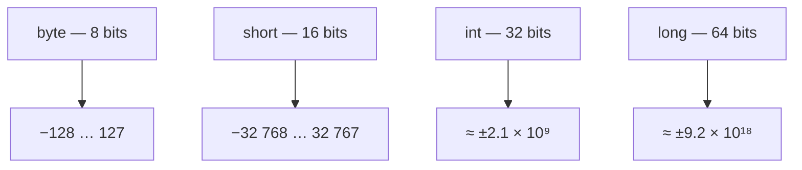

In Java code, an **integer literal** is `int` **by default** — so `1_000_000_000` is an `int`. If the value won't fit in 32 bits, **add the `L` suffix** to make it a `long`:

```java
int  a = 2_147_483_647;        // OK — exactly Integer.MAX_VALUE
int  b = 3_000_000_000;        // COMPILE ERROR: integer literal out of range
long c = 3_000_000_000L;       // OK — the L makes it a long literal
long d = 1_000_000_000 * 3;    // OVERFLOWS as int first — silently wraps! See below.
long e = 1_000_000_000L * 3;   // OK — computed in long
```

Underscores `_` inside numeric literals are pure visual sugar (ignored by the lexer). Use them to group digits.

> [!WARNING]
> **Integer overflow wraps silently** (the wheel from `L0/C01/T02`):
> ```java
> int max = 2_147_483_647;
> System.out.println(max + 1);   // -2147483648  (NOT an error)
> ```
> Adding 1 to `Integer.MAX_VALUE` rolls over to `Integer.MIN_VALUE`. There is **no exception** unless you use `Math.addExact` (covered later). This is by design — the ALU just produces 32 wrong bits and moves on, exactly like the adder circuit from `T02`.

**Which to use?** Default to `int` for whole numbers. Use `long` when the value can exceed ±2 billion (counts of bytes in big files, nanosecond timestamps, large IDs). `byte` and `short` are rarely chosen for variables — they're mostly used for **arrays** of binary data (file/network buffers, image pixels) where the smaller per-element width saves memory in bulk; we'll see the byte math in [Memory Efficiency](#memory-efficiency-int-vs-integer).

## Floating-Point Types — `float`, `double`

Integers can't store fractions. For that Java has two **floating-point** types, both following the **IEEE 754** standard — the same format every modern CPU implements in hardware. The name "floating-point" refers to the format's trick: store a value as `(sign) × mantissa × 2^exponent`, which lets the binary "point" *float* to any position so a single 32- or 64-bit slot can express both very large and very small numbers.

### IEEE 754 Bit Layout

A `float` (32 bits) splits into three fields — sign, exponent, mantissa:

```
 bit 31  bit 30                       bit 23  bit 22                                       bit 0
 ┌──┬─────────────────────────────────┬──────────────────────────────────────────────────────┐
 │S │            Exponent (8 bits)    │              Mantissa / fraction (23 bits)           │
 └──┴─────────────────────────────────┴──────────────────────────────────────────────────────┘
   sign            biased exponent (stored = real + 127)         the fractional part of 1.xxxxxxx
```

A `double` (64 bits) uses the same shape, just wider — 1 + 11 + 52:

```
 bit 63  bit 62                          bit 52  bit 51                                        bit 0
 ┌──┬───────────────────────────────────┬──────────────────────────────────────────────────────┐
 │S │          Exponent (11 bits)       │                Mantissa (52 bits)                    │
 └──┴───────────────────────────────────┴──────────────────────────────────────────────────────┘
```

The **decoded value** (for the normal range) is:

```
value = (-1)^S × (1.mantissa)₂ × 2^(exponent − bias)
        where bias = 127 (float) or 1023 (double)
```

Two design choices to notice:

- The **leading 1** of the mantissa is **implicit** — every normal number is normalised so it starts with `1.`, and we don't waste a bit storing it. That's why a 23-bit mantissa gives ~24 bits of precision (≈7 decimal digits) and a 52-bit one gives ~53 bits (≈15–17).
- The exponent is **biased** rather than two's complement — stored value = real value + bias — so the raw bits sort the same way numbers do, which simplifies comparison hardware.

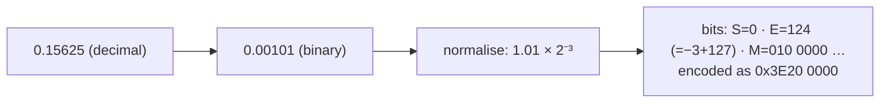

### Special Values

Some bit patterns are reserved:

| Pattern                              | Meaning                |
|--------------------------------------|------------------------|
| Exponent all 0s, mantissa all 0s     | **±0** (signed zero)   |
| Exponent all 0s, mantissa ≠ 0        | **Subnormals** (tiny values close to 0, lower precision) |
| Exponent all 1s, mantissa all 0s     | **±Infinity** (e.g. `1.0 / 0.0` — no `ArithmeticException` for `double`!) |
| Exponent all 1s, mantissa ≠ 0        | **NaN** (Not a Number — e.g. `0.0 / 0.0`, `Math.sqrt(-1.0)`) |

```java
System.out.println(1.0 / 0.0);    // Infinity
System.out.println(-1.0 / 0.0);   // -Infinity
System.out.println(0.0 / 0.0);    // NaN
System.out.println(Double.NaN == Double.NaN);  // false  — NaN is never equal to anything, even itself!
```

### Why `0.1 + 0.2 != 0.3`

Most decimal fractions **cannot be represented exactly in binary**. `1/10` in binary is the repeating fraction `0.0001100110011…` — it never terminates. So `0.1` stored as a `double` is the **closest representable binary fraction**, which is *slightly off*. The error compounds:

```java
System.out.println(0.1 + 0.2);    // 0.30000000000000004
System.out.println(0.1 + 0.2 == 0.3);  // false
```


> [!WARNING]
> **Never use `float`/`double` for money.** Tiny rounding errors compound into wrong dollars and cents — and `==` between two computed doubles is almost always a bug. For currency and any exact-decimal use case, use **`BigDecimal`** (covered in `L1/C02`).

### Choosing `float` or `double`, and Suffixes

A floating-point literal is `double` **by default** — so `3.14` is a `double`. To write a `float` literal you must append `f`:

```java
double pi   = 3.14;          // OK
float  piF  = 3.14f;         // OK — the f makes it a float literal
float  bad  = 3.14;          // COMPILE ERROR: possible lossy conversion from double to float
```

Default to **`double`** for any real-number calculation — it has more precision than `float` and runs at the same speed on modern CPUs. Use `float` only when memory really matters (huge graphics/ML arrays).

## `boolean`

A `boolean` is the simplest type: exactly **two values**, `true` or `false`. It's the type produced by every comparison (`x < y`, `a == b`). At its core a boolean is **one bit of information** — the AND/OR/NOT gates from `L0/C01/T01` operating on a single logic level.

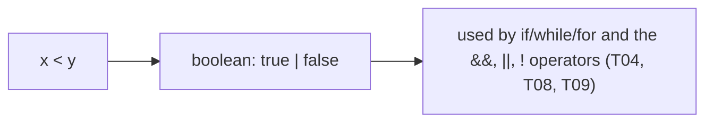

```java
boolean isReady = true;
boolean tooBig  = (x > 100);   // comparisons produce booleans
if (isReady && !tooBig) { /* ... */ }
```

Storage is **JVM-implementation-defined**. In HotSpot:

- **On the stack** (operand stack and local-variable array): one int-sized slot (4 logical bytes, 8 physical bytes on a 64-bit JVM). There is no `bload` opcode — the compiler emits `iload`/`istore` with `0` meaning `false` and `1` meaning `true`.
- **In a heap object**: 1 byte for a field of type `boolean`. (Inside a `boolean[]` it's also 1 byte per element — but there's a separate optimised packed bitset, `BitSet`, for densely packed bits.)

You can never read or write the underlying integer directly — `boolean` and `int` are not interchangeable in Java (unlike C), and `if (x)` with `x` an `int` is a compile error.

> [!NOTE]
> **Why `boolean` isn't just `int`.** Languages that treat any nonzero number as truthy (C, JavaScript) lose the compiler's ability to catch the classic `if (a = b)` typo (assignment where you meant comparison). In Java that's a compile error unless both sides are already `boolean`, which is a feature.

## `char`

A `char` is a **16-bit unsigned** integer that holds **one UTF-16 code unit** — a single slot of Java's text encoding. The most direct way to think of it: a `char` is a number in the range `0 … 65 535` that the language *interprets* as a character.

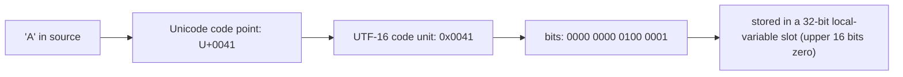

Several literal forms produce a `char`:

```java
char a  = 'A';           // a character literal — single quotes
char z  = 'A';      // the same 'A', written as a Unicode escape (4 hex digits)
char nl = '\n';          // escape sequence — newline (others: \t tab, \\ backslash, \' single quote, \" double quote)
char d  = 65;            // also 'A' — 65 is in char's range
```

Because a `char` is *also a number*, it participates in arithmetic. This is occasionally useful:

```java
char c = 'A';
System.out.println(c + 1);         // 66  — int! Both operands promote to int.
System.out.println((char)(c + 1)); // B   — cast back to char to print as character
```

> [!IMPORTANT]
> **`char` ≠ Unicode code point.** A `char` is a 16-bit **code unit**. Code points in the Basic Multilingual Plane (U+0000 – U+FFFF) fit in a single `char`. But **supplementary code points** (U+10000 – U+10FFFF — most emoji, many CJK extensions, historic scripts) require **two `char`s** — a *surrogate pair*. So a `String` like `"😀"` has `.length() == 2`, not 1, and `charAt(0)` gives you only the high surrogate (a half-character). The full story belongs to `T06` (Strings & Text Blocks); for now, one `char` is not always one user-visible character.

## Sizes Are Fixed by the JLS — Why Java Sidesteps the C Mess

Now we leave the language layer and start the memory/architecture tour. The first architecture fact to lock in is one Java got right that C/C++ got wrong:

**In Java, every primitive's size is fixed by the language specification (the JLS — Java Language Specification) and the JVM specification, and is identical on every platform.** An `int` is 32 bits on a 64-bit Intel server running Linux, on a 32-bit ARM Raspberry Pi, on an x86 Windows laptop, on Apple Silicon, on a mainframe — everywhere.

Contrast this with C:

| Type      | C (32-bit Linux x86) | C (64-bit Linux x86-64) | C (64-bit Windows x86-64) | **Java (anywhere)** |
|-----------|:--------------------:|:-----------------------:|:-------------------------:|:-------------------:|
| `char`    | 1 byte               | 1 byte                  | 1 byte                    | **2 bytes (Java's `char`)** |
| `short`   | 2                    | 2                       | 2                         | **2**               |
| `int`     | 4                    | 4                       | 4                         | **4**               |
| `long`    | 4                    | **8**                   | **4** (!)                 | **8**               |
| `long long` | 8                  | 8                       | 8                         | (`long` is already 8) |
| pointer   | 4                    | 8                       | 8                         | (handled differently — see refs below) |

In C, the *only* guarantees are that `char ≤ short ≤ int ≤ long ≤ long long` and a few minimum widths. Real sizes depend on the **data model** of the compiler — ILP32, LP64, LLP64, etc. — and the same source file produces a different binary on each. Code that assumed `long` was 32 bits broke when Linux moved to LP64; code that assumed it was 64 bits broke on Windows (LLP64, where `long` stayed 32).

Java's design says: pick one set of sizes, write them into the spec, and have the JVM enforce them on every platform. That's the **"write once, run anywhere"** principle at the bit level. The cost is that the JVM sometimes has to emulate Java's view on a CPU whose native registers don't match (e.g. `long` arithmetic on a 32-bit ARM CPU is done as paired 32-bit ops); the benefit is that your program never silently re-interprets its own data type when you move it to a new machine.

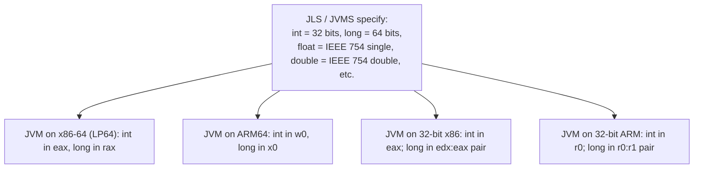

The bottom line: **as a Java programmer you never ask "how big is `int` on this machine?"** — it's always 32 bits. The platform variation is the JIT's problem, not yours.

## From JVM Type to Native CPU — What the JIT Actually Emits

The JVM defines a portable view (stack-machine bytecode, 32-bit `int`, etc.). Real CPUs are **register machines** with native word sizes — typically 64 bits today. The bridge between the two is the JIT compiler. Let's see, concretely, what it emits for one tiny method.

```java
public class Tiny {
    public static int add42(int x) {
        return x + 42;
    }
}
```

The bytecode (`javap -c`) is the portable view from `L0/C01/T04`:

```
 0: iload_0       // push local slot 0 (= x) onto the operand stack
 1: bipush 42     // push the int constant 42
 3: iadd          // pop two ints, push their sum
 4: ireturn       // return the int on top
```

When HotSpot's JIT (C2) compiles this method for an **x86-64** host (`-XX:+UnlockDiagnosticVMOptions -XX:+PrintAssembly`, with hsdis installed), it produces native code roughly equivalent to:

```asm
;  x86-64 (System V ABI: first int arg arrives in EDI)
add42:
    lea     eax, [rdi + 42]      ; eax = x + 42   (one instruction does the whole thing)
    ret                          ; return; the caller reads EAX
```

On **ARM64** (AArch64 calling convention: first int arg in `W0`):

```asm
; ARM64
add42:
    add     w0, w0, #42          ; w0 = x + 42
    ret                          ; return; the caller reads W0
```

Two things to notice:

- The JIT collapsed `iload_0; bipush 42; iadd; ireturn` (four bytecode ops, an operand stack, a local slot) into **one or two native instructions** on a real register machine. The operand stack and local variable array were *abstractions* — they exist for the verifier and the interpreter, but the JIT mostly throws them away.
- The native register name encodes the size. On x86-64, `EAX` is the **low 32 bits** of the 64-bit `RAX` register; on ARM64, `W0` is the low 32 bits of `X0`. Java's `int` always uses the 32-bit view, Java's `long` always uses the 64-bit view — that mapping is the JIT's responsibility on every supported architecture.

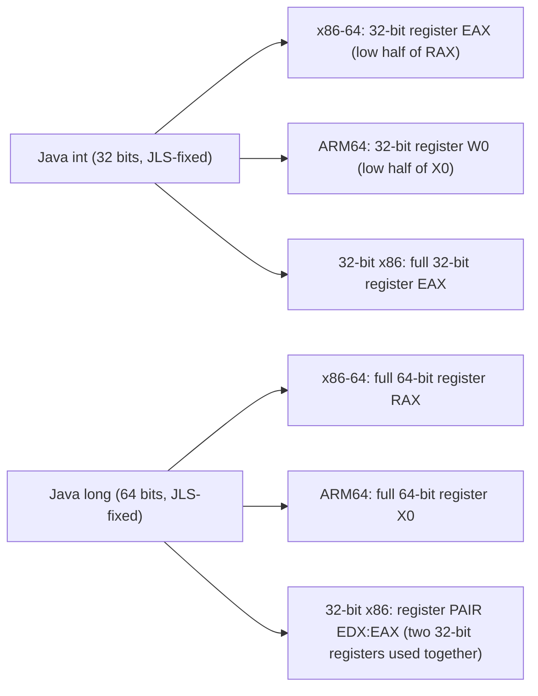

> [!NOTE]
> **Going deeper — the interpreter view.** Before the JIT kicks in, the same method runs inside HotSpot's *template interpreter*. The interpreter keeps the operand stack and local-variable array as **real memory regions** inside the stack frame: each `iload_0` becomes "load the 4 bytes at `[frame_locals + 0]` into the top-of-operand-stack slot." The interpreter is slower per instruction but starts instantly — that's the trade-off explained in `L0/C01/T03`/`T04`.

## Inside a JVM Stack Frame

You met the stack frame in `L0/C01/T04`. Now we go to the byte level. Every running thread has its own **JVM stack** — a region of memory the JVM reserves at thread creation. When the thread calls a method, a **stack frame** is *pushed* onto the top; when the method returns, the frame is *popped*.

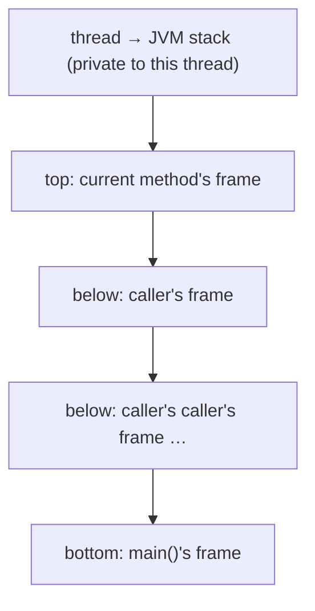

Each frame holds three things:

1. **Local-variable array** — an indexed array of *slots* holding parameters and locals.
2. **Operand stack** — scratch space for the bytecode to push and pop values on.
3. **Frame data** — the constant pool pointer, the return address, the previous frame pointer, etc. (HotSpot stitches in a few extra registers' worth of bookkeeping.)

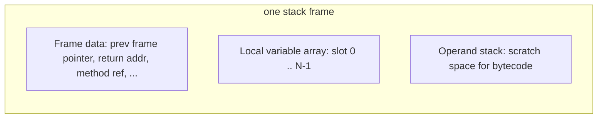

The local-variable array is what your variables live in. **Spec-wise**, each slot is **32 bits** — and `long`/`double` need two consecutive slots. **Implementation-wise**, on a 64-bit JVM HotSpot uses an **8-byte physical slot per logical slot** (so a 4-byte `int` actually occupies 8 bytes of stack memory while it's in the frame). This is just easier on 64-bit hardware — every load is aligned, no extra masking needed. The `long`/`double` "two slots" rule still holds *logically* in the bytecode (the verifier checks slot indices), but at the native level a 64-bit value is also 8 bytes.

```
  one HotSpot 64-bit frame's locals (byte-level view, 8-byte physical slots):

  [ slot 0   ][ slot 1   ][ slot 2   ][ slot 3   ][ slot 4   ][ slot 5   ][ slot 6   ]
  8 bytes    8 bytes    8 bytes    8 bytes    8 bytes    8 bytes    8 bytes
  ┌─────────┬─────────┬─────────┬─────────┬─────────┬─────────┬─────────┐
  │  args   │   x     │   y (low 32)      │   y (high 32)     │  pi (low 32)        │  pi (high 32)       │  ok    │
  │ (ref)   │ (int)   │   long uses 2 logical slots = 16 bytes physical             │  double = 2 slots = 16 bytes physical                         │ (bool) │
  └─────────┴─────────┴─────────┴─────────┴─────────┴─────────┴─────────┘
```

The **operand stack** sits adjacent (HotSpot keeps it just above the locals). It's also slot-indexed; the verifier proves at class-load time that every method's operand stack never grows past its declared maximum (also a `.class` attribute — recall `T04`).

**Stack size and overflow.** Each thread's JVM stack is **bounded**. On HotSpot the default is around 512 KB on Linux x86-64 and ~1 MB on Windows. You set it with `-Xss<size>`:

```bash
$ java -Xss2m MyApp     # 2 MB per-thread stack
```

If your method calls keep nesting (typically deep or runaway recursion), the stack fills up and the JVM throws **`StackOverflowError`** — exactly the error class introduced in `L0/C01/T04`. This is a *real, physical* limit: there is no more virtual memory reserved for that thread's stack, and the OS would deliver a page-fault if the JVM didn't pre-check.

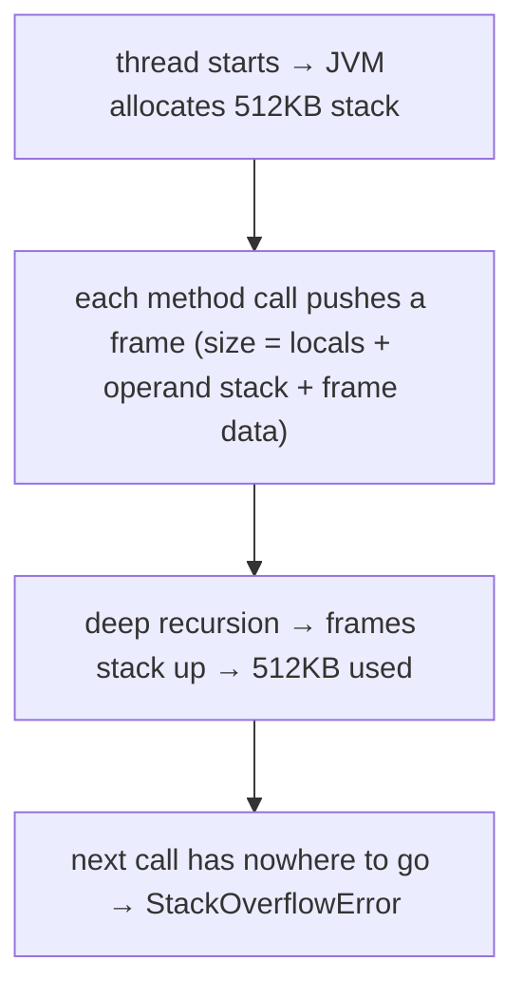

## Where Variables Actually Live — The Full Map

A primitive variable can live in **one of four** places, and the choice depends on **how the variable was declared** — not on its type:

| Declaration                                       | Where the bytes physically sit                                  | Reclaimed by              |
|--------------------------------------------------|------------------------------------------------------------------|---------------------------|
| **Local variable** inside a method               | A slot of the method's stack frame on the **JVM stack** (per-thread) | Frame pop when method returns |
| **Instance field** of an object                  | Inside the object on the **heap** at a known field offset       | Garbage collector when the object is unreachable |
| **Element of an array**                          | Inside the array object on the **heap** at offset `header + index × element_size` | Garbage collector when the array is unreachable |
| **Static (class) field**                         | Inside the *Class* object held in the **heap** (modern HotSpot stores statics in a mirror Class instance), referenced by metaspace | Class unloading (rare; usually never) |

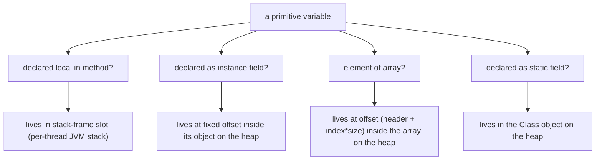

Two important consequences:

- **Locals are extremely cheap.** Pushing/popping a stack frame is a few register adjustments; the slot memory is reused on the next call. No GC pressure.
- **Heap-resident primitives ride along with their owner.** An `int` field of an object lives wherever the object lives, and only goes away when the object is collected. An `int` element of an `int[]` lives inside the array's bytes.

This is also why, for performance, you usually **pass primitives as method parameters** rather than wrapping them in tiny objects: parameters land in fresh stack slots (or, after the JIT, directly in CPU registers), with zero heap allocation.

## Inside a Heap Object — Header, Fields, and Padding

When a primitive is a field of an object, you can't understand its memory cost without knowing what an **object** itself costs. Every Java object on the heap has the same shape:

```
  one heap object, byte-level (HotSpot, 64-bit JVM, compressed oops ON — the default):

  byte offset    contents
  ─────────────────────────────────────────────────────────────────────
   0    – 7      mark word            (8 bytes) — GC age, hash, lock state, etc.
   8    – 11     class pointer (klass) (4 bytes, compressed)
  12    – ...    instance fields, ordered for alignment
  ...            padding to make total size a multiple of 8 bytes
```

So an object's **header** is 12 bytes (with compressed oops) or 16 bytes (without). Then come the fields, packed in an order chosen by the JVM (HotSpot reorders fields by descending size to minimise padding: doubles/longs/refs first, then ints/floats, then shorts/chars, then bytes/booleans, then more references). Finally the object is padded up so its total size is a multiple of **8 bytes** — this is the **object-alignment** requirement, and it exists because every object's address ends in three zero bits (which is what makes compressed oops work; see next section).

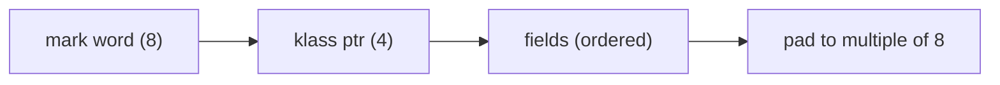

Concrete example: an instance of `class Point { int x; int y; }`:

```
  Point object on a 64-bit JVM with compressed oops:

  offset 0..7     mark word           (8 bytes)
  offset 8..11    compressed klass ptr (4 bytes)
  offset 12..15   int x               (4 bytes)
  offset 16..19   int y               (4 bytes)
  offset 20..23   padding             (4 bytes  ← bring total to 24, a multiple of 8)
                                      ────────
                                       24 bytes total
```

`int x` lives at byte offset 12 inside every `Point`. If you have an array of 1,000,000 `Point` objects, each takes 24 bytes plus a separate 4-byte reference in the array → that's 24 + 4 = 28 bytes per element, plus the header of the array itself (16 bytes for an `Object[]`).

This is exactly why we'll show below that primitive arrays massively beat boxed-wrapper arrays.

> [!NOTE]
> **Inspecting object layout yourself.** The OpenJDK tool **JOL (Java Object Layout)** prints the exact header, field offsets, and padding for any class on your JVM. Worth running once you've absorbed this section — `org.openjdk.jol.info.ClassLayout.parseClass(MyClass.class).toPrintable()`.

## 32-bit JVM vs 64-bit JVM, and Compressed OOPs

A *reference* (the value stored in an "object-typed" variable — `String s`, `Point p`, `int[] a`) is a **pointer**: the address in virtual memory where the object lives. Its native size depends on the JVM:

| JVM                                | Reference size | Max heap (practical) |
|-----------------------------------|:--------------:|----------------------|
| 32-bit JVM                         | **4 bytes**    | ~2–3 GB (OS-dependent) |
| 64-bit JVM, **compressed oops on** (default for heaps < 32 GB) | **4 bytes** (logical) — 8-byte aligned, encoded as `byte_offset / 8` | ~32 GB |
| 64-bit JVM, compressed oops off   | 8 bytes        | up to OS limit       |

The trick called **compressed OOPs** ("oop" = ordinary object pointer) takes advantage of the fact that every heap object's address is a **multiple of 8** (because of 8-byte alignment). A 64-bit address whose last 3 bits are always zero carries only 61 bits of information — so HotSpot stores the address divided by 8 in a **32-bit field**, multiplies by 8 on dereference, and gains a full 32 GB of addressable heap while paying only 4 bytes per reference. Below 32 GB this saves a *lot* of memory (every object header gets 4 bytes smaller, every reference field gets 4 bytes smaller); above 32 GB the JVM auto-disables compressed oops and references jump back to 8 bytes.

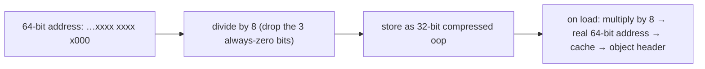

**Why this matters for primitives.** Compressed oops do not change primitive sizes — `int` is still 4 bytes, `long` still 8. But they *do* change how big the *object that contains* your primitive is, and how big a *reference* to that object is. So if you ask "how much memory does my object cost," compressed oops are part of the answer.

You can check what your JVM is doing:

```bash
$ java -XX:+PrintFlagsFinal -version | grep -E "UseCompressedOops|UseCompressedClassPointers|ObjectAlignmentInBytes"
```

## Method Calls and Pass-by-Value

Now the call mechanics. Java is **strictly pass-by-value**. There is no "pass-by-reference." But the value passed differs by type:

- **For primitives**, the value passed is the primitive's *bits* — they are **copied** into the callee's parameter slot.
- **For references**, the value passed is the *reference's bits* (the pointer to the object) — the pointer is **copied**. The caller and callee then hold two pointers aiming at the *same* heap object. (This is why "Java passes objects by reference" — a *very* common myth — is wrong. The reference itself is passed by value.)

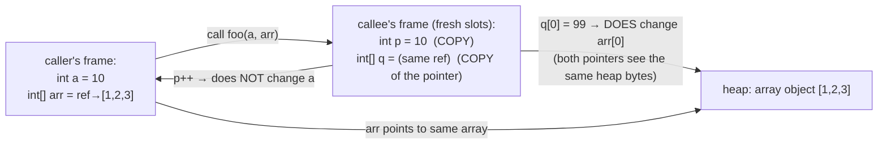

Concretely:

```java
static void modify(int x, int[] arr) {
    x = 999;          // changes only the callee's local slot — caller's a stays 10
    arr[0] = 999;     // writes into the heap array — caller sees arr[0] == 999 afterwards
}

public static void main(String[] args) {
    int a = 10;
    int[] arr = { 1, 2, 3 };
    modify(a, arr);
    System.out.println(a);       // 10   — primitive was copied, original untouched
    System.out.println(arr[0]);  // 999  — array bytes on the heap were mutated
}
```

Notice that *both* parameters were passed by value — but for `arr`, the **value being copied was a pointer**, so the callee and caller see the same heap bytes through their two pointers. This is identical to C's "passing a pointer by value." Java just doesn't have raw pointers, so the confusion is more common.

**Frame setup and teardown, byte level.** When `main` calls `modify(a, arr)`, here's what physically happens:

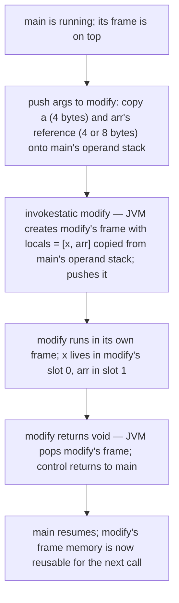

This is the same picture as `L0/C01/T04`'s "add(5, 3)" trace — just with the bytes named.

> [!NOTE]
> **Going deeper — the JIT's optimization.** When the JIT compiles `main` and `modify` together (inlining is common for small methods), it often **eliminates** the parameter copy entirely: the value already in a register at the call site just stays there for the callee's body. The pass-by-value rule still holds *semantically*; the machine code is just smart enough not to physically move the bits.

## Variable Lifetime in Memory

Every variable is born at one moment and dies at another. The "when" depends entirely on *where* it lives:

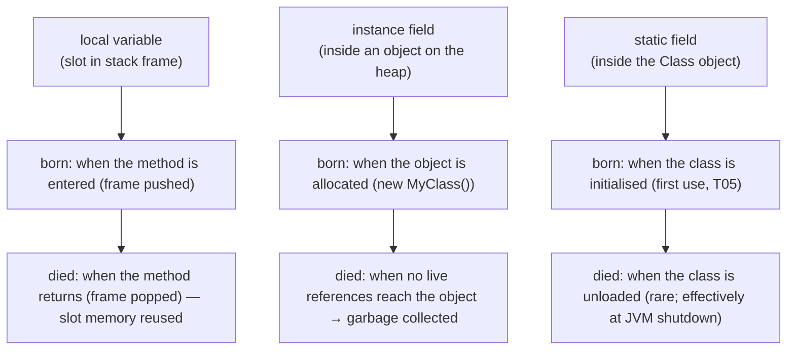

**Locals** are the cheapest: the frame contains them, the frame goes away the instant the method returns. There is no garbage collector to involve. If you create a million local `int`s across a million calls, the total live memory at any moment is one frame's worth — the slot bytes are *reused* on the next call.

**Instance fields** live as long as their object lives, which means until the **garbage collector** decides nothing reachable still points to that object. (We do not cover GC in detail until L3.) If you ask "how long does the `int x` field of `Point p` live?", the answer is "as long as `p` is reachable from a root."

**Static fields** are tied to the **Class** object — born during class initialisation (covered in `L0/C02/T05`'s neighbourhood), die only when the class itself unloads. In a long-running server they typically live for the entire process.

> [!NOTE]
> **Going deeper — escape analysis and scalar replacement.** Sometimes the JIT can *prove* that an object you `new`'d inside a method never escapes the method (no reference to it leaks out via return, fields, or other-thread reads). In that case it performs **scalar replacement**: the "object's" fields are pulled apart and given individual CPU registers or stack slots, and the heap allocation is **skipped entirely**. So a variable you wrote as `Point p = new Point(3, 4)` can sometimes live in **registers** with zero GC pressure. This is the JIT removing your abstraction without breaking the semantics. We see this in detail in L3 — JVM internals.

## Memory Efficiency: `int[]` vs `Integer[]`

The single best way to *feel* the cost of object headers and references is to compare a primitive array to an array of the equivalent wrapper class. On a 64-bit JVM with compressed oops:

```
  int[] of length N — one big contiguous block:

  ┌──────────────────────────────────────────────────────────────────────┐
  │ header (16 bytes: mark + klass + length) │  N × 4 bytes of int data  │
  └──────────────────────────────────────────────────────────────────────┘
  total = 16 + 4N bytes  (rounded up to a multiple of 8)
```

vs.

```
  Integer[] of length N — array of references + a separate Integer object per element:

  array object:
  ┌──────────────────────────────────────────────────────────────────────┐
  │ header (16) │  N × 4 bytes of reference (one ref per element)        │
  └──────────────────────────────────────────────────────────────────────┘
  + N × Integer objects:
    ┌────────────────────────────────────────────┐
    │ header (12) │ int value (4) │ padding (0)  │  = 16 bytes each
    └────────────────────────────────────────────┘
  total ≈ (16 + 4N)  +  N × 16  =  16 + 20N bytes
```

For N = 1,000,000:

| Storage         | Bytes used     | Multiplier vs `int[]` |
|-----------------|----------------|:---------------------:|
| `int[]`         | ~4,000,016     | 1×                    |
| `Integer[]`     | ~20,000,016    | **~5×**               |

Plus the `Integer[]` version trashes the **CPU cache** — each iteration of a loop has to chase a pointer to a separate 16-byte object, and those objects are scattered across the heap. The `int[]` version is one contiguous block of bytes, prefetched and cached perfectly.

**Lesson.** For bulk numeric data, **use primitive arrays**. Reach for wrappers (`Integer`, `Long`, `Double`) only when you genuinely need an *object* (because a collection like `List<Integer>` requires one, or because you need `null` to mean "absent"). Autoboxing makes this transparent in source but the memory cost is real — covered fully in `T17`.

## CPU Caches and Why Layout Matters

Modern CPUs run **roughly 100× faster** than main RAM. The gap is bridged by a hierarchy of small, fast caches:

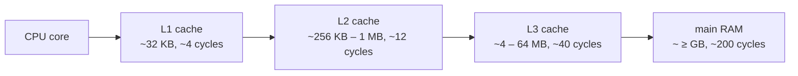

Caches move data in **cache lines** — typically **64 bytes** on x86-64 and ARM64. When you read a single `int` from RAM, you actually pull in the whole 64-byte line containing it; subsequent accesses to nearby bytes are free. This is why **locality of reference** decides real-world performance.

```
  one cache line (64 bytes) being pulled from RAM into L1:

  ┌──────────────────────────────────────────────────────────────────────┐
  │ 64 bytes — read 1 int from here, the other 60 bytes are now hot too  │
  └──────────────────────────────────────────────────────────────────────┘
```

Two consequences for primitives:

- **`int[]` loops fly** because every 64-byte cache line holds 16 ints. One memory fetch warms up sixteen iterations.
- **Object-of-primitive trees crawl** when the objects are scattered across the heap — each access is a pointer chase to a cold cache line.

We will not dwell here — concurrency (`L3/C01`) covers a sharper version of this called **false sharing**, where two unrelated variables share a cache line and writes from different threads thrash. The takeaway for now: a variable is never just its own bytes — it's a position in the cache hierarchy. **Bytes that travel together are faster.**

## Endianness — Java's Big-Endian Bytecode on a Little-Endian CPU

When a multi-byte value is laid out in memory, the order of its bytes is called its **endianness**. *Big-endian*: most significant byte at the lowest address. *Little-endian*: least significant byte at the lowest address.

```
  the int 0x12345678 in memory, both orderings:

  address →                  N         N+1       N+2       N+3
  big-endian:               [ 0x12 ] [ 0x34 ] [ 0x56 ] [ 0x78 ]
  little-endian:            [ 0x78 ] [ 0x56 ] [ 0x34 ] [ 0x12 ]
```

Where Java sits:

- **`.class` files** are **big-endian** — the JVM specification dictates this for every multi-byte field in bytecode. A literal `0x12345678` in the constant pool appears on disk in big-endian order.
- **The host CPU** is little-endian on essentially every server you'll run on today — x86-64 and (typically) ARM64. So when the JVM loads bytecode constants into memory, it converts them.
- **Inside Java code** you almost never see endianness. The language abstracts it away — `int x = 0x12345678;` always reads as `305_419_896` whether you're on x86, ARM, RISC-V, or POWER.

Endianness *does* surface when you do raw byte I/O — `java.nio.ByteBuffer` lets you pick the order (default big-endian, the network byte order); reading binary file formats or talking to native code requires knowing which order the bytes are in. That's an `L2`/`L4` concern. For now: **Java code hides endianness; JVM disk format is big-endian; CPU memory is whatever the CPU prefers; the JVM bridges them.**

## From Source to Bits: One Local's Full Journey

Pull everything together. Take this single line:

```java
int x = 42;
```

inside a `main` method on a 64-bit Linux x86-64 JVM. Here is what happens to it, end to end:

```mermaid
flowchart TB
  S1["javac lexer: token stream<br/>'int' 'x' '=' '42' ';'"]
  S2["javac parser: AST<br/>VariableDeclaration(type=int, name=x, init=IntLiteral(42))"]
  S3["javac codegen: bytecode<br/>bipush 42<br/>istore_1"]
  S4[".class file on disk<br/>(constant pool stores 42 in big-endian form;<br/>method's Code attribute has the two opcodes)"]
  S5["class loader reads bytes;<br/>verifier checks types & slot usage"]
  S6["JVM interprets the bytecode:<br/>operand stack pushes 0x0000002A;<br/>istore_1 writes it into local slot 1 of main's frame"]
  S7["after enough calls, JIT compiles main()<br/>and may keep x in EAX register (no memory slot used)"]
  S8["CPU: 0x2A held in 32 bits of EAX (low half of RAX)<br/>backed by SRAM flip-flops"]
  S1 --> S2 --> S3 --> S4 --> S5 --> S6 --> S7 --> S8
```

Every layer corresponds to a topic you've already met or will meet:

- Lexer/parser/codegen ← `L0/C01/T03`
- `.class` format and big-endian on disk ← `L0/C01/T04` + this topic's [Endianness](#endianness--javas-big-endian-bytecode-on-a-little-endian-cpu)
- Verifier + interpreter ← `L0/C01/T04`
- JIT and register usage ← `L0/C01/T03`/`T04` + this topic's [JIT bridge](#from-jvm-type-to-native-cpu--what-the-jit-actually-emits)
- The SRAM flip-flop at the bottom ← `L0/C01/T01`

This chain is what we mean by "going deep." Every line of Java source is the top of a stack of mechanisms, and a senior engineer can drop into any layer when the situation calls for it.

## Default Values vs Definite Assignment (Locals)

Where a variable is declared decides whether it gets an **automatic default** or must be **initialised before use**:

| Declared as…                                                           | Initial value                                |
|------------------------------------------------------------------------|----------------------------------------------|
| **Class field** or **array element** (any reference or primitive)      | gets the type's default automatically       |
| **Local variable** in a method                                         | **none** — you must assign before any read   |

The per-type defaults (used for fields and array elements) are:

| Type      | Default        | Bit pattern         |
|-----------|----------------|---------------------|
| `byte`, `short`, `int`, `long` | `0` / `0L`            | all-zero bits       |
| `float`, `double`              | `+0.0f` / `+0.0`      | all-zero bits (yes, IEEE 754 zero is also all zeros) |
| `boolean`                      | `false`               | 0                   |
| `char`                         | `''` (NUL)      | 0                   |
| any reference (`String`, arrays, your classes) | `null` | all-zero bits (a null pointer is binary zero) |

Notice that **every default is all-zero bits**. This is not an accident — it makes the JVM's job easy: when a region of heap is allocated for a new object or array, the JVM (or the OS, when delivering fresh pages) zero-fills it once, and every field reads as its language-level default for free.

```mermaid
flowchart TB
  F["field / array element"] --> H["lives on the heap, zeroed on allocation"] --> Def["→ uses its type's default (all-zero bits)"]
  L["local variable"] --> St["lives in a stack frame, reused memory"] --> Rule["→ compiler refuses uninitialised read (definite assignment)"]
```

```java
public class Defaults {
    static int field;                 // class field, gets default 0

    public static void main(String[] args) {
        System.out.println(field);    // 0

        int local;                    // no value yet
        // System.out.println(local); // COMPILE ERROR — variable might not have been initialized
        local = 7;
        System.out.println(local);    // 7
    }
}
```

## Bringing It All Together: A Worked Example

Let's apply every concept above to one short program:

```java
public class Locals {
    static int counter = 0;                 // static field
    int instance = 5;                       // instance field

    public static void main(String[] args) {
        int x = 42;
        long y = 1_000_000_000L;
        double pi = 3.14;
        boolean ok = true;
        Locals self = new Locals();         // creates a heap object
        compute(x, self);
    }

    static int compute(int n, Locals obj) {
        return n + obj.instance;
    }
}
```

Where every value lives at the moment `compute(x, self)` is running:

```mermaid
flowchart TB
  subgraph Th["thread's JVM stack"]
    direction TB
    subgraph M["main's frame"]
      M0["slot 0: args (ref) → empty String[] on heap"]
      M1["slot 1: x = 42 (int)"]
      M2["slots 2-3: y = 1_000_000_000L (long)"]
      M3["slots 4-5: pi = 3.14 (double)"]
      M4["slot 6: ok = true (boolean as int 1)"]
      M5["slot 7: self (ref) → Locals object on heap"]
    end
    subgraph C["compute's frame (above main's)"]
      C0["slot 0: n = 42 (COPY of x, pass-by-value)"]
      C1["slot 1: obj (ref) (COPY of self's reference, both point to same object)"]
    end
  end
  subgraph Heap["heap"]
    direction TB
    H1["Locals object: header (12) + instance=5 (4)<br/>≈ 16 bytes, GC-managed"]
    H2["String[] args: header (16) + 0 elements<br/>= 16 bytes"]
  end
  subgraph Meta["Class storage (heap-backed)"]
    direction TB
    K1["Locals.counter = 0 (static int)"]
  end
  M5 --> H1
  C1 --> H1
  M0 --> H2
```

Read this picture and you can answer any "where does X live" question about this program. That is the goal of this topic.

## Common Mistakes

- **Forgetting the `L` suffix on a big literal.** `long ns = 1_000_000_000 * 60;` overflows in `int` first (≈6 × 10¹⁰ > 2.1 × 10⁹) and silently stores a wrapped negative value. Write `1_000_000_000L * 60`.
- **Trusting `==` on `double`.** `(0.1 + 0.2 == 0.3)` is `false`. For real-world floats, compare with a tolerance: `Math.abs(a - b) < 1e-9`. For exact decimals, use `BigDecimal`.
- **Forgetting the `f` suffix on a `float` literal.** `float r = 1.5;` is a compile error — the right-hand side is a `double`. Write `1.5f`.
- **Confusing `char` and `int`.** `char c = 'A'; int n = c + 1;` makes `n == 66`, not `'B'`. Cast back to `char` to keep it character-typed.
- **Reading an uninitialised local.** The error message "variable x might not have been initialized" is the compiler enforcing definite assignment; assign before you read.
- **Assuming `byte` is unsigned.** Java's `byte` is **signed**, ranging −128…127. The bit pattern `0xFF` read as a `byte` is `-1`, not `255`. To get the unsigned interpretation: `b & 0xFF` (covered with operators in `T04`).
- **"Java passes objects by reference."** No — Java passes the **reference by value**. Reassigning the parameter inside the method does *not* change the caller's variable; mutating the object it points at *does* (because both pointers see the same heap bytes).
- **Box-vs-primitive surprises.** `Long a = 128L; Long b = 128L; a == b` is `false` (two different objects), while `Integer a = 100; Integer b = 100; a == b` is `true` (boxed-int cache hits in the −128…127 range). Use `.equals()` for wrapper comparisons. Full coverage in `T17`.
- **Assuming a `long` field "fits in a slot."** A `long` field inside a heap object takes 8 contiguous bytes at a field offset that HotSpot will align to 8 bytes — which can introduce padding before it. This is one reason HotSpot reorders fields by descending size.

> [!INTERVIEW]
> Reliable warm-ups in any Java interview, in roughly increasing difficulty:
> - **"List the eight primitive types and their sizes."** Memorise the table.
> - **"Why is `0.1 + 0.2 != 0.3`?"** Answer: 0.1 has no exact binary representation under IEEE 754; the stored value is the nearest representable double, and the rounding error survives the addition.
> - **"What's the default value of an `int` field vs an `int` local?"** Field: `0` (heap is zeroed). Local: none — definite-assignment rule.
> - **"Is `char` signed?"** No — `char` is 16-bit *unsigned* (0–65 535) because it's a UTF-16 code unit.
> - **"Is Java pass-by-reference?"** No — Java is strictly **pass-by-value**. For references the *pointer* is passed by value; the object is shared, but reassigning the parameter doesn't affect the caller.
> - **"Where does a local `int` live? An `int` field?"** Local: a slot in the method's stack frame on the JVM stack. Field: at a fixed byte offset inside its object on the heap.
> - **"How big is a Java `int` on a 32-bit machine? On ARM?"** Always 32 bits — the JLS fixes it; the JIT bridges it to whichever native register the host CPU provides.
> - **"What are compressed OOPs?"** A 64-bit JVM trick: object addresses are always multiples of 8, so the low 3 bits are zero, and the JVM stores `address / 8` in 4 bytes, gaining 32 GB of heap with 4-byte references.
> - **"What's the difference between the bytecode operand stack and the CPU stack?"** The bytecode operand stack is a *logical* construction inside each method's stack frame, used by the verifier and interpreter; the CPU stack is the real memory region the OS gave the thread, where JVM stack frames physically sit. The JIT may eliminate the operand stack entirely when compiling.

## Practice

1. **Run the table.** Write a single class that declares one variable of each of the eight primitive types, initialises each, and prints them. Compile and run. Which literals needed a suffix (`L`, `f`)?
2. **Find the slots.** Disassemble your program from exercise 1 with `javap -c Vars`. Identify, for each variable, which `store` instruction was emitted and which slot it wrote to. Where did the `long` and `double` go?
3. **Overflow on purpose.** Print `Integer.MAX_VALUE + 1`, `Integer.MIN_VALUE - 1`, and `Integer.MAX_VALUE * 2`. Explain each result using the two's-complement wheel from `L0/C01/T02`.
4. **Compute the doubles.** Predict the result of `0.1 + 0.2`, `1.0 / 0.0`, `-1.0 / 0.0`, `0.0 / 0.0`, and `Double.NaN == Double.NaN`. Then run it. Explain each with the IEEE 754 special-value table.
5. **Trace a `float`.** Take `0.15625f`. (a) Convert to binary by hand. (b) Normalise it as `1.xxx × 2^e`. (c) Show its 32-bit encoding: sign, biased exponent, mantissa. (d) Convert that to hex and verify with `Integer.toHexString(Float.floatToIntBits(0.15625f))`.
6. **char vs int.** Write a program that declares `char c = 'A';` and prints `c`, `c + 1`, and `(char)(c + 1)`. Explain *why* the three outputs differ.
7. **Definite assignment.** Try to compile a program that prints an `int` local without first assigning it. Read the error message exactly. Now move the same declaration to a class field — what happens at runtime?
8. **Money trap.** Compute `0.1 + 0.1 + 0.1 + 0.1 + 0.1 + 0.1 + 0.1 + 0.1 + 0.1 + 0.1` and compare to `1.0`. Why isn't it exact? What type *should* you use to add ten cents ten times?
9. **Pass-by-value, primitive.** Write a method `void inc(int n) { n++; }`, call it with a local `int a = 10`, and print `a` afterwards. Predict the output, then run it. Explain in terms of stack-frame slots.
10. **Pass-by-value, reference.** Write a method `void inc(int[] arr) { arr[0]++; }`, call it with `int[] x = {10}`, and print `x[0]` afterwards. Why does this case *appear* to mutate the caller's variable when exercise 9 doesn't? Draw the two frames + heap diagram.
11. **Read your JVM.** Run `java -XX:+PrintFlagsFinal -version | grep -E "UseCompressedOops|ObjectAlignmentInBytes"`. Are compressed oops on? What is your alignment? What does that imply for object-header size?
12. **Stack-overflow on purpose.** Write a method that calls itself directly. Run it. Count how many frames it managed before throwing `StackOverflowError`. Now run again with `-Xss4m` — how many frames now?
13. **Memory math.** Estimate the bytes used by `new int[1_000_000]` vs `new Integer[1_000_000]` populated with the same values. Predict the multiplier; then confirm with the JOL library (`ClassLayout.parseClass(...)`) if you have it available, or by calculation.
14. **JIT-look (optional, advanced).** Compile the `Tiny.add42` example. Run with `-XX:+UnlockDiagnosticVMOptions -XX:+PrintCompilation -XX:+PrintAssembly` (needs `hsdis-amd64.so`/`.dylib`/`.dll` installed). Find the JITted body of `add42`. Confirm it's roughly the `lea eax, [rdi+42]; ret` of the architecture section.
15. **Explain it back.** In your own words, trace the line `long y = 1_000_000_000L;` from source character through bytecode through interpreter to JIT-compiled native instructions. Use the terms *lexer*, *constant pool*, *ldc2_w*, *operand stack*, *slot*, *register*, and either *RAX* (x86-64) or *X0* (ARM64).

## Recap

You should now be able to:

- Define a **variable** as a *name + type + value* triple at the language layer, and equivalently as an **address + width** at the memory layer.
- Write the three forms of declaration and explain the **definite-assignment rule** for locals — including *why* fields and locals differ (heap zero-fill vs reused stack slot memory).
- Distinguish **primitive** (value in slot) from **reference** (pointer to a heap object) values, and recite the **eight primitives** with size, range, default, suffix, and JVM slot count.
- Draw the bit layout for `int`/`long`/`float`/`double`, **decode IEEE 754** for a small example, explain biased exponent and implicit leading 1, identify ±0/±∞/NaN, and explain why `0.1 + 0.2 != 0.3`.
- Explain `boolean` as a 1-bit logical value (4 stack bytes, 1 heap byte) and `char` as a **16-bit UTF-16 code unit** (not a Unicode code point — surrogate pairs needed for many emoji).
- Justify why Java's primitive sizes are **fixed by the JLS** across every architecture, and contrast that with C's data-model variation (ILP32, LP64, LLP64).
- Show how the JIT maps a Java `int`/`long` to the right CPU register on **x86-64** (`EAX`/`RAX`), **ARM64** (`W0`/`X0`), and **32-bit** machines (paired registers for `long`), and roughly read the native instructions the JIT emits for a tiny method.
- Diagram a **JVM stack frame** at the byte level — local-variable array, operand stack, frame data — and explain that 32-bit *logical* slots typically occupy 8 *physical* bytes on a 64-bit JVM; explain why `long`/`double` use two logical slots; explain `-Xss` and `StackOverflowError`.
- Point to where any primitive **physically lives** depending on its declaration: stack-frame slot (local), byte offset inside a heap object (field), offset inside a heap array (element), or inside the `Class` object (static field).
- Sketch the **heap object layout**: 12-byte (compressed oops) or 16-byte header, fields packed by descending size, padded to 8-byte alignment — and compute the size of a small object by hand.
- Explain **32-bit JVM vs 64-bit JVM** and the **compressed OOPs** trick (8-byte alignment ⇒ 3 zero bits ⇒ 4-byte references ⇒ up to 32 GB heap).
- Explain Java as strictly **pass-by-value**: for primitives, bits are copied; for references, the *pointer* is copied — so the callee can mutate the shared object but cannot reassign the caller's variable.
- State each variable's **lifetime**: locals end at frame pop, instance fields end at GC reclamation, static fields end at class unload; and note that **escape analysis** lets the JIT skip the heap entirely for non-escaping objects.
- Quantify the **memory efficiency** of `int[]` vs `Integer[]` (≈5×) and explain the cache-locality consequences (one contiguous block vs scattered pointer chases).
- Place primitives in the **CPU cache hierarchy** (L1/L2/L3), describe the **64-byte cache line**, and explain why locality of reference makes primitive arrays fast.
- Explain that the JVM uses **big-endian** bytecode on disk, the host CPU is usually little-endian, and the JVM bridges them — but the language itself hides byte order from you.
- Read the full source-to-native journey for one local variable, naming the artefact at every layer (token → AST → bytecode → constant pool → operand stack → physical slot → CPU register).

## Next

Continue to [Literals & Constants (`final`)](./T03-literals-and-constants-final.md).
