# Literals & Constants (`final`)

In `T02` we learned how to *declare* a variable; the right-hand side of every example was a value written directly in source — `42`, `3.14`, `'A'`, `true`. Those are **literals**: the language's notation for hard-coded values. This topic does two related things: it teaches **every literal form** Java accepts (with every escape, suffix, base, and gotcha), and it teaches **`final`** — the keyword that turns a variable into a *constant*.

But this is the depth book, so we will not stop at syntax. By the end you should be able to point at any literal in a source file and trace it to: a **constant-pool entry** in the `.class` file (with byte counts), a specific **bytecode opcode** that loads it (`iconst_*`, `bipush`, `sipush`, `ldc`, `ldc_w`, `ldc2_w`, `aconst_null`), where the resulting bytes live at runtime (operand stack → register → cache), and — for compile-time constants — how `javac` **inlines** the value at every use site, with the famous cross-jar versioning bug that creates. We'll also see what `final` *actually* does to the bytecode (almost nothing), why the JIT loves final fields, why `static final` Strings are deduplicated through **interning**, and where the string pool lives in memory on a modern JVM.

> [!NOTE]
> Prerequisites: [Variables & Primitive Types](./T02-variables-and-primitive-types.md) (`L0/C02/T02`) — the eight primitives, IEEE 754, where locals live; [Number Systems & Basic Bit Math](../C01-cs-foundations/T02-number-systems-binary-hex-and-basic-bit-math.md) (`L0/C01/T02`) — binary, hex, two's complement, integer ranges; [Source to Bytecode to JVM to Machine Code](../C01-cs-foundations/T04-source-to-bytecode-to-jvm-to-machine-code.md) (`L0/C01/T04`) — `.class` file structure, constant pool, operand stack, JIT.

## What Is a Literal? Source vs Value

A **literal** is the **source-code notation** for a value. The literal `42` is five characters in your `.java` file (`4`, `2`, plus the surrounding whitespace and the `;`); the *value* `42` is the 32-bit pattern `0x0000002A` that ends up in some slot of a stack frame or a register at runtime. The two are separated by a long pipeline:

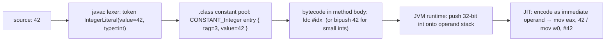

That whole chain is what this topic teaches. Every literal — integer, floating-point, character, string, boolean, or `null` — rides this pipeline; only the details (constant-pool tag, bytecode opcode, value width) differ.

Java recognises **six kinds** of literal:

| Kind                | Example          | Type                  |
|---------------------|------------------|-----------------------|
| Integer             | `42`, `0xFF`, `0b1010`, `077`, `9_999L`           | `int` (or `long` with `L`) |
| Floating-point      | `3.14`, `1.5e3`, `0x1.8p3`, `1.0f`                 | `double` (or `float` with `f`) |
| Boolean             | `true`, `false`                                    | `boolean`             |
| Character           | `'A'`, `'A'`, `'\n'`                          | `char`                |
| String              | `"Hello, world"`, `"line1\nline2"`                 | `String` (a reference) |
| Null reference      | `null`                                             | any reference type    |

Plus a syntactic relative — **text blocks** (`"""…"""`, Java 15+) — which are also String literals; we defer their treatment to `T06`.

## Integer Literals

The integer-literal forms in source code:

| Form     | Example          | Notes                                                                         |
|----------|------------------|-------------------------------------------------------------------------------|
| Decimal  | `42`, `1_000_000` | The default. No prefix.                                                       |
| Hexadecimal | `0xFF`, `0xCAFEBABE` | Prefix `0x` or `0X`. Digits `0–9` `a–f` `A–F`.                            |
| Binary   | `0b1010`, `0B1100_0011` | Prefix `0b` or `0B`. Java 7+. Maps cleanly to bit-level operations.        |
| Octal    | `077`, `0123`     | Leading `0` (zero) followed by digits `0–7`. Inherited from C. Beware! See warning. |

All four forms produce the **same kind of value** — a 32-bit `int` (or 64-bit `long` if the `L` suffix is present). The base is only a *notation* difference; in the constant pool they are stored identically.

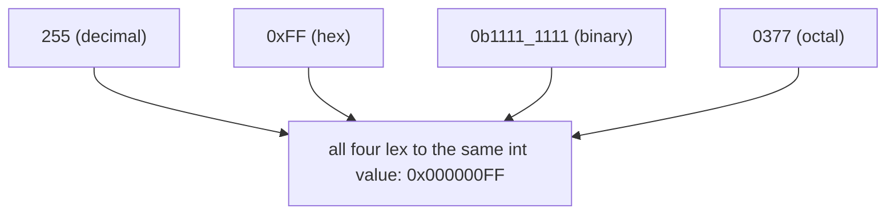

Underscores `_` are **ignored by the lexer** — `1_000_000` is read as `1000000`. They are pure visual sugar for grouping digits. They may appear *between* digits only, not at the start, end, or next to the prefix/suffix:

```java
int a = 1_000_000;          // OK
int b = 0xFF_FF_FF_FF;      // OK
int c = _100;               // ERROR (looks like an identifier)
long d = 10_000L;           // OK
long e = 10_000_L;          // ERROR (underscore next to L suffix)
```

The **`L` suffix** (uppercase `L` strongly recommended — lowercase `l` looks like `1`) makes the literal a `long` (64 bits). Without it, the literal is an `int` and must fit in 32 bits.

```java
long ms = 1_000_000_000;     // OK — fits in int, widened to long on assignment
long ns = 1_000_000_000_000; // ERROR — too big for int, and there's no L
long ok = 1_000_000_000_000L;// OK — long literal
```

> [!WARNING]
> **Octal trap.** A leading `0` makes the literal **octal**, not decimal. So `int n = 0123;` is `83` in decimal, not `123`. Famously bites people writing `09` (an invalid octal digit → compile error) or anyone aligning numbers with leading zeros. There is no `0o` prefix in Java like Python; the bare leading-zero notation is the only way to write octal — and the single best argument for never writing leading-zero integers.

The **JLS-defined range** is straightforward: a decimal literal cannot exceed `Integer.MAX_VALUE` (or `Long.MAX_VALUE` with `L`); but for hex/binary/octal the lexer accepts the full **unsigned** bit pattern. That's how you can write `int x = 0xFFFFFFFF;` (which is `-1` as a signed int) without a "too large" error.

## Floating-Point Literals

Java has three syntactic forms for floating-point literals:

| Form                | Example              | Notes                                                                       |
|---------------------|----------------------|-----------------------------------------------------------------------------|
| Decimal             | `3.14`, `.5`, `2.`   | At least one digit + a dot, optionally with more digits.                    |
| Scientific notation | `1.5e3`, `2.5E-4`    | A decimal form + `e`/`E` + signed integer exponent. Value = mantissa × 10^exponent. |
| Hexadecimal float   | `0x1.8p3`, `0x1.Fp-2`| `0x` + hex mantissa with optional `.` + `p`/`P` + **decimal** exponent. Value = mantissa × 2^exponent. Java 5+. |

By default a floating literal is a **`double`** (64 bits). The **`f`/`F` suffix** makes it a `float` (32 bits); the optional **`d`/`D` suffix** explicitly marks it a `double`:

```java
double pi   = 3.14;          // double — the default
float  piF  = 3.14f;         // float — the f makes it 32 bits
double e    = 2.718D;        // explicit double (rarely written)
double sci  = 6.022e23;      // scientific: 6.022 × 10²³
float  sci2 = 6.022e23f;     // overflows to Float.POSITIVE_INFINITY (out of float's range)
```

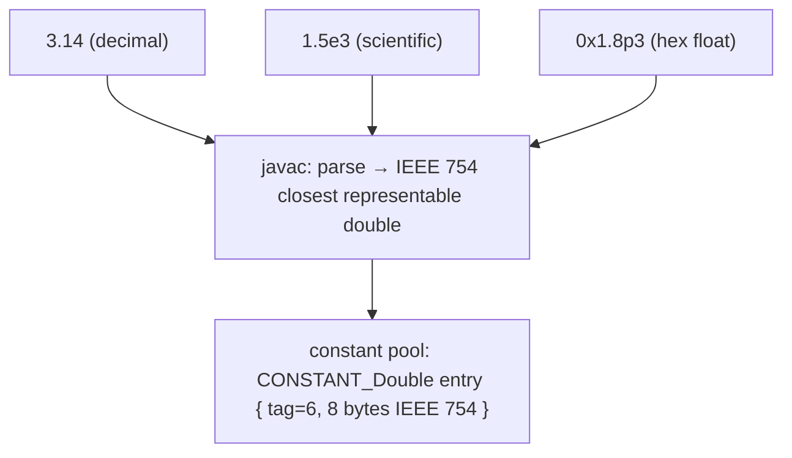

### Why Hexadecimal Floats Exist

Decimal literals like `0.1` cannot be represented exactly in IEEE 754 — `javac` picks the *closest* representable double, so the bit pattern you get is *not* what you wrote. Hex-float syntax lets you write the **exact** bit pattern: `0x1.8p3` means `1.5 × 2³ = 12.0`, with no rounding. This is mostly used in numerical-library tests and floating-point research, but it's the only way to express, e.g., the smallest positive normal double exactly: `0x1.0p-1022`.

The structure of `0x1.8p3` mirrors the IEEE 754 layout from `T02`:

```
 0 x 1 . 8 p 3
       ↑   ↑
       mantissa (in hex)
              exponent (in decimal, applied as a power of 2)
```

## Character Literals — and the Unicode-Escape Gotcha

A character literal is a single character in single quotes:

```java
char a   = 'A';        // direct character
char nl  = '\n';       // escape sequence
char zh  = '中';       // any BMP code point works directly
char z   = 'A';   // Unicode escape — also 'A'
char tab = '\t';       // tab
char bs  = '\\';       // a literal backslash
char sq  = '\'';       // a literal single quote
char num = 65;         // 'A' — an int implicitly narrowed if it fits in char
```

Escape sequences:

| Escape  | Meaning            | Bit value |
|---------|--------------------|-----------|
| `\n`    | line feed (LF)     | `0x0A`    |
| `\r`    | carriage return    | `0x0D`    |
| `\t`    | tab                | `0x09`    |
| `\b`    | backspace          | `0x08`    |
| `\f`    | form feed          | `0x0C`    |
| `\\`    | backslash          | `0x5C`    |
| `\'`    | single quote       | `0x27`    |
| `\"`    | double quote       | `0x22`    |
| `\uHHHH` | the UTF-16 code unit with hex value HHHH (in *any* position in source) |
| `\NNN`  | octal escape, 1–3 digits, values 0–377₈ |
| `\s`    | space (Java 15+, only inside text blocks but accepted elsewhere)        |

Now the **deeply weird** part of Java's lexer:

> [!IMPORTANT]
> **Unicode escapes are processed BEFORE the lexer sees the rest of the file.** A `
` anywhere in your source is treated as if you'd typed an actual newline character there — **even inside comments**, **even inside `\\u0022` "string literals"**, **even between tokens**. This means the line:
> ```java
> // line one 
 System.exit(0);
> ```
> is a **two-line comment** with the second half no longer commented — i.e., it runs `System.exit(0)`. It is a real and famous Java gotcha. Modern IDEs warn; older code does not.

The mechanism: Java's compilation pipeline (JLS §3.2) has three stages — *Unicode escape processing*, then *line termination*, then *input element / token recognition*. So `*` (which is `*`) inside a `/* … */` comment **closes the comment early**, because the `*/` becomes `*/` before the comment-recognition logic runs.

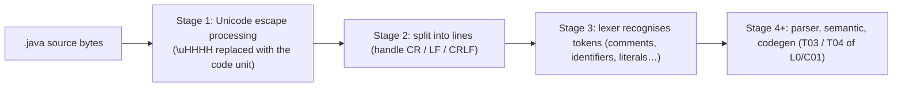

At the constant-pool layer, every `char` literal — however written — becomes a 16-bit value stored either inline in the bytecode (via `bipush`/`sipush`) or as a `CONSTANT_Integer` entry. The character `'A'` is genuinely indistinguishable from the integer `65` after `javac` is done.

## Boolean & null Literals

There are exactly two boolean literals — **`true`** and **`false`** — and exactly one null literal — **`null`**. None of them are keywords in the strict sense; the JLS classifies them as "reserved literals." There is no syntactic decoration.

```java
boolean ready = true;
boolean done  = false;
String name   = null;     // null can be assigned to any reference type
int x         = null;     // ERROR — null is NOT assignable to a primitive
```

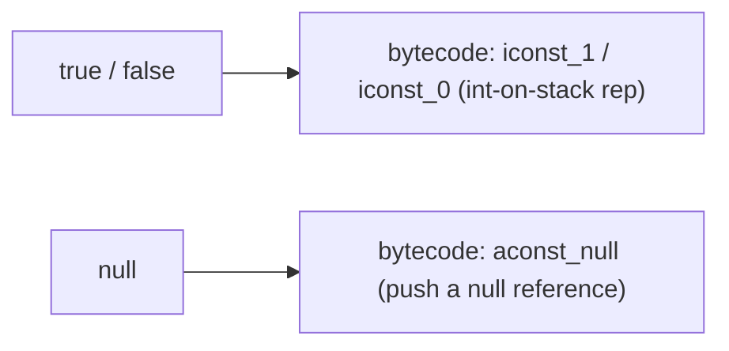

At the bit level, `false` is `0`, `true` is `1`, and `null` is **all-zero bits** (a null pointer is binary zero — exactly the default value from `T02`). On a 64-bit JVM `null` is 4 bytes (with compressed oops) or 8 bytes (without) of zeros.

## String Literals

A String literal is a sequence of `char`-level code units in double quotes:

```java
String greeting = "Hello, world";
String path     = "C:\\Users\\kgk";   // \\ for one backslash
String quote    = "She said \"hi\".";
String multi    = "line one\nline two";
String unicode  = "Café";        // "Café" — Unicode escapes work here too
String empty    = "";                 // empty string is a valid literal
```

Every String literal is *automatically* an instance of `java.lang.String` — a real heap object, not a primitive. But the JVM does something special: every String literal is **interned** into a shared pool, and two literals with identical text refer to the **same object**. This is why this is `true`:

```java
String a = "hello";
String b = "hello";
System.out.println(a == b);    // true — same heap object, both literals interned
```

…while this is `false`:

```java
String a = "hello";
String b = new String("hello");   // explicit constructor: fresh object
System.out.println(a == b);       // false — different objects, even though .equals() is true
```

We dedicate a [String Interning Deep Dive](#string-interning-deep-dive) section below to the mechanism. Full String API and text blocks: `T06`.

## Under the Hood — The Constant Pool

We've been hand-waving "the literal goes into the constant pool." Time to look at what's actually stored. A `.class` file (recall the on-disk layout from `L0/C01/T04`) has a **constant pool** as one of its first sections — an array of typed entries used by the rest of the file (method references, field names, literal values, type names…). Each entry begins with a **1-byte tag** that identifies what follows.

```
  the constant pool, conceptually:

  ┌────────────────────────────────────────────────────────────┐
  │ count = N (2 bytes)                                        │
  ├────────────────────────────────────────────────────────────┤
  │ entry #1: tag (1 byte) + tag-specific bytes                │
  │ entry #2: tag (1 byte) + tag-specific bytes                │
  │ entry #3: tag (1 byte) + tag-specific bytes                │
  │ …                                                          │
  │ entry #N-1: tag + bytes                                    │
  └────────────────────────────────────────────────────────────┘
```

The tags relevant to literals (from JVMS §4.4):

| Tag value | Name                | Purpose                       | Bytes after tag                         |
|:---------:|---------------------|-------------------------------|-----------------------------------------|
| 1         | `CONSTANT_Utf8`     | a string of bytes (modified UTF-8) | 2 (length) + length bytes          |
| 3         | `CONSTANT_Integer`  | int literal                   | 4                                       |
| 4         | `CONSTANT_Float`    | float literal (IEEE 754 single) | 4                                     |
| 5         | `CONSTANT_Long`     | long literal (IEEE 754 layout) | 8 — and *takes two CP indices*         |
| 6         | `CONSTANT_Double`   | double literal (IEEE 754 double) | 8 — also takes two CP indices       |
| 8         | `CONSTANT_String`   | a String literal              | 2 (index of a CONSTANT_Utf8 entry holding the text) |

```
  CONSTANT_Integer entry (5 bytes total):

  ┌──────────┬───────────────────────────────────┐
  │ tag = 3  │ 4 bytes  big-endian int value     │
  └──────────┴───────────────────────────────────┘

  CONSTANT_Long entry (9 bytes total; occupies indices N and N+1):

  ┌──────────┬─────────────────────────────────────────────────────────────────┐
  │ tag = 5  │ 8 bytes  big-endian long value (high 4 bytes then low 4 bytes)  │
  └──────────┴─────────────────────────────────────────────────────────────────┘

  CONSTANT_String entry (3 bytes — the actual chars live in a separate CONSTANT_Utf8):

  ┌──────────┬─────────────────────────────────────┐
  │ tag = 8  │ 2 bytes  index of the Utf8 entry    │
  └──────────┴─────────────────────────────────────┘
  →  e.g., index 17  → CONSTANT_Utf8 at #17 { tag=1, length=5, bytes="hello" }
```

Two quirks worth pinning:

- `CONSTANT_Long` and `CONSTANT_Double` are the **only** entries that consume **two** constant-pool indices (the index after them is unusable). JVMS §4.4.5 says this in plain text — a "historical mistake." It's why long/double loads use the dedicated `ldc2_w` opcode (the index they refer to is the first of the pair).
- **Strings are stored twice in a sense**: a `CONSTANT_String` entry is just an indirection through a separate `CONSTANT_Utf8` entry that holds the actual bytes. The reason is to allow the same UTF-8 bytes to be referenced from multiple places (e.g., a method name and a String literal that happen to spell the same thing).

At class-load time the JVM **resolves** each constant-pool entry into a runtime object stored in the **method area** (called *metaspace* in modern HotSpot — recall `T04`). For `CONSTANT_String`, resolution also **interns** the resulting `String` object into the string pool (see below).

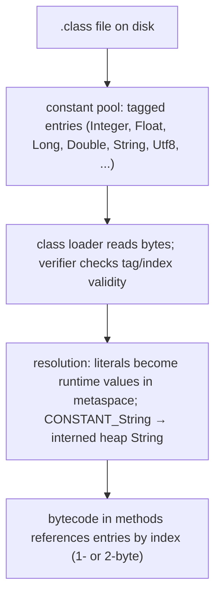

> [!TIP]
> To see the constant pool for any class, run `javap -v ClassName`. The `Constant pool:` section lists every entry with its tag, value, and any indices it references. This is the single best tool for "what really got compiled."

## Bytecode for Loading Literals

The bytecode side has a small family of instructions for pushing a literal onto the operand stack. Their job: get a constant onto the stack so the next operation can consume it.

| Opcode      | Size (bytes) | Pushes                                            | Used when                                              |
|-------------|:------------:|---------------------------------------------------|--------------------------------------------------------|
| `iconst_m1` …`iconst_5` | 1   | the small int `-1, 0, 1, 2, 3, 4, 5`             | the value fits — most-common case is `0` / `1`         |
| `lconst_0`, `lconst_1`  | 1   | `0L`, `1L`                                        | `long` zeros & ones                                    |
| `fconst_0`, `fconst_1`, `fconst_2` | 1 | `0.0f`, `1.0f`, `2.0f`                       | float zeros / one / two                                |
| `dconst_0`, `dconst_1`  | 1   | `0.0`, `1.0`                                      | double zero / one                                      |
| `bipush <b>`            | 2   | a byte `b` sign-extended to int (-128..127)       | small ints not covered by `iconst_*`                   |
| `sipush <s>`            | 3   | a short `s` sign-extended to int (-32768..32767)  | medium ints                                            |
| `ldc <idx>`             | 2   | the CP entry at the 1-byte unsigned index         | int/float/String/Class entries when index < 256        |
| `ldc_w <idx>`           | 3   | same as `ldc` but 2-byte index                    | entries when index >= 256                              |
| `ldc2_w <idx>`          | 3   | a `long` or `double` from the CP                  | the only way to load 64-bit literals (`CONSTANT_Long`/`CONSTANT_Double`) |
| `aconst_null`           | 1   | a `null` reference                                | the `null` literal                                     |

The `javac` optimisation chain: pick the smallest opcode that works. The literal `0` is `iconst_0` (1 byte total); `100` is `bipush 100` (2 bytes); `1000` is `sipush 1000` (3 bytes); `1_000_000` is `ldc #idx` referencing a `CONSTANT_Integer` (3 bytes + 5 in the pool); and `1_000_000L` is `ldc2_w #idx` referencing a `CONSTANT_Long` (3 bytes + 9 in the pool).

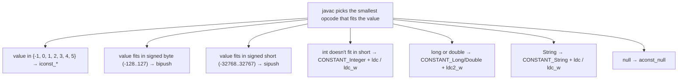

Concrete walkthrough — compile this:

```java
public class Literals {
    public static void main(String[] args) {
        int    a = 5;
        int    b = 100;
        int    c = 1000;
        int    d = 1_000_000;
        long   e = 1_000_000_000_000L;
        double f = 3.14;
        String s = "hello";
        Object n = null;
    }
}
```

`javap -c Literals` shows the bytecode picks the smallest form for each:

```
 0: iconst_5            //  5     → 1 byte
 1: istore_1
 2: bipush       100    //  100   → 2 bytes (fits in signed byte)
 4: istore_2
 5: sipush       1000   //  1000  → 3 bytes (fits in signed short)
 8: istore_3
 9: ldc          #2     //  1000000  → 2 bytes + 5-byte CP entry
11: istore       4
13: ldc2_w       #3     //  1_000_000_000_000L  → 3 bytes + 9-byte CP entry
16: lstore       5
18: ldc2_w       #5     //  3.14d
21: dstore       7
23: ldc          #7     //  String "hello"  → CONSTANT_String → CONSTANT_Utf8
25: astore       9
27: aconst_null         //  null  → 1 byte
28: astore       10
30: return
```

Notice: the smaller the literal, the more compact the bytecode. This is one of several places `javac` optimises code size (which matters for `.class` file size, classloading time, JIT decisions on inline budgets).

## How Literals Reach the CPU

Now drop one more layer. When the JIT compiles a method that uses a literal, what native instructions does it emit?

For **small literals**, the literal becomes an **immediate operand** baked directly into the machine instruction. The CPU's instruction decoder reads the constant from the instruction stream itself — no separate memory access.

On x86-64:

```asm
mov   eax, 42                 ; "load immediate 42 into EAX" — the 42 sits in the instruction bytes
add   eax, 1000               ; ADD with a 32-bit immediate operand
```

On ARM64, the encoding rules are tighter (each instruction is fixed 32 bits, leaving fewer bits for the immediate), but the principle is the same:

```asm
mov   w0, #42                 ; load immediate
add   w0, w0, #1000           ; ARM64 add can take a 12-bit immediate; 1000 fits
```

For **large literals** that don't fit the immediate field (e.g., a 64-bit `long`, an arbitrary `double`, or an x86-64 `mov` with a 32-bit-only immediate), the JIT places the constant in memory (typically in the JVM's *constants region* near the JIT-compiled code) and emits a memory-load instruction:

```asm
; x86-64: a double literal lives in memory; the JIT loads it.
movsd xmm0, QWORD PTR [rip+0x123]   ; rip-relative load of 8 bytes (an IEEE 754 double)
```

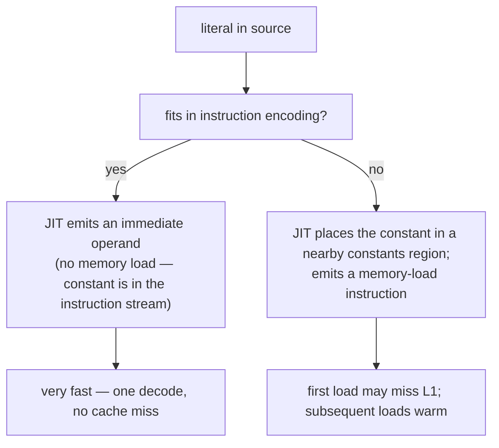

For most integer literals you write, the immediate path is taken — meaning literals are effectively *free* at runtime. This is one of the reasons the JIT-loved pattern of `static final int X = 42;` ends up *literally* identical at machine level to the loose literal `42` sprinkled through code: both fuse into immediate operands. We'll see why next.

## Constants via `final`

The keyword **`final`** says: *once assigned, this variable can never be reassigned*. It can decorate four things (we cover three here; final methods and final classes are L1):

| Where used                  | Meaning                                                                                  |
|----------------------------|------------------------------------------------------------------------------------------|
| Local variable / parameter | The slot can be assigned exactly once; subsequent assignment is a compile error.         |
| Instance field             | Must be assigned exactly once in the constructor (or inline / instance initialiser); each new object can have its own value. |
| Static field               | Must be assigned exactly once in `<clinit>` (the static initialiser) — there's one per class. |
| Method                     | Subclasses cannot override (covered in `L1/C01`).                                        |
| Class                      | Cannot be subclassed (covered in `L1/C01`).                                              |

```java
final int x = 42;           // OK — assigned once
// x = 43;                  // ERROR — cannot assign a value to final variable x

final int y;
y = 100;                    // OK — "blank final", assigned once
// y = 101;                 // ERROR

void f(final int p) {       // final parameter — body can read but not reassign p
    // p = 0;               // ERROR
}

class Point {
    final int dim;          // blank final instance field — must be set in the constructor
    Point(int d) { this.dim = d; }
}

class Math2 {
    static final double TAU = 2 * Math.PI;   // canonical "constant"
}
```

**Naming convention.** `static final` constants are written in `SCREAMING_SNAKE_CASE` — `MAX_USERS`, `DEFAULT_TIMEOUT_MS`, `TAU`. Local and parameter `final`s use ordinary `camelCase`. The convention is a strong visual cue: "this name will not change."

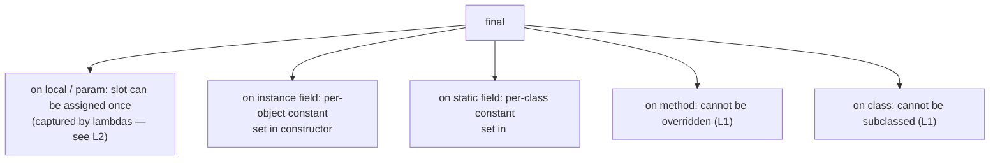

**What does `final` actually do at the bytecode level?**

Answer: surprisingly little. For locals and parameters, **`final` is purely a compile-time enforcement** — the bytecode is identical whether you write `final int x = 1;` or `int x = 1;`. There is no "final" bit on a local-variable slot. The JVM verifier doesn't track finality on locals.

For fields, there *is* an `ACC_FINAL` flag in the field's `.class` access flags — and the JVM does enforce it: the `putfield`/`putstatic` opcodes that write the field are only legal from the constructor (for instance) or `<clinit>` (for static) of the declaring class. Reflection can bypass this in theory but doesn't in modern JVMs.

> [!NOTE]
> **Going deeper — the JIT and final fields.** While `final` on a *local* is invisible to the JIT, `final` on an *instance/static field* is **a powerful hint**: the JIT can assume the value never changes after construction, and can therefore constant-fold reads of it through arbitrarily deep call chains. `static final` non-primitives (e.g., `static final SomeImmutableConfig CFG = ...`) often become inlined "trusted values" inside JIT-compiled code. This is why **immutability is also a performance feature**, not just a correctness one.

## Compile-Time Constants — Inlining and Its Gotchas

This is the deepest single idea in the topic. JLS §15.29 defines a precise notion of **compile-time constant expression** (a "CT constant"). Roughly, it is:

- a literal of a primitive type or a `String` literal,
- a cast to a primitive or `String`,
- a unary or binary operator applied to CT constants (`+`, `-`, `*`, `<<`, `&`, `?:`, etc.),
- a *simple name* of a `final` variable of primitive or `String` type **whose initialiser is itself a CT constant**.

So:

```java
static final int A = 10;                 // CT constant — initialiser is a literal
static final int B = A + 32;             // CT constant — operator on CT constant
static final String NAME = "kgk";        // CT constant
static final String GREETING = "Hi, " + NAME;   // CT constant — String concat of CT constants

static final int RANDOM = (int) (Math.random() * 100);  // NOT a CT constant — runtime call
static final long NOW = System.currentTimeMillis();     // NOT a CT constant
```

CT constants get special treatment from `javac`: **uses are replaced by the value itself**, baked into the using class's constant pool. There is **no `getstatic`** — the constant is just a literal at every call site.

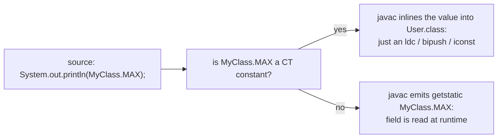

The inlining has three consequences — one good, one neutral, one infamous.

**Good.** CT constants are essentially free at use sites — no field access, no extra constant-pool entry in the *referenced* class. They can also be used in contexts that *require* a CT constant: `switch` case labels (`T08`), `@Annotation(value = ...)` arguments, and array dimensions in some places.

**Neutral.** The bytecode of a method using a CT constant looks identical whether the constant came from a `static final` field or was a literal. After `javac` is done, the two are indistinguishable.

**Infamous — the recompile gotcha.**

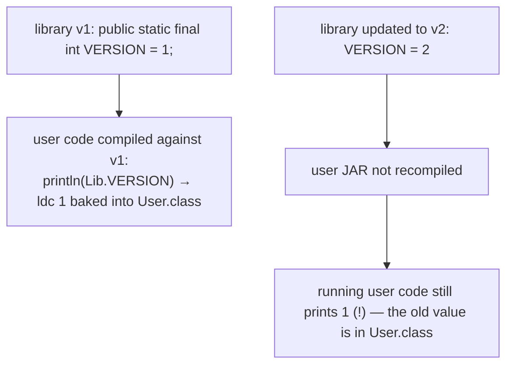

This is real:

```java
// in Lib.java (compiled and shipped as Lib-1.0.jar):
public class Lib {
    public static final int VERSION = 1;
}

// in User.java (compiled and shipped as App.jar, depends on Lib-1.0):
public class User {
    public static void main(String[] args) {
        System.out.println(Lib.VERSION);   // bytecode: ldc 1
    }
}
```

Drop in `Lib-2.0.jar` with `VERSION = 2` **without recompiling** `App.jar`. The output is still `1`. The value `1` was *physically copied* into `User.class` at compile time; nothing reads `Lib.VERSION` at runtime.

The workaround is to either (a) recompile every dependent jar when changing a CT constant, or (b) make the field **not** a CT constant — e.g., `public static final int VERSION = Integer.parseInt("2");` — which forces a runtime `getstatic` at use sites at the cost of one method call per access.

> [!WARNING]
> **Rule of thumb.** For values you might want to change without recompiling consumers, don't use `static final = literal`. Use `static final = expression-that-is-not-a-CT-constant`, or load the value at runtime (config file, environment variable, JNDI…). The CT-constant inlining is otherwise wonderful and free — but it ships *your* bytes into *their* `.class` files, and they keep them.

## `final` Field Initialisation in Detail

A blank `final` field — declared without an immediate value — must be assigned **exactly once** by the end of every path through the constructor (instance) or static initialiser (static). The compiler proves this with the same definite-assignment analysis from `T02`, just stricter.

```java
class Account {
    final int id;              // blank instance final
    final long openedAt;
    static final int VERSION;  // blank static final

    static {                   // static initialiser — runs once when the class is loaded
        VERSION = 3;
    }

    Account(int id) {
        this.id = id;
        this.openedAt = System.currentTimeMillis();
        // (omitting either assignment is a compile error)
    }
}
```

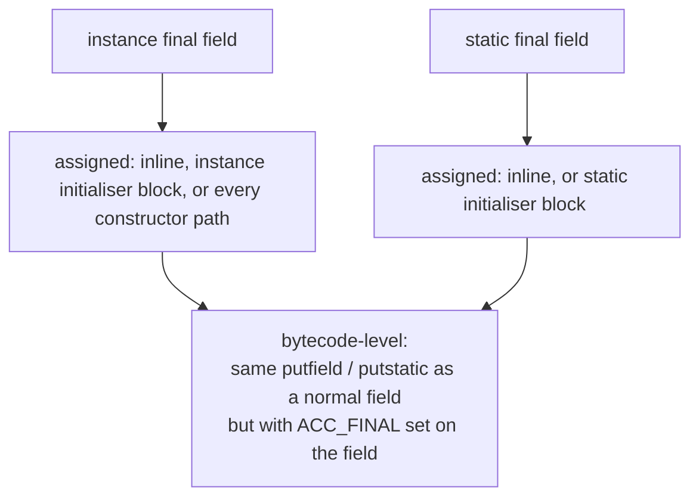

Memory-wise, a `final` field is identical to a non-final field in the heap layout — same offset, same size, same alignment (from `T02`'s heap-layout section). The `ACC_FINAL` is purely metadata. But:

> [!IMPORTANT]
> **`final` and the JVM Memory Model — preview.** In multithreaded code, a properly constructed `final` field has a *safe-publication* guarantee: once the constructor finishes, any thread that subsequently obtains a reference to the object is guaranteed to see the final field's final value. This is **not** true of non-final fields without explicit synchronisation. The mechanism (an implicit *freeze* action at the end of the constructor) is JLS §17.5; we'll go deep in `L3/C01` (concurrency). For now the rule is: if a field is set once in the constructor and read by other threads, declare it `final`.

## String Interning Deep Dive

We saw earlier that two String *literals* with the same text are `==`-equal because they share a single heap object. The mechanism is **interning**, and on modern HotSpot (Java 7+) the string pool lives in the **heap** (it was in PermGen before Java 7).

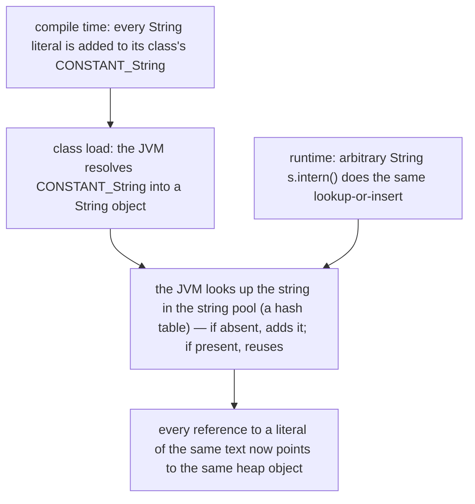

The pool is a hash table mapping `String` content → canonical heap `String`. It is `String`-private (you can't see it directly), and `String.intern()` is your runtime entry point:

```java
String a = "hello";
String b = "hello";
String c = new String("hello");      // explicit new — not interned
String d = c.intern();               // lookup-or-insert → returns the pooled "hello"

System.out.println(a == b);          // true  — both literals, both interned, same object
System.out.println(a == c);          // false — c is a fresh heap object
System.out.println(a == d);          // true  — d is the pooled object, same as a
```

Three points worth pinning:

- **CT-constant String expressions are interned too.** `"a" + "b"` (a CT constant) refers to the same pooled `"ab"` everywhere. But `"a" + nonFinalVar` (not a CT constant) does *not* — it produces a fresh `String` at runtime.
- **Memory implication.** If your application has thousands of classes each containing `"User-Agent"` as a literal, there is **one** `"User-Agent"` object in the heap, not thousands.
- **`-XX:StringTableSize` tunes the pool's hash bucket count** (HotSpot). A too-small table on a heavy-intern workload causes collisions; the default is set generously for most apps.

Full String API: `T06`. Surrogate pairs, code-point iteration, text blocks: also `T06`.

## Memory Footprint Comparison

A practical cross-cut: how do three popular "constant" patterns differ in cost?

| Pattern                                                                 | At use site (bytes/instruction)        | Other costs                                                        |
|------------------------------------------------------------------------|----------------------------------------|--------------------------------------------------------------------|
| Literal `42` inline, every time                                        | 1–2 bytes (`bipush`) or 1 byte (`iconst_*`) | None — purely in the instruction stream                            |
| `static final int X = 42;` then `X` everywhere                         | **Identical** to the above — `javac` inlines | 5-byte CP entry in *declaring* class only (CONSTANT_Integer)        |
| `static final int X = compute();` (non-CT)                              | 3 bytes (`getstatic`) at every use site  | one static slot in the declaring class; one method call at class init |
| `static final String S = "kgk";`                                       | 2–3 bytes (`ldc` of a CONSTANT_String) | One **interned** heap String shared across all references          |
| `static final SomeImmutable C = new SomeImmutable(...)`                 | 3 bytes (`getstatic`) at every use     | One heap object; JIT may inline reads of its fields as constants    |

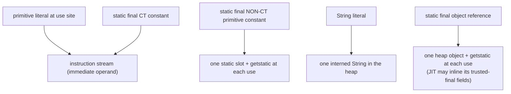

Two practical lessons:

- Use `static final` primitives without worry — they cost nothing extra at use sites and read self-documentingly.
- For values that should *not* be inlined into consumer jars (because they may change in a library update), break the CT-constant chain — e.g., `Integer.parseInt("42")` or a static initialiser.

## Common Mistakes

- **Octal surprises.** `int n = 010;` is `8`, not `10`. Avoid leading zeros on decimal numbers.
- **Forgetting the `L` suffix.** `long ns = 1_000_000_000 * 60;` overflows in `int` first. Write `1_000_000_000L * 60`.
- **Lowercase `l` for `long`.** `long x = 100l;` is legal but looks identical to `1001`. Always use uppercase `L`.
- **Float suffix omission.** `float r = 1.5;` doesn't compile — the right-hand side is a `double`. Use `1.5f`.
- **`final` of a reference is not deep immutability.** `final int[] arr = {1, 2, 3};` means *the variable* can't be reassigned to a different array — but `arr[0] = 99;` still works. `final` freezes the *slot*, not the *object*.
- **`==` on Strings.** `==` is identity, not equality. Use `.equals()` for content comparison. The interning behaviour can make `==` *appear* to work for literals — but the moment a runtime concatenation or `new String(...)` is involved, it breaks.
- **CT-constant recompile bug.** Changing a public `static final` CT-constant in a library and *not* recompiling consumers leaves the old value baked into their `.class` files (see the gotcha section).
- **Unicode escape in comments.** A `
` inside a `//` comment terminates the comment, since escape processing runs *before* tokenization.
- **Assigning a blank final more than once.** "Variable already assigned" — the compiler enforces single-assignment per constructor path.

> [!INTERVIEW]
> Reliable interview questions, in increasing depth:
> - **"What's the difference between `int x = 5;` and `final int x = 5;`?"** Compile-time enforcement only — bytecode identical for a local. But `final` lets the local be captured by lambdas/anonymous classes ("effectively final" is the relaxed rule from Java 8).
> - **"What does the `L` suffix do?"** Promotes the literal from `int` to `long`. Without it, `1_000_000_000_000` doesn't compile because it can't fit in 32 bits.
> - **"What's special about a `static final int X = 5`?"** It's a compile-time constant — `javac` inlines its value at every use site, including across compilation units. Has knock-on effects (cross-jar recompile gotcha, switch-case eligibility).
> - **"Are String literals interned?"** Yes — every String literal and every CT-constant String expression is added to the JVM's string pool at class resolution. Two literals with the same text are `==`-equal.
> - **"Where is the String pool stored in modern HotSpot?"** In the heap (since Java 7). Before that it was in PermGen, which had small fixed sizes and could throw `OutOfMemoryError: PermGen` on heavy interning.
> - **"What's the `aconst_null` opcode?"** The bytecode for the `null` literal — pushes a null reference (all-zero bits) onto the operand stack.
> - **"Why might a CT-constant cause a cross-jar bug?"** Because the constant value is physically copied into every consumer's `.class` file at compile time. Changing the value in the producer doesn't propagate unless consumers recompile.
> - **"What does `final` mean for a field, beyond preventing reassignment?"** Two things: (1) the JVM enforces single-assignment in the constructor / `<clinit>`; (2) it gives the JVM Memory Model's *safe-publication* guarantee — other threads, on seeing a reference to the constructed object, are guaranteed to see the final value.

## Practice

1. **Write them all.** In one class, declare and print one literal of every kind: decimal int, hex int, binary int, octal int, long, float, double, scientific double, hex float, char (direct), char (Unicode escape), char (octal escape), boolean true, boolean false, String, null. Compile and run.
2. **Constant pool.** Run `javap -v` on the class from exercise 1. List every constant-pool entry whose tag is one of `Integer`, `Float`, `Long`, `Double`, `String`, `Utf8`. Identify which Java literal each corresponds to.
3. **Smallest opcode.** Predict, then verify with `javap -c`, the bytecode `javac` emits for `int x = N;` for `N` in `{0, 1, 5, 6, 127, 128, 32767, 32768, 1_000_000}`. Where do `iconst_*`, `bipush`, `sipush`, and `ldc` switch over?
4. **Long and double.** Add `long y = 1_000_000_000_000L;` and `double z = 3.14;` and disassemble. Which opcodes load them? How many bytes does each opcode plus its operand take? Confirm that both use `ldc2_w`.
5. **Octal trap.** Predict what these print: `int a = 010;`, `int b = 09;`, `int c = 0;`, `int d = 0_1;`. Compile each; explain each result or compile error.
6. **String identity.** Run:
   ```java
   String a = "hello";
   String b = "hello";
   String c = new String("hello");
   String d = c.intern();
   System.out.println(a == b);   // ?
   System.out.println(a == c);   // ?
   System.out.println(a == d);   // ?
   ```
   Predict each result; explain in terms of the string pool.
7. **CT-constant cross-jar bug — reproduce it.**
   - Create `Lib.java` with `public class Lib { public static final int VERSION = 1; }`. Compile and put it in `lib/Lib.class`.
   - Create `User.java` with `public class User { public static void main(String[] a) { System.out.println(Lib.VERSION); } }`. Compile against `lib/`.
   - Now change `Lib.java` to `VERSION = 2`, recompile **only** `Lib.java`, and re-run `User`. What prints? Then recompile `User.java` and re-run. What prints now?
8. **Break the inlining.** Change `Lib.VERSION` to `public static final int VERSION = Integer.parseInt("2");` (which is *not* a CT constant). Recompile `Lib.java` only; re-run `User` (without recompiling). What prints?
9. **Unicode-escape comment.** Type out the exact line `// hi 
 System.exit(99);` inside a `main` method and compile/run. Observe the exit code. Explain why.
10. **`final` is shallow.** Write `final int[] arr = {1, 2, 3}; arr[0] = 99; System.out.println(arr[0]);`. Does it compile? What prints? Now try `arr = new int[]{4, 5, 6};`. What happens? Explain what `final` actually freezes.
11. **Blank final.** Try writing a class with `final int id;` and *no* constructor that sets it. What's the compile error? Then write a constructor that conditionally sets `id` (e.g., inside an `if`). What does the compiler complain about now?
12. **Lambda capture preview.** Write `int counter = 0;` in `main`, then inside a `Runnable r = () -> System.out.println(counter);` print it. Now add `counter++;` between the assignment and the lambda. What error appears? Why? (You're meeting the "effectively final" rule from L2.)
13. **JIT immediate vs memory load (optional, advanced).** Compile a method that uses `int x = 42;` and one that uses `long x = 0x1234_5678_9ABCDEF0L;`. Run with `-XX:+UnlockDiagnosticVMOptions -XX:+PrintAssembly` (needs hsdis). Which method's JIT output contains an immediate operand; which contains a memory load (e.g., `mov ..., QWORD PTR [...]`)? Why?
14. **Explain it back.** In your own words, describe what `javac` does with the line `static final String NAME = "kgk";`, from token through CP entry through bytecode through class-load-time interning, naming each artefact. Then describe what `javac` does at a use site `System.out.println(NAME);` and why `NAME` cannot be changed without recompiling every consumer.

## Recap

You should now be able to:

- Distinguish a **literal** (a source-code form) from its runtime **value**, and trace the literal through the lexer → constant-pool entry → bytecode opcode → operand stack → CPU register.
- Write every integer-literal form — decimal, hexadecimal (`0x`), binary (`0b`), octal (leading `0`) — and explain underscore rules and the `L` suffix.
- Write every floating-point literal — decimal (`3.14`), scientific (`1.5e3`), hex-float (`0x1.8p3`) — and explain the `f`/`d` suffix and *why* hex-float exists.
- Recognise every character escape (`\n`, `\t`, `\uHHHH`, `\NNN`, etc.), and explain why a `
` inside a comment breaks the comment.
- State that `true`, `false`, and `null` are the three "reserved literals," and that `null` is all-zero bits — same bit pattern as a default reference.
- Explain that String literals are heap objects automatically **interned** into the JVM's string pool, and how that makes `==` on identical literals work — while breaking on `new String("...")`.
- Sketch the **constant pool** of a `.class` file: an array of tagged entries (`CONSTANT_Integer`=3, `CONSTANT_Float`=4, `CONSTANT_Long`=5, `CONSTANT_Double`=6, `CONSTANT_String`=8, `CONSTANT_Utf8`=1) with byte-level layouts, including the quirk that `Long`/`Double` consume two pool indices.
- Recite the literal-loading bytecode family — `iconst_*`, `lconst_0/1`, `fconst_0/1/2`, `dconst_0/1`, `bipush`, `sipush`, `ldc` / `ldc_w`, `ldc2_w`, `aconst_null` — and explain how `javac` picks the smallest opcode that fits the value.
- Explain that small literals are JIT-emitted as **immediate operands** in machine code (`mov eax, 42`, `mov w0, #42`), while large/64-bit literals are placed in memory and loaded with a memory-access instruction.
- Use `final` correctly on locals, parameters, instance fields, and static fields, and state what `final` actually does at the bytecode level (compile-time enforcement; `ACC_FINAL` flag on field entries; nothing at all for locals).
- Define a **compile-time constant** per JLS §15.29, list what counts and what doesn't, and explain that `javac` **inlines** CT-constant uses into consumer `.class` files — with the famous cross-jar recompile gotcha.
- Explain that `final` instance fields gain a **safe-publication** guarantee in the JMM (full coverage in `L3/C01`).
- Decide when to keep a `static final` CT-constant and when to break the CT chain (so consumers see runtime changes without recompiling).
- Estimate the memory footprint of the four common "constant" patterns — inline literal, CT-constant, non-CT static final, interned String — and explain why CT constants are essentially free at use sites.

## Next

Continue to [Operators (arithmetic, relational, logical, bitwise, assignment)](./T04-operators-arithmetic-relational-logical-bitwise-assignment.md).
