# Operators (arithmetic, relational, logical, bitwise, assignment)

Variables hold data; **operators** transform it. Every expression in Java — `a + b`, `x < 100`, `flag && ready`, `mask & 0xFF`, `count++` — is a tree of operator applications. This topic catalogues every operator the language has, explains the rules that decide what type and value each one produces (numeric promotion, short-circuit evaluation, the compound-assignment cast trick), then drops to the machine layer: which **bytecode opcode** the operator compiles to, how the **operand stack** carries intermediates between operations, and what the **JIT** turns the whole thing into on x86-64 and ARM64 — including the optimisations (strength reduction, constant folding, `iinc`) that make `i++` faster than `i = i + 1` even though they "do the same thing."

We're going deep because operators are where the abstract data model from `T02` meets the silicon arithmetic from `L0/C01/T01` and `T02`. By the end you should be able to look at `arr[i] += 5` and trace every byte: the array reference fetched, the index loaded, the element loaded, 5 pushed, added, stored back — across the operand stack, into the heap, with the JIT eliminating most of the dance once the method is hot.

> [!NOTE]
> Prerequisites: [Variables & Primitive Types](./T02-variables-and-primitive-types.md) (`L0/C02/T02`) — the eight primitives, IEEE 754, stack frames, the local variable array, the operand stack; [Literals & Constants](./T03-literals-and-constants-final.md) (`L0/C02/T03`) — `iconst_*`/`bipush`/`sipush`/`ldc` for pushing values, the constant pool; [Number Systems & Basic Bit Math](../C01-cs-foundations/T02-number-systems-binary-hex-and-basic-bit-math.md) (`L0/C01/T02`) — adders, two's complement, the barrel shifter, masking idioms; [Source to Bytecode to JVM to Machine Code](../C01-cs-foundations/T04-source-to-bytecode-to-jvm-to-machine-code.md) (`L0/C01/T04`) — the operand stack, stack frames, JIT.

## What Is an Operator?

An **operator** is a built-in function with a special **infix** (or prefix or postfix) syntax. `a + b` is just sugar for "call the addition function on `a` and `b`." Every operator takes one to three operands of specific types and produces a value of a specific type — both decided by the operator's signature and Java's promotion rules.

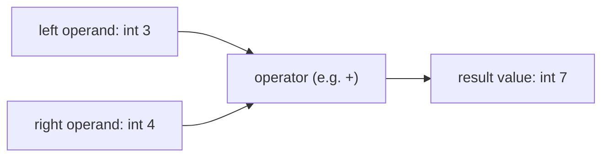

Operators are the building blocks of **expressions** — anything that produces a value (`a + b`, `arr[i]`, `obj.field`, `flag ? x : y`). Statements (semicolon-terminated `if (…)`, `while (…)`, `x = 5;`) are made of expressions.

There are ~40 operators in Java. They fall into a small number of categories:

| Category               | Operators                                                   |
|------------------------|-------------------------------------------------------------|
| Arithmetic             | `+`, `-`, `*`, `/`, `%`, unary `+`, unary `-`               |
| Increment / decrement  | `++`, `--`  (prefix and postfix)                            |
| Relational             | `<`, `<=`, `>`, `>=`, `instanceof`                          |
| Equality               | `==`, `!=`                                                  |
| Logical (short-circuit)| `&&`, `||`, `!`                                             |
| Bitwise / logical-bool | `&`, `|`, `^`, `~`                                          |
| Shift                  | `<<`, `>>`, `>>>`                                           |
| Assignment             | `=`, `+=`, `-=`, `*=`, `/=`, `%=`, `&=`, `|=`, `^=`, `<<=`, `>>=`, `>>>=` |
| Conditional (ternary)  | `cond ? a : b`                                              |
| String concatenation   | `+` when either operand is a `String`                       |
| Other                  | `(type)cast`, `new`, `.` (field/method access), `[]` (index), `()` (call), `::` (method ref, L2), `->` (lambda, L2) |

We cover every one in this topic except the casts (`T05`), `new` / method calls / field access (L1), and lambdas (L2).

## Precedence and Associativity

When you write `1 + 2 * 3`, Java has to decide whether to parse it as `(1 + 2) * 3` or `1 + (2 * 3)`. The answer is **precedence**: each operator has a priority level, and higher-precedence operators bind tighter. Within one level, **associativity** decides direction.

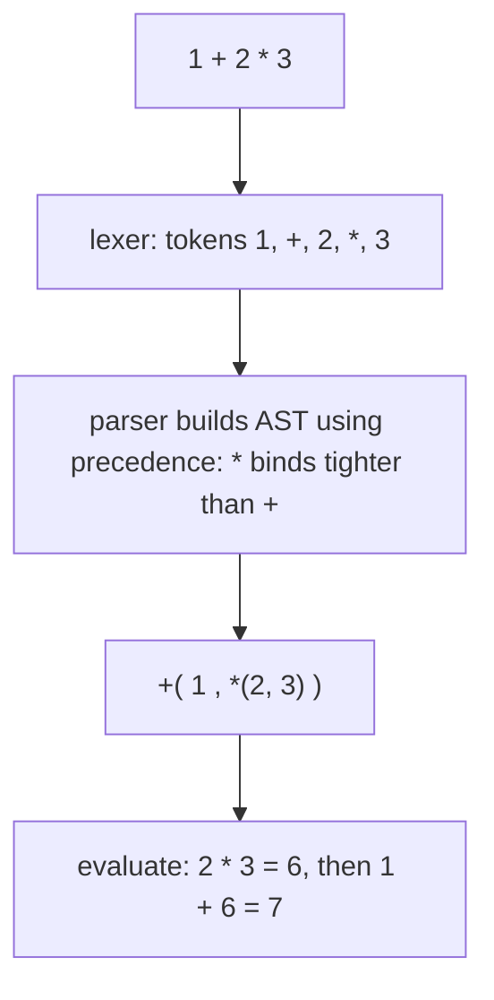

Java's precedence table, **highest to lowest**:

| Level | Operators                                | Associativity |
|:-----:|------------------------------------------|---------------|
| 16    | postfix `expr++`, `expr--`               | left          |
| 15    | unary `++expr`, `--expr`, `+`, `-`, `~`, `!` | right     |
| 14    | cast `(type)expr`                        | right         |
| 13    | multiplicative `*`, `/`, `%`             | left          |
| 12    | additive `+`, `-`                        | left          |
| 11    | shift `<<`, `>>`, `>>>`                  | left          |
| 10    | relational `<`, `<=`, `>`, `>=`, `instanceof` | left     |
|  9    | equality `==`, `!=`                      | left          |
|  8    | bitwise AND `&`                          | left          |
|  7    | bitwise XOR `^`                          | left          |
|  6    | bitwise OR `|`                           | left          |
|  5    | logical AND `&&`                         | left          |
|  4    | logical OR `||`                          | left          |
|  3    | conditional `? :`                        | right         |
|  2    | assignment `=`, `+=`, …                  | right         |
|  1    | lambda `->`                              | right         |

Right-associative operators (assignment, ternary, unary) group from the right. So `a = b = c = 0` parses as `a = (b = (c = 0))` — assign 0 to `c`, then `c`'s value (0) to `b`, then 0 to `a`.

> [!TIP]
> **Use parentheses.** Memorising the full precedence table is a waste of brain. Add `()` whenever the order is non-obvious — `(a | b) << 2`, `(x & MASK) == 0`, `(a < b) && (c < d)`. Bytecode is identical; reader-confusion drops to zero.

## Arithmetic Operators

The five arithmetic operators for numeric types:

| Op  | Meaning      | Notes                                                              |
|-----|--------------|--------------------------------------------------------------------|
| `+` | addition     | also string concatenation when either operand is `String`          |
| `-` | subtraction  | unary `-` also negates (`-x`)                                      |
| `*` | multiplication |                                                                 |
| `/` | division     | **integer division truncates toward zero** if both operands are integral; otherwise floating-point |
| `%` | remainder    | sign follows the dividend in integer; IEEE 754 remainder for floats |

Plus the unary forms `+x` (no-op promotion to at least int) and `-x` (arithmetic negation).

```java
int a = 7, b = 3;
System.out.println(a + b);   // 10
System.out.println(a - b);   //  4
System.out.println(a * b);   // 21
System.out.println(a / b);   //  2   ← truncated (not 2.33…)
System.out.println(a % b);   //  1   ← remainder: 7 = 2*3 + 1

double x = 7.0, y = 3.0;
System.out.println(x / y);   //  2.3333333333333335   ← float division
System.out.println(x % y);   //  1.0
```

Each arithmetic operator has a **bytecode opcode** per type: `iadd`/`ladd`/`fadd`/`dadd`, `isub`/`lsub`/`fsub`/`dsub`, and so on. The compiler picks based on the **promoted** type of the operands (see below).

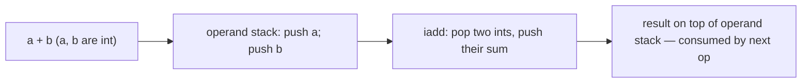

## Numeric Promotion — The Critical Rules

Java's **numeric promotion rules** decide what type an arithmetic, comparison, or bitwise expression actually computes in. They are short but they catch people **every day**. Two flavours:

### Unary Numeric Promotion (one operand)

Applies to `+x`, `-x`, `~x`, shift right-hand operand, and array indices. Rule: if `x` is `byte`, `short`, or `char`, **promote to `int`**. Other types stay.

So `~(byte)5` is an `int` (result `-6`), not a `byte`.

### Binary Numeric Promotion (two operands)

Applies to all binary arithmetic, comparisons, and bitwise ops. Rule, in order:

1. If either operand is **`double`**, promote the other to `double`.
2. Else if either is **`float`**, promote the other to `float`.
3. Else if either is **`long`**, promote the other to `long`.
4. Else promote **both** to `int` (so `byte`, `short`, `char` widen to int).

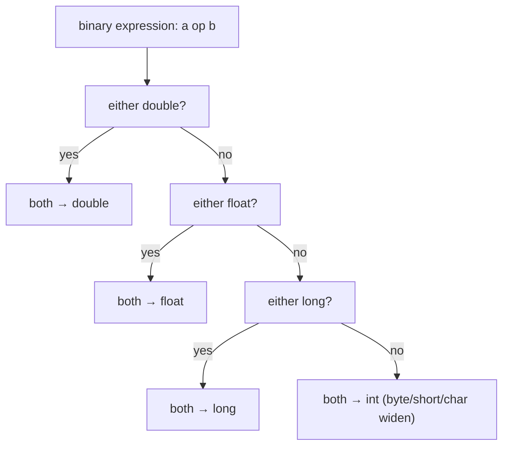

Concretely:

```java
byte a = 10, b = 20;
int  s = a + b;            // a and b promoted to int → iadd → int result
// byte s2 = a + b;        // ERROR: result is int, doesn't auto-narrow to byte

short x = 1000;
long  big = x * 1000;      // x widens to int; 1000 is int; result int; then widens to long on store
long  bigger = x * 1000L;  // 1000L forces long binary promotion → no int overflow

int   i = 1, j = 2;
double d = i / j;          // 0.0 (!): i / j computed as int → 0 → widened to 0.0
double d2 = (double) i / j; // 0.5  — cast forces double promotion
```

The third example — `int / int → int`, *then* the result widens — is the single most common arithmetic gotcha. Promotion happens **before** the operation, never after.

### The Sub-int Trap

`byte`, `short`, and `char` cannot be the *result* of arithmetic. Adding two `byte`s yields an `int`. This breaks the natural-looking code:

```java
byte b = 100;
b = b + 1;        // ERROR: int → byte requires explicit cast
b = (byte)(b + 1);// OK
b += 1;           // OK! compound assignment hides the cast (see Assignment section)
```

The reason is mechanical: the JVM has `iadd` (int add) and `ladd` (long add) and the float/double variants — **no** `badd` or `sadd`. Sub-int arithmetic always promotes to int first; explicit narrowing is needed to put the result back into a smaller slot.

## Integer Division and Remainder

`int / int` and `long / long` use **truncating division** — the result is the integer with the largest absolute value not exceeding the true quotient, with the sign of the true quotient. In other words: **round toward zero**:

```java
System.out.println( 7 /  3);  //  2
System.out.println(-7 /  3);  // -2   (Java truncates toward 0; Python yields -3)
System.out.println( 7 / -3);  // -2
System.out.println(-7 / -3);  //  2
```

The matching remainder rule: `a % b` has the **sign of `a`** (the dividend), and `(a / b) * b + (a % b) == a` always (within the integer overflow caveats).

```java
System.out.println( 7 %  3);  //  1
System.out.println(-7 %  3);  // -1   (sign of dividend)
System.out.println( 7 % -3);  //  1
System.out.println(-7 % -3);  // -1
```

Division by zero rules:

| Op          | `/ 0` for int/long      | `% 0` for int/long      | `/ 0.0` or `% 0.0` for float/double |
|-------------|-------------------------|-------------------------|---------------------------------------|
| Behaviour   | **`ArithmeticException: / by zero`** | **`ArithmeticException`** | `±Infinity`, `0.0/0.0` = `NaN` — **no exception** |

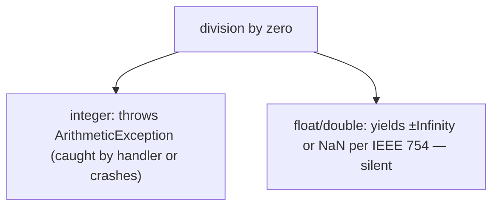

The asymmetry is by design: integer division has no representation for infinity, so the JVM signals; float division uses IEEE 754's special values and continues. **Catch the integer case** if it's a real possibility.

> [!INTERVIEW]
> **"What's the result of `Integer.MIN_VALUE / -1`?"** Surprising answer: an **`int` overflow**. The mathematical result `2,147,483,648` doesn't fit in `int`, but `int / int` doesn't throw on overflow — it wraps. So `Integer.MIN_VALUE / -1 == Integer.MIN_VALUE`. (On the CPU side, this is the *one* case where the `IDIV` instruction's behaviour differs from the JVM's spec — most CPUs raise a hardware trap; the JVM masks it. We see the consequences in performance-sensitive code only.)

## Floating-Point Arithmetic Quirks

IEEE 754 (from `T02`) carries over to operators. Three behaviours that surprise everyone:

- **NaN propagates.** Any arithmetic with NaN yields NaN. `Double.NaN + 1 == NaN`; `Math.sqrt(-1) * 0 == NaN`. Comparisons with NaN are **all false** (`NaN == NaN` is `false`, `NaN < 1` is `false`, `NaN > 1` is `false`) — except `!=` which is `true`.
- **Signed zero exists.** `1.0 / 0.0` is `+Infinity`; `1.0 / -0.0` is `-Infinity`; `0.0 == -0.0` is `true` (!) but `1.0 / 0.0 == 1.0 / -0.0` is `false`.
- **Rounding accumulates.** Sums of many `double`s are order-dependent: `(a + b) + c` may differ in the last bit from `a + (b + c)`. Strict reproducibility — same bits on every JVM — is the `strictfp` keyword's job (mostly defaulted away since Java 17, when all float math became strictfp by default).

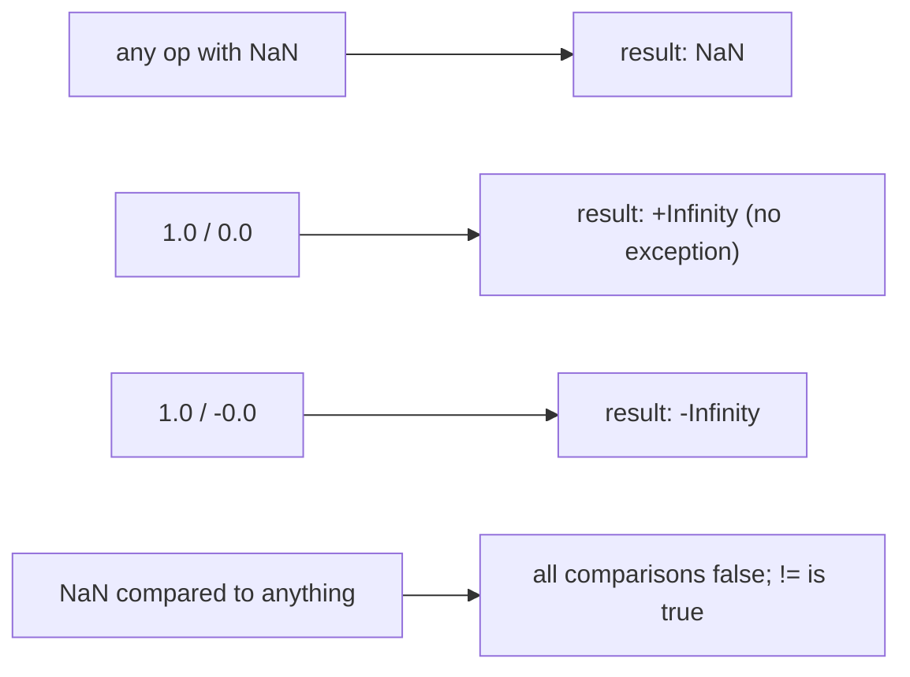

## Increment and Decrement

`++` adds 1, `--` subtracts 1. Each has two forms:

| Form        | Returns    | Equivalent to                                  |
|-------------|------------|------------------------------------------------|
| `++x`  (prefix)  | new value of `x` | `x = x + 1; return x;`           |
| `x++`  (postfix) | old value of `x` | `int t = x; x = x + 1; return t;`|
| `--x`  (prefix)  | new value of `x` | `x = x - 1; return x;`           |
| `x--`  (postfix) | old value of `x` | `int t = x; x = x - 1; return t;`|

```java
int i = 5;
System.out.println(++i);  // prints 6, i is 6
System.out.println(i++);  // prints 6, i becomes 7
System.out.println(i);    // 7
```

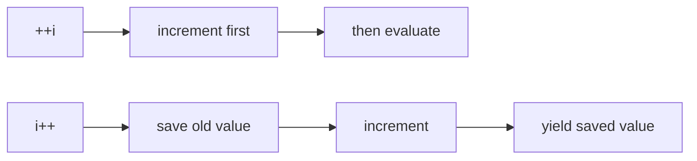

The two forms compile to different bytecode when the result is used in an expression — but identical bytecode when the result is discarded:

```java
i++;        // statement, result discarded
++i;        // statement, result discarded
            // both compile to a single iinc instruction (see below)
```

The **`iinc`** opcode is a special favourite. For a local-int slot, it does increment **in place** without touching the operand stack — 3 bytes total (`iinc <slot> <const>`), and the JIT typically maps it to a single CPU `INC` or `ADD reg, 1` instruction.

```
iinc <slot>, <const_8bit_signed>      // wide form: iinc + iinc has a wide opcode for >127
```

There is no `iinc`-style opcode for fields or array elements — those require explicit load-modify-store on the operand stack, which means *more bytes of bytecode* and (more importantly) **non-atomicity under threads** (see Common Mistakes).

## Relational Operators

`<`, `<=`, `>`, `>=` work on any numeric type (after binary promotion) and yield `boolean`:

```java
int a = 3, b = 5;
boolean less = a < b;        // true
boolean ge   = a >= 3;       // true (also: short-circuits short)
```

For floats and doubles, the IEEE 754 NaN rule kicks in: any relational comparison involving NaN is **false**.

`instanceof` is a relational operator with reference operands — `obj instanceof MyClass` is `true` iff `obj` is non-null and its runtime class is `MyClass` or a subtype. We touch it briefly here; full coverage is L1/C01 (OOP and patterns).

```java
Object o = "hello";
if (o instanceof String s) {            // Java 16+ pattern matching: binds s
    System.out.println(s.length());     // 5
}
```

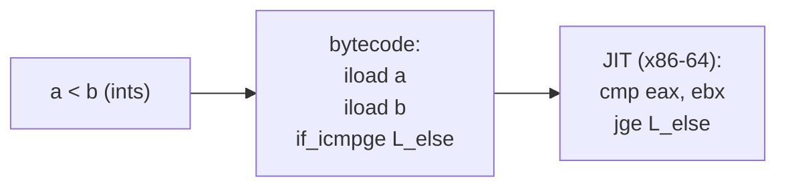

For non-int comparisons, the bytecode flow is two-step — first compute a 3-valued comparison (`lcmp`, `fcmpl`, `fcmpg`, `dcmpl`, `dcmpg`), then branch on the resulting int. The `…l`/`…g` variants control how NaN is handled (push -1 vs +1) — `javac` picks the right variant so that all NaN comparisons remain false at the language level.

## Equality (`==`, `!=`) — Primitive vs Reference

For **primitives**, `==` compares **bit patterns** (after binary numeric promotion):

```java
int a = 1, b = 1;
System.out.println(a == b);   // true

double x = 0.1 + 0.2;
System.out.println(x == 0.3); // false (rounding error from T02)
```

For **references**, `==` compares the **pointer values** — *not* the objects' contents. Two references are `==` iff they refer to the same heap object.

```java
String s = new String("hello");
String t = new String("hello");
System.out.println(s == t);          // false (two heap objects)
System.out.println(s.equals(t));     // true  (same characters)

String a = "hello";
String b = "hello";
System.out.println(a == b);          // true  (both interned, same object — from T03)
```

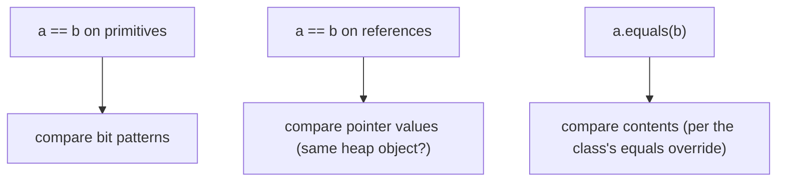

The bytecode for `==` on int is `if_icmpeq`; on a reference, `if_acmpeq`; on a long, `lcmp` + `ifeq`; on float/double, the `cmpl`/`cmpg` + `ifeq` pattern.

> [!WARNING]
> **`==` on wrapper objects.** `Integer a = 1000; Integer b = 1000; a == b` is `false` (different `Integer` objects). But `Integer a = 100; Integer b = 100; a == b` is `true` because `Integer` caches boxed values in `-128…127`. **Always use `.equals()` for wrappers.** Full coverage in `T17`.

## Logical Operators (Short-Circuit `&&` / `||`)

`&&`, `||`, `!` operate on `boolean` operands and yield `boolean`. They are **short-circuit**: the right operand of `&&` is only evaluated if the left is `true`; the right of `||` only if the left is `false`. `!` is unary not.

```java
String s = null;
if (s != null && s.length() > 0) {     // safe — s.length() never called if s is null
    System.out.println("non-empty");
}
```

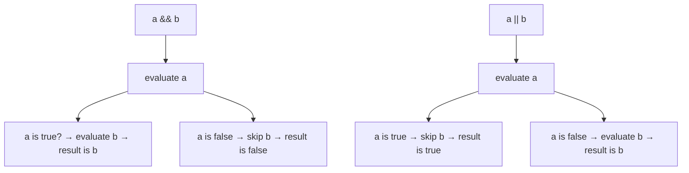

The bytecode for `a && b` is **branch-based** (no dedicated `iand_short` opcode):

```
iload a
ifeq  L_false          ;; if a == 0 (false), jump to short-circuit result
iload b
ifeq  L_false
iconst_1               ;; result = true
goto  L_end
L_false:
iconst_0               ;; result = false
L_end:
```

That is, `&&`/`||` *compile* to control-flow jumps, not to an arithmetic operation. This is why they can short-circuit at all — the CPU never even fetches `b`'s value if it isn't needed.

Java *also* has bitwise `&`/`|`/`^` that work on `boolean` operands (no short-circuit). They evaluate both sides and then `&`/`|`/`^` the booleans. Useful when both sides have side effects you actually want.

```java
boolean ok = checkA() & checkB();   // both run; result = checkA() AND checkB()
boolean ok2 = checkA() && checkB(); // checkB() only runs if checkA() returned true
```

## Bitwise Operators (`&`, `|`, `^`, `~`) — Gate-Level View

When applied to integer types (with binary numeric promotion), `&` / `|` / `^` work **bit by bit** — each output bit is the corresponding gate's output applied to the matching pair of input bits. `~` flips every bit. These are the **same logic gates** from `L0/C01/T01`:

```
        bit_a   bit_b   a&b    a|b    a^b
        ──────────────────────────────────
          0       0       0      0      0
          0       1       0      1      1
          1       0       0      1      1
          1       1       1      1      0          ~a = NOT a, bit-by-bit
```

The CPU implements `&` / `|` / `^` as a **32-wide parallel array** of gates — 32 AND-gates, fed by both 32-bit input registers, producing a 32-bit output in a single cycle (recall `L0/C01/T02`'s bit-math section).

```
        4-bit example (a = 0110, b = 1010):

            bit 3   bit 2   bit 1   bit 0
        a =   0       1       1       0
        b =   1       0       1       0
              │       │       │       │
              ▼       ▼       ▼       ▼
        ─── 32 (or 8/16/64) parallel AND/OR/XOR gates ───
              │       │       │       │
              ▼       ▼       ▼       ▼
   a & b =    0       0       1       0     (0010 = 2)
   a | b =    1       1       1       0     (1110 = 14)
   a ^ b =    1       1       0       0     (1100 = 12)
```

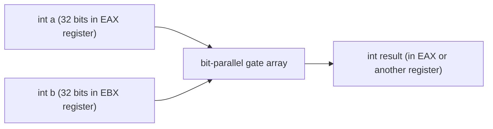

Classic idioms (deeper coverage in `T02` of L0/C01):

| Idiom               | Meaning                                                              |
|---------------------|----------------------------------------------------------------------|
| `x & 1`             | low bit (parity / odd-even)                                          |
| `x & 0xFF`          | low byte (unsigned interpretation of a byte)                         |
| `x | (1 << n)`      | set bit `n`                                                          |
| `x & ~(1 << n)`     | clear bit `n`                                                        |
| `x ^ (1 << n)`      | toggle bit `n`                                                       |
| `(x >> n) & 1`      | read bit `n`                                                         |
| `flags & PERM_READ` | test a permission bit in a bitmap                                    |
| `~0`                | all-ones bitmask (`-1` as int — every bit set)                       |

The bytecode opcodes: `iand`/`ior`/`ixor` for int, `land`/`lor`/`lxor` for long. There is no `not` opcode — `~x` is compiled as `x ^ -1` (XOR with all-ones, which flips every bit).

## Shift Operators (`<<`, `>>`, `>>>`) — Barrel Shifter View

Shifts move bits left or right by a given count. Three flavours:

| Op    | Direction | Fill from           | Use                                                      |
|-------|-----------|---------------------|----------------------------------------------------------|
| `<<`  | left      | zeros               | multiply by 2^n; pack fields into an int                 |
| `>>`  | right     | sign bit (arithmetic) | divide signed by 2^n (round toward -∞ for negative!)   |
| `>>>` | right     | zeros (logical)     | treat as unsigned: divide unsigned by 2^n                |

```
   int x = 0b 1100_0011_0000_0000_0000_0000_0000_0101    (a negative number)

   x << 2:  shift left 2, zero-fill right
            0000_1100_0000_0000_0000_0000_0000_0001_01    ← bits shift left; low bits = 0

   x >> 2:  shift right 2, sign-extend left (top bit was 1, so 1s come in)
            1111_1100_0000_1100_0000_0000_0000_0000_0000_01

   x >>> 2: shift right 2, zero-fill left (regardless of sign)
            0011_0000_1100_0000_0000_0000_0000_0000_0000_01
```

The CPU implements shifts as a **barrel shifter** — a network of 2-input multiplexers that can shift by 0, 1, 2, 4, 8, 16 places in a single cycle (5 stages for a 32-bit shifter). The full shift count is decomposed into a sum of these power-of-2 stages.

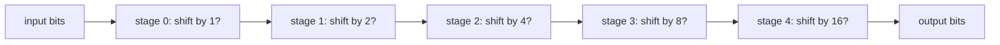

> [!WARNING]
> **The shift count is masked.** For `int`, only the low **5 bits** of the right-hand operand are used (JLS §15.19) — so `1 << 32` is `1 << 0` = `1`, not zero. For `long`, the low **6 bits** are used. This is *also* what the hardware shifter does, by the way (it has only 5 control bits).
> ```java
> System.out.println(1 << 32);    // 1   (count masked to 0)
> System.out.println(1 << 33);    // 2   (count masked to 1)
> System.out.println(1L << 64);   // 1L  (count masked to 0)
> ```

Bytecode: `ishl`/`ishr`/`iushr` for int, `lshl`/`lshr`/`lushr` for long.

## Assignment and Compound Assignment

The simple assignment `=` writes a value into a variable (slot or field or element). Java's compound assignments combine an operation with the store:

| Form     | Equivalent to                            |
|----------|------------------------------------------|
| `a = b`  | store `b` into `a`                       |
| `a += b` | `a = (T)((a) + (b))` — *with implicit narrowing cast to `T = typeof(a)`* |
| `a -= b` | similar — implicit cast back to `a`'s type |
| `a *= b`, `a /= b`, `a %= b`, `a &= b`, `a |= b`, `a ^= b`, `a <<= b`, `a >>= b`, `a >>>= b` | same shape |

The crucial part — embedded in JLS §15.26.2 — is the **implicit narrowing cast**. This is what lets compound assignment work on `byte`/`short`/`char` where the plain form fails:

```java
byte b = 100;
// b = b + 1;      // ERROR: b + 1 is int; cannot narrow without cast
b = (byte)(b + 1); // OK
b += 1;            // OK — compound assignment includes the (byte) cast

short s = 10_000;
s *= 3;            // OK — s = (short)(s * 3); silently narrows; might overflow
                   // ((30_000 fits in short; 50_000 would wrap to negative))
```

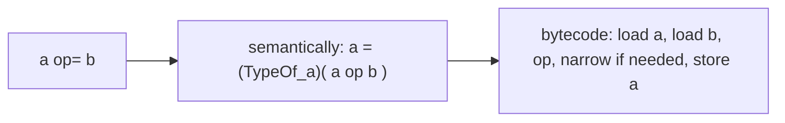

**Bytecode-level** the difference between `i = i + 1`, `i += 1`, and `i++` (when `i` is a local int) is essentially zero — all three boil down to either:

```
iload i; iconst_1; iadd; istore i       // for x = x + 1 form, 4 ops + 4 stack slots used
```

or, if `javac` recognises the pattern:

```
iinc i, 1                                // 1 op, no operand-stack usage at all
```

The `iinc` form is emitted whenever the right-hand side is a constant in `-128..127` and the left side is a local int slot. Otherwise the load-op-store form is used.

> [!WARNING]
> **Compound assignment to a field or array element is not atomic.** `count += 1` where `count` is a field compiles to `getfield; iconst_1; iadd; putfield` — a *read-modify-write* sequence. Two threads doing this concurrently can lose updates. The fix is `synchronized`, `AtomicInteger.incrementAndGet()`, or a `LongAdder` (covered in `L3/C01`).

## String Concatenation with `+`

When either operand of `+` is a `String`, the operator becomes **string concatenation**: convert the non-String operand to a String (via `String.valueOf` for primitives or `.toString()` for references), then produce a new String containing the joined characters.

```java
String name = "kgk";
int age = 30;
String msg = "Hello, " + name + "! You are " + age + ".";  // "Hello, kgk! You are 30."
```

Under the hood, modern Java (9+) compiles concatenation to a single `invokedynamic` call into `java.lang.invoke.StringConcatFactory`, which builds a tailored concatenation lambda at runtime. Older bytecode used a manual chain of `StringBuilder.append()` calls. For our purposes the takeaway is just: **`+` on Strings is heavily optimised**; you don't need to switch to `StringBuilder` for one-line concatenations. But:

> [!WARNING]
> **In a loop, `s = s + x` is O(n²).** Each iteration allocates a new String and copies the old contents. For >100 iterations, use `StringBuilder` (`T07`). The JIT may sometimes optimise simple cases, but don't rely on it.

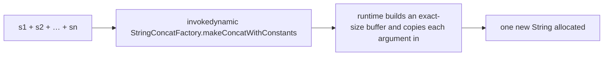

Beware of the order: `"a" + 1 + 2` is `"a12"` (left-to-right; first `+` produces String, then concatenation continues). `1 + 2 + "a"` is `"3a"` (first `+` is integer addition; then concatenation).

## The Conditional Operator `?:`

The only **ternary** operator in Java: `cond ? a : b` evaluates `cond` (a `boolean`), then evaluates *only one of* `a` or `b`, and yields that value.

```java
int   max  = (a > b) ? a : b;
String tag = isAdmin ? "admin" : "user";
```

The result type is the **common type** of the two branches (with the same numeric-promotion rules as binary operators, and a more complex set of reference type rules). The unevaluated branch is *not* evaluated — like `&&`/`||`, this is lazy.

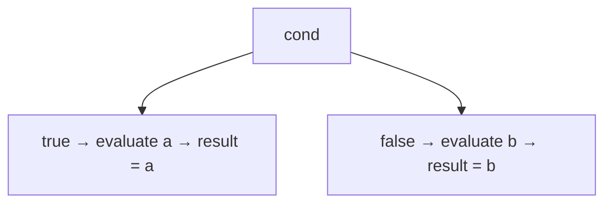

Bytecode: `cond` evaluated, then a conditional branch jumps to the chosen arm; both arms push their value onto the operand stack at the same depth, and execution continues with the chosen value on top.

> [!TIP]
> Nest sparingly: `a ? b : c ? d : e` is right-associative — it parses as `a ? b : (c ? d : e)` — and reads fine for one level. More than that, use `if`/`else`.

## `instanceof` (Brief)

`obj instanceof Type` returns `true` iff `obj` is non-null and its runtime class is `Type` or a subtype. Bytecode opcode is `instanceof` (push 1 or 0).

Since Java 16, **pattern matching** lets you bind the narrowed reference in the same expression:

```java
if (o instanceof String s) {           // s is in scope inside the if-true branch
    System.out.println(s.length());
}
```

Full coverage of `instanceof`, casting, and pattern-matching with sealed types: `L1/C01`.

## Under the Hood — The Bytecode Operator Family

Pulling together every operator's bytecode, sorted by category. (Add the `i`/`l`/`f`/`d` prefix per type — `iadd` for int+, `ladd` for long+, etc.):

| Category          | int       | long       | float      | double     | Notes                                          |
|-------------------|-----------|------------|------------|------------|-----------------------------------------------|
| add               | `iadd`    | `ladd`     | `fadd`     | `dadd`     |                                               |
| sub               | `isub`    | `lsub`     | `fsub`     | `dsub`     |                                               |
| mul               | `imul`    | `lmul`     | `fmul`     | `dmul`     |                                               |
| div               | `idiv`    | `ldiv`     | `fdiv`     | `ddiv`     | int/long: throws on ÷0; float/double: ±Inf/NaN |
| rem               | `irem`    | `lrem`     | `frem`     | `drem`     |                                               |
| neg               | `ineg`    | `lneg`     | `fneg`     | `dneg`     | unary minus                                   |
| shl               | `ishl`    | `lshl`     | —          | —          | shift count masked to 5 (int) or 6 (long) bits|
| shr (arith)       | `ishr`    | `lshr`     | —          | —          |                                               |
| ushr (logical)    | `iushr`   | `lushr`    | —          | —          |                                               |
| and               | `iand`    | `land`     | —          | —          |                                               |
| or                | `ior`     | `lor`      | —          | —          |                                               |
| xor               | `ixor`    | `lxor`     | —          | —          |                                               |
| cmp 3-way         | —         | `lcmp`     | `fcmpl`/`fcmpg` | `dcmpl`/`dcmpg` | used before branch ops for non-int   |
| if==              | `if_icmpeq` | (via lcmp+ifeq) | (via cmp+ifeq) | (via cmp+ifeq) | int has direct ops; others need cmp+branch |
| if!=              | `if_icmpne` | …      | …          | …          |                                               |
| if<               | `if_icmplt` | …      | …          | …          |                                               |
| ref ==            | —         | —          | —          | —          | `if_acmpeq` (compares refs)                   |
| iinc              | `iinc`    | —          | —          | —          | local-int += small constant                   |
| ternary, &&, ||   | (control flow)| …    | …          | …          | compiled as branches                          |
| string concat     | `invokedynamic` (Java 9+) | — | — | —      | `makeConcatWithConstants`                     |
| array load        | `iaload` (etc per type) | … | …      | …          | `aaload` for reference                        |
| array store       | `iastore` (etc) | …    | …          | …          |                                               |

Notice the symmetry: every operator that *modifies* a value has a type-tagged opcode (`iadd`, `ladd`, …). The JVM has no polymorphic "add anything" instruction — types are erased to the operand-stack discipline (max stack, slot widths).

## Under the Hood — Operand Stack Mechanics for Expressions

A nested expression like `a + b * c - d` walks the operand stack like a postfix calculator. Each intermediate value is **born** when an instruction pushes it and **dies** when the next consuming op pops it.

```java
int result = a + b * c - d;
```

Bytecode (assume all are local ints at slots 1..4):

```
iload_1          ; stack: [a]
iload_2          ; stack: [a, b]
iload_3          ; stack: [a, b, c]
imul             ; stack: [a, b*c]       ← b and c consumed, product pushed
iadd             ; stack: [a + b*c]
iload 4          ; stack: [a + b*c, d]
isub             ; stack: [a + b*c - d]
istore 5         ; stack: []              ← stored to local; nothing left
```

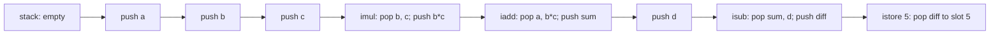

The **maximum stack depth** for this method (3 in this case — `[a, b, c]` at the peak) is recorded in the method's `Code` attribute as `max_stack`. The verifier checks at class-load time that the bytecode never exceeds it; the JVM uses it to size the operand stack region of the frame at method entry.

For a 64-bit JVM physical view, each operand-stack slot is **8 bytes** (just like the local-variable array slots — see `T02`'s "Inside a JVM Stack Frame"). So a `max_stack = 3` method dedicates 24 bytes of its frame to the operand stack region.

**Compound assignment to a field** — more complex stack work:

```java
this.count += 1;
```

```
aload_0              ; push 'this' reference
dup                  ; push another copy of 'this' (so we have a ref left after getfield)
getfield Foo.count : I
iconst_1
iadd
putfield Foo.count : I
```

Here the stack grows to **2 deep** (this, this, value) during the read, gets consumed back as the field write completes. The JIT often collapses the whole sequence to a single `mov` instruction in native code, after object-layout resolution.

## Under the Hood — JIT to Native ALU

Once the JIT picks up a hot method, the operand stack mostly **disappears** — intermediate values live in CPU registers, and the compiler emits direct ALU operations. Let's see `int compute(int a, int b, int c, int d) { return a + b * c - d; }` on each architecture:

```asm
; x86-64 (System V ABI: int args in EDI, ESI, EDX, ECX)
compute:
    imul    esi, edx          ; ESI = b * c
    lea     eax, [rdi + rsi]  ; EAX = a + (b*c)   (LEA does a "free" add)
    sub     eax, ecx          ; EAX = (a + b*c) - d
    ret                       ; return EAX
```

```asm
; ARM64 (AAPCS: args in W0, W1, W2, W3)
compute:
    mul     w0, w1, w2        ; W0 = b * c
    add     w0, w0, w0        ; W0 = (b*c) + a   (using temporary — JIT picks register layout)
    sub     w0, w0, w3        ; W0 = result - d
    ret                       ; return W0
```

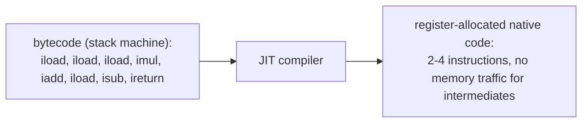

**ALU flags.** Both x86 and ARM ALUs set **condition-code flags** as a side effect of every arithmetic instruction:

- x86: `ZF` (zero), `SF` (sign), `CF` (carry), `OF` (overflow), `PF`, `AF` — checked by `JE`/`JL`/`JG`/`JNZ` branch instructions.
- ARM64: `N` (negative), `Z` (zero), `C` (carry), `V` (overflow) — checked by `B.EQ`/`B.LT`/`B.GT`/`CSEL` etc.

This is why `a > b` compiles to a `cmp` (subtract, don't store result — *just set flags*) followed by a conditional branch: the comparison **is** a subtraction whose flags are inspected.

**Division is expensive.** `IDIV` on x86-64 is variable-latency 20–80+ cycles (depending on operand magnitudes); ARM64's `SDIV` is similar. Addition is 1 cycle. Multiplication is 3–5. This asymmetry is why **strength reduction** is one of the JIT's favourite tricks:

```java
x * 2   →   x << 1
x * 4   →   x << 2
x / 8   for unsigned-ish → x >>> 3
x / 8   for signed → trickier (need to handle rounding) but still avoids IDIV
x % 16  for non-negative → x & 0xF
```

These transformations happen automatically — you don't need to write them — but they explain why **the JIT can be faster than naive C**: it sees more about your *types* and *control flow* than a one-shot compiler does.

## JIT Optimisations You'll See

A non-exhaustive tour of what the JIT does to your operator expressions:

- **Constant folding.** `2 + 3 + x` becomes `5 + x` at compile time.
- **Strength reduction.** `x * 2` → `x << 1`; `x * 7` → `(x << 3) - x`; division by constants replaced with multiply-by-magic-number sequences.
- **Common subexpression elimination.** `a*b + a*b` → `tmp = a*b; tmp + tmp`.
- **Loop-invariant code motion.** Computations that don't depend on the loop variable are hoisted out (preview — `L3/C02` JVM internals).
- **Dead-code elimination.** Computing a value and never using it: deleted.
- **Branch prediction & lay-out.** The JIT *re-orders* the basic blocks so the predicted-taken branch is the fall-through path (CPU pipeline win).
- **Range-check elimination.** `arr[i]` inside `for (int i=0; i<arr.length; i++)` proves `i` is in bounds → bounds-check skipped.

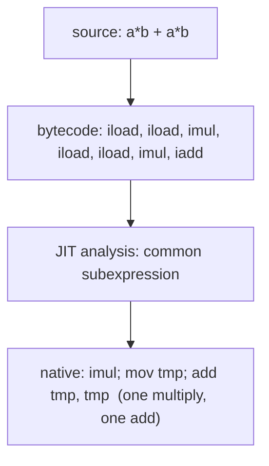

> [!INTERVIEW]
> **"Why might a naive Java loop sometimes beat C?"** Because the JIT specialises code for the *actually observed* types and control-flow at runtime — including aggressive inlining across many methods. A C compiler runs once at build time, with less profile information. The flip side: JIT compilation has warm-up cost, so very short-running programs may show C faster.

## Common Mistakes

- **Integer division surprise.** `int a = 1, b = 2; double d = a / b;` is `0.0`, not `0.5`. Cast one operand: `(double)a / b`.
- **`Integer.MIN_VALUE / -1` overflows** without exception, returns `Integer.MIN_VALUE`. Use `Math.divideExact` if you care.
- **Sub-int arithmetic widens to int.** Two `byte`s added is an `int`. Use `(byte)` cast or compound assignment to narrow back.
- **`==` on reference types compares pointers.** Use `.equals()` for content equality — *especially* on Strings, BigInteger, Integer.
- **NaN comparisons.** Every `<`/`<=`/`>`/`>=`/`==` against NaN is `false`. Use `Double.isNaN(x)`.
- **`x == y` for floats is fragile.** Compare with a tolerance: `Math.abs(x - y) < 1e-9`.
- **Shift count masking.** `1 << 32 == 1`, not zero. The shift count is masked to 5 bits (int) / 6 bits (long).
- **`>>` vs `>>>` for negative numbers.** `>>` extends the sign (so `-1 >> 1 == -1`); `>>>` zero-fills (so `-1 >>> 1 == Integer.MAX_VALUE`).
- **Operator precedence with bitwise vs equality.** `if (flags & FLAG == 0)` parses as `if (flags & (FLAG == 0))` — usually not what you want. Write `if ((flags & FLAG) == 0)`.
- **Concat-in-loop is O(n²).** Use `StringBuilder` in tight loops.
- **Compound assignment is read-modify-write.** Not atomic across threads — `counter++` on a shared field loses updates.
- **`x = x++` is a no-op.** Postfix increment reads `x`, increments, then assigns the *old* value back to `x`. The increment is effectively discarded.

> [!INTERVIEW]
> Reliable operator questions:
> - **"What does `a += b` actually compile to for `byte a, int b`?"** `a = (byte)(a + b)` — the compound form includes an implicit narrowing cast. `a = a + b` would not compile.
> - **"What does `1 << 32` evaluate to in Java?"** `1` — the shift count is masked to 5 bits, so it becomes `1 << 0`.
> - **"Difference between `&` and `&&`?"** `&` is bitwise (for integers) or non-short-circuit logical (for booleans, evaluates both sides). `&&` is short-circuit logical (only evaluates right if left is true).
> - **"Why is `0.1 + 0.2 == 0.3` false?"** IEEE 754 can't represent 0.1 or 0.2 exactly; the rounding error survives the addition.
> - **"What's `Integer.MIN_VALUE / -1`?"** `Integer.MIN_VALUE` — silent overflow, since `+2^31` doesn't fit in int.
> - **"What bytecode does `i++` for a local int emit?"** `iinc <slot>, 1` — a single 3-byte instruction that doesn't touch the operand stack.
> - **"Why is `arr[i]++` thread-unsafe?"** It compiles to load–increment–store; another thread can mutate `arr[i]` between the load and the store. Use `AtomicIntegerArray` or `synchronized`.
> - **"Difference between `>>` and `>>>`?"** Both shift right; `>>` is arithmetic (sign-extends), `>>>` is logical (zero-fills). Matters only for negative numbers.

## Practice

1. **Promotion sanity.** Predict the value and type of each: `'A' + 1`, `(byte)100 + (byte)100`, `1 / 2`, `1.0 / 2`, `1 / 2.0`, `1L * Integer.MAX_VALUE`. Compile and verify with `var` (Java 10+) or by printing `.getClass()` on a boxed version.
2. **Integer overflow check.** Print `Integer.MAX_VALUE + 1`, `Integer.MIN_VALUE * -1`, `Integer.MIN_VALUE / -1`. Explain each using the two's-complement wheel from `L0/C01/T02`.
3. **Float quirks.** Print `Double.NaN == Double.NaN`, `Double.NaN != Double.NaN`, `0.0 == -0.0`, `1.0 / 0.0`, `-1.0 / 0.0`, `0.0 / 0.0`. Explain each by IEEE 754.
4. **Compound-assignment cast.** Try writing `byte b = 1; b = b + 1;`. Note the exact error. Now `b += 1;`. Why does the second form compile?
5. **`iinc` in action.** Compile a class with `void inc(int x) { x++; }`. Disassemble with `javap -c`. Confirm a single `iinc` opcode. Now change `x` to a field — what bytecode appears?
6. **Short-circuit.** Write a method whose body is `if (a != 0 && 10 / a > 5)`. Test with `a = 0`. Does it throw? Now replace `&&` with `&` (non-short-circuit). Does it throw now? Explain.
7. **Bitwise idioms.** Write methods `setBit(int x, int n)`, `clearBit(int x, int n)`, `toggleBit(int x, int n)`, `readBit(int x, int n)` using `|`, `&`, `^`, `>>`. Verify with `Integer.toBinaryString`.
8. **Shift mask.** Print `1 << 31`, `1 << 32`, `1 << 33`, `1 << -1`. Explain each result.
9. **`>>` vs `>>>`.** Print `-1 >> 1`, `-1 >>> 1`. Explain why one is `-1` and the other is `Integer.MAX_VALUE`.
10. **Precedence trap.** Predict `flags & 0x01 == 0`. Then write `(flags & 0x01) == 0`. Are they the same? Why?
11. **Concat order.** Predict the output of `System.out.println(1 + 2 + "a" + 1 + 2)`. Why is it `"3a12"` and not `"1212a"`?
12. **Ternary type.** What is the inferred type of `condition ? 1 : 1.0`? What about `condition ? (byte)1 : (short)2`?
13. **Atomicity bug.** Write a `Counter` class with `int count` and `void incr() { count++; }`. Launch 1000 threads each incrementing it 1000 times. Print the final value. Why isn't it 1,000,000? Replace `count` with `AtomicInteger`. Now what?
14. **JIT inspection (advanced).** Compile a method `int sum(int n) { int s = 0; for (int i = 0; i < n; i++) s += i; return s; }`. Run with `-XX:+UnlockDiagnosticVMOptions -XX:+PrintAssembly`. Find the loop body in the JIT output. Look for: was the loop unrolled? Was `s += i` reduced to fewer operations? Is `i++` an `inc`/`add`?
15. **Strength reduction.** Predict whether `javac` or the JIT does the conversion: write `int x = a * 2;`, compile, and `javap -c`. Is there a `shl`? Now run with `PrintAssembly`. What does the JIT do?
16. **Pattern matching `instanceof`.** Use `Object[] mixed = {1, "hello", 3.14, true};` and write a for-each loop that, for each element, prints its description using `instanceof Type s` pattern bindings.
17. **Explain it back.** In your own words, walk through the line `arr[i] += 5;` from source through bytecode through native code, naming every opcode emitted and the operand stack contents at each step. Use the terms *aaload*, *iaload*, *operand stack*, *putfield*/`iastore`, and *atomicity*.

## Recap

You should now be able to:

- List Java's operator categories — arithmetic, increment/decrement, relational, equality, logical (short-circuit), bitwise/logical, shift, assignment/compound, conditional, string concatenation, `instanceof` — and recall the precedence table well enough to know when to add parentheses.
- Apply the **binary numeric promotion** rules in order (double → float → long → int) and the **unary** rule (byte/short/char → int), and predict the type of any arithmetic expression.
- Explain **integer division and remainder** semantics (truncate toward 0; sign of `%` follows the dividend; `÷0` throws for integer, yields ±Inf/NaN for float).
- Explain IEEE 754 **NaN propagation**, signed zero, and why every comparison against NaN is false (except `!=`).
- Distinguish prefix from postfix `++`/`--`, and explain that for a local int both compile to `iinc` when the result is discarded.
- Use `==` correctly: bit-equality for primitives, **pointer-equality** for references — and know when to use `.equals()`.
- Explain **short-circuit `&&`/`||`** as branch-based bytecode and contrast with non-short-circuit `&`/`|` on booleans.
- Apply **bitwise operators** `& | ^ ~` and explain their gate-level implementation as 32-wide parallel arrays of logic gates from `L0/C01/T01`/`T02`.
- Apply **shifts** `<<`, `>>`, `>>>` with the right fill behaviour, recognise the count is masked to 5/6 bits, and explain the barrel-shifter mechanism.
- Use **compound assignment** correctly, including the implicit narrowing cast in `byte`/`short`/`char` (JLS §15.26.2) and the fact that compound assignment to a field is *not atomic*.
- Predict the behaviour of `+` on Strings (left-to-right; any operand becomes a String) and know that Java 9+ compiles concatenation via `invokedynamic` to `StringConcatFactory`.
- Use the conditional operator `?:` and predict its result type by the numeric/reference promotion rules.
- Use `instanceof` (with Java 16+ pattern binding) for runtime type checks (full coverage in L1).
- Recite the **bytecode operator family** by category and type prefix (`iadd`/`ladd`/`fadd`/`dadd`, `ishl`/`lshl`, `if_icmplt`/`lcmp`+`iflt`, `iinc`).
- Trace an expression through the **operand stack** with byte-level depth tracking, and connect `max_stack` to a method's `Code` attribute and the JVM stack frame from `T02`.
- Describe what the **JIT** does to operator expressions on x86-64 / ARM64 — registers replace the operand stack, **ALU flags** drive comparisons, and optimisations include **constant folding**, **strength reduction** (`x * 2` → `x << 1`), **common subexpression elimination**, and **range-check elimination**.
- Justify *why* multiplication is fast but division is slow at the hardware level, and explain when the JIT replaces `÷` with multiply-by-magic-number sequences.

## Next

Continue to [Type Conversion & Casting](./T05-type-conversion-and-casting.md).
