# Type Conversion & Casting

In `T02` we said Java is *statically and strongly typed*: every variable's type is fixed at compile time and you can't store a String in an `int` slot. But programs constantly *cross* type boundaries — an `int` participates in a `double` expression, a `byte` is read from a network buffer and pushed into an `int` counter, a `String` is fetched from a `List<Object>` and used as a `String`. Each crossing is a **type conversion**: the language has to translate the bit pattern (and sometimes allocate a new object) so the destination type makes sense.

This topic catalogs **every conversion Java performs**, classified as the JLS §5 does it: **widening primitive**, **narrowing primitive**, **widening reference**, **narrowing reference**, **boxing**, **unboxing**, **String** (via `+`), and **identity**. For each we go to the bytecode (`i2l`, `i2f`, `f2i`, `l2i`, `i2b`, `i2c`, `checkcast`, `Integer.valueOf`, …) and to the native instruction the JIT emits on x86-64 and ARM64 (`movsxd`, `sxtw`, `cvttsd2si`, `fcvtzs`, …) — and along the way we'll see why **long → float** loses precision, why the `i2c` and `i2s` opcodes differ in one critical bit, what makes float-to-int **saturate** to MIN/MAX in Java (and why the JIT has to emit a fixup), and the exact memory cost of `Integer.valueOf(100)` vs `Integer.valueOf(200)`.

> [!NOTE]
> Prerequisites: [Variables & Primitive Types](./T02-variables-and-primitive-types.md) (`L0/C02/T02`) — primitive widths, IEEE 754, JVM slots; [Literals & Constants](./T03-literals-and-constants-final.md) (`L0/C02/T03`) — constant pool, `ldc`; [Operators](./T04-operators-arithmetic-relational-logical-bitwise-assignment.md) (`L0/C02/T04`) — numeric promotion, the operand stack discipline, ALU ops; [Number Systems & Basic Bit Math](../C01-cs-foundations/T02-number-systems-binary-hex-and-basic-bit-math.md) (`L0/C01/T02`) — two's complement, sign extension; [Source to Bytecode to JVM to Machine Code](../C01-cs-foundations/T04-source-to-bytecode-to-jvm-to-machine-code.md) (`L0/C01/T04`) — `.class` constant pool, the operand stack, JIT.

## What Is a Type Conversion?

A **type conversion** changes the *type* of a value — and usually its bit pattern — without (in general) changing the conceptual value. Three kinds of action are possible:

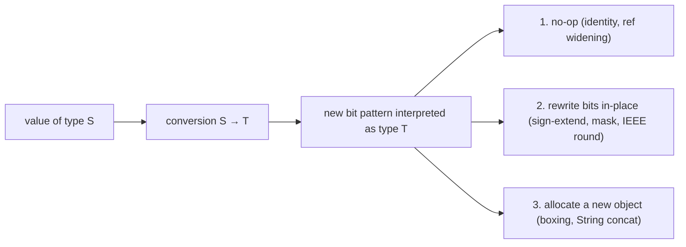

Java distinguishes **implicit** conversions (the compiler inserts them automatically) from **explicit** ones (you must write a cast, `(T) expr`, or otherwise *opt in*). The general rule is: **safe** conversions are implicit; **lossy** ones require a cast that says "I accept the loss."

| Where conversions happen | Conversion kind allowed                                                       |
|--------------------------|-------------------------------------------------------------------------------|
| **Assignment** (`T x = expr;`)                | identity, widening primitive, widening reference, boxing, unboxing — plus a special "narrowing to byte/short/char if the source is a CT-constant that fits" |
| **Method invocation** (parameter binding)       | same as assignment, *no* narrowing primitive conversion                       |
| **Cast expression** (`(T) expr`)              | identity, widening + narrowing primitive, widening + narrowing reference, boxing + unboxing — almost everything |
| **String concatenation context** (`"" + expr`) | string conversion (any operand → String)                                      |
| **Numeric promotion in expressions**           | unary/binary numeric promotion (covered in `T04`)                             |

The same cast `(int) x` can be doing wildly different machine work depending on what `x` is — flipping a few bits, calling a native FPU instruction, or even (for an `(Integer)` cast on an `Object`) doing a `checkcast` runtime check. Let's go category by category.

## The Eight Categories of Conversion (JLS §5)

The JLS recognises eight conversion categories. We cover the seven that show up in everyday code; *capture conversion* belongs to generics (`L2/C01`).

| #  | Category                | Direction                                  | Implicit? | Allocates? | Bytecode example                                  |
|----|-------------------------|--------------------------------------------|:---------:|:----------:|---------------------------------------------------|
| 1  | Identity                | `T → T`                                    | yes       | no         | (none)                                            |
| 2  | Widening primitive      | `byte → int`, `int → long`, …               | yes       | no         | `i2l`, `i2f`, `i2d`, `l2f`, `l2d`, `f2d`          |
| 3  | Narrowing primitive     | `int → byte`, `double → int`, …            | **no — needs cast** | no | `i2b`, `i2c`, `i2s`, `l2i`, `f2i`, `f2l`, `d2i`, `d2l`, `d2f` |
| 4  | Widening reference      | `String → Object`                          | yes       | no         | (none — pointer unchanged)                        |
| 5  | Narrowing reference     | `Object → String`                          | **no — needs cast** | no | `checkcast`                                       |
| 6  | Boxing                  | `int → Integer`, `boolean → Boolean`, …    | yes       | **yes** (sometimes; cache) | `invokestatic Integer.valueOf:(I)Ljava/lang/Integer;` |
| 7  | Unboxing                | `Integer → int`, …                         | yes       | no         | `invokevirtual Integer.intValue:()I`              |
| 8  | String                  | any → `String` (only inside `+` context)    | yes       | yes        | `invokedynamic StringConcatFactory…`              |

The rest of the topic walks each one, explains the **mechanism**, and traces the **bytecode** and **native code**.

## Widening Primitive Conversions

A **widening primitive** conversion goes "up the ladder" — to a type with more bits (and sometimes a different representation):

```
        byte  ──→  short  ──→  int  ──→  long  ──→  float  ──→  double
                    char  ──→ ─┘
```

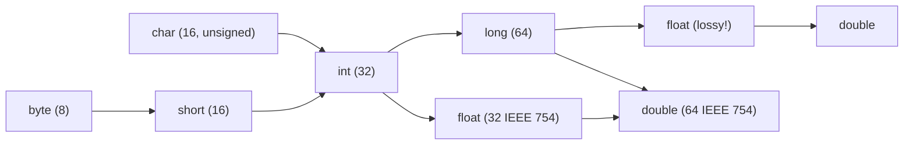

All widenings on this ladder are **implicit** — no cast needed. The conversion's mechanism depends on the destination:

- **To an integer type** (e.g. `byte` → `int`, `int` → `long`): **sign-extend** the source bits to fill the wider type. Bytecode: `i2l` (sign-extend 32 → 64). For `byte`/`short` → `int`, no bytecode is emitted because they already occupy a 32-bit slot on the operand stack — the sign-extension happens implicitly at the `iload` step.
- **To a floating-point type from an integer**: round the integer to the nearest representable float/double. Bytecode: `i2f`, `i2d`, `l2f`, `l2d`.
- **`float` → `double`**: exactly representable; bytecode `f2d` (just widen mantissa/exponent fields).

```
       int → long (i2l), example:  int x = -3 (0xFFFFFFFD)

       before:    0xFFFFFFFD    (32 bits)
       i2l:       sign-extend → repeat the top bit 32 times
       after:     0xFFFFFFFF_FFFFFFFD    (64 bits — still -3 as a long)
```

```
       int → double (i2d), example:  int x = 16_777_217 (= 2^24 + 1)

       before:   16_777_217      (exact int)
       i2d:      convert to IEEE 754 double (53-bit mantissa)
       after:    16_777_217.0    (exact — 53 bits is enough for any int)
```

For the integer-to-int widenings (`byte` → `int`, `short` → `int`, `char` → `int`), one subtle point: **`char` is unsigned**, so widening to `int` does **zero-extension**, not sign-extension. The other two sign-extend.

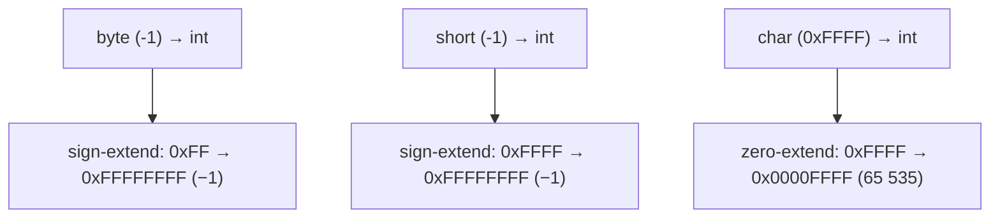

### The One Lossy Widening: `long` → `float` (and `→ double` for big `long`s)

A `long` is 64 bits of integer precision; a `float` has only **24 bits** of mantissa (23 stored + 1 implicit) and a `double` has **53**. So:

- **`long` → `float`** loses precision for any `long` whose magnitude exceeds 2²⁴ ≈ 16.7 million.
- **`long` → `double`** loses precision for any `long` whose magnitude exceeds 2⁵³ ≈ 9 × 10¹⁵.
- **`int` → `float`** loses precision for ints with magnitude > 2²⁴.

```java
long  big = 1_000_000_000_000L;    // 10^12 — easily fits in long
double d  = big;                    // implicit widening — exact (within double's 53-bit mantissa)
float  f  = big;                    // implicit widening — PRECISION LOST (only 24 mantissa bits)
System.out.println((long) f);       // 999999995904  — not 10^12!
```

Java does this widening *implicitly* despite the precision loss — a JLS choice that pre-dates many people's intuition. The compiler does *not* require a cast. The justification: magnitudes are preserved, only the low-order bits are lost — and "magnitude preservation" is closer to mathematical widening than narrowing is.

> [!WARNING]
> **Implicit precision loss.** Be alert when storing big `long`s in `float`. If you actually want a `double` (which preserves precision up to 2⁵³), assign through `double` explicitly. The JLS calls these conversions "may lose precision" — but doesn't reject them.

## Narrowing Primitive Conversions

A **narrowing primitive** conversion goes the other way — to a type with fewer bits, **or** to a type with a different representation that can lose information. Always requires an explicit cast `(T) expr`:

| Source    | Possible narrowings              | Bytecode opcode             |
|-----------|----------------------------------|-----------------------------|
| `int`     | → `byte`, `short`, `char`        | `i2b`, `i2s`, `i2c`         |
| `long`    | → `int`, `byte`, `short`, `char` | `l2i` (+ optional `i2b`/`i2s`/`i2c`) |
| `float`   | → `int`, `long`, `byte`, `short`, `char` | `f2i`, `f2l`         |
| `double`  | → `float`, `int`, `long`, `byte`, `short`, `char` | `d2f`, `d2i`, `d2l` |

```java
int    i = 300;
byte   b = (byte) i;       // takes low 8 bits: 300 = 0x12C → 0x2C = 44
double d = 3.7;
int    j = (int) d;        // truncates toward zero: 3
long   big = 5_000_000_000L;
int    k = (int) big;      // takes low 32 bits: -294_967_296 (wrap)
```

The narrowing rule is mechanical and operator-by-operator:

### `i2b`, `i2s`, `i2c` — Sub-Int Narrowing

These three opcodes all start from a 32-bit `int` on the operand stack. They differ in **how many low bits they keep** and **how they sign-extend back to 32 bits** (so the result still fits a 32-bit slot, since the JVM doesn't have a true sub-int width on the stack).

| Opcode | Keep low …  | Top bit treatment when re-extending to 32 bits | Notes               |
|--------|-------------|------------------------------------------------|---------------------|
| `i2b`  | 8 bits      | **sign-extend** (bit 7 → bits 8..31)           | result is in −128…127 |
| `i2s`  | 16 bits     | **sign-extend** (bit 15 → bits 16..31)         | result is in −32 768…32 767 |
| `i2c`  | 16 bits     | **zero-extend** (bits 16..31 set to 0)         | result is in 0…65 535 — `char` is unsigned! |

```
       int x = 200 (= 0x000000C8); narrow to byte:

       low 8 bits: 0xC8 = 1100_1000
       i2b → sign-extend bit 7 (which is 1) to bits 8..31
       result:  0xFFFFFFC8  = -56 as a signed int
       (or as a byte, the bit pattern 0xC8 represents -56)


       int y = 0xFFFFFF42 (= -190); narrow to short:

       low 16 bits: 0xFF42  (top bit 1 → it's negative)
       i2s → sign-extend → 0xFFFFFF42 (still -190 in 32-bit form)
       value as short: -190 (fits in short's range)


       int z = 0xFFFF00FF; narrow to char:

       low 16 bits: 0x00FF
       i2c → zero-extend → 0x000000FF = 255
       (char is unsigned — bit 15 of the original 16 bits has no special meaning)
```

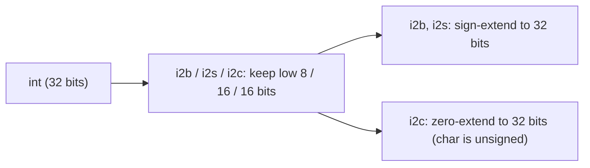

### `l2i` — Long to Int

Simplest narrowing: **discard the high 32 bits**, keep the low 32.

```
       long x = 0xFFFF_FFFF_8000_1234L
       l2i  →  result: 0x80001234  = -2_147_479_500 (signed int)
```

On a 64-bit CPU this is essentially **free** — the JIT just reads the low half of the 64-bit register (`EAX` is already the low 32 bits of `RAX`; `W0` is the low 32 of `X0`).

### `f2i`, `d2i`, `f2l`, `d2l` — Float / Double to Integer (Saturating!)

This is the surprising one. Java's JLS §5.1.3 specifies a **saturating, NaN-zeroing** conversion:

1. If the source is **NaN**, the result is **0**.
2. If the source is **positive infinity** or larger than the destination's max, the result is the destination's **`MAX_VALUE`**.
3. If the source is **negative infinity** or smaller than the destination's min, the result is the destination's **`MIN_VALUE`**.
4. Otherwise, round toward zero (truncate).

```java
System.out.println((int) Double.NaN);                  // 0
System.out.println((int) Double.POSITIVE_INFINITY);    // 2147483647 (Integer.MAX_VALUE)
System.out.println((int) Double.NEGATIVE_INFINITY);    // -2147483648 (Integer.MIN_VALUE)
System.out.println((int) 3.9);                         // 3   (truncate toward 0)
System.out.println((int) -3.9);                        // -3  (truncate toward 0)
System.out.println((int) 1e20);                        // 2147483647 (saturated)
```

This is **not** how x86's or ARM's native float-to-int instructions behave by default — they return `INT_MIN` for any "invalid" input (including positive overflow and NaN). So the JIT must emit a **fixup sequence** to match the JLS semantics; we'll see the code in the JIT section below.

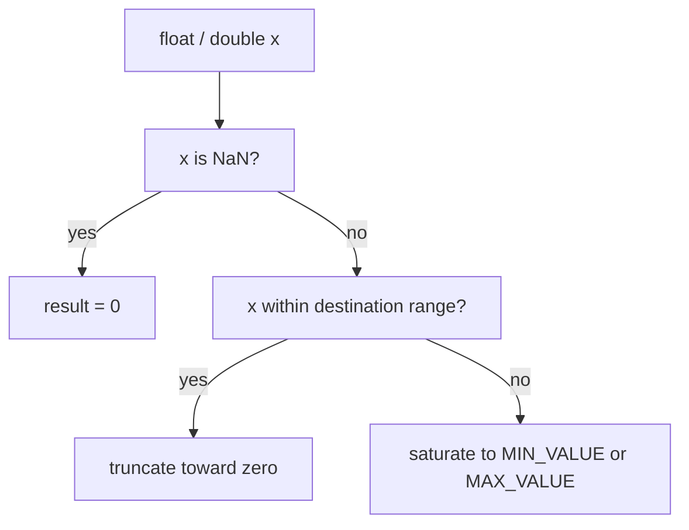

### `d2f` — Double to Float

A double has more range and precision than a float. Narrowing:

- If the magnitude is too large for `float`, the result is `±Float.POSITIVE_INFINITY`.
- Otherwise, the value is **rounded to the nearest representable `float`** (round-half-to-even).

## Mixing Widening & Narrowing in One Step

A few cross-type conversions require **both** a widening *and* a narrowing — Java does *not* try to find an implicit two-step path, so you must cast:

```java
byte b = 100;
char c = (char) b;   // byte → int (widen, implicit) → char (narrow, needs cast)
```

The bytecode actually emitted: `iload b; i2c` — the byte was already in an int slot, so widening is a no-op; the `i2c` does the narrow. This pattern (cast through int) is the only way to get between sub-int types of different sign discipline.

> [!IMPORTANT]
> **The compile-time-constant exception.** For assignment to `byte`/`short`/`char`, if the right-hand side is a **compile-time constant expression** (recall T03) that *fits in the destination type's range*, **no cast is required**. So:
> ```java
> byte b = 100;       // OK — 100 is a CT-constant int and fits in byte (-128..127)
> byte b2 = 200;      // ERROR — CT-constant but doesn't fit in byte
> int  x = 200;
> byte b3 = x;        // ERROR — x is not a CT-constant; needs explicit (byte) cast
> ```
> This is JLS §5.2 third bullet. It's why you don't write `byte b = (byte) 100` everywhere — but it relies on the constant-folding from T03.

## Reference Conversions — Up and Down

Beyond primitives, references convert along the **class hierarchy** — from a subtype to a supertype (**up**, widening) or back (**down**, narrowing).

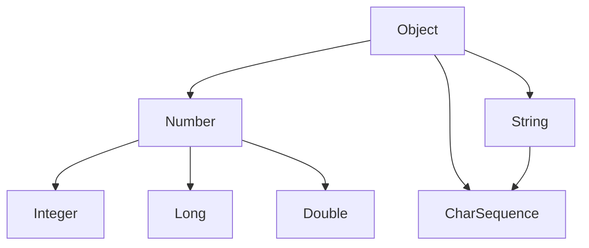

**Widening (upcast).** Always safe — any `Integer` *is* a `Number` *is* an `Object`. No runtime check, no bytecode, no allocation — the pointer is unchanged.

```java
Integer i = 42;
Number  n = i;     // upcast: implicit, no opcode emitted
Object  o = i;     // upcast: implicit
```

**Narrowing (downcast).** May fail at runtime. The compiler accepts it syntactically (`(String) someObject`) but emits a **`checkcast`** bytecode that the JVM verifies at runtime. If the actual object isn't an instance of the target type, **`ClassCastException`** is thrown.

```java
Object o = "hello";
String s = (String) o;     // bytecode: checkcast java/lang/String
                            // succeeds: o really is a String

Object n = Integer.valueOf(42);
String  t = (String) n;    // ClassCastException at runtime!
```

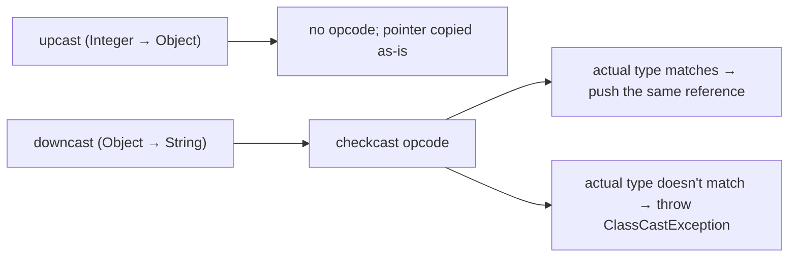

## `checkcast` & `instanceof` Bytecode

The two opcodes that handle reference type-checking at runtime:

| Opcode      | Operand            | Behaviour                                                               |
|-------------|--------------------|-------------------------------------------------------------------------|
| `checkcast <CP-Class>` | a class reference | Pop a reference; if `null` OR an instance of the class, push it back; else throw `ClassCastException`. |
| `instanceof <CP-Class>` | a class reference | Pop a reference; push `1` if non-null AND an instance, else push `0`. |

```java
Object o = somethingMaybeString();
boolean isStr = o instanceof String;   // bytecode: instanceof java/lang/String → 0 or 1
if (isStr) {
    String s = (String) o;             // bytecode: checkcast java/lang/String
    ...
}
```

The runtime check looks at the object's **class pointer** (the *klass* word at byte offset 8 of the object header — recall T02's heap-layout section) and walks the class hierarchy from that point. The walk is bounded by class-hierarchy depth (usually a handful of levels) and is heavily cached by the JIT — for monomorphic call sites, a `checkcast` often disappears completely after JIT compilation.

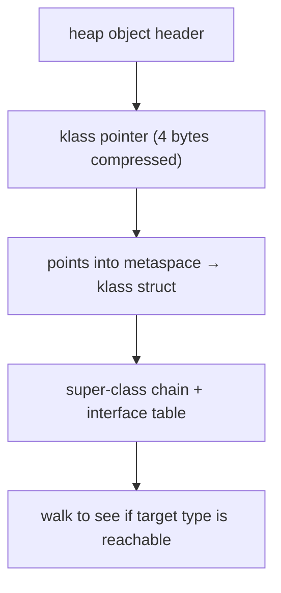

The Java 16+ **pattern-binding `instanceof`** (`if (o instanceof String s)`) is sugar for an `instanceof` followed by a `checkcast` and a local-store. The bytecode is identical to writing the long form by hand.

> [!INTERVIEW]
> **"Difference between `checkcast` and `instanceof` bytecode?"** Both perform the same hierarchy walk, but `instanceof` *returns* a boolean (1/0 on the stack), while `checkcast` *throws* on failure and just re-pushes the reference on success. The compiler picks the right one based on whether you wrote `obj instanceof T` or `(T) obj`.

## Autoboxing & Unboxing

Java has eight wrapper classes — `Boolean`, `Byte`, `Short`, `Character`, `Integer`, `Long`, `Float`, `Double` — one per primitive. **Autoboxing** (Java 5+) inserts implicit conversions between a primitive and its wrapper.

| Conversion          | Source             | Generated call                                             |
|---------------------|--------------------|-----------------------------------------------------------|
| `int → Integer`     | assigning an `int` to an `Integer` slot | `Integer.valueOf(int)` |
| `Integer → int`     | dereferencing an `Integer` in an int context | `Integer.intValue()` |
| `boolean → Boolean` | same pattern        | `Boolean.valueOf(boolean)` |
| (and the rest of the eight, identically) | | |

```java
List<Integer> nums = new ArrayList<>();
nums.add(42);            // autobox: int 42 → Integer.valueOf(42) → Integer object
int x = nums.get(0);     // auto-unbox: Integer.intValue() → int 42

Integer a = 100;         // autobox
Integer b = 200;
int sum = a + b;         // unboxes both, adds as int, leaves int (could autobox again)
```


The bytecode for `Integer.valueOf` (and friends) is just `invokestatic`:

```
iload_1                                        ; push int x
invokestatic java/lang/Integer.valueOf:(I)Ljava/lang/Integer;
astore_2                                        ; pop Integer ref, store
```

`valueOf` is a small method whose body is a cache check; we examine it next.

## Integer Cache — Why `==` Surprises with Wrappers

`Integer.valueOf(int i)` is **not** simply `return new Integer(i);`. It uses a static cache for the most common values:

```java
public static Integer valueOf(int i) {
    if (i >= IntegerCache.low && i <= IntegerCache.high)
        return IntegerCache.cache[i + (-IntegerCache.low)];
    return new Integer(i);
}
```

By default `low = -128`, `high = 127` — so all 256 `Integer` values from −128 through 127 are pre-built once at class-init time and *reused* on every `valueOf` call in that range. (`-XX:AutoBoxCacheMax=N` raises the upper bound on HotSpot.)

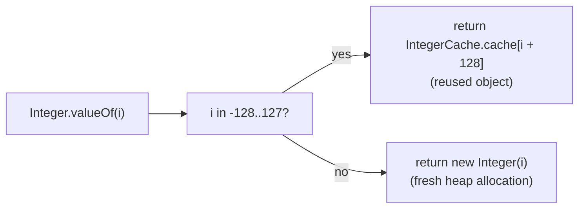

This explains the famous quirk:

```java
Integer a = 100;
Integer b = 100;
System.out.println(a == b);      // true   — both refer to IntegerCache.cache[228]

Integer c = 200;
Integer d = 200;
System.out.println(c == d);      // false  — two fresh new Integer(200) objects

System.out.println(c.equals(d)); // true   — equals compares values
```

**The lesson is the lesson:** never use `==` on wrapper types. Always `.equals()`.

Other caches in the JDK:
- `Boolean`: `Boolean.TRUE` and `Boolean.FALSE` (always cached).
- `Byte`: all 256 values cached (the whole range fits).
- `Short`: −128…127 cached.
- `Long`: −128…127 cached.
- `Character`: 0…127 cached.
- `Float`, `Double`: **no cache** (continuous range; the cache wouldn't pay off).

## Boxing Performance — Heap Allocation Per Box

When boxing misses the cache, **a new heap object is allocated**. On a 64-bit JVM with compressed oops, the layout is:

```
       Integer object (cache miss, e.g. Integer.valueOf(200)):

       byte 0..7   mark word              (8)
       byte 8..11  klass pointer          (4 compressed)
       byte 12..15 int value field        (4)
       padding                            (0 — total 16 is already 8-aligned)
                                         ────
                                          16 bytes per Integer
```

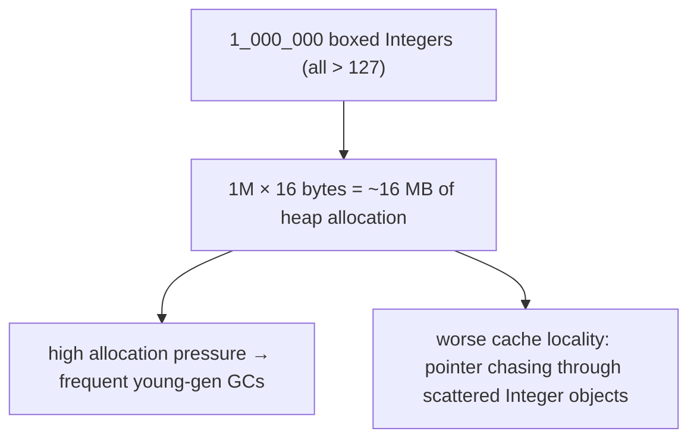

Two practical consequences (revisiting T02's memory-efficiency comparison):

- A `List<Integer>` of N elements costs ~5× the memory of an equivalent `int[]` and trashes the CPU cache.
- A tight loop with auto-boxing in the hot path can allocate millions of `Integer` objects per second. **Profile first**; if boxing is your bottleneck, switch to `int[]`, `IntStream`, or one of the primitive specialised collections (`IntList` in Eclipse Collections, `IntArrayList` in HPPC).

> [!WARNING]
> **`Integer i = null; int x = i;` throws `NullPointerException`.** Unboxing dereferences the wrapper to call `intValue()`; if the reference is null, you get an NPE on what looks like an innocent assignment. Common pitfall when reading nullable values from a database or JSON.

## Under the Hood — The Conversion Bytecode Family

The complete set, organised:

| From → To | Opcode  | Action                                                               |
|-----------|---------|----------------------------------------------------------------------|
| int → long   | `i2l`   | sign-extend 32 → 64 bits                                              |
| int → float  | `i2f`   | convert via FPU (may lose precision for ints > 2²⁴)                   |
| int → double | `i2d`   | convert via FPU (exact for any int)                                   |
| long → int   | `l2i`   | discard high 32 bits                                                  |
| long → float | `l2f`   | FPU convert (may lose precision for longs > 2²⁴)                      |
| long → double| `l2d`   | FPU convert (may lose precision for longs > 2⁵³)                      |
| float → int  | `f2i`   | truncate; saturate to MIN/MAX; NaN → 0                                |
| float → long | `f2l`   | truncate; saturate to MIN/MAX; NaN → 0                                |
| float → double | `f2d` | FPU widen (exact)                                                     |
| double → int | `d2i`   | truncate; saturate; NaN → 0                                           |
| double → long| `d2l`   | truncate; saturate; NaN → 0                                           |
| double → float| `d2f`  | FPU narrow with round-to-nearest-even; may produce ±Inf               |
| int → byte   | `i2b`   | mask low 8 bits, sign-extend back to 32                               |
| int → char   | `i2c`   | mask low 16 bits, **zero-extend** back to 32                          |
| int → short  | `i2s`   | mask low 16 bits, sign-extend back to 32                              |
| any ref → ref| `checkcast <CP>` | type-test or throw ClassCastException                          |
| any ref → bool | `instanceof <CP>` | type-test, push 1 or 0                                       |
| primitive → wrapper| `invokestatic ValueOf` | call valueOf (cache check + maybe new)              |
| wrapper → primitive| `invokevirtual xxxValue` | read .value field (and NPE if ref is null)         |

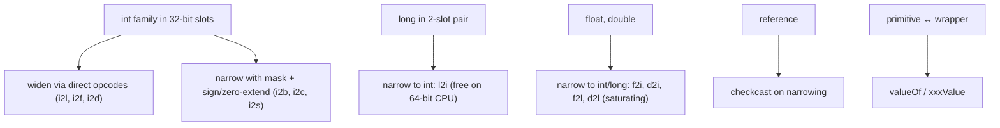

## Under the Hood — JIT to Native Conversions

The conversion opcodes are mapped to one or two native instructions by the JIT. Here are the highlights on **x86-64** and **ARM64**:

### Widening to wider integer

```asm
; i2l on x86-64:
movsxd  rax, eax            ; sign-extend the 32-bit EAX into the 64-bit RAX

; i2l on ARM64:
sxtw    x0, w0              ; same idea: sign-extend word to 64
```

Cost: 1 cycle. Sometimes the JIT skips the instruction entirely — if the value is known to be non-negative or the high half is already zero/sign-correct.

### Widening int to floating-point

```asm
; i2d on x86-64:
cvtsi2sd  xmm0, eax         ; convert signed int (EAX) to double in XMM0

; i2d on ARM64:
scvtf   d0, w0              ; signed-int-to-float (double precision) D0 ← W0
```

These are slower (~5-10 cycles) but pipelined; a JIT often hoists them out of loops.

### Narrowing long → int

```asm
; l2i on x86-64: nothing! Just refer to the 32-bit view of the same register.
mov     eax, eax            ; effectively zero the upper 32 bits if needed; often elided

; l2i on ARM64: similarly free.
; The next instruction simply uses W0 (low 32) instead of X0 (full 64).
```

This is one of the cheapest opcodes in the entire JVM — the JIT just *re-names* the register width.

### Narrowing int → byte / short / char

```asm
; i2b on x86-64:
movsx   eax, al             ; sign-extend the low byte AL into EAX

; i2c on x86-64:
movzx   eax, ax             ; zero-extend the low 16 bits AX into EAX

; i2s on x86-64:
movsx   eax, ax             ; sign-extend the low 16 bits

; i2b on ARM64:
sxtb    w0, w0              ; sign-extend byte (low 8 bits) to 32-bit word

; i2c on ARM64:
uxth    w0, w0              ; unsigned-extend halfword (low 16 bits) to 32

; i2s on ARM64:
sxth    w0, w0              ; sign-extend halfword to 32
```

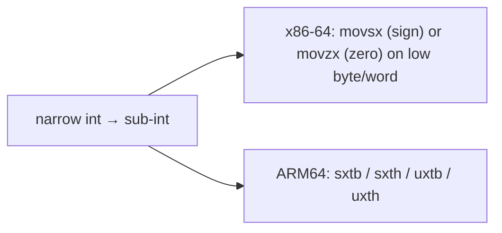

### Saturating Float → Int (the JIT fixup)

The headline JLS rule: `(int) Double.NaN == 0`, `(int) 1e20 == Integer.MAX_VALUE`. But the raw x86 instruction does *neither*:

```asm
; x86-64's truncating-convert returns INT_MIN for ALL invalid inputs
;   (NaN, ±Inf, overflow, underflow that's too negative)
cvttsd2si   eax, xmm0       ; eax = truncate(xmm0); on invalid → 0x80000000
```

So the JIT emits a **fixup sequence**:

```asm
cvttsd2si   eax, xmm0       ; do the native convert
cmp         eax, 0x80000000 ; was it INT_MIN? (means invalid input)
jne         done            ; if not, we're done
; fixup branch:
ucomisd     xmm0, xmm0      ; compare with self — NaN ≠ itself
jp          nan_case        ; parity-flag set if NaN
xorps       xmm1, xmm1      ; load 0
ucomisd     xmm0, xmm1      ; compare with 0
ja          over_max        ; if positive → MAX_VALUE
; otherwise overflow negative → INT_MIN is already what we want
jmp         done
nan_case:
    xor     eax, eax        ; result = 0
    jmp     done
over_max:
    mov     eax, 0x7FFFFFFF ; result = MAX_VALUE
done:
```

ARM64 has a single instruction that already does much of this saturation (`fcvtzs` is JLS-friendly for most cases), so the fixup is shorter:

```asm
fcvtzs  w0, d0              ; convert double-to-signed-int with saturation
                            ; (NaN still needs a separate check for the "0" result on some CPU variants)
```

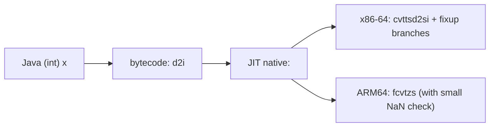

**Cost:** Most calls take the fast path (the value was in range). The slow path is taken only on overflow or NaN. Modern branch predictors make this nearly free for typical workloads.

### Reference Conversion: `checkcast`

```asm
; checkcast (simplified inlined version):
; assume the reference is in RAX; the target klass is in RBX
test    rax, rax            ; is the reference null?
je      done                ; null passes a checkcast (no exception)
mov     rcx, [rax + 8]      ; load the object's klass pointer (offset 8 in header)
cmp     rcx, rbx            ; same klass?
je      done                ; fast path: exact match
call    slow_path_check     ; walk the hierarchy
done:
```

The fast path (exact-class match) is two memory ops + one branch. Modern JIT often inlines the slow path or eliminates the cast via class-hierarchy analysis.

## Memory: Where Each Conversion Lives

Per the depth bar's §4a, let's pin down each conversion's memory behaviour:

| Conversion type      | Allocation?  | Where the bytes move                                            | Lifetime of intermediates                |
|----------------------|--------------|-----------------------------------------------------------------|------------------------------------------|
| Primitive widen      | none         | within a single CPU register (or its wider view)                | one operand-stack slot → wider slot     |
| Primitive narrow     | none         | within a single CPU register (or two for `long → int`)          | same slot, just re-interpreted          |
| Reference widen      | none         | pointer is copied as-is to the destination slot                | reference lives in old + new variable    |
| Reference narrow     | none (just a check) | pointer is copied; klass-table walk reads metaspace          | same                                    |
| Autoboxing (cached)  | **none if cached**, else **one heap object** | cache: returns existing object; new: allocates 16 bytes | wrapper outlives the primitive value     |
| Autounboxing         | none         | reads the wrapper's `.value` field (one `getfield`)              | the primitive int now lives in the operand stack |
| String concat        | yes — at least one `String` allocation, plus intermediate buffer | `StringConcatFactory` allocates the final buffer once | the result lives wherever it's assigned |

The take-home pattern: **only boxing and string concat allocate**. Every primitive cast and every reference upcast/downcast is allocation-free.

## Common Mistakes

- **Lossy long → float.** `float f = 10_000_000_000L;` compiles but drops precision. If you want a precise representation, use `double`.
- **Float → int saturation surprises.** `(int) Double.NaN == 0`, not an exception. Test for NaN explicitly with `Double.isNaN`.
- **`(int) -3.9 == -3`, not `-4`.** Java truncates toward zero, not toward negative infinity (which is what `Math.floor` does, returning a `double`).
- **`int / long` narrowing.** `int x = (int) (longBig);` silently keeps only the low 32 bits. If you want to detect overflow, use `Math.toIntExact(long)`.
- **Forgetting the cast on assignment.** `byte b = i * 2;` (where `i` is an `int`) needs `(byte)` — the compiler doesn't auto-narrow.
- **`Integer == Integer` for values > 127.** The cache window can hide the bug for small values; it returns once your data leaves [-128, 127]. Use `.equals()` everywhere.
- **NPE on unboxing.** `Integer x = null; int y = x;` throws `NullPointerException`. Always null-check before unboxing nullable references.
- **`(char) -1` is `(char) 65535`.** `char` is unsigned; a negative `int` cast to `char` reinterprets the bits.
- **`Object[] strings = new String[]; strings[0] = Integer.valueOf(1);`** compiles (covariant array). It throws `ArrayStoreException` at runtime. Generics solve this for collections (`List<String>`); arrays preserve the older, looser rules.
- **`ClassCastException` deep in the call chain.** A cast in a calling method can throw because of an object created three frames down. The fix: use `instanceof` (with pattern binding) at the point of doubt, not a bare cast.

> [!INTERVIEW]
> Reliable conversion/casting questions:
> - **"Is widening always safe?"** Magnitudes preserved, yes. Precision-preserving — **no**: `long → float` and `int → float` can lose precision when the source has more than 24 significant bits.
> - **"What's the result of `(int) Double.NaN`?"** `0` — per JLS. The native CPU instruction returns `INT_MIN`; the JIT emits a fixup.
> - **"What's the result of `(int) 1e20`?"** `Integer.MAX_VALUE` — saturation.
> - **"What's the difference between `i2b` and `i2c`?"** Both mask low 16/8 bits; `i2b` sign-extends back to 32 bits, `i2c` zero-extends. (Char is unsigned.)
> - **"What bytecode does `(int) longVar` emit?"** `l2i` — and on a 64-bit CPU it usually maps to no native instruction (just refer to the low 32 bits of the same register).
> - **"Why does `Integer.valueOf(100) == Integer.valueOf(100)` return true, but `Integer.valueOf(200) == Integer.valueOf(200)` return false?"** The Integer cache covers `-128..127`. Beyond, `valueOf` allocates fresh objects.
> - **"What's `checkcast`?"** The bytecode emitted by an explicit reference downcast. It throws `ClassCastException` on mismatch; tolerates `null`.
> - **"How does unboxing work?"** `javac` inserts a call to the wrapper's `xxxValue()` method (e.g., `Integer.intValue()`); NPE if the reference is null.
> - **"Why is `byte b = 100;` legal but `byte b = 200;` not?"** Both `100` and `200` are int CT-constants; 100 fits in byte's range (−128…127), 200 doesn't. The JLS §5.2 implicit-narrowing rule only applies when the value fits.

## Practice

1. **Widening ladder.** Write a class that declares `byte b = 5`, then assigns it (without casts) to `short`, `int`, `long`, `float`, `double` in turn. Print each. Now do the same starting from `char c = 'A'`. Where does the value differ between `short` and `char`?
2. **The lossy widening.** Set `long big = 1_000_000_000_000L`. Print `(float) big` and `(double) big`. Why does only one lose precision? What's the largest `long` that converts to `float` losslessly? (Hint: 2²⁴.)
3. **Narrowing rules — predict and verify.** Predict (then check) the value of each:
   - `(byte) 200`
   - `(byte) -200`
   - `(short) 70_000`
   - `(char) -1`
   - `(int) 5_000_000_000L`
   - `(int) 3.9`
   - `(int) -3.9`
   - `(int) Double.NaN`
   - `(int) 1e20`
   - `(long) -1.7e308`
4. **`javap` the conversions.** Write a class with one method per conversion: int→long, int→double, long→int, double→int, int→byte, int→char. Disassemble with `javap -c` and identify the exact bytecode opcode in each method body.
5. **`char` vs `short` bit dance.** Set `short s = -1`. Cast it to `char` (you'll need `(char)`). Print the `char` value as an int. Why is it `65535`? Now set `char c = 65535;`, cast to `short` (needs `(short)`); print as int. Why is it `-1`?
6. **Reference up + down.** Define a small class hierarchy `Animal → Dog → GoldenRetriever`. Hold a `GoldenRetriever` in an `Animal` variable; downcast back via `(Dog)`. Then try downcasting an `Animal` that's actually a `Cat` to `Dog`. What's the exact exception, and which line throws?
7. **`instanceof` vs `checkcast`.** Disassemble code that uses `o instanceof String` and code that uses `(String) o`. Identify the two different opcodes in `javap -c`.
8. **Boxing cache boundary.** Print `Integer.valueOf(127) == Integer.valueOf(127)` and `Integer.valueOf(128) == Integer.valueOf(128)`. Now run with `-XX:AutoBoxCacheMax=200`. Does the second comparison change? Why?
9. **Unboxing NPE.** Declare `Integer x = null;` and then `int y = x;`. Run it. What's the stack trace? Now wrap with `if (x != null)`. Done.
10. **Boxing memory cost.** Estimate the bytes used by `List<Integer>` of 1,000,000 entries (all > 127, so not cached) vs `int[1_000_000]`. Confirm with the JOL library or by reasoning from T02's heap-layout section.
11. **Saturation in real life.** Read a `long` timestamp in nanoseconds and cast it to `int` to use as an ID. Run with a current `System.nanoTime()`. Show that for large values, the narrowing wraps. Replace with `Math.toIntExact` and observe the `ArithmeticException`.
12. **JIT inspection (advanced).** Write a method `int floor(double d) { return (int) d; }`. Run with `-XX:+PrintAssembly` and find the saturating fixup in the native code. Identify the `cvttsd2si` (x86-64) or `fcvtzs` (ARM64) instruction.
13. **CT-constant exception.** Declare `byte b = 100;` (works) and `byte b2 = 100 + 50;` (works — CT folds to 150 — oh wait, that's > 127, so it doesn't!). Try `byte b3 = 50 + 50;` (works, 100 fits). Then `byte b4 = 200 - 100;` (works, 100 fits). Then `int x = 100; byte b5 = x;` (fails — `x` isn't a CT-constant). Predict each.
14. **Array store check.** Run `Object[] arr = new String[2]; arr[0] = "hi"; arr[1] = Integer.valueOf(1);`. What exception, and why? What's the dual of this for `List<String>` under generics?
15. **Explain it back.** In your own words, trace `Integer x = 200; int y = x + 1;` from source through bytecode through native instructions, naming every step: `invokestatic valueOf`, the heap allocation, the `astore`, the `getfield`/`invokevirtual intValue`, the `iconst_1`, the `iadd`, the `istore`. How many of these steps does the JIT typically eliminate via escape analysis if `x` doesn't escape?

## Recap

You should now be able to:

- List the **eight conversion categories** of JLS §5 (identity, widening primitive, narrowing primitive, widening reference, narrowing reference, boxing, unboxing, string conversion) and recall which require an explicit cast.
- Apply **widening primitive** conversions implicitly along the ladder `byte → short/char → int → long → float → double`, and recognise that **`long → float`** and **`int → float`** can lose precision because IEEE 754 `float` has only 24 bits of mantissa.
- Apply **narrowing primitive** conversions explicitly, and explain each opcode's bit behaviour: `i2b` masks low 8 + sign-extend; `i2s` masks low 16 + sign-extend; `i2c` masks low 16 + **zero-extend** (because `char` is unsigned); `l2i` drops the high 32; `f2i`/`d2i`/`f2l`/`d2l` truncate, saturate to `MIN_VALUE`/`MAX_VALUE`, and turn NaN into 0.
- Explain the JLS §5.2 **compile-time-constant exception**: `byte b = 100;` works without a cast because `100` is a CT-constant `int` that fits; `byte b = x;` with a non-CT `x` does not.
- Use **widening reference** (upcast) implicitly and **narrowing reference** (downcast) explicitly, knowing the downcast emits a `checkcast` bytecode that throws `ClassCastException` on mismatch.
- Recognise `instanceof` (push `0`/`1`) and `checkcast` (re-push or throw) as the two reference-checking bytecodes, and that pattern matching `instanceof T s` is sugar for both plus a local-store.
- Trace **autoboxing** to `Integer.valueOf(int)` and **unboxing** to `Integer.intValue()`; describe the `valueOf` cache (default `-128..127`; `-XX:AutoBoxCacheMax` raises it) and explain why `Integer == Integer` returns inconsistent results across the cache boundary.
- Quantify the **heap cost of boxing**: each Integer outside the cache is ~16 bytes (header + value + padding); `List<Integer>` is ~5× the memory of an equivalent `int[]`.
- Avoid the **NPE-on-unbox** pitfall: `Integer x = null; int y = x;` throws — null-check before unboxing.
- Map each conversion to its **native instruction** on x86-64 (`movsxd`, `cvtsi2sd`, `cvttsd2si`, `movsx`, `movzx`) and ARM64 (`sxtw`, `scvtf`, `fcvtzs`, `sxtb`/`sxth`, `uxth`), and explain that `l2i` is essentially free (just the low 32 bits of the same register).
- Explain why **saturating float-to-int** in the JLS requires the JIT to emit a **fixup sequence** on x86-64 (because `cvttsd2si` returns `INT_MIN` on any invalid input), while ARM64's `fcvtzs` already saturates close to the JLS rule.
- Pin the **memory behaviour** of every conversion: only boxing and string concat allocate; all primitive and reference casts are allocation-free; the JIT often eliminates `checkcast` via class-hierarchy analysis.

## Next

Continue to [Strings & Text Blocks](./T06-strings-and-text-blocks.md).
