# Strings & Text Blocks

Of all the reference types in the JDK, `String` is the one you touch on every line of real Java: log messages, JSON payloads, SQL queries, HTTP headers, file paths, environment variables, configuration keys. It's also the one with the most *machinery* hiding behind ordinary-looking code. Behind `"hello"` there is a constant-pool entry, a heap-resident object whose layout differs depending on its contents, a UTF-16 code unit count that disagrees with what humans call a "character" the moment an emoji shows up, a pool that deduplicates literals across the whole running JVM, an `invokedynamic` call replacing what used to be a chain of `StringBuilder.append`s, and — in the hot loop — SIMD instructions that compare 16 or 32 bytes at a time.

This topic closes every loose end the prior five topics left open about Strings. From `T02` we owe full payment on the **surrogate-pair flag** (why `"😀".length() == 2`). From `T03` we owe the **string-interning deep dive** (how the pool actually works inside the JVM). From `T04` we owe the **`StringConcatFactory` invokedynamic** opcode trace (the real mechanism behind `"x = " + x`). From `T05` we owe the **String-conversion category** of JLS §5 in operational form. And from the depth bar (`DEPTH-CHECKLIST.md` §4a) we owe **byte-level memory layout**, **call-time memory interaction**, **lifetime**, **x86-64 vs ARM64 vectorised comparison**, and the **Latin-1/UTF-16 dual encoding** that the **Compact Strings** feature introduced in Java 9. Everything is on the table.

> [!NOTE]
> Prerequisites: [Variables & Primitive Types](./T02-variables-and-primitive-types.md) (`L0/C02/T02`) — reference vs primitive, the `char` slot, the surrogate-pair flag we close here; [Literals & Constants](./T03-literals-and-constants-final.md) (`L0/C02/T03`) — String literals, the constant pool, the intro to interning; [Operators](./T04-operators-arithmetic-relational-logical-bitwise-assignment.md) (`L0/C02/T04`) — the `+` String-concat operator's `StringConcatFactory` entry; [Type Conversion & Casting](./T05-type-conversion-and-casting.md) (`L0/C02/T05`) — String conversion (`+` context), `checkcast` on downcasts to `String`; [Source to Bytecode to JVM to Machine Code](../C01-cs-foundations/T04-source-to-bytecode-to-jvm-to-machine-code.md) (`L0/C01/T04`) — constant pool, operand stack, `invokestatic`/`invokedynamic`; [Number Systems & Basic Bit Math](../C01-cs-foundations/T02-number-systems-binary-hex-and-basic-bit-math.md) (`L0/C01/T02`) — sign-/zero-extension and bit manipulation, used for the surrogate-pair encoding.

## What Is a String?

A `String` is a **reference type** — a heap-allocated object whose fields hold the actual characters, exposed through methods (`length()`, `charAt(i)`, `substring(a, b)`, …). The variable named `s` doesn't *contain* the characters; it contains a **pointer** to the object that does. This is the same model as every other reference type from `T02`, but Strings get four invariants the language guarantees:

1. **Immutable** — once constructed, the contents never change. Methods that look like mutations (`toLowerCase`, `replace`, `substring`) return *new* `String` objects.
2. **`final`** at the class level — you cannot subclass `String`, so no one can break invariant 1 by overriding behaviour.
3. **Literal-interned** — every `String` literal in source code is added to the JVM-wide **string pool** at class resolution (T03); equal literals share a single heap object.
4. **Hash-cached** — `hashCode()` is computed once on first call and cached in a field; subsequent calls are an O(1) field read.

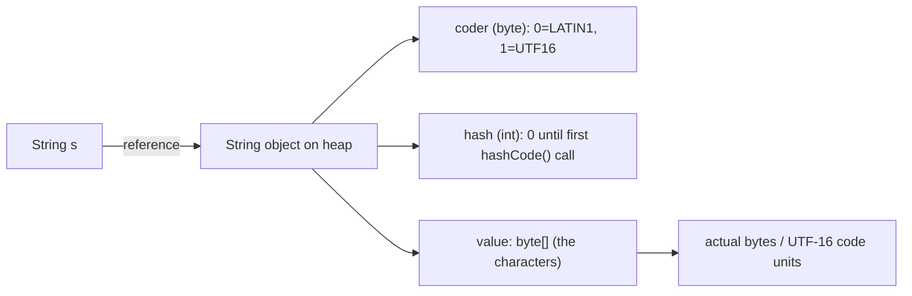

These four invariants are what make `String` the only reference type the JDK treats as a *value* in many contexts (a switch label, a constant-pool entry, an annotation default, a map key).

### `String` as a Java type

`String` is declared in `java.lang.String`, automatically imported, and special-cased by the compiler in three places no other class enjoys:

- **Literal syntax** — `"hello"` and `"""…"""` (text blocks) produce a `String` directly. No other class has a literal form (excluding the wrapper-class autoboxing rule).
- **The `+` operator** — `s + x` is the *only* user-visible operator overload in Java, and it's hard-wired to `String` (T04).
- **`switch`** — `switch (s) { case "open": ... }` works on `String` because the compiler emits a hash-then-equals dispatch (T08 will cover this).

## String Literals vs `new String("...")`

The two ways to write a String produce *different objects*:

```java
String a = "hello";           // literal — interned at class resolution
String b = "hello";           // same literal text → same interned object
String c = new String("hello"); // explicit allocation — fresh heap object

System.out.println(a == b);          // true  — both point at the pooled String
System.out.println(a == c);          // false — c is a separate allocation
System.out.println(a.equals(c));     // true  — equal contents
```

```mermaid
flowchart TB
  L1["literal \"hello\" at line 1"] --> Pool["string pool (heap-resident hash table)"]
  L2["literal \"hello\" at line 2"] --> Pool
  New["new String(\"hello\")"] --> Fresh["fresh heap object (own value byte[])"]
  Pool --> Shared["one pooled String — a and b both point here"]
```

The literal route is what you want **always** unless you have a specific reason to force a separate object (rare; usually a teaching example or a defensive copy where the source's identity matters). The `new String("hello")` form **wastes a heap allocation and a memcpy** — it allocates a new String wrapper object *plus* a new `byte[]` and copies the literal's bytes into it.

> [!WARNING]
> `new String("literal")` is a code smell. The constructor body is essentially `this.value = original.value; this.coder = original.coder;` followed by a defensive byte-array copy in some constructors. You almost never want this. Use the literal directly.

### The constant-pool side of a literal

Recall T03's mechanism. Every `String` literal in source code becomes one `CONSTANT_String` entry in the `.class` constant pool, which indirects through one `CONSTANT_Utf8` entry holding the actual bytes:

```
constant pool entries for the literal "hello":

  #5  CONSTANT_String   class-file index → #6
  #6  CONSTANT_Utf8     length=5, bytes = h e l l o (modified UTF-8)
```

At class **resolution time**, the JVM:
1. Decodes `#6`'s modified-UTF-8 bytes into a `String` object.
2. Looks the result up in the JVM-wide **string pool** (described in detail later).
3. If absent, the new `String` is **added** to the pool; if present, the existing pooled `String` is **reused**.
4. The internal cache of `#5` is set to point at the pooled `String`.

From then on, every `ldc #5` in any method just pushes that pooled `String` reference onto the operand stack. The decoding and pool lookup happen **once per class-file constant-pool entry**, not once per `ldc` execution.

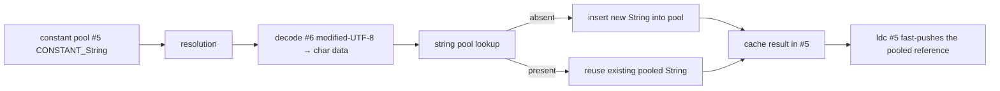

## Inside a String — The Object Layout

`String` is one of the most carefully-tuned classes in the JDK. On modern HotSpot (Java 9+) with **Compact Strings** and **compressed oops** (T02), the object layout is:

```
       String instance (64-bit JVM, compressed oops, Compact Strings on):

       byte 0..7    mark word                (8 bytes)
       byte 8..11   klass pointer            (4 bytes, compressed)
       byte 12      coder                    (1 byte; 0=LATIN1, 1=UTF16)
       byte 13..15  (3 bytes padding for alignment of the int hash)
       byte 16..19  hash                     (4 bytes; cached hashCode)
       byte 20..23  hashIsZero               (1 byte boolean + 3 pad)
       byte 24..27  value                    (4 bytes, compressed byte[] ref)
       byte 28..31  (padding so the object is 8-aligned)
                                            ─────
                                             32 bytes per String wrapper
```

The actual character bytes live in the **separate `byte[]` object** pointed to by `value`. That array has its own header:

```
       value byte[] (the characters of "hello", coder=LATIN1):

       byte 0..7    mark word                (8 bytes)
       byte 8..11   klass pointer            (4 bytes, compressed)
       byte 12..15  length                   (4 bytes, = 5)
       byte 16      'h'                      (1 byte)
       byte 17      'e'                      (1 byte)
       byte 18      'l'                      (1 byte)
       byte 19      'l'                      (1 byte)
       byte 20      'o'                      (1 byte)
       byte 21..23  (3 bytes padding to 8-align next allocation)
                                            ─────
                                             24 bytes for the char data
```

So the heap cost of the *innocent-looking* literal `"hello"` is **32 + 24 = 56 bytes**, split across two objects.

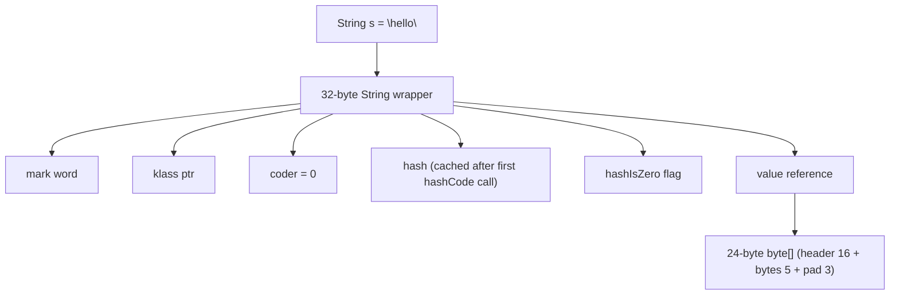

> [!NOTE]
> Exact layout numbers vary slightly across JDK versions and `-XX` flags. Use **JOL** (`org.openjdk.jol`) to dump the real layout for your JDK: `ClassLayout.parseInstance("hello").toPrintable()`.

### Why a separate `byte[]`

Three reasons the character data lives in a *separate* array object, not inline inside the `String`:

1. **Sharing** — multiple `String`s could share the same array (today only `substring` doesn't do this, but the design admits the option; and `String.value` is `byte[]`, not the inline data, so the JVM can swap the backing array for `intern`/`compact` operations).
2. **`final` array reference** — `value` is `private final byte[]`. Being `final` means the JIT can hoist reads and the JMM's safe-publication rule applies (T03's preview of `final` + JMM).
3. **Variable length** — fields in an object must be a fixed size; arrays are objects with a length header. Putting the bytes in a separate object lets `String`'s own size stay fixed (32 bytes here) regardless of how long the text is.

### The `coder` byte and the `hash` field

These two fields are unique to `String`:

- **`coder`** — a `byte` whose value is `0` (LATIN1) or `1` (UTF16). It tells every `String` method how to interpret `value`'s bytes: as one byte per code unit (Latin-1) or as two bytes per code unit (UTF-16, big-endian on the heap regardless of host). This is the **Compact Strings** mechanism (next section).
- **`hash`** — the cached `hashCode()`. On first call, the polynomial `31·h + ch` is computed over all code units and stored. Subsequent calls just return the field. `hashIsZero` (added in JDK 13) disambiguates "hash = 0 because not yet computed" from "hash = 0 because the computed hash really is 0" (e.g. for the empty `String`).

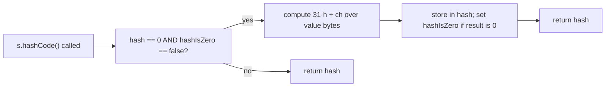

## Compact Strings — The Latin-1 / UTF-16 Dual Encoding

Before Java 9, `String` looked like:

```java
class String {
    private final char[] value;   // 2 bytes per code unit, always
    ...
}
```

A `char` is 16 bits (T02), so every Java String pre-9 used **2 bytes per code unit** even for plain ASCII text. Measurements on real-world Java workloads showed that **the vast majority of Strings are pure ASCII (or at most pure Latin-1) — and were paying double the heap they needed**. JEP 254 (Compact Strings, Java 9+) changed the field to a `byte[]`:

```java
class String {
    private final byte[] value;   // 1 byte/char if Latin-1, 2 bytes/char if UTF-16
    private final byte   coder;   // 0 = LATIN1, 1 = UTF16
    ...
}
```

At construction (and after any operation that produces a new String), the JDK **scans the data** to decide the coder:

- If **every** code unit fits in Latin-1 (range `` to `ÿ`), `coder = LATIN1` and the array stores **one byte per code unit**.
- If **any** code unit needs more than 8 bits, `coder = UTF16` and the array stores **two bytes per code unit** (big-endian, so byte `2i` is the high byte, byte `2i+1` is the low byte).

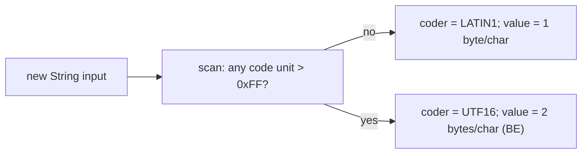

### Side-by-side layout

```
       "hello"  (5 chars, all ASCII) — LATIN1
       coder = 0
       value.length = 5
       value bytes:  [ 'h'  'e'  'l'  'l'  'o' ]
                       0x68 0x65 0x6C 0x6C 0x6F


       "héllo"  (5 chars, one Latin-1) — LATIN1
       coder = 0
       value.length = 5
       value bytes:  [ 'h'  0xE9  'l'  'l'  'o' ]
                       0x68 0xE9  0x6C 0x6C 0x6F
       (0xE9 is 'é' in Latin-1)


       "中文"   (2 chars, both supplementary) — UTF16
       coder = 1
       value.length = 4    ← TWO bytes per char
       value bytes:  [ 0x4E 0x2D    0x65 0x87 ]
                       └─'中'──┘    └─'文'──┘
                       (BE order: hi byte then lo byte)
```

### Why this saves ~50% in real apps

Plain English text — including most logs, JSON keys, SQL column names, HTTP headers, file paths — is **pure ASCII**. Every such `String` now pays one byte per code unit instead of two. Real-world heap dumps consistently report **20-50% total heap reduction** after Compact Strings shipped, because Strings dominate the live-data set in most servers.

| Workload                                  | Pre-Java 9 (char[])   | Compact Strings (byte[]+coder)  |
|-------------------------------------------|-----------------------|---------------------------------|
| ASCII logs, JSON payloads, SQL            | 2 bytes/char          | **1 byte/char** (LATIN1)        |
| Latin-1 (most European, no €/curly quotes)| 2 bytes/char          | **1 byte/char** (LATIN1)        |
| Mixed Latin/Cyrillic/Greek                | 2 bytes/char          | 2 bytes/char (UTF16)            |
| Mostly Chinese/Japanese/Korean            | 2 bytes/char          | 2 bytes/char (UTF16)            |
| Emoji or supplementary code points        | 2 bytes/char (via surrogates) | 2 bytes/char (via surrogates) |

```mermaid
flowchart TB
  Pre["Pre-Java 9: char[] (16 bits/code unit always)"] --> P1["\"hello\" → 10 bytes char data"]
  Post["Java 9+: byte[] + coder"] --> Po1["\"hello\" → 5 bytes char data (LATIN1)"]
  Post --> Po2["\"중\" → 2 bytes char data (UTF16)"]
  Post --> Cost["~50% reduction on typical server workloads"]
```

> [!IMPORTANT]
> **The Latin-1 boundary trap.** A single non-Latin-1 character in a String forces the **entire** array into UTF-16, doubling its size. Appending one `'€'` (which is `€`, outside Latin-1) to a 1 GB Latin-1 String produces a *new* UTF-16 String of size ~2 GB. This rarely matters for short Strings; it can matter for very long ones.

You can disable Compact Strings with **`-XX:-CompactStrings`** (note the leading `-`, meaning "off"). The flag exists for legacy benchmarks and edge cases where the byte/UTF-16 branching cost out-paces the memory win — but **the default is on**, and you should leave it on unless you measure otherwise.

### The internal helper classes

The `String` class delegates to two package-private helpers based on the coder:

- **`StringLatin1`** — implements every operation for the 1-byte case (faster: no shifting, smaller cache footprint).
- **`StringUTF16`** — implements every operation for the 2-byte case (handles surrogate pairs, big-endian reads).

```java
// inside java.lang.String (paraphrased)
public char charAt(int index) {
    if (coder == LATIN1) {
        return (char) (value[index] & 0xFF);   // unsigned byte → 16-bit char
    } else {
        return StringUTF16.charAt(value, index); // read 2 bytes BE → char
    }
}
```

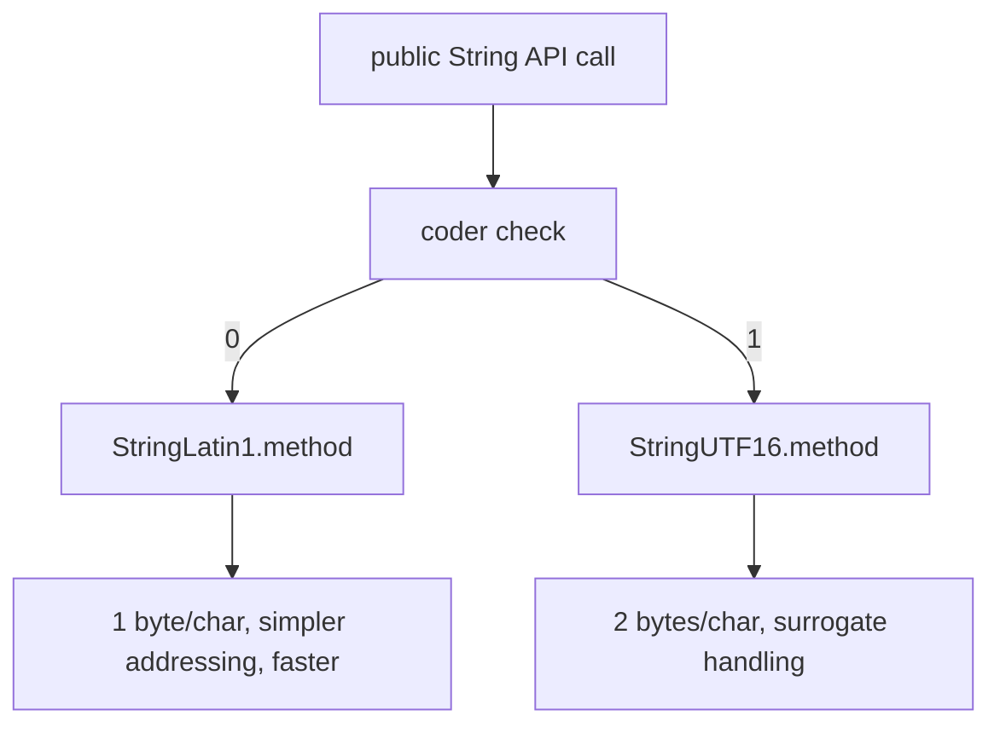

## `char` vs Code Point — Surrogate Pairs, Finally

Back in T02 we said: a `char` is 16 bits, and Unicode has more than 65 536 characters, so something is off. Here is the closure.

### Unicode in one minute

- A **Unicode code point** is an integer in the range `U+0000` to `U+10FFFF` — **about 1.1 million** distinct values (only ~150 000 are currently assigned).
- The space is divided into 17 *planes* of 65 536 code points each.
- Plane 0, called the **Basic Multilingual Plane (BMP)**, covers `U+0000` to `U+FFFF` and contains most living-language characters.
- Planes 1–16 are the **supplementary planes**, covering `U+10000` to `U+10FFFF`. Emoji, historic scripts, rare CJK ideographs, and the *Mathematical Alphanumeric Symbols* live here.

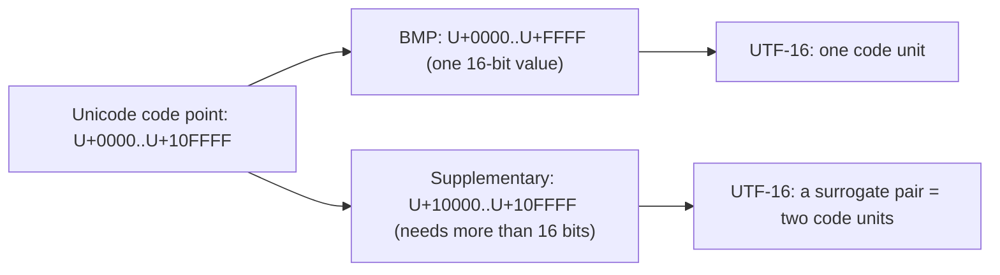

### A `char` is a UTF-16 **code unit**, not a code point

Java's `char` is a 16-bit unsigned integer, sized to **one UTF-16 code unit**. For any code point in the BMP, one `char` is enough. For any supplementary code point, **two `char`s are required** — a *high surrogate* (`0xD800`–`0xDBFF`) followed by a *low surrogate* (`0xDC00`–`0xDFFF`).

The encoding from code point ↔ surrogate pair is fixed:

```
       Encoding a supplementary code point CP (U+10000 ≤ CP ≤ U+10FFFF) into two chars:

       step 1:    let x = CP - 0x10000       (now 0 ≤ x ≤ 0xFFFFF, 20 bits)
       step 2:    high = 0xD800 | (x >>> 10) (top 10 bits)
       step 3:    low  = 0xDC00 | (x & 0x3FF)(bottom 10 bits)
       result:    char[2] = { high, low }


       Decoding back:

       step 1:    x = ((high - 0xD800) << 10) | (low - 0xDC00)
       step 2:    CP = x + 0x10000
```

Why the surrogate range was set aside (`0xD800`–`0xDFFF`): the Unicode consortium reserved that block, meaning *no code point in that range will ever be assigned a character*. So a `char` value in that range unambiguously signals "I'm half of a surrogate pair."

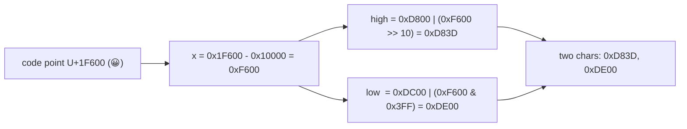

### `"😀".length()` is 2 — worked example

```java
String s = "😀";          // a single emoji
System.out.println(s.length());          // 2  ← UTF-16 code units, NOT code points
System.out.println(s.codePointCount(0, s.length())); // 1  ← actual code points
System.out.println(s.charAt(0));         // surrogate half: 0xD83D
System.out.println((int) s.charAt(0));   // 55357 (0xD83D)
System.out.println((int) s.charAt(1));   // 56832 (0xDE00)
System.out.println(s.codePointAt(0));    // 128512 (0x1F600 — the real CP)
```

Why `length()` returns 2: the JDK chose **code units** for `length()` so the value matches `value.length / (coder==LATIN1 ? 1 : 2)` — i.e. the count is **constant-time** and matches the indexing scheme of `charAt(i)`. Code-point counting would require a scan.

```
       Inside the value byte[] for "😀" (coder = UTF16):

       byte 0  0xD8     ← high surrogate's high byte
       byte 1  0x3D     ← high surrogate's low byte
       byte 2  0xDE     ← low surrogate's high byte
       byte 3  0x00     ← low surrogate's low byte

       length() reads value.length / 2 = 2.
```

> [!WARNING]
> **`length()` is not "number of characters" in the human sense.** Don't use `length()` to validate a username, count emojis in a tweet, or truncate Unicode safely. Use `codePointCount(0, s.length())` for code-point count, and **even that** doesn't account for grapheme clusters (e.g. flag emojis built from regional indicator pairs, or "👨‍👩‍👧‍👦" which is one human "character" made of 7+ code points).

### The code-point API

| Method                          | Returns                                            |
|---------------------------------|----------------------------------------------------|
| `length()`                      | number of **code units** (chars)                    |
| `charAt(int i)`                 | the `char` at index `i` (a code unit — may be surrogate half) |
| `codePointAt(int i)`            | the **code point** starting at index `i` (combines surrogates) |
| `codePointBefore(int i)`        | the **code point** ending at index `i`              |
| `codePointCount(int a, int b)`  | number of code points in `[a, b)`                   |
| `offsetByCodePoints(int i, int n)` | index n code points past `i`                     |
| `chars()` / `codePoints()`      | `IntStream` of code units / code points             |
| `Character.isSupplementaryCodePoint(cp)` | true for CP ≥ `U+10000`                    |
| `Character.toChars(int cp)`     | encode a code point as a `char[1]` or `char[2]`     |

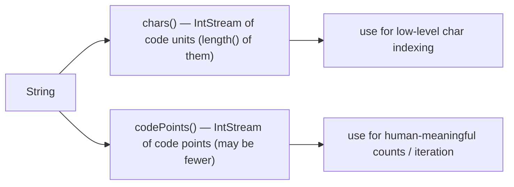

### Code-point iteration done right

```java
String s = "Hi 😀!";
// WRONG: counts surrogate halves as separate "chars"
for (int i = 0; i < s.length(); i++) {
    System.out.println("char[" + i + "] = " + s.charAt(i));
}

// RIGHT: iterate by code points
s.codePoints().forEach(cp ->
    System.out.println("CP = " + cp + " (" + new String(Character.toChars(cp)) + ")"));

// Or with the offsetByCodePoints idiom:
for (int i = 0; i < s.length(); ) {
    int cp = s.codePointAt(i);
    System.out.println(cp);
    i += Character.charCount(cp);   // 1 for BMP, 2 for supplementary
}
```

## The String API Tour

A tour of the methods you'll use in every Java application, with the **mechanism** behind each. The full Javadoc has ~70 methods; below is the working set you must own.

### `length()` and `isEmpty()`

```java
"hello".length();   // 5
"".isEmpty();       // true  — equivalent to length() == 0
"hello".isBlank();  // false — true if length() == 0 or only whitespace (Java 11+)
```

Mechanism: `length()` returns `value.length >> coder` (where `coder` is 0 for LATIN1, 1 for UTF16). **One shift, one return.** No iteration, no allocation. Both are O(1).

### `charAt(int)` and `codePointAt(int)`

`charAt(i)` returns a code unit. `codePointAt(i)` checks whether `value[i]` is a high surrogate followed by a low surrogate; if so, decodes the pair into the full code point.

```java
"😀".charAt(0);        // 0xD83D (a surrogate half)
"😀".codePointAt(0);   // 0x1F600 (the actual code point)
```

Mechanism: both branch on `coder`. `StringLatin1.charAt` is `(char)(value[i] & 0xFF)`; `StringUTF16.charAt` reads two bytes big-endian and assembles them.

### `substring(int begin, int end)`

Returns a **fresh `String`** whose value bytes are a copy of `value[begin..end)`. The hash is reset (the substring has a different content).

```java
String s = "abcdef".substring(1, 4);   // "bcd"
```

```mermaid
flowchart LR
  Orig["String \"abcdef\" (value bytes a b c d e f)"] --> Call["substring(1, 4)"]
  Call --> Alloc["allocate new byte[3]"]
  Alloc --> Copy["arraycopy bytes 1..3 → 0..2"]
  Copy --> Wrap["wrap in new String with hash=0"]
```

> [!IMPORTANT]
> **The pre-7u6 substring leak — historical.** Before JDK 7 update 6 (2012), `substring` shared the parent's backing array and stored `(offset, count, value)`. Calling `bigString.substring(0, 5)` and holding the result kept the entire backing array alive — a **memory leak risk**. The fix was to **always copy** the bytes. Cost: an extra `O(n)` per substring. Benefit: predictable lifetime. The change broke micro-benchmarks but fixed many production leaks. Modern code can rely on copy semantics.

The cost: `O(n)` where `n = end - begin`. The mechanism uses `Arrays.copyOfRange`, which the JIT often replaces with a native `memcpy`. Allocation: one new `byte[]` + one new `String` wrapper (a 32-byte object).

### `indexOf`, `lastIndexOf`, `contains`

```java
"hello world".indexOf('o');         // 4
"hello world".indexOf("world");      // 6
"hello world".indexOf("xyz");        // -1
"hello world".lastIndexOf('o');      // 7
"hello world".contains("orl");       // true  (delegates to indexOf >= 0)
```

Mechanism: a **left-to-right linear scan** of `value`. For single-char `indexOf`, the JIT replaces the loop with the `String.indexOf(char)` intrinsic, which uses **SSE2 / AVX2** on x86-64 and **NEON** on ARM64 to scan 16 / 32 / 16 bytes at a time. The substring version uses a similar SIMD scan plus a check on the candidate prefix; for long needles it falls back to a Boyer-Moore-style search inside the JIT-intrinsified helper.

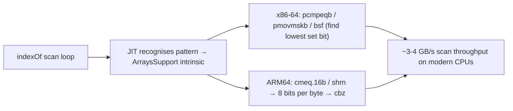

### `equals` and `equalsIgnoreCase`

```java
"hello".equals("hello");          // true
"hello".equals("HELLO");          // false
"hello".equalsIgnoreCase("HELLO");// true
```

`equals(Object)` first checks identity (`this == obj`), then verifies the argument is a `String`, then compares **coders**. If coders match, it falls into `StringLatin1.equals(byte[], byte[])` or `StringUTF16.equals(byte[], byte[])`, both of which call `ArraysSupport.mismatch` — an **intrinsic** the JIT replaces with SIMD code that compares 16/32 bytes at a time.

```
       String.equals fast path:

       1. if (this == obj) return true;
       2. if (!(obj instanceof String)) return false;
       3. if (this.coder != other.coder) return false;
       4. if (this.value.length != other.value.length) return false;
       5. return ArraysSupport.mismatch(this.value, other.value, len) < 0;
```

**Different coders → not equal**, even if the abstract characters are the same. (A LATIN1 `"hello"` and a UTF16 `"hello"` are never produced by the same JDK — Compact Strings always picks the narrower coder when it can — but the JLS leaves it possible to construct one each via reflection or `String(byte[], int)`. Don't rely on this; the JDK normalises.)

`equalsIgnoreCase` is slower — it must walk both strings and apply `Character.toUpperCase` to each code point before comparing. No SIMD shortcut.

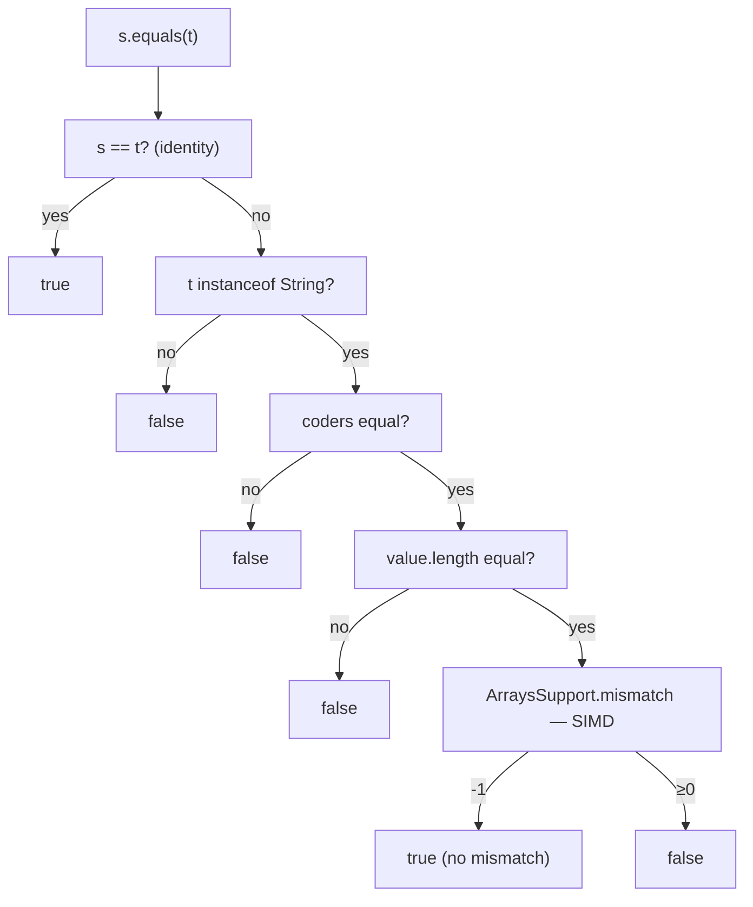

### `compareTo` — Lexicographic by Code Unit

`compareTo` returns a negative / zero / positive `int` based on the **first index where the two strings disagree**, comparing **UTF-16 code units as unsigned 16-bit integers**.

```java
"abc".compareTo("abd");   // -1 (because 'c'=0x63 < 'd'=0x64)
"abc".compareTo("abcd");  // -1 (shorter is smaller after a tied prefix; result is len difference)
"abc".compareTo("abc");   // 0
```

> [!WARNING]
> **`compareTo` is not "alphabetical".** It compares **UTF-16 code unit values**. Surrogate pairs sort by their high surrogate first, which gives a non-Unicode-meaningful order at the supplementary boundary. For human-meaningful collation use `java.text.Collator` (locale-sensitive, much slower).

### `startsWith`, `endsWith`

Both are a length check followed by an `ArraysSupport.mismatch` over the relevant prefix or suffix range. Both run in `O(prefix length)`.

### `replace` — the two versions

There are **two** `replace` methods that confuse a lot of beginners:

```java
"foo".replace('o', 'a');         // "faa"  — char arg version, NO regex
"foo".replace("oo", "ee");        // "fee" — CharSequence version, NO regex
"a.b.c".replaceAll(".", "X");     // "XXXXX" — regex! "." matches anything
"a.b.c".replaceAll("\\.", "X");   // "aXbXc" — escaped dot, literal
"a.b.c".replaceFirst("\\.", "X"); // "aXb.c"
```

The two `replace` overloads are **not** regex. `replaceAll` and `replaceFirst` **are** regex. Pick the right method.

Mechanism: the non-regex versions are a single-pass scan with a build-up `StringBuilder` (or, for `replace(char, char)`, a fresh `byte[]` with byte-wise substitution). The regex versions compile a `Pattern` (cached *only* for the simplest cases) and run it across `this`.

### `split` — also regex

```java
"a,b,c".split(",");        // ["a", "b", "c"]
"a.b.c".split(".");        // ["", "", "", "", ""]  (oops — "." matched everything)
"a.b.c".split("\\.");      // ["a", "b", "c"]
"a,,b".split(",");         // ["a", "", "b"]
"a,,b,".split(",");        // ["a", "", "b"]  (trailing empties removed by default)
"a,,b,".split(",", -1);     // ["a", "", "b", ""] (limit < 0 keeps trailing)
```

> [!WARNING]
> The split arg is a **regex**. `"a.b".split(".")` returns an empty array (every char matched). Use `\\.` (escaped dot) or `Pattern.quote(".")`.

### `trim`, `strip`, `stripLeading`, `stripTrailing`

```java
" hello ".trim();        // "hello" — strips ASCII <= U+0020 from both ends
" hello ".strip();  // "hello" — strips Unicode whitespace (Character.isWhitespace) — Java 11+
```

Use `strip` (Java 11+) for Unicode-correct whitespace removal. `trim` is the legacy ASCII-only version.

### Case conversion

```java
"Hello".toLowerCase();              // "hello" — DEFAULT LOCALE applied
"Hello".toLowerCase(Locale.ROOT);    // "hello" — locale-independent
"İ".toLowerCase(Locale.forLanguageTag("tr")); // "i"  — Turkish dotted-I → dotless i
"İ".toLowerCase(Locale.ROOT);                  // "i̇" — invariant
```

> [!WARNING]
> **Always pass `Locale.ROOT` for machine-meaningful comparisons** (file extensions, protocol tokens). The default locale's case rules vary by host. The Turkish-locale trap is famous: `"FILE.HTML".toLowerCase()` does *not* produce `"file.html"` on a Turkish JVM — it produces `"fı̇le.html"` (dotless ı), and your `.endsWith(".html")` check fails.

### `format` and `printf`

```java
String.format("x = %d, y = %.2f", 7, 3.14159);   // "x = 7, y = 3.14"
System.out.printf("x = %d%n", 7);                 // prints to stdout (no return)
"%s + %s = %s".formatted(1, 2, 3);                // "1 + 2 = 3" — Java 15+
```

Mechanism: a `Formatter` walks the format string, parsing `%`-specifiers (`d` for int, `f` for float, `s` for any object's `toString`, `n` for the platform line separator). Each specifier invokes a typed handler that appends to a `StringBuilder`. **Slow** compared to plain concat or `StringBuilder` — only use it when the format string genuinely matters.

### `join`

```java
String.join(", ", "a", "b", "c");                    // "a, b, c"
String.join(" / ", List.of("alpha", "beta", "gamma")); // "alpha / beta / gamma"
```

Mechanism: a single `StringBuilder` pass over the iterable, separator-aware. Replaces the older `StringBuilder` + `for` loop idiom from pre-Java-8 code.

### `chars()` and `codePoints()` streams

```java
"hello".chars().forEach(c -> System.out.println((char) c));      // print each code unit
"😀hi".codePoints().forEach(cp -> System.out.println(cp));         // 128512, 104, 105
"hello".chars().filter(Character::isLetter).count();              // 5
```

Both return `IntStream`. `chars()` yields code units; `codePoints()` yields code points (and is what you want for any Unicode-aware processing).

### `intern()`

Detailed below. Briefly: looks up `this` in the JVM-wide string pool; if present, returns the pooled `String`; if absent, adds `this` and returns it.

## Text Blocks (Java 15+)

A **text block** is a multi-line String literal delimited by `"""`. The feature, JEP 378, shipped as standard in Java 15. The goals: easy embedding of multi-line content (SQL, JSON, HTML, regex, snippets) without escape-character noise and without the `+ "\n" +` pattern.

### Basic syntax

```java
String html = """
        <html>
            <body>
                <p>Hello</p>
            </body>
        </html>
        """;
```

Rules:

- Opens with `"""` followed immediately by **line terminator** (no content on the opening line).
- Closes with `"""` on its own line (or after the last content character).
- Content is everything between the two delimiters.
- **No special escape semantics inside content other than the usual `\\`, `\"`, `\n`, `\t`, `\s`, and `\<newline>`.**

### Incidental whitespace stripping

This is the clever bit. The compiler determines the **common leading whitespace** of all non-blank lines (including the closing `"""` line) and **strips it from every line**. So you can indent the literal to match the surrounding code, and the indentation **doesn't end up in the final String**.

```java
String html = """
        <html>
            <body>
                <p>Hello</p>
            </body>
        </html>
        """;
// The common-prefix is 8 spaces (matching the closing """).
// After stripping, the literal is:
//   <html>
//       <body>
//           <p>Hello</p>
//       </body>
//   </html>
//
```

```mermaid
flowchart TB
  Src["source code with """"]
  Src --> Lines["split into lines"]
  Lines --> Min["find minimum leading whitespace across all non-blank lines incl. closing \"\"\""]
  Min --> Strip["strip that prefix from every line"]
  Strip --> Tail["trim trailing whitespace from each line"]
  Tail --> Esc["process escapes (\\n, \\s, \\<newline>, …)"]
  Esc --> Result["final String value"]
```

The closing `"""` position **controls** the indent. Move it left, and less is stripped.

### The new escapes

| Escape       | Meaning                                                                |
|--------------|------------------------------------------------------------------------|
| `\s`         | a single space character — survives the trim-trailing pass             |
| `\<newline>` | line continuation — eat the newline (join two source lines into one)   |
| `\<other>`   | same as in regular String literals                                     |

```java
String oneLine = """
        This is one \
        long line.""";
// "This is one long line."

String trailSp = """
        end of line\s
        """;
// "end of line \n"   (\s keeps the space; without it, trim-trailing would remove it)
```

### At the bytecode level — nothing special

> [!IMPORTANT]
> **A text block compiles to a regular `String`.** The compiler does all the stripping at compile time and emits a single `CONSTANT_Utf8` entry with the *final*, post-processing value. At the bytecode level there's **no difference** between a text block and a hand-written regular String with the same text. `ldc #N` loads it like any other literal.

```
javap -c on a text block:

       0: ldc           #N    // String <html>\n    <body>\n...
```

No special opcode, no special class. The compiler is the only thing that distinguishes the two forms.

### When to use text blocks

- **SQL** — multi-line queries without `+ "\n" +`.
- **JSON / XML / HTML** — embed sample payloads in code.
- **Regex** — use `Pattern.compile("""regex""", Pattern.COMMENTS)` to keep the regex readable.
- **Print-templates** — emails, fixture data.

Stick to regular literals for single-line strings; text blocks add noise for them.

## Immutability — Why and What It Buys You

`String` is **immutable**, and that one rule unlocks the design of every other String feature.

### What "immutable" means here

After a `String` is constructed:

- The `byte[] value` field is `private final`.
- No method writes to `value` after the constructor.
- The contents are never mutated.
- All methods that look like mutations return a *new* `String`.

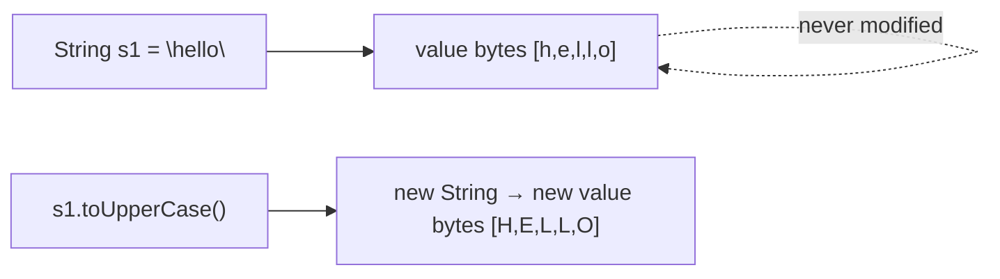

### Five things immutability buys you

1. **Hash caching is safe.** Compute `hashCode()` once, store it in the `hash` field, reuse forever. If a String could mutate, the cache would go stale; without the cache, `HashMap<String, V>` would be much slower.
2. **Safe sharing across threads.** No two threads can ever observe a half-modified String, because no modification ever happens. **No synchronisation is needed** for `String` access. (T03 previewed this; full coverage in `L3/C01`.)
3. **Safe to use as a key.** `HashMap` and `TreeMap` require keys whose `hashCode` / ordering doesn't change after insertion. Immutability guarantees this.
4. **Interning is sound.** The pool deduplicates identical strings *because* identical strings can never diverge after pooling.
5. **Security against TOCTOU.** A *time-of-check-to-time-of-use* attack flips a value between a security check and the actual operation. With immutable Strings, the value used to load a class, check a file path, or open a network URL **cannot** be changed by the caller after the check.

```java
// Real example: ClassLoader.loadClass(String name)
// 1. perform security check on name
// 2. consult the parent loader / find the class
// If String were mutable, an attacker holding a reference could mutate 'name'
// between steps 1 and 2 to bypass the check. Immutability prevents this.
```

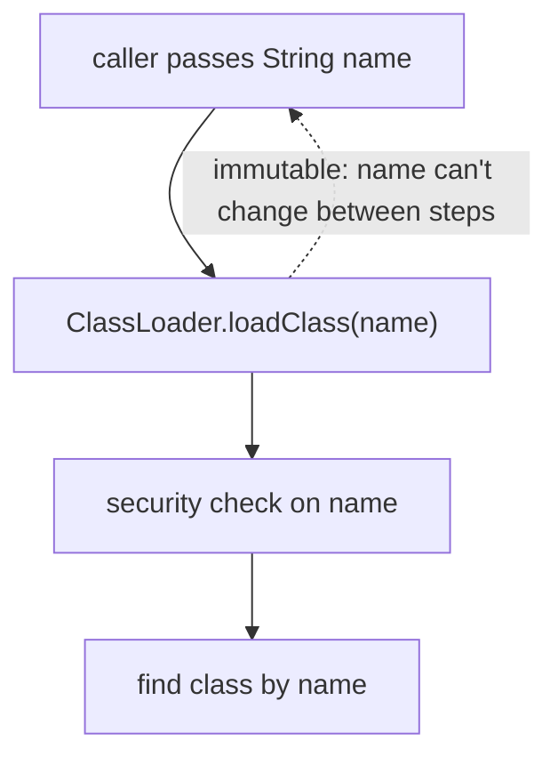

### The pre-7u6 substring story — historical immutability footnote

Before Java 7 update 6, `substring` returned a `String` that **shared the parent's backing array** (it stored an offset and a count instead of copying). Immutability was preserved (no one was modifying the shared array), but two problems showed up:

1. **Memory leak.** Holding a small `substring` of a huge parent kept the entire parent's `char[]` alive. A common bug: parse a huge log file, store a 5-char field per line; the entire log stays in memory.
2. **Security.** Some code patterns assumed `s.substring(...)` returned an independent value; with shared backing, defensive copies were sometimes still required.

The 7u6 change: **always allocate a fresh backing array.** Substring became O(n) in *time and space*, but predictable in *lifetime*. Modern code can assume this.

## String Interning Deep Dive

T03 established: every String literal is automatically added to the JVM's **string pool** at class resolution, and equal literals share a single heap object. Here is the mechanism in full.

### Where the pool lives

In modern HotSpot (Java 7+), the string pool is a **hash table in the heap**, called the **`StringTable`**. Before Java 7 it lived in PermGen (which had a fixed size limit and could `OutOfMemoryError`).

The table is an array of bucket pointers; each bucket is a linked list of `WeakReference<String>` (weak so unused pooled Strings can be GC'd).

```mermaid
flowchart TB
  Pool["StringTable (heap)"] --> A["array of buckets"]
  A --> B0["bucket 0 → null"]
  A --> B1["bucket 1 → entry: \"hello\" → entry: \"world\" → null"]
  A --> Bn["bucket N → ..."]
  B1 --> E1["WeakReference<String> → pooled \"hello\""]
  B1 --> E2["WeakReference<String> → pooled \"world\""]
```

### The lookup algorithm

```
       intern() and literal resolution both use:

       1. compute hash = s.hashCode()
       2. bucket = hash mod table.length
       3. walk the bucket list:
            for each entry e:
              if e.referent != null AND e.referent.equals(s):
                return e.referent   ← reuse
       4. not found: insert s as a new WeakReference at the head of the bucket
       5. return s
```

The walk is **O(bucket length)**. A heavily-loaded pool with too few buckets becomes a hot spot; a too-large pool wastes memory. HotSpot's default table size is generous (~60 013 buckets in modern JDKs) and the size is **tunable**.

### Tuning knobs

| Flag                                  | Effect                                                              |
|---------------------------------------|---------------------------------------------------------------------|
| `-XX:StringTableSize=N`               | Set the number of buckets (default ~60 013; prime numbers preferred). |
| `-XX:+PrintStringTableStatistics`     | At JVM exit, print bucket counts, longest chain, dropped entries.     |
| `-XX:+UseStringDeduplication`         | G1 GC can deduplicate `byte[]`s with identical content even across non-pooled Strings. |

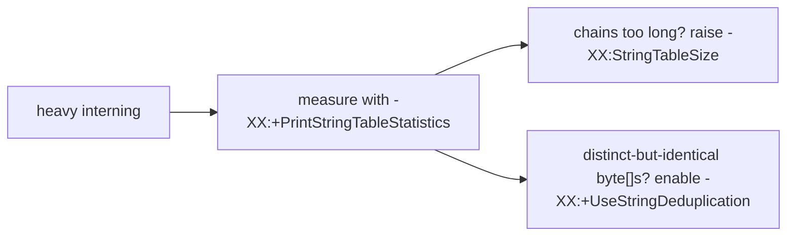

### `String.intern()` from user code

```java
String a = new String("hello");    // fresh heap object
String b = a.intern();              // returns the pooled "hello" (which is the same object as the literal "hello")
String c = "hello";                 // the literal — already pooled

System.out.println(a == b);   // false — a is the fresh, b is the pooled
System.out.println(b == c);   // true  — same pooled object
```

### When to intern (and when not to)

**Use** intern when you have **lots of repeated short Strings from runtime sources** that you want to deduplicate (e.g. column names parsed from a CSV header, JSON keys parsed from API responses, MIME types). The pool deduplicates them; downstream `==` (or `HashMap` lookup) is faster, and you save memory.

**Don't** intern when:

- The data is **unbounded distinct** (random IDs, UUIDs) — you'll bloat the pool, slow lookups, and pressure GC.
- The Strings are already literals (they're auto-pooled at class resolution).
- The Strings are throw-away (parsing once, never reusing).

> [!WARNING]
> **`intern()` is not free.** It's a hash lookup + (sometimes) an insert + (always) a sync point against the global table. Use it for *deduplication of repeated data*, not as a magic speed-up.

## String Concatenation — `invokedynamic StringConcatFactory`

The `+` operator on Strings (T04) has the **only** user-visible operator overload in Java. The mechanism for *how* it works at the bytecode level changed dramatically in Java 9.

### Pre-Java 9 — `StringBuilder` chains

`javac` translated `"x = " + x + ", y = " + y` into:

```
new java/lang/StringBuilder
dup
invokespecial StringBuilder.<init>:()V
ldc "x = "
invokevirtual StringBuilder.append:(Ljava/lang/String;)Ljava/lang/StringBuilder;
iload x
invokevirtual StringBuilder.append:(I)Ljava/lang/StringBuilder;
ldc ", y = "
invokevirtual StringBuilder.append:(Ljava/lang/String;)Ljava/lang/StringBuilder;
iload y
invokevirtual StringBuilder.append:(I)Ljava/lang/StringBuilder;
invokevirtual StringBuilder.toString:()Ljava/lang/String;
```

That's **one `StringBuilder` object** + one **`char[]`** (`byte[]` post-9 inside `StringBuilder`) + however many `append` calls. The builder grows its internal array on demand, doubling capacity when full. For long-tailed concats, **rebuilding the array N times** is wasted work.

### Java 9+ — `invokedynamic` to `StringConcatFactory`

JEP 280 replaced the StringBuilder-chain bytecode with a **single `invokedynamic`** call:

```
ldc "x = "
iload x
ldc ", y = "
iload y
invokedynamic #N  // makeConcatWithConstants("\1\1", [String, int, String, int])
```

(Each operand for the concat is pushed to the operand stack, then `invokedynamic` consumes them all and produces the final `String`.)

```mermaid
flowchart LR
  Src["\"x = \" + x + \", y = \" + y"] --> JC["javac"]
  JC --> Idy["single invokedynamic to StringConcatFactory.makeConcatWithConstants"]
  Idy --> Boot["bootstrap method (called once)"]
  Boot --> MH["builds a CallSite holding an optimised MethodHandle"]
  Idy --> Call["subsequent calls invoke the MethodHandle directly"]
```

### The recipe string

The bootstrap argument is a **recipe** describing the shape of the concat:

| Char in recipe   | Meaning                                                  |
|------------------|----------------------------------------------------------|
| `\1` (0x01)      | take next *dynamic* operand from the stack               |
| `\2` (0x02)      | take next *constant* from the bootstrap's static-arg list |
| any other char   | a literal character in the output                         |

For `"x = " + x + ", y = " + y`, the recipe might be `"x = , y = "` (with `"x = "` and `", y = "` baked in as literal characters in the recipe itself) — the exact encoding depends on which `javac` strategy was picked.

### Bootstrap and link

The first time the `invokedynamic` is executed:
1. The bootstrap method `StringConcatFactory.makeConcatWithConstants` is called.
2. It builds a specialised `MethodHandle` that:
   - knows the **exact number** of operands and their types (so it can pre-size the output buffer perfectly — no doubling),
   - knows the **literal segments** to interleave,
   - knows the **coder strategy** (LATIN1 or UTF16) at the type level.
3. The `CallSite` is permanently bound to that `MethodHandle`.

Subsequent calls jump straight to the MethodHandle — no factory call, no allocation of a StringBuilder, often no intermediate buffer.

```mermaid
flowchart TB
  First["first execution of invokedynamic site"] --> SCF["StringConcatFactory.makeConcatWithConstants"]
  SCF --> MH["build MethodHandle"]
  MH --> CS["bind to CallSite"]
  Next["subsequent executions"] --> CS
  CS --> Out["call MH directly → final String"]
```

### Why this is faster

- **Single allocation.** The MethodHandle computes total length up front and allocates the final `byte[]` exactly once.
- **No StringBuilder object.** No 32-byte builder + initial 16-byte array.
- **JIT inlines.** The MethodHandle is a hot path the JIT can inline and specialise per-call-site, removing the boxing of primitive operands.
- **Coder-aware.** If all operands are LATIN1, the result is built as LATIN1 directly — no scan-then-rebuild.

For a hot-path concat in a server log line, this can be **30-50% faster** and produce **half the garbage** versus the pre-9 mechanism.

### Lifetime of intermediate Strings

In the StringBuilder model, intermediates were: one `StringBuilder` (32 + initial array) + many `append` calls + one `toString()` (which copies the builder's array into a new `String`). All of those are short-lived garbage.

In the `invokedynamic` model, **the only allocation is the final `String` and its `byte[]`.** Intermediates exist only as values on the operand stack and registers — they don't escape to the heap.

> [!INTERVIEW]
> **"How does `"x = " + x` compile in modern Java?"** Java 9+ emits a single `invokedynamic` calling `StringConcatFactory.makeConcatWithConstants`. The bootstrap binds a specialised `MethodHandle` that allocates the result exactly once. The pre-Java-9 mechanism was a `new StringBuilder().append(...).append(...).toString()` chain. JEP 280.

## Strings in Hardware — SIMD on x86-64 and ARM64

The hot String methods — `equals`, `indexOf`, `hashCode`, `compareTo` — are **intrinsified** by HotSpot. When the JIT sees a call to one of these methods, it replaces the byte-by-byte loop with a hand-written SIMD code template.

### `String.equals` → `ArraysSupport.mismatch`

The mismatch helper compares two byte arrays and returns the **first index where they differ**, or `-1` if they're equal. The JIT's intrinsic uses:

- **SSE2** (always available on x86-64): `pcmpeqb xmm0, xmm1` compares 16 bytes in parallel → 16-bit mask in `xmm0`; `pmovmskb eax, xmm0` extracts the mask; `cmp eax, 0xFFFF` checks for full equality; `bsf eax, eax_inv` finds the first mismatching bit.
- **AVX2** (CPUs ≥ Haswell): `vpcmpeqb ymm0, ymm1` compares **32 bytes**; same downstream.
- **AVX-512** (newer server CPUs): 64 bytes per compare.
- **ARM64 NEON**: `cmeq.16b v0, v1, v2` compares 16 bytes; `shrn` reduces to a single 64-bit value; `cbz` branches on zero.

```mermaid
flowchart LR
  Java["String.equals(t)"] --> Mis["ArraysSupport.mismatch (intrinsic)"]
  Mis --> X86["x86-64 SSE2: pcmpeqb xmm0,xmm1 (16 bytes/iter)"]
  Mis --> AVX["x86-64 AVX2: vpcmpeqb ymm0,ymm1 (32 bytes/iter)"]
  Mis --> ARM["ARM64 NEON: cmeq.16b v0,v1,v2 (16 bytes/iter)"]
  X86 --> Speed["~10-30 GB/s scan rate on modern CPUs"]
  AVX --> Speed
  ARM --> Speed
```

```asm
; x86-64 SSE2 equals fast path (simplified):
xor     eax, eax
loop:
  movdqu  xmm0, [rdi + rax]   ; load 16 bytes from this.value
  movdqu  xmm1, [rsi + rax]   ; load 16 bytes from other.value
  pcmpeqb xmm0, xmm1          ; per-byte compare → 0xFF/0x00 per lane
  pmovmskb edx, xmm0          ; extract one bit per byte → 16-bit mask
  cmp     edx, 0xFFFF         ; all bytes equal?
  jne     mismatch
  add     rax, 16
  cmp     rax, rcx            ; reached end?
  jb      loop
  mov     eax, -1             ; full match
  ret
mismatch:
  not     edx
  bsf     edx, edx            ; first set bit = first mismatching byte
  add     eax, edx
  ret
```

### `String.indexOf(char)` → vectorised scan

The single-char `indexOf` scans `value` for the target byte/halfword. The intrinsic broadcasts the target into all 16 (or 32) lanes of an XMM/YMM register, then per iteration:

1. Load 16 bytes of `value`.
2. `pcmpeqb` against the broadcast target.
3. `pmovmskb` → mask.
4. If nonzero, `bsf` to find the first match.

```mermaid
flowchart LR
  Target["target char (e.g., 'o')"] --> BC["broadcast: xmm1 = oooooooooooooooo"]
  Buf["value bytes (16 at a time into xmm0)"] --> Cmp["pcmpeqb xmm0, xmm1"]
  BC --> Cmp
  Cmp --> Mask["pmovmskb → bitmask"]
  Mask --> Z["mask zero? continue"]
  Mask --> NZ["mask nonzero? bsf → first match index"]
```

### `String.hashCode` → vectorised Horner

The hash polynomial `h = 31·h + c` is a sequential dependency — each step depends on the previous `h`. The trick: **unroll** by N, so each iteration computes `h = 31^N · h + (31^(N-1)·c0 + ... + cN-1)`. The interior polynomial has no `h` dependency, so SIMD can compute it. `ArraysSupport.vectorizedHashCode` does exactly this.

### Recognising the intrinsic boundary

The methods are annotated `@IntrinsicCandidate` in the JDK source. When the JIT compiles a call to one, it looks up the intrinsic in its intrinsic table and substitutes the SIMD template **instead of compiling the Java body**. The bytecode says `invokestatic ArraysSupport.mismatch`, but the JIT emits the SIMD asm directly.

```
-XX:+PrintInlining       — see which methods are inlined and which are intrinsified
-XX:+UnlockDiagnosticVMOptions -XX:+PrintIntrinsics
                          — list all intrinsics applied
-XX:+PrintAssembly        — view the JIT-generated native code
                          (requires hsdis lib)
```

> [!INTERVIEW]
> **"How does `String.equals` perform on long strings?"** Modern JDKs intrinsify it to a SIMD compare (SSE2 16 bytes / AVX2 32 bytes / NEON 16 bytes) via `ArraysSupport.mismatch`. Throughput is on the order of memory bandwidth — ~10-30 GB/s on modern CPUs. The fast-path of equals is identity (`this == obj`); next is coder + length checks; the SIMD scan runs only when both pass.

## Lifetime — Where String Pieces Live

Per the depth bar's §4a, let's pin down the lifetime story for the moving parts of a `String`.

| Piece                  | Where it lives             | Allocated when                   | Reclaimed when                    |
|------------------------|----------------------------|----------------------------------|-----------------------------------|
| Local `String` var     | stack frame (a 4-byte compressed reference) | method entry / `astore` | frame pop (reference) — heap object reclaimed when no live ref remains |
| Pooled literal         | string pool (in heap)      | first class load that uses it    | class unload + no other references (rare; pooled Strings effectively live forever in most apps) |
| `new String(...)`      | heap                       | `new` opcode                     | GC when no live ref               |
| `value` byte[]         | heap                       | inside the `String` constructor  | GC after the wrapping `String` is GC'd (no other references to the array — `value` is `private`) |
| `intern()`-ed runtime String | string pool          | first `intern()` call            | when the pool's `WeakReference` reachability drops to zero |
| Intermediate concat    | (Java 9+) operand stack and registers; never escapes | during `invokedynamic` call | end of MethodHandle call           |
| Intermediate concat    | (pre-9) StringBuilder object + char[] | first append             | end of method (StringBuilder is short-lived) |

```mermaid
flowchart TB
  Lit["String literal in source"] --> Pool["pooled at class resolution → lives ~forever"]
  Run["new String(...)"] --> Heap["lives in heap until unreferenced"]
  Run2["s.substring(...)"] --> Fresh["fresh String + fresh byte[]; substring lifetime independent of parent"]
  Run3["s + t (Java 9+)"] --> Final["only the final String + its byte[] are allocated"]
```

## Common Mistakes

```java
// 1. length() != number of "characters" you see.
"😀".length();           // 2 — but it's one emoji.

// 2. == on Strings.
String a = "abc";
String b = new String("abc");
a == b;                   // false   — different objects
a.equals(b);              // true    — equal contents

// 3. new String("literal") — wastes a heap object.
String s = new String("hi");    // bad
String s = "hi";                 // good

// 4. + in a loop is O(n²) — use StringBuilder.
String out = "";
for (int i = 0; i < N; i++) out += i + ",";   // bad — N concats, each O(out.length)
                                                // (Java 9+ invokedynamic helps a little, but the cost still grows)

StringBuilder sb = new StringBuilder();         // good
for (int i = 0; i < N; i++) sb.append(i).append(',');
String out = sb.toString();

// 5. NPE on null.equals(...). Use Objects.equals or literal.equals(maybe).
maybeNull.equals("x");          // NPE if maybeNull is null
"x".equals(maybeNull);          // returns false safely
Objects.equals(maybeNull, "x"); // safe both ways

// 6. replace vs replaceAll. The "All" version is regex.
"a.b.c".replace(".", "/");      // "a/b/c"   — literal
"a.b.c".replaceAll(".", "/");   // "/////"   — regex! "." matches everything

// 7. split is regex too.
"a.b.c".split(".");             // ["", "", "", "", ""] — regex "." matches everything
"a.b.c".split("\\.");           // ["a", "b", "c"]
"a.b.c".split(Pattern.quote("."));  // ["a", "b", "c"]

// 8. compareTo is NOT alphabetical — it's UTF-16 code-unit order.
"Z".compareTo("a");             // negative — 'Z'=0x5A < 'a'=0x61
"a".compareToIgnoreCase("B");   // negative — case-folded compare

// 9. Locale-sensitive case conversion.
"FILE.HTML".toLowerCase();                // host-locale; Turkish JVM: "fı̇le.html"
"FILE.HTML".toLowerCase(Locale.ROOT);     // always "file.html"

// 10. Latin-1 boundary trap.
String s = "a".repeat(1_000_000_000);    // 1 GB of LATIN1 — ~1 GB heap
String t = s + "€";                       // result is UTF16 — ~2 GB heap

// 11. Surrogate-aware code shouldn't use length().
"😀abc".length();                // 5 (😀 is 2 code units + "abc" 3)
"😀abc".codePointCount(0, 5);    // 4
```

> [!INTERVIEW]
> Reliable Strings questions:
> - **"Is `String` immutable? Why?"** Yes — `value` is `final`, no method mutates. Buys: hash caching, thread-safe sharing, safe interning, safe map keys, TOCTOU defence.
> - **"What's `String.length()` for `"😀"`?"** 2 — number of UTF-16 code units. Use `codePointCount` for code points.
> - **"What does `new String("hello") == "hello"` return?"** false — different objects. Use `.equals`.
> - **"Where does the String pool live?"** Heap, since Java 7 (was PermGen before). Implemented as a `WeakReference` hash table — the `StringTable`.
> - **"What changed about substring in 7u6?"** Old: shared the parent's char[]. New: copies into a fresh array — fixes memory-leak risk; cost is O(n) per substring.
> - **"What's Compact Strings?"** JEP 254 (Java 9). `String.value` became `byte[]` plus a `coder` byte; LATIN1 strings use 1 byte/char instead of 2. ~50% heap savings on real workloads. `-XX:-CompactStrings` disables.
> - **"How does `+` work in modern Java?"** Java 9+ (JEP 280): a single `invokedynamic` call to `StringConcatFactory.makeConcatWithConstants`. The bootstrap binds a `MethodHandle` that allocates the result exactly once.
> - **"How does `String.equals` perform on long strings?"** Intrinsified via `ArraysSupport.mismatch` to SIMD (SSE2 `pcmpeqb` / AVX2 `vpcmpeqb` / ARM64 NEON `cmeq`), 16-32 bytes per iteration, ~memory bandwidth.
> - **"What's a surrogate pair?"** Two `char`s encoding one supplementary code point (≥ `U+10000`). High surrogate `0xD800`–`0xDBFF` + low surrogate `0xDC00`–`0xDFFF`. The pair decodes to `((hi - 0xD800) << 10 | (lo - 0xDC00)) + 0x10000`.
> - **"When should you `intern()` at runtime?"** When you have lots of repeated short Strings from runtime sources (CSV headers, JSON keys, MIME types) that benefit from deduplication. Avoid for unbounded distinct data (UUIDs).
> - **"Why is `text-block` not its own class?"** It isn't. Text blocks are pure compile-time syntax. They produce the same `String` object the equivalent regular literal would.

## Practice

1. **`new` vs literal identity.** Write a class that defines `String a = "hello"; String b = "hello"; String c = new String("hello"); String d = c.intern();`. Print `a == b`, `a == c`, `a == d`. Predict each, then run. Explain in terms of the pool.
2. **Memory layout via JOL.** Add the JOL dependency (`org.openjdk.jol`). Run `System.out.println(GraphLayout.parseInstance("hello").toFootprint())`. Compare with the byte count this topic predicted (32 + 24 = 56). Then do the same for a 100-char ASCII String and for a 100-char Chinese String — explain the difference using Compact Strings.
3. **Coder check.** Use reflection to read the private `coder` field of a `String`. Confirm: `"hello"` is LATIN1 (0), `"héllo"` is LATIN1 (0), `"中文"` is UTF16 (1). Now do `"hello" + "中"`; what coder is the result?
4. **Surrogate-pair worked example.** Take the emoji `"😀"` (U+1F600). By hand, compute the high and low surrogates using the encoding rule. Verify with `(int) "😀".charAt(0)` and `(int) "😀".charAt(1)`.
5. **`length()` vs code points.** Write code that for each of `"abc"`, `"café"`, `"中文"`, `"😀"`, `"a😀b"` prints `s.length()` and `s.codePointCount(0, s.length())`. Explain each mismatch.
6. **Code-point iteration.** Print every code point of `"H😀ello, 🌍!"` along with its hex value. Use `codePoints()`. Now do the same with `chars()` and observe surrogate halves explicitly.
7. **The substring copy.** Write `String parent = "a".repeat(1_000_000_000);` and `String child = parent.substring(0, 5);`. Set `parent = null;` and explicitly call `System.gc();`. Confirm with a heap dump (or `Runtime.getRuntime().freeMemory()`) that the parent's bytes are reclaimed. Then add `-XX:+UnlockDiagnosticVMOptions -XX:+VerifyBeforeGC` to be sure.
8. **Compact Strings memory math.** Run a tight loop creating 1 000 000 `"hello"` (Latin-1) Strings versus 1 000 000 `"中文"` (UTF-16) Strings. Measure heap with `Runtime.totalMemory() - Runtime.freeMemory()`. Compute the expected difference (1 char/byte vs 2 bytes/char in the value byte[]). Now run with `-XX:-CompactStrings`. What happens to the first measurement?
9. **Text-block incidental whitespace.** Write three text blocks, varying the indentation of the closing `"""` (8 spaces, 4 spaces, 0 spaces). Print the result of each. Use `.replace(' ', '.')` to make leading spaces visible. Match each result to JEP 378's stripping rule.
10. **`javap` an `invokedynamic` concat.** Write a method `String f(int x, int y) { return "x=" + x + ",y=" + y; }`. Run `javap -c` and `javap -v`. Find the `invokedynamic` line, then the `BootstrapMethods` attribute with `makeConcatWithConstants` and the recipe string. Identify the `` markers.
11. **`StringConcatFactory` allocation count.** Use the JOL or `Runtime.getRuntime().totalMemory()` to measure allocation per concat. Compare `"x=" + x + ",y=" + y` versus the explicit `new StringBuilder().append("x=").append(x)... .toString()`. Quantify the difference.
12. **Pool size tuning.** Run a workload that interns 1 000 000 distinct short Strings. Add `-XX:+PrintStringTableStatistics -XX:StringTableSize=131_071`. Observe the bucket count, longest chain, and lookup count. Now run with `-XX:StringTableSize=1_009` and observe the slowdown. Why?
13. **Pre-7u6 substring leak (simulation).** Implement a `MySharedSubstring` class (wrapping a `byte[]` + `offset` + `length`) and a `MyCopiedSubstring` class. Build a 1 GB `byte[]`, take 1000 5-byte substrings of each kind, drop the parent. Observe the heap. This is the bug the 7u6 fix removed.
14. **Locale trap.** Set `Locale.setDefault(Locale.forLanguageTag("tr"));` then run `"FILE.HTML".toLowerCase().endsWith(".html")`. What's the result? Now use `.toLowerCase(Locale.ROOT)`. Explain.
15. **SIMD inspection.** Write a method `boolean eq(String a, String b) { return a.equals(b); }`. Run with `-XX:+UnlockDiagnosticVMOptions -XX:+PrintIntrinsics -XX:+PrintAssembly`. Find the intrinsic for `String.equals` / `ArraysSupport.mismatch`. Identify the `pcmpeqb` / `vpcmpeqb` (x86) or `cmeq.16b` (ARM64) instruction.
16. **Hash-collision probe.** Find two short Strings that hash to the same `int` (the famous `"Aa".hashCode() == "BB".hashCode()` pair: 2112). Insert both into a `HashMap`; verify they share a bucket via debugger. Why doesn't this break the map?
17. **Explain it back.** Trace `"x=" + x + ",y=" + y` from source through bytecode through the bootstrap-and-CallSite mechanism through the final byte[] allocation, naming each step. How many allocations occur the first time the line runs? The second time?

## Recap

You should now be able to:

- Describe `String` as an **immutable reference type** — variable holds a pointer; characters live in a separate `byte[]` on the heap; methods that look like mutations return new Strings.
- Distinguish **literal vs `new String(...)`** identity: literals are auto-interned at class resolution (T03), `new String(literal)` allocates a fresh object you almost never want.
- Draw the **byte-level layout** of a `String` instance — header (12) + coder byte (1) + hash int (4) + value reference (4 compressed) + padding ⇒ ~32 bytes — plus the **separate `value` `byte[]`** with its own 16-byte header and the actual character bytes.
- Explain **Compact Strings** (Java 9, JEP 254): `value` is `byte[]` plus a `coder` byte (`LATIN1=0` / `UTF16=1`); ASCII/Latin-1 Strings use **1 byte/char** instead of 2, saving ~50% of String heap on typical server workloads. The Latin-1 *boundary trap* (one non-Latin-1 char inflates the entire array to 2 bytes/char). `-XX:-CompactStrings` disables (rarely useful).
- Trace the **char vs code point** model: `char` is a UTF-16 *code unit* (16 bits); the BMP fits in one code unit; **supplementary** code points (`U+10000`–`U+10FFFF`) require a **surrogate pair** — a high surrogate (`0xD800`–`0xDBFF`) plus a low surrogate (`0xDC00`–`0xDFFF`). Encode CP↔pair with the `(CP - 0x10000) >> 10` / `& 0x3FF` rule. Use `codePointAt` / `codePoints()` for Unicode-aware logic; `length()` returns code-unit count (so `"😀".length() == 2`). **This is the closure of the T02 surrogate-pair flag.**
- Use the **String API** with awareness of mechanism — `substring` always copies (post-7u6); `indexOf` / `equals` / `hashCode` are intrinsified; `replace` is *not* regex (the two `String` overloads), `replaceAll` / `replaceFirst` / `split` *are* regex; `compareTo` is **UTF-16 code-unit lexicographic** order, not alphabetical; `toLowerCase` is locale-sensitive unless you pass `Locale.ROOT`.
- Author **text blocks** (Java 15, JEP 378) — `"""..."""` syntax, **incidental-whitespace stripping** anchored by the closing `"""` indent, the new escapes `\s` (preserve trailing space) and `\<newline>` (line continuation). A text block compiles to **the same `String` and the same `CONSTANT_Utf8` entry** as the equivalent regular literal.
- Explain **why immutability** is the design pivot: hash caching, thread-safety, safe interning, safe map keys, **TOCTOU defence** in class loading / file paths / network calls. Recall the pre-7u6 substring footnote.
- Explain the **string-pool deep dive**: a heap-resident `WeakReference` hash table (`StringTable`), bucket count tunable via `-XX:StringTableSize`, observability via `-XX:+PrintStringTableStatistics`, and that `intern()` does a lookup-or-insert. Use intern for repeated runtime data; avoid for unbounded distinct values.
- Trace **`StringConcatFactory` invokedynamic** (Java 9+, JEP 280): a single `invokedynamic makeConcatWithConstants` replaces the old `StringBuilder` chain; the bootstrap method builds a specialised `MethodHandle` once per call site; subsequent executions allocate **only the final `String` and its `byte[]`**. Faster, less garbage, JIT-friendly.
- Recognise **SIMD intrinsics** on `String.equals` / `indexOf` / `hashCode` — `ArraysSupport.mismatch` maps to **x86-64 SSE2 `pcmpeqb` / AVX2 `vpcmpeqb`** or **ARM64 NEON `cmeq.16b`** at 16-32 bytes per cycle. Observe with `-XX:+PrintIntrinsics` and `-XX:+PrintAssembly`.
- Predict **byte-level lifetimes**: the local variable lives in the stack frame; the wrapper String and its `byte[]` live on the heap (collected when unreferenced); the pooled literal lives ~forever; a `substring` produces independent storage; concat intermediates in Java 9+ never escape to the heap.
- Avoid the **common traps**: `==` on Strings, `new String("literal")`, `+` in tight loops, NPE on `null.equals`, regex confusion between `replace`/`replaceAll`/`split`, locale-sensitive case conversion, and the Latin-1-boundary heap inflation.

## Next

Continue to [StringBuilder / StringBuffer](./T07-stringbuilder-stringbuffer.md).
