# StringBuilder / StringBuffer

T06 left a punch-line dangling. `String` is **immutable**: every method that *looks* like a mutation — `concat`, `replace`, `substring`, `toLowerCase`, `+` — actually allocates a fresh `String` (and a fresh backing `byte[]`). For a single line of code that's fine. For a *loop* that builds a result piece by piece, it's catastrophic: `N` concatenations allocate `N` Strings and copy a growing prefix `N` times — **O(N²) bytes** moved, **O(N²) GC pressure**, **O(N²) cache misses**. A 10 000-element CSV becomes a tens-of-millions-of-bytes copy storm.

The fix is exactly what every textbook reaches for: a **mutable buffer** — a single object whose internal `byte[]` you append into, growing it lazily when full, and *materialise* into a real `String` exactly once at the end. The JDK ships two of them. **`StringBuffer`** has been in Java since 1.0 and synchronises every method; **`StringBuilder`** was added in Java 5 and skips the synchronisation. Their bodies are otherwise identical — both extend the package-private base class **`AbstractStringBuilder`**, which holds the actual buffer state and contains the *real* code.

This topic dissects the buffer in the same depth T06 dissected `String`: the **field-level layout** (`byte[] value` capacity vs `int count` length, the **`coder`** byte that parallels Compact Strings), the **append API** and what each overload writes into the buffer at the byte level, the **growth strategy** (initial capacity, the double-and-add-2 rule, the `arraycopy`/`memcpy` cost), the **inflate path** that switches Latin-1 → UTF-16 mid-stream, the `toString()` allocation, the **`synchronized` cost** that makes `StringBuilder` 5-10× faster than `StringBuffer`, and the deeply important **JIT escape-analysis** transformation that — when a `StringBuilder` doesn't escape its method — **erases the allocation entirely**. By the end you'll understand why Java 9+ `invokedynamic` concat (T06) is *that* fast: not because it skipped the StringBuilder, but because the StringBuilder it conceptually uses is *never allocated at runtime*.

> [!NOTE]
> Prerequisites: [Variables & Primitive Types](./T02-variables-and-primitive-types.md) (`L0/C02/T02`) — `byte`, `char`, the JVM stack frame, object headers; [Operators](./T04-operators-arithmetic-relational-logical-bitwise-assignment.md) (`L0/C02/T04`) — `+` on Strings, the operator that *used to* always lower to a `StringBuilder` chain; [Type Conversion & Casting](./T05-type-conversion-and-casting.md) (`L0/C02/T05`) — `Object` → `String` conversion via `String.valueOf`; [Strings & Text Blocks](./T06-strings-and-text-blocks.md) (`L0/C02/T06`) — String immutability, Compact Strings (LATIN1/UTF16 coder), the modern `invokedynamic StringConcatFactory` mechanism; [Source to Bytecode to JVM to Machine Code](../C01-cs-foundations/T04-source-to-bytecode-to-jvm-to-machine-code.md) (`L0/C01/T04`) — `.class` constant pool, operand stack, `invokevirtual`/`invokespecial`.

## Why a Mutable Buffer? The Quadratic-Concat Problem

The cost of `String` immutability shows up in any code that builds a result incrementally:

```java
String csv = "";
for (int i = 0; i < N; i++) {
    csv = csv + values[i] + ",";   // each + allocates a NEW String
}
```

At iteration `i`, the LHS holds a `String` of length ≈ `i × avg_field_width`. The `+` allocates a brand-new String of length ≈ `(i+1) × avg`, copying the entire LHS into it. Summing the work across all iterations:

```
       Total bytes copied:
           c × 1 + c × 2 + c × 3 + ... + c × N
         = c × N × (N+1) / 2
         ≈ O(N²)
```

For `N = 10 000` and `c = 20`, that's ~1 GB of bytes copied and ~10 000 short-lived `String` + `byte[]` allocations the GC has to clear. **Quadratic blow-up.**

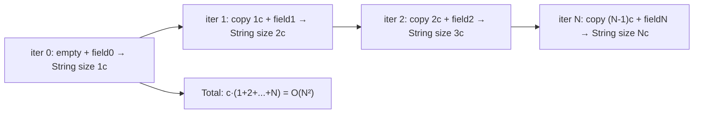

The fix is conceptually simple: **don't reallocate on every append.** Pre-allocate a buffer that's bigger than you need, write into it at the current length, grow it only when actually full. Now each append is O(1) amortised, and the whole loop is O(N).

```java
StringBuilder sb = new StringBuilder(N * 24);   // pre-size based on expected length
for (int i = 0; i < N; i++) {
    sb.append(values[i]).append(',');
}
String csv = sb.toString();
```

This is the contract `StringBuilder` implements. The rest of this topic is *how it actually works underneath*.

> [!INTERVIEW]
> **"Why is `s = s + x` in a loop quadratic?"** Because `String` is immutable: each `+` allocates a fresh String containing the entire previous content plus `x`, copying the entire prefix. Sum of prefix lengths from 1 to N is `N·(N+1)/2`, i.e. **O(N²)**. The fix is `StringBuilder`, which appends into a single growing buffer in amortised O(1) per character.

## The Type Hierarchy

Both buffer classes share a hierarchy:

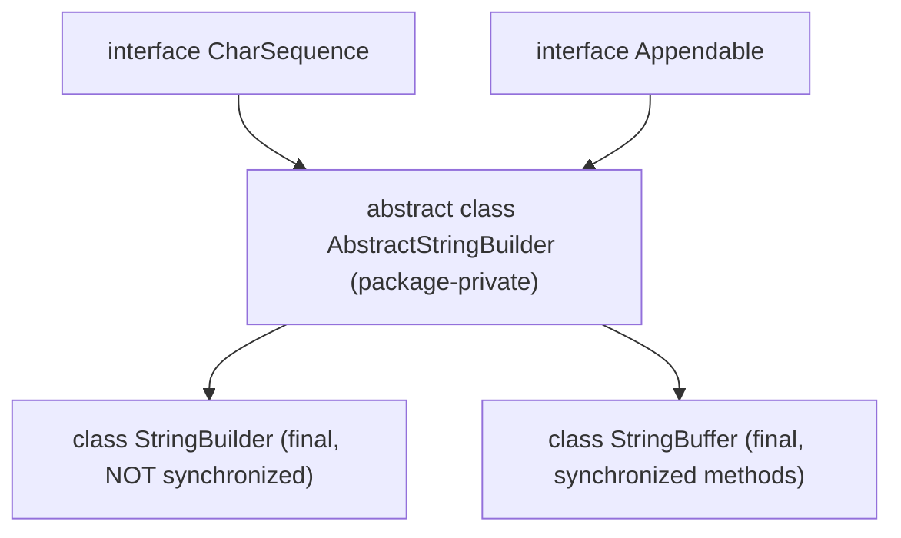

- **`CharSequence`** — read-only view of a sequence of `char`s (`length()`, `charAt(int)`, `subSequence(int, int)`). `String`, `StringBuilder`, `StringBuffer`, and `CharBuffer` all implement it.
- **`Appendable`** — write-only "I can be appended to" interface (`append(CharSequence)`, `append(CharSequence, int, int)`, `append(char)`). Used by `Formatter`, `PrintWriter`, etc.
- **`AbstractStringBuilder`** — the **package-private** base class that contains the actual buffer state (the `byte[]`, the `count`, the `coder`) and all the real logic for `append`, `insert`, `delete`, `replace`, `reverse`, growth, etc. You can't refer to it directly from user code; it exists to share code between `StringBuilder` and `StringBuffer`.
- **`StringBuilder`** — final class, no synchronization. Single-thread fast path.
- **`StringBuffer`** — final class, every public method is `synchronized`. Survives from Java 1.0; predates `StringBuilder` by years.

The crucial fact: **both buffers have identical fields and identical algorithms.** `StringBuilder.append(String s)` calls `super.append(s)` (the `AbstractStringBuilder` body) unsynchronized; `StringBuffer.append(String s)` is `synchronized` and *also* calls `super.append(s)`. So the only difference is the `synchronized` keyword — and (as we'll see) a `toStringCache` field that `StringBuffer` keeps to short-circuit redundant `toString` calls.

## Inside the Buffer — Field-Level Layout

`AbstractStringBuilder` carries three fields:

```java
abstract class AbstractStringBuilder implements Appendable, CharSequence {
    byte[] value;    // the backing array — the CAPACITY
    byte   coder;    // 0 = LATIN1, 1 = UTF16 (parallels Compact Strings)
    int    count;    // the USED LENGTH in code units (NOT in bytes)
}
```

Two things to internalise immediately:

- **`value.length` is the *capacity***, not the length. It's how many code units fit before the next grow.
- **`count` is the *length***, not the bytes. With `coder = UTF16`, two bytes per code unit, so the bytes-used is `count * 2`; with `coder = LATIN1`, it's `count`.

```
       StringBuilder instance (64-bit JVM, compressed oops):

       byte 0..7    mark word                  (8 bytes)
       byte 8..11   klass pointer              (4 bytes, compressed)
       byte 12..15  count (int)                (4 bytes)
       byte 16      coder (byte)               (1 byte)
       byte 17..19  (padding to align value ref)
       byte 20..23  value (compressed byte[] ref)
       byte 24..27  (padding so the object is 8-aligned)
                                              ─────
                                               24 bytes per StringBuilder wrapper

       (StringBuffer also has a transient String toStringCache field — adds 4 bytes + padding ⇒ 32 bytes)
```

And the backing array (capacity 16, default, LATIN1):

```
       value byte[16] (capacity 16, LATIN1, empty buffer):

       byte 0..7    mark word                  (8)
       byte 8..11   klass pointer              (4)
       byte 12..15  length = 16                (4)
       byte 16..31  16 bytes of payload        (uninitialised / zero-filled)
                                              ─────
                                               32 bytes total
```

So a freshly-defaulted `StringBuilder()` already costs **24 + 32 = 56 bytes** before you've appended anything. That overhead is constant regardless of how many appends you do — which is exactly why you want one buffer for the loop, not one per append.

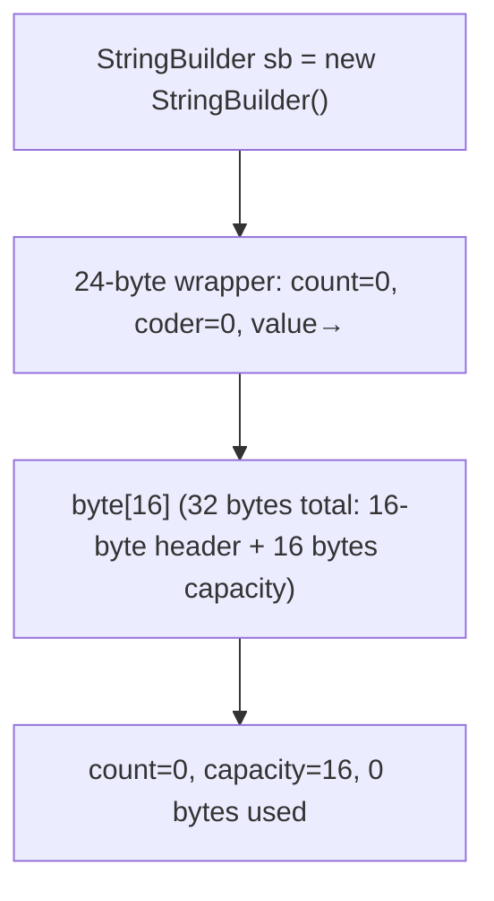

### `count` vs `value.length` — the capacity-vs-length distinction

This is the most useful mental model from this whole topic. Whenever you reason about a `StringBuilder`:

| Concept            | Field                  | Meaning                                                      |
|--------------------|------------------------|--------------------------------------------------------------|
| **Length** (code units used) | `count`         | Number of code units the user has written; what `length()` returns. |
| **Capacity** (slots available) | `value.length` | Size of the backing array — including unused tail.            |
| **Bytes used in `value`** | depends on `coder` | `count` if LATIN1; `count * 2` if UTF16.                      |
| **Bytes free in `value`** | depends on `coder` | `value.length - count` if LATIN1; `value.length - count * 2` if UTF16. |

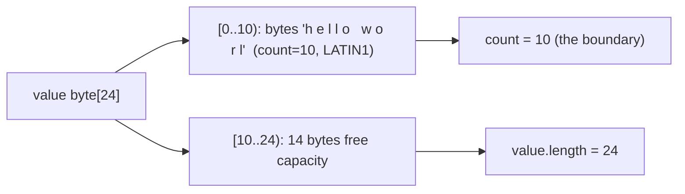

When you `length()` you get **10**. When you `capacity()` you get **24**. Two different concepts; same array.

### Constructors and their initial capacities

```java
new StringBuilder();                  // initial capacity = 16
new StringBuilder(int capacity);      // initial capacity = capacity (exactly)
new StringBuilder(String s);          // initial capacity = s.length() + 16
new StringBuilder(CharSequence cs);   // same: cs.length() + 16
```

The `+16` slack on the String/CharSequence ctors exists to absorb a few quick appends without an immediate grow.

```mermaid
flowchart TB
  Def["new StringBuilder()"] --> Cap1["capacity 16, count 0, coder LATIN1"]
  Hint["new StringBuilder(64)"] --> Cap2["capacity 64, count 0"]
  Str["new StringBuilder(\"hello\")"] --> Cap3["capacity 5+16=21, count 5, coder LATIN1"]
```

## The `coder` Byte — Compact Buffers Mirror Compact Strings

T06 explained `String`'s **Compact Strings** mechanism: `value` is `byte[]` plus a `coder` byte; LATIN1 strings store one byte per code unit, UTF16 two. The buffer classes do **the same thing**. When you construct an empty `StringBuilder` it starts as LATIN1; if you append a non-Latin-1 character (`'中'`, `'€'`, an emoji surrogate, …), the buffer **inflates** to UTF-16.

### The `inflate` path

`inflate` is one-way: LATIN1 → UTF16. Once inflated, the buffer **never** narrows back to LATIN1 even if every subsequent append fits in Latin-1.

```java
StringBuilder sb = new StringBuilder();    // coder = 0, value = byte[16]
sb.append("hello");                         // coder still 0, count = 5, value bytes [h,e,l,l,o,...]
sb.append('€');                             // inflate! reallocate value as byte[(count+1)*2] = byte[12]
                                            // walk old value: byte b at i → bytes [0, b] at 2i
                                            // append '€' (U+20AC) at offset (count*2): bytes [0x20, 0xAC]
                                            // coder = 1, count = 6
```

```
       Before inflate (coder=LATIN1, count=5, value=byte[16]):
         [h][e][l][l][o][ ][ ][ ][ ][ ][ ][ ][ ][ ][ ][ ]
          0  1  2  3  4   5  6  7  8  9  10 11 12 13 14 15

       After inflate of 'hello' to UTF-16, then appending '€' (0x20AC):
         (newly allocated byte[(5+1)*2 + slack] = byte[24])
         [0 ,h][0 ,e][0 ,l][0 ,l][0 ,o][20,AC][ ][ ][ ][ ][ ][ ]
          0  1  2  3  4  5  6  7  8  9  10 11  ...
         (big-endian: high byte then low byte per UTF-16 code unit)
```

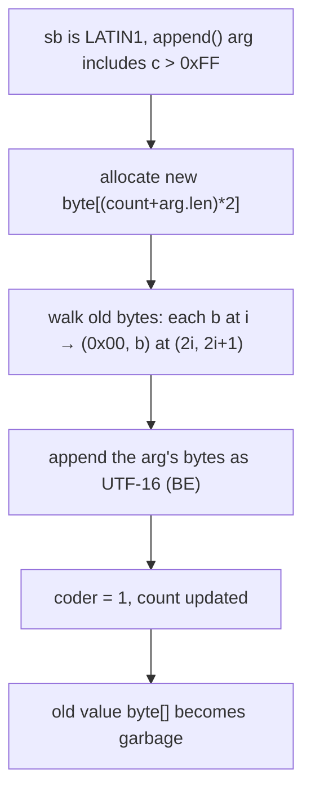

The cost of `inflate` is **O(count)** to walk the old bytes plus the cost of allocating a new array — usually fine, but worth knowing if you build long Latin-1 prefixes then add one non-Latin-1 char and were counting on Latin-1 memory.

> [!WARNING]
> **The Latin-1 boundary trap, redux.** Same trap as in T06 for `String`, applied to buffers: append one `'€'` after a million LATIN1 chars and your buffer doubles in byte size. If you know the content is mixed up front, construct with an estimated capacity in code units — the buffer will inflate on the *first* non-LATIN1 char, so the allocation happens once.

### How every method branches on `coder`

`AbstractStringBuilder.append(String s)` (paraphrased):

```java
public AbstractStringBuilder append(String str) {
    if (str == null) return appendNull();
    int len = str.length();
    ensureCapacityInternal(count + len);
    putStringAt(count, str);   // writes len chars into value at offset count
    count += len;
    return this;
}

private void putStringAt(int index, String str) {
    if (getCoder() != str.coder()) {     // mismatched coders → must inflate
        inflate();                        //   (or, if str is UTF16 and we're LATIN1, just inflate)
    }
    if (isLatin1()) {
        str.getBytes(value, index, LATIN1);
    } else {
        StringUTF16.putCharsSB(value, index, str, 0, str.length());
    }
}
```

The fast path: same coder, write directly. The slow path: coder mismatch → inflate → write.

## `append()` — The Core API

`AbstractStringBuilder` declares **13 `append` overloads** between them. Every one returns `this` so you can chain (`sb.append(a).append(b).append(c)`).

| Overload                                | Mechanism                                                                               |
|-----------------------------------------|------------------------------------------------------------------------------------------|
| `append(boolean b)`                     | writes the 4 bytes `t,r,u,e` or 5 bytes `f,a,l,s,e`                                      |
| `append(char c)`                        | LATIN1: if `c ≤ 0xFF` write one byte; else inflate first. UTF16: write 2 bytes BE.       |
| `append(char[] str)`                    | call `append(str, 0, str.length)`                                                         |
| `append(char[] str, int off, int len)`  | bulk write; checks if any char > 0xFF → inflate; then `arraycopy`                          |
| `append(CharSequence cs)`               | dispatch on type (`String`, `StringBuilder`, `StringBuffer`, other); use the cheapest path |
| `append(CharSequence cs, int s, int e)` | bulk write with bounds check                                                              |
| `append(double d)`                      | call `FloatingDecimal.appendTo(d, this)` — formats IEEE 754 to ASCII digits via Ryu/Grisu  |
| `append(float f)`                       | same path as `double` after promotion                                                     |
| `append(int i)`                         | `Integer.getChars(i, count + Integer.stringSize(i), value)` — writes digits right-to-left |
| `append(long l)`                        | `Long.getChars(...)` — same idea, more digits                                             |
| `append(Object obj)`                    | `append(String.valueOf(obj))` — `obj == null` → "null"                                    |
| `append(String str)`                    | direct copy with `putStringAt` (above)                                                     |
| `append(StringBuffer sb)`               | synchronizes on `sb`, copies bytes                                                        |
| `appendCodePoint(int codePoint)`        | encodes as 1 or 2 UTF-16 code units (T06's surrogate-pair rule); inflates first if needed  |

The fluent return is the bytecode-level reason chaining works: each method's last opcode is `aload 0; areturn`, returning the receiver.

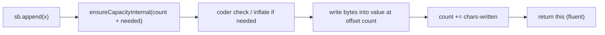

### `append(int)` — the digit-extraction trick

Worth a closer look because it's a tiny piece of art. Naively, `Integer.toString(i)` allocates a String, which `append(String)` then copies into the buffer. The fast path skips that:

```java
public AbstractStringBuilder append(int i) {
    int size = (i < 0) ? Integer.stringSize(-i) + 1 : Integer.stringSize(i);
    int spaceNeeded = count + size;
    ensureCapacityInternal(spaceNeeded);
    if (isLatin1()) {
        Integer.getChars(i, spaceNeeded, value);     // writes digits LATIN1
    } else {
        StringUTF16.getChars(i, count, spaceNeeded, value);
    }
    count += size;
    return this;
}
```

`Integer.getChars` writes digits **right-to-left** starting at `spaceNeeded - 1`, using `q = i / 100` and a lookup table `DigitTens` / `DigitOnes` of 100 entries to emit two ASCII digits per iteration. No allocation, no intermediate String.

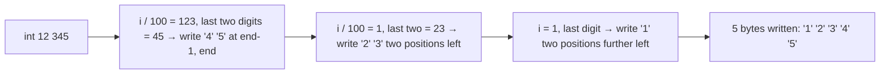

This is faster than `Integer.toString(i)` plus an `append(String)` because it skips:
- the String allocation
- the String's byte[] allocation
- one extra byte-copy (digit chars → String's byte[] → buffer's byte[])
- the eventual GC of both

Now imagine this inside a tight log line: `sb.append("uid=").append(userId).append(", action=").append(action).append("\n");` — every `append` is direct write into one buffer, count adjusted, no garbage.

## Growth Strategy — The Doubling Rule

The `ensureCapacityInternal(minCapacity)` call is the lifeline of the buffer. If `value.length >= minCapacity`, do nothing. Otherwise, **grow**.

The growth rule, in HotSpot (`AbstractStringBuilder.newCapacity`):

```java
private int newCapacity(int minCapacity) {
    int oldCapacity = value.length >> coder;           // capacity in code units
    int newCapacity = (oldCapacity << 1) + 2;          // double + 2
    if (newCapacity - minCapacity < 0) {
        newCapacity = minCapacity;                      // jump straight to minCapacity if double+2 wasn't enough
    }
    if (newCapacity <= 0 || ... > MAX_ARRAY_SIZE) {
        return hugeCapacity(minCapacity);               // soft-cap near Integer.MAX_VALUE
    }
    return newCapacity;
}
```

In words:

1. `oldCapacity` is read in **code units** (divide bytes-array length by `1 << coder`).
2. Try `newCapacity = oldCapacity * 2 + 2` — the **double-and-add-2** rule. The `+ 2` is a hedge for very small buffers (capacity 0 → 2; capacity 1 → 4) so we don't get stuck.
3. If that's still smaller than the requested minimum (e.g. you `append`ed a 10 000-char string into an empty buffer), jump straight to the minimum.
4. Cap at `MAX_ARRAY_SIZE` (`Integer.MAX_VALUE - 8`) — beyond that the JVM rejects the array allocation.

Then the actual grow:

```java
private void ensureCapacityInternal(int minCapacity) {
    int oldCapacity = value.length >> coder;
    if (minCapacity - oldCapacity > 0) {
        value = Arrays.copyOf(value,                       // ← arraycopy: O(count) byte copy
                newCapacity(minCapacity) << coder);         // bytes = code units × (1 or 2)
    }
}
```

`Arrays.copyOf` is `System.arraycopy` under the hood, which is a **JIT intrinsic** mapped to **`memcpy`** on the host CPU (next section).

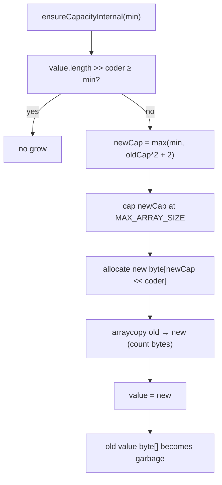

### Worked example — 100 appends from default capacity

```java
StringBuilder sb = new StringBuilder();   // capacity 16
for (int i = 0; i < 100; i++) sb.append('x');
```

Starting capacity 16. Append 16 'x' → no grow. The 17th 'x':
- `count = 16`, request `minCapacity = 17`. `oldCapacity = 16`. `newCapacity = 16*2+2 = 34`.
- Allocate `byte[34]`, copy 16 bytes, swap.

Continue with capacity 34. Next grow at count 35:
- `newCapacity = 34*2+2 = 70`.

Then 142, then 286. After append #100, the timeline of capacities was: 16 → 34 → 70 → 142.

Total bytes copied during grows: 16 + 34 + 70 = 120. Plus 100 byte-writes for the appends themselves. Total work: **~220 bytes touched**. Compare to the immutable-String version of the same loop, which would touch *~5050* bytes. The buffer wins by ~25×, even without pre-sizing.

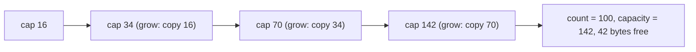

### Pre-sizing is free wins

If you know the result length in advance — and you usually do — pre-size:

```java
int estimatedBytes = N * 24;
StringBuilder sb = new StringBuilder(estimatedBytes);
```

Now the loop above does **zero grows**, **zero arraycopy calls**, and produces exactly one allocation: the original `byte[]`. For a heavy hot-path concat, this is meaningful.

> [!TIP]
> **Don't over-size by orders of magnitude.** A `StringBuilder` allocated with capacity 1 GB keeps a 1 GB `byte[]` alive even if you only use 10 bytes. Pre-size to roughly the expected length, not the worst case.

### Why `+2` instead of just doubling

Tiny buffers benefit. Default capacity 16 doubles to 34 (not 32), so the next append after capacity 1 doesn't need *two* grows in a row to fit 3 chars. With pure doubling, capacity 0 grows to 0 → infinite loop; capacity 1 grows to 2, then to 4 — extra wasted grow. The `+2` is a small hedge that pays off at boundary sizes.

### Amortised O(1) per append

Total bytes copied across a sequence of appends growing capacity from 16 to N is:
```
       16 + 32 + 64 + ... + N/2  ≈  N  (geometric series, ratio 2)
```
So N appends cost ≈ N bytes of total copying — amortised **constant time per append**. This is exactly the same analysis as `ArrayList` (which uses a similar growth rule).

## `insert`, `delete`, `replace`, `reverse`, `setCharAt`, `deleteCharAt`

The rest of the mutation API. Each is O(n) in the buffer length when it shifts; one is O(1).

### `setCharAt(int index, char ch)` — O(1)

Overwrite the code unit at `index`. If the buffer is LATIN1 and `ch > 0xFF`, inflate first; otherwise it's a single byte write (or two for UTF-16).

### `deleteCharAt(int index)` — O(count − index)

Shift everything from `index+1` onward one slot left:

```java
public AbstractStringBuilder deleteCharAt(int index) {
    checkIndex(index, count);
    shift(index + 1, -1);   // System.arraycopy: value[index+1..count) → value[index..count-1)
    count--;
    return this;
}
```

### `delete(int start, int end)` — O(count − end)

Same idea, deleting a range:

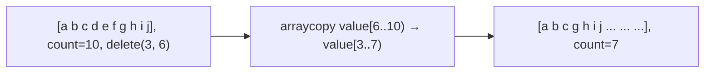

### `insert(int offset, String str)` — O(count − offset + str.length)

```java
public AbstractStringBuilder insert(int offset, String str) {
    ...
    ensureCapacityInternal(count + str.length());
    shift(offset, str.length());   // arraycopy value[offset..count) → value[offset+len..count+len)
    putStringAt(offset, str);       // write str into the gap
    count += str.length();
    return this;
}
```

```mermaid
flowchart LR
  Before["[h e l l o], count=5, insert(2, \"XX\")"]
  Before --> Cap["ensureCapacity(5+2=7); maybe grow"]
  Cap --> Shift["arraycopy value[2..5) → value[4..7)"]
  Shift --> Write["write 'X','X' at offset 2..3"]
  Write --> After["[h e X X l l o], count=7"]
```

The cost: one `arraycopy` (the shift) plus the write. For insertion at index 0, the shift is the entire buffer — buyer beware.

### `replace(int start, int end, String str)` — O(count + str.length)

May grow or shrink. The replacement-length difference (`str.length() - (end - start)`) determines whether the tail shifts right or left.

### `reverse()` — O(count), surrogate-aware

Reverse the buffer in place, walking from both ends and swapping. The subtlety: **surrogate pairs must be kept together**. A naive char-by-char reverse would split `(highSurrogate, lowSurrogate)` into `(lowSurrogate, highSurrogate)` — invalid UTF-16.

```java
public AbstractStringBuilder reverse() {
    boolean hasSurrogates = false;
    int n = count - 1;
    for (int j = (n - 1) >> 1; j >= 0; j--) {
        int k = n - j;
        char cj = charAt(j);
        char ck = charAt(k);
        setCharAt(j, ck);
        setCharAt(k, cj);
        if (Character.isSurrogate(cj) || Character.isSurrogate(ck)) {
            hasSurrogates = true;
        }
    }
    if (hasSurrogates) {
        reverseAllValidSurrogatePairs();   // re-walk and re-swap any surrogate pair we broke
    }
    return this;
}
```

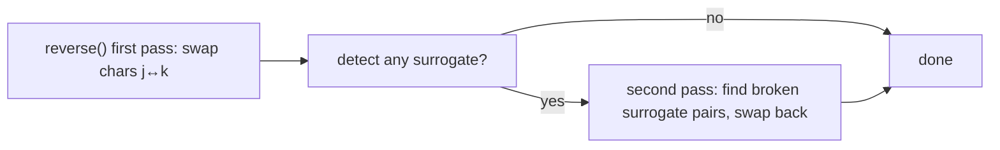

## `toString()` — The Final Allocation

`StringBuilder.toString()` is where the buffer becomes a real `String`:

```java
@Override
public String toString() {
    return isLatin1()
        ? StringLatin1.newString(value, 0, count)    // allocates fresh byte[count], copies
        : StringUTF16.newString(value, 0, count);    // allocates fresh byte[count*2], copies
}
```

Why **copy**? Because the user may continue mutating the buffer after calling `toString()` — and `String` is immutable. If the returned `String` shared the buffer's `byte[]`, a subsequent `sb.append('x')` could either silently mutate the produced `String` (breaking immutability) or trigger a copy-on-write check on every `append` (killing performance).

The chosen design: **always copy.** The cost is O(count) at `toString` time. Allocations: one new `String` wrapper (32 bytes) + one new `byte[count + header + padding]`.

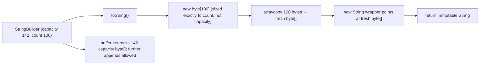

> [!IMPORTANT]
> **`toString()` is O(count) — do it once, at the end.** Don't call `toString()` inside a loop. If you need an intermediate String snapshot, you've probably structured the code wrong; build the buffer, materialise once.

### `StringBuffer`'s extra trick: `toStringCache`

`StringBuffer` adds a `transient String toStringCache` field. After `toString()`, the cache holds the produced String. The cache is invalidated by *any* mutation. Use case: code that calls `toString()` twice in a row without mutation in between gets the second call for free. Helpful in some idioms; usually noise.

## `StringBuilder` vs `StringBuffer` — Synchronization Cost

`StringBuffer` predates `StringBuilder` by years. It's from Java 1.0 (1996), when Java's pitch was "concurrent-ready by default" and *every* method that touched mutable state was `synchronized`. By Java 5 (2004), the cost of unconditional synchronization was understood, and `StringBuilder` shipped as the unsynchronized counterpart.

The bodies are identical except for `synchronized`:

```java
// StringBuilder.append(String):
@Override
public StringBuilder append(String str) {
    super.append(str);    // unsynchronized
    return this;
}

// StringBuffer.append(String):
@Override
public synchronized StringBuffer append(String str) {
    toStringCache = null;
    super.append(str);    // same body, but called with the monitor held
    return this;
}
```

### The cost of `synchronized` even when uncontended

On HotSpot, an uncontended `synchronized` block on x86-64 involves:

1. **Lock-record allocation** on the calling stack frame (~1 cycle).
2. **`lock cmpxchg`** on the object's mark word to atomically claim the monitor (~10–25 cycles — the `lock` prefix forces a cache-coherence round trip on Skylake-era CPUs; somewhat cheaper on newer ones with single-thread fast paths).
3. **Memory fence** that prevents loads/stores from being reordered across the boundary.
4. On exit, another `lock cmpxchg` to release.

That's ~20-50 cycles **per method call**. Multiplied across thousands of appends in a hot loop, it's measurable: `StringBuilder` is **~5-10× faster** than `StringBuffer` in single-threaded microbenchmarks.

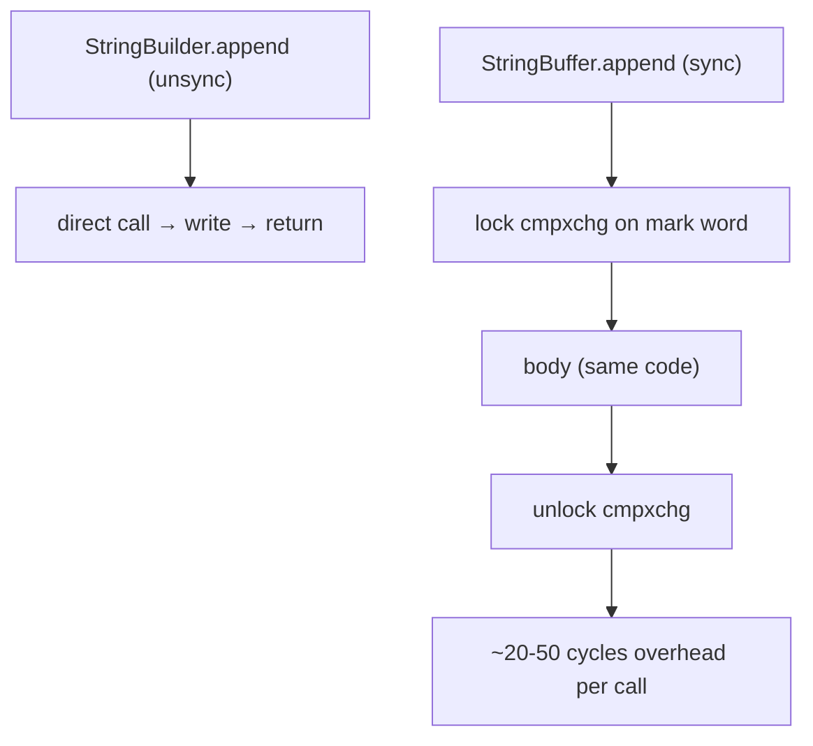

> [!NOTE]
> **Biased locking** (`-XX:+UseBiasedLocking`) on older HotSpot reduced this to ~2 cycles for single-threaded access, but it was removed by default in JDK 15 (JEP 374) and removed entirely in JDK 18 — modern measurements use the cheaper "lightweight locking" path, which still costs more than no lock at all.

### When to actually use `StringBuffer`

Almost never. The few real use cases:

1. **You actually share a buffer across threads.** This is rare and usually a design smell — usually you can give each thread its own `StringBuilder` and merge at the end.
2. **A pre-Java-5 API requires it.** Some old SDKs declare `StringBuffer` parameters; for compatibility you pass one.
3. **You're maintaining 1.4-era code** and a refactor isn't worth it.

For new code, **default to `StringBuilder`.** If you need cross-thread sharing, use a proper concurrent structure (`ConcurrentLinkedQueue` of fragments, or per-thread builders with a final merge).

> [!INTERVIEW]
> **"`StringBuilder` vs `StringBuffer` — when?"** `StringBuilder` for single-threaded code (default). `StringBuffer` only when you genuinely share the buffer across threads — rare. The bodies are identical except `StringBuffer` synchronizes every method (~20-50 cycle overhead per call) and has a `toStringCache` field. Both inherit from `AbstractStringBuilder`.

## How Modern `+` Uses (Or Doesn't Use) `StringBuilder`

T06 covered this from the String side. From the buffer side it's:

### Pre-Java 9

`javac` lowered `"a" + x + "b"` to:

```
NEW java/lang/StringBuilder
DUP
INVOKESPECIAL StringBuilder.<init>:()V
LDC "a"
INVOKEVIRTUAL StringBuilder.append:(Ljava/lang/String;)Ljava/lang/StringBuilder;
ILOAD x
INVOKEVIRTUAL StringBuilder.append:(I)Ljava/lang/StringBuilder;
LDC "b"
INVOKEVIRTUAL StringBuilder.append:(Ljava/lang/String;)Ljava/lang/StringBuilder;
INVOKEVIRTUAL StringBuilder.toString:()Ljava/lang/String;
```

One `StringBuilder` allocation per `+` expression; many `append` calls; one `toString`. Pre-9, this was the *only* way `+` worked.

### Java 9+

JEP 280 replaced this with a single `invokedynamic` (T06). For a *single expression* like `"a" + x + "b"`, no `StringBuilder` is created at runtime — the `MethodHandle` written by `StringConcatFactory` allocates the result `byte[]` directly.

### Where StringBuilder still shines

Inside loops and conditional builds, `javac` *can't* fold to a single `invokedynamic` because the shape of the concat isn't known until runtime:

```java
StringBuilder sb = new StringBuilder();
for (Item i : items) {
    sb.append(i.getName()).append(':').append(i.getValue()).append('\n');
}
return sb.toString();
```

Each *iteration's* concat could be done with a single `invokedynamic` — but joining iterations requires the loop-scoped buffer. `StringBuilder` is the right answer here. Always.

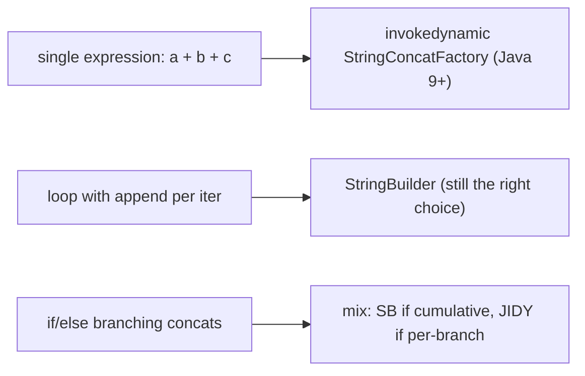

## Escape Analysis — When the Allocation Disappears

This is the deepest mechanism in the topic, and the one that explains why modern Java concat is *not* a memory disaster even when it conceptually uses a `StringBuilder`.

**Escape analysis (EA)** is a JIT optimisation in HotSpot's C2 compiler. For every object allocation in a hot method, EA classifies the object:

- **NoEscape** — the reference never leaves the method (not stored in a field, not returned, not passed to an opaque method).
- **ArgEscape** — the reference is passed to another method but doesn't escape *that* method either (recursively).
- **GlobalEscape** — the reference escapes (stored in a field, returned, used by a non-inlined method).

For **NoEscape** allocations, the JIT can perform **scalar replacement**: instead of allocating a heap object with fields, it lifts the fields into local variables that live in CPU registers (or the stack). The allocation **is never emitted**. No heap traffic, no GC pressure, no header overhead.

```mermaid
flowchart TB
  Src["StringBuilder sb = new StringBuilder()<br/>sb.append(\"a\").append(x).append(\"b\")<br/>return sb.toString();"] --> Analyze["JIT: EA classifies sb as NoEscape"]
  Analyze --> Scalar["scalar replace: count → register, value → stack-allocated byte[]"]
  Scalar --> Emit["emit raw bytes write + final String allocation"]
  Emit --> Out["zero StringBuilder allocation; one String + one byte[]"]
```

### The "non-escaping StringBuilder" idiom

```java
public String describe(int id, String name) {
    return new StringBuilder()
        .append("id=").append(id)
        .append(", name=").append(name)
        .toString();        // sb itself never escapes — only the result String does
}
```

EA classifies `sb` as **NoEscape**. C2 scalar-replaces it: `count` becomes an `int` local; `value` becomes a stack-allocated `byte[16]` (which may itself be elided if it can be sized exactly). The only allocation that survives is the final `String` (the `toString` result, which *does* escape).

```asm
; Conceptual post-EA native code (sketch):
;   no StringBuilder object on the heap;
;   value byte[] is sized for the known content (or stack-resident);
;   count is a register;
;   final allocation is one String + its byte[]
mov     <count register>, 0
; write "id=" bytes into the local byte[]
add     <count>, 3
; ... format id digits into byte[] starting at count
; write ", name=" bytes
; copy name bytes
; allocate final String + byte[] (only surviving allocation)
ret
```

### What kills EA

- The reference **escapes**: stored in a field, returned, passed to an un-inlined call.
- The method is **too large to inline** (over `MaxInlineSize`/`FreqInlineSize` thresholds).
- The buffer is used **across thread boundaries**.

In the loop pattern (`sb` declared outside the loop, mutated inside, returned at the end), the `sb` escapes (it's returned). EA doesn't apply — the StringBuilder is real, heap-allocated, lives the lifetime of the method. That's fine — the buffer's amortised growth keeps the cost low.

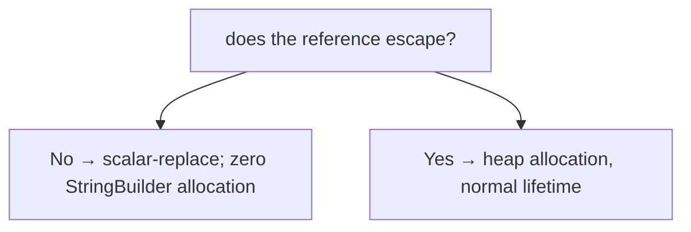

### Observing escape analysis

```
-XX:+UnlockDiagnosticVMOptions -XX:+PrintEscapeAnalysis -XX:+PrintEliminateAllocations
-XX:+PrintAssembly
```

The output annotates each allocation site with its EA result and whether the allocation was eliminated. For a textbook non-escaping `StringBuilder`, you'll see something like `Allocation Eliminated`.

> [!IMPORTANT]
> **EA is why "use a StringBuilder" rarely matters for short single-expression concats.** The JIT erases the buffer entirely. The *real* cost of `+` in Java 9+ is the final String allocation, and that's unavoidable. Worry about StringBuilder vs concat for **loop bodies**, where EA can't help.

## Hardware — `arraycopy` as `memcpy`

Several operations in this topic call `Arrays.copyOf` or `System.arraycopy`:

- **Grow** in `ensureCapacityInternal` — copy `count` bytes to a larger array.
- **Shift** in `insert`/`delete`/`replace` — copy a slice to a different position.
- **`toString`** — copy `count` bytes to a fresh array.
- **`inflate`** — walk and widen `count` bytes (this is a per-byte loop, *not* `arraycopy`, because each byte becomes two bytes).

`System.arraycopy(src, sOff, dst, dOff, len)` is a **HotSpot intrinsic** — the JIT replaces the call with native `memcpy`-style code:

| Platform     | Code path                                                                                  |
|--------------|---------------------------------------------------------------------------------------------|
| **x86-64**, small `len` | `rep movsb` (REP MOVS byte) — Intel ERMS (Enhanced REP MOVSB) makes this near-optimal       |
| **x86-64**, large `len` | `rep movsq` (REP MOVS quad) or AVX2 256-bit `vmovdqu` loops                                  |
| **ARM64**, small `len`  | `ldp x0, x1, [src]; stp x0, x1, [dst]` — load/store-pair instructions                         |
| **ARM64**, large `len`  | NEON `ldp q0, q1, [src]; stp q0, q1, [dst]` — 32 bytes per pair                              |
| **Overlap detection**   | The intrinsic emits a forward/backward copy depending on `src vs dst` and `len`              |

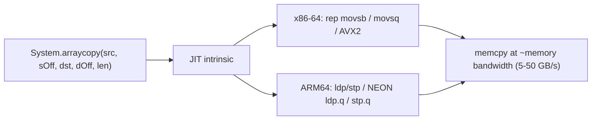

The grow path's `Arrays.copyOf(value, newSize)` lowers to this intrinsic. So even when a buffer grows, the bytes move at memory-bandwidth speed, not per-byte loop speed. **This is why amortised O(1) per append really is fast** — the dominant cost per grow is bounded by memory bandwidth, and the geometric sum keeps it small overall.

## Lifetime — Where Each Piece Lives

Per the depth bar's §4a, here's the buffer's lifetime story:

| Piece                          | Where                              | Allocated when               | Reclaimed when                                                   |
|--------------------------------|------------------------------------|------------------------------|------------------------------------------------------------------|
| Local `StringBuilder sb` var   | stack frame (compressed reference) | method entry / `astore`      | frame pop                                                         |
| `StringBuilder` wrapper        | heap (24 bytes)                    | `new StringBuilder()`        | GC when no live ref (or **eliminated** by EA if non-escaping)     |
| Initial `value` `byte[16]`     | heap (32 bytes)                    | inside ctor                  | GC when wrapper is GC'd (or with wrapper if EA stack-allocated)   |
| `value` after grow #1          | heap                               | first `ensureCapacity` grow  | becomes garbage on next grow; old array GC'd                      |
| `value` final (largest)        | heap                               | last grow                    | GC with the wrapper                                                |
| `toString()` result String     | heap (32 bytes + N bytes)          | `toString` call              | independent of buffer — outlives `sb` if returned/stored          |
| Buffer in `StringBuffer`       | heap (32 bytes due to cache field) | `new StringBuffer()`         | same                                                              |
| `toStringCache` (`StringBuffer` only) | heap                          | first `toString` call        | nulled on any mutation; otherwise GC with wrapper                  |

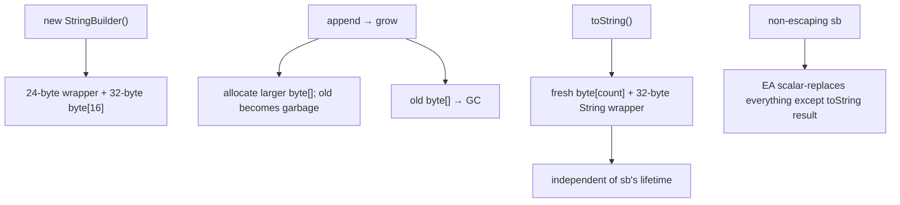

The point: even a "throwaway" `StringBuilder` produces several short-lived heap objects across its grows. Pre-sizing eliminates the grows entirely, leaving just the wrapper + initial array + final String.

## Common Mistakes

```java
// 1. Forgetting toString — using the buffer where a String is expected.
StringBuilder sb = new StringBuilder("hello");
System.out.println(sb);          // works (calls sb.toString() via PrintStream)
map.put("k", sb);                 // BUG — stores the mutable buffer; if sb is mutated
                                  // later, the map's key/value silently changes (or, for
                                  // a key, the lookup breaks).

// 2. += in a loop hoping the compiler will auto-StringBuilder.
String s = "";
for (int i = 0; i < N; i++) s += i + ",";    // Java 9+ uses invokedynamic per iter — still O(N²)!
// Fix:
StringBuilder sb = new StringBuilder();
for (int i = 0; i < N; i++) sb.append(i).append(',');
String s = sb.toString();

// 3. Capacity miscalculation — too small or too large.
StringBuilder sb = new StringBuilder();           // 16 — fine for small builds
StringBuilder sb = new StringBuilder(estimate);   // good
StringBuilder sb = new StringBuilder(1_000_000);  // bad if you only need 50 chars

// 4. StringBuffer where StringBuilder would do.
StringBuffer sb = new StringBuffer();   // synchronized cost for no benefit in single-threaded code
StringBuilder sb = new StringBuilder(); // default

// 5. Reusing a StringBuilder across threads.
class Logger {
    private final StringBuilder sb = new StringBuilder();   // shared!
    void log(String msg) { sb.append(msg).append('\n'); }    // RACE — concurrent appends
                                                              // → corruption or ArrayIndexOutOfBoundsException
}
// Fix: a per-thread builder, a synchronized block, or a concurrent structure.

// 6. equals/hashCode — DOES NOT compare buffer contents.
StringBuilder a = new StringBuilder("hi");
StringBuilder b = new StringBuilder("hi");
a.equals(b);   // false — inherited Object.equals (reference equality)
// Use:
a.toString().equals(b.toString());
// or:
String s = a.toString(); s.contentEquals(b);   // contentEquals on String accepts CharSequence

// 7. toString() in a loop — defeats the buffer's purpose.
for (int i = 0; i < N; i++) {
    sb.append(x);
    log(sb.toString());     // BAD — O(N²) again because each toString copies the buffer
}

// 8. Append a null Object.
sb.append((Object) null);   // appends the 4 chars 'n','u','l','l' — not an NPE
sb.append((String) null);   // same: 4 chars 'n','u','l','l' (special-cased)
sb.append((char[]) null);   // NullPointerException — char[] overload doesn't tolerate null

// 9. Reverse with surrogates — fine in JDK, broken in hand-rolled.
"a😀b".chars()                       // [97, 0xD83D, 0xDE00, 98]
// sb.reverse() handles this correctly (see the surrogate-aware reverse above).
// A naive char-by-char reverse would produce [98, 0xDE00, 0xD83D, 97] — invalid UTF-16.

// 10. insert(0, ...) on a long buffer — O(n) shift every time.
StringBuilder sb = new StringBuilder("long content");
for (String prefix : prefixes) sb.insert(0, prefix);   // BAD — each insert shifts everything
// Fix: build in reverse, then reverse() once at the end, OR collect into a List
// and joiner.
```

> [!INTERVIEW]
> Reliable StringBuilder/StringBuffer questions:
> - **"Why is `+` in a loop quadratic in old Java?"** Each `+` allocates a new String containing the entire LHS plus the RHS — N appends move 1+2+…+N = O(N²) bytes.
> - **"Difference between `StringBuilder` and `StringBuffer`?"** `StringBuilder` is unsynchronized (Java 5+); `StringBuffer` synchronizes every method (Java 1.0). `StringBuilder` is ~5-10× faster in single-threaded use. Both extend `AbstractStringBuilder`.
> - **"What is `AbstractStringBuilder`?"** The package-private base class that holds the buffer state (`byte[] value`, `int count`, `byte coder`) and all the real append/insert/delete/grow code. `StringBuilder` and `StringBuffer` are thin subclasses that differ only in synchronization.
> - **"What's the difference between length and capacity?"** `length()` (= `count`) is the number of code units written so far; `capacity()` (= `value.length` adjusted for coder) is the size of the backing array. `length() ≤ capacity()` always.
> - **"What's the default initial capacity?"** 16 code units. `new StringBuilder(int n)` sets it explicitly; `new StringBuilder(String s)` sets it to `s.length() + 16`.
> - **"How does the buffer grow?"** When `append` would exceed capacity, `value` is replaced with `Arrays.copyOf(value, newCap << coder)` where `newCap = max(minCap, oldCap*2 + 2)`. Amortised O(1) per appended code unit. Backed by the `System.arraycopy` intrinsic (`memcpy` on the host CPU).
> - **"What does `toString()` do?"** Allocates a fresh `byte[count]` (or `byte[count*2]` for UTF-16), copies the buffer contents in, wraps it in a new `String`. Required because `String` is immutable and the buffer may mutate further.
> - **"What is `inflate`?"** The Latin-1 → UTF-16 transition. Triggered when an append introduces a code unit > `0xFF` to a LATIN1 buffer. Allocates a new `byte[oldCap*2]`, walks the old bytes widening each, swaps. One-way: never re-narrows.
> - **"What is escape analysis?"** HotSpot's JIT classifies allocations as NoEscape / ArgEscape / GlobalEscape. NoEscape allocations are **scalar-replaced** — fields become register locals and the object never appears on the heap. A non-escaping `StringBuilder` in a method that returns its `toString()` is *eliminated* by EA.
> - **"Why is Java 9+ `+` not just slow `StringBuilder` machinery?"** `javac` no longer emits a `StringBuilder` chain. It emits a single `invokedynamic` to `StringConcatFactory.makeConcatWithConstants` (T06), which allocates the result `byte[]` exactly once at the right size. Plus, even where `StringBuilder` *would* be created, EA often erases it.
> - **"What's the cost of `synchronized` even uncontended?"** ~20-50 cycles per method call on modern HotSpot: a `lock cmpxchg` on the object's mark word + a memory fence + the reverse on exit. Adds up across thousands of appends.

## Practice

1. **The quadratic demonstration.** Write two versions of a 100 000-iteration concat: one using `+=` on a `String`, one using `StringBuilder`. Time them with `System.nanoTime()`. Measure the time ratio. Then re-run with `N = 1 000 000` and observe how the ratio scales.
2. **`javap` the loop concat.** Write a method that does `String s = ""; for (int i=0;i<10;i++) s = s + i + ",";`. Disassemble with `javap -c`. Count the `new StringBuilder` opcodes — one per loop iteration in Java 9+. Why isn't this folded to a single `StringBuilder` outside the loop?
3. **JOL the buffer.** Add JOL (`org.openjdk.jol`) and print `ClassLayout.parseInstance(new StringBuilder()).toPrintable()`. Confirm the field offsets (count, coder, value) match this topic's table. Now do the same for `StringBuffer` — note the extra `toStringCache` field.
4. **Grow-log via reflection.** Write a `LogGrowSB` subclass that overrides `ensureCapacityInternal` to log every grow. Build a 1000-char buffer and dump the grow timeline. Compute total bytes copied. Compare to pre-sized.
5. **Pre-sizing payoff.** Time `new StringBuilder()` + 10 000 appends vs `new StringBuilder(10_000)` + 10 000 appends. Quantify the speedup. Where does it come from (allocations? arraycopy bytes? cache misses?).
6. **Inflate trigger.** Build a `StringBuilder` with 1000 ASCII chars, then append one `'€'`. Confirm via reflection that `coder` flipped from 0 to 1 and `value.length` doubled. Now append all-Latin-1 chars; coder stays UTF16 (one-way!).
7. **`append(int)` vs `append(Integer.toString(int))`.** Microbenchmark both. The first uses `Integer.getChars` directly; the second allocates an intermediate String. Quantify the difference in throughput and allocations.
8. **EA on/off.** Write a method that returns `new StringBuilder().append("x=").append(x).toString();`. Run with `-XX:-DoEscapeAnalysis` and time. Re-run with `-XX:+DoEscapeAnalysis` (default). Observe the difference. Now run with `-XX:+UnlockDiagnosticVMOptions -XX:+PrintEliminateAllocations` and find the elimination report.
9. **EA limits.** Take the same method and store `sb` into a static field before `toString`. Re-measure. Why does EA no longer apply?
10. **StringBuffer overhead.** Time identical `StringBuilder` vs `StringBuffer` workloads in a single-threaded test of 1 000 000 appends. Quantify the ratio (~5-10×). Now multi-thread it — `StringBuffer` survives (slowly); shared `StringBuilder` corrupts.
11. **arraycopy intrinsic.** Run a method that grows a `StringBuilder` via repeated append with `-XX:+UnlockDiagnosticVMOptions -XX:+PrintIntrinsics -XX:+PrintAssembly`. Find the `System.arraycopy` intrinsic and identify the underlying instruction (e.g. `rep movsq` on x86-64 or `ldp/stp` pairs on ARM64).
12. **Surrogate-pair reverse.** Build `"a😀b"` into a StringBuilder; call `reverse()`. Verify the result is `"b😀a"` (surrogate pair preserved). Then try with a naive hand-rolled reverse that swaps every char. Observe the corrupted output (invalid UTF-16).
13. **insert(0, ...) cost.** Time inserting 1000 small Strings at position 0 of a 100 000-char buffer. Compare to appending 1000 small Strings at the end and calling `reverse()` once.
14. **`toString` snapshot semantics.** Build a `StringBuilder` `sb` to "hello". Call `String s = sb.toString();`. Then `sb.append(" world")`. Print `s`. It's still "hello" — confirming `toString` made a copy.
15. **The Java 9+ default-concat allocation cost.** Write `return "x=" + x + ",y=" + y;` (with integer `x`, `y`). Disassemble with `javap -v`. Find the `BootstrapMethods` `StringConcatFactory` entry. Compare to the same method's pre-Java-9 bytecode (use an older javac or look up an example). Count the heap allocations in each version.
16. **`equals` trap.** Show that `new StringBuilder("hi").equals(new StringBuilder("hi"))` returns `false`. Then write the correct comparison (`.toString().equals(...)` or `.contentEquals(...)` via `String`).
17. **Explain it back.** In your own words, trace `new StringBuilder().append("x=").append(42).append(",y=").append(7).toString()` from source through bytecode through (a) the conceptual heap allocations and (b) what actually runs after EA + intrinsic inlining. How many of the conceptual allocations survive at runtime?

## Recap

You should now be able to:

- Explain why `+` on `String` in a loop is **O(N²)** — every concat allocates a fresh String + byte[], copying the entire prefix.
- Describe `StringBuilder` and `StringBuffer` as **mutable buffers** that share `AbstractStringBuilder` and differ only in synchronization (`StringBuffer.append` is `synchronized`, has a `toStringCache` field; `StringBuilder` is single-threaded fast).
- Recognise the type hierarchy: `CharSequence` (read view), `Appendable` (write view), `AbstractStringBuilder` (package-private base with the real logic), `StringBuilder` and `StringBuffer` (final subclasses).
- Pin the **byte-level layout** of a `StringBuilder` instance: 24-byte wrapper (header 12 + count int 4 + coder byte 1 + 3 pad + value compressed-ref 4 + 4 pad) plus the separate `byte[]` backing array (16-byte header + capacity bytes + padding). `StringBuffer` adds a `toStringCache` field for ~32 bytes total.
- Distinguish **`count` (length)** from **`value.length` (capacity)**: count is the user-visible code-unit count; value.length is the allocated array size; bytes-used = `count` (LATIN1) or `count*2` (UTF16).
- Author with the right **constructor**: `new StringBuilder()` (default 16), `new StringBuilder(n)` (explicit capacity), `new StringBuilder(s)` (`s.length()+16`).
- Trace the **`coder` byte** mirror of Compact Strings: LATIN1 stores 1 byte/code unit; UTF16 stores 2 bytes/code unit (big-endian). The buffer **`inflate`s** from LATIN1 → UTF16 on the first out-of-range append (walk + widen + reallocate). Inflation is one-way.
- Describe each **`append` overload's mechanism** — `append(int)` writes digits directly via `Integer.getChars` (no intermediate String), `append(double)` uses `FloatingDecimal`, `append(Object)` indirects through `String.valueOf`, `append(char[])` uses `arraycopy`, etc. All return `this` for fluent chaining.
- Apply the **growth rule**: `newCapacity = max(minCapacity, oldCapacity * 2 + 2)` (the `+2` hedges tiny buffers). Backed by `Arrays.copyOf` → `System.arraycopy` intrinsic. Amortised O(1) per appended code unit. **Pre-sizing eliminates all grows.**
- Explain **`insert`/`delete`/`replace`** as O(n) shifts via `arraycopy`, and **`reverse`** as O(n) plus a surrogate-fixup pass that preserves valid UTF-16.
- Recall that **`toString()` always copies** — fresh `byte[count]` (or `byte[count*2]`) and a fresh `String` wrapper, because the buffer may continue mutating after the snapshot.
- Compare **`StringBuilder` vs `StringBuffer`** performance: identical bodies; `StringBuffer.append` adds ~20-50 cycles per call for `lock cmpxchg` + fence + unlock, making single-threaded `StringBuilder` ~5-10× faster. Default to `StringBuilder`.
- Map the modern `+` operator (Java 9+) to `invokedynamic StringConcatFactory` for single expressions, *not* to a `StringBuilder` chain. Use explicit `StringBuilder` for loops and conditional builds where the compiler can't fold the shape.
- Explain **escape analysis + scalar replacement**: a non-escaping `StringBuilder` is *eliminated* by the C2 JIT — its fields become register locals, the backing array becomes stack-allocated (or elided), and no heap allocation survives except the final `String`.
- Recognise that **`System.arraycopy` is a HotSpot intrinsic** mapped to **`rep movsb`/AVX2** on x86-64 and **`ldp/stp`/NEON** on ARM64 — copies happen at memory bandwidth, not per-byte loops.
- Avoid the **common traps**: storing a `StringBuilder` as a map key, calling `toString` inside the loop, inserting at index 0 repeatedly, `equals` between buffers (inherited from `Object` — reference equality), sharing a `StringBuilder` across threads.

## Next

Continue to [Control Flow (if/else, switch, switch expressions)](./T08-control-flow-if-else-switch-switch-expressions.md).
