# Control Flow (if/else, switch, switch expressions)

Every program needs three building blocks: **sequence** (do A, then B), **selection** (do A *or* B depending on a condition), and **repetition** (do A many times). T01 through T07 handled sequence; this topic handles **selection**; T09 next will handle repetition. Three constructs cover the entire selection space: the venerable `if`/`else`, the conditional `?:` operator, and the `switch` family — which itself has evolved through four generations of Java (classical statement, String-switch in Java 7, switch *expressions* in Java 14, and **pattern matching** in Java 21).

The depth-bar requirement is not just "show the syntax." A switch is one of the most architecturally interesting constructs in Java: `javac` chooses between two different bytecode opcodes (`tableswitch` and `lookupswitch`) based on a density heuristic; a `switch` on `String` is a *two-step* lowering through `hashCode()` + an `equals` confirmation; a switch on an `enum` indirects through a synthetic `SwitchMap` array; pattern matching uses an `invokedynamic SwitchBootstraps.typeSwitch` plus a downstream `tableswitch`; the JIT lowers dense tables to **indirect jumps** off jump tables in `.rodata`, sparse tables to **binary-search trees** of `cmp+jcc`, and short `if`-chains to a sequence of conditional moves (`cmov`) on x86-64 / `csel` on ARM64. We'll cover every layer of that stack — and along the way, the **branch predictor** and the **Branch-Target Buffer (BTB)** that decide whether a switch on a megamorphic hot path is essentially free or a pipeline-stall storm.

> [!NOTE]
> Prerequisites: [Program Structure](./T01-program-structure-class-main-statements.md) (`L0/C02/T01`) — blocks, statements, the `{...}` rule; [Literals & Constants](./T03-literals-and-constants-final.md) (`L0/C02/T03`) — compile-time constants, which is what `case` labels must be; [Operators](./T04-operators-arithmetic-relational-logical-bitwise-assignment.md) (`L0/C02/T04`) — relational and equality ops that drive `if`, the `&&`/`||` short-circuit, the `if_icmp*` / `ifeq` bytecode family, and the ternary preview; [Type Conversion & Casting](./T05-type-conversion-and-casting.md) (`L0/C02/T05`) — auto-widening of `byte`/`short`/`char` to `int` in switch labels, the pattern-binding `instanceof` we now use as a `case` pattern; [Strings & Text Blocks](./T06-strings-and-text-blocks.md) (`L0/C02/T06`) — String identity, `hashCode`, the collision pair `"Aa"`/`"BB"` that the String switch must handle; [Source to Bytecode to JVM to Machine Code](../C01-cs-foundations/T04-source-to-bytecode-to-jvm-to-machine-code.md) (`L0/C01/T04`) — `.class` constant pool, the `goto` opcode, `invokedynamic` mechanics.

## Selection: The Three Constructs

Java offers three forms of selection:

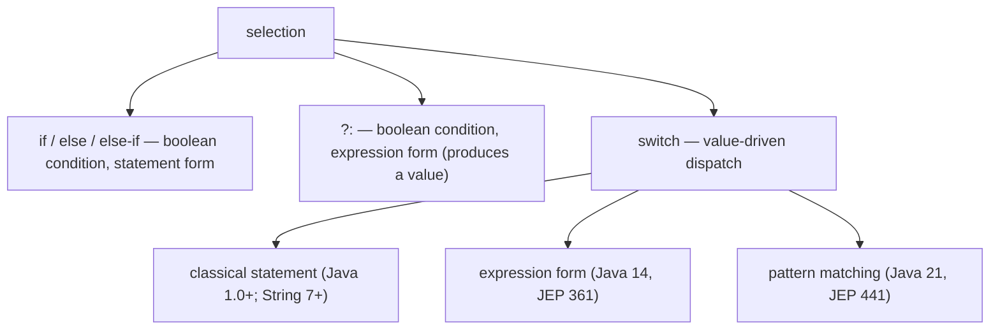

`if` is the universal hammer: any boolean predicate (`==`, `<`, `&&`, method calls returning `boolean`) drives the dispatch. `?:` is `if` packaged as an expression. `switch` is a specialised dispatch on a single value against a finite list of constants (or, since Java 21, against a list of *patterns*) and gets faster machine code than the chained-`if` equivalent for dense cases. The rest of the topic walks each.

## `if` / `else` / `else if`

The simplest selection: evaluate a boolean expression, take one of two paths.

```java
if (n > 0) {
    System.out.println("positive");
} else if (n < 0) {
    System.out.println("negative");
} else {
    System.out.println("zero");
}
```

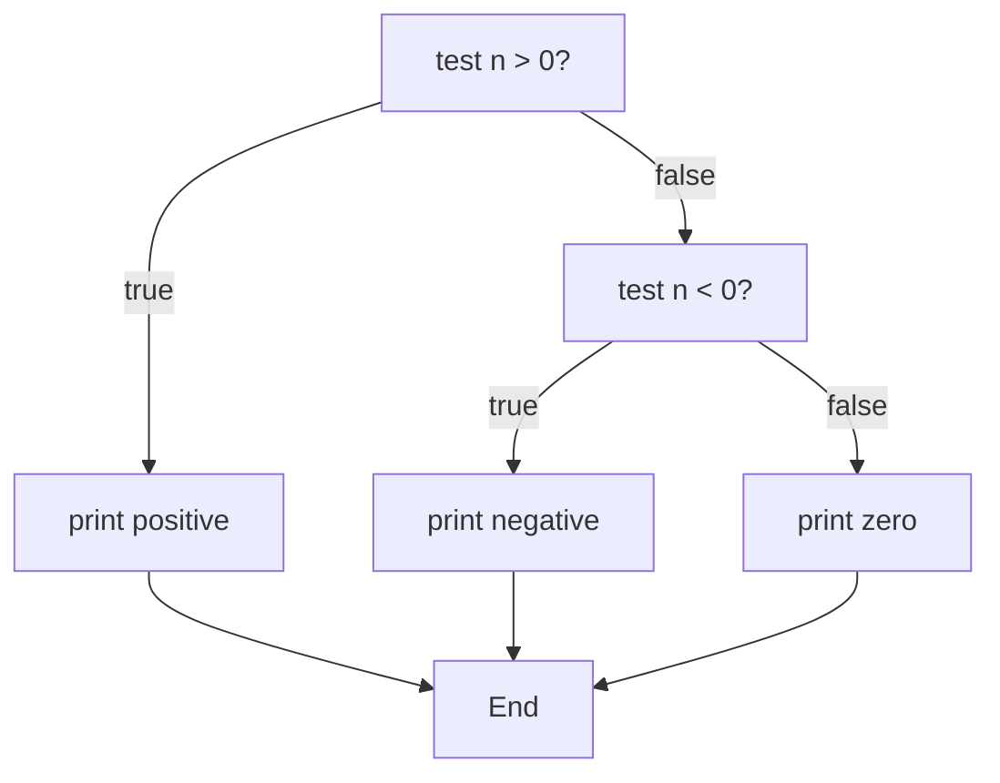

### Syntax notes

- The **condition** must be `boolean` (or `Boolean` auto-unboxed). Unlike C, `if (n)` where `n` is `int` does **not** compile.
- The **body** can be a single statement or a block (`{ ... }`). Style guides universally recommend always using braces, even for one-line bodies. (The Apple SSL `goto fail;` bug — two unbraced lines silently dropped one — is the canonical horror story.)
- `else if` is not a Java keyword. It's an `else` whose body is an `if` statement. The Java parser sees `else <statement>`, and an `if` is a statement, so it nests naturally.

### The dangling-else rule

In nested ifs without braces, an `else` binds to the **nearest unmatched `if`**:

```java
if (a)
    if (b)
        x();
else            // binds to the INNER if (b), NOT to if (a)
    y();
```

Reformatted to show the actual parse:

```java
if (a) {
    if (b) {
        x();
    } else {
        y();
    }
}
```

This is the same rule as C/C++/C# and the source of most "dangling else" bugs. Always brace.

> [!WARNING]
> **Brace every `if` body**, even single statements. The dangling-else rule + a stray semicolon (`if (cond);`) are the two classic ways to write a silent control-flow bug in Java. IDEs and linters flag both, but the habit pays.

### Bytecode for `if`

Recall T04: the JVM has a family of compare-and-branch opcodes. `if (a > b) x(); else y();` lowers to:

```
       iload  a              ; push a
       iload  b              ; push b
       if_icmple ELSE        ; if a <= b, jump to ELSE  (the NEGATION of the source condition)
       <code for x()>
       goto   END
   ELSE:
       <code for y()>
   END:
```

The compiler **inverts** the source's relational operator to "skip on false": writing `if (a > b)` emits `if_icmple` (jump when *not* greater). Six `if_icmpX` opcodes (`if_icmpeq`/`ne`/`lt`/`le`/`gt`/`ge`) cover all two-int comparisons; the family `ifeq`/`ifne`/`iflt`/`ifle`/`ifgt`/`ifge` compare a single int against zero; `if_acmpeq`/`if_acmpne` compare references; `ifnull`/`ifnonnull` compare against `null`.

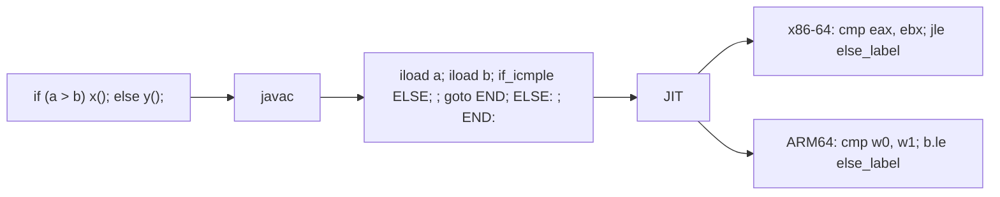

### How the CPU runs an `if`

The JIT lowers an `if_icmpX` to a hardware **compare + conditional jump**:

```asm
; x86-64:
cmp     eax, ebx        ; sets flags: ZF, SF, CF, OF (T04)
jle     else_label      ; jump if a <= b

; ARM64:
cmp     w0, w1          ; sets NZCV flags
b.le    else_label
```

The conditional jump is a *branch* — and the CPU's **branch predictor** decides, before knowing the comparison's outcome, which path to start fetching. Modern predictors are remarkable: 2-bit saturating counters per branch, history-indexed pattern tables, neural-network-inspired correlators. A *consistently-taken* or *consistently-not-taken* branch costs ~1 cycle (the prediction is right, the pipeline keeps moving). A **mispredicted** branch costs ~10-20 cycles (Skylake: ~16-20; Apple M2: ~13) — the pipeline must drain partly-executed wrong-path instructions and restart on the right path.

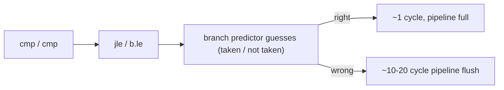

For an `if (n > 0)` in a loop where `n` is usually positive, prediction is ~100% — the branch is effectively free. For a random-data branch (`if (data[i] < threshold)`) with no pattern, prediction is ~50% — half the iterations stall. This is why sorting a vector *before* a branchy reduction can be faster than the unsorted version: the predictor wins after sort.

### `cmov` — branchless selection on x86-64

For very short bodies where both paths are computable and side-effect-free, the JIT may emit a **conditional move** (`cmov` on x86-64, `csel` on ARM64) instead of a branch:

```asm
; int max = (a > b) ? a : b;
mov     eax, edi        ; eax = a (assume a in edi, b in esi)
cmp     edi, esi
cmovl   eax, esi        ; if a < b, eax = b
```

No branch, no prediction, no mispredict cost — always exactly one extra cycle. The JIT uses `cmov` for `?:` and for `if`/`else` blocks that can be flattened to two `mov`s. Beyond that it stays with branches.

## The Ternary `?:` — Selection as an Expression

T04 introduced `?:` as the only ternary operator in Java. As a refresher:

```java
String sign = (n > 0) ? "positive" : (n < 0) ? "negative" : "zero";
int max = (a > b) ? a : b;
double abs = (x < 0) ? -x : x;
```

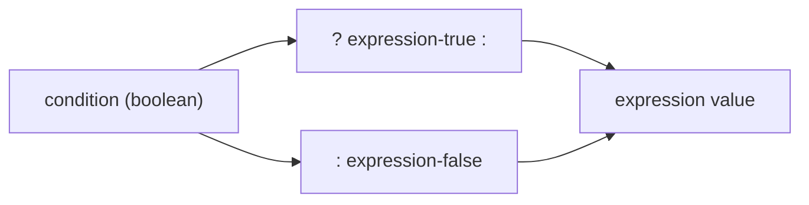

### Typing rules

`(cond ? A : B)` must produce a value of a single type. The JLS §15.25 derives it via:

- **Both operands same type** → that type.
- **Numeric** with different widths → binary numeric promotion (T04) — `int`+`long` → `long`, etc.
- **Reference** types → the *least common ancestor* (lub) in the class hierarchy. `(b ? Integer : Long)` → `Number`.
- **Mixed** primitive and wrapper → autoboxing/unboxing (T05) to align.
- **Special-case** for narrowing: if both branches are CT-constant `int`s that fit in the target's narrower type (`byte`/`short`/`char`), the target type wins (`byte b = cond ? 0 : 1;`).

### Bytecode

A ternary lowers to the same `if`-style branch pattern, except the result is left **on the operand stack** instead of being stored:

```
       iload  n
       iconst_0
       if_icmple ZERO       ; if n <= 0, jump to ZERO
       ldc    "positive"    ; push "positive"
       goto   END
   ZERO:
       ldc    "negative"    ; push "negative" (or "zero" via more nesting)
   END:
       astore_1             ; store the chosen string
```

The same `cmov`/`csel` optimisation applies — if both arms are simple loads, the JIT often eliminates the branch entirely.

### Expression form pays off

The point of `?:` over an `if`/`else` block is that it's an *expression*: it has a value, so you can use it inline:

```java
return list.isEmpty() ? -1 : list.get(0);            // straight from a return
config.put("level", debug ? "DEBUG" : "INFO");        // inline argument
String s = "x = " + ((x < 0) ? "neg" : "non-neg");   // inside string concat
```

That said, **nested ternaries shrink readability fast** — three levels deep is the human limit; beyond that, use `if`/`else if` chains or a `switch`.

## The Classical `switch` Statement

The classical switch dispatches a value against a finite list of constants:

```java
switch (day) {
    case 1:
        System.out.println("Monday");
        break;
    case 2:
        System.out.println("Tuesday");
        break;
    case 3: case 4: case 5:                  // multiple labels share a body
        System.out.println("Wed/Thu/Fri");
        break;
    case 6: case 7:
        System.out.println("weekend");
        break;
    default:
        System.out.println("unknown");
}
```

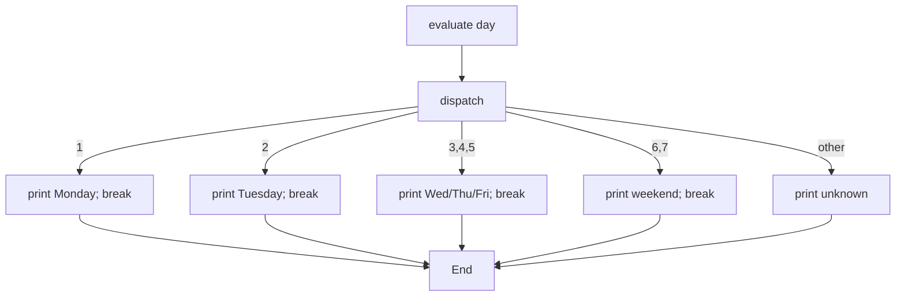

### Allowed selector types

The expression in `switch (x)` must be one of:

- **`byte`**, **`short`**, **`char`**, **`int`** (and the boxed wrappers `Byte`/`Short`/`Character`/`Integer` since Java 7 — auto-unboxed).
- **`enum`** (Java 5+).
- **`String`** (Java 7+).
- **A reference type matching a sealed hierarchy** (Java 21+ pattern matching only).

Not allowed: **`long`** (case constants are limited to `int`-wide), **`float`**, **`double`**, **`boolean`** (always use `if`).

### `case` labels must be compile-time constants

```java
final int OPEN = 1;
case OPEN:        // OK — OPEN is a CT-constant int (T03)

int dynamic = compute();
case dynamic:     // ERROR — not a CT-constant
```

The constraint is structural: the bytecode needs the value in the class file's branch table at compile time. Anything that isn't CT-foldable can't be a label.

### Fall-through and `break`

The classical switch *falls through* by default — if a `case` body doesn't end with `break` (or `return`, or `throw`), execution continues into the next `case`'s body:

```java
switch (n) {
    case 1:
        System.out.println("one");
        // NO break — falls through
    case 2:
        System.out.println("two");
        break;
    case 3:
        System.out.println("three");
        break;
}
// n=1 prints "one" AND "two"; n=2 prints "two"; n=3 prints "three"
```

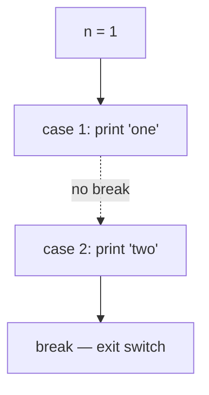

This is *occasionally* useful — sharing a common tail for several cases — but is more often a bug. The new arrow form (`->`) removed fall-through entirely; you should use it for new code unless you really need fall-through.

> [!WARNING]
> **Missing `break` is the #1 classic-switch bug.** Compilers don't warn unless you opt in (`-Xlint:fallthrough`). If you use the classical form, end every body with `break`, `return`, `throw`, or `// FALL THROUGH` comment for the rare intentional case.

### `default` doesn't have to be last

You can place `default:` anywhere — first, last, in the middle. It's the label used when no other matches, regardless of position. By convention it goes last for readability. The bytecode treats it as the dispatch target for any unmatched value; position has no semantic effect.

### Empty case bodies

```java
switch (level) {
    case 0:
    case 1:
    case 2:
        System.out.println("low");
        break;
    case 3:
    case 4:
        System.out.println("mid");
        break;
}
```

The empty cases (`case 0: case 1:`) fall through to `case 2:`. This is the common idiom for **value-set sharing** — three values produce the same behaviour.

## Bytecode: `tableswitch` vs `lookupswitch`

`switch` doesn't lower to a chain of `if_icmpeq`s. The JVM has two dedicated opcodes:

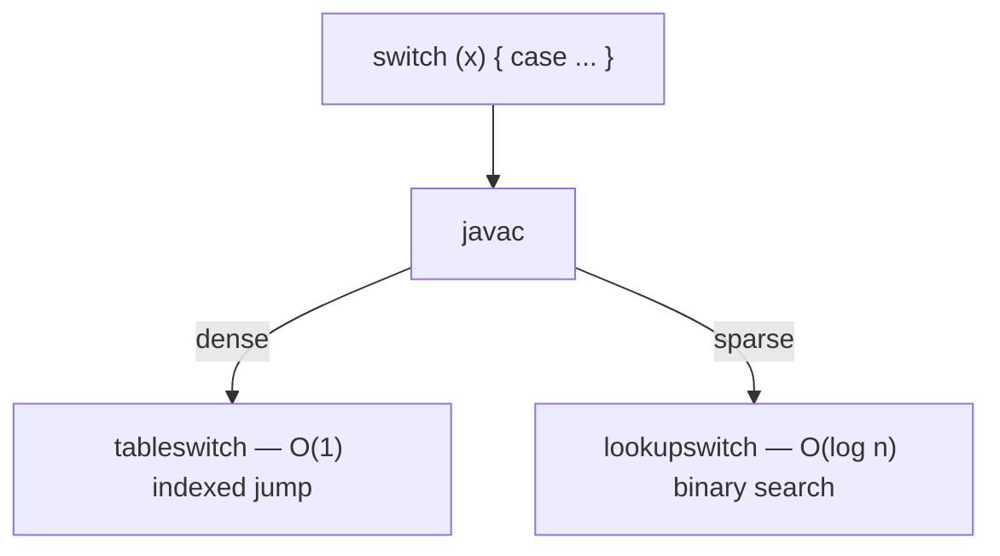

### `tableswitch`

`tableswitch` is a **dense, indexed** dispatch. The bytecode lists a contiguous range of values `low..high` and one **jump offset per value**. At runtime the JVM:

1. Pops `x` from the operand stack.
2. If `x < low` or `x > high`, jumps to the **default** offset.
3. Otherwise, computes `offset = jumpTable[x - low]` and jumps.

That's **O(1)** — one bounds check + one array lookup + one indirect jump. The cost is **memory**: the JVM stores `(high - low + 1)` offsets, even for values that don't have an explicit case (they jump to default).

```
       tableswitch in the .class:

       opcode:       0xAA (170)
       padding:      0-3 bytes to align next field to a 4-byte boundary
       default:      s4   (offset to default body, signed 32-bit)
       low:          s4   (lowest case value)
       high:         s4   (highest case value)
       jumpTable:    s4 × (high - low + 1)   (offset for each value low..high)
```

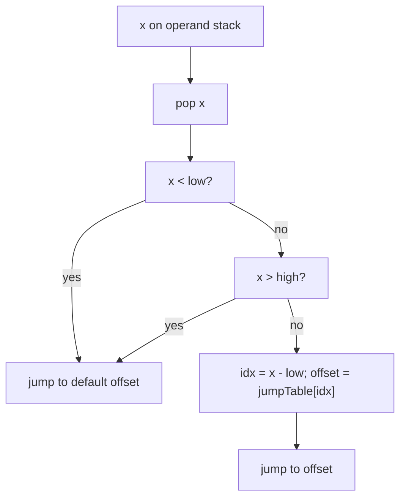

### `lookupswitch`

`lookupswitch` is a **sorted (key, offset) pair list**. At runtime the JVM does a **binary search** for `x` and jumps to the matching offset (or to default).

```
       lookupswitch in the .class:

       opcode:       0xAB (171)
       padding:      0-3 bytes
       default:      s4   (offset to default body)
       npairs:       s4   (number of (key, offset) pairs)
       pairs:        (s4 key, s4 offset) × npairs, SORTED by key
```

Cost: **O(log n)** comparisons; no waste for unused values.

### How `javac` chooses

`javac` computes the size of each form and picks the smaller / cheaper one. The exact rule (from `Code.emitSwitch` in the OpenJDK compiler):

```
       table_space = 4 * (high - low + 1)    // jumpTable bytes
       lookup_space = 8 * npairs              // (key, offset) bytes

       table_time = 3                          // one bounds + one lookup
       lookup_time = log2(npairs)              // binary search depth

       cost(table) = 3 + table_space * weight
       cost(lookup) = log2(npairs) + lookup_space * weight

       choose tableswitch if cost(table) <= cost(lookup)
```

Equivalently, `javac` uses a **density** heuristic: how full is the value range? Roughly, if more than ~30% of values in `[low, high]` are actual case labels, emit `tableswitch`; otherwise `lookupswitch`.

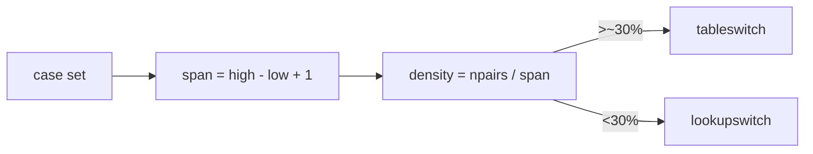

### Worked examples

**Dense** (`case 1, 2, 3, 4, 5`): low=1, high=5, npairs=5. Range = 5. Density = 100%. → **`tableswitch`**.

**Sparse** (`case 1, 1000, 1000000`): low=1, high=1_000_000, npairs=3. Range = 1_000_000. Density ≈ 0.0003%. → **`lookupswitch`** (a `tableswitch` would store ~4 MB of jump offsets).

**Mixed** (`case 1, 2, 3, 100`): low=1, high=100, npairs=4. Range = 100. Density = 4%. → **`lookupswitch`** (table cost ≈ 400 B, lookup cost ≈ 32 B).

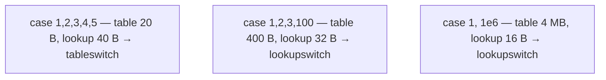

### Disassembling

```bash
$ javac Day.java
$ javap -c Day
```

You'll see one of:

```
       4: tableswitch  { // 1 to 5
                     1: 36
                     2: 47
                     3: 58
                     4: 58
                     5: 58
                default: 69
            }
```

or:

```
       4: lookupswitch { // 3
                     1: 36
                  1000: 47
               1000000: 58
                default: 69
            }
```

### How the JIT lowers each

`tableswitch` → an **indirect jump through a jump table** in the JIT's data area:

```asm
; x86-64:
sub     edi, low_value        ; idx = x - low (assume x in edi)
cmp     edi, span             ; if idx > span, go to default
ja      default
mov     rax, [JT + rdi*8]     ; rax = jumpTable[idx]
jmp     rax                   ; indirect jump

; ARM64:
sub     w0, w0, low_value
cmp     w0, span
b.hi    default
adrp    x1, JT
add     x1, x1, :lo12:JT
ldr     x2, [x1, x0, lsl 3]
br      x2                    ; indirect branch
```

Cost: ~3-5 cycles plus the **BTB cost** of an indirect jump (next section).

`lookupswitch` → a **binary search tree of `cmp+jcc`** instructions. For 8 cases that's ~3 levels; for 100 cases ~7 levels; for 10 000 cases ~14 levels. Predictable and cache-friendly for small N.

```asm
; lookupswitch with 3 cases (e.g. 1, 1000, 1_000_000):
cmp     edi, 1000
je      case_1000
jl      lower_half
cmp     edi, 1000000
je      case_1e6
jmp     default
lower_half:
cmp     edi, 1
je      case_1
jmp     default
```

### Branch-Target Buffer (BTB) and indirect jumps

The `jmp rax` from `tableswitch` is an **indirect branch** — the CPU doesn't know the target until `rax` is computed. To avoid a stall, modern CPUs maintain a **Branch Target Buffer**: a per-branch-address cache predicting the *most recent target(s)* of each indirect branch. If the switch dispatches consistently to the same case (hot enum value), the BTB predicts perfectly and the jump is ~2 cycles. If the dispatch varies randomly, the BTB misses and the jump stalls ~10-20 cycles.

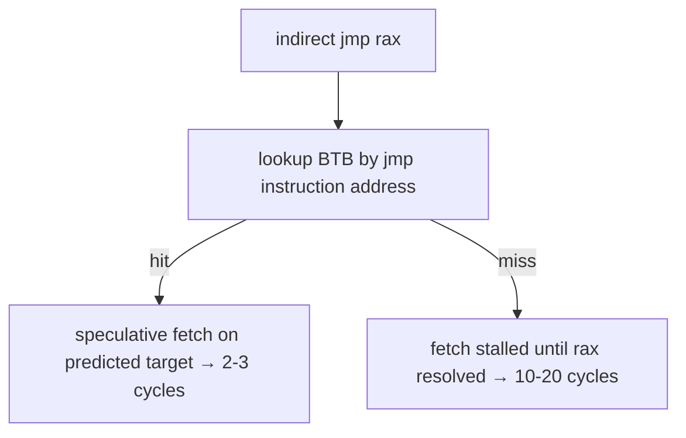

This is why a `switch` on a hot enum where 99% of dispatches go to one case is essentially free; a `switch` on randomly-distributed input may be slower than the equivalent `lookupswitch` (which produces predictable direct branches).

## `switch` on `String` — Java 7+ Two-Step Lowering

Strings can't directly index a jump table. So `javac` lowers a `switch (s)` to a **two-step dispatch**:

1. Compute `s.hashCode()` and dispatch on it via `tableswitch` (or `lookupswitch`) to a per-hash group.
2. Within each group, do `s.equals(literal)` checks to confirm the actual match (because two distinct Strings can share a hashCode — recall T06's `"Aa"`.hashCode() == `"BB"`.hashCode() == 2112).
3. The confirmation maps to a synthetic `int` that the *original* user-level switch then dispatches on via a second `tableswitch`.

```java
switch (s) {
    case "open":   return 1;
    case "close":  return 2;
    case "pause":  return 3;
    default:       return -1;
}
```

lowers to (paraphrased):

```java
int marker = -1;
int hash = s.hashCode();
switch (hash) {                                  // tableswitch on hash
    case 3417674:                                // "open".hashCode()
        if (s.equals("open"))  marker = 0;
        break;
    case 94756344:                               // "close".hashCode()
        if (s.equals("close")) marker = 1;
        break;
    case 106440182:                              // "pause".hashCode()
        if (s.equals("pause")) marker = 2;
        break;
}
switch (marker) {                                // second tableswitch on marker
    case 0: return 1;
    case 1: return 2;
    case 2: return 3;
    default: return -1;
}
```

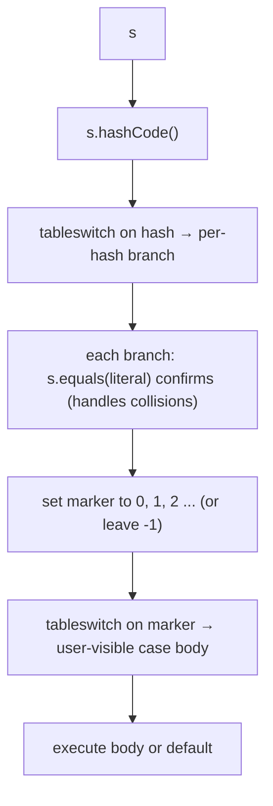

### Collision handling

If two case Strings collide on `hashCode`, the **first** switch's branch tests both with `equals` and assigns the right marker to each:

```java
switch (s) {                  // pretend "Aa" and "BB" are both cases
    case "Aa":  return 1;
    case "BB":  return 2;
}
// lowers to:
int hash = s.hashCode();      // 2112 for both
if (hash == 2112) {
    if      (s.equals("Aa")) marker = 0;
    else if (s.equals("BB")) marker = 1;
}
switch (marker) { ... }
```

The collision is correct (the equals check disambiguates) but slow (two `equals` calls instead of one). Real-world case-set collisions are rare; you usually don't worry about this.

### Why two switches and not one big chain of `if`?

For N cases, the `if`-chain is O(N) `equals` calls in the worst case; the hash dispatch is O(log N) (or O(1) for `tableswitch`) `hashCode` + 1-2 `equals`. For 3 cases it's a wash; for 30 cases it's a big win.

## `switch` on `enum` — The Synthetic `SwitchMap`

Switching on an enum has a problem: the **`case` labels** (e.g. `case Color.RED`) refer to constants in *another* class, but the **bytecode** of the enclosing class must encode them as `int`s at compile time. If `javac` baked the enum's `ordinal()` straight into the `tableswitch`, then *recompiling the enum with reordered constants* would silently break every consumer.

Fix: `javac` generates a **synthetic `int[]` map** in an anonymous inner class, lazily initialised the first time the switch runs:

```java
enum Color { RED, GREEN, BLUE }

void describe(Color c) {
    switch (c) {
        case RED:   System.out.println("warm");   break;
        case GREEN: System.out.println("cool");   break;
        case BLUE:  System.out.println("cool");   break;
    }
}
```

`javac` synthesises a private inner class `EnclosingClass$1` holding:

```java
final class EnclosingClass$1 {
    static final int[] $SwitchMap$Color;
    static {
        $SwitchMap$Color = new int[Color.values().length];
        try { $SwitchMap$Color[Color.RED.ordinal()]   = 1; } catch (NoSuchFieldError e) {}
        try { $SwitchMap$Color[Color.GREEN.ordinal()] = 2; } catch (NoSuchFieldError e) {}
        try { $SwitchMap$Color[Color.BLUE.ordinal()]  = 3; } catch (NoSuchFieldError e) {}
    }
}
```

And the switch becomes:

```
       getstatic     EnclosingClass$1.$SwitchMap$Color : [I
       aload         c
       invokevirtual Color.ordinal : ()I
       iaload                              ; lookup SwitchMap[c.ordinal()]
       tableswitch { 1: redBody, 2: greenBody, 3: blueBody, default: fallthrough }
```

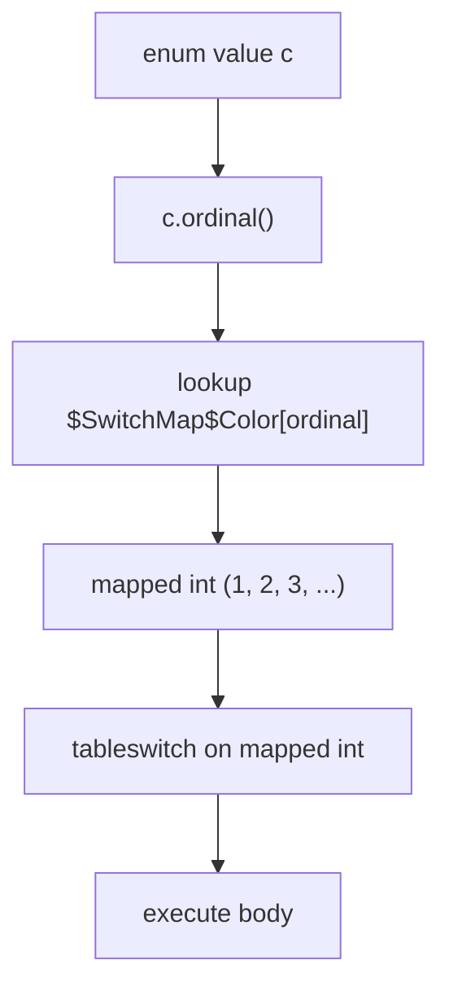

The **point** of the indirection: if the enum class is **separately recompiled** with reordered or removed constants, the `try/catch (NoSuchFieldError)` swallows missing constants and the `$SwitchMap` for missing entries stays `0` (mapping to default), so the enclosing class **still loads** and doesn't crash with a linkage error.

The cost: one extra array lookup per switch. Negligible at runtime; the JIT often inlines the whole thing.

> [!INTERVIEW]
> **"How does a switch on an enum work at the bytecode level?"** `javac` generates a synthetic `int[]` map (`$SwitchMap$EnumType`) in an anonymous inner class, lazily initialised. The switch dispatches `enum.ordinal()` through the map to a stable `int` per case, then a `tableswitch` on that int. This decouples the enclosing class from the enum's ordinal layout, so separate recompilation of the enum class doesn't break the consumer.

## `switch` Expressions (Java 14, JEP 361)

The classical switch is a **statement**: it executes for its side effects, doesn't produce a value, and falls through. JEP 361 (Java 14 standard; preview in 12-13) introduced **switch expressions** — `switch` that *returns a value*, with no fall-through and (for enum/sealed) compile-time exhaustiveness.

### The arrow form

```java
String name = switch (day) {
    case 1 -> "Monday";
    case 2 -> "Tuesday";
    case 3, 4, 5 -> "midweek";    // multiple labels, one arm
    case 6, 7 -> "weekend";
    default -> "unknown";
};
```

Key differences from the classical statement:

- **`->`** replaces `:`. The arrow form means "no fall-through" — execution returns *only* this arm's value.
- **No `break`** needed (or allowed for arrow arms).
- **Multiple labels per arm** with commas: `case 3, 4, 5 -> "midweek"`.
- The switch **is an expression** producing a value — must be assigned, returned, or used somewhere consuming a value.
- **Exhaustiveness checking**: for `enum` or `sealed` selector types, all values must be covered by an arm — else the compiler requires a `default`.

### Block arms with `yield`

For multi-statement arms, use a block and `yield`:

```java
int days = switch (month) {
    case JAN, MAR, MAY, JUL, AUG, OCT, DEC -> 31;
    case APR, JUN, SEP, NOV -> 30;
    case FEB -> {
        boolean leap = isLeap(year);
        yield leap ? 29 : 28;       // yield = "produce this value from this arm"
    }
};
```

`yield` is a **soft keyword** (a `String` named `yield` is still a valid identifier). The compiler reads `yield <expr>;` only inside a switch-expression block arm.

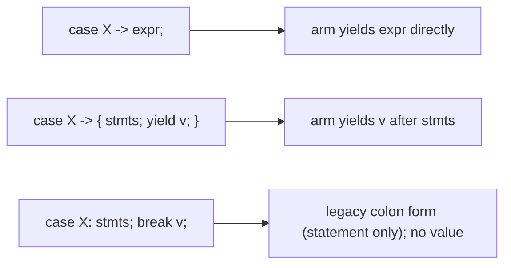

### Exhaustiveness on enums

```java
enum Color { RED, GREEN, BLUE }

String hex = switch (color) {
    case RED   -> "#FF0000";
    case GREEN -> "#00FF00";
    case BLUE  -> "#0000FF";
    // no default needed — all enum values covered
};
```

If you forget one (`BLUE`), the compiler errors: *"the switch expression does not cover all possible input values"*. Add the missing case or a `default`.

### Mixed colon and arrow forms — forbidden

Within a single switch, all arms must be the same form (all `:` or all `->`). Mixing them is a compile error:

```java
switch (n) {
    case 1 -> ...;
    case 2: ...; break;    // ERROR — mixing
}
```

### Bytecode for switch expressions

Switch expressions don't introduce a new opcode. The bytecode is the same `tableswitch`/`lookupswitch` machinery, but each arm leaves its produced value on the operand stack (via `iload`/`ldc`/etc.) and `goto`s to a join label. `yield` is just a `goto` to the join. The join pops the value into wherever the expression is consumed.

```
       <dispatch via tableswitch>
   ARM_1:
       ldc "Monday"
       goto JOIN
   ARM_2:
       ldc "Tuesday"
       goto JOIN
   ...
   JOIN:
       astore  name        ; the switch result lands here
```

Same machinery as before; the *language* enforces single-value-per-arm and no-fall-through; the bytecode is direct and efficient.

## Pattern Matching for `switch` (Java 21, JEP 441)

Java 21 added the most expressive form yet: `case` labels can be **patterns** — type tests with bindings, optionally guarded by a boolean condition.

### Type patterns

Recall T05's pattern-binding `instanceof`: `if (obj instanceof String s) ...` checks the type *and* binds the variable in one step. Pattern matching for switch generalises this:

```java
Object shape = ...;
double area = switch (shape) {
    case Circle c    -> Math.PI * c.radius() * c.radius();
    case Square s    -> s.side() * s.side();
    case Triangle t  -> 0.5 * t.base() * t.height();
    default          -> 0.0;
};
```

Each `case TypeName name` is a **type pattern**: matches if `shape instanceof TypeName`, and binds `name` to the cast value inside the arm.

### Guarded patterns — the `when` clause

A pattern can be guarded by an arbitrary boolean condition:

```java
String describe = switch (obj) {
    case Integer i when i > 0  -> "positive int";
    case Integer i when i < 0  -> "negative int";
    case Integer i             -> "zero";
    case String s when s.isEmpty() -> "empty string";
    case String s              -> "non-empty: " + s;
    case null                  -> "null!";
    default                    -> "other";
};
```

The `when` clause runs *after* the type-pattern matches; if the guard returns `false`, the case **does not** match — control moves to the next case (no fall-through to the body, just to the next dispatch).

### The `null` case — finally

Pre-Java 21 `switch (s)` where `s` is `null` threw `NullPointerException`. Java 21 pattern-matching switch can handle `null` **explicitly**:

```java
switch (obj) {
    case null         -> System.out.println("null received");
    case String s     -> System.out.println("string: " + s);
    case Integer i    -> System.out.println("int: " + i);
    default           -> System.out.println("other");
}
```

If `case null` is *not* present, a `null` selector still throws `NullPointerException` (the `case null` opt-in preserves backward compatibility).

You can combine `null` with `default` as a *single* arm:

```java
switch (obj) {
    case String s -> "string";
    case null, default -> "anything else, including null";
}
```

### Dominance ordering

A more-general pattern must not appear *before* a more-specific one — otherwise the specific case is unreachable. The compiler **enforces** this:

```java
switch (obj) {
    case Object o     -> "anything";   // ERROR if there's a later case Integer
    case Integer i    -> "an int";     // unreachable — caught by case Object first
}
```

The compiler error tells you exactly which case is dominated by which. Reorder to fix.

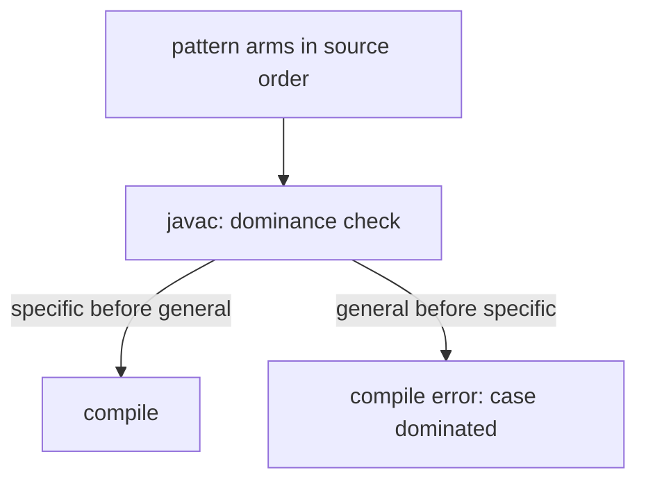

### Exhaustiveness on sealed hierarchies

Pattern matching is most powerful with **sealed interfaces/classes** (full coverage in `L1/C01`, previewed here):

```java
sealed interface Shape permits Circle, Square, Triangle {}
record Circle(double radius) implements Shape {}
record Square(double side) implements Shape {}
record Triangle(double base, double height) implements Shape {}

double area = switch (shape) {
    case Circle c    -> Math.PI * c.radius() * c.radius();
    case Square s    -> s.side() * s.side();
    case Triangle t  -> 0.5 * t.base() * t.height();
    // no default needed — exhaustive over the sealed permits list
};
```

If you later add a fourth subtype to `permits`, the compiler errors at *every* switch over `Shape` until you add the case — **closed-world safety**. The classical statement form has no such guarantee.

### Record patterns (Java 21)

Records can be **destructured** in the pattern:

```java
double area = switch (shape) {
    case Circle(double r)         -> Math.PI * r * r;
    case Square(double s)         -> s * s;
    case Triangle(double b, double h) -> 0.5 * b * h;
};
```

The pattern `Circle(double r)` matches a `Circle` and binds `r` to its single component, all in one go. Nested record patterns are allowed.

## Bytecode for Pattern-Matching `switch` — `invokedynamic SwitchBootstraps.typeSwitch`

Type-pattern switch can't use `tableswitch` directly because the labels are *classes* (or `null`, or "anything else"), not integer constants. Java 21 added a new lowering: a **single `invokedynamic`** to `java.lang.runtime.SwitchBootstraps.typeSwitch`, returning the **index** of the first matching label (or `-1`), followed by a downstream `tableswitch` on that index.

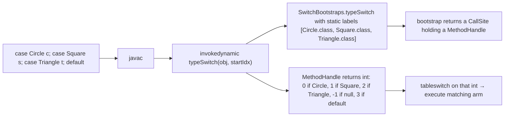

The bootstrap method receives:
- The selector value at runtime.
- The starting index (for restart-after-guard-fail).
- The static argument list of labels (`Class` objects, sentinel for `null`, sentinel for `default`).

It returns the case index. The downstream `tableswitch` on that index dispatches.

### Guards in the bytecode

If a case has a `when` guard, the lowering looks like:

```
       invokedynamic typeSwitch ; returns case index
       tableswitch on index
   ARM_1_with_guard:
       <evaluate guard>
       ifeq RETRY_AT_INDEX_1   ; if guard false, retry from next index
       <body>
   RETRY_AT_INDEX_1:
       iconst 2                 ; advance index past failed arm
       <re-invoke invokedynamic with new startIdx>
       tableswitch on new index
       ...
```

In other words: pattern-matching switch is a *loop* over the case list (under the hood), restarting after a failed guard. The compiler unrolls this for static cases.

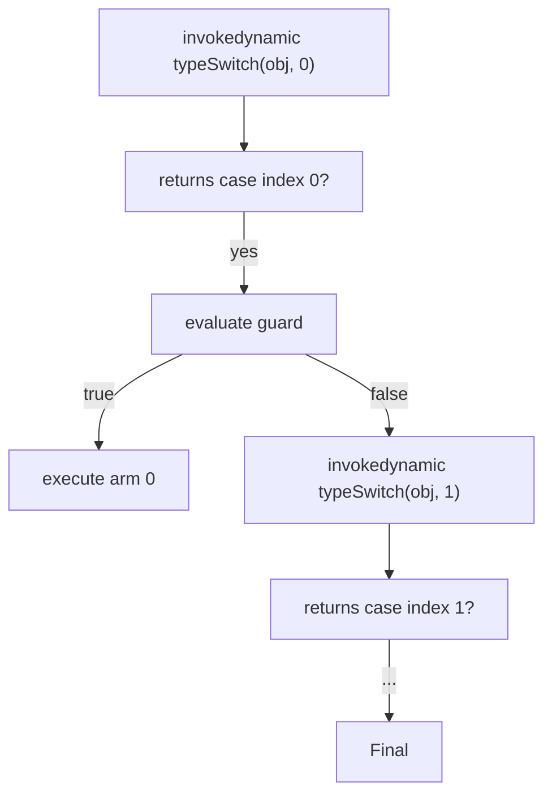

## When to Choose What

A practical decision guide.

| Situation                                                  | Best choice                       |
|------------------------------------------------------------|-----------------------------------|
| 2-3 boolean conditions, mixing ops                         | `if`/`else if`                    |
| Inline value selection                                     | `?:` ternary                      |
| Dispatch on `int`/`enum`/`String`, side effects, no value  | classical `switch` statement (or arrow form)     |
| Dispatch on `int`/`enum`/`String`, produces a value        | `switch` expression with `->`     |
| Dispatch over a sealed hierarchy, branches differ by type  | pattern-matching `switch`         |
| Need to bind a typed view of `Object`                      | `instanceof` + binding *or* `switch` over types |
| Random-access dispatch (lookup table)                      | `Map<K, V>` / `EnumMap`           |

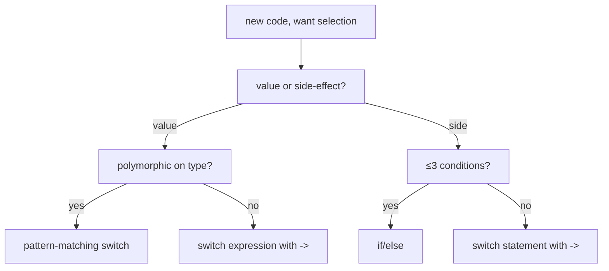

### Performance — usually `switch` wins for dense int dispatch

For dense `int`/`enum` dispatch with many cases, `switch` beats chained `if` because:

1. **`tableswitch` is O(1).** Hardware indexed jump.
2. **BTB-friendly.** One indirect branch site instead of N direct ones, all sharing prediction history.
3. **Cache-friendly.** Smaller code footprint than N `if_icmpeq` pairs.

For sparse or polymorphic dispatch, `switch` and chained-if are roughly equal — both produce O(log n) or O(n) comparisons. The JIT can transform between them in some cases.

**Rule of thumb**: prefer the form that **reads** clearest. Micro-optimising switch-vs-if is rarely worth it unless profiling shows the dispatch is a hot path.

## Common Mistakes

```java
// 1. Missing break in classical switch — fall-through bug.
switch (n) {
    case 1: log("one");      // forgot break — also logs "two"!
    case 2: log("two"); break;
}

// 2. Using = instead of ==.
if (x = 0) ...   // ERROR — assignment to int doesn't produce boolean in Java
                  // (this IS allowed in C; Java rejects it at compile time)
if (b = false) ... // COMPILES if b is boolean — assigns false, condition is false. Subtle bug.

// 3. NPE on switch (s) when s is null (pre-Java 21).
String s = null;
switch (s) { case "x": ... }   // NPE!
// Java 21+:
switch (s) { case null -> ...; case "x" -> ...; }   // safe

// 4. Adding an enum constant without updating switches.
enum Color { RED, GREEN, BLUE, /* added later: */ YELLOW }
switch (c) {
    case RED:   ...; break;
    case GREEN: ...; break;
    case BLUE:  ...; break;
    // forgot YELLOW — classical statement: silent fall-out (no body runs).
    //                  switch EXPRESSION on enum: compile error (exhaustive).
}

// 5. Dangling else.
if (a)
    if (b) x();
else
    y();    // binds to inner if (b), not outer — likely a bug

// 6. Stray semicolon.
if (x > 0); { y(); }    // the ; is the if's body; the block ALWAYS runs

// 7. Side-effects in ternary.
int v = (counter++ > 0) ? a : (counter += 10);   // hard to read, subtle ordering

// 8. switch on long — not allowed.
switch (timestamp) { ... }     // ERROR: long not allowed (case labels are int-wide)

// 9. switch on float/double — not allowed (precision/IEEE comparison ambiguity).
switch (price) { ... }         // ERROR

// 10. case constant must be CT-constant.
int OPEN = 1;     // not final
case OPEN: ...    // ERROR — OPEN is not a CT-constant int (T03)

// Fix:
final int OPEN = 1;
case OPEN: ...    // OK

// 11. case "Aa", case "BB" — hashCode collision, works correctly but slower.
switch (s) {
    case "Aa": ...
    case "BB": ...   // same hashCode 2112 — javac emits an equals chain
}

// 12. Pattern matching: dominated case.
switch (obj) {
    case Object o -> "any";
    case Integer i -> "int";   // ERROR — dominated by Object o above
}

// 13. Pattern matching: not exhaustive on sealed type.
sealed interface Shape permits Circle, Square {}
switch (shape) {
    case Circle c -> ...;
    // forgot Square — ERROR on sealed exhaustiveness check
}
```

> [!INTERVIEW]
> Reliable control-flow questions:
> - **"What's the difference between `if` and `switch` at the bytecode level?"** `if` lowers to `if_icmp*`/`ifX`/`goto` (one comparison + one branch per `else if`). `switch` lowers to a single `tableswitch` (O(1) dense) or `lookupswitch` (O(log n) sparse) — one instruction handles the whole dispatch.
> - **"When does javac emit `tableswitch` vs `lookupswitch`?"** Based on a density heuristic: roughly, if the case values are dense (>~30% of the range), `tableswitch`; if sparse, `lookupswitch`. The exact formula compares `4 * (high - low + 1)` bytes (table) vs `8 * npairs` bytes (lookup) and picks the smaller-cost form.
> - **"How does a switch on `String` work?"** Two-step: first dispatch on `s.hashCode()` via `tableswitch`; within each hash bucket, an `equals` chain (handles collisions) assigns a synthetic `int` marker; second `tableswitch` on the marker reaches the user-visible body.
> - **"How does a switch on an `enum` work?"** `javac` generates a synthetic `int[] $SwitchMap$EnumType` in an anonymous inner class, mapping `enum.ordinal()` to a stable per-case int. The switch dispatches on the mapped int, so separate recompilation of the enum doesn't break the consumer.
> - **"What's a switch expression vs statement?"** Statement (`case X: ...; break;` colon form) executes for side effects. Expression (`case X -> ...;` arrow form, Java 14+) produces a value; uses `->` syntax; no fall-through; allows multi-label cases; for enum/sealed selectors, exhaustiveness is checked at compile time. Use `yield` inside a block arm.
> - **"What's a type pattern in a switch?"** Java 21 (JEP 441): `case TypeName name -> ...` tests `selector instanceof TypeName` and binds `name` inside the arm. Optionally guarded by `when <boolean>`.
> - **"How does the JIT lower a `tableswitch`?"** Index-based indirect jump through a jump table in `.rodata`: bounds check + `mov rax, [JT + idx*8]; jmp rax` on x86-64; `adr/ldr/br` on ARM64. Cost is 3-5 cycles plus BTB hit/miss.
> - **"What's the BTB?"** Branch-Target Buffer — per-branch-address cache predicting indirect branches' targets. A switch dispatch consistently going to one case hits the BTB (~2-3 cycles); a randomly-distributed dispatch misses (~10-20 cycles).
> - **"Can a `switch` selector be `long`?"** No — `case` labels are `int`-wide, and `long` doesn't fit. Use `if`/`else if` or hash into an `int` range.
> - **"How is `null` handled in switch?"** Pre-Java 21: `switch (null)` throws NPE. Java 21+: a `case null` arm catches null explicitly (or `case null, default ->` combines null with default).

## Practice

1. **`if` to bytecode.** Write a method `int sign(int n)` with an `if`/`else if`/`else` returning −1/0/1. Disassemble with `javap -c`. Identify each `if_icmp*` and `goto` instruction. Predict what the JIT emits (cmov? branch?).
2. **Ternary vs `if`.** Write `int max1(int a, int b)` as `if (a > b) return a; else return b;` and `int max2(int a, int b)` as `return (a > b) ? a : b;`. Compare bytecode via `javap -c`. They should be nearly identical. Now run `-XX:+PrintAssembly` and confirm both compile to a `cmov` (x86-64) or `csel` (ARM64) — no branch.
3. **`tableswitch` from javap.** Write a `dayName(int d)` switch over `case 1..7` (each case a `String` body). Disassemble with `javap -c`. Confirm the opcode is `tableswitch` with `low=1, high=7`.
4. **`lookupswitch` from javap.** Replace the day-of-week with `case 1, 10, 100, 1000`. Disassemble. Confirm the opcode flipped to `lookupswitch`. Predict the threshold; verify by adjusting cases until it flips back.
5. **String switch lowering.** Write a switch over 3 String constants. Run `javap -c`. Find the two `tableswitch` opcodes (or `tableswitch` + `lookupswitch`). Identify the `hashCode` call and the `equals` calls.
6. **String hash collision in switch.** Write `switch (s) { case "Aa": ... case "BB": ... }`. Disassemble. Find the single hash branch (`2112`) and the two `equals` checks inside it.
7. **Enum SwitchMap.** Write an enum `Color { RED, GREEN, BLUE }` and a switch over it. Run `javap -c -p` and look for the synthetic `$SwitchMap$Color` array in `EnclosingClass$1`. Confirm the `iaload` precedes the `tableswitch`.
8. **Forgotten break.** Write a classical switch with intentionally-omitted `break`s. Add `-Xlint:fallthrough` to javac and observe the warnings. Mark intentional fall-throughs with `// fall through`.
9. **Port to arrow form.** Take the same switch, rewrite using `->` arms. Confirm no `break` is needed, and the bytecode is similar (the difference is structural, not opcode-level).
10. **Block arm with `yield`.** Write a switch expression where one arm is a block with multiple statements and a `yield`. Confirm `javap -c` shows the same `tableswitch` machinery — just multiple opcodes before the value-producing branch.
11. **Exhaustiveness check.** Write a switch *expression* over an `enum` of 4 values. Cover only 3 arms — observe the compile error. Add the missing case or a `default`.
12. **Pattern matching introduction.** Define a `sealed interface Shape permits Circle, Square` with records. Write a switch expression that pattern-matches on each. Add a fourth subtype to `permits` and observe the compile error.
13. **Guarded patterns.** Write a switch over `Object` distinguishing `Integer i when i > 0`, `Integer i when i < 0`, `Integer i` (catches zero), `String s when s.isEmpty()`, `String s`, `null`, and a default. Trace which arm fires for several inputs.
14. **Null case.** Write a switch over a `String` that may be null. Compare classical (NPE) vs pattern-matching (`case null` arm) handling. Predict and verify.
15. **Dominance error.** Write a pattern-matching switch with `case Object o` before `case Integer i`. Observe the compile error. Reorder to fix.
16. **BTB performance test.** Build two switches — one that always dispatches to the same `case` (hot key), one that dispatches across all cases uniformly randomly. Time them with `System.nanoTime()` over 10M iterations. The first should be ~3× faster due to BTB hits.
17. **Explain it back.** Trace `switch ("open") { case "open" -> 1; case "close" -> 2; default -> 0; }` from source through (a) the two-step String switch lowering, (b) the bytecode tableswitches, (c) the JIT's indirect jump, (d) the BTB prediction the first vs the fifth time the line runs.

## Recap

You should now be able to:

- Distinguish the three **selection** forms — `if`/`else`/`else if` for general boolean conditions, `?:` for selecting one of two values inline, and `switch` for value-driven dispatch on `int`/`enum`/`String`/sealed-hierarchy patterns.
- Apply the **dangling-else rule** (`else` binds to the nearest unmatched `if`) and the *always-brace* convention to avoid it.
- Trace `if`/`else` to bytecode (`if_icmpX` family inverted to skip on false; `goto` for the else jump; the JIT's `cmp + jcc` on x86-64 / `cmp + b.cond` on ARM64), and explain the **branch predictor** (2-bit counters, history-indexed pattern tables) and the cost of a mispredict (~10-20 cycles).
- Recognise the **`cmov`/`csel`** branchless lowering for short ternaries — eliminates the branch entirely at the cost of always computing both arms (~1 extra cycle).
- Distinguish the classical switch **statement** (colon form, fall-through, `break`-terminated) from the new switch **expression** (arrow form, no fall-through, value-producing, multi-label cases, `yield` in block arms).
- List the **allowed selector types** — `byte`/`short`/`char`/`int` (and wrappers), `enum`, `String`, plus `Object`/sealed types in pattern matching. **Not** allowed: `long`, `float`/`double`, `boolean`.
- Recall the **CT-constant requirement** for classical `case` labels (T03's compile-time constant rule).
- Explain the **`tableswitch` vs `lookupswitch`** bytecode opcodes, when `javac` picks each (the density heuristic: roughly >30% of `[low, high]` filled → tableswitch), and the byte-level layout of each (`tableswitch`: default + low + high + N offsets; `lookupswitch`: default + npairs + sorted (key, offset) pairs).
- Trace the **String switch** two-step lowering (Java 7+): `hashCode` dispatched via `tableswitch` to per-hash buckets; each bucket runs `equals` to confirm (handling hash collisions like `"Aa"`/`"BB"`); the confirmation sets a synthetic `int` marker; a second `tableswitch` on the marker reaches the user body.
- Trace the **enum switch** indirection through a synthetic `$SwitchMap$EnumType` `int[]` in an inner class — lazy-initialised, swallows `NoSuchFieldError` so separately-recompiled enum classes don't break the consumer.
- Author **switch expressions** (Java 14+, JEP 361) with `->`, multi-label cases, `yield` in block arms, and benefit from **exhaustiveness checking** on enum/sealed selectors.
- Author **pattern-matching `switch`** (Java 21, JEP 441) with **type patterns** (`case TypeName name`), **guarded patterns** (`when <boolean>`), the **`null` case**, **dominance ordering** (more-specific patterns before more-general ones), and **sealed exhaustiveness** (compiler enforces total coverage).
- Recognise that pattern-matching switch lowers to **`invokedynamic SwitchBootstraps.typeSwitch`** returning a case index, followed by a downstream `tableswitch`. Guards re-invoke the bootstrap from the next index, effectively looping through cases.
- Predict the JIT's **architecture-level lowering**: `tableswitch` → indirect jump through a `.rodata` jump table (`jmp [JT + idx*8]` on x86-64, `adr + ldr + br` on ARM64), 3-5 cycles plus BTB cost; `lookupswitch` → binary-search tree of `cmp + jcc`; `if`-chains → linear sequence of conditional branches.
- Explain the **Branch-Target Buffer (BTB)** and why a switch on a hot, predictably-distributed selector is essentially free, while a switch on randomly-distributed input may stall on every dispatch.
- Avoid the **common traps**: missing `break`, `=` vs `==`, NPE on `switch (null)` pre-Java-21, silent fallout on a new enum constant, dangling-else without braces, stray `;` after `if (cond)`, side-effects inside `?:`, switch on `long`/`float`/`double`/`boolean`, non-CT-constant case labels, dominated patterns.

## Next

Continue to [Loops (while, do-while, for, for-each)](./T09-loops-while-do-while-for-for-each.md).
