# Loops (while, do-while, for, for-each)

A program needs **sequence**, **selection**, and **repetition**. T01–T07 covered sequence, [T08](./T08-control-flow-if-else-switch-switch-expressions.md) covered selection; this topic covers **repetition** — the four loop constructs Java offers and the machinery underneath them. Loops are the workhorse of every non-trivial program: searching an array, accumulating a sum, reading a file line by line, draining a queue, polling a sensor. They are also the construct where the JIT does its most aggressive work — **loop-invariant code motion**, **strength reduction**, **range-check elimination**, **auto-vectorisation**, and **unrolling** all live here.

The depth-bar requirement is not just "show the four forms." A loop is one of the most interesting constructs at the machine level: at the **bytecode** layer it lowers to a `goto` that jumps **backward** plus an `if_icmp*` at the top (or `ifeq` at the bottom for `do-while`); the `for` is decomposed into an `init` + a `while` + an `update`; `i++` becomes a single dedicated opcode `iinc`; `for-each` over an **array** compiles to a 3-local indexed `for` with no `Iterator` allocation, while `for-each` over an `Iterable` allocates **one** `Iterator` per loop run and dispatches through `hasNext`/`next`. At the **architecture** layer, the JIT turns this into ~3-cycles-per-iteration native code via LICM, strength reduction (`×2` → `<<1`), unrolling (factor 2/4/8), and on numeric arrays often **SIMD** (16-byte SSE2, 32-byte AVX2, 16-byte NEON). At the **CPU** layer, the backward branch is the textbook "predict taken" case — modern predictors are ~99% right and the *only* mispredict in a 1000-iteration loop is the last one. We'll cover every layer.

> [!NOTE]
> Prerequisites: [Program Structure](./T01-program-structure-class-main-statements.md) (`L0/C02/T01`) — blocks, statements, the `{...}` rule; [Variables & Primitive Types](./T02-variables-and-primitive-types.md) (`L0/C02/T02`) — the stack-frame slot layout for the induction variable; [Literals & Constants](./T03-literals-and-constants-final.md) (`L0/C02/T03`) — compile-time constants; [Operators](./T04-operators-arithmetic-relational-logical-bitwise-assignment.md) (`L0/C02/T04`) — the `if_icmp*` family, the `++`/`--` increment, the relational `<`/`<=`/`>=` that drives the condition; [Type Conversion & Casting](./T05-type-conversion-and-casting.md) (`L0/C02/T05`) — auto-widening of `byte`/`short` to `int` in conditions; [Control Flow](./T08-control-flow-if-else-switch-switch-expressions.md) (`L0/C02/T08`) — `if`/`else`, the inverted-branch idiom (`if_icmpge` to skip on false), `break`-semantics intuition; [Source to Bytecode to JVM to Machine Code](../C01-cs-foundations/T04-source-to-bytecode-to-jvm-to-machine-code.md) (`L0/C01/T04`) — `.class` opcodes, operand stack, the `goto` instruction.

## Repetition: Why Loops Exist

Without repetition, you'd have to write the same statement N times to do something N times. Loops let you write a **single block** and run it **many times** with a controlled exit condition. The simplest version is:

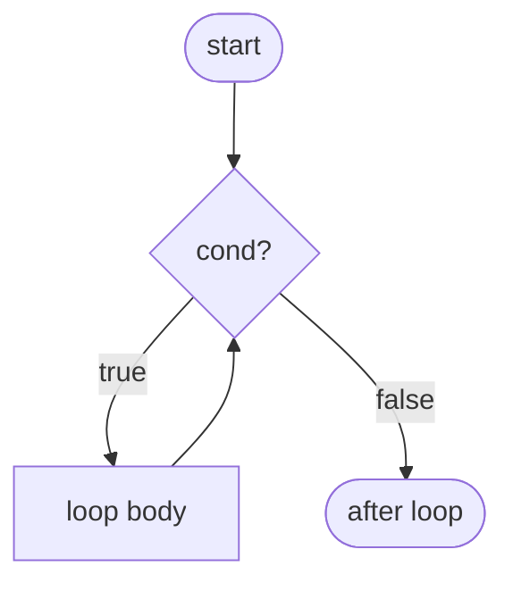

That picture — a body that runs **only if** a condition is true, and **re-enters** the test after each pass — is what every loop boils down to. Three things vary across the four Java forms:

1. **When the test runs** — before the body (`while`, `for`, `for-each`) or after (`do-while`).
2. **What the test is** — an arbitrary boolean predicate (`while`, `do-while`, `for`) or a hidden "is there another element?" call (`for-each`).
3. **What the syntax bundles** — bare test (`while`/`do-while`), bundled init/test/update (`for`), bundled element extraction (`for-each`).

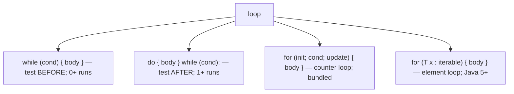

Java has **no** `loop`, `repeat`, or `until` keyword. Every iteration in Java is one of these four. (The Streams API offers a *functional* alternative — `stream.forEach(...)` — but it ultimately delegates to an Iterator-driven for-each at runtime.)

## `while` — Test First, Run Zero-or-More Times

The most general form. Evaluate the condition; if `true`, run the body and re-test; if `false`, fall through.

```java
int i = 0;
while (i < 5) {
    System.out.println(i);
    i++;
}
```

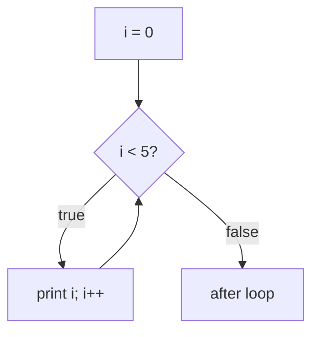

### When to use

`while` is the right form when you **don't know the iteration count in advance** — you're consuming until something runs out:

```java
Scanner in = new Scanner(System.in);
while (in.hasNextLine()) {
    process(in.nextLine());
}
```

```java
Node n = head;
while (n != null) {
    visit(n);
    n = n.next;
}
```

```java
while (!queue.isEmpty()) {
    Job j = queue.poll();
    j.run();
}
```

Each of these has no natural counter; the loop ends when an external signal says "no more". A `for(int i = 0; i < N; i++)` would force you to invent a counter you don't need.

### Syntax notes

- The **condition** must be `boolean` (or `Boolean`, auto-unboxed). Unlike C, `while (n)` where `n` is `int` does **not** compile (covered in T08).
- The **body** is a single statement; almost always a block `{ ... }`. Always brace, even for a one-liner — see the warning below.
- The loop runs **zero or more** times. If the condition is `false` on entry, the body never executes.
- `while (true) { ... }` is the idiomatic **infinite loop**; you exit via `break`, `return`, or an exception.

> [!WARNING]
> The most common `while` bug is a **stray semicolon** after the header:
>
> ```java
> int i = 0;
> while (i < 5);          // empty body — semicolon ends the loop
>     i++;                // never runs as part of the loop
> ```
>
> This compiles cleanly and spins forever on the empty body (`i` is never updated). The intended body becomes a single statement *after* the loop. Always brace.

## `do-while` — Test After, Run One-or-More Times

Same as `while`, but the test runs **after** the body — so the body always runs **at least once**. The trailing semicolon is part of the syntax.

```java
int guess;
do {
    guess = prompt("Guess a number: ");
} while (guess != target);
```

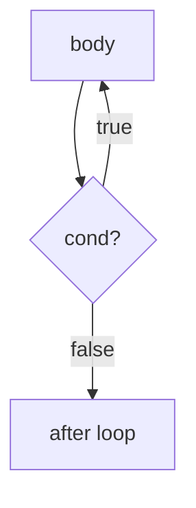

### When to use

When the *first* iteration must run unconditionally and you can only judge "should I stop?" *after* doing it once:

- **Input validation** — prompt the user, then check if the input was valid; if not, prompt again.
- **Retry loops** — try the operation, then check if it succeeded.
- **Menu loops** — show the menu, read a choice, run the action; repeat until "quit".

`do-while` is the **least-used** of the four. Many style guides discourage it on the grounds that the condition at the bottom is easy to miss when scanning code; the equivalent `while (true) { ... if (cond) break; }` is sometimes preferred for clarity. Use it when "at-least-once" is the natural reading.

> [!IMPORTANT]
> Remember the trailing semicolon: `} while (cond);`. Without it, the parser sees `while (cond) <next-statement>` and reinterprets the program — usually with a confusing error far from the actual mistake.

## `for` — Counter-Driven, Bundled Init/Test/Update

The C-style counter loop. Three semicolon-separated clauses in the header.

```java
for (int i = 0; i < 5; i++) {
    System.out.println(i);
}
```

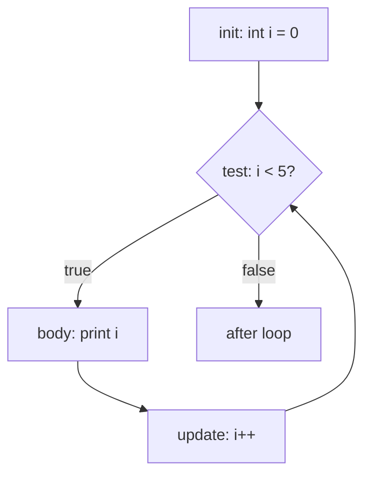

### Three header clauses

| Clause | Role | When evaluated | Optional? |
|--------|------|---------------|-----------|
| `init` | Declare/initialise loop variables | Once, before the first test | Yes (empty: `;`) |
| `cond` | Boolean test | Before each iteration (incl. the first) | Yes — empty means *always true* |
| `update` | Step the counter | After each body run, before re-test | Yes |

All three are optional. `for (;;)` is the canonical infinite `for` (and compiles to *exactly* the same bytecode as `while (true)`).

### Multi-variable headers

The init clause can declare multiple variables of the **same type**, separated by commas; the update clause can run multiple expressions:

```java
for (int i = 0, j = nums.length - 1; i < j; i++, j--) {
    swap(nums, i, j);
}
```

This is a two-pointer reverse — `i` walks from the start, `j` from the end, meeting in the middle. Note: `int i = 0, j = ...` is **one** declaration of two `int`s; you cannot mix types here (`int i = 0, String s = ""` is illegal).

### When to use

`for` is the right form when you have a **known iteration count** or a **driving counter**:

```java
for (int i = 0; i < arr.length; i++) { sum += arr[i]; }    // index-based scan
for (int i = n; i > 0; i--) { ... }                         // countdown
for (int i = 0; i < n; i += 2) { ... }                      // step by 2
for (Node n = head; n != null; n = n.next) { visit(n); }    // linked-list walk
```

That last example is the "for as a generalised while" — there's no counter, but the bundled init/cond/update keeps the three pieces of loop state together.

### Loop-variable scope

A variable declared in the `init` clause lives **only inside the loop**:

```java
for (int i = 0; i < 5; i++) { ... }
System.out.println(i);    // COMPILE ERROR: i is not in scope here
```

This is a deliberate departure from very-old C (where `for (int i...)` leaked `i` into the enclosing scope). It plugs a major source of bugs and lets you reuse the name `i` in adjacent loops.

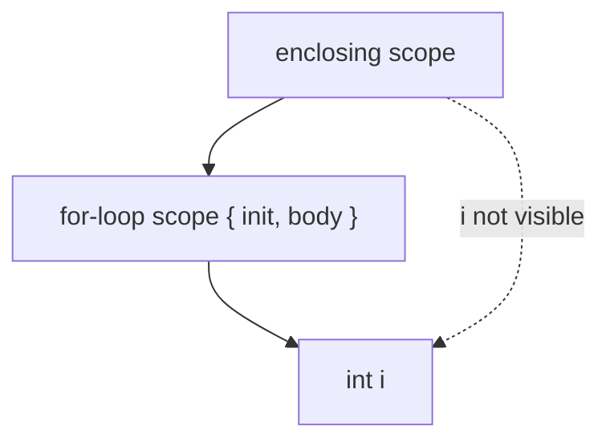

## `for-each` — Element Loop (Java 5+)

The **enhanced** `for`. Syntax sugar over "give me every element of this thing in order, one at a time."

```java
int[] arr = {1, 2, 3, 4, 5};
for (int x : arr) {
    System.out.println(x);
}
```

```java
List<String> names = List.of("Alice", "Bob", "Carol");
for (String name : names) {
    System.out.println(name);
}
```

The `:` reads "in". There's no index, no counter, no `hasNext` call in the source — the compiler emits all of that for you. Behind the scenes, the compiler lowers `for (T x : source)` into **two different** desugarings depending on whether `source` is an array or an `Iterable`. We'll see the bytecode below; for now, the rule:

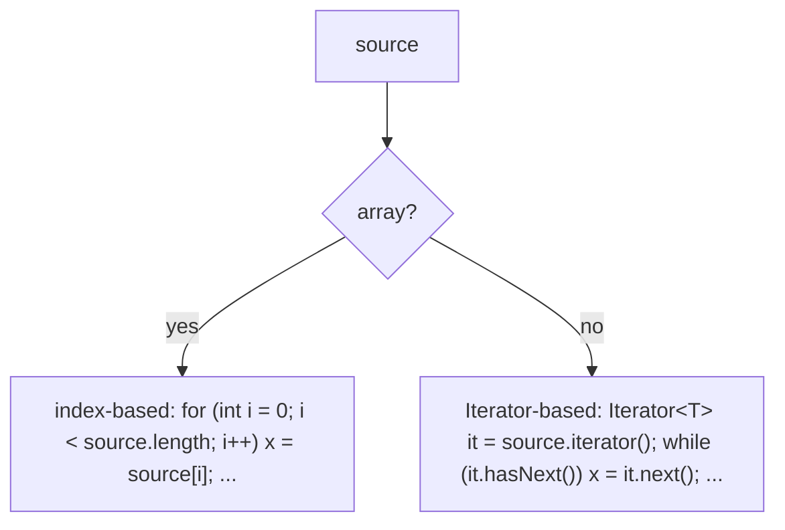

### When to use

`for-each` is the right form when you want **every element exactly once, in order, and you don't need the index**. This is most of the time:

```java
int total = 0;
for (int x : nums) { total += x; }                  // sum
for (Order o : orders) { o.confirm(); }              // side-effect on each
for (String line : reader.lines().toList()) { ... }  // streamed lines
```

If you **need the index** (to print "[3] = foo"), use a counter `for`. If you **need to remove or insert** during iteration, use an explicit `Iterator` with its `remove()` method (`for-each` will throw `ConcurrentModificationException` — see the Common Mistakes section).

### What `for-each` requires of `source`

Either:

- **An array** of any element type (primitive or reference).
- **An `Iterable<T>`** — any type that implements `java.lang.Iterable<T>`. All `Collection<T>` types do (`List`, `Set`, `Queue`, `Deque`, ...). `Map<K,V>` does not directly — you iterate `map.keySet()`, `map.values()`, or `map.entrySet()`.

You cannot `for-each` over a raw `Iterator<T>` directly (the loop calls `.iterator()` once at the start; an `Iterator` is the *result* of that call, not the input).

## Choosing the Right Loop

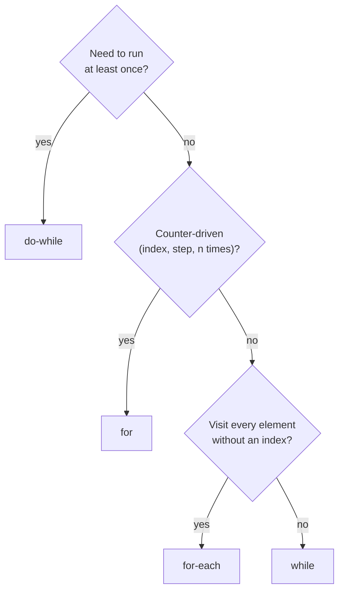

Default rules of thumb:

- **Iterating a collection or array, don't need the index?** `for-each`.
- **Counter loop with known bounds?** `for`.
- **Loop until some external condition flips?** `while`.
- **First iteration must always run?** `do-while`.

Any of the four can be expressed as any of the others. The choice is a matter of *intent* — the reader should pick up "what's this loop for?" from the form alone.

## `break` and `continue` — Loop Exits and Re-tests (Preview)

Two statements jump out of or restart a loop body. They get their full treatment in [T10](./T10-break-continue-labels.md); this section is the preview.

- **`break;`** — exit the enclosing loop immediately. Control jumps to the statement after the loop.
- **`continue;`** — skip the rest of the body, jump to the next iteration's test (and, in a `for`, run the `update` clause first).

```java
for (int i = 0; i < n; i++) {
    if (arr[i] == target) { found = i; break; }   // stop the search
    if (arr[i] < 0) continue;                      // skip negatives
    sum += arr[i];
}
```

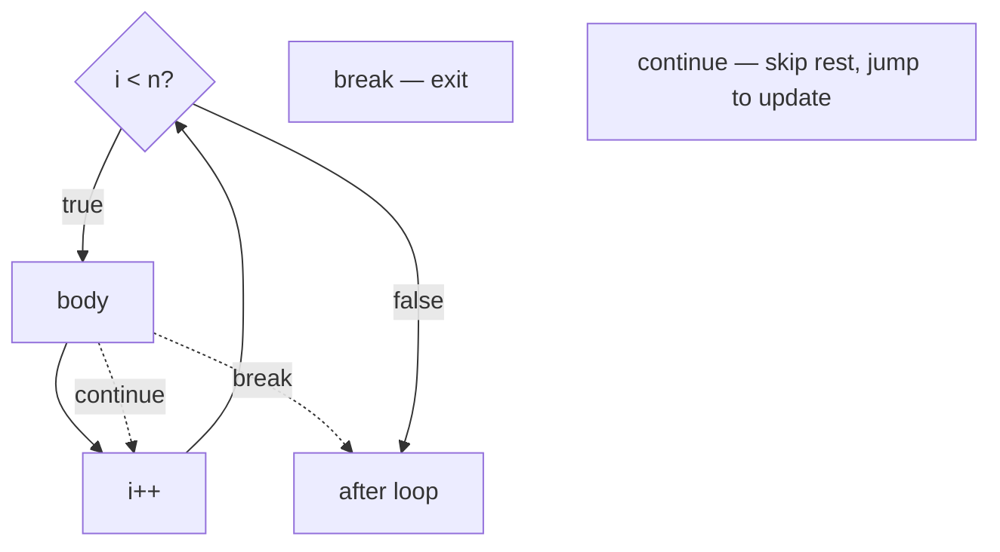

**Labelled** `break`/`continue` lets you target an outer loop from a nested one:

```java
outer:
for (int i = 0; i < n; i++) {
    for (int j = 0; j < m; j++) {
        if (matrix[i][j] == target) {
            break outer;       // exits BOTH loops
        }
    }
}
```

Without the label, `break` exits only the inner loop. Labels are the cleanest alternative to a "found" flag plus a guard on the outer condition. Full details in T10.

> [!IMPORTANT]
> `continue` in a `for` runs the **update** clause before re-testing. `continue` in a `while`/`do-while` does **not** — there's no update clause. This is a common source of accidental infinite loops: rewriting a `for` as a `while` and forgetting to step the counter manually inside the `continue` path.

## Memory Layer — Bytecode

Now the under-the-hood part. All four loop forms compile down to the **same** two ingredients: a forward conditional branch (the test) and a backward unconditional `goto` (the loop close).

### The Backward `goto` — How a Loop Closes

The JVM has no `loop` opcode. A loop is **two** opcodes wired in a cycle:

```
top:    <test>           ; if false, jump to end
        <body>
        goto top          ; jump back to the test
end:    ...
```

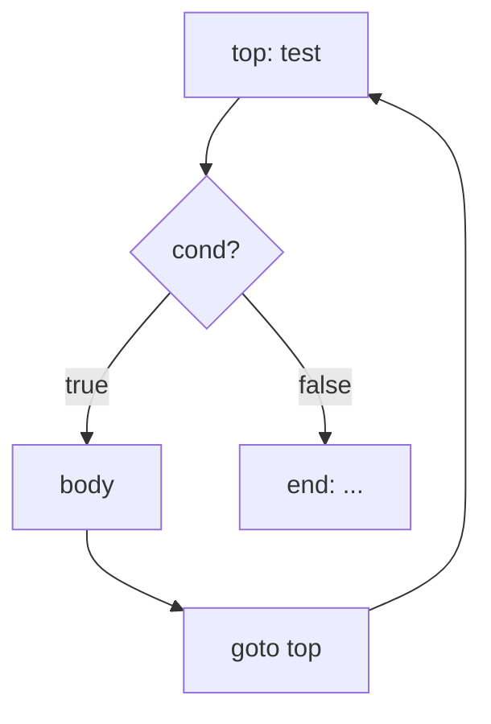

The two characteristics that mark something as a loop in bytecode are:

1. A **backward** branch — a `goto` whose target is a label *earlier* in the method.
2. A **forward** conditional branch — an `if_icmp*` / `ifX` whose target is the label *after* the loop.

The JVM verifier checks that the operand-stack shape is the same every time control reaches `top:` (otherwise the loop is malformed).

### `while` Lowering

Source:

```java
int i = 0;
while (i < 5) {
    System.out.println(i);
    i++;
}
```

Bytecode (`javap -c`):

```
 0: iconst_0
 1: istore_1                       // i = 0
 2: iload_1                        // top: load i
 3: iconst_5
 4: if_icmpge   20                 // if i >= 5, jump to end (INVERTED test!)
 7: getstatic   #2  // System.out
10: iload_1
11: invokevirtual #3  // println
14: iinc        1, 1               // i++
17: goto        2                  // jump back to top
20: return                          // end
```

Three things to notice:

1. The test `i < 5` is compiled as `if_icmpge` (**greater-or-equal**) — the **inverted** form. The branch is taken when the loop should **exit**; falling through means the loop continues. This is the same inversion idiom we saw in T08's `if` lowering.
2. The increment `i++` is the dedicated **`iinc`** opcode — one instruction, **operand-stack-free**, in-place on the local. Compare to `i = i + 1`, which would push, push-1, add, store (4 opcodes touching the stack).
3. The body ends with `goto 2` — a **backward** jump to offset 2, the start of the test.

### `do-while` Lowering

Source:

```java
int i = 0;
do {
    System.out.println(i);
    i++;
} while (i < 5);
```

Bytecode:

```
 0: iconst_0
 1: istore_1
 2: getstatic   #2                   // body starts here
 5: iload_1
 6: invokevirtual #3                  // println
 9: iinc        1, 1
12: iload_1                          // test at the BOTTOM
13: iconst_5
14: if_icmplt   2                    // if i < 5, jump BACK to top (NOT inverted!)
17: return
```

The difference from `while`:

- The body comes **first** — no test before it.
- The test is at the **bottom** and uses `if_icmplt` (the **non-inverted** form). The branch is taken when the loop should **continue** — it's the backward `goto` and the test fused into one opcode. There's no separate `goto`.

So a `do-while` is *cheaper* by one opcode per iteration than a `while` (one fused conditional-backward-jump vs a forward conditional + a backward unconditional). The JIT erases this difference anyway, but it's a real micro-shape difference in the bytecode.

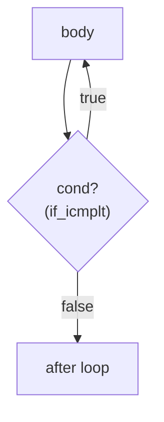

### `for` Lowering — Decomposition Into `while`

The classical `for(init; cond; update) { body }` is **purely syntactic sugar** for:

```
init;
while (cond) {
    body;
    update;
}
```

Source:

```java
for (int i = 0; i < 5; i++) {
    System.out.println(i);
}
```

Bytecode (literally the same as the `while` version above):

```
 0: iconst_0
 1: istore_1
 2: iload_1
 3: iconst_5
 4: if_icmpge   20
 7: getstatic   #2
10: iload_1
11: invokevirtual #3
14: iinc        1, 1                 // the update — placed at the END of the body
17: goto        2
20: return
```

The compiler interleaves the body and the update into a single straight-line block, then closes with `goto top`. Bit-for-bit identical to `while`.

> [!NOTE]
> **`for` and `while` produce identical bytecode** when they encode the same loop. The choice between them is purely about reader intent. Don't pick one for performance.

### `for-each` Over an Array — No Iterator

This is the case where it really matters that `for-each` does **two** different things.

Source:

```java
int[] arr = {1, 2, 3, 4, 5};
for (int x : arr) {
    System.out.println(x);
}
```

Bytecode:

```
 0: iconst_5
 1: newarray   int
 ... (array init)
 ... (stored to local 1)
20: aload_1                          // load arr
21: astore_2                         // store to synthetic local 2 (the snapshot)
22: aload_2
23: arraylength                       // length stored ONCE
24: istore_3                          // synthetic local 3 = length
25: iconst_0
26: istore     4                     // synthetic local 4 = index i = 0
28: iload      4                     // top: load i
30: iload_3                          // load length
31: if_icmpge  53                    // i >= length? exit
34: aload_2                          // load array snapshot
35: iload      4                     // load i
36: iaload                           // arr[i] -> stack
37: istore     5                     // x = arr[i]
39: getstatic  #2
42: iload      5
43: invokevirtual #3                  // println(x)
46: iinc       4, 1                  // i++
50: goto       28                    // back to top
53: return
```

This is exactly an **indexed `for`** with the following machinery synthesised:

- **Local 2** — a **copy of the array reference** (so re-assigning `arr` inside the loop doesn't affect iteration).
- **Local 3** — the **length, captured once**. The compiler reads `arr.length` *one time* before the loop, then compares against it every iteration. This is the source of the famous "the array length is hoisted in a for-each but not always in a manual `for(int i = 0; i < arr.length; i++)`" perf folklore. (In practice the JIT hoists it for both; but the bytecode bias is real.)
- **Local 4** — the **index** `i`.
- **Local 5** — the **element** `x`.
- **No `Iterator` allocation.** The element load is `iaload` (or the appropriate `[t]aload` for the array type) — a single opcode that reads `arr[i]` with bounds-checking.

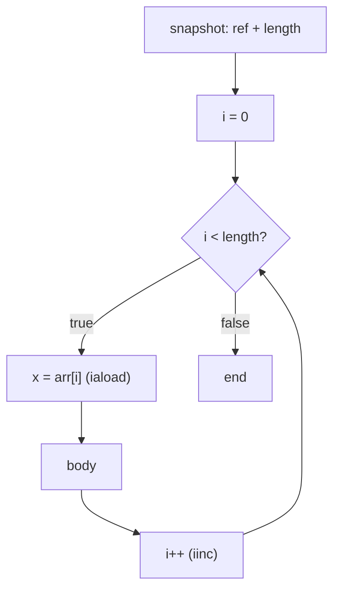

Cost per iteration: one `iload` + one `iload` + one `if_icmpge` + one `aload` + one `iload` + one `iaload` + one `istore` + body + `iinc` + `goto`. After JIT this becomes ~3-4 native instructions per element (load array element, compare counter, increment, conditional branch back).

### `for-each` Over an `Iterable` — One Iterator Allocation

Source:

```java
List<String> names = List.of("Alice", "Bob");
for (String name : names) {
    System.out.println(name);
}
```

Compiles as if you wrote:

```java
Iterator<String> it = names.iterator();
while (it.hasNext()) {
    String name = it.next();
    System.out.println(name);
}
```

Bytecode:

```
 0: ...                              // build names
 5: aload_1
 6: invokeinterface #N // Iterable.iterator()
11: astore_2                          // local 2 = iterator
12: aload_2
13: invokeinterface #M // Iterator.hasNext() : boolean
18: ifeq        37                   // if false, exit
21: aload_2
22: invokeinterface #P // Iterator.next() : Object
27: checkcast    #Q // String
30: astore_3                         // name = ...
31: getstatic   #2
34: aload_3
35: invokevirtual #3                  // println
38: goto        12
41: return
```

Per iteration there are now **two virtual calls** (`hasNext`, `next`) and a `checkcast`. The `checkcast` is needed because `Iterator<String>.next()` erases to `Object next()` at the JVM level (generics erasure — to be covered in L1/C02).

**The Iterator object itself is allocated once**, before the loop. For a `for (X x : someList)` that runs N times you pay:

- 1 × allocation (the `Iterator`) — often a small inner-class instance, 16–32 bytes on the heap.
- N × `hasNext()` calls.
- N × `next()` calls.
- N × `checkcast` (for parameterised iterables).

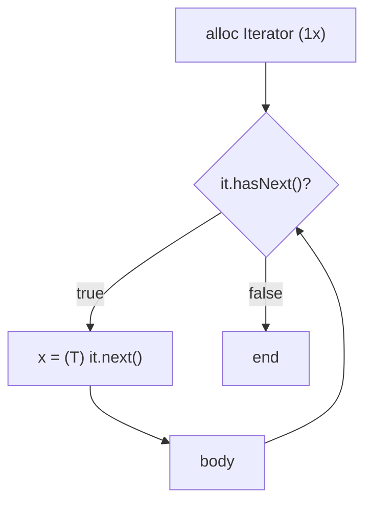

The JIT can often **inline** `hasNext`/`next` (especially for `ArrayList`, where they're trivial index loads), and **escape analysis** can eliminate the `Iterator` allocation entirely if it doesn't escape the loop. We'll see that in the architecture section.

> [!TIP]
> `for-each` over an array compiles to **no `Iterator`**. `for-each` over an `Iterable` compiles to **one `Iterator`**. This is one of the few places in Java where switching between `int[]` and `List<Integer>` has a visible allocation difference at the bytecode level (in addition to the wrapper-box cost, which T05 covered).

### Operand-Stack Trace for a Loop

Let's walk one iteration of `i < 5` to fix the operand-stack picture:

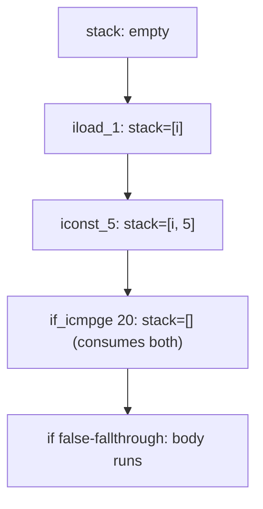

The test consumes **two ints** from the stack. After the branch, the stack is empty — the verifier requires this at every label. `iinc` *does not touch the stack* — it reads and writes directly to the local. That's why the inner loop of a counting `for` is incredibly tight: one `iload` + one `iconst` + one `if_icmpge` + one `iinc` + one `goto` = 5 opcodes for the loop machinery, all but one operand-stack-free.

### `break` and `continue` as Bytecode

Both lower to `goto` instructions whose targets are labels the compiler placed for the purpose:

- `break;` → `goto <label after the loop>`.
- `continue;` in a `while`/`do-while` → `goto <label at the test>`.
- `continue;` in a `for` → `goto <label at the update>`.

A labelled `break outer;` from a nested loop becomes a single `goto` whose target is **after the outer loop** — there's no special unwinding, no stack manipulation, no exception. The JVM is happy because every label has a known operand-stack shape; the compiler computes it.

## Architecture Layer — JIT, CPU, and Cache

The bytecode is just the start. The JIT takes a hot loop and rewrites it into native code with a battery of optimisations. We'll cover each in order — language-level effect first, then what the JIT actually emits.

### JIT-Native Loop Shape — x86-64 and ARM64

For `for (int i = 0; i < n; i++) sum += arr[i];` on x86-64, the JIT (C2) typically emits something like:

```asm
        ; assume: eax=sum, edi=i, esi=n, rdx=arr_base
        xor     edi, edi               ; i = 0
.top:
        cmp     edi, esi               ; i < n?
        jge     .end                   ; not less -> exit
        add     eax, [rdx + rdi*4]     ; sum += arr[i]   (scaled index addressing!)
        inc     edi                    ; i++
        jmp     .top                   ; (often the JIT lays this out as
                                       ;  jl .top with the body before the test)
.end:
```

On ARM64:

```asm
        mov     w0, #0                  ; i = 0
.top:
        cmp     w0, w2                  ; i < n?
        b.ge    .end
        ldr     w4, [x3, w0, sxtw #2]   ; w4 = arr[i]   (scaled+sxtw addressing)
        add     w1, w1, w4              ; sum += w4
        add     w0, w0, #1              ; i++
        b       .top
.end:
```

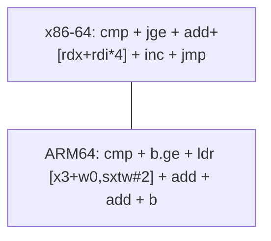

Two architecture-level features make this **very** fast:

- **Scaled-index addressing.** x86's `[rdx + rdi*4]` and ARM64's `[x3, w0, sxtw #2]` let the CPU compute `arr_base + i*4` in the address-generation unit — **free**, in parallel with the ALU. The `*4` for a 4-byte `int` is a hardware-level shift, not a multiplication.
- **Backward branch is predicted taken.** The CPU's branch predictor has a static rule: backward branches are predicted taken; forward branches are predicted not-taken. The very first time the loop runs, before any history exists, the predictor already gets it right.

### Loop-Invariant Code Motion (LICM)

If something inside the loop doesn't change between iterations, the JIT hoists it out.

Source:

```java
for (int i = 0; i < arr.length; i++) {
    sum += arr[i] * Math.sqrt(2);
}
```

After LICM the JIT effectively runs:

```java
double k = Math.sqrt(2);             // hoisted once
int len = arr.length;                 // hoisted once
for (int i = 0; i < len; i++) {
    sum += arr[i] * k;
}
```

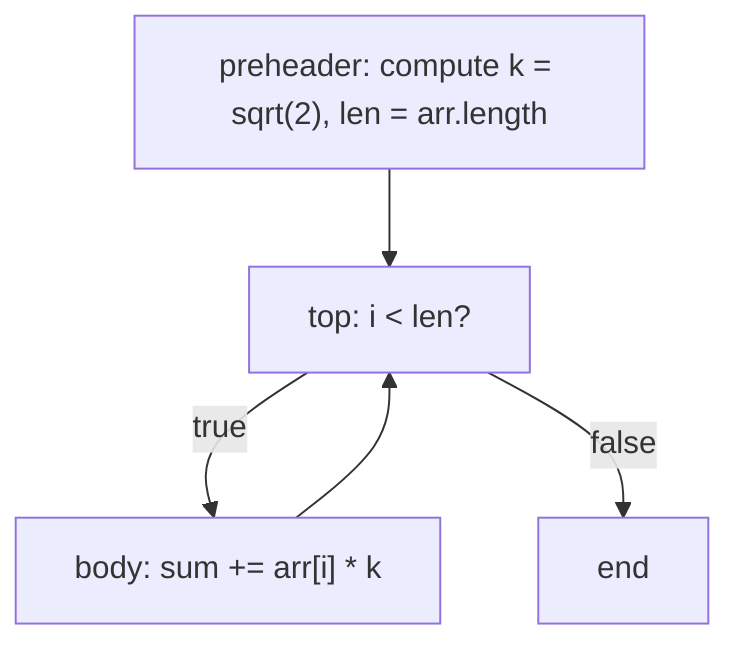

The hoisted computations land in a **preheader** basic block — a synthetic block the JIT inserts between the loop's entry edge and the loop top. This is why `arr.length` being read every iteration of a hand-written `for` is essentially free in JITted code: the JIT lifts the field load out.

LICM has limits — it can hoist only *side-effect-free* computations that don't depend on the iteration variable. A `methodCall()` inside the loop can be hoisted **only if** the JIT proves it's pure (rare) or `final` (more common). This is why `final` fields and pure methods enable more aggressive JIT.

### Strength Reduction

Multiplications and divisions are slow; shifts and adds are fast. The JIT rewrites:

| Source | JIT-emitted |
|--------|-------------|
| `x * 2` | `x << 1` |
| `x * 8` | `x << 3` |
| `x / 8` | `x >>> 3` (for unsigned) or `arithmetic shift + sign adjust` (for signed) |
| `x % 16` | `x & 0xF` (for unsigned power-of-two) |
| `i * stride` in a loop with const `stride` | running counter incremented by `stride` |

The last one is the most important: **induction-variable strength reduction**. If you write `arr[i * 8]` inside a loop, the JIT can convert the `i * 8` into a separate counter `j` initialised to 0 and incremented by 8 each iteration — replacing one shift with one add, and freeing the multiplier unit.

### Range-Check Elimination — The Famous JIT Win

Every Java array access carries an implicit bounds check: `arr[i]` is conceptually `if (i < 0 || i >= arr.length) throw new ArrayIndexOutOfBoundsException(); else arr[i];`. In a naive lowering that's a branch on every access — death for a tight loop.

The JIT proves that for `for (int i = 0; i < arr.length; i++) arr[i]`, the bounds check is **always satisfied**, and emits the array load with **no check**. The proof goes:

- `arr.length` was read before the loop and hoisted to register `len`.
- `i` starts at 0 and is incremented by 1 each pass.
- The loop only enters the body when `i < len`.
- Therefore `0 ≤ i < len` always, and the bounds check is provably dead.

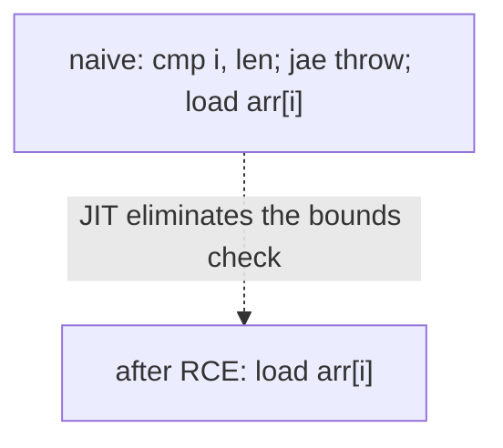

This single optimisation is the difference between Java being ~5x slower than C on tight numeric loops vs essentially the same speed. It only fires if the JIT can prove the loop bound matches the array length — which is one reason `for (int i = 0; i < arr.length; i++)` is more JIT-friendly than the equivalent with `for (int i = 0, n = computeLen(); i < n; i++)` where the JIT may not know `n == arr.length`.

> [!IMPORTANT]
> **Range-check elimination is why idiomatic Java array loops are fast.** Write `for (int i = 0; i < arr.length; i++) arr[i]` rather than caching the length to a separate local — both forms work, but the first hands the JIT the easiest proof.

### Loop Unrolling

Branches cost ~1 cycle each on a hot, predicted path; the rest of the pipeline can do 4-6 operations in parallel. If the loop body is small, most of the time is the branch. **Unrolling** copies the body N times so the per-iteration branch cost is amortised over N elements:

Source:

```java
for (int i = 0; i < n; i++) {
    sum += arr[i];
}
```

JIT after **unrolling by 4**:

```java
int i = 0;
for (; i < (n & ~3); i += 4) {
    sum += arr[i];
    sum += arr[i+1];
    sum += arr[i+2];
    sum += arr[i+3];
}
for (; i < n; i++) {           // tail
    sum += arr[i];
}
```

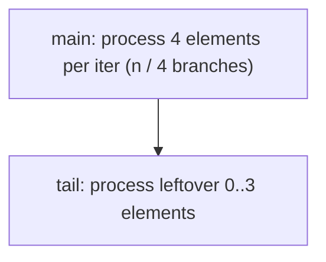

The main loop now has 1 branch per 4 elements — 4× fewer mispredict-and-pipeline-flush opportunities, 4× more arithmetic in the body to hide latency. C2 picks an unroll factor (2, 4, 8, or 16) based on body size and the target CPU's reorder-buffer depth. `-XX:LoopUnrollLimit` is the knob.

### Auto-Vectorisation — SIMD Lowering

This is the most dramatic optimisation. For a loop that does the **same operation on independent array elements**, the JIT can replace the scalar instructions with **SIMD** (Single Instruction, Multiple Data) ones that process 4, 8, or 16 elements per instruction.

Source:

```java
for (int i = 0; i < n; i++) {
    c[i] = a[i] + b[i];
}
```

JIT on x86-64 with AVX2 (256-bit YMM registers, 8× `int`):

```asm
.top:
        vmovdqu  ymm0, [rax + rcx*4]        ; load a[i..i+7]  (8 ints)
        vmovdqu  ymm1, [rdx + rcx*4]        ; load b[i..i+7]
        vpaddd   ymm2, ymm0, ymm1            ; 8 parallel adds in one instruction
        vmovdqu  [r8 + rcx*4], ymm2         ; store c[i..i+7]
        add      rcx, 8
        cmp      rcx, r9
        jl       .top
```

JIT on ARM64 with NEON (128-bit V registers, 4× `int`):

```asm
.top:
        ldr      q0, [x0, x4, lsl #2]        ; load a[i..i+3]
        ldr      q1, [x1, x4, lsl #2]
        add      v2.4s, v0.4s, v1.4s         ; 4 parallel adds
        str      q2, [x2, x4, lsl #2]
        add      x4, x4, #4
        cmp      x4, x5
        b.lt     .top
```

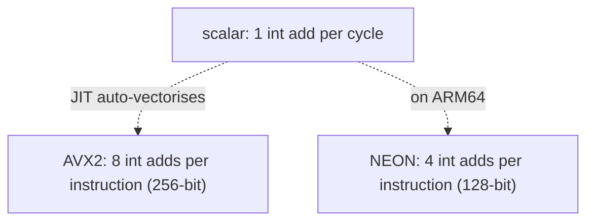

For a 1-million-element array sum, vectorisation alone is a **4-16x speedup**. Combined with unrolling and the cache prefetcher, the loop runs at **memory bandwidth** — meaning the CPU is faster than the DRAM, and you're bottlenecked by how fast data can be streamed in. `-XX:+UseSuperWord` (default on) is the C2 SIMD vectoriser. `-XX:+PrintAssembly` (requires `hsdis`) shows the actual emitted code.

Vectorisation has constraints: no inter-iteration dependence (`sum += arr[i]` is harder — needs a reduction tree), no exceptions thrown mid-loop, no overlapping arrays (the JIT inserts an alias check). The JDK's **Vector API** (`jdk.incubator.vector`, JEP 338+) lets you write explicit SIMD code when the JIT won't auto-vectorise.

### Loop Peeling

Sometimes the first or last iteration is special — handling a null check, an alignment check, or a sub-word boundary. The JIT **peels** one iteration off the top, runs it specially, then runs the main loop knowing the precondition now holds:

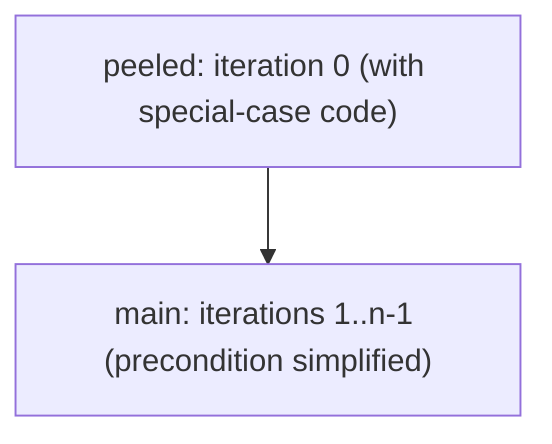

A classic use: align the array pointer to a 32-byte boundary so the AVX2 main loop can use aligned loads (`vmovdqa`) instead of unaligned (`vmovdqu`) — a small but real perf win.

### Loop Pipelining (Software Pipelining)

The CPU is itself a pipeline — it starts the next instruction before the previous one finishes. Software pipelining is when the JIT (or you, by hand) interleaves the *next* iteration's work with the *current* iteration's, so the latency of one instruction is hidden behind another's compute:

```
iter k    : load arr[k+2]    add prev    store prev2
iter k+1  : load arr[k+3]    add prev    store prev2
...
```

C2 does limited software pipelining; the heavier transforms come from Graal and aren't enabled by default.

### Induction-Variable Simplification

If two loop variables track each other, the JIT collapses them:

```java
for (int i = 0, off = 0; i < n; i++, off += 4) {
    write(buf, off, arr[i]);
}
```

→ `off` is `i * 4`, so the JIT keeps only one of them (and uses scaled-index addressing for the array if the access pattern permits). Saves a register.

### Branch Prediction on the Loop Backward Branch

The backward branch closing a loop is the single best-predicted branch on a modern CPU.

```mermaid
flowchart TB
  Cycle["loop iteration"] --> Predict["predict: taken (backward branch)"]
  Predict --> Right["~99% right"]
  Predict --> Wrong["1 mispredict per loop run (the final not-taken)"]
```

A 1000-iteration loop with a simple body has:

- **999 correctly-predicted backward branches** at ~1 cycle each.
- **1 mispredicted final branch** at ~10-20 cycles (pipeline flush).

The mispredict is amortised across the entire loop — invisible. Compare to a switch over a random key (T08), where every dispatch is potentially a mispredict.

Loops *inside* loops compound this: the inner loop's backward branch is run N×M times. The pattern history table picks up the regularity.

### Cache and Prefetcher — Sequential Array Scan

The cache hardware loves sequential access. When you walk `arr[0], arr[1], arr[2], ...`, the **hardware prefetcher** detects the stride-1 pattern after ~3-4 accesses and starts pre-loading **future** cache lines into L1 *before* the loop asks for them.

```mermaid
flowchart TB
  Iter["loop iteration k"] --> Access["read arr[k] (L1 hit, ~4 cycles)"]
  Prefetch["prefetcher fetches arr[k+8], arr[k+16] in parallel"]
  Iter -.-> Prefetch
```

A 64-byte cache line holds 16 ints (`int = 4 bytes`). With AVX2 doing 8 ints per instruction, the loop completes 16 elements in 2 SIMD operations — and by then the next cache line is already in L1. The result: **sequential array scans run at L1 throughput**, which is roughly 4 ints/cycle, far faster than DRAM bandwidth alone would allow.

This is also why **`int[]` is dramatically faster than `Integer[]`** for hot loops (revisited from T05): `int[]` is 16 elements per cache line, contiguous in memory; `Integer[]` is 16 *pointers* per cache line, each pointing to a separate 16-byte `Integer` object scattered across the heap — the prefetcher cannot follow the indirection, and every element is a potential cache miss.

### Escape Analysis on `for-each` Over an Iterable

We noted that `for-each` over an `Iterable` allocates one `Iterator`. Escape analysis (introduced in T07) checks: does the `Iterator` reference *escape* the loop? If it's stored in a field, passed to an un-inlined method, or returned, it escapes — heap allocation stays. If it does **not** escape, the JIT performs **scalar replacement**: the `Iterator`'s fields (typically `int cursor`, `Object[] elementData`) are promoted to **registers** or stack slots, and the heap allocation is **never emitted**.

```mermaid
flowchart TB
  Source["Iterator it = list.iterator(); while (it.hasNext()) ..."]
  EA{"escape analysis: does 'it' escape?"}
  Source --> EA
  EA -- no --> Stack["scalar replacement: fields in registers; no heap alloc"]
  EA -- yes --> Heap["heap alloc; one Iterator object lives for the loop run"]
```

For `for-each` over `ArrayList`, EA almost always succeeds, the `Iterator` is eliminated, and the resulting native code is essentially identical to `for (int i = 0; i < list.size(); i++) list.get(i);`. This is why the "iterator overhead" of `for-each` is, in practice, zero for the common case.

EA fails when the iterator escapes — e.g. you store it in a field, or you call a non-inlinable method that takes the iterator. `-XX:+PrintEliminateAllocations` shows what got eliminated.

### Where the Loop Variable Lives — Frame Slot to Register

A counter `int i` declared in a `for` header is **just another local variable** — it sits in a local slot in the stack frame (see T02 for the frame layout). The frame slot is 4 bytes for an `int`, indexed by the slot number assigned at javac time.

```mermaid
flowchart TB
  Frame["stack frame"] --> S0["slot 0: this (if non-static) or first arg"]
  Frame --> S1["slot 1: arr (or first local)"]
  Frame --> S2["slot 2: i (loop counter, 4 bytes)"]
  Frame --> S3["slot 3: x (loop element)"]
  Frame --> Stack["operand stack (for arithmetic)"]
```

In hot JITted code, the JIT **register-allocates** `i` to a CPU register (`edi`/`r10d` on x86-64, `w20` on ARM64) — the local slot is never touched. Only on a deoptimisation, a stack-walk, or a debugger break does the register's value get **flushed back** to the slot. So in practice the inner loop runs entirely in registers; the frame slot exists as the *spec* location and the *fallback* location.

### Induction-Variable Lifetime

The loop counter is born at `init`, lives until the loop falls through the condition for the last time, then **goes out of scope** (its slot can be reused). In bytecode, the compiler emits a **`LocalVariableTable`** entry (if debug info is on) mapping the slot to the name `i` over the bytecode range `[2, 20)` for our `while`/`for` example — debuggers use this to show the variable. After the loop the slot may be reused by another local; the JIT obviously doesn't care.

For a `for (int i = 0; ...; i++)` the lifetime is **exactly** the loop. For an outer `int i = 0; while (...) { ... }`, `i` lives until the *enclosing* scope ends — which is why hoisting a counter outside a `for` extends its lifetime unnecessarily.

### Memory Efficiency — Iterator vs Index

Suppose you iterate a `List<Integer>` of N elements two ways:

| Form | Iterator alloc | Hot-path ops | Notes |
|------|---------------|--------------|-------|
| `for (int i = 0; i < list.size(); i++) list.get(i)` | 0 | size() + get(i) — both inlinable for ArrayList; no virtual dispatch after JIT | Cleanest for `ArrayList`. `LinkedList.get(i)` is **O(n)** — disastrous. |
| `for (Integer x : list)` | 1 (eliminated by EA in common case) | hasNext() + next() — inlined for ArrayList, often EA-eliminated; never O(n) for LinkedList | Safer choice. |
| `list.forEach(x -> ...)` | 1 lambda + internal iteration | depends on collection; for `ArrayList`, indexed; for `LinkedList`, sequential | Functional style; same perf as for-each in hot code. |

The `for-each` is almost always the right call; if the JIT can EA-eliminate the iterator, you pay nothing.

## Common Mistakes

> [!WARNING]
> **The classic loop bug catalogue.** These come up in code review constantly.

### Off-By-One

```java
for (int i = 0; i <= arr.length; i++) {    // BUG: <= instead of <
    sum += arr[i];                          // last iteration throws AIOOBE
}
```

The condition should be `i < arr.length`. The half-open range `[0, length)` is the Java convention; deviate from it and you'll be writing `+1` and `-1` everywhere.

### Stray Semicolon

```java
for (int i = 0; i < 5; i++);                // BUG: empty body
    sum += i;                                // runs ONCE after the loop
```

Same problem as the `while`-semicolon. Always brace the body.

### Infinite Loop Without an Update

```java
int i = 0;
while (i < 5) {
    System.out.println(i);
    // forgot i++
}
```

Spins forever. In production this is usually a `continue` path that skips the counter step — the loop runs the update for the *normal* path but not for `continue` if the counter step is inside the loop body. Either move the step to the `for`'s update clause, or use `try/finally` semantics with an explicit `i++` before every `continue`.

### Modifying a Collection During `for-each`

```java
List<String> names = new ArrayList<>(List.of("a", "b", "c"));
for (String n : names) {
    if (n.equals("b")) names.remove(n);     // ConcurrentModificationException
}
```

`for-each` over a `Collection` uses the collection's `Iterator`, which is **fail-fast**: if the collection's modification count changes from under it, `next()` throws `ConcurrentModificationException`. Two fixes:

- Use an explicit `Iterator` and call **`it.remove()`** (the only safe way to mutate during iteration).
- Use `Collection.removeIf(predicate)` (Java 8+).
- Iterate a **copy** (`new ArrayList<>(names)`) if you must use `for-each`.

### Iterating While Async-Modifying

Same family of bug as above, but the "modifier" is another thread. Use `CopyOnWriteArrayList` for read-mostly cases, or external synchronisation. (Full concurrency coverage in L3/C01.)

### Loop Variable Captured in a Lambda

```java
List<Runnable> tasks = new ArrayList<>();
for (int i = 0; i < 5; i++) {
    tasks.add(() -> System.out.println(i));     // COMPILE ERROR (or wrong value)
}
```

A lambda may only capture an **effectively final** variable. `i` is not — it's reassigned every iteration. Fix by copying:

```java
for (int i = 0; i < 5; i++) {
    int captured = i;
    tasks.add(() -> System.out.println(captured));
}
```

The `for-each` form avoids the problem because its loop variable is effectively re-declared each iteration:

```java
for (int x : new int[]{0,1,2,3,4}) {
    tasks.add(() -> System.out.println(x));     // OK
}
```

### Cached `length` That Goes Stale

```java
int n = arr.length;
for (int i = 0; i < n; i++) {
    if (somethingResizesArr()) { ... }      // n is now wrong
    arr[i] = ...;
}
```

If the loop body can replace `arr` with a different-sized array, hand-caching the length will refer to the *old* array's length. Re-read `arr.length` each iteration (the JIT will hoist it if it's safe).

### `do-while` With Trailing Semicolon Missed

```java
do {
    body();
} while (cond)       // missing semicolon
nextStatement();     // parser sees: while (cond) nextStatement(); — runs forever
```

A subtle one because the file still compiles. Watch for `while` headers without their `;`.

### `for-each` Over a Map

```java
for (Entry<K, V> e : map) { ... }    // COMPILE ERROR: Map is not Iterable
```

Use `map.entrySet()`, `map.keySet()`, or `map.values()`.

### Using `for-each` On a `LinkedList` By Index

```java
LinkedList<X> list = ...;
for (int i = 0; i < list.size(); i++) {
    list.get(i);          // O(n) per call -> O(n^2) total
}
```

`LinkedList.get(i)` walks from the head. Use `for-each` (which uses the linked iterator and is O(1) per step) or `Deque.iterator()` directly.

> [!INTERVIEW]
> Loops are a perennial interview topic — both the *semantic* questions and the *performance* / *under-the-hood* ones.
>
> 1. **Difference between `while` and `do-while`?** Test placement; at-least-once for `do-while`.
> 2. **Difference between `for` and `for-each`?** `for` exposes the index; `for-each` doesn't. `for-each` over an Iterable allocates an Iterator; over an array it doesn't.
> 3. **How does `for-each` work under the hood?** Two desugarings: indexed for-loop for arrays; `Iterator` + `hasNext`/`next` for `Iterable`.
> 4. **What's `ConcurrentModificationException` and when does it fire?** Fail-fast iterators detect structural modification via a `modCount` counter; `next()` checks it and throws.
> 5. **Bytecode for a `while` loop?** Backward `goto` + forward `if_icmp*` (inverted) at the top; `iinc` for `++`.
> 6. **What's range-check elimination?** JIT proves the loop bound matches `arr.length` and removes the per-iteration bounds check.
> 7. **What's auto-vectorisation?** C2 maps a scalar element-wise loop to SIMD instructions (SSE2/AVX2 on x86, NEON on ARM); 4–16x speedup on numeric arrays.
> 8. **Why is `for-each` over `LinkedList` faster than `for(int i...)`?** Indexed access on a linked list is O(n); the iterator is O(1) per step.
> 9. **How does loop unrolling help?** Amortises the per-iteration branch cost over multiple elements; enables ILP and SIMD.
> 10. **Why is the backward branch fast?** CPU predicts it taken statically; only one mispredict per loop run (the final not-taken).
> 11. **What's an induction variable?** A loop variable updated by a constant each iteration; JIT can simplify combinations of them.
> 12. **Why is `i++` cheaper than `i = i + 1`?** `iinc` is a single bytecode that touches a local in-place; no operand-stack traffic.

## Practice

Walk these to lock in the mechanism.

1. **Empty body.** Write `while (true);` and run it. Observe the CPU spin. Add `Thread.sleep(1)` inside braces and re-measure.
2. **`do-while` vs `while`.** Translate a `while` loop to `do-while` and vice versa; trace what changes about "what if the condition is false initially."
3. **The four-form translation.** Pick a sum-of-array. Write it as `while`, `do-while`, `for`, and `for-each`. Confirm they produce the same result.
4. **`javap -c` a `for`.** Compile `for (int i = 0; i < 5; i++) System.out.println(i);` and run `javap -c`. Find the `iload`, the inverted `if_icmpge`, the `iinc`, the backward `goto`.
5. **`javap -c` a `do-while`.** Compare to the `for`. Notice the test moves to the bottom and uses the *non-inverted* form (`if_icmplt` jumping back).
6. **`for-each` over an array.** Compile `for (int x : arr) sum += x;` and run `javap -c`. Find the synthetic locals for the array snapshot, the cached length, the index, and the element. Note the absence of any `Iterator` call.
7. **`for-each` over a `List`.** Same with `List<Integer> list`. Find the `iterator()` call, the `hasNext`/`next` invocations, and the `checkcast` for the element.
8. **Iterator escape analysis.** Write a tight `for (Integer x : list)` summing N=10M. Use `-XX:+UnlockDiagnosticVMOptions -XX:+PrintEliminateAllocations` and confirm the Iterator allocation is eliminated. Then force escape (store the iterator in a static field) and confirm the allocation re-appears.
9. **Range-check elimination.** Write `for (int i = 0; i < arr.length; i++) sum += arr[i];` and run with `-XX:+PrintAssembly` (requires `hsdis`). Confirm there is **no** bounds-check branch in the inner loop.
10. **Defeat range-check elimination.** Rewrite as `int n = computeLen(arr); for (int i = 0; i < n; i++) sum += arr[i];` where `computeLen` returns `arr.length` but the JIT can't see that. Confirm the bounds-check branch re-appears.
11. **Loop unrolling.** Benchmark a 100M-element sum with `-XX:LoopUnrollLimit=0` vs default vs `-XX:LoopUnrollLimit=64`. Observe the throughput change.
12. **Auto-vectorisation.** Write `c[i] = a[i] + b[i]` over three large `int[]` arrays. Run with `-XX:+PrintAssembly` and find the `vpaddd` (x86 AVX2) or `add v.4s` (ARM64 NEON). Toggle `-XX:-UseSuperWord` to disable vectorisation and re-measure — expect 4-8x slowdown.
13. **Branch-prediction win.** Microbench the backward-branch cost: 10M iterations of an empty `for` body, then 10M iterations of a body that has a hard-to-predict inner branch. Compare nanoseconds-per-iteration.
14. **ConcurrentModificationException.** Write the `for-each` removal mistake. Confirm the exception, then fix it with `Iterator.remove()`, with `removeIf`, and with an iteration-over-copy. Compare the bytecode for each.
15. **`LinkedList` indexed loop.** Walk a 100k-element `LinkedList<Integer>` once with `for (int i = 0; i < list.size(); i++) list.get(i);` and once with `for (Integer x : list)`. Measure. The first should be vastly slower (O(n²) vs O(n)).
16. **Loop variable capture.** Reproduce the lambda-capture compile error in a counter `for`, then show that the `for-each` form compiles without the `int captured = i;` workaround.
17. **Explain it back.** Trace `for (int i = 0; i < arr.length; i++) sum += arr[i];` from source through (a) javac's `while`-form bytecode, (b) the operand-stack per iteration, (c) the JIT-emitted x86-64 with scaled-index addressing, (d) range-check elimination, (e) AVX2 auto-vectorisation, (f) the cache prefetcher's stride detection.

## Recap

You should now be able to:

- Distinguish the **four** loop forms — `while` (test-before, 0+ runs), `do-while` (test-after, 1+ runs), `for` (counter-driven, bundled init/cond/update), and `for-each` (element loop over arrays and `Iterable`s) — and pick the right one for each iteration shape.
- Apply the **rules of thumb**: collection/array traversal → `for-each`; known iteration count or counter → `for`; external stop condition → `while`; first iteration must always run → `do-while`.
- Recognise the **loop-variable scope** rule — a counter declared in a `for` header lives only inside the loop, gone after the closing brace.
- Read and write **multi-variable `for` headers** (one type, comma-separated init; comma-separated update) for two-pointer / countdown patterns.
- Preview **`break`** (exit) and **`continue`** (skip-to-next-iter; runs the `for` update before the test) — with labels for nested-loop control. Full detail in T10.
- Trace a `while` / `for` to bytecode: a **forward `if_icmp*` inverted test at the top** plus a **backward `goto`** at the bottom; `++` compiles to the dedicated single-opcode **`iinc`** that touches no operand stack.
- Trace a `do-while` to bytecode: body first, then a **non-inverted** `if_icmp*` at the bottom that fuses the backward jump and the test into one opcode.
- Recognise that **`for` and `while` produce bit-identical bytecode** for the same loop — the choice between them is intent, not performance.
- Trace **`for-each` over an array** to its compiler-synthesised indexed `for` with snapshot, cached length, index, and element locals — **no `Iterator` allocation**.
- Trace **`for-each` over an `Iterable`** to `Iterator it = c.iterator(); while (it.hasNext()) x = (T) it.next();` — **one** `Iterator` allocation (often eliminated by escape analysis), `hasNext`/`next` virtual calls, `checkcast` for the element.
- Explain the JIT's **loop-invariant code motion** (LICM): hoists side-effect-free computations into a synthetic preheader.
- Explain **strength reduction**: `×2` → `<<1`, `×const` in an indexed loop → induction-variable add by `const`.
- Explain **range-check elimination**: the JIT proves `0 ≤ i < arr.length` and skips the per-access bounds check, making idiomatic `for (int i = 0; i < arr.length; i++) arr[i]` essentially branch-free in the body.
- Explain **loop unrolling**: amortises the per-iteration branch over N elements; enables ILP and SIMD.
- Explain **auto-vectorisation**: maps scalar element-wise loops to SIMD instructions — `vpaddd`/`vmovdqu` on x86-64 (AVX2, 8× int per instruction), `add v.4s`/`ldr q` on ARM64 (NEON, 4× int per instruction) — typically 4-16x speedup; controlled by `-XX:+UseSuperWord`.
- Explain **loop peeling** (special-case the first iteration) and **software pipelining** (overlap iterations).
- Explain the **branch-prediction** behaviour of a loop: the backward branch is statically predicted *taken*; ~99% correct; only the final not-taken iteration is a mispredict — amortised across the whole loop.
- Explain **cache and prefetcher** behaviour on sequential array scans: the hardware prefetcher detects stride-1, streams future cache lines into L1, and the loop runs at L1 throughput; `int[]` dramatically beats `Integer[]` because of cache-line packing and the prefetcher's inability to follow pointers.
- Predict the JIT's **native code shape** on x86-64 (`cmp` + `jcc` + scaled-index `[base + idx*N]` + `inc` + backward `jmp`) and ARM64 (`cmp` + `b.cond` + `ldr [base, idx, sxtw #log2]` + `add` + backward `b`).
- Avoid the **common traps**: off-by-one, stray semicolon after the header, missing counter update, modifying a collection during `for-each` (`ConcurrentModificationException` and the fail-fast `modCount` mechanism), lambda capture of a non-final counter, `LinkedList.get(i)` in a loop, `for-each` over a `Map`.

## Next

Continue to [break / continue / labels](./T10-break-continue-labels.md).
