# break / continue / labels

A loop's normal exit is "the condition turned false." Often you want to leave **earlier** — found what you were looking for, hit an error, exhausted patience for retries. Or you want to **skip** the rest of one iteration but keep looping — found a record you don't care about, division by zero, an item to filter out. Java provides three statements for this: **`break`**, **`continue`**, and **`return`**. For escape from *nested* loops, Java attaches an optional **`label:`** to a loop and lets `break`/`continue` target it by name.

These are the only explicit non-local jumps in Java; the language has **no `goto` keyword** (it's a reserved word, but unused). Internally, however, the JVM is a `goto` machine — `break`, `continue`, labelled `break`, labelled `continue`, and the `for`/`while`/`do-while` loop close all lower to the **same single opcode**: an unconditional `goto` to a compiler-placed label. The whole topic, at the bytecode layer, is one opcode wearing four hats.

The depth-bar requirement isn't just "show the syntax." `break` in a `switch` (T08) and `break` in a loop look identical in source but lower to subtly different jump targets; `continue` in a `while` and `continue` in a `for` go to *different* labels (the test in one, the update in the other) — and the second one is the silent cause of "infinite loop after I rewrote my `for` as a `while`." Labelled `break` from a deeply nested loop is **one** `goto`, no stack manipulation, no exception, no runtime cost — much cheaper than the boolean-flag-and-extra-guards pattern it replaces. At the architecture layer, a `break` lowers to a forward `jmp` (x86-64) / `b` (ARM64) — statically predicted **not-taken**, so the iteration that fires it costs ~10–20 cycles for a single pipeline flush; amortised across the loop run it's invisible.

> [!NOTE]
> Prerequisites: [Control Flow](./T08-control-flow-if-else-switch-switch-expressions.md) (`L0/C02/T08`) — `break` in `switch`, the inverted-test idiom; [Loops](./T09-loops-while-do-while-for-for-each.md) (`L0/C02/T09`) — backward `goto` + forward `if_icmp*` mechanics, the `for` update clause, the four loop forms; [Operators](./T04-operators-arithmetic-relational-logical-bitwise-assignment.md) (`L0/C02/T04`) — `if_icmp*` / `ifeq` family; [Source to Bytecode](../C01-cs-foundations/T04-source-to-bytecode-to-jvm-to-machine-code.md) (`L0/C01/T04`) — `.class` `goto` opcode, operand-stack invariants at labels.

## Why Early-Exit Statements Exist

The natural loop exit — "condition false" — is symmetric and predictable, but a lot of real-world loops aren't symmetric:

- **Search.** "Scan until you find `target`." The moment you find it, you're done; checking the remaining elements is wasted work.
- **Filter-and-continue.** "Process each element, but skip the negative ones." The skip is a per-iteration decision, not a loop-wide one.
- **Bail-out.** "Try up to 5 times, but quit immediately if the network is dead."
- **Nested escape.** "Walk a 2-D grid looking for a value; once found, leave *both* loops, not just the inner one."

You *can* encode all of these with extra boolean flags and reworked conditions — but the code is harder to read, easier to get wrong, and (for nested escapes) often slower than the direct jump.

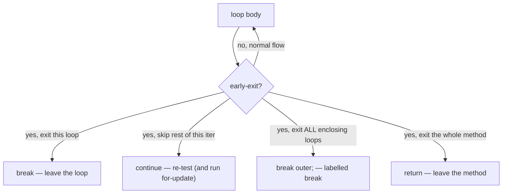

Four patterns, four statements. Use the smallest one that fits the situation.

## `break` — Exit the Enclosing Loop or Switch

`break;` immediately exits **the nearest enclosing `for` / `while` / `do-while` / `switch`**. Control resumes at the statement *after* that loop or switch.

```java
int idx = -1;
for (int i = 0; i < arr.length; i++) {
    if (arr[i] == target) {
        idx = i;
        break;          // exits the for loop
    }
}
// control resumes here
System.out.println("found at " + idx);
```

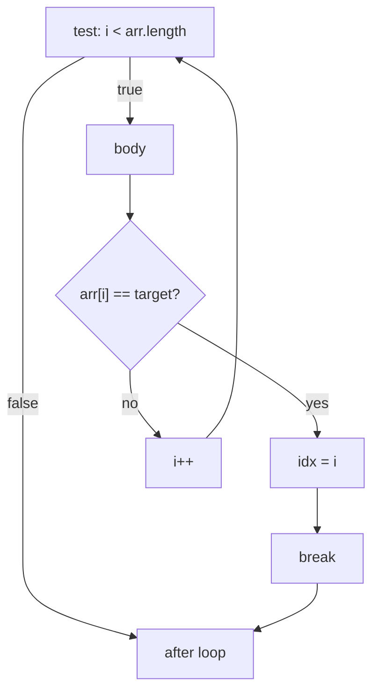

### Targets the nearest enclosing loop

`break` is **always** an exit from one and only one loop or switch — the **nearest** one. To exit two loops at once, you need a label (next section).

```java
for (int i = 0; i < n; i++) {           // outer
    for (int j = 0; j < m; j++) {       // inner
        if (cond) break;                 // exits the INNER for, not the outer
    }
    // control resumes here after break
}
```

### `break` in a switch vs `break` in a loop

In a **switch**, `break` terminates the switch statement (T08's classical fall-through prevention). In a **loop**, `break` terminates the loop. If a `switch` is *nested inside a loop*, `break` exits **the switch only** — the loop continues:

```java
for (int i = 0; i < n; i++) {
    switch (state) {
        case READY:
            doReady();
            break;                       // exits the switch — loop continues
        case DONE:
            cleanup();
            break;                       // also just the switch
    }
    // control reaches here after either break — and the for continues
    log(i);
}
```

To exit the **loop** from inside a nested `switch`, label the loop and use `break <label>;`:

```java
outer:
for (int i = 0; i < n; i++) {
    switch (state) {
        case ABORT:
            break outer;                 // exits the for loop
    }
}
```

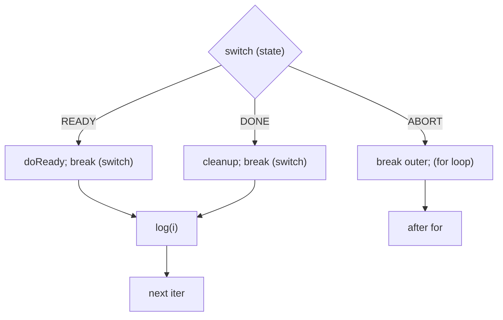

> [!IMPORTANT]
> `break` (no label) in a nested `switch` exits only the switch. **`break <label>;` is the *only* way** to exit a loop from inside a nested switch in one step. Otherwise you need a boolean flag and an outer-loop guard.

### Arrow-form switch arms don't need `break`

A reminder from T08: in a switch *expression* or switch *statement* using the `->` arrow form, each arm is its own block and **does not fall through** — `break` at the end of an arm is **redundant** and often a compile error if it would be unreachable.

```java
switch (state) {
    case READY -> doReady();             // no break needed
    case DONE -> cleanup();
}
```

Use `break` only with the classical colon form (`case READY:`) where fall-through is the default.

## `continue` — Skip to the Next Iteration

`continue;` ends the current iteration immediately. The loop **doesn't exit** — it just stops running the rest of *this* body and proceeds to "should I run again?".

```java
int sum = 0;
for (int x : arr) {
    if (x < 0) continue;            // skip negatives
    sum += x;
}
```

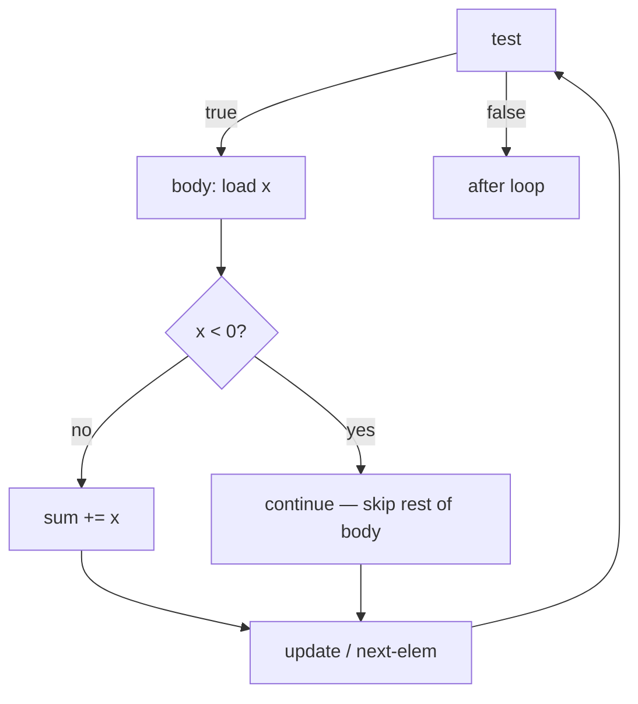

### `continue` in `while` vs `continue` in `for` — the trap

This is the single most-bitten beginner trap. **The destination of `continue` is different in `while` and `for`**:

- In `while (cond)` and `do-while`, `continue;` jumps **back to the condition test**. No counter is updated unless your body did it.
- In `for (init; cond; update)`, `continue;` jumps to the **update clause**, runs it, then re-tests.

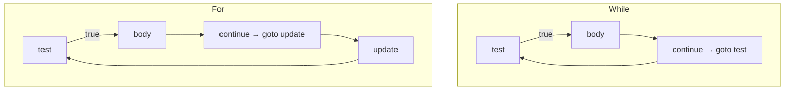

The trap fires when you mechanically rewrite a `for` as a `while` (or factor a `for` into a helper function whose increment is in the caller):

```java
// FOR — works
for (int i = 0; i < n; i++) {
    if (skip(i)) continue;          // runs i++ via the update clause
    process(i);
}

// WHILE — INFINITE LOOP
int i = 0;
while (i < n) {
    if (skip(i)) continue;          // jumps to test; i is never incremented; spins forever
    process(i);
    i++;
}
```

Fix: increment **before** the continue, or restructure the test:

```java
int i = 0;
while (i < n) {
    int cur = i;
    i++;                             // increment first
    if (skip(cur)) continue;
    process(cur);
}
```

> [!WARNING]
> When you migrate a `for` to a `while` (or vice versa), recheck every `continue` path. The loop's counter step that the `for` ran automatically *will not* run in the `while` form unless you put it there manually.

### `continue` can usually be rewritten as `if/else`

A loop body of the form:

```java
for (...) {
    if (cond) continue;
    do_a();
    do_b();
}
```

is equivalent to:

```java
for (...) {
    if (!cond) {
        do_a();
        do_b();
    }
}
```

The `continue` version is often preferred for **shallow nesting** when you have many filter conditions stacked:

```java
for (Record r : records) {
    if (r == null) continue;
    if (r.isDeleted()) continue;
    if (!r.isVisible(viewer)) continue;
    if (r.amount < threshold) continue;
    process(r);
}
```

versus the deeply-nested:

```java
for (Record r : records) {
    if (r != null) {
        if (!r.isDeleted()) {
            if (r.isVisible(viewer)) {
                if (r.amount >= threshold) {
                    process(r);
                }
            }
        }
    }
}
```

The `continue` version reads as a series of **guards** — "skip if not interesting" — and keeps the *actual* work at the same indentation level. This is the same insight as "early `return`" in method-design style guides.

## Labels — Naming a Statement to Target

A **label** is a name followed by a colon, placed immediately before a statement. The labelled statement is most commonly a loop:

```java
outer:
for (int i = 0; i < n; i++) {
    inner:
    for (int j = 0; j < m; j++) {
        ...
    }
}
```

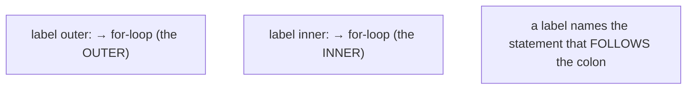

### Syntax rules

- A label is an **identifier** followed by `:`. Standard Java convention is lowercase (`outer`, `search`, `done`).
- A label may be attached to **any statement**, not just loops — including blocks and even single statements — but only **labelled loops** and **labelled switches** are targetable by `break`/`continue`, so labelling anything else is rare.
- A label's **scope** is the labelled statement itself. Outside that statement, the name is unknown:

```java
outer:
for (int i = 0; i < n; i++) {
    ...
}
break outer;     // COMPILE ERROR: 'outer' is not in scope here
```

- Labels live in a **separate namespace** from variables, methods, and types — `outer` as a label doesn't collide with `int outer = 1;`.
- A label **cannot be redeclared** in a nested loop within its scope (you can't have an `outer:` inside another `outer:`). The compiler will report the inner one as a duplicate.

### Labelled `break` — Exit a Specific Outer Loop

`break <label>;` exits the labelled statement *and everything inside it*. Control resumes at the statement after the labelled loop:

```java
int[][] grid = ...;
int foundRow = -1, foundCol = -1;
outer:
for (int r = 0; r < grid.length; r++) {
    for (int c = 0; c < grid[r].length; c++) {
        if (grid[r][c] == target) {
            foundRow = r;
            foundCol = c;
            break outer;            // exits BOTH loops
        }
    }
}
System.out.println("at " + foundRow + "," + foundCol);
```

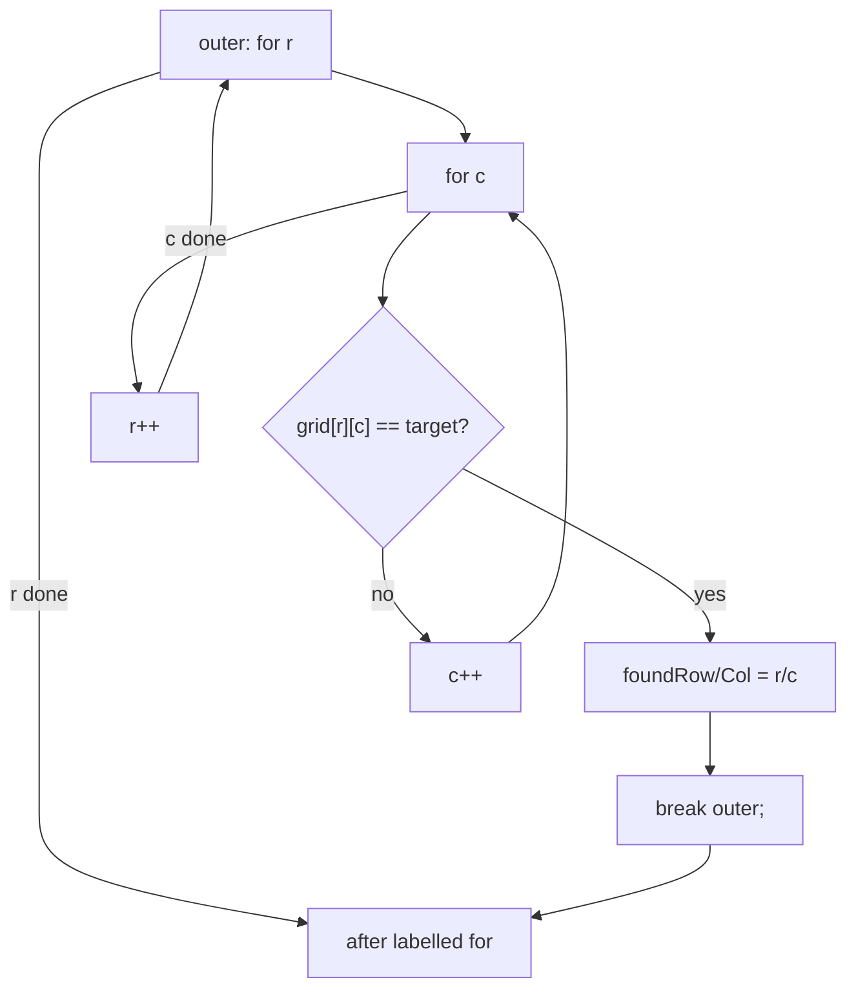

This is the **only** way to exit two-plus loops in a single statement. The alternative is a found-flag + outer-loop-guard pattern:

```java
boolean found = false;
for (int r = 0; r < grid.length && !found; r++) {
    for (int c = 0; c < grid[r].length && !found; c++) {
        if (grid[r][c] == target) {
            foundRow = r; foundCol = c;
            found = true;
            break;
        }
    }
}
```

— more code, an extra variable, two extra conditions checked per iteration. The labelled `break` is **strictly better** for readability and perf.

### Labelled `continue` — Skip to the Next Iteration of an Outer Loop

`continue <label>;` is `continue`, but targeting an outer loop's *next iteration*. Use it when an inner-loop discovery means "this outer-loop element is no longer interesting; move to the next one":

```java
outer:
for (Customer c : customers) {
    for (Order o : c.recentOrders()) {
        if (o.flagged()) {
            log("flagged customer: " + c.id());
            continue outer;          // skip remaining orders, move to next customer
        }
    }
    process(c);                      // only reached if no flagged orders
}
```

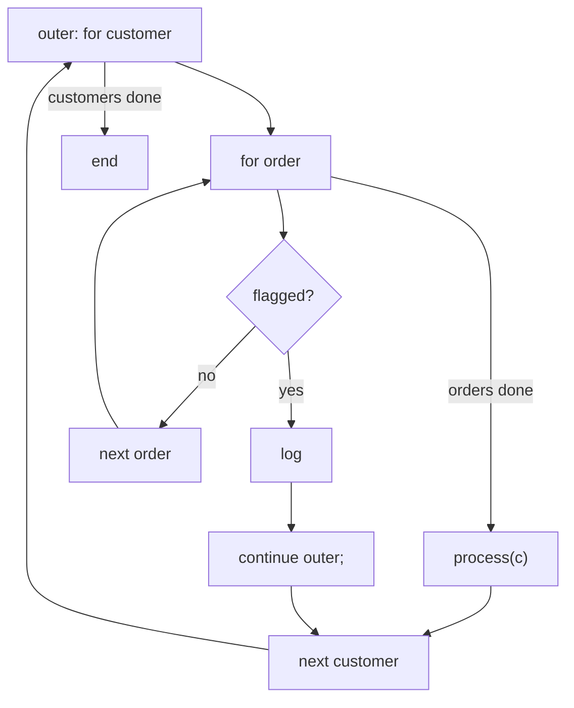

The labelled-`continue` version reads "if any order is flagged, skip this customer." The flag-based alternative needs an extra boolean and a guard at the end of the outer body.

### Labels on non-loop statements (rare but legal)

You can label a plain block, then `break` out of it like a one-statement `goto`:

```java
done:
{
    if (config == null) break done;
    if (!config.isValid()) break done;
    deploy(config);
}
// resumes here after any of the breaks
```

This is essentially a "structured `goto` forward" — Java's narrow escape valve for the no-`goto` rule. It's legal and the compiler accepts it, but most style guides discourage it because methods can be extracted instead. Reserve it for genuine cases where extraction is awkward.

## `return` — The Whole-Method Exit

`return;` exits the **enclosing method** (or `return expr;` returns a value). It's the bigger hammer — bypasses any number of enclosing loops, switches, and blocks in one step:

```java
int findIndex(int[] arr, int target) {
    for (int i = 0; i < arr.length; i++) {
        if (arr[i] == target) return i;        // exits method directly
    }
    return -1;
}
```

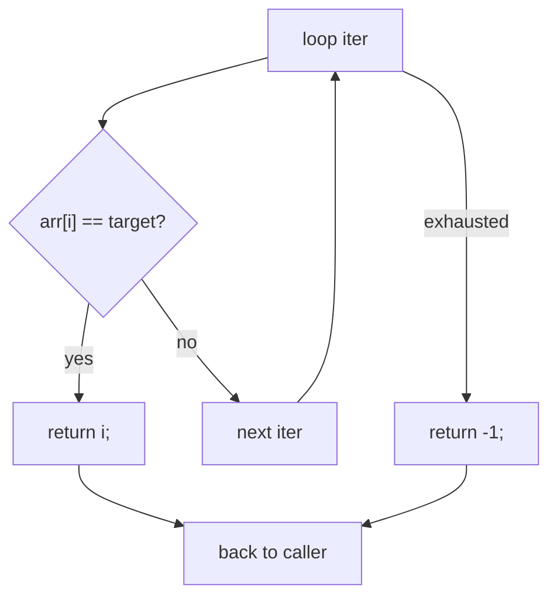

In a method whose sole loop's purpose is "find and return," `return` is cleaner than `break` + a separate return statement after the loop. The general guideline: **`return` for method-level exits; `break`/`continue` for loop-level adjustments.**

### `return` vs `break outer`

When the loop is the **entire** method, prefer `return` — it's one statement, no label needed, and the IDE/refactor tools understand it better:

```java
// Prefer this:
int findIndex(int[] arr, int target) {
    for (int i = 0; i < arr.length; i++) {
        if (arr[i] == target) return i;
    }
    return -1;
}

// Over this:
int findIndex(int[] arr, int target) {
    int idx = -1;
    outer:
    for (int i = 0; i < arr.length; i++) {
        if (arr[i] == target) {
            idx = i;
            break outer;
        }
    }
    return idx;
}
```

The labelled `break` is only the right choice when there's **more work after the loop** (cleanup, logging, returning a derived value) that you don't want to repeat in every early-exit path.

## Memory Layer — Bytecode

Every `break`, `continue`, labelled `break`, and labelled `continue` lowers to **one** bytecode opcode: **`goto`**. The compiler computes the target label, places it at the right point in the method, and emits a single `goto target;`. Labels themselves are **purely compile-time** names — they have no runtime representation, no frame slot, no allocation.

### The Big Picture

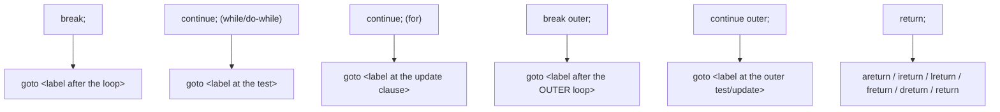

Five flavours of `goto`, one flavour of `return`. No "labelled-break opcode," no exception, no stack manipulation.

### `break` in a Single Loop

Source:

```java
for (int i = 0; i < 5; i++) {
    if (i == 3) break;
    System.out.println(i);
}
```

Bytecode (`javap -c`):

```
 0: iconst_0
 1: istore_1                  // i = 0
 2: iload_1
 3: iconst_5
 4: if_icmpge   28            // top: if i >= 5 jump to end
 7: iload_1
 8: iconst_3
 9: if_icmpne   15            // if i != 3, skip the break
12: goto        28            // BREAK -> jump to 28 (end)
15: getstatic   #2
18: iload_1
19: invokevirtual #3
22: iinc        1, 1
25: goto        2             // loop close
28: return                     // end
```

The `break;` at line 12 is a single `goto 28` — the same offset the loop-close test (`if_icmpge` at line 4) jumps to. So `break` and "natural exit" both land at the same instruction after the loop.

### `continue` in `while` vs `for`

Source A (`while`):

```java
int i = 0;
while (i < 5) {
    if (i == 3) continue;
    System.out.println(i);
    i++;
}
```

Bytecode:

```
 0: iconst_0
 1: istore_1
 2: iload_1                   // top (and continue target)
 3: iconst_5
 4: if_icmpge   25
 7: iload_1
 8: iconst_3
 9: if_icmpne   15
12: goto        2             // CONTINUE -> jump to the TEST
15: getstatic   #2
18: iload_1
19: invokevirtual #3
22: iinc        1, 1
... goto 2
25: return
```

Source B (`for`):

```java
for (int i = 0; i < 5; i++) {
    if (i == 3) continue;
    System.out.println(i);
}
```

Bytecode:

```
 0: iconst_0
 1: istore_1
 2: iload_1                    // top
 3: iconst_5
 4: if_icmpge   28
 7: iload_1
 8: iconst_3
 9: if_icmpne   15
12: goto        22            // CONTINUE -> jump to the UPDATE
15: getstatic   #2
18: iload_1
19: invokevirtual #3
22: iinc        1, 1          // update clause
25: goto        2             // loop close (back to test)
28: return
```

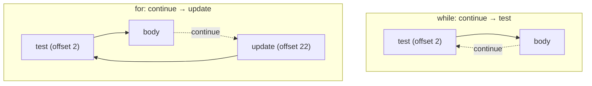

The **bytecode offset that `continue` jumps to is different**: in `while`, it's the test (offset 2). In `for`, it's the update clause (offset 22). This is the bytecode-level evidence of the trap the language-layer section warned about.

### Labelled `break` From Nested Loops

Source:

```java
outer:
for (int i = 0; i < 5; i++) {
    for (int j = 0; j < 5; j++) {
        if (i*5 + j == 7) break outer;
    }
}
```

The bytecode has both loops, both with their backward `goto`s, but the `break outer;` is a single `goto <label-after-outer-loop>` — bypassing the inner loop's close, the inner loop's update, the outer loop's update, and the outer loop's close all in one jump:

```
 0: iconst_0
 1: istore_1                  // i = 0
 2: iload_1                   // outer-top
 3: iconst_5
 4: if_icmpge   40            // outer exit
 7: iconst_0
 8: istore_2                  // j = 0
 9: iload_2                   // inner-top
10: iconst_5
11: if_icmpge   34            // inner exit -> back to outer update
14: iload_1
15: iconst_5
16: imul
17: iload_2
18: iadd
19: bipush       7
21: if_icmpne   28
24: goto        40            // BREAK OUTER -> straight to AFTER outer loop
28: iinc        2, 1          // j++
31: goto        9             // inner close
34: iinc        1, 1          // i++ (outer update)
37: goto        2             // outer close
40: return                     // end (after outer loop)
```

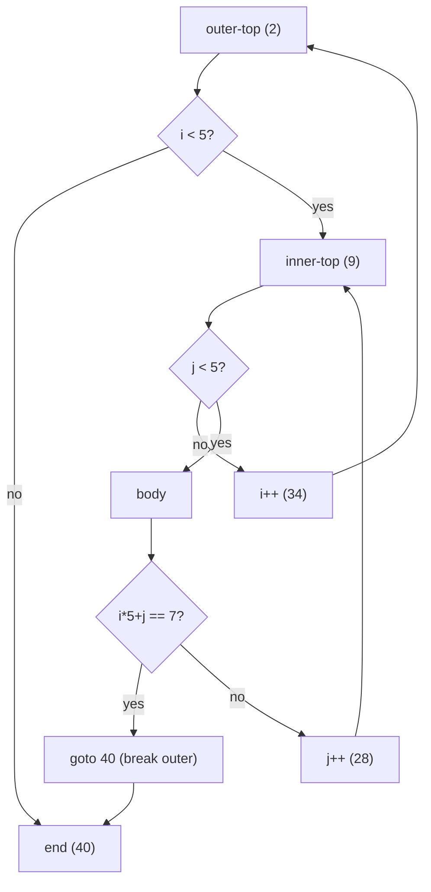

The labelled `break` is **one** opcode, jumping over **every** nested loop's structure. No unwinding, no exception, no stack manipulation. The verifier checks the operand stack is empty at offset 40 (it is — both the inner loop's locals `j` and the outer loop's `i` are still in their slots, but the operand stack is empty as required at any reachable label).

### Labelled `continue` to an Outer Loop

Source:

```java
outer:
for (int i = 0; i < 5; i++) {
    for (int j = 0; j < 5; j++) {
        if (j == 3) continue outer;
    }
    System.out.println(i);          // skipped when continue outer fires
}
```

Bytecode (sketch — same outer/inner structure, with `continue outer;` translating to a `goto <outer-update-label>` — so the outer's `i++` runs, then the outer's test re-runs):

```
... outer-top, inner-top as before ...
14: iload_2                   // load j
15: iconst_3
16: if_icmpne   22
19: goto        34            // CONTINUE OUTER -> goto OUTER UPDATE (34, i++)
22: iinc        2, 1          // j++
25: goto        9             // inner close
28: getstatic   #2            // println(i)
31: invokevirtual #3
34: iinc        1, 1          // i++
37: goto        2
40: return
```

`continue outer` jumps to the outer loop's update label (offset 34) — not the outer loop's test, *not* the inner loop's update. Then `i++` runs, then the outer test re-runs. Exactly the semantics the source asks for.

> [!IMPORTANT]
> A labelled `break` jumps to the label **after** the labelled loop (skipping the loop's update). A labelled `continue` jumps to the labelled loop's **update** (or, for `while`/`do-while`, its test). Same `goto` opcode, different compiler-placed target.

### Labels Have No Runtime Cost

A label is a **compile-time name** the compiler uses to compute jump targets. It produces no opcode, no frame slot, no runtime object. It doesn't appear in the constant pool except as a debug-info entry (if `-g` is on, the `LocalVariableTable` and `LineNumberTable` reference source positions, but the *label name itself* is discarded — you can't read it back from a stack trace).

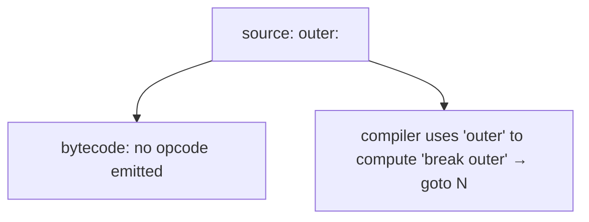

This is why labelled `break` is strictly cheaper than the boolean-flag pattern: the flag pattern adds a heap-store (or local-write) per iteration and an extra compare-and-branch on the outer test; the labelled break adds **nothing** at runtime — just one `goto` that fires only on the exit iteration.

### Operand-Stack Invariant at Every Label

The JVM verifier requires every reachable label to have a **deterministic operand-stack shape** — the same depth and types regardless of which control-flow edge reaches it. For a label that's the target of a `break`, this is trivially "empty stack" because the statement before the `break` is a *complete statement* (its expression value has been consumed or stored). The compiler enforces this:

```java
int x = something();
break;                // ok — assignment is a complete statement; stack empty
```

```java
something() +         // illegal — break in the middle of an expression
break;                //   — javac rejects this; stack would be non-empty
```

This rule is the language-level reason `break`/`continue` can only appear as **statements**, never inside expressions.

## Architecture Layer — JIT and CPU

At the native-code level, every `break` and `continue` is a single **unconditional jump** (`jmp` on x86-64, `b` on ARM64). Static branch prediction treats it as either forward (predict not-taken) or backward (predict taken).

### `break` — Forward Jump, Predicted Not-Taken

A `break` jumps **forward** to a target after the loop. Static prediction says "forward branches are not-taken until trained otherwise." So the **iteration that fires the break** is a single mispredict — ~10-20 cycles of pipeline flush:

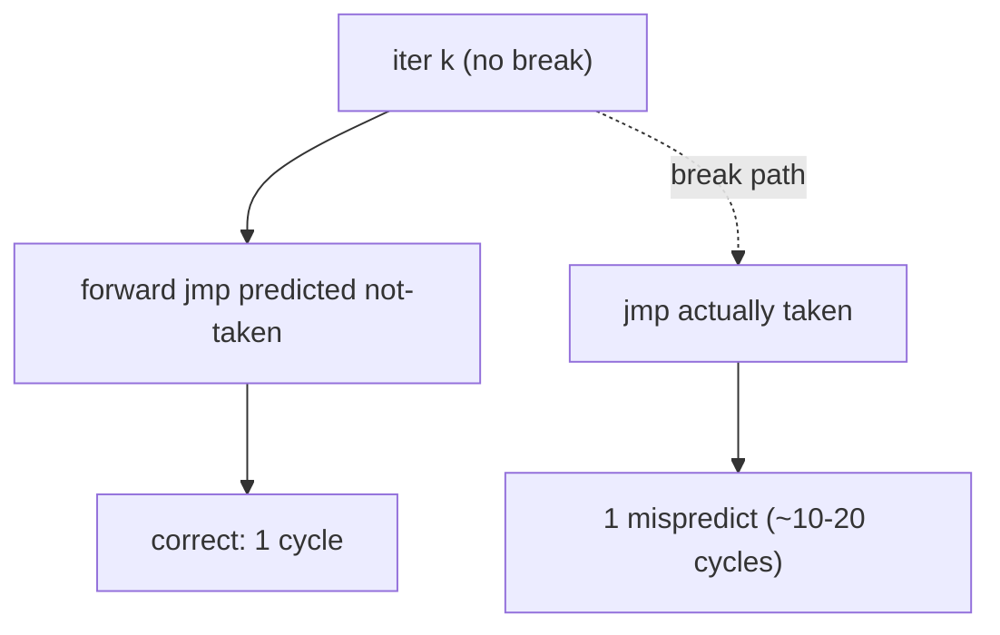

Amortised across a 1000-iteration loop, that single mispredict is invisible. After running the loop a few times, the dynamic predictor (2-bit saturating counter per branch, history-indexed pattern tables) learns the pattern — e.g. "always breaks on iteration 7" — and the cost goes to near zero.

### `continue` — Backward or Mid-Loop Jump

`continue` in a `while`/`do-while` jumps **backward** to the test (predicted taken — correct). `continue` in a `for` jumps to the update clause, which is a few instructions before the backward branch — also predictable, also nearly free.

```asm
; x86-64 for-loop with a continue path
.top:
        cmp     edi, esi              ; i < n?
        jge     .end                  ; (predicted not-taken until exit)
        ; body
        cmp     dword [rdx + rdi*4], 0
        jl      .skip                 ; if arr[i] < 0, continue
        ; ... process arr[i] ...
.skip:
        inc     edi                   ; update (continue lands here)
        jmp     .top                  ; predicted taken (backward branch)
.end:
```

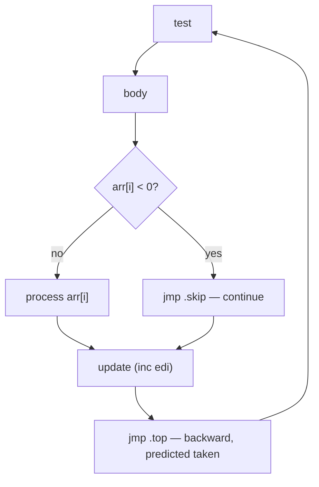

The `continue` jump is a short forward `jmp` to `.skip` — predicted not-taken initially, but quickly trained if `continue` fires often.

### Labelled `break` — Long Forward Jump

`break outer;` from a deeply nested loop becomes a forward `jmp` whose target is **after** the outer loop. The instruction itself is identical to a non-labelled `break`'s — it's just farther in offset. Same forward-jump prediction, same one-mispredict cost on the exit iteration.

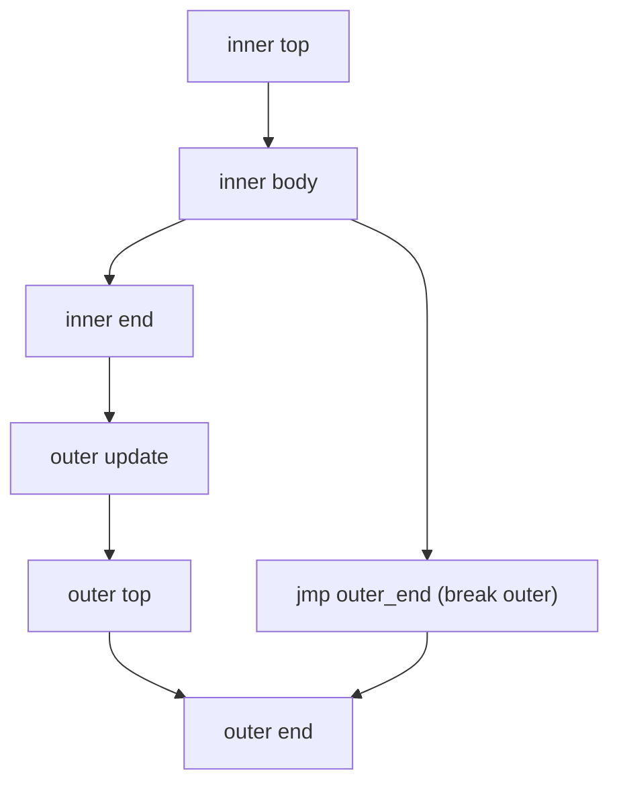

No special CPU support is needed — labels are just instruction offsets; the CPU has no idea any of this was nested.

### Deoptimisation Is Not Involved

A common confusion: in some languages (and in some non-Java runtimes), non-local jumps trigger expensive **deoptimisation** or stack-unwinding mechanisms. In Java, `break`/`continue` (labelled or not) **never** trigger deopt and **never** unwind. They are simple in-method jumps; the JIT compiles them as such, and the JIT-compiled code runs continuously without falling back to the interpreter.

The Java-level mechanism that *does* unwind is **exceptions** (`throw`/`catch`) — orders of magnitude more expensive, covered in T11 / later topics. Don't use exception-throwing as a loop-exit mechanism; use `break`/`return`.

### `return` — Method-Level Exit With ABI Compliance

`return` lowers to one of the `*return` opcodes (`ireturn` for `int`, `lreturn` for `long`, `freturn` for `float`, `dreturn` for `double`, `areturn` for reference, `return` for `void`). At the native level the JIT emits the **calling-convention return sequence**:

- Move the return value to the ABI's return register (`eax`/`rax` on x86-64; `w0`/`x0` on ARM64).
- Restore the caller's stack/frame state.
- `ret` (x86-64) / `ret` (ARM64) — pop the return address and jump to it.

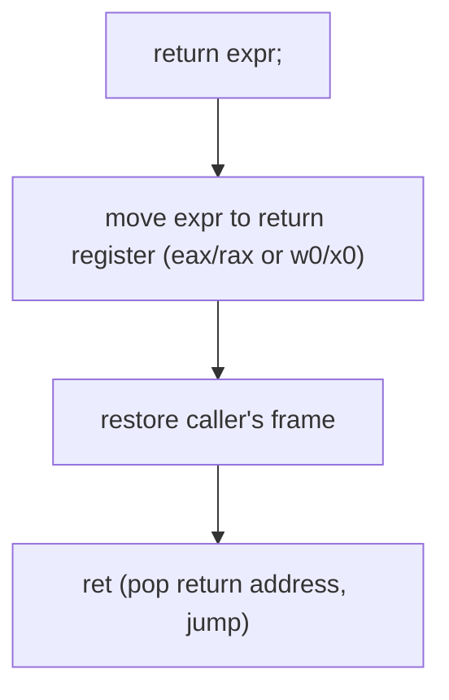

Unlike `break`/`continue`, `return` is a *frame teardown* — it leaves the current method entirely. The CPU has a dedicated **Return Address Stack (RAS)** that predicts where `ret` will go (the matching `call`'s next instruction), and it's almost always right.

## Common Mistakes

### Wrong-Level `break` in Nested Loops

```java
for (int i = 0; i < n; i++) {
    for (int j = 0; j < m; j++) {
        if (found(i, j)) break;        // BUG: only exits the inner loop
    }
    // outer loop keeps going — was that intended?
}
```

If you meant "stop searching entirely," use `break outer;`. If you only meant "skip the rest of *this* row," the code is correct.

### `continue` in a `while` Forgetting the Counter

Covered in detail above. The fix is either to use a `for` (which runs the update via the update clause regardless of `continue` paths), or to step the counter **before** the continue.

### Stray Semicolon Doesn't Disable break/continue Anymore

The classic `for (...);` empty-body bug (T09) places any subsequent `break;` *outside* a loop:

```java
for (int i = 0; i < n; i++);
    break;                            // COMPILE ERROR: break outside a loop
```

The compiler catches this one (`break outside switch or loop`) — useful side-effect of the empty-loop bug.

### Label-After-Statement Parse Error

A label binds to the **next** statement. It's not a free-floating tag:

```java
{
    label:                            // COMPILE ERROR: not followed by a statement
}
```

Always have a statement after the colon. If you want a "named scope" for `break`, label a block: `label: { ... }`.

### Label Shadowing

A label declared in a nested scope **shadows** an outer label of the same name:

```java
outer:
for (...) {
    outer:                            // COMPILE ERROR in modern javac: duplicate label
    for (...) {
        break outer;                  // would be ambiguous
    }
}
```

`javac` rejects duplicate labels in the same enclosing scope. Pick different names (`outerLoop`, `innerLoop`, or descriptive ones like `nextCustomer`).

### Redundant `break` in Arrow-Form Switch Arms

```java
switch (state) {
    case READY -> { doReady(); break; }   // BUG: break is unreachable / redundant
}
```

Arrow arms don't fall through. The compiler will warn or error. Remove the `break`.

### Using `break` to Exit a `try` Block From Inside

```java
try {
    for (int i = 0; i < n; i++) {
        if (cond) break;           // OK — exits the for, leaves the try normally
    }
} finally {
    cleanup();                      // runs (try exits normally; for terminated via break)
}
```

This is fine and is the right pattern. `break` doesn't bypass `finally` — the `try` block exits normally because `break` ends the for, then control flows out of the try the way the source structure dictates.

### `continue` in an Enhanced `for-each` Skips the Element, Not "Re-Reads" It

```java
for (Item item : items) {
    if (skip(item)) continue;       // skips the rest of the body for THIS item; next-element loaded next pass
    process(item);
}
```

`continue` doesn't re-process the current element — it ends the current iteration. The next iteration loads the *next* element via the iterator/index, as usual.

### `return` From a Nested Loop Inside a Lambda Exits the Lambda, Not the Enclosing Method

```java
list.forEach(x -> {
    if (cond(x)) return;            // returns from the lambda only — the forEach continues
});
// control resumes here after forEach completes normally
```

This bites readers used to `return` exiting the method. Inside a lambda, `return` exits the **lambda**, not the enclosing method. Equivalent to `continue` in a `for-each`. (To exit the method early, refactor to an explicit `for-each` loop or use `Stream.anyMatch` / `findFirst`.)

> [!INTERVIEW]
> Interview angles cluster around the semantics, the bytecode lowering, and the cost.
>
> 1. **What's the difference between `break` and `continue`?** `break` exits the enclosing loop; `continue` skips the rest of the current iteration and re-tests.
> 2. **`continue` in a `while` vs in a `for` — what's different?** In `while`, jumps to the test. In `for`, jumps to the update clause (which runs before the test).
> 3. **Why does Java have labels?** To target an outer loop from a nested one for `break`/`continue`. Java doesn't have a general `goto`.
> 4. **What's the bytecode for `break`?** A single `goto <label-after-the-loop>`.
> 5. **How expensive is a labelled `break`?** One `goto` opcode, one forward `jmp` at the native level; on the exit iteration, one branch mispredict (~10-20 cycles), amortised invisible across the loop.
> 6. **What's the bytecode difference between labelled and unlabelled `break`?** None — both are `goto`. The compiler computes a different target.
> 7. **Can you `break` out of a `try` block?** Yes — `break` ends the loop and control flows out of the try normally (finally runs).
> 8. **Why is `return` from inside a lambda non-local?** It returns from the **lambda**, not the enclosing method. Lambdas have their own method body in bytecode.
> 9. **Can a label name shadow a variable name?** Yes — labels and variables are in separate namespaces. But duplicate labels in nested scopes are rejected.
> 10. **What's the operand-stack shape required at a `break` target?** Empty stack — the verifier requires deterministic stack shape at every reachable label.
> 11. **`break outer;` vs found-flag pattern — perf?** The flag pattern adds a per-iteration write and one extra compare on the outer test. The label pattern adds nothing at runtime. Label wins.

## Practice

1. **Trace a simple `break`.** Compile `for (int i = 0; i < 5; i++) { if (i == 3) break; System.out.println(i); }`. Run `javap -c`. Find the `goto <end>` for the break and confirm it lands at the same offset as the loop's natural exit.
2. **`continue` in `while` vs `for`.** Compile both forms with the same body. Run `javap -c` and compare the `continue`'s `goto` target. Confirm: in `while`, target = test; in `for`, target = update clause.
3. **The migration bug.** Write a `for` with a `continue` path. Mechanically translate to a `while`, putting `i++` at the bottom of the body. Run — verify infinite loop. Fix by moving `i++` to the top.
4. **Labelled `break` for a 2-D search.** Find a value in a 2-D `int[][]`. Write it once with `break outer;`, once with the found-flag pattern. `javap -c` both. Count instructions executed per iteration in the inner loop. The label version is one fewer.
5. **Labelled `continue` to skip a category.** Iterate customers and their orders; if any order is flagged, skip that customer's `process` call via `continue outer;`. Verify behaviour against a manual flag.
6. **`return` vs `break outer`.** Refactor a "find and return index" method that uses `break outer;` + a separate `return idx;` into a direct `return i;` inside the loop. Diff the bytecode — confirm the return form is shorter and avoids the label.
7. **Labelled block (rare).** Write `done: { if (a) break done; if (b) break done; process(); }`. `javap -c` and confirm both breaks are `goto`s to the same target (the byte after the block).
8. **Lambda `return` trap.** Write `list.forEach(x -> { if (skip(x)) return; process(x); });`. Confirm the surrounding method doesn't exit, only the lambda. Compare to a `for-each` version where `return` would exit the method.
9. **Stray `break` outside a loop.** Write `break;` at the top level of `main`. Confirm the compile error message ("break outside switch or loop"). Same with `continue;`.
10. **Label shadowing.** Try to declare two `outer:` labels nested. Observe the compile error.
11. **Empty body + `break`.** Reproduce `for (;;) {}` (the canonical infinite loop). Add a `break` after a counter check; verify the loop exits.
12. **Branch-prediction microbench.** Run two versions of a 100M-iteration loop: one with `break` on the very last iteration only; one with `break` on a random iteration each run. Measure the cost. The first should be effectively free; the second adds a small mispredict cost.
13. **`break` in `try`/`finally`.** Write a `for` inside a `try` block. `break` mid-loop. Verify the `finally` runs (it should). Repeat with `return` — same.
14. **Read the LocalVariableTable.** Compile a loop with labelled break (`javac -g LoopTest.java`). Run `javap -l`. Confirm the label name does **not** appear in the variable table — labels are debug-info-free at the per-variable level.
15. **Explain it back.** Trace `outer: for (...) for (...) { if (...) continue outer; ... }` from source through (a) the compiler's label placement, (b) the bytecode `goto` to the outer update clause, (c) the JIT's forward `jmp` to that offset, (d) the branch predictor's behaviour over the first 100 loop iterations.

## Recap

You should now be able to:

- Distinguish the **four early-exit forms** — `break` (exit the enclosing loop or switch), `continue` (skip the rest of this iteration), labelled `break`/`continue` (target a specific outer loop), and `return` (exit the method) — and pick the smallest one that fits.
- Recall that `break` in a `switch` (T08) terminates the switch only — to exit the *loop* from inside a nested switch, use **`break <label>;`**.
- Apply the **`continue`-target rule**: in `while`/`do-while`, `continue` jumps to the **test**; in `for`, it jumps to the **update clause** (which runs before the next test).
- Recognise the **for-to-while migration trap** — a `continue` path that worked in `for` (because the update ran) becomes an infinite loop in `while` (because no update ran).
- Prefer the **early-`continue` guard pattern** over deep `if/else` nesting when filtering elements.
- Use **labels** with the Java convention (lowercase identifier + `:`) on loops (most common) or blocks (rare); understand label **scope** (only inside the labelled statement) and the **separate namespace** from variables.
- Apply **labelled `break`/`continue`** as the cleanest exit-multiple-loops idiom, vastly preferable to the found-flag + outer-condition-guard alternative.
- Use **`return`** rather than `break outer;` when the entire method is the loop's purpose (cleaner, no label).
- Trace `break` to bytecode as a single **`goto <label-after-the-loop>`**; trace `continue` (while/do-while) as `goto <test-label>`; trace `continue` (for) as `goto <update-label>`; trace `break outer;` as `goto <after-outer-loop>` — *one* opcode, no exception, no unwinding.
- Recognise that **labels are pure compile-time names** — no opcode, no frame slot, no allocation, no entry in the constant pool's variable table.
- Predict the **architecture-level cost**: `break` is a forward `jmp` (statically predicted not-taken), 1 mispredict on the exit iteration (~10–20 cycles), amortised invisible across the loop run; `continue` is a short forward `jmp` whose taken-ness becomes predictable after a few iterations; `return` is the calling-convention return sequence (`mov` to return register, frame teardown, `ret`) and benefits from the CPU's Return Address Stack.
- Understand that **`break`/`continue` never trigger deoptimisation or exception unwinding** — they are in-method jumps; the JIT compiles them as plain branches.
- Avoid the **common traps**: wrong-level `break` in nested loops, `continue` in a `while` forgetting the counter step, redundant `break` in arrow-form switch arms, label shadowing in nested scopes, `return` inside a lambda exiting only the lambda (not the enclosing method), labelling a non-statement, expecting `break` to bypass `finally` (it doesn't — `finally` always runs).

## Next

Continue to [Arrays (1-D, multi-dimensional)](./T11-arrays-1-d-multi-dimensional.md).
