# Methods, parameters, return values

A **method** is Java's unit of named, reusable behaviour. You give a chunk of code a name, list what inputs it takes (**parameters**), and say what it produces (**return type**). Then anywhere else, you call it by name with values for the inputs (**arguments**), and the JVM jumps to the method, runs it, and brings the result back. Methods are how you decompose a 10 000-line program into 1 000 ten-line methods, each understandable in isolation.

The depth-bar requirement isn't just "show the syntax." Method invocation is one of the JVM's central mechanisms, and the language designers wired five different bytecode opcodes for it (`invokestatic`, `invokevirtual`, `invokespecial`, `invokeinterface`, `invokedynamic`) — each used for a different kind of call. At the **memory** layer, every call allocates a fresh **stack frame** (T02's frame layout revisited) and copies each argument into the callee's local-variable slots; the return value travels back via the caller's operand stack; the frame is popped on `return`. At the **architecture** layer, the JVM's calls follow the host CPU's **calling convention** — System V AMD64 ABI on Linux x86-64 (first six int args in `rdi, rsi, rdx, rcx, r8, r9`; return value in `rax`); ARM64 AAPCS (first eight ints in `x0..x7`; return in `x0`). The CPU has dedicated hardware (the **Return Address Stack**) to predict where `ret` jumps. And the single most important JIT optimisation is **inlining** — when the JIT can prove a callee is hot and small, it copies the body into the caller and the call sequence vanishes, opening the door to further optimisations (constant propagation, dead-code elimination, escape analysis) across the boundary.

Parameter passing is the other deep topic. **Java is strictly pass-by-value.** Primitives are copied; references are also copied (value-of-the-reference). The widely-repeated claim "Java is pass-by-reference for objects" is wrong — and the difference matters when you try to reassign a parameter and discover the caller doesn't see the change.

> [!NOTE]
> Prerequisites: [Program Structure](./T01-program-structure-class-main-statements.md) (`L0/C02/T01`) — the `main` method, why it's `static`; [Variables & Primitive Types](./T02-variables-and-primitive-types.md) (`L0/C02/T02`) — the stack-frame layout, primitive byte sizes, the "value-of-a-reference" passing model; [Type Conversion](./T05-type-conversion-and-casting.md) (`L0/C02/T05`) — argument widening; [Loops](./T09-loops-while-do-while-for-for-each.md) (`L0/C02/T09`) — for the JIT's loop-inlining intuition; [break/continue/labels](./T10-break-continue-labels.md) (`L0/C02/T10`) — `return` covered there; [Arrays](./T11-arrays-1-d-multi-dimensional.md) (`L0/C02/T11`) — array arguments, defensive copy; [Source to Bytecode](../C01-cs-foundations/T04-source-to-bytecode-to-jvm-to-machine-code.md) (`L0/C01/T04`) — `.class` constant pool, operand stack, the invoke opcode family.

## Why Methods Exist

A program without methods is one giant `main` body — every detail spelled out at one indentation, every variable in one scope, every change to one feature rippling through unrelated code. Methods solve four problems at once:

1. **Naming.** `tax(amount, rate)` is shorter and clearer than the four-line tax formula inline.
2. **Reuse.** Write the body once; call it from a hundred places. Fix a bug once; every caller benefits.
3. **Abstraction.** A caller sees the *signature* (name, params, return) without needing to understand the body.
4. **Decomposition.** A 1000-line problem becomes 100 ten-line methods, each manageable.

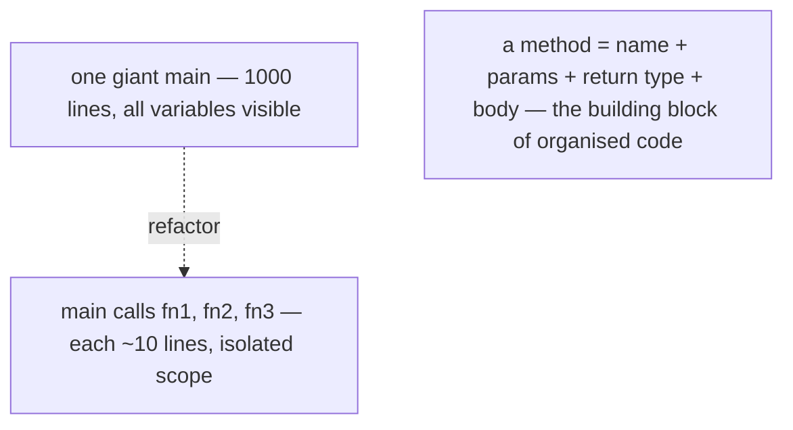

Java has only one kind of named behaviour: the **method**. There are no top-level functions (every method belongs to a class); no namespaces other than packages; no operator overloading (except `+` on strings and the implicit array-access `[]`). Master the method and you've mastered Java's only behaviour construct.

## Declaring a Method

The full method declaration has six parts, four of them optional:

```
[modifiers]  [<generics>]  <returnType>  <name>  (<parameter list>)  [throws <Exceptions>] {
    <body>
}
```

Example:

```java
public static int add(int a, int b) {
    return a + b;
}
```

| Part | Purpose | Example |
|------|---------|---------|
| **Modifiers** | Visibility, static/instance, abstract, final, synchronized, etc. | `public static` |
| **Generics** (optional) | Type parameters for generic methods | `<T>` |
| **Return type** | What the method produces; `void` if nothing | `int` |
| **Name** | Identifier the caller uses | `add` |
| **Parameter list** | Typed inputs, comma-separated | `(int a, int b)` |
| **`throws` clause** | Checked exceptions the method may throw | `throws IOException` |
| **Body** | The statements; uses `return` to exit | `{ return a + b; }` |

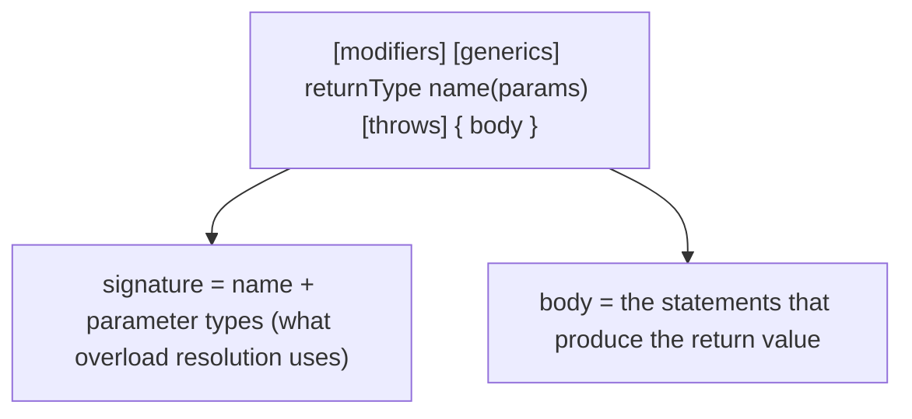

### `static` vs instance methods

The most important early distinction. A method is one of two kinds:

- **`static` method** — belongs to the **class itself**. Called as `ClassName.method(args)`. Has **no `this` reference**. The `main` method is static (T01's "why" was: the JVM can't have an object before it has loaded a class to call methods on; `main` must therefore be callable without one).
- **Instance method** — belongs to **each instance** (object) of the class. Called as `obj.method(args)`. Has an implicit `this` reference to the instance. Can access instance fields directly.

```java
class Counter {
    private int count;

    // Instance method — has 'this', can access 'count'
    public void increment() {
        this.count++;          // 'this.' optional
    }

    // Static method — no 'this', no instance fields visible directly
    public static int max(int a, int b) {
        return a > b ? a : b;
    }
}

// Usage:
Counter c = new Counter();
c.increment();                 // instance call — receiver is 'c'
int m = Counter.max(3, 5);      // static call — no receiver
```

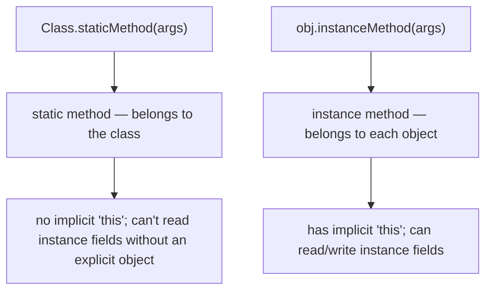

Static for utility functions (`Math.max`, `Arrays.sort`, factory methods) where there's no per-instance state. Instance for behaviour that depends on object state.

### Access modifiers (preview)

Four levels, ordered from most to least restrictive:

| Modifier | Visible to |
|----------|-----------|
| `private` | The declaring class only |
| (none — package-private) | Any class in the same package |
| `protected` | Same package + subclasses anywhere |
| `public` | Anyone |

Full coverage in L1/C01. For now: **default to `private`** for helpers; **mark `public`** what you want to be the class's API.

### Return type and the `return` statement

`return` exits the method (T10). For a non-`void` return type, every code path must end in either `return <expr>;` or `throw <exc>;` — the compiler enforces this:

```java
int abs(int x) {
    if (x >= 0) return x;
    // COMPILE ERROR: missing return statement
}
```

Add the missing branch:

```java
int abs(int x) {
    if (x >= 0) return x;
    return -x;
}
```

For `void` methods, `return;` (no value) is **optional** at the end — control naturally falls off the closing brace. You can still use `return;` to bail out early:

```java
void shout(String s) {
    if (s == null) return;            // early bail; OK
    System.out.println(s.toUpperCase());
}
```

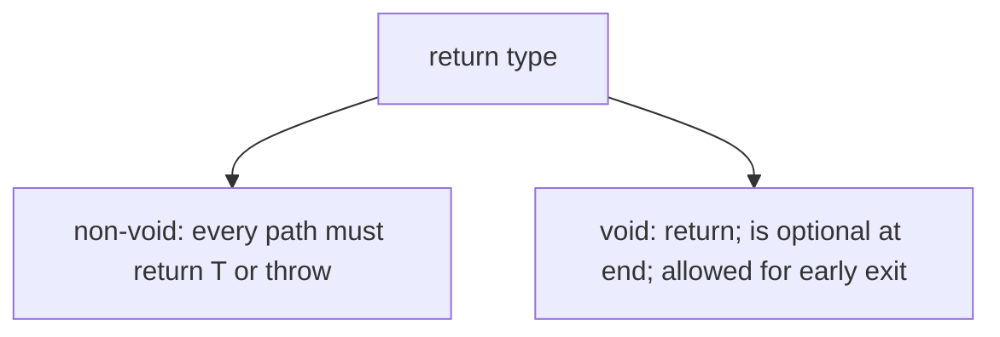

### Calling methods

Three syntactic forms:

```java
// 1. Instance call — explicit receiver
counter.increment();

// 2. Static call — class name as receiver
Counter.max(3, 5);

// 3. Unqualified call — implicit 'this' (instance) or implicit class (static)
//    inside the same class:
class Counter {
    void doubleIt() {
        increment();              // implicit this.increment()
        increment();
    }
}
```

Inside an instance method, an unqualified call resolves first to an instance method on `this`, then to a static method on the current class, then up the inheritance chain. Inside a static method, only static methods are visible without a receiver.

### Argument evaluation order — left-to-right

Per JLS §15.7.4, arguments are evaluated **strictly left-to-right** before the call:

```java
int i = 0;
log(i++, i++, i++);              // calls log(0, 1, 2)
```

This matters when arguments have side effects. It's deterministic, unlike C/C++ where evaluation order of function arguments is unspecified (and the source of years of bugs). In Java the order is fixed by spec.

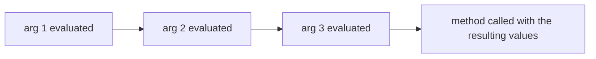

## Parameters and Pass-By-Value

This is the most-misunderstood topic in Java. **Java is strictly pass-by-value.** Every parameter is initialised by **copying** the caller's argument **value** into the callee's local-variable slot.

For primitives the value is the bits themselves (4 bytes for `int`, 8 for `long`, etc.). For object types the value is the **reference** — the (compressed) pointer to the heap object. The reference is copied; the heap object is not.

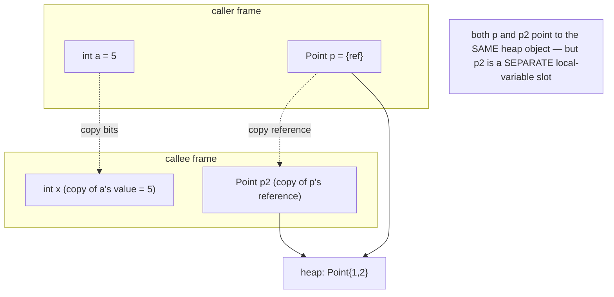

### Primitives — caller is untouched

```java
void incr(int x) {
    x = x + 1;                   // modifies the LOCAL copy
}

int a = 5;
incr(a);
System.out.println(a);            // prints 5 — a is unchanged
```

`x` and `a` are different memory locations. The callee's `x = x + 1` changes only the callee's local slot, then the frame is discarded on return.

### Objects — the caller sees mutations of the object

```java
class Box { int n; }

void zero(Box b) {
    b.n = 0;                     // mutates the heap object both refs point to
}

Box box = new Box();
box.n = 42;
zero(box);
System.out.println(box.n);        // 0 — the box's contents were mutated
```

Both `box` (caller's local) and `b` (callee's local) hold the same reference value; they point to the same heap object. The callee mutates that shared object; the caller sees the mutation.

### Objects — reassigning the parameter does NOT affect the caller

This is the test that reveals "by value":

```java
void replace(Box b) {
    b = new Box();               // reassign LOCAL b to a fresh object
    b.n = 999;                   // mutate the new local-only object
}

Box box = new Box();
box.n = 42;
replace(box);
System.out.println(box.n);        // 42 — caller's box was NEVER reassigned
```

If Java were pass-by-reference, the callee's `b = new Box()` would update the caller's `box` variable too — and we'd see `999`. We don't. The conclusion: Java passes a **copy of the reference value**, and reassigning the callee's local copy is invisible to the caller.

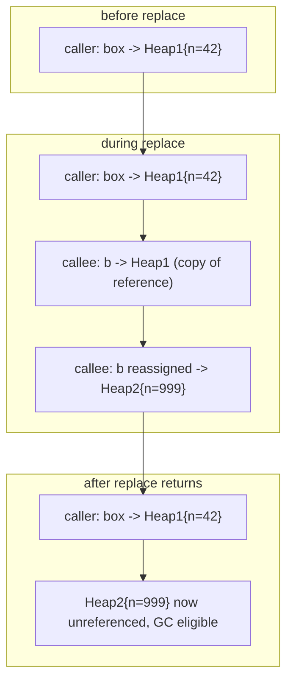

### The Java-is-pass-by-reference myth

The myth is so common it deserves its own callout. The misunderstanding goes:

> "When I pass a `Box` to a method, the method modifies my box; therefore Java must be pass-by-reference for objects."

The actual truth: **mutations of the shared object** are visible to both sides because both sides hold references to it. **Reassignments of the parameter variable** are not visible to the caller. Pass-by-reference would mean both. Java has only the first. Therefore Java is pass-**value**-of-the-reference — also known as "reference by value" — but most precisely: **pass-by-value where the value happens to be a reference**.

> [!IMPORTANT]
> **Java is strictly pass-by-value.** The argument is *always* copied into the parameter slot. For objects, the copied value is a reference — the callee can mutate the heap object the reference points to (caller sees), but cannot reassign the caller's reference variable (caller doesn't see).

### Defensive copying

If you accept a mutable object as a parameter and want to ensure the caller's object isn't mutated by your code, **copy it**:

```java
void process(int[] data) {
    int[] local = data.clone();   // defensive copy
    // mutate 'local' freely; caller's 'data' unaffected
}
```

This is the standard pattern for accepting an array, a `Date`, a `StringBuilder`, or any mutable collection where contract demands non-mutation.

### Multiple parameters

A method can declare any number of parameters, comma-separated:

```java
double interest(double principal, double rate, int years) {
    return principal * Math.pow(1 + rate, years);
}
```

Each parameter is a separate local slot in the callee's frame. There's no upper limit on count in the language, but the JVM has a hard limit of **255 parameter slots** per method (`long`/`double` count as 2 each). In practice, more than 5–7 parameters is a design smell — refactor to a parameter object.

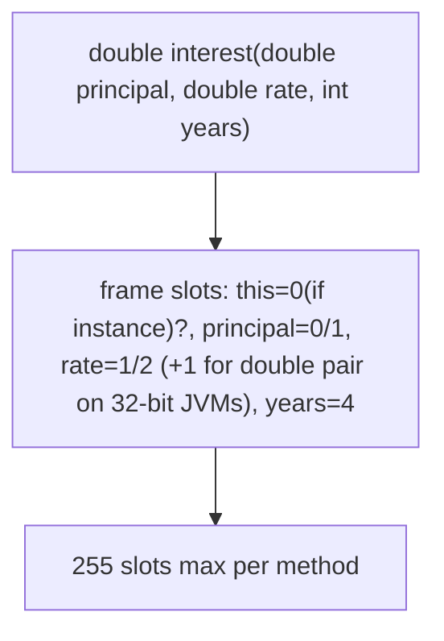

## Memory Layer — Stack Frames and the `invoke*` Family

A method call is one of the most concrete things in the JVM. We'll walk both the static and the dynamic mechanics.

### The Stack Frame, Revisited from T02

Each method call creates a **fresh stack frame** at the top of the current thread's call stack. The frame has three parts:

1. **Local-variable array** — N slots for `this` (instance methods only, slot 0), parameters (next slots), and declared locals (after). Each slot is 32 bits in the spec; `long`/`double` use two adjacent slots.
2. **Operand stack** — the per-method evaluation stack opcodes push/pop. Has a `max_stack` cap declared at compile time.
3. **Frame data** — return address (where to resume in the caller), the constant-pool reference for resolving symbolic references, optional debug data.

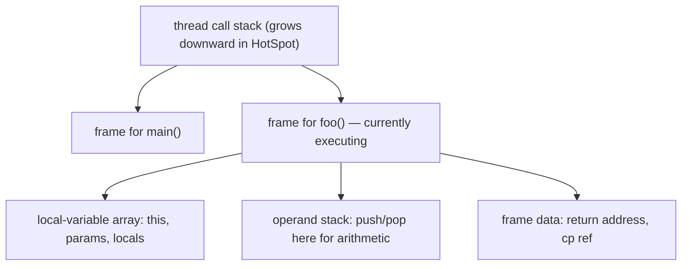

The stack is `-Xss`-sized (default ~512 KB to 1 MB per thread); when frames stack too deep, you get **`StackOverflowError`** (T02 covered this for deep recursion).

### Parameter Slot Population at Call

For an instance method call `obj.foo(a, b)`:

1. The caller pushes `obj`, `a`, `b` onto its operand stack (in that order).
2. The `invokevirtual` opcode reads them off the caller's stack.
3. A new frame is allocated for `foo`.
4. The values are written into the callee's local-variable slots: slot 0 = `obj` (= `this`), slot 1 = `a`, slot 2 = `b`.
5. The callee starts executing at its first opcode.

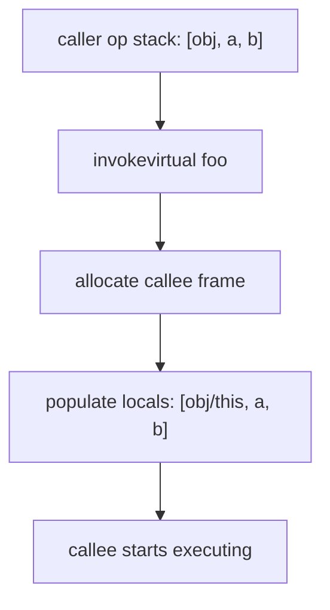

For a static call `Foo.bar(a, b)` there's no `this` — the slots are `[a, b]` starting at slot 0.

### The Five `invoke*` Opcodes

The JVM has **five** distinct call instructions, each for a specific calling pattern:

| Opcode | Used for | Receiver | Resolution |
|--------|----------|----------|------------|
| `invokestatic` | static methods | none | resolved at link time; direct call |
| `invokevirtual` | most instance methods | yes (top of stack before args) | virtual dispatch via vtable |
| `invokespecial` | constructors, `super.method()`, `private` methods | yes | non-virtual; uses declared class |
| `invokeinterface` | interface methods | yes | interface dispatch (itable lookup) |
| `invokedynamic` | lambdas, string concat | depends | bootstrap to a `CallSite` |

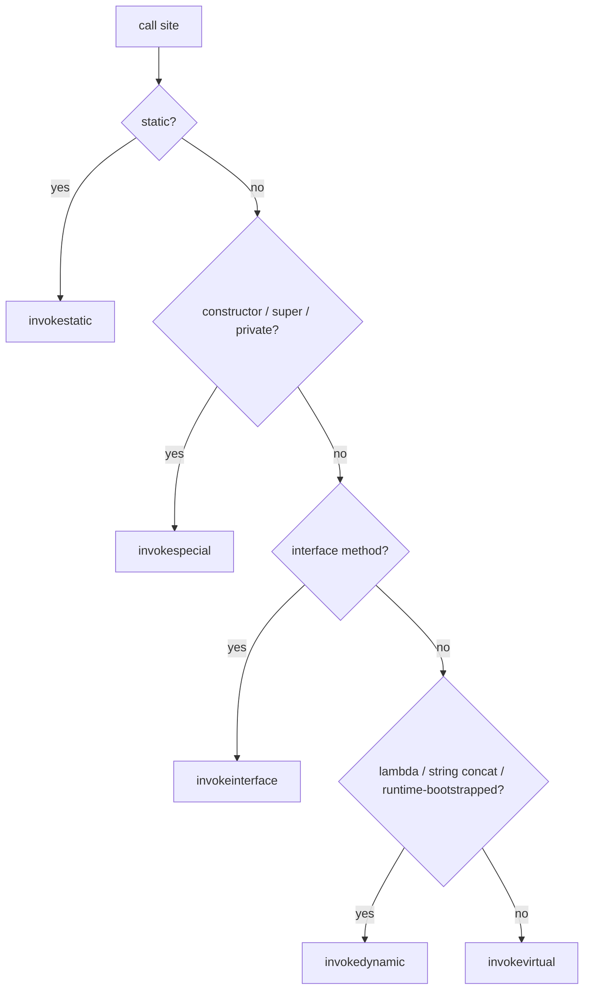

Let's see each.

### `invokestatic`

```java
class M {
    static int add(int a, int b) { return a + b; }
}

int s = M.add(3, 4);
```

Bytecode of the call:

```
 0: iconst_3
 1: iconst_4
 2: invokestatic  #2     // M.add:(II)I
 5: istore_1
```

No receiver pushed; the call directly targets `M.add`. Resolution is performed once (at class link time) and cached in the constant pool; subsequent calls are constant-time direct branches at the native level.

### `invokevirtual` — the workhorse

```java
class Animal { void speak() { System.out.println("…"); } }
class Dog extends Animal { @Override void speak() { System.out.println("woof"); } }

Animal a = new Dog();
a.speak();                    // prints "woof" — virtual dispatch
```

Bytecode:

```
 0: new           #2  // class Dog
 3: dup
 4: invokespecial #3  // Dog.<init>:()V
 7: astore_1
 8: aload_1                   // push 'a' (the Dog instance, typed as Animal)
 9: invokevirtual #4  // Animal.speak:()V
```

Notice the bytecode-level target is `Animal.speak` (the *declared* type of `a`), not `Dog.speak`. At runtime, the JVM follows the instance's actual class pointer to find the **vtable** (virtual method table) — a per-class array of method pointers indexed by table slot — and calls `Dog`'s entry for `speak`.

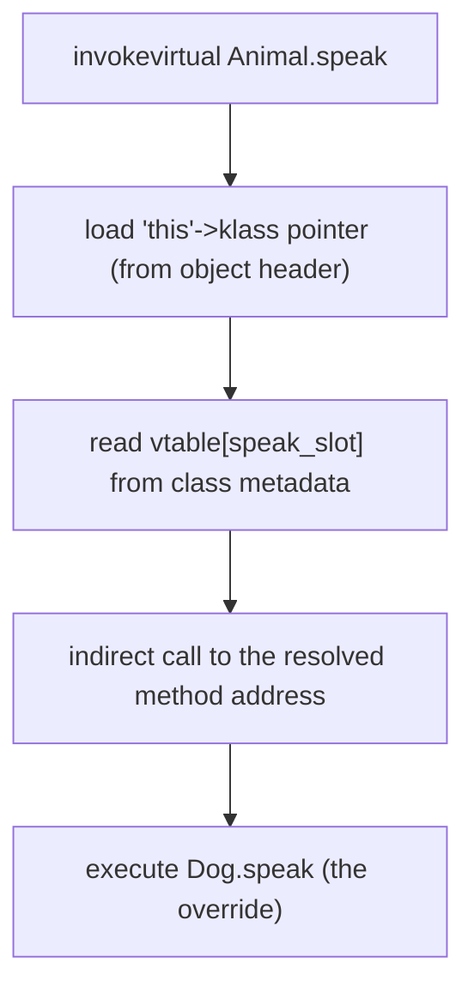

The vtable lookup costs ~1-3 cycles on hot, in-cache code (one memory load + one indirect branch through the BTB). For megamorphic call sites with many possible targets the BTB may miss, costing a mispredict (~10-20 cycles). We'll cover JIT optimisation of this in the architecture section.

### `invokespecial` — non-virtual instance dispatch

Used for three things:

1. **Constructors** — `new Foo()` emits `new Foo` + `invokespecial Foo.<init>`.
2. **`super.method()`** calls — bypass the override; target the parent's method.
3. **`private` methods** — they can't be overridden, so virtual dispatch would be wasted.

```java
class Dog extends Animal {
    void doSomething() {
        super.speak();         // invokespecial — bypasses Dog.speak()
    }
}
```

`invokespecial`'s key property: target is determined **statically** at compile time. No vtable lookup. As fast as `invokestatic`.

### `invokeinterface`

For methods called through an interface reference:

```java
List<Integer> list = new ArrayList<>();
list.add(42);                  // invokeinterface List.add
```

A class can implement multiple interfaces, so a single fixed-offset vtable doesn't work — the JVM uses **interface tables (itables)** and walks them at call time. The itable lookup is a few cycles slower than `invokevirtual`'s vtable lookup, but the JIT often turns frequent interface calls into devirtualised inline calls when the receiver type stabilises (inline caches; see architecture section).

### `invokedynamic` — bootstrap-once, then cached

The youngest opcode (Java 7+). Used for things whose target isn't known at link time:

- **Lambdas** (`(x) -> x*2`) — the lambda's implementation is generated at runtime by `LambdaMetafactory`.
- **String concatenation** with `+` (Java 9+, JEP 280) — `StringConcatFactory.makeConcatWithConstants` generates an efficient bespoke concat method.
- **Pattern matching for `switch`** (Java 21) — `SwitchBootstraps.typeSwitch` returns a case index.

```java
String s = a + " " + b;        // compiles to invokedynamic makeConcatWithConstants
```

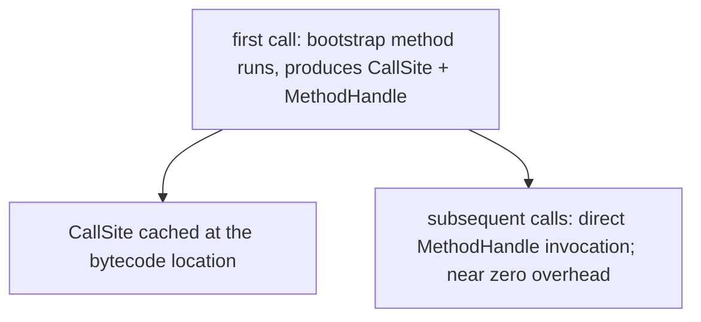

The first call goes through a heavy bootstrap; every subsequent call is near zero overhead (a single indirect-but-cached call). Full deep dive deferred to L3/C03 (lambdas and method handles).

### Worked Example — Stack Frames Through a Call

Source:

```java
class M {
    public static void main(String[] args) {
        int r = add(3, 4);
        System.out.println(r);
    }

    static int add(int a, int b) {
        return a + b;
    }
}
```

Bytecode of `main`:

```
 0: iconst_3
 1: iconst_4
 2: invokestatic  #2  // M.add:(II)I
 5: istore_1
 6: getstatic     #3  // System.out
 9: iload_1
10: invokevirtual #4  // println:(I)V
13: return
```

Bytecode of `add`:

```
 0: iload_0          // load a (slot 0; no 'this' in static methods)
 1: iload_1          // load b (slot 1)
 2: iadd             // a + b -> top of stack
 3: ireturn           // pop top of stack as int return value
```

Frame trace:

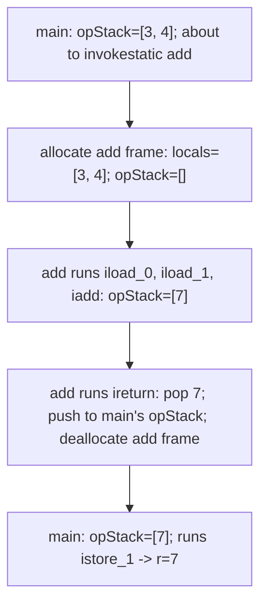

The `ireturn` is the magic step — it **pops** the int from the callee's stack, **deallocates** the callee's frame, and **pushes** the int onto the *caller's* stack. The caller's code resumes at the instruction after `invokestatic`.

### The Return Opcode Family

| Opcode | Returns | Operand stack pre-condition |
|--------|---------|---------------------------|
| `return` | nothing (`void` methods) | empty |
| `ireturn` | `int`, `byte`, `short`, `char`, `boolean` (all promoted to int) | one int |
| `lreturn` | `long` | one long (two slots) |
| `freturn` | `float` | one float |
| `dreturn` | `double` | one double (two slots) |
| `areturn` | reference | one reference |

There's no separate opcode for `boolean` return — it's promoted to `int` (`0` for false, `1` for true). Same for `byte`/`short`/`char`.

### Method Resolution at Class-Load Time

The JVM resolves a method reference (e.g., the `#2` constant-pool entry that names `M.add:(II)I`) at link time, not at every call:

1. **Class loading.** When `M` is first referenced, its `.class` bytes are loaded.
2. **Verification.** Bytecode is checked for type/stack/control-flow safety.
3. **Preparation.** Static fields get default values; method tables are sized.
4. **Resolution.** Symbolic references in the constant pool (`M.add`) are converted to direct references (a pointer to the actual `Method` metadata structure).
5. **Initialization.** Static initialisers run.

After resolution, every subsequent `invokestatic M.add` is a near-zero-cost direct call. Covered in detail in T04 (L0/C01/T04).

## Architecture Layer — Calling Convention and JIT Inlining

When the JIT compiles a method, it doesn't stay at the bytecode level — it lowers to **native machine code** following the host CPU's **calling convention**.

### System V AMD64 ABI (Linux x86-64) — Argument Registers

The standard Linux/macOS x86-64 calling convention:

| Purpose | Register |
|---------|----------|
| 1st integer/pointer arg | `rdi` |
| 2nd | `rsi` |
| 3rd | `rdx` |
| 4th | `rcx` |
| 5th | `r8` |
| 6th | `r9` |
| Floating-point args 1-8 | `xmm0..xmm7` |
| Integer return value | `rax` |
| Floating-point return value | `xmm0` |
| Beyond 6 int args | spill to the stack |

Source:

```java
static int compute(int a, int b, int c, int d, int e) {
    return a + b * c - d / e;
}
```

JIT might emit (idealised):

```asm
compute:
        ; a in edi, b in esi, c in edx, d in ecx, e in r8d (low 32 bits of r8)
        mov     eax, esi
        imul    eax, edx           ; eax = b * c
        add     eax, edi           ; += a
        mov     r10d, ecx
        cdq                          ; sign-extend ecx for idiv
        idiv    r8d                 ; eax = d / e (eax was overwritten — JIT manages this)
        ; ... (real code uses different scratch reg usage)
        ret
```

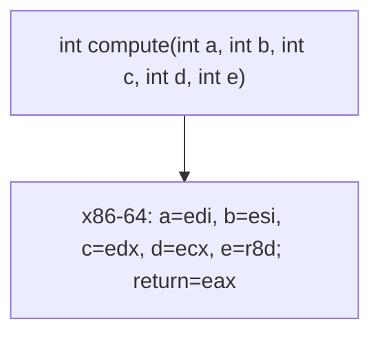

### ARM64 (AAPCS) — Argument Registers

| Purpose | Register |
|---------|----------|
| Integer args 1-8 | `x0..x7` (or `w0..w7` for 32-bit ints) |
| Floating-point args 1-8 | `v0..v7` |
| Integer return | `x0` / `w0` |
| FP return | `v0` |
| Beyond 8 int args | spill to the stack |

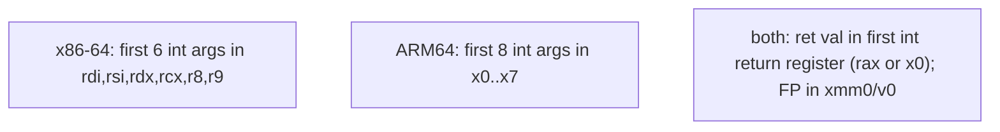

The compiler **rarely needs all 6/8 registers** for typical method calls — most Java methods have 1-3 args plus `this`. Arg passing fits in registers; no stack traffic.

### The `call` / `ret` Machinery

`call <target>` on x86-64:

1. Push the **return address** (the instruction after `call`) onto the runtime stack.
2. Jump to `target`.

`ret`:

1. Pop the top of the stack.
2. Jump to that address.

The CPU has a dedicated **Return Address Stack (RAS)** — a small hardware stack (typically 16-32 entries) that mirrors the software return-address stack. When `call` pushes, the CPU also pushes to the RAS. When `ret` pops, the CPU's branch predictor **predicts** the target by reading the RAS — almost always correct. RAS-predicted returns cost ~1 cycle; misprediction (rare; happens on `setjmp`/`longjmp`-style code or very deep recursion exceeding RAS depth) costs ~10-20 cycles.

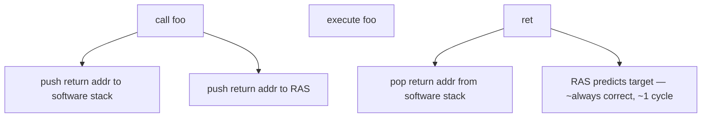

This is why `return` is essentially free on hot code: the CPU predicted the target before the `ret` even executed.

### JIT Inlining — The Most Important Optimisation

The single biggest perf win in JITted code is **inlining**: when method `caller()` calls `callee()` many times, and `callee` is small, the JIT **copies the body of `callee` into `caller`** — eliminating the call sequence entirely.

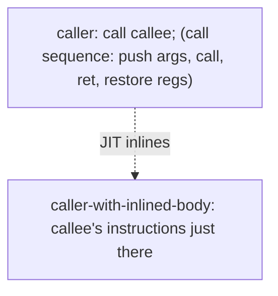

Inlining accomplishes far more than removing the call overhead:

1. **Cross-procedure optimisation.** The JIT can constant-propagate from caller to callee, eliminate dead code, and apply CSE across what was a call boundary.
2. **Escape analysis succeeds more often.** A `new` inside the inlined body that "escapes" only via the (now-eliminated) call is no-longer-escaping; the heap allocation is eliminated.
3. **Loop unrolling and vectorisation.** A loop that calls `callee` once per iteration becomes a loop with the body inlined — now eligible for unrolling and SIMD.

#### Inlining heuristics

The JIT decides what to inline based on:

- **Method size in bytecode.** Default `-XX:MaxInlineSize=35` bytes for cold methods; `-XX:FreqInlineSize=325` for hot methods. Above that, the JIT declines.
- **Frequency.** Methods called more than ~10 000 times are "hot" and qualify for the larger threshold.
- **Inline level.** `-XX:MaxInlineLevel=15` (so chains of 15 inlines max).
- **Method type.** `final`, `private`, `static`, and `invokespecial` calls are always direct → easy to inline. Virtual calls are inlinable only after the JIT proves monomorphism (see next section).

### Monomorphic, Bimorphic, Megamorphic Call Sites

Virtual call sites are classified by how many distinct receiver types reach them:

- **Monomorphic** — one type. JIT can inline the single target; the call disappears.
- **Bimorphic** — two types. JIT emits an **inline cache**: a `if (type == A) <inlined A body>; else if (type == B) <inlined B body>; else <fallback to vtable>`.
- **Polymorphic / Megamorphic** — many types. JIT falls back to a vtable lookup. Slower but still ~3-5 cycles.

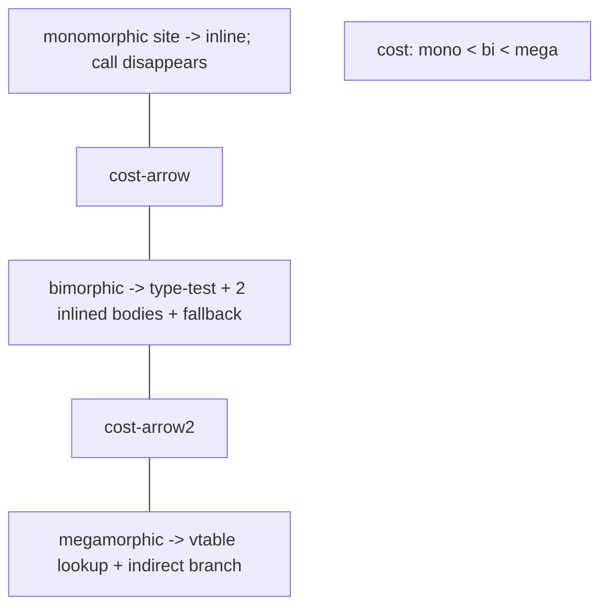

**Class Hierarchy Analysis (CHA)** is the technique HotSpot uses to prove a call is monomorphic: if no class in the loaded hierarchy overrides `Animal.speak`, then `a.speak()` for any `Animal` is guaranteed to dispatch to `Animal.speak`. The JIT inlines aggressively. If a class with an override is loaded later, the JIT **deoptimises** the inlined code (revert to the interpreter for that call site, recompile without the inlining).

### `final` and `private` as Inlining Hints

A `final` method cannot be overridden; a `private` method cannot be accessed outside its declaring class. Both guarantee the call site is monomorphic. The JIT inlines them without needing CHA.

> [!TIP]
> Marking a hot virtual method `final` (when override isn't needed) is a free perf hint to the JIT. With CHA the gain is often zero (the JIT already knew), but it documents intent and removes the deopt risk.

### Stack Frame Layout in Native Code

When the JIT compiles a method, it allocates **only** the registers and stack slots it actually needs — not a one-to-one mapping of the JVM frame:

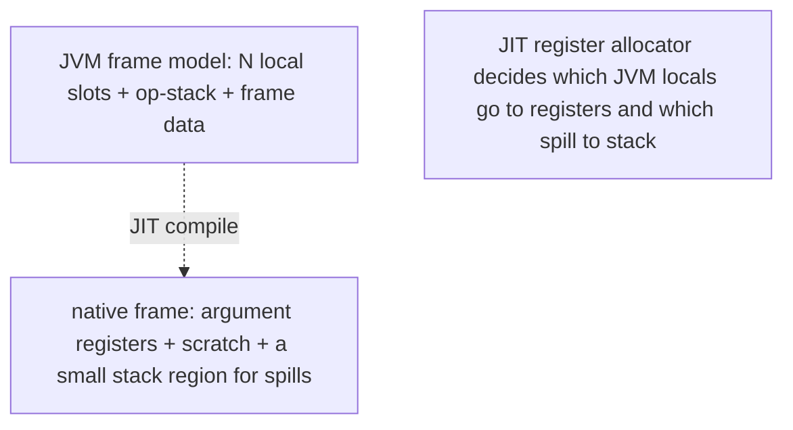

A frequently-used local stays in a register; an infrequently-used one spills to the native stack. The operand stack is *entirely virtual* — the JIT translates push/pop into register moves. The frame data (return address, etc.) is the CPU's calling convention's responsibility, not a JVM construct.

This is why method calls in JITted code can run as fast as in C: there is no JVM-specific overhead at the native level; just a normal CPU call/ret with normal argument registers.

### Deoptimisation — When the JIT Gives Up

If a hot method's specialised compiled code becomes invalid (a new class overrides a CHA-proved-monomorphic method; a type cast fails; an inlined branch suddenly takes a path the JIT compiled as dead), HotSpot **deoptimises**: it abandons the JITted code, walks the stack to reconstruct the equivalent interpreter state, and resumes interpretation. Then the method is recompiled with the new information.

Deoptimisation is rare and is the JIT's safety net — it lets the JIT make aggressive assumptions (CHA, branch profiling) without risking correctness.

### Native Method Cache (`-XX:ReservedCodeCacheSize`)

JIT-compiled methods live in the **code cache** (a special non-GC region, typically ~240 MB on a 64-bit JVM). When it fills, the JIT stops compiling and the JVM logs a warning. For very large codebases, raise `-XX:ReservedCodeCacheSize=512m`.

## Common Mistakes

### Forgetting `return` on a Non-Void Method

```java
int max(int a, int b) {
    if (a > b) return a;
    // COMPILE ERROR: missing return statement
}
```

Add the missing branch or a final return.

### Mismatched Return Type

```java
int abs(int x) {
    return (long) x;          // COMPILE ERROR — can't return long from int method
}
```

Use the declared type or convert explicitly (`(int) x`).

### "Java is Pass-by-Reference" Misconception

Covered in detail. The test: try to reassign a parameter and observe that the caller doesn't see the change. Java is pass-value-of-the-reference; never pass-by-reference.

### Modifying a Primitive Parameter Expecting the Caller to See It

```java
void incr(int x) { x++; }       // useless — caller doesn't see
```

Return the new value:

```java
int incr(int x) { return x + 1; }
```

— or wrap in an object (`AtomicInteger`, a mutable holder, an array of length 1).

### Mutating a Parameter's Object When You Shouldn't

```java
void process(int[] data) {
    Arrays.sort(data);          // SIDE EFFECT — caller's array is now sorted!
    // ... uses sorted data ...
}
```

If the contract is "non-destructive," defensive-copy:

```java
void process(int[] data) {
    int[] local = data.clone();
    Arrays.sort(local);
    // ...
}
```

Always document mutating vs non-mutating in Javadoc.

### Parameter Shadowing

```java
class C {
    int count;
    void set(int count) {
        count = count;            // assigns the parameter to itself; field unchanged
    }
}
```

Use `this.count = count;` or rename the parameter (`int newCount`).

### Infinite Recursion → `StackOverflowError`

```java
int fact(int n) {
    return n * fact(n - 1);      // no base case!
}
```

The stack grows until `-Xss` is exhausted; **`StackOverflowError`** is thrown. Add the base case (`if (n <= 1) return 1;`). Each frame is ~50-200 bytes, so `-Xss=512k` allows ~3000-10000 recursion depth.

### Returning a Reference to Internal State

```java
class Repo {
    private List<String> data = new ArrayList<>();
    public List<String> getData() { return data; }   // CALLER CAN MUTATE!
}
```

The caller can `repo.getData().clear()` and wreck encapsulation. Return an unmodifiable view (`Collections.unmodifiableList(data)`) or a defensive copy (`new ArrayList<>(data)`).

### Recursion vs Iteration for Hot Loops

A deeply-recursive function is slower than the equivalent loop due to per-call overhead (frame allocation, calling convention, RAS pressure) and lower JIT-inlining potential. For Fibonacci, factorial, etc., prefer iteration.

> [!INTERVIEW]
> Methods are a perennial interview topic. Angles:
>
> 1. **Is Java pass-by-value or pass-by-reference?** Strictly pass-by-value. For objects, the reference is the value being copied.
> 2. **How is `add(int, int)` different from `add(long, long)`?** Different parameter types → different method signatures → different methods (overloading, T13).
> 3. **What's `invokestatic` vs `invokevirtual`?** Static = no receiver, no vtable. Virtual = receiver-based, vtable lookup unless inlined.
> 4. **What's `invokespecial` used for?** Constructors, `super.method()`, `private` methods — anything where the call target is determined statically.
> 5. **What's `invokedynamic` and what uses it?** Bootstrap-driven dispatch. Lambdas, string concat, pattern matching for switch.
> 6. **What's a vtable?** A per-class array of method pointers indexed by table slot; `invokevirtual` looks up the receiver's vtable to find the actual target.
> 7. **What's monomorphic / bimorphic / megamorphic?** Receiver type variety at a call site. The JIT inlines monomorphic; uses inline caches for bimorphic; falls back to vtable for megamorphic.
> 8. **What's CHA?** Class Hierarchy Analysis — the JIT proves a virtual call has one possible target by checking no override exists in the loaded classes; inlines accordingly; deoptimises if an overriding class loads later.
> 9. **Why is `private` faster than virtual?** No vtable lookup; compiles to `invokespecial`; always inlinable.
> 10. **What's `-XX:MaxInlineSize`?** The byte-size threshold for inlining cold methods (default 35).
> 11. **How does the CPU predict `ret`?** The Return Address Stack — a hardware stack that mirrors the call stack; almost always correct.
> 12. **What happens on infinite recursion?** Stack grows until `-Xss` is exhausted; `StackOverflowError`.
> 13. **What's the difference between method signature and method declaration?** Signature = name + parameter types (used for overload resolution). Declaration = signature + return type + modifiers + body.

## Practice

1. **Pass-by-value primitive.** Write `void incr(int x) { x++; }` and call it. Confirm the caller's variable is unchanged.
2. **Pass-by-value reference — mutation visible.** Write a method that takes a `Box` and sets `b.n = 0`. Confirm the caller's box is mutated.
3. **Pass-by-value reference — reassignment not visible.** Write `void replace(Box b) { b = new Box(); b.n = 999; }`. Confirm the caller's box is unchanged.
4. **`javap -c` invokestatic.** Compile a class with a static call. Find the `invokestatic` and the descriptor `(II)I`.
5. **`javap -c` invokevirtual.** Compile `((Animal) new Dog()).speak();`. Find the `invokevirtual` and note the declared type in the descriptor.
6. **`javap -c` invokespecial.** Compile a class with a constructor and a `super.method()` call. Find both `invokespecial` opcodes.
7. **`javap -c` invokeinterface.** Compile a `List<Integer> l = new ArrayList<>(); l.add(1);`. Find the `invokeinterface` for `add`.
8. **`javap -c` invokedynamic.** Compile `String s = a + " " + b;`. Find the `invokedynamic makeConcatWithConstants` and inspect the `BootstrapMethods` attribute.
9. **Return-opcode family.** Write methods returning `int`, `long`, `String`, `void`, `boolean`. `javap -c` each. Confirm `ireturn`, `lreturn`, `areturn`, `return`, and `ireturn` (for the boolean — int-promoted).
10. **Infinite recursion.** Write `int loop() { return loop(); }`. Run with default `-Xss`. Catch the `StackOverflowError` and print the depth (count `getStackTrace().length`).
11. **`-Xss` and recursion depth.** Run the same with `-Xss=64k` and `-Xss=4m`. Observe the depth changes proportionally.
12. **Defensive copy demo.** Pass an `int[]` to a sort method. Observe the caller's array becomes sorted. Add `data.clone()` and re-observe.
13. **JIT inlining.** Write a hot method calling a tiny helper (`int add(int a, int b) { return a + b; }`) 10⁸ times. Run with `-XX:+UnlockDiagnosticVMOptions -XX:+PrintInlining`. Confirm the helper is inlined. Then mark the helper `private`; observe it's inlined unconditionally. Then add `-XX:CompileCommand=dontinline,Demo.add`; observe the speed drop.
14. **Monomorphic vs megamorphic call site.** Write a method that calls `obj.run()` 10⁸ times where `obj` is always the same concrete type. Measure. Now spread the calls across 10 concrete types in a round-robin. Measure again. The second is much slower because the call site becomes megamorphic and the JIT can't inline.
15. **`final` as a hint.** Mark a hot virtual method `final`. Run with `PrintInlining` and confirm it's eagerly inlined. Remove `final`; observe the same (CHA proves monomorphism), but with a deopt risk if a subclass loads later.
16. **Return-address-stack mispredict.** A microbenchmark with a deeply-recursive (~50 levels) function vs one that uses iteration — should show ~5% to 20% difference, mostly from RAS pressure on very deep recursion.
17. **Explain it back.** Trace `int r = add(3, 4)` where `add` is static returning `a + b`. Walk: (a) caller's bytecode pushes `3` and `4`, (b) `invokestatic` allocates the callee frame with locals `[3, 4]`, (c) callee's `iload_0`, `iload_1`, `iadd` produce `7` on its stack, (d) `ireturn` pops `7`, deallocates the frame, pushes `7` to caller's stack, (e) caller's `istore_1` writes `r=7`, (f) the JIT inlines the whole thing into `r = 7` after enough calls.

## Recap

You should now be able to:

- Declare methods with the full syntax — modifiers, optional generics, return type, name, parameter list, optional `throws`, body — and recall that the **signature** (name + parameter types) is what overload resolution uses.
- Distinguish **`static` methods** (belong to the class, no `this`, called as `ClassName.method(args)`) from **instance methods** (belong to objects, implicit `this`, called as `obj.method(args)`); recall why `main` is static (no instance exists when the JVM starts).
- Apply the **"every path returns or throws"** rule for non-void methods; recognise that `void` methods may end without an explicit `return`.
- Recall the **left-to-right argument evaluation order** (JLS §15.7.4) — deterministic, unlike C.
- Articulate **strictly pass-by-value** semantics: arguments are copied into the callee's local slots; primitives are bit-copied; references are reference-copied (so caller and callee share the heap object); reassigning a parameter inside the callee is invisible to the caller; mutating the shared heap object is visible.
- Debunk the **"Java is pass-by-reference"** myth: pass-by-reference would mean the callee could reassign the caller's variable; Java cannot. Java is pass-value-of-the-reference.
- Apply **defensive copying** (`arr.clone()`, `new ArrayList<>(c)`) when accepting a mutable argument whose mutation you don't want the caller to observe.
- Trace a method call to a **fresh stack frame** with locals (slot 0 = `this` for instance methods; then parameters; then declared locals) + operand stack + frame data; recognise the frame is deallocated on `return` and the return value transferred to the caller's operand stack.
- Recall the **five `invoke*` opcodes** and what each is used for: `invokestatic` (static), `invokevirtual` (most instance methods), `invokespecial` (constructors, `super`, `private`), `invokeinterface` (interface methods), `invokedynamic` (lambdas, string concat, pattern matching switch).
- Recall the **return-opcode family** — `return`, `ireturn`, `lreturn`, `freturn`, `dreturn`, `areturn` — and that `boolean`/`byte`/`short`/`char` use `ireturn` (int-promoted).
- Understand **vtable dispatch** for `invokevirtual`: load the receiver's klass pointer, read the vtable[slot], indirect call to the resolved method address — ~1-3 cycles on hot code, possibly slower on megamorphic sites.
- Recall the **System V AMD64 ABI** (Linux x86-64) — first 6 int args in `rdi, rsi, rdx, rcx, r8, r9`; first 8 floats in `xmm0..xmm7`; return in `rax`/`xmm0`; spill beyond — and the **ARM64 AAPCS** — first 8 int args in `x0..x7`; FP in `v0..v7`; return in `x0`/`v0`.
- Explain the **call/ret machinery** and the CPU's **Return Address Stack (RAS)** — a hardware stack mirroring the software return-address stack; predicts `ret` targets at ~1 cycle.
- Explain **JIT inlining** — the single most impactful optimisation; copies a callee's body into the caller; eliminates the call sequence; enables cross-procedure optimisation; controlled by `-XX:MaxInlineSize=35`, `-XX:FreqInlineSize=325`, `-XX:MaxInlineLevel=15`.
- Distinguish **monomorphic** (single target — inlinable), **bimorphic** (two targets — inline-cache), and **megamorphic** (many — vtable fallback) call sites; recall **Class Hierarchy Analysis (CHA)** proves monomorphism by checking no override exists; recall **deoptimisation** as the safety net when an assumption is invalidated.
- Use **`final`** and **`private`** as hints (or actual constraints) to guarantee non-virtual dispatch and enable eager inlining.
- Avoid the **common traps**: forgetting `return`, mismatched return type, the pass-by-reference myth, parameter shadowing without `this.`, modifying a primitive parameter uselessly, mutating a shared object unexpectedly, infinite recursion → `StackOverflowError`, returning a reference to internal mutable state (encapsulation leak).

## Next

Continue to [Method overloading](./T13-method-overloading.md).
