# Method overloading

**Method overloading** is declaring two (or more) methods in the **same class** with the **same name** but **different parameter lists**. Each one is a separate method; the compiler picks which to call based on the **static types of the arguments** at each call site. It's how Java lets `Math.max(int, int)`, `Math.max(long, long)`, `Math.max(float, float)`, and `Math.max(double, double)` coexist with the same name. It's also how `StringBuilder` offers 13 `append(...)` variants (T07), how `List` offers `remove(int)` and `remove(Object)` side by side, and how every class has multiple constructors.

The depth-bar requirement isn't just "show four methods sharing a name." Overload resolution is a non-trivial **compile-time algorithm** specified in JLS §15.12.2. It runs in **three phases** — first try without autoboxing or varargs, then with widening, then with boxing/unboxing/varargs — picking the **most specific applicable** method at the earliest phase that has any match. The phase ordering creates surprises: when `f(int)` and `f(Integer)` both exist, `f(5)` picks `int`; when `f(long)` and `f(Integer)` both exist, `f(5)` (an int) picks `long` because **widening beats boxing**. The classic `Collection.remove(int)` vs `remove(Object)` trap stems from this: `list.remove(5)` removes the element *at index 5*, not the integer 5. At the **bytecode** layer, overloading has **zero runtime cost** — the compiler bakes the chosen method into a specific constant-pool method-reference, and the `invoke*` opcode targets exactly that overload; the JIT compiles each overload independently. At the **architecture** layer, overloading is **static dispatch** — distinct from the **dynamic dispatch** that `invokevirtual` performs for overriding (covered in L1/C01).

> [!NOTE]
> Prerequisites: [Type Conversion & Casting](./T05-type-conversion-and-casting.md) (`L0/C02/T05`) — widening primitive conversion, autoboxing/unboxing — the operations the resolution algorithm walks through; [Methods, parameters, return values](./T12-methods-parameters-return-values.md) (`L0/C02/T12`) — signatures, the `invoke*` opcode family, method descriptors; [Arrays](./T11-arrays-1-d-multi-dimensional.md) (`L0/C02/T11`) — for varargs (which compiles to an array); [Source to Bytecode](../C01-cs-foundations/T04-source-to-bytecode-to-jvm-to-machine-code.md) (`L0/C01/T04`) — `.class` constant pool, method references.

## Why Overloading Exists

A program often needs **the same conceptual operation** on **different types**. `max(int, int)` and `max(long, long)` compute the same idea; forcing the user to remember `maxInt(...)` and `maxLong(...)` is a usability tax. Three patterns benefit:

1. **Numerical and arithmetic operations** — `Math.max`, `Math.min`, `Math.abs`, `Math.floor` each have overloads for `int`/`long`/`float`/`double`. Same name; right method picked at compile time.
2. **Constructors with default-substituting variants** — `StringBuilder()`, `StringBuilder(int capacity)`, `StringBuilder(String initial)`, `StringBuilder(CharSequence cs)`. Each fills a default for what's not provided.
3. **API ergonomics** — `PrintStream.println(int)`, `println(long)`, `println(String)`, `println(Object)`, `println()`. The caller just types `println(...)`; the compiler does the work.

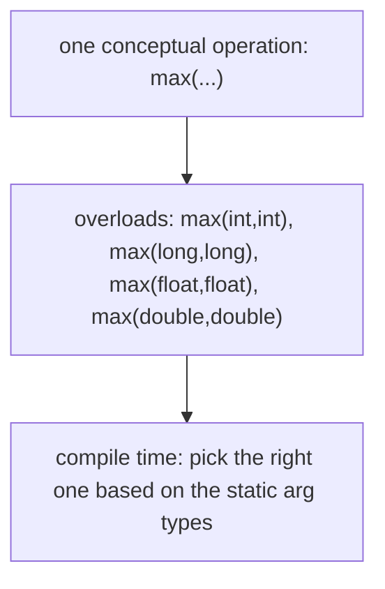

Without overloading you would write `maxInt`, `maxLong`, `maxFloat`, `maxDouble` — four names for one idea. The JVM doesn't care (each is a distinct method); humans do.

## The Signature Rule

Two methods can share a name **only if they have different parameter lists**. The **signature** is `name + parameter-type-list` — the *types*, in order, of the parameters. Return type, parameter names, and the `throws` clause are **not part of the signature**.

| Aspect | Part of signature? |
|--------|-------------------|
| Method name | yes |
| Parameter **types** | yes |
| Parameter count | yes |
| Parameter order | yes |
| Parameter **names** | no |
| Return type | **no** |
| `throws` clause | no |
| Access modifier | no |
| `static`/`final`/`synchronized` | no |

Concretely:

```java
// OK — different parameter types
int max(int a, int b) { ... }
long max(long a, long b) { ... }
double max(double a, double b) { ... }

// OK — different parameter count
void log(String msg) { ... }
void log(String msg, Throwable t) { ... }

// OK — different parameter order (technically — but very confusing!)
void register(String name, int age) { ... }
void register(int age, String name) { ... }   // legal but bad style

// COMPILE ERROR — same parameter list; return type alone doesn't distinguish
int foo() { return 1; }
long foo() { return 1L; }     // ERROR: foo() is already defined

// COMPILE ERROR — same parameter types; param names don't matter
void foo(int a) { ... }
void foo(int b) { ... }       // ERROR: foo(int) is already defined

// COMPILE ERROR — throws clause doesn't matter
void foo(int a) { ... }
void foo(int a) throws IOException { ... }   // ERROR
```

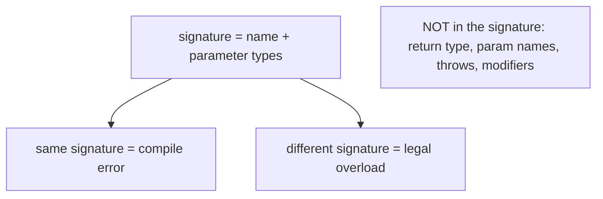

> [!IMPORTANT]
> **Return type alone cannot distinguish overloads.** This is one of the most-asked-about rules in interviews and a frequent source of compile errors when a developer changes a return type and gets cryptic "method already defined" messages on a class with multiple similar methods.

### Why return type is excluded

The JVM picks an overload at **the call site**, based on the **call expression**. A call like:

```java
foo(5);          // statement form — return value discarded
int x = foo(5);  // expression form — return value used as int
```

— how would the compiler decide between `int foo(int)` and `long foo(int)` here? In the first call, the return value isn't even used. In the second, the expected type `int` only rules out the `long` variant if the compiler does ambiguity resolution by *destination* — which it does **not**. So the language excludes return type from the signature to keep resolution local to the call site.

(Java *does* allow **covariant return types** in overriding — a subclass override may return a more specific type — but that's about overriding, not overloading. Covered in L1/C01.)

## Constructor Overloading

Constructors follow the same rule. A class can declare multiple constructors, each with a different parameter list:

```java
class Rectangle {
    int width, height;

    Rectangle() {
        this(1, 1);                  // delegate to (int,int)
    }

    Rectangle(int side) {
        this(side, side);            // delegate to (int,int)
    }

    Rectangle(int width, int height) {
        this.width = width;
        this.height = height;
    }
}

new Rectangle();        // calls () -> delegates to (1,1)
new Rectangle(5);       // calls (int) -> delegates to (5,5)
new Rectangle(2, 3);    // calls (int,int) directly
```

The `this(...)` call in the first line of a constructor delegates to another overload of the same class's constructor — the **canonical telescoping** pattern. Constructor delegation must be the *first statement* in the constructor body (so the chain forms a tree rooted at one canonical constructor).

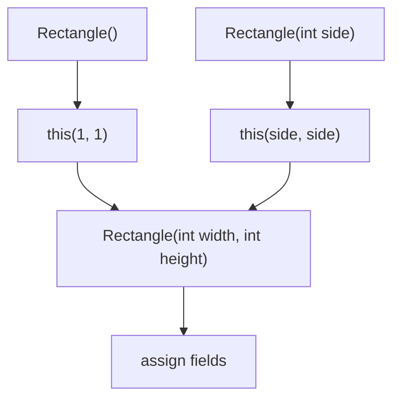

When constructors get too many, telescoping becomes hard to read (which arguments go where?), and the **builder pattern** replaces it. Covered in L3/C03 (design patterns).

## Overload Resolution — The Three Phases

This is the heart of the topic. When the compiler sees a call `foo(args)`, it picks **exactly one** overload from those in scope by running JLS §15.12.2's three-phase algorithm:

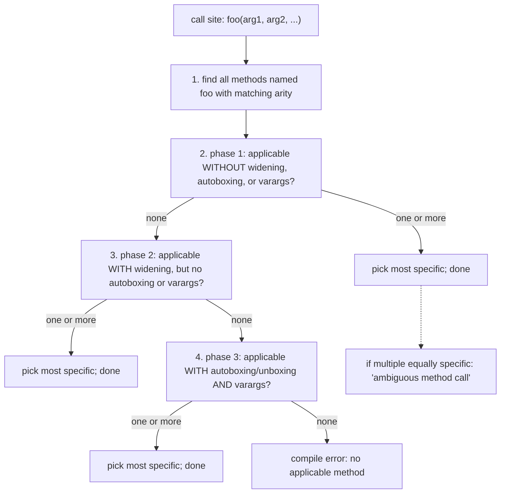

The phases are **strictly ordered**. An overload that matches in phase 1 always wins over one that only matches in phase 2 or 3. This is why **widening beats boxing**.

### Phase 1 — No Widening, No Boxing, No Varargs

In phase 1, every argument must match the parameter type **exactly** (or be a subtype, for references — the language calls this "identity conversion" or "reference widening, but not primitive widening").

```java
void f(int x) { print("int"); }
void f(long x) { print("long"); }

f(5);              // phase 1: f(int) applies (5 IS int); f(long) doesn't (5 is not long)
                   // -> picks f(int)
```

```java
void g(Animal a) { ... }
void g(Object o) { ... }

g(new Dog());      // phase 1: g(Animal) applies (Dog IS-A Animal); g(Object) applies (Dog IS-A Object)
                   // -> two candidates; pick most specific = g(Animal)
```

If phase 1 finds at least one applicable method, **we never look at phase 2 or 3**.

### Phase 2 — With Widening (Primitive Widening Allowed)

Phase 2 lets primitives **widen** (T05): `byte → short → int → long → float → double`, plus `char → int`.

```java
void f(long x) { print("long"); }
void f(double x) { print("double"); }

f(5);              // phase 1: neither applies (5 is int, not long, not double)
                   // phase 2: f(long) applies (int widens to long); f(double) applies (int widens to double)
                   // -> two candidates; pick most specific = f(long)
                   //    (long is narrower than double; the conversion int->long loses less)
```

The "most specific" rule: a method `m1` is more specific than `m2` if every argument type of `m1` can be passed to `m2` without further conversion. `long → double` is allowed (widening), so `f(long)` is more specific than `f(double)`. Pick `f(long)`.

```java
void f(Integer x) { print("Integer"); }
void f(long x) { print("long"); }

f(5);              // phase 1: neither (5 is int; not Integer, not long)
                   // phase 2: f(long) applies (int widens to long); f(Integer) does NOT
                   //          (autoboxing is excluded from phase 2)
                   // -> picks f(long)
```

This is the **"widening beats boxing"** rule and the source of many surprises. We'll see the canonical example below.

### Phase 3 — With Autoboxing/Unboxing and Varargs

If phase 2 also has no matches, phase 3 allows **autoboxing**, **unboxing**, and **varargs** expansion.

```java
void f(Integer x) { print("Integer"); }
void f(double x) { print("double"); }

f(5);              // phase 1: neither
                   // phase 2: f(double) applies (int widens to double); f(Integer) does NOT
                   // -> picks f(double) — widening still beats boxing!
```

```java
void f(Integer x) { print("Integer"); }

f(5);              // phase 1: no (5 is int, not Integer)
                   // phase 2: no (5 can't widen to Integer — that's boxing, not widening)
                   // phase 3: f(Integer) applies (autobox 5 -> Integer.valueOf(5))
                   // -> picks f(Integer)
```

```java
void f(int... xs) { print("varargs"); }

f();               // phase 1: no — no fixed-arity match
                   // phase 2: no
                   // phase 3: f(int...) applies as 0 args
                   // -> picks f(int...)

f(1, 2, 3);        // similar — varargs picks it up
```

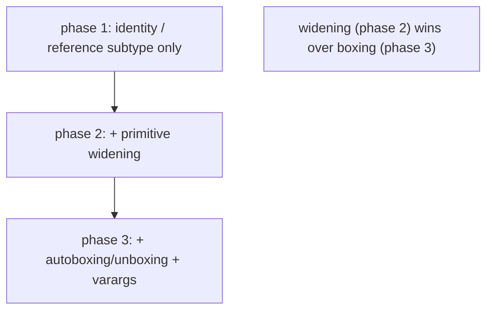

### "Most Specific" — The Tie-Break

Within a single phase, if multiple methods are applicable, pick the **most specific**. A method `m1` is more specific than `m2` if calling `m2` with `m1`'s argument types would also work — informally, `m1`'s argument types are subtypes (or assignable to) `m2`'s.

```java
void g(Object o) { ... }     // m2
void g(String s) { ... }     // m1 — more specific (String IS-A Object)

g("hello");                   // both apply; picks g(String)
```

```java
void h(Number n) { ... }
void h(Integer i) { ... }     // more specific

h(42);                         // phase 3 boxing -> Integer; both apply; picks h(Integer)
```

If no single method is most specific, the compiler reports an **ambiguous method call**:

```java
void k(String s, Object o) { ... }
void k(Object o, String s) { ... }

k("a", "b");                   // both apply; neither is more specific
                               // COMPILE ERROR: ambiguous method call
```

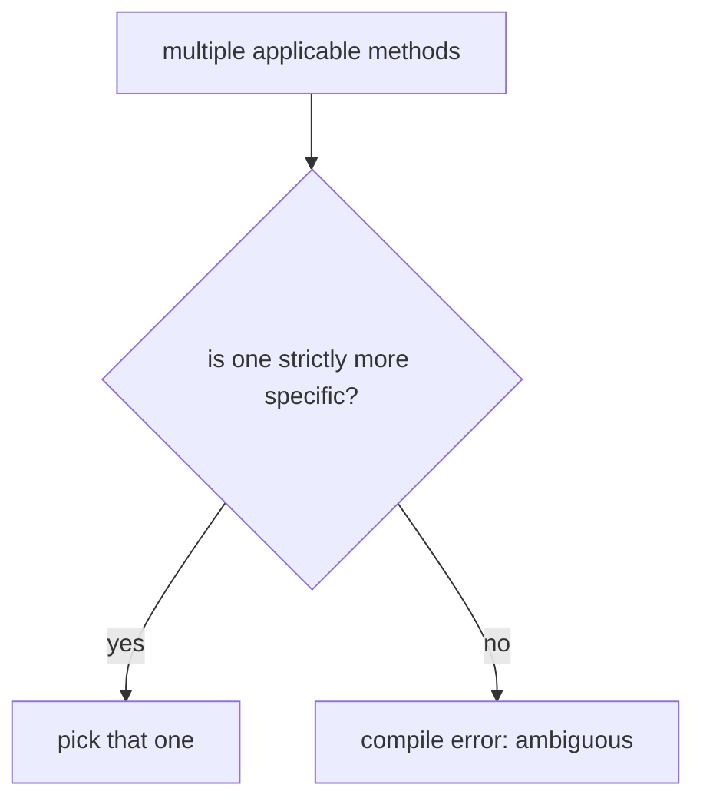

## The `Collection.remove(int)` vs `remove(Object)` Trap

The most famous overloading trap in Java. `java.util.List` declares both:

```java
public interface List<E> {
    boolean remove(Object o);    // remove the element equal to o
    E remove(int index);          // remove the element AT index
    // ...
}
```

For `List<Integer>`, the two overloads do **completely different things**, and overload resolution picks `remove(int)` over `remove(Object)` because **`int` is more specific than `Object`** (and no autoboxing is needed):

```java
List<Integer> list = new ArrayList<>(List.of(10, 20, 30, 40, 50));
list.remove(2);                  // calls remove(int) — removes index 2 = 30
                                  // list is now [10, 20, 40, 50]

list.remove((Integer) 2);        // calls remove(Object) — removes the Integer 2
                                  // (if present; otherwise no-op)
```

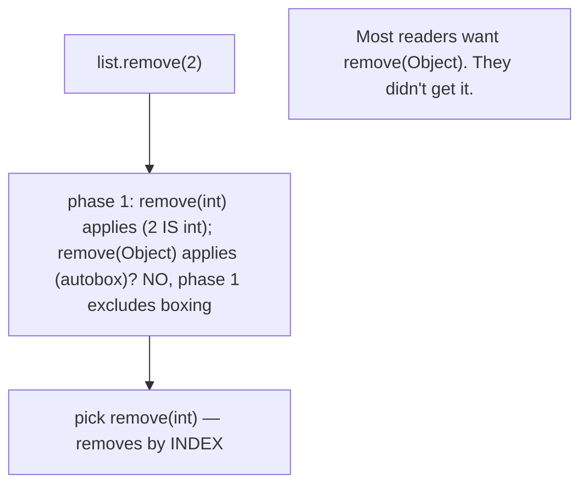

The fix when you want to remove a value:

```java
list.remove(Integer.valueOf(2));     // unambiguous — calls remove(Object)
```

or

```java
list.remove((Object) 2);             // also unambiguous
```

**The trap doesn't fire for non-Integer element types.** `List<String>.remove("foo")` is unambiguous because there's no `remove(int)` that would match a `String`. The trap is specific to `List<Integer>`, `List<Short>`, `List<Long>` (which has a similar problem with `remove(long)` and `remove(Object)`) — collections of integer wrapper types.

## Null Argument Ambiguity

When you pass `null` to an overload, **`null` is assignable to any reference type**, so multiple reference-typed overloads may apply equally:

```java
void f(String s) { ... }
void f(Object o) { ... }

f(null);                       // both apply; f(String) is more specific; picks f(String)
```

```java
void g(StringBuilder s) { ... }
void g(StringBuffer s) { ... }

g(null);                       // both apply; neither is more specific (sibling classes)
                               // COMPILE ERROR: ambiguous method call
```

Fix by casting:

```java
g((StringBuilder) null);       // unambiguous — picks g(StringBuilder)
g((StringBuffer) null);        // picks g(StringBuffer)
```

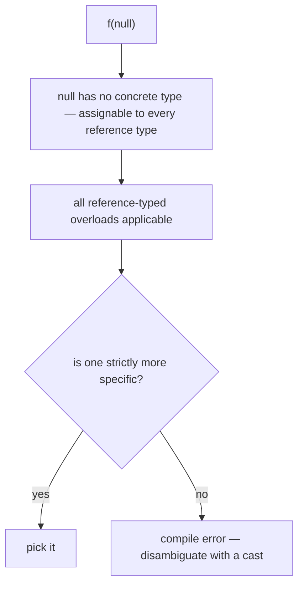

## Varargs and Overloading

`int... xs` accepts zero or more `int` arguments; under the hood it's `int[] xs`. Varargs are tried only in phase 3.

```java
void f(int x) { print("single"); }
void f(int... xs) { print("varargs"); }

f();                           // phase 3: f(int...) (0 args) — picks varargs
f(5);                          // phase 1: f(int) applies — picks single (NOT varargs)
f(1, 2);                       // phase 3: f(int...) (2 args) — picks varargs
```

The rule: **a fixed-arity overload always beats a varargs overload** when both apply. This means adding a varargs overload to an existing API is safe — single-argument calls still go to the fixed-arity version.

### Varargs ambiguity with another varargs

```java
void f(int... xs) { ... }
void f(long... ys) { ... }

f();                           // both apply (0 args); pick most specific
                               // int... is more specific than long...
                               // -> picks f(int...)
f(5);                          // phase 1: neither applies as fixed
                               // phase 3: both apply; picks int... (most specific)
```

## What's Generated for an Overload — Bytecode and Constant Pool

This is the under-the-hood layer. Each overload is a **separate method** in the `.class` file with:

1. Its own **`method_info`** structure — bytecode, max_stack, max_locals, exception table.
2. Its own **method descriptor** — encoded signature string.
3. Its own **constant-pool method-reference** entry that callers use to invoke it.

### Method descriptors — the type encoding

A descriptor is a string that encodes the parameter types and return type:

| Java type | Descriptor letter |
|-----------|------------------|
| `byte` | `B` |
| `char` | `C` |
| `double` | `D` |
| `float` | `F` |
| `int` | `I` |
| `long` | `J` |
| `short` | `S` |
| `boolean` | `Z` |
| `void` | `V` |
| reference (class) | `L<binary class name>;` (`Ljava/lang/String;`) |
| array | `[` prefix (`[I` = `int[]`; `[[D` = `double[][]`) |

The descriptor for a method is `(<params>)<return>`:

| Java signature | Descriptor |
|----------------|-----------|
| `int add(int a, int b)` | `(II)I` |
| `long add(long a, long b)` | `(JJ)J` |
| `double add(double a, double b)` | `(DD)D` |
| `String concat(String s, int n)` | `(Ljava/lang/String;I)Ljava/lang/String;` |
| `void log(String msg, Object... args)` | `(Ljava/lang/String;[Ljava/lang/Object;)V` |
| `int main(String[] args)` would be: | `([Ljava/lang/String;)V` (well, `void main`) |

Critically: **different parameter types produce different descriptors**, and the JVM's method-resolution machinery treats them as **distinct methods**. The four `Math.max` overloads have descriptors `(II)I`, `(JJ)J`, `(FF)F`, `(DD)D` — four separate methods, found independently by name+descriptor lookup at link time.

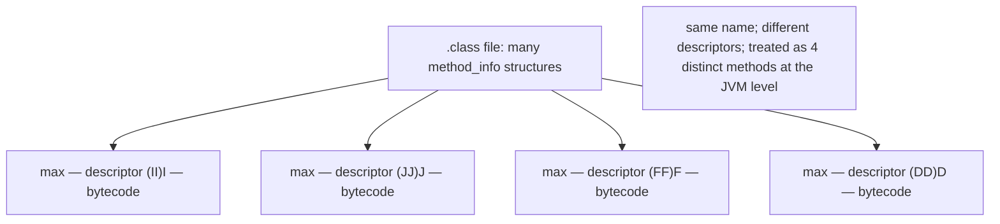

### Worked `javap -c` for an overload call

Source:

```java
class Demo {
    static int add(int a, int b) { return a + b; }
    static long add(long a, long b) { return a + b; }

    public static void main(String[] args) {
        int x = add(1, 2);              // picks (II)I
        long y = add(1L, 2L);            // picks (JJ)J
    }
}
```

`javap -c -p` output of `main` (annotated):

```
 0: iconst_1
 1: iconst_2
 2: invokestatic  #2   // Method add:(II)I       <-- compiler picked the (int,int) overload
 5: istore_1
 6: lconst_1
 7: ldc2_w        #3   // long 2l
10: invokestatic  #4   // Method add:(JJ)J       <-- compiler picked the (long,long) overload
13: lstore_2
14: return
```

Constant pool relevant entries (from `javap -v`):

```
#2 = Methodref         Demo.add:(II)I
#4 = Methodref         Demo.add:(JJ)J
```

The compiler **baked the chosen overload into the constant pool**, and the `invokestatic` opcode references the specific entry. **No runtime overload resolution happens.** The JVM looks up `Demo.add` *with descriptor `(II)I`* — finding the int-variant; and *with descriptor `(JJ)J`* — finding the long-variant. They're distinct methods to the JVM.

### Memory model implications

Each overload's **bytecode**, **constant pool**, **exception table**, and **debug info** live in the class's metadata in the metaspace. Each overload **could** be JIT-compiled to its own native code, with its own register allocation, its own inlining decisions, its own deopt log. They are essentially independent.

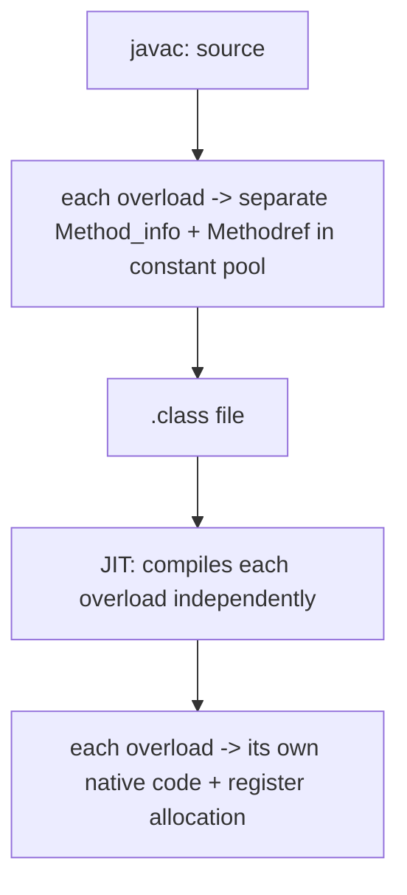

## Architecture Layer — Zero Runtime Cost

The key insight at the architecture layer: **overload resolution costs nothing at runtime**.

### Compile-time dispatch

Resolution is purely a *compile-time* algorithm. Once `javac` has decided which overload a call refers to, it emits an `invoke*` opcode targeting that specific constant-pool entry. The JVM **does not** look at multiple methods and choose — it looks up *one* method (the one in the constant pool) and calls it.

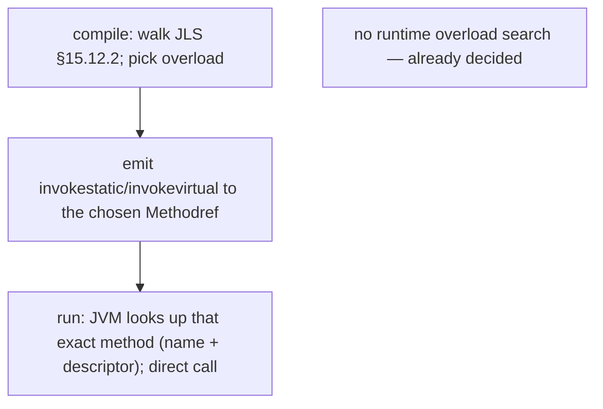

Contrast with the **dynamic dispatch** of `invokevirtual` for overridden methods (T12, deferred to L1/C01): the JVM does look at the receiver's actual class at runtime and picks the override. That's a real runtime cost — vtable lookup, sometimes a BTB mispredict. Overloading has none of that.

### JIT inlining is per-overload

Each overload is a separate Java method. The JIT treats them as separate compilation units. `add(int, int)` and `add(long, long)` get their own inlining decisions, their own register allocation, their own deopt traps. From the JIT's perspective they happen to share a name in the source — at the JVM level they're as related as two completely unrelated methods.

### Confusion with overriding (different mechanism!)

A common interview confusion: "is overloading static or dynamic dispatch?" **Static** — picked at compile time. **Overriding** is dynamic — picked at runtime based on the receiver's actual class. Same word root, very different mechanisms.

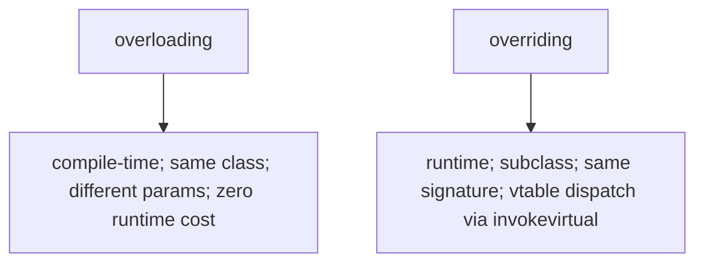

Covered fully in L1/C01.

## Common Mistakes

### Trying to Overload by Return Type Alone

```java
int foo() { return 1; }
long foo() { return 1L; }      // COMPILE ERROR
```

Return type alone doesn't distinguish overloads. Rename one or change a parameter.

### Forgetting Widening Beats Boxing

```java
void f(long x)    { print("long"); }
void f(Integer x) { print("Integer"); }

f(5);                          // prints "long" — int widens to long; phase 2 wins over phase 3
```

If the developer expects "5 is an Integer, surely it picks Integer," they get the wrong overload. Either remove the ambiguity (only one overload) or call with the exact type (`f(Integer.valueOf(5))`).

### The `List.remove(int)` Trap

Covered above. `list.remove(2)` for a `List<Integer>` removes by **index**, not by value. Use `list.remove(Integer.valueOf(2))` or `list.remove((Object) 2)` when you mean by value.

### Ambiguous `null`

```java
void f(String s) { ... }
void f(StringBuilder s) { ... }

f(null);                        // COMPILE ERROR — sibling classes; ambiguous
```

Disambiguate with a cast: `f((String) null)` or `f((StringBuilder) null)`.

### Same-Arity Sibling-Class Ambiguity

```java
void g(List<?> l) { ... }
void g(Collection<?> c) { ... }

ArrayList<Integer> al = new ArrayList<>();
g(al);                          // both apply; List<?> is more specific (List extends Collection) -> picks g(List<?>)
```

OK in this case. But:

```java
void h(Comparable<?> c) { ... }
void h(Serializable s) { ... }

h("hello");                     // String implements both; neither is more specific
                                // COMPILE ERROR: ambiguous
```

### Overload Resolution Changes Across JDK Versions

Adding an overload to an existing API can change which method an existing client call resolves to — a source-incompatible change. The JDK is very careful here (see the Java 8 → 9 `List.of` discussion, or the autoboxing-related quirks). If you maintain an API, **don't add overloads lightly**.

### Confusing Overloading with Overriding

Overloading: same class, different params. Overriding: subclass, same signature. The interview classic.

### Varargs Capturing What You Don't Want

```java
void log(Object... args) { ... }

log(new Object[]{1, 2, 3});      // does this pass ONE Object[] or THREE Objects?
```

Surprising answer: passing an `Object[]` directly to an `Object...` parameter is treated as **the array IS the varargs** — so this is **one call with three elements**, not "one call with one array element." Cast to `Object` (`log((Object) new Object[]{1,2,3})`) if you really mean one element. The Java 5 varargs designers chose this for backward compatibility with pre-varargs `Object[]`-taking methods.

### Resolution Phase Surprises

```java
void f(Object o)  { print("Object"); }
void f(Number n)  { print("Number"); }
void f(Integer i) { print("Integer"); }

f(5);                            // phase 1: none (5 is int, not Integer/Number/Object)
                                  // phase 2: none (no primitive widening to a reference)
                                  // phase 3: all three apply via autoboxing; pick most specific = f(Integer)
```

The "most specific" rule rescues this. But if you remove `f(Integer)`:

```java
void f(Object o) { ... }
void f(Number n) { ... }

f(5);                            // phase 3: both apply via autoboxing
                                  // most specific = f(Number) (Number is more specific than Object)
                                  // prints "Number"
```

> [!INTERVIEW]
> Method overloading is a perennial interview topic — JLS §15.12.2 is one of the most quotable specs.
>
> 1. **What distinguishes overloaded methods?** The signature: name + parameter types. Return type, throws, modifiers, and parameter names do NOT distinguish.
> 2. **Can you overload by return type alone?** No — compile error.
> 3. **What are the three phases of overload resolution?** Phase 1: no widening, no boxing, no varargs. Phase 2: + primitive widening. Phase 3: + autoboxing + varargs.
> 4. **Which wins, widening or boxing?** Widening (phase 2 beats phase 3).
> 5. **What's the `List.remove` overload trap?** `list.remove(int)` removes by index; `list.remove(Object)` removes by value. `list.remove(5)` on a `List<Integer>` picks `remove(int)` and removes by **index**.
> 6. **Why is `f(null)` sometimes a compile error?** `null` is assignable to all reference types; if multiple reference-typed overloads are equally specific, the call is ambiguous. Fix with a cast.
> 7. **Is overloading static or dynamic dispatch?** **Static** — resolved at compile time. Overriding is dynamic (vtable, runtime).
> 8. **What runtime cost does overloading have?** Zero. Compile-time resolution bakes the chosen overload into the constant-pool method-ref; the JVM does a normal lookup.
> 9. **What's the method descriptor for `int add(int, int)`?** `(II)I`. Same name + different descriptor = different methods at the JVM level.
> 10. **How is "most specific" defined?** `m1` more specific than `m2` if every arg type of `m1` is assignable to `m2`'s. If no unique most-specific exists, the call is ambiguous.
> 11. **Can a fixed-arity overload coexist with a varargs overload?** Yes — fixed-arity always wins when both apply (varargs is phase-3 only).
> 12. **Does overloading work across classes?** No — overloads must be in the same class. (Or inherited via the same class hierarchy, but that's overload-resolution-with-inheritance, an edge case.)

## Practice

1. **Tour the four `Math.max` overloads.** `javap -c -p java.lang.Math | grep -A1 max`. List the descriptors.
2. **The trap.** Write `List<Integer> list = new ArrayList<>(List.of(10, 20, 30, 40, 50)); list.remove(2); System.out.println(list);`. Predict, then run. Confirm `[10, 20, 40, 50]`. Then fix with `Integer.valueOf(2)`.
3. **Widening beats boxing.** Write `void f(long x){} void f(Integer x){}` and call `f(5)`. Predict, run, confirm `long` wins.
4. **Null ambiguity.** Write `void f(String s){} void f(StringBuilder s){}` and call `f(null)`. Confirm compile error. Cast to fix.
5. **Bytecode descriptor inspection.** Write 4 overloads of `add`: `(int,int)`, `(long,long)`, `(double,double)`, `(String,String)`. `javap -c -p` and confirm the four descriptors.
6. **Constant-pool methodref.** `javap -v` your class. Find the `Methodref` entries — confirm each overload's call site references the correct descriptor.
7. **Same-class constructor delegation.** Write a 3-constructor `Rectangle` with `this(...)` delegations. Trace the call chain from `new Rectangle()`.
8. **Most-specific tie-break.** Write `void g(Animal a){}` and `void g(Dog d){}`. Call with `Dog`, `Animal`, and `(Animal) new Dog()` references. Predict each.
9. **Varargs vs fixed-arity.** Write `void f(int x){}` and `void f(int... xs){}`. Call with `()`, `(5)`, `(1,2,3)`. Predict each: varargs, single, varargs.
10. **Varargs ambiguity.** Write `void f(int... xs){}` and `void f(long... ys){}`. Call `f()` and `f(5)`. Predict and trace.
11. **Boxing in phase 3.** Write `void f(Object o){}` and `void f(Number n){}`. Call `f(5)`. Confirm phase 3 picks `Number` (more specific than `Object`).
12. **Add `f(Integer)` to the above.** Confirm now `f(5)` picks `f(Integer)`.
13. **Return-type clash.** Try `int foo(){}` and `long foo(){}` in the same class. Confirm compile error mentions "method already defined."
14. **Throws clause non-distinction.** Try `void foo(int)` and `void foo(int) throws IOException` in the same class. Confirm compile error.
15. **Resolution across the 3 phases.** Write `void f(int)`, `void f(long)`, `void f(Integer)`, `void f(Number)`, `void f(Object)`. Call with `5`, `Integer.valueOf(5)`, `5L`, `(short) 5`, `null`. Predict each.
16. **Explain it back.** Trace what happens at the JVM level when `add(1, 2)` is called against a class with `add(int,int)`, `add(long,long)`, and `add(double,double)`: (a) phase 1 picks `add(int,int)` at compile time; (b) javac emits `invokestatic Demo.add:(II)I` referencing the specific constant-pool entry; (c) at runtime, JVM looks up the method by name+descriptor "add (II)I"; (d) no overload search at runtime; (e) JIT compiles each overload independently when each becomes hot.

## Recap

You should now be able to:

- Define **overloading** as multiple methods in the same class with the same name and different **parameter lists** (the signature).
- Recall the **signature** = method name + parameter types (in order). Return type, parameter names, throws clause, and access modifiers are NOT part of the signature.
- Recognise that **return type alone cannot distinguish overloads** — the most-common compile error in this area.
- Apply **constructor overloading** with `this(...)` delegation for telescoping defaults; recognise when the telescoping gets too long and the **builder pattern** is the right replacement (L3/C03).
- Walk the **three-phase resolution algorithm** (JLS §15.12.2): phase 1 (no widening, no boxing, no varargs), phase 2 (+ widening), phase 3 (+ autoboxing + varargs); the **earliest phase with any applicable method wins**.
- Apply the **"most specific" tie-break**: within a phase, pick the method whose parameter types are subtypes (or assignable to) every other applicable method's parameter types; if no unique most-specific exists, **ambiguous method call** is a compile error.
- Recall the canonical surprises: **widening beats boxing** (`f(5)` picks `long` over `Integer`); **`List.remove(int)` wins over `remove(Object)`** so `list.remove(5)` on a `List<Integer>` removes by index; **`null` is ambiguous** between sibling reference-typed overloads — fix with an explicit cast.
- Recall that **fixed-arity always beats varargs** when both apply (varargs is phase-3 only).
- Recall that **passing an `Object[]` to an `Object... varargs` parameter** is treated as "the array IS the varargs" — surprising for Java 5+ users; cast to `Object` to force single-element interpretation.
- Trace each overload to **a separate `method_info`** in the `.class` file with its **own bytecode**, **own descriptor** in the constant pool, and **own `Methodref` constant-pool entries** at call sites.
- Recall the **method descriptor encoding**: `B`/`C`/`D`/`F`/`I`/`J`/`S`/`Z`/`V` for primitives + `void`, `L<binary class name>;` for references, `[` prefix for arrays — and the full method form `(<params>)<return>` (e.g., `(II)I` for `int add(int, int)`, `(Ljava/lang/String;I)Ljava/lang/String;`).
- Confirm via `javap -c` that the compiler **bakes the chosen overload into the call site** — the `invoke*` opcode references the specific constant-pool method reference; **no runtime overload search occurs**.
- Distinguish **overloading** (compile-time, same class, different params, **static dispatch**, zero runtime cost) from **overriding** (runtime, subclass, same signature, **dynamic dispatch via `invokevirtual`** + vtable lookup) — covered fully in L1/C01.
- Recall that **each overload is JIT-compiled independently** — they have separate inlining decisions, separate register allocations, separate deopt traps.
- Avoid the **common traps**: overload-by-return-type-alone (compile error), forgetting widening-beats-boxing, `List.remove(int)` trap on `List<Integer>`, ambiguous `null` calls, sibling-class ambiguity, the `Object[]` → varargs subtlety, expecting the JVM to do "smart" runtime overload selection.

## Next

Continue to [Recursion](./T14-recursion.md).
