# Recursion

**Recursion** is a method that calls itself. Often that sounds like a paradox ("how can a method call itself before it has finished defining itself?"), but it isn't: each call is a separate invocation with its own stack frame, its own copy of parameters, and its own copy of locals (T12). When a function is naturally defined in terms of a smaller version of itself — `factorial(n) = n * factorial(n-1)`, walking a tree, partitioning an array — recursion is the cleanest expression of the algorithm.

The depth-bar requirement isn't just "show factorial." Every recursive call is a real `invokestatic`/`invokevirtual` (T12) — the JVM doesn't know "this is recursion" — and each call allocates a real stack frame. The call stack grows linearly with depth; when it exceeds `-Xss` (default ~512 KB to 1 MB), the JVM throws **`StackOverflowError`**. At the **architecture** layer, the CPU's **Return Address Stack** (RAS, ~16-32 entries on x86; ~8-16 on ARM) predicts where each `ret` jumps — but **deep recursion overflows the RAS** and the predictor falls back to the BTB, costing a few cycles per return. **Tail-call optimisation** — where a call in tail position is rewritten as a `jmp` to reuse the frame — would eliminate the depth limit, and Scala/Kotlin/Clojure do it on the JVM via bytecode tricks; **HotSpot itself does not perform TCO** on Java code, by deliberate design (full stack traces are part of the language contract). Naive recursive Fibonacci is **O(2ⁿ)** because it recomputes the same subproblems exponentially many times; **memoization** turns it into O(n). Many algorithms have both recursive and iterative forms; the recursive form is usually clearer; the iterative form is sometimes faster and immune to stack overflow.

> [!NOTE]
> Prerequisites: [Control Flow](./T08-control-flow-if-else-switch-switch-expressions.md) (`L0/C02/T08`) — `if`/`else` for the base-case test; [Loops](./T09-loops-while-do-while-for-for-each.md) (`L0/C02/T09`) — the iterative alternative; [break/continue/labels](./T10-break-continue-labels.md) (`L0/C02/T10`) — `return` and early exit; [Methods, parameters, return values](./T12-methods-parameters-return-values.md) (`L0/C02/T12`) — fresh stack frame per call, pass-by-value, the `invokestatic`/`invokevirtual` opcodes, `StackOverflowError`, the CPU's Return Address Stack; [Method overloading](./T13-method-overloading.md) (`L0/C02/T13`) — for "helper overload" patterns like `factorial(int n) → factorial(int n, long acc)`; [Arrays](./T11-arrays-1-d-multi-dimensional.md) (`L0/C02/T11`) — for recursive array algorithms (mergesort, binary search); [Variables](./T02-variables-and-primitive-types.md) (`L0/C02/T02`) — stack-frame layout; [Source to Bytecode](../C01-cs-foundations/T04-source-to-bytecode-to-jvm-to-machine-code.md) (`L0/C01/T04`) — the call mechanism.

## Why Recursion Exists

Many real problems are **self-similar**: solving them on a big input means solving the same problem on a smaller input plus combining the result.

| Problem | Self-similar reduction |
|---------|----------------------|
| Factorial of N | N × factorial(N-1); base: 0! = 1 |
| Walk a binary tree | walk(node) = visit + walk(left) + walk(right); base: null |
| Sort an array | mergesort = sort each half + merge; base: length ≤ 1 |
| Find a path in a graph | dfs(node) = try each neighbour; base: target found / cycle |
| Generate permutations | for each position, swap and permute the rest; base: position == end |
| Parse arithmetic expressions | expr = term ( + term )*; term = factor ( × factor )*; factor = number | (expr) |

In each case, **the recursive structure of the code mirrors the recursive structure of the problem**. The alternative — manually maintaining a stack data structure and a loop — is mechanical and error-prone for tree-shaped problems.

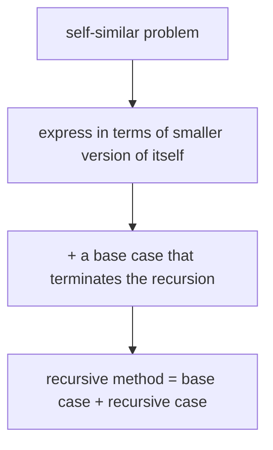

## The Structure of Every Recursive Method

Two ingredients, both required:

1. **Base case** — an input size or condition at which the answer is *direct* (no further recursion). Without it, the method calls itself forever.
2. **Recursive case** — express the answer in terms of one or more *smaller* sub-problems and combine.

```java
int factorial(int n) {
    if (n <= 1) return 1;              // base case
    return n * factorial(n - 1);        // recursive case
}
```

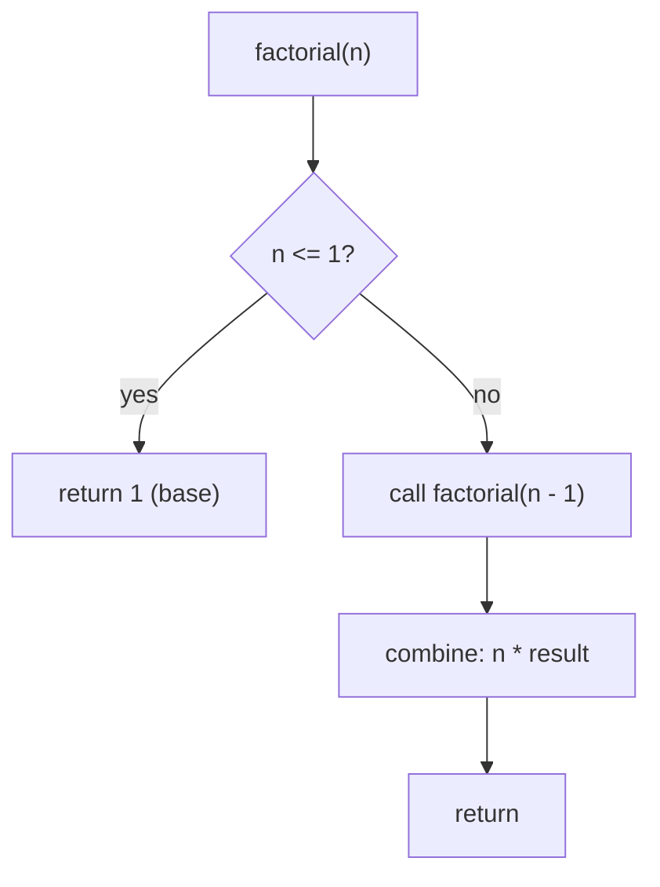

**The base case must be reached in finite time** by the recursive case's input reduction. `factorial(n - 1)` reduces n; eventually `n ≤ 1`. If you wrote `factorial(n + 1)` by mistake, n grows unboundedly, the base case is never hit, and the program crashes with `StackOverflowError`.

> [!WARNING]
> **A recursive method without a base case (or with an unreachable one) is infinite recursion.** The JVM will throw `StackOverflowError` once the call stack exceeds `-Xss`. Diagnose by examining the stack-trace — it will be hundreds or thousands of identical frames at your method.

### Direct vs Indirect Recursion

**Direct recursion**: method calls itself.

```java
int f(int n) { return n <= 0 ? 0 : f(n - 1); }
```

**Indirect (mutual) recursion**: A calls B which calls A.

```java
boolean isEven(int n) { return n == 0 || isOdd(n - 1); }
boolean isOdd(int n)  { return n != 0 && isEven(n - 1); }
```

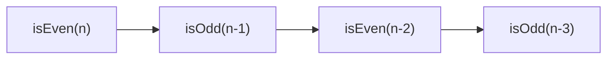

Indirect recursion is harder to reason about (you can't see the recursion in a single method) but works the same way. The base case can live in either method (and usually does in both, as above).

### Substitution Model — Tracing a Recursion by Hand

The cleanest mental model for tracing a recursive call is **substitution**: replace each `factorial(k)` with its definition until you hit the base case, then evaluate back up.

```
factorial(5)
= 5 * factorial(4)
= 5 * (4 * factorial(3))
= 5 * (4 * (3 * factorial(2)))
= 5 * (4 * (3 * (2 * factorial(1))))
= 5 * (4 * (3 * (2 * 1)))          // base case
= 5 * (4 * (3 * 2))
= 5 * (4 * 6)
= 5 * 24
= 120
```

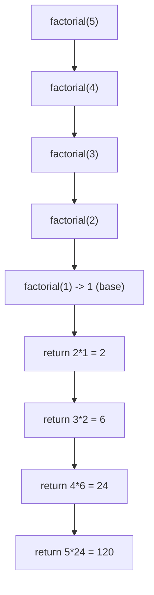

This is **exactly** what the call stack does at runtime: each pending multiplication waits in its frame for the inner call to return.

## Classic Examples

### Factorial (Linear Recursion)

Already shown. One recursive call per invocation; recursion depth O(n); time O(n).

### Greatest Common Divisor (Euclid)

```java
int gcd(int a, int b) {
    if (b == 0) return a;              // base
    return gcd(b, a % b);               // recursive: smaller second arg
}
```

`gcd(48, 18) → gcd(18, 12) → gcd(12, 6) → gcd(6, 0) → 6`. Recursion depth O(log min(a, b)) by Fibonacci-rate analysis — *very* efficient.

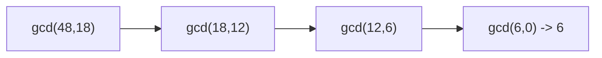

### Fibonacci — Naive vs Memoized

Naive recursion:

```java
long fib(int n) {
    if (n <= 1) return n;               // base
    return fib(n - 1) + fib(n - 2);      // two recursive calls!
}
```

Two recursive calls per invocation → **O(2ⁿ)** total calls (more precisely, O(φⁿ) where φ ≈ 1.618). `fib(40)` takes ~1 second; `fib(50)` takes ~17 minutes. The killer: **the same subproblem is recomputed exponentially many times**.

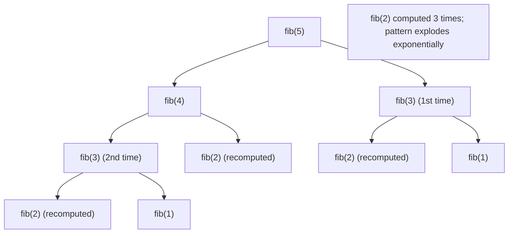

**Memoization** caches each computed value, turning O(2ⁿ) into O(n):

```java
long[] memo = new long[100];
boolean[] seen = new boolean[100];

long fib(int n) {
    if (n <= 1) return n;
    if (seen[n]) return memo[n];
    long result = fib(n - 1) + fib(n - 2);
    memo[n] = result;
    seen[n] = true;
    return result;
}
```

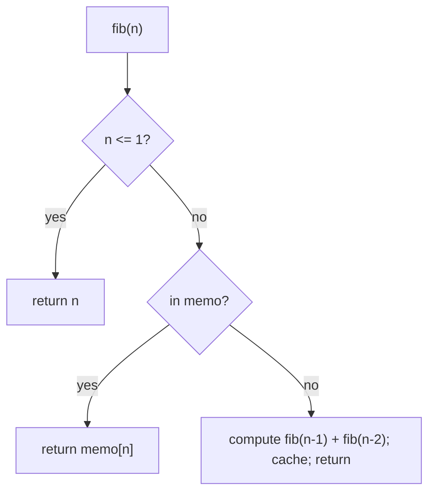

Now `fib(50)` runs in microseconds. This is the gateway to **dynamic programming** — full coverage in L6/C02 (DSA for interviews).

### Tree Traversal (Recursive DFS)

A binary tree is a node with optional `left` and `right` children. **Depth-first traversal** comes in three flavours, differing only in *when* the node is visited relative to its children:

```java
class Node { int val; Node left, right; }

void inOrder(Node n) {
    if (n == null) return;             // base
    inOrder(n.left);
    System.out.println(n.val);          // visit between
    inOrder(n.right);
}

void preOrder(Node n) {
    if (n == null) return;
    System.out.println(n.val);          // visit before
    preOrder(n.left);
    preOrder(n.right);
}

void postOrder(Node n) {
    if (n == null) return;
    postOrder(n.left);
    postOrder(n.right);
    System.out.println(n.val);          // visit after
}
```

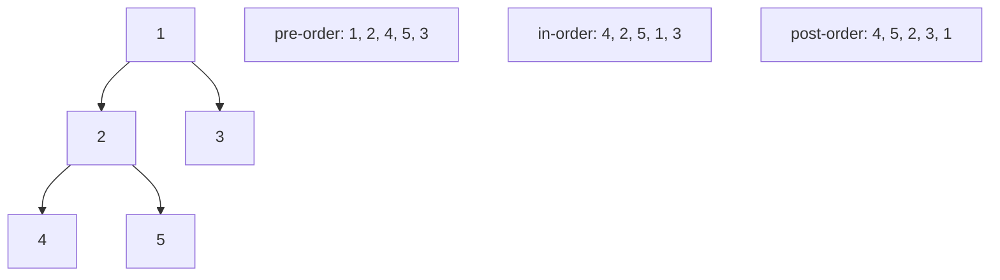

Recursion depth = tree height — O(log n) for a balanced tree, O(n) for a linear chain (linked-list-shaped tree). The recursive form is the cleanest expression of tree traversal in any language.

### Divide-and-Conquer: Mergesort

```java
void mergesort(int[] arr, int lo, int hi) {
    if (hi - lo <= 1) return;          // base: 0 or 1 element
    int mid = (lo + hi) >>> 1;
    mergesort(arr, lo, mid);            // left half
    mergesort(arr, mid, hi);             // right half
    merge(arr, lo, mid, hi);             // combine
}
```

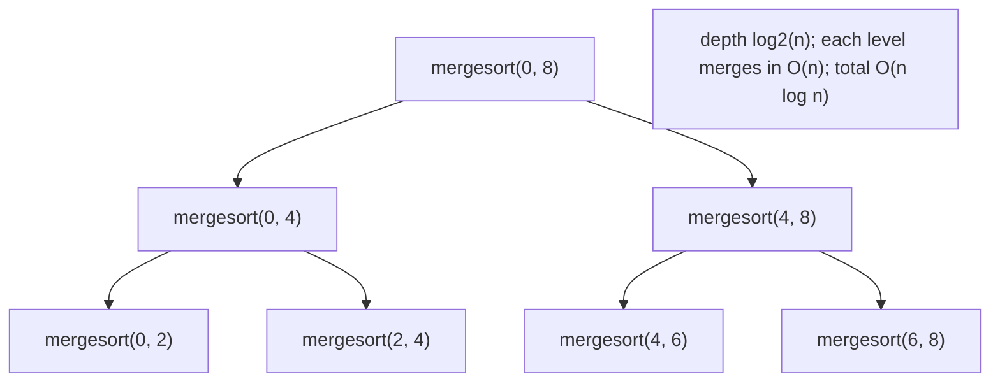

Recursion depth O(log n); total work O(n log n). The **call-tree shape** *is* the algorithm.

### Backtracking: Permutations

Generate all permutations of an array by trying each element at each position:

```java
void permute(int[] arr, int pos) {
    if (pos == arr.length) {
        System.out.println(Arrays.toString(arr));
        return;
    }
    for (int i = pos; i < arr.length; i++) {
        swap(arr, pos, i);              // try element i at position pos
        permute(arr, pos + 1);
        swap(arr, pos, i);               // undo (backtrack)
    }
}
```

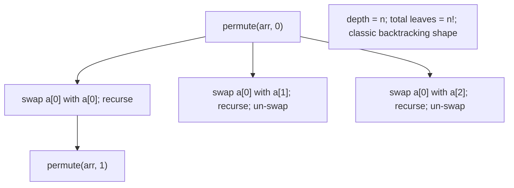

Backtracking and DFS share the recursive structure — explore one path to completion, undo, try the next.

## Memory Layer — Every Recursive Call Is a Real Stack Frame

The JVM has **no concept of recursion**. To it, every recursive call is just an `invokestatic` or `invokevirtual` (T12) — same as any other call. Each call allocates a fresh stack frame with its own copy of parameters and locals; the previous frame waits, suspended, for the return.

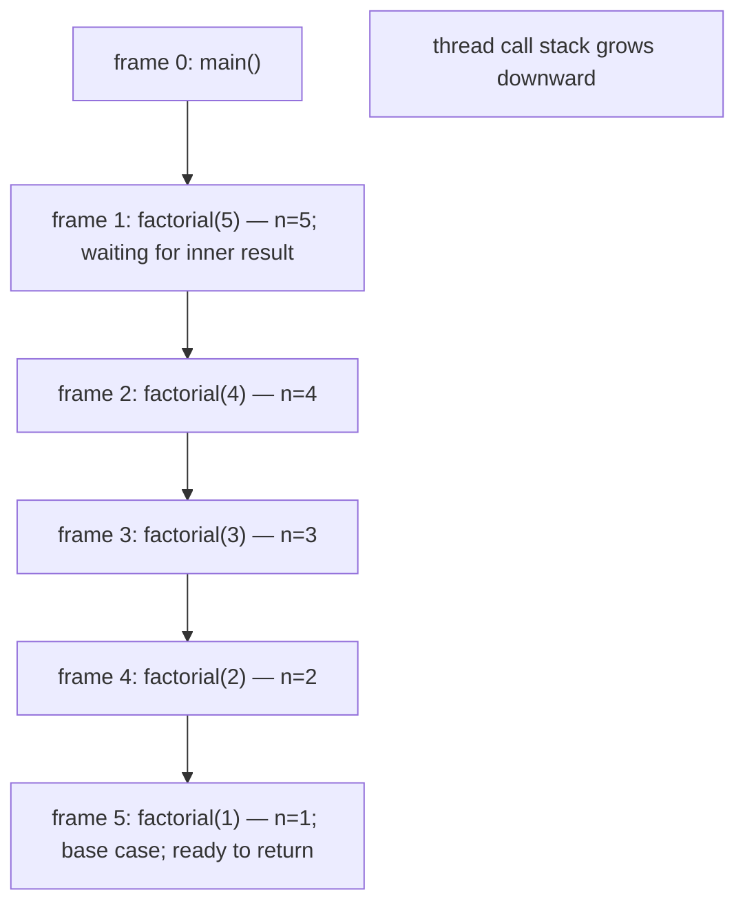

Each frame contains the parameter `n`, any locals, and the bookkeeping for the partial multiplication (operand stack holding `5 *`, `4 *`, etc.). When `factorial(1)` returns 1, frame 5 is deallocated; frame 4 finishes its `2 * 1 = 2` multiplication and returns 2; frame 3 finishes `3 * 2 = 6`; and so on back to `main`.

### `javap -c` of a Recursive Method

Source:

```java
class R {
    static int factorial(int n) {
        if (n <= 1) return 1;
        return n * factorial(n - 1);
    }
}
```

Bytecode of `factorial`:

```
 0: iload_0                  // load n
 1: iconst_1
 2: if_icmpgt   7             // n > 1? jump to recursive case
 5: iconst_1
 6: ireturn                    // base case: return 1
 7: iload_0                   // recursive: load n
 8: iload_0
 9: iconst_1
10: isub                       // n - 1
11: invokestatic  #2  // Method factorial:(I)I   <-- SELF CALL!
14: imul                       // n * factorial(n-1)
15: ireturn
```

The recursive call is just an `invokestatic` referencing `factorial:(I)I` — the *same* method. The JVM treats it like any other method invocation: allocate a frame, copy `n-1` into slot 0, jump to offset 0 of `factorial`.

### Stack-Frame Size and `-Xss`

A typical Java frame is **50–200 bytes** depending on local count, operand-stack depth, and platform. The thread stack default is **`-Xss=512k` to `1m`** (platform-dependent), giving roughly **3 000–20 000 recursion depth** before `StackOverflowError`.

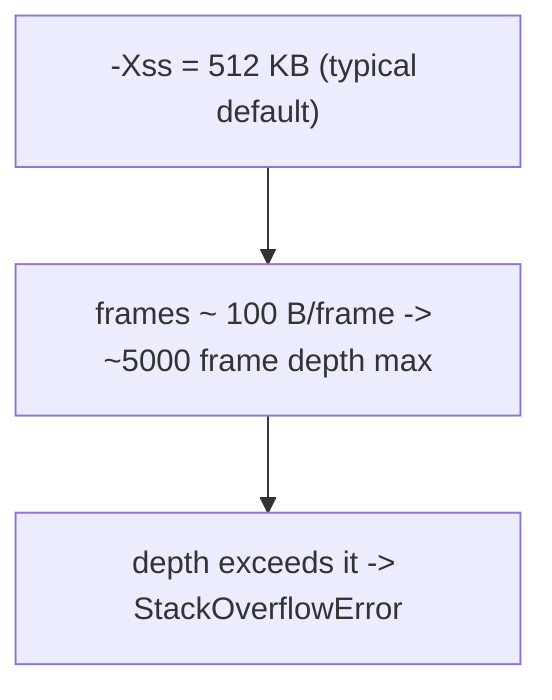

Worked numbers for `factorial(n)` on a 64-bit HotSpot:

| `-Xss` | Approximate max depth |
|--------|----------------------|
| 64 KB | ~600 |
| 512 KB (default) | ~5 000 |
| 1 MB | ~10 000 |
| 4 MB | ~40 000 |

Always bound recursion depth by something the *problem* limits (tree height, log n divide-and-conquer), never by `-Xss`. If you can't bound, switch to iteration or manual-stack simulation (see architecture section).

### `StackOverflowError` Mechanics

When a frame allocation would push past the thread's stack limit, the JVM detects it (typically via a guard page that triggers a fault) and throws `java.lang.StackOverflowError`. The stack trace contains thousands of identical frames — `factorial: factorial: factorial: ...` — because every frame is at the same method.

```java
try {
    factorial(1_000_000);
} catch (StackOverflowError e) {
    System.out.println("Depth: " + e.getStackTrace().length);
}
```

Use this to **measure your stack budget** before deploying:

```java
int probeMaxDepth() {
    try { return probeMaxDepth() + 1; } catch (StackOverflowError e) { return 0; }
}
```

(Subtle: the catch frame *also* lives on the stack, so this counts slightly conservatively. Run it before any real work; the JIT will warm and the depth will rise.)

## Architecture Layer — RAS, Tail Recursion, and TCO

### The Return Address Stack — Hardware Prediction for `ret`

T12 introduced the Return Address Stack: a small hardware structure (~16-32 entries on Intel; ~8-16 on ARM) that mirrors the software return-address stack and predicts the target of every `ret` instruction. On normal code, the RAS is **always right**, and `ret` costs ~1 cycle.

For shallow recursion (depth ≤ RAS size), the RAS stays consistent and returns are free. For **deep recursion**, the RAS **overflows** — it can only remember the last 16-32 return addresses — and the older entries are evicted. When those frames pop, the CPU has no RAS prediction; it falls back to the Branch Target Buffer (BTB), which often mispredicts.

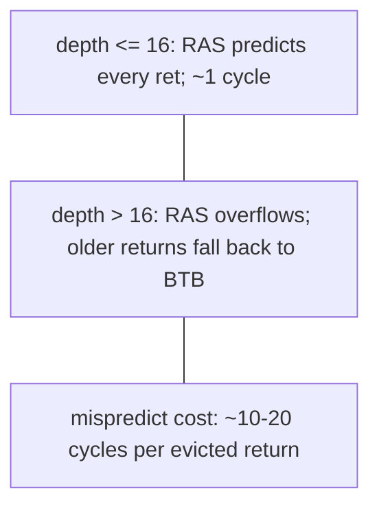

In practice, this is a small effect (a few percent slowdown on 1000-deep recursion compared to a depth-16 chain) but it's why very deep recursion is incrementally slower than iteration even when both fit in `-Xss`.

### Tail Recursion — When the Recursive Call Is the Last Thing

A method is **tail-recursive** if every recursive call is the *last operation* in the method — nothing remains to do after the recursive call returns:

```java
int factorialTail(int n, int acc) {
    if (n <= 1) return acc;             // base
    return factorialTail(n - 1, n * acc);   // <-- recursive call IS the return value; nothing after
}

int factorial(int n) { return factorialTail(n, 1); }
```

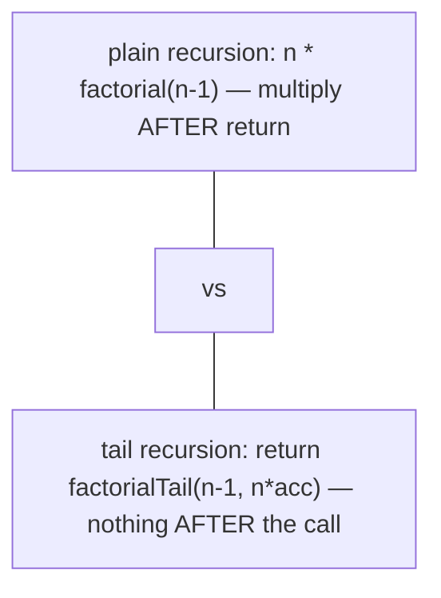

Why this matters: if the recursive call is the last thing, **the current frame can be replaced (not nested)** by the new call's frame. This is called **tail-call optimisation (TCO)** — a compiler transformation that turns tail recursion into a loop, with constant stack depth.

### HotSpot Does NOT Do TCO (Yet)

The standard JVM specification doesn't mandate TCO, and HotSpot doesn't perform it on Java code. Reasons:

1. **Full stack traces are a language contract.** Java's `Throwable.getStackTrace()` returns one frame per logical call. TCO would collapse those frames; debugging would suffer.
2. **Security managers and `AccessController.doPrivileged`** rely on knowing the actual call stack to make permission decisions. TCO would break those checks.
3. **`Thread.dumpStack()`, profilers, debuggers** all rely on the same.
4. **`StackWalker` API** (Java 9+) makes the stack programmatically introspectable.

So **the tail-recursive `factorialTail(1_000_000, 1)` *still* allocates 1 000 000 frames** and still throws `StackOverflowError`. Java tail recursion is **not faster** than head recursion.

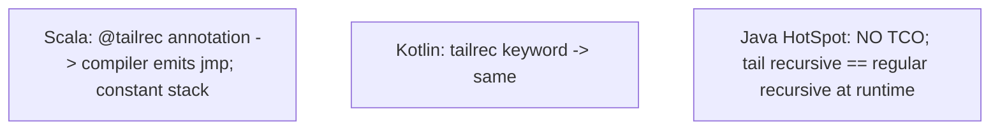

**Workarounds.** When you need to express tail-recursive-feeling code in Java without depth limits, use **iteration**:

```java
int factorialIter(int n) {
    long acc = 1;
    while (n > 1) {
        acc *= n;
        n--;
    }
    return (int) acc;
}
```

This is what TCO would produce internally. Constant stack, no `StackOverflowError`.

### Languages That Do TCO on the JVM

**Scala** has `@tailrec` — the compiler verifies the call is in tail position and rewrites it to a loop in bytecode. Same trick works in **Kotlin** (`tailrec` keyword) and **Clojure** (`recur` form). These languages emit `goto` (back-edge) into the same method instead of `invokestatic`, sidestepping the JVM's lack of native TCO.

Java itself could do this in principle — the bytecode supports it — but the language designers have repeatedly chosen not to, citing the stack-trace contract.

### Memoization — When Recursion Is Too Slow

We saw naive Fibonacci is O(2ⁿ). When recursion explores **overlapping subproblems**, memoize:

| Problem | Naive recursion | Memoized |
|---------|----------------|----------|
| Fibonacci | O(2ⁿ) | O(n) |
| Climbing stairs | O(2ⁿ) | O(n) |
| Knapsack (recursive enumeration) | O(2ⁿ) | O(n·W) |
| Edit distance (Levenshtein) | O(3ⁿ) | O(n·m) |
| Longest common subsequence | O(2ⁿ) | O(n·m) |

The memo can be a `HashMap`, an array, or a 2-D array depending on the shape of the subproblem index. Memoized recursion (top-down DP) is often easier to write than the equivalent bottom-up DP, at the cost of some stack depth.

### Iterative Conversion — When You Need No Stack At All

Any recursive algorithm can be **converted to iteration** by using an explicit stack (`Deque`) instead of the call stack. Useful when:

- You want to avoid `StackOverflowError` (depth-unbounded inputs).
- You want predictable memory usage (`Deque` grows on the heap; the JVM stack does not).
- You want to pause/resume the traversal (you can't pause the call stack).

Recursive DFS:

```java
void dfsRecursive(Node n) {
    if (n == null) return;
    visit(n);
    dfsRecursive(n.left);
    dfsRecursive(n.right);
}
```

Iterative DFS using a manual stack:

```java
void dfsIterative(Node root) {
    Deque<Node> stack = new ArrayDeque<>();
    if (root != null) stack.push(root);
    while (!stack.isEmpty()) {
        Node n = stack.pop();
        visit(n);
        if (n.right != null) stack.push(n.right);    // push right first
        if (n.left != null) stack.push(n.left);       // so left pops first
    }
}
```

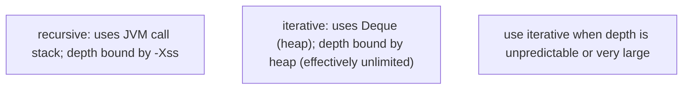

The iterative version is often slightly **more code**, but immune to stack overflow.

### Recursion vs Iteration — When Each Wins

| Property | Recursion | Iteration |
|----------|-----------|-----------|
| Code clarity for self-similar problems | clearer | uglier |
| Code clarity for linear loops | uglier | clearer |
| Stack overhead | one frame per call | none |
| Stack-overflow risk | yes | no |
| TCO in Java? | no | n/a |
| JIT optimisation | normal call inlining | full loop suite (LICM, unroll, SIMD) |
| Pause/resume | hard | trivial |

**Rule of thumb**: for **tree, graph, divide-and-conquer, and backtracking** problems, prefer recursion (it's the algorithm's natural shape). For **linear or single-counter loops**, prefer iteration. For **deep but linear recursion** (e.g., walking a 1-million-node linked list with recursive `next`), switch to iteration to avoid `StackOverflowError`.

## Common Mistakes

### Missing Base Case

```java
int loop(int n) {
    return loop(n - 1);             // no base case!
}
```

Infinite recursion → `StackOverflowError`. Every recursion needs a base case reachable from the recursive case's input reduction.

### Wrong Base Case for Edge Inputs

```java
int factorial(int n) {
    if (n == 1) return 1;            // BUG: factorial(0) skips this and goes to factorial(-1)!
    return n * factorial(n - 1);
}

factorial(0);                         // -> factorial(-1) -> factorial(-2) -> ... StackOverflow
```

Use `n <= 1` or `n == 0`, not `n == 1`. Always test your base case with edge inputs (0, 1, negative).

### Recomputation in Naive Recursion

`fib(50)` taking 17 minutes is a real problem. If your recursive calls overlap, memoize.

### Accidental Indirect Recursion

```java
String formatUser(User u) {
    return u.toString();              // calls User.toString()
}

class User {
    @Override
    public String toString() {
        return formatUser(this);      // calls formatUser, which calls toString...
    }
}
```

Infinite mutual recursion. Easy to miss in code review. Use explicit field access (`"User[" + u.name + "]"`).

### Expecting TCO

```java
int sum(int n, int acc) {
    if (n == 0) return acc;
    return sum(n - 1, acc + n);       // tail-recursive in form...
}

sum(1_000_000, 0);                    // ...but still StackOverflowError on HotSpot!
```

HotSpot doesn't perform TCO. Either switch to iteration or use Scala/Kotlin.

### Recursive Method With Mutable Static State

```java
static int counter;

void recurse(int n) {
    counter++;
    if (n == 0) return;
    recurse(n - 1);
}
```

Across multiple calls, `counter` accumulates. Often not what you want. Either reset the counter, pass it as a parameter, or use a fresh local.

### Modifying a Shared Parameter in Backtracking

```java
void permute(List<Integer> chosen, List<Integer> rest) {
    if (rest.isEmpty()) {
        results.add(chosen);          // BUG: same 'chosen' list will be modified later
        return;
    }
    // ...
}
```

Backtracking that "remembers" a partial state must **copy** before adding to results — otherwise later modifications poison the saved snapshot.

```java
results.add(new ArrayList<>(chosen));  // defensive copy
```

### Deep Recursion on Unbounded Input

```java
int countLinkedListNodes(Node head) {
    if (head == null) return 0;
    return 1 + countLinkedListNodes(head.next);
}
```

Works for short lists; `StackOverflowError` on a million-node linked list. Switch to iteration:

```java
int countLinkedListNodes(Node head) {
    int count = 0;
    while (head != null) { count++; head = head.next; }
    return count;
}
```

### Calling Recursive on `null` or Empty Without Guard

```java
void walk(Node n) {
    walk(n.left);                     // NPE on null!
    visit(n);
    walk(n.right);
}
```

The base case (`if (n == null) return;`) handles this. Always test the parameter for the "stop here" condition first.

> [!INTERVIEW]
> Recursion is interview territory — almost every algorithmic interview includes at least one recursive question.
>
> 1. **What's the structure of a recursive method?** Base case + recursive case. The recursive case reduces input toward the base.
> 2. **What's the time complexity of naive Fibonacci?** O(2ⁿ) — more precisely O(φⁿ).
> 3. **How do you fix it?** Memoization (top-down DP) or bottom-up iteration. Both O(n).
> 4. **What's tail recursion?** The recursive call is the last operation. No work after the return.
> 5. **Does Java do TCO?** No. HotSpot doesn't perform tail-call optimisation. Tail-recursive Java still grows the stack.
> 6. **Why doesn't Java do TCO?** Stack traces, security managers, debuggers, `StackWalker` all rely on the actual call stack.
> 7. **Which JVM languages do TCO?** Scala (`@tailrec`), Kotlin (`tailrec`), Clojure (`recur`).
> 8. **What's the difference between direct and indirect recursion?** Direct: method calls itself. Indirect (mutual): A calls B which calls A.
> 9. **When should you convert recursion to iteration?** Deep unbounded recursion (linked list walks, tree balancing not guaranteed, very deep input).
> 10. **How does the CPU's Return Address Stack relate to recursion?** Predicts `ret` targets; shallow recursion benefits; deep recursion overflows the RAS and gets BTB-fallback mispredicts.
> 11. **What's the bytecode of a recursive call?** Plain `invokestatic`/`invokevirtual` to the same method — the JVM has no concept of recursion.
> 12. **What's `-Xss`?** The thread stack size; bounds recursion depth. Default ~512 KB – 1 MB → ~3 000-10 000 depth typical.

## Practice

1. **Trace by hand.** Write factorial; trace `factorial(5)` with the substitution model. Confirm the call stack grows to 5 frames, then unwinds.
2. **`javap -c` a recursion.** Disassemble factorial. Find the self-`invokestatic`. Confirm the recursion is just a plain method call.
3. **`StackOverflowError` measurement.** Write `int probe(int d) { return probe(d + 1); }`. Catch the error, print the depth.
4. **`-Xss` and depth.** Re-run with `-Xss=64k`, `-Xss=512k`, `-Xss=4m`. Plot depth vs `-Xss`; confirm roughly linear.
5. **Fibonacci naive.** Implement naive recursive `fib(40)`. Time it. Then `fib(45)`. Confirm exponential scaling.
6. **Fibonacci memoized.** Add a `long[]` memo. Re-time. Confirm O(n).
7. **GCD via Euclid.** Implement `gcd(a, b)`. Trace `gcd(48, 18)`. Note depth is log-scale.
8. **Tree traversal trio.** Build a 5-node binary tree. Print in pre-order, in-order, and post-order. Confirm the expected sequences.
9. **Mergesort.** Implement recursive mergesort. Confirm correctness on a random 1000-element `int[]`. Trace the recursion depth (~10 for n=1000).
10. **Permutations via backtracking.** Print all permutations of `[1, 2, 3, 4]`. Count them — should be 24.
11. **Mutual recursion.** Implement `isEven`/`isOdd` mutually recursive. Test `isEven(1_000_000)` — confirm `StackOverflowError`.
12. **Tail-recursive trap.** Write tail-recursive `sumTail(int n, int acc)`. Call `sumTail(1_000_000, 0)`. Confirm `StackOverflowError` — HotSpot doesn't do TCO.
13. **Iterative conversion.** Convert tail-recursive sum to a `while` loop. Confirm constant stack and no `StackOverflowError` on n=10 000 000.
14. **Manual-stack DFS.** Convert recursive DFS to iterative DFS with `Deque<Node>`. Confirm same traversal order.
15. **Deep linked list count.** Build a 1 000 000-node linked list. Recursive count throws `StackOverflowError`; iterative count succeeds.
16. **Backtracking copy bug.** Reproduce the permute-with-shared-list bug (add `chosen` without copying). Observe all "permutations" become the empty list. Fix with `new ArrayList<>(chosen)`.
17. **Explain it back.** Trace `factorial(3)` at the JVM level: (a) `invokestatic` allocates frame for n=3; (b) frame 3 calls `factorial(2)` → frame for n=2; (c) frame 2 calls `factorial(1)` → frame for n=1; (d) base case returns 1; frame 1 popped; (e) frame 2 multiplies 2 * 1 = 2, returns; popped; (f) frame 3 multiplies 3 * 2 = 6, returns; popped. Total frames at peak: 3 (plus `main`'s).

## Recap

You should now be able to:

- Define **recursion** as a method that calls itself directly or indirectly; recall that the JVM has no special handling — each call is a plain `invokestatic`/`invokevirtual`.
- Construct any recursive method around the **base case + recursive case** template, ensuring the recursive case **reduces** the input toward the base.
- Trace recursion by the **substitution model** — replace each call with its definition until the base case, then evaluate back up.
- Distinguish **direct recursion** (A calls A) from **indirect / mutual recursion** (A calls B calls A).
- Recall classic recursive structures: **linear** (factorial), **logarithmic** (gcd via Euclid), **exponential** (naive Fibonacci), **divide-and-conquer** (mergesort, quicksort, binary search), **tree traversal** (pre/in/post-order DFS), **backtracking** (permutations, N-queens, sudoku), and the **memoization** transformation that often turns exponential into polynomial.
- Recognise **overlapping subproblems** as the signal for memoization (cache results to avoid recomputation; turns O(2ⁿ) Fibonacci into O(n)) — the gateway to **dynamic programming**.
- Trace a recursive call to a **fresh stack frame** with its own copies of parameters and locals; the previous frame waits for the return; depth = call-chain length.
- Identify the bytecode of a recursive call as a plain `invokestatic` (or `invokevirtual`) referencing the same method — *no special opcode for recursion*.
- Recall typical **stack-frame size** (~50-200 B) and the relationship to **`-Xss`** (default ~512 KB – 1 MB) → ~3 000-10 000 depth in default config; depth scales with `-Xss`.
- Diagnose **`StackOverflowError`** as the boundary: missing base case, unreachable base case, or simply too-deep input.
- Recognise **tail recursion** (recursive call is the last operation) and the **tail-call optimisation (TCO)** transformation that reuses the current frame; recall that **HotSpot does not perform TCO** (reasons: stack-trace contract, security managers, debuggers); tail-recursive Java still grows the stack.
- Recall that **Scala (`@tailrec`)**, **Kotlin (`tailrec`)**, and **Clojure (`recur`)** do perform TCO on the JVM by emitting back-edge `goto`s.
- Explain how the CPU's **Return Address Stack (RAS, ~16-32 entries)** caches return targets; **shallow recursion benefits**; **deep recursion overflows RAS** and falls back to BTB, costing a few cycles per evicted return.
- Convert recursive algorithms to **iterative** form using a **manual stack** (`Deque<T>`) when stack depth would exceed `-Xss` or you need pause/resume behaviour; recognise that the iterative version is immune to `StackOverflowError` (the `Deque` lives on the heap).
- Apply the **recursion vs iteration** decision: tree / divide-and-conquer / backtracking → recursion (natural shape); linear loops → iteration; deep unbounded linear recursion → switch to iteration to avoid `StackOverflowError`; tight numeric loops → iteration (JIT applies LICM, unroll, SIMD).
- Avoid the **common traps**: missing base case (infinite recursion), wrong base case for edge inputs (0, 1, negative), recomputation in naive recursion (memoize!), accidental mutual recursion (`toString` calling itself via a formatter), expecting TCO (use iteration), shared-state contamination across calls, modifying a shared parameter in backtracking without copying, deep recursion on linked lists / unbalanced trees, missing `null` guard before recursing into children.

## Next

Continue to [Variable scope & lifetime](./T15-variable-scope-and-lifetime.md).
