# Variable scope & lifetime

Two related but **distinct** concepts: **scope** answers "*where in the source code is this name visible?*"; **lifetime** answers "*when is this variable's storage allocated, and when is it reclaimed?*". A local variable's scope is the block it's declared in; its lifetime is from method entry to frame pop. An instance field's scope is the whole class; its lifetime is from `new` to GC. Static fields' scope is the whole class; their lifetime is from class initialisation to class unloading (essentially "forever" for most apps).

The depth-bar requirement isn't just "show the rules." Scope is a **compile-time** concept — `javac` enforces it; the bytecode merely uses slot numbers and field references and doesn't carry the source-level names at all (except in the optional `LocalVariableTable` debug attribute). Lifetime is a **runtime** concept tied to specific memory regions: locals live in the **stack frame's local-variable array** (T02); instance fields live inside the **heap object** they're declared in (T02 object layout); static fields live in the **`Class` object's metadata** (in the **Metaspace** region in modern HotSpot, not the regular heap). At the architecture layer, the JIT's **register allocator** often makes a local's observable lifetime *shorter* than the source's source-level scope — it spills to a slot only when needed. **Escape analysis** can make a `new`-allocated object's lifetime equal to a method scope by **scalar replacing** the object — fields lifted to registers, no heap allocation, GC'd "instantly" when the frame pops. We'll walk all three layers.

> [!NOTE]
> Prerequisites: [Variables & Primitive Types](./T02-variables-and-primitive-types.md) (`L0/C02/T02`) — stack-frame layout, object header, where each variable physically lives; [Literals & Constants](./T03-literals-and-constants-final.md) (`L0/C02/T03`) — `final` and compile-time constants; [Methods, parameters, return values](./T12-methods-parameters-return-values.md) (`L0/C02/T12`) — frame allocation/teardown, pass-by-value, where parameters live; [Loops](./T09-loops-while-do-while-for-for-each.md) (`L0/C02/T09`) — `for` loop variable scope; [Arrays](./T11-arrays-1-d-multi-dimensional.md) (`L0/C02/T11`) — array reference scoping; [Recursion](./T14-recursion.md) (`L0/C02/T14`) — each recursive call gets fresh locals; [Source to Bytecode](../C01-cs-foundations/T04-source-to-bytecode-to-jvm-to-machine-code.md) (`L0/C01/T04`) — `.class` structure, the `LocalVariableTable` debug attribute, class-loading phases.

## The Four Kinds of Variable

Every Java variable is one of four kinds, distinguished by **where it's declared**:

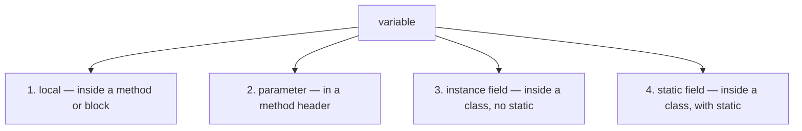

Concrete examples:

```java
class C {
    static int s = 0;                     // (4) static field
    int i = 0;                            // (3) instance field

    void method(int p) {                  // (2) parameter p
        int local = 1;                    // (1) local
        for (int counter = 0; counter < 10; counter++) {     // (1) local (counter)
            int innerLocal = counter * 2;                     // (1) local
        }
    }
}
```

Each kind has its own scope rule and its own lifetime rule. We'll walk both axes.

## Scope — Where Names Are Visible

**Scope** is the *region of source code* in which a name refers to a particular declaration. It's a **compile-time** property — `javac` resolves names entirely during compilation, before the bytecode is generated.

### Local Variable Scope

A local variable is visible **from its declaration to the end of the enclosing block**.

```java
void f() {
    System.out.println(x);          // COMPILE ERROR: x not yet in scope
    int x = 5;
    System.out.println(x);          // OK
}                                    // x goes out of scope here
System.out.println(x);              // COMPILE ERROR: x not in scope (also not in the method anymore)
```

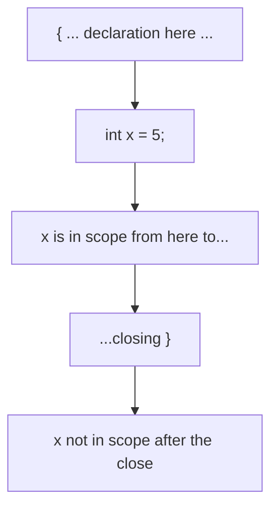

**Declaration-before-use.** A local must be declared on a source line **before** any use. Unlike fields, locals don't get "lifted" — the compiler reads top-to-bottom within a block.

### Block Scoping and Nested Blocks

A `{ ... }` block is its own scope. Inner blocks can declare new locals that are **invisible outside** but can **read outer locals**:

```java
void f() {
    int outer = 1;
    {
        int inner = 2;
        System.out.println(outer + inner);    // OK: both visible
    }
    System.out.println(inner);                // COMPILE ERROR: inner out of scope
    System.out.println(outer);                // OK
}
```

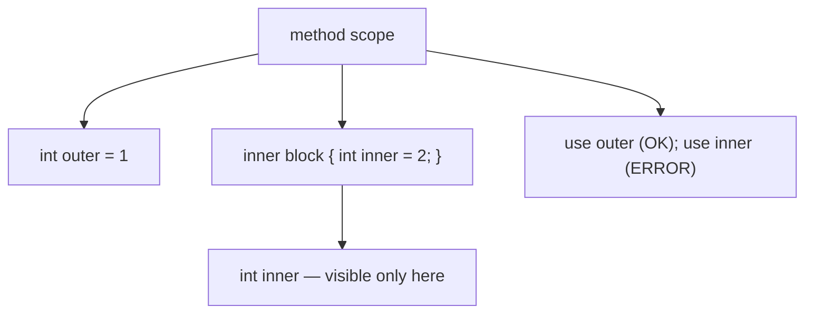

A local declared in an inner block **cannot** have the same name as a local in scope from the outer block — **no shadowing of locals by locals**:

```java
void f() {
    int x = 1;
    {
        int x = 2;          // COMPILE ERROR: variable x is already defined in scope
    }
}
```

This rule prevents the C/C++ "did I mean the inner or the outer x?" trap. (Other languages — Rust, Kotlin — *do* allow it. Java's choice errs on the side of explicitness.)

### `for` Loop Scope (Revisit From T09)

A counter declared in a `for` header lives **only** inside the loop:

```java
for (int i = 0; i < 5; i++) {
    System.out.println(i);
}
System.out.println(i);                  // COMPILE ERROR: i out of scope
```

This is a deliberate departure from older C, where `for (int i...)` could leak `i` into the enclosing scope. Java's version eliminates a whole class of "stale counter" bugs.

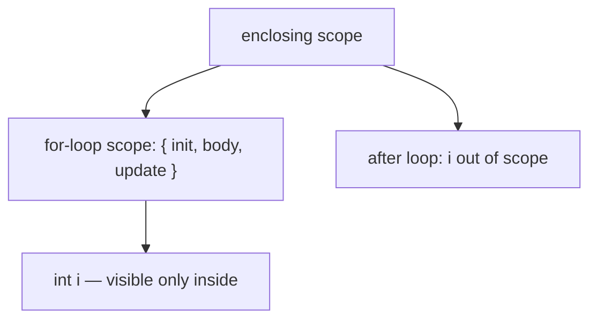

The **enhanced-for** counter has the same rule:

```java
for (int x : arr) {
    // x in scope here
}
// x not in scope
```

### `try` / `catch` Scope

Exception variables in a `catch` block are scoped to that block only:

```java
try {
    // ...
} catch (IOException e) {                // e in scope only inside this catch block
    log(e);
}
// e not in scope here
```

Locals declared inside the `try` block are scoped to it. **Locals declared in the `try` are NOT visible in the `catch`** — even though source-code-wise they're nearby:

```java
try {
    int reading = sensor.read();        // local to the try
    process(reading);
} catch (IOException e) {
    System.out.println(reading);         // COMPILE ERROR: reading not in scope here
}
```

Hoist the local outside the try if you need it in both:

```java
int reading = -1;
try {
    reading = sensor.read();
    process(reading);
} catch (IOException e) {
    log("Failed at reading " + reading);
}
```

### Try-With-Resources Scope

The resource declared in `try-with-resources` is scoped to the `try` block (and the implicit `finally` that closes it). Visible in the `try`; **not** in catch/finally clauses:

```java
try (var conn = open()) {
    conn.send(msg);
} catch (IOException e) {
    // conn not in scope here
}
```

### Parameter Scope

A method parameter is in scope over the **entire method body** — equivalent to a local declared at the very top:

```java
void f(int p) {                          // p in scope from the opening { ...
    int x = p + 1;
}                                         // ...to the closing }
```

A parameter cannot be shadowed by a local of the same name (same rule as for locals shadowing locals):

```java
void f(int p) {
    int p = 5;                            // COMPILE ERROR: p already defined as a parameter
}
```

### Instance Field Scope

An instance field is in scope **over the entire class body** — both before and after its declaration line.

```java
class C {
    void method1() {
        System.out.println(value);        // OK — value is in scope
    }

    int value = 0;                         // declared here

    void method2() {
        value = 1;                          // OK — same field, still in scope
    }
}
```

Fields are "hoisted" to be visible throughout the class. This is a different rule from locals; the rationale is that a class is conceptually one unit, and the order of field/method declarations within it is a presentation choice.

**Subclasses** inherit visible instance fields (subject to access modifiers). Covered in L1/C01.

### Static Field Scope

Same as instance fields — the **whole class body** — plus accessible from outside as `ClassName.field` (subject to access modifiers).

```java
class C {
    static int counter = 0;

    void instanceMethod() {
        counter++;                        // refers to C.counter (no this needed)
    }

    static void staticMethod() {
        counter++;                        // refers to C.counter
    }
}

// From outside:
C.counter = 5;                            // qualified static access
```

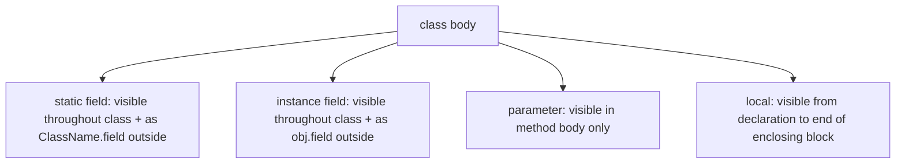

### Shadowing — Locals/Parameters Hiding Fields

A local or parameter **can** have the same name as an instance or static field of the enclosing class. When this happens, **the local/parameter wins** within its scope — the field is **shadowed**:

```java
class C {
    int value = 100;                       // field

    void set(int value) {                   // parameter — shadows the field!
        value = value;                      // assigns parameter to itself; field unchanged!
        // ^^^^^^^^^^  both refer to the parameter
    }
}
```

To refer to the shadowed field, qualify with `this.`:

```java
void set(int value) {
    this.value = value;                     // this.value is the field; value is the parameter
}
```

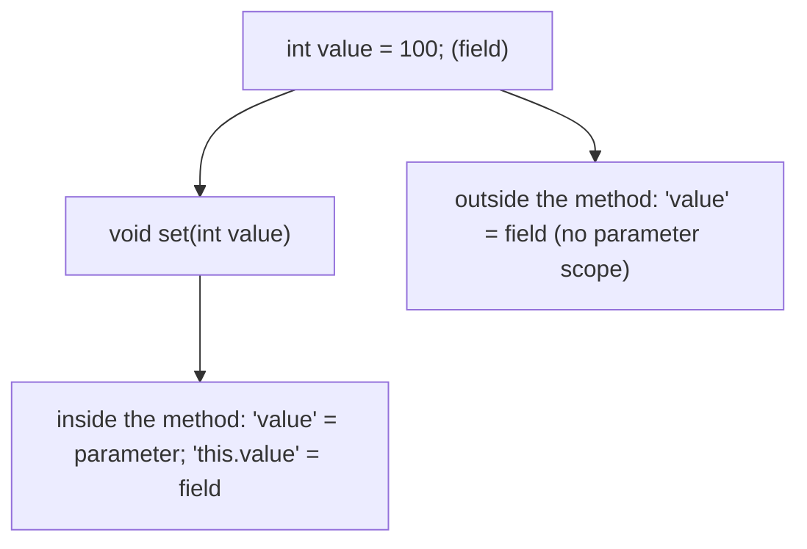

**Setter idiom**: `this.value = value;` is the canonical pattern — name the parameter the same as the field; assign with `this.` qualifier. Read both pieces of state at once.

> [!WARNING]
> **Shadowing without `this.` is the source of "I set the value but it's still the old value!" bugs.** Always use `this.field = param` in setters, or rename the parameter (`newValue`, `_value`) if you prefer.

For **static fields**, `ClassName.field` (or `this.field` from within an instance, since the JVM resolves static through any reference) disambiguates. The IDE will warn on this; rely on it.

### Definite Assignment

A local variable must be **definitely assigned** before any use — the compiler proves all paths to a read have a prior write:

```java
int x;
if (cond) x = 1;
System.out.println(x);                    // COMPILE ERROR: x might not have been assigned
```

Fix:

```java
int x;
if (cond) x = 1;
else x = 0;
System.out.println(x);                    // OK — all paths assign
```

Instance and static fields **don't** need definite assignment — they're given a default (T02). Locals are stricter because a "default" int would mask bugs.

### Effectively Final (Preview, Full in L2/C01)

A variable is **effectively final** if it's never reassigned after its initial assignment (even if not declared `final`). This matters for lambdas and inner classes, which can capture only final or effectively final variables. Full coverage in L2/C01.

## Lifetime — When Storage Is Allocated and Reclaimed

**Lifetime** is the runtime concept — *when* memory for the variable is allocated, *when* its storage can be reused, and *when* the value (or referenced object) is reclaimed by the GC. The scope ↔ lifetime correspondence is the bridge from source to runtime.

### Local Variable Lifetime

A local's storage is part of the **stack frame's local-variable array** (T02). The frame is allocated at **method entry** and deallocated at **method exit** (`return` or throw):

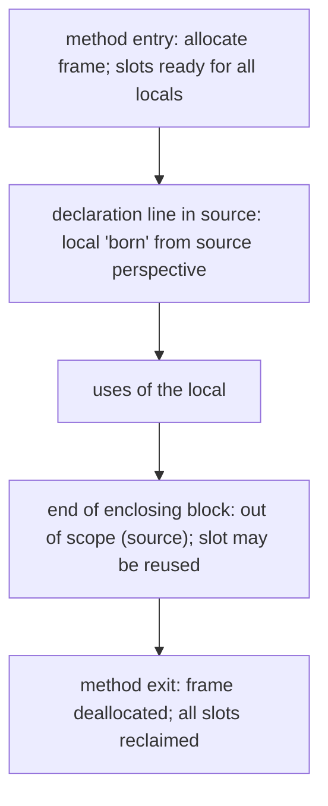

The bytecode allocates the **slots up front** at frame allocation — the slot for `x` exists from method entry, not from the declaration line. **What's bounded by the declaration line is the source-level scope; the slot itself exists frame-wide.** The compiler is free to reuse slots across non-overlapping scopes:

```java
void f() {
    {
        int a = 1;                        // uses slot 1
    }
    {
        int b = 2;                        // can REUSE slot 1 (a is out of scope)
    }
}
```

The `LocalVariableTable` debug attribute (emitted with `javac -g`) records the source-level scope of each name; without it, the JVM sees only slot numbers.

### Parameter Lifetime

Same as locals — from frame allocation to frame deallocation. Parameters occupy slots starting at slot 0 (for `this` on instance methods) or slot 0 (for the first parameter on static methods).

### Instance Field Lifetime

An instance field lives **inside the heap object** it belongs to. Its lifetime is **from the object's `new` allocation to the object's GC reclamation**:

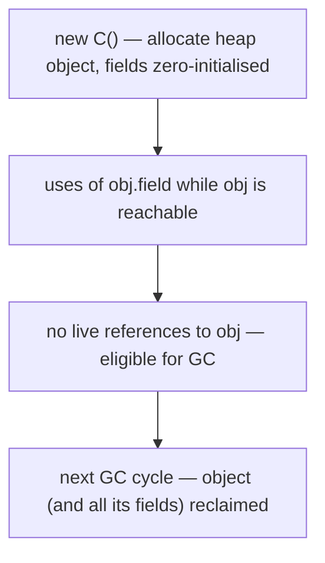

```java
class C {
    int x = 5;
}

C c = new C();                            // c's x is alive while c is referenced
c.x = 99;
c = null;                                  // c.x now unreachable; awaits GC
```

The field lives **as long as the containing object** does. If the object lives forever (e.g., stored in a static field), the field lives forever too.

### Static Field Lifetime

A static field lives in the **`Class` object's metadata**. Its lifetime is:

- **Allocated** when the class is **initialised** (first reference triggers loading + verification + preparation + resolution + initialisation; static fields are assigned their default value at preparation, then their declared initialiser values at initialisation — T03 callback).
- **Reclaimed** when the class is **unloaded** by its `ClassLoader` — which for the application classloader essentially **never happens** for the lifetime of the JVM. For dynamically-loaded classes (web app reloads, plugin systems), it can happen when the ClassLoader is unreachable.

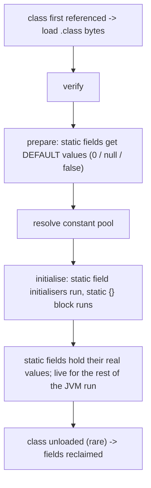

This is why **a static collection grows forever unless explicitly cleared** — there's no `new`/`delete` for static fields; they're alive for the JVM's life:

```java
class Cache {
    static List<X> all = new ArrayList<>();
}

void addToCache(X x) {
    Cache.all.add(x);                      // x is now reachable from all forever; GC can't reclaim x
}
```

This is a common cause of **memory leaks** — items added to a static collection and never removed. Pattern: clear the collection when items are no longer needed, or use a `WeakReference`-based map.

> [!IMPORTANT]
> **Static fields are roots of GC reachability.** Anything reachable from a static field is reachable, period. A static `List` holding millions of objects holds all of them until the list is cleared or the class is unloaded.

### Lifetime Summary Table

| Kind | Where it lives | Born | Dies |
|------|----------------|------|------|
| Local | stack frame's local array | method entry (slot pre-allocated; source scope from declaration) | method exit |
| Parameter | stack frame's local array | method entry (slot 0 = `this` or first param) | method exit |
| Instance field | inside heap object | `new` for the object | GC of the object |
| Static field | Class metadata in Metaspace | class initialisation | class unloading (rare) |

### Returned References Extend Lifetime

A method local goes out of scope on return — but if the method **returns** a reference, the *referenced object* outlives the method scope:

```java
Box makeBox() {
    Box b = new Box();                    // local 'b' goes out of scope at return
    return b;                              // but the Box object survives via the caller's reference
}

Box mine = makeBox();                     // mine references the same Box object
```

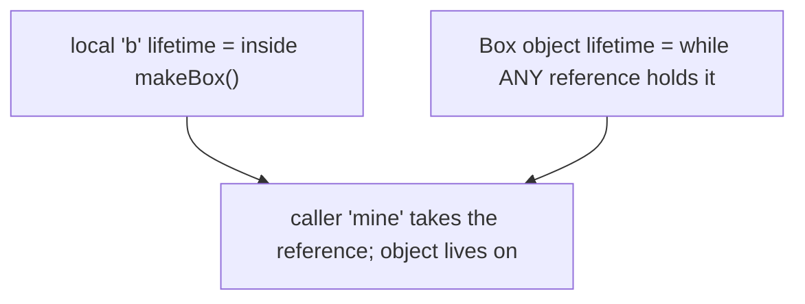

The pattern: locals' lifetimes are method-bound; **heap objects' lifetimes follow reachability**, not scope. The local `b` could go out of scope, but the heap object lives as long as someone refers to it.

## Memory Layer — Byte-Level Placement

Where each kind physically lives in memory:

### Locals and Parameters — Stack Frame Slots

T02's frame layout (review):

```
+---------------------------------+
| frame data (return addr, etc.)  |
+---------------------------------+
| local-variable array            |
| slot 0: this (instance methods) |
| slot 1: first parameter         |
| slot 2: second parameter        |
| ...                             |
| slot N: first local             |
| ...                             |
+---------------------------------+
| operand stack                    |
+---------------------------------+
```

Each slot is 32 bits in the spec; `long`/`double` take **two adjacent slots**. The JIT typically promotes hot slots to **registers** (x86-64 `eax/edi/r10d` etc.; ARM64 `w0..w28`) and spills cold ones to the actual stack.

### Instance Fields — Heap Object Layout

T02's heap-object layout (review):

```
+----------------------------------+
| object header (12 bytes typical) |
|  - mark word (8 bytes)            |
|  - klass pointer (4, compressed)  |
+----------------------------------+
| instance fields                   |
|  - field A (in declaration order, |
|             reordered by size)    |
|  - field B                        |
|  - ...                            |
+----------------------------------+
| padding to 8-byte alignment       |
+----------------------------------+
```

The JVM **reorders fields by size descendingly** (long/double first, then int/float, then short/char, then byte/boolean, then reference) to minimise padding. Within a size category, declaration order is preserved.

### Static Fields — Metaspace

In modern HotSpot (Java 8+), class metadata lives in a **Metaspace** region — separate from the main GC'd heap, managed by the classloader's native arena:

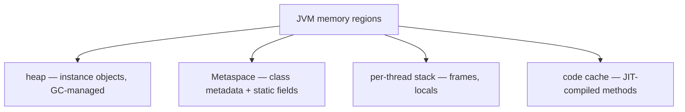

`-XX:MaxMetaspaceSize` bounds Metaspace; the default grows on demand. Pre-Java 8 it was PermGen with a hard limit; the change was to make ClassLoader leaks less catastrophic.

### Where the Names Live

The source names (`int counter`, `String name`) are **not** stored at runtime in the bytecode except in the **`LocalVariableTable`** debug attribute (for locals/parameters, when `javac -g` is used) and **`Fieldref`** / `Methodref` constant-pool entries (for fields and methods). The JVM operates on **slot numbers** and **offset-into-object**, not names.

Inspecting:

```bash
$ javac -g Demo.java                       # include debug info
$ javap -v Demo
```

The `LocalVariableTable` section shows: name, slot, scope range (in bytecode offsets). The `LocalVariableTypeTable` adds generic type info.

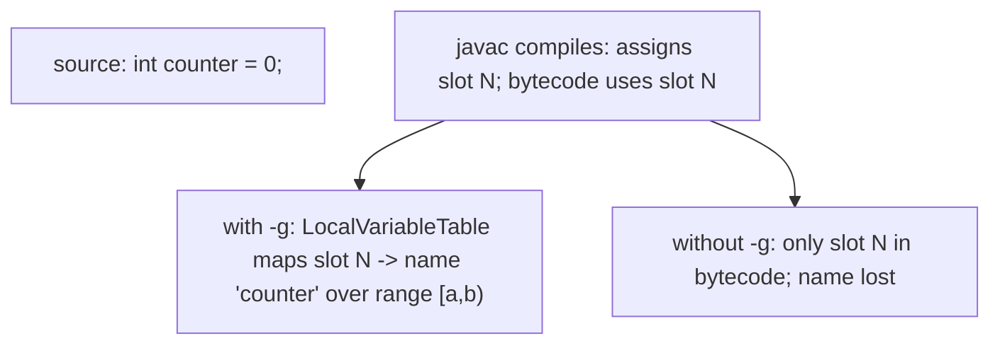

This is why a stripped (non-debug) class shows `slot1`, `slot2` etc. in decompilers when the original names are lost.

## Architecture Layer — JIT, Register Allocation, Escape Analysis

### JIT Register Allocation Shortens Observable Lifetime

The JIT's **register allocator** decides which locals get to live in CPU registers. A frequently-read-and-written local stays in a register for its hot range; the slot in the frame is the **fallback location** for spills and the canonical home only at deoptimisation:

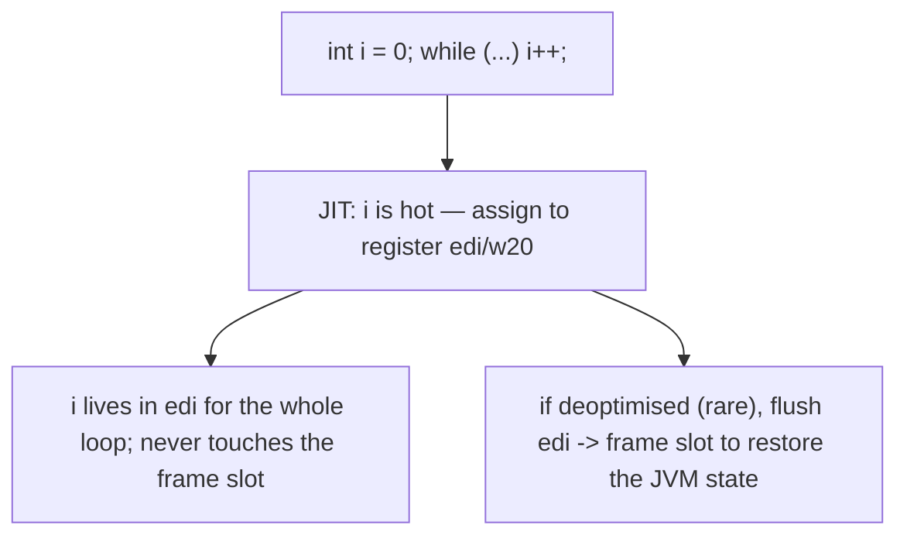

From the source perspective the local `i` exists throughout the method. From the runtime perspective it's a register for the hot region and "non-existent" outside it. **The CPU is happy as long as the JVM's observable behaviour is correct.**

### Liveness Analysis

The JIT runs **liveness analysis** — a backward dataflow analysis that computes, at each program point, which variables are *live* (will be read before being overwritten). Dead variables release their registers; live variables stay assigned. This is how a short-scope local doesn't waste a register.

```java
int x = computeX();
int y = computeY();        // x is live from here to its last use
use(x);                     // x's last use — x is now dead; its register is free
use(y);                     // y still live
```

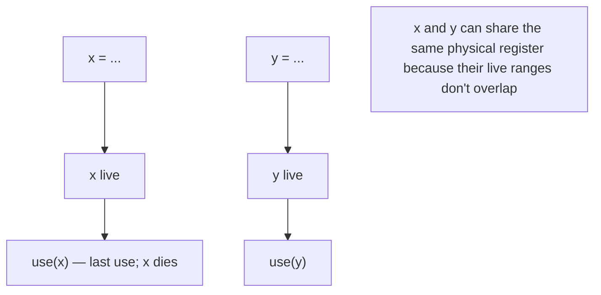

### Escape Analysis — Object Lifetime Lifted to Stack

T07 and T09 introduced **escape analysis (EA)**: HotSpot classifies each allocation as NoEscape, ArgEscape, or GlobalEscape based on whether the object's reference can leak out of the allocating method.

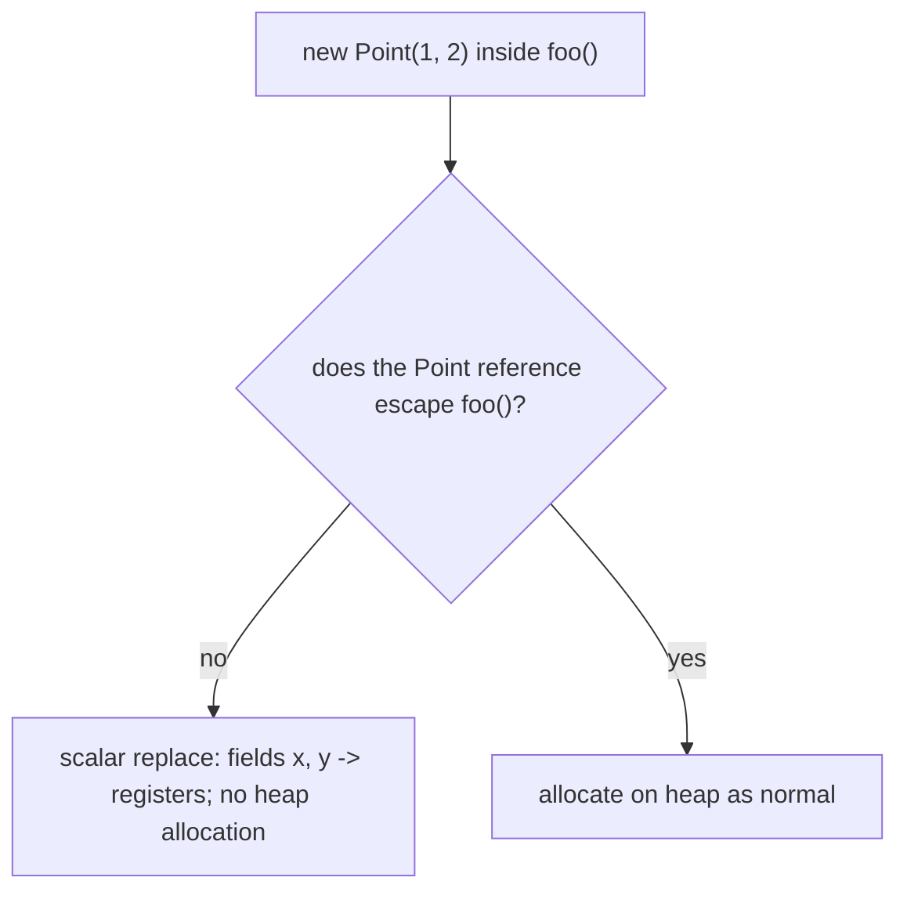

A **NoEscape** allocation effectively **lives in registers / stack**, with **lifetime = method scope**. The "instance fields" of that object are stack slots or registers; on method return, they vanish with the frame. **No GC pressure.** This is why short-lived `StringBuilder`s, lambda captures, `Optional`s, and small wrappers cost essentially nothing.

Observability:

```bash
java -XX:+UnlockDiagnosticVMOptions -XX:+PrintEliminateAllocations Test
```

EA fails when the object **escapes** — assigned to a field, passed to a non-inlined method, returned from the allocating method. Then the heap allocation stands and GC tracks it normally.

### GC Reachability — Roots and Reference Chains

The GC reclaims objects that are **unreachable** from any **root**. Roots include:

- **Stack frames** — every local that is a reference is a root.
- **Static fields** — every static reference is a root.
- **JNI / native references** — held by C code.
- **Active threads** — themselves and their locals.

An object reachable from any root is **live**; one unreachable from all roots is **garbage** and may be reclaimed at the next collection.

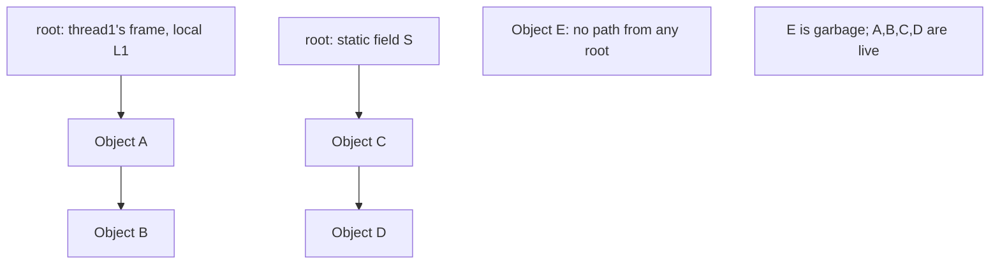

The implication for lifetime: **the heap object's actual lifetime is the longer of (a) all paths from any root, (b) until the GC chooses to run**. Java doesn't promise *when* garbage gets reclaimed — only that it eventually will be.

### `final` and Lifetime

Marking a field `final` doesn't change its **lifetime** (still object-bound for instance; class-bound for static), but it affects:

- **Definite assignment** — must be assigned exactly once (in declaration, instance initialiser, or constructor for instance; declaration or static initialiser for static).
- **JIT optimisation** — `final` fields can be treated as **constants** at the point of read, opening up constant-folding and dead-code elimination.
- **Memory model** — `final` fields are **safely published** at the end of their owning object's constructor (the JLS guarantees other threads see the final value once the constructor finishes); covered in L3/C01.

### Class Initialisation Timing

Static fields' lifetime starts at class init. The JVM lazily initialises classes — a class is initialised on its **first active use**:

- `new SomeClass(...)` (calls the constructor)
- Read or write of a non-`final` static field
- Static method invocation
- Reflective access (`Class.forName`)
- Initialisation of a subclass (initialises ancestors first)

`Class.forName(name, false, loader)` *loads* without initialising. Static fields are assigned their declared initialisers and `static { ... }` blocks run during initialisation, in source order.

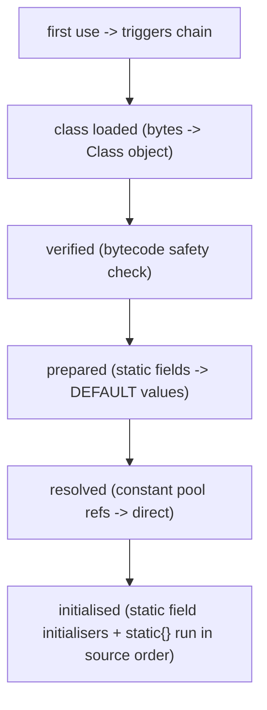

Before initialisation, the field holds the **default** (0 / null / false). During initialisation, it holds its initialiser value. After initialisation (and modifications), it holds its current value.

## Common Mistakes

### Using a Local Outside Its Scope

```java
for (int i = 0; i < 10; i++) { ... }
System.out.println(i);                    // COMPILE ERROR
```

Hoist the declaration if you need it after:

```java
int i;
for (i = 0; i < 10; i++) { ... }
System.out.println(i);                    // OK — i still in scope
```

### Shadowing Without `this.`

```java
class C {
    int x;
    void set(int x) { x = x; }            // BUG: parameter assigned to itself; field unchanged
}
```

Use `this.x = x;` or rename the parameter.

### Static Field Leak

```java
static List<X> cache = new ArrayList<>();

void register(X x) { cache.add(x); }       // forever — never removed
```

X (and everything X references) is alive for the JVM's life. Clear, or use `WeakReference`, or a bounded cache (LRU).

### Expecting a Local to Persist Across Calls

```java
int counter() {
    int count = 0;                         // fresh every call!
    count++;
    return count;                          // always returns 1
}
```

Use an instance field or static field if you need persistence.

### `final` Local Captured in a Lambda — Loop Counter Trap

```java
for (int i = 0; i < 5; i++) {
    tasks.add(() -> System.out.println(i));    // COMPILE ERROR: i not effectively final
}
```

T09 covered this. Either copy to a separate `final` local, or use a `for-each` (whose loop variable IS effectively final each iteration).

### Definite Assignment Error

```java
int x;
if (cond) x = 1;
use(x);                                    // COMPILE ERROR: x might be unassigned
```

Assign in both branches or provide a default.

### Returned Reference Keeping a Large Object Alive

```java
List<int[]> arrays = new ArrayList<>();

int[] getFirst() { return arrays.get(0); }
```

The caller holds a reference to the array; even if `arrays` is cleared, that array is alive. Sometimes intended, sometimes not.

### Static Initialiser Throwing

If a `static { ... }` block throws, the class becomes **unusable** — every subsequent reference throws `NoClassDefFoundError` (different from a regular RuntimeException). Diagnose by checking for `ExceptionInInitializerError` in the stack trace.

### Modifying a Shared Static Field From Multiple Threads

```java
static int counter = 0;
// called from many threads:
void incr() { counter++; }                 // RACE — non-atomic
```

`counter++` is a load + increment + store, not atomic. Use `AtomicInteger`, `synchronized`, or `LongAdder`. Full coverage in L3/C01.

> [!INTERVIEW]
> Scope and lifetime are classic interview topics.
>
> 1. **What's the difference between scope and lifetime?** Scope = where a name is visible (compile-time). Lifetime = when storage exists (runtime).
> 2. **What's the scope of a local declared in a `for` header?** The loop body only.
> 3. **What's shadowing? How do you resolve it?** A local/parameter hiding a field of the same name; `this.field` resolves to the field.
> 4. **What's definite assignment?** A local must be provably assigned on every path before any read.
> 5. **What's the lifetime of a static field?** Class initialisation to class unloading (essentially forever for app classloader classes).
> 6. **Where do static fields physically live in HotSpot?** Class metadata in Metaspace (modern HotSpot, post-Java 8). Pre-Java 8 they were in PermGen.
> 7. **Why are static collections a memory-leak risk?** They're GC roots — everything reachable from them is alive forever unless explicitly removed.
> 8. **What's escape analysis?** A JIT analysis that determines whether an allocation's reference escapes its allocating method. Non-escaping allocations may be scalar-replaced (no heap allocation, no GC pressure).
> 9. **What does `final` do to a field's lifetime?** Doesn't change lifetime; affects definite-assignment, JIT constant-folding, and the JMM's safe-publication guarantee.
> 10. **What does `javac -g` add to the class file?** Debug attributes including `LocalVariableTable` (slot ↔ name mapping for locals/parameters) and `LineNumberTable` (bytecode offset ↔ source line).
> 11. **Can two locals share the same frame slot?** Yes — if their source scopes don't overlap, the compiler reuses the slot.
> 12. **What's a GC root?** A reference held by a stack frame, a static field, JNI/native code, or an active thread. Anything reachable from any root is live.

## Practice

1. **Local scope error.** Try `for (int i...) { } System.out.println(i);` — confirm compile error.
2. **Block scope.** Use nested blocks to create two locals with different scopes; reuse a name in adjacent (non-overlapping) blocks.
3. **Block scope shadowing rejection.** Try declaring an inner `int x` when outer `x` is in scope. Confirm compile error.
4. **Field shadowing.** Write a setter `void set(int value) { value = value; }`. Confirm the field is unchanged. Fix with `this.value = value`.
5. **Field forward reference.** Reference an instance field from a method declared *above* the field. Confirm it works (fields hoist).
6. **Definite assignment.** Try `int x; if (cond) x = 1; use(x);` — confirm compile error. Fix.
7. **Static field leak.** Write a `static List<int[]> cache`. Add a large array each second. Watch memory grow in `jvisualvm` or `jcmd`. Clear; watch memory drop.
8. **Static initialiser failure.** Write a class with `static int x = 1 / 0;`. Confirm `ExceptionInInitializerError`. Try to use the class again — confirm `NoClassDefFoundError`.
9. **LocalVariableTable inspection.** Compile with `-g`; run `javap -v Class | grep -A20 LocalVariableTable`. Identify slot ↔ name mappings.
10. **Without `-g`.** Compile without `-g`; confirm `LocalVariableTable` is absent. Inspect bytecode — only slot numbers remain.
11. **Slot reuse.** Declare two non-overlapping locals in adjacent blocks. `javap -v` and confirm they share a slot (`max_locals` shows the upper bound).
12. **Escape analysis observation.** Run a method that allocates a `Point` and uses its fields locally, with `-XX:+UnlockDiagnosticVMOptions -XX:+PrintEliminateAllocations`. Confirm the `Point` is eliminated. Then assign the `Point` to a static field; re-run; confirm the elimination disappears.
13. **`final` local + lambda.** Write a non-`final` counter `for-` loop and try to capture in a lambda. Confirm compile error. Switch to `for-each`; confirm OK.
14. **GC reachability via static field.** Add objects to a static list; null the originals; force GC (`System.gc()`); verify the objects are still alive (via a `Reference` to track them, or `MemoryMXBean`). Clear the static list; re-GC; verify they're reclaimed.
15. **Class init timing.** Write `class A { static { System.out.println("A init"); } static int x = 5; }`. Reference `A.x` from `main` — confirm the static block runs before the access. Reference `A.class` via `Class.forName("A", false, ...)` — confirm it doesn't trigger init.
16. **Explain it back.** For `class C { static int s = 0; int i = 0; void m(int p) { int x = p + 1; } }`: identify the scope and lifetime of `s`, `i`, `p`, `x`. Where does each physically live (slot, heap object, Metaspace)?

## Recap

You should now be able to:

- Distinguish **scope** (compile-time: where a name is visible) from **lifetime** (runtime: when storage is allocated and reclaimed).
- Recognise the **four kinds of variable** — local, parameter, instance field, static field — with their scope and lifetime rules.
- Apply **block scoping** for locals (visible from declaration to end of enclosing block); recall that Java disallows locals shadowing other locals in the same enclosing scope.
- Recall the **for-loop counter scope** rule — variables declared in the `for` header are visible only inside the loop (incl. enhanced `for-each`).
- Recall the **`try`/`catch`/try-with-resources** scoping rules — exception variable and `try`-local locals are visible only inside their block; not visible in companion catch/finally clauses.
- Apply the **declaration-before-use** rule for locals (top-to-bottom) but recognise that **instance and static fields are hoisted** (visible throughout the class body, before and after their declaration line).
- Apply **field shadowing** rules — a local or parameter with the same name as a field shadows it; use **`this.field`** to disambiguate; canonical setter idiom `this.x = x;`.
- Apply **definite-assignment** for locals — every read must be preceded by a write on all paths.
- Recall that **instance and static fields don't need definite assignment** — they get type defaults (0 / null / false).
- Locate each variable physically: locals/parameters in **stack frame slots** (T02); instance fields in the **heap object's layout** (T02); static fields in the **`Class` object's metadata in Metaspace** (post-Java 8; pre-8 was PermGen).
- Trace **local lifetime** = from method-entry frame allocation to method-exit frame teardown (with slot reuse allowed across non-overlapping scopes).
- Trace **instance field lifetime** = from `new` to GC of the enclosing object — and recognise that the field is alive as long as the object is.
- Trace **static field lifetime** = from class initialisation (first active use triggers load → verify → prepare → resolve → initialise) to class unloading (rare; essentially forever for the application classloader).
- Recognise that **static fields are GC roots** — anything reachable from a static field is alive forever unless removed (memory-leak risk; bounded caches / `WeakReference` patterns address this).
- Explain how the JIT's **register allocator + liveness analysis** can make a local's observable lifetime *shorter* than its source scope — the local lives in a register for its hot range; the frame slot is only the fallback at deoptimisation.
- Explain **escape analysis** — a non-escaping `new` allocation is **scalar-replaced** (fields in registers/stack), giving the object a lifetime equal to a method scope and zero GC pressure.
- Recognise **GC roots** (stack frames, static fields, JNI handles, active threads) and that an object is **garbage** iff unreachable from any root.
- Recall the **class initialisation sequence** (load → verify → prepare → resolve → initialise; static fields get defaults at prepare, initialiser values at initialise; static blocks run in source order) and the difference between *loading* (`Class.forName(name, false, loader)`) and *initialising* (first active use).
- Recall the **debug attributes** `LocalVariableTable` (slot ↔ name mapping for locals/parameters; emitted by `javac -g`) and `LineNumberTable` (bytecode offset ↔ source line) — the only places source-level names persist at runtime.
- Avoid the **common traps**: using a local outside its scope, shadowing without `this.`, static-field leaks, expecting a local to persist across calls, definite-assignment errors, returned references unintentionally extending lifetime, static initialiser throwing (renders class unusable), unsynchronised mutation of a shared static field across threads.

## Next

Continue to [Varargs](./T16-varargs.md).
