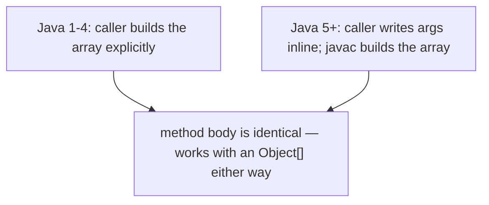
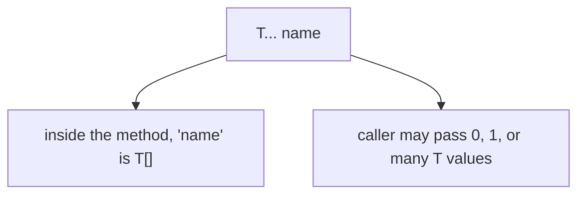
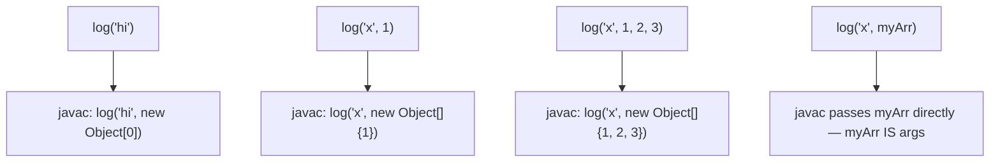
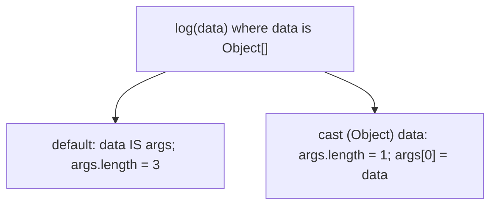
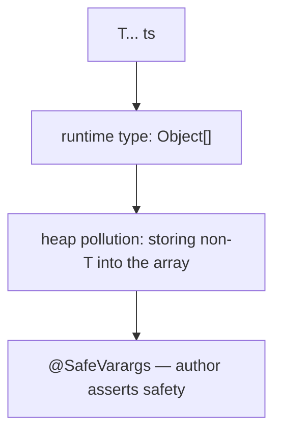
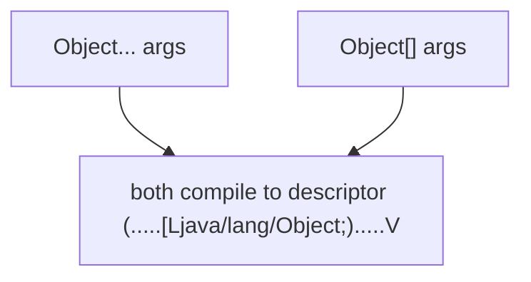
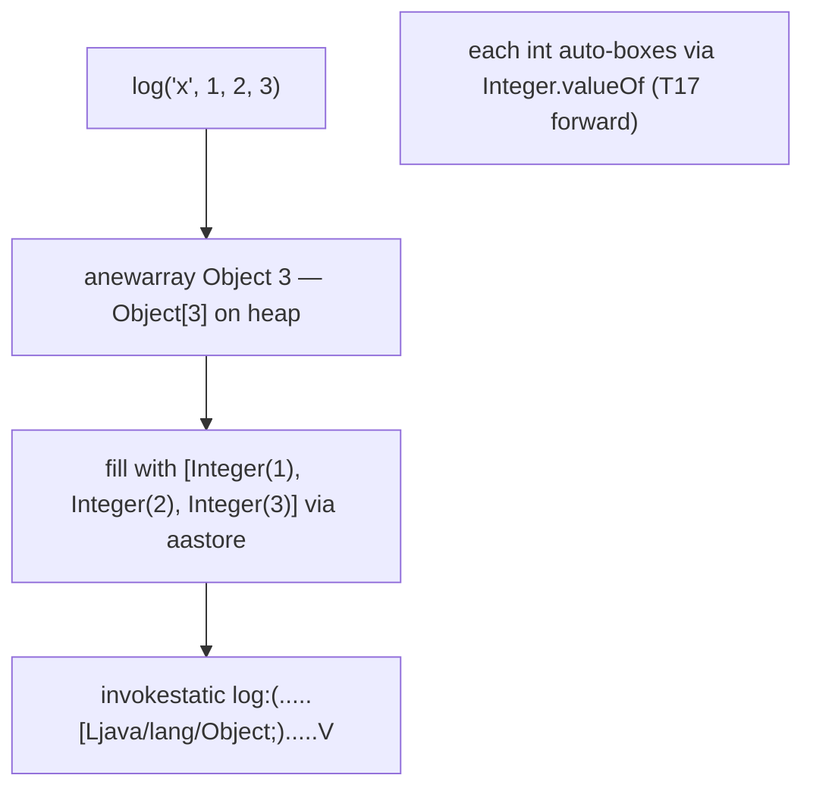
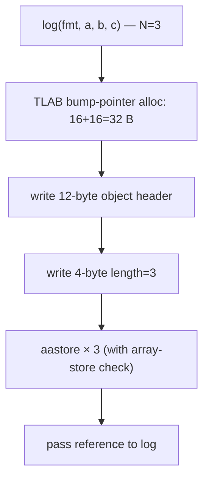
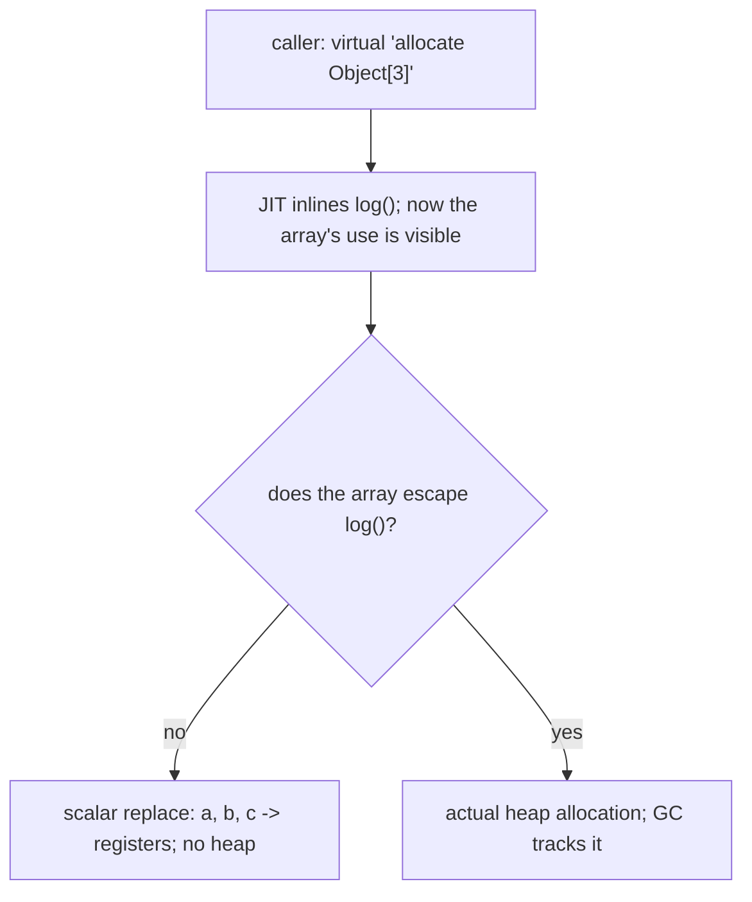
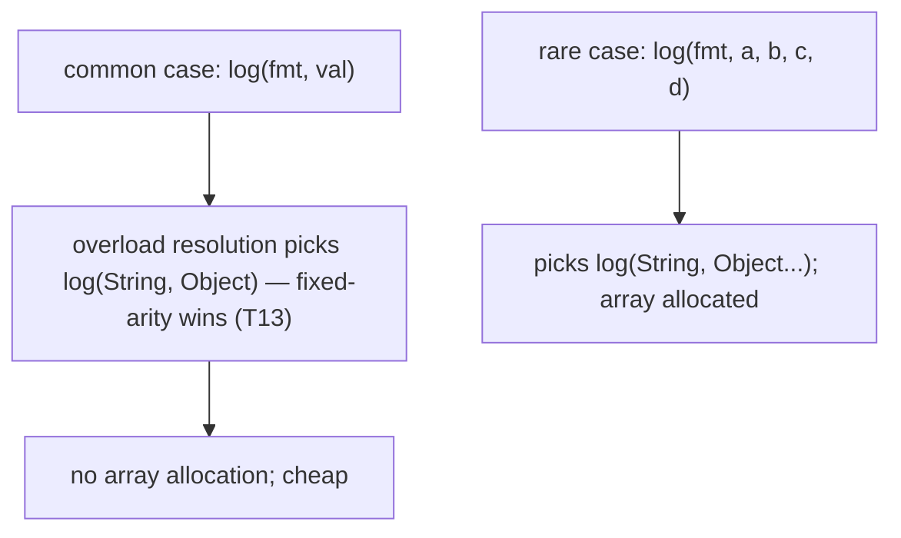

# Varargs

**Varargs** (variable-arity parameters, Java 5+) let a method accept **zero or more arguments** of a type without forcing the caller to wrap them in an array literal. `System.out.printf("%d %d %d", 1, 2, 3)` works because `printf` takes `Object... args`. `Arrays.asList(T...)`, `List.of(T...)`, `String.format(...)`, `Collections.addAll(c, T...)` — all use varargs.

The depth-bar requirement isn't just "show the `...` syntax." Varargs is **purely syntactic sugar** for an array parameter. `void log(String fmt, Object... args)` compiles to **exactly the same method** as if you had written `void log(String fmt, Object[] args)` — same bytecode, same descriptor `(Ljava/lang/String;[Ljava/lang/Object;)V`, same JVM behaviour. The only difference is an `ACC_VARARGS` flag in the method's access flags (for reflection) and a small piece of compiler magic at the **call site**: when the caller writes `log("hi", a, b, c)`, javac generates an `anewarray Object` + `dup` + `iconst_N` + `aastore` × 3 + `invokestatic` — i.e., **the caller allocates the array**, populates it, and passes it. This per-call allocation has real cost on hot paths. **Escape analysis** often eliminates it (scalar replacement); when it can't, common libraries provide **low-arity non-varargs overloads** (`log(String, Object)`, `log(String, Object, Object)`) to skip the array allocation in the common cases.

Two other subtleties earn their own depth: the **`Object[]` → `Object...`** rule (passing an array directly is treated as the array IS the varargs, NOT as one element — surprising for Java 5+ users and the source of T13's overloading-with-varargs cases); and **generic varargs** (`<T> List<T> of(T... ts)`), where the runtime array type erases to `Object[]` and storing a non-T into it can produce **heap pollution** — hence the `@SafeVarargs` annotation that suppresses the warning when the author has verified safety.

> [!NOTE]
> Prerequisites: [Arrays](./T11-arrays-1-d-multi-dimensional.md) (`L0/C02/T11`) — `Object[]` layout, `anewarray`, `aastore`, `ArrayStoreException`, covariance; [Methods, parameters, return values](./T12-methods-parameters-return-values.md) (`L0/C02/T12`) — method descriptors, parameter slots, `invoke*` opcodes; [Method overloading](./T13-method-overloading.md) (`L0/C02/T13`) — the resolution rule that fixed-arity beats varargs; the `Object[]`→`Object...` quirk first mentioned there; [Variable scope & lifetime](./T15-variable-scope-and-lifetime.md) (`L0/C02/T15`) — escape analysis as the EA-eliminates-the-array trick; [Source to Bytecode](../C01-cs-foundations/T04-source-to-bytecode-to-jvm-to-machine-code.md) (`L0/C01/T04`) — `.class` access flags, constant-pool method references.

## Why Varargs Exists

Before Java 5, "accept any number of arguments" meant accepting an array explicitly:

```java
// Pre-Java 5
void log(String fmt, Object[] args) { ... }

// Call site — annoying:
log("%d %d %d", new Object[]{1, 2, 3});
```

Java 5 added varargs as **caller-side syntactic sugar**: the caller writes the arguments inline; the compiler builds the array. The method body and signature are still "an array parameter":

```java
// Java 5+
void log(String fmt, Object... args) { ... }

// Call site — clean:
log("%d %d %d", 1, 2, 3);
```



The motivation was **`printf`-style APIs**: `System.out.printf("%d at %s", n, ts)` reads naturally as a function call with three args. Forcing `new Object[]{n, ts}` at every call site is ugly.

## Declaring a Varargs Method

The varargs parameter is written with `...` after the type:

```java
void log(String fmt, Object... args) {        // args is Object[]
    for (Object a : args) System.out.println(a);
}

int sum(int... xs) {                            // xs is int[]
    int total = 0;
    for (int x : xs) total += x;
    return total;
}
```



### Two Hard Rules

1. **The varargs parameter must be the *last* parameter** in the method's parameter list. Anything could follow it ambiguously.

```java
void f(int... xs, String s) { ... }            // COMPILE ERROR
void f(String s, int... xs) { ... }             // OK
```

2. **A method may have at most one varargs parameter.** (Trivially follows from rule 1.)

### Inside the method, it's just an array

```java
void log(Object... args) {
    System.out.println(args.length);            // it's an Object[]
    if (args.length > 0) System.out.println(args[0]);
    Arrays.sort(args, ...);                      // any array method works
}
```

The body uses `args` exactly as if you'd written `Object[] args`. There's no "varargs object," no "args list" — it's a plain array.

## Calling Varargs

Five forms:

```java
log("hi");                                     // 0 varargs args -> args is new Object[0]
log("x is %d", 1);                              // 1 vararg -> args is new Object[]{1}
log("%d %d", 1, 2);                              // 2 -> new Object[]{1, 2}
log("%d %d %d", 1, 2, 3);                        // N -> new Object[]{1, 2, 3}
log("done", new Object[]{1, 2, 3});              // pass an array directly — args = THAT array
```



For the last form, **the caller's array becomes the parameter array** — no extra allocation. The receiver gets a *reference* to the caller's array; mutation visibility (T12) means the receiver can modify it, and the caller will see the modifications.

### The `Object[]` → `Object...` Trap (Revisit From T13)

The "pass an array directly" form is the source of subtle surprise:

```java
void log(Object... args) { System.out.println(args.length); }

Object[] data = {1, 2, 3};
log(data);                                      // prints 3 — data IS the varargs array
```

Did the user mean "one element which happens to be an array" or "three elements"? Java chose: **for backward compatibility with pre-varargs `Object[]`-taking methods, the array IS the varargs**. The user got three elements.

To force "one element which is an array," **cast to `Object`**:

```java
log((Object) data);                             // args.length == 1; args[0] is the array
```



This rule is why `Arrays.asList(new Integer[]{1,2,3})` returns a `List<Integer>` of size 3 — the array is the varargs — but `Arrays.asList(new int[]{1,2,3})` returns a `List<int[]>` of size 1 — because `int[]` is **not** assignable to `Object[]` (generics-T is `Object`, not a primitive), so the whole `int[]` is treated as one element.

> [!IMPORTANT]
> Passing `T[]` directly to `T...` is treated as **the array IS the varargs**. The caller's array becomes the receiver's. To pass an array as a single element, cast to `Object` (or to the explicit array type when the varargs is `Object...`).

### Calling With `null`

```java
log(null);                                      // ambiguous — null as the array, or null as one element?
```

`null` is assignable to `Object[]`, so the call **passes `null` as the array**. Inside, `args` is `null`, and `args.length` throws **NPE**. To pass null as a single element:

```java
log((Object) null);                             // args.length == 1; args[0] = null
```

## Generic Varargs and Heap Pollution

When varargs is generic — `<T> List<T> of(T... ts)` — the underlying array's runtime type is **`Object[]`** (because of generics erasure — `T` becomes `Object` at runtime). This creates an opening for **heap pollution**:

```java
@SuppressWarnings("unchecked")
static <T> List<T> wrap(T... items) {
    return Arrays.asList(items);                 // items is actually Object[] at runtime
}

List<String> strings = wrap("a", "b");           // OK
Object[] poisoned = ...; poisoned[0] = 42;      // if you got at the array, you could store int!
```

The Java compiler warns on **generic varargs** declarations:

> warning: [unchecked] Possible heap pollution from parameterized vararg type T

To suppress when you've verified the array is used safely:

```java
@SafeVarargs
static <T> List<T> of(T... items) {              // suppresses the warning at the call site
    return Arrays.asList(items);
}
```

`@SafeVarargs` is **only** legal on `static`, `final`, or `private` methods (and record constructors) — those whose varargs implementation can't be overridden, so the author's safety analysis covers all calls.



Full coverage of erasure, heap pollution, and generics in L1/C02 and L2/C01.

## Overload Resolution and Varargs (T13 Callback)

T13 covered the rules. Recap:

- **Fixed-arity always beats varargs** when both apply. Adding a varargs overload to an API is safe — single-argument calls still hit the fixed-arity version.
- **Varargs vs varargs** — pick the most specific element type.
- **`Object[]` to `Object...`** — the array IS the varargs.

```java
void f(int x) { print("single"); }
void f(int... xs) { print("varargs"); }

f();                            // varargs (0 args)
f(5);                           // single (fixed-arity wins)
f(1, 2);                        // varargs (2 args)
```

## Memory Layer — Varargs IS an Array Parameter

This is the crucial part. **The varargs method's bytecode is identical to an array-parameter method's bytecode.**

### Method Descriptor — Same as `T[]`

Source:

```java
void log(String fmt, Object... args) { ... }
```

The method's descriptor in the `.class` file:

```
log : (Ljava/lang/String;[Ljava/lang/Object;)V
```

— exactly the same as if you had written:

```java
void log(String fmt, Object[] args) { ... }
```



### `ACC_VARARGS` Flag — The Only Difference

The method's `access_flags` in the `.class` file includes an extra bit, **`ACC_VARARGS`** (`0x0080`), for varargs methods. This flag:

- Tells **reflection** (`Method.isVarArgs()`) that the method was *declared* with varargs syntax.
- Tells the **compiler** that callers in this compilation unit should be allowed to use varargs call syntax.

At the **JVM bytecode-execution level**, `ACC_VARARGS` is **ignored**. The JVM treats the method as an ordinary array-taking method. The flag is a compile-time/reflective concern only.

### Call Site — javac Builds the Array

For `log("x", 1, 2, 3)`, javac emits:

```
 0: ldc            #2  // String "x"
 2: iconst_3            // 3 — the array length
 3: anewarray      #3  // class java/lang/Object — allocate Object[3]
 6: dup
 7: iconst_0
 8: iconst_1
 9: invokestatic   #4  // Integer.valueOf:(I)Ljava/lang/Integer;
12: aastore             // store at index 0
13: dup
14: iconst_1
15: iconst_2
16: invokestatic   #4
19: aastore
20: dup
21: iconst_2
22: iconst_3
23: invokestatic   #4
26: aastore
27: invokestatic   #5  // log:(Ljava/lang/String;[Ljava/lang/Object;)V
30: return
```



Three things happen at every varargs call site:

1. **Allocate** an `Object[]` of the right size on the heap (16-byte header + 4×N refs in compressed-oops mode + padding).
2. **Populate** it via N `aastore` instructions (each ~1 cycle + bounds check + array-store check).
3. **Autobox** each primitive (T17) — `Integer.valueOf(1)` etc. (often cached for small ints; otherwise a 16-byte `Integer` allocation each).

For our 3-arg call: **1 array allocation + 3 cached `Integer.valueOf` lookups + 3 stores**. ~150-200 cycles in the worst case, ~10-20 cycles if all the boxing is cache-hit and EA eliminates the array (next section).

### When the Caller Passes an Array — No Extra Allocation

```java
Object[] arr = ...;
log("x", arr);                       // javac emits no allocation; arr is the parameter
```

Bytecode:

```
 0: ldc            #2
 2: aload_1                          // load arr
 3: invokestatic   #5  // log:(Ljava/lang/String;[Ljava/lang/Object;)V
 6: return
```

This is why the `Object[]` → `Object...` rule matters at the bytecode level: javac avoids the allocation when an array is already in hand. The receiver gets a reference to the caller's array; aliasing semantics apply.

### Worked `javap -v` Showing `ACC_VARARGS`

```bash
$ javap -v MyClass | grep -A2 "log("
```

```
public static void log(java.lang.String, java.lang.Object...);
  descriptor: (Ljava/lang/String;[Ljava/lang/Object;)V
  flags: (0x0089) ACC_PUBLIC, ACC_STATIC, ACC_VARARGS
```

The flag `0x0080` (`ACC_VARARGS`) is OR'd with `ACC_PUBLIC` (`0x0001`) + `ACC_STATIC` (`0x0008`) = `0x0089`. The descriptor confirms the array parameter type.

## Architecture Layer — Per-Call Allocation and Escape-Analysis Rescue

### The Per-Call Array Allocation

At the call site, every varargs invocation **allocates a fresh array** on the heap:



For a hot path (say 1 million calls/sec to `log(fmt, x)`), this is **1 million `Object[1]` allocations/sec** — ~32 MB/sec of garbage. Not free.

### Escape Analysis to the Rescue

T15 introduced HotSpot's **escape analysis**: if the varargs array doesn't escape the called method (not stored in a field, not passed to a non-inlined callee, not returned), the JIT **scalar-replaces** it. The array's elements live in **registers or stack slots**; the array object **is never allocated on the heap**. Zero GC pressure.



For tight `log("debug %s", value)`-style calls where `log` is short and pure, EA typically succeeds and varargs cost is negligible.

EA **fails** when:

- The array (or one of its elements) is stored in a static or instance field.
- The array is returned from the called method.
- The called method isn't inlined (too large, megamorphic, polymorphic).
- The array is passed to a method whose body the JIT can't see.

For SLF4J-style asynchronous loggers that capture all arguments for delayed formatting, EA usually fails — the array (and its references) outlives the call.

### The Low-Arity-Overload Pattern (SLF4J / Log4j)

Real-world logging libraries provide **non-varargs overloads** for the common case of 1 or 2 arguments:

```java
public interface Logger {
    void info(String msg);                              // 0 args
    void info(String fmt, Object a);                    // 1 arg — no array
    void info(String fmt, Object a, Object b);          // 2 args — no array
    void info(String fmt, Object... args);              // 3+ args — varargs (array allocated)
}
```

The first three calls do **no allocation** for the arg list. Only 3+ args fall through to varargs and pay the array cost. This is why `slf4j-api` and `log4j-api` have those overloads — they don't trust EA to always succeed in user-app builds.



The cost: more API surface (more methods to maintain, more docs). But for a logger called billions of times per second across an app, the perf win matters.

### Hot-Path Benchmarks

Microbenchmark intuition (your numbers will vary):

| Case | Per-call cost |
|------|---------------|
| Fixed-arity `Object` overload | ~0 (call inlines; no allocation) |
| Varargs, EA succeeds | ~0 (allocation eliminated) |
| Varargs, EA fails (e.g., array escapes via async logger) | ~50-150 ns (allocation + zero-fill + ~3 stores) |

For a build where DEBUG logging happens 1 million times per second and EA fails, that's 50-150 ms/sec on logging alone. The fixed-arity overload eliminates it.

### `printf` and `String.format` Are Slow For Other Reasons Too

`String.format("%d, %s", i, s)` allocates *more* than the varargs array — it allocates a `Formatter`, parses the format string each call, allocates the result `String`. Hot-path formatting should use `StringBuilder` directly or pre-cache the format.

## Common Mistakes

### Forgetting Varargs Must Be Last

```java
void f(int... xs, String s) { ... }                // COMPILE ERROR
```

Re-order: `void f(String s, int... xs)`.

### Passing an Array Expecting One Element

```java
void log(Object... args) { System.out.println("args=" + args.length); }

Object[] data = {1, 2, 3};
log(data);                                          // prints "args=3" — surprised the developer
log((Object) data);                                  // prints "args=1"
```

Cast to `Object` if you really mean one element.

### Generic Varargs Without `@SafeVarargs`

```java
static <T> List<T> of(T... items) { return Arrays.asList(items); }
```

Compiles with a warning. Add `@SafeVarargs` (and verify the method is safe — doesn't write non-T into the array).

### Calling Varargs With `null`

```java
log(null);                                          // args is null! args.length throws NPE
log((Object) null);                                 // args is [null]; args.length is 1
```

Defensive coding in the receiver: `if (args == null) args = new Object[0];`.

### Expecting Varargs To Always Be Free

Without EA, every varargs call allocates. For very-hot logging paths, this matters. Use fixed-arity overloads (SLF4J pattern) or rewrite to avoid varargs.

### Storing the Varargs Array Externally

```java
static Object[] last;

void capture(Object... args) {
    last = args;                                    // ESCAPES — EA can't eliminate
}
```

Now every `capture` allocates. If you need this semantic (capturing for later replay), it's intentional; recognise the cost.

### Confusing `Object...` With `Object[]...`

`Object...` is `Object[]` at the bytecode level. `Object[]...` would be `Object[][]` — a method that takes any number of `Object[]` arguments:

```java
void f(Object[]... matrices) {           // varargs of Object[]
    for (Object[] m : matrices) {
        for (Object x : m) ...
    }
}
```

Rarely useful but legal.

### `Arrays.asList(int[])` Returning Size 1

T11 / T13 covered this. Varargs `<T>` cannot bind to a primitive; `int[]` is treated as one element of type `int[]`. Use `Arrays.stream(arr).boxed().toList()`.

> [!INTERVIEW]
> Varargs questions cluster around the syntactic-sugar nature and the perf cost.
>
> 1. **What's a varargs parameter?** A `T... name` declaration that lets callers pass 0+ arguments. The method body sees an array `T[]`.
> 2. **What's the bytecode for a varargs method?** Same as if you'd written `T[]`. The descriptor is the same. Only the `ACC_VARARGS` flag differs.
> 3. **How does the caller pass varargs?** javac allocates a `T[]` at the call site, populates it with the args, and passes it to the method.
> 4. **What's the runtime cost?** One array allocation per call (16 B header + N×ref or N×primitive bytes), N stores. Escape analysis can eliminate it.
> 5. **Where can varargs appear?** Last (and only last) parameter. At most one per method.
> 6. **What's the `Object[]` → `Object...` quirk?** Passing a `T[]` array directly to a `T...` parameter is treated as the array IS the varargs. Cast to `Object` (or wrapper type) to force single-element interpretation.
> 7. **What's `@SafeVarargs`?** A suppress-warning annotation on `static`/`final`/`private`/record-constructor methods with generic varargs, asserting the method is safe from heap pollution.
> 8. **Why does SLF4J provide low-arity non-varargs overloads?** To avoid the per-call array allocation for the common 1- or 2-argument logging case when EA can't help.
> 9. **What's the order rule in overload resolution?** Fixed-arity always beats varargs (T13).
> 10. **What happens for `log(null)` where `log(Object... args)`?** `args` is null; `args.length` throws NPE. Cast to `(Object)` for single-null.
> 11. **Can a method have two varargs parameters?** No — varargs must be last, and you can only have one last parameter.
> 12. **Is varargs syntactic sugar?** Yes — purely caller-side. The method body sees a normal array.

## Practice

1. **Declare and call.** Write `void log(String fmt, Object... args)`. Call with 0, 1, 2, and 3 args. Print `args.length` to confirm.
2. **`javap -v` ACC_VARARGS.** Compile a varargs method. Run `javap -v`. Find the flag `ACC_VARARGS` in the access flags. Confirm the descriptor is `(...)V` with `[Ljava/lang/Object;`.
3. **`javap -c` call site.** Compile a call `log("x", 1, 2, 3)`. Find the `anewarray`, the `aastore` x 3, and the `invokestatic`.
4. **Compare with explicit array call.** Compile `log("x", new Object[]{1, 2, 3})`. Find the **same** `anewarray` + `aastore` x 3 + `invokestatic`. Confirm bytecode is identical.
5. **Compare with array passed directly.** Compile `Object[] arr = ...; log("x", arr);`. Confirm bytecode is `ldc + aload_1 + invokestatic` (no allocation).
6. **`Object[]` → `Object...` quirk.** `log("x", new Object[]{1, 2, 3})` prints `args.length=3`. Add `(Object)` cast: `log("x", (Object) new Object[]{1, 2, 3})` prints `args.length=1`. Confirm.
7. **null trap.** `log(null)` — observe NPE on `args.length`. Cast to `(Object) null` to fix.
8. **Generic varargs warning.** Write `<T> void f(T... ts)`. Observe the unchecked-varargs warning. Add `@SafeVarargs` (on a `static`/`final`/`private` method) to suppress.
9. **`Arrays.asList(int[])` trap.** `Arrays.asList(new int[]{1,2,3}).size()` returns 1. Compare with `Arrays.asList(new Integer[]{1,2,3}).size()` returning 3.
10. **Per-call allocation cost.** Write a varargs method that returns `args.length`. Call it 100M times. Measure. Then write a fixed-arity overload `f(String, Object)` and call the same 100M times. Observe the speedup when EA fails (e.g., add `-XX:-DoEscapeAnalysis`).
11. **Escape analysis observation.** Run a varargs call with `-XX:+UnlockDiagnosticVMOptions -XX:+PrintEliminateAllocations`. Confirm the array is eliminated when non-escaping; confirm it's not when you assign `args` to a static field.
12. **SLF4J-style low-arity overload.** Implement `log(String)`, `log(String, Object)`, `log(String, Object, Object)`, `log(String, Object...)`. Test with 1, 2, 3, 4 args. Confirm overload resolution picks the fixed-arity ones for 1-2 args.
13. **Varargs in nested calls.** Write `printAll(Object... args) { for (Object a : args) print(a); }`. Now call `printAll(a, b, c)` from another method. Check `javap -c` confirms each call site allocates an array.
14. **Varargs vs generic overload ambiguity.** Declare `f(Object x)` and `f(Object... xs)`. Call `f(null)`. Predict and verify which is picked.
15. **Explain it back.** Trace `log("x", 1)` from source through (a) javac picks the varargs method; (b) emits `anewarray Object 1`, `aastore` with Integer.valueOf(1); (c) `invokestatic log:(Ljava/lang/String;[Ljava/lang/Object;)V`; (d) JIT inlines log, EA observes args doesn't escape; (e) array elided; field accesses → registers; effective cost ≈ 0.

## Recap

You should now be able to:

- Define **varargs** as a Java 5+ feature: declare a method's last parameter as `T... name` to let callers pass 0+ T values inline.
- Apply the **two hard rules**: varargs must be the **last** parameter, and a method can have at most **one** varargs parameter.
- Recall that inside the method body, the varargs parameter **is** a `T[]` — array-typed, with `.length`, iterable via `for-each`, indexable, sortable, etc.
- Call varargs methods in the five forms (0/1/2/N inline args, or an array passed directly), and recall the **`Object[]` → `Object...` rule** — passing an array directly means **the array IS the varargs**; cast to `Object` to force single-element interpretation.
- Diagnose the **`log(null)` NPE** — `null` is treated as a null array, not a single-null element; `args.length` throws NPE; cast to `(Object) null` to fix.
- Apply the **`@SafeVarargs`** annotation on `static`, `final`, `private`, or record-constructor generic-varargs methods to suppress the heap-pollution warning when the implementation is safe.
- Recall the **overload-resolution rule**: fixed-arity always beats varargs (T13); add a varargs overload safely; varargs-vs-varargs picks most specific element type.
- Confirm that at the **bytecode** level, a varargs parameter is **identical** to a `T[]` parameter — same method descriptor (e.g., `(Ljava/lang/String;[Ljava/lang/Object;)V`); the only difference is the `ACC_VARARGS` access flag (used by reflection's `Method.isVarArgs()` and by javac for call-site sugar; **ignored by the JVM at execution**).
- Trace the call-site code generation: for `log(fmt, a, b, c)`, javac emits `anewarray Object`, three `aastore` instructions (with autoboxing of any primitives), and `invokestatic log:(...[Ljava/lang/Object;).....V`.
- Recall the **per-call array allocation cost** at varargs call sites — `Object[N]` allocation + N stores + N possible autobox allocations; ~50-150 ns in the EA-fails case for small N.
- Explain how **escape analysis** can **eliminate the array allocation** when the array doesn't escape the called method (scalar replacement → fields in registers → zero GC pressure), and when it fails (array stored in a field, returned, passed to non-inlined call).
- Recognise the **SLF4J / Log4j low-arity-overload pattern** — providing fixed-arity `log(String, Object)`, `log(String, Object, Object)` overloads to **skip the array allocation** for the common 1- and 2-argument cases when EA can't help.
- Recall that **`String.format` and `printf` are slow beyond the varargs cost** — they allocate a `Formatter`, parse the format string each call, and allocate the result `String`. Hot-path formatting should use `StringBuilder` or pre-cache the format.
- Avoid the **common traps**: varargs not last (compile error), passing a `T[]` expecting it to be a single element, calling `log(null)` and hitting NPE, missing `@SafeVarargs` on a safe generic varargs (suppressable warning), assuming varargs is always free (it isn't without EA), storing the varargs array in a field (escapes → EA fails → allocation persists), `Arrays.asList(primitive[])` returning size 1.

## Next

Continue to [Wrapper classes & autoboxing](./T17-wrapper-classes-and-autoboxing.md).
