# Wrapper classes & autoboxing

Java has **two parallel type systems**: primitives (`int`, `long`, `double`, ...) and objects. Primitives are fast and compact (T02); the object world has uniform abstraction (every method takes `Object`, every generic uses `T`). The bridge between them is the **eight wrapper classes** — `Integer`, `Long`, `Double`, `Boolean`, `Character`, `Byte`, `Short`, `Float` — one for each primitive type — and the **autoboxing/unboxing** mechanism (Java 5+) that converts between them implicitly.

The depth-bar requirement isn't just "show `Integer x = 5`". Every wrapper class is a regular heap object — 16 bytes for `Integer` (12-byte header + 4-byte value field), 24 bytes for `Long`/`Double` (12 + 8 + 4 padding) — and **every autobox is potentially a heap allocation**. The JLS prescribes a **shared cache** for small Integer/Long/Boolean/Byte/Short/Character values — `Integer.valueOf(i)` for `-128 ≤ i ≤ 127` returns a **shared, cached** instance (revisit from T05); larger values allocate fresh. This cache is the source of the famous **`Integer == Integer` trap** — `valueOf(127) == valueOf(127)` is `true`, but `valueOf(128) == valueOf(128)` is `false`. `Float` and `Double` have **no** cache, so `Double.valueOf(0.0) == Double.valueOf(0.0)` is *always* false.

At the **bytecode** layer, every autobox compiles to `invokestatic Integer.valueOf:(I)Ljava/lang/Integer;`; every unbox compiles to `invokevirtual Integer.intValue:()I`. At the **architecture** layer, **escape analysis** can eliminate non-escaping wrapper allocations (just like StringBuilder, T07, and the varargs array, T16). When EA fails — e.g., a `Long` counter stored in a field, or a `List<Integer>` accumulating boxed values — autoboxing in hot loops becomes the **#1 Java performance trap**. A naive `Long counter = 0L; for (...) counter++` allocates **one Long per iteration**. The cures: `int`/`long`-typed locals, `IntStream`/`LongStream`/`DoubleStream` instead of `Stream<Integer>`, `OptionalInt`/`OptionalLong`, `LongAdder` for concurrent counters.

> [!NOTE]
> Prerequisites: [Variables & Primitive Types](./T02-variables-and-primitive-types.md) (`L0/C02/T02`) — the 8 primitives + their byte sizes; heap-object layout (12-byte header + alignment); compressed oops; [Type Conversion & Casting](./T05-type-conversion-and-casting.md) (`L0/C02/T05`) — autoboxing introduced; `IntegerCache.cache[i + 128]`; the wrapper byte sizes; [Strings & Text Blocks](./T06-strings-and-text-blocks.md) (`L0/C02/T06`) — `Integer.parseInt`/`Integer.toString`; [Arrays](./T11-arrays-1-d-multi-dimensional.md) (`L0/C02/T11`) — `int[]` vs `Integer[]` 5× memory blowup; [Methods, parameters, return values](./T12-methods-parameters-return-values.md) (`L0/C02/T12`) — argument widening, parameter types triggering boxing; [Method overloading](./T13-method-overloading.md) (`L0/C02/T13`) — widening beats boxing in overload resolution; [Variable scope & lifetime](./T15-variable-scope-and-lifetime.md) (`L0/C02/T15`) — escape analysis lifting allocations off the heap; [Varargs](./T16-varargs.md) (`L0/C02/T16`) — autoboxing happens at varargs call sites for primitives; [Source to Bytecode](../C01-cs-foundations/T04-source-to-bytecode-to-jvm-to-machine-code.md) (`L0/C01/T04`) — `.class` constant pool, `invokestatic`/`invokevirtual`.

## Why Wrappers Exist

Java's collections, generics, and most utility methods deal in `Object`. They cannot hold a `int` or `boolean` directly — they need a *reference* to an object. The wrapper classes give every primitive an object form:

| Primitive | Wrapper |
|-----------|---------|
| `byte` | `java.lang.Byte` |
| `short` | `java.lang.Short` |
| `int` | `java.lang.Integer` |
| `long` | `java.lang.Long` |
| `float` | `java.lang.Float` |
| `double` | `java.lang.Double` |
| `boolean` | `java.lang.Boolean` |
| `char` | `java.lang.Character` |

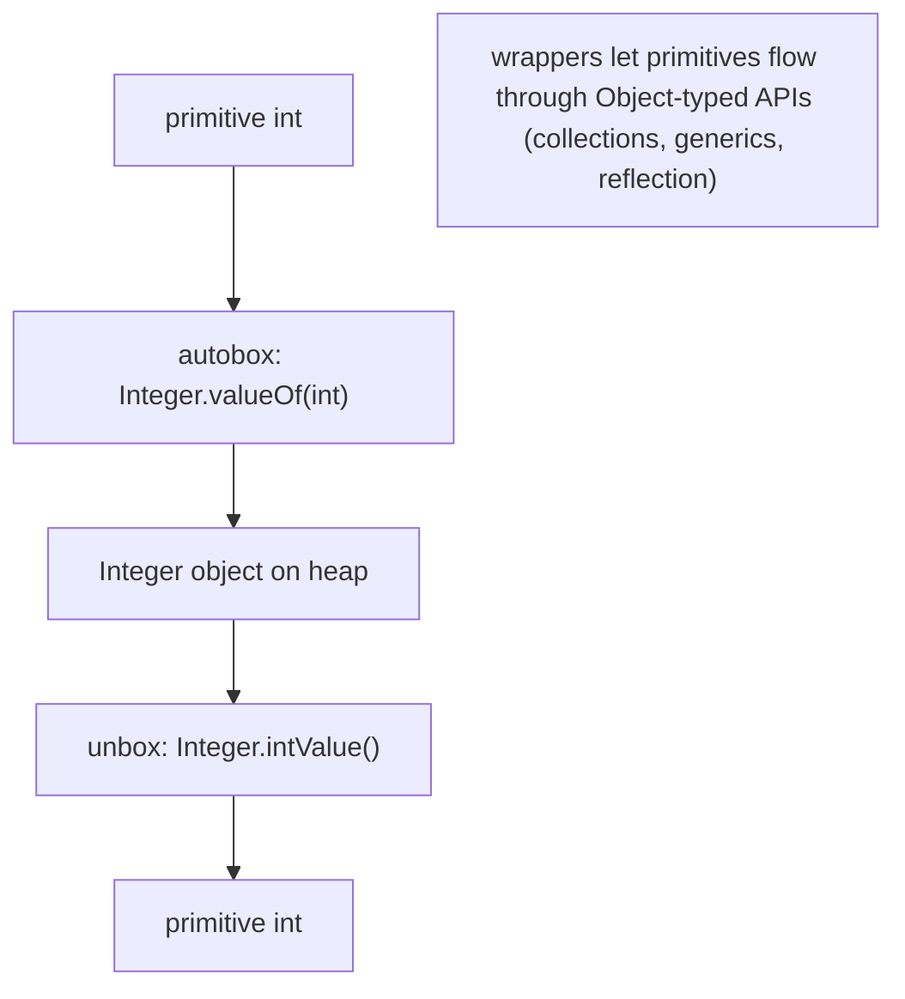

Without wrappers you couldn't say `List<int>` — generics can only hold reference types. With wrappers, `List<Integer>` works (you pay the boxing cost).

## The Wrapper Class Anatomy

Every wrapper is the same shape: **immutable**, **final**, with a single private value field.

```java
public final class Integer extends Number implements Comparable<Integer> {
    private final int value;

    private Integer(int value) { this.value = value; }     // private since Java 9+

    public static Integer valueOf(int i) {
        if (i >= IntegerCache.low && i <= IntegerCache.high)
            return IntegerCache.cache[i + (-IntegerCache.low)];
        return new Integer(i);
    }

    public int intValue() { return value; }
    public int compareTo(Integer other) { return value - other.value; }   // (with overflow guard)
    public boolean equals(Object o) { ... }
    public int hashCode() { return value; }
    // ... 100+ static utility methods (parseInt, toString, max, min, sum, ...)

    public static final int MAX_VALUE = 0x7fffffff;
    public static final int MIN_VALUE = 0x80000000;
    public static final int SIZE = 32;       // bits
    public static final int BYTES = 4;        // bytes
}
```

Three things to notice:

1. **`final` class.** You cannot subclass `Integer` — the JIT can rely on this.
2. **Single `int value` field.** The whole point.
3. **Constants `MAX_VALUE`, `MIN_VALUE`, `SIZE`, `BYTES`** — extensively useful in algorithms.

The other wrappers follow the same shape with their own primitive type. `Long`'s field is `long value`; `Boolean`'s is `boolean value`; etc.

### `Number` — the Numeric Superclass

The six numeric wrappers (`Byte`, `Short`, `Integer`, `Long`, `Float`, `Double`) extend the abstract `java.lang.Number`, which declares:

```java
abstract int    intValue();
abstract long   longValue();
abstract float  floatValue();
abstract double doubleValue();
```

So you can read a `Long` as an `int` (with truncation), an `Integer` as a `double` (with widening), and so on. `Boolean` and `Character` are **not** `Number` — they're independent.

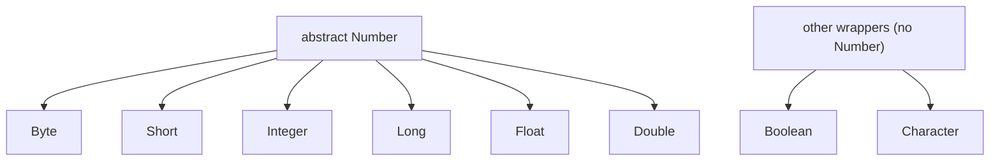

### `Character` — Letter, Digit, and Codepoint Helpers

`Character` carries the Unicode utility set: `isDigit`, `isLetter`, `isWhitespace`, `isLetterOrDigit`, `isUpperCase`, `isLowerCase`, `toUpperCase`, `toLowerCase`, `toString(char)`, `digit(c, radix)`. Used in tokenisers and parsers.

```java
if (Character.isDigit(c)) { ... }
char upper = Character.toUpperCase(c);
int d = Character.digit('A', 16);                 // 10 — 'A' in hex
```

### `Boolean` — Three Constants

`Boolean.TRUE`, `Boolean.FALSE`, and `Boolean.parseBoolean(String)` are the main things. `Boolean.valueOf(true)` returns the cached `TRUE`; `valueOf(false)` returns the cached `FALSE`. **Only these two instances exist** (in well-behaved code) — `Boolean.TRUE == Boolean.valueOf("true")` is *always* true.

## `valueOf` vs `new` — Always `valueOf`

Pre-Java 5, you wrote `new Integer(5)` to box. Java 9 **deprecated** the public constructors of all numeric wrappers; the constructors are still callable but warn. **Always use `valueOf` (or autoboxing, which compiles to `valueOf`)** instead:

```java
Integer good = Integer.valueOf(5);      // uses cache; may return shared instance
Integer good2 = 5;                       // autoboxing — compiles to the same valueOf call
Integer bad = new Integer(5);            // DEPRECATED; always allocates fresh; bypasses cache
```

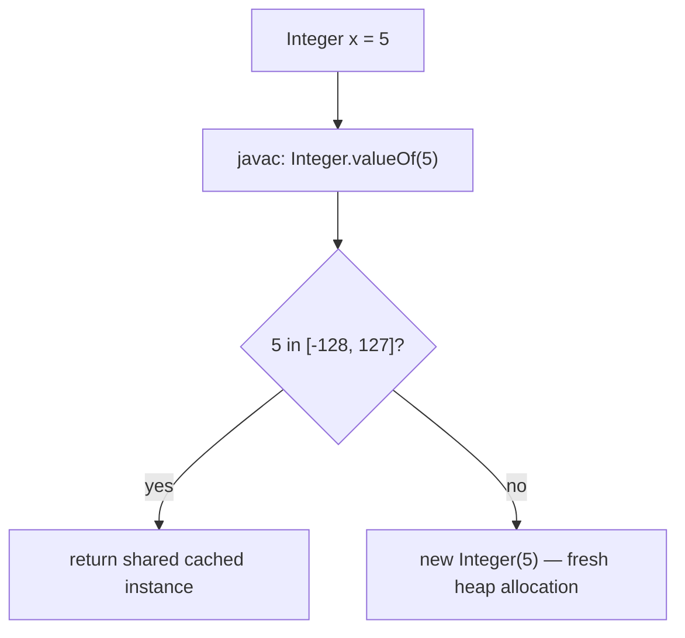

The cache pays off for small values; outside the cache, `valueOf` and the (deprecated) constructor are equivalent in cost.

## Autoboxing — When Java Calls `valueOf` For You

**Autoboxing** is the compiler implicitly inserting a `valueOf` call wherever a primitive flows into a reference context.

```java
Integer x = 5;                          // autobox: Integer.valueOf(5)

List<Integer> list = new ArrayList<>();
list.add(42);                            // autobox: list.add(Integer.valueOf(42))

void f(Object o) { ... }
f(7);                                    // autobox to Integer.valueOf(7)

Integer get() { return 0; }              // autobox at return

Integer counter = 0;
counter++;                                // unbox + add + autobox: valueOf(counter.intValue() + 1)
```

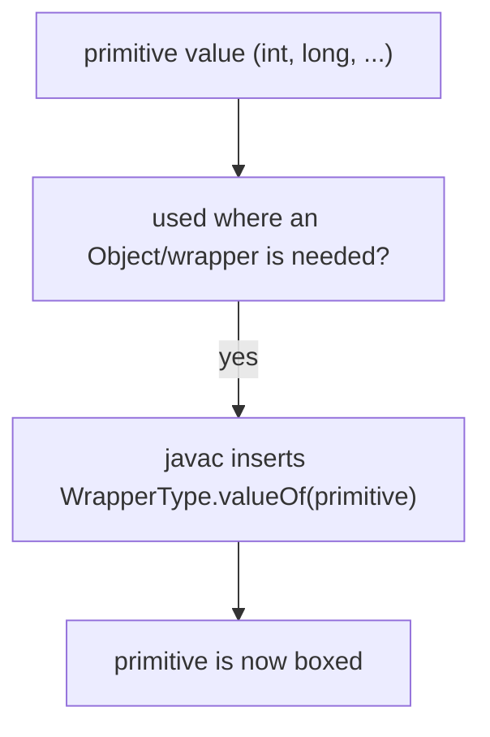

The contexts:

- **Assignment** to a wrapper variable: `Integer x = 5;`
- **Method argument**: `list.add(42)`, `f(Object)`
- **Return** from a method whose return type is the wrapper: `return 0;`
- **Generic type parameter**: `Map<String, Integer>`, `Optional<Integer>`
- **Arithmetic with mixed wrapper/primitive**: `Integer + int` → unbox + add + (no box for the int result unless reassigned)
- **Conditional with wrapper context**: `(true ? Integer.valueOf(1) : 2)` — the int 2 is autoboxed because the conditional's type is `Integer`

## Unboxing — When Java Calls `intValue` For You

The reverse direction: when a wrapper flows into a primitive context, javac inserts an `intValue`/`longValue`/etc. call.

```java
int x = Integer.valueOf(5);              // unbox: x = wrapper.intValue()

Integer w = 42;
int y = w + 1;                            // unbox: y = w.intValue() + 1

int sum = 0;
for (Integer i : list) sum += i;          // unbox each i

if (w > 0) { ... }                        // unbox to compare to int 0
```

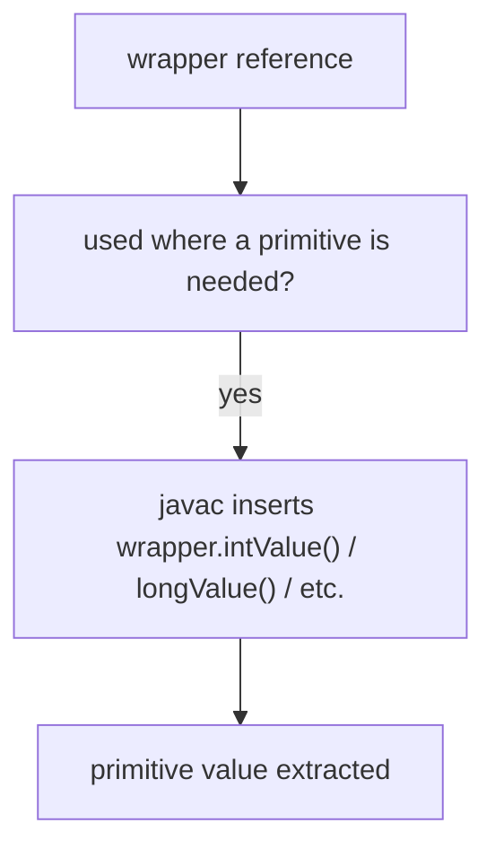

> [!WARNING]
> **Unboxing a `null` wrapper throws `NullPointerException`.** `int x = (Integer) null;` → `(Integer) null . intValue()` → NPE. Very common in `Map<K, Integer>` get-of-missing-key: `int v = map.get(key);` NPEs if the key is absent (returns null, which is then unboxed). Fix: use `Map.getOrDefault(key, 0)` or check explicitly.

## Memory Layer — Byte-Level Wrapper Layout

### `Integer` Object Layout

A boxed `Integer` is a regular heap object:

```
offset 0  +-----------------------------+
          | mark word (8 bytes)          |
offset 8  +-----------------------------+
          | klass pointer (4, compressed) |
offset 12 +-----------------------------+
          | int value (4 bytes)          |
offset 16 +-----------------------------+
                                          (no padding; already 16-aligned)
```

**Total: 16 bytes** per `Integer` (with compressed oops). Compare to the primitive `int`'s **4 bytes** in a frame slot or `int[]` — **4× the memory**, plus the indirection cost (the pointer to the `Integer` is another 4 bytes in compressed-oops, or 8 without).

### `Long` and `Double` — 24 Bytes

```
offset 0  | mark word                (8) |
offset 8  | klass pointer            (4) |
offset 12 | padding                  (4) |
offset 16 | long/double value        (8) |
offset 24 +-----------------------------+
```

**24 bytes** per `Long`/`Double`. The 4-byte padding after the klass pointer aligns the 8-byte value to an 8-byte boundary, which the JVM requires for `long`/`double` fields.

### Per-Wrapper Byte Totals

| Wrapper | Header | Value | Padding | Total |
|---------|--------|-------|---------|-------|
| `Boolean` | 12 | 1 | 3 | 16 |
| `Byte` | 12 | 1 | 3 | 16 |
| `Short` | 12 | 2 | 2 | 16 |
| `Character` | 12 | 2 | 2 | 16 |
| `Integer` | 12 | 4 | 0 | 16 |
| `Float` | 12 | 4 | 0 | 16 |
| `Long` | 12 | 8 | 4 (before value) | 24 |
| `Double` | 12 | 8 | 4 (before value) | 24 |

The header overhead **dominates** for the small wrappers — `Boolean` is **16× the size** of its 1-byte primitive!

### The `IntegerCache` — Sharing Small Values

The JLS requires `Integer.valueOf(i)` for `-128 ≤ i ≤ 127` to return a **canonical, cached** instance — and HotSpot's JDK implementation pre-allocates these 256 `Integer` objects at class init:

```java
private static class IntegerCache {
    static final int low = -128;
    static int high = 127;                          // may be raised by AutoBoxCacheMax
    static final Integer cache[];

    static {
        // initialise cache array
        int size = (high - low) + 1;
        cache = new Integer[size];
        int j = low;
        for (int k = 0; k < cache.length; k++)
            cache[k] = new Integer(j++);
    }
}

public static Integer valueOf(int i) {
    if (i >= IntegerCache.low && i <= IntegerCache.high)
        return IntegerCache.cache[i + (-IntegerCache.low)];
    return new Integer(i);
}
```

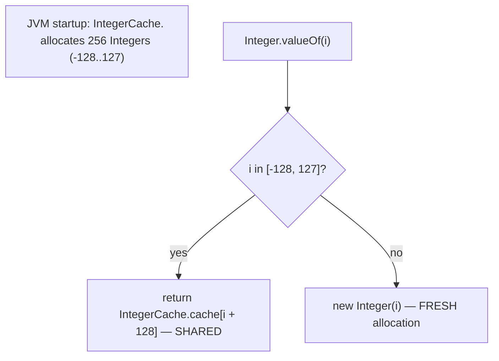

`-XX:AutoBoxCacheMax=N` raises the upper bound (default 127). The lower bound is fixed at -128. Useful for apps that frequently box values in 128-1000 range; rarely needed in modern code.

### Other Wrappers' Caches

| Wrapper | Cache range | Notes |
|---------|------------|-------|
| `Boolean` | only `TRUE` and `FALSE` | exactly 2 instances ever exist |
| `Byte` | all 256 values | trivially fits |
| `Short` | -128 to 127 | matches Integer's range |
| `Character` | 0 to 127 (ASCII) | |
| `Long` | -128 to 127 | |
| `Integer` | -128 to 127, raisable via `-XX:AutoBoxCacheMax` | |
| `Float` | **none** | every `Float.valueOf` allocates |
| `Double` | **none** | every `Double.valueOf` allocates |

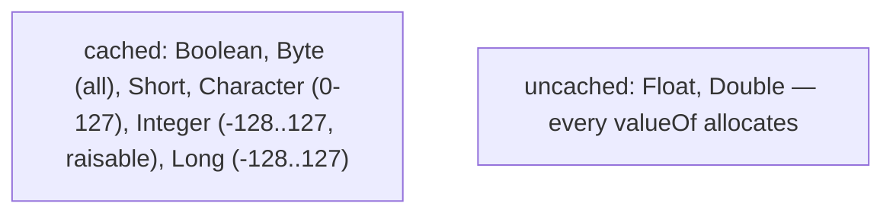

`Float` and `Double` don't cache because the values are dense — there's no useful finite range to pre-allocate.

### The `Integer == Integer` Cache Trap

The cache is the source of the most famous wrapper bug:

```java
Integer a = 127;
Integer b = 127;
System.out.println(a == b);              // TRUE — both refer to cached IntegerCache.cache[127+128]

Integer c = 128;
Integer d = 128;
System.out.println(c == d);              // FALSE — outside cache; separate allocations
```

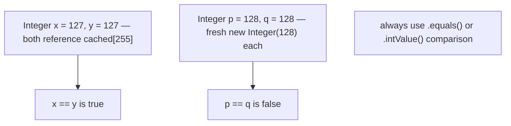

> [!IMPORTANT]
> **Never use `==` to compare wrapper values for logical equality.** Use **`.equals()`** for object equality of value, or unbox to primitives (`a.intValue() == b.intValue()` or `a == b.intValue()` triggering implicit unbox) for primitive comparison. The `==` operator on references is *identity*, and identity depends on cache state.

### Boxed-Container Memory Blowup (Revisit From T05, T11)

T05 and T11 quantified the cost: an `int[1_000_000]` is **~4 MB contiguous**; an `Integer[1_000_000]` (or `List<Integer>` of the same size) is **~20 MB scattered** — 5× memory and ~10× cache penalty:

```
int[1M]:       16 hdr + 4 bytes × 1M = ~4 MB, ONE allocation, contiguous
Integer[1M]:   16 hdr + 4 bytes × 1M refs       = 4 MB for the array
             + 1M × 16 bytes (Integer objects)  = 16 MB for the boxes (scattered)
             = ~20 MB total, 1,000,001 allocations
```

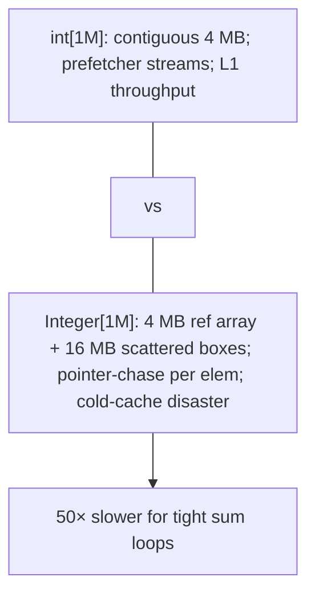

## Bytecode for Autoboxing and Unboxing

javac emits explicit method calls; there's no dedicated opcode for boxing.

### Autoboxing

Source:

```java
Integer x = 5;
```

Bytecode:

```
 0: iconst_5
 1: invokestatic   #2  // Method java/lang/Integer.valueOf:(I)Ljava/lang/Integer;
 4: astore_1
```

The `iconst_5` pushes the primitive `int`. `invokestatic Integer.valueOf:(I)Ljava/lang/Integer;` pops the int, returns the cached/fresh `Integer`, pushes the reference. `astore_1` writes it to slot 1.

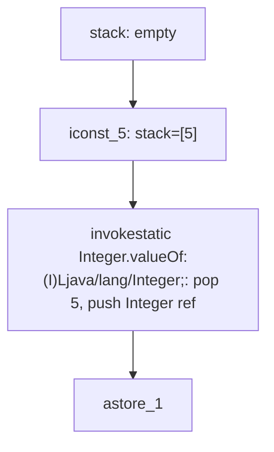

### Unboxing

Source:

```java
int y = x;                              // where x is Integer
```

Bytecode:

```
 0: aload_1                              // load x (Integer reference)
 1: invokevirtual  #3  // Method java/lang/Integer.intValue:()I
 4: istore_2
```

`invokevirtual Integer.intValue:()I` is the unbox call.

### Mixed Arithmetic — `counter++` on a Wrapper

Source:

```java
Integer counter = 0;
counter++;
```

Bytecode for the increment:

```
... (counter loaded from local) ...
 N: aload_1                              // counter (Integer ref)
 N+1: invokevirtual #_  // Integer.intValue:()I — UNBOX
 N+2: iconst_1
 N+3: iadd
 N+4: invokestatic  #_  // Integer.valueOf:(I)Ljava/lang/Integer; — RE-BOX
 N+5: astore_1
```

**One unbox + one increment + one re-box per `counter++`**. In a 100-million-iteration loop, this is 100 million `Integer.valueOf` calls — most cached (if the running counter stays in -128..127, but it won't if you're iterating to millions), most allocating fresh boxes.

> [!WARNING]
> **`Integer counter` in a hot loop is a perf disaster** — millions of `Integer` objects allocated per second, mostly outside the cache. Always use `int counter` or `long counter` for hot-loop counters.

## Architecture Layer — EA, Hot Loops, and the Specialised Streams

### Escape Analysis Eliminates Non-Escaping Boxes

Just like `StringBuilder` (T07) and the varargs array (T16), a boxed wrapper that **doesn't escape** its allocating method can be scalar-replaced:

```java
int compute(int a, int b) {
    Integer boxed = a + b;                // local Integer, doesn't escape
    return boxed;                          // unboxed at return; the box never appears in heap
}
```

After JIT + EA, the boxed allocation **vanishes** — the int value lives in a register. Effectively zero cost.

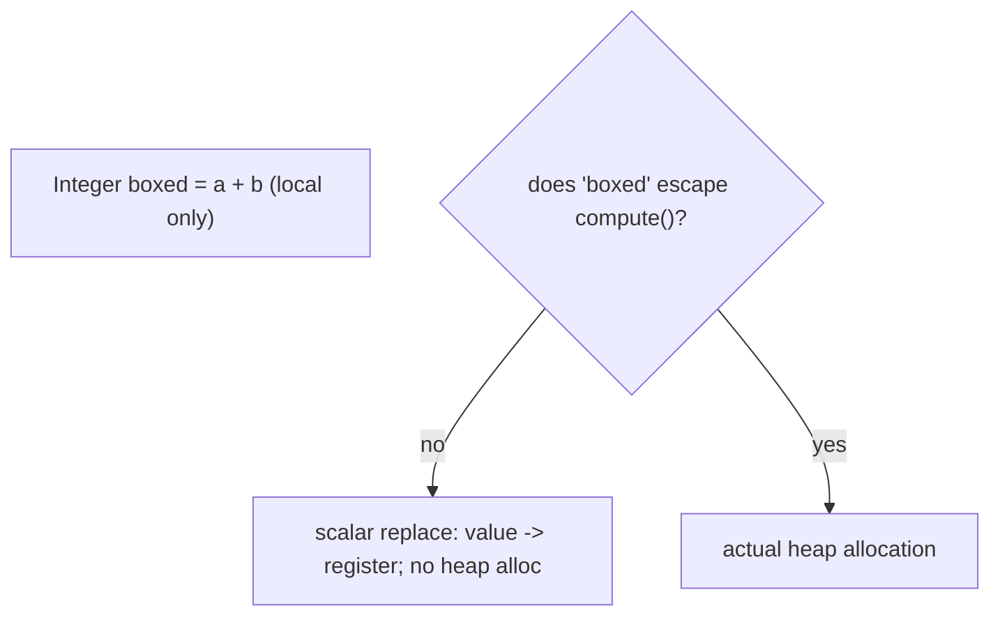

EA **fails** when:

- The box is stored in an instance/static field.
- The box is returned (as a reference, not unboxed-back).
- The box is added to a collection (`list.add(boxed)`).
- The box is passed to a megamorphic or non-inlined call.

### The #1 Java Performance Trap: Autoboxing in Hot Loops

The disaster case: a `Long` counter in a hot loop, where the box's existence is observable.

```java
Long counter = 0L;
for (int i = 0; i < 100_000_000; i++) {
    counter++;                            // unbox + add + REBOX every iteration
}
```

**100 million `Long` allocations** (each 24 bytes = 2.4 GB of garbage). GC pressure soars; the loop runs ~10-30× slower than `long counter`.

Fix: use the primitive:

```java
long counter = 0L;
for (int i = 0; i < 100_000_000; i++) {
    counter++;                            // single iinc-equivalent; no allocation
}
```

The `Long` form gets ~1 GB/s allocation rate; the `long` form is ~free.

### `Stream<Integer>` vs `IntStream` — the Same Trap at the Library Level

The Java 8 Streams API has both `Stream<T>` (generic) and **`IntStream`/`LongStream`/`DoubleStream`** (specialised primitive streams). The reason:

```java
Stream<Integer> generic = IntStream.range(0, 1_000_000).boxed();    // boxes every int
long sum = generic.mapToLong(i -> i + 1).sum();                       // unbox + box for each map
```

vs:

```java
long sum = IntStream.range(0, 1_000_000).mapToLong(i -> i + 1).sum(); // primitives throughout
```

The first form allocates ~1 million `Integer` and ~1 million `Long` objects. The second allocates ~0.

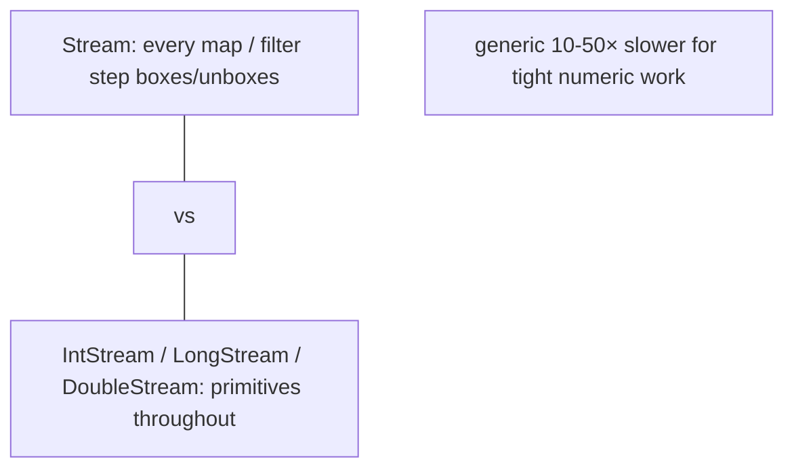

**Rule**: for numeric streams, use the specialised primitive streams (`IntStream`, `LongStream`, `DoubleStream`). Only when you must go through `Object`/`T` should you `boxed()` into `Stream<Integer>`.

### `Optional<Integer>` vs `OptionalInt`

Same idea — `OptionalInt`, `OptionalLong`, `OptionalDouble` exist as primitive-specialised alternatives to `Optional<Integer>` etc. Avoid the boxed `Optional` for hot numeric paths.

### `LongAdder` for Concurrent Counters

`AtomicLong.incrementAndGet()` uses a CAS loop on a single `long` field — fast under low contention; slow under high (cache-line ping-pong). `LongAdder` (Java 8+) stripes the counter across N pseudo-random cells, each a `long`, summed only on read. Wins under high contention.

A *boxed* concurrent counter — say, `AtomicReference<Long>` with CAS — is **disastrous** because the increment requires building a fresh `Long` for every CAS attempt. Always use primitive-specialised concurrent counters.

### `BigInteger` and `BigDecimal` Are Different

`java.math.BigInteger` and `BigDecimal` are **not** wrappers — they're arbitrary-precision numeric types. Every arithmetic operation **allocates a new object** (they're immutable). Fine for occasional arithmetic; ruinous in hot loops. Full coverage in L2/C01.

## Common Mistakes

### `Integer == Integer` Outside the Cache

The classic. `valueOf(127) == valueOf(127)` is true; `valueOf(128) == valueOf(128)` is false. Always `.equals()` or unbox.

### Autoboxing in a Hot Loop

```java
Long sum = 0L;
for (int i = 0; i < n; i++) sum += i;     // unboxes sum, adds, reboxes — n allocations
```

Use primitive `long sum`.

### NPE on Unboxing a `null` Wrapper

```java
Integer x = null;
int y = x;                                // NPE
```

```java
int v = map.get(key);                     // NPE if key absent (map.get returns null)
int safe = map.getOrDefault(key, 0);      // safe
```

### `==` on `Boolean.valueOf(...)` vs `Boolean.TRUE`

`Boolean.valueOf("true") == Boolean.TRUE` is true (only TRUE and FALSE exist), but it's still a bad pattern — use `.equals` or unbox.

### Deprecated `new Integer(5)`

Java 9+ deprecated `new Integer(int)` and the other wrapper constructors. Use `Integer.valueOf(5)` (or autoboxing `Integer x = 5`).

### `Map<K, Integer>` with `+=` Reads

```java
Map<String, Integer> counts = new HashMap<>();
counts.put("a", counts.get("a") + 1);     // NPE if "a" absent
```

Use `merge`:

```java
counts.merge("a", 1, Integer::sum);
```

Or `compute`, `getOrDefault(... 0) + 1`, then put.

### `Stream<Integer>` Instead of `IntStream`

```java
int sum = list.stream().mapToInt(Integer::intValue).sum();   // already a Stream<Integer> — boxing happened on .stream()
```

If `list` is `List<Integer>`, the boxes already exist. If you're starting from `int[]` or `IntStream.range`, stay in `IntStream`.

### `BigInteger` for Counters

`BigInteger counter = BigInteger.ZERO; counter = counter.add(BigInteger.ONE);` — each iteration allocates. Use `long` (or `BigInteger` only if you need precision beyond `long`).

### Mixing Wrapper and Primitive Types in Conditionals

```java
boolean b = (cond ? Integer.valueOf(1) : 2);
```

The ternary's type is `Integer`, so `2` is autoboxed even though `b` would unbox it back to `int`. Stick with one type.

### `Comparable<Integer>.compareTo` Subtraction Trap

```java
int compareTo(Integer other) { return value - other.value; }    // overflows for large opposite signs!
```

Use `Integer.compare(a, b)` which guards against overflow.

> [!INTERVIEW]
> Wrapper classes and autoboxing are perennial interview topics — the cache trap especially.
>
> 1. **What's the difference between `int` and `Integer`?** Primitive vs object. `int` is 4 bytes in a slot; `Integer` is a 16-byte heap object holding a 4-byte int.
> 2. **What's autoboxing?** Implicit primitive-to-wrapper conversion via `Integer.valueOf(int)` etc.
> 3. **What's the `Integer` cache range?** -128 to 127 by default. `Integer.valueOf(i)` in that range returns a shared cached instance.
> 4. **Why does `Integer.valueOf(127) == Integer.valueOf(127)` return true but `valueOf(128) == valueOf(128)` return false?** Cache hit returns shared instance for 127; outside cache, two separate allocations for 128 — `==` compares references.
> 5. **How to compare wrapper values?** `.equals()` or unbox and compare with `==` on primitives.
> 6. **What is `-XX:AutoBoxCacheMax`?** Raises the upper bound of `Integer.valueOf`'s cache (default 127). Helpful for apps that frequently box values past 127.
> 7. **Which wrappers don't have caches?** `Float`, `Double`. Every `valueOf` allocates a fresh object.
> 8. **How big is a `Long` object?** 24 bytes (12 header + 4 pad + 8 value).
> 9. **What's the bytecode for autoboxing?** `invokestatic WrapperType.valueOf:(P)LWrapperType;` where P is the primitive descriptor.
> 10. **What happens when you unbox a `null` wrapper?** NPE.
> 11. **Why is `Stream<Integer>` slower than `IntStream`?** Every operation in `Stream<Integer>` boxes/unboxes through `Integer` objects.
> 12. **What's the fix for autoboxing in hot loops?** Use primitive locals and primitive-specialised streams (`IntStream`/`LongStream`/`DoubleStream`); primitive-specialised optionals (`OptionalInt`); `LongAdder` for concurrent counters.

## Practice

1. **Wrapper anatomy.** Print `Integer.MAX_VALUE`, `MIN_VALUE`, `SIZE`, `BYTES`. Confirm 4 bytes for int, 8 for long, 4 for float, 8 for double.
2. **`Integer` cache trap.** `Integer a=127, b=127; Integer c=128, d=128;` Compare `a==b` and `c==d`. Confirm true/false.
3. **Cache extension.** Run with `-XX:AutoBoxCacheMax=500`. Repeat with 200 — confirm `200==200` becomes true.
4. **Wrapper memory measurement.** Use JOL to print the layouts of `Integer`, `Long`, `Boolean`, `Double`. Confirm 16/24/16/24-byte totals.
5. **Bytecode for autobox.** Compile `Integer x = 5;`. Run `javap -c`. Find `iconst_5 + invokestatic Integer.valueOf`.
6. **Bytecode for unbox.** Compile `int y = x;`. Find `aload + invokevirtual intValue`.
7. **Bytecode for `counter++` on wrapper.** Compile `Integer counter = 0; counter++;`. Find unbox + iadd + rebox sequence.
8. **Hot-loop perf trap.** Sum 100M ints with (a) `long sum` (primitive) and (b) `Long sum` (wrapper). Measure. Confirm wrapper is 10-30× slower.
9. **EA on short-lived box.** Write a method that creates a local `Integer`, uses it, returns the unboxed value. Run with `-XX:+PrintEliminateAllocations`. Confirm the box is eliminated. Then assign to a static field; re-run; confirm it survives.
10. **`Stream<Integer>` vs `IntStream`.** Sum 1M ints with `Stream<Integer>` (build by `boxed()`) and `IntStream`. Measure. Confirm `IntStream` is much faster.
11. **`Map.get` NPE trap.** Try `int v = map.get("missing");` where the map is empty. Catch the NPE. Fix with `getOrDefault`.
12. **`Map.merge` for counter.** Implement a word counter with `Map<String, Integer>`. Use `merge(k, 1, Integer::sum)`. Compare to the buggy `put(k, get(k) + 1)`.
13. **`Boolean` cache.** Confirm `Boolean.valueOf("true") == Boolean.TRUE`.
14. **`Float` no cache.** Confirm `Float.valueOf(0.0f) == Float.valueOf(0.0f)` is false.
15. **`Comparable.compareTo` overflow.** Write a `compareTo` using `a - b`. Test with `Integer.MIN_VALUE` and a positive — observe wrong result. Switch to `Integer.compare(a, b)`. Confirm.
16. **`AtomicLong` vs `LongAdder` under contention.** Two threads incrementing 10M times each. Measure with both. `LongAdder` wins.
17. **Explain it back.** Trace `Integer x = 5; Integer y = 5; boolean eq = (x == y);` from source through (a) two `valueOf(5)` calls both hit the cache, returning the same shared `Integer` reference; (b) `==` compares references — they're equal; (c) result is true. Then trace with 128 — confirm two fresh allocations, `==` false.

## Recap

You should now be able to:

- Recall the **eight wrapper classes** (`Byte`, `Short`, `Integer`, `Long`, `Float`, `Double`, `Boolean`, `Character`) — one per primitive type; six numeric wrappers extending `Number`; `Boolean` and `Character` independent.
- Recognise wrappers as **immutable**, **final** classes with a single private value field; their public constructors are **deprecated since Java 9** — use `valueOf` (which autoboxing compiles to) instead.
- Apply **autoboxing** — implicit `WrapperType.valueOf(primitive)` insertion at every primitive-to-reference context (assignment, method argument, return, generic, mixed arithmetic).
- Apply **unboxing** — implicit `wrapper.intValue()`/etc. insertion at every wrapper-to-primitive context — and recognise that **unboxing a `null` wrapper throws NPE** (very common in `Map.get`-of-missing-key).
- Predict **wrapper object sizes**: `Integer`/`Float`/`Boolean`/`Byte`/`Short`/`Character` = 16 bytes (12-byte header + value + padding); `Long`/`Double` = 24 bytes (12 + 4 pad + 8 value). The header overhead dominates for small wrappers.
- Recall the **`IntegerCache`** — `Integer.valueOf(i)` for `-128 ≤ i ≤ 127` returns a pre-allocated, shared instance; outside the range, a fresh allocation; **`-XX:AutoBoxCacheMax=N`** extends the upper bound.
- Recall the **other wrappers' caches**: `Boolean` (TRUE/FALSE only — 2 instances total), `Byte` (all 256 cached), `Short` (-128..127), `Character` (0..127 = ASCII), `Long` (-128..127). **`Float` and `Double` have no cache** — every `valueOf` allocates.
- Predict the **`Integer == Integer` cache-boundary trap**: `valueOf(127) == valueOf(127)` is true (cached); `valueOf(128) == valueOf(128)` is false (separate allocations). **Never use `==` to compare wrapper values for logical equality** — use `.equals()` or unbox.
- Recall the **`List<Integer>` 5× memory blowup** vs `int[]` (T11 callback) — array of refs + N scattered Integer objects vs contiguous int array — plus the cache-miss penalty (~50× slower for tight sum loops).
- Trace the **autobox bytecode** — `invokestatic WrapperType.valueOf:(P)LWrapperType;` — and the **unbox bytecode** — `invokevirtual WrapperType.intValue:()P` — where P is the primitive descriptor.
- Recognise `counter++` on a wrapper as **unbox + add + rebox** = 1 allocation per iteration (if outside cache) — the source of the **#1 Java performance trap**: autoboxing in hot loops.
- Apply **escape analysis** to non-escaping wrapper allocations — JIT scalar-replaces; the box vanishes; effectively zero cost (just like StringBuilder T07 and the varargs array T16).
- Use the **specialised primitive streams** (`IntStream`, `LongStream`, `DoubleStream`) and **primitive `Optional`s** (`OptionalInt`, `OptionalLong`, `OptionalDouble`) for numeric work; avoid `Stream<Integer>` for hot paths.
- Use **`LongAdder`** for high-contention concurrent counters rather than `AtomicLong` (full coverage in L3/C01); never use boxed `AtomicReference<Long>`.
- Distinguish **`BigInteger`/`BigDecimal`** from wrapper classes — arbitrary precision, every arithmetic allocates, fine for occasional use, ruinous in hot loops.
- Avoid the **common traps**: `Integer == Integer` outside cache, autoboxing in hot loops, NPE on unboxing `null`, deprecated `new Integer()`, `Map<K, Integer>` get-of-missing-key NPE, `compareTo` overflow via `a - b` subtraction, mixing wrapper and primitive types in conditionals (one autobox per branch), `Boolean.valueOf(s) == Boolean.TRUE` reference-comparison style.

## Next

Continue to [var (local variable type inference)](./T18-var-local-variable-type-inference.md).
