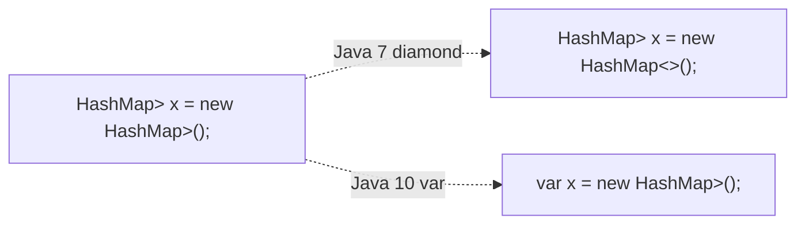
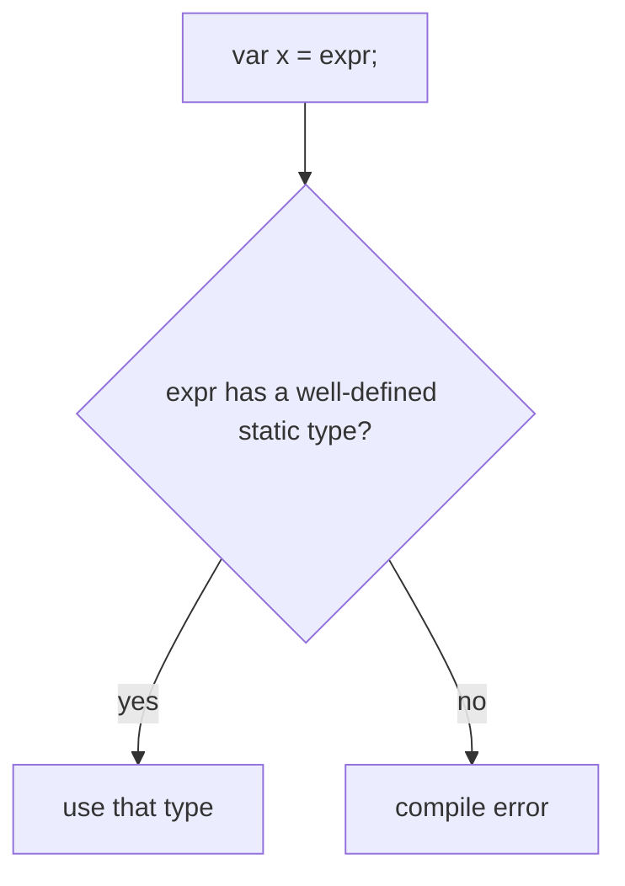
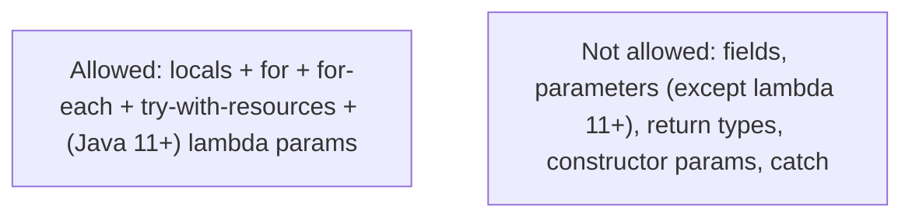
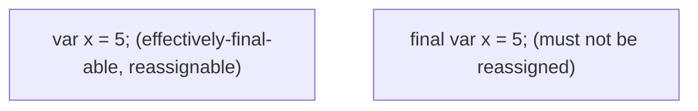
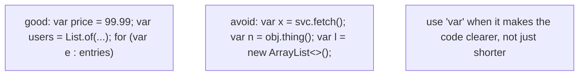
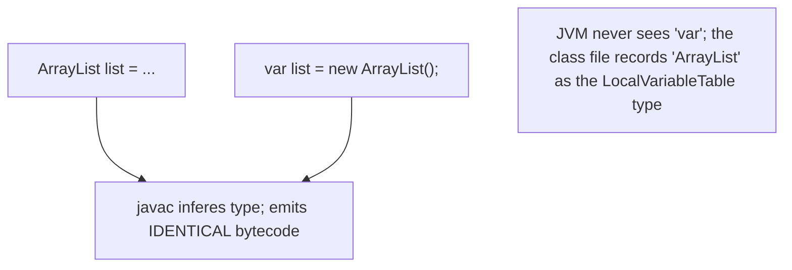

# var (local variable type inference)

Since Java 10 (JEP 286), you can write `var x = expr;` instead of `Type x = expr;` — the compiler **infers** the type from the right-hand side. It's a small but reach feature: `var list = new ArrayList<String>();` is shorter, cleaner, and just as type-safe as `ArrayList<String> list = new ArrayList<>();`. Java remains **strictly statically typed** — `var` doesn't introduce dynamic typing; it tells the compiler "I'm too lazy to repeat the type name; please look at the RHS."

The depth-bar requirement is short for this topic — `var` is **pure compile-time syntactic sugar with zero runtime cost**. The bytecode for `var list = new ArrayList<String>()` is **bit-identical** to `ArrayList<String> list = new ArrayList<>()` — the compiler infers the type, writes it into the `.class` file like any other type, and the JVM never sees `var`. So this topic is primarily about *when* to use `var` (the language rules and the style guidance), with a tighter under-the-hood section than usual.

> [!NOTE]
> Prerequisites: [Variables & Primitive Types](./T02-variables-and-primitive-types.md) (`L0/C02/T02`) — type system; [Type Conversion](./T05-type-conversion-and-casting.md) (`L0/C02/T05`) — what the inferred type is for primitives; [Methods, parameters, return values](./T12-methods-parameters-return-values.md) (`L0/C02/T12`) — why `var` is allowed in locals but not in parameters/returns; [Variable scope & lifetime](./T15-variable-scope-and-lifetime.md) (`L0/C02/T15`) — the LocalVariableTable that records the inferred type; [Wrapper classes & autoboxing](./T17-wrapper-classes-and-autoboxing.md) (`L0/C02/T17`) — `var x = 5;` infers `int`, not `Integer`.

## Why `var` Exists

Pre-Java 10, every local variable was declared with its explicit type:

```java
HashMap<String, List<Integer>> scoresByName = new HashMap<String, List<Integer>>();
```

The `HashMap<String, List<Integer>>` appears twice. Java 7's **diamond operator `<>`** reduced the RHS to `new HashMap<>()`, but the LHS still carried the verbose type. Java 10's `var` finishes the job:

```java
var scoresByName = new HashMap<String, List<Integer>>();
```



Same type-safety, less typing, often easier to read. The compiler reads the RHS, computes the type, and uses it everywhere the variable is referenced.

## The Rule — The RHS Must Determine the Type

`var` requires an **initialiser** that the compiler can statically type:

```java
var x = 5;                    // int
var s = "hi";                 // String
var list = new ArrayList<String>();           // ArrayList<String>
var pi = 3.14;                // double
var b = true;                 // boolean
var c = 'A';                  // char
```

If the RHS doesn't determine a unique type, `var` is illegal:

```java
var x;                         // COMPILE ERROR — no initialiser
var x = null;                  // COMPILE ERROR — null has no inferrable type
var x = {1, 2, 3};             // COMPILE ERROR — array literal without explicit type
```



The inferred type is the **static, compile-time** type of the RHS — exactly what `javac` would compute if you'd written the type yourself.

### What Type Does `var` Actually Infer?

The most-specific type the expression produces:

```java
var list = new ArrayList<String>();           // ArrayList<String> — NOT List<String>!
var io = new FileReader("f.txt");              // FileReader — NOT Reader, NOT InputStream
```

This can occasionally bite you when you want the more general type:

```java
ArrayList<String> list = new ArrayList<>();    // explicit — list is ArrayList
list = new LinkedList<>();                      // ERROR — can't assign LinkedList to ArrayList

List<String> list = new ArrayList<>();         // explicit — list is List
list = new LinkedList<>();                      // OK

var list = new ArrayList<String>();             // var infers ArrayList
list = new LinkedList<>();                      // ERROR — same as the first case
```

If you want polymorphism (assign different implementations to the same variable), don't use `var` — declare the type explicitly.

## Where `var` Is Allowed

`var` works **only in local-variable contexts**:

| Context | Allowed? |
|---------|----------|
| Local variable in a method body | yes |
| `for` loop counter (`for (var i = 0; ...)`) | yes |
| Enhanced-for variable (`for (var x : list)`) | yes |
| Try-with-resources (`try (var f = open())`) | yes |
| Method parameter | **no** |
| Method return type | **no** |
| Field (instance or static) | **no** |
| Constructor parameter | **no** |
| Lambda parameter (pre-Java 11) | **no** |
| Lambda parameter (Java 11+, JEP 323) | **yes** (with annotations) |
| Catch variable | **no** (the type is explicit syntactically) |



### `for` and `for-each`

```java
for (var i = 0; i < 10; i++) {     // i is int
    ...
}

for (var entry : map.entrySet()) {     // entry is Map.Entry<K, V>
    ...
}
```

The enhanced-for version is the strongest use case — it reduces the verbose `Map.Entry<String, List<Integer>>` to `var entry`.

### Try-With-Resources

```java
try (var input = new BufferedReader(new FileReader("data.txt"));
     var output = new PrintWriter(new FileWriter("out.txt"))) {
    // use input, output
}
```

Eliminates a fair amount of "I know it's a BufferedReader and a PrintWriter" repetition.

### Lambda Parameters (Java 11+, JEP 323)

```java
list.stream().map((var x) -> x.length());    // x is String (if list is List<String>)
```

The reason `var` was added to lambda parameters in 11: to allow **annotations** on lambda parameters (e.g., `(@NonNull var x) -> ...`). Without `var`, you'd have to write the explicit type to annotate (`(@NonNull String x)`), defeating the inference. **You cannot mix `var` and explicit types** in a single lambda's parameters.

### Why Not Fields?

A field's type is part of the **class's API** — visible to other classes, recorded in reflection, used by IDE refactoring. Inferring it from the initialiser would hide it; the API would be opaque without reading the implementation. JEP 286 explicitly excludes fields.

### Why Not Parameters and Returns?

The method's signature is its contract with callers. Hiding the parameter or return type behind `var` would make calling the method impossible to read without jumping to the implementation. Same reason — `var` is for local-scope inference, not API definition.

## `final var` and `var final`

You can combine `var` with `final`:

```java
final var x = 5;                  // final int
```



The `final` modifier and `var` are orthogonal — `final` controls re-assignability; `var` controls how the type is determined.

## `var` and Generics — the Diamond Gotcha

Combining `var` with the diamond `<>` creates an inference pitfall:

```java
var list1 = new ArrayList<String>();     // list1 is ArrayList<String>
var list2 = new ArrayList<>();            // list2 is ArrayList<Object> — NOT what you wanted!

List<String> list3 = new ArrayList<>();   // list3 is List<String> — diamond gets the hint from LHS
```

When both LHS and RHS need to figure out the type, **neither side has the information**. `var` requires the type from the RHS; the diamond requires the type from the LHS. With both, the diamond defaults to `Object`.

> [!WARNING]
> **Never combine `var` with diamond on the RHS.** Always provide the explicit generic type on the RHS when using `var`. `var list = new ArrayList<String>();` not `var list = new ArrayList<>();`.

## `var` with Wrapper Classes and Primitives (T17 Callback)

```java
var x = 5;                    // int — NOT Integer
var y = 5L;                   // long
var z = 5.0;                  // double — NOT Double
var b = true;                 // boolean

var w = Integer.valueOf(5);    // Integer (the expression is an Integer)
```

For primitive literals, `var` infers the **primitive type**, not the wrapper. Use explicit wrapper expressions to get a wrapper.

## Style Guidance — When to Use, When to Avoid

JEP 286 includes the official guidance. Summarised:

### Use `var` When

1. **The RHS makes the type obvious.**

```java
var price = 99.99;                          // double — obvious
var name = "Alice";                          // String — obvious
var users = List.of("a", "b", "c");         // List<String> — clear
```

2. **The explicit type would be redundant or noisy.**

```java
var scores = new HashMap<String, List<Integer>>();
```

3. **For-each loops with complex types.**

```java
for (var entry : eventsByHour.entrySet()) { ... }
```

### Avoid `var` When

1. **It hides a type the reader needs to see.**

```java
var result = fetchData();                    // what does fetchData return? unclear
```

2. **The type isn't obvious from context.**

```java
var x = Optional.empty();                    // is it Optional<String>? Optional<Object>? unclear
```

3. **You need the more general type.**

```java
var list = new ArrayList<String>();          // list is ArrayList — can't reassign to LinkedList
List<String> list = new ArrayList<>();       // list is List — flexible
```

4. **Primitive literals where the literal is small.**

```java
int count = 0;                                // arguably clearer than 'var count = 0;'
```



## Memory Layer — Zero Runtime Cost

This is the key fact: **`var` is pure compile-time syntactic sugar**. After compilation, the `.class` file contains the **inferred type**, not the word `var`. The bytecode is identical to writing the type explicitly.

### Bytecode Identity

Source A:

```java
ArrayList<String> list = new ArrayList<>();
list.add("hi");
```

Source B:

```java
var list = new ArrayList<String>();
list.add("hi");
```

Bytecode for both:

```
 0: new           #2  // class java/util/ArrayList
 3: dup
 4: invokespecial #3  // ArrayList.<init>:()V
 7: astore_1
 8: aload_1
 9: ldc           #4  // String "hi"
11: invokevirtual #5  // ArrayList.add:(Ljava/lang/Object;)Z
14: pop
15: return
```

**Bit-identical.** No new opcodes, no `var` keyword in the constant pool, no runtime behaviour change.



### The `LocalVariableTable` Records the Inferred Type

If you compile with `-g` (debug info), the `.class` file's `LocalVariableTable` (T15 callback) records the variable name + inferred type. `javap -v` of a `var` declaration shows the inferred type as if you'd written it explicitly:

```
LocalVariableTable:
  Start  Length  Slot  Name   Signature
      8       8     1  list   Ljava/util/ArrayList;
LocalVariableTypeTable:
  Start  Length  Slot  Name   Signature
      8       8     1  list   Ljava/util/ArrayList<Ljava/lang/String;>;
```

The `Signature` shows `ArrayList`; the `LocalVariableTypeTable` shows the parameterised `ArrayList<String>`. **Exactly what an explicit declaration would produce.**

### `var` Is a "Reserved Type Name," Not a Keyword

`var` is **not** a Java keyword — you can still use it as an identifier (variable name, method name, etc.):

```java
int var = 5;                                  // legal; var is a variable named 'var'
String var = "ok";                             // also legal
```

The compiler distinguishes between `var` the type-inference indicator (only in local-variable declaration positions) and `var` the identifier (everywhere else). This preserves backward compatibility — pre-Java 10 code that used `var` as a variable name still compiles.

The trick: `var` is a **reserved type name** — you cannot use it as a *type* name (you can't declare `class var { ... }`). But as a variable/method/parameter name it's still allowed.

## Architecture Layer — Nothing to See

There's literally nothing here. The JIT sees the inferred type just as it would see an explicit type. No new optimisations, no new behaviours, no perf implications. **`var` exists entirely at the compile-time level.**

## Common Mistakes

### `var x;` Without an Initialiser

```java
var x;                          // COMPILE ERROR — no initialiser to infer from
```

`var` requires an initialiser on the same line.

### `var x = null;`

```java
var x = null;                   // COMPILE ERROR — null has no inferrable type
```

Either use an explicit type or initialise to a typed value.

### `var x = new ArrayList<>();` (Diamond on RHS)

```java
var list = new ArrayList<>();    // list is ArrayList<Object> — type-info lost
```

Provide the explicit type on the RHS: `var list = new ArrayList<String>();`.

### Trying `var` for Fields

```java
class C {
    var x = 5;                   // COMPILE ERROR — var not allowed for fields
}
```

Use the explicit type. Fields' types are part of the class API.

### Trying `var` for Parameters or Return Types

```java
void foo(var x) { ... }          // COMPILE ERROR (pre-Java 11 or non-lambda)
var bar() { return 5; }          // COMPILE ERROR
```

Methods' signatures must be explicit.

### Expecting Polymorphic Reassignment

```java
var list = new ArrayList<String>();
list = new LinkedList<>();        // COMPILE ERROR — list is ArrayList, not List
```

Use the explicit interface type if you need polymorphism.

### Hiding the Type the Reader Needs

```java
var result = svc.fetch();         // reader has to navigate to svc.fetch() to know
```

Style choice — use `var` when the type is *obvious from context*, not when it actively obscures.

### Using `var` for Primitive Counters Where Explicit Reads Better

```java
for (var i = 0; i < 10; i++) { ... }    // var infers int — fine
int i = 0; ...                            // arguably clearer for tiny loops
```

Pure style. Pick one and be consistent.

> [!INTERVIEW]
> `var` interview angles are tight and focused.
>
> 1. **What's `var`?** Local variable type inference (Java 10+, JEP 286). Compiler infers the type from the RHS.
> 2. **Is `var` a keyword?** No — it's a "reserved type name." You can still use it as a variable/method/parameter name.
> 3. **Where is `var` allowed?** Locals, `for`, `for-each`, try-with-resources, lambda parameters (Java 11+).
> 4. **Where is `var` NOT allowed?** Fields, method parameters, return types, constructor parameters, catch.
> 5. **What's the inferred type for `var list = new ArrayList<>();`?** `ArrayList<Object>` — diamond inference can't fill in `String` without a LHS hint. Provide the type on the RHS.
> 6. **What's the bytecode for `var x = 5;`?** Identical to `int x = 5;`. `var` is pure compile-time sugar.
> 7. **Does `var` make Java dynamic?** No. Java remains strictly statically typed. The compiler determines the type at compile time.
> 8. **Why doesn't `var` work for fields?** Field types are part of the class API; readability across the codebase would suffer.
> 9. **What's `final var x = 5;`?** A final local with type inferred as `int`. `final` and `var` compose.
> 10. **`var x = null;` — does it compile?** No — null has no inferrable type.
> 11. **`var list = new ArrayList<String>(); list = new LinkedList<>();` — does it compile?** No. `list`'s type is `ArrayList`, not `List`. Use explicit type for polymorphism.
> 12. **Does `var` impact performance?** Zero impact. Pure compile-time.

## Practice

1. **Basic inference.** `var x = 5;`. Confirm it's `int` (use `x.getClass()` after autoboxing — careful — or use reflection / IDE inspection).
2. **String inference.** `var s = "hi";`. Confirm `String`.
3. **Generic list.** `var list = new ArrayList<String>();`. Add some strings. Confirm `list.getClass()` is `ArrayList`.
4. **Diamond-with-var trap.** `var list = new ArrayList<>(); list.add("hi");`. Print `list.get(0)`. Confirm it's typed as Object — IDE / reflection shows `ArrayList<Object>`.
5. **For-each with var.** Iterate `Map<String, List<Integer>>` using `var entry`. Confirm entry is `Map.Entry<String, List<Integer>>`.
6. **var in try-with-resources.** Use `try (var in = Files.newBufferedReader(path))`. Confirm `in` is `BufferedReader`.
7. **Field rejection.** Try `var` in a field. Confirm compile error.
8. **Parameter rejection.** Try `var` in a method parameter (non-lambda). Confirm compile error.
9. **Return-type rejection.** Try `var foo() { return 5; }`. Confirm compile error.
10. **`var` as a variable name.** Confirm `int var = 5;` compiles (var is a reserved type name, not a keyword).
11. **Bytecode identity.** Compile two classes — one with explicit type, one with `var`. Compare `javap -c` output. Confirm identical.
12. **LocalVariableTable inspection.** Compile with `-g`. `javap -v`. Find the `LocalVariableTable` and `LocalVariableTypeTable` entries. Confirm the inferred type is recorded.
13. **`final var`.** Declare `final var x = 5;`. Confirm `x` cannot be reassigned. Confirm it's `int`.
14. **Wrapper vs primitive.** `var x = 5;` vs `var y = Integer.valueOf(5);`. Confirm `x.getClass()` (after autoboxing) is `Integer.class`; `y.getClass()` is `Integer.class`. Confirm via bytecode that `x` is `int` and `y` is `Integer` (different `astore`/`istore`).
15. **Diamond fix.** Change `var list = new ArrayList<>();` to `var list = new ArrayList<String>();`. Confirm the inferred type changes from `ArrayList<Object>` to `ArrayList<String>`.
16. **Style judgment.** Take a 50-line method; identify which locals would be clearer with `var` and which would lose useful type info. Refactor accordingly.

## Recap

You should now be able to:

- Recall **`var`** as Java 10+ local variable type inference (JEP 286) — compiler infers the type of a local from its initialiser; **Java remains strictly statically typed** — `var` introduces zero runtime semantics, only compile-time syntactic sugar.
- Apply the **RHS-must-determine-type rule**: `var x = 5;` (int), `var s = "hi";` (String), `var list = new ArrayList<String>();` (ArrayList<String>); illegal: `var x;`, `var x = null;`, `var x = {1, 2, 3};`.
- Recall that **the inferred type is the most-specific static type of the RHS** — `var list = new ArrayList<String>()` infers `ArrayList<String>`, *not* `List<String>`; for polymorphic reassignment use explicit interface types.
- Use **`var` in the allowed contexts**: local variables, `for` counters, enhanced-for variables, try-with-resources, **lambda parameters (Java 11+, JEP 323 — required for annotations)**.
- Avoid `var` in the **disallowed contexts**: fields, method parameters (non-lambda), return types, constructor parameters, catch variables.
- Recognise the **diamond + var pitfall**: `var list = new ArrayList<>()` infers `ArrayList<Object>` — neither side provides the generic type; always specify the type on the RHS when using `var`.
- Combine `var` with `final` (`final var x = 5;`); the modifiers are orthogonal.
- Apply the **style guidance**: use `var` when the RHS makes the type obvious or when the explicit type is verbose/redundant; avoid when it hides important type info from a reader.
- Confirm at the **bytecode** layer that `var x = expr` is **bit-identical** to writing `Type x = expr` — same opcodes, same constant-pool entries, same `LocalVariableTable` entry recording the *inferred type*; **the JVM never sees `var`**.
- Recognise `var` as a **reserved type name** — not a keyword — so existing code using `var` as a variable/method/parameter name continues to compile.
- Recognise that there are **no architecture-layer effects** — `var` is pure compile-time sugar; the JIT sees the inferred type just as it would see an explicit type.
- Avoid the **common traps**: `var x;` without initialiser, `var x = null;`, `var list = new ArrayList<>()` defaulting to `Object`, trying `var` for fields/parameters/returns, expecting polymorphic reassignment with `var`, hiding important types behind `var` to the detriment of readability, primitive `var x = 5` vs wrapper `var x = Integer.valueOf(5)` confusion.

## Next

Continue to [Comments, Javadoc & code style](./T19-comments-javadoc-and-code-style.md).
