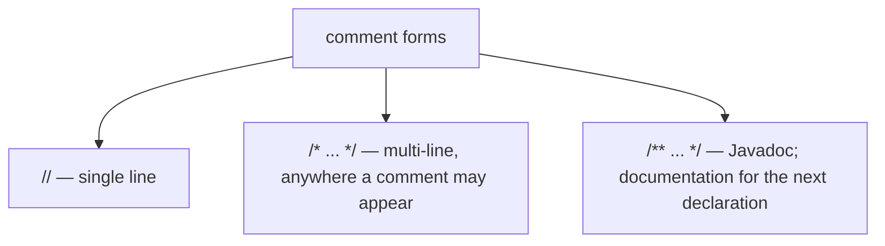
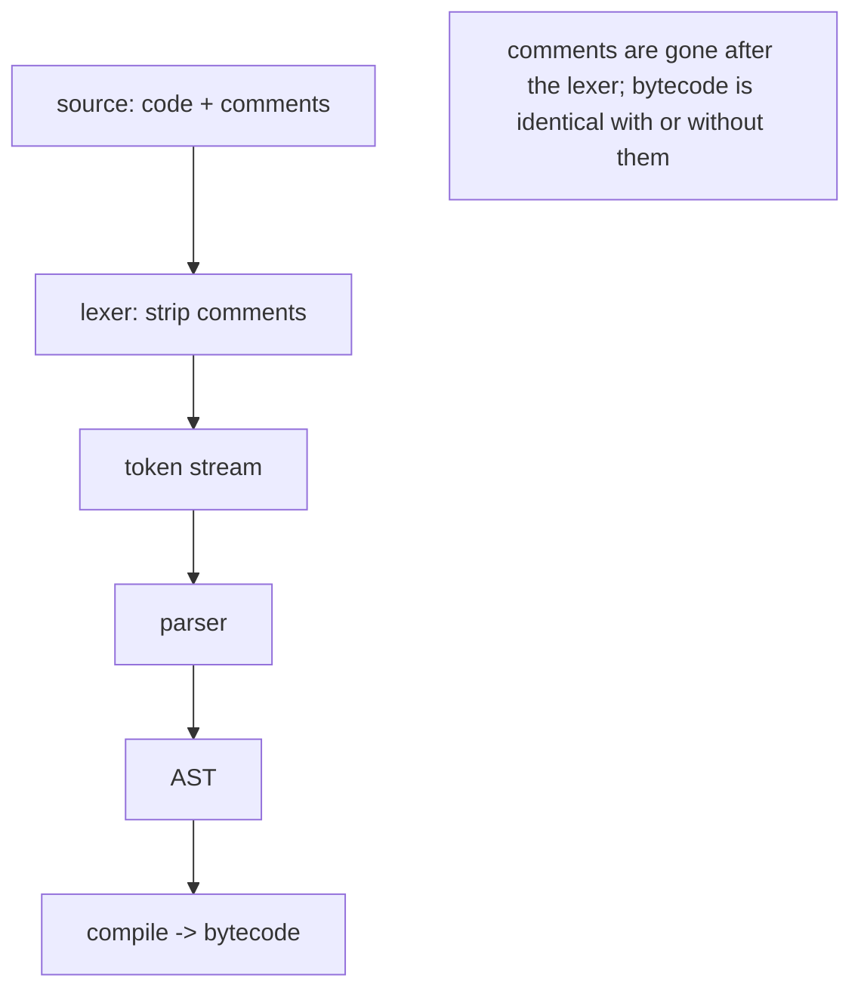
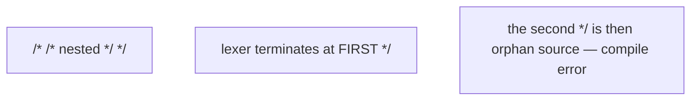
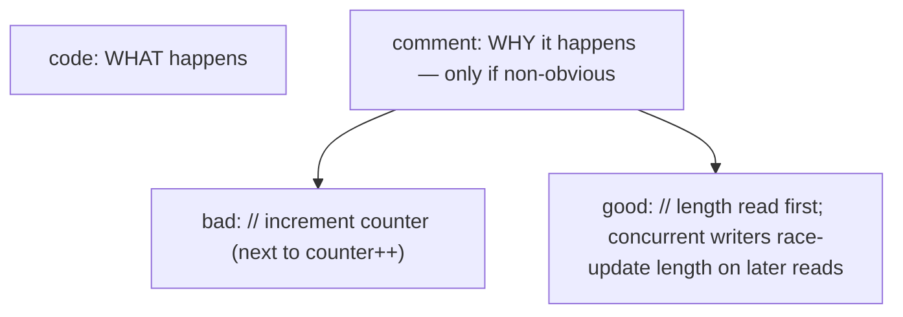
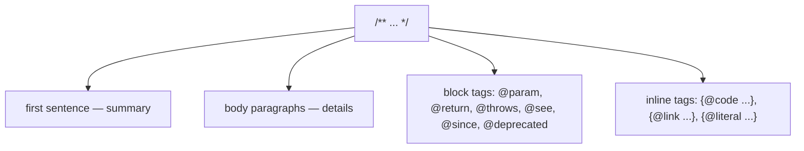
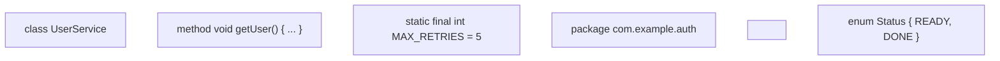
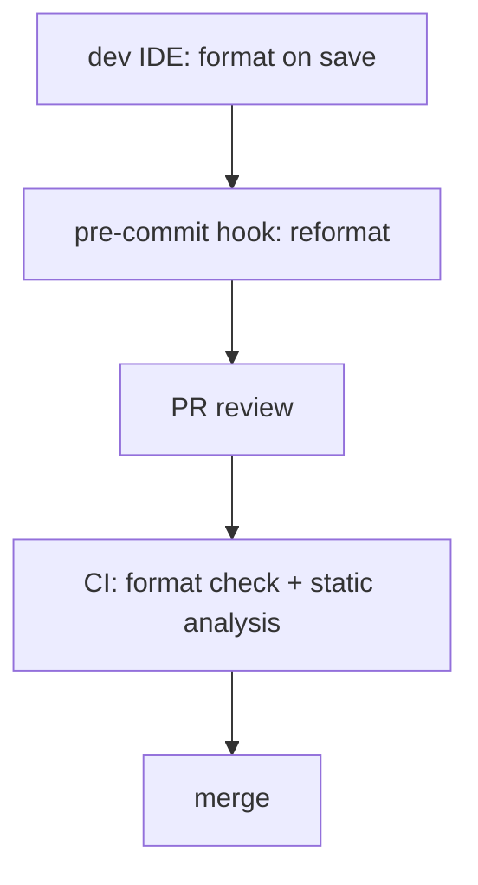
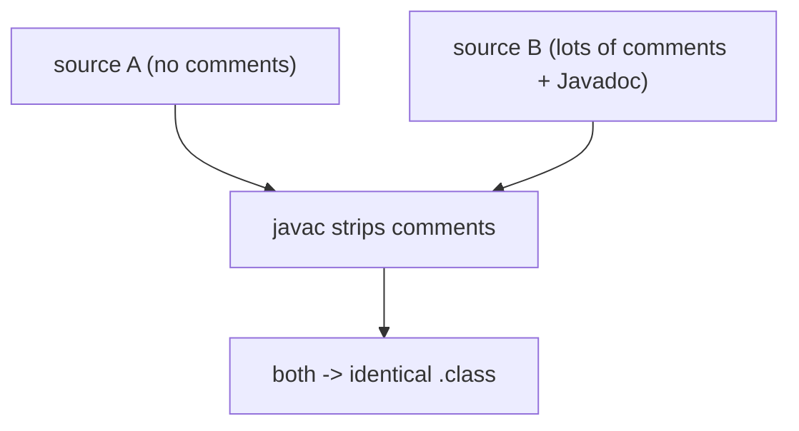

# Comments, Javadoc & code style

A program that runs correctly is only half the job. The other half is **a program someone else (including future-you) can read, understand, modify, and trust** six months from now. **Comments**, **Javadoc**, and a consistent **code style** are the surface that makes code maintainable — and the surface where careless choices age the codebase fastest. This topic closes L0 with the conventions that shape every Java file before the OOP topics in L1 introduce the *structures* you'll be commenting and styling.

The depth-bar requirement is right-sized here. Comments are **stripped at the lexer stage** (T03 callback) — they never appear in the bytecode and have **zero runtime cost**. Style decisions also have zero runtime impact. So the "under-the-hood" angle is short (and reassuring). The real depth is in **what makes a comment worth writing**, **what Javadoc looks like across the major doc tags**, **the Oracle/Google/team naming conventions** that have become near-universal in the Java ecosystem, and **the tooling** (checkstyle, spotbugs, google-java-format) that enforces all this in CI. Plus the famous lexer trick — `
` inside a `//` comment terminates the comment because Unicode escapes are processed *before* tokenisation.

> [!NOTE]
> Prerequisites: [Program Structure](./T01-program-structure-class-main-statements.md) (`L0/C02/T01`) — Java file structure where comments live; [Methods, parameters, return values](./T12-methods-parameters-return-values.md) (`L0/C02/T12`) — methods are the most common Javadoc target; [What Is a Programming Language; Compiled vs Interpreted](../C01-cs-foundations/T03-what-is-a-programming-language-compiled-vs-interpreted.md) (`L0/C01/T03`) — the lexer step that strips comments; [Source to Bytecode](../C01-cs-foundations/T04-source-to-bytecode-to-jvm-to-machine-code.md) (`L0/C01/T04`) — what's in the `.class` file (comments aren't).

## The Three Comment Forms

Java has three comment syntaxes:

```java
// Single-line comment — from // to end of line.

/* Multi-line comment — from /* to the next */
   spanning multiple lines if needed. */

/** Javadoc comment — special multi-line form recognised by the javadoc tool.
 *  Generally placed immediately above a class, interface, method, field, or
 *  package declaration.
 */
```



### The Lexer-Strips-Comments Rule (T03 Callback)

Comments are removed by the **lexer** (the first phase of `javac`) before tokenisation. By the time the parser runs, the comments are gone. They have **zero presence** in the resulting `.class` file (with one tooling exception: some annotation processors and IDEs preserve specific doc-comment forms as side artefacts; the bytecode itself never has them).



### The Famous Unicode-Escape-In-Comment Trap

T03 mentioned this lexer order: **Unicode escapes (`\uXXXX`) are processed BEFORE the lexer scans for tokens or comments**. So you can hide source code inside what looks like a comment, by writing a newline as `
`:

```java
// This is a normal comment 
 System.out.println("PWNED!");
```

The `
` is processed *before* the lexer sees the `//`. The lexer sees:

```
// This is a normal comment
System.out.println("PWNED!");
```

— a comment that terminates at the (Unicode-escaped) newline, followed by a real `println`. The "comment" *executes code*.

This is a quirky, occasionally-used javac hack — and the reason linters warn on Unicode escapes outside string literals. **Don't put `
` in your comments. Don't put `\u` escapes anywhere except inside string literals.**

### Nesting Rules

- `//` comments can contain anything (including unbalanced `/*`).
- `/* ... */` comments **do not nest** — `/* outer /* inner */ outer */` ends at the first `*/`.
- Javadoc `/** ... */` is just `/*` with an extra `*` — same non-nesting rule.



## Why and When to Comment

A comment isn't free — it's another sentence the next reader has to evaluate for accuracy. The single principle:

> **Default to writing no comments. Add one only when it explains WHY, not WHAT, and the WHY isn't already obvious from the code.**

(This is the rule the CLAUDE.md root convention encodes for every codebase in the book.)



### What Makes a Good Comment

- Explains a **non-obvious why**: a workaround for a specific bug, a constraint imposed externally, a chosen trade-off, a historical decision that still matters.
- References **external context** the reader can't see: a ticket, a JIRA number, an upstream issue, a hardware quirk.
- Documents a **subtle invariant**: "this method assumes `list` is sorted by id ascending."
- Flags **deliberate non-idiomatic code**: "manual loop instead of `Arrays.stream(...).sum()` because EA fails here at scale; saw 30 % regression."

### What Makes a Bad Comment

- Restates the code (`// increment i` next to `i++`).
- Lies about what the code does (the code has changed; the comment hasn't).
- Apologises for the code without fixing it (`// TODO: refactor this someday`).
- Sells nervous fluff (`// We need to do this. It is important.`).
- Identifies the author or date (use git blame).
- Commented-out code (use git history; delete the dead lines).

```java
// BAD: redundant restatement
counter++;                              // increment counter

// BAD: lies
total = price * (1.0 - discount);       // add the tax

// BAD: useless apology
// FIXME: refactor this whole thing.

// GOOD: non-obvious why
// IDs ≥ 1_000_000 are reserved for system accounts (per RFC 4179 § 3.2)
if (id >= 1_000_000) return systemAccountFor(id);
```

### Comment WHEN You Choose Non-Obvious Code

The single highest-leverage spot for a comment is right where you chose to do something *surprising*. The comment makes the surprise less expensive for the reader.

```java
// Using a HashMap (not a TreeMap) even though ordering matters elsewhere:
// keyset is built once into a sorted ArrayList at endpoint registration
// and re-used. Profiled vs TreeMap; HashMap won by 3x on get() in this hot path.
private final Map<String, Endpoint> endpoints = new HashMap<>();
```

The code itself just declares a map. The comment tells the reader why it's the *right* map.

## Javadoc

**Javadoc** is a structured doc comment (`/** ... */`) recognised by the `javadoc` tool, the IDE on hover, and the Java ecosystem generally. It produces an HTML reference site — same format as the official Java API docs — and is the **API documentation** for a class, interface, method, or field.

### Anatomy

```java
/**
 * Computes the gross-to-net conversion at the given tax rate.
 *
 * <p>The conversion is exact for finite, non-negative inputs. For
 * negative {@code gross}, the result is symmetrically negative.
 *
 * @param gross the gross amount; must be finite (not NaN, not infinite)
 * @param rate the tax rate in [0.0, 1.0]
 * @return the net amount {@code gross * (1.0 - rate)}
 * @throws IllegalArgumentException if {@code rate} is outside [0.0, 1.0]
 *         or {@code gross} is NaN
 * @since 1.0
 * @see TaxRules#applicableRate(Country)
 */
public double net(double gross, double rate) { ... }
```

Five things to notice:

1. **First sentence** (up to the first `.`) is the **summary** — used in lists and overviews. Keep it short and complete.
2. **Body paragraphs** use `<p>` to separate (Javadoc is HTML).
3. **`@param`** documents each parameter, in declaration order.
4. **`@return`** documents the result (omit for `void`).
5. **`@throws`** documents each checked + significant unchecked exception.
6. **`@since`** records when the API was added.
7. **`@see`** cross-references another API.



### Standard Block Tags

| Tag | Where | Purpose |
|-----|-------|---------|
| `@param <name> <desc>` | methods, constructors, generic types | document a parameter |
| `@return <desc>` | methods (non-void) | document the result |
| `@throws <Exc> <desc>` | methods, constructors | document an exception thrown |
| `@see <ref>` | anywhere | cross-reference |
| `@since <version>` | anywhere | record introduction version |
| `@deprecated <reason>` | deprecated APIs | document deprecation + alternative |
| `@author <name>` | classes (often skipped per team policy) | record original author |
| `@version <version>` | classes (often skipped) | record version (often unused) |
| `@serial`, `@serialField`, `@serialData` | Serializable types | document serialisation contract |

### Standard Inline Tags

| Tag | Renders as |
|-----|-----------|
| `{@code text}` | text in monospaced font (no further Javadoc/HTML interpretation) |
| `{@link Type#method}` | hyperlink to another API element |
| `{@linkplain Type#method label}` | like `@link` but plain text label |
| `{@literal text}` | text shown literally (no HTML interpretation) — useful for `<>` |
| `{@value FIELD}` | inline the field's constant value |
| `{@inheritDoc}` | inherit text from a superclass/interface method |

### HTML in Javadoc

Javadoc is HTML — you can use `<p>`, `<ul>`/`<li>`, `<pre>`, `<code>`, `<em>`, `<strong>`, `<a href="...">`. Most teams keep it minimal (`<p>` for paragraphs; `{@code}` for code).

```java
/**
 * Returns a sorted, immutable copy of {@code source}.
 *
 * <p>Equal-by-{@code compareTo} elements retain their relative order.
 *
 * @param source the input; not modified
 * @return a new {@code List<T>} sorted by natural ordering
 */
```

### When to Write Javadoc

**Always**: every `public` and `protected` member of a library or shared codebase. Reasoning: someone outside your file will read it without seeing the implementation.

**Often**: package-private and `private` members in a long-lived codebase, especially when the WHY is subtle.

**Never**: trivial accessors (`getX`/`setX` that obviously return/set the field), test methods, generated code.

### `package-info.java` and `module-info.java`

Package- and module-level Javadoc lives in dedicated files:

```java
// src/com/example/auth/package-info.java
/**
 * Authentication primitives.
 *
 * <p>This package provides token validation, session management, and
 * password hashing. See {@link com.example.auth.Authenticator} for
 * the main entry point.
 *
 * @since 2.0
 */
package com.example.auth;
```

```java
// module-info.java (Java 9+, JPMS)
/**
 * The authentication module.
 */
module com.example.auth {
    exports com.example.auth;
    requires java.base;
}
```

Both files compile but contain only the comment + the package/module declaration; they're picked up by `javadoc` as the package/module's documentation.

## Code Style — The Conventions

A team's code-style choices are mostly **arbitrary** — there's no universal right answer for tabs vs spaces or 80 vs 120 columns. What matters is **consistency**: every file in the codebase looks the same to a reader. Java has near-universal conventions; deviating costs friction.

### Indentation

- **4 spaces** is the Oracle convention (most widely adopted).
- **2 spaces** is the Google Java Style Guide convention.
- **Tabs** are sometimes seen in legacy code; modern teams pick spaces (no IDE-display variance).

**Pick one. Configure your IDE. Never mix.**

### Line Length

- 80 columns (Oracle); 100 columns (Google); 120 columns (many companies).
- Wrap with a continuation indent (4 or 8 spaces).

### Brace Placement

- **K&R / Egyptian / "same-line"** style is canonical Java: opening brace on the same line as the keyword.

```java
if (cond) {
    body();
}
```

- **Allman / "next-line"** style (brace on its own line) is common in C# but not in Java. Avoid in Java code unless your team has the convention.

### Naming Conventions

| Element | Convention | Example |
|---------|-----------|---------|
| Classes and interfaces | PascalCase | `UserService`, `JsonParser` |
| Methods and fields | camelCase | `getUserId`, `lastLoginAt` |
| Local variables and parameters | camelCase | `total`, `apiKey` |
| Constants (`static final`) | SCREAMING_SNAKE_CASE | `MAX_RETRIES`, `DEFAULT_TIMEOUT_MS` |
| Generic type parameters | single uppercase | `T`, `E`, `K`, `V`, `R` |
| Packages | all-lowercase, dot-separated, reverse-domain | `com.example.auth.token` |
| Enum constants | SCREAMING_SNAKE_CASE | `READY`, `IN_PROGRESS`, `DONE` |
| Test methods | camelCase, descriptive | `returnsNullWhenEmpty` |



### Single-Letter Names

Reserve single-letter names for **truly local scopes**:

- `i`, `j`, `k` for loop counters.
- `n` for a size.
- `e` for an exception (`catch (Exception e)`).
- `o` for an `Object`.

Avoid them for **method parameters** or **fields**, even if they're short — the reader has lost context.

### Spacing

- Spaces around binary operators (`a + b`, not `a+b`).
- No space inside parentheses (`(a + b)`, not `( a + b )`).
- One space after `if`/`for`/`while`/`switch` keyword before the parenthesis (`if (cond)`).
- No space between method name and its parens (`foo()`, not `foo ()`).

### Blank Lines

- Group logically related statements together.
- One blank line between methods.
- One or two blank lines between sections (fields, constructors, methods).

### Vertical Alignment

Avoid lining up `=` signs or `//` comments across consecutive declarations — it looks pretty but breaks with the first rename and creates noisy diffs.

```java
// Don't:
int width   = 10;
int height  = 20;
int depth   = 5;

// Do:
int width = 10;
int height = 20;
int depth = 5;
```

## Tooling — Enforce What You Conventioned

Style policies that aren't checked by tooling decay over time. Common Java style/quality tools:

| Tool | Focus | Where |
|------|-------|-------|
| **checkstyle** | style + format rules | CI; runs against an `.xml` config |
| **spotbugs** | bug-pattern static analysis | CI; analyses bytecode |
| **PMD** | unused vars, dead code, smells | CI; analyses source |
| **error-prone** | google-internal bug patterns | compiler plugin |
| **google-java-format** | one-true-format auto-formatter | pre-commit; CI verification |
| **palantir-java-format** | google-java-format variant | same |
| **IDE reformatter** | IntelliJ / Eclipse format-on-save | local development |

The modern workflow:

1. Pick an auto-formatter (Google or Palantir).
2. Configure a pre-commit hook to reformat changed files.
3. Verify in CI that the formatter is no-op on submitted code.
4. Run static-analysis tools (checkstyle, spotbugs, error-prone) in CI as separate steps.



## Memory Layer — Zero Runtime Cost

The under-the-hood is short. **Comments and Javadoc are stripped at the lexer stage** — they don't appear in tokens, the AST, or the bytecode. **Code style is also strictly compile-time** — formatting doesn't change which opcodes javac emits.

### Bytecode Identity

Source A:

```java
class Demo {
    int add(int a, int b) {
        return a + b;
    }
}
```

Source B:

```java
/**
 * Adds two ints.
 *
 * @param a the first operand
 * @param b the second operand
 * @return the sum
 */
// This is a perfectly redundant single-line comment.
class Demo {
    /* And this is a perfectly redundant block comment.            */
    int add(int a, int b) {
        // increment a then add — actually, just add.
        return a + b;
    }
}
```

`javap -c` of both produces **bit-identical bytecode** — same opcodes, same constant pool, same method count. Javadoc is part of the source tree, not the class file.



### Where Does Javadoc Live?

The `javadoc` tool **reads the source files** (not the `.class` files) and produces an HTML site. So Javadoc is **not** in the class file; it's only in the source. This is why:

- You **can't read Javadoc from a stripped JAR** that ships only `.class` files.
- Library JARs that want hover-doc in IDEs ship a **`-sources.jar`** alongside the main JAR; the IDE reads Javadoc from there.
- Maven Central publishes both `library-1.0.jar` and `library-1.0-sources.jar` (and often `library-1.0-javadoc.jar` — the pre-built HTML site).

### Comments and `-g` Debug Info

The `-g` flag tells `javac` to keep additional source-level info (T15 callback): `LocalVariableTable`, `LineNumberTable`, `SourceFile`. These help debuggers map back to source lines — but they **still don't carry comments**. Comments are gone after lexing, regardless of `-g`.

## Architecture Layer — Build-Time Cost

There's no runtime effect, but there are real **build-time** considerations:

- `javadoc` generation takes time on large codebases (minutes to tens of minutes). Most CI builds skip it on every commit and run it only on release builds.
- Auto-formatters and static analysers can add seconds-to-minutes to CI per module. Cache outputs by hashing the source.
- An IDE running `checkstyle` on save can lag on large files; tune the ruleset.

## Common Mistakes

### Comments That Lie

The code changes; the comment doesn't. Future readers trust the comment more than the code — and get the wrong mental model.

```java
// returns the user's email (LOWER CASED)
String email() { return user.getEmail(); }    // not lower-cased anymore!
```

Always update comments with the code, or delete them.

### Commenting WHAT, Not WHY

```java
total++;             // increment total
```

Useless. The code says it. Either delete or replace with WHY.

### Missing Javadoc on Public APIs

Public methods, classes, and interfaces that lack Javadoc force readers to read implementations to understand. For library code this is unacceptable; for app code it's risky as the team grows.

### Inconsistent Style Across the Codebase

Mixed indentation, mixed brace placement, mixed naming. Adopt one auto-formatter and enforce it.

### Hardcoded TODO Comments That Never Get Done

```java
// TODO: optimise this — slow on large inputs
```

If the TODO is real, file an issue and link it. If it's not real, delete it. TODOs without a tracking link have a half-life of years.

### Commented-Out Code

```java
// width = oldWidth;
// height = oldHeight;
width = newWidth;
height = newHeight;
```

Delete it. Git history has it. Old code in the source tree confuses readers and search.

### Style Wars in Code Review

Half the review comments are "spaces around operators" or "wrap this line." Solve with auto-formatter on pre-commit. Free up review for *real* feedback.

### Unicode-Escape Tricks in Comments

```java
// Looks like a comment 
 but actually contains code below
```

This is a real javac quirk (lexer processes `\u` before comments). Don't write it. Linters warn on `\u` escapes outside string literals.

### Missing `@param`/`@return`/`@throws` on Significant APIs

If your method has parameters and a return, Javadoc them. Half-documented APIs are worse than undocumented — readers assume what's there is correct and miss what's omitted.

### `@author` Tags as Vanity

```java
/**
 * @author Alice
 */
```

`git blame` is more reliable. Most teams drop `@author` from their style guides for this reason.

> [!INTERVIEW]
> Comments and style are rarely deep-technical interview topics, but they come up in **code-review interviews**.
>
> 1. **What are the three comment forms in Java?** `//`, `/* */`, `/** */`.
> 2. **What's Javadoc?** A structured doc comment recognised by the `javadoc` tool; produces HTML API docs.
> 3. **List five standard Javadoc tags.** `@param`, `@return`, `@throws`, `@see`, `@since`, `@deprecated`.
> 4. **What's the difference between `{@code text}` and `<code>text</code>`?** `{@code}` is shorter and prevents Javadoc interpretation (e.g., of `<` and `>`); `<code>` is plain HTML.
> 5. **Where in the compiler are comments stripped?** Lexer.
> 6. **Are comments in the `.class` file?** No — bit-identical bytecode with or without comments.
> 7. **What's the Java naming convention for constants?** SCREAMING_SNAKE_CASE.
> 8. **What's the convention for class vs method names?** PascalCase for classes/interfaces; camelCase for methods/fields/locals.
> 9. **What does WHY-not-WHAT mean?** Comments should explain why the code is the way it is when not obvious; the code itself shows what.
> 10. **What tools enforce style?** checkstyle, spotbugs, error-prone, PMD, google-java-format / palantir-java-format.
> 11. **Where does `package-info.java` go?** In the package directory; documents the package and may carry package-level annotations.

## Practice

1. **Write Javadoc.** Document a non-trivial method with `@param`, `@return`, `@throws`, and a `<p>`-paragraph body.
2. **Generate Javadoc HTML.** Run `javadoc -d out src/com/example/*.java`. Open the HTML; confirm your tags rendered.
3. **Bytecode identity.** Compile a class with no comments and one with many. Confirm `javap -c` output is identical.
4. **Unicode-escape trap.** Try `// 
 System.out.println("oh");`. Predict, run, observe the println executes despite the `//`.
5. **Single-line vs multi-line.** Try `/* a /* b */ c */`. Confirm the compile error at `c`.
6. **Comment-out-vs-delete.** Pull up an open-source Java project's git log — find a commit that deleted commented-out code. Confirm it didn't break anything.
7. **WHY vs WHAT.** Pick a 50-line method. Annotate every existing comment as WHY or WHAT. Delete WHATs; rewrite WHYs that lie or are obvious.
8. **`package-info.java`.** Add a `package-info.java` to your project. Confirm `javadoc` picks up the package description.
9. **Style violations.** Reformat a small file by hand into an inconsistent style (mixed indent, wrong brace style). Run `google-java-format`. Diff. Confirm one-true-format wins.
10. **Naming convention tour.** Write a class with constants (SCREAMING_SNAKE_CASE), methods (camelCase), and the class name (PascalCase). Run any style tool to validate.
11. **`@deprecated` vs `@Deprecated`.** Use both. The annotation `@Deprecated` is the compiler-checked form (emits a warning); the tag `@deprecated` is the Javadoc text. Verify both at IDE/build level.
12. **`{@link}` inline.** Write a Javadoc that links to another method via `{@link OtherClass#method(int)}`. Generate Javadoc; verify the hyperlink.
13. **`{@code}` for generics.** Write a Javadoc that includes `{@code List<String>}`. Generate; verify no HTML-interpretation issues.
14. **Source vs sources-jar.** Inspect a Maven Central library — find both the main JAR and the `-sources.jar`. Open the sources JAR; confirm it has `.java` files (with Javadoc).
15. **Style checker in CI.** Add `checkstyle` (or `google-java-format` in verify mode) to a project's CI. Configure a deliberately-invalid file. Confirm CI fails. Fix; CI passes.
16. **The half-life of TODOs.** `git log -p --all -- '*.java' | grep TODO | wc -l` (or similar) on a long-lived repo — count outstanding TODOs by age. Reflect on which would actually get done.

## Recap

You should now be able to:

- Recall the **three Java comment forms** — `//` single-line, `/* */` multi-line, `/** */` Javadoc; non-nesting of block comments.
- Apply the **WHY-not-WHAT principle**: default to no comments; add one only when it explains a non-obvious *why*, references external context, documents a subtle invariant, or flags a deliberate non-idiomatic choice.
- Recognise the **Unicode-escape-before-comment trap** — `
` inside a `//` comment terminates the comment because Unicode escapes are processed before lexing; linters flag `\u` outside string literals.
- Write **Javadoc**: first sentence as summary, body with `<p>`-separated paragraphs, standard **block tags** (`@param`, `@return`, `@throws`, `@see`, `@since`, `@deprecated`), standard **inline tags** (`{@code}`, `{@link}`, `{@literal}`, `{@value}`, `{@inheritDoc}`), and minimal HTML where it helps clarity.
- Document **every `public` and `protected` member** of a shared codebase; document `package-info.java` for package overviews; document `module-info.java` for JPMS modules (Java 9+).
- Apply the **canonical Java naming conventions**: PascalCase for classes/interfaces, camelCase for methods/fields/locals, SCREAMING_SNAKE_CASE for `static final` constants, lowercase-dot-separated reverse-domain for packages, single uppercase letters for generic type parameters.
- Apply the **standard formatting**: 4-space indent (Oracle) or 2-space (Google), K&R brace placement (same line), 80-120 column line length, spaces around binary operators, no spaces inside parens, one space after control keywords.
- Avoid vertical alignment of `=`/`//`/etc. across consecutive declarations — it breaks under renaming and produces noisy diffs.
- Use **tooling** to enforce style and catch bug patterns: `google-java-format` (or `palantir-java-format`) for one-true-format auto-formatting at pre-commit and CI; `checkstyle`, `spotbugs`, `PMD`, `error-prone` for static analysis in CI.
- Confirm at the **bytecode** layer that comments and style choices have **zero runtime cost** — they're stripped at the lexer, never appear in `.class`, and produce identical bytecode regardless of formatting.
- Recognise that **Javadoc lives in source files**, not in `.class` files — IDEs read Javadoc from accompanying `-sources.jar` files for libraries; `-javadoc.jar` ships the pre-built HTML site.
- Avoid the **common traps**: comments that lie (outdated as code evolves), commenting WHAT (redundant), missing Javadoc on public APIs, inconsistent style across the codebase, hardcoded TODOs without tracking links, commented-out code that should be deleted, style wars in code review (solve with auto-formatter), vanity `@author` tags, half-documented methods missing key `@param`/`@return`/`@throws`, Unicode-escape tricks in comments.

## Next

This is the **last concept topic of `L0/C02` and of the entire `L0 Foundations` module**. The chapter (Java Language — Core) is now complete with all 19 topics authored at depth. L0 closes at **30/30 concept topics**. The next step is to start [L1 — Core Java & OOP](../../L1-core-java/README.md) with [Classes & objects](../../L1-core-java/C01-oop/T01-classes-and-objects.md) (`L1/C01/T01`) — the first dive into object-oriented programming, where every concept of L0 (variables, methods, scope, lifetime, autoboxing, arrays) becomes a property of a *class instance* and the discussion expands to encapsulation, inheritance, polymorphism, and abstraction.

Continue to [Classes & objects](../../L1-core-java/C01-oop/T01-classes-and-objects.md).
