# Toolchain Quick Reference

The consolidated reference for the Java toolchain at L0: how to install, switch, build, run, inspect, debug, profile, and package. This file is denser than the chapter-1 introductions — those teach *what* each tool is; this file teaches **how the tools work together in daily practice and what mechanism is humming under each command**.

Where the C01 prereq topics ([`T05 JDK/JRE/JVM`](../C01-cs-foundations/T05-jdk-vs-jre-vs-jvm.md), [`T06 Install/PATH`](../C01-cs-foundations/T06-installing-java-and-setting-up-path-java-home-windows-macos-linux.md), [`T07 IDE`](../C01-cs-foundations/T07-choosing-and-using-an-ide.md), [`T08 CLI`](../C01-cs-foundations/T08-command-line-terminal-basics.md)) introduce each piece individually, this file pulls them into one **operational map**. The order roughly tracks the day-to-day flow.

## The Toolchain Pipeline End-to-End

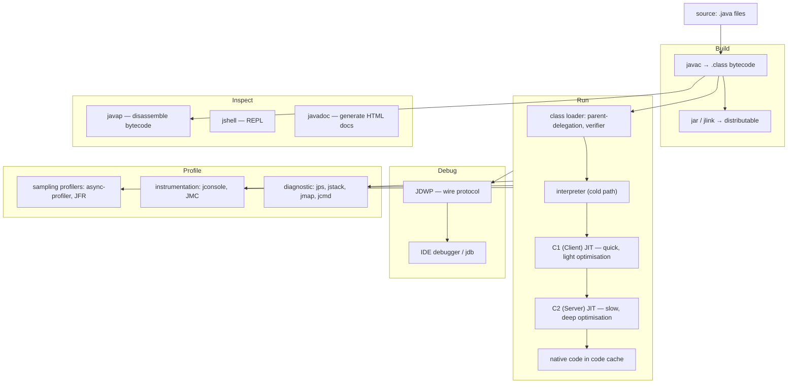

For L0 you mostly touch **edit / build / run / inspect**. Debug + profile become daily once you hit non-trivial code. Each stage has a corresponding diagnostic — when something goes wrong, the next sections tell you which tool to reach for.

## Install: What You're Actually Getting

A JDK distribution is a tree of binaries + libraries + headers. The structure:

```
jdk-21.0.5/
├── bin/                # the executables
│   ├── java            # the JVM launcher
│   ├── javac           # the compiler
│   ├── javap           # the disassembler
│   ├── jshell          # the REPL
│   ├── jar             # the archiver
│   ├── jcmd            # the diagnostic Swiss-Army knife
│   └── jstack, jmap, jps, jdb, jdeps, jlink, jpackage, ...
├── conf/               # configuration: security, networking, logging
├── include/            # C headers for JNI
├── jmods/              # modular components (Java 9+)
├── lib/                # runtime libs: rt.jar replacement, server VM, jspawnhelper, ...
│   ├── server/libjvm.so (or jvm.dll on Windows)
│   └── modules         # the bundled module image
├── legal/              # licenses
├── man/                # man pages (Unix)
└── release             # version metadata (cat release to see version + git rev)
```

`java` is a tiny launcher (~100 KB) that loads `libjvm.so` (~30 MB) — the actual JVM implementation. `javac` is itself a Java program that runs on the JVM. `javap`, `jshell`, `javadoc` are all Java programs too.

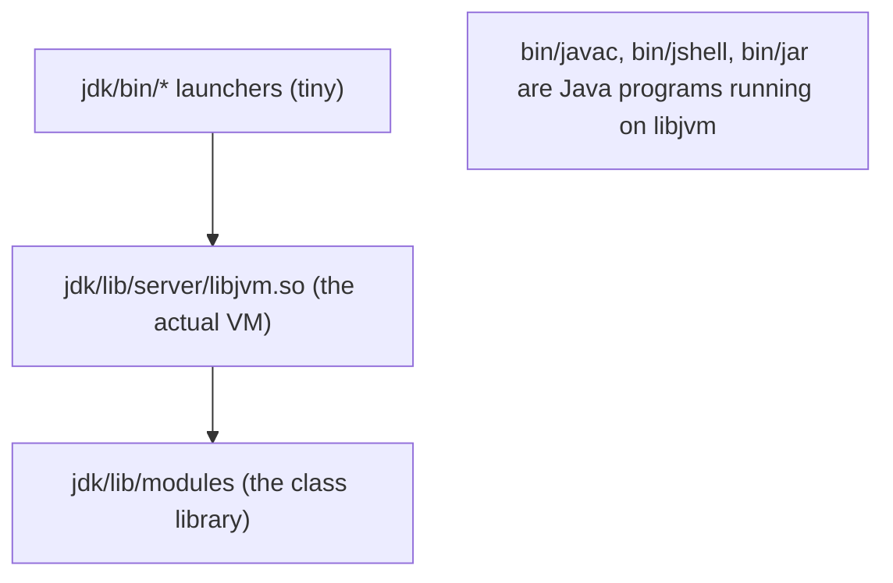

### Install Per OS

Pick **one** method per machine. Mixing (brew + manual + Apple Bundle on macOS) is a recipe for confusion.

```bash
# macOS Homebrew
brew install openjdk@21
# After install, Homebrew prints a `ln -sfn` line to symlink into /Library/Java/JavaVirtualMachines.

# macOS / Linux / WSL — SDKMAN (multi-version, recommended)
curl -s "https://get.sdkman.io" | bash
sdk install java 21.0.5-tem               # Temurin (Eclipse Adoptium)
sdk use java 21.0.5-tem                   # this shell only
sdk default java 21.0.5-tem               # system default

# Linux Debian/Ubuntu
sudo apt update && sudo apt install openjdk-21-jdk

# Linux Fedora/RHEL
sudo dnf install java-21-openjdk-devel

# Windows
winget install EclipseAdoptium.Temurin.21.JDK
# Or download .msi from https://adoptium.net
```

### How `java` Is Found by Your Shell — `PATH` Lookup Mechanism

Type `java`. The shell:

1. Splits `PATH` on the OS separator (`:` Unix, `;` Windows).
2. Walks left-to-right, looking for an executable named `java` in each directory.
3. Runs the **first** match.

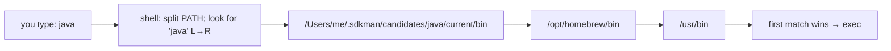

This is why **the order of entries in `PATH` matters**. If your work `PATH` lists `/usr/bin` before SDKMAN's directory, you'll get the OS Java even after `sdk use`. Verify with `which -a java` to see every match in priority order; `which java` to see just the winning one.

### How SDKMAN Switches Versions

SDKMAN doesn't reinstall Java when you switch — it juggles **symlinks**.

```
~/.sdkman/candidates/java/
├── 17.0.13-tem/        # actual install
│   └── bin/java
├── 21.0.5-tem/         # actual install
│   └── bin/java
└── current → 21.0.5-tem    # symlink — what 'sdk current' shows
```

`sdk use java 17.0.13-tem` updates `current` to point at `17.0.13-tem`. Your `PATH` includes `.sdkman/candidates/java/current/bin`, so the symlink hop reaches the right `java`. `sdk default java X` writes the version to `~/.sdkman/etc/config` and updates `current`.

```mermaid
flowchart TB
  Path["PATH includes ~/.sdkman/candidates/java/current/bin"]
  Current["current → 21.0.5-tem"]
  Install21["21.0.5-tem/bin/java"]
  Install17["17.0.13-tem/bin/java"]
  Path --> Current --> Install21
  Current -. 'sdk use 17.0.13-tem' .-> Install17
```

### `JAVA_HOME` — Why Tools Care

`PATH` is enough for `java`/`javac` to run. But Maven, Gradle, IDE plugins, IntelliJ run configurations, and many shell scripts look for `JAVA_HOME` — and break or silently use a different JDK if it's unset or stale.

```bash
echo $JAVA_HOME            # macOS/Linux
echo %JAVA_HOME%           # Windows cmd
$Env:JAVA_HOME             # Windows PowerShell

# Set it persistently (macOS/Linux):
export JAVA_HOME="$HOME/.sdkman/candidates/java/current"
# Put that line in ~/.zshrc, ~/.bashrc, or ~/.profile.

# SDKMAN does this automatically — its hook updates JAVA_HOME on every `sdk use`.
```

### IDE Picks Its Own JDK — Don't Be Surprised

IntelliJ, Eclipse, and VS Code maintain their **own** JDK registry independent of `PATH`/`JAVA_HOME`. **Configure the SDK inside the IDE** (Project Structure → SDKs in IntelliJ; Window → Preferences → Java → Installed JREs in Eclipse; the Java extension's "Java Home" setting in VS Code).

The classic surprise: terminal `java --version` says 21, IDE compiles with 17, code fails on a Java 21 feature. Fix: align the IDE SDK to your terminal JDK.

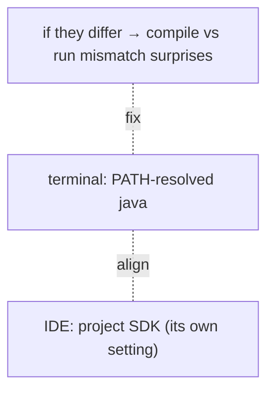

## IDE — What's Actually Running When You Press "Run"

A "Run" button hides:

1. **Source indexing.** The IDE has parsed your sources into an AST + a symbol table; it knows every reference's target. (T03 mechanism applies — the IDE runs a lexer + parser per-file and caches results.)
2. **Incremental compilation.** Only changed files (and their dependents) get sent to `javac`. The IDE shells out to `javac` or uses the **Java Compiler API** (`javax.tools`).
3. **Classpath resolution.** From `pom.xml` / `build.gradle` / IDE module config.
4. **JVM launch.** `java -cp <resolved-classpath> com.example.Main args...` — a normal `java` invocation, but with the IDE's classpath.
5. **Console attachment.** stdout/stderr of the launched JVM are piped into the IDE's Run tab.

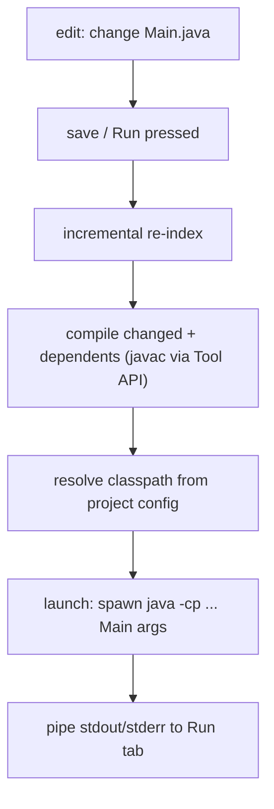

The IDE adds value at every step — error markers come from the AST + type-checker before you press Run; "find usages" comes from the symbol index; the debugger uses JDWP (see below).

### Pick One IDE

| IDE | Best for | Notes |
|-----|----------|-------|
| **IntelliJ IDEA Community** | most users | best inspections; the default recommendation |
| **Eclipse IDE for Java Developers** | classroom + legacy | mature; supports older JDKs |
| **VS Code + Extension Pack for Java** | lightweight + cross-language | uses Eclipse JDT under the hood |
| **NetBeans** | platform demos | mature; Apache project |

### Shortcuts That Move the Needle

Memorise these on day one — the cumulative time saving is measured in days/year.

| Action | IntelliJ | Eclipse | VS Code |
|--------|----------|---------|---------|
| Find class | ⌘O / Ctrl+N | ⌘⇧T | ⌘P + `#` |
| Find file | ⌘⇧O / Ctrl+Shift+N | ⌘⇧R | ⌘P |
| Find usages | ⌥F7 / Alt+F7 | Ctrl+Shift+G | ⇧F12 |
| Go to definition | ⌘B / Ctrl+B | F3 | F12 |
| Go to implementation | ⌘⌥B / Ctrl+Alt+B | F3 → choose | ⌘F12 |
| Rename (refactor) | ⇧F6 | ⌘⌥R | F2 |
| Inline / Extract | ⌘⌥N / ⌘⌥M | ⌘⌥I / ⌘⌥M | extension-dependent |
| Format code | ⌘⌥L | ⌘⇧F | ⌘⇧I |
| Run main | ⌃R | F11 | F5 / ⌃F5 |
| Debug | ⌃D | F11 | F5 |
| Toggle breakpoint | ⌘F8 | ⌘⇧B | F9 |
| Step over / into / out | F8 / F7 / ⇧F8 | F6 / F5 / F7 | F10 / F11 / ⇧F11 |
| Evaluate expression | ⌥F8 | Ctrl+Shift+D | the Debug Console |
| Quick fix | ⌥⏎ | Ctrl+1 | ⌘. |
| Recent files | ⌘E | Ctrl+E | ⌘P (empty) |
| Show usages of overridden | ⌘⌥B + Show | hierarchy view | extension |

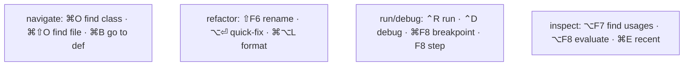

### Live Templates / Snippets

Every IDE has snippet expansion. IntelliJ examples:

| Trigger | Expands to |
|---------|-----------|
| `sout` | `System.out.println();` |
| `souf` | `System.out.printf();` |
| `souv` | `System.out.println("var = " + var);` |
| `psvm` | `public static void main(String[] args) { }` |
| `fori` | `for (int i = 0; i < ; i++) { }` |
| `iter` | `for (var x : collection) { }` |
| `inn` | `if (var == null) { }` |
| `nn` | `if (var != null) { }` |

Custom snippets are worth defining for project-specific patterns (logging boilerplate, test scaffolding).

### Inspections Are More Than Compile Errors

IntelliJ ships ~3 000 inspections. Examples that catch L0-level bugs:

- "Variable is never used" — dead local.
- "Possible NullPointerException" — flow analysis spotting an unguarded dereference.
- "`Integer` may be unboxed to `int` — possible NPE" — the `Map.get(missing)` trap.
- "`==` instead of `.equals()`" — string identity bug.
- "Loop condition contains side effect" — `while (it.hasNext() && skip++)` bugs.
- "Field can be local" — over-scoped field.

Configure in **Preferences → Inspections**. Per-inspection severity (info/weak warning/warning/error). Profiles per project. The IDE's value compounds the longer you stay with one.

## Compile from the CLI — What `javac` Actually Does

The pipeline:

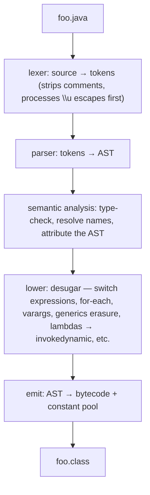

Common flags:

```bash
javac HelloWorld.java                 # one file
javac -d out src/**/*.java            # whole tree → out/
javac -d out -cp lib/*.jar src/**/*.java   # classpath
javac --release 17 ...                # target a specific Java version (cross-compile)
javac -g ...                          # include debug info: LocalVariableTable + LineNumberTable + SourceFile
javac -Xlint:all ...                  # all lint warnings
javac -Xlint:fallthrough,unchecked -Werror ...    # turn lints into errors
javac --enable-preview --release 21 ...    # opt into preview features (records, sealed, switch patterns pre-stabilisation)
```

Always compile **with `-g`** during development — debug info is essential for stack traces with line numbers, debugger source mapping, and `javap -l`.

## Run from the CLI — What `java` Actually Does

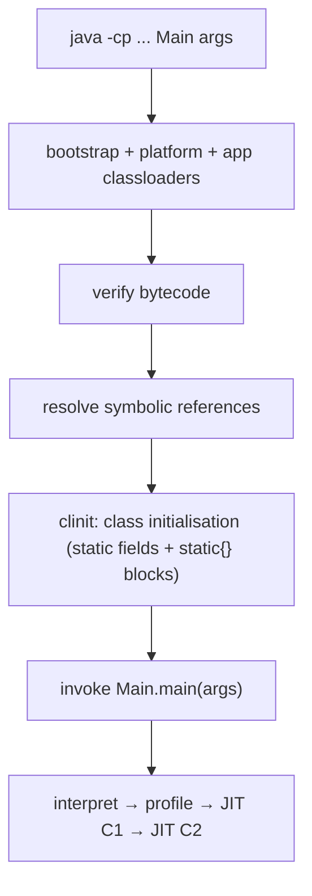

Common forms:

```bash
java HelloWorld                       # CWD must contain HelloWorld.class
java -cp out HelloWorld arg1 arg2
java -cp 'out:lib/*' HelloWorld       # Unix ':' separator; lib/* matches all JARs
java -cp 'out;lib/*' HelloWorld       # Windows ';' separator
java -jar MyApp.jar                   # runnable JAR (Main-Class in META-INF/MANIFEST.MF)
java HelloWorld.java                  # single-file source launcher (Java 11+) — compiles in memory, runs, discards
java -ea ...                          # enable assertions
java -Xmx512m ...                     # max heap
```

### Tiered Compilation

`java` runs your code in this sequence per method:

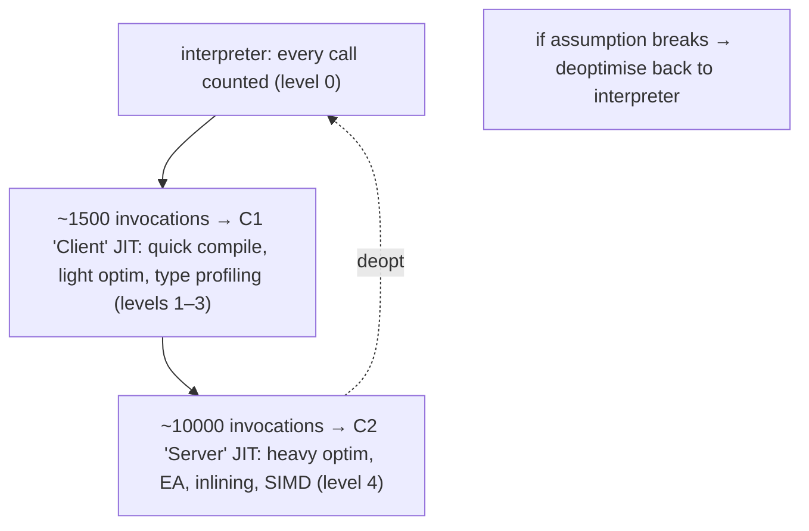

`-XX:+PrintCompilation` logs every compilation event; `-XX:+PrintInlining` (needs `-XX:+UnlockDiagnosticVMOptions`) logs inlining decisions.

## Inspect — `javap`, `jshell`, `javadoc`

### `javap` — Bytecode Disassembler

```bash
javap -c MyClass                      # bytecode (mnemonics)
javap -c -p MyClass                   # incl. private members
javap -v MyClass                      # verbose: constant pool, access flags, all attributes
javap -l MyClass                      # LocalVariableTable (compiled with -g)
javap -s MyClass                      # method signatures + descriptors
javap MyClass\$Inner                   # inner class (escape $ in some shells)
javap -p java.lang.String              # works on any class on classpath
```

What you'll see in `-v` output:

```
public class MyClass
  minor version: 0
  major version: 65       // 65 = Java 21
  flags: (0x0021) ACC_PUBLIC, ACC_SUPER
  ...
Constant pool:
   #1 = Methodref          #2.#3          // java/lang/Object."<init>":()V
   #2 = Class              #4             // java/lang/Object
   ...
{
  public static int add(int, int);
    descriptor: (II)I
    flags: (0x0009) ACC_PUBLIC, ACC_STATIC
    Code:
      stack=2, locals=2, args_size=2
         0: iload_0
         1: iload_1
         2: iadd
         3: ireturn
}
```

Read top-down: file metadata → constant pool → method entries with attributes. The `Code` attribute holds the bytecode.

### `jshell` — The REPL

```bash
jshell
```

Inside:

```
jshell> int x = 5
x ==> 5

jshell> /vars
|    int x = 5

jshell> int square(int n) { return n*n; }
|  created method square(int)

jshell> square(7)
$3 ==> 49

jshell> /methods
|    int square(int)

jshell> /imports

jshell> import java.util.*;

jshell> List.of(1,2,3)
$5 ==> [1, 2, 3]

jshell> /list
   1 : int x = 5;
   2 : int square(int n) { return n*n; }
   3 : square(7)
   4 : import java.util.*;
   5 : List.of(1, 2, 3)

jshell> /save session.jsh
jshell> /open session.jsh                # reload from file
jshell> /reset                            # wipe state
jshell> /exit
```

Default imports include `java.lang.*`, `java.util.*`, `java.io.*`, `java.math.*`, `java.net.*`, `java.util.concurrent.*`, `java.util.function.*`, `java.util.prefs.*`, `java.util.regex.*`, `java.util.stream.*`.

Use `jshell` for quick "what does this method return?" experiments without spinning up a project.

### `javadoc` — Generate HTML Reference

```bash
javadoc -d docs/ src/com/example/*.java
javadoc -d docs/ -sourcepath src --module-source-path ... # modular
javadoc -d docs/ -link https://docs.oracle.com/en/java/javase/21/docs/api/ src/...   # cross-link to JDK API
```

Output is a directory of HTML — copy to a web server, or open `docs/index.html` locally. Maven Central libraries publish `library-VER-javadoc.jar` containing this output.

## Debug — JDWP and the IDE Workflow

Java debugging uses the **JDWP** (Java Debug Wire Protocol). The architecture:


The JVM hosts a JDWP agent (loaded via `-agentlib:jdwp`). The agent speaks the wire protocol over TCP. The debugger UI sends commands ("get all loaded classes", "set breakpoint at Main:42", "step over") and receives events ("breakpoint hit", "thread paused").

### Launch in Debug Mode

```bash
java -agentlib:jdwp=transport=dt_socket,server=y,suspend=n,address=*:5005 MyApp
# server=y    → JVM listens
# suspend=n   → don't wait for debugger before running
# address=5005 → port
```

Then attach IntelliJ (Run → Attach to Process) or `jdb`:

```bash
jdb -attach localhost:5005
```

### IDE Debugger Workflow

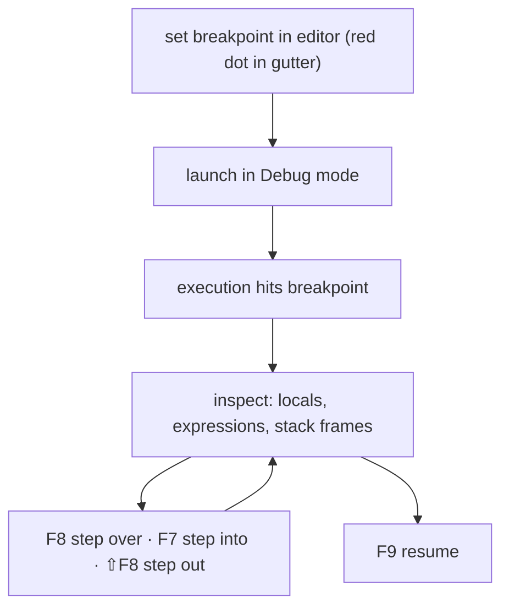

Powerful features once you're past the basics:

- **Conditional breakpoints** — only break when `i > 100`. Right-click the breakpoint.
- **Log to console without stopping** — "Evaluate and log" breakpoints; replaces ad-hoc `println` debugging.
- **Watch expressions** — evaluate arbitrary expressions in the current frame; updates as you step.
- **Drop frame** — restart the current method (without losing the JVM session).
- **Force return value** — short-circuit the current method.
- **Hot Code Replace** — edit a method body during debug; the IDE pushes the new bytecode to the running JVM (limited — adds/removes signatures don't HCR).

### `jdb` Command-Line Debugger

```bash
jdb -attach 5005
> stop at Main:42                     # breakpoint
> run                                 # resume / start
> threads                             # list threads
> thread 0xab                         # select a thread
> where                               # stack trace
> print myLocal                       # inspect a variable
> step                                # step into
> next                                # step over
> cont                                # resume
> exit
```

Use the IDE when you can. `jdb` matters on servers without IDE access.

## Profile — Diagnose Live JVMs

| Tool | Bundled? | Purpose | Style |
|------|---------|---------|-------|
| `jps` | yes | list running Java processes | one-shot |
| `jstack <pid>` | yes | thread dump | one-shot |
| `jmap <pid>` | yes | heap summary, histogram, full heap dump | one-shot |
| `jcmd <pid> <command>` | yes | Swiss-Army knife: GC info, flags, classloader stats, JFR control | one-shot |
| `jconsole` | yes | GUI: memory, threads, classes, MBeans | continuous |
| `jvisualvm` | separate (deprecated) | GUI profiler | continuous |
| **JDK Mission Control (JMC)** | separate | low-overhead Java Flight Recorder (JFR) viewer | continuous |
| **JFR** | yes (since Java 11) | event-based profiling, very low overhead | continuous |
| **async-profiler** | third-party | sampling CPU + lock profiler | continuous |

### Sampling vs Instrumentation Profilers

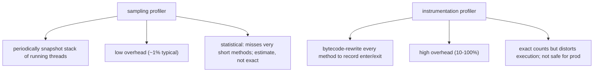

For production use sampling (JFR, async-profiler). For development with full visibility use instrumentation (JMC's old TLAB profiler, YourKit, JProfiler — paid).

### One-Shot Diagnostic Recipes

```bash
# Find your JVM's pid
jps -lv

# Thread dump (find deadlocks, blocked threads, hot threads)
jstack 12345 > dump.txt
jstack -l 12345                       # incl. locks

# Heap histogram (largest classes by instance count)
jmap -histo:live 12345 | head -50

# Full heap dump (open in MAT or VisualVM for analysis)
jmap -dump:live,format=b,file=heap.hprof 12345

# What flags is the JVM running with?
jcmd 12345 VM.flags
jcmd 12345 VM.system_properties

# GC tuning info
jcmd 12345 GC.heap_info
jcmd 12345 GC.heap_dump filename=heap.hprof   # same as jmap but newer style
jcmd 12345 GC.class_histogram

# Start JFR recording (low overhead)
jcmd 12345 JFR.start name=Profile settings=profile filename=rec.jfr duration=120s
# Open rec.jfr in JMC
```

### GC Overview at L0 Level

You don't tune GC at L0, but you should know the players:

| Collector | Use |
|-----------|-----|
| **Serial** | tiny heaps, single-threaded apps |
| **Parallel** (Throughput) | batch jobs; throughput > latency |
| **G1** (default since Java 9) | balanced; the default for most apps |
| **ZGC** | very large heaps (multi-GB-TB) with low pause goals (sub-ms) |
| **Shenandoah** | similar goals to ZGC; alternative implementation |
| **Epsilon** | no-op collector; for benchmarking |

Switch via `-XX:+UseG1GC`, `-XX:+UseZGC`, etc. Full mechanism in L3/C02.

## Classpath in Depth

```bash
java -cp dir                          # one directory
java -cp dir1:dir2:lib/*.jar Main     # multiple (Unix)
java -cp dir1;dir2;lib\*.jar Main     # Windows
java -cp '.:libs/*' Main              # CWD + every JAR in libs/
java -classpath ...                   # full form
```

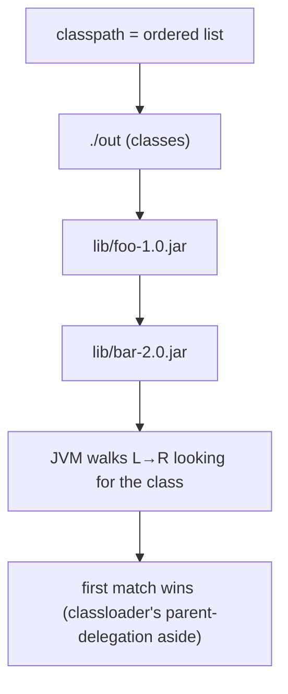

When two JARs contain the same class (JAR-hell), the **first on the classpath wins**. The `jdeps` tool helps audit dependencies.

### `--module-path` (Java 9+, JPMS)

Modular projects use `--module-path` instead of `-cp` (or both with caveats):

```bash
java --module-path mods --module com.example/com.example.Main
```

Full coverage in L1/C01.

## Common L0 JVM Flags

| Flag | Effect |
|------|--------|
| `-Xss<size>` | thread stack size (T14 recursion depth) |
| `-Xms<size>` | initial heap size |
| `-Xmx<size>` | max heap size |
| `-Xlog:gc*` | GC logging (Java 9+ unified log) |
| `-XX:+PrintFlagsFinal` | dump every JVM flag and value |
| `-XX:+UnlockDiagnosticVMOptions` | required before some flags below |
| `-XX:+PrintCompilation` | log every JIT compilation |
| `-XX:+PrintInlining` | log JIT inlining decisions |
| `-XX:+PrintAssembly` | dump JIT-emitted native code (needs `hsdis` plugin) |
| `-XX:+PrintEliminateAllocations` | log escape-analysis allocation elimination |
| `-XX:+PrintIntrinsics` | log intrinsified method invocations |
| `-XX:AutoBoxCacheMax=N` | raise `Integer` cache upper bound (T17) |
| `-XX:+UseSuperWord` | toggle JIT auto-vectorisation (default on; T09) |
| `-XX:-DoEscapeAnalysis` | disable EA for benchmarking |
| `-XX:+UseCompressedOops` | use 32-bit refs (default on for heap ≤ 32 GB; T02) |
| `-XX:+UseG1GC` / `-XX:+UseZGC` | choose GC |
| `-Xlog:class+load=info` | log every class loaded — debugging classpath issues |

Pass flags after `java` and before the main class:

```bash
java -Xmx512m -XX:+PrintCompilation MyApp arg1
```

## Build Tools — Orientation (Full Coverage in L2/C02)

| Tool | Status | Idea |
|------|--------|------|
| **Maven** | most widely used | declarative `pom.xml`; convention-over-configuration; rich plugin ecosystem |
| **Gradle** | growing; Android default | programmable `build.gradle(.kts)`; Groovy or Kotlin DSL; incremental compile |
| **Ant** | legacy | task-based XML; mostly older codebases |
| **Bazel** | large monorepos | Google's; complex; rare outside specific shops |

For L0 you don't need them. Once you have ≥ 1 third-party JAR or >~5 source files, switch to Maven or Gradle.

### Minimal `pom.xml`

```xml
<project xmlns="http://maven.apache.org/POM/4.0.0">
    <modelVersion>4.0.0</modelVersion>
    <groupId>com.example</groupId>
    <artifactId>my-app</artifactId>
    <version>1.0</version>
    <properties>
        <maven.compiler.release>21</maven.compiler.release>
    </properties>
</project>
```

Run:

```bash
mvn compile
mvn package
java -jar target/my-app-1.0.jar
```

### Minimal `build.gradle.kts`

```kotlin
plugins { java }
java {
    toolchain { languageVersion = JavaLanguageVersion.of(21) }
}
```

Run:

```bash
gradle build
java -jar build/libs/my-app.jar
```

## Plain-`javac` Project Skeleton

For an L0 project without a build tool:

```
my-l0-project/
├── README.md
├── src/
│   ├── Main.java
│   └── util/
│       └── Helper.java
└── out/                  # build output (gitignore)
```

Build script (`build.sh`):

```bash
#!/usr/bin/env bash
set -e
mkdir -p out
javac -d out -sourcepath src $(find src -name '*.java')
echo "Built. Run: java -cp out Main"
```

## Packaging — JAR and `jlink`

### Runnable JAR

```bash
javac -d out src/*.java
jar cfe app.jar Main -C out .         # c=create, f=file, e=entry-point
java -jar app.jar
```

Or with a manifest file:

```
# Manifest.txt
Main-Class: Main
Class-Path: lib/foo.jar lib/bar.jar
```

```bash
jar cfm app.jar Manifest.txt -C out .
```

### Custom Runtime Image (`jlink`)

Modular apps can ship a stripped-down JRE containing only the modules needed:

```bash
jlink --module-path $JAVA_HOME/jmods:mods \
      --add-modules com.example \
      --output myruntime \
      --strip-debug --compress=2
```

Produces `myruntime/bin/java` etc. — a self-contained runtime ~30 MB instead of a full JDK ~200 MB. Useful for Docker images and embedded distribution.

## Common Errors and First-Move Diagnosis

| Symptom | First check |
|---------|------------|
| `'javac' is not recognized` | `which javac` / `where javac`; install or fix PATH |
| `'java' is not recognized` | same |
| `error: class HelloWorld is public, should be declared in a file named HelloWorld.java` | filename ≠ class name; rename one |
| `Error: Could not find or load main class Main` | `-cp` wrong; class name typo |
| `java.lang.UnsupportedClassVersionError` | runtime older than compile JDK; `java --version` vs `javac --version` |
| `java.lang.NoClassDefFoundError` | class exists but a required class wasn't found; check classpath |
| `java.lang.ClassNotFoundException` | dynamic lookup (Class.forName, reflection) failed; check classpath |
| `cannot find symbol` (compile) | missing import; classpath; typo; missing JAR |
| `package X does not exist` | dependency missing on `-cp`/build file |
| `Exception in thread "main" java.lang.OutOfMemoryError: Java heap space` | `-Xmx` too low; memory leak; raise heap or analyse heap dump |
| `Exception in thread "main" java.lang.OutOfMemoryError: Metaspace` | excessive classloading; raise `-XX:MaxMetaspaceSize=` |
| `Exception in thread "main" java.lang.StackOverflowError` | unbounded recursion (T14); raise `-Xss=` or convert to iteration |

### Stack-Trace Reading Recipe

A `NullPointerException` stack trace shows the call chain at exception time. Read **top to bottom**:

```
Exception in thread "main" java.lang.NullPointerException: Cannot invoke "String.length()" because "name" is null
    at com.example.User.getNameLength(User.java:42)            ← where it actually happened
    at com.example.Service.process(Service.java:15)             ← caller
    at com.example.Main.main(Main.java:8)                        ← entry
```

Java 14+ adds **helpful NPE messages** (`-XX:+ShowCodeDetailsInExceptionMessages`, on by default since 17) — it names the actual null variable. Massive debugging time-saver vs the old "NullPointerException at User.java:42" alone.

## Tools You Don't Need Until L2+ (Quick Map)

| Tool | When |
|------|------|
| **Maven Central** browsing | L1+ — finding dependencies |
| **Spring Initializr** | L4 — bootstrapping Spring projects |
| **Postman / curl / httpie** | L2+ — API testing |
| **Docker** | L4 — packaging/deploying |
| **GitHub Actions / Jenkins** | L4 — CI/CD |
| **VisualVM / JProfiler / YourKit** | L3+ — production profiling |
| **Arthas (Alibaba)** | L3+ — live JVM introspection |
| **`jdeps`** | L2+ — dependency analysis |
| **JPackage** | L4 — native installers |

## Recap

You now have a working mental map of:

- **Install:** OS-native, SDKMAN, jenv; how `PATH` lookup works; why `JAVA_HOME` matters.
- **IDE:** what "Run" actually does (parse → compile → resolve classpath → launch JVM → pipe streams); the shortcuts that pay back; inspections as bug-catchers.
- **CLI:** `javac` (lex/parse/sem/lower/emit) → `java` (load/verify/init/main + interpret→C1→C2 JIT); single-file source-launcher.
- **Inspect:** `javap` reads bytecode; `jshell` REPL for experiments; `javadoc` generates HTML.
- **Debug:** JDWP wire protocol over TCP; the IDE debugger flow; conditional/log breakpoints; drop-frame; HCR.
- **Profile:** sampling vs instrumentation; bundled diagnostics (`jps`/`jstack`/`jmap`/`jcmd`); JFR + JMC for production; the GC family at high level.
- **Classpath:** Unix `:` vs Windows `;`; ordered L→R; first match wins; `--module-path` for JPMS.
- **JVM flags:** `-Xmx/Xms/Xss`, diagnostic family (`+PrintCompilation`, `+PrintInlining`, `+PrintEliminateAllocations`, `+PrintAssembly`), `AutoBoxCacheMax`.
- **Build tools:** Maven (declarative), Gradle (programmable); skeleton `pom.xml`/`build.gradle.kts`; full coverage in L2/C02.
- **Package:** runnable JAR with `jar cfe`; modular runtime images with `jlink`.
- **Errors:** classpath issues, version-mismatches, OOM/SOE, NPE-with-helpful-messages; first-move diagnoses.

The next time something in the toolchain surprises you, you should know **which tool to reach for** and **roughly what it's doing under the hood**.

## Next

This chapter has the single reference. Continue to **[L0/C04 Hands-On](../C04-hands-on/README.md)** for the exercises and the level project.
