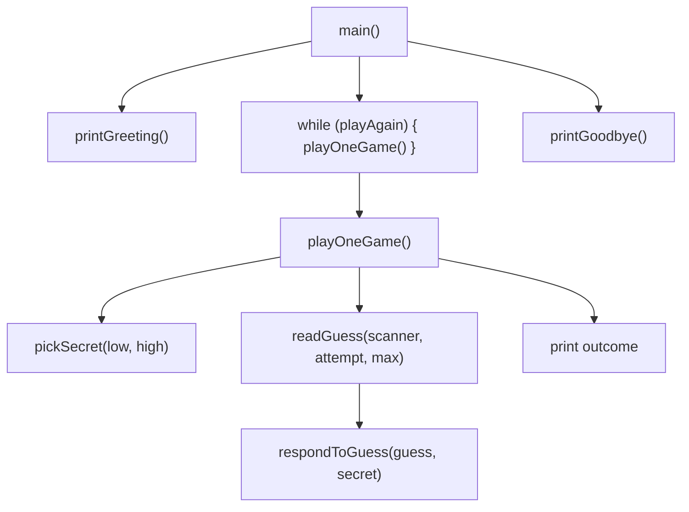
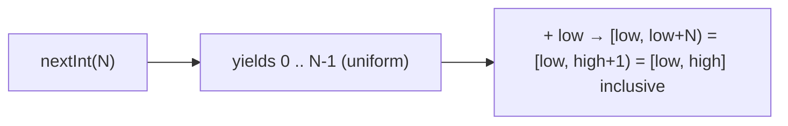

# Level Project — Number-Guessing Game

The end-of-L0 project. Builds a command-line application that exercises every L0 concept: **variables** (the secret, the guess, the attempts counter), **control flow** (compare guess vs secret), **loops** (keep asking until correct), **methods** (decompose the logic), **user input** (`Scanner`), and **basic error handling** (non-numeric input, EOF, Ctrl+C). The finished program is ~120 lines depending on style — enough to feel substantial without straining beyond L0.

This page goes beyond "here's the code." We'll build it step by step, **test** it (manually and by injection), **refactor** it, and walk through what changes at the L1 OO redesign. By the end you'll have written a complete L0 program, automated tests for it, packaged it as a runnable JAR, and previewed the OO transition.

## What You're Building

A console game:

```
=== Number-Guessing Game ===
I'm thinking of a number between 1 and 100.
You have 7 attempts.

Attempt 1/7. Enter your guess: 50
Too high.

Attempt 2/7. Enter your guess: abc
Not a number, try again.

Attempt 2/7. Enter your guess: 25
Too low.

Attempt 3/7. Enter your guess: 37
Too high.

Attempt 4/7. Enter your guess: 31
You won in 4 attempts!

Play again? (y/n): n
Thanks for playing!
```

## Spec — Acceptance Criteria

1. **Picks a random integer** in `[1, 100]` (range configurable).
2. **Allows N attempts** (default 7 = ⌈log₂(100)⌉ — the binary-search optimum).
3. **Reads a guess** per round. Tolerates non-numeric input gracefully (re-prompt, don't crash).
4. **Compares** and responds: "Too high", "Too low", "Correct".
5. On win, **prints the attempt count**.
6. On loss (attempts exhausted), **reveals the secret**.
7. After a game, **asks to play again**. Repeats until "no".
8. **Handles EOF / Ctrl+D** gracefully: exits cleanly with a friendly message.
9. **Handles Ctrl+C** by letting the JVM's default SIGINT handler exit.

## Design

Decompose into methods so each does one thing:



Methods you'll write:

| Method | Purpose |
|--------|---------|
| `printGreeting()` | initial banner |
| `pickSecret(int low, int high)` | returns a random int in `[low, high]` |
| `readGuess(Scanner s, int attempt, int max)` | read a numeric guess; re-prompt on bad input |
| `respondToGuess(int guess, int secret)` | print "Too high", "Too low", or "Correct" |
| `playOneGame(Scanner s)` | one full game loop; returns whether user won |
| `askPlayAgain(Scanner s)` | reads y/n; returns boolean |
| `main(String[] args)` | tie it all together |

## Step 1 — `main` Skeleton + Greeting

Start with the smallest thing that runs.

```java
import java.util.Scanner;

public class NumberGuessingGame {

    public static void main(String[] args) {
        Scanner scanner = new Scanner(System.in);
        printGreeting();
        printGoodbye();
        scanner.close();
    }

    private static void printGreeting() {
        System.out.println("=== Number-Guessing Game ===");
        System.out.println("I'm thinking of a number between 1 and 100.");
    }

    private static void printGoodbye() {
        System.out.println("Thanks for playing!");
    }
}
```

Compile and run:

```bash
javac NumberGuessingGame.java
java NumberGuessingGame
```

Confirm the two lines print. **Don't write the next step until this works.**

## Step 2 — Pick a Secret

```java
import java.util.Random;
// ...
private static int pickSecret(int low, int high) {
    return new Random().nextInt(high - low + 1) + low;
}
```

`Random.nextInt(n)` returns a value in `[0, n)`. We shift by `low` and use `(high - low + 1)` to make it inclusive on both ends.



For testing, **temporarily** seed with a constant so you always get the same secret:

```java
return new Random(42L).nextInt(...) + low;
```

(Remove the seed before "shipping" — `new Random()` uses the current time by default.)

> [!TIP]
> Don't allocate `new Random()` every call in a tight loop — it's not the cheapest object. For a *game* called once per round, it's fine. For benchmarks, hoist out.

## Step 3 — Read a Guess (Robust Input)

`Scanner.nextInt()` looks tempting but has a famous bug: it leaves the trailing newline in the buffer, so the **next** `nextLine()` returns the empty string. `nextLine() + Integer.parseInt(...)` is more robust:

```java
private static int readGuess(Scanner scanner, int attempt, int max) {
    while (true) {
        System.out.printf("Attempt %d/%d. Enter your guess: ", attempt, max);
        if (!scanner.hasNextLine()) {
            System.out.println();
            throw new EOFException("End of input — quitting.");   // see EOF handling below
        }
        String line = scanner.nextLine().trim();
        try {
            return Integer.parseInt(line);
        } catch (NumberFormatException e) {
            System.out.println("Not a number, try again.");
        }
    }
}
```

Three robustness choices:

1. **`hasNextLine()` before `nextLine()`** — detects EOF (user pressed Ctrl+D or input was piped from a file that ended).
2. **`trim()` the line** — leading/trailing whitespace is forgiven.
3. **`while (true)` + return-on-success** — the natural shape for "keep asking until valid" (T09 idiom).

> [!NOTE]
> `EOFException` is checked, so you have to declare it on the method or wrap as unchecked. For simplicity here, define a private custom unchecked alternative or use `IllegalStateException("EOF")` — full exception handling is L1/C02. For this project, treating EOF as "user wants to quit" is the right behaviour.

### EOF / Ctrl+D Handling Without Exception Plumbing

A cleaner pattern for L0:

```java
private static int readGuess(Scanner scanner, int attempt, int max) {
    while (true) {
        System.out.printf("Attempt %d/%d. Enter your guess: ", attempt, max);
        if (!scanner.hasNextLine()) {
            System.out.println("\nGoodbye.");
            System.exit(0);     // clean exit; OS sees status 0
        }
        String line = scanner.nextLine().trim();
        try {
            return Integer.parseInt(line);
        } catch (NumberFormatException e) {
            System.out.println("Not a number, try again.");
        }
    }
}
```

`System.exit(0)` triggers shutdown hooks (if any) and exits with status 0 — well-behaved CLI hygiene.

## Step 4 — Respond + Play One Round

```java
private static void respondToGuess(int guess, int secret) {
    if (guess < secret) {
        System.out.println("Too low.");
    } else if (guess > secret) {
        System.out.println("Too high.");
    } else {
        System.out.println("Correct!");
    }
}

private static boolean playOneGame(Scanner scanner) {
    int low = 1, high = 100;
    int maxAttempts = 7;
    int secret = pickSecret(low, high);

    for (int attempt = 1; attempt <= maxAttempts; attempt++) {
        int guess = readGuess(scanner, attempt, maxAttempts);
        if (guess == secret) {
            System.out.printf("You won in %d attempt%s!%n",
                    attempt, attempt == 1 ? "" : "s");
            return true;
        }
        respondToGuess(guess, secret);
    }

    System.out.printf("Out of attempts. The secret was %d.%n", secret);
    return false;
}
```

Notice:

- `for` loop counter bounded by `maxAttempts` (T09).
- Early `return` on a correct guess (T10).
- `printf` with `%d`, `%s`, `%n` for platform-independent newline.
- Ternary for "attempt" vs "attempts" pluralisation (T04).

## Step 5 — Ask to Play Again

```java
private static boolean askPlayAgain(Scanner scanner) {
    while (true) {
        System.out.print("Play again? (y/n): ");
        if (!scanner.hasNextLine()) {
            System.out.println();
            return false;
        }
        String answer = scanner.nextLine().trim().toLowerCase();
        if (answer.equals("y") || answer.equals("yes")) return true;
        if (answer.equals("n") || answer.equals("no") || answer.isEmpty()) return false;
        System.out.println("Please answer y or n.");
    }
}
```

Same robust input pattern; empty answer treated as "no" (Enter without typing = quit).

## Step 6 — Wire It Together

```java
public static void main(String[] args) {
    Scanner scanner = new Scanner(System.in);
    printGreeting();
    boolean playing = true;
    while (playing) {
        playOneGame(scanner);
        playing = askPlayAgain(scanner);
    }
    printGoodbye();
    scanner.close();
}
```

## Full Solution

```java
import java.util.Random;
import java.util.Scanner;

public class NumberGuessingGame {

    private static final int LOW = 1;
    private static final int HIGH = 100;
    private static final int MAX_ATTEMPTS = 7;

    public static void main(String[] args) {
        try (Scanner scanner = new Scanner(System.in)) {
            printGreeting();
            boolean playing = true;
            while (playing) {
                playOneGame(scanner);
                playing = askPlayAgain(scanner);
            }
            printGoodbye();
        }
    }

    private static void printGreeting() {
        System.out.println("=== Number-Guessing Game ===");
        System.out.printf("I'm thinking of a number between %d and %d.%n", LOW, HIGH);
        System.out.printf("You have %d attempts.%n%n", MAX_ATTEMPTS);
    }

    private static void printGoodbye() {
        System.out.println("Thanks for playing!");
    }

    private static int pickSecret(int low, int high) {
        return new Random().nextInt(high - low + 1) + low;
    }

    private static int readGuess(Scanner scanner, int attempt, int max) {
        while (true) {
            System.out.printf("Attempt %d/%d. Enter your guess: ", attempt, max);
            if (!scanner.hasNextLine()) {
                System.out.println("\nGoodbye.");
                System.exit(0);
            }
            String line = scanner.nextLine().trim();
            try {
                return Integer.parseInt(line);
            } catch (NumberFormatException e) {
                System.out.println("Not a number, try again.");
            }
        }
    }

    private static void respondToGuess(int guess, int secret) {
        if (guess < secret) System.out.println("Too low.");
        else if (guess > secret) System.out.println("Too high.");
        else System.out.println("Correct!");
    }

    private static boolean playOneGame(Scanner scanner) {
        int secret = pickSecret(LOW, HIGH);
        for (int attempt = 1; attempt <= MAX_ATTEMPTS; attempt++) {
            int guess = readGuess(scanner, attempt, MAX_ATTEMPTS);
            if (guess == secret) {
                System.out.printf("You won in %d attempt%s!%n%n",
                        attempt, attempt == 1 ? "" : "s");
                return true;
            }
            respondToGuess(guess, secret);
        }
        System.out.printf("Out of attempts. The secret was %d.%n%n", secret);
        return false;
    }

    private static boolean askPlayAgain(Scanner scanner) {
        while (true) {
            System.out.print("Play again? (y/n): ");
            if (!scanner.hasNextLine()) {
                System.out.println();
                return false;
            }
            String answer = scanner.nextLine().trim().toLowerCase();
            if (answer.equals("y") || answer.equals("yes")) return true;
            if (answer.equals("n") || answer.equals("no") || answer.isEmpty()) return false;
            System.out.println("Please answer y or n.");
        }
    }
}
```

Notice the **try-with-resources** wrapping the Scanner — guarantees `scanner.close()` runs even on exceptions.

## Build and Run

```bash
javac NumberGuessingGame.java
java NumberGuessingGame
```

Or one-shot (Java 11+):

```bash
java NumberGuessingGame.java
```

## Manual Testing — A Practical Checklist

Run the binary and walk through:

| Test | What to type | Expected |
|------|--------------|----------|
| Happy path | 50, 25, 12, 6 (etc., honest play) | "Too high" / "Too low" feedback; eventual win |
| Win on first guess | the actual secret (need seeded Random) | "You won in 1 attempt!" |
| Lose | 7 wrong guesses | "Out of attempts. The secret was N." |
| Non-numeric input | `abc`, `12.5`, `1e2` | "Not a number, try again." then re-prompt |
| Leading/trailing space | `  50  ` | accepts after trim |
| Empty guess | press Enter only | "Not a number, try again." |
| Negative | `-5` | accepts as a guess; will be "Too low" |
| Huge number | `9999999999` | NumberFormatException because exceeds int — "Not a number, try again." |
| EOF | Ctrl+D (Unix) / Ctrl+Z then Enter (Windows) | "Goodbye."; exit 0 |
| SIGINT | Ctrl+C | JVM exits with status 130 (~SIGINT) — fine for the project |
| Play-again "y" | `y` then play again | new secret; new game |
| Play-again typo | `maybe`, `1`, empty | "Please answer y or n." until valid; empty = no |

## Automated Testing — Without a Test Framework

You don't have JUnit yet (L1/C02 introduces it), but you can drive the game from a piped input:

```bash
# Save expected interactions to a script:
cat > test.txt <<EOF
50
25
12
6
3
1
2
n
EOF

# Run the game with test.txt as stdin; observe the output:
java NumberGuessingGame < test.txt
```

If you seeded `Random(42L)` in `pickSecret` (temporarily), the same secret comes out every run — making the test reproducible. **This is the L0-friendly way to automate end-to-end tests.**

### A More Programmable Test Harness — Dependency Injection Preview

The game currently entangles `pickSecret` with `Random()`. To test specific scenarios deterministically, **inject** the random source:

```java
// Refactor pickSecret to accept the source:
private static int pickSecret(int low, int high, Random rng) {
    return rng.nextInt(high - low + 1) + low;
}

// playOneGame now takes the rng too:
private static boolean playOneGame(Scanner scanner, Random rng) { ... }

// main:
public static void main(String[] args) {
    Random rng = (args.length > 0 && args[0].equals("--seed"))
            ? new Random(Long.parseLong(args[1]))
            : new Random();
    // ...
}
```

Now `java NumberGuessingGame --seed 42 < test.txt` runs deterministically — full integration test in 1 line. This is **dependency injection** — the technique behind all modern testable Java. Full treatment in L4/C01 (Spring framework) but the idea applies here.

## Refactoring — Tightening the Code

After it works, look for improvements. A few low-risk refactors at L0 level:

### 1. Extract Constants

The defaults `1`, `100`, `7` are already `static final` — good. Promote any other magic numbers (e.g., loop counters embedded in the body) to named constants.

### 2. Split `playOneGame` if It Grows

If you add stretch goals (hints, range tracker), `playOneGame` could swell to 40+ lines. Split into `printGameStart`, `runRound`, `printGameEnd`.

### 3. Pull Range and Attempts Into Parameters

Instead of `LOW`/`HIGH`/`MAX_ATTEMPTS` as fixed constants, accept them as parameters. Now you can offer **difficulty levels**:

```java
private static boolean playOneGame(Scanner s, Random rng, int low, int high, int maxAttempts);
```

### 4. Separate I/O From Logic

Currently `playOneGame` mixes "core game state" with "talking to the user." A clean refactor extracts a `Game` class that **doesn't** know about Scanner or println — pure logic that takes a guess and returns a `RoundResult { Outcome outcome; int attemptsRemaining; }`. The I/O loop is then thin.

This is the L1 OO mindset preview (see below).

### 5. Use `Optional<Integer>` for Bad Input

Instead of `readGuess` looping internally on bad input, `readGuess` could return `Optional<Integer>` (`Optional.empty()` = bad input or EOF), and the caller decides. Full `Optional` coverage in L1/C02, but the idea is principled separation of concerns.

## Packaging as a Runnable JAR

```bash
# Compile to ./out
javac -d out NumberGuessingGame.java

# Create a manifest
cat > Manifest.txt <<EOF
Main-Class: NumberGuessingGame
EOF

# Build the JAR
jar cfm game.jar Manifest.txt -C out .

# Run
java -jar game.jar
```

Distributable: ~3 KB. You can email it; it runs anywhere Java 11+ is installed.

Or one-shot the manifest with `jar cfe`:

```bash
jar cfe game.jar NumberGuessingGame -C out .
```

## What an L1 OO Redesign Looks Like — Preview

L0 code is procedural — methods + static state. L1's OOP makes this **object-oriented**. Same game, very different shape:

```java
public class Game {
    private final int secret;
    private final int maxAttempts;
    private int attemptsUsed = 0;

    public Game(int secret, int maxAttempts) {
        this.secret = secret;
        this.maxAttempts = maxAttempts;
    }

    public RoundResult guess(int g) {
        attemptsUsed++;
        if (g == secret) return new RoundResult(Outcome.WON, attemptsUsed, maxAttempts);
        if (attemptsUsed >= maxAttempts) return new RoundResult(Outcome.LOST, attemptsUsed, maxAttempts);
        return new RoundResult(g < secret ? Outcome.TOO_LOW : Outcome.TOO_HIGH, attemptsUsed, maxAttempts);
    }
    // getters...
}

public enum Outcome { TOO_LOW, TOO_HIGH, WON, LOST }
public record RoundResult(Outcome outcome, int attemptsUsed, int maxAttempts) { }
```

The `Game` class **encapsulates state** (the secret, the attempts counter) and **exposes behaviour** (`guess`). The CLI loop becomes:

```java
Game game = new Game(secret, MAX_ATTEMPTS);
while (true) {
    int g = readGuess(scanner);
    RoundResult r = game.guess(g);
    System.out.println(format(r));
    if (r.outcome() == WON || r.outcome() == LOST) break;
}
```

Benefits L1 makes explicit:

- The game is **testable** — you can drive `Game.guess(...)` from unit tests with no Scanner.
- The CLI is **swappable** — write a web version, a Discord bot, a Slack integration; same `Game` class.
- State is **encapsulated** — only `Game` mutates `attemptsUsed`.
- The `Outcome` enum + `RoundResult` record make the API explicit.

You'll do this redesign in `L1/C01` as part of OOP practice. For now, the procedural form is exactly right for L0.

## Stretch Goals — With Hints

### Difficulty Levels (Easy / Medium / Hard)

```java
private enum Difficulty {
    EASY(1, 50, 10),
    MEDIUM(1, 100, 7),
    HARD(1, 1000, 10);
    final int low, high, maxAttempts;
    Difficulty(int l, int h, int a) { low = l; high = h; maxAttempts = a; }
}

// In askDifficulty: read a number/letter; map to one of these.
```

Note this preview of `enum` with fields/constructor — L1/C01 covers it.

### High-Score Table (per Session)

A `List<Integer>` of attempts-per-win; print min / mean / max after each game.

### Hints

After 3 wrong guesses, reveal one of:

- Parity (even / odd)
- Quartile (first / second / third / fourth quarter of the range)
- One digit (first or last)

### Smart Range Tracker

Track `[possibleLow, possibleHigh]` — narrow on each guess. Print after each guess: `"The secret is between A and B."` Helps the user play binary-search-optimally.

### Argument-Driven Config

```java
public static void main(String[] args) {
    // Parse args like --low=1 --high=1000 --max=10 --seed=42
}
```

A small helper:

```java
private static int argInt(String[] args, String key, int defaultValue) {
    for (String a : args) {
        if (a.startsWith(key + "=")) return Integer.parseInt(a.substring(key.length() + 1));
    }
    return defaultValue;
}
```

### Two-Player Mode

Player 1 picks the secret (use `Console.readPassword()` or just hide stdin); Player 2 guesses.

### Inverted Mode (Computer Guesses)

The computer guesses; you respond high/low. Confirm it uses binary search.

### Replay a Script File

```java
Scanner scanner = args.length > 0 && args[0].equals("--script")
    ? new Scanner(new File(args[1]))
    : new Scanner(System.in);
```

End-to-end test → CI-friendly.

### Stats Across Games

After each game, print mean attempts, win-rate, etc. Use a `List<Integer>` for results.

## What You've Demonstrated

Finishing this project means you can:

- Write a program with a `main` method, multiple helper methods, and a sensible decomposition (T01, T12).
- Use **primitive types** for state (T02), **constants** with `static final` (T03, T15).
- Apply **operators** (`<`, `>`, `==`, modulo, ternary) (T04).
- Branch with **if/else** and produce different output paths (T08).
- Loop with **`for`** for counting attempts and **`while`** for "until quit" (T09).
- Use **`break`** / **early `return`** to exit on success (T10).
- Read from `System.in` via `Scanner` (T06).
- Handle a simple **error case** (`NumberFormatException`) without crashing — preview of L1/C02 exceptions.
- Use **string formatting** (`printf`, `%n`) (T06).
- Run from the command line with `javac` and `java` (`L0/C01/T08`).
- Package as a runnable JAR (this page).
- Apply **dependency injection** to make the code testable (`Random` injection).
- Recognise the L1 OO redesign opportunity.

That's the whole L0 module exercised in one ~120-line program. The next step (L1) introduces classes and objects, and this same game can be rewritten with the OO design previewed above — a great compare-and-contrast exercise at the end of L1.

## Recap

You've built and run a complete L0-level program with command-line interaction, structured control flow, decomposition into methods, robust input handling (NumberFormatException + EOF), and a play-again loop. You've manually and programmatically tested it. You've packaged it as a runnable JAR. You've previewed the L1 OO redesign that turns the procedural form into an encapsulated, testable, swappable `Game` class.

The codebase will look small now and feel modest a year from now — but the patterns it teaches (loop until valid input; one method per concept; clear naming; early return; defensive EOF; dependency injection for testability) are the same patterns you'll use in production code at every level.

## Next

This project closes the `L0/C04` Hands-On chapter. Continue to **[L0/C05 Best Practices & Pitfalls](../C05-best-practices/README.md)** to consolidate idioms and trap catalogues distilled from the concept topics.
