# Classes & Objects

A **class** is a user-defined **type** — a blueprint that names a bundle of **state** (fields) and **behavior** (methods). An **object** is a **runtime instance** of that type — a concrete value sitting in heap memory with its own copy of the state. So far in L0 you've used classes as containers for `main` and you've used reference types like `String` and arrays without thinking too hard about *why* they were references. This topic teaches you to **define your own classes**, **create your own objects with `new`**, and — most importantly — see exactly **what happens in memory** when you do.

The depth bar isn't just "here is the syntax." When you write `Point p = new Point(3, 4)`, the JVM executes a precise three-opcode sequence (`new`, `dup`, `invokespecial`); the Hotspot runtime carves a 24-byte slab out of your thread's TLAB; the slab's first 12 bytes are a header (mark word + compressed klass pointer); the next 4+4 bytes hold the `x` and `y` ints aligned to an 8-byte boundary; the local variable `p` holds a 4-byte **compressed reference** that the CPU shifts left by 3 to get the real 64-bit heap address. The whole thing takes roughly **10–30 nanoseconds**, sometimes zero when **escape analysis** eliminates the allocation entirely and replaces the object with CPU registers. Understanding this layered picture — from `new Point(3, 4)` in your source, down to bytecode, down to TLAB bump-pointer math, down to register-allocated fields — is what separates "I can write a class" from "I can reason about a class's performance and memory cost." This topic teaches all three layers.

> [!NOTE]
> Prerequisites: [Program Structure](../../L0-foundations/C02-java-core/T01-program-structure-class-main-statements.md) (`L0/C02/T01`) — the class declaration, file-name rule, `main`; [Variables & Primitive Types](../../L0-foundations/C02-java-core/T02-variables-and-primitive-types.md) (`L0/C02/T02`) — stack frame, slot layout, reference vs primitive; [Methods, parameters, return values](../../L0-foundations/C02-java-core/T12-methods-parameters-return-values.md) (`L0/C02/T12`) — `invoke*` opcodes, pass-by-value, frame mechanics; [Variable scope & lifetime](../../L0-foundations/C02-java-core/T15-variable-scope-and-lifetime.md) (`L0/C02/T15`) — instance fields lifetime = object lifetime; [Source to Bytecode](../../L0-foundations/C01-cs-foundations/T04-source-to-bytecode-to-jvm-to-machine-code.md) (`L0/C01/T04`) — class loading, runtime data areas.

## From Procedural to Object-Oriented

So far you've written Java in a **procedural** style: methods that take primitive arguments, do something, return a primitive. The state lived in local variables and got thrown away when the method returned. If you wanted to keep state alive across method calls, you reached for `static` fields — which is a global, not encapsulated, not multi-instance solution.

```java
// procedural style: state in primitives, behaviour in static methods
public class GeometryProc {
    static double distance(int x1, int y1, int x2, int y2) {
        int dx = x2 - x1, dy = y2 - y1;
        return Math.sqrt(dx*dx + dy*dy);
    }
}
```

This works, but it scales badly. If you want a "Point" you must pass two `int`s everywhere; the compiler cannot stop you from accidentally passing `y` where `x` is expected; there is no way to attach a method *to* a point; there is no way to evolve a point to a 3-D point without breaking every caller. The data is dumb; only the methods are smart.

**Object-oriented programming** flips this. You define a **type** that bundles **the data and the operations on that data** together, and you create **values of that type** that you pass around as a single thing. The compiler enforces correctness via the type; the operations live with the data; you can have a thousand distinct `Point`s, each with its own `x` and `y`. The unit of program organization is no longer the method — it's the class.

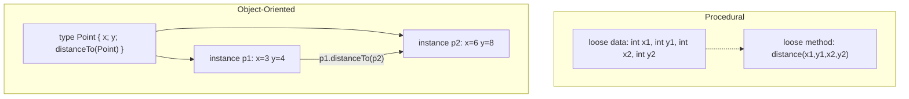

The class is the **type**; objects are **values** of that type. The class declaration is one-time and lives in `.class` metadata; the objects are many and live on the heap.

```java
// object-oriented style: data and behaviour bundled
public class Point {
    int x;
    int y;
    double distanceTo(Point other) {
        int dx = other.x - x, dy = other.y - y;
        return Math.sqrt(dx*dx + dy*dy);
    }
}

// elsewhere…
Point a = new Point();  a.x = 3;  a.y = 4;
Point b = new Point();  b.x = 6;  b.y = 8;
double d = a.distanceTo(b);   // 5.0
```

That tiny example contains everything this topic explains: a class declaration (the *type*), two `new` expressions (object *creation*), four instance-field assignments (object *state*), one method call on an instance (object *behaviour*). The rest of this topic peels back every layer of that mechanism.

### Why Java's OOP Has This Specific Shape

Java's class model isn't arbitrary — every design decision answers a *specific* problem the language designers (James Gosling, Bill Joy, et al., starting 1991) had with the OOP languages they knew. The shape of Java OOP is best understood as a deliberate set of trade-offs from C++ and Smalltalk:

**Simula 67** (Dahl, Nygaard — Norway, 1967) invented OOP for *discrete event simulation* — modelling ships in a harbour, customers in a bank queue. Each entity was an *object* with its own state; classes defined entity types. The vocabulary "class, object, instance, inheritance" all comes from Simula.

**Smalltalk** (Kay, Ingalls — Xerox PARC, 1972–80) generalised Simula to "everything is an object": integers, characters, even classes themselves are objects you send messages to. The slogan: *"computing as biology — cells communicating by message-passing."* Beautiful, slow (1980s hardware couldn't make it competitive with C), and the conceptual ancestor of Java's universal `Object` root.

**C++** (Stroustrup — Bell Labs, 1979) bolted OOP onto C as an opt-in feature. Classes are zero-overhead by default (no header, no vtable unless you write `virtual`); multiple inheritance is allowed (with the diamond problem as a cost); memory is manual (you `delete` what you `new`); references can dangle. C++ was *fast* but unsafe and intricate.

**Java 1.0** (1995) was deliberately pitched as *"C++ for the network"*: keep the C-like syntax and the OO model, drop the dangerous parts (pointer arithmetic, manual delete, multiple inheritance, templates initially), add a GC, make everything portable via bytecode. The specific choices and their motivations:

| Java decision | Why (vs the alternative) |
|---------------|--------------------------|
| **Single inheritance of classes** | The C++ diamond problem made multiple inheritance error-prone. Java sacrifices expressiveness for clarity; interfaces (Java 8+ with defaults) recover *behaviour* multi-inheritance without state. |
| **All references** (objects are never inlined into other objects) | Avoids C++'s "slicing" bug when assigning a subclass instance to a parent-typed value. Cost: an extra pointer indirection per object. |
| **Primitives are separate** (`int`, not `Integer` only) | Smalltalk had only objects — even `1 + 1` was message-passing; performance was bad. Java keeps primitives as raw machine values for arithmetic speed and uses wrapper classes when generics or `Object` references are needed. The split is a 1995 pragmatic compromise; Project Valhalla is the long-term unification. |
| **Universal `Object` root** | Smalltalk's universality made reflection and generic containers uniform. Java preserves this; every object carries a 12-byte header that supports `hashCode`, `equals`, `getClass`, monitor methods (for `synchronized`), and GC marking. |
| **Mark-word header on every object** | Lets `synchronized` work on *any* object without a separate lock table; lets `hashCode` be O(1) without a side map; lets the GC track ages and forwarding pointers in-place. The cost: 12 bytes per object even for empty ones. C++ pays 0 unless you opt in to `virtual`; Java pays 12 always. |
| **Garbage collection** | C++'s `delete` causes use-after-free, double-free, leaks. Java's GC eliminates these entirely. Cost: GC pause time, unpredictable allocation throughput at scale (mitigated by TLAB, generational design). |
| **Bytecode + JVM** | Portability: write once, run anywhere. Cost: warm-up time before JIT optimizes (mitigated by AOT via GraalVM Native Image). |

The pattern: Java consistently picked **safety + uniformity + simplicity** over **speed + flexibility**, then closed the speed gap through JVM engineering (JIT, escape analysis, intrinsics). The result: object construction is ~5× slower than C++'s for tiny objects in isolation, but Java's hot inner loops match C++ within a few percent because the JIT does for you what C++ programmers must do by hand (inlining, allocation elision, vectorization).

This historical context matters because **every concept later in this topic is a direct consequence of these choices**:

- The 24-byte `Point` (8 bytes of payload, 12 bytes of header, 4 of pad) is *unavoidable* given universal `Object` + mark word + klass pointer. C++'s equivalent struct is 8 bytes.
- The `new` opcode's three-step sequence (`new + dup + invokespecial`) is the bytecode-level expression of *separating allocation from initialization* — required because the JVM allows constructors to throw, leaving the half-allocated object as garbage.
- The reference-vs-object distinction (next section) is forced by *all-references-for-objects*; it's why you cannot allocate a `Point` "on the stack" by declaring it the way C++ does (`Point p;` in C++ is stack-allocated; in Java the same syntax declares a null reference).
- Escape analysis (later section) exists precisely to claw back the C++ stack-allocation pattern *automatically* when the JIT proves it's safe.

Once you see Java's design as a 1995 reaction to C++ that has been incrementally walking back its safety/speed compromises ever since (records, sealed types, pattern matching, Project Valhalla), the *what* of every later mechanism makes sense.

### The Data-Oriented Counter-Position

OOP's central claim is "co-locate data with the operations on it for *modular reasoning*." A `Point` knows how to compute distances to other points; readers of `Point.distanceTo` can ignore the rest of the program. This is the **locality of change** benefit.

But there's a counter-position from the games industry and high-performance computing: **OOP fights against the hardware**. Modern CPUs are 100–200× faster than main memory; performance is dictated by cache locality, not by clean abstractions. The OOP "array of objects" layout (`Point[] points`) places each Point on a separate heap allocation, each with a 12-byte header — so iterating a million Points touches ~24 MB of memory with 1 million pointer indirections, and the CPU's prefetcher cannot help because the next Point's address depends on the current one's contents.

The **data-oriented design (DOD)** alternative: store the same data as **parallel primitive arrays** (`int[] xs; int[] ys;`). Memory footprint drops to 8 MB; iteration becomes a stride-1 scan the hardware prefetcher streams perfectly; SIMD vectorization becomes possible. The same `distanceTo` computation runs **5–20× faster** on a million points.

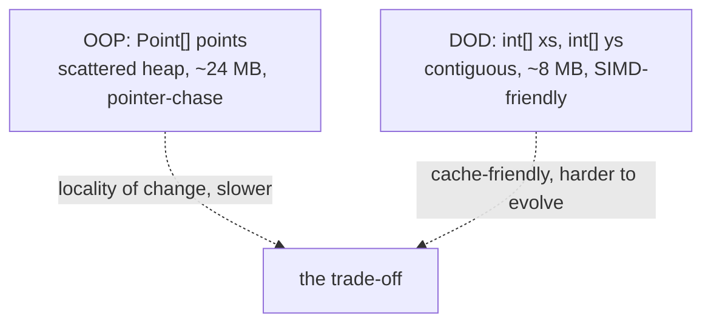

Most application code never hits this — domain logic spends time waiting on I/O, not on cache misses. But for hot numerical paths (graphics, simulations, ML, analytics) DOD wins decisively. Java's response is **records** + **Project Valhalla** (inline classes) which let you express DOD-style layouts while keeping OOP-style syntax. This trade-off — *modelling clarity* vs *machine sympathy* — is the most important context-aware decision in modern Java performance work, and the existing literature framing it as "OOP good / OOP bad" misses the point. **Use OOP for the 95% of code where reasoning dominates; reach for DOD layouts in the 5% where cache matters.**

## The Class Declaration: The Blueprint

A class declaration introduces a new type into the program. The minimal form:

```java
class Point {
    int x;
    int y;
}
```

That's a legal Java class. It introduces a new type called `Point`. Its **instances** are objects with two `int` fields named `x` and `y`. The class has no explicit constructor, so Java synthesizes a **default no-arg constructor** that does nothing special (full constructor coverage in [T02](./T02-fields-methods-constructors-this.md)).

Anatomy of the declaration:

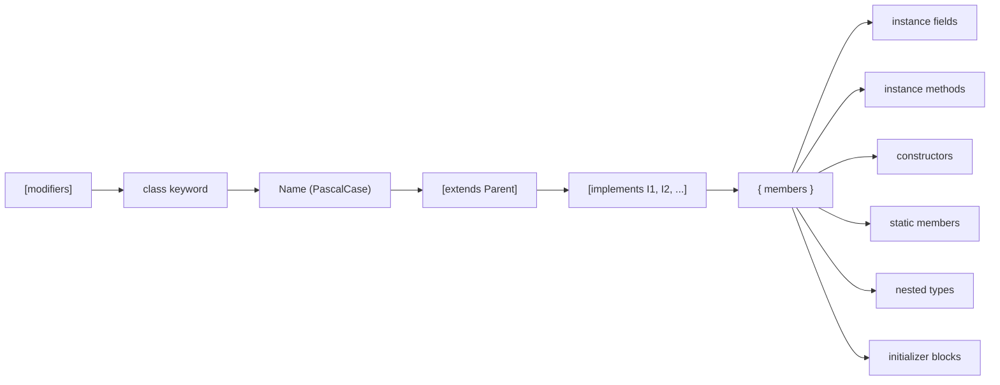

The `extends`/`implements` clauses, modifiers, constructors, static members, nested types, and initializer blocks all get their own topics ([T03](./T03-encapsulation-and-access-modifiers.md), [T04](./T04-inheritance-and-super.md), [T08](./T08-interfaces-default-static-private-methods.md), [T11](./T11-static-members-blocks-and-nested-classes.md), [T12](./T12-inner-local-and-anonymous-classes.md)). This topic focuses on the **core**: the class name, the instance fields, the instance methods, and what happens when you say `new`.

### The File-Name Rule (Recap from L0)

A **public** class must live in a file whose name exactly matches the class name plus `.java`. A non-public class can share a file with another class (only one public class per file, though). This is a [L0/C02/T01](../../L0-foundations/C02-java-core/T01-program-structure-class-main-statements.md) recap — the rule is enforced by `javac` because the build system needs to know which `.class` file holds which type when resolving references from other files.

```
Point.java     ←  public class Point { ... }       OK
Point.java     ←  public class Triangle { ... }    COMPILE ERROR
Point.java     ←  class Triangle { ... }           OK (Triangle is not public)
```

### Instance Fields

A **field declaration** inside a class — outside any method — declares an **instance field**: a variable that **every object of this class has its own copy of**. Three `Point` instances mean three `x` fields and three `y` fields, all in distinct memory.

```java
class Point {
    int x;          // each Point has its own x
    int y;          // and its own y
    double mass;    // and its own mass (defaults to 0.0)
    Point next;     // and its own next reference (defaults to null)
}
```

A field declaration is **not** a statement; it cannot use `var`, cannot include arbitrary expressions (only initializer expressions evaluated during object construction). The order of fields in the source has **no semantic significance for the language** (resolution is by name, not position) — but the JVM may **reorder them in memory** for alignment, covered in [§ Object Memory Layout](#object-memory-layout-in-the-heap).

### Field Default Values

Unlike local variables (which require definite assignment before use — [L0/C02/T15](../../L0-foundations/C02-java-core/T15-variable-scope-and-lifetime.md)), **instance fields are automatically initialized to the type's zero value** when the object is allocated. The JVM zeroes the entire object's field area before the constructor runs.

| Type | Default | Bit pattern |
|------|---------|-------------|
| `byte`, `short`, `int`, `long` | `0` | all zeros |
| `float`, `double` | `0.0` | all zeros (positive zero) |
| `char` | `''` | all zeros |
| `boolean` | `false` | a zero byte |
| Any reference type | `null` | all zeros |


**Why all-zero defaults matter**: the JVM uses a fast cleared-memory invariant for allocation — see [§ Architecture Layer: Allocation Speed](#architecture-layer-allocation-speed). The zero is **not** a "compiler convenience" — it is a **JVM safety contract**: an object's fields can be read at any time without risking garbage data, even before any user code runs.

> [!WARNING]
> Field defaults are **only** for fields, **not** for local variables. `int x;` inside a method does NOT default to 0 — the compiler refuses to read it until you write it. The rule difference exists because fields can be initialized through many paths (constructor + initializer + reflection + serialization), so the JVM provides a baseline; locals are exclusively your responsibility.

### A Working Class with Methods

Combine a field declaration with an **instance method** declaration:

```java
public class Point {
    int x;
    int y;

    void translate(int dx, int dy) {   // instance method — no `static`
        x += dx;                       // x is shorthand for this.x
        y += dy;
    }

    double distanceTo(Point other) {
        int dx = other.x - x;
        int dy = other.y - y;
        return Math.sqrt(dx*dx + dy*dy);
    }
}
```

An instance method **operates on a specific object**. Inside it, the unqualified names `x` and `y` refer to **the receiver's** fields — the `Point` on which the method was called. There is an implicit hidden parameter called `this` that the method body can use; full coverage in [T02 (Fields, methods, constructors, this)](./T02-fields-methods-constructors-this.md). The contrast with `static` methods (from [L0/C02/T12](../../L0-foundations/C02-java-core/T12-methods-parameters-return-values.md)) is sharp: `static` methods have **no `this`**, no receiver, and cannot reach instance fields by unqualified name.

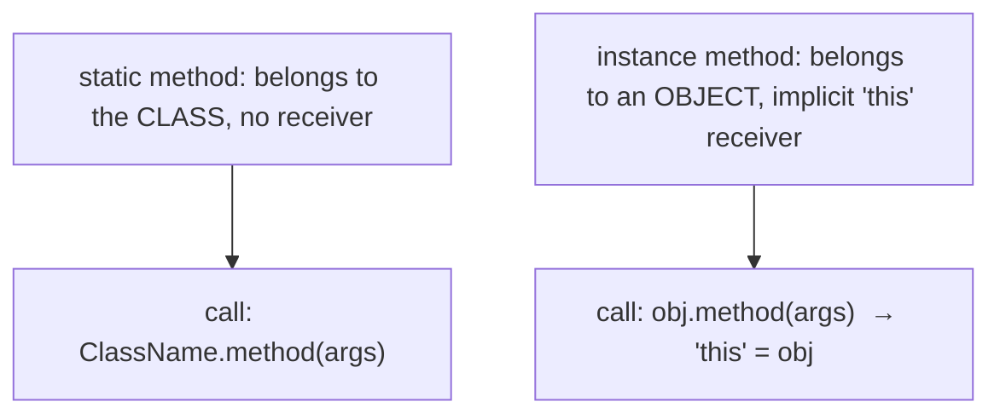

## Creating Objects with `new`

To produce an instance of a class, use the `new` expression. The basic form is `new ClassName(args)`. The result is a **reference** to a freshly allocated object.

```java
Point p = new Point();   // create a Point with default fields (x=0, y=0)
p.x = 3;                 // set its fields
p.y = 4;
System.out.println(p.x); // 3
```

Three things happen, in this order:

1. **Allocate** — the JVM carves space for a new object on the heap and zeros its field area.
2. **Initialize** — the JVM runs any instance initializer blocks (preview in [T11](./T11-static-members-blocks-and-nested-classes.md)) and the chosen constructor.
3. **Return** — the `new` expression yields a **reference** to the new object, which you usually store in a local, field, or array slot.

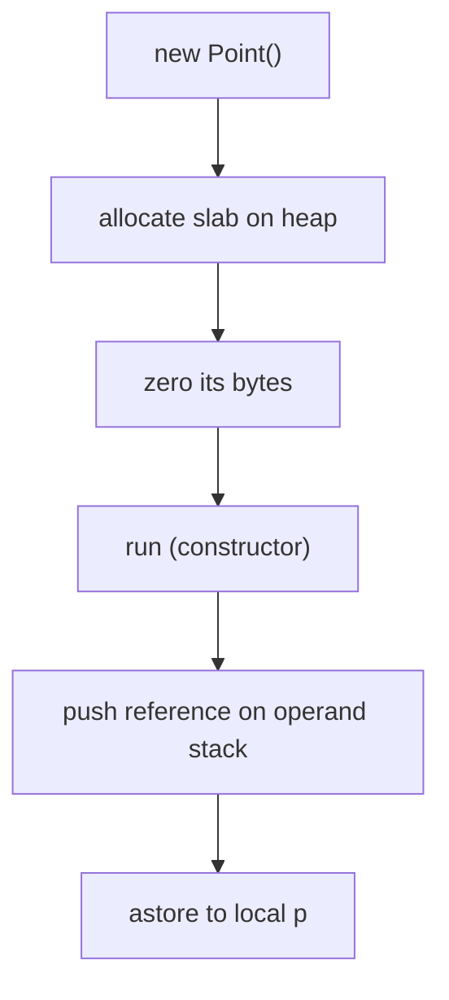

Each `new` produces an **independent** object. Two `new Point()` expressions in the same method give you two distinct heap objects, even if every field is equal. Their **identity** is different (covered in [§ Identity vs State](#identity-vs-state)).

### Calling Instance Methods

You call an instance method by writing `receiver.method(args)`. The receiver is the object you're operating on; `this` inside the method binds to it.

```java
Point a = new Point();   a.x = 3;  a.y = 4;
Point b = new Point();   b.x = 6;  b.y = 8;
double d = a.distanceTo(b);   // 5.0 — a is `this` inside distanceTo
```

If the receiver is `null`, the call throws **`NullPointerException`** before the method body even starts (full coverage in [T03/T11 of L0](../../L0-foundations/C01-cs-foundations/T11-reading-errors-and-stack-traces.md) — the receiver-null check is one of the three implicit checks the JVM runs).

```java
Point p = null;
p.translate(1, 1);   // NPE — receiver is null
```

### The `null` Reference

A reference variable holds either a **valid reference** to a heap object, or the special value **`null`** (all-zero bits — see [L0/C02/T03 literals & null](../../L0-foundations/C02-java-core/T03-literals-and-constants-final.md)). `null` is type-compatible with any reference type but points to no object; dereferencing it (calling a method on it, accessing a field of it) throws `NullPointerException`.

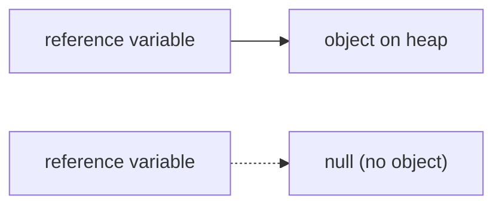

A common idiom is to use `null` as a sentinel — "no value yet" or "end of list" — but it is a frequent source of bugs (Tony Hoare's "billion-dollar mistake"). [Optional](../C02-collections-and-core-apis/T19-optional.md) is the modern alternative for return values; full discussion in L1/C02. We will see `null`-handling patterns throughout L1.

## Reference vs Object — The Two-Layer Mental Model

This is the **single most important** concept in this topic and one of the deepest sources of confusion for new Java programmers. **A reference variable is not the object.** The variable is a small slot (4 bytes with compressed oops on, 8 without) that holds the **address** of an object somewhere on the heap. The object itself is a separate, larger, heap-resident blob.

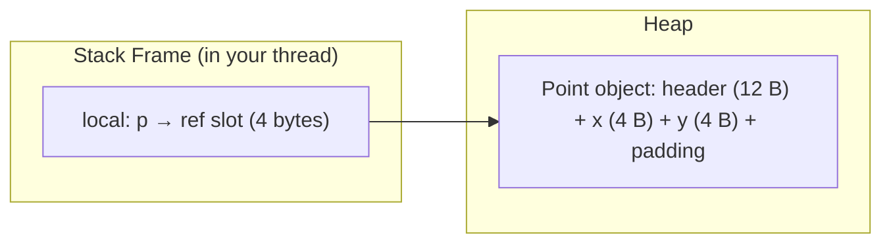

Two consequences flow from this distinction:

**1. Many references can point to one object.** Assigning `Point q = p;` does not copy the object — it copies the **reference**. After the assignment, both `p` and `q` refer to the *same* heap object. Mutating through one shows up through the other.

```java
Point p = new Point();   p.x = 3;
Point q = p;             // q and p both refer to the SAME object
q.x = 99;
System.out.println(p.x); // 99  — p and q share state
```

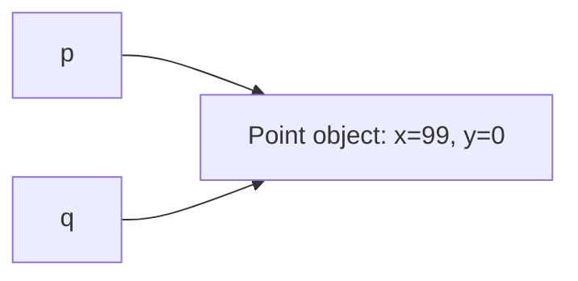

**2. Reassigning a reference does not mutate the object.** Writing `p = new Point()` makes `p` point to a *new* object; the old one is now reachable only through other references (or unreachable, eligible for GC).

```java
Point p = new Point();   p.x = 3;       // object #1 with x=3
Point q = p;                            // q points to object #1
p = new Point();         p.x = 99;      // p now points to object #2
System.out.println(q.x); // 3 — q still on object #1
System.out.println(p.x); // 99
```

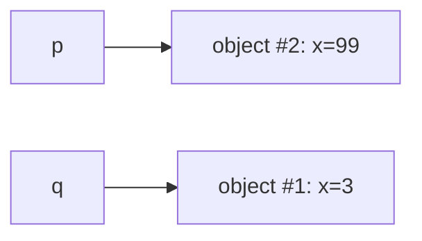

This is the same pass-by-value point made in [L0/C02/T12](../../L0-foundations/C02-java-core/T12-methods-parameters-return-values.md): Java passes the **value of the reference**, not the object. Reassigning the parameter inside a method has no effect on the caller; mutating the object through the parameter does.

> [!INTERVIEW]
> "Is Java pass-by-reference for objects?" The correct answer is **no** — Java is **strictly pass-by-value**. For object types the value being copied is **the reference** (a small address-like thing), not the object. You can prove this by trying to *reassign* a parameter inside a method: the caller's variable stays put. Pass-by-reference would let that reassignment escape; Java cannot.

### Reference Variables Are Typed

A reference variable has a **declared type** (the static type known to the compiler) which constrains which methods you can call on it. The **runtime type** (the actual class of the object) can be the declared type or any subclass.

```java
Object o = new Point();   // declared Object, runtime Point
// o.x ← compile error: Object has no x field
// only Object's methods (toString, equals, hashCode, ...) are callable
```

This is **upcasting** (free, no runtime check) — full coverage in [L0/C02/T05](../../L0-foundations/C02-java-core/T05-type-conversion-and-casting.md) and revisited in [T04 (Inheritance)](./T04-inheritance-and-super.md) / [T06 (Polymorphism)](./T06-polymorphism-compile-time-vs-runtime.md). The point for now: the **reference type** determines compile-time access; the **object's runtime class** determines which method body actually runs (dynamic dispatch — [T05 method overriding](./T05-method-overriding.md)).

### The Aliasing Problem — Why References Are Hard

The deep cost of "many references to one object" is **aliasing**: two variables that refer to the same object are now *coupled* in a way the source code doesn't show. Mutate through one, the other observes the change. This is the **single largest source of bugs in object-oriented code** — and the reason languages designed after Java (Rust, Pony, Swift) treat aliasing as a first-class concern.

A worked example that bites everyone at some point:

```java
List<String> originalNames = new ArrayList<>();
originalNames.add("Alice");
originalNames.add("Bob");

Customer c1 = new Customer(originalNames);
// 1000 lines later, in a totally different method:
originalNames.add("Charlie");

System.out.println(c1.getNames());   // [Alice, Bob, Charlie]  ← unexpected!
```

`c1` stored the *reference* to `originalNames`, not a copy. The mutation 1000 lines later silently propagates into `c1`'s state. The `Customer` class's invariants — whatever they were — can be violated by code outside the class, with no compile-time warning.

Three defensive patterns Java code uses to manage aliasing:

**1. Defensive copy in the constructor and getter.** Snapshot the input on the way in; never return the internal reference.

```java
public final class Customer {
    private final List<String> names;
    public Customer(List<String> names) {
        this.names = new ArrayList<>(names);   // snapshot in
    }
    public List<String> getNames() {
        return new ArrayList<>(names);          // snapshot out
    }
}
```

Cost: two array allocations per construction-plus-read cycle, plus the memory of the copies. For large collections this is wasteful.

**2. Unmodifiable views.** Wrap the collection in a read-only view; the caller cannot mutate, but the original list can still be mutated by the owner.

```java
public List<String> getNames() {
    return Collections.unmodifiableList(names);
}
```

Cost: the wrapper object, plus the fact that the original is still mutable (you've just hidden the mutator from the caller, not eliminated it).

**3. Immutability.** Use `List.copyOf(names)` (Java 10+) to take an immutable snapshot. Now the reference can be shared with any number of callers because no one can mutate it.

```java
public Customer(List<String> names) {
    this.names = List.copyOf(names);   // immutable snapshot
}
public List<String> getNames() {
    return names;                       // safe to share; no defensive copy
}
```

Cost: one allocation at construction; zero at every read. **This is why "prefer immutability" is real advice, not a style preference** — it eliminates an entire category of aliasing bugs while reducing per-call allocation. Records make every field `final` automatically; `String`, `Integer`, `LocalDate`, every wrapper, every `List.of(...)`-created list is immutable; the JDK's modern API consistently produces immutable collections.

### Java vs Rust vs C++ — The Aliasing Trade-off

Different languages handle aliasing differently, and the trade-offs are instructive:

| Language | Aliasing rule | Enforcement | Cost |
|----------|---------------|-------------|------|
| **C++** | aliasing is allowed; programmer responsibility to manage | none at compile time; UB at runtime | freedom; danger |
| **Java** | aliasing is allowed; immutability is voluntary | runtime exceptions when contracts break (`ConcurrentModificationException`, etc.) | flexibility; bug surface |
| **Rust** | aliasing of mutable data is forbidden | compile-time borrow checker rejects code | safety; learning curve |
| **Pony, Verona** | reference capabilities tagged in the type system | compile-time | research-language territory |

Rust's deep insight: at any moment, you can have **either** one mutable reference **or** many immutable references to a value, but **never** both. The compiler tracks this through *lifetimes* and *borrowing*. Code that would compile in Java (the example above) is *rejected by the Rust compiler*: you cannot hold both `originalNames` (which you later mutate) and a reference inside `c1` to the same data.

Java's path forward is incremental: more immutability by default (records, `Collection.copyOf`), more sealed types for closed hierarchies, better null tracking (still aspirational). But Java will never adopt Rust's borrow checker because retrofitting it would break every existing library. **The lesson: in Java, immutability is the discipline that recovers what Rust gets for free.**

### Why You Cannot Stack-Allocate an Object in Java (Source-Visible)

In C++, `Point p;` declares a `Point` instance on the stack — no heap allocation, no GC, deterministic destruction at scope exit. In Java, `Point p;` declares a **null reference** of type `Point`; the object only exists once you write `new Point()`, and it lives on the heap.

This is not a small difference. C++ programmers can write performance-critical code with hundreds of short-lived objects per microsecond, knowing each is a free stack bump. Java programmers writing the same code allocate on the heap, and the GC eventually reclaims — at the cost of per-allocation overhead and GC pressure.

Java's response has two parts:

1. **TLAB bump-pointer allocation** (see [§ Architecture Layer](#architecture-layer-allocation-speed)) makes heap allocation ~15–30 ns, comparable to (slower than but in the same order as) a stack push.
2. **Escape analysis** (see also [§ Architecture Layer](#architecture-layer-allocation-speed)) detects when an object never leaves a method and **eliminates the allocation entirely**, replacing the object's fields with CPU registers. When EA succeeds, the object effectively *is* stack-allocated, and the JIT achieves what C++ achieves syntactically.

The interesting case is when EA fails — when the object escapes (returned, stored in a field, passed to an un-inlined call). C++ programmers can still stack-allocate; Java programmers cannot. This is the residual cost of Java's all-references-for-objects choice, and it's one of Project Valhalla's main targets: **inline classes** (forthcoming) will let you mark a class as "behave like a value" and the JVM will allocate instances inline in the containing object or stack frame, bypassing the heap entirely.

## Memory Layer: What `new` Actually Does

Now that we have the conceptual picture, descend to the bytecode layer. `new` is **not** one opcode. The expression `Point p = new Point()` compiles to a precise **three-opcode sequence** plus a store. Run it through `javap -c`:

```java
public class Demo {
    public static void main(String[] args) {
        Point p = new Point();
    }
}
```

```
$ javap -c Demo
public static void main(java.lang.String[]);
  Code:
     0: new           #2          // class Point     ← allocate
     3: dup                       // copy ref         ← keep one for the constructor call
     4: invokespecial #3          // Method Point."<init>":()V   ← run constructor
     7: astore_1                  // store ref in local p
     8: return
```

Decoded:

1. **`new #2`** — the JVM looks up class `Point` in the constant pool, allocates an instance of it on the heap, zeros its fields, and **pushes the reference onto the operand stack**. This opcode performs allocation but does NOT run any user code.
2. **`dup`** — duplicate the top operand-stack entry. Now the stack has **two copies** of the same reference.
3. **`invokespecial Point."<init>":()V`** — call the constructor (`<init>` is the JVM internal name for the constructor synthesized from your source). `invokespecial` **consumes one of the two references** as the receiver (`this` inside the constructor). After the constructor returns, **one copy is still on the stack** — the reference to the now-fully-initialized object.
4. **`astore_1`** — pop the remaining reference and store it in local slot 1 (the variable `p`).

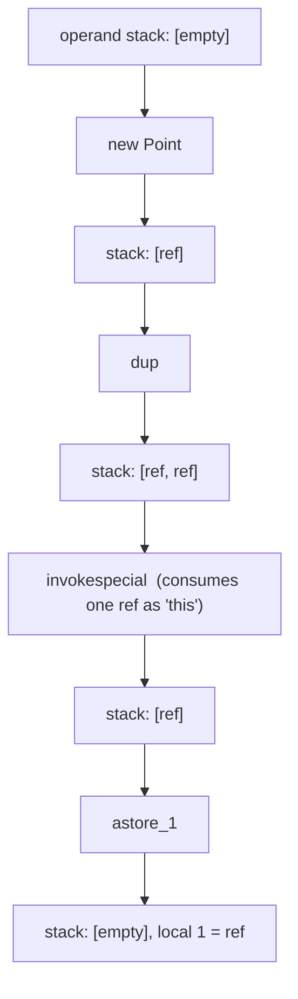

The `dup` exists because `invokespecial` *consumes* its receiver argument off the stack — without `dup`, the reference would be gone after the constructor call and we'd have nothing to store in `p`. This three-opcode pattern is **invariant** across every constructor call in Java.

### Why Allocation Is Separated From Initialization

The three-opcode pattern raises a question every JVM designer thought hard about: *why not combine `new + invokespecial` into one "create-and-init" opcode*? The C++ `new` keyword does exactly that. JavaScript's `new` keyword does too. Why does the JVM split them?

The answer reveals a key property of Java: **constructor exceptions are recoverable, and the partially-allocated object must be cleanly discardable.** Consider:

```java
public Point(int x, int y) {
    if (x < 0) throw new IllegalArgumentException();
    this.x = x;
    this.y = y;
}

Point p = new Point(-1, 0);   // throws inside the constructor
```

The sequence at runtime:

1. `new Point` — allocates 24 bytes on the heap, zeroes fields, installs header. The reference is on the operand stack.
2. `dup` — now two copies on stack.
3. Push `-1`, push `0`.
4. `invokespecial Point.<init>(II)V` — runs the constructor body.
5. Inside the constructor: `throw new IllegalArgumentException()`. The constructor *does not return normally*.
6. The exception unwinds the JVM frame stack. The operand stack at the throw site is abandoned.
7. The duplicated reference on the *caller's* operand stack is abandoned.
8. The allocated 24-byte object on the heap is now **unreachable from any local variable, field, or stack**. The GC will reclaim it.

The clean separation makes this work. If `new` had been "allocate-and-init" as one opcode, the verifier and runtime would need extra machinery to handle the half-initialized object: where does the partial object live during the throw? Who owns it? Can finalizers see it? By splitting allocation (which never fails after class loading) from initialization (which can throw), the JVM gets a simple rule: **if `<init>` throws, the allocated object is garbage**.

Compare with C++: a thrown exception from a constructor's body triggers the destructors of *successfully-constructed* sub-objects (member variables, base classes), then propagates. The complexity of "what's been constructed so far?" is real and explicit. Java sidesteps it: the half-initialized object simply becomes garbage; no destructor mechanism; no partial-construction tracking. **The split-opcode design is the structural reason Java doesn't need destructors.**

A worked consequence: when a constructor's `super(...)` call throws, the subclass's fields are *not* zeroed-and-then-discarded — they were never set; the object's *partial* construction extended only as far as the super-constructor's progress. The whole half-object becomes garbage; finalizers (deprecated) historically still ran on it, which was a security hole; Java 7+ uses verifier rules + `Object.finalize` removal to plug it.

### Why `new` Zeros The Field Area

The JVM specification requires that field reads on a freshly-allocated object see the type's default (zero for primitives, null for references) — never garbage. This means the JVM **must** zero the field area before user code (including `<init>`) sees the object.

Why is this even a question? Because zeroing is *not free*: writing 16+ bytes per allocation adds up. A million allocations/second means writing ~16 MB/s of zeros — measurable on tight benchmarks.

The alternative would be C-style `malloc` that returns memory whose contents are *unspecified* (typically whatever the previous owner left). Java rejects this because:

1. **Security.** Unzeroed memory may contain sensitive data from a previously-collected object. A new `Point` reading garbage in its fields could leak passwords or keys from a previous occupant.
2. **Determinism.** Without zeroing, the value of a field that wasn't explicitly set would depend on previous allocation history — a non-deterministic bug source.
3. **Constructor convenience.** `<init>` only has to set fields that differ from the default. Without zeroing, every constructor would need to explicitly set every field.

HotSpot's TLAB-allocator zeroes the field area **as part of the bump-pointer step**, using vectorized stores (AVX-256 or wider on x86, NEON on ARM) so the cost is small — ~5–10 ns for a 24-byte object. The hardware can pipeline the zeroing with subsequent constructor stores, hiding much of the cost.

### `<init>` vs `<clinit>`

Two special method names appear in the JVM that have no corresponding source-level syntax:

- **`<init>`** — the **instance initializer** method. The compiler synthesizes one per constructor in your source. It runs once **per `new`**. It corresponds to "the constructor."
- **`<clinit>`** — the **class initializer** method. The compiler synthesizes at most one per class. It runs once **per class** when the class is first initialized (see next subsection). It holds the static field initializers and `static { }` blocks (see [T11](./T11-static-members-blocks-and-nested-classes.md) and [L0/C02/T15](../../L0-foundations/C02-java-core/T15-variable-scope-and-lifetime.md)).

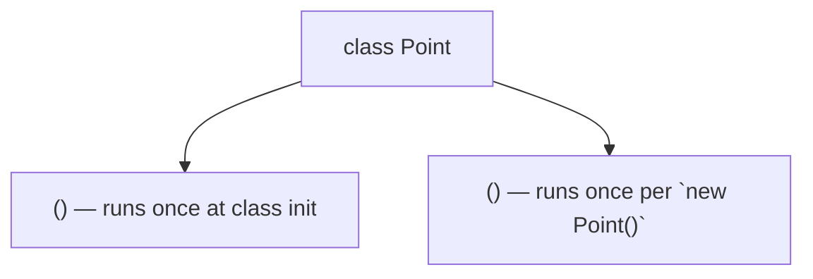

Confusing them is one of the most-asked interview points: "When does `<clinit>` run? When does `<init>` run?" Answer: `<clinit>` at first active use of the class; `<init>` every time you call `new`.

### What `new` Allocates (with no fields shown yet)

The `new` opcode performs a series of steps inside HotSpot (the reference JVM):

1. **Resolve the class** — if the class isn't loaded yet, trigger loading + initialization (next section).
2. **Compute the instance size** — the JVM knows from the class's metadata how many bytes the instance needs (header + fields + padding).
3. **Carve the slab from the TLAB** — see [§ Architecture Layer](#architecture-layer-allocation-speed) — a per-thread fast-path that takes a few nanoseconds.
4. **Zero the field area** — required for the field-default contract.
5. **Write the object header** — install the mark word and klass pointer (see next).
6. **Push the reference on the operand stack** — done.

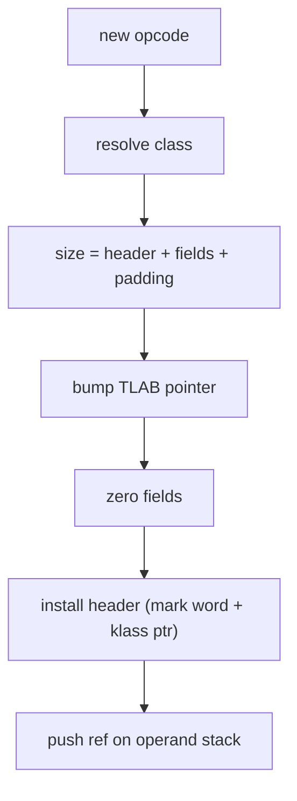

That's what `new` does **before** any user-written code runs. Then `<init>` runs to apply your constructor logic.

## Object Memory Layout in the Heap

Every object on the HotSpot heap has the **same fundamental shape**:

```
+----------------------+----------------+----------+
| Object Header        | Instance Fields| Padding  |
+----------------------+----------------+----------+
  12 bytes (compressed)  variable        0..7 bytes
  16 bytes (uncompressed)
```

### The Header

The header is the JVM's **per-object metadata** — every object pays this cost. On a 64-bit HotSpot with default settings (compressed oops + compressed class pointers, both default since Java 8+), the header is **12 bytes**: 8 bytes for the **mark word** and 4 bytes for the **klass pointer**.

```
byte offset 0  1  2  3  4  5  6  7    8  9  10 11
            +-----------------------+ +-----------+
            |     mark word (8 B)   | | klass(4 B)|
            +-----------------------+ +-----------+
```

**Mark word** (8 bytes on 64-bit): packs several pieces of per-object state into one machine word:

```
bits  63                                3   2  1  0
      [           identityHashCode        | age | bias|locked|
                                          | (4) | (3-bit)    |
```

- **GC age bits** — count of how many GC cycles this object has survived; promotes to old gen at threshold.
- **Lock state bits** — whether the object's monitor is held; biased / lightweight / heavyweight indicators (biased locking was removed in JEP 374 / Java 15+).
- **Identity hash code** — lazily computed value returned by `Object.hashCode()` for an object that has not overridden it; cached in the mark word so successive calls are free. Until first `hashCode()` call, this field is zero.
- **Marked-for-GC bit** during collection (transient).

**Klass pointer** (4 bytes with compressed class pointers): identifies which class this object is an instance of. To find an object's class at runtime, the JVM reads this pointer, then chases it into Metaspace where the class's `Klass` structure lives (`Klass` holds the vtable, the field-offset table, the constant pool reference, etc.). Compressed class pointers (default on) store the pointer in 4 bytes by treating the Metaspace as <4 GB and shifting; without compression it's 8 bytes.

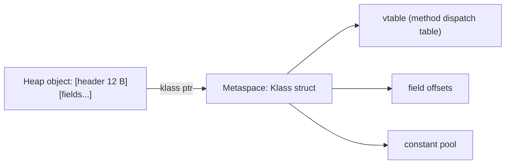

### Instance Fields

After the header come the instance fields, **laid out by descending size class** (8-byte longs/doubles first, then 4-byte ints/floats/references-with-compressed-oops, then 2-byte shorts/chars, then 1-byte bytes/booleans). The reason is alignment: putting big fields first packs the small ones into the trailing space without holes.

For our `Point { int x; int y; }`:

```
byte offset:   0..11      12..15   16..19   20..23
               +--------+ +------+ +------+ +------+
               | header | |  x   | |  y   | | pad  |
               +--------+ +------+ +------+ +------+
total size = 24 bytes
```

The 4-byte trailing padding is added to make the **whole object size a multiple of 8** — every HotSpot object is 8-byte aligned by default (`-XX:ObjectAlignmentInBytes=8`). The alignment matters for two reasons: (1) compressed oops can encode the address in 32 bits when the heap is up to **32 GB** because 35-bit virtual addresses divided by 8 fit in 32 bits; (2) CPUs do 8-byte loads/stores efficiently.

A more interesting layout — a class with mixed-size fields:

```java
class Person {
    boolean active;   // 1 byte
    int age;          // 4 bytes
    long id;          // 8 bytes
    String name;      // 4-byte reference (compressed)
}
```

After the 12-byte header, javac thinks of these in source order: `active, age, id, name`. The HotSpot allocator **reorders** them by descending size:

```
byte offset:    0..11      12..19    20..23  24..27   28..31   total = 32
                +--------+ +--------+ +----+ +------+ +-------+
                | header | |   id   | | age| | name | | active|
                +--------+ +--------+ +----+ +------+ +-------+
                            (long 8B)  (int) (ref 4B)  (bool 1B)
                                                       +3 pad to 8-align
```

The source order is **not** the memory order. You can observe the actual layout with the **JOL** (Java Object Layout) tool — `-jar jol-cli.jar internals Person` prints a byte-by-byte dump.

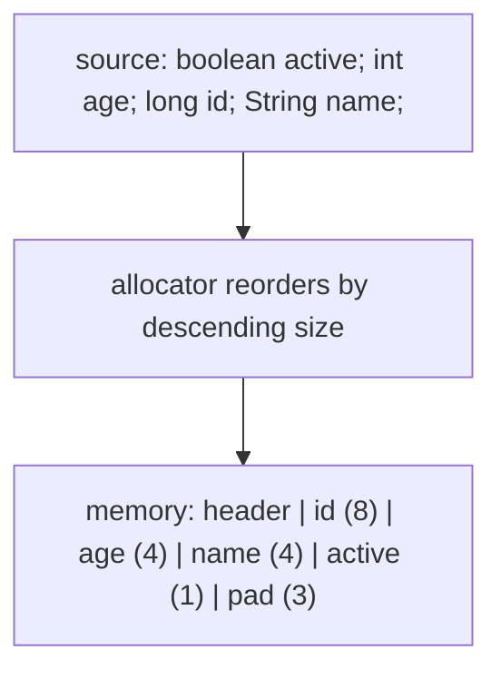

> [!IMPORTANT]
> Field **declaration order does not equal memory order**. Two fields of the same size *do* preserve source order relative to each other, but mixed sizes get reshuffled by the JVM. If you need a guaranteed layout (e.g., for native interop or off-heap serialization), use a record or use `Unsafe`/`MemorySegment` with explicit offsets — never assume source order.

### Memory Cost — Concrete Examples

The object-header overhead is real and dominates for tiny objects. A `Point` with two ints carries **12 bytes of header for 8 bytes of payload** — 60% overhead. This is why the JVM is much faster at iterating an `int[]` than an array of `Point` objects.

| Class | Header | Fields | Padding | Total | Payload ratio |
|-------|-------:|-------:|--------:|------:|---------------|
| `Object` | 12 | 0 | 4 | **16** | 0% |
| `Point { int x, y }` | 12 | 8 | 4 | **24** | 33% |
| `Integer` (wrapper for int) | 12 | 4 | 0 | **16** | 25% |
| `Long` (wrapper for long) | 12 | 8 | 4 | **24** | 33% |
| `String` (Java 9+ compact) | 12 | 16 (coder, hash, hashIsZero, value ref) | 4 | **32** | (+ separate byte[]) |
| `Person` above | 12 | 17 | 3 | **32** | 53% |

A million `Point` objects = **24 MB**. A million `int[2]` = **24 MB** as well (because each int[2] also has a 16-byte header + 8 bytes + padding). A single `int[2_000_000]` storing the same data = **8 MB** + 16-byte header = **~8 MB**. That's a **3× memory difference** with major cache consequences. This is why "use primitive arrays where you can" is a real performance rule, not a nitpick.

### Why The Header Looks This Way — The Universal-Features Trade-off

Why does Java pay 12 bytes per object when C++ pays 0 by default? Because **every Java object can do five things that C++ objects cannot do without opt-in**:

1. **Carry its own identity hash** (`hashCode()` works on any object, returning a stable value for life). C++ has no equivalent without `std::hash<T>` and side tables.
2. **Be the target of `synchronized`** (every object has a monitor). C++ requires you to embed a `std::mutex` member explicitly.
3. **Know its runtime class** (`getClass()` returns the type even when the reference is `Object`). C++ requires `virtual` or RTTI, which adds its own per-object cost (vptr) only for classes that opt in.
4. **Participate in GC** (the mark word carries GC age, mark bits, forwarding pointers). C++ has no GC.
5. **Be reflectively introspected** (you can list fields, invoke methods by name). C++ has no built-in reflection.

The 12 bytes of header **buy all five features uniformly for every object**. This is what Smalltalk meant by "everything is an object" — and the cost is the universal header. In C++ you pay only for what you opt into; in Java you pay always.

The numbers, on a 64-bit compressed-oops JVM:

| Object kind | Header | Min payload | Min total | C++ equivalent |
|-------------|-------:|------------:|----------:|---------------:|
| Empty Java `Object` | 12 | 0 | 16 | C++ empty struct: 1 byte |
| Java `Integer` (boxed int) | 12 | 4 | 16 | C++ `int`: 4 bytes |
| Java `Long` (boxed long) | 12 | 8 | 24 | C++ `int64_t`: 8 bytes |
| Java cons cell (`Pair<Object, Object>`) | 12 | 8 | 24 | C++ `std::pair<void*, void*>`: 16 bytes |
| Java with one `virtual`-like behavior | 12 | (no extra) | 16 | C++ with vptr: 8 bytes |

The header overhead is most painful for *tiny* objects. A Lisp `(cons 'a 'b)` cell in Java is 24 bytes; in C++ or Lisp itself (using tagged pointers) it's 16. Functional code that creates millions of small immutable objects per second pays this overhead heavily, and it's the structural reason Scala — running on the JVM — had to add value classes (and is moving toward Project Valhalla inline types) to compete with native Haskell/OCaml on memory.

#### Alternative Header Designs

Other runtimes have chosen differently:

- **Smalltalk / pre-V8 JavaScript** used **tagged pointers**: the bottom bits of a 32-bit (or 64-bit) word encode the type. Small integers don't need a heap object at all — the value lives inside the reference. Floating-point and pointers each get an encoding. Saves the per-integer object allocation entirely.
- **V8 (modern JavaScript)** uses **hidden classes**: every object is map-backed (key → value), but the JIT infers a stable "shape" and lays the fields out contiguously. The result mimics Java's field layout dynamically without a static class declaration.
- **Python's CPython** stores **the type pointer + reference count** in every object header — ~28 bytes per object (the famous reason Python lists are memory-heavy). No GC marks because Python uses reference counting + a cycle collector.
- **Rust** has **no header at all** for owned values: a `struct Point { x: i32, y: i32 }` is exactly 8 bytes; no identity hash, no monitor, no GC marks. The cost: you must explicitly opt in to `Hash`, `Clone`, locks; no reflection; no universal `Object`.

Java's 12-byte universal header is in the middle of this design space — more overhead than Rust, less than CPython, comparable to Smalltalk's expanded objects (Smalltalk's most-common case is the tagged-pointer fast path).

#### The Path Forward — Project Valhalla

The 1995 Java design baked the universal header into every object. Twenty-five years later, that decision shows in:

- `Integer[1_000_000]` taking 5× the memory of `int[1_000_000]`.
- `HashMap<Integer, Integer>` taking ~80 bytes per entry vs ~16 in a primitive-keyed structure.
- Generic-collection iteration being ~5× slower than primitive-array iteration due to cache misses on indirection.

**Project Valhalla** is the multi-release answer: introduce **value classes** (originally "inline classes") that look syntactically like ordinary classes but have **no identity, no header, and no per-instance allocation** — they're laid out inline in containing objects, arrays, and stack frames, like C++ structs. The price: no `synchronized` on them, no `==` (only `equals`), no mutation. The reward: collections of value classes recover C-level memory density and cache locality.

```
// hypothetical Valhalla syntax (subject to change)
value class Point { int x; int y; }    // no header, 8 bytes per instance
Point[] points = new Point[1_000_000]; // 8 MB contiguous, like int[2_000_000]
```

Valhalla is the long-term resolution of the 1995 trade-off. For now (Java 21), the trade-off remains: pay 12 bytes per object always, with workarounds (primitive arrays, records-with-careful-design, off-heap memory via `MemorySegment`) for the cases that matter.

## Class Loading & Initialization

Before you can `new` a class, the JVM must **load** that class into the runtime. This is a five-phase process specified in JLS §12.2–12.6.

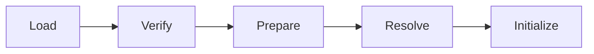

1. **Load** — find the `.class` file (via classloader delegation), read its bytes, parse the class file format, build the in-memory `Klass` structure in Metaspace.
2. **Verify** — check that the bytecode is well-formed: no stack underflow, no jumps out of method, type-consistent operands. This is what makes the JVM safe to run untrusted code.
3. **Prepare** — allocate space for **static** fields and initialize them to their type's zero value (NOT their declared initial value yet — that comes in step 5).
4. **Resolve** — replace symbolic references in the constant pool (class names, method signatures) with direct references (pointers/offsets). Lazy by default.
5. **Initialize** — run `<clinit>` if it exists: assign declared initial values to static fields and execute `static { }` blocks, in source order ([L0/C02/T15](../../L0-foundations/C02-java-core/T15-variable-scope-and-lifetime.md) recap).

**When does loading happen?** Lazily, at the **first active use** of the class. The JLS lists exactly six triggers:

- An instance is created with `new`.
- A static method is invoked.
- A static field is read or written (except a compile-time constant — see [L0/C02/T03](../../L0-foundations/C02-java-core/T03-literals-and-constants-final.md)).
- A subclass is initialized (parents always initialize first).
- The class is reflectively initialized via `Class.forName(name)`.
- The class is the main class of a JVM launch.

So `new Point()` may trigger the entire load+verify+prepare+resolve+initialize chain on the *first* call; subsequent `new Point()` calls skip straight to allocation.

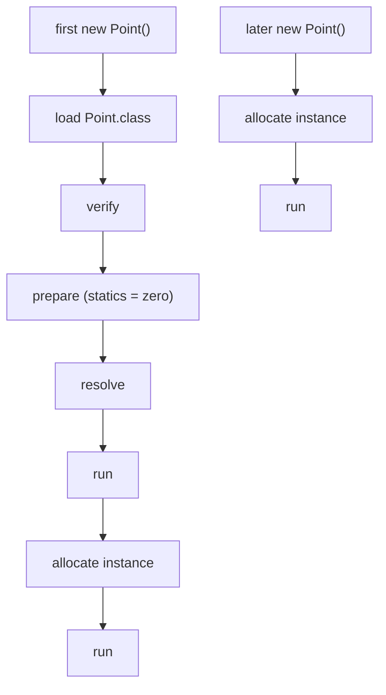

### Class Metadata Lives in Metaspace (Not the Java Heap)

Class metadata — bytecode, vtable, constant pool, field-offset table, method-info — lives in **Metaspace**, a separate native-memory region the JVM allocates outside the Java heap. Pre-Java-8 it lived in the "permanent generation" (PermGen) on the heap with a hard size cap; Java 8 moved it to Metaspace which grows on demand (limited by `-XX:MaxMetaspaceSize` and the OS).

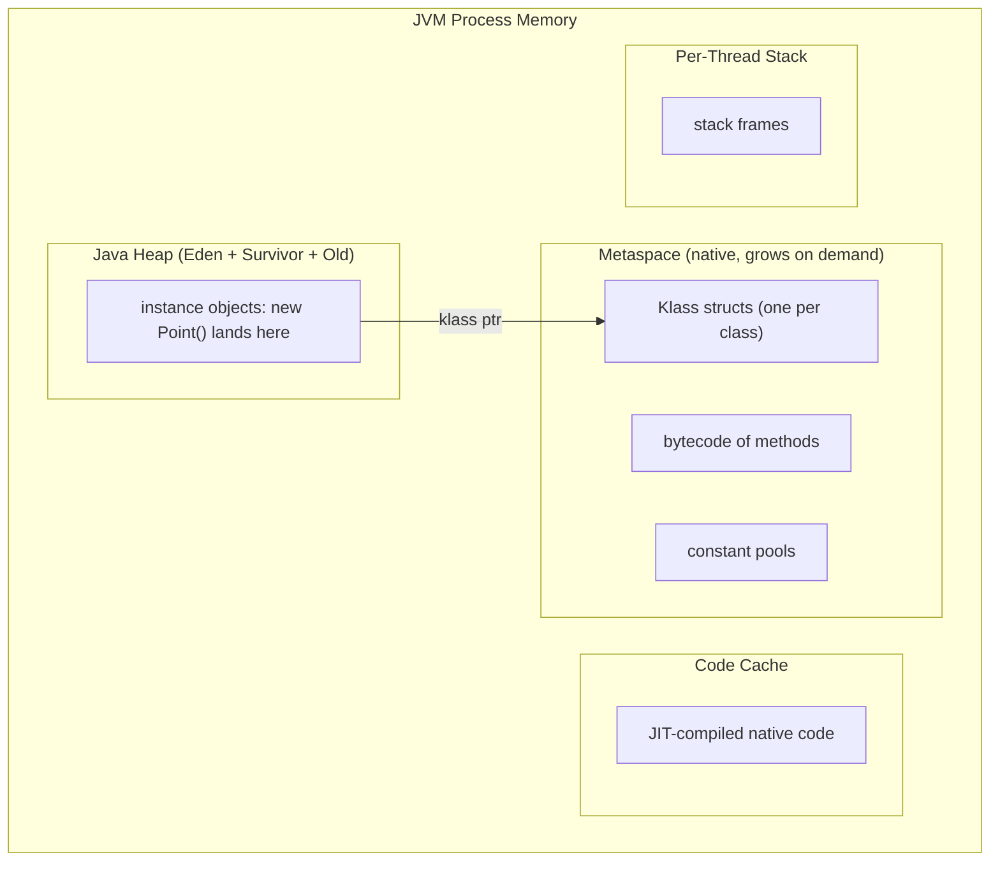

A `Class` object (the one returned by `obj.getClass()` or `Point.class`) **is** a heap object — but it's just a Java-visible handle that points to the underlying Metaspace `Klass`. The actual class metadata is **not** garbage-collected with normal heap; it's reclaimed when the classloader becomes unreachable.

> [!INTERVIEW]
> "Where does the bytecode of a method live at runtime — heap, stack, or somewhere else?" Metaspace (native memory). Per-method bytecode is stored in the method's `Method` struct inside the `Klass` struct. The JIT-compiled native version lives in the **Code Cache** (also off-heap). The Java heap holds only instance objects (and a few infrastructural objects like `Class` and `String` literals).

## Architecture Layer: Allocation Speed

Object allocation in Java is famously **fast** — measured in tens of nanoseconds for a small object on a warm path. The reason is the **TLAB** (Thread-Local Allocation Buffer) plus **bump-pointer allocation**.

### TLAB + Bump-Pointer Allocation

Each thread is given its own slice of **Eden** (the young generation's primary region) called a TLAB — typically 200 KB – 1 MB. The thread allocates new objects by **incrementing a pointer**: the TLAB has a `top` pointer; allocation is `address = top; top += size; return address`. No locks; no synchronization with other threads; no scanning a free list. The cost is **a few CPU cycles** for the pointer increment, plus the per-byte cost of zeroing the field area.

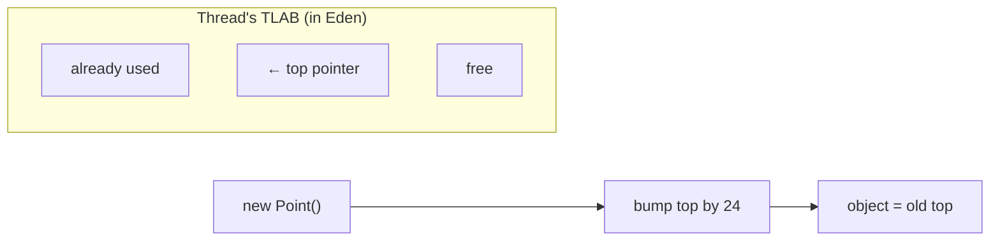

When the TLAB fills up, the thread requests another from the shared Eden region (this is a synchronized operation, but it amortizes over thousands of allocations). When Eden fills, a **young GC** triggers; survivors are copied to a survivor space, the rest is reclaimed wholesale.

**Numerical cost on modern hardware:**

| Operation | Approximate latency |
|-----------|---------------------|
| TLAB bump pointer (allocation) | ~5–10 ns |
| Field zeroing (24-byte object) | ~5–10 ns |
| Header initialization | ~2–3 ns |
| Constructor body (trivial) | ~2–5 ns |
| **Total for `new Point()`** | **~15–30 ns** |
| L1 cache hit | ~1 ns |
| Main memory load | ~80–100 ns |
| Lock acquire (uncontended) | ~10–20 ns |
| Young GC (per major slow-path collection) | ~ milliseconds, amortized |

Compare to C++ `new`: typically **100–500 ns** because malloc requires walking a free list and synchronizing across threads. Java's allocator beats C++ on raw allocation throughput; the cost shows up later in GC.

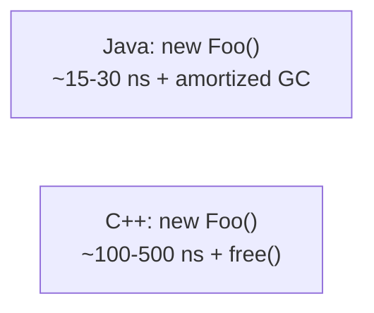

### Compressed OOPs: The 32-GB Heap Trick

A reference variable looks 4 bytes wide in most Java programs even though we run 64-bit. That's because of **compressed oops** — a HotSpot optimization that stores references as **32-bit values** and decodes them to 64-bit addresses on use.

The trick: HotSpot **aligns every object to 8 bytes** (the trailing padding we saw above), so the **bottom 3 bits of every heap address are always zero**. With 32 bits + 3 implicit zero bits = **35 effective bits** of address space = **32 GB of addressable heap** with 4-byte references.

```mermaid
flowchart LR
  R["32-bit compressed ref"] --> S["shift left by 3 (or scale by 8)"]
  S --> A["64-bit heap address"]
```

The encode/decode is a single shift instruction — essentially free. The savings are huge: a typical Java workload has references comprising **20–30%** of heap memory; halving each reference shrinks live heap by ~10–15% on average, improves cache hit rates, and reduces GC pressure.

Trade-offs:
- **`-XX:+UseCompressedOops`** (default) — 4-byte refs, up to 32-GB heap.
- **`-XX:-UseCompressedOops`** — 8-byte refs, no heap-size limit (well, address space limit).
- **Above 32-GB heap** the JVM disables compressed oops automatically.
- **`-XX:ObjectAlignmentInBytes=16`** would let compressed oops address 64 GB with 32-bit refs, but doubles per-object padding cost — rarely worth it.

### Escape Analysis & Scalar Replacement

The JIT (HotSpot C2 or Graal) performs **escape analysis** on every compiled method. It classifies every `new` allocation as:

- **NoEscape** — the object's reference never leaves the method (not stored in a field, not returned, not passed to an uninlined call).
- **ArgEscape** — passed to a method but doesn't escape that method.
- **GlobalEscape** — stored in a static field, returned, or thrown — escapes the world.

For **NoEscape** allocations, the JIT performs **scalar replacement**: the object is *never created on the heap*. Instead, its fields are promoted to **CPU registers or stack slots**, and the field-access code is rewritten to access them directly.

```mermaid
flowchart LR
  Before["new Point()<br/>fields x,y on heap<br/>access via klass ptr + offset"]
  After["EA: x,y in registers<br/>no allocation, no GC"]
  Before --> After
```

A worked example:

```java
double hypotSq(int a, int b, int c) {
    Point origin = new Point();    // looks like an allocation…
    int dx = a - origin.x;          // …but EA proves origin doesn't escape…
    int dy = b - origin.y;          // …so origin.x and origin.y become register reads…
    return dx*dx + dy*dy;           // …and the `new Point()` is GONE in the JIT.
}
```

With `-XX:+PrintEliminateAllocations` you can see the JIT report the elimination. The result: a method that *looked* like it allocates but allocates **zero bytes** in steady state.

EA fails when the reference escapes — assigning it to a field, returning it, passing it to an uninlined virtual call, or storing it in a global. In hot code, the JIT inlines aggressively (full coverage [L0/C02/T12](../../L0-foundations/C02-java-core/T12-methods-parameters-return-values.md) and L3/C02), which **expands the EA window** and eliminates more allocations.

> [!INTERVIEW]
> "Does `new` in Java always allocate on the heap?" Strictly under the JLS, yes — every `new` *appears* to. But under the as-if rule, the JIT may eliminate the allocation entirely via escape analysis. Hot, well-inlined code in modern JVMs allocates dramatically less than the source suggests. This is why "object pooling" in performance-critical Java is almost always counterproductive: the JIT already does it for you, and pooling defeats EA by making the object escape into a static collection.

### Tracing a Field Access from Source to CPU Instruction

Up to now the field-access discussion has been at the bytecode level (`getfield x`, `putfield x`). The bytecode is an intermediate representation; the real execution happens in **native machine instructions** the JIT emits. Tracing `p.x + p.y` from source to the wire shows exactly how much *physical* work happens for what looks like an arithmetic operation.

**Source level**:
```java
int sum(Point p) {
    return p.x + p.y;
}
```

**Bytecode level** (`javap -c`):
```
public int sum(Point);
  Code:
     0: aload_1                      ; push p (reference) onto operand stack
     1: getfield #2  // Point.x:I    ; pop p, push p.x
     4: aload_1
     5: getfield #3  // Point.y:I
     8: iadd                         ; pop p.x, p.y; push sum
     9: ireturn                      ; pop sum; return it
```

5 opcodes, 4 logical reads + 1 add + 1 return. The interpreter would execute these one at a time, walking each opcode through a switch in C++ code; ~50–100 ns per opcode = ~300–600 ns total. Slow.

**JIT-compiled native level** (x86-64, after C2 compilation; receiver `p` in register `rdi` per System V ABI):

```
sum(Point):
    mov   eax, [rdi + 12]      ; load p.x from offset 12 (header is 12 bytes)
    add   eax, [rdi + 16]      ; add p.y from offset 16
    ret                        ; return eax (System V ABI: rax holds int return)
```

**Three instructions, ~3 cycles**. Compare with the bytecode interpreter's ~300–600 ns: a ~100× speedup, hidden inside the JIT.

**ARM64** (receiver `p` in `x0`):
```
sum:
    ldr   w1, [x0, #12]        ; load p.x at offset 12
    ldr   w2, [x0, #16]        ; load p.y at offset 16
    add   w0, w1, w2           ; w0 holds int return
    ret
```

Same shape, three instructions, the only differences being the register encoding (`w0/w1/w2` are the 32-bit views of `x0/x1/x2`) and the `ldr` mnemonic.

#### Why the Header Offset is Baked Into the Instruction

The constant `12` in `mov eax, [rdi + 12]` is the **byte offset of `x` within a `Point` instance**: 12 bytes of header + `x` starts here. The JIT resolved this at compile time from the Klass's field-offset table (T01 deeper section). If the JVM ever changed Point's layout — say, by adding a parent class with extra fields — the offset would change, and the JIT-compiled `sum` would be invalidated and recompiled. This is one reason JVMs are conservative about class redefinition (`HotSwap` only allows method-body changes, not field additions).

The result: **field access at hot, JIT-compiled paths costs exactly one memory load per field — the same as a C struct member access**. No vtable lookup, no klass-pointer chase, no runtime type information. The bytecode-level abstraction is fully erased.

#### Cache Behavior of Field Access

The cost of `mov eax, [rdi + 12]` depends entirely on **where the cache line containing offset 12 lives**:

| Source of the data | Latency on modern x86 |
|--------------------|----------------------|
| L1 data cache hit (most common) | ~4 cycles (~1 ns) |
| L2 cache hit | ~12 cycles (~3 ns) |
| L3 cache hit | ~40–60 cycles (~12–18 ns) |
| Main memory (DRAM) | ~200–300 cycles (~60–90 ns) |
| Other-socket NUMA | ~400+ cycles (~120 ns) |

Because a Point's 24 bytes fit in **one 64-byte cache line**, reading `p.x` brings `p.y` (and the header) along for free. The second load `mov eax, [rdi + 16]` hits L1 with near-zero latency. **Object fields that you access together should live in the same cache line** — which the allocator's reorder-by-size + 8-byte-alignment rule already ensures for objects ≤ 64 bytes.

For larger objects (>64 bytes), fields may span cache lines. Accessing two fields then costs 2 cache-line loads = ~8 cycles on L1, ~24 on L2. The JIT cannot reorder fields across cache lines, but you can: declare frequently-co-accessed fields contiguously in the source (they'll stay clustered after the allocator's size-class reorder).

#### Iteration Over Many Objects — the Cache Reality

The single-object trace above gives the cost of one field access. The interesting case is iterating a million objects:

```java
long total = 0;
for (Point p : points) total += p.x + p.y;
```

If `points` is a `Point[]` (24-byte objects, all in heap), each iteration:
- Loads the reference from the array (one 4-byte read from a stride-1 location — prefetcher friendly).
- **Pointer-chases to the heap object** — each Point is a separate cache line, potentially miles apart in heap memory.
- Reads two ints from the loaded line.

On the **first miss** (cold cache, point's line not in L1), the cost is ~200 cycles. On subsequent points, the prefetcher tries to predict the next pointer's destination but **cannot follow indirect pointers** — it sees only the array's stride-1 reads of references and prefetches *those*. The point objects themselves never get prefetched. Throughput is bound by main-memory bandwidth divided by the per-point work; ~10 ns per point typical.

If `points` is instead `int[] xs; int[] ys;` (parallel arrays), each iteration:
- Reads two ints from contiguous arrays — both lines streamed by the prefetcher.
- Throughput ~0.3–0.5 ns per point — **20–30× faster** than the object-array version.

This is the **data-oriented design** argument from §1 in real numbers. The OOP layout doubles to triples per-object memory and crucially **defeats the prefetcher**, leaving the CPU stalled on memory ~70% of the time.

```mermaid
flowchart LR
  OBJ["Point[] points<br/>read ref → prefetcher OK<br/>chase ref → prefetcher BLIND<br/>~10 ns/point"]
  PA["int[] xs, int[] ys<br/>stride-1 reads → prefetcher streams<br/>~0.3 ns/point"]
```

## Identity vs State

Two objects can have identical fields and still be **different objects**. The first is **identity** (which object am I — where do I live in memory); the second is **state** (what values do my fields hold).

```java
Point a = new Point();  a.x = 3;  a.y = 4;
Point b = new Point();  b.x = 3;  b.y = 4;

System.out.println(a == b);   // false — different objects (identity)
System.out.println(a.equals(b));   // false too! — default Object.equals is identity, not field-by-field
```

```mermaid
flowchart LR
  A["a"] --> Oa["Point #1: x=3, y=4"]
  B["b"] --> Ob["Point #2: x=3, y=4"]
```

- **`==`** on references compares **identity** — are they the same object? It's a single CPU instruction: compare the two reference values.
- **`.equals(Object)`** is a method **defined on `Object`** that by default also tests identity (returns `this == other`). Classes override it to give **value equality** (field-by-field). Full coverage in [T10 equals/hashCode/toString contracts](./T10-equals-hashcode-tostring-contracts.md).

The **identity hash code** is the value `Object.hashCode()` returns by default — a number derived from the object's identity (typically a once-generated random number, lazily cached in the mark word). `System.identityHashCode(o)` returns this regardless of whether `hashCode()` has been overridden.

```mermaid
flowchart LR
  Id["identity"] --> Loc["where in memory (which heap slot)"]
  Id --> EqEq["compared with ==<br/>tested with System.identityHashCode"]
  St["state"] --> F["field values"]
  St --> EqM["compared with .equals(Object) (if overridden)"]
```

Records (T14) and immutable classes (T19) typically override `equals` to value-equality. Mutable, identity-meaningful types (a `Thread`, a `File`, a `Window`) keep identity equality.

> [!WARNING]
> Storing mutable, identity-equal objects in a `HashSet` or as a `HashMap` key relies on the **default Object.hashCode** which is identity-based — fine until you forget and override `equals` without also overriding `hashCode`, breaking the set's invariants. T10 covers this contract in depth.

## Class Hierarchy Root: Object

Every Java class — even `class Foo {}` with no `extends` clause — implicitly extends **`java.lang.Object`**. Every object on the heap *is* an `Object`. This is what makes `Object[]` able to hold any object, and what gives every object 11 inherited methods:

```mermaid
flowchart TB
  Obj["java.lang.Object"]
  Obj --> Y["Your class"]
  Obj --> S["String"]
  Obj --> N["Integer / Long / Double / ..."]
  Obj --> C["Collection / List / Map / ..."]
  Obj --> A["any other class"]
```

Inherited from `Object`:

- **`toString()`** — string representation; override for debug-friendly output.
- **`equals(Object)`** — equality; default = identity; override for value equality.
- **`hashCode()`** — int hash; default = identity hash; **must** be overridden together with `equals`.
- **`getClass()`** — returns the runtime `Class<?>` of this object.
- **`clone()`** — protected; produces a shallow copy if implementing `Cloneable` (deferred to [T18](./T18-object-cloning-and-cloneable.md)).
- **`finalize()`** — deprecated; was called by GC before collection. Don't use.
- **`wait()` / `wait(long)` / `wait(long,int)`** — monitor wait (L3/C01).
- **`notify()` / `notifyAll()`** — monitor signaling (L3/C01).

These get full treatment in [T09 Object class & its methods](./T09-object-class-and-its-methods.md). The point for now: **every** object you ever create or use inherits this surface. The `klass` pointer in the header indirects to a vtable that includes these slots — overriding `toString` just replaces the slot.

## Object Lifetime: From `new` to GC

An object's lifetime is bracketed by **birth** (the `new` expression that allocated it) and **death** (the GC cycle that reclaims it). Java has **no destructor**, **no `delete`**, **no explicit free** — you cannot deallocate an object by hand. The GC reclaims an object when no **reachable reference** to it exists.

```mermaid
flowchart LR
  N["new Point()"] --> R["reachable<br/>(used)"]
  R --> U["unreachable<br/>(no live refs)"]
  U --> G["GC cycle<br/>reclaims slab"]
  G --> Reused["slab reused for next allocation"]
```

### Reachability

The **GC roots** are the set of references the GC trusts as starting points:

- Every active **stack frame's** local variables and operand stack.
- Every **static field** of every loaded class.
- Active **JNI handles**.
- Active **threads** (the `Thread` object itself).
- Some **internal JVM structures** (interned strings before Java 7 had a different rule).

An object is **reachable** if there is a chain of reference fields starting from a GC root that leads to it. Reachable objects are live; unreachable objects are garbage.

```mermaid
flowchart LR
  Root["GC roots<br/>(stack, statics, JNI, threads)"] --> O1["object A"]
  O1 --> O2["object B"]
  O2 --> O3["object C"]
  O4["object D (no inbound)"] -.->|"garbage"| GC["GC will reclaim"]
```

Two consequences:

1. **You don't free; the GC does.** An object dies when its last reference dies. Letting a reference live too long (e.g., adding to a static `List` and forgetting) creates a **memory leak** in the Java sense — the object stays reachable forever, never reclaimed.
2. **Reclaim timing is not guaranteed.** The GC reclaims *eventually*, not *immediately*. If you have something that needs prompt cleanup (file handles, sockets), use **try-with-resources** ([L1/C02/T10](../C02-collections-and-core-apis/T10-custom-exceptions-and-try-with-resources.md)) — never rely on `finalize` or on the GC running soon.

### Where Does the Allocation Go After GC?

A modern HotSpot uses a **generational GC** (G1 by default since Java 9, ZGC and Shenandoah as low-latency options):

```
Young Generation                            Old Generation
+--------+ +-----------+ +-----------+      +--------------+
|  Eden  | | Survivor 0| | Survivor 1|      |     Old      |
+--------+ +-----------+ +-----------+      +--------------+
   ↑                                              ↑
   new Point() lands here              long-lived objects promote here
```

New objects allocate in **Eden**. A **young GC** moves survivors to a survivor space (`from` → `to`); after enough cycles, survivors **promote** to **Old**. The mark-word's GC age bits count survival cycles. Full GC coverage in **L3/C02 JVM internals**; the point here is: **`new` puts the object in Eden, fast; most objects die in Eden, fast; the long-lived few promote and are managed differently.**

## `instanceof` — A Quick Preview

`instanceof` tests whether an object's runtime class is (or extends) a given type:

```java
Object o = new Point();
if (o instanceof Point) {
    Point p = (Point) o;     // safe cast, no ClassCastException
    System.out.println(p.x);
}
```

Java 16+ adds **pattern-binding `instanceof`** ([L0/C02/T05](../../L0-foundations/C02-java-core/T05-type-conversion-and-casting.md) revisited):

```java
if (o instanceof Point p) {  // declares p, scoped to the if-true branch
    System.out.println(p.x);
}
```

`instanceof` compiles to the `instanceof` opcode (yes, same name), which reads the object's klass pointer, walks its inheritance chain, and returns true/false. Cost is O(1) amortized via a cached subtype check table. Full coverage in [T05 method overriding](./T05-method-overriding.md) and [T06 polymorphism](./T06-polymorphism-compile-time-vs-runtime.md).

## Deeper JVM Internals — What a Class Really Is at Runtime

Everything so far described `new Point()` at the source/bytecode level. This section descends into HotSpot's actual runtime data structures — the **Klass struct** that lives in Metaspace, the **mark word bit transitions** that drive locking and GC, the **TLAB internals** that make allocation fast, the **GC barriers** that maintain heap invariants, and the **tiered compilation states** that interpret-then-JIT-then-deopt your code. None of this is in the JLS — it's HotSpot implementation — but every JVM follows the same broad picture. Knowing it is the difference between writing Java and *understanding* Java.

### The Klass Struct in Metaspace

When the JVM loads a class, it builds a **`Klass` struct** in Metaspace. For `class Point { int x; int y; }`, the Klass holds:

| Offset (approx) | Field | Purpose |
|-----------------|-------|---------|
| 0 | `_layout_helper` | encoded instance size + element type for arrays |
| 8 | `_super_check_offset` | offset into `_secondary_supers` for fast subtype check |
| 12 | `_name` | Symbol* — the class's binary name `Point` |
| 16 | `_secondary_super_cache` | last-positive subtype check, cached |
| 24 | `_secondary_supers` | Array<Klass*> — all interfaces + parent chain |
| 32 | `_primary_supers[8]` | display: parent chain up to depth 8 for O(1) subtype check |
| 96 | `_java_mirror` | OopHandle → the heap-resident `Class<Point>` object |
| 104 | `_super` | Klass* → parent's Klass (here: `Object`) |
| 112 | `_subklass` | Klass* → first direct subclass (linked list) |
| 120 | `_next_sibling` | Klass* → next sibling at parent's _subklass chain |
| 128 | `_modifier_flags` | reflective modifiers (private/public/...) |
| 136 | `_access_flags` | `ACC_*` flags from the .class file |
| 144 | `_class_loader_data` | the ClassLoaderData that loaded this class |
| 152 | `_modifiers` (mirror's) | mirrors the access_flags |
| 160 | `_vtable_length` | number of slots in this Klass's vtable |
| 164 | `_itable_length` | number of slots in this Klass's itable list |
| 168+ | vtable entries | one pointer per slot — the method-dispatch table (T04) |
| ... | itable list | per implemented interface, an itable (T08) |
| ... | static field area | the class's static fields live here (Metaspace, not heap) |

(Offsets are approximate and vary by HotSpot version + 32/64-bit. The structure is `InstanceKlass`, which extends `Klass`; arrays use `ObjArrayKlass` / `TypeArrayKlass`.)

```mermaid
flowchart TB
  Obj["object on heap"]
  Obj -- "klass ptr (4B compressed)" --> K["Klass in Metaspace"]
  K --> Layout["_layout_helper: 24 bytes"]
  K --> Super["_super: → Object.Klass"]
  K --> Mirror["_java_mirror: → Class<Point> on heap"]
  K --> VT["vtable: 5 slots (Object's 5 virtuals + Point's)"]
  K --> IT["itable list: empty (Point implements nothing)"]
  K --> Stat["static fields: empty (Point has none)"]
  K --> Sec["_secondary_supers: [Object, Cloneable, Serializable]"]
  K --> Prim["_primary_supers[0..1]: [Object, Point]"]
```

The **`_java_mirror`** is the bridge between Metaspace and the Java heap: `Point.class` returns a normal heap object (the **Class mirror**), and the mirror has a hidden pointer back to its Klass via a JVM-internal handle. The mirror is what reflection works with; the Klass is what dispatch works with.

The **`_primary_supers`** array is the **display** technique for O(1) subtype checks: if your class hierarchy is shallow (≤ 8 levels), then `klass._primary_supers[depth(target)] == target.Klass` proves the subtype in one indirect load + compare. Deeper hierarchies fall through to a linear search of `_secondary_supers`. This is why **`instanceof` is O(1) for typical hierarchies** even though the JLS says only "subtype check."

### Compressed Class Pointers (Separate from Compressed Oops)

Compressed *oops* shrink object references from 8 to 4 bytes by exploiting 8-byte alignment ([§ Architecture Layer](#architecture-layer-allocation-speed)). Compressed *class pointers* — the klass pointer *inside* the header — are a separate optimization: HotSpot allocates Klass structs from a dedicated Metaspace region called **Compressed Class Space** (`-XX:CompressedClassSpaceSize`, default 1 GB) so that the klass pointer fits in 32 bits.

| Setting | Klass ptr size | Class space cap |
|---------|---------------:|----------------:|
| `-XX:+UseCompressedClassPointers` (default) | 4 bytes | ~3 GB |
| `-XX:-UseCompressedClassPointers` | 8 bytes | unlimited |

So the header is **12 bytes** (mark word 8 + klass 4) only when *both* compressed oops and compressed class pointers are on. With compressed class pointers off but compressed oops on: header is 16 bytes (mark 8 + klass 8). With both off: header is 16 bytes (mark 8 + klass 8). The default 12-byte header is the combination most programs run on, but it's the conjunction of two independent features.

### Mark Word Bit Transitions

The 8-byte mark word at the start of every object encodes **multiple states** that transition as the object is used. The layout depends on the state:

```
Normal (unlocked):
[ identity_hash_code : 31 ][ age : 4 ][ biased : 1 ][ lock_state : 2 ]
                                          (0)            (01)

Biased (only pre-JDK 15, removed by JEP 374):
[ thread_id : 54 ][ epoch : 2 ][ unused : 1 ][ age : 4 ][ biased : 1 ][ lock_state : 2 ]
                                                            (1)          (01)

Thin-locked (stack-locked):
[ ptr to BasicLock on stack of locking thread : 62 ][ lock_state : 2 ]
                                                          (00)

Inflated (heavyweight, monitor allocated):
[ ptr to ObjectMonitor : 62 ][ lock_state : 2 ]
                                   (10)

Marked-for-GC (transient, during collection):
[ ptr to forwarding location : 62 ][ lock_state : 2 ]
                                          (11)
```

The bottom **2 bits** identify which encoding is in effect. The CPU uses atomic `lock cmpxchg` (x86) or LL/SC (ARM) to transition between states.

```mermaid
flowchart LR
  Unlocked["unlocked: hash in upper bits"]
  Unlocked -->|"synchronized entry"| Thin["thin-locked: ptr to thread's stack BasicLock"]
  Thin -->|"contention"| Infl["inflated: ptr to ObjectMonitor"]
  Infl -->|"all waiters released"| Unlocked
  Unlocked -->|"GC marking"| Mark["marked: forwarding ptr"]
  Mark -->|"GC ends"| Unlocked
```

Three practical consequences:

1. **`hashCode()` and `synchronized` fight for mark-word bits.** Once an object's identity hash is computed and stored, it cannot be biased-locked (the bits collide). HotSpot manages this by inflating to a monitor that holds the hash externally.
2. **The mark word changes during synchronized blocks.** A thin lock fast-path is `cmpxchg [obj], rax` (~20 cycles); contention inflates to a heavyweight monitor (~hundreds of cycles, OS futex involvement).
3. **Biased locking was removed in JEP 374 (Java 15+).** It optimized "single thread always wins" but added complexity that hurt other paths; modern JVMs no longer maintain it.

### TLAB Internals — How Allocation Actually Bumps the Pointer

A **TLAB** (Thread-Local Allocation Buffer) is a slab of Eden reserved for one thread. Each thread tracks two pointers:

- `tlab.top` — the next free byte.
- `tlab.end` — the boundary of the TLAB.

The fast-path allocation in pseudocode (this is what the JIT actually emits inline at every `new` site):

```
allocate(size):
  new_top = tlab.top + size
  if new_top > tlab.end:    goto slow_path
  obj = tlab.top
  tlab.top = new_top
  return obj

slow_path:
  request new TLAB from Eden  // CAS on Eden's bump pointer; lockless
  if Eden full: trigger young GC
  retry allocation
```

The fast path is **~5–10 ns** in x86-64 — three loads, one add, one compare, one branch, one store. The CPU pipelines all of them; the branch predictor learns "TLAB has space" and predicts the not-taken slow path correctly ~99% of the time.

The slow path runs when the TLAB fills up. The thread CAS-grabs a new TLAB from Eden's shared bump pointer (the only lock-free synchronization point for allocation). When Eden itself fills, a young GC fires — copying survivors out of Eden, resetting Eden to empty, repopulating TLABs for all threads. **TLAB size is adaptive**: the JVM tracks each thread's allocation rate and grows/shrinks the TLAB to balance "minimize Eden contention" (large TLAB) vs "minimize wasted bytes when threads exit" (small TLAB). Observable with `-XX:+PrintTLAB`.

```mermaid
flowchart LR
  T1["thread 1 TLAB: 256 KB"] -->|"bump pointer"| Alloc1["fast alloc"]
  T2["thread 2 TLAB: 200 KB"] -->|"bump pointer"| Alloc2["fast alloc"]
  T1 -.->|"TLAB full"| Edn["Eden: CAS for new TLAB"]
  T2 -.->|"TLAB full"| Edn
  Edn -.->|"Eden full"| YGC["young GC: copy survivors, reset Eden, refill TLABs"]
```

### GC Barriers: Card Tables and Write Barriers

Generational GC depends on a key invariant: when an **old-generation** object holds a reference to a **young-generation** object, the GC must know about it. Otherwise the young GC would have to scan the entire old generation to find roots — defeating the generational design.

The solution: a **card table**. The heap is divided into 512-byte "cards"; the card table is a byte array with one byte per card. When a putfield writes a reference into an object, a **write barrier** marks the destination card as "dirty":

```
putfield obj, field, ref:
  obj.field = ref
  card_table[obj.address >> 9] = DIRTY    // write barrier
```

The young GC then scans only dirty cards to find old→young pointers — a tiny fraction of the heap. The write barrier costs ~1–3 cycles per reference write (a single store after the actual putfield).

```mermaid
flowchart TB
  W["putfield (write a ref)"]
  W --> A["write the actual reference"]
  W --> B["write barrier: card_table[addr>>9] = DIRTY"]
  YGC["young GC starts"]
  YGC --> Scan["scan dirty cards only for old→young refs"]
  Scan --> Roots["use found refs as roots"]
```

G1 (default since Java 9) uses a more sophisticated **Remembered Set** per region, but the principle is the same. ZGC and Shenandoah use **load barriers** instead of write barriers, paying read-time cost for lower pause times. The barrier choice is a JVM design knob with first-order effects on throughput and latency.

### Tiered Compilation: Interpreter → C1 → C2

A method starts life as **interpreted bytecode** — the JVM walks the bytecode opcode by opcode, ~10–100× slower than native code but immediately available. The interpreter records **profile data** in the method's **MDO (Method Data Object)**: call frequencies, branch directions, observed receiver types at virtual call sites, type checks that succeed vs fail.

When invocation counts cross thresholds, HotSpot **JIT-compiles** the method through a tiered pipeline:

| Tier | Compiler | Triggered at | Optimization | Compile time |
|------|----------|--------------|--------------|--------------|
| 0 | Interpreter | always | none | n/a |
| 1 | C1 (no profile) | low call count | basic | fast |
| 2 | C1 + light profile | moderate use | basic + counter | fast |
| 3 | C1 + full profile | hotter | basic + full MDO | fast |
| 4 | C2 | hottest methods | aggressive (inline, EA, vectorize) | slow |

Methods are reanalyzed in steady state. If a tier-4-compiled method's monomorphic assumption breaks (a new subclass loads, [T05](./T05-method-overriding.md) CHA deopt), it's **deoptimized** — the next call drops back to the interpreter, where new profile data accumulates, and the method may eventually re-compile to tier 4 with different assumptions.

```mermaid
flowchart LR
  Int["interpreter"] -->|"warm up"| C1["C1 (light optimization)"]
  C1 -->|"hot"| C2["C2 (aggressive)"]
  C2 -.->|"deopt"| Int
```

The **code cache** (`-XX:ReservedCodeCacheSize`, default 240 MB) holds the JIT-compiled native code. Filling the code cache stalls compilation; long-running applications with many distinct hot methods may need a larger code cache.

### NUMA-Aware Allocation

On NUMA (Non-Uniform Memory Access) hardware — typical for multi-socket servers — accessing local-socket memory is faster than remote-socket. HotSpot's NUMA-aware allocator (`-XX:+UseNUMA`) partitions Eden into per-socket regions; each thread's TLAB comes from its socket's region. Cross-socket allocation is avoided when possible. The effect on throughput can be 10–30% for allocation-heavy workloads on big servers.

### Class Mirrors and ClassLoaderData

Every loaded class has two heap-side handles to its Klass:

- **`Class<Point>` (the mirror)** — a normal Java object on the heap. Returned by `Point.class`, `obj.getClass()`. Holds the reflective API.
- **`ClassLoader`** — the loader that loaded this class. Each loader has a **`ClassLoaderData`** struct in Metaspace tracking all the Klasses it loaded.

Class unloading: when a `ClassLoader` becomes unreachable (no live `Class` mirror, no live thread, no live JNI reference), its `ClassLoaderData` is eligible for unloading. The Metaspace memory holding its Klasses is reclaimed. This is the foundation of **dynamic reloading** in app servers and frameworks (Tomcat, Spring DevTools).

```mermaid
flowchart LR
  CL["ClassLoader (heap object)"] --> CLD["ClassLoaderData (Metaspace)"]
  CLD --> K1["Klass 1"]
  CLD --> K2["Klass 2"]
  K1 -- "_java_mirror" --> M1["Class<Point> on heap"]
  M1 -.->|"refs"| CL
```

If you understand this much of the runtime, you can reason about **memory leaks via classloaders** (the classic Tomcat hot-redeploy leak), why `WeakReference<Class<?>>` enables dynamic class unloading, and why ThreadLocal-stored class references are dangerous.

## Common Mistakes

> [!WARNING]
> **Calling a method on a null reference.** `Point p = null; p.translate(1, 1);` → `NullPointerException`. The receiver is checked by the JVM before the method body runs. Test for null, use `Optional`, or use Java 14+ helpful NPE messages (`-XX:+ShowCodeDetailsInExceptionMessages`).

> [!WARNING]
> **Forgetting to `new`.** `Point p; p.x = 3;` — compile error: `p` is uninitialized (locals require definite assignment). Whereas `class Foo { Point p; }` would compile, and `new Foo().p.x = 3;` would NPE because the field defaults to null.

> [!WARNING]
> **Treating reassignment as mutation.** Inside a method, `p = new Point();` doesn't mutate the caller's `p`. It rebinds the local parameter (pass-by-value of the reference). If the caller needs the new Point, return it or store it in a shared field.

> [!WARNING]
> **Confusing class identity with object identity.** `Point.class` is **the** singleton `Class<Point>` for the class itself; it's not an instance. `obj.getClass() == Point.class` tests whether `obj`'s runtime type is exactly `Point`, not a subclass. For subclass-friendly tests use `instanceof`.

> [!WARNING]
> **Object pooling for trivial objects.** Programmers from C++ or game-dev backgrounds often try to pool short-lived objects. In Java this usually *hurts* performance: it defeats escape analysis, increases GC reachability time, and adds synchronization. Trust the allocator.

> [!WARNING]
> **Static collection leaks.** `static List<Point> cache = new ArrayList<>();` grows forever unless explicitly cleaned. Every added Point is reachable from a GC root (the static field) forever. Use `WeakHashMap`, an explicit cache eviction policy, or bound the size.

> [!WARNING]
> **Field order != memory order.** Don't depend on the order you declared fields when sizing or laying out objects — the allocator reorders by size. Use JOL or `Unsafe.objectFieldOffset` to discover real offsets if you need them.

> [!WARNING]
> **Returning a reference to mutable internal state.** `class Box { int[] data; int[] getData() { return data; } }` lets callers mutate the box's state without the box knowing. Defensive copy, `Collections.unmodifiableList`, or use a record/immutable wrapper.

> [!WARNING]
> **Mutable object as a HashMap key.** A `Point` used as a HashMap key whose `x` or `y` later changes will silently "lose" its entry — the hash code computed at put time differs from the lookup hash. Keys should be effectively immutable.

> [!INTERVIEW]
> Common interview questions for this topic:
> 1. **Walk through what `new Point()` does at the bytecode level.** Expect: `new` opcode allocates and zeros; `dup`; `invokespecial <init>` runs constructor; result stored via `astore`. The header is initialized first, then `<init>` runs your body.
> 2. **How big is a `Point { int x; int y; }` object?** 24 bytes: 12 (header) + 4 (x) + 4 (y) + 4 (padding to 8-align).
> 3. **What is in the 12-byte header?** 8-byte mark word (hash, lock state, GC age, marked bits) + 4-byte klass pointer (with compressed class pointers on).
> 4. **What is the TLAB?** A per-thread chunk of Eden where the thread can bump-pointer allocate without taking a lock. ~5–10 ns per allocation.
> 5. **Why does Java's `new` outperform C++'s `new`?** TLAB + bump-pointer beats free-list + lock; Java pays the cost later in GC.
> 6. **What is escape analysis?** A JIT optimization that proves a `new` allocation doesn't escape the method; replaces the object with scalar registers; eliminates the heap allocation entirely.
> 7. **What are compressed oops?** 32-bit encoded references that decode by left-shift-3 to 64-bit heap addresses, exploiting 8-byte object alignment. Lets the JVM address up to 32 GB heap with 4-byte refs.
> 8. **When does a class get loaded and initialized?** Loaded lazily; initialized at first active use (new, static access, reflective call, subclass init).
> 9. **Where does class metadata live at runtime — heap, stack, or somewhere else?** Metaspace (off-heap native memory, since Java 8).
> 10. **What is the difference between `<init>` and `<clinit>`?** `<init>` is the instance constructor (per-`new`); `<clinit>` is the class initializer (once per class, runs statics).
> 11. **`Point a = new Point(); Point b = new Point();` — is `a == b`?** No — `==` on references tests identity, and these are two distinct objects.
> 12. **Why is field declaration order not the same as memory order?** The allocator reorders by descending size to minimize padding holes.
> 13. **What is a GC root?** Stack-frame locals/operand stacks, static fields, JNI handles, active threads. Anything reachable from a root is live.
> 14. **Why is `null.method()` a runtime error, not a compile error?** Because the compiler doesn't always know the reference is null; the JVM checks at method invocation as part of `invokevirtual` / `invokeinterface` / `invokespecial`.
> 15. **How does the JVM know which class an object is when it's passed as `Object`?** The 4-byte klass pointer in the object header.

## Practice

These exercises take you from defining a simple class to observing the deep memory layer.

1. **Declare your own class.** Write `class Rectangle { int width; int height; }`. Instantiate it; assign fields; print them. Confirm the defaults: instantiate without assigning and print `width` and `height` — both should be 0.

2. **Multiple references, one object.** Create a `Rectangle r1`. Assign `Rectangle r2 = r1;`. Modify `r2.width`. Print `r1.width`. Explain why it changed.

3. **Reassignment vs mutation.** Modify the above: after `r2 = r1`, write `r2 = new Rectangle();` and assign `r2.width = 99`. Now print `r1.width`. Explain why it's unchanged.

4. **Inspect the bytecode.** Compile `class Demo { public static void main(String[] a) { Point p = new Point(); } }` and run `javap -c Demo`. Identify the `new`, `dup`, `invokespecial`, `astore` quartet.

5. **Find the constant-pool reference.** Run `javap -v Demo`. Look at the constant pool for entries `#2` (the class reference for Point) and `#3` (the `<init>` method reference). Map them back to the source.

6. **Measure object size with JOL.** Download JOL CLI from Maven Central. Run `java -jar jol-cli.jar internals java.lang.Integer`. Note the header bytes (12), the `value` field offset (12), the padding to 16. Then do it for your `Point` class.

7. **Discover field reordering.** Declare `class Mixed { boolean a; int b; long c; String d; }`. Use JOL to dump the layout. Confirm `c` (long) comes before `b` (int) — the source order is not preserved.

8. **Object overhead overhead in a million-element scan.** Allocate `int[1_000_000]` and `Point[1_000_000]` (with each filled with `new Point()`). Measure the heap with `Runtime.getRuntime().totalMemory()` before and after, or use a profiler. Confirm the Point array uses ~5× the memory of the int array.

9. **Class loading observation.** Run with `-verbose:class` and watch which classes load on `new Point()`. The first call loads + verifies + initializes Point; subsequent calls don't show the line.

10. **Static initializer observation.** Add `static { System.out.println("Point loaded"); }` to your `Point` class. Verify it prints exactly once, on the first reference to `Point`. Add `static int n = 5;` and write a `main` that uses `Point.n` without ever instantiating — confirm initialization still runs.

11. **Identity vs equality.** Create two `Point`s with identical fields. Compare with `==` (false). Compare with `.equals` (false — Object's default). Now override `equals` to do field-by-field; rerun. Then call `System.identityHashCode` on both; observe they're different.

12. **NPE on null receiver.** Run `Point p = null; p.translate(1, 1);`. Read the stack trace. Then enable `-XX:+ShowCodeDetailsInExceptionMessages` (Java 14+) and rerun; observe the JEP 358 "helpful NPE" naming `p` as the null culprit.

13. **Identity hash code caching.** Call `System.identityHashCode(p)` twice; note same value. Use JOL to dump the mark word before and after the first call — observe the hash code now lives in the mark word.

14. **Escape analysis observation.** Write a method `double compute() { Point p = new Point(); p.x = 3; p.y = 4; return Math.sqrt(p.x*p.x + p.y*p.y); }` and call it in a loop a million times. Run with `-XX:+UnlockDiagnosticVMOptions -XX:+PrintEliminateAllocations`. Confirm the `Point` allocation is eliminated. Now modify to **return** `p`; rerun; observe EA fails (Point escapes).

15. **TLAB observation.** Run with `-XX:+PrintTLAB`. Allocate millions of `Point`s in a loop. Watch the TLAB refill messages — note how many allocations happen between refills (TLAB size / object size).

16. **Compressed oops on vs off.** Run with `-XX:+UseCompressedOops` (default) and dump a Point with JOL (header should be 12). Run with `-XX:-UseCompressedOops`. Dump again (header now 16). Note the size shift.

17. **Static collection leak.** Write `static List<byte[]> hoard = new ArrayList<>();` and add 1 MB byte arrays in a loop. Watch heap usage grow indefinitely with `-Xmx512m` until `OutOfMemoryError`. Now switch to `WeakReference<byte[]>` and observe GC reclaiming them.

18. **Explain-it-back end-to-end.** Take the single line `Point p = new Point();`. Trace it through (a) `javac` desugaring to `new`/`dup`/`invokespecial`/`astore`; (b) class loading if first use; (c) `new` opcode triggering TLAB bump-pointer allocation; (d) header initialization (mark word, klass ptr); (e) field zeroing; (f) `<init>` running with `this` set to the freshly-allocated reference; (g) `astore` putting the reference in local slot 1; (h) the JIT possibly eliding the whole allocation via escape analysis. Twelve sentences max.

## Recap

You should now be able to:

**Language layer.**

- Define a class as a user-defined type bundling state (instance fields) and behavior (instance methods).
- Explain why instance fields automatically default to zero/false/null while local variables don't.
- Distinguish a class (the type / blueprint) from an object (a runtime instance with its own state).
- Create objects with the `new` expression and explain the three-step process (allocate, initialize, return reference).
- Distinguish a **reference** (4-byte address-like slot) from the **object** (heap blob containing fields). Explain why multiple references can point to one object and what happens when you reassign vs mutate.
- Explain why receiver-`null` causes `NullPointerException` and where in the call sequence the check happens.

**Memory layer.**

- Decode the three-opcode `new` / `dup` / `invokespecial` sequence javac emits for a constructor call.
- Distinguish `<init>` (instance initializer, per-`new`) from `<clinit>` (class initializer, once per class).
- Describe the object header on HotSpot — 8-byte mark word (identity hash, lock state, GC age) + 4-byte (compressed) klass pointer — totaling 12 bytes.
- Compute total object size = header + fields-in-descending-size-order + padding to 8-byte alignment, for a concrete class.
- Explain field reordering by descending size and the padding rule.
- Identify the five class-loading phases (load, verify, prepare, resolve, initialize) and the six triggers for class initialization.
- Locate class metadata in **Metaspace** vs instances in the **Java heap** vs JIT code in the **code cache**.

**Architecture layer.**

- Explain why TLAB + bump-pointer allocation makes Java `new` faster than C++ `new` for small objects (~15–30 ns vs ~100–500 ns).
- Decode compressed oops (32-bit encoded reference, shift-left-3 to 64-bit address, 32-GB heap limit).
- Define escape analysis and explain how scalar replacement eliminates non-escaping allocations entirely, including how to observe it with `-XX:+PrintEliminateAllocations`.
- Distinguish object **identity** (where it lives — tested with `==` and `System.identityHashCode`) from object **state** (field values — tested with overridden `equals`).
- Locate the identity hash code in the mark word and explain why it's lazily computed and cached there.
- Explain the GC root set, reachability, and why "no destructor" is fine in Java — the GC reclaims unreachable objects eventually.

You now know enough to **read** a Java class definition with the same depth a senior engineer does: you see not just `Point` but the 24 bytes of heap memory, the constant-pool reference to the klass, the TLAB allocation, and the possible JIT elision. Every subsequent OOP topic — constructors, encapsulation, inheritance, polymorphism — builds on this foundation.

## Next

Continue to [Fields, methods, constructors, this](./T02-fields-methods-constructors-this.md) — where the **constructor** finally gets its own deep treatment. We've used `new Point()` informally; T02 unpacks what a constructor declaration looks like, how `this(...)` chains constructors, what the implicit `super()` call does, and the **definite assignment** rules that the compiler enforces on constructors but not on instance methods. After that, [encapsulation & access modifiers](./T03-encapsulation-and-access-modifiers.md) is where `private`, `protected`, and package-private start protecting your class's state from outside meddling — the OOP idea that the class controls its own invariants.
