# Fields, methods, constructors, this

[T01](./T01-classes-and-objects.md) introduced classes as blueprints, objects as instances, and the bytecode of `new`. Now we zoom in on the **members** of the class — the fields, the methods that operate on them, the **constructors** that bring an instance into a consistent initial state, and the **`this` keyword** that names the instance from inside its own methods. These are the building blocks of every Java object. Get them right and the rest of OOP — inheritance, polymorphism, immutability — works as expected. Get them wrong and you get NPEs from uninitialized fields, ambiguous setters, and the famous "calling-overridable-method-from-constructor" trap that breaks subclasses long after the parent class shipped.

The depth bar isn't "here is constructor syntax." Constructors compile to a JVM method named **`<init>`** with descriptor `(...)V`, invoked by `invokespecial` (not `invokevirtual` — there is no dynamic dispatch on construction). Every constructor body silently begins with a call to a superclass constructor; if you don't write `super(...)` or `this(...)` as the first statement, javac splices in `super()` for you. Then — and only then — initializer blocks and field initializers run, **in source order**, **between** the super-call and the constructor body. **`final` fields** participate in a JVM-level **freeze** action at constructor exit: any thread that subsequently observes the constructed object through *any* reference is guaranteed to see the final field, not a zero. The runtime guarantee is what makes `String`, `Integer`, and every immutable record safely shareable across threads without locks. None of this is visible from the source unless you know to look for it; all of it is what this topic teaches.

> [!NOTE]
> Prerequisites: [Classes & objects](./T01-classes-and-objects.md) (`L1/C01/T01`) — heap layout, `new`/`dup`/`invokespecial`/`astore`, `<init>` vs `<clinit>`, header bytes; [Methods, parameters, return values](../../L0-foundations/C02-java-core/T12-methods-parameters-return-values.md) (`L0/C02/T12`) — `invoke*` opcode family, frame mechanics, slot 0 = `this` for instance methods; [Method overloading](../../L0-foundations/C02-java-core/T13-method-overloading.md) (`L0/C02/T13`) — three-phase resolution algorithm for picking among overloaded constructors; [Variable scope & lifetime](../../L0-foundations/C02-java-core/T15-variable-scope-and-lifetime.md) (`L0/C02/T15`) — definite assignment, the `this.x = x` setter pattern, field lifetime = object lifetime; [Source to Bytecode](../../L0-foundations/C01-cs-foundations/T04-source-to-bytecode-to-jvm-to-machine-code.md) (`L0/C01/T04`) — constant pool, method references.

## The Three Member Kinds You'll Declare

A class body holds members. There are five kinds; this topic covers the three you reach for first:

1. **Instance fields** — per-object state.
2. **Instance methods** — per-object behavior.
3. **Constructors** — the initialization protocol for a new object.

(The remaining two — **static members** and **nested types** — are covered in [T11](./T11-static-members-blocks-and-nested-classes.md) and [T12](./T12-inner-local-and-anonymous-classes.md).)

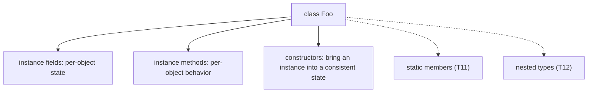

The triple "field + method + constructor" is the minimum viable class. Together, they answer: *what does it remember?* (fields), *what can it do?* (methods), *how do you start one?* (constructors).

## Field Initializers

A field declaration can include an **initializer expression** that runs as part of object construction.

```java
public class Counter {
    int value = 0;                          // explicit initializer (here, same as default)
    String label = "unnamed";               // initializer = literal
    long createdAt = System.nanoTime();     // initializer = method call
    int[] history = new int[16];            // initializer = new expression
}
```

A field initializer is **not** assignment — it's a contract that runs **during construction**, **for every new instance**, **once**. Three things to know:

**1. When it runs.** Between the super-class constructor call and the constructor body, in **source order**. We'll trace the exact splicing in [§ Initialization Order](#initialization-order--what-runs-when).

**2. What it can reference.** Any final-or-effectively-initialized state that's already in scope: other fields declared *earlier* in source order (forward references are restricted), method calls, even `this` (carefully). It cannot reference instance fields declared *later* by simple name — only by `this.fieldName`, and even then the field will still have its zero default at that point.

```java
class Tricky {
    int a = b + 1;   // ERROR: cannot reference 'b' before it is defined
    int b = 5;
}

class StillTricky {
    int a = this.b + 1;   // legal — but this.b is 0 at this point, so a = 1
    int b = 5;
}
```

**3. The initializer expression cost is per-instance.** Every `new Counter()` runs the four right-hand sides above. If one is `new int[1_000_000]`, every counter allocates a million-element array.

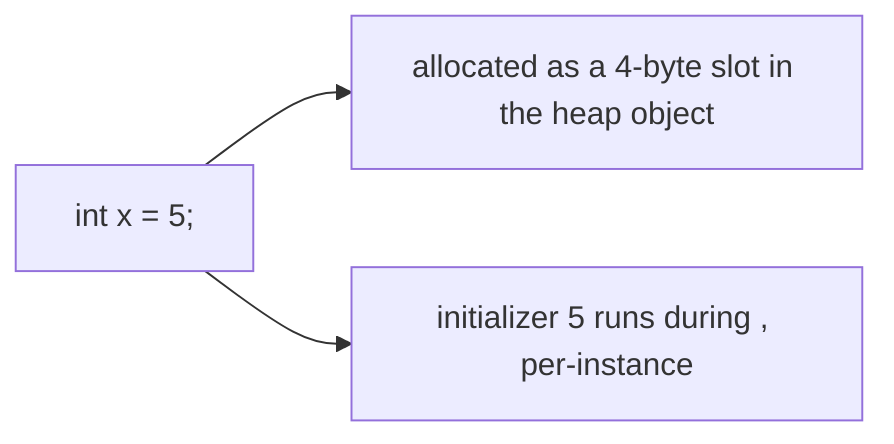

> [!TIP]
> If a field is a **constant for every instance**, make it `static final` (covered in [T11](./T11-static-members-blocks-and-nested-classes.md)) — it lives once in Metaspace, not once-per-instance.

### Field Initializers vs Constructor Assignment

There are two ways to set a field's initial value: an initializer at the declaration, or an assignment in the constructor. Both compile to the same `<init>` bytecode in the simplest case.

```java
class A { int x = 5; }
class B { int x; B() { x = 5; } }
```

Both `A` and `B` produce an object where `x == 5` after `new`. The difference is **expressive**: an initializer is per-declaration (next to the field); a constructor assignment is per-construction (in the constructor body, and may be conditional). Mixing both — initializer + reassignment in the constructor — runs the initializer first, then the constructor body's assignment, in that order.

```java
class C {
    int x = 5;                  // step 1: initializer runs, x = 5
    C(int initial) { x = initial; }   // step 2: constructor body runs, x = initial
}
new C(99).x;   // 99
```

Only the *last write* survives. The initializer is overwritten.

## The `this` Keyword

`this` is the implicit reference to **the current object** — the object on which an instance method or constructor was invoked. It is the JVM mechanism by which an instance method can read its own fields without a global pointer.

Three uses:

### 1. Disambiguating Shadowed Names

When a parameter has the same name as an instance field — the canonical setter pattern — the field is *shadowed* inside the method. Without `this`, the bare name refers to the parameter; `this.field` reaches the field.

```java
public class Rectangle {
    int width;
    int height;

    Rectangle(int width, int height) {
        this.width  = width;    // this.width = field; width = parameter
        this.height = height;
    }
}
```

This is the textbook fix to the `value = value` bug from [L0/C02/T15](../../L0-foundations/C02-java-core/T15-variable-scope-and-lifetime.md): if you write `width = width;` you assign the parameter to itself and the field stays at its zero default. The compiler does not warn.

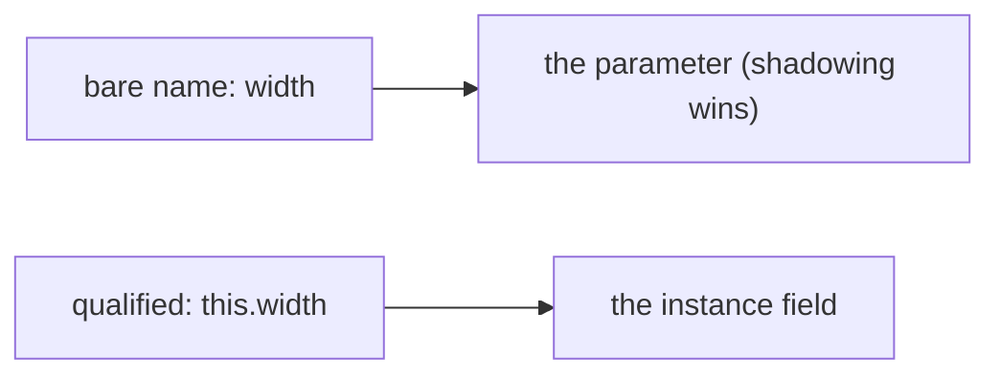

### 2. As an Expression (Returning, Passing)

`this` is a value: a reference to the current object. You can return it (fluent builders), pass it to another method (callback registration), or store it in another object's field.

```java
public class Builder {
    private String name;
    Builder withName(String n) {
        this.name = n;
        return this;          // enables fluent chaining
    }
}
new Builder().withName("foo").withName("bar");
```

### 3. Inside a Constructor — Calling Another Constructor

`this(args)` as the **first statement** of a constructor calls a *sibling* constructor of the same class. We cover this in [§ Constructor Chaining](#constructor-chaining-with-this).

### `this` Cannot Be Reassigned

`this` is implicitly final. `this = new Foo()` is a compile error. The reason is JVM-level: `this` lives in local slot 0 of the instance method's frame; the verifier guarantees it stays the same reference for the entire method.

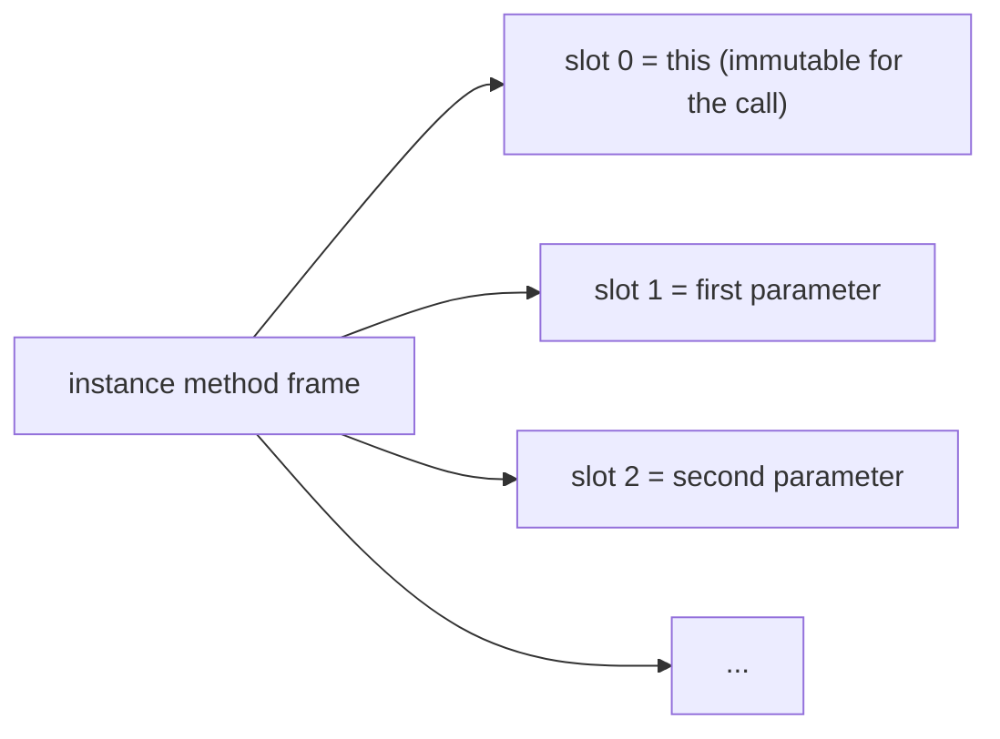

This is the same convention from [L0/C02/T12](../../L0-foundations/C02-java-core/T12-methods-parameters-return-values.md): every instance-method frame uses slot 0 for the receiver. Reading `this.x` is `aload_0` (load slot 0 as a reference) + `getfield x` (read the field at the klass's offset).

### `static` Methods Have No `this`

Inside a `static` method, there is no implicit receiver. Writing `this` is a compile error — there is nothing for it to refer to. Static methods belong to the class, not to any instance.

```java
class Foo {
    int x;
    static void doThing() {
        this.x = 5;   // COMPILE ERROR: non-static variable this cannot be referenced from a static context
    }
}
```

The same error blocks unqualified access to instance fields from a static method: `x = 5;` inside `doThing()` would mean `this.x = 5`, which is illegal.

### Where `this`, Parameters, and Locals Physically Live During a Method Call

The "slot 0 = this" rule is the bytecode-level abstraction. The physical reality on a JIT-compiled call is sharper and more interesting. Three layers carry the values: the **JVM stack frame** (logical), the **native stack frame** (physical), and the **CPU registers** (transient working state).

#### The JVM Frame — Logical Layout

Each method call gets a frame holding three regions:

```
+----------------------+
| local-variable array |   ← slot 0 = this; slot 1..N = parameters; remaining = declared locals
+----------------------+
| operand stack        |   ← used for arithmetic and method-call argument staging
+----------------------+
| frame data           |   ← return PC, frame pointer to caller, method/Klass pointer
+----------------------+
```

The frame's **size** is decided at compile time and recorded in the `Code` attribute's `max_locals` and `max_stack`. For a method `void Rectangle.translate(int dx, int dy)`:
- `max_locals = 3` (this, dx, dy).
- `max_stack = 2` (peak for `this.width += dx`-style ops: push width, push dx, add, store).

Each slot is **4 bytes** in the spec (32-bit). `long`/`double` take **two** consecutive slots. Reference slots are also 4 bytes (compressed-oop assumption); the spec uses 32-bit slots regardless of host word size.

So a frame for `translate(int, int)` declares 12 bytes of locals + 8 bytes of operand stack + frame-data overhead.

#### The Native Frame — Physical Layout (x86-64 System V ABI)

When the JIT compiles the method, the JVM frame's logical layout is *not* preserved on the native stack. The JIT does **register allocation**: hot locals get pinned to registers; cold ones spill to stack slots; the operand stack is entirely virtual at the native level (only its peak depth matters, for register pressure).

A typical compiled `void Rectangle.translate(int dx, int dy)`:

```
Native registers in:
  rdi  = this (System V ABI: 1st arg, pointer)
  esi  = dx   (2nd arg, int — lower 32 bits of rsi)
  edx  = dy   (3rd arg, int — lower 32 bits of rdx)

Compiled body:
  add   [rdi + 12], esi      ; this.width  += dx  (memory-form add to field at offset 12)
  add   [rdi + 16], edx      ; this.height += dy  (offset 16)
  ret                        ; return; nothing to copy out (void)
```

**Three instructions, ~3 cycles** — `this` is in `rdi` (never spilled), the parameters in `esi`/`edx`, the fields accessed by direct offset arithmetic. There is no JVM-slot-array, no operand stack, no frame data — those exist only conceptually. The JIT erased them.

#### Calling Conventions — Which Register Holds What

The **System V AMD64 ABI** (Linux/macOS x86-64) routes integer/pointer arguments in this order:

| Argument | Register |
|----------|----------|
| 1st (`this` for instance methods) | `rdi` |
| 2nd | `rsi` |
| 3rd | `rdx` |
| 4th | `rcx` |
| 5th | `r8` |
| 6th | `r9` |
| 7th+ | stack (`[rsp + N]`) |
| return value (int/pointer) | `rax` |

Float/double args go in `xmm0..xmm7`. Anything beyond the first 6 int args or 8 float args spills to the stack.

**Windows x64 ABI** uses `rcx, rdx, r8, r9` for the first 4 args (different register order); **ARM64 AAPCS** uses `x0..x7`. The JVM picks the right convention based on the OS at JIT-compile time.

For an instance method, the implicit `this` is always the first argument — so `rdi` (System V) or `rcx` (Windows) or `x0` (ARM64). `this.field` access becomes `[rdi + offset]` / `[rcx + offset]` / `[x0, #offset]`. **`this` doesn't live in a memory slot in compiled code; it lives in a register, baked into every field-access instruction.**

#### What Happens When the JIT Cannot Keep Everything in Registers

A method with many locals (say, 20 `int` locals all live simultaneously) exceeds the available registers (~14 general-purpose on x86-64 after reserving stack/frame pointers). The JIT then **spills** cold values to **stack slots** — actual memory at `[rbp + offset]` or `[rsp + offset]`. Each spill is one store; each reload is one load.

The native stack frame for such a method looks like:

```
[caller's frame] ... [return PC] [saved rbp] [spill slot 1] [spill slot 2] ... [rsp]
                                              ^ aligned to 16 bytes
```

Spilling costs ~1 cycle per access (L1 hit) — much cheaper than a heap read, but a real cost compared to a register-resident local. The JIT's register allocator (HotSpot's "graph coloring" allocator) tries to spill the least-frequently-accessed values to minimize this cost.

#### Memory Cost of a Single Method Call

Putting numbers on a single uncontended call to `translate(1, 1)`:

| Step | Cost |
|------|------|
| Save return PC on stack | ~1 cycle |
| Set up parameters in registers (caller side) | ~0–2 cycles (often already there) |
| Jump to function (predicted by BTB) | ~1–2 cycles |
| Function body — 2 memory writes | ~2 cycles (L1 hits) |
| `ret` — pop return PC, jump back (RAS predicts) | ~1 cycle |
| **Total** | **~5–8 cycles ≈ 2 ns** |

For inlined calls (the JIT sees through the call into the caller's frame), even these steps vanish — the function body is just inserted into the caller's instruction stream. **Most hot calls in Java cost zero by the time the JIT is done.**

#### The Frame's Lifetime in Physical Memory

A native frame exists between the `call` instruction (which pushes the return PC, allocating the frame) and the `ret` instruction (which pops it). Total memory footprint: ~32–256 bytes typical (return PC + saved registers + locals + alignment). The stack itself is a per-thread region (`-Xss`, default ~512 KB–1 MB on 64-bit), grown one page at a time as call depth increases.

`StackOverflowError` happens when call depth exceeds the stack region's bound — typically at 5,000–10,000 frames for typical Java code. The OS sets up a **guard page** at the stack's bottom; touching it triggers a SIGSEGV that the JVM converts to `StackOverflowError`. The OS-level enforcement means stack overflow cannot corrupt other memory — but it does kill the offending thread without warning if the JVM cannot translate the signal.

## Methods Revisited — Instance Methods on Class Members

[L0/C02/T12](../../L0-foundations/C02-java-core/T12-methods-parameters-return-values.md) covered methods in detail: signature, parameters, return values, the `invoke*` opcode family. The L1 addition is that methods **belong to objects** and operate on **their fields**.

```java
public class Account {
    long balance;             // instance field

    void deposit(long amount) {        // instance method
        if (amount <= 0) throw new IllegalArgumentException("amount must be > 0");
        balance += amount;             // == this.balance += amount
    }

    long getBalance() {
        return balance;
    }
}
```

`deposit` reads and writes `balance` of *the account on which it was called*. Two `Account` instances have independent balances; `a.deposit(50)` does not touch `b.balance`. The method body looks the same as a procedural function; the difference is the implicit receiver.

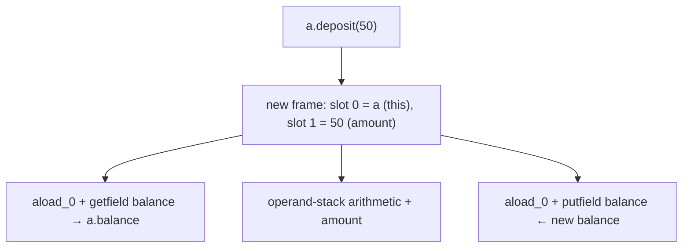

Method bodies access *the current object's* state by reading and writing fields through `this` — implicitly when bare-named, explicitly when shadowed. Other instance methods (`getBalance()` calling `this.balance`) work the same way.

### Visibility, Mutation, and Encapsulation Preview

A class typically wants to **control how its fields change** — preventing illegal balances, enforcing invariants, validating arguments. The mechanism is encapsulation via access modifiers (`private`, `protected`, `public`) covered in [T03](./T03-encapsulation-and-access-modifiers.md). For this topic, just observe that an `Account` with a `public long balance` field can be mutated *directly* by any caller — `acc.balance = -1_000_000_000L;` — bypassing every check in `deposit`. The `private` modifier blocks that path and forces all mutation through methods.

## Constructors — Declaration Anatomy

A **constructor** is a special method-like thing that initializes a new instance. Six rules govern its declaration:

1. **Name** — must be exactly the class name. No return type.
2. **No return type** — not even `void`. Writing `void Foo() { }` declares a *method* named `Foo`, not a constructor (a frequent source of "why doesn't my constructor run?" confusion).
3. **Visibility** — `public` / `protected` / package-private / `private` (T03).
4. **No `final`/`abstract`/`static`/`synchronized`** — none of these modifiers applies. A constructor isn't inherited (so `final` is meaningless), it always has a body (so `abstract` is meaningless), it has a `this` (so `static` is meaningless), and JVM-level synchronization on construction doesn't make sense at the language level (synchronize manually inside if needed).
5. **Parameters** — any number, like a method, including varargs.
6. **`throws`** — yes, constructors can throw checked exceptions; callers of `new` must handle them.

```java
public class Pair {
    int x;
    int y;

    public Pair(int x, int y) throws IllegalArgumentException {   // constructor
        if (x < 0 || y < 0) throw new IllegalArgumentException("negative");
        this.x = x;
        this.y = y;
    }
}
```


The constructor's job is to leave the new object in a **consistent state** — one where every invariant the class promises is true. After `new Pair(3, 4)` returns, `pair.x == 3 && pair.y == 4 && pair.x >= 0 && pair.y >= 0`. From here, every method can rely on that invariant.

## The Default No-Arg Constructor

**If you don't declare any constructor, javac synthesizes one for you**: a no-arg constructor whose visibility matches the class's, with a body that just calls `super()`.

```java
class Foo { }
// effectively:
// class Foo {
//     Foo() { super(); }
// }
```

So `new Foo()` works on a class with no source constructor. The synthesized constructor is **only inserted when you've declared no constructors at all**. The moment you declare any constructor — even one — the synthesized no-arg constructor **vanishes**.

```java
class Bar {
    int x;
    Bar(int x) { this.x = x; }
}
new Bar();      // COMPILE ERROR: no no-arg constructor — synthesized one is gone
new Bar(5);     // OK
```

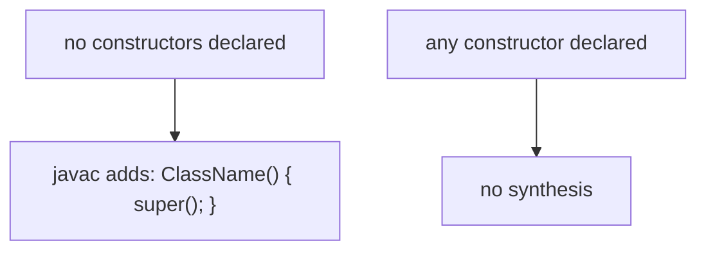

> [!WARNING]
> **The hide-the-no-arg trap.** A library declares `class Bar {}` — callers write `new Bar()`. Later, the library author adds a `Bar(int x)` constructor for a new use case. *Every* caller that used `new Bar()` now fails to compile. The fix: explicitly declare a no-arg constructor when adding any other constructor that you want to keep backward-compatible. This is a frequent source of library-version-bump breakage.

### Default-Constructor Visibility

The synthesized constructor's visibility **matches the class's**:

| Class declaration | Synthesized constructor visibility |
|-------------------|--------------------------|
| `public class Foo {}` | `public Foo()` |
| `class Foo {}` (package-private) | `Foo()` (package-private) |

If you declare an explicit no-arg constructor, you choose any visibility — including `private`, which blocks all outside instantiation (the singleton/utility-class pattern).

## Constructor Overloading

Constructors are overloaded by **parameter list**, just like methods ([L0/C02/T13](../../L0-foundations/C02-java-core/T13-method-overloading.md)). The three-phase resolution algorithm (no-conversion, widening, boxing+varargs) picks which one to call at a `new` site.

```java
public class Box {
    int width, height;
    String color;

    public Box() { this(0, 0, "white"); }                  // overload 1
    public Box(int width, int height) { this(width, height, "white"); }   // overload 2
    public Box(int width, int height, String color) {      // overload 3 — canonical
        this.width  = width;
        this.height = height;
        this.color  = color;
    }
}
```

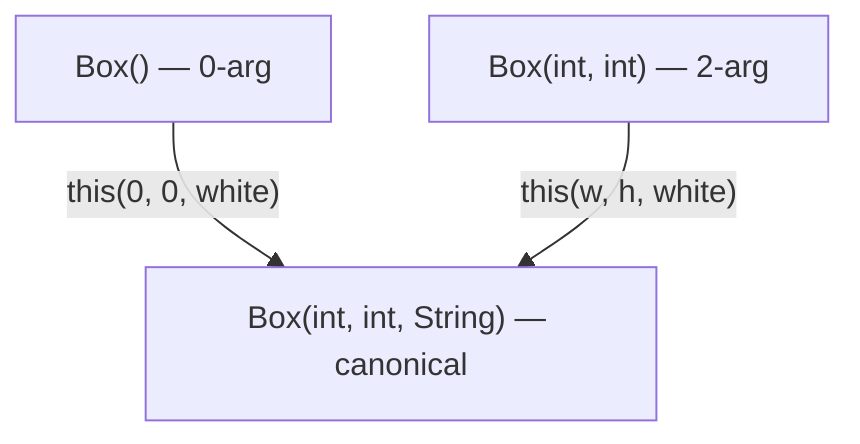

The pattern of "every constructor delegates to one canonical constructor" is a discipline — it ensures all initialization paths run the same validation, the same field assignments, the same invariants. **This is the same idea as the canonical constructor of a record** ([T14](./T14-record-types.md)).

## Constructor Chaining with `this(...)`

`this(args)` calls a sibling constructor of the same class. It **must** be the **first statement** of the constructor body — before any other code, before any field reference, before any method call.

```java
public Box() {
    this(0, 0, "white");   // first statement — legal
    // code after is fine
}

public Box(int w, int h) {
    int validated = Math.max(0, w);   // ERROR: this(...) must be first statement
    this(validated, h, "white");
}
```

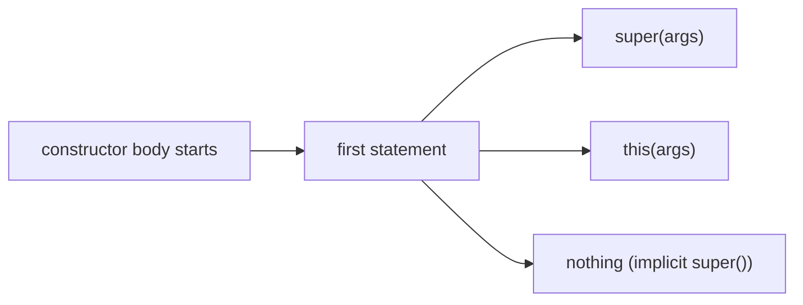

### Why the First-Statement Rule

The rule isn't arbitrary; it's a **safety invariant** the JVM verifier enforces. The fundamental promise of `<init>` is: *when `<init>` returns, the object is consistent*. The verifier requires that **exactly one** of `super(...)` or `this(...)` runs at the start, before any code in `this` constructor body, so that:

- Every subclass `<init>` reaches the parent `<init>` chain back to `Object.<init>`.
- `final` fields receive their assigned values before any code can observe `this`.
- The object cannot be observed in a "half-constructed" state where part of the chain has run and part hasn't.

If you could insert arbitrary code before the super/this call, you could read fields that haven't been initialized, leak a reference to a half-built object, or skip parent initialization entirely.

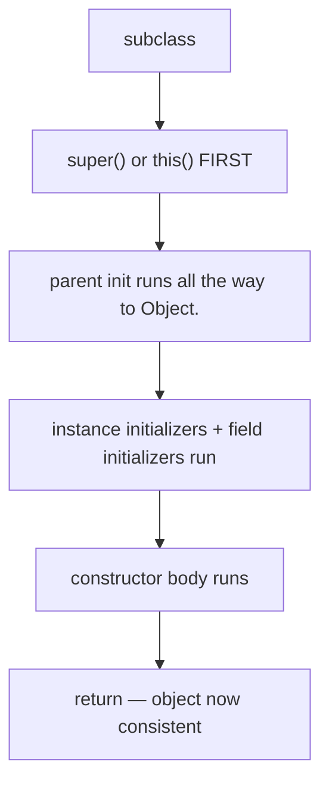

The JVM's class-file verifier rejects `<init>` bytecode that violates this — it's not just a javac rule.

### The Telescoping Constructor Anti-Pattern

A class with many optional fields easily grows a tower of overloaded constructors:

```java
public Pizza() { this("medium", "thin"); }
public Pizza(String size) { this(size, "thin"); }
public Pizza(String size, String crust) { this(size, crust, false); }
public Pizza(String size, String crust, boolean extraCheese) { this(size, crust, extraCheese, List.of()); }
public Pizza(String size, String crust, boolean extraCheese, List<String> toppings) { ... }
```

This is the **telescoping constructor pattern**. It works but reads poorly at call sites (`new Pizza("large", "thick", true, List.of("pepperoni"))` — what's `true`?). The standard remedy is the **Builder pattern** (covered in L3/C03 design patterns), or in many modern cases simply a **record** with a few static factory methods.

> [!WARNING]
> A constructor cannot call `this(...)` AND `super(...)` in the same body. Pick one — and only one — first statement. The other is reached transitively (the `this(...)` delegate calls `super(...)` or `this(...)` itself).

## The Implicit `super()` Call

**Every** constructor body, if its first statement is not `this(...)` or an explicit `super(...)`, gets an **implicit `super()`** inserted as its first statement by javac.

```java
class Foo { Foo() { /* super(); is inserted here */ } }
class Bar extends Foo { Bar() { /* super(); is inserted here */ } }
class Baz extends Bar { Baz() { /* super(); is inserted here */ } }

new Baz();    // calls Baz() → super() = Bar() → super() = Foo() → super() = Object()
```

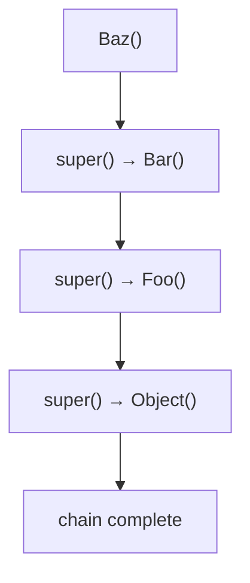

This guarantees that **every ancestor up to `Object`** initializes before this class's body runs. If the parent has no accessible no-arg constructor, the chain breaks at compile time: you must write `super(args)` explicitly, picking a parent constructor to invoke.

```java
class Parent {
    Parent(int x) { ... }   // no no-arg constructor — author skipped synthesizing it by declaring this one
}
class Child extends Parent {
    Child() { /* implicit super(); — ERROR: Parent has no no-arg constructor */ }
}
class Child2 extends Parent {
    Child2() { super(5); }   // explicit — OK
}
```

This is the same hide-the-no-arg trap in inheritance form: adding a parameterized constructor to a base class quietly breaks every subclass that relied on the implicit `super()`.

## Initialization Order — What Runs When

Now we put the pieces together. When `new C(args)` runs, the JVM executes a precise sequence:

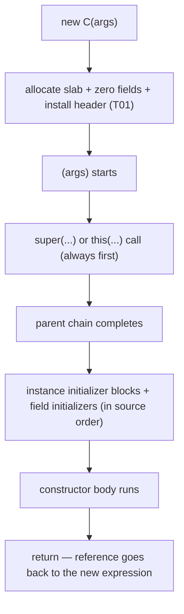

The fine print: the **initializer blocks** (`{ ... }` in the class body, not in a method) and **field initializers** run in a single pass, in **source order**, *between* the super-call and the constructor body. This is the **two-phase initialization** model.

### Initializer Blocks

A bare `{ ... }` inside the class body — not inside a method, not preceded by `static` — is an **instance initializer block**. It runs once per `new`, in source order with field initializers.

```java
public class Demo {
    int a;
    { a = 5; }            // instance initializer block — runs during <init>
    int b;
    { b = a + 1; }        // can reference earlier-initialized state
    Demo() {
        // body runs after the initializer blocks
        System.out.println(a + " " + b);   // 5 6
    }
}
```

You'd rarely use one in greenfield code (a constructor body or a field initializer is clearer). They show up in **anonymous inner classes** ([T12](./T12-inner-local-and-anonymous-classes.md)) where you can't declare a constructor.

### Worked `javap -c` Example

Let's trace the splicing for a small class. Source:

```java
public class Init {
    int a = 1;            // field initializer
    int b;
    { b = 2; }            // instance initializer block
    int c;
    public Init(int c) {
        super();          // explicit, just to show
        this.c = c;
    }
}
```

`javap -c Init` for the constructor:

```
public Init(int);
  Code:
     0: aload_0                            // this
     1: invokespecial #1 // Method java/lang/Object."<init>":()V    ← super()
     4: aload_0
     5: iconst_1
     6: putfield      #7 // Field a:I                                ← a = 1 (field initializer)
     9: aload_0
    10: iconst_2
    11: putfield      #11 // Field b:I                               ← b = 2 (initializer block)
    14: aload_0
    15: iload_1                                                      ← parameter c
    16: putfield      #14 // Field c:I                               ← this.c = c (body)
    19: return
```

Decoded: the constructor does `super()` first (opcodes 0–1), then the two pre-body initializers (a=1, b=2 — in source order, regardless of declaration position relative to the block), then the body's assignment. All in **one** `<init>` method.

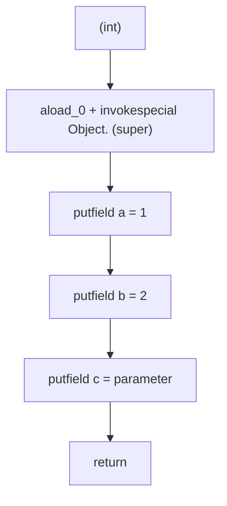

There is no separate "initializer phase" at runtime — the JVM doesn't know about it. javac splices everything into `<init>` at compile time. The runtime sees one method.

> [!INTERVIEW]
> "What's the order of field initialization vs constructor body?" The full order is: (1) parent constructor chain via `super(...)` runs first, all the way to `Object`; (2) this class's instance initializers (blocks + field initializers) run in source order; (3) this constructor's body runs. Step 2 is invisible in the source — javac splices it into every `<init>` between the `super(...)` call and the body.

## Final Fields and Definite Assignment

A `final` instance field must be assigned **exactly once** per constructor path, and that assignment must complete **before the constructor returns**.

```java
public class Point {
    final int x;
    final int y;

    Point(int x, int y) {
        this.x = x;
        this.y = y;
    }   // OK — both finals assigned exactly once
}
```

```java
public class Broken {
    final int x;
    Broken() { }   // COMPILE ERROR: variable x might not have been initialized
}
```

```java
public class AlsoBroken {
    final int x;
    AlsoBroken(boolean flag) {
        if (flag) this.x = 5;
    }   // COMPILE ERROR: variable x might not have been initialized on the false-flag path
}
```

The compiler runs definite-assignment analysis on every constructor path (mirroring the rule for local variables — [L0/C02/T15](../../L0-foundations/C02-java-core/T15-variable-scope-and-lifetime.md) — but with a stronger version: every `final` field must be assigned on every path).

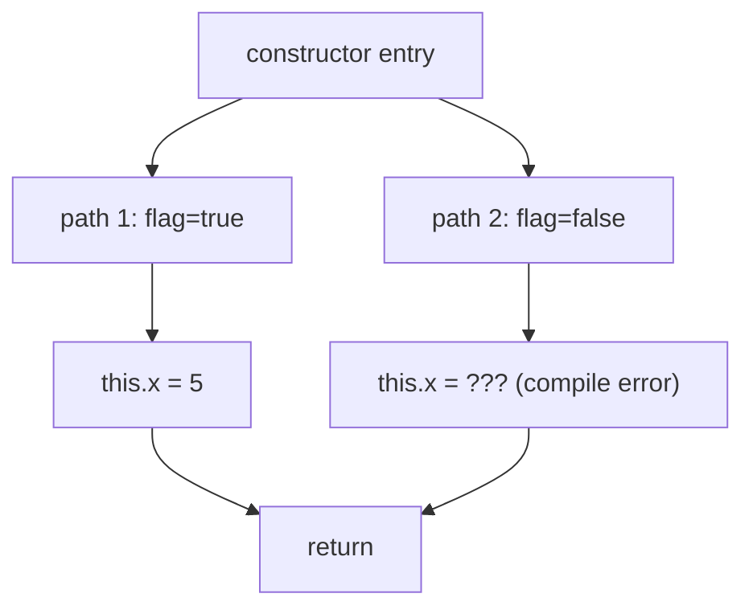

The fix: assign `this.x = 0;` on the false branch, assign it before the `if`, give it a field initializer (`final int x = 0;`), or restructure the constructor.

### Why Final Matters — The JMM Freeze

Final fields aren't just "write-once." They participate in a **JVM memory-model guarantee**: at the moment the constructor returns, every `final` field is **frozen**. Any subsequent read of that field via *any* reference — including references that escaped to other threads — is guaranteed to see the assigned value, not a zero default.

```java
public final class Immutable {
    final int x;
    Immutable(int x) { this.x = x; }
}

// Thread 1:
static Immutable shared;
shared = new Immutable(42);   // construct + publish via static field

// Thread 2:
Immutable s = shared;
if (s != null) {
    System.out.println(s.x);   // guaranteed 42 by JMM final-freeze
                               // — even though there's no `synchronized`/`volatile`
}
```

Without `final`, thread 2 could see `x == 0` because of CPU reordering — the constructor's `putfield x` could be visible *after* the `static` field write. With `final`, the JMM inserts a memory barrier at `<init>`'s exit that prevents this reordering.

This is the foundation of **safe publication for immutable objects**. It's why `String`, `Integer`, `BigDecimal`, and every record can be safely shared across threads with no locks — every field is `final`. Full JMM coverage in **L3/C01 concurrency**; just remember the rule: **final field = frozen at constructor exit = safe to read from anywhere without synchronization**.

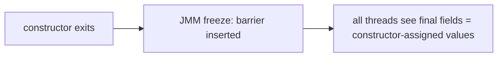

> [!INTERVIEW]
> "Why does immutability help with concurrency?" Two reasons: (1) no mutation = no shared writes = no race conditions; (2) `final` fields are JMM-frozen at constructor exit, so any thread reading the object — even via a non-volatile reference — is guaranteed to see the initialized values, not zero defaults. Together these make immutable objects shareable without locks.

## Calling Overridable Methods From a Constructor — The Fragile Base Class Trap

Inside `<init>`, the implicit `this` is the **runtime object's class** — including any subclass overrides. So calling an overridable method (an instance method that is not `private`, `static`, or `final`) from a constructor dispatches **dynamically** to the subclass's version, which runs **while the subclass's own fields are still zero**.

```java
class Base {
    Base() {
        init();   // calls overridable method during own construction
    }
    void init() { /* default */ }
}

class Sub extends Base {
    int x = 5;
    @Override
    void init() {
        System.out.println("Sub.init sees x=" + x);   // x is still 0 here!
    }
}

new Sub();
// prints: Sub.init sees x=0
```

The chain:
1. `new Sub()` allocates the object; fields zeroed.
2. `Sub.<init>` starts.
3. Implicit `super()` → `Base.<init>` starts.
4. `Base.<init>` calls `init()` — dynamically dispatched to `Sub.init`.
5. `Sub.init` reads `this.x` — still 0, because Sub's field initializers haven't run yet.
6. `Base.<init>` returns.
7. Sub's field initializers run (`x = 5`).
8. `Sub.<init>` body runs.

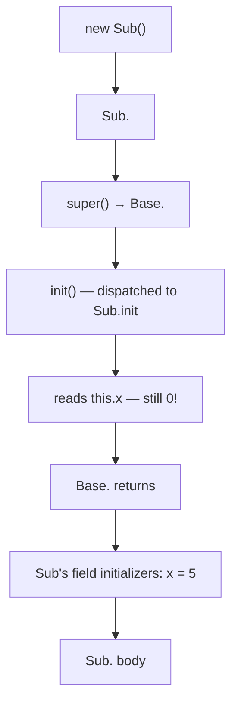

This is the **fragile base class** problem. Two defenses:

1. **Don't call overridable methods from constructors.** Use `private` or `final` methods, or inline the logic. If the constructor needs to do something extensible, expose a separate "init" hook the caller invokes *after* the constructor returns.
2. **Document the constraint.** If a class must call a method during construction, document that subclasses overriding it cannot rely on their own fields.

> [!WARNING]
> Effective Java Item 19: *"Design and document for inheritance, or else prohibit it."* Calling overridable methods from constructors is one of the principal hazards. Use `final` on classes that aren't designed for extension; use `final` on methods called from constructors.

## Leaking `this` From a Constructor

A related hazard: if a constructor publishes `this` to anywhere observable before it returns, other code may see the half-built object.

```java
class Registry {
    static List<Listener> listeners = new CopyOnWriteArrayList<>();
}

class MyListener implements Listener {
    int x = 5;
    MyListener() {
        Registry.listeners.add(this);   // leaks this BEFORE constructor returns
    }
}
```

Right after `Registry.listeners.add(this)` runs, another thread iterating `listeners` may invoke a method on the new `MyListener` that reads `this.x`. The reading thread is racing against the constructor's `x = 5;`. The JMM `final` freeze only applies to `final` fields, and only at constructor exit — leaks before that point are dangerous.

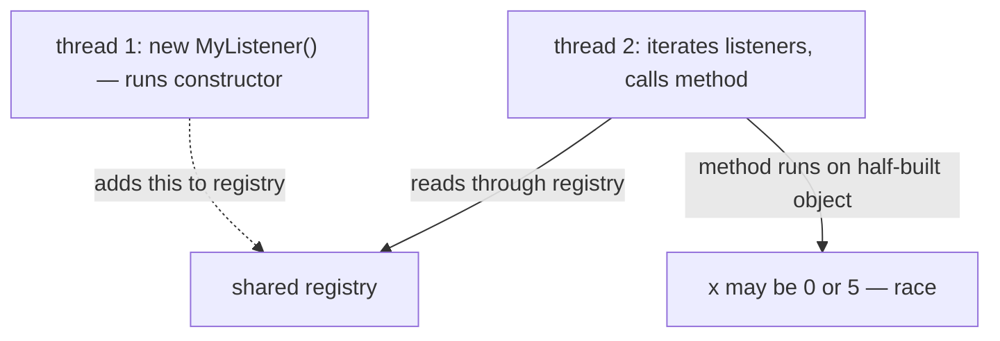

**Patterns to avoid this:**

- Use a **static factory method**: construct privately, then publish.
  ```java
  static MyListener create() {
      MyListener m = new MyListener();
      Registry.listeners.add(m);   // happens AFTER full construction
      return m;
  }
  private MyListener() { ... }
  ```
- Make every field `final` and rely on the JMM freeze. Limitations: no field can change after construction.
- Use a separate `init()` method invoked by the caller after construction.

Full concurrency treatment in **L3/C01**.

## Memory & Architecture Layer

### `<init>` Is a Real JVM Method

`<init>` lives in the class's `methods` section alongside instance methods. Its descriptor encodes parameter types + a `V` return: `Pair(int, int)` becomes `(II)V`. The constant pool holds a `Methodref` entry pointing to it.

Inside `<init>`, slot 0 is `this`, slot 1 is the first parameter, and so on — exactly like every other instance method. The reference returned by `new` is the value pushed by the `new` opcode itself (T01 callback), preserved by `dup` through the constructor call.

### Constructors Aren't Virtual

Constructor calls use `invokespecial`, not `invokevirtual`. That means **there is no vtable lookup** — the exact `<init>` method bound at compile time is the one called. This is why "calling a superclass constructor via `super(...)`" works: it's `invokespecial Parent."<init>":(...)V`, with no dynamic dispatch.

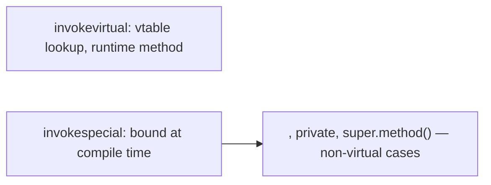

The cost: ~1 cycle for `invokespecial` once the call is resolved (vs ~1–3 cycles for `invokevirtual` BTB-hit). Constructors are inlined aggressively by the JIT (next).

### JIT Inlining and EA Eliminating `<init>` Entirely

For short methods, HotSpot's JIT inlines the constructor body into the caller, then runs **escape analysis** (T01) on the result. If the new object doesn't escape, scalar replacement eliminates the allocation: the object's fields become local register slots, the `new` opcode vanishes, the `<init>` call vanishes, the heap allocation never happens.

```java
double compute(int a, int b) {
    Point p = new Point(a, b);
    return Math.sqrt(p.x*p.x + p.y*p.y);   // p doesn't escape
}
```

In hot code, this method allocates **zero bytes**. The `Point(a, b)` constructor runs, but its `<init>` body is inlined, its `putfield` ops are rewritten as register writes, and the resulting `Point` is never built. Verified with `-XX:+PrintEliminateAllocations`.


This is why "do not pool small short-lived objects to reduce allocation" is real advice: the JIT already does it for you, and pooling defeats EA.

### Constructor Body Is Profile-Specialized

Hot constructors are JIT-compiled like any method. The JIT specializes based on observed parameters: if `new Point(a, b)` is always called with positive `int`s, the JIT may eliminate bounds checks; if all calls go through the same overload, the JIT inlines the chain.

## Deeper JVM Internals — putfield, Field Offsets, and Final-Freeze Barriers

The bytecode-level mechanics of field assignment, the resolution of field offsets at link time, and the memory barriers that implement the JMM final-freeze guarantee are the deep underpinnings of every constructor and every field assignment. This section makes them explicit.

### Field Resolution: from Symbolic to Direct

A `putfield x` opcode in the constructor refers to the field **symbolically** — by name and descriptor — via a constant-pool `Fieldref` entry. At first execution, the JVM **resolves** the symbolic reference to a **direct field offset** within the object's field area. The resolved offset is cached in the constant pool (the constant-pool entry is rewritten to a "resolved" form), so subsequent `putfield`s on the same field do not re-resolve.

```
Constant pool entry #5 (CONSTANT_Fieldref_info):
  class_index    → #6  (CONSTANT_Class_info "Point")
  name_and_type  → #7  (CONSTANT_NameAndType_info "x" + "I")

After resolution (in-memory representation):
  resolved_offset = 12  (the offset of Point.x within an instance)
```

The resolved offset comes from the class's **field-offset table** in the Klass struct ([T01](./T01-classes-and-objects.md) addition). The compiler placed `x` at offset 12; the resolution looks it up and patches the constant-pool entry. The next `putfield x` is a direct memory write at `[this + 12]`.

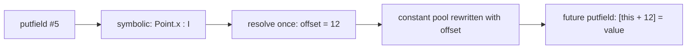

This is why the **field declaration order vs memory order** distinction matters at the JVM-internals layer ([T01](./T01-classes-and-objects.md)): the allocator reorders fields, the Klass records the actual offsets, and `putfield` reaches the right byte through the resolved offset — not through any source-order convention.

### The JMM Final-Freeze Mechanism Per Architecture

The "freeze" promise — every `final` field is safely visible after constructor exit — is implemented with **memory barriers** the JVM inserts at the constructor's exit.

| Architecture | Barrier inserted | Reason |
|--------------|------------------|--------|
| x86-64 (TSO) | `mfence` or no-op (most cases) | x86's strong memory model already prevents most reorderings |
| ARM64 (weakly ordered) | `dmb ishst` (Store-Store barrier) | ARM may reorder constructor stores after the publishing store |
| Power | `lwsync` | Similar weak model to ARM |

On **x86**, the Total Store Order memory model means stores from a single thread appear in program order to other threads — so the constructor's `putfield`s for final fields are observed in order without explicit barriers. The JVM still emits the barrier for *initialization-order safety* in some cases, but the cost is near-zero.

On **ARM64**, the JVM emits a **`dmb ishst`** (Data Memory Barrier, Inner Shareable, Store-Store) at the constructor exit before any publishing store. This forces all prior stores to retire to the inner shareable domain (typically all cores) before any subsequent store completes. Without it, an ARM core could publish the reference to the new object while another core's L1 cache still shows zero in the final field.

```mermaid
flowchart TB
  Ctor["constructor body"]
  Ctor --> Pf["putfield final_field = value"]
  Pf --> Barrier["ARM: dmb ishst; x86: mfence/no-op"]
  Barrier --> Ret["return — caller may publish 'this'"]
  Ret --> Pub["other thread reads — guaranteed to see value, not 0"]
```

The cost: a barrier is ~1–10 cycles depending on contention. For monomorphic, hot-loop construction this adds up — but the JIT collapses the barrier with surrounding code when escape analysis proves nothing escapes.

### Allocation Prefetching

HotSpot's TLAB allocator emits a **`prefetchnta` or `prefetcht0`** instruction *ahead of* the actual bump-pointer allocation, hinting to the CPU's prefetcher to bring the next cache line into L1. The result: by the time `<init>` writes the first field, the destination cache line is already in L1, avoiding a ~80 ns main-memory load.

```
allocation site code:
  prefetchnta [tlab.top + 64]   ; hint next line
  mov rax, tlab.top              ; current top
  add tlab.top, sizeof(Point)    ; bump
  mov [rax], header_value        ; write header (first 8 bytes)
  mov [rax + 8], klass_value     ; write klass ptr
  mov [rax + 12], 0              ; zero x (CPU's L1 hit)
  mov [rax + 16], 0              ; zero y
```

`-XX:+AllocatePrefetchInstr=...` tunes the prefetch policy. Modern CPUs are aggressive enough that prefetching is occasionally counterproductive; HotSpot adapts based on profiling.

### On-Stack Replacement (OSR) for Constructor Bodies

Long-running constructor bodies (rare but possible — initializer-loop fillers, validation loops) can be **OSR-compiled**: while interpreting the constructor, the JIT compiles a tiered version *from inside the loop* and the interpreter jumps into the compiled code mid-frame. The OSR entry point is at a backedge offset; the JIT must generate code that picks up the local variables from the interpreter frame and continues seamlessly.

```mermaid
flowchart LR
  Int["interpreter runs constructor loop"]
  Int -->|"hot backedge"| OSR["JIT compiles OSR entry"]
  OSR --> Native["switch to JIT'd code mid-loop"]
  Native --> Done["loop completes natively"]
```

Observable with `-XX:+PrintCompilation` — entries marked `% n` are OSR. OSR matters for constructors that init arrays in loops; once the loop is OSR-compiled, it runs at native speed for the remainder of the constructor.

### Inlining Across `<init>` Chains

A deep hierarchy `D extends C extends B extends A extends Object` produces a chain of `<init>` calls — five `invokespecial`s for `new D()`. Each looks like a real call. The JIT applies **chain inlining**: it inlines `D.<init>` into the caller; finds the `invokespecial C.<init>`; inlines that body; finds `B.<init>`; inlines; etc. The whole chain typically collapses into a flat sequence of field initializations + a few null checks.

`-XX:MaxInlineLevel=15` limits chain depth; rare cases (deeply layered framework code like Spring) hit the limit and the JIT stops inlining further. `-XX:CompileCommand=PrintInlining,*` reveals what was inlined.

### Field Initializer Order — The Bytecode View

A `<init>` body produced by javac for a class with both a field initializer and a constructor body looks (in pseudo-bytecode):

```
public <init>(int):
  aload_0
  invokespecial Object.<init>:()V   // implicit super
  aload_0
  iconst_1
  putfield a:I                      // field initializer: a = 1 (spliced)
  aload_0
  iconst_2
  putfield b:I                      // initializer block: b = 2 (spliced)
  aload_0
  iload_1
  putfield c:I                      // constructor body: this.c = parameter
  return
```

The splicing is **lexical**: javac walks the class body in source order and emits `putfield`s for every field-with-initializer and every initializer-block, in that order, right after the implicit super-call. The constructor body code comes last. There is no runtime "initializer phase"; everything is one method.

### Constructor + Escape Analysis — The Full Mechanism

When the JIT inlines a constructor and proves the constructed object doesn't escape, **scalar replacement** kicks in:

1. The `new` opcode's allocation is removed.
2. Each field is replaced by a local stack slot or CPU register.
3. `putfield` ops become register/stack-slot writes.
4. `getfield` ops become register/stack-slot reads.
5. The object never exists on the heap.

For a class with three int fields, the entire object becomes three int registers — zero GC pressure, no header cost, no allocation. **The constructor body runs entirely in registers.**

```mermaid
flowchart LR
  Src["new Point(3, 4); p.x + p.y"]
  EA["EA: p doesn't escape"]
  Reg["x = 3 in r10d; y = 4 in r11d; r10d + r11d"]
  Src --> EA --> Reg
```

`-XX:+PrintEliminateAllocations` shows each elimination. The pattern "build a small object inside a method, use its fields, drop it" is essentially free in hot code. The implication: stop pooling for performance; the JIT does it better.

### The `<init>` is Not Just a Method — Verifier Special Rules

The JVM verifier treats `<init>` specially:

- **`this` is uninitialised** at the start of `<init>` until `super(...)` or `this(...)` completes. Using `this` for field access or method calls before that point is allowed, but using it to construct/assign certain operations is rejected.
- **The verifier tracks `<init>` completion** through a special "uninitialized this" type in the operand-stack type checker. Once super-call completes, the type changes to the regular initialized class type.
- **An `<init>` method must have exactly one return** in source flow — though the bytecode may have multiple `return` opcodes due to control flow. The constructor cannot throw without leaving the object in a defined (uninitialized-for-finalizable-purposes) state.

This is why the first-statement rule for `super(...)` / `this(...)` is verifier-enforced ([§ Constructor Chaining](#constructor-chaining-with-this)), not just javac-enforced — the verifier *requires* `this` to be initialized before most operations.

## Common Mistakes

> [!WARNING]
> **`void Foo()` is a method, not a constructor.** Forgetting that constructors have **no return type** — `void Foo() { ... }` declares a *method* named `Foo`. The class then has only the synthesized no-arg constructor (or none if it has any other real constructor). `new Foo()` either runs the synthesized one (default-state object) or fails to compile.

> [!WARNING]
> **`this.x = x` bug from setter — without `this`.** Writing `x = x;` instead of `this.x = x;` is the classic shadowing trap. The parameter assigns to itself; the field stays default. IDEs warn; the compiler doesn't.

> [!WARNING]
> **Adding a parameterized constructor hides the no-arg one.** Existing `new Foo()` calls fail to compile. Always declare the no-arg constructor explicitly when adding others, if you want it to remain callable.

> [!WARNING]
> **`super(...)` AND `this(...)` in the same constructor.** Pick one or the other as the first statement. The other gets reached transitively.

> [!WARNING]
> **`this(...)` or `super(...)` after a statement.** Compile error: must be first. Use a static helper to compute argument values before calling.

> [!WARNING]
> **`final` field not assigned on all paths.** Compile error. Add a field initializer, assign on the missing path, or restructure the constructor.

> [!WARNING]
> **Calling an overridable method from a constructor.** Subclasses see uninitialized fields. Use `private` or `final` methods only.

> [!WARNING]
> **Leaking `this` from a constructor.** Race with the construction itself; non-final fields may be observed at zero. Use static factory methods or publish after construction.

> [!WARNING]
> **Forgetting that field initializers run after the super-call.** `super()` runs `<init>` of the parent including its initializers; only then does `this` class's field initializers + body run. Order matters when a parent constructor reads a field that this class's initializer will set — the parent sees zero.

> [!WARNING]
> **Forgetting that constructor exceptions leave a half-allocated object eligible for GC.** A constructor that throws partway never returns a reference; the allocated object is unreachable; the GC cleans it up. But any side effect already performed (registering with a global, opening a file) is not undone — use try/finally or restructure to defer side effects until after the constructor returns.

> [!INTERVIEW]
> Common interview questions for this topic:
> 1. **Walk through the order of initialization when `new Sub()` is called on a class with a parent.** Allocate + zero + header; `Sub.<init>` starts; `super()` → `Parent.<init>` runs (recursively to `Object`); `Parent`'s initializers + body run; back to `Sub.<init>`; `Sub`'s initializers run; `Sub`'s body runs.
> 2. **What's the difference between a field initializer and a constructor assignment?** Initializer runs once per `new`, between `super()` and the constructor body, in source order with initializer blocks. Constructor body runs after all initializers. If both set the same field, the body's value wins.
> 3. **What is the implicit `super()` call?** Every constructor body whose first statement is not `super(...)` or `this(...)` gets an `aload_0 + invokespecial Object."<init>"` (or the parent's) inserted by javac as its first action.
> 4. **Why must `super(...)` or `this(...)` be the first statement?** JVM verifier safety: every constructor must reach the parent chain before any code in this class's `<init>` body, ensuring the object is consistently built layer-by-layer.
> 5. **Can a constructor be `static`/`final`/`abstract`?** No. `static` would mean no `this`; `final` is meaningless because constructors aren't inherited; `abstract` is meaningless because constructors always have bodies.
> 6. **Why are `final` fields safer in concurrent code?** JMM freeze at constructor exit guarantees other threads see the assigned value, not zero — even via non-volatile references.
> 7. **What's the calling-overridable-method-from-constructor trap?** The subclass's override runs while the subclass's own field initializers haven't yet run. The override sees zero fields.
> 8. **What's the leaking-`this` race?** Publishing `this` to an externally visible location before the constructor returns lets other threads observe the half-built object.
> 9. **What opcode does javac emit for `new Foo(args)`?** `new` + `dup` + `invokespecial Foo."<init>"(...)V` + (typically `astore`/`putfield`).
> 10. **Why is `invokespecial` used for `<init>` instead of `invokevirtual`?** Constructors are not virtual — there's no dispatch table for them; the exact target is known at compile time.
> 11. **What's the descriptor for `Foo(int x, String s)`'s `<init>`?** `(ILjava/lang/String;)V`.
> 12. **Can the JIT eliminate a `new + <init>` entirely?** Yes — via escape analysis + scalar replacement, in hot code where the object doesn't escape its method.
> 13. **What happens to a half-allocated object if its constructor throws?** It's allocated in the heap but never reachable from the caller — GC reclaims it. Side effects already performed (e.g., registering with a global) are not undone.
> 14. **What's wrong with `void Foo()` inside class `Foo`?** It's a method, not a constructor. `new Foo()` uses the synthesized no-arg or fails to compile if another constructor was declared.
> 15. **What's the canonical fix for the `this.x = x` setter idiom?** Qualify with `this`. The bare `x = x` assigns the parameter to itself.

## Practice

1. **Field initializer vs constructor.** Declare `class A { int x = 5; A() { x = 7; } }`. After `new A()`, what is `x`? Predict, then verify. (Answer: 7 — initializer runs first, body second.)

2. **`this.x = x` setter.** Declare `class B { int x; B(int x) { x = x; } }`. After `new B(5)`, what is `B.x`? Verify. Then fix with `this.x = x;`.

3. **Default constructor synthesis.** Declare `class C { }` and call `new C()`. Then add `C(int n)` and remove no-arg; recompile; observe the error on `new C()`. Add `C() { }` explicitly to restore.

4. **`javap -c` the constructor.** Compile a class with field initializer, initializer block, and constructor body all setting different fields. Disassemble and identify the splicing order in `<init>`.

5. **`javap -v` the constant pool.** Find the `Methodref` for `Object.<init>` and the implicit `super()` call. Confirm it's an `invokespecial`.

6. **Constructor overload resolution.** Declare three overloads — `Foo()`, `Foo(int)`, `Foo(long)`. Call `new Foo(5)`. Which one runs? (Answer: `Foo(int)` — phase 1 of overload resolution wins.)

7. **`this(...)` chaining.** Build a 4-overload class where every constructor delegates to one canonical 4-arg constructor. Verify all overloads behave identically for shared field values.

8. **First-statement violation.** Try `Foo() { int n = compute(); this(n); }`. Observe the compile error and fix it with a static helper that computes `n` and inline-passes it to `this(...)`.

9. **Implicit `super()` failure.** Declare `class Parent { Parent(int x) {} }` and `class Child extends Parent { Child() {} }`. Observe the compile error. Fix by adding `super(0);` to `Child()`.

10. **Initializer-block order.** Declare a class with `int a = 1; { System.out.println("block 1, a=" + a); } int b = 2; { System.out.println("block 2, b=" + b); }`. Construct one. Verify the output order is "block 1, a=1" then "block 2, b=2" (declarations + blocks interleave in source order).

11. **`final` field definite assignment.** Declare `class D { final int x; D(boolean b) { if (b) this.x = 5; } }`. Observe the compile error. Fix three different ways: (a) initializer; (b) `else` branch; (c) assign before the `if`.

12. **JMM final freeze.** Write a publish-via-static-field experiment with a class containing a `final int x` and a non-`final int y`. Have a writer thread construct and publish, then a reader thread read both. Verify (statistically) that `x` is always 5 but `y` may be 0 under contention. (Hard to reliably reproduce; document the rule even if the test passes.)

13. **Fragile base class.** Reproduce the `Base() { init(); }` + `Sub` override that reads `Sub.x`. Confirm `x` is 0 in the override. Fix: make `init` `final` in `Base`, or make `Sub` initialize `x` via the constructor body instead of an initializer.

14. **Leaking `this` repro.** Write a class that registers `this` in a static list from its constructor. Have another thread iterate the list and call a method. Observe potential races (state-dependent). Refactor to a static factory.

15. **Inlining + EA observation.** Write `double hypot(int a, int b) { Point p = new Point(a, b); return Math.sqrt(p.x*p.x + p.y*p.y); }` and call it in a hot loop. Run with `-XX:+UnlockDiagnosticVMOptions -XX:+PrintEliminateAllocations`. Confirm Point allocation is eliminated. Then modify the method to **return** `p`; rerun; observe EA fails and Point allocates.

16. **Constructor descriptor inspection.** For class `Pair(int x, int y, String s)`, run `javap -v` and find the `<init>` method's descriptor. Confirm it's `(IILjava/lang/String;)V`.

17. **Telescoping vs canonical.** Refactor a class with 5 telescoping constructors into one canonical 5-arg constructor + 4 overloads that delegate via `this(...)`. Verify behavior is identical, then read the source — note the canonical version is much more maintainable.

18. **Constructor throws.** Write `Foo(int x) { if (x < 0) throw new IllegalArgumentException(); /* side effect */ Registry.add(this); }`. Construct with `-1`. Observe the IllegalArgumentException; observe the registry was not updated; check the heap (the allocated object is now garbage). Verify with a profiler.

19. **End-to-end explain-it-back.** Take `Point p = new Point(3, 4);` for `class Point { final int x; final int y; Point(int x, int y) { this.x = x; this.y = y; } }`. Trace through (a) javac → bytecode: `new + dup + iconst_3 + iconst_4 + invokespecial Point."<init>":(II)V + astore_1`; (b) `<init>` body: `aload_0 + invokespecial Object.<init>` (implicit super), `aload_0 + iload_1 + putfield x`, `aload_0 + iload_2 + putfield y`, `return`; (c) JMM: `final` freeze at `<init>` return; (d) caller side: ref now in slot 1, fully constructed, JMM-safe to publish. Twelve sentences max.

## Recap

You should now be able to:

**Language layer.**

- Declare instance fields with initializers; predict when initializers run relative to the constructor body.
- Use `this` to disambiguate shadowed names (`this.x = x`), to return the current object (fluent chaining), and to chain constructors (`this(args)` as first statement).
- Write a constructor: name = class name, no return type, with parameters and optional `throws`, but not `static`/`final`/`abstract`/`synchronized`.
- Understand the synthesized no-arg constructor and when it disappears (the moment you declare any constructor).
- Overload constructors using the same three-phase resolution algorithm as method overloading.
- Chain constructors with `this(...)` as the first statement, delegating to a canonical constructor.
- Explain the implicit `super()` call and when it's a compile error (parent without an accessible no-arg constructor).
- Trace the initialization order: `super(...)` → instance initializers + field initializers (source order) → constructor body.
- Apply definite assignment to `final` fields: every path must assign exactly once before constructor exit.
- Recognize and avoid the fragile-base-class trap (calling overridable methods from a constructor).
- Recognize and avoid the leaking-`this` race (publishing `this` before construction completes).

**Memory layer.**

- Identify `<init>` as a JVM method with descriptor `(...)V`, distinct from `<clinit>`.
- Decode `aload_0 + invokespecial <parent>."<init>"` as the implicit super-call sequence.
- Trace `<init>` bytecode through super-call, initializer splicing, and body in `javap -c` output.
- Map `this` to local slot 0, every parameter to slot 1+.
- Distinguish `invokespecial` (constructors, `super.method()`, private) from `invokevirtual` (regular instance methods).
- Identify the `<init>` method's descriptor for any constructor signature.

**Architecture layer.**

- Explain the JMM `final` freeze: `final` fields become safely visible to other threads at constructor exit, even via non-volatile references.
- Explain why immutable objects (all-`final` fields) can be shared across threads without synchronization.
- Explain how the JIT inlines small constructors and how escape analysis can eliminate the entire `new + <init>` sequence.
- Explain why constructor-initialized short-lived objects often allocate zero bytes in hot code.
- Explain the construction-throws-leaves-the-object-as-garbage cleanup model.

You're now equipped to read any Java class declaration — fields, methods, constructors, the implicit `super()` chain, the JMM guarantees — at the level a senior engineer does. The next two topics ([T03](./T03-encapsulation-and-access-modifiers.md), [T04](./T04-inheritance-and-super.md)) build directly on this foundation: encapsulation governs *who can touch the fields and constructors you just designed*; inheritance governs *how those constructors chain through a class hierarchy*.

## Next

Continue to [Encapsulation & access modifiers](./T03-encapsulation-and-access-modifiers.md) — the visibility rules (`public` / `protected` / package-private / `private`) that protect the invariants your constructor enforces. Without encapsulation, every caller can bypass your constructor and mutate fields directly; with it, the constructor is the *only* path to a consistent object, and methods become the *only* path to mutation. This is the OOP discipline that makes invariants stick.
