# Encapsulation & access modifiers

[T02](./T02-fields-methods-constructors-this.md) showed how constructors bring an instance into a consistent state — the invariants are checked once, at construction time. This topic answers the next question: *what stops a caller from bypassing the constructor and rewriting the fields directly?* The answer is **encapsulation**, enforced via four **access modifiers**: `public`, `protected`, package-private (the default — no modifier), and `private`. They are the language's way of saying *who is allowed to touch this member*. Combined with `final` fields, they turn the constructor from "one way to make a valid object" into "the **only** way to make a valid object."

The depth bar isn't "here are the four keywords." Access modifiers compile to **`access_flags` bits** in the `.class` file — `ACC_PUBLIC = 0x0001`, `ACC_PRIVATE = 0x0002`, `ACC_PROTECTED = 0x0004`; package-private is the *absence* of all three. The **JVM verifier** rejects any bytecode that references an inaccessible member at link time — long before execution — throwing `IllegalAccessError`. There is **no runtime cost** to access checks once the code is verified. The architecture layer adds a real payoff: because a `private` method cannot be overridden, the JIT compiles it with `invokespecial` (not `invokevirtual`), proving monomorphism statically and inlining aggressively. The same goes for `final` methods and methods of `final` classes. **`private` is not just hiding — it's a JIT performance hint.** Reflection (`setAccessible(true)`) can bypass the language-level check but pays ~100ns per call vs ~1ns for a direct invocation. None of this is visible from the source unless you know to look for it; all of it is what this topic teaches.

> [!NOTE]
> Prerequisites: [Classes & objects](./T01-classes-and-objects.md) (`L1/C01/T01`) — class declaration, header layout, the `klass` pointer; [Fields, methods, constructors, this](./T02-fields-methods-constructors-this.md) (`L1/C01/T02`) — `<init>`, definite assignment, `final` fields; [Source to Bytecode](../../L0-foundations/C01-cs-foundations/T04-source-to-bytecode-to-jvm-to-machine-code.md) (`L0/C01/T04`) — `.class` file format, constant pool, link-time resolution.

## Why Encapsulation Exists

A class promises **invariants** — facts about its objects that the class guarantees. `Account.balance >= 0`. `Rectangle.width > 0 && height > 0`. `List.size() == number of times add() succeeded minus removes`. The constructor establishes them; the methods preserve them. Together they form a contract: *anyone using this object can rely on these facts being true*.

But invariants are only as strong as the **weakest path** that mutates state. If the field is exposed to outside writes — `acc.balance = -1_000_000_000;` — the invariant breaks silently. No exception, no warning, no compile error. Later, an unrelated method reads the corrupted balance and behaves nonsensically.

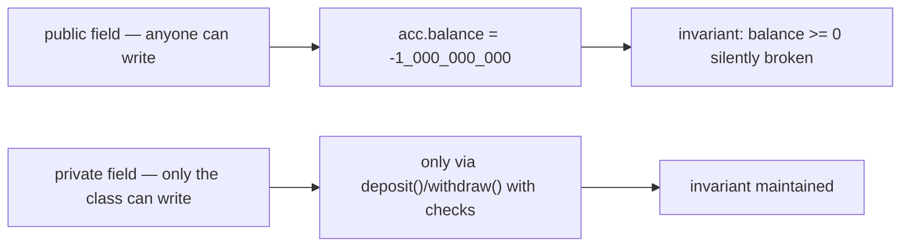

**Encapsulation** is the discipline of restricting access so that **mutation is funneled through methods that enforce the invariants**. The class becomes the *only* author of its own state. Access modifiers are the language mechanism that makes encapsulation enforceable — not just convention, but compile-time + JVM-verifier checked.

## The Four Access Levels at a Glance

Java has exactly four access levels, applicable to classes (top-level: only `public` or package-private; nested: all four), methods, fields, constructors, and nested types. Here is the visibility table:

| Modifier | Same class | Same package | Subclass (any package) | Anywhere |
|----------|:---:|:---:|:---:|:---:|
| `private` | ✅ | ❌ | ❌ | ❌ |
| package-private (no modifier) | ✅ | ✅ | ❌ | ❌ |
| `protected` | ✅ | ✅ | ✅ | ❌ |
| `public` | ✅ | ✅ | ✅ | ✅ |

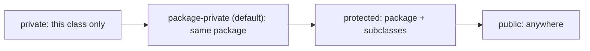

The levels form a strict chain: anything visible at the lower level is also visible at the higher level. You pick the **lowest** level that still lets the code work — the **principle of least privilege**. The default if you write no modifier is **package-private**, which is the JLS's "I haven't decided" position; it works fine within one package but is *not* the right answer for most public-facing API members.

### `private` — Class-Only

`private` members are visible only within the **declaring class** (and its nested classes — every nested class shares the same `private` access scope as the enclosing class). No subclass, no other class in the same package, no client code anywhere else can see them. Reflection can bypass this with `setAccessible(true)`, but only with the proper module/SecurityManager allowance ([§ Reflection: Bypassing Access Checks](#reflection-bypassing-access-checks)).

```java
public class Account {
    private long balance;                 // hidden from everything outside Account
    private void debug() { ... }          // hidden helper method

    public void deposit(long amount) {
        if (amount <= 0) throw new IllegalArgumentException();
        balance += amount;                // OK — same class
    }
}

class OtherClassSamePackage {
    void foo(Account a) {
        a.balance = -1;                   // COMPILE ERROR: balance has private access
    }
}
```

`private` is the **default starting point** for every field. If you can keep it `private`, do — you keep maximum control over invariants and over future refactorings (you can rename, retype, or eliminate the field without breaking anyone).

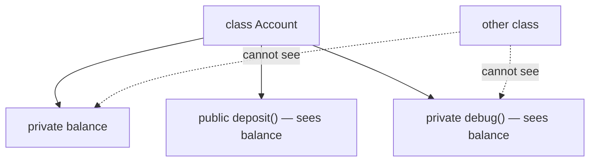

### Package-Private — Same-Package-Only (the Default)

Writing no modifier gives **package-private** access — visible to every class declared in the **same package**, invisible elsewhere. There is no keyword `package` for this; absence of any modifier is the marker.

```java
package com.example.banking;

public class Account {
    long version;     // package-private — visible inside com.example.banking
}

class AccountAuditor {     // also in com.example.banking
    void log(Account a) {
        System.out.println(a.version);   // OK — same package
    }
}
```

In other code:

```java
package com.example.client;
import com.example.banking.Account;

class Client {
    void use(Account a) {
        a.version;     // COMPILE ERROR: version is not visible
    }
}
```

Package-private is the **internal-API tier** — used heavily inside the JDK source for cross-class helpers within a single package. It's a useful middle ground: you can share state and helpers with co-package collaborators without exposing them to the world.

> [!WARNING]
> Package-private is determined by the **package name + classloader pair**, not just the package name. Two classes called `com.foo.Bar` loaded by different classloaders are NOT in the same package at the JVM level. This is mostly invisible day-to-day but matters in OSGi, application servers, and `URLClassLoader` setups.

### `protected` — Package-Private PLUS Subclasses Anywhere

`protected` extends package-private visibility with **subclasses anywhere** — but with a surprising restriction.

```java
package com.example.shape;
public class Shape {
    protected int sides;
}

package com.example.poly;
import com.example.shape.Shape;
public class Polygon extends Shape {
    void setSides(int n) {
        this.sides = n;          // OK — accessing inherited protected member of self
    }
    void copyFrom(Polygon other) {
        this.sides = other.sides;   // OK — `other` is also a Polygon (this class or subclass)
    }
    void copyFrom(Shape other) {
        this.sides = other.sides;   // COMPILE ERROR: `other` declared as Shape; cannot access
                                    // protected member via a reference of a superclass type
    }
}
```

The rule: inside a subclass, you can access a `protected` member through a reference of type **this class or a subclass of this class**, but **not** through a reference of the parent class's type. The JLS calls this "access through subclass type." The intent is that `protected` exposes inheritance-related behavior, not arbitrary access from a subclass to all instances of the parent.

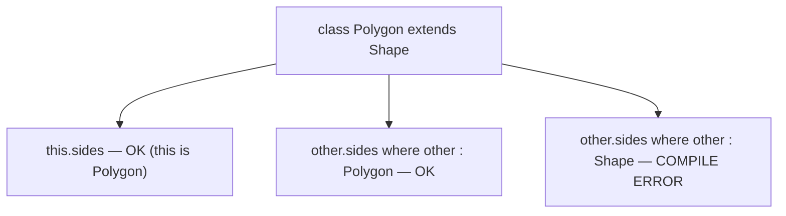

This trips up most learners; even seasoned developers occasionally hit it. The rule exists to prevent a malicious or accidental "look into the parent's data" through a sibling-class reference.

> [!INTERVIEW]
> "Is `protected` 'subclasses only'?" No. `protected` means "this package PLUS subclasses anywhere, accessed via this-class-or-subclass-typed references." The same-package half is often forgotten. To restrict to subclasses-only, there is no direct language-level mechanism in Java; convention or `sealed` types ([T15](./T15-sealed-classes-and-interfaces.md)) close the loophole.

### `public` — Anywhere

`public` is the broadest level: every class in every package on every classloader (subject to JPMS module-export rules in Java 9+) can see the member. It's the most permissive and the most fragile to evolve — every signature change is a backward-compatibility risk.

`public` on a top-level class also has a file-name implication ([L0/C02/T01](../../L0-foundations/C02-java-core/T01-program-structure-class-main-statements.md)): the file must be named `ClassName.java`. Non-public top-level classes can share a file.

## Choosing an Access Level — Principle of Least Privilege

The discipline: **start `private`. Widen only when forced.**

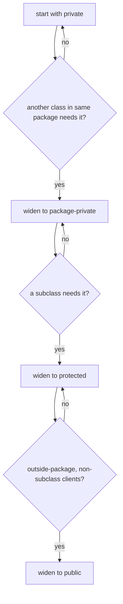

The reason: **widening is forever**. A `private` field can be renamed, retyped, or removed without breaking any caller; a `public` field freezes its name, type, and presence into the API contract. Every additional bit of surface area is a future maintenance cost. Pick the minimum.

A typical class layout:

| Member kind | Default level |
|-------------|---------------|
| Fields | `private` (almost always) |
| Constructors | match class visibility, unless restricting instantiation |
| Public-facing methods | `public` |
| Helper methods (only the class uses) | `private` |
| Methods shared with co-package classes | package-private |
| Methods designed for subclass override | `protected` (and document the contract) |

## Encapsulation as Invariant Enforcement

The mechanical effect of declaring fields `private` and exposing only methods is that **the constructor and the methods are the only gates** through which state changes. Every write path runs validation; every invariant is preserved by construction.

```java
public final class Account {
    private long balance;

    public Account(long opening) {
        if (opening < 0) throw new IllegalArgumentException("opening < 0");
        this.balance = opening;
    }

    public long getBalance() { return balance; }

    public void deposit(long amount) {
        if (amount <= 0) throw new IllegalArgumentException("amount must be > 0");
        balance = Math.addExact(balance, amount);   // overflow-safe
    }

    public void withdraw(long amount) {
        if (amount <= 0) throw new IllegalArgumentException("amount must be > 0");
        if (amount > balance) throw new IllegalStateException("insufficient funds");
        balance -= amount;
    }
}
```

The invariant `balance >= 0` is established by the constructor (rejects negative opening) and preserved by `deposit` (only adds positive amounts, overflow-safe) and `withdraw` (rejects amounts exceeding balance). No outside code can corrupt it because `balance` is `private`. The method names *describe operations*, not fields — `deposit/withdraw` not `setBalance`.

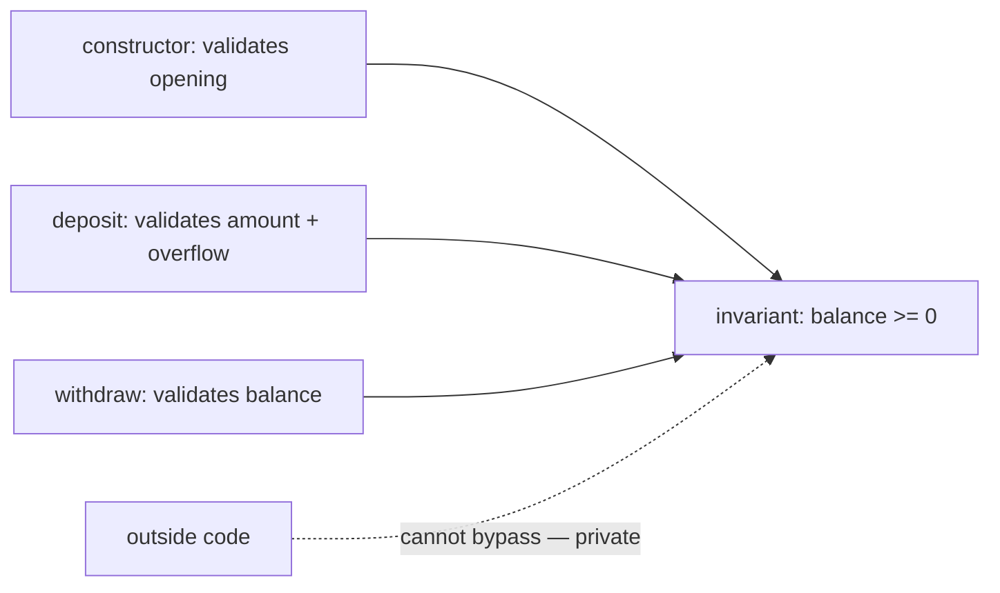

This is the single biggest benefit of encapsulation: **invariants compile, then stick**. Future refactorings can change the field type, add a derived field, switch to BigInteger, or add audit logging — and no caller breaks, because no caller knew about the field in the first place.

## Getters and Setters — and Their Critics

A common pattern in older Java code (and a contractual one for the **JavaBeans** specification) is to give every `private` field a matching pair of `getX()` and `setX(...)` methods.

```java
public class Person {
    private String name;
    private int age;

    public String getName() { return name; }
    public void setName(String name) { this.name = name; }
    public int getAge() { return age; }
    public void setAge(int age) { this.age = age; }
}
```

This *appears* to encapsulate `name` and `age` but actually doesn't — every field still has a public read path AND a public write path. The `private` adds nothing beyond preventing direct `p.name = ...` syntax; the semantic surface is identical.

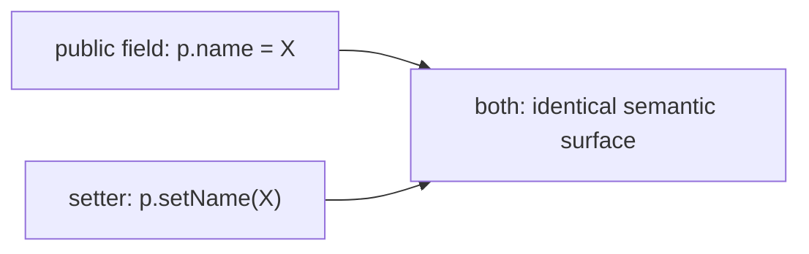

The modern critique (Bloch, Martin, Holub): **getters/setters expose data, not operations.** Real encapsulation exposes operations (`deposit`, `withdraw`, `markPaid`, `cancel`) that describe what the object *does*, not which fields it has. A class with one getter per field has the same coupling problems as a class with public fields, just with more boilerplate.

When are getters/setters appropriate?

- **JavaBeans interop** — frameworks like Spring, Jackson, Hibernate, JSF reflectively look for `getX`/`setX` to bind fields. If you need that, follow the convention.
- **Pure data carriers** — where the type's whole job is to hold and hand off named values. Modern Java prefers **records** for this (next subsection).
- **Settings classes** — configuration objects with no behavior.

When are they wrong?

- For domain types with invariants (Account, Order, Reservation). Expose operations.
- For collections (don't return `getItems()` returning a mutable internal list — return an unmodifiable view or a copy).
- For derived values (compute, don't store-and-getter).

> [!WARNING]
> A getter returning a mutable internal field (e.g., `List<Item> getItems() { return items; }`) silently breaks encapsulation: the caller can mutate the internal list directly. Return `Collections.unmodifiableList(items)`, return a defensive copy, or expose operations (`addItem`, `removeItem`) instead.

## Records: Field-Level Encapsulation Made Explicit

For pure data carriers — point, range, RGB color, person — Java 16+ provides **records** (full coverage in [T14](./T14-record-types.md)). A record declares its fields once; the language auto-generates a canonical constructor, accessor methods, `equals`, `hashCode`, and `toString`.

```java
public record Point(int x, int y) { }

Point p = new Point(3, 4);
System.out.println(p.x());   // 3 — auto-generated accessor
System.out.println(p);       // Point[x=3, y=4]
```

Records make the design intent explicit: **this type's job is to be its fields**. There's no hidden state, no invariants beyond what the canonical constructor checks. The auto-generated accessors are public; the fields underneath are `private final`. Record instances are deeply immutable (subject to mutability of contained references — defensive copies still needed for mutable collections).

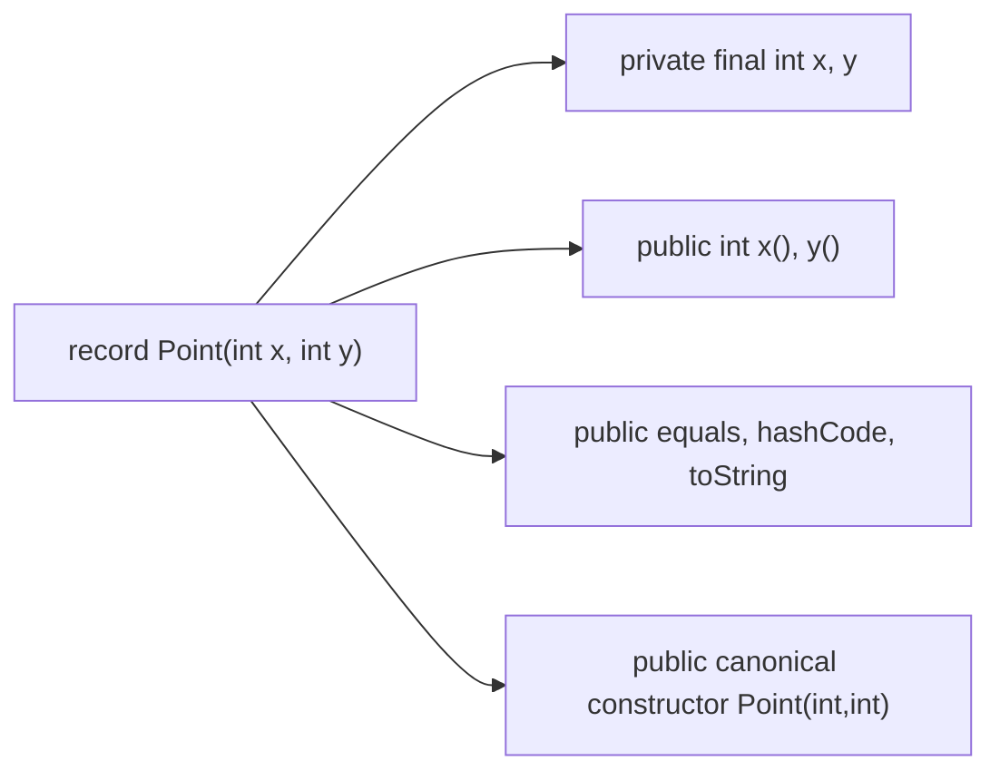

For invariant-bearing domain types (Account, Order, Customer), records are usually wrong — you need encapsulation of operations, not auto-exposure of fields. For tuple-like values (Point, Range, Pair), records are exactly right.

## The Immutable-Field Idiom

Combining `private`, `final`, and a constructor-only assignment yields the **immutable field** — set once at construction, never reassigned, never visible to outside writes.

```java
public final class Money {
    private final long cents;
    private final String currency;

    public Money(long cents, String currency) {
        if (cents < 0) throw new IllegalArgumentException("negative cents");
        if (currency == null) throw new NullPointerException("currency");
        this.cents    = cents;
        this.currency = currency;
    }

    public long cents()      { return cents; }
    public String currency() { return currency; }

    public Money plus(Money other) {
        if (!this.currency.equals(other.currency))
            throw new IllegalArgumentException("currency mismatch");
        return new Money(Math.addExact(this.cents, other.cents), currency);
    }
}
```

Three properties this gives you for free:

1. **Thread-safety** — no mutation, no race conditions. Combined with `final` fields, the JMM `final` freeze ([T02](./T02-fields-methods-constructors-this.md)) guarantees safe publication across threads.
2. **Defensive-copy elimination** — callers can't mutate, so you don't need to copy.
3. **Cache-key safety** — usable as a `HashMap` key because the state never changes.

The same pattern applies to records by default.

> [!INTERVIEW]
> "How do you make a class immutable?" Make every field `private final`, set them only in the constructor, mark the class `final` (so no subclass can add mutable state), provide no setters, and **defensively copy** any mutable reference passed in or returned out (e.g., `Date`, `List`, `byte[]`). Records check most of these boxes for you; the defensive-copy of contained mutable references is still your responsibility.

## Private Constructors: Singletons and Utility Classes

A `private` constructor blocks `new` from outside the class. Two common uses:

**1. Utility classes** — classes that hold only static methods and should never be instantiated.

```java
public final class Math2 {
    private Math2() { throw new AssertionError("no instances"); }
    public static int clamp(int x, int lo, int hi) {
        return Math.max(lo, Math.min(hi, x));
    }
}
```

The class is `final` (no subclasses) with a `private` constructor that throws (defends against reflective instantiation). `new Math2()` won't compile; `Math2.clamp(...)` is the only entry point. The JDK's own `Math`, `Collections`, `Arrays` all follow this pattern (though they use the default constructor + private modifier without the throw).

**2. Singleton** — exactly-one-instance pattern, where the class hands out its sole instance via a static method.

```java
public final class Logger {
    private static final Logger INSTANCE = new Logger();
    private Logger() { }
    public static Logger get() { return INSTANCE; }
    public void log(String msg) { ... }
}

Logger.get().log("hello");
```

Single-instance enforcement: only the class's own static initializer can call the private constructor. Modern Java prefers **enum singletons** ([T13](./T13-enum-types-with-fields-methods.md)) for serialization-safety, but the static-final-field pattern remains widely used.

Full discussion of these patterns is in **L3/C03 design patterns**.

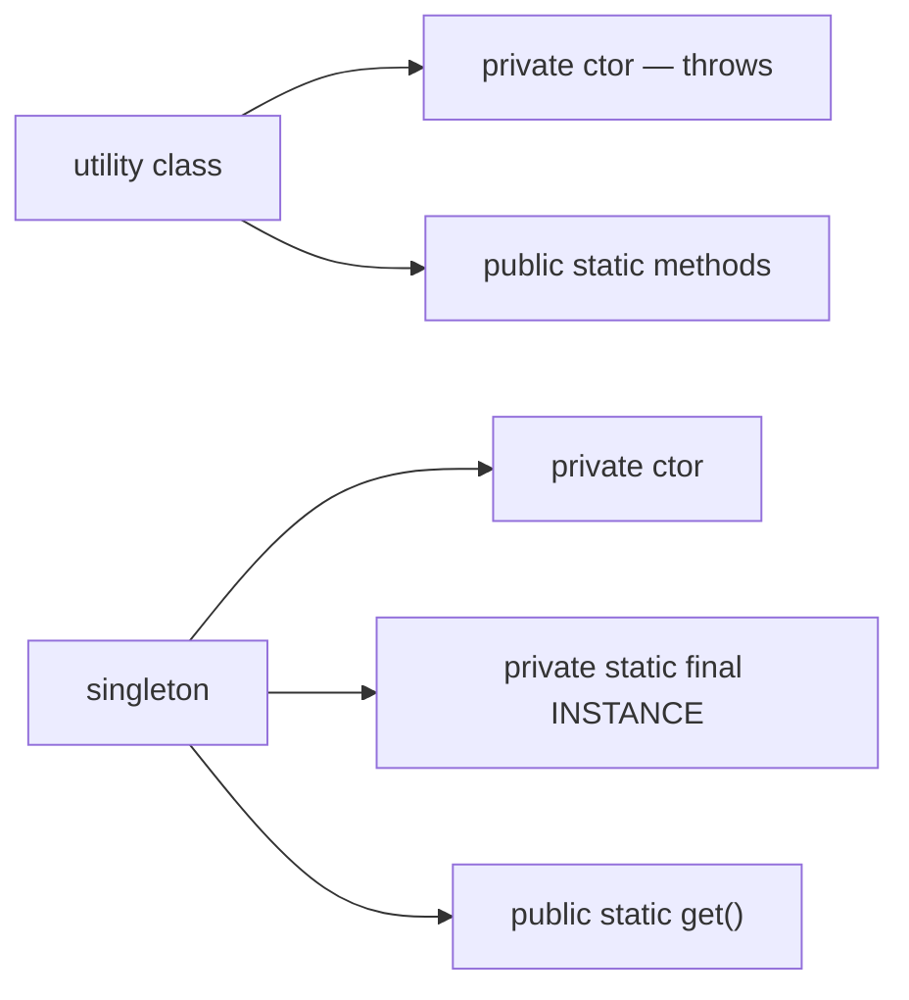

## Memory Layer: ACC_* Flags in the Class File

Access modifiers are not "compiler hints" — they're a **persistent attribute of the .class file**. Each field, method, and inner-class entry carries an `access_flags` field — a 16-bit bitmask. The relevant bits:

| Bit | Hex | Meaning |
|-----|-----|---------|
| 0 | `0x0001` | `ACC_PUBLIC` |
| 1 | `0x0002` | `ACC_PRIVATE` |
| 2 | `0x0004` | `ACC_PROTECTED` |
| 3 | `0x0008` | `ACC_STATIC` |
| 4 | `0x0010` | `ACC_FINAL` |
| 5 | `0x0020` | `ACC_SYNCHRONIZED` (method) / `ACC_SUPER` (class) |
| 6 | `0x0040` | `ACC_VOLATILE` (field) / `ACC_BRIDGE` (method) |
| 7 | `0x0080` | `ACC_TRANSIENT` (field) / `ACC_VARARGS` (method) |
| 10 | `0x0400` | `ACC_ABSTRACT` |
| 11 | `0x0800` | `ACC_STRICT` (legacy) |
| 12 | `0x1000` | `ACC_SYNTHETIC` |
| 13 | `0x2000` | `ACC_ANNOTATION` |
| 14 | `0x4000` | `ACC_ENUM` |

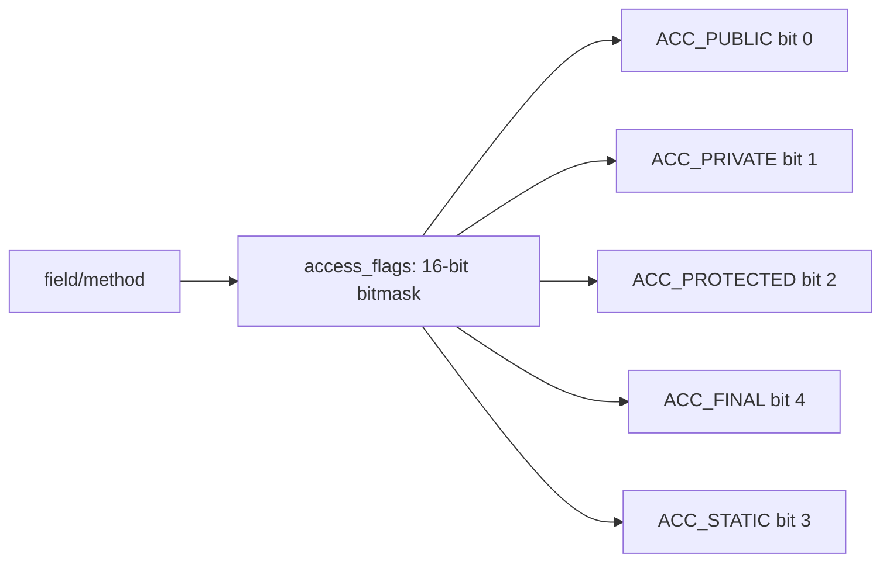

A `public final` method has `access_flags = 0x0001 | 0x0010 = 0x0011`. A `private` field has `0x0002`. A `protected static` method has `0x0004 | 0x0008 = 0x000C`. **Package-private has NO bit** — it's the absence of `ACC_PUBLIC`, `ACC_PRIVATE`, and `ACC_PROTECTED`. There is no `ACC_PACKAGE` flag.

You can see these flags with `javap -v`:

```
$ javap -v Account
private long balance;
  descriptor: J
  flags: (0x0002) ACC_PRIVATE

public void deposit(long);
  descriptor: (J)V
  flags: (0x0001) ACC_PUBLIC
```

Or by dumping the raw bytes of the `.class` file with `xxd` and finding the field/method tables; each entry starts with a 2-byte `access_flags` value (big-endian — bytecode is big-endian regardless of host CPU, [L0/C02/T02](../../L0-foundations/C02-java-core/T02-variables-and-primitive-types.md) callback).

### Where Access Flags Live in the Physical Class File

The exact byte layout matters because the JVM verifier reads it during class loading, and tools like ASM/Javassist/ByteBuddy patch it to bypass language-level rules. The `.class` file structure (from JVM Spec §4.1):

```
ClassFile {
    u4  magic;                       // 0xCAFEBABE — 4 bytes, identifies a class file
    u2  minor_version;               // 2 bytes
    u2  major_version;               // 2 bytes (e.g. 65 = Java 21)
    u2  constant_pool_count;         // 2 bytes
    cp_info constant_pool[count-1];  // variable size
    u2  access_flags;                // 2 bytes — THE CLASS'S access_flags
    u2  this_class;                  // 2 bytes
    u2  super_class;                 // 2 bytes
    u2  interfaces_count;
    u2  interfaces[interfaces_count];
    u2  fields_count;
    field_info fields[fields_count];     // each field_info begins with 2-byte access_flags
    u2  methods_count;
    method_info methods[methods_count];  // each method_info begins with 2-byte access_flags
    u2  attributes_count;
    attribute_info attributes[attributes_count];
}

field_info {
    u2  access_flags;       // 2 bytes  ← here
    u2  name_index;
    u2  descriptor_index;
    u2  attributes_count;
    attribute_info attributes[attributes_count];
}

method_info {
    u2  access_flags;       // 2 bytes  ← here
    u2  name_index;
    u2  descriptor_index;
    u2  attributes_count;
    attribute_info attributes[attributes_count];
}
```

So `access_flags` is **2 bytes** in three places: once for the class as a whole, once per field, once per method. A typical 50-method, 20-field class burns ~140 bytes of class-file space on access flags alone — trivial relative to total class file size, but multiply by thousands of classes loaded by a Spring application and you have hundreds of KB of access metadata in Metaspace.

#### Hex Dump of a Field Entry

For `private long balance;` in `Account.class`, the field_info bytes might look like:

```
offset  bytes        meaning
+0:     00 02        access_flags = ACC_PRIVATE  (big-endian!)
+2:     00 17        name_index = 23 → "balance"
+4:     00 18        descriptor_index = 24 → "J" (long)
+6:     00 00        attributes_count = 0
+8:     (next field_info begins)
```

8 bytes for a fieldless-attribute field; more if the field carries `ConstantValue`, `Signature` (for generics), or annotations. Verifiers and `javap` read these bytes literally; ASM patches them by overwriting the access_flags bytes during transformation.

#### The Verifier's Access Check — Cycle-Level Cost

When `getfield Account.balance` runs the first time, the verifier:

1. Reads the `Fieldref` constant-pool entry → name "balance", descriptor "J", class "Account".
2. Resolves "Account" → finds Account's Klass struct.
3. Walks Account's field-info table looking for name "balance", descriptor "J".
4. Reads that field's access_flags = `0x0002` (`ACC_PRIVATE`).
5. Compares caller's class to Account → reject if not Account itself or a nest mate.
6. **Patches the Fieldref entry** with the resolved field offset (e.g., 16).

Steps 1–5 cost ~50–200 cycles on a cold call site. Step 6 means subsequent calls skip the check entirely — the patched entry holds the offset directly. The `getfield` then runs as a single load (~1 cycle on L1 hit).

**Total runtime cost of access checks across a Java program's lifetime:** O(number of distinct call sites), paid once at first execution. **Per-call cost: zero.** This is the structural reason "access modifiers don't slow you down" — they impose link-time cost, never run-time cost.

#### JIT-Emitted Code for `private` vs `public` Methods

A `private` method compiles to `invokespecial` (static binding, no vtable lookup). The JIT-emitted call site is:

```
call  Direct_Address_Of_PrivateMethod    ; baked-in 5-byte relative call
```

A `public` (overridable) method compiles to `invokevirtual` (vtable lookup). In monomorphic hot code with inline caching, the call site is:

```
cmp   [rdi + 8], CachedKlass        ; klass check
jne   ic_miss_handler
call  CachedMethod_Address          ; direct call after cache hit
```

The `cmp + jne` pair adds **2 cycles + 1 branch prediction** to the `public` version. On hot paths the branch is correctly predicted ~100% of the time, so the cost is ~1 ns; over millions of calls per second, that's a measurable difference. For inner-loop helpers, mark them `private` (or `final` if they're public-API). The JIT will skip the inline-cache check entirely.

## Linking and the IllegalAccessError Check

Access checks happen at **link time** — when a class first resolves a reference to another class's member. The JVM's verifier walks the bytecode of the using class, finds every `getfield`, `putfield`, and `invoke*` opcode, resolves the symbolic reference to the target field/method, and checks the target's `access_flags` against the using class.

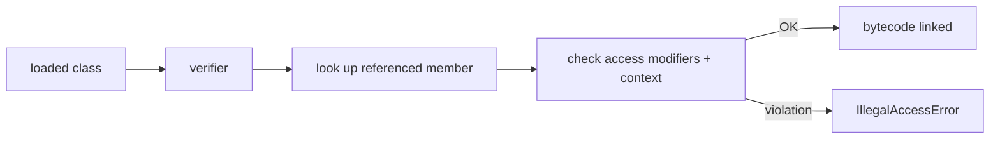

If the check fails, the JVM throws `java.lang.IllegalAccessError` — a `LinkageError` subclass thrown at link/load time, NOT a regular runtime exception. The error is unusual to see in practice because **javac already enforces the same rule at compile time** — you can't compile code that references an inaccessible member.

When does the runtime check fire then? When the calling class was compiled against an *older* version of the target class in which the member was accessible, but the *runtime* class has tightened access. The compile-time check passed (you had the wider version); the link-time check fails. This is one of the classic "binary incompatibility" hazards covered in the Java Language Specification §13.

```java
// Library version 1.0:  public void foo() {}
// You compile your code against this — OK.

// Library version 2.0:  private void foo() {}    // access tightened
// You run your already-compiled code against this — IllegalAccessError at link time.
```

The cost of the check: **once per linked reference**, not per call. Runtime invocation cost is zero.

## `javap -p` — Inspecting All Members

`javap` by default dumps only `public`/`protected` members. `javap -p` (lowercase) dumps **everything**, including `private` and package-private. Combined with `-c` (bytecode) and `-v` (verbose, including flags + constant pool), it's the canonical tool for studying access-modifier effects.

```
$ javap -p -v Account
  // dumps every field & method with full access_flags annotations
```

When studying a binary library or a generated class, `javap -p` reveals members the API documentation may not advertise. The JVM doesn't *prevent* you from reading the bytecode; it only prevents *callers* from binding to inaccessible members.

## Architecture Layer: Why `private` Methods Are Faster

The JIT's biggest optimization is **inlining** — copying the body of a called method into the caller, eliminating the call sequence entirely. Inlining enables further optimizations: cross-procedure constant folding, escape analysis, dead-code elimination, register allocation. Hot code achieves C-like performance largely because of aggressive inlining.

Inlining is **easy** when the JIT can prove the call site is **monomorphic** — exactly one possible target method. Three modifiers guarantee monomorphism statically:

1. **`private` methods** — cannot be overridden; the call target is bound at compile time. Compiled with `invokespecial`, not `invokevirtual`. No vtable lookup.
2. **`final` methods** — cannot be overridden; `invokevirtual` is still emitted, but the JIT trivially proves the call is monomorphic.
3. **Methods of `final` classes** — no subclasses possible, so no overrides; the JIT treats all instance methods as monomorphic.

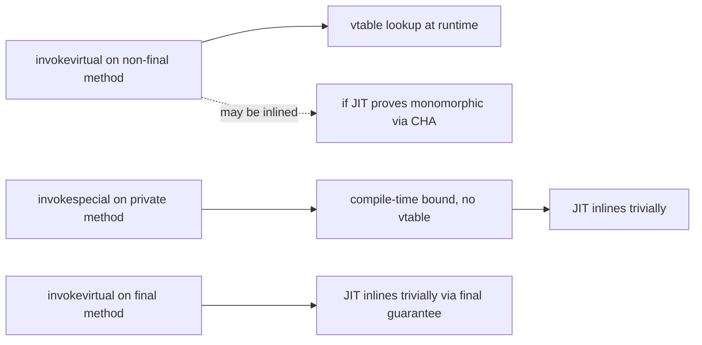

**Class Hierarchy Analysis (CHA)** allows the JIT to inline `invokevirtual` of a non-final method *if no override has been loaded yet* — but the JIT must install a **deoptimization guard** that triggers if an overriding subclass loads later. `private`/`final` skip the guard entirely, freeing the JIT for more aggressive inlining decisions.

**Result on hot paths**: `private` helper methods consistently outperform their package-private/public counterparts. The difference is small (~1–3 ns per call) but compounds across millions of calls per second.

> [!INTERVIEW]
> "Why is `private` faster than `public` in hot code?" `private` methods compile to `invokespecial` (not `invokevirtual`), eliminating the vtable lookup; the JIT proves monomorphism statically and inlines without a deoptimization guard. The same benefit applies to `final` methods and methods of `final` classes. In megamorphic code (~3+ targets) the difference balloons because the JIT cannot inline through a polymorphic call at all.

## Final and JIT: The Same Story

`final` on a class (`final class Foo`) prevents subclasses; `final` on a method prevents override. The JIT exploits both:

- **`final class String`** — every method call on a `String` reference is monomorphic. CHA succeeds for free; all the dispatch optimization headaches vanish.
- **`final void doIt()`** in a non-final class — this single method is monomorphic; overrides of *other* methods don't affect it.

Modern Java style: mark classes and methods `final` unless you've explicitly designed for inheritance. The JIT thanks you; future maintainers do too.

```java
public final class Money { ... }     // closed for extension — JIT-friendly + safer
public final void log() { ... }      // this method is closed; others may not be
```

Records and enum types are **implicitly final** — the language enforces it.

## Reflection: Bypassing Access Checks

Reflection lets code introspect classes and access members **at runtime**, including `private` ones — subject to module rules and the SecurityManager (where present).

```java
Field f = Account.class.getDeclaredField("balance");
f.setAccessible(true);              // bypass the access check
long val = f.getLong(account);      // read private field
f.setLong(account, 1_000_000_000);  // write private field
```

This is how serialization libraries (Jackson, Gson, Java Serialization) read your fields; how testing frameworks (JUnit) call your private methods; how JPA/Hibernate hydrate entities. It is also a sharp tool — modifying invariant-protected fields directly defeats encapsulation entirely.

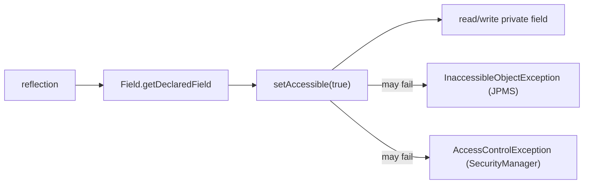

### Cost

Reflective access is much slower than direct access:

| Operation | Approximate cost |
|-----------|------------------|
| Direct field read (`obj.x`) | ~1 ns (JIT inlined) |
| Direct method call | ~1–3 ns (monomorphic) |
| `Field.getLong(obj)` | ~30–100 ns |
| `Method.invoke(obj, args)` | ~50–150 ns |
| `MethodHandle.invokeExact` (cached) | ~5–10 ns |

Reflective calls can't be inlined in general — the JIT doesn't know which field/method until runtime. **MethodHandles** (Java 7+, `java.lang.invoke`) and **VarHandles** (Java 9+) are the modern alternative: bind once, invoke at near-direct cost.

### JPMS Module Restrictions

Java 9+ introduced the **Java Platform Module System** ([T17](./T17-java-module-system-jpms.md)). A module can declare its packages **exported** (visible to other modules) or **open** (additionally reflectable). Without `opens`, even `setAccessible(true)` fails with `InaccessibleObjectException`. This was the JDK's response to widespread reflective abuse of JDK internals.

```java
module com.example.app {
    exports com.example.api;             // public API — accessible at compile time
    opens com.example.internal;          // reflectively accessible to anyone with the type
    opens com.example.deep to com.example.framework;   // open only to a specific module
}
```

JPMS coverage is full in [T17](./T17-java-module-system-jpms.md); the takeaway here is that **module-level encapsulation is the modern strongest tier** — beyond what `private` alone provides.

## Deeper JVM Internals — Nest-Mate Access, Binary Compatibility, and the Access Check Pipeline

The compile-time check by javac and the link-time check by the JVM verifier are only the *visible* faces of access control. The JVM's access pipeline is a multi-stage affair that handles **nest-based access** (Java 11), **module export rules** (Java 9), **bridge accessors** for inner classes pre-11, and the **VarHandle** family for racy access. This section unpacks those layers.

### Nest-Based Access (Java 11, JEP 181)

Pre-Java-11, when an inner class accessed a `private` member of its enclosing class (or vice versa), javac couldn't emit a direct field/method access — JVM access rules required them to be different classes with no privileged access. Javac worked around this by generating **synthetic bridge accessor methods** (`access$000`, `access$100`, etc.) — package-private wrappers that the inner class called to reach the enclosing class's privates.

```java
public class Outer {
    private int x;
    class Inner {
        void poke() { x = 5; }   // pre-11: javac generates Outer.access$000(this, 5)
    }
}
```

Pre-11 bytecode:
```
class Outer:
  private int x;
  static int access$002(Outer outer, int val) { outer.x = val; return val; }   // synthetic bridge

class Outer$Inner:
  void poke() {
    invokestatic Outer.access$002(outer, 5)
  }
```

**Java 11+ removed this hack** with **nest-based access**. A class file gets two new attributes:

- **`NestHost`** — names the nest's top-level class.
- **`NestMembers`** — lists all classes in the nest (only on the nest host).

The verifier consults these attributes: members of the same nest are allowed direct access to each other's `private` members. No more synthetic bridges. The bytecode becomes simply `putfield Outer.x` from inside `Inner.poke`.

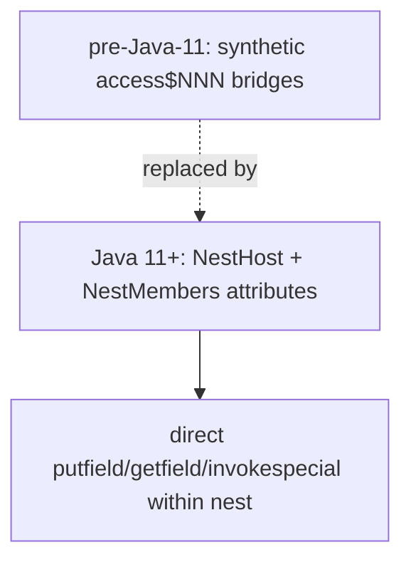

The benefit:
- Cleaner bytecode (no synthetic methods clutter `javap` output).
- Lower memory footprint (synthetic bridges had their own method entries).
- Faster — direct access vs an extra `invokestatic`.
- Better reflection (`getNestHost`, `getNestMembers` API).

`MethodHandles.Lookup` has a `PRIVATE` access mode that respects nest-based access — you can create a lookup that pierces all the nest's privates.

### Module Access Pipeline (Java 9+)

When `invokevirtual Foo.method` runs across module boundaries, the JVM's access check is a **two-stage** pipeline:

1. **Module visibility check** — does the *target's* module export the *target's* package to the *caller's* module? If not, `IllegalAccessError`.
2. **Member access check** — does the target member's `access_flags` permit access from the caller's class? Same rule as before JPMS.

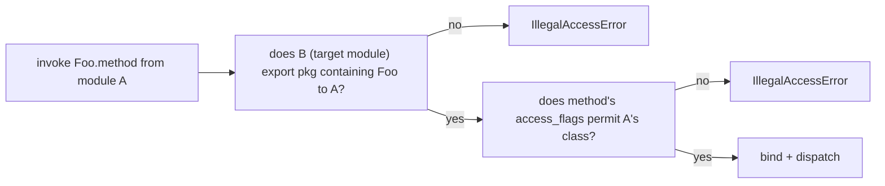

The module check is **stronger than any `public`** — a `public` method in a non-exported package is invisible across module boundaries. This is what made JPMS controversial: code that "worked" on classpath-based JVMs broke on module-path JVMs because it accessed `sun.misc.Unsafe` or `jdk.internal.*` types that are no longer exported.

The `--add-exports` and `--add-opens` JVM flags override these checks for compatibility:
```
--add-exports java.base/sun.security.util=ALL-UNNAMED
--add-opens   java.base/java.lang=ALL-UNNAMED
```

These flags are how legacy libraries (Hibernate, ASM, certain Spring versions) continue to work on Java 9+. They are tactical workarounds, not long-term solutions.

### `module-info.class` Structure

A module is described by a special `.class` file:

```
module-info.class:
  access_flags: ACC_MODULE (0x8000)
  this_class: name index "module-info"
  Module attribute:
    module_name: "com.example.api"
    module_version: "1.0"
    requires:
      "java.base" ACC_MANDATED
      "java.logging" ACC_TRANSITIVE
    exports:
      "com.example.api.foo" to nothing (= all modules)
      "com.example.api.bar" to "com.example.app"
    opens:
      "com.example.api.reflect" to "com.example.framework"
    uses:
      "com.example.api.spi.Backend"
    provides:
      "com.example.api.spi.Backend" with "com.example.api.impl.LocalBackend"
```

The `ACC_MODULE` flag (0x8000) marks this as a module descriptor, not a regular class. The verifier rejects any `new module-info()` attempt. The `Module` attribute is the actual descriptor; the JVM reads it at module-system bootstrap.

### Binary Compatibility — When Access Tightening Breaks Callers

The JLS §13 specifies which API changes preserve binary compatibility and which don't. Access-modifier changes are particularly tricky:

| Change | Binary-compatible? |
|--------|--------------------|
| `public` → `protected` | **No** — caller's bytecode references the public member; verifier rejects on tighter access |
| `protected` → `public` | Yes — wider is always safe |
| `package-private` → `protected` | Yes (one direction widening) |
| `protected` → `package-private` | No — subclass callers break |
| `private` → anything | Yes — was inaccessible anyway |
| Adding a `final` to a method | Breaks subclasses overriding it; new instances OK |

The runtime error from a binary-incompat tightening is `IllegalAccessError` — thrown at the first access by the no-longer-allowed caller. Tools like `revapi` and `japicmp` automate the check; the JDK source itself uses `@since`, `@apiNote`, and `@implSpec` to document compatibility intent.

### The Access Check Bytecode Pipeline — Step by Step

When a `getfield`/`putfield`/`invoke*` opcode hits a member for the *first time* in a frame, the JVM does:

1. **Read the constant-pool entry** — a `Fieldref`/`Methodref`. Symbolic at this point.
2. **Resolve** the symbolic reference: find the actual target class via classloader delegation; load if necessary.
3. **Find the member** — walk the target class's field/method table for a match on name + descriptor; if not found, walk the parent chain (for fields and instance methods).
4. **Access check** — does the caller's class have permission per the member's `access_flags` + JPMS rules + nest rules? If not, throw `IllegalAccessError` (link-time) or `IllegalAccessException` (reflection-time).
5. **Patch the constant pool** — store the resolved offset/method for fast subsequent access.

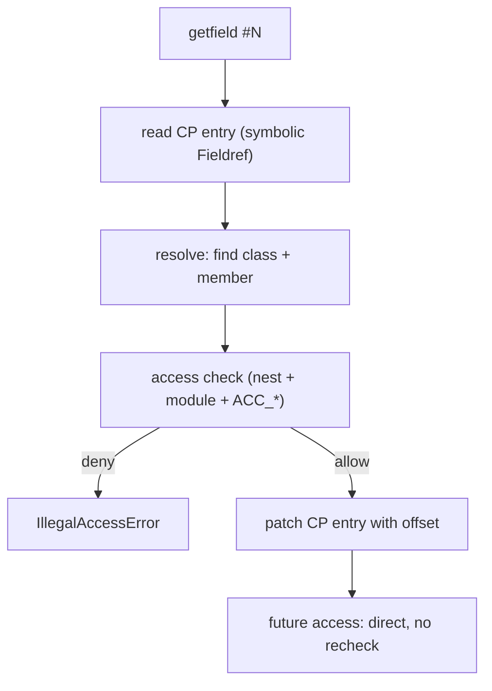

The cost: ~hundreds of cycles for the first resolution, ~1 cycle for subsequent uses (the patched constant-pool entry caches the offset). This is why "access checks are zero runtime cost in practice" — they happen *once* per call site, not per call.

### `VarHandle` Access Modes — Bypass for Concurrency

For low-level concurrent code, `java.lang.invoke.VarHandle` (Java 9+) provides typed, access-checked field/array access at near-direct cost. Unlike reflection's `setAccessible(true)`, VarHandles respect access control: you cannot get a VarHandle to a `private` field of another class without the proper `Lookup` privileges.

```java
private static final VarHandle X_HANDLE;
static {
    try {
        X_HANDLE = MethodHandles.lookup().findVarHandle(Point.class, "x", int.class);
    } catch (Exception e) { throw new ExceptionInInitializerError(e); }
}

// usage — atomic, volatile-ish, fence-aware:
X_HANDLE.set(point, 5);               // plain write
X_HANDLE.setVolatile(point, 5);       // volatile write (memory barrier)
X_HANDLE.compareAndSet(point, 3, 5);  // CAS
X_HANDLE.getAndAdd(point, 1);         // atomic increment
```

The `MethodHandles.lookup()` captures the **caller's** access context — a VarHandle obtained from a `Lookup` with `PRIVATE` access can reach `private` fields *of the lookup's class only*. This is the secure modern alternative to `Field.setAccessible(true)`.

### How `invokespecial` Sidesteps Some Access Checks

`invokespecial` on a `private` method (or on `super.method()` or `<init>`) **does not consult the vtable** — it dispatches directly to the resolved method. The access check still applies (the verifier rejects `invokespecial` to a method the caller can't see), but the lookup is statically bound. This is why `private` methods are JIT-inlining-friendly:

```
private void helper() { ... }
public void caller() { helper(); }  // invokespecial — direct call
```

Bytecode:
```
public caller():
  aload_0
  invokespecial Foo.helper:()V  // direct, no vtable
  return
```

Compare with the `public` version:
```
public caller():
  aload_0
  invokevirtual Foo.helper:()V  // through vtable
  return
```

The JIT can inline both at hot sites via CHA + inline caching, but the `invokespecial` version is unconditionally monomorphic — the JIT doesn't even need a deopt guard. **`private` is a free monomorphism hint to the JIT.**

### IllegalAccessError vs IllegalAccessException — Two Different Failures

These are easily confused:

| Error/Exception | Thrown by | Trigger |
|-----------------|-----------|---------|
| `IllegalAccessError` (LinkageError) | the JVM verifier | bytecode references inaccessible member; binary-incompat |
| `IllegalAccessException` (checked Exception) | `Method.invoke`, `Field.get`/`set`, etc. | reflection without proper Lookup/access mode |
| `InaccessibleObjectException` | `setAccessible(true)` | JPMS: target module not opened |

A library running on a tightened version of its dependency throws `IllegalAccessError`. Reflection failing to bypass throws one of the other two. Knowing the distinction lets you debug a "ClassNotFound or access" stack trace fast.

## Common Mistakes

> [!WARNING]
> **`protected` ≠ subclasses only.** It also exposes to the whole package. To restrict to subclass-only there's no language-level mechanism; use `sealed` classes ([T15](./T15-sealed-classes-and-interfaces.md)) or convention.

> [!WARNING]
> **Default = package-private, not public.** Forgetting to write `public` on a class member that's part of your API leaves it package-private — invisible to clients. The first time a downstream caller tries to import it, they see "cannot resolve symbol."

> [!WARNING]
> **`final` only prevents reassignment, not mutation.** `private final List<String> items = new ArrayList<>();` lets a caller of `getItems()` mutate the list. Return `Collections.unmodifiableList(items)` or a copy.

> [!WARNING]
> **Getter/setter for every field defeats encapsulation.** Expose operations, not data. Use records for tuple-like values.

> [!WARNING]
> **Public mutable arrays.** `public static final String[] OPTIONS = {...}` looks immutable but isn't — callers can `OPTIONS[0] = "evil";`. Use `List.of(...)` or expose via a method that returns a copy.

> [!WARNING]
> **`protected` access via parent-typed reference.** The JLS quirk: from inside a subclass, `parentTyped.protectedMember` is rejected; only `this.protectedMember` or `subclassTyped.protectedMember` is allowed.

> [!WARNING]
> **Package-private as an API.** External code can't see it; a downstream caller in a different package gets a compile error. If you want to share with co-package collaborators only, fine — if you want clients to call, make it `public`.

> [!WARNING]
> **`private` method that subclass "overrides".** Declaring a method with the same signature in a subclass doesn't override the parent's `private` method — it shadows it. Polymorphic dispatch picks the version statically known to the caller; subtle bugs ensue.

> [!WARNING]
> **Reflection bypassing without JPMS opens.** In Java 9+, `setAccessible(true)` on a member of a module that doesn't `opens` the package fails with `InaccessibleObjectException`. Libraries that pre-date JPMS often need `--add-opens` JVM flags to run on modern Java.

> [!INTERVIEW]
> Common interview questions for this topic:
> 1. **List the four access modifiers in order of restriction.** `private` < package-private (default) < `protected` < `public`.
> 2. **What's the default access level?** Package-private (no keyword for it; the absence of `public`/`protected`/`private`).
> 3. **Does `protected` mean "subclasses only"?** No — also exposes to the same package. And from inside a subclass, access through a parent-typed reference is forbidden ("access through subclass type" rule).
> 4. **How do access modifiers compile?** As bits in the `access_flags` field of `.class` field/method entries. `ACC_PUBLIC = 0x0001`, `ACC_PRIVATE = 0x0002`, `ACC_PROTECTED = 0x0004`. Package-private = none of those three bits set.
> 5. **When does the access check happen?** At compile time by javac; at link/load time by the JVM verifier. Runtime invocation cost is zero.
> 6. **What is `IllegalAccessError`?** A `LinkageError` thrown when bytecode references a member that was accessible at compile time but is no longer accessible at runtime (e.g., library version change).
> 7. **Why are `private` methods faster?** They compile to `invokespecial` (no vtable lookup) and the JIT proves monomorphism statically, inlining without a deoptimization guard.
> 8. **What's the analogous benefit of `final`?** `final` methods (and methods of `final` classes) cannot be overridden, so `invokevirtual` is trivially monomorphic; JIT inlines without a guard.
> 9. **How does reflection bypass access checks?** `Field/Method.setAccessible(true)` disables the language-level check (subject to SecurityManager and JPMS module rules).
> 10. **What's the cost of reflective access?** ~30–150 ns per call (vs ~1 ns direct); MethodHandles can be much closer to direct cost.
> 11. **What does JPMS add over `private`?** Module-level encapsulation: types in non-`exports`-ed packages aren't visible to other modules; `opens` is required for reflective access; far stronger than per-class modifiers.
> 12. **How do you make a class immutable?** All fields `private final`; class `final`; no setters; constructor validates; defensive copies of mutable references in/out. Records cover most of these.
> 13. **What is the principle of least privilege?** Pick the most restrictive access level that still lets the code work; widen only when forced.
> 14. **Why are getter/setter pairs criticised?** They expose data, not operations — semantically equivalent to public fields, just with more boilerplate. Records are the right answer for pure data carriers; for domain types expose operations.
> 15. **Why is `package-private` based on classloader-scoped package name?** The JVM treats `<package, classloader>` as the package identity; two classes with the same package name loaded by different classloaders are NOT in the same package.

## Practice

1. **Direct access fails.** Declare `class A { private int x; }` and `class B { void bump(A a) { a.x++; } }`. Compile both; observe the error on `a.x`.

2. **Widen progressively.** Change `A.x` to package-private; recompile. Compile a class in a different package referring to `a.x`; observe the error. Change to `public`; observe success.

3. **`protected` via subclass type.** Replicate the `Polygon.copyFrom(Shape)` vs `Polygon.copyFrom(Polygon)` distinction across packages; observe one compiles, one doesn't.

4. **`javap -v` access flags.** Declare a class with one of each visibility; run `javap -v`; identify the `ACC_*` flag of each member and confirm `0x0001`, `0x0002`, `0x0004`, `(0x0000)` for package-private.

5. **Hex inspection.** Dump a small `.class` file with `xxd` (or `hexdump -C`). Find a field entry (after the constant pool ends); read the first 2 bytes as the `access_flags`. Match it to your source.

6. **`javap -p` reveals private.** Run `javap` (no `-p`) on a class with `private` methods; note they don't appear. Run `javap -p`; note they do.

7. **Invariant via encapsulation.** Write `Account` with `private long balance`, a constructor rejecting negative opening, and `deposit/withdraw` validating amounts. Try to violate `balance >= 0` from outside; observe you can't.

8. **Getter trap.** Add `public List<Item> getItems() { return items; }` to a class with `private final List<Item> items = new ArrayList<>();`. Demonstrate a caller mutating `items` via the returned reference. Fix with `Collections.unmodifiableList(items)`.

9. **Private constructor for utility class.** Convert a class with all `public static` methods to have a `private` constructor that throws `AssertionError`. Try `new` from outside; observe the compile error. Try reflection (`setAccessible(true)` + `newInstance`); observe `AssertionError` thrown by your defense.

10. **Singleton via static field.** Implement the static-final-field singleton; observe `Logger.get() == Logger.get()`. Now break it via reflection. Switch to an enum singleton; observe reflection cannot break it (enum constructors are special-cased).

11. **Private method is not overridden.** Declare `class P { private void hi() { System.out.println("P"); } public void call() { hi(); } }` and `class C extends P { private void hi() { System.out.println("C"); } }`. Call `new C().call()`. Predict the output, then run. Explain why.

12. **`final` method monomorphism.** Declare a non-final class with a `final` method; write a benchmark calling that method 100M times. Then remove `final`; run the benchmark with `-XX:+PrintInlining`. Compare inlining decisions and throughput.

13. **CHA deoptimization.** Write a `non-final` method called in a hot loop. Run; observe the JIT inlines via CHA. Load a new subclass that overrides the method (use a custom classloader). Observe deoptimization and re-compilation.

14. **Reflection cost.** Microbenchmark direct field read vs `Field.getLong` after `setAccessible(true)` vs a `VarHandle`. Confirm direct ~ 1 ns, reflection ~ 30–100 ns, VarHandle ~ 5 ns.

15. **JPMS opens experiment.** Build a small modular project with two modules. Module A has `private` field `x` in a non-`opens` package; module B tries `setAccessible(true)`. Observe `InaccessibleObjectException`. Add `opens com.example.a to com.example.b` to module A's `module-info.java`; observe success.

16. **IllegalAccessError binary incompat.** Library v1 declares `public void doIt()`; library v2 declares `private void doIt()`. Compile your code against v1; run it with v2 on the classpath. Observe `IllegalAccessError` at link time.

17. **Records vs domain types.** Refactor a `Point` class (data carrier) into a record. Refactor an `Account` class (invariants) and confirm it's awkward as a record — explain why operations matter, not fields.

18. **`final` field with mutable contents.** Declare `private final byte[] secret = new byte[16];`. Confirm `final` doesn't prevent `secret[0] = 0;`. Replace with `private final List<Byte> secret = List.of(...);` and observe immutability.

19. **End-to-end explain-it-back.** Take a `private void log(String msg)` method and trace its full lifecycle: (a) source modifier → ACC_PRIVATE = 0x0002 in `.class`; (b) compile-time access check by javac for any caller; (c) `invokespecial` opcode emitted at every call site; (d) link-time verifier check; (e) JIT inlines the body because non-virtual + monomorphic; (f) reflection can bypass via setAccessible; (g) JPMS open required if accessed reflectively across modules. Twelve sentences max.

## Recap

You should now be able to:

**Language layer.**

- Name the four access levels (`private`, package-private, `protected`, `public`) and their visibility scopes from the table.
- Apply the principle of least privilege when designing a class — start `private`, widen only when forced.
- Distinguish encapsulation (the discipline of hiding state and exposing operations) from "fields and accessors" (the JavaBeans pattern, which doesn't enforce encapsulation by itself).
- Use `private final` fields + constructor-only assignment to build immutable classes.
- Use a `private` constructor for utility classes (with `AssertionError` defense) and for singletons.
- Recognize the `protected`-access-via-subclass-type rule and code around it.
- Distinguish package-private as the internal-API tier from `private` as the class-private tier.
- Recognize when records are the right answer (tuple-like data carriers) vs when explicit encapsulation is right (domain types with invariants).
- Defend against the mutable-field-via-getter leak using unmodifiable views or defensive copies.

**Memory layer.**

- Decode the `access_flags` bitmask: `ACC_PUBLIC = 0x0001`, `ACC_PRIVATE = 0x0002`, `ACC_PROTECTED = 0x0004`, `ACC_FINAL = 0x0010`, `ACC_STATIC = 0x0008`. Recognize that package-private = none of the three visibility bits set.
- Use `javap -v` (or hex dump of `.class`) to read the flags directly.
- Use `javap -p` to inspect `private` and package-private members.
- Identify which `.class` substructures carry `access_flags`: the class itself, each field entry, each method entry, each inner-class entry.
- Distinguish compile-time access enforcement (by javac) from link-time enforcement (by the JVM verifier).
- Explain `IllegalAccessError` as a `LinkageError` thrown when binary compatibility is broken by a tightened access modifier.

**Architecture layer.**

- Explain why `private` methods are faster: compiled to `invokespecial`, no vtable lookup, JIT proves monomorphism statically, inlining without deoptimization guards.
- Explain the analogous benefit of `final` methods and methods of `final` classes.
- Recognize Class Hierarchy Analysis (CHA) as the optimization that lets the JIT inline non-final methods when no override is currently loaded — and the deoptimization risk when one loads later.
- Explain reflection's role and its cost: ~30–150 ns per access vs ~1 ns direct; MethodHandles narrow the gap.
- Explain JPMS module-level encapsulation: `exports` (compile-time visibility), `opens` (reflective visibility), and why even `setAccessible(true)` is blocked across modules without `opens`.

Encapsulation is the discipline that makes the constructor and methods of the previous topic *load-bearing* — outside callers cannot bypass them. The remaining OOP topics — inheritance ([T04](./T04-inheritance-and-super.md)), overriding ([T05](./T05-method-overriding.md)), polymorphism ([T06](./T06-polymorphism-compile-time-vs-runtime.md)) — assume this discipline is in place. Without `private` fields, every "override" is just a competing path to the same shared state.

## Next

Continue to [Inheritance & super](./T04-inheritance-and-super.md) — how a subclass extends a parent, reuses its fields and methods, calls the parent's behavior via `super`, and participates in the constructor chain we set up in T02. Inheritance is the first construct that crosses the `protected` boundary in earnest; the access modifiers you just learned start to *do real work* once subclasses appear.
