# Inheritance & super

**Inheritance** is the OOP mechanism by which a class — the **subclass** — automatically gains all (non-`private`) members of another class — the **superclass** — and may add or specialize behavior on top. Combined with the [encapsulation rules](./T03-encapsulation-and-access-modifiers.md) from T03, inheritance is the language's answer to *"how do I extend a type's behavior without copying its code?"* The `extends` keyword wires up the parent-child relationship; the **`super`** keyword reaches into the parent for constructor delegation, parent-method invocation, and shadowed-field access. Every class transitively `extends Object`, so every object inherits the eleven methods on `Object` we previewed in T01.

The depth bar isn't "subclass extends superclass." A subclass's heap object lays out its parent's fields **first**, in the parent's original positions, then **appends** its own fields after — preserving every field offset so any reference of the parent's type can read the parent's fields without knowing about the subclass. The **vtable** has the same shape: parent's method slots first (in their parent positions), subclass's overrides *replace* those slots, and new subclass methods are appended after. This **append-only** layout is what makes `invokevirtual` polymorphism work — a `Shape` reference pointing to a `Triangle` can call `area()` and the JVM follows the klass pointer to the *Triangle's* vtable, finds the overriding `area()` in the inherited slot, and invokes the override with no source-level knowledge of `Triangle`. **At the architecture layer**, the JIT exploits **Class Hierarchy Analysis (CHA)** to inline through inheritance hierarchies: if no override has loaded yet, it inlines under that assumption and installs a deoptimization guard that triggers if a subclass later loads. Hot polymorphic call sites with a single observed target run at near-monomorphic speed; megamorphic sites (3+ observed targets) fall back to the vtable lookup and defeat inlining. **None of this is visible from `class Sub extends Super`** unless you know to look for the field-offset-append, the vtable-slot-replacement, and the CHA inline-with-deopt-guard.

> [!NOTE]
> Prerequisites: [Classes & objects](./T01-classes-and-objects.md) (`L1/C01/T01`) — heap layout, header, klass pointer, the eleven Object methods; [Fields, methods, constructors, this](./T02-fields-methods-constructors-this.md) (`L1/C01/T02`) — `<init>` chain, implicit `super()`, definite assignment; [Encapsulation & access modifiers](./T03-encapsulation-and-access-modifiers.md) (`L1/C01/T03`) — `protected` semantics, the access-via-subclass-type rule, `final` JIT benefits; [Methods, parameters, return values](../../L0-foundations/C02-java-core/T12-methods-parameters-return-values.md) (`L0/C02/T12`) — vtable mechanics, monomorphic/megamorphic classification; [Source to Bytecode](../../L0-foundations/C01-cs-foundations/T04-source-to-bytecode-to-jvm-to-machine-code.md) (`L0/C01/T04`) — constant pool, link-time resolution.

## What Inheritance Buys You

Inheritance answers a recurring code-design question: *"This new type behaves like an existing type, plus a bit more. How do I express that without copying?"* Real cases:

- A `Square` is a `Rectangle` with an enforced `width == height` invariant.
- A `BufferedInputStream` is an `InputStream` that adds a buffer for read-ahead.
- An `ArrayList` is an `AbstractList` is an `AbstractCollection` is an `Object` — each layer adding default implementations and reducing the work of the next.
- An `IllegalStateException` is a `RuntimeException` is an `Exception` is a `Throwable` is an `Object`.

The benefit is **code reuse via specialisation** — the subclass receives the parent's behavior for free, replaces what it wants to specialise, and adds whatever's new.

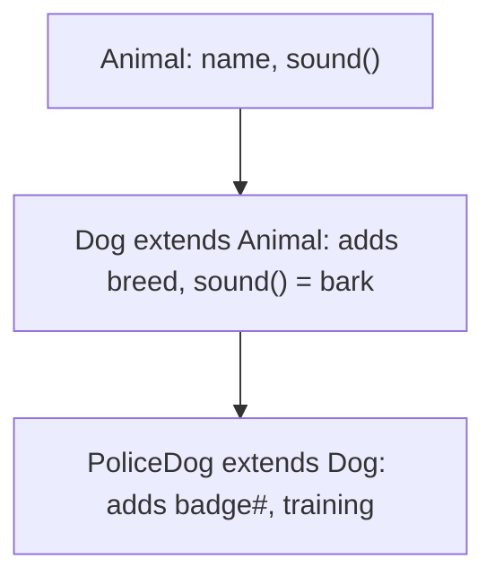

Three rules govern Java inheritance:

1. **Single inheritance of state + behavior.** A class has at most **one** superclass. (You get **multiple inheritance of behavior** via interfaces — T08 — but never of fields.)
2. **Every class transitively extends `Object`.** The chain terminates at `java.lang.Object`. `Object` has no superclass.
3. **`private` members are not inherited.** They exist in the parent's object layout but are invisible to the subclass — no access, no override.

## The `extends` Keyword

A class declares its superclass with `extends`:

```java
public class Animal {
    String name;
    void sound() { System.out.println("(generic sound)"); }
}

public class Dog extends Animal {
    String breed;
    @Override
    void sound() { System.out.println("Bark"); }
}
```

`Dog` inherits `Animal.name` and `Animal.sound`, then adds `breed` and overrides `sound`. A `Dog` instance has both `name` and `breed` fields; `dog.sound()` runs the `Dog` version (dynamic dispatch — full coverage in [T05](./T05-method-overriding.md) / [T06](./T06-polymorphism-compile-time-vs-runtime.md)). The `@Override` annotation isn't required but is recommended — javac uses it to catch typos that would otherwise create a new, unrelated method (a `sond()` typo silently fails to override and never runs).

A class with no explicit `extends` clause **implicitly extends `Object`**:

```java
public class Foo { }
// is equivalent to:
// public class Foo extends Object { }
```

`Object` is the only class with no superclass; `Object.class.getSuperclass()` returns `null`.

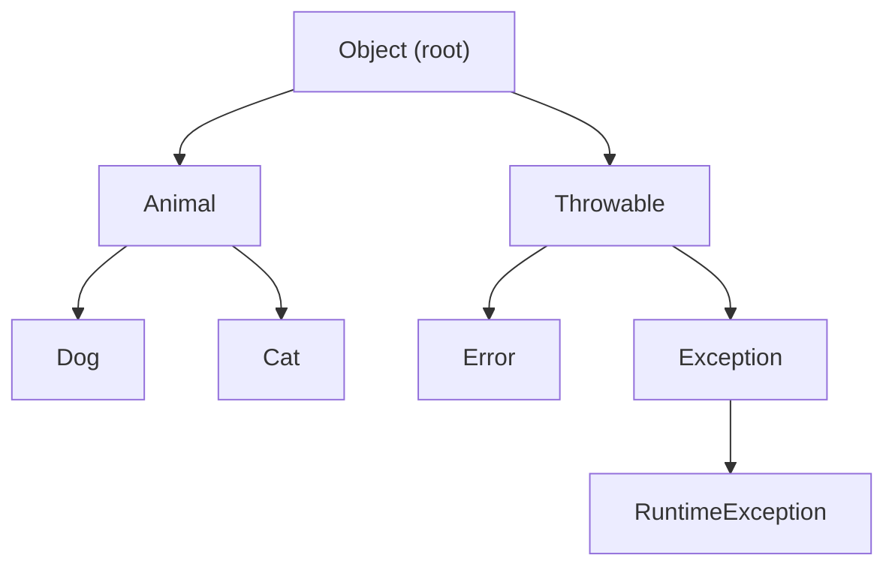

### Restrictions

- **Cannot extend `final` classes.** `String`, `Integer`, every record, every enum is `final`. The JIT-friendly closed-for-extension declaration ([T03](./T03-encapsulation-and-access-modifiers.md)).
- **Cannot extend primitive types or arrays.** Primitives aren't classes; arrays *are* classes, but their inheritance is hardwired (`int[]` extends `Object`, no other).
- **Cannot have a class extend itself, even transitively.** `class A extends A` or any cycle is a compile error.
- **Cannot extend more than one class.** Single inheritance. Use interfaces for multiple inheritance of behavior ([T08](./T08-interfaces-default-static-private-methods.md)).
- **Sealed classes** ([T15](./T15-sealed-classes-and-interfaces.md)) restrict *which* classes may extend.

## The IS-A Relationship

Inheritance establishes an **IS-A** relationship: `Dog IS-A Animal`. The practical consequence is **substitutability**: every place that accepts an `Animal` reference can also accept a `Dog`.

```java
Animal a = new Dog();    // legal — upcast (free, no runtime check, T01 callback)
a.sound();               // calls Dog.sound — dynamic dispatch
String n = a.name;       // reads name — inherited Animal field
// a.breed   ← compile error: Animal has no `breed`
```

The compile-time type of `a` constrains what you can *access* (only `Animal`'s members); the runtime type of the object determines which override runs (`Dog.sound`). Full coverage of dispatch in [T05/T06](./T05-method-overriding.md).

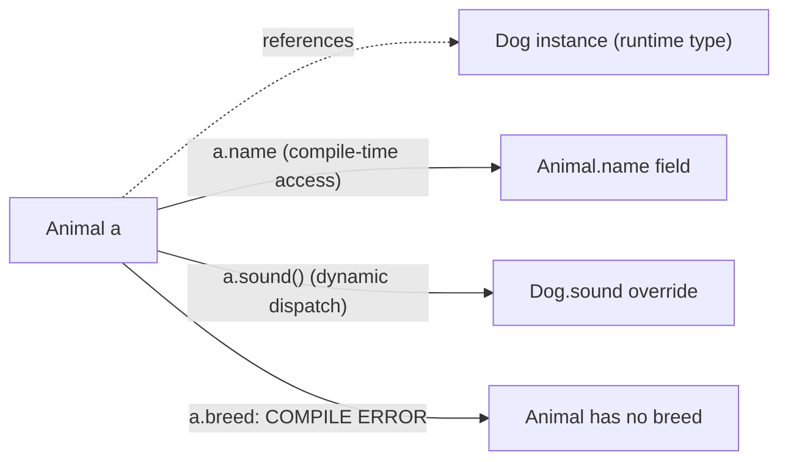

This is the foundation of **polymorphism**: a single line of code working differently depending on the runtime type. It also obligates the subclass to honor the parent's behavioral contract — the **Liskov Substitution Principle** ([T06](./T06-polymorphism-compile-time-vs-runtime.md)): *anywhere the parent can be used, the subclass should work too*. Subclasses that violate this (a `Square extends Rectangle` whose `setWidth` also changes height) usually need to be rethought as siblings, not parent/child.

> [!INTERVIEW]
> "Why does Java only have single (class) inheritance?" Two reasons: (1) avoiding the **diamond problem** — in C++ multiple inheritance, if two parents share a grandparent, the grandparent's state is duplicated or ambiguous; Java sidesteps this entirely. (2) Single inheritance keeps the **vtable layout simple and append-only**, which is the foundation of fast `invokevirtual` dispatch. Multiple inheritance of behavior (without state) is available via interfaces with default methods, with explicit conflict rules ([T08](./T08-interfaces-default-static-private-methods.md)).

## The `super` Keyword

`super` is the language's mechanism for reaching into the immediate parent class. It has **three** uses, each constructed differently in bytecode.

### 1. `super(...)` — Parent Constructor Delegation

As covered in [T02](./T02-fields-methods-constructors-this.md): `super(args)` as the **first statement** of a constructor invokes a parent constructor. If you don't write `super(...)` or `this(...)`, javac inserts a silent `super()` (the no-arg parent constructor) for you.

```java
class Animal {
    String name;
    Animal(String name) { this.name = name; }
}

class Dog extends Animal {
    String breed;
    Dog(String name, String breed) {
        super(name);              // explicit — picks the (String) constructor
        this.breed = breed;
    }
}
```

`super(name)` runs `Animal(String)`, initializing `this.name` before `Dog`'s constructor body proceeds. If `Animal` had no `(String)` constructor and no accessible no-arg constructor, the call would fail to compile.

### 2. `super.method(...)` — Calling the Parent's Method

When a subclass overrides a method, the override completely replaces the parent's version in the subclass's vtable. To *also* run the parent's logic from inside the override — for example, "do everything the parent did, then add something" — use `super.method(args)`.

```java
class Animal {
    String describe() { return "Animal named " + name; }
}

class Dog extends Animal {
    @Override
    String describe() {
        return super.describe() + ", a " + breed;
    }
}
```

`super.describe()` calls `Animal.describe()` non-virtually — it does **not** dispatch to a subclass's version even if there is one. This is what `invokespecial` is for (next memory section).

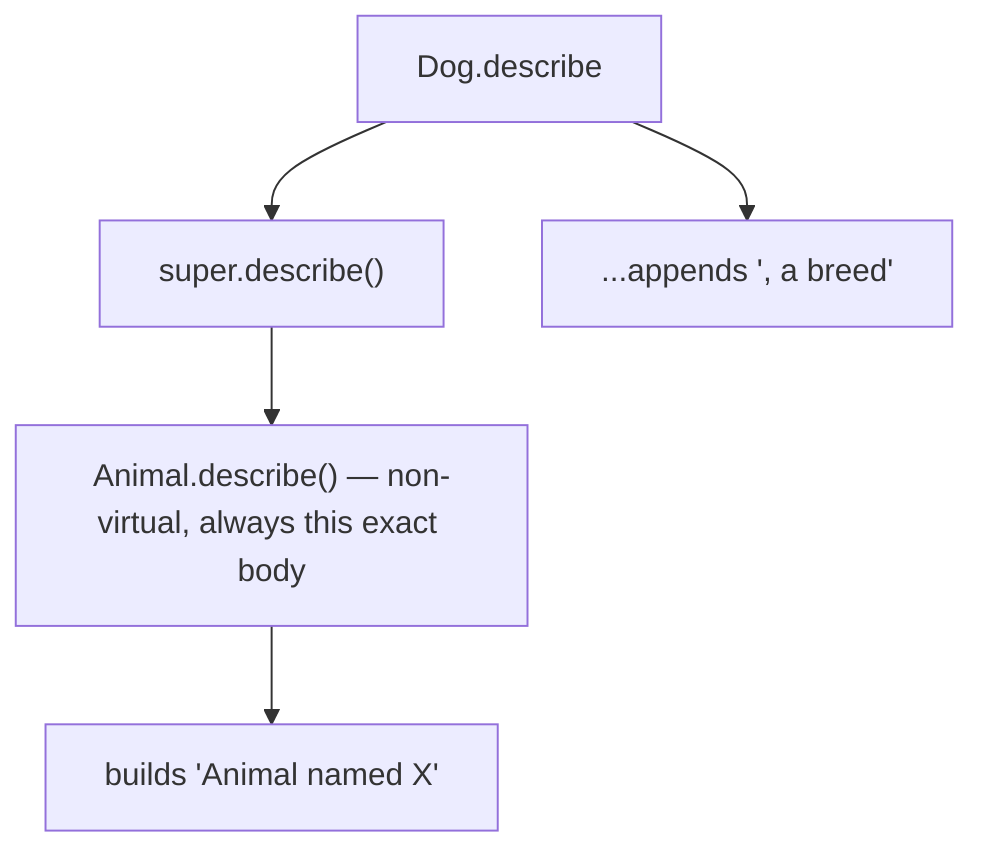

This is the classic "extend, don't replace" pattern. Constructors of subclasses do the same with `super(...)`; method-level extension uses `super.method(...)`.

### 3. `super.field` — Reading the Parent's Shadowed Field

If a subclass declares a field with the same name as a parent field, the subclass field **shadows** the parent's. Inside the subclass, `this.x` reaches the subclass's `x`; `super.x` reaches the parent's `x`. This is rare in well-designed code (field shadowing is almost always accidental) but is legal.

```java
class Parent {
    int x = 10;
}

class Child extends Parent {
    int x = 99;           // shadows Parent.x — both fields exist on every Child instance
    void show() {
        System.out.println(this.x);    // 99
        System.out.println(super.x);   // 10
    }
}
```

**Crucially**: field access is **statically dispatched** — there is no dynamic field lookup. The choice of which `x` to read is made at compile time based on the **reference's declared type**. This is unlike method overriding, where the runtime object's type picks the method.

```java
Child c = new Child();
Parent p = c;             // upcast — same object, different declared type
System.out.println(c.x);  // 99 — declared Child, reads Child.x
System.out.println(p.x);  // 10 — declared Parent, reads Parent.x
                          //      (same object! different field by declared type)
```

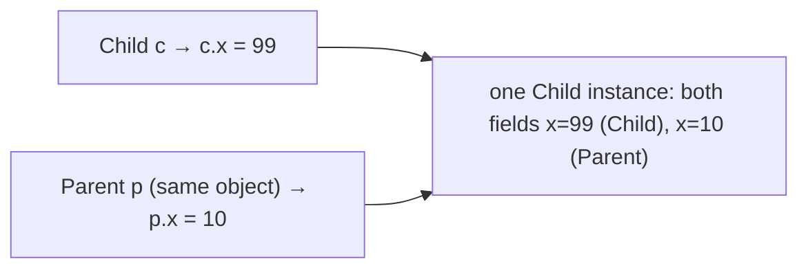

> [!WARNING]
> Field shadowing is a serious source of subtle bugs. Two cures: (1) don't shadow — give the subclass field a different name, or use the parent's field directly; (2) use methods instead of public fields, since methods are dynamically dispatched. The `@Override` annotation does **not** flag shadowed fields — there's no language-level "intentional shadow" marker.

## What's Inherited, What's Not

Not every member crosses the inheritance boundary the same way.

| Member | Inherited? |
|--------|------------|
| `public` field | Yes — accessible to subclass via `this.field` |
| `protected` field | Yes — accessible to subclass (T03 rules apply) |
| package-private field | Yes only if subclass is in same package |
| `private` field | **No** — physically present in the object layout, invisible to subclass |
| `public`/`protected`/package-private (same-pkg) instance method | Yes — and may be overridden |
| `private` instance method | **No** — invisible; same name in subclass is shadowing, not overriding |
| `static` method | Yes (accessible by name) — but **shadowed**, not overridden ("hiding") |
| `static` field | Yes (accessible by name) — but shadowed, not overridden |
| `final` method | Yes — but cannot be overridden |
| Constructor | **No** — constructors are never inherited; each class declares its own |
| `<clinit>` | **No** — class initialization runs once per class |

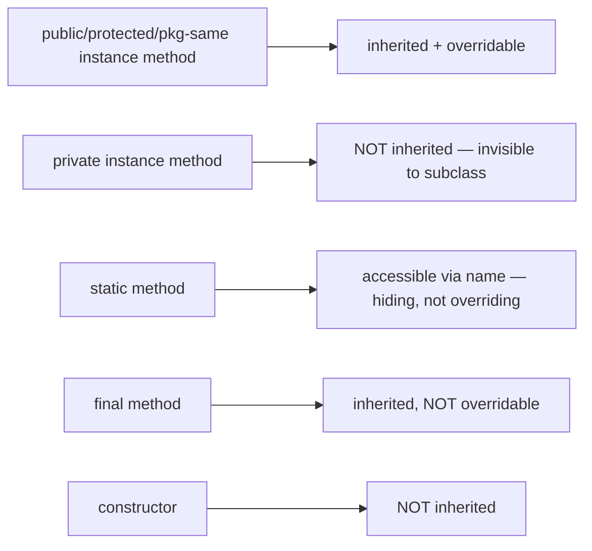

The **constructor non-inheritance rule** is what makes `Dog(String name, String breed)` *not* automatically exist just because `Animal(String name)` exists — each class must declare its own constructors, and chain through `super(...)`. This is consistent with the "the constructor establishes invariants of this class, which the parent doesn't know about" view.

The **private method non-inheritance rule** means a subclass declaring `private void hi()` does NOT override the parent's `private void hi()` — both methods exist, distinguishable to the JVM by the class qualifier on the bytecode `Methodref`. They simply cannot see each other.

## Memory Layer — Subclass Object Layout

Recall the universal object shape ([T01](./T01-classes-and-objects.md)): `[header 12 B][fields][padding]`. With inheritance, the **fields** region is laid out parent-first, subclass-last — an **append-only** rule.

```java
class Animal {
    int age;          // 4 bytes
    String name;      // 4 bytes (compressed ref)
}
class Dog extends Animal {
    boolean trained; // 1 byte
    String breed;     // 4 bytes
}
```

Allocation for a `Dog`:

```
byte offset:  0...11    12..15  16..19    20..23  24..28
              +-------+ +-----+ +------+  +-----+ +-------+
              | header| | age | | name |  |breed| |trained|
              +-------+ +-----+ +------+  +-----+ +-------+
              (12)      (Animal fields)   (Dog fields)
total = 32 bytes (28 + 4 pad to 8-align)
```

**Critical property**: `age` is at offset 12 in both `Animal` and `Dog` instances. The same offset, the same `getfield age:I` opcode (with the same constant-pool reference), reads the same data regardless of whether the runtime object is `Animal` or `Dog`. This is what makes **`Animal a = new Dog(); a.age` work without checking the runtime type**.

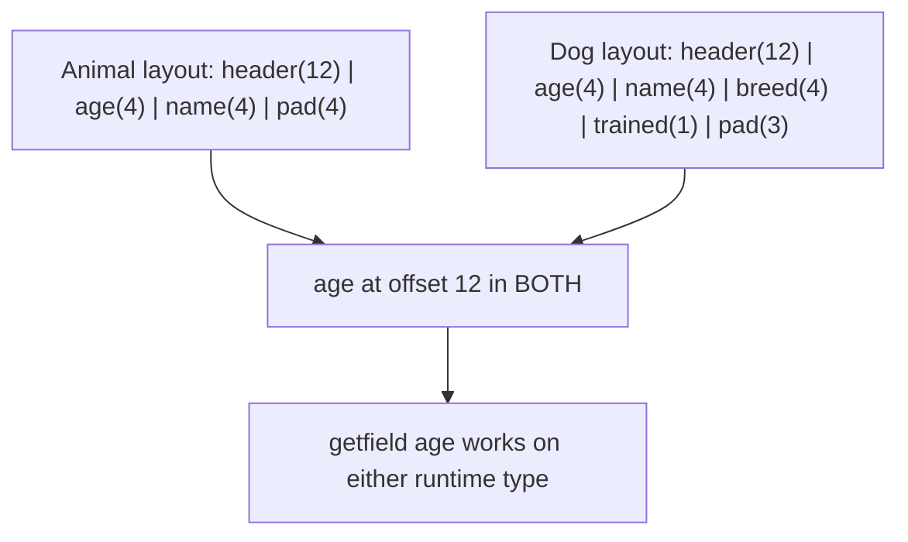

This is also why a `Dog` reference can be safely passed where an `Animal` is expected — every byte of `Animal`'s field layout is present at the same offset in the `Dog` layout, plus some extras.

### Reordering within a Class, Append between Classes

The allocator's reorder-by-descending-size rule ([T01](./T01-classes-and-objects.md)) applies **within** each class layer, **not across** layers. Parent fields are laid out together first (reordered among themselves), then subclass fields are laid out together (reordered among themselves), appended after.

```java
class P {
    boolean b;       // 1B
    long c;          // 8B
}
class S extends P {
    byte d;          // 1B
    long e;          // 8B
}
```

Layout of an `S`:

```
[header 12 B] [c 8 B] [b 1 B] [pad 3 B]  | [e 8 B] [d 1 B] [pad 7 B]
              ↑ Parent fields reordered: long first, bool last + padding
              ↑                                           ↑ Subclass fields reordered, also long-first
```

The parent's section is internally complete and padded to alignment before the subclass section begins. Tools like JOL show this directly.

## Memory Layer — The vtable

A **vtable** is a per-class array of method-implementation pointers. Each instance method occupies a fixed **slot**. The vtable's shape mirrors the layout rule:

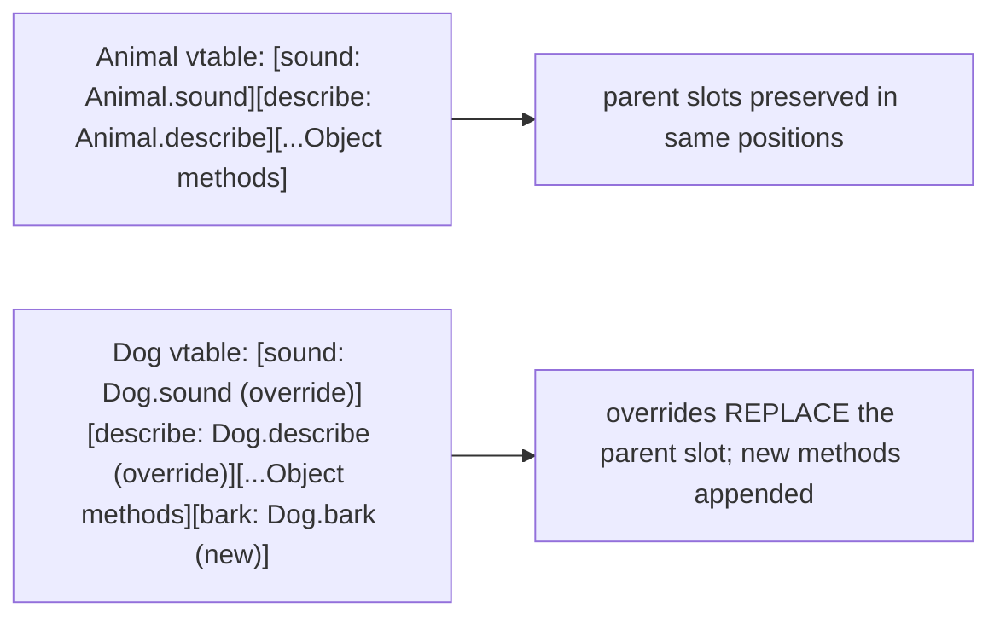

When `Dog` overrides `Animal.sound`, the JVM **replaces the slot's pointer** with the address of `Dog.sound` in the `Dog` vtable. The slot **index** doesn't change — it's the parent's index. New methods unique to `Dog` (like `Dog.bark`) get **new appended slots**.

The dispatch for `a.sound()` on an `Animal a` referencing a `Dog`:

1. Read object's klass pointer (header offset 8 on 64-bit compressed).
2. Index into klass's vtable at the precomputed slot for `sound`.
3. Indirect call to whatever method that slot points to.

That's the **mechanism of dynamic dispatch**. Because the slot index is the *parent's* slot (since the caller compiled against `Animal`), and because the subclass's vtable has the same slot index, the override is reached.

### vtable in Physical Memory — Byte-Level Layout

A vtable is an array of method-pointers stored **at a fixed offset inside the Klass struct in Metaspace**. Each slot is **8 bytes** on 64-bit HotSpot (a raw native pointer; not compressed because Metaspace is small enough to address with 32 bits but the JVM uses 64-bit pointers for simplicity in metadata structures).

For an `Animal` Klass with these methods (Object's 5 inherited + Animal's 2):

```
Klass(Animal) memory layout — relevant portion:
  ...
  +160:  vtable_length = 7
  +168:  vtable[0]  = ptr_to_Animal.equals       ; 8 bytes
  +176:  vtable[1]  = ptr_to_Animal.hashCode     ; 8 bytes (Object's, inherited)
  +184:  vtable[2]  = ptr_to_Animal.toString
  +192:  vtable[3]  = ptr_to_Animal.getClass
  +200:  vtable[4]  = ptr_to_Animal.clone
  +208:  vtable[5]  = ptr_to_Animal.sound
  +216:  vtable[6]  = ptr_to_Animal.describe
  ...
```

Total vtable size for Animal: **7 × 8 = 56 bytes**. Plus the per-Klass overhead (~150 bytes for the rest of the Klass struct) = ~200 bytes of Metaspace per loaded class with this method count.

For `Dog extends Animal` overriding `sound`:

```
Klass(Dog) memory layout — relevant portion:
  +168:  vtable[0]  = ptr_to_Animal.equals       ; inherited (same pointer!)
  +176:  vtable[1]  = ptr_to_Animal.hashCode
  +184:  vtable[2]  = ptr_to_Animal.toString
  +192:  vtable[3]  = ptr_to_Animal.getClass
  +200:  vtable[4]  = ptr_to_Animal.clone
  +208:  vtable[5]  = ptr_to_DOG.sound           ← replaced pointer
  +216:  vtable[6]  = ptr_to_Animal.describe     ; not overridden
  +224:  vtable[7]  = ptr_to_DOG.bark            ; new — appended slot
```

Total: **8 × 8 = 64 bytes**. The slot indexes 0–6 match Animal's; index 7 is Dog's addition. This is the **append-only rule** in physical bytes.

**Memory cost per class loaded:** ~200 B Klass + ~8 B per virtual method. A Spring application with 10,000 loaded classes averaging 20 virtuals each = ~36 MB of vtable bytes in Metaspace. Not huge; not negligible.

### invokevirtual — Cycle-by-Cycle CPU Execution

Take a call `animal.sound()` where `animal` is in register `rdi` (System V ABI) and `sound`'s vtable slot is index 5 (offset 208 from Klass base):

```
; Step 1: Load klass pointer from object header (offset 8, compressed = 4 bytes)
mov   r10d, [rdi + 8]       ; r10d = compressed klass ptr (4 bytes)
shl   r10, 3                ; decompress: multiply by 8 (or fixed shift)
; r10 now holds the full 64-bit Klass address.

; Step 2: Load the vtable slot for sound (slot 5 = offset 208 within Klass)
mov   r11, [r10 + 208]      ; r11 = method address

; Step 3: Indirect call
call  r11                   ; jump to method; CPU pushes return PC
```

**Cycle breakdown on a modern Intel/AMD CPU:**

| Step | Cycles | Reason |
|------|-------:|--------|
| Load klass ptr (header) | ~4 | L1 hit (object's header line warm) |
| Decompress (shl) | 1 | ALU |
| Load vtable slot | ~4 | L1 hit (Klass's vtable line) — first access ~12 cycles (L2) |
| Indirect call (BTB hit) | ~2 | branch target predicted |
| Indirect call (BTB miss) | ~10–20 | mispredicted |
| **Total (hot, BTB hit)** | **~11** | ~3 ns |
| **Total (cold, BTB miss)** | **~30+** | ~9 ns |

The 11-cycle hot dispatch is **~3× slower than a direct call** (1 cycle for the `call` + ~2 for the prefetch). At megamorphic call sites the BTB cannot predict and you pay the mispredict cost every time — ~10 ns per call. At monomorphic sites the inline cache + BTB hit makes the dispatch effectively as cheap as a direct call.

**Why JIT inlining matters so much:** an inlined virtual method eliminates all three of these steps. The body is in the caller's instruction stream; no klass load, no vtable indirection, no indirect call. This is why `private`/`final`/CHA-monomorphic methods consistently outperform `public` methods even when the user-observable behavior is identical.

### `invokevirtual` vs `invokespecial`

Java's `invoke*` opcodes choose dispatch mode:

| Opcode | Used for | Dispatch |
|--------|----------|----------|
| `invokevirtual` | normal instance methods | dynamic (vtable lookup) |
| `invokespecial` | constructors, `super.method()`, `private` methods | static (compile-time bound) |
| `invokestatic` | `static` methods | static |
| `invokeinterface` | interface methods | dynamic (itable lookup) |
| `invokedynamic` | lambdas, `String` concat, pattern-switch | call-site cached |

`super.method()` compiles to `invokespecial` — the JVM dispatches **non-virtually** to the parent's method body. If we used `invokevirtual` here, we'd loop back to the subclass's override and infinite-recurse.

```java
class Animal { String describe() { return "Animal"; } }
class Dog extends Animal {
    @Override String describe() {
        return super.describe() + "+Dog";   // invokespecial — calls Animal.describe directly
    }
}
```

`javap -c`:

```
String describe();
  Code:
     0: aload_0
     1: invokespecial #2  // Method Animal.describe:()Ljava/lang/String;     ← non-virtual super
     4: ...
```

Versus the same method called as `this.describe()` from outside (which we wouldn't typically write inside an override — but as illustration):

```
invokevirtual #5  // Method Dog.describe:()Ljava/lang/String;
```

`invokevirtual` looks up the vtable; `invokespecial` jumps directly to the exact method baked into the Methodref. The semantic difference is exactly the dynamic-vs-static dispatch line.

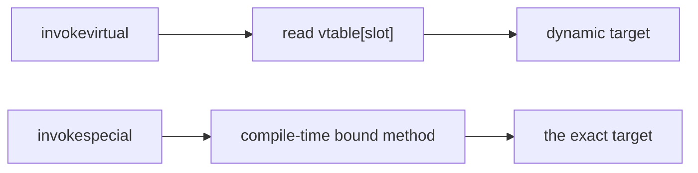

### Constructor Chain Bytecode Walkthrough

The constructor chain we previewed in T02 looks like this for a 3-level hierarchy:

```java
class A { A() { System.out.println("A"); } }
class B extends A { B() { System.out.println("B"); } }
class C extends B { C() { System.out.println("C"); } }
```

`javap -c C`:

```
public C();
  Code:
     0: aload_0
     1: invokespecial #1  // Method B."<init>":()V       ← runs B's constructor
     4: getstatic     #7  // Field System.out
     7: ldc           #13 // String "C"
     9: invokevirtual #15 // Method PrintStream.println
    12: return
```

And `B()`:

```
public B();
  Code:
     0: aload_0
     1: invokespecial #1  // Method A."<init>":()V       ← runs A's constructor
     4: getstatic     #7
     7: ldc           #13 // String "B"
     9: invokevirtual #15
    12: return
```

And `A()`:

```
public A();
  Code:
     0: aload_0
     1: invokespecial #1  // Method Object."<init>":()V  ← runs Object's constructor
     4: ...
```

The chain is **explicit in bytecode**: each constructor starts with `aload_0 + invokespecial Parent.<init>`. Running `new C()` produces output `A`, `B`, `C` — confirming the chain runs **deepest first**.

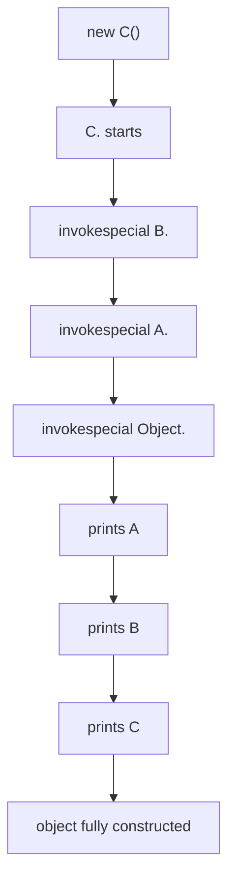

### The Klass Pointer Chain

In Metaspace, each `Klass` struct has a `super` pointer. The chain terminates at `Object`'s klass struct, whose `super` is `null`.

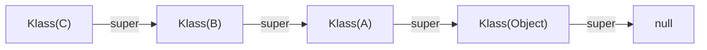

Reflection walks this chain for `Class.getSuperclass()`, `instanceof` checks (with caching), and exception-handler matching. The chain length is small (most class hierarchies are 3–6 deep); the cost is microseconds at worst.

## Architecture Layer — JIT Inlining Through Inheritance

The JIT's effectiveness on polymorphic call sites depends on what it observes at runtime.

### Call-Site Classification

When the JIT compiles a hot method that calls `a.sound()` on an `Animal`:

- **Monomorphic** — exactly one observed target type (e.g., always a `Dog`). The JIT inlines the `Dog.sound` body directly and installs a **type guard** (`if (a.getClass() != Dog.class) deopt;`). At steady state, `a.sound()` is as fast as a direct call.
- **Bimorphic** — two observed targets (e.g., sometimes `Dog`, sometimes `Cat`). The JIT inlines **both** bodies behind a type test (`if (a.getClass() == Dog.class) Dog.sound(); else if (Cat.class) Cat.sound(); else vtable;`). Still very fast.
- **Polymorphic / megamorphic** — three or more targets. The JIT gives up on inlining and emits a vtable lookup; cost is ~1–3 cycles for the indirect call + BTB hit/miss.

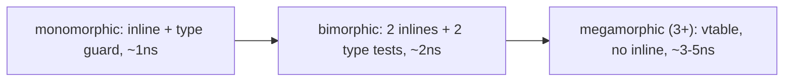

This is the architectural reason **shallow class hierarchies with few siblings outperform deep wide-tree designs in hot code**. Modern JVMs are aggressive: a call site with 1 or 2 targets routinely runs at C-speed; 3+ targets pay a real but small cost.

### Class Hierarchy Analysis + Deoptimization

For a non-`final` method on a class with no subclasses currently loaded, the JIT can inline as if the method were `final`. This is **Class Hierarchy Analysis (CHA)**. The catch: a subclass might load later and override the method, breaking the assumption. The JIT installs a **deopt guard** — a check that triggers if the world changes, recompiling the affected method.

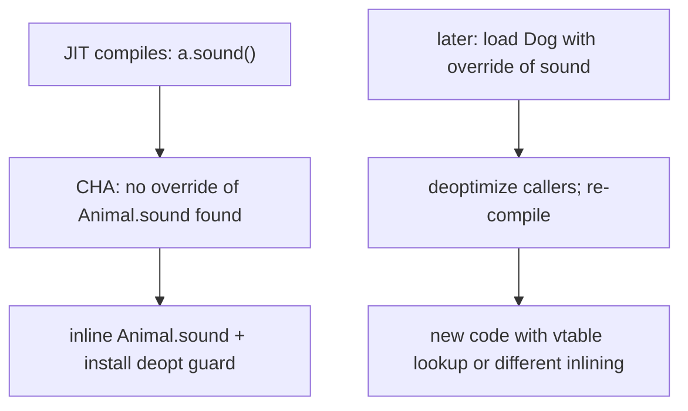

Observable with `-XX:+PrintInlining` and `-XX:+UnlockDiagnosticVMOptions -XX:+TraceDeoptimization`. In practice, this means the JIT is **optimistic** — it inlines aggressively under reasonable assumptions and bails out only when violated. Long-running applications converge on optimal code for their actual class graph.

### Deep Hierarchy and the Constructor Chain

A class 10 levels deep means `new` triggers 10 `<init>` calls (one per level). Each is a real `invokespecial` until inlined. The JIT inlines through the chain aggressively because all the calls are static (`invokespecial`) and the constructor bodies are typically tiny. After warm-up, the entire chain often collapses to "allocate + initialize a few fields + return."

The memory cost compounds the runtime cost: a 10-level hierarchy where each level adds 16 bytes of fields means a 160+ byte instance. The header is fixed (12 B) but the field area can be huge. JDK examples: `JFrame` has ~150 fields inherited from 6 ancestor classes; constructing one allocates several hundred bytes.

> [!INTERVIEW]
> "What's the cost of deep inheritance?" Three costs: (1) **memory** — every parent's fields add to instance size; (2) **construction time** — the `<init>` chain runs all the way up, though JIT inlines aggressively; (3) **dispatch and inlining** — wide-tree hierarchies with many overrides push call sites toward megamorphism, degrading JIT effectiveness. Modern best practice: prefer **composition** over inheritance for new code; reserve inheritance for true IS-A specialisation.

## When Static Members Get Hidden, Not Overridden

`static` methods and `static` fields participate in inheritance only as **names** — the subclass can refer to them by simple name as if they were its own. But **redeclaring** a `static` method or field with the same signature in a subclass is **hiding**, not overriding: the choice of which one runs is made at **compile time** based on the **reference's static type**, not the runtime object's type.

```java
class P {
    static String label() { return "P"; }
}
class C extends P {
    static String label() { return "C"; }   // HIDES P.label, not overrides
}

P p = new C();
System.out.println(p.label());   // "P" — static dispatch
System.out.println(C.label());   // "C"
```

Annotating `@Override` on a static method is a compile error — there is no override to declare.

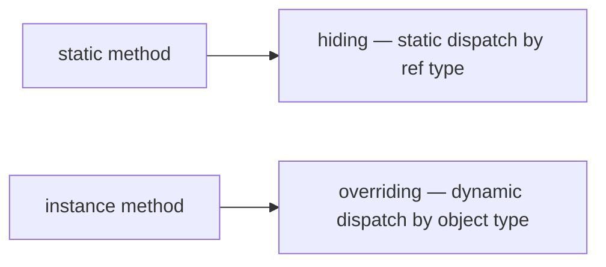

The same hiding applies to `static` fields. The `super.field` and shadowing rules from § Field Shadowing apply only for static fields when the subclass declares one with the same name.

> [!WARNING]
> Calling a `static` method through an instance reference (`p.label()` rather than `P.label()`) is legal but confusing — most IDEs warn. The dispatch is the same (`P.label()`), but the code reads as if it were dynamic.

## What Inheritance Is *For* (and What Composition Is Better For)

Inheritance is the right tool when the relationship is genuinely **IS-A** and the subclass is **substitutable** for the parent everywhere. Counter-examples that violate this:

- `Stack extends Vector` (in the JDK) — `Stack` should not let `add(int index, ...)` insert at arbitrary positions, but `Vector` exposes it. The JDK shipped this and now warns against using `Stack`; the modern alternative is `Deque`.
- `Properties extends Hashtable<Object, Object>` — `Properties` is meant to be `Map<String, String>` but inherits methods that bypass the string constraint.
- `Square extends Rectangle` — setting width and height independently makes sense for `Rectangle` but breaks `Square`'s invariant.

In these cases, **composition** — holding the type as a field — is the right design:

```java
public final class Stack<T> {
    private final ArrayList<T> backing = new ArrayList<>();
    public void push(T x) { backing.add(x); }
    public T pop() { return backing.remove(backing.size() - 1); }
    public T peek() { return backing.get(backing.size() - 1); }
}
```

No inheritance; `Stack` exposes only what it wants to. The `ArrayList` is an implementation detail. This is the **delegation pattern** (full discussion in L3/C03).

Effective Java's slogan: *"Favor composition over inheritance."* Use inheritance for IS-A; use composition for HAS-A.

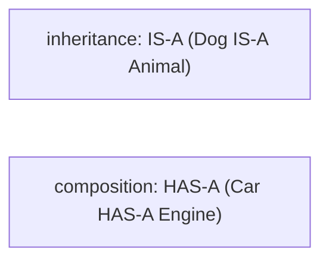

## Deeper JVM Internals — Subtype Checks, vtable Construction, and Subclass Linking

The `Klass` introduction in [T01](./T01-classes-and-objects.md) gave names to the fields; this section walks the **algorithms** that build them when a class loads, and the **subtype-check mechanism** that makes `instanceof`, `checkcast`, and dispatch all run in O(1) for typical hierarchies.

### The Subclass Linking Algorithm

When `class Sub extends Super` is loaded, the JVM does:

1. **Recursively ensure `Super` is loaded.** If not, load it (parent classloader delegation). Parent's vtable + itable + field offsets must exist before Sub can be linked.
2. **Allocate Sub's `Klass` struct in Metaspace.** Copy `Super`'s vtable as the starting point.
3. **Walk Sub's declared instance methods.** For each:
   - If the method **overrides** a Super method (same name + descriptor + access rules): replace Super's slot pointer with Sub's method.
   - Otherwise: **append** the method as a new vtable slot at the next index.
4. **Resolve Sub's instance field offsets.** Reorder fields by descending size *within Sub's layer*; assign offsets starting at the end of Super's field area.
5. **Set `Sub._super = Super.Klass`.** Link the chain.
6. **Update `Super._subklass`/`Super._next_sibling`** — the linked-list of direct subclasses, used by CHA.
7. **Build Sub's `_primary_supers[]` display.** Copy parent's, then append Sub at index = depth(Sub).
8. **Build Sub's `_secondary_supers`** — all interfaces Sub implements + their parents + Sub's super chain past the display depth.

This linking is **lazy** — happens at first active use, not at JVM startup. Two consequences: applications with hundreds of classes pay no startup cost for classes never used; class-loader-isolated frameworks (Tomcat, OSGi) can load class versions side-by-side because each loader has its own Klass instances.

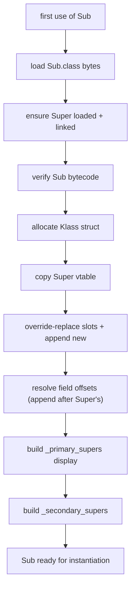

### Subtype Checks Via the Display

The **`_primary_supers[8]` array** in every Klass is a **fixed-depth display** for O(1) subtype checks. Each entry holds an ancestor Klass pointer at that depth:

```
class Object       depth 0    _primary_supers = [Object, _, _, _, _, _, _, _]
class A → Object   depth 1    _primary_supers = [Object, A, _, _, _, _, _, _]
class B → A        depth 2    _primary_supers = [Object, A, B, _, _, _, _, _]
class C → B        depth 3    _primary_supers = [Object, A, B, C, _, _, _, _]
```

To test `c instanceof A`:
1. Read `c.klass._primary_supers[1]` (1 = depth of A).
2. Compare to `A.klass`. Equal → true; else fall through to secondary check.

This is **two memory loads + one compare** — ~2–3 cycles. Independent of how deep the hierarchy is, as long as the target depth is ≤ 7.

For deeper hierarchies (depth > 7) or interface checks, the JVM falls through to `_secondary_supers` — a linear array of ancestors past depth 7 + all implemented interfaces. The check walks this array:

```
secondary_check(c, target):
  for k in c._secondary_supers:
    if k == target: return true
  return false
```

There's a one-entry cache (`_secondary_super_cache`) hit on the last successful check — speeding common-case repeated checks.

`-XX:+UnlockDiagnosticVMOptions -XX:+VerifyClassesPrimaryOpts` reveals the layout. Hot subtype-check sites (e.g., `Stream<T>` element checks) hit the display and never the slow path. Cold or interface checks may hit secondary; the JIT specializes the call site based on profile.

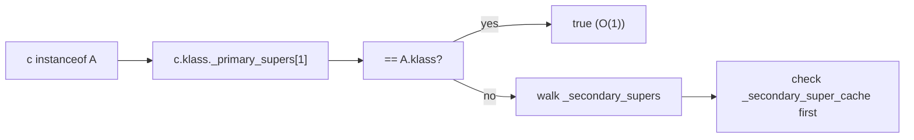

### vtable Construction with Overriding — The Index Stability Rule

When Super has methods `m1, m2, m3` at slot indexes 0, 1, 2, and Sub overrides `m2` and adds `m4`:

- Sub's vtable starts as [Super.m1, Super.m2, Super.m3].
- Overriding `m2` replaces slot 1's pointer with `Sub.m2`: [Super.m1, Sub.m2, Super.m3].
- Adding `m4` appends to slot 3: [Super.m1, Sub.m2, Super.m3, Sub.m4].

The crucial property: **slot indexes are stable across the hierarchy**. `m2`'s slot is 1 in *every* class — `Super`, `Sub`, `Sub`'s grandchildren. This means `invokevirtual m2` at any call site uses slot index 1, regardless of the receiver's runtime type — and the dispatch always reaches the receiver's class's slot 1 pointer.

The JIT **resolves the slot index at link time** (the constant-pool `Methodref` is patched with the slot number). Subsequent dispatch is a `mov [klass + vtable_offset + slot*8], rax; call rax` sequence — ~3 cycles on a hot path with a BTB hit.

### Subclass Field Offsets — Append Without Reordering Across Layers

Super's field layout is **frozen** once Super is linked. When Sub is linked later, Sub's fields are appended after Super's. The allocator's reorder-by-size rule applies *within* Sub's layer, but Super's field offsets never shift.

```
Super { long sa; int sb; boolean sc; }   layout: [header 12][sa 8][sb 4][sc 1][pad 7] = 32

Sub extends Super { long sd; }            layout: [header 12][sa 8][sb 4][sc 1][pad 3][sd 8] = 36 → 40 (8-align)
                                          (Super fields end at offset 25; Sub's sd appended after Super pad)
```

The append-without-shifting rule is what makes **field access work across upcasting**: `Super sup = sub; sup.sa` reads from offset 12 — the same offset whether sup is `new Super()` or `new Sub()`. The JIT can compile `sup.sa` as a single load with no runtime type check.

### `super.method()` and Method Resolution

`super.method()` compiles to `invokespecial Super.method:(...)` — a **static** dispatch with the parent class's name explicit in the bytecode. The verifier checks:

1. The caller class extends (transitively) `Super`.
2. `Super.method` is accessible per access rules.

At link time, the JVM resolves `Super.method` to the exact method *in `Super`* — not in `Super`'s parent, and not in any subclass. If `Super` itself doesn't define `method` (inheriting from its own parent), the resolution walks up the chain to find it, then binds that exact method.

```
Object.toString defined here
   ↑
Parent extends Object — does not override toString
   ↑
Child extends Parent — overrides toString

In Child:
  super.toString()   →   invokespecial Parent.toString:()Ljava/lang/String;
                         resolves to Object.toString (walked up)
                         runs Object.toString body
```

The walked-up resolution can surprise: `super.toString()` doesn't necessarily run the *immediate* parent's body if that parent doesn't define it. The JVM finds the *closest enclosing definition*.

### CHA Implementation — Walking the Subklass Chain

[T05](./T05-method-overriding.md)'s Class Hierarchy Analysis depends on the **`_subklass` + `_next_sibling`** linked list. The JIT, when compiling a virtual call on method `m`, walks:

```
walk_subklasses(super_klass, method_name, descriptor):
  found = null
  for k in super_klass._subklass chain (via _next_sibling):
    if k overrides m: 
      if found != null: return MEGAMORPHIC
      found = k
    recursive_walk(k, m, descriptor)
  return found  // null = no override; one = monomorphic; many = megamorphic
```

If no subclass overrides `m`, the JIT inlines `Super.m` under the no-override assumption. The deopt guard checks `_subklass` doesn't grow — concretely, the JIT installs a callback on Super's Klass; when a new subclass overriding `m` loads, the callback fires deoptimization on all callers.

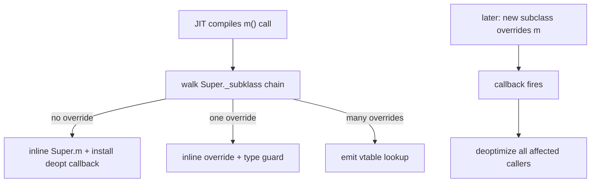

This whole machinery is what makes Java's polymorphism cost ~free in hot code with predictable type patterns. The cost of "an extra deopt every blue moon" is amortized to nothing.

### Deep Hierarchy Costs — Concrete Numbers

A 10-level hierarchy `O→A→B→C→D→E→F→G→H→I` where each level adds an 8-byte field:

- **Instance size**: 12 (header) + 10*8 (fields) + 4 (pad) = 96 bytes.
- **Vtable size**: ~5 (Object) + 10 = 15 slots × 8 bytes = 120 bytes per Klass.
- **`_primary_supers`** overflows at depth 7; depths 8–9 fall to `_secondary_supers`. Subtype checks for I-vs-H slow down to the secondary walk.
- **`<init>` chain**: 11 nested `invokespecial` calls (Object + 10 levels). The JIT collapses them into one inlined body up to `MaxInlineLevel=15`.
- **`instanceof I` for an arbitrary object**: depth 9 check falls to secondary supers walk → ~5–10 cycles slower than display-hit.

So deep hierarchies have a *measurable* but bounded cost. The JDK's class hierarchy is mostly ≤ 5 deep (`ArrayList → AbstractList → AbstractCollection → Object` is 3). Framework code that builds 8+ level hierarchies (some Spring + Hibernate ORM proxies) pays the cost.

### Class Initialization Locks — The `<clinit>` Mutex

When the JVM initializes a class (`<clinit>` running), it acquires a **per-Klass initialization lock**. Other threads attempting to use the class block on this lock until initialization completes. The lock prevents multiple threads from running `<clinit>` concurrently or from observing partially-initialized static state.

```
Thread A: first use of Foo → acquires Foo's init lock → runs <clinit> → releases lock
Thread B: arrives during <clinit> → blocks on init lock → resumes after release
Thread C: arrives after <clinit> → sees state.initialized = true → no lock acquired
```

This is the standard double-checked locking pattern *built into the JVM*. It's why the **lazy-init singleton via static field** is thread-safe without `synchronized` or `volatile`:

```java
public final class Logger {
    private static final Logger INSTANCE = new Logger();  // initialized in <clinit>; JVM guarantees safe publish
    private Logger() { ... }
    public static Logger get() { return INSTANCE; }
}
```

The first call to `Logger.get()` triggers `Logger` class initialization; the JVM's init lock serializes; subsequent reads of `INSTANCE` are lock-free and JMM-safe because the `<clinit>` completed before any reader could observe `INSTANCE != null`.

## Common Mistakes

> [!WARNING]
> **Forgetting `super(args)` when parent has no no-arg constructor.** [T02](./T02-fields-methods-constructors-this.md) callback: the implicit `super()` only works if the parent has an accessible no-arg constructor. Declaring any other constructor in the parent without an explicit no-arg removes the synthesized one — and breaks every subclass that relied on the implicit chain.

> [!WARNING]
> **Field shadowing instead of using the parent's field.** Almost always accidental; produces silent bugs because field access is statically dispatched. Rename, or expose via methods.

> [!WARNING]
> **`@Override` ineffective for fields.** `@Override` is a method-only annotation; the compiler does not flag shadowed fields. Discipline + tooling, not language.

> [!WARNING]
> **Calling overridable methods from a constructor.** [T02](./T02-fields-methods-constructors-this.md) callback: in `Base() { init(); }`, the subclass override of `init` runs with subclass fields still at zero. Use `final` or `private` methods only.

> [!WARNING]
> **Confusing static method hiding with overriding.** Hiding picks at compile time; overriding picks at runtime. `@Override` on a static method is a compile error.

> [!WARNING]
> **"Parent reference can access subclass-only members."** A `Parent p = new Child();` reference can call only `Parent`'s API. Subclass-only methods require an explicit downcast (`((Child) p).childOnly()` — `ClassCastException` if wrong type) or pattern-binding `instanceof`.

> [!WARNING]
> **Extending `final` classes.** Compile error. `String`, every record, every enum — none can be extended.

> [!WARNING]
> **"Multiple inheritance via interfaces means same as classes."** Interfaces provide **multiple inheritance of behavior** (default methods) but **never of state** — no fields. Conflict rules apply if two interfaces provide conflicting default methods (T08).

> [!WARNING]
> **Inheritance for code reuse alone.** If the relationship isn't IS-A and substitutable, prefer composition. `Stack extends Vector` and `Properties extends Hashtable` are JDK examples of getting this wrong; both are quasi-deprecated for new code.

> [!INTERVIEW]
> Common interview questions for this topic:
> 1. **Why is Java single-inheritance?** Diamond problem avoidance + simple vtable layout for fast `invokevirtual`. Multiple inheritance of behavior (no state) is via interfaces.
> 2. **What's the IS-A relationship?** Subclass is substitutable for the parent everywhere; the Liskov Substitution Principle formalizes the behavioral expectation.
> 3. **Which members are inherited?** All non-`private`, non-constructor members. `private` members are physically present in the object layout but invisible to subclass code.
> 4. **Are constructors inherited?** No. Each class declares its own; the constructor chain runs via `super(...)` (implicit or explicit) up to `Object.<init>`.
> 5. **What's the bytecode for `super.method()`?** `aload_0 + invokespecial Parent.method:(...)`. Non-virtual; cannot be overridden.
> 6. **What's the difference between method overriding and field shadowing?** Methods are dynamically dispatched (runtime object type picks); fields are statically dispatched (declared reference type picks).
> 7. **How is the subclass object laid out in memory?** Header → parent fields (reordered within parent's layer) → subclass fields (reordered within subclass's layer) → padding. Parent field offsets are preserved across the entire hierarchy.
> 8. **What's CHA and the deopt guard?** Class Hierarchy Analysis lets the JIT inline non-final methods under the assumption no override has loaded; installs a deopt guard that recompiles affected callers if a subclass later loads.
> 9. **What's monomorphic / bimorphic / megamorphic?** 1 / 2 / 3+ observed target types at a call site. Monomorphic and bimorphic inline; megamorphic falls back to vtable lookup.
> 10. **Why are static methods hidden, not overridden?** Static dispatch is by compile-time reference type, not runtime object type. There's nothing to "override" because static methods belong to the class, not the instance.
> 11. **What's the cost of a deep class hierarchy?** Memory (parent fields accumulate), construction time (constructor chain), and JIT effectiveness (wide trees push toward megamorphism). Prefer composition for new code.
> 12. **Can you extend `String`?** No — `String` is `final`. Most JDK value types and records/enums are `final` by design.
> 13. **What does `super.x` do when `x` is shadowed?** Reads the parent's field directly, bypassing the subclass's shadowing field. Rare; shadowing should usually be avoided.
> 14. **Why does Java's vtable layout enable safe upcasting?** Parent field offsets are preserved in subclass layout; parent vtable slots are preserved. A parent-typed reference can read parent fields and dispatch parent methods on any subclass instance without runtime type information.

## Practice

1. **3-level hierarchy + bytecode chain.** Declare `class A`, `class B extends A`, `class C extends B`, each with a constructor that prints. Run `new C()`. Verify "A B C" output. `javap -c B` and `javap -c C` showing the `invokespecial Parent.<init>` chain.

2. **Subclass field-offset append.** Declare a 2-level hierarchy with a few fields each. Use JOL (Java Object Layout) to dump the layout. Confirm parent fields come first, then subclass fields, with the reorder-by-size rule applied within each layer.

3. **Polymorphic field access via parent reference.** Construct a `Dog`, assign it to an `Animal` reference, read `name` and `age` via both references. Confirm same data, same offsets.

4. **`super.method()` bytecode inspection.** Override `toString` to return `super.toString() + " custom"`. `javap -c` and identify the `invokespecial Object.toString` line. Note it's `invokespecial`, not `invokevirtual`.

5. **Field shadowing demo.** Declare `class P { int x = 10; }` and `class C extends P { int x = 99; }`. Make references both ways (`C c = new C(); P p = c;`). Print `c.x` (99) and `p.x` (10). Explain static dispatch on fields.

6. **`@Override` typo catch.** Try to override a method but typo the name (`tosTring` instead of `toString`). Add `@Override`. Observe the compile error caught. Remove `@Override`; observe the method silently fails to override.

7. **Static method hiding.** Declare `static String label()` in both parent and child. Make a `Parent p = new Child();` reference and call `p.label()`. Observe parent's version runs (static dispatch).

8. **Extending `final` class.** Try to declare `class MyString extends String`. Observe the compile error.

9. **`final` class JIT inlining.** Mark a class `final` and benchmark a hot method on it. Observe via `-XX:+PrintInlining` that the JIT inlines aggressively (vs the non-final version where CHA-with-guard is used).

10. **CHA deopt experiment.** Write a hot loop calling a non-final method. Run for 10 seconds. Then dynamically load a subclass via `URLClassLoader` that overrides the method. Observe deoptimization in `-XX:+TraceDeoptimization` output.

11. **Megamorphic vs monomorphic benchmark.** Set up a hot loop calling `shape.area()` on a list of `Shape` references. (a) all `Circle` → monomorphic. (b) `Circle` + `Square` → bimorphic. (c) `Circle` + `Square` + `Triangle` + `Pentagon` → megamorphic. Measure throughput. Confirm (c) is ~2-5x slower.

12. **Klass super chain via reflection.** Walk `Class<?>.getSuperclass()` from `Integer.class` up to `null`. Confirm the chain: `Integer → Number → Object → null`.

13. **`Object` methods on a custom class.** Construct an instance of your custom class. Call `getClass()`, `toString()`, `hashCode()`, `equals(other)`. Verify default behaviors (identity-based equality, identity hash code).

14. **Composition vs inheritance.** Refactor a `Stack extends ArrayList` into a `Stack` with `private ArrayList backing`. Verify the `Stack` no longer exposes `add(int, T)` while keeping `push/pop/peek`. Discuss with a peer (or solo): why is the second design strictly better?

15. **No-no-arg-parent breaks subclass.** Declare `class Parent { Parent(int x) {} }` (no no-arg). Declare `class Child extends Parent { }`. Observe compile error. Fix two ways: (a) add `super(0)` in `Child()`; (b) add a no-arg constructor to `Parent`.

16. **Vtable layout verification.** Using HotSpot's serviceability agent or `jol-cli vmdetails`, dump the vtable of a parent and a subclass. Confirm parent's slot indexes are preserved in subclass's vtable; the override replaces the slot's pointer.

17. **End-to-end explain-it-back.** Take `class Animal { void sound() { System.out.println("animal"); } } class Dog extends Animal { @Override void sound() { System.out.println("bark"); } } Animal a = new Dog(); a.sound();`. Trace through: (a) javac → bytecode for class & method declarations; (b) at allocation, klass pointer set to Dog's klass; (c) `a.sound()` compiles to `invokevirtual Animal.sound:()V`; (d) at runtime, JVM follows klass pointer → Dog vtable → vtable[sound slot] = Dog.sound; (e) Dog.sound body runs, prints "bark"; (f) JIT after warm-up classifies the call site, inlines Dog.sound under monomorphic assumption with deopt guard. Twelve sentences max.

## Recap

You should now be able to:

**Language layer.**

- Declare a class extending another with `extends`; understand the implicit `extends Object` for classes without an explicit superclass.
- Recognize the IS-A relationship and the substitutability obligation (Liskov preview).
- Apply the three rules of Java inheritance (single inheritance, Object root, private not inherited).
- Use `super(...)` for parent constructor delegation; `super.method(...)` for parent-method invocation from an override; `super.field` for shadowed-field access.
- Distinguish method overriding (dynamic dispatch) from field shadowing (static dispatch) and from static method hiding.
- Understand what's inherited vs what's not — by member kind and access level.
- Choose composition over inheritance when the relationship isn't IS-A or when subclass substitutability would be violated.
- Recognize the constructor-non-inheritance rule and the chained `<init>` mechanic.

**Memory layer.**

- Describe the append-only subclass object layout — parent fields first at their original offsets, subclass fields appended after.
- Explain why an `Animal a = new Dog();` reference can read parent fields and call parent-defined methods correctly: field offsets and vtable slot indexes are preserved.
- Decode a constructor chain in `javap -c` output, identifying each `invokespecial Parent.<init>` call.
- Distinguish `invokevirtual` (vtable lookup) from `invokespecial` (compile-time bound, used for `super.method()`, `<init>`, and `private`).
- Understand the vtable layout: parent slots preserved in their indexes, overriding replaces a slot's pointer, new subclass methods appended.
- Explain the `Klass` super-pointer chain in Metaspace and its use in reflection / instanceof.

**Architecture layer.**

- Explain JIT inlining classifications: monomorphic (inline + type guard), bimorphic (2 inlines + 2 type tests), megamorphic (vtable lookup, no inline).
- Explain Class Hierarchy Analysis (CHA) as the JIT's optimistic inlining of non-final methods with a deopt guard.
- Quantify the cost of deep / wide class hierarchies: memory per instance, construction time, JIT effectiveness on dispatch.
- Recognize the "wide-tree pushes call sites toward megamorphism" effect and prefer shallow + composition-based designs for hot code.
- Explain why `final` classes and `final` methods help the JIT (same effect as `private`: monomorphic + inlined without deopt guard).

You can now read a 3-level class hierarchy with full sight: the IS-A relationship at the language layer, the field-and-vtable layouts at the memory layer, the inlining behavior at the architecture layer. The next two topics — [T05 Method overriding](./T05-method-overriding.md) and [T06 Polymorphism](./T06-polymorphism-compile-time-vs-runtime.md) — zoom in on the dispatch mechanism we just touched: exactly how the JVM picks an override, what rules constrain overriding (covariant return, exceptions, access widening), and how compile-time vs runtime dispatch interact.

## Next

Continue to [Method overriding](./T05-method-overriding.md) — the rules and machinery for replacing a parent's method body in a subclass. Topics include `@Override` semantics, covariant return types, the exception-narrowing rule, the access-widening rule, the difference between overriding and overloading, and the `final` / `private` / `static` rules for what can't be overridden. The vtable mechanism we glimpsed here gets its full treatment.
