# Method overriding

**Method overriding** is the mechanism by which a subclass provides a new body for a method inherited from a superclass. When code calls that method on an object of the subclass — even through a reference declared as the superclass — **the subclass's body runs**. This is **dynamic dispatch**, and it is the engine of OOP polymorphism: one call site, many behaviors, picked by the runtime object's class. [T04](./T04-inheritance-and-super.md) introduced the vtable that makes it work; this topic gives that mechanism its full treatment, plus the five **override-applicability rules** the language imposes (signature match, covariant return, exception narrowing, no access narrowing, no overriding of `final`/`static`/`private`).

The depth bar isn't "the subclass replaces the parent's method." Every override is **slot replacement in the vtable**: the parent assigned the method an index when it was declared; the subclass's override **rewrites the pointer at that same index** in the subclass's vtable. The `invokevirtual` opcode at the call site stays unchanged — it always reads the same vtable slot — but the slot's content depends on which class's vtable is reached via the receiver's klass pointer. **Covariant return types** (introduced in Java 5) require a hidden mechanism: javac synthesizes a **bridge method** in the subclass with the parent's exact return type, which delegates to the real override; this preserves binary compatibility with legacy callers compiled against the parent's signature. Bridge methods carry the `ACC_BRIDGE` and `ACC_SYNTHETIC` flags. **At the architecture layer**, dispatch is more than a single `mov + jmp`: the HotSpot JIT installs **inline caches** at hot call sites, recording the last observed receiver class; on a hit (the usual case for monomorphic and bimorphic sites) the call runs without a vtable lookup; on a miss, a vtable indirection or megamorphic fall-back fires. The **Branch Target Buffer** (BTB) in the CPU predicts the indirect call target — hot monomorphic calls hit BTB at ~1–2 cycles, megamorphic calls miss at ~10–20 cycles. **None of this is visible from `@Override void m() { ... }`** unless you know to look for the bridge, the vtable slot, the inline cache.

> [!NOTE]
> Prerequisites: [Inheritance & super](./T04-inheritance-and-super.md) (`L1/C01/T04`) — vtable layout, append-only field offsets, `invokevirtual` vs `invokespecial`, CHA + deopt; [Classes & objects](./T01-classes-and-objects.md) (`L1/C01/T01`) — heap layout, klass pointer, `invoke*` opcode family; [Fields, methods, constructors, this](./T02-fields-methods-constructors-this.md) (`L1/C01/T02`) — `<init>` chain, fragile-base-class trap; [Method overloading](../../L0-foundations/C02-java-core/T13-method-overloading.md) (`L0/C02/T13`) — overloading semantics, the resolution algorithm (overriding contrast).

## What Overriding Looks Like

The minimal case:

```java
public class Animal {
    public String sound() { return "(generic)"; }
}

public class Dog extends Animal {
    @Override
    public String sound() { return "Bark"; }
}

Animal a = new Dog();
System.out.println(a.sound());   // "Bark" — dynamic dispatch to Dog.sound
```

`Dog` overrides `Animal.sound` by declaring a method with the same signature. The compiler reads `@Override` as a *check directive* — if `Dog.sound` does not actually override anything in the parent chain, javac raises an error. (Without `@Override`, a silent typo like `sond` would just create a new method that no caller can dispatch to.)

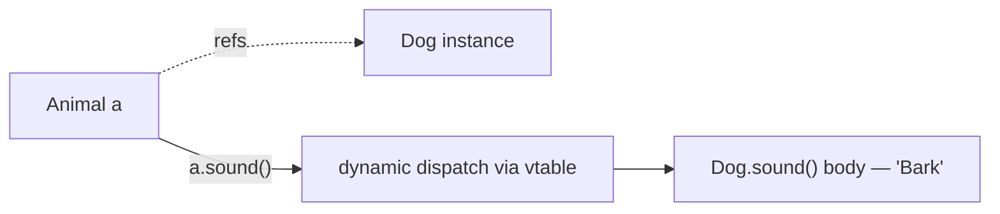

## The Five Override-Applicability Rules

Java's override rules come from JLS §8.4.8. Five constraints must all hold; violating any of them is either a compile error or quietly makes the method *not* an override (and `@Override` catches the latter).

### 1. Same Method Name + Parameter Types (the Signature)

The signature ([T13](../../L0-foundations/C02-java-core/T13-method-overloading.md)) is `name + parameter types in order`. Identical signature → potential override. Different parameter types → it's an **overload**, a separate method, not an override.

```java
class Parent {
    void log(String msg) { }
}
class Child extends Parent {
    @Override void log(String msg) { }    // override — same signature
    void log(int code) { }                // overload — different signature, separate method
}
```

Parameter *names* don't count (they're not part of the signature). Generic type erasure can collapse two source-different signatures to the same bytecode signature — be careful with `List<String>` vs `List<Integer>` (both erase to `List`).

### 2. Same Return Type — Or a Covariant Subtype (Java 5+)

The override's return type must be the **same** as the parent's, or a **subtype** of the parent's (covariant returns).

```java
class Parent {
    Animal getPet() { return new Dog(); }
}
class Child extends Parent {
    @Override
    Dog getPet() { return new Dog(); }    // OK — Dog IS-A Animal (covariant)
}

class Bad extends Parent {
    @Override
    String getPet() { return "no"; }      // COMPILE ERROR — String is not a subtype of Animal
}
```

Covariant return is the modern face of "more specific return types in subclasses" — common with builder methods, factory methods, and `clone()` (`Object.clone()` → `MyClass clone()`). The hidden cost is the **bridge method** we'll see below; the gain is that callers using a `Dog`-typed reference can get a `Dog` back without casting.

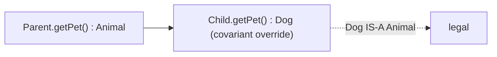

### 3. Cannot Throw New or Broader Checked Exceptions

The override may throw **fewer** or **narrower** checked exceptions than the parent — never more. The reason: any caller of the parent's method has only been told to expect the parent's exceptions; if the override throws something new, the caller can't have planned for it.

```java
class Parent {
    void doIt() throws IOException { }
}
class Child extends Parent {
    @Override void doIt() throws FileNotFoundException { }   // OK — FNF IS-A IOException
}
class Bad extends Parent {
    @Override void doIt() throws SQLException { }            // COMPILE ERROR — SQL not IS-A IOException
}
class Quiet extends Parent {
    @Override void doIt() { }                                // OK — throwing nothing is allowed
}
```

**Runtime exceptions (subclasses of `RuntimeException`) and errors (subclasses of `Error`) are unchecked** and the rule doesn't apply to them — an override may throw any runtime exception or error.

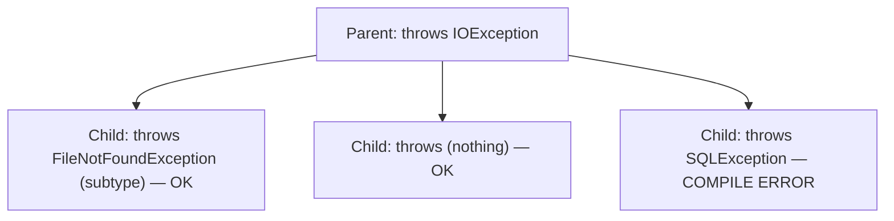

### 4. Access Cannot Be More Restrictive

The override's access modifier must be the same or **broader**. You can widen `protected` to `public`; you cannot narrow `public` to `protected`.

```java
class Parent {
    public void api() { }
}
class Child extends Parent {
    @Override protected void api() { }   // COMPILE ERROR — narrower than public
}
class Wider extends Parent {
    @Override public void api() { }      // OK — same access
}
```

The reason: a `Parent` reference holding a `Child` would suddenly find the `api()` method "less accessible" than the contract promised — a violation of substitutability.

### 5. `final`, `static`, and `private` Methods Cannot Be Overridden

- **`final`** ([T04](./T04-inheritance-and-super.md)) — the parent declares the method as closed. The subclass cannot replace it. Attempting to do so is a compile error.
- **`static`** — static methods are not virtual; redeclaring with the same name in a subclass is **method hiding**, not overriding ([T04](./T04-inheritance-and-super.md)). `@Override` on a static method is a compile error.
- **`private`** — private methods are not inherited ([T04](./T04-inheritance-and-super.md)); the subclass cannot see them, so it cannot override them. A same-signature method in the subclass is a separate, independent method.

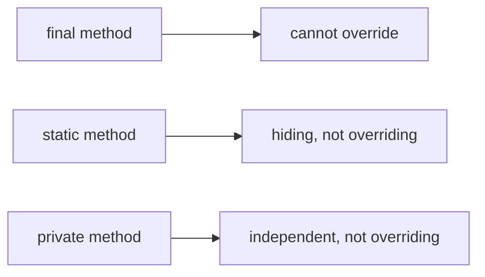

> [!INTERVIEW]
> "Can you override a `static` method?" No. A `static` method redeclared in a subclass is **hidden**, not overridden — dispatch is static (by compile-time reference type), not dynamic. `@Override` on a static method is rejected by javac.

## Overriding vs Overloading — The Clean Distinction

| Property | Overriding | Overloading |
|----------|------------|-------------|
| Location | Subclass of declaring class | Same class (T13) |
| Signature | **Identical** to parent | **Different** from sibling |
| Return type | Same or covariant | Independent (return type alone doesn't distinguish) |
| Dispatch | **Dynamic** (vtable) | **Static** (compile-time pick) |
| Cost | ~1–5 ns depending on monomorphism | ~0 ns (compile-time bound) |
| Annotation | `@Override` (recommended) | none |

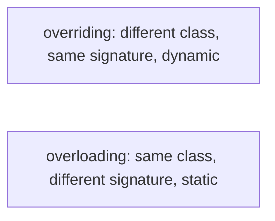

The two get conflated by beginners because both produce "multiple methods of the same name." They are entirely separate language mechanisms with different rules and different costs.

## The `@Override` Annotation

`@Override` is a **compile-time annotation** with no runtime presence. Its sole job: instruct javac to verify that the annotated method actually overrides a method in the parent chain. If it doesn't — wrong name, wrong parameters, wrong return type, etc. — javac emits a compile error.

```java
class Parent { void process(int n) { } }
class Child extends Parent {
    @Override void proces(int n) { }   // COMPILE ERROR: method does not override
}
```

Without `@Override`, the typo silently creates a new method `proces` that never gets called — a hard bug to track down later. Modern best practice: annotate every intended override.

```java
class Foo extends Bar {
    @Override public String toString() { ... }   // catches typos against Object.toString
    @Override public boolean equals(Object o) { ... }
    @Override public int hashCode() { ... }
}
```

`@Override` can also be used on methods that override an interface method (Java 6+), not just superclass methods.

## Covariant Return — The Bridge Method

Covariant return types come with a hidden machinery: javac synthesizes a **bridge method** in the subclass that has the parent's exact signature, delegating to the real override. This preserves binary compatibility — legacy callers compiled against the parent see a method with the parent's signature in the subclass's vtable.

```java
class Parent { Animal getPet() { return new Dog(); } }
class Child extends Parent {
    @Override
    Dog getPet() { return new Dog(); }
}
```

What `javap -v Child` actually shows:

```
Dog getPet();
  flags: ACC_PUBLIC
  Code: ...

Animal getPet();                  // ← synthetic bridge method
  flags: ACC_PUBLIC, ACC_BRIDGE, ACC_SYNTHETIC
  Code:
     0: aload_0
     1: invokevirtual #X     // Method getPet:()LDog;
     4: areturn
```

There are now **two** `getPet` methods in `Child` — the real one returning `Dog`, and the bridge returning `Animal` that immediately delegates to the `Dog`-returning one. The bridge keeps the vtable layout aligned with `Parent`'s; a `Parent`-typed call site uses the bridge slot (same index as in `Parent`).

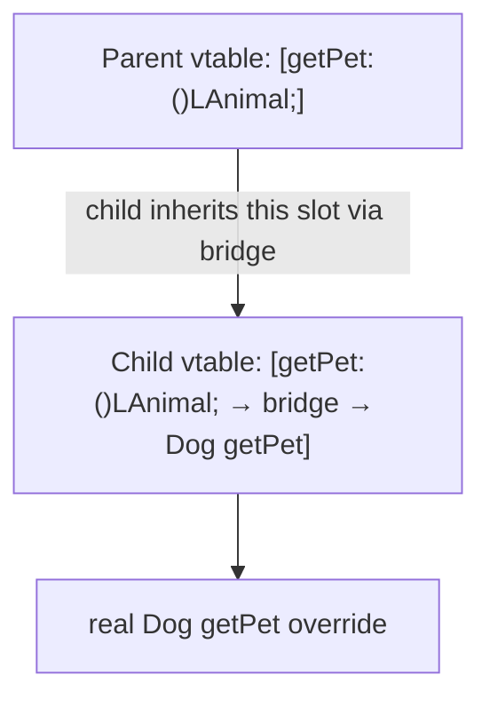

The flags:

- **`ACC_BRIDGE` (0x0040)** — marks a synthetic bridge method.
- **`ACC_SYNTHETIC` (0x1000)** — generic "compiler-generated, not in source."

Bridge methods are also used in generic type erasure (a `List<String>` implementation of `add(Object)` gets a bridge from the erased `add(Object)` slot to the typed `add(String)` body) — full coverage in [L1/C02/T12 Generics](../C02-collections-and-core-apis/T12-generics-bounded-types-wildcards-type-erasure.md).

## Memory Layer — Vtable Slot Replacement

Recall the vtable rule from [T04](./T04-inheritance-and-super.md): each method gets a fixed **slot index** when the class is loaded; subclass vtables preserve those indexes; overriding **replaces the pointer at that slot**.

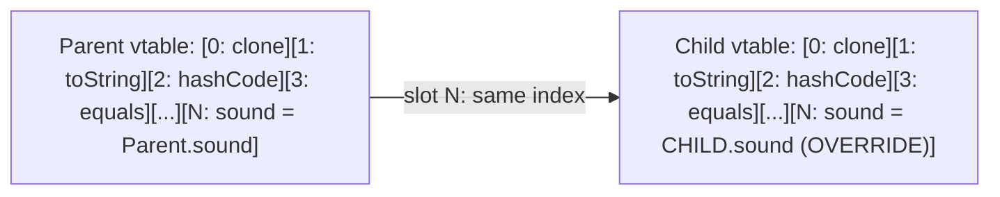

`invokevirtual sound:()Ljava/lang/String;` at a call site is *the same opcode* regardless of compile-time type. The JVM:

1. Reads the receiver's **klass pointer** from the object header (offset 8 on 64-bit compressed oops).
2. Loads the vtable base address from the klass struct.
3. Indexes by `slot N` (computed at link time when the method symbolic reference was resolved).
4. Performs an indirect call to whatever method that slot points to.

The choice of slot is the parent's slot; the choice of pointer is the runtime class's. **Overriding is a pointer replacement at a known offset, nothing more.**

### `invokevirtual` Mechanism — x86-64 Listing

For a hot call site `a.sound()` on `Animal a` where the receiver is some subclass, the JIT-emitted x86-64 looks roughly like:

```
mov   r10, [rdi + 8]        ; load klass pointer from object header
mov   r11, [r10 + KLASS_VTABLE_OFFSET + SLOT*8]   ; load vtable[slot]
call  r11                   ; indirect call
```

(KLASS_VTABLE_OFFSET and SLOT are compile-time constants known at JIT-emission time.)

The cost depends on cache behavior:

| Scenario | Cost |
|----------|------|
| Hot, monomorphic, BTB-cached | ~2–3 cycles |
| Bimorphic with inline cache | ~3–5 cycles (test + jump or call) |
| Megamorphic, BTB miss | ~10–20 cycles |
| Cold (first call), full miss | ~50+ cycles |

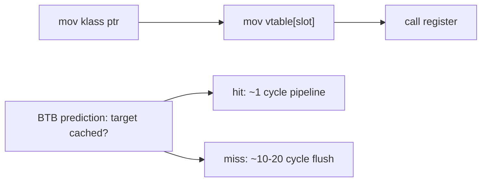

The **Branch Target Buffer (BTB)** is a CPU-internal prediction table that remembers recent indirect-call targets. A monomorphic call site burns one BTB entry and is correctly predicted forever; megamorphic sites thrash the BTB and pay misprediction costs constantly.

## Architecture Layer — Inline Caches and Devirtualization

Beyond raw vtable dispatch, modern JVMs apply **devirtualization** — converting a `invokevirtual` into a near-direct call when the runtime conditions allow.

### Monomorphic Inline Cache (Hot Path)

When the JIT first compiles a call site, it doesn't know which target will be called. The compiled call records the **first observed receiver class**; on subsequent calls, a type check picks between (a) the cached body (inlined) and (b) a fallback to vtable lookup.

```
[a.sound() call site after JIT, monomorphic]
  cmp   [rdi + 8], DogKlass     ; is receiver class Dog?
  jne   slow_path                ; no: fall back to vtable
  ...inlined Dog.sound body...   ; yes: run directly
```

If the cached class always matches (typical for a real-world hot path where `Animal a` is always a `Dog`), the call runs with essentially zero overhead — a single compare and a direct jump or inlined body. This is **devirtualization via inline caching**.

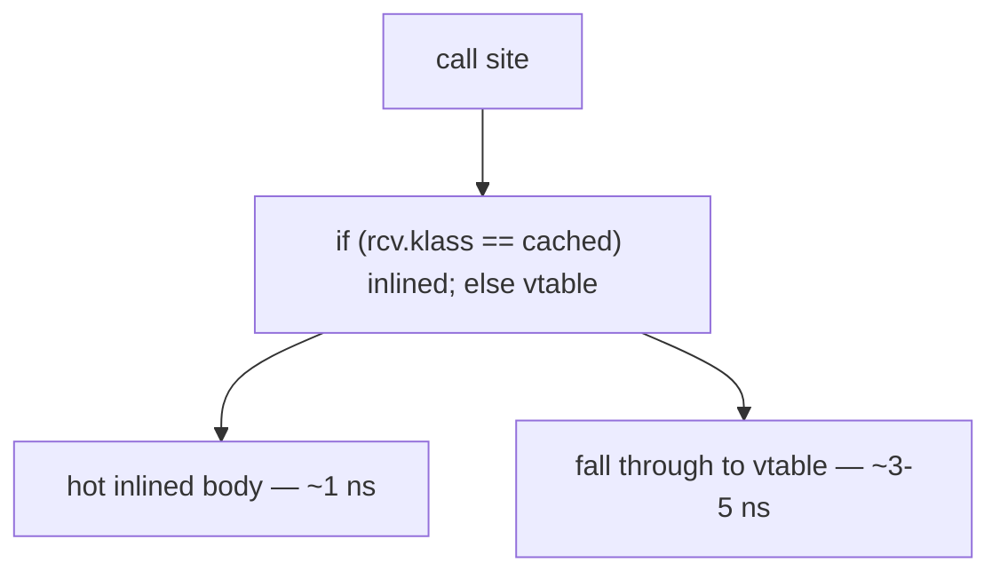

### Polymorphic Inline Cache (Bimorphic / Small Polymorphic)

For sites with 2–3 observed types, the JIT generates a small chain of type tests:

```
cmp  rcv.klass, DogKlass   ; jne next
  ...Dog body...
next:
cmp  rcv.klass, CatKlass   ; jne fallback
  ...Cat body...
fallback:
  vtable lookup
```

Each individual test is ~1 cycle; the chain length grows linearly. Once the JIT observes a third type (typically the threshold), it gives up and emits a vtable-only call site.

### Megamorphic Fall-back

At a megamorphic site (3+ observed types in HotSpot's default), the JIT abandons inline caching and emits an ordinary vtable lookup. No inlining of method bodies. Throughput drops by 2–5x relative to monomorphic.

### Where the Compiled Code Physically Lives — Code Cache and nmethod

JIT-compiled native code is not stored in your heap or your stack — it lives in a **separate, executable memory region** called the **Code Cache**, allocated outside the Java heap by the JVM at startup.

- **Default size:** 240 MB (`-XX:ReservedCodeCacheSize=240m`).
- **Layout:** divided into three segments since Java 9 (JEP 197): non-method (stubs, etc.), profiled (tier 2/3 C1 output), non-profiled (tier 4 C2 output).
- **OS permissions:** mapped with `PROT_READ | PROT_EXEC` (executable but not writable except by the JVM during patching) — this is what `mprotect` looks like in `/proc/self/maps` for a Java process.
- **Filling up:** when the code cache exhausts, no further JIT compilation happens; methods stay interpreted. The JVM logs `CodeCache is full. Compiler has been disabled.` and you lose performance silently.

Each compiled method is an **nmethod** — a roughly 1-8 KB blob in the Code Cache. The nmethod's physical structure:

```
+-------------------------+
| nmethod header          | ~100 bytes (metadata: source Method*, deopt info, etc.)
+-------------------------+
| Inline Cache entries    | ~10–100 bytes (CompiledIC structures for each non-monomorphic call site)
+-------------------------+
| Native code             | ~500 bytes – several KB (actual x86/ARM instructions)
+-------------------------+
| Stub code               | ~50–200 bytes (deopt entry points, safepoint poll handlers)
+-------------------------+
| Relocation info         | ~50–200 bytes (where the GC needs to patch references)
+-------------------------+
| OopMap                  | ~50–500 bytes (per-safepoint: which native registers hold object refs)
+-------------------------+
| Debug info / ScopeDesc  | ~100–1000 bytes (deopt reconstruction tables)
+-------------------------+
```

A simple getter compiles to ~500 bytes total nmethod; a complex method with many inlined callees can reach 8+ KB. A large Spring application may have **10,000–50,000 nmethods** active, consuming 50–200 MB of code cache. This is why the default 240 MB exists and why production tuning often raises it (`-XX:ReservedCodeCacheSize=512m`).

#### Atomic Code Patching — How the Inline Cache Updates Without Stopping Threads

When an inline cache transitions from clean → monomorphic, or monomorphic → bimorphic, the JIT must **modify already-executing native code** while other threads may be running through it. How is this safe?

The trick: the patch is **always a single naturally-aligned word write** (8 bytes on x86-64). A `call` instruction is 5 bytes; a `mov + cmp + jne + call` IC stub fits in ~32 bytes; patching the IC means rewriting one slot of pointer data inside the stub, not rewriting the instructions themselves. The CPU's coherence protocol (MESI) ensures that any other CPU reading the same line sees either the old or the new value — never a mix.

For larger changes (replacing 5 bytes of instruction), HotSpot uses a **safepoint**: all Java threads are paused at known instruction boundaries; the patch is applied; threads resume. Safepoints happen at GC time, method-entry/return, and at backedges. The pause is ~100 µs to ~10 ms depending on heap size — short for occasional patches.

#### Why nmethod Storage Affects Performance

- **Code cache density**: a packed code cache has hot methods near each other → instruction cache (L1i) hits. A fragmented cache (after many compilations + invalidations) suffers L1i misses on hot paths.
- **Code cache invalidation**: deopt or class unloading marks nmethods as zombie; they sit in the cache until the JVM sweeps them. A long-running app accumulates zombie nmethods; `-XX:+PrintCodeCache` shows live vs total.
- **Compile threads**: HotSpot uses 1–4 background C1/C2 threads. Compile queue lengths build up under heavy class loading; methods stay interpreted longer; throughput suffers. Spring's "warm-up problem" is largely about waiting for the compile queue to drain.

> [!INTERVIEW]
> "What's the performance cost of overriding?" In hot code, *almost nothing* — the JIT devirtualizes monomorphic and bimorphic call sites via inline caches, making the override as fast as a direct call. The cost shows up only at megamorphic sites (3+ types observed) where the vtable lookup is real and inlining defeated. Practical advice: don't worry about overriding in domain code; do worry about deep, wide hierarchies where many subclass types pass through a single call site.

### CHA-Backed Inlining (T04 Recap)

When the JIT compiles a call site for a non-final method, it consults **Class Hierarchy Analysis (CHA)** and asks "has any subclass overridden this method?" If no — the method is effectively monomorphic, no matter how many subclass types exist. The JIT inlines aggressively. If a subclass overriding the method later loads, the JIT triggers **deoptimization**: the compiled code is invalidated, callers fall back to interpreter or recompile.

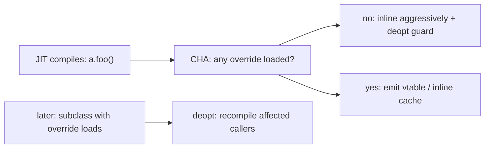

Combined: CHA + inline caching + bridge methods give the JIT room to make most dispatch effectively free.

## Deeper JVM Internals — Method Struct, CompiledIC, and Deoptimization

The vtable view of dispatch is correct but coarse. HotSpot's actual machinery — the **`Method` struct** in Metaspace, the **CompiledIC** inline cache embedded in JIT-emitted code, the **MDO** (Method Data Object) that records profile data, and the **deoptimization scope** that rolls back compiled execution to the interpreter — is what turns "the JIT inlines polymorphic calls" from a slogan into actual performance. This section walks them.

### The Method Struct

Every method — whether interpreted, JIT-compiled, or both — has a **`Method` struct** in Metaspace alongside its Klass. Key fields:

| Field | Purpose |
|-------|---------|
| `_constMethod` | pointer to bytecode + line numbers + local variable table |
| `_method_data` | pointer to MDO (profile data); `null` until compiler creates it |
| `_method_counters` | invocation count, backedge count, intrinsic candidate flag |
| `_access_flags` | the `ACC_*` bits including `ACC_BRIDGE`, `ACC_SYNTHETIC` |
| `_vtable_index` | which slot this method occupies in the owning Klass's vtable; `-1` for static/private/non-virtual |
| `_i2i_entry` | interpreter-to-interpreter entry point |
| `_from_compiled_entry` | the entry point JIT-compiled callers jump to |
| `_from_interpreted_entry` | the entry point the interpreter dispatches to |
| `_code` | pointer to the most-recently-installed JIT-compiled native code (`nmethod`) |
| `_adapter` | pointer to an adapter blob that translates calling conventions (interpreted ↔ compiled) |
| `_intrinsic_id` | enum tag identifying JVM intrinsics (e.g., `Math.sin`, `String.equals`) |

The three entry points are key. When you call a method, you go through whichever entry point is appropriate for the caller's compilation state. The JIT can install a new `_code` (a freshly compiled nmethod), updating `_from_compiled_entry` atomically — so subsequent calls hit the new code without locks.

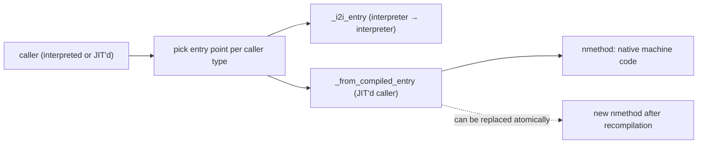

### The MDO — Method Data Object

When the interpreter or C1 detects a method is warming up, it allocates an **MDO** in Metaspace. The MDO records:

- **Invocation count** — total calls to this method.
- **Backedge count** — total times the method's loop backedges executed (drives OSR decisions).
- **Per-call-site profile** — at each `invokevirtual`/`invokeinterface`, a small table of observed receiver classes + per-class counts. Typically 1–3 entries (the JIT classifies the site as monomorphic/bimorphic/megamorphic based on this table).
- **Per-branch profile** — for each conditional branch, how often was the true vs false branch taken.
- **Type profile** for `checkcast`/`instanceof` — which target classes were checked, how often each succeeded.
- **Null check counters** — implicit null check failures (NPE).

When C2 compiles the method (tier 4), it consults the MDO to decide:
- Which call sites to inline (monomorphic + hot = inline).
- Which branches to predict (frequently-taken = main path, rare = uncommon).
- Which type checks can be skipped (always-succeeds).
- Whether to OSR-compile a loop.

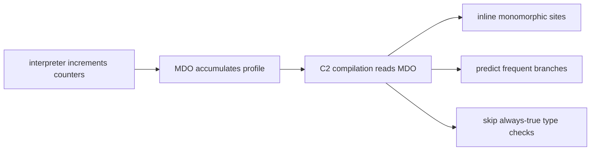

`-XX:+UnlockDiagnosticVMOptions -XX:+PrintMethodData` dumps the MDO. It's the JIT's "memory of what happened" — the substrate of all profile-guided optimization.

### CompiledIC — The Inline Cache Structure

When C2 compiles a non-monomorphic-by-CHA virtual call, it emits an **inline cache (IC)** at the call site. The IC is a small structure embedded in the JIT-emitted code:

```
[call site, JIT-emitted native code]
  cmp    [receiver + 8], cached_klass    ; compare receiver's klass to cached
  jne    ic_miss                          ; mispredicted: jump to miss handler
  call   cached_method_address            ; direct call to the inlined/compiled method
  jmp    after_call

ic_miss:
  call   IC_miss_stub
  ; the stub re-resolves the call, updates the IC, retries
```

The IC has three states tracked in HotSpot's `CompiledIC` class:

- **Clean** — no observed receiver type. The call site is a direct call to the resolution stub.
- **Monomorphic** — one observed type cached. Fast path: type check + direct call.
- **Megamorphic** — too many observed types. The call site is rewritten to a vtable lookup.

State transitions happen at IC misses. The stub patches the call site:

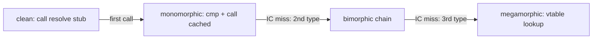

The IC self-patches without globally pausing the JVM. The patch is **atomic** — a 5-byte `call` instruction can be atomically replaced via a `lock cmpxchg` or by inserting a 1-byte `jmp` that branches to a stub. The CPU's instruction cache picks up the new code on its next fetch.

### Polymorphic Inline Cache (PIC)

For bimorphic sites — exactly 2 observed types — C2 emits a **PIC chain**:

```
  cmp    [receiver + 8], TypeA.klass
  je     callA
  cmp    [receiver + 8], TypeB.klass
  je     callB
  call   megamorphic_stub                 ; fall-through to vtable
```

PICs stay efficient up to ~3 types; beyond that the chain length defeats the cache and the JIT switches to a vtable. The threshold is `TypeProfileWidth` (default 2 in HotSpot — meaning up to 2 cached types before megamorphism kicks in).

### Deoptimization — The Reverse of Compilation

When a JIT-compiled assumption breaks (a CHA-guarded inlined override is overridden by a newly-loaded subclass; a type-profile-based inline encounters an unexpected type; a frequent-branch prediction misses too often), HotSpot must **deoptimize** the compiled code and resume execution in the interpreter — *mid-method*, with the same logical state.

The mechanism:

1. **Scope info** is recorded at every safepoint in the JIT-emitted code. Scope info maps native registers and stack slots back to *Java-source* local variables and operand-stack entries. The JIT keeps this metadata as `OopMapSet` + `ScopeDesc` per safepoint.
2. **Uncommon trap** is the JIT-emitted code path that triggers a deopt. When the trap fires, it reads the scope info, reconstructs the interpreter frame, copies Java locals + operand stack from native to interpreter form, then transfers control to the interpreter at the correct bytecode index.
3. **Recompilation** is queued for the method — but with the broken assumption removed from the speculation set. The next call hits a freshly-compiled, more conservative version.

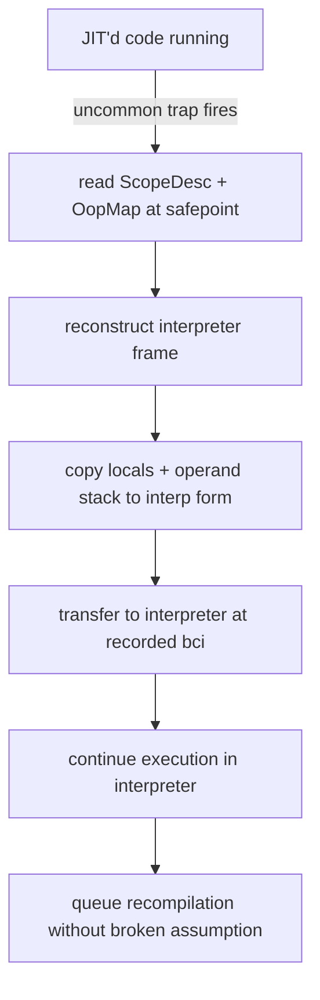

Cost: a deopt is **expensive** — ~10–100 µs for the trap + recompile, plus any subsequent re-warm-up. But it's amortized: a well-tuned production application sees ~10–100 deopts per minute, vastly less than the millions of fast calls between them.

### Tiered Compilation — How Methods Move Up and Down

A method's compilation state is a small state machine:

```
[Tier 0: Interpreter]
    ↓  invocation count > Tier3InvocationThreshold (default ~200)
[Tier 3: C1 + full profile]
    ↓  invocation count > Tier4InvocationThreshold (default ~5000)
[Tier 4: C2 (aggressive)]
    ↓  deoptimization
[Tier 0]
```

Some methods skip tier 3 (e.g., trivial methods go straight to tier 4). Some methods are stuck at tier 3 (the code cache is full, or the method is too big for C2). Some methods oscillate between tier 4 and tier 0 due to repeated deopts — a "**tier 4 thrash**" pattern that indicates poor profile data or pathological polymorphism.

Observable with `-XX:+PrintCompilation`. Long-running applications stabilize at tier 4 for hot methods and tier 0/3 for cold ones.

### Bridge Method Generation — Algorithm Detail

When you write a covariant override:

```java
class Animal { Object clone() { ... } }
class Dog extends Animal { Dog clone() { ... } }   // covariant
```

Javac generates **two** methods in `Dog`:

1. `Dog clone()` — the real override, marked just `ACC_PUBLIC`.
2. `Object clone()` — synthetic bridge, marked `ACC_PUBLIC | ACC_BRIDGE | ACC_SYNTHETIC`. Its body is:
   ```
   aload_0
   invokevirtual Dog.clone:()LDog;     // call the real one
   areturn                              // return as Object (since Object is super of Dog)
   ```

The bridge is necessary because at the JVM level, the vtable slot for `clone` in `Animal` has the descriptor `()Ljava/lang/Object;`. `Dog`'s `Dog clone()` has descriptor `()LDog;` — a *different* method by JVM rules. Without the bridge, callers using an `Animal`-typed reference would never find `Dog.clone` in the right slot.

The bridge populates `Animal`'s slot in `Dog`'s vtable; the real `Dog clone` is at an appended slot. When a `Dog`-typed reference calls `clone`, javac emits `invokevirtual Dog.clone:()LDog;` and reaches the real method directly. When an `Animal`-typed reference calls `clone`, javac emits `invokevirtual Animal.clone:()Ljava/lang/Object;` and reaches the bridge, which delegates.

The same bridge mechanism handles **generic erasure** ([T08](./T08-interfaces-default-static-private-methods.md), [L1/C02/T12](../C02-collections-and-core-apis/T12-generics-bounded-types-wildcards-type-erasure.md)). `Comparable<Dog>.compareTo(Dog)` erases to `compareTo(Object)`; the concrete implementation `Dog.compareTo(Dog)` gets a bridge `compareTo(Object)` that casts to `Dog` and delegates.

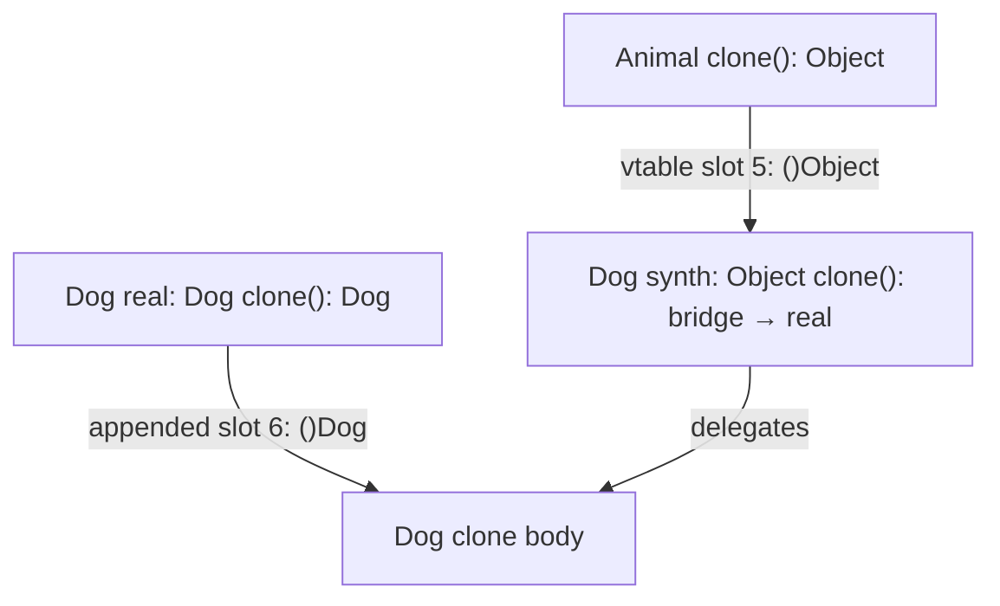

The bridge is invisible at the source level but visible in `javap -v` as `ACC_BRIDGE | ACC_SYNTHETIC`.

### Why the JIT's "Free Polymorphism" Claim Holds

Putting it together: a hot call site `shape.area()` with one observed `Circle` runtime type compiles to:

```
mov   r10, [rdi + 8]            ; load klass (1 cycle, L1 hit)
cmp   r10, CircleKlass           ; compare to cached (1 cycle)
jne   ic_miss                    ; mispredicted: ~10-20 cycles, very rare
; --- inlined Circle.area body ---
mulsd xmm0, xmm1                 ; r * r
mulsd xmm0, PI_const             ; * PI
; --- end inline ---
; total: ~2-3 cycles steady state
```

That's the realization of "virtual dispatch is free" — the cache check + inlined body run in ~2–3 cycles, indistinguishable from a direct call. The cost shows up only when assumptions break (deopt) or when the call site becomes megamorphic (vtable lookup). The MDO + CompiledIC + tiered compiler are the machinery; the result is "Java is as fast as C++ for hot polymorphic code."

## Common Mistakes

> [!WARNING]
> **Missing `@Override` lets typos slip through.** `equlas(Object)` doesn't override `equals` — it's a new method that no caller will ever call. Add `@Override` to every intended override; let javac flag the typos.

> [!WARNING]
> **Narrowing access in an override.** `public` parent → `protected` child is a compile error. The override must be at the same or broader visibility.

> [!WARNING]
> **Adding a broader checked exception.** The override may throw fewer/narrower, not more. Throwing a new `SQLException` from an override whose parent throws only `IOException` is a compile error.

> [!WARNING]
> **Returning a non-subtype.** Pre-Java-5, return types had to match exactly. Java 5+ allows covariant subtypes — but not unrelated types. `String` is not a subtype of `Animal`.

> [!WARNING]
> **Trying to override a `final`, `static`, or `private` method.** Each fails differently: `final` is a compile error; `static` is "hiding" with `@Override` rejected; `private` is "independent method" because the subclass can't see the parent's.

> [!WARNING]
> **Confusing overriding with overloading.** Overloading is same class, different signature, static dispatch. Overriding is subclass, same signature, dynamic dispatch. `@Override` only applies to overriding.

> [!WARNING]
> **Field "overriding" doesn't exist.** Declaring a same-named field in a subclass is **shadowing** ([T04](./T04-inheritance-and-super.md)) with static dispatch by reference type. `@Override` is rejected on fields.

> [!WARNING]
> **Calling overridable methods from a constructor.** The fragile-base-class trap ([T02](./T02-fields-methods-constructors-this.md)). Use `final` or `private` methods for constructor-time logic.

> [!WARNING]
> **Equals without hashCode.** Overriding `equals` without also overriding `hashCode` breaks `HashMap`/`HashSet` ([T10](./T10-equals-hashcode-tostring-contracts.md)). The contract requires both.

> [!INTERVIEW]
> Common interview questions:
> 1. **What are the rules for a valid override?** Same signature; same or covariant return; same-or-narrower checked exceptions; same-or-broader access; the method must not be `final`, `static`, or `private`.
> 2. **What's a covariant return type?** An override that returns a subtype of the parent's return type. Java 5+. Implemented via a synthetic bridge method.
> 3. **What's a bridge method?** A compiler-generated method (flags `ACC_BRIDGE | ACC_SYNTHETIC`) that has the parent's exact signature and delegates to the actual override. Preserves binary compatibility.
> 4. **What's the difference between overriding and overloading?** Overriding: subclass, same signature, dynamic dispatch. Overloading: same class, different signatures, static dispatch.
> 5. **What's the bytecode for an overridden call?** `invokevirtual`, with the symbolic reference resolved at link time to a vtable slot index; dispatch goes through the receiver's klass.
> 6. **How does the JIT make dispatch cheap?** Inline caches at monomorphic/bimorphic call sites; CHA inlines non-final methods when no override has loaded; deopt fires if assumptions break.
> 7. **What is megamorphism and why does it hurt?** A call site with 3+ observed receiver types defeats inline caching; the JIT emits a vtable lookup and disables inlining. Cost ~3–5x relative to monomorphic.
> 8. **Why is BTB relevant to virtual calls?** The Branch Target Buffer predicts indirect-call targets. Monomorphic calls hit ~1 cycle; megamorphic ones miss ~10–20.
> 9. **Why must access widen, not narrow, in an override?** Substitutability: a parent reference holding the subclass must see the same-or-broader API. Narrowing would break callers.
> 10. **What happens at the vtable when a subclass overrides?** The pointer at the parent's slot index is replaced; the slot number doesn't change. New subclass-only methods are appended at later slots.
> 11. **Can you override `final` methods? Why or why not?** No — `final` is the language's "closed for extension" marker; compile error. It also helps the JIT prove monomorphism without CHA.
> 12. **Can constructors be overridden?** No — constructors are not inherited; they cannot be overridden. Each class declares its own; the chain runs via `super(...)`.
> 13. **How does `@Override` help?** Compile-time check that the method actually overrides; catches typos and accidental signature mismatches.
> 14. **Why does `equals` need `hashCode` overridden too?** The hash-based collections (`HashMap`, `HashSet`) rely on the contract `a.equals(b) ⇒ a.hashCode() == b.hashCode()`; breaking it makes lookup silently fail.

## Practice

1. **Basic override with `@Override`.** Declare parent + child with one overridden method. Call via parent-typed reference; observe child's method runs. Remove `@Override`; observe nothing changes (it was correct anyway). Introduce a typo; observe compile error reappears with `@Override`, silent failure without.

2. **Covariant return + bridge method inspection.** Override `Object clone()` to return `MyClass`. Run `javap -v` and find the bridge method with `ACC_BRIDGE | ACC_SYNTHETIC` flags. Trace its body — should be `aload_0 + invokevirtual <real clone> + areturn`.

3. **Exception narrowing.** Parent declares `throws IOException`; override declares `throws FileNotFoundException`. Compile — should succeed. Then declare `throws SQLException`; should fail.

4. **Access widening.** Parent: `protected void foo()`. Child: `public void foo()`. Compile — should succeed. Then narrow Child to `private`; compile — should fail.

5. **`final` cannot override.** Parent: `public final void f()`. Child: try to override. Compile — error.

6. **`static` hiding vs overriding.** Parent + child each declare `static String label()`. Add `@Override` to child's; observe compile error. Remove `@Override`; observe legal hiding. Call through `Parent p = (Parent) null; p.label()` to see static dispatch by reference type.

7. **`private` method "override".** Parent: `private void hi()`. Child: same. Add `@Override` to child's; compile error. Trace: child's method is independent, not an override.

8. **invokevirtual bytecode trace.** Compile a parent + child with overridden method. Run `javap -c` on the call site. Identify the `invokevirtual` opcode with the parent's Methodref. Then identify the override slot in `javap -v`.

9. **Vtable inspection via SA.** Use HotSpot's Serviceability Agent (`jhsdb hsdb`) to dump a class's vtable. Verify parent's slot indices are preserved; subclass's override replaces the slot's pointer.

10. **Monomorphic vs megamorphic benchmark.** Write a hot loop with `Shape[] shapes = new Shape[1_000_000]` filled with (a) all Circles; (b) Circle + Square; (c) 4 different shapes. Call `s.area()` in the loop. Measure throughput per case. Confirm (c) is 2-5x slower.

11. **CHA deopt observation.** Hot-loop a non-final method call from a class with no subclasses yet. Run with `-XX:+UnlockDiagnosticVMOptions -XX:+TraceDeoptimization`. After warmup, dynamically load a subclass that overrides. Observe deopt trace.

12. **`final` JIT inlining.** Same benchmark with the method marked `final`. Compare to non-final via `-XX:+PrintInlining`. `final` should inline more aggressively.

13. **PrintAssembly inspection.** Run a hot polymorphic call with `-XX:+UnlockDiagnosticVMOptions -XX:+PrintAssembly` (requires hsdis library). Find the inline cache check (klass comparison + branch). Confirm monomorphic case has cached comparison; megamorphic has vtable indirection.

14. **Equals + hashCode contract.** Override `equals` without overriding `hashCode`. Put two equals-equal objects in a `HashSet`; observe both got added (the set saw them as different). Add `hashCode` override matching `equals`; rerun, observe only one added.

15. **Override an interface default method.** Implement an interface with a `default` method ([T08](./T08-interfaces-default-static-private-methods.md) preview). Override the default in a class. Verify `@Override` works. Trace dispatch — interface methods use `invokeinterface`, not `invokevirtual` (full coverage in T08).

16. **End-to-end explain-it-back.** Take `Animal a = new Dog(); a.sound();` where `Dog` overrides `Animal.sound`. Trace through: (a) at compile time, `a.sound()` resolves to a Methodref pointing to `Animal.sound`'s vtable slot N; (b) javac emits `invokevirtual #X`; (c) at link time, slot N is computed and stored; (d) at runtime, JVM reads `a`'s header → klass = Dog → Dog's vtable[N] = Dog.sound; (e) Dog.sound body runs; (f) JIT after warmup observes monomorphic-Dog, installs inline cache, inlines Dog.sound body. Twelve sentences max.

## Recap

You should now be able to:

**Language layer.**

- State the five override-applicability rules: same signature, same-or-covariant return, same-or-narrower checked exceptions, same-or-broader access, not `final`/`static`/`private`.
- Use `@Override` to flag intended overrides and catch typos at compile time.
- Distinguish overriding (subclass, same signature, dynamic dispatch) from overloading (same class, different signature, static dispatch).
- Apply covariant return types when subclass returns a more specific type.
- Recognize when an override is allowed to narrow exceptions and broaden access — and why the reverse fails.
- Recognize that `final`, `static`, and `private` methods cannot be overridden, and the different failure modes (compile error, hiding, independent method).
- Avoid the equals/hashCode contract bug.

**Memory layer.**

- Explain vtable slot replacement: parent assigned the slot, subclass replaces the pointer, the slot index is preserved.
- Trace `invokevirtual`'s three steps: klass-pointer load, vtable[slot] load, indirect call.
- Identify a bridge method by its `ACC_BRIDGE | ACC_SYNTHETIC` flags and decode its body as a delegation to the real override.
- Recognize when bridge methods are synthesized: covariant return types and generic erasure.

**Architecture layer.**

- Explain inline caching at the JIT-compiled call site: monomorphic site = type check + inlined body; bimorphic = 2 type checks + 2 bodies; megamorphic = vtable lookup.
- Quantify dispatch costs: ~1ns monomorphic; ~2ns bimorphic; ~3–5ns megamorphic; ~10–20ns BTB miss.
- Explain Class Hierarchy Analysis (CHA) and the deopt guard that lets the JIT inline non-final methods optimistically.
- Recognize that `final` and `private` methods sidestep CHA's deopt guard — eligible for unconditional inlining.
- Explain the Branch Target Buffer (BTB) and why megamorphic call sites pay misprediction costs.
- Apply "shallow hierarchies + composition" as the design rule for hot code.

Method overriding is the **engine** of polymorphism in Java — one call site reaches many bodies, picked by runtime type. The next topic ([T06](./T06-polymorphism-compile-time-vs-runtime.md)) frames the broader idea: polymorphism as a discipline, distinguishing **compile-time polymorphism** (overloading, generics) from **runtime polymorphism** (overriding, dynamic dispatch), and the trade-offs each brings.

## Next

Continue to [Polymorphism (compile-time vs runtime)](./T06-polymorphism-compile-time-vs-runtime.md) — the umbrella concept that distinguishes static dispatch (overloading, generics, return-type-fixed) from dynamic dispatch (overriding, interfaces, type-pattern matching). With overriding now fully understood, the broader polymorphism picture is just one more abstraction layer up.
