# Polymorphism (compile-time vs runtime)

**Polymorphism** — Greek for "many forms" — is the property of a single name acting on values of different types. Java supports four flavors: **overloading** (one method name, many parameter lists; resolved at compile time), **overriding** (one method name, many class bodies; resolved at runtime), **generics** (one parameterized type, many concrete type arguments; resolved partly at compile time, partly via erasure), and **functional dispatch** (one lambda expression target type, many call-site implementations; resolved via `invokedynamic`). [T04](./T04-inheritance-and-super.md) introduced the IS-A relationship; [T05](./T05-method-overriding.md) gave overriding its full mechanism; this topic frames the umbrella concept and the deep distinction between **compile-time** (static, the compiler picks) and **runtime** (dynamic, the JVM picks) dispatch.

The depth bar isn't "polymorphism = code reuse." Each dispatch type compiles to a **different `invoke*` opcode** and has a **different cost profile**: `invokestatic` is essentially a direct call (~1 ns, fully JIT-inlined); `invokespecial` (constructors, `super.method`, `private`) is direct (~1 ns); `invokevirtual` is vtable-dispatched (~1–5 ns depending on monomorphism — [T05](./T05-method-overriding.md)); `invokeinterface` is **itable**-dispatched (~3–7 ns — the itable is a slower lookup than vtable because a class implements multiple interfaces and the JVM may need to search the itable for the right slot); `invokedynamic` is **bootstrap-cached** (~1 ns after first call, but lambda dispatch is fundamentally an `invokevirtual` on a generated class). Java's runtime polymorphism via interfaces is therefore slightly more expensive than via class inheritance, and lambda dispatch is "free" only after the JIT has fully inlined the bootstrap result. **The Liskov Substitution Principle** is the behavioral contract that gives polymorphism its real value: a subtype must be substitutable for its supertype not just syntactically but **behaviorally** — same preconditions, postconditions, invariants. Violating it produces classes that compile and run but quietly break callers. None of these details are visible from a `@Override` annotation; this topic teaches all four dispatch flavors with their bytecode and architecture.

> [!NOTE]
> Prerequisites: [Inheritance & super](./T04-inheritance-and-super.md) (`L1/C01/T04`) — IS-A relationship, vtable mechanics; [Method overriding](./T05-method-overriding.md) (`L1/C01/T05`) — dynamic dispatch, inline caches, CHA, devirtualization; [Method overloading](../../L0-foundations/C02-java-core/T13-method-overloading.md) (`L0/C02/T13`) — static dispatch via overload resolution, compile-time pick; [Classes & objects](./T01-classes-and-objects.md) (`L1/C01/T01`) — heap layout, klass pointer, `invoke*` opcode family.

## The Four Flavors

Polymorphism in Java is not a single mechanism. The CS-theory taxonomy distinguishes:

| Theory term | Java mechanism | Dispatch | Resolved at |
|-------------|----------------|----------|-------------|
| **Ad-hoc polymorphism** | Method **overloading** | static | compile time |
| **Subtype polymorphism** | Method **overriding** + interfaces | dynamic | runtime |
| **Parametric polymorphism** | **Generics** | static (with erasure) | compile time |
| **Functional polymorphism** | **Lambdas** (functional interfaces) | dynamic via `invokedynamic` | runtime |

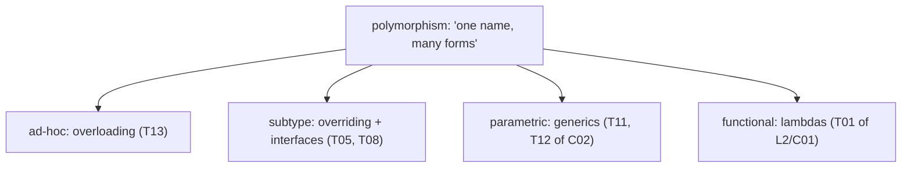

The two big practical buckets are **compile-time polymorphism** (overloading + generics) and **runtime polymorphism** (overriding + interfaces + lambdas). The same operation `process(obj)` may resolve at compile time to a specific overload, then at runtime to a specific override — both flavors composing in one call.

## Compile-Time Polymorphism

### Method Overloading

Covered in [L0/C02/T13](../../L0-foundations/C02-java-core/T13-method-overloading.md). Multiple methods with the same name distinguished by parameter list; the compiler runs the three-phase resolution algorithm (no-conversion → widening → boxing/varargs) and picks **one specific method** at the call site. The bytecode emits an `invoke*` opcode with the chosen method's exact descriptor in its constant-pool reference.

```java
class Logger {
    void log(int n) { System.out.println("int: " + n); }
    void log(String s) { System.out.println("str: " + s); }
}
new Logger().log(42);    // invokevirtual Logger.log:(I)V — compile-time pick
```

The choice of overload is **frozen** at compile time. There is no runtime overload resolution; the JVM dispatches the exact method the compiler chose. This is **ad-hoc polymorphism**: the same name acting on different types via separate method bodies.

### Generics

[L1/C02/T11–T12](../C02-collections-and-core-apis/T11-generics-basics.md) cover generics in depth. The short version for polymorphism: a parameterized type (`List<T>`) lets the same code work for many type arguments (`List<String>`, `List<Integer>`, `List<Point>`). At compile time the type checker enforces type-safe use; at runtime, **type erasure** removes the type parameter and replaces it with `Object` (or the upper bound for bounded type parameters).

```java
class Box<T> {
    T value;
    void set(T value) { this.value = value; }
    T get() { return value; }
}

Box<String> b = new Box<>();
b.set("hello");
String s = b.get();          // compile-time T = String; runtime T = Object
```

The bytecode emitted is effectively `Box { Object value; void set(Object); Object get(); }`. The compiler inserts implicit casts at the call sites (`(String) b.get()`). Generic polymorphism is **compile-time** — the JIT sees `Object` references and dispatches them like any other reference, with no per-T specialization. Bridge methods ([T05](./T05-method-overriding.md)) preserve binary compatibility when generic types intersect with overrides.

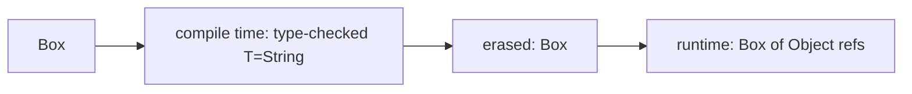

The trade-off: generics are zero-cost at runtime (no per-T method specialization) but lose information (you can't `T.class.newInstance()` directly). The **Project Valhalla** (in progress) aims to add specialization for value types, but as of this writing erasure is the model.

## Runtime Polymorphism

### Method Overriding

Covered in [T05](./T05-method-overriding.md) in full. The call site emits `invokevirtual` (instance method on a class) or `invokeinterface` (instance method on an interface) with the *symbolic* method name; at runtime, the JVM dispatches to the **runtime object's** class for the actual method body via the vtable.

```java
Animal a = new Dog();
a.sound();   // invokevirtual Animal.sound — dispatched to Dog.sound at runtime
```

This is **subtype polymorphism**: a single call site reaches different bodies depending on the runtime object.

### Interface Dispatch and the Itable

Interfaces ([T08](./T08-interfaces-default-static-private-methods.md)) introduce a wrinkle. A class can implement multiple interfaces; a single object has *one* vtable (for class inheritance) but *multiple* itables (one per implemented interface). When `invokeinterface` runs, the JVM:

1. Reads the receiver's klass pointer.
2. **Searches** the klass's itable list for the right interface's itable (the search is small — typically 1–3 entries; CHA + inline caching applies).
3. Indexes into that itable to find the method body.
4. Indirect call.

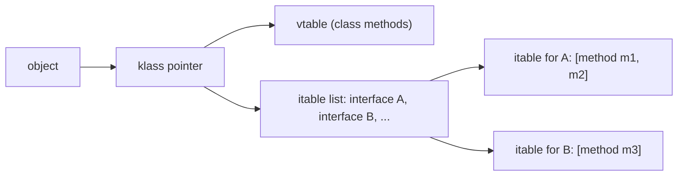

The itable lookup costs a few extra cycles vs vtable (typically ~3–7 ns at megamorphic sites, ~1–3 ns at monomorphic). The JIT applies the same inline-cache + CHA tricks; in hot code, interface dispatch effectively rivals virtual dispatch.

### Lambda Dispatch and `invokedynamic`

A **lambda** (Java 8+) is syntactic sugar for an instance of a **functional interface** — an interface with a single abstract method.

```java
Function<Integer, Integer> doubler = x -> x * 2;
int r = doubler.apply(5);   // 10
```

At the bytecode layer, the lambda is compiled to a `invokedynamic` instruction with a **bootstrap method** (`LambdaMetafactory.metafactory`). The first call invokes the bootstrap, which dynamically generates a class implementing the functional interface (typically via spinning a tiny class in memory). Subsequent calls bypass the bootstrap — the generated class's instance is cached. The actual method call on the lambda is `invokevirtual` (or `invokeinterface`) on the generated class.

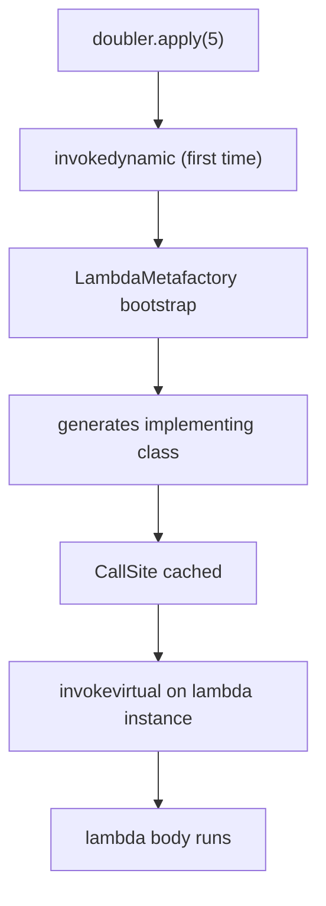

In hot code, the JIT inlines the entire chain — bootstrap result, generated class, lambda body — into the caller. Performance approaches monomorphic virtual dispatch. Lambda dispatch is "runtime polymorphism" because the target body is determined at the construction of the `Function` reference, not at compile time of the call site.

Full lambda coverage is in **L2/C01 Functional Java**.

### Where a Lambda Lives Physically — Bytes in Heap and Metaspace

A lambda expression at runtime has three distinct memory residences:

**1. The generated hidden class (Metaspace).** When `LambdaMetafactory.metafactory` first runs, it spins a new class:

```
final class CallerName$$Lambda$1 implements Function {
    // 0 fields for non-capturing, 1+ fields for captured locals
    public Object apply(Object x) {
        return CallerName.lambda$0((Integer) x);
    }
}
```

The class's metadata in Metaspace: ~500 bytes for the Klass struct + ~200 bytes for the bytecode of `apply` = **~700 bytes** for one lambda's hidden class. Java 15+ hidden classes (JEP 371) cannot be reflected or garbage-collected by class unloading until the defining classloader dies — so lambdas declared in a long-lived app accumulate Metaspace forever (~700 bytes each). A microservice with 500 lambda declarations carries ~350 KB of lambda metaspace.

**2. The instance (heap or eliminated).** For **non-capturing** lambdas, the JVM caches a single instance per call site:

```
+----------------------+
| header (12 bytes)    |
+----------------------+
| no fields            |
+----------------------+
| padding to 16 bytes  |
+----------------------+
```

**16 bytes total**, cached forever — effectively one allocation per non-capturing lambda declaration across the JVM's lifetime.

For **capturing** lambdas, each `new` creates a fresh instance with captured values in fields:

```java
int limit = compute();
Predicate<Integer> p = i -> i > limit;   // captures `limit`
```

The generated class becomes:
```
final class Caller$$Lambda$2 implements Predicate {
    private final int limit;
    Caller$$Lambda$2(int limit) { this.limit = limit; }
    public boolean test(Object x) {
        return Caller.lambda$1((Integer) x, limit);
    }
}
```

Instance size: `12 (header) + 4 (int limit) + 0 pad = 16 bytes` per call to the enclosing method. A capturing lambda in a hot loop creates one instance per iteration unless **escape analysis** eliminates it.

**3. The `MethodHandle` chain (Metaspace + small heap).** Each `invokedynamic` site holds a `CallSite` object pointing to a `MethodHandle` that points to the lambda body. ~50–200 bytes per call site.

#### Memory Cost Summary for a Single Lambda

| Component | Size | Lifetime |
|-----------|------|----------|
| Hidden class metadata (Metaspace) | ~700 B | until classloader dies |
| Non-capturing instance (heap) | 16 B | cached forever (1 instance) |
| Capturing instance (heap) | 16+ B per call | until unreachable (or EA-eliminated) |
| CallSite + MethodHandle (Metaspace + small heap) | ~150 B | until classloader dies |
| **Steady-state per non-capturing lambda** | **~870 B** | **app lifetime** |

For 500 lambdas in a typical Spring application: ~430 KB metaspace + ~8 KB heap (cached instances) + heap pressure from any capturing call sites. **Lambdas are not free, but they're cheap once warm.**

#### Why Capturing Lambdas in Hot Loops Are Dangerous Without EA

```java
for (int i = 0; i < 1_000_000; i++) {
    Predicate<Integer> p = x -> x > i;   // captures i
    if (p.test(value)) ...;
}
```

If escape analysis fails (e.g., `p` is passed to an un-inlined method), this allocates **1,000,000 × 16 bytes = 16 MB** in Eden per million iterations. With GC pressure and L1 cache thrashing, throughput drops 5–10×. The fix: either rewrite to not capture, or hoist the lambda outside the loop, or rely on EA (verify with `-XX:+PrintEliminateAllocations`).

The JIT's EA is the difference between "lambdas are zero cost" and "lambdas are a 10% GC burden" — and it depends heavily on inlining decisions you can influence by keeping methods small.

### Pattern-Binding `instanceof` (Java 16+)

[L0/C02/T05](../../L0-foundations/C02-java-core/T05-type-conversion-and-casting.md) introduced `instanceof`. Java 16+ extends it with **pattern binding**:

```java
if (obj instanceof Dog d) {
    System.out.println(d.breed);   // d is declared, scoped to the if-true branch
}
```

This is a syntactic enabler of runtime polymorphism: one block of code reads `obj`'s structure and branches on its actual type. Combined with **switch expressions over sealed types** ([L0/C02/T08](../../L0-foundations/C02-java-core/T08-control-flow-if-else-switch-switch-expressions.md), [T15](./T15-sealed-classes-and-interfaces.md)), it's the modern alternative to deep `if/else` chains for type-based dispatch.

```java
return switch (shape) {
    case Circle c    -> Math.PI * c.radius() * c.radius();
    case Square s    -> s.side() * s.side();
    case Triangle t  -> 0.5 * t.base() * t.height();
};
```

The compiler verifies **exhaustiveness** if `shape` is a sealed type with a closed set of permitted subtypes ([T15](./T15-sealed-classes-and-interfaces.md)). Pattern switch compiles to `invokedynamic SwitchBootstraps.typeSwitch` — covered fully in L0/C02/T08.

## Dispatch Cost Comparison

A summary of the five invocation modes and their costs in modern HotSpot:

| Opcode | Used for | Cold cost | Hot monomorphic | Hot megamorphic |
|--------|----------|-----------|-----------------|-----------------|
| `invokestatic` | static methods | direct call | ~1 ns inlined | n/a (always static) |
| `invokespecial` | constructors, `super`, `private` | direct call | ~1 ns inlined | n/a (always static) |
| `invokevirtual` | normal instance methods | vtable lookup | ~1 ns (inline cache) | ~3–5 ns (vtable) |
| `invokeinterface` | interface methods | itable search + lookup | ~1–2 ns (inline cache) | ~5–7 ns (itable) |
| `invokedynamic` | lambdas, str concat, pattern switch | bootstrap + cache | ~1 ns (inlined) | varies |

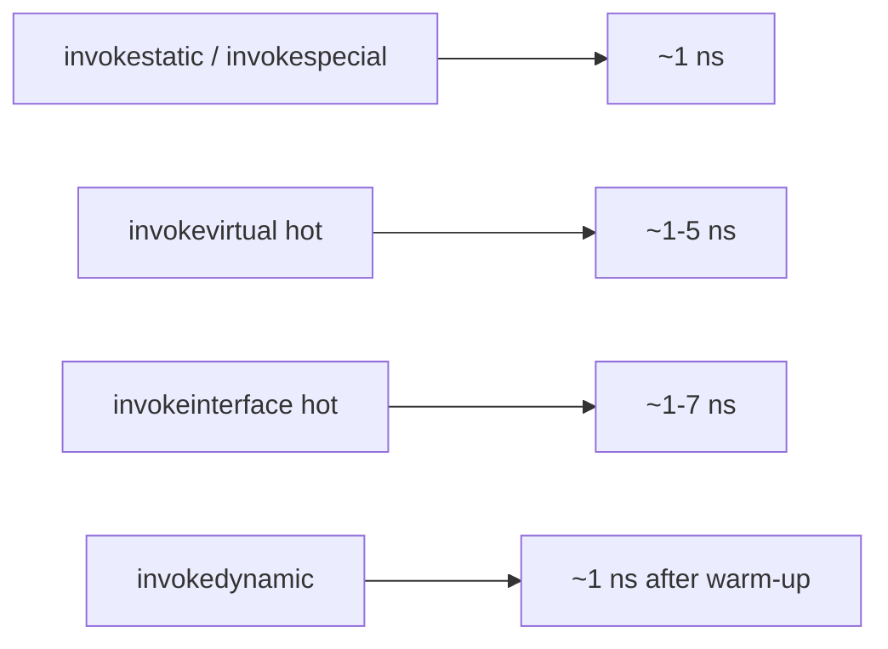

The take-away: **dispatch type matters in tight inner loops but rarely elsewhere.** Idiomatic Java picks the dispatch that fits the design (interface for plugin points, virtual for class hierarchies, static for stateless utilities) and lets the JIT pay off.

## Upcasting and Downcasting

**Upcasting** is treating a subclass reference as the parent type — always safe, no runtime check.

```java
Dog d = new Dog();
Animal a = d;       // upcast — implicit
```

**Downcasting** is the reverse — treating a parent reference as a subclass type. Requires explicit cast; runtime-checked via `checkcast` opcode; throws `ClassCastException` if the runtime type doesn't match.

```java
Animal a = new Dog();
Dog d = (Dog) a;    // downcast — checked at runtime
Cat c = (Cat) a;    // ClassCastException at runtime
```

Pattern-binding `instanceof` is the safe alternative — test and bind in one expression, with the cast eliminated:

```java
if (a instanceof Dog d) { d.bark(); }   // safe: no exception path
```

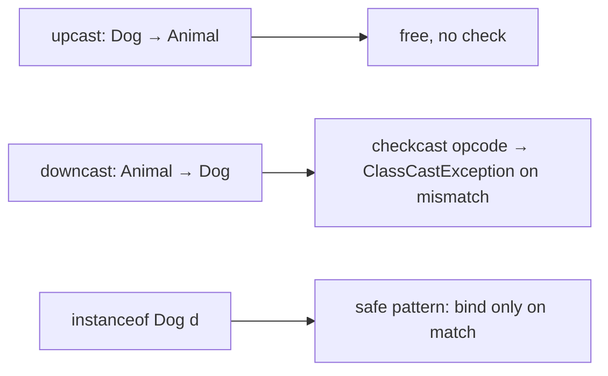

## The Liskov Substitution Principle

Polymorphism makes the *syntactic* substitution possible: any code accepting `Shape` accepts any subtype. But syntactic substitution is only safe when the subtype **behaves like its supertype** — same contract, no surprises. This is the **Liskov Substitution Principle** (Barbara Liskov, 1987):

> A subtype must be substitutable for its supertype in all contexts, preserving the supertype's behavioral guarantees.

Practically, that means:

1. **Preconditions cannot be strengthened.** If the parent says "accepts any non-null Animal," the override cannot say "accepts only Dogs."
2. **Postconditions cannot be weakened.** If the parent guarantees "returns a positive value," the override cannot return zero.
3. **Invariants must be preserved.** If the parent invariant is `width > 0`, the override must keep it true.
4. **Exception specifications cannot widen.** Already enforced by the language ([T05](./T05-method-overriding.md)).
5. **No surprising side effects.** The override cannot have side effects the parent doesn't.

### The Square-Rectangle Classic

The textbook violation: making `Square` extend `Rectangle`.

```java
class Rectangle {
    int width, height;
    void setWidth(int w)  { this.width = w; }
    void setHeight(int h) { this.height = h; }
    int area()            { return width * height; }
}
class Square extends Rectangle {
    @Override void setWidth(int w)  { this.width = w; this.height = w; }   // enforce square
    @Override void setHeight(int h) { this.height = h; this.width = h; }
}

void doubleWidthAndCompare(Rectangle r) {
    int origH = r.height;
    r.setWidth(r.width * 2);
    assert r.height == origH;     // FAILS when r is a Square
}
```

Code written against `Rectangle` reasonably assumes `setWidth` doesn't change height. `Square` violates that postcondition — substituting a `Square` for a `Rectangle` breaks the caller.

The fix isn't to fix `Square`; it's to **rethink the relationship**. `Square` is *not* a `Rectangle` behaviorally — they share fields but have different contracts. Better designs: make them siblings (`abstract class Shape; Rectangle extends Shape; Square extends Shape;`); or make `Rectangle` immutable so the setter problem vanishes.

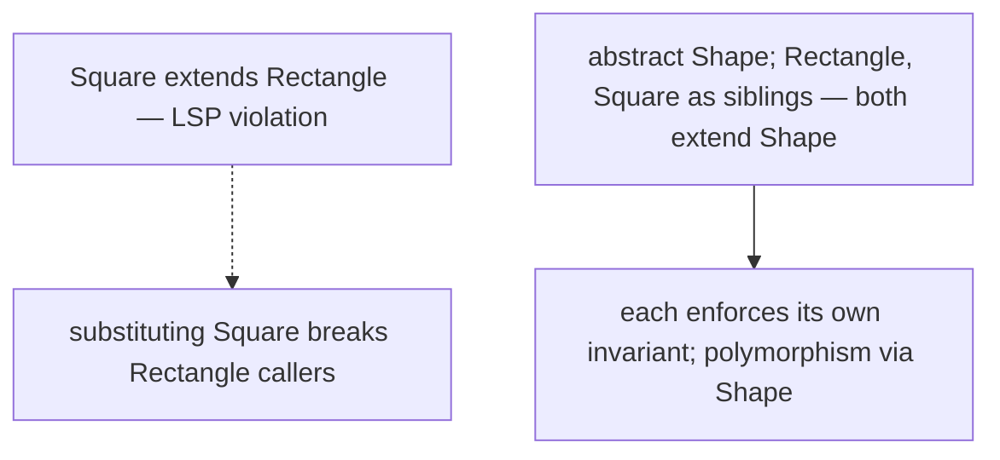

> [!INTERVIEW]
> "What is the Liskov Substitution Principle?" A subtype must be behaviorally substitutable for its supertype — same preconditions or weaker, same postconditions or stronger, invariants preserved, no surprising side effects. Violations compile and run but quietly break callers. The classic example is `Square extends Rectangle`. The fix is usually to rethink the hierarchy as siblings rather than parent/child.

## Polymorphism in Design Patterns

Most "object-oriented design patterns" are recipes for using polymorphism well. Three appearing in nearly every codebase:

### Strategy Pattern

A class delegates a behavior to an interchangeable component (the *strategy*) injected at construction.

```java
interface PricingStrategy { long price(Order o); }
class Standard implements PricingStrategy { ... }
class Loyalty implements PricingStrategy { ... }

class Checkout {
    private final PricingStrategy strategy;
    Checkout(PricingStrategy strategy) { this.strategy = strategy; }
    long total(Order o) { return strategy.price(o); }
}

Checkout c = new Checkout(new Loyalty());   // pick strategy at runtime
```

Polymorphism dispatches `strategy.price(o)` to the right implementation. Add a new pricing scheme by adding a new class — no changes to `Checkout`.

### Template Method Pattern

A parent class defines the skeleton of an algorithm; subclasses override specific steps.

```java
abstract class Game {
    final void play() {
        setup();
        while (!isOver()) takeTurn();
        announceWinner();
    }
    abstract void setup();
    abstract void takeTurn();
    abstract boolean isOver();
    abstract void announceWinner();
}

class Chess extends Game { ... }
class TicTacToe extends Game { ... }
```

The parent's `play()` is `final` (a deliberate use of [T04](./T04-inheritance-and-super.md)'s `final`-prevents-override); subclasses fill in the steps. Polymorphism dispatches each abstract step to the subclass.

### Factory Pattern

A method returns one of several concrete types behind a common parent.

```java
interface Connection { void send(String msg); }
class TcpConnection implements Connection { ... }
class UdpConnection implements Connection { ... }

class ConnectionFactory {
    static Connection create(String protocol) {
        return switch (protocol) {
            case "tcp" -> new TcpConnection();
            case "udp" -> new UdpConnection();
            default    -> throw new IllegalArgumentException();
        };
    }
}
```

Callers receive a `Connection` reference; the actual class is hidden. Polymorphism handles dispatch.

Full pattern coverage is in **L3/C03 Design Patterns & Principles**. The point here: every pattern uses polymorphism as its mechanism. Understanding the dispatch cost helps you reason about pattern performance in hot paths.

## When Compile-Time vs Runtime Matters

| You want… | Use… |
|-----------|------|
| Multiple variants of the same operation on different types | Overloading (compile-time) |
| The same operation across a type hierarchy with subtype-specific bodies | Overriding (runtime) |
| Generic algorithms that work for any type | Generics (compile-time, erasure) |
| Inject behavior at construction without subclassing | Lambdas / functional interfaces (runtime) |
| Type-test then branch on actual class | Pattern `instanceof` / pattern switch (runtime) |

Performance differences are usually negligible compared to design clarity. **Pick the design; let the JIT optimize.** The JIT's devirtualization + inline caching makes runtime polymorphism essentially free in hot paths.

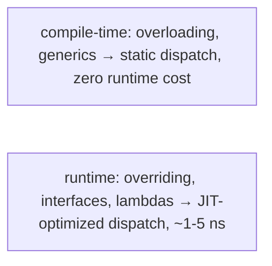

## Deeper JVM Internals — invokedynamic, LambdaMetafactory, and Pattern-Switch Bootstrap

Lambdas, modern `String` concatenation, and pattern-matching `switch` all compile to **`invokedynamic`**. The opcode is unusual: at first execution it runs a **bootstrap method** that returns a **`CallSite`** — a kind of "configurable call target." Subsequent invocations bypass the bootstrap and dispatch directly through the CallSite's target. Understanding this machinery clarifies why lambdas have near-zero overhead, why `String.concat` got faster in Java 9, and how pattern switch achieves O(1) type dispatch.

### The `invokedynamic` Opcode

`invokedynamic` takes two operands in the constant pool:

1. **`BootstrapMethods` index** — references a row in the class's `BootstrapMethods` attribute. The row identifies a static bootstrap method + static arguments.
2. **`NameAndType`** — the dynamic signature the call site presents (e.g., `apply(Object)Object`).

At first execution:
1. The JVM calls the bootstrap method, passing it a `Lookup`, the dynamic name, the dynamic type, and the static arguments.
2. The bootstrap returns a `CallSite`. The CallSite encapsulates a `MethodHandle` — the actual function to call.
3. The JVM **links** the call site to the returned `MethodHandle`; subsequent calls skip the bootstrap and go straight through the handle.

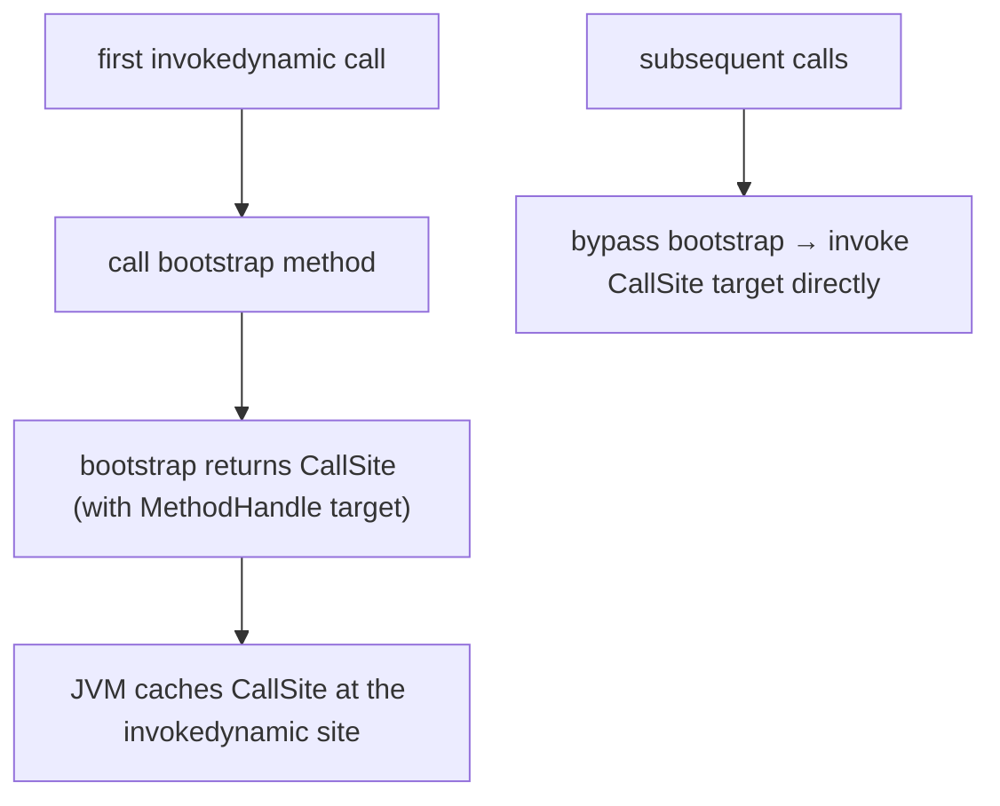

The CallSite types differ:

- **`ConstantCallSite`** — target never changes after bootstrap. Used by lambdas, `String` concat, `switch` typeSwitch. Fastest: JIT can inline through the handle.
- **`MutableCallSite`** — target can be updated atomically. Used for adaptive dispatch (rarely outside JVM-implementation code).
- **`VolatileCallSite`** — like Mutable but with volatile-write semantics on target updates.

### LambdaMetafactory — How a Lambda Becomes a Class

When you write `Function<Integer, Integer> sq = x -> x * x;`, javac emits:

1. A **private static synthetic method** in the enclosing class with the lambda body:
   ```
   private static int lambda$0(Integer x) { return x * x; }
   ```
2. An `invokedynamic` at the lambda's source location with bootstrap = `LambdaMetafactory.metafactory(...)`. Static arguments:
   - The functional interface's `MethodType`: `(Object)Object` (erased).
   - The method handle to `lambda$0`.
   - The instantiated `MethodType`: `(Integer)Integer`.

At runtime, `LambdaMetafactory.metafactory`:

1. Spins a new **class** in memory (using ASM internally) implementing the functional interface. The class is a hidden class (Java 15+) — invisible to reflection by default.
2. The generated class has a single field (for captured state — empty for non-capturing lambdas).
3. The generated class's `apply` method calls `lambda$0` and returns the result.
4. Constructs an instance of the class and wraps it in a `ConstantCallSite`.

```
[generated hidden class — never visible to source]
final class Sq$$Lambda implements Function {
  public Object apply(Object x) {
    return Enclosing.lambda$0((Integer) x);
  }
}
```

`sq.apply(5)` becomes `invokeinterface Function.apply`; the receiver is the generated Sq$$Lambda instance; the method delegates to `lambda$0(5)`.

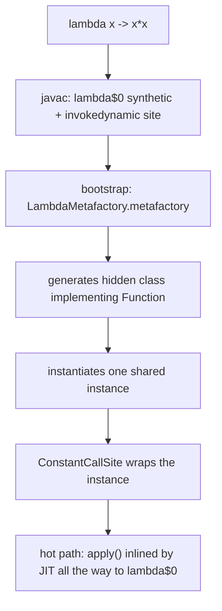

### Non-Capturing Lambdas Are Cached

A **non-capturing** lambda (one that doesn't reference enclosing-method locals) generates **one shared instance** for all calls — the bootstrap caches it. `Function<Integer,Integer> sq = x -> x * x;` placed in a method called a million times produces *one* lambda object, not a million. **Capturing** lambdas (referencing locals or `this`) generate a new instance per invocation of the enclosing method.

```java
void hot() {
    Predicate<Integer> p = i -> i > 0;        // non-capturing — same instance every call
    Predicate<Integer> q = i -> i > limit;     // capturing 'limit' — new instance every call
}
```

The JIT inlines through the CallSite + delegation: with EA, even capturing-lambda instances can be scalar-replaced and never appear on the heap.

### Lambda Body Becomes a Real `private static` Method

The lambda body lives in the enclosing class as a `private static` method with a synthetic name (`lambda$$Lambda$0`, etc.). This means:

- The JIT can compile it independently.
- It can be inlined by the JIT into the generated hidden class's `apply`, which is in turn inlined into the caller — the whole chain collapses.
- The generated hidden class is small (one delegating method), so the JIT inlines it eagerly.

### String Concatenation in Java 9+ — `StringConcatFactory`

Before Java 9, `"a" + b + "c"` compiled to a `StringBuilder` chain at the bytecode level (an allocation + appends + `toString`). Java 9+ instead emits **`invokedynamic`** with `StringConcatFactory.makeConcatWithConstants` as the bootstrap:

```
invokedynamic makeConcatWithConstants ("ac", b)  // recipe string + args
```

The bootstrap generates a method handle that produces the final `String` directly — typically a single `byte[]` allocation sized to the exact result length, no intermediate `StringBuilder`. The JIT inlines the handle into the call site.

The recipe string encodes the constant parts; `` is the "argument placeholder" character. The bootstrap reads the recipe, figures out the total length, allocates, copies, returns. Result: ~2x faster than the pre-9 StringBuilder chain for typical concatenation.

### Pattern Switch — `SwitchBootstraps.typeSwitch`

Java 21+ pattern switches (`switch (shape) { case Circle c -> ...; case Square s -> ...; }`) compile to `invokedynamic` with `SwitchBootstraps.typeSwitch` as the bootstrap. Static arguments: the list of case classes.

The bootstrap returns a `MethodHandle` that takes the scrutinee and a "start case index" and returns the matching case's index. The switch compiles to a tight loop:

```
case_index = SwitchBootstraps.typeSwitch_call(scrutinee, 0)
switch (case_index) {
  case 0: Circle c = (Circle) scrutinee; // user body
  case 1: Square s = (Square) scrutinee; // user body
  ...
}
```

The bootstrap-generated handle uses an O(1) hash-based dispatch (with fallback to linear scan for small case lists). The JIT specializes the handle: for sealed types with a closed set of cases, it can emit a perfect `tableswitch` after a klass-pointer load.

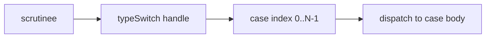

The result: pattern switches are as fast as if/else-if chains for small N, and much faster for large N because of O(1) hash dispatch.

### Generic Erasure — Bridge Methods Across Implementations

A subtle interaction with overriding: when a generic interface is implemented with a specific type, javac generates bridge methods to make the vtable/itable line up.

```java
interface Container<T> { void put(T value); }
class StringContainer implements Container<String> {
    @Override public void put(String value) { ... }
}
```

After erasure, the interface declares `void put(Object)`. `StringContainer.put` has descriptor `(Ljava/lang/String;)V`. To make the itable slot resolve correctly when called through `Container`, javac generates a bridge:

```
[StringContainer bytecode]
public void put(java.lang.String);     // user-written
  flags: ACC_PUBLIC

public void put(java.lang.Object);     // synthetic bridge
  flags: ACC_PUBLIC, ACC_BRIDGE, ACC_SYNTHETIC
  Code:
    aload_0
    aload_1
    checkcast java/lang/String
    invokevirtual put:(Ljava/lang/String;)V
    return
```

The bridge populates the `put(Object)` itable slot; it casts and delegates to the typed `put(String)`. This is what makes `Container<String> c = new StringContainer(); c.put("x")` work — the `invokeinterface` dispatches to the bridge, which casts and calls the real method.

The bridge introduces a `checkcast` per call. In hot code the JIT eliminates it (the receiver type is known at the inlined site), but the cost shows up at megamorphic sites.

### Pattern-Switch SwitchBootstraps Internals — Hash Table

For pattern switches over many case types, `SwitchBootstraps.typeSwitch` builds a **perfect-hash table** internally:

1. At bootstrap time, hash each case class's identity hash code.
2. Find a small modulus that maps each case class to a unique bucket.
3. Generate a method handle that hashes the scrutinee's class, looks up the bucket, checks the class, returns the case index.

Lookup cost: ~3–5 cycles for the hash + bucket load + class compare. Comparable to a tight `tableswitch` for `int`. For sealed types the bootstrap is even smarter — it generates a direct branch table since the set of permitted classes is closed and known at bootstrap time.

### Lambda Dispatch Total Cost — Concrete

A non-capturing lambda's hot-path call site, after JIT warm-up, looks (in pseudo-x86):

```
mov   r10, [rip + lambda_instance_ptr]   ; load cached instance (1 cycle, L1)
mov   r11, [r10 + klass_offset]          ; load klass (1 cycle)
cmp   r11, GeneratedLambdaKlass          ; type check (1 cycle)
jne   ic_miss                            ; rarely taken
; --- inlined lambda body ---
imul  edi, edi                           ; x * x — 3 cycles
mov   eax, edi
; --- end inline ---
; total: ~6 cycles ≈ 2 ns
```

This is the realization of "lambdas are free": after warm-up the inline cache hits and the body is inlined; the lambda's existence as a CallSite + generated class is essentially invisible to runtime cost. The cost of `invokedynamic` is paid once, at first call, when the bootstrap runs.

## Common Mistakes

> [!WARNING]
> **Mixing overloading and overriding in one mental model.** Overloading happens within one class with different signatures; overriding happens across classes with the same signature. They have different dispatch and different rules.

> [!WARNING]
> **LSP violations passing silent type checks.** `Square extends Rectangle` compiles and runs; the failure is only at the behavioral contract. Tests against the parent's interface, not the subclass.

> [!WARNING]
> **Downcasting without `instanceof`.** `(Dog) animal` without checking is a `ClassCastException` waiting to happen. Use pattern-binding `instanceof`.

> [!WARNING]
> **Optimizing dispatch in non-hot code.** Choosing `final class` because "it's faster" rather than "it's design-correct" misallocates effort. Trust the JIT; tune the design.

> [!WARNING]
> **Using inheritance where composition fits.** Most "use polymorphism" advice should be "use composition with a strategy interface." Inheritance carries baggage (vtable layout, fragile base class); composition is cleaner.

> [!WARNING]
> **Forgetting generics are erased.** `List<String>` and `List<Integer>` are the *same runtime type*. `instanceof List<String>` doesn't compile; only `instanceof List` does.

> [!INTERVIEW]
> Common interview questions:
> 1. **What are the kinds of polymorphism in Java?** Ad-hoc (overloading), subtype (overriding + interfaces), parametric (generics), functional (lambdas via `invokedynamic`).
> 2. **What's the difference between compile-time and runtime polymorphism?** Compile-time: the compiler picks; static dispatch; overloading and generics. Runtime: the JVM picks based on the runtime object's type; dynamic dispatch; overriding, interfaces, lambdas.
> 3. **What's the Liskov Substitution Principle?** Subtype must be behaviorally substitutable; preserves preconditions (or weakens), postconditions (or strengthens), invariants. The Square-Rectangle classic violates it.
> 4. **What opcode does a lambda compile to?** `invokedynamic`, with a bootstrap to `LambdaMetafactory`. After bootstrap, dispatch is `invokevirtual` on the generated class.
> 5. **Why is interface dispatch slightly slower than virtual dispatch?** A class has one vtable but possibly multiple itables (one per implemented interface); `invokeinterface` may need to search the itable list before indexing. JIT inline caches narrow the gap.
> 6. **Why does Java use type erasure for generics?** Backward compatibility with pre-generics code. Trade-off: zero per-T runtime cost; loss of reified type information.
> 7. **What's the cost of polymorphism in hot code?** Near zero in monomorphic/bimorphic cases via JIT devirtualization + inline caching; ~3–7 ns in megamorphic cases.
> 8. **What's safe alternative to a raw downcast?** Pattern-binding `instanceof` (Java 16+): `if (a instanceof Dog d) { ... }` — test and bind in one expression with no exception path.
> 9. **Which patterns use polymorphism?** Almost all OOP patterns: Strategy (delegate to interface), Template Method (parent skeleton + subclass overrides), Factory (return common parent), Visitor (double dispatch), Observer (interface callbacks), Command (interface execute).
> 10. **What's parametric polymorphism in Java?** Generics — the type parameter T lets the same code work for any reference type, type-checked at compile time, erased at runtime.
> 11. **Why is `final class String` not a problem for polymorphism?** Polymorphism doesn't require subclassing every type; `String` is value-like, not behavior-like. `final` enables JIT inlining + monomorphic dispatch on every call.
> 12. **What's the performance impact of `instanceof` chains?** Modern JIT handles them well; pattern switch over a sealed type compiles to `invokedynamic SwitchBootstraps.typeSwitch` which is JIT-friendly.

## Practice

1. **Compile-time pick.** Declare `class Logger { void log(int n) { ... } void log(String s) { ... } }`. Call `log(42)`. Use `javap -c` to verify the bytecode picked `log(I)V` at compile time.

2. **Runtime pick.** Declare `Animal a = new Dog()` with `Dog` overriding `sound()`. Call `a.sound()`. Use `javap -c` to verify `invokevirtual Animal.sound:()V` is emitted (the symbolic reference is to `Animal`'s method; the runtime resolves to `Dog`'s body).

3. **Generics + erasure.** Declare `List<String> ls = new ArrayList<>()`. Run `ls.getClass().getName()`. Verify it prints `java.util.ArrayList`, not anything with `String` in it. Confirm erasure.

4. **Lambda bootstrap.** Write a lambda `Function<Integer, Integer> sq = x -> x * x;`. Use `javap -v` on the enclosing class; find the `invokedynamic` instruction and the `BootstrapMethods` attribute referencing `LambdaMetafactory.metafactory`.

5. **Dispatch cost benchmark.** Build a hot loop calling four versions of "do thing" — `static`, virtual on `final class`, virtual on non-final class with monomorphic site, virtual on megamorphic site. Measure throughput. Confirm the ordering.

6. **Square-Rectangle violation.** Implement `Square extends Rectangle` per the example in this topic. Write code that doubles width and asserts height unchanged. Pass a `Square`; observe failure. Refactor: make `Shape` abstract with `Rectangle` and `Square` as siblings.

7. **Pattern-binding `instanceof`.** Convert old-style `if (a instanceof Dog) { Dog d = (Dog) a; d.bark(); }` to `if (a instanceof Dog d) { d.bark(); }`. Confirm same semantics; shorter code.

8. **Pattern switch over sealed hierarchy.** Define `sealed interface Shape permits Circle, Square, Triangle`; implement each. Write a switch over `Shape` computing area. Verify exhaustiveness (remove a case; observe compile error).

9. **Interface dispatch via itable.** Implement two interfaces on the same class. Use SA (`jhsdb hsdb`) or jol-cli to dump the itables. Confirm separate itable per interface.

10. **`invokeinterface` vs `invokevirtual` cost.** Build a class with both a virtual method and an interface method that do the same work. Hot-loop both. Measure. Confirm interface is ~1–2 ns slower in megamorphic cases.

11. **Strategy pattern.** Refactor a class with an `if/else` on type into a Strategy: extract an interface, three implementations, inject at construction. Verify behavior unchanged; add a fourth strategy and confirm no change to the consumer.

12. **Template Method.** Build an abstract `Game` with `play()` that calls abstract steps. Implement Chess and TicTacToe. Mark `play()` `final` so subclasses can't override the algorithm. Verify the skeleton runs but each subclass fills the steps.

13. **Factory pattern + polymorphism.** Implement `ConnectionFactory.create(String protocol)` returning `Connection`. Add a third protocol (e.g., "ws"). Verify only the factory changes; callers receive the new connection type by polymorphism.

14. **Devirtualization observation.** Hot-loop a virtual call where only one subclass is ever passed. Use `-XX:+PrintInlining`. Observe the JIT inlines the body. Add a second subclass during steady state; observe deopt.

15. **End-to-end explain-it-back.** Take `Function<Integer, Integer> sq = x -> x * x; int r = sq.apply(5);`. Trace through: (a) compile time: `sq` declared with target type `Function<Integer, Integer>`; lambda body captured as a method handle; (b) `invokedynamic LambdaMetafactory.metafactory` at the `sq` assignment site; (c) first call: bootstrap generates an implementing class, caches it; (d) `sq.apply(5)` compiles to `invokeinterface Function.apply:(Ljava/lang/Object;)Ljava/lang/Object;`; (e) at runtime, calls the generated class's `apply` which invokes the lambda body; (f) JIT inlines bootstrap + generated class + body into the caller. Twelve sentences max.

## Recap

You should now be able to:

**Language layer.**

- Distinguish the four flavors of polymorphism (overloading, overriding, generics, functional dispatch) and which are compile-time vs runtime.
- Apply method overloading (compile-time pick by parameter types) versus method overriding (runtime pick by object class).
- Use generics for parametric polymorphism, understanding that type erasure removes T at runtime.
- Use lambdas / functional interfaces for behavior injection at runtime.
- Apply pattern-binding `instanceof` and pattern switch as the safe alternative to raw downcasts.
- State the Liskov Substitution Principle and recognize violations.
- Recognize how design patterns (Strategy, Template Method, Factory) use polymorphism as their mechanism.

**Memory layer.**

- Identify the five `invoke*` opcodes and their dispatch styles: `invokestatic` and `invokespecial` (static), `invokevirtual` (vtable), `invokeinterface` (itable), `invokedynamic` (bootstrap + cache).
- Explain the itable structure for a class implementing multiple interfaces.
- Explain how `invokedynamic` + LambdaMetafactory implements lambda dispatch.
- Identify bridge methods generated for covariant return + generic erasure.

**Architecture layer.**

- Quantify dispatch costs across the five invocation modes: ~1 ns static, ~1–5 ns virtual, ~1–7 ns interface, ~1 ns inlined dynamic.
- Explain how the JIT applies inline caches + CHA + devirtualization to all dynamic-dispatch flavors.
- Recognize that in hot code, polymorphism is effectively free — design clarity matters more than dispatch type.
- Apply "shallow hierarchies + composition" as the design rule for hot code.
- Recognize when interface dispatch may show up as ~1–2 ns slower than virtual in megamorphic-heavy benchmarks.

Polymorphism is the **engine** of OOP code reuse and extensibility. The next two topics — [T07 Abstraction & abstract classes](./T07-abstraction-and-abstract-classes.md) and [T08 Interfaces](./T08-interfaces-default-static-private-methods.md) — give the two language constructs that let you *declare* polymorphic types: `abstract` classes (partial implementations) and `interface` types (pure contracts with optional defaults).

## Next

Continue to [Abstraction & abstract classes](./T07-abstraction-and-abstract-classes.md) — the partial-implementation classes that cannot themselves be instantiated but provide a shared base for concrete subclasses. We've used `Animal`/`Dog` informally; T07 makes `Animal` formally `abstract`, with `abstract void sound()` that subclasses *must* implement.
