# Abstraction & abstract classes

An **abstract class** is a class that declares *what* its instances must be able to do without specifying *how* — at least not for every operation. It can declare **`abstract` methods** that have no body; any concrete subclass must implement them. It can also have **regular concrete methods** (with bodies) and **fields** (state) shared by every subclass. The keyword **`abstract`** is the language's way of saying "this type is incomplete — it exists only to be subclassed." `new SomeAbstract()` is a compile error. The mechanism formalises the **Template Method** pattern: a parent class defines the skeleton of an algorithm in concrete methods, leaving each varying step as an `abstract` method for subclasses to fill in.

The depth bar isn't "you can't instantiate it." An abstract class compiles to a normal `.class` file with the **`ACC_ABSTRACT` (0x0400)** flag set on its class entry; each abstract method has the same flag set on its method entry, **no `Code` attribute** (no bytecode body), and no implementation. The JVM verifier rejects any `new` opcode that targets an abstract class — that's where the compile-error promise becomes a runtime promise too. The vtable still has entries for every abstract method; those entries point to a runtime stub that throws **`AbstractMethodError`** if reached. In practice that stub is never reached because the concrete subclass *replaces* the slot with a real implementation; AbstractMethodError shows up only when a class is recompiled in a way that leaves an abstract method un-implemented at link time. Abstract classes have **constructors** that run during subclass instantiation (the `super(...)` chain from [T02](./T02-fields-methods-constructors-this.md)) — you just cannot invoke them directly via `new`. **At the architecture layer**, abstract methods participate in normal `invokevirtual` dispatch and benefit from the same JIT inlining + CHA + inline caching as concrete methods ([T05](./T05-method-overriding.md)); there is no per-call cost penalty for abstraction.

> [!NOTE]
> Prerequisites: [Inheritance & super](./T04-inheritance-and-super.md) (`L1/C01/T04`) — vtable layout, single inheritance, `super(...)`; [Method overriding](./T05-method-overriding.md) (`L1/C01/T05`) — vtable slot replacement, `invokevirtual`, override rules; [Polymorphism](./T06-polymorphism-compile-time-vs-runtime.md) (`L1/C01/T06`) — dispatch flavors, Template Method preview; [Fields, methods, constructors, this](./T02-fields-methods-constructors-this.md) (`L1/C01/T02`) — `<init>` chain, definite assignment; [Classes & objects](./T01-classes-and-objects.md) (`L1/C01/T01`) — heap layout, header.

## What Abstraction Means

In the procedural style ([T01](./T01-classes-and-objects.md)'s recap), every method has a body. In OOP, sometimes you want to declare *that* a method exists on a family of types without choosing *what* it does — leaving "what" up to each concrete type. That's **abstraction**: separating *interface* (the signature) from *implementation* (the body).

Java has two language-level abstraction tools:

- **Abstract classes** (this topic) — can have state (fields), constructors, and a mix of concrete and abstract methods. A class may extend **only one** abstract class.
- **Interfaces** ([T08](./T08-interfaces-default-static-private-methods.md)) — historically pure contracts (Java 8+ allowed default methods and Java 9+ private methods); never store state. A class may implement **many** interfaces.

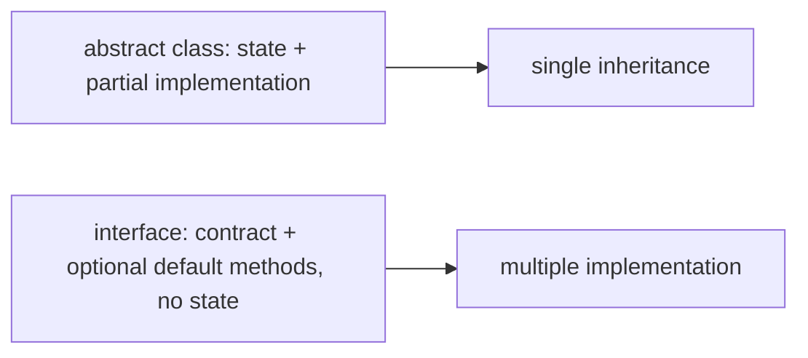

When a base type has **shared state** plus **fixed behavior that uses the state** plus **variation points the subclass picks**, an abstract class is the right tool. When the type is a **pure contract** with no shared state, an interface is. Modern Java often favors interfaces with default methods for shared behavior — but abstract classes still earn their place when the shared state is real.

## Declaring an Abstract Class

The `abstract` modifier on a class declaration:

```java
public abstract class Shape {
    protected String name;            // shared state

    protected Shape(String name) {    // constructor — yes, even abstract classes have them
        this.name = name;
    }

    public abstract double area();    // abstract method — no body

    public String describe() {        // concrete method using shared state + the abstract one
        return name + " of area " + area();
    }
}
```

Three observations:

1. **`new Shape("foo")` is a compile error.** The class is incomplete.
2. **`Shape` has a constructor.** It runs via `super(...)` from concrete subclasses; you just cannot invoke it as the target of a `new`.
3. **`Shape.area()` has no body — just a semicolon.** Every concrete subclass *must* implement it; otherwise the subclass is itself abstract.

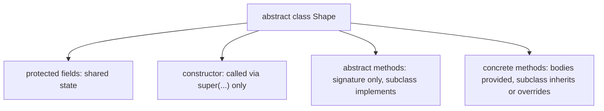

### Concrete Subclass Must Implement Every Abstract Method

```java
public class Circle extends Shape {
    private final double radius;
    public Circle(String name, double radius) {
        super(name);
        this.radius = radius;
    }
    @Override
    public double area() { return Math.PI * radius * radius; }
}

public class Square extends Shape {
    private final double side;
    public Square(String name, double side) {
        super(name);
        this.side = side;
    }
    @Override
    public double area() { return side * side; }
}
```

If `Circle` forgot to implement `area()`, the compiler would either reject `Circle` (if it tried to be concrete) or force it to itself be declared `abstract`. The rule: **a concrete class has zero abstract methods anywhere in its inheritance chain**.

### Abstract Method Syntax

```java
public abstract double area();
```

The `abstract` modifier plus a semicolon in place of a body. Implicit incompatibilities at the language level:

- `abstract` + `private` — incompatible (private isn't inherited; nothing can override it).
- `abstract` + `static` — incompatible (static methods aren't virtual; nothing to override).
- `abstract` + `final` — incompatible (final means no override; abstract requires override).
- `abstract` + `synchronized` — incompatible at the method level (you can override and add `synchronized`, but the abstract declaration itself can't claim synchronization without a body).

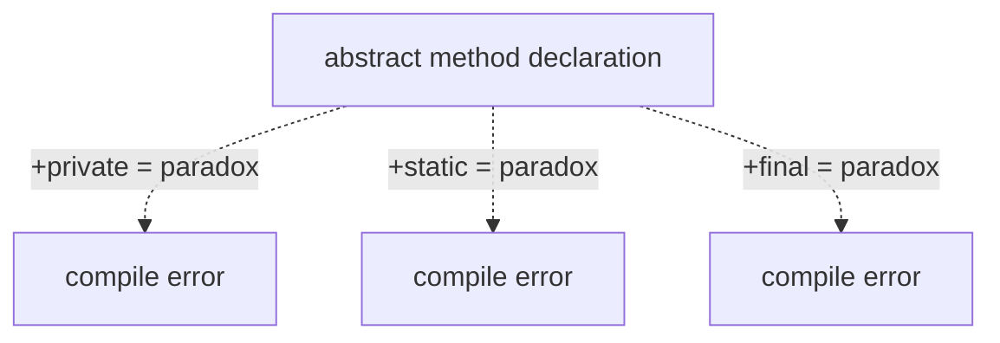

### A Class with Any Abstract Method Is Itself Abstract

Even one abstract method makes the whole class abstract. The `abstract` keyword on the class is *required* in that case — javac doesn't infer it.

```java
class Half {                       // COMPILE ERROR: class must be abstract
    abstract void foo();           // because it has an abstract method
}
abstract class Whole {             // OK
    abstract void foo();
}
```

### Abstract Class with No Abstract Methods Is Legal

You can declare an abstract class with *only* concrete methods. The class is non-instantiable but otherwise complete. This is rare but useful for **frameworks**: a class that's not meant to be created directly even though it has no missing methods (the caller should use a factory or builder).

```java
public abstract class Connection {   // legal — abstract but no abstract methods
    public void send(String msg) { ... }
    public void close() { ... }
}
```

Typically a `private` constructor accomplishes the same goal more clearly ([T03](./T03-encapsulation-and-access-modifiers.md)).

## Constructors in Abstract Classes

An abstract class can — and usually should — have constructors. They run via the `super(...)` chain from concrete subclasses ([T02](./T02-fields-methods-constructors-this.md) callback), initializing whatever state the abstract class declares.

```java
abstract class Vehicle {
    protected final String vin;
    protected Vehicle(String vin) {     // protected constructor — only subclasses
        if (vin == null || vin.length() != 17)
            throw new IllegalArgumentException("VIN must be 17 chars");
        this.vin = vin;
    }
}

class Truck extends Vehicle {
    Truck(String vin) {
        super(vin);                      // calls Vehicle's constructor
    }
}

new Vehicle("...");   // COMPILE ERROR: cannot instantiate abstract Vehicle
new Truck("...");     // OK — runs Truck.<init>, which runs Vehicle.<init>
```

The constructor validates the invariant ("17 characters"); every concrete subclass benefits without repeating the check. This is one of the strongest reasons to use abstract classes over interfaces: **abstract classes can run validation logic for shared invariants**.

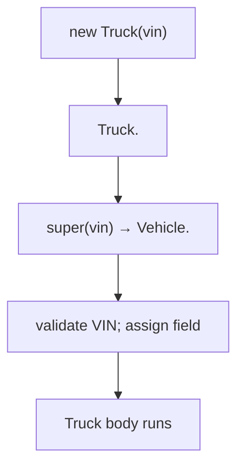

## The Template Method Pattern

The classic use of abstract classes: a concrete method orchestrates an algorithm by calling abstract methods that the subclass fills in.

```java
public abstract class HttpRequestHandler {
    public final void handle(HttpRequest req, HttpResponse resp) {
        Authentication auth = authenticate(req);
        if (auth == null) {
            resp.setStatus(401);
            return;
        }
        if (!authorize(auth, req)) {
            resp.setStatus(403);
            return;
        }
        Object result = process(auth, req);
        respond(resp, result);
    }

    protected abstract Authentication authenticate(HttpRequest req);
    protected abstract boolean authorize(Authentication auth, HttpRequest req);
    protected abstract Object process(Authentication auth, HttpRequest req);
    protected abstract void respond(HttpResponse resp, Object result);
}

class AdminHandler extends HttpRequestHandler {
    @Override protected Authentication authenticate(HttpRequest req) { ... }
    @Override protected boolean authorize(Authentication a, HttpRequest r) { ... }
    @Override protected Object process(Authentication a, HttpRequest r) { ... }
    @Override protected void respond(HttpResponse r, Object result) { ... }
}
```

Key elements:

- **`handle()` is `final`** — subclasses cannot override the orchestration; only the steps.
- **Each step is `abstract`** — every concrete subclass *must* provide its own.
- **The parent owns the algorithm**; the children own the variations.

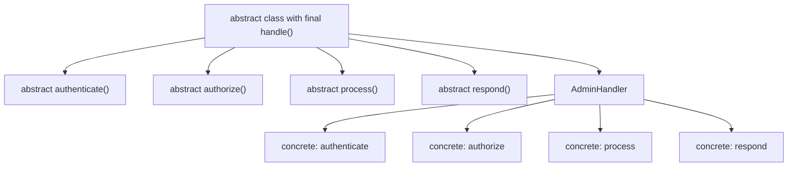

The pattern is named because the parent provides a *template* and the subclass fills in the *details*. It's the dominant use of abstract classes in JDK and Spring code — `HttpServlet`, `AbstractList`, `InputStream` are all template-method bases.

> [!INTERVIEW]
> "When should you use an abstract class vs an interface?" Abstract class when (a) shared state matters, (b) shared partial implementation reduces duplication, (c) a constructor enforces invariants, (d) only one parent in the chain is wanted. Interface when (a) the type is a contract with no state, (b) multiple types should be implementable, (c) default methods cover any shared behavior. Modern Java often prefers interfaces with default methods unless state is genuinely shared.

## Abstract Class vs Interface — The Practical Guide

| Property | Abstract class | Interface |
|----------|----------------|-----------|
| Fields | Instance fields allowed | Only `public static final` constants |
| Constructors | Yes; called via `super(...)` | No |
| Method bodies | Concrete or abstract | `default`, `static`, `private` (Java 9+) — all bodies; or pure abstract |
| Instantiable directly | No | No (but lambdas can target single-abstract-method interfaces) |
| How many can a class have? | Extend exactly **one** | Implement **many** |
| Modifier on members | All four access levels | Implicitly `public abstract` (for abstract methods) or `public` (defaults) |
| Inheritance kind | State + behavior | Behavior only |

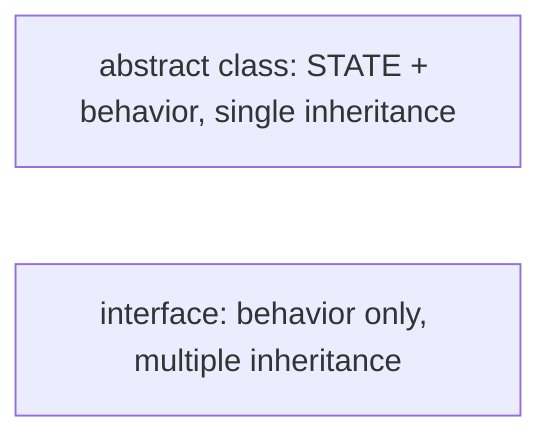

A common modern design: a `public interface Service` declares the contract; a `public abstract class AbstractService implements Service` provides shared state + a Template Method; concrete subclasses extend `AbstractService` for inheritance, or directly implement `Service` if no shared state is needed.

## Memory Layer — `ACC_ABSTRACT` and Method Stubs

An abstract class compiles to a normal `.class` file with two distinguishing markers:

1. **Class entry has `ACC_ABSTRACT = 0x0400`** in its `access_flags`.
2. **Each abstract method's `method_info` entry has `ACC_ABSTRACT = 0x0400`** and **no `Code` attribute** (no bytecode body).

```
public abstract class Shape {
  // class access_flags: ACC_PUBLIC | ACC_SUPER | ACC_ABSTRACT = 0x0421

  public abstract double area();
  // method access_flags: ACC_PUBLIC | ACC_ABSTRACT = 0x0401
  // no Code attribute — no bytecode for area
}
```

You can verify with `javap -v`:

```
public abstract class Shape
  flags: (0x0421) ACC_PUBLIC, ACC_SUPER, ACC_ABSTRACT

  public abstract double area();
    descriptor: ()D
    flags: (0x0401) ACC_PUBLIC, ACC_ABSTRACT
```

### The `new` Compile-Time Block

When javac sees `new Shape("foo")`, it checks the target class's `access_flags`. If `ACC_ABSTRACT` is set, it rejects the expression with "Shape is abstract; cannot be instantiated." The JVM verifier performs the same check at load time — `new` opcode targeting an abstract class is rejected with `InstantiationError`. The block is enforced at both layers.

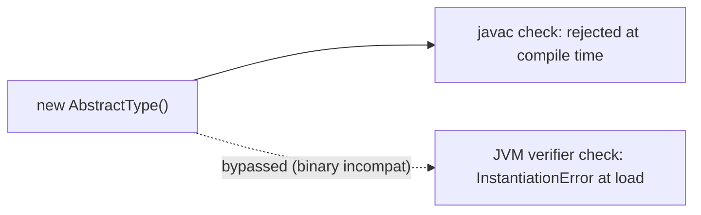

### Vtable Slots for Abstract Methods

Even an abstract class has a vtable — built when the class loads. Slots for abstract methods point to a runtime stub that throws `AbstractMethodError` if invoked.

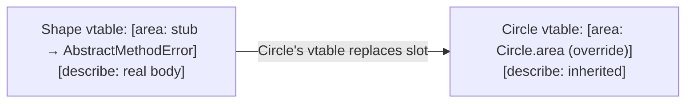

You almost never *see* `AbstractMethodError` in practice because the language ensures every concrete class implements all abstract methods. The error appears only in **binary-incompatibility scenarios**: you compile `Circle` against `Shape` v1 (without `circumference()`), then run it with `Shape` v2 (with `abstract circumference()`). The `Circle` class file has no `circumference` slot replacement; runtime dispatch hits the stub; `AbstractMethodError` fires.

### Where the AbstractMethodError Stub Physically Lives

The runtime stub `SharedRuntime::throw_AbstractMethodError` is a **single C++ function compiled into `libjvm.so`** (or `jvm.dll` on Windows). It lives at a fixed address inside the JVM's read-execute pages — outside the Java heap, outside the Code Cache, in the JVM's own native code section.

The address of this stub is determined at JVM startup (whenever `libjvm.so` is loaded — typically at process start, address-space-layout-randomized by the OS). HotSpot resolves the stub's address once and **stores 8-byte function pointers to it in every abstract method's vtable slot** when the abstract class loads.

For `abstract class Shape { abstract double area(); }` after class loading:

```
Klass(Shape) memory layout:
  ...
  +168:  vtable[0]  = ptr_to_Object.equals
  +176:  vtable[1]  = ptr_to_Object.hashCode
  ...
  +208:  vtable[5]  = ptr_to_throw_AbstractMethodError_stub   ← here!
  ...
```

That single 8-byte slot is the entire physical residence of the abstract method "at runtime." There's no body in Metaspace, no `Code` attribute, no allocated function — just a pointer to a shared error-throwing stub. Memory cost per abstract method: **8 bytes** (the vtable slot pointer).

When `Circle extends Shape` loads with `Circle.area()` implementing the abstract:

```
Klass(Circle) memory layout:
  ...
  +208:  vtable[5]  = ptr_to_Circle_area_compiled_code   ← replaced!
  ...
```

The vtable slot's 8 bytes are overwritten with the address of Circle.area's `_from_compiled_entry`. The error stub is bypassed entirely. **Memory cost of overriding: 0 bytes** (the slot already existed; only its contents changed).

### Cycle-Level Trace of an AbstractMethodError Dispatch

If an abstract method *did* somehow get reached (binary incompat scenario):

```
; Normal invokevirtual sequence — receiver in rdi
mov   r10d, [rdi + 8]              ; ~4 cycles — load klass ptr
shl   r10, 3
mov   r11, [r10 + 208]             ; ~4 cycles — load vtable slot (= AME stub address)
call  r11                          ; jump to throw_AbstractMethodError

; Inside the stub (in libjvm.so):
; ~50 cycles of error-construction code
; build Throwable, populate message, set stack trace
; raise via JVM's exception machinery
; control transfers to the nearest catch or thread death
```

Total cost: ~10–20 cycles to *reach* the stub, then ~hundreds-of-thousands of cycles for the exception machinery (stack walking, message construction). The performance cost of AME is dominated by the exception itself, not the abstract-dispatch part.

### Concrete-Class Completeness Verification Cost

When `Circle` (concrete, no `ACC_ABSTRACT` in class flags) loads, the verifier must confirm every abstract method in Circle's parent chain is overridden. Algorithm:

1. Build the set of all abstract methods from Circle's parents (walk `_super` chain).
2. For each abstract method, walk Circle's `methods[]` table looking for a matching signature.
3. If any is missing, throw `AbstractMethodError` at link time.

For a class with 100 inherited abstract methods (rare but possible in deep ORM hierarchies), this is 100 method-table walks. Each walk is O(methods in class) — typically 20–50. Total cost: ~5,000 hashmap-like lookups per class load = ~50 µs per class. Negligible per class; meaningful when an app loads tens of thousands of classes at startup.

## Architecture Layer — Dispatch Through Abstraction

Abstract methods participate in **exactly the same dispatch machinery** as concrete methods. A call site `shape.area()` compiles to `invokevirtual Shape.area:()D`; at runtime, the receiver's klass pointer leads to the concrete subclass's vtable slot, which holds the overriding implementation. **There is no per-call cost penalty for abstraction.**

The JIT applies:

- **Class Hierarchy Analysis (CHA)** ([T05](./T05-method-overriding.md)) — if only one concrete subclass has loaded, the JIT inlines its implementation under that assumption with a deopt guard.
- **Inline caching** — monomorphic and bimorphic sites get type-check + direct inlined body; megamorphic sites fall back to vtable.
- **Devirtualization** — `final` on the concrete subclass makes the method monomorphic in its slot.

The Template Method pattern combines well with the JIT: the `final` orchestrator inlines into callers; the abstract steps get inlined per concrete subclass; in a hot path the entire algorithm collapses to a flat sequence of operations.

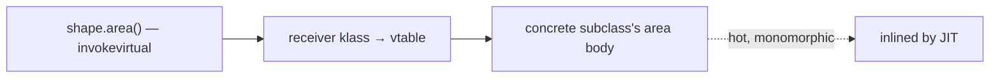

## When NOT to Use Abstract Classes

Common over-uses:

- **As a way to dump shared utility methods without a real IS-A relationship.** That's a static utility class job, not an abstract class.
- **As a placeholder type that nothing actually subclasses uniformly.** Better: an interface.
- **As a way to fake multiple inheritance.** Java only has single class inheritance; if you find yourself wanting two parents, refactor to interfaces with default methods.
- **For pure-data types.** Use records or simple classes — abstraction has no value for value-like types.

Modern Java codebases often skip abstract classes entirely, preferring interfaces with default methods + composition. Abstract classes still win for shared state with invariants — but the bar is higher than it was in pre-Java-8 code.

## Deeper JVM Internals — Abstract Method Stubs, Verifier Checks, and Miranda Methods

Abstract classes look like a language-level concept, but their implementation reaches deep into HotSpot's class-loading, verification, and dispatch machinery. This section covers the **AbstractMethodError stub** in HotSpot, the **`InstantiationError` vs `InstantiationException`** distinction, how the JVM's **`new` opcode verification** rejects abstract types, and the rarely-discussed **Miranda methods** — JVM-synthesized abstract methods that fill missing itable slots.

### The AbstractMethodError Stub

When an abstract class's Klass is built, every abstract method's vtable slot gets a pointer to a special HotSpot routine: **`SharedRuntime::throw_AbstractMethodError`**. Its only job: throw `AbstractMethodError` with a useful message. In native pseudo-code:

```
throw_AbstractMethodError:
  prepare a Throwable
  message = "Method <class>.<method><signature> is abstract"
  raise AbstractMethodError(message)
  // returns to nearest exception handler
```

This stub address sits in every abstract method's vtable slot until a concrete subclass replaces it. The pointer is part of the Klass's vtable; subclass linking ([T04 deeper section](./T04-inheritance-and-super.md#deeper-jvm-internals--subtype-checks-vtable-construction-and-subclass-linking)) replaces it with the concrete override.

If you ever see `AbstractMethodError` at runtime, it means dispatch reached this stub. Two paths produce that:

1. **Binary incompatibility.** Caller compiled against an older version where the method was concrete; runtime has a newer version that's abstract. Caller's bytecode targets the slot; runtime stub fires.
2. **Reflection or Unsafe.** Someone bypassed the verifier (e.g., `Unsafe.allocateInstance(AbstractClass.class)` produces an instance whose vtable slots haven't been overridden). Calling a method on such an instance hits the stub.

`-XX:+ShowCodeDetailsInExceptionMessages` makes the message specify which method and class — invaluable for debugging.

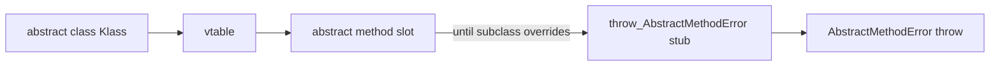

### The `new` Opcode Verification

When the JVM verifier processes a method's bytecode and encounters `new SomeClass`, it does:

1. Resolve `SomeClass` (load if needed).
2. Read the resolved Klass's `access_flags`.
3. **Reject if `ACC_ABSTRACT` is set** with **`InstantiationError`** (LinkageError subclass).

This is a **link-time** check — the method containing the bad `new` instruction fails to verify and the JVM throws `InstantiationError` before the bytecode runs at all. The link-time check is what makes "you can't `new` an abstract class" a JVM-level guarantee, not just a javac guarantee.

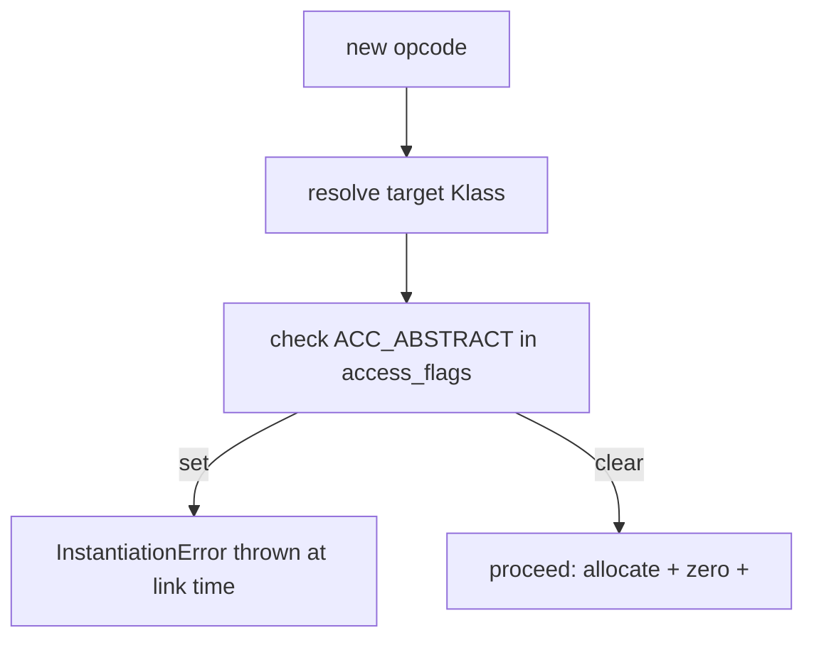

**Distinguishing the three "cannot instantiate" errors:**

| Error/Exception | Trigger |
|-----------------|---------|
| `InstantiationError` (LinkageError) | bytecode `new` on abstract type, caught at link time |
| `InstantiationException` (checked Exception) | reflection: `Class.newInstance()` on abstract or interface |
| `IllegalAccessException` | reflection: constructor not accessible |

### Abstract Class `<init>` Is Still Called

Abstract classes have `<init>` methods, and they **run** during concrete-subclass instantiation via the `super(...)` chain. The verifier doesn't reject `invokespecial AbstractClass.<init>` — only the `new` opcode targeting the abstract class. So:

```java
abstract class Vehicle {
    Vehicle(String vin) { ... }   // <init> exists and is invokable via super()
}
class Truck extends Vehicle {
    Truck(String vin) { super(vin); }   // OK — runs Vehicle.<init>
}

new Vehicle("xxx");   // VERIFIER REJECTS: new on abstract class
new Truck("xxx");     // OK: new on concrete Truck; Truck.<init> runs Vehicle.<init>
```

The abstract `<init>` is identical in bytecode to a concrete `<init>` — same opcode, same field initializations, same `super` chain. The only restriction is on the **`new` opcode**, not on `<init>` itself.

This is also why **`Unsafe.allocateInstance(AbstractClass.class)`** returns a half-constructed abstract instance: it bypasses the `new` verifier check and doesn't run any `<init>`. The fields are zeroed (the allocator's job); but the vtable still has the abstract-method stubs in unfilled slots. Calling any abstract method on the instance hits the stub.

### Miranda Methods — JVM-Synthesized Slots

This is a deep corner of the JVM. When an abstract class **implements** an interface but **does not declare** the interface's methods, the JVM synthesizes **Miranda methods** to fill the itable slots. (Named after the Miranda warning — "if you cannot afford a method, one will be provided for you.")

```java
interface Greeter { void hello(); void bye(); }

abstract class PartialGreeter implements Greeter {
    @Override public void hello() { ... }
    // bye() is left abstract, but PartialGreeter doesn't declare it explicitly
}
```

PartialGreeter is abstract (it has unimplemented methods); concrete subclasses must implement `bye`. But at the JVM level, PartialGreeter still needs an itable entry for `Greeter.bye`. The JVM synthesizes a **Miranda method** — a stub at the itable slot that throws `AbstractMethodError`. Concrete subclasses overwrite this slot with their `bye` implementation.

Miranda methods are invisible to source but appear in reflection (`Method.getDeclaredMethods()` may show them in some implementations) and in `javap` with the synthetic flag. Most code never notices; they exist to keep itable layout consistent.

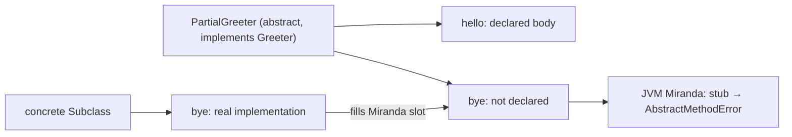

### How the Verifier Tracks Concrete-Class Completeness

When a class is loaded with `ACC_ABSTRACT` clear (i.e., concrete), the verifier walks its inheritance chain looking for unimplemented abstract methods:

1. Compute the set of methods needed by every interface + parent abstract class.
2. Walk the class's own `methods` table; mark each abstract requirement as satisfied if a concrete implementation exists.
3. If any requirement remains unsatisfied at the end: throw **`AbstractMethodError`** at class linkage (or more typically, javac rejects the class at compile time).

Pre-Java-8 abstract classes that implemented an interface only partially relied entirely on subclasses; the verifier accepted such an abstract class. Java 8's default methods reduced the need for partial-implementing abstract classes, but they're still legal.

### Architecture Layer — Abstract Methods at JIT Time

When the JIT compiles a call site that dispatches via an abstract method's slot, three scenarios:

1. **CHA finds exactly one concrete subclass** loaded — JIT inlines that subclass's implementation with a deopt guard (CHA-based devirtualization).
2. **CHA finds 2–3 concrete subclasses** — JIT emits a bimorphic PIC (T05 deeper section).
3. **CHA finds many** — JIT emits an itable lookup.

The abstract-method stub itself is never inlined; if CHA proves no concrete subclass exists yet (i.e., only the abstract class is loaded), the JIT inserts a deopt that fires on the first instance creation. In practice, abstract methods are always reached through concrete instances, so the stub is never invoked except in pathological situations.

### Verifier and ACC_ABSTRACT — Per-Method Detail

Each method's `access_flags` carries its own `ACC_ABSTRACT` bit. The verifier rules:

- `ACC_ABSTRACT` set + `Code` attribute present → reject (abstract methods cannot have bodies).
- `ACC_ABSTRACT` clear + `Code` attribute absent → reject (concrete methods must have bodies).
- `ACC_ABSTRACT` set + class is concrete → the class fails verification unless the method is implemented in the chain.
- `ACC_ABSTRACT` + (`ACC_PRIVATE` or `ACC_STATIC` or `ACC_FINAL` or `ACC_SYNCHRONIZED`) → reject.

The verifier enforces all four paradoxes from the language layer (T07 main body) at the bytecode level. The compile-time check by javac and the link-time check by the JVM are independent — both must pass.

## Common Mistakes

> [!WARNING]
> **Trying to instantiate `new AbstractType()`.** Compile error. Make the type concrete, use a factory, or instantiate a subclass.

> [!WARNING]
> **Forgetting to implement all abstract methods in a concrete subclass.** Compile error: "class must implement abstract method." Either implement them or mark the subclass `abstract` too.

> [!WARNING]
> **Marking a method both `abstract` and `private`/`static`/`final`.** All incompatible. The compiler rejects each combination with a specific error message.

> [!WARNING]
> **Declaring fields in an abstract class but never using them.** Code smell — usually means the abstract class is being used as a "marker interface" with state, which interfaces don't have. Reconsider the design.

> [!WARNING]
> **Overusing abstraction.** Not every class needs an abstract parent. If only one concrete subclass exists and is likely to remain unique, just have a regular class.

> [!WARNING]
> **`AbstractMethodError` at runtime.** Almost always a binary incompatibility — a class was compiled against an older version of the abstract class. Recompile or check classpath.

> [!INTERVIEW]
> Common interview questions:
> 1. **Can an abstract class have a constructor?** Yes; called via `super(...)` from concrete subclasses. The constructor enforces shared invariants.
> 2. **Can an abstract class have concrete methods?** Yes — that's what makes it different from an interface. Abstract classes are a mix of abstract and concrete methods.
> 3. **Can an abstract class have no abstract methods?** Yes; legal but unusual. Use `private` constructor for non-instantiability if that's the goal.
> 4. **What's the difference between an abstract class and an interface?** Abstract classes have state + constructors + single inheritance; interfaces are stateless contracts + multiple implementation + default methods. Pick by whether shared state is part of the design.
> 5. **What does the `abstract` keyword compile to?** `ACC_ABSTRACT = 0x0400` flag on both the class and each abstract method's `access_flags`. Abstract methods have no `Code` attribute.
> 6. **What is `AbstractMethodError`?** A runtime stub call into a vtable slot that was never overridden. Almost always indicates binary incompatibility.
> 7. **What's the Template Method pattern?** Parent class declares a `final` orchestrator method that calls `abstract` step methods; subclasses fill in the steps.
> 8. **Is `abstract` compatible with `final`?** No — `abstract` requires override; `final` prevents it. Compile error.
> 9. **Is `abstract` compatible with `static`?** No — static methods are not virtual, so they cannot be overridden. Compile error.
> 10. **What happens to dispatch when the parent is abstract?** Exactly the same as concrete classes — `invokevirtual` reads the receiver's klass and dispatches to the override.
> 11. **Why prefer interfaces over abstract classes when possible?** Multiple implementation, no state coupling, lambda-friendly. Reserve abstract classes for shared state with invariants.
> 12. **Can abstract methods have `protected` access?** Yes; in fact `protected` is common for steps the subclass implements and the parent's framework calls.

## Practice

1. **Declare an abstract class.** Write `abstract class Shape` with `abstract double area()`. Implement `Circle` and `Square`. Verify both compile.

2. **Try to instantiate.** Attempt `new Shape()`. Observe the compile error.

3. **Forget to implement.** Write a concrete `Triangle extends Shape` without `area()`. Observe the compile error.

4. **Abstract method `javap -v`.** Compile your `Shape`. Run `javap -v Shape`. Verify the class `access_flags` has `ACC_ABSTRACT`; the `area` method `access_flags` does too; no `Code` attribute on `area`.

5. **Template Method.** Implement the `HttpRequestHandler` example. Run it with a concrete subclass; trace the dispatch.

6. **Abstract class with state.** Add `protected String name;` to `Shape` with a constructor that sets it. Verify concrete subclasses must call `super(name)`. Verify the invariant (e.g., name not null) is enforced for every subclass.

7. **`abstract + final` paradox.** Try to declare `abstract final void foo();`. Observe compile error.

8. **`abstract + private` paradox.** Try `abstract private void foo();`. Observe compile error.

9. **`abstract + static` paradox.** Try `abstract static void foo();`. Observe compile error.

10. **Empty abstract class.** Declare `abstract class Empty { }` with no abstract methods. Verify it compiles. Try to instantiate; observe compile error.

11. **AbstractMethodError repro.** Compile `Circle` against a version of `Shape` without `circumference()`. Then change `Shape` to add `abstract circumference()`. Recompile `Shape` only; keep old `Circle.class`. Run `circle.circumference()`. Observe `AbstractMethodError`.

12. **Abstract method overridden in a chain.** Declare `abstract Shape → abstract IntermediateShape → concrete Triangle`. Where can `area()` be implemented? Verify it can be implemented at either `IntermediateShape` (making it concrete-enough for that subclass's `area`) or `Triangle`.

13. **JIT inlining of abstract method.** Hot-loop calling `shape.area()` where `shape` is always a `Circle`. Use `-XX:+PrintInlining`. Observe `Circle.area` inlined into the call site (CHA + monomorphic).

14. **Abstract vs interface refactor.** Take your `Shape` abstract class. Refactor to `interface Shape { double area(); }` + `abstract class AbstractShape implements Shape { protected String name; protected AbstractShape(String name) { ... } }`. Compare ergonomics.

15. **End-to-end explain-it-back.** Take `abstract class Shape { abstract double area(); double describe() { return area() * 2; } } class Circle extends Shape { double area() { return Math.PI * r * r; } } Shape s = new Circle(); s.describe();`. Trace through: (a) Shape compiles with ACC_ABSTRACT + an abstract `area` method with no Code; (b) Circle compiles with its `area` override; (c) `new Circle()` allocates, klass = Circle; (d) `s.describe()` dispatches via vtable to Shape's `describe` body (Circle inherits it); (e) `describe` calls `this.area()` which is `invokevirtual Shape.area`; (f) vtable lookup on `s`'s klass = Circle = Circle.area body. Twelve sentences max.

## Recap

You should now be able to:

**Language layer.**

- Declare an abstract class with the `abstract` modifier; understand it cannot be instantiated directly.
- Declare abstract methods (signature + semicolon; no body) and recognize that concrete subclasses must implement them.
- Recognize the four incompatibilities: `abstract` + `private`, + `static`, + `final`, + (`synchronized` on the declaration).
- Distinguish abstract class from interface: shared state + constructors + single inheritance vs stateless contract + multiple implementation.
- Use abstract classes for the Template Method pattern: `final` orchestrator + `abstract` steps.
- Recognize when abstraction adds value (shared state with invariants) vs when it's over-engineering (single concrete subclass, no shared state).

**Memory layer.**

- Decode the `ACC_ABSTRACT = 0x0400` flag on the class and on each abstract method.
- Recognize that abstract methods have no `Code` attribute in their `method_info` entries.
- Identify the runtime stubs in the vtable slots for abstract methods that throw `AbstractMethodError` if reached.
- Understand the dual enforcement: javac rejects `new` on an abstract class; the JVM verifier rejects the same at load time as `InstantiationError`.
- Identify `AbstractMethodError` as a binary-incompatibility signal.

**Architecture layer.**

- Recognize that abstract methods participate in the same `invokevirtual` dispatch as concrete ones — no extra cost.
- Apply the same JIT optimizations (CHA, inline caching, devirtualization) to abstract methods.
- Combine Template Method with JIT inlining for hot-code performance — the `final` orchestrator inlines, abstract steps inline per subclass.

Abstract classes are the language's halfway house between fully concrete classes and fully abstract interfaces. They give you a constructor to enforce invariants, fields to share state, and the obligation that subclasses fill in specific operations. The next topic — [T08 Interfaces](./T08-interfaces-default-static-private-methods.md) — completes the abstraction picture by introducing the stateless contract form, plus default methods (which gave interfaces some of abstract classes' powers in Java 8).

## Next

Continue to [Interfaces (default, static, private methods)](./T08-interfaces-default-static-private-methods.md) — the second abstraction tool: a contract that any number of classes can implement, with `default` method bodies (Java 8+), `static` helper methods (Java 8+), and `private` helper methods (Java 9+) for behavior sharing without state. The contrast with abstract classes is sharp: interfaces give multiple implementation, no state, no constructor, but the same dispatch via `invokeinterface`.
