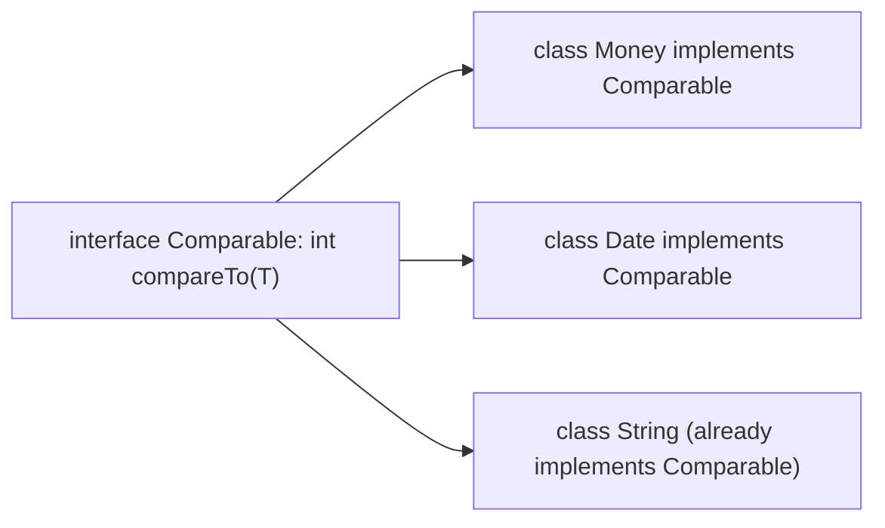
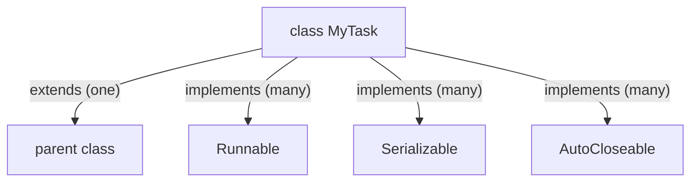
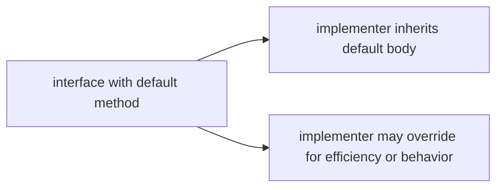
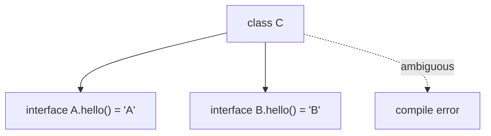
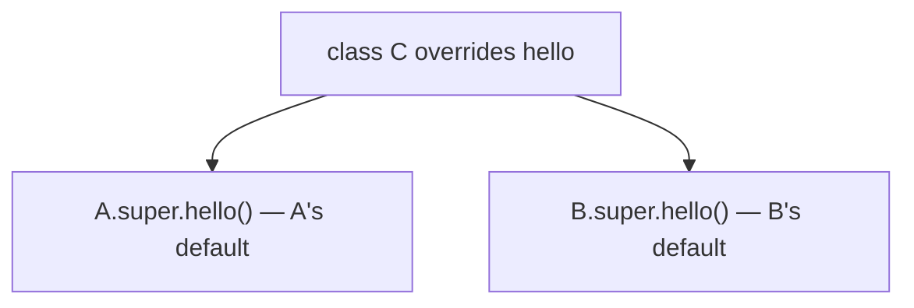
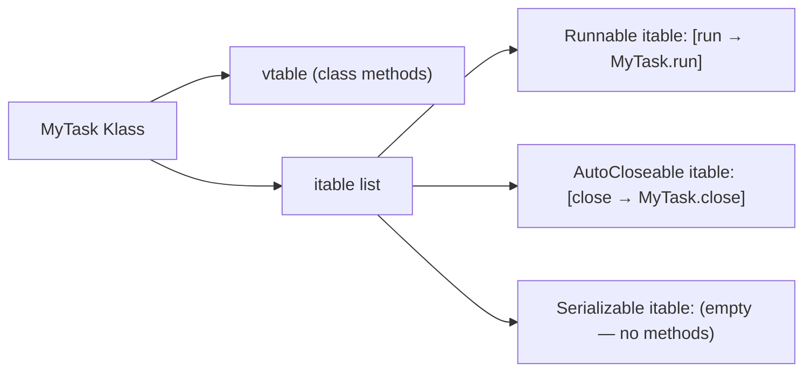
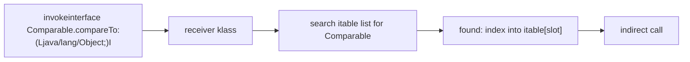
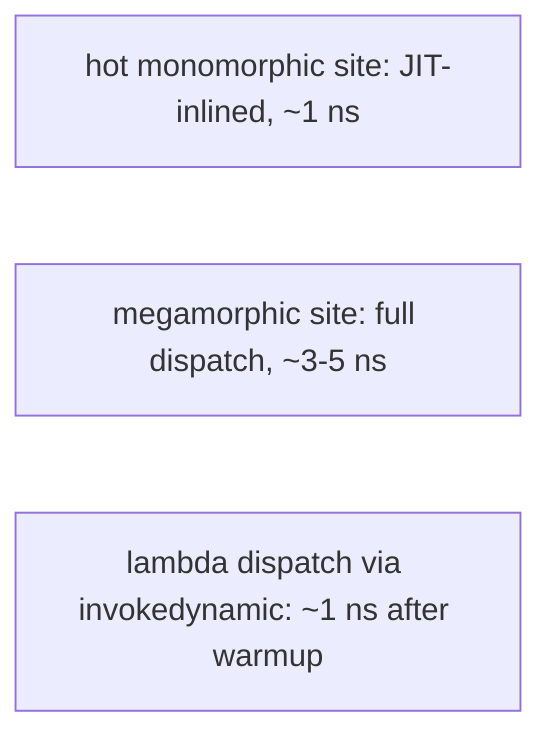
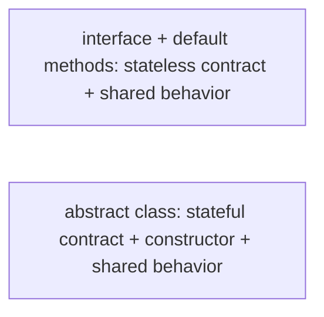
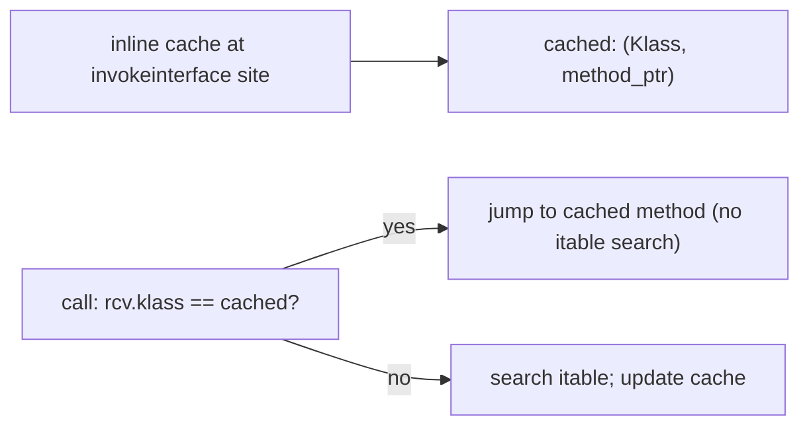

# Interfaces (default, static, private methods)

An **interface** is a Java language construct that declares a **contract** — a set of method signatures a type must support — without committing to an implementation or to any state. A class declares it implements an interface with `implements`, and it must then provide bodies for every method the interface declares. Unlike abstract classes ([T07](./T07-abstraction-and-abstract-classes.md)), interfaces support **multiple inheritance of behavior**: a class implements as many interfaces as it wants. Since **Java 8**, interfaces can also include **`default` methods** with bodies — letting interface authors evolve an interface without breaking implementers — plus **`static` methods** (utility methods called via the interface name) and, since **Java 9**, **`private` methods** for sharing logic among default methods. Lambdas target **functional interfaces** (single-abstract-method types), making interfaces the foundation of modern Java's functional style.

The depth bar isn't "interface = contract." Interfaces compile to `.class` files with the **`ACC_INTERFACE` (0x0200)** flag plus implicit `ACC_ABSTRACT`. Every non-default, non-static interface method is implicitly `public abstract`. Default methods have a `Code` attribute and a real body. A class that implements an interface gets its **vtable** (for class inheritance) **plus** an **itable** (per implemented interface) — a separate dispatch table. The **`invokeinterface`** opcode dispatches by **searching** the receiver's klass's itable list for the right interface's itable, then indexing into it. The itable search is the reason interface dispatch is slightly slower than virtual dispatch (~1–2 ns extra in megamorphic cases); in monomorphic hot paths, the JIT inline-caches the result and the cost vanishes. The famous **diamond problem** — when a class inherits two `default` methods with the same signature from different interfaces — is resolved by JLS rules: most-specific subinterface wins; class wins over interface; otherwise the class must override and may delegate via `Interface.super.method()`. None of this is visible from `class Foo implements Bar` unless you know to look for the itable + invokeinterface.

> [!NOTE]
> Prerequisites: [Inheritance & super](./T04-inheritance-and-super.md) (`L1/C01/T04`) — single inheritance, vtable layout; [Method overriding](./T05-method-overriding.md) (`L1/C01/T05`) — `invokevirtual`, inline caching, CHA, devirtualization; [Polymorphism](./T06-polymorphism-compile-time-vs-runtime.md) (`L1/C01/T06`) — `invokeinterface` vs `invokevirtual` cost, `invokedynamic` for lambdas; [Abstraction & abstract classes](./T07-abstraction-and-abstract-classes.md) (`L1/C01/T07`) — abstract methods, ACC_ABSTRACT, Template Method pattern.

## What an Interface Is

An interface declares *what* a type can do. It does not say *how* (until default methods, mostly). Concrete classes implement the interface by providing bodies for its abstract methods.

```java
public interface Comparable<T> {
    int compareTo(T other);   // implicitly public abstract
}

public class Money implements Comparable<Money> {
    private final long cents;
    @Override
    public int compareTo(Money other) {
        return Long.compare(this.cents, other.cents);
    }
}
```

The interface has no constructor, no fields (other than `public static final` constants), and no instance state. It exists only as a **type contract**. Implementers honor the contract by providing bodies.



A method that takes `Comparable` accepts any of them — multiple implementation of one contract is the engine of Java's collections framework (`List`, `Map`, `Set` are all interfaces with many implementations).

## Declaring an Interface

The minimum:

```java
public interface Named {
    String getName();   // abstract; no body
}
```

Implicit modifiers on interface members:

- Every method without a body is implicitly `public abstract`.
- Every field is implicitly `public static final`.
- Nested types are implicitly `public static`.

Writing the modifiers explicitly is legal but redundant; convention is to omit them.

```java
public interface Constants {
    int MAX_RETRIES = 5;          // implicitly public static final
    void process(Request r);      // implicitly public abstract
}
```

### Multiple Implementation

A class can implement many interfaces:

```java
public class MyTask implements Runnable, Serializable, AutoCloseable {
    @Override public void run() { ... }
    @Override public void close() { ... }
    // Serializable has no abstract methods (it's a marker — see below)
}
```

A class can extend at most one class **and** implement many interfaces. The interfaces add to its set of supertypes; the class becomes a subtype of each.



### Interfaces Extending Interfaces

Interfaces can extend other interfaces — even multiple at once (which classes cannot do):

```java
public interface List<E> extends Collection<E>, Iterable<E> { ... }
```

This composes contracts: a `List` is also a `Collection` and an `Iterable`. Sub-interface inherits all the super-interfaces' abstract method declarations.

## `default` Methods (Java 8)

A **`default` method** is an interface method *with a body* that implementers inherit unless they override it. The driving motivation was **API evolution**: Java 8 needed to add `stream()` and `forEach()` to `Collection` without breaking every existing implementer. Default methods let the interface provide a useful body that existing implementers inherit for free.

```java
public interface Collection<E> {
    int size();
    boolean isEmpty();   // could be default
    default boolean isEmpty() {     // ← default
        return size() == 0;
    }
    default Stream<E> stream() {
        return StreamSupport.stream(spliterator(), false);
    }
    // ...
}
```

Implementers may *override* a default to provide a more efficient body but they aren't required to. A class implementing `Collection` doesn't need to write `isEmpty()` — it gets the default.



### Default Methods + Multiple Inheritance — The Diamond Problem

If a class implements two interfaces that both provide a `default` method with the same signature, the compiler must pick one — or force the class to disambiguate.

```java
interface A { default String hello() { return "A"; } }
interface B { default String hello() { return "B"; } }

class C implements A, B { }   // COMPILE ERROR: class C inherits unrelated defaults
```



The resolution rules (JLS §8.4.8):

1. **Most-specific subinterface wins.** If `B extends A` and both have a default `hello`, `B.hello` wins (more specific).
2. **Class wins over interface.** If a class inherits a method from a superclass AND a default from an interface, the class's method wins.
3. **Otherwise the class must override.** The override may delegate to a specific interface's default via `Interface.super.method()`.

```java
class C implements A, B {
    @Override
    public String hello() {
        return A.super.hello() + " then " + B.super.hello();   // explicit delegation
    }
}
```



### What Default Methods Cannot Do

- **No instance state.** Defaults can read other interface methods on `this`, but they cannot declare instance fields — interfaces remain stateless.
- **Cannot override `Object` methods.** A default method named `equals`, `hashCode`, or `toString` is rejected by the compiler — those are reserved for class implementations.
- **No `final` default.** Defaults can be overridden by implementers; they're not closed.

## `static` Methods on Interfaces (Java 8)

A `static` method on an interface is a utility method called via the interface name. It is **not inherited** by implementers — there's no notion of static method inheritance via interfaces.

```java
public interface Comparator<T> {
    int compare(T a, T b);

    static <T extends Comparable<T>> Comparator<T> naturalOrder() {
        return (a, b) -> a.compareTo(b);
    }
    static <T> Comparator<T> reverseOrder(Comparator<T> c) {
        return (a, b) -> c.compare(b, a);
    }
}

Comparator<Integer> byNatural = Comparator.naturalOrder();   // call via interface name
```

The benefit: utilities related to the interface live *with* the interface, not in a separate `Utils` class. The JDK uses this heavily in `Comparator`, `Stream`, `Predicate`.

> [!INTERVIEW]
> "Why aren't static interface methods inherited?" Because static methods belong to the class (interface) that declared them, not to instances. Inheritance is about object-level behavior; static methods are class-level utilities. Allowing inheritance would mean a class implementing two interfaces with same-named static methods would have ambiguity — a problem the language avoids by simply not inheriting.

## `private` Methods on Interfaces (Java 9)

Default methods often share helper logic. Pre-Java-9, you had to either duplicate code or expose helpers as `public default`. Java 9 added `private` (and `private static`) interface methods for internal sharing.

```java
public interface Logger {
    void log(String level, String msg);

    default void info(String msg)  { log("INFO",  format(msg)); }
    default void warn(String msg)  { log("WARN",  format(msg)); }
    default void error(String msg) { log("ERROR", format(msg)); }

    private String format(String msg) {     // not visible to implementers
        return "[" + Thread.currentThread().getName() + "] " + msg;
    }
}
```

`format` is internal to the interface; implementing classes can't see it. Cleanest practice for sharing default-method logic.

## `@FunctionalInterface` — Lambdas Target

A **functional interface** is an interface with **exactly one abstract method**. Lambdas and method references target functional interfaces:

```java
@FunctionalInterface
public interface Predicate<T> {
    boolean test(T t);
    default Predicate<T> and(Predicate<T> other) { ... }
    default Predicate<T> negate() { ... }
    // default methods do NOT count as "abstract" for SAM purposes
}

Predicate<String> nonEmpty = s -> !s.isEmpty();
```

The `@FunctionalInterface` annotation is *optional* but recommended: javac uses it to verify the interface has exactly one abstract method, catching accidental additions that would break lambda compatibility.

Lambda dispatch goes through `invokedynamic + LambdaMetafactory` ([T06](./T06-polymorphism-compile-time-vs-runtime.md)). The bootstrap generates a class implementing the functional interface; `nonEmpty.test("foo")` is an `invokeinterface` on the generated class.

Common functional interfaces in `java.util.function`:

| Interface | Abstract method | Use |
|-----------|-----------------|-----|
| `Function<T, R>` | `R apply(T t)` | transform |
| `Predicate<T>` | `boolean test(T t)` | filter |
| `Consumer<T>` | `void accept(T t)` | side effect |
| `Supplier<T>` | `T get()` | produce |
| `BiFunction<T, U, R>` | `R apply(T, U)` | 2-arg transform |
| `Runnable` | `void run()` | no-arg, no-result |

## Marker Interfaces

A **marker interface** is an interface with **no methods at all** — used purely as a type tag.

```java
public interface Serializable { }
public interface Cloneable { }
public interface RandomAccess { }
```

`obj instanceof Serializable` returns `true` if the object's class implements it. Frameworks (`ObjectOutputStream`, `ArrayList`) check for these tags to enable behavior (serialization, fast indexed access). Modern Java increasingly prefers **annotations** over marker interfaces, but the existing markers remain (and `Serializable` is uniquely powerful because it's a compile-time-checkable type marker).

## Sealed Interfaces (Preview)

Java 17+ allows **sealed interfaces** — interfaces that explicitly enumerate which classes may implement them.

```java
public sealed interface Shape permits Circle, Square, Triangle { }
public record Circle(double radius) implements Shape { }
public record Square(double side) implements Shape { }
public record Triangle(double a, double b, double c) implements Shape { }
```

Pattern switches over sealed interfaces are checked for exhaustiveness. Full coverage in [T15](./T15-sealed-classes-and-interfaces.md).

## Memory Layer — `ACC_INTERFACE` and Itables

An interface compiles to a `.class` file with:

- **`ACC_INTERFACE = 0x0200`** flag on the class entry.
- Implicit **`ACC_ABSTRACT = 0x0400`** also set (cannot instantiate).
- Each method's `access_flags` reflects `default`/`static`/`private`/`abstract`.

```
public interface Foo
  flags: (0x0601) ACC_PUBLIC, ACC_INTERFACE, ACC_ABSTRACT
```

Abstract methods have no `Code` attribute; `default`, `static`, and `private` methods do.

### The Itable

When a class implements interfaces, the JVM builds an **itable** for the class — one per implemented interface, holding method-implementation pointers indexed by the interface's method order.



A class implementing many interfaces has many itables in its list. The total size depends on the implemented interfaces; for typical classes with 1–3 interfaces, the overhead is small.

### `invokeinterface` Mechanics

The `invokeinterface` opcode dispatches via the itable. Steps:

1. Read receiver's klass pointer.
2. **Search** the klass's itable list for the right interface (typically 1–3 entries; linear scan).
3. Index into that interface's itable to find the method pointer.
4. Indirect call.



The itable search adds work compared to vtable. The JIT mitigates with inline caching: the *result* of the itable search is cached at the call site after the first call, so subsequent calls bypass the search.

### Itable in Physical Bytes — Concrete Layout

For a class `class MyTask implements Runnable, AutoCloseable, Cloneable` (3 interfaces), the Klass struct in Metaspace contains:

```
Klass(MyTask) — relevant portion:
  ...
  +(vtable_end):       itable list begins
  
  ; itableOffsetEntry list — 16 bytes per entry (8 ptr + 4 offset + 4 pad)
  +offset_A+0:   _interface = Runnable.Klass         ; 8 bytes
  +offset_A+8:   _offset = 60                         ; 4 bytes (offset within Klass to method ptrs)
  +offset_A+12:  padding                              ; 4 bytes (alignment)
  
  +offset_A+16:  _interface = AutoCloseable.Klass    ; 8 bytes
  +offset_A+24:  _offset = 68                         ; 4 bytes
  +offset_A+28:  padding
  
  +offset_A+32:  _interface = Cloneable.Klass        ; 8 bytes
  +offset_A+40:  _offset = 76                         ; 4 bytes (= -1 if empty)
  
  +offset_A+48:  _interface = NULL                   ; terminator (8 bytes)
  +offset_A+56:  _offset = -1                         ; (8 bytes)
  
  ; Method-pointer arrays for each interface, packed contiguously
  +offset_A+64:  ptr_to_MyTask.run                   ; Runnable's only method
  +offset_A+72:  ptr_to_MyTask.close                 ; AutoCloseable's only method
  ; Cloneable has no methods — no entries
```

**Per-interface itable cost:** 16 bytes (itableOffsetEntry) + 8 bytes per declared method. For our class:
- Runnable: 16 (offset entry) + 8 (run) = **24 bytes**
- AutoCloseable: 16 + 8 = **24 bytes**
- Cloneable: 16 + 0 = **16 bytes**
- Terminator: **16 bytes**
- **Total: ~80 bytes per class** for these 3 interfaces.

For a class implementing 10 interfaces averaging 3 methods each: ~16 × 10 + 8 × 30 + 16 = **416 bytes** of itable in Metaspace per class. Multiplied across 10,000 loaded classes: ~4 MB Metaspace for itables alone.

### invokeinterface — Cycle-by-Cycle CPU Execution

Take `runnable.run()` where `runnable` is in `rdi`:

```
; Step 1: Load klass pointer from object header
mov   r10d, [rdi + 8]           ; load compressed klass ptr (4 bytes)
shl   r10, 3                    ; decompress to full 64-bit address

; Step 2: Locate itable list base — fixed offset from Klass
lea   r11, [r10 + ITABLE_OFFSET_HIGH]   ; r11 = address of first itableOffsetEntry

; Step 3: Linear scan for Runnable.Klass (the JIT emits a small loop)
search_loop:
    mov   r12, [r11 + 0]                ; load _interface from current entry
    test  r12, r12
    jz    interface_not_found            ; NULL terminator
    cmp   r12, RunnableKlass             ; is this Runnable?
    je    found
    add   r11, 16                        ; next entry
    jmp   search_loop

; Step 4: Found — load offset and compute method pointer location
found:
    mov   r12d, [r11 + 8]                ; r12 = _offset = 64
    lea   r13, [r10 + r12]               ; r13 = base of method ptr array
    
; Step 5: Index to the right method (compile-time known for `run` = 0)
    mov   r14, [r13 + 0]                 ; r14 = ptr_to_MyTask.run
    call  r14                            ; indirect call
```

**Cycle count (cold, megamorphic):**

| Step | Cycles |
|------|-------:|
| Klass load + decompress | ~5 |
| Linear scan (3 interfaces avg) | ~10 (3 × cmp+jmp) |
| Offset load + method ptr load | ~8 (two L1 hits) |
| Indirect call (BTB miss likely on first) | ~15 |
| **Total cold** | **~38 cycles ≈ 12 ns** |

For inline-cached monomorphic calls, the entire search is replaced by a klass-compare + direct call:

```
cmp   [rdi + 8], CachedKlass         ; ~4 cycles
jne   ic_miss_slow_path
call  CachedMethodPtr                ; ~2 cycles (BTB hit)
; Total: ~6 cycles ≈ 2 ns
```

Same as monomorphic `invokevirtual`. **The interface-vs-class dispatch cost difference shows up only at megamorphic sites.**

### Why `invokeinterface` Has a Two-Step Indirection

The vtable has *one* indirection: `Klass + offset → method ptr`. The itable has *two*: `Klass + linear scan → offset → method ptr`. The reason: a class has one vtable but many interfaces, each with their own method numbering.

If the JVM tried to use vtable-style slot indexing for interfaces, it would have to **conflate slot numbers across interfaces**, leading to collisions. A class implementing 10 interfaces with 50 methods each would need 500 vtable slots — most of them empty for any single instance. The itable design trades a linear scan for compact storage.

Some JVMs (e.g. Excelsior JET historically) used **interface method tables (IMTs)** — a small hash table per class mapping interface-method signatures to implementations. Faster than scan, more memory. HotSpot stayed with linear scan because the inline cache eliminates the cost in hot code.

### `invokeinterface` vs `invokevirtual` — Worked Bytecode

```java
Comparable<Integer> c = 5;
c.compareTo(10);
```

`javap -c`:

```
invokeinterface #N, 2  // Method Comparable.compareTo:(Ljava/lang/Object;)I
```

vs:

```java
Integer i = 5;
i.compareTo(10);
```

```
invokevirtual #M  // Method Integer.compareTo:(Ljava/lang/Integer;)I
```

The `invokeinterface` has an extra byte (the arg count "2" hint) and goes through the itable. The `invokevirtual` goes through the vtable. Semantically equivalent; mechanically different.

## Architecture Layer — Dispatch Cost and JIT

Interface dispatch is slightly slower than virtual dispatch because of the itable search. In monomorphic hot paths the JIT eliminates the search via inline caching, and the cost difference vanishes. In megamorphic call sites, interface dispatch is ~1–2 ns slower than virtual.

| Scenario | `invokevirtual` | `invokeinterface` |
|----------|-----------------|-------------------|
| Monomorphic (inline-cached) | ~1 ns | ~1 ns |
| Bimorphic (2 cached) | ~2 ns | ~2 ns |
| Megamorphic (vtable/itable fallback) | ~3 ns | ~4–5 ns |
| Cold (first call) | ~5 ns | ~10 ns |



CHA + inline caching apply identically to interface dispatch. The JIT can prove monomorphism if only one implementer has loaded; inlines under that assumption with a deopt guard.

> [!INTERVIEW]
> "Is interface dispatch slower than virtual dispatch?" Slightly, at megamorphic call sites only — ~1–2 ns extra due to itable search. In hot monomorphic paths the JIT inlines the cache and the difference vanishes. Modern code should pick interface vs class based on design (multiple implementation? state sharing?), not on dispatch cost.

## When to Use Interface vs Abstract Class

The modern guidance:

| Need | Prefer |
|------|--------|
| Pure contract, multiple implementation | **Interface** |
| Shared state with invariants | **Abstract class** |
| Shared behavior without state | **Interface with default methods** |
| Limited set of implementers | **Sealed interface** (or sealed abstract class) |
| Functional API (lambda-friendly) | **Functional interface** (single abstract method) |
| Multiple inheritance of behavior | **Interface** (Java forbids multiple class inheritance) |

Java 8+ default methods narrowed the gap significantly; interfaces are now the **default choice** for most abstraction needs. Reach for abstract classes only when shared *state* is essential to the design.



## Deeper JVM Internals — Itable Construction, invokeinterface, and Default Method Selection

The vtable view from [T04](./T04-inheritance-and-super.md) handles class inheritance cleanly. Interfaces add a second dispatch table — the **itable** — and a more complex algorithm for **default method selection** when multiple interfaces compete. This section unpacks both.

### klassItable Struct Layout in HotSpot

When a class implements N interfaces, its Klass has an **itable list** with N+1 entries: one per interface plus a terminator. Each entry is a **`itableOffsetEntry`** containing two fields:

```
itableOffsetEntry:
  _interface : Klass*       // pointer to the interface's Klass
  _offset    : int          // byte offset from Klass base to this interface's method table
```

After the offset entries, the actual **method pointers** for each interface follow in the same Klass struct, packed contiguously. The structure looks like:

```
class MyTask implements Runnable, AutoCloseable, Cloneable:

  Klass(MyTask):
    [base Klass fields]
    [vtable: class methods including overrides of Object methods]
    [itable list]
      itableOffsetEntry { _interface = Runnable.klass,      _offset = 200 }
      itableOffsetEntry { _interface = AutoCloseable.klass, _offset = 208 }
      itableOffsetEntry { _interface = Cloneable.klass,     _offset = 216 }
      itableOffsetEntry { _interface = NULL, _offset = -1 }   // terminator
    [interface method pointers]
      offset 200: ptr to MyTask.run
      offset 208: ptr to MyTask.close
      offset 216: (Cloneable has no methods, empty)
```

The method pointers within each interface's section follow the interface's declaration order. The lookup algorithm:

1. Walk the itableOffsetEntry list comparing `_interface` to the target interface's Klass.
2. On match, read `_offset` to find the start of the method-pointer array.
3. Index into the array using the **itable index** (a compile-time-resolved offset from the interface's `Methodref`).


### itable Construction Algorithm at Class Load

When `MyTask` is linked, the JVM:

1. **Compute interface set**: `Runnable`, `AutoCloseable`, `Cloneable`, plus transitively any interfaces they extend.
2. **Allocate itableOffsetEntries**: one per interface in the set.
3. **For each interface**:
   - Allocate method pointer slots = number of methods the interface declares.
   - For each interface method, find the matching implementation in `MyTask` (or its parents); install the pointer.
   - If no implementation found, install a **Miranda** stub ([T07 deeper section](./T07-abstraction-and-abstract-classes.md#deeper-jvm-internals--abstract-method-stubs-verifier-checks-and-miranda-methods)) that throws `AbstractMethodError`.
4. **Wire up itableOffsetEntries** pointing to each method-pointer block.

Subclasses inherit the parent's itable layout and may override individual slots — the same append-and-replace rule as vtables ([T04](./T04-inheritance-and-super.md)).

### Why `invokeinterface` Is Slower Than `invokevirtual`

The vtable lookup is **one indirection** — `klass + vtable_offset + slot*8` is a single addressing computation. The itable lookup is **two indirections**: first find the interface's offset entry, then index into the method block. Plus the scan over offset entries is **linear** — it doesn't index — because the interface list size is small but variable.

Total cost difference: ~2–4 extra cycles on a megamorphic call site. On a monomorphic call site, the JIT inline-caches the result and the cost is identical to a virtual call.

The cost would have been larger, but HotSpot caches the resolved method pointer in the call site's inline cache. After the first call, the cache holds (`receiver_klass`, `method_ptr`) and subsequent calls compare the receiver's klass — no itable search needed.



### Default Method Selection — The Three-Step Resolution

When a class inherits methods from multiple interfaces (some with defaults, some abstract), the JVM applies a **three-step resolution** to pick the correct method:

1. **Class wins.** If the class or any superclass declares a method with the matching signature, that method wins.
2. **Most-specific interface wins.** If only interfaces declare matching defaults, the one furthest down the interface inheritance hierarchy wins. "Most specific" = no other inherited interface extends it.
3. **Otherwise, the class must override.** If two unrelated interfaces both provide defaults, the class must explicitly resolve the conflict (typically by overriding and using `Interface.super.method()`).

```
interface A { default void f() { print("A"); } }
interface B extends A { default void f() { print("B"); } }   // more specific

class C implements A, B { }
new C().f();   // prints "B" — most-specific interface wins
```

```
interface A { default void f() { print("A"); } }
interface B { default void f() { print("B"); } }   // unrelated

class C implements A, B { }     // COMPILE ERROR: ambiguous
```

The resolution is done at **class link time**: the JVM computes the effective method for each interface's itable slot and installs the chosen pointer. If unresolvable, the linker rejects the class.

### `invokeinterface` Has a Mysterious Extra Operand

Looking at `invokeinterface` bytecode in `javap`:

```
invokeinterface #15, 1     // Method Runnable.run:()V
```

The `, 1` is an **arg count hint** — historically used to help interpreters compute the operand-stack delta without consulting the descriptor. Modern JVMs ignore it (the descriptor is authoritative), but the bytecode format requires it for backward compatibility. The fifth byte of an `invokeinterface` instruction is always a zero (also unused — reserved). This makes `invokeinterface` a **5-byte** instruction vs `invokevirtual`'s 3 bytes.

The extra bytes don't affect performance directly but bloat the instruction stream a tiny amount. The JIT erases the difference by inlining hot calls.

### Default Methods Are Real Methods, Not Inheritance Magic

A `default` method has a `Code` attribute just like a class method. At runtime, the JVM treats it the same way: it's a real implementation that gets installed into the itable slots of implementing classes. The "default" status is purely about *who gets to override what*; bytecode dispatch is identical.

You can call a default method via `invokeinterface` (normal dispatch) or via `invokespecial` with the interface name (`A.super.f()` syntax — non-virtual, exact-interface call).

### `private` Interface Methods Bytecode

A `private` interface method (Java 9+) compiles to:

```
private int helper() {
  flags: ACC_PRIVATE
  Code: ...
}
```

Callable only from within the interface (other defaults can call it). The dispatch is `invokeinterface` from a default body — but since `private` methods are not in the implementer's itable, the resolution must use a non-vtable mechanism. HotSpot handles this by treating `private` interface methods as `invokespecial`-compatible: the resolved method pointer is bound at the call site, no itable involved.

### MethodHandle for Default Methods

When a lambda implements a functional interface that has default methods, the generated hidden class ([T06 deeper section](./T06-polymorphism-compile-time-vs-runtime.md#deeper-jvm-internals--invokedynamic-lambdametafactory-and-pattern-switch-bootstrap)) **inherits the default methods automatically**. The generated class's itable points to the defaults' bodies; calling `comparator.thenComparing(...)` on a lambda-`Comparator` reaches the default's body through normal itable dispatch.

### Why Interface Constants Live in the Implementing Class

Interface fields are `public static final`. The JVM stores their values in the **interface's** Klass, not in the implementing classes. Resolution of `MyClass.CONSTANT` (where `CONSTANT` is declared in an implemented interface) walks: first MyClass's fields, then each implemented interface's fields. The lookup is at link time, so subsequent accesses are direct.

If two implemented interfaces both define a constant with the same name and different values, the compiler rejects the ambiguous reference. Qualifying with the interface name (`A.CONSTANT`) disambiguates.

### Sealed Interface Klass Has Permits List

A sealed interface's Klass holds a list of permitted subtypes:

```
Klass(SealedInterface):
  ...
  PermittedSubclasses attribute: [ConcreteA.klass, ConcreteB.klass, ConcreteC.klass]
```

When loading a class that declares it implements a sealed interface, the JVM verifies the class is in the permitted list. If not, **`VerifyError`** at link time.

Pattern switch over a sealed interface compiles to `invokedynamic SwitchBootstraps.typeSwitch` ([T06 deeper section](./T06-polymorphism-compile-time-vs-runtime.md#deeper-jvm-internals--invokedynamic-lambdametafactory-and-pattern-switch-bootstrap)) and can exploit the closed permits list for O(1) dispatch via a perfect-hash table or direct branch.

## Common Mistakes

> [!WARNING]
> **Trying to declare instance fields in an interface.** All fields are implicitly `public static final` constants. There is no instance state.

> [!WARNING]
> **Trying to declare a constructor in an interface.** Compile error. Interfaces don't have constructors.

> [!WARNING]
> **Two default methods with same signature, no override.** Compile error: ambiguous. Use `Interface.super.method()` in an explicit override.

> [!WARNING]
> **Declaring `equals` / `hashCode` / `toString` as default methods.** Compile error: these are reserved for class implementations.

> [!WARNING]
> **`@FunctionalInterface` on an interface with multiple abstract methods.** Compile error. The annotation enforces "exactly one abstract method."

> [!WARNING]
> **Calling a static interface method via an instance reference.** Legal but bad style — `obj.staticMethod()` works but reads as if it were dynamic. Use `Interface.staticMethod()`.

> [!WARNING]
> **Interface with too much default-method logic.** Defaults are for retrofitting + small utility logic. Long, complex defaults belong in an abstract class with state.

> [!INTERVIEW]
> Common interview questions:
> 1. **Can interfaces have fields?** Only `public static final` constants — implicitly. No instance state.
> 2. **Can a class implement multiple interfaces?** Yes — that's how Java provides multiple inheritance of behavior.
> 3. **What's a default method?** An interface method with a body that implementers inherit unless they override it. Introduced in Java 8 for API evolution.
> 4. **What's the diamond problem in interfaces?** When a class inherits two unrelated default methods with the same signature. Resolution: most-specific subinterface wins; class wins over interface; otherwise class must override and may delegate via `Interface.super.method()`.
> 5. **What's a functional interface?** An interface with exactly one abstract method. Lambdas target it. `@FunctionalInterface` is the recommended annotation.
> 6. **Why are static interface methods not inherited?** Static methods belong to the class/interface, not the instance — inheritance is an instance-level concept.
> 7. **What's the bytecode flag for an interface?** `ACC_INTERFACE = 0x0200` plus implicit `ACC_ABSTRACT = 0x0400`.
> 8. **What opcode dispatches interface methods?** `invokeinterface`. Searches the receiver's itable list for the right interface, then indexes into it.
> 9. **Is interface dispatch slower than virtual?** Slightly, at megamorphic sites (~1–2 ns extra). Monomorphic inline-cached calls are equally fast.
> 10. **What's a marker interface?** An interface with no methods, used as a type tag (`Serializable`, `Cloneable`). Annotations often replace them now.
> 11. **Can a default method override `Object` methods?** No. `equals`, `hashCode`, `toString` defaults are rejected by the compiler.
> 12. **When prefer interface over abstract class?** Interface for pure contract + multiple implementation; abstract class when shared state is essential.
> 13. **What is `Interface.super.method()` for?** Explicit invocation of a parent interface's default method, used when overriding to resolve diamond ambiguity.
> 14. **What's a sealed interface?** Java 17+. An interface with a `permits` clause listing exactly which classes/records may implement it. Enables exhaustive pattern switches.

## Practice

1. **Declare a basic interface.** Write `interface Named { String getName(); }`. Implement in two classes. Verify both work with a method `void greet(Named n) { ... }`.

2. **Multiple implementation.** Declare `interface Bouncy { void bounce(); }` and `interface Loud { void shout(); }`. Have one class implement both. Use it via three references: as `Bouncy`, as `Loud`, and as the concrete class.

3. **Default method.** Add `default String defaultGreeting() { return "Hello " + getName(); }` to `Named`. Verify implementers inherit it for free. Override in one implementer.

4. **Diamond resolution.** Declare `A` and `B` with conflicting default `hello`. Make `C implements A, B`. Observe compile error. Add an override using `A.super.hello() + " " + B.super.hello()`.

5. **Static interface method.** Add `static Named anonymous() { return () -> "?"; }` to `Named`. Call it as `Named.anonymous().greet()`. Verify it cannot be called via instance reference (compile warning).

6. **Private interface method (Java 9+).** Add a private helper to share logic among default methods. Verify implementers can't see it.

7. **Functional interface + lambda.** Annotate `Named` as a functional interface, then break it by adding a second abstract method; observe compile error. Restore. Use a lambda: `Named bob = () -> "bob";`.

8. **`javap -v` ACC_INTERFACE.** Compile your interface. Verify `ACC_INTERFACE | ACC_ABSTRACT` in the class flags. Verify default methods have a Code attribute; abstract methods don't.

9. **`invokeinterface` vs `invokevirtual` bytecode.** Call a method via interface reference; call the same via concrete reference. Compare bytecode opcodes — `invokeinterface` vs `invokevirtual`.

10. **Itable dump via SA.** Use HotSpot Serviceability Agent (`jhsdb hsdb`) to dump itables for a class implementing 2-3 interfaces. Confirm separate itable per interface.

11. **Megamorphic itable cost benchmark.** Hot-loop calling an interface method where the receiver alternates among 5 implementations. Compare to the same with one implementation. Measure the throughput difference.

12. **Comparator composition via defaults.** Use `Comparator.comparing(...).thenComparing(...)` to build a multi-key sort. Trace which default methods compose what.

13. **Marker interface inspection.** Implement `Serializable` on a class. Use `instanceof Serializable` to verify. Try to serialize with `ObjectOutputStream`. Then remove the marker and observe `NotSerializableException`.

14. **Sealed interface pattern switch.** Declare `sealed interface Shape permits Circle, Square, Triangle`. Write a switch over it. Try adding a new permit type without updating the switch; observe exhaustiveness error.

15. **End-to-end explain-it-back.** Take `Predicate<String> nonEmpty = s -> !s.isEmpty(); boolean r = nonEmpty.test("foo");`. Trace through: (a) `Predicate` compiles with `ACC_INTERFACE | ACC_ABSTRACT`; `test(T)` is `ACC_PUBLIC | ACC_ABSTRACT`; (b) the lambda compiles to `invokedynamic LambdaMetafactory.metafactory`; (c) at runtime, the bootstrap generates a class implementing `Predicate`; the generated class's `test` calls the lambda body `s -> !s.isEmpty()`; (d) `nonEmpty.test("foo")` compiles to `invokeinterface Predicate.test:(Ljava/lang/Object;)Z`; (e) at runtime, JVM finds Predicate's itable on the generated class, dispatches; (f) JIT inlines bootstrap + body in hot code. Twelve sentences max.

## Recap

You should now be able to:

**Language layer.**

- Declare an interface with abstract methods, recognizing implicit `public abstract` on methods and `public static final` on fields.
- Implement multiple interfaces in a class via `implements I1, I2, ...`.
- Use `default` methods (Java 8+) to retrofit interface APIs without breaking existing implementers.
- Use `static` interface methods (Java 8+) as utilities scoped to the interface.
- Use `private` interface methods (Java 9+) to share logic among `default` methods.
- Apply diamond-problem resolution: most-specific subinterface; class over interface; otherwise explicit override with `Interface.super.method()`.
- Use `@FunctionalInterface` for lambda targets; recognize the SAM (single abstract method) rule.
- Use marker interfaces as type tags (`Serializable`, `Cloneable`) and recognize the modern annotation alternative.
- Choose interface vs abstract class: interface for stateless contracts; abstract class for shared state with invariants.

**Memory layer.**

- Decode `ACC_INTERFACE = 0x0200` and implicit `ACC_ABSTRACT` on interface class entries.
- Recognize that `default`/`static`/`private` interface methods have `Code` attributes; abstract methods do not.
- Identify the itable structure: one per implemented interface, holding method-implementation pointers.
- Recognize the `invokeinterface` opcode and its itable-search-then-index dispatch.
- Use `javap -v` to inspect interface methods' flags.

**Architecture layer.**

- Quantify interface dispatch cost: ~1 ns monomorphic (inline-cached), ~4–5 ns megamorphic (itable search + indirect call).
- Recognize that CHA + inline caching apply equally to interface dispatch; hot-code cost vanishes.
- Identify lambda dispatch as `invokedynamic + LambdaMetafactory` → generated class → `invokeinterface` on the generated class.
- Apply "design clarity over dispatch cost" — pick interface for multiple implementation, class for state.

Interfaces are Java's dominant abstraction tool. Combined with default methods, they cover the design space that abstract classes once dominated, with the bonuses of multiple inheritance and lambda compatibility. The next topic ([T09](./T09-object-class-and-its-methods.md)) tours `Object` — the universal root that every class transitively extends — and the eleven methods every class inherits.

## Next

Continue to [Object class & its methods](./T09-object-class-and-its-methods.md) — the universal root. Every class transitively extends `java.lang.Object`, and every object carries the eleven inherited methods we've previewed throughout this chapter. T09 walks each: `toString`, `equals`, `hashCode`, `getClass`, `clone`, `finalize`, `wait`/`notify`/`notifyAll`. The next topic after that, T10, focuses on the **contract** between `equals` and `hashCode` — the most-common source of subtle bugs in OOP code.
