# Object class & its methods

`java.lang.Object` is the **root of every Java class hierarchy**. Every class — yours, the JDK's, every library you import — transitively extends `Object`. Even if you write `class Foo { }` with no `extends` clause, `Foo extends Object` is implicit. The consequence: every object on the heap inherits **eleven methods** from `Object`, and you should know exactly what each does, what its default behavior is, and which ones you should override.

The depth bar isn't "Object has some methods." The methods divide into three categories: **identity/state methods** that the JVM implements with deep awareness of object internals (`toString`, `equals`, `hashCode`, `getClass`); **lifecycle methods** that hook into JVM systems (`clone`, `finalize`); and **monitor methods** that form the foundation of Java's intrinsic locking (`wait`, `notify`, `notifyAll`). The defaults are deliberately conservative: `equals` defaults to identity (`==`), `hashCode` to the identity hash code cached in the mark word ([T01](./T01-classes-and-objects.md)), `toString` to the unhelpful `ClassName@hexHash`. **Override `toString`, `equals`, and `hashCode`** for any class that holds value-like state — this is the most-asked-about contract in Java interviews and the most-broken in real code ([T10](./T10-equals-hashcode-tostring-contracts.md) deep-dives the contract). `clone` is deprecated-by-convention (use copy constructors or factory methods). `finalize` is **deprecated since Java 9** (replaced by `Cleaner` or `try-with-resources`). The monitor methods — `wait`, `notify`, `notifyAll` — are the substrate for the `synchronized` keyword, deferred to L3/C01 concurrency for the full memory-model story.

> [!NOTE]
> Prerequisites: [Classes & objects](./T01-classes-and-objects.md) (`L1/C01/T01`) — object header, klass pointer, identity hash code in mark word; [Inheritance & super](./T04-inheritance-and-super.md) (`L1/C01/T04`) — every class extends Object; [Method overriding](./T05-method-overriding.md) (`L1/C01/T05`) — overriding rules; [Polymorphism](./T06-polymorphism-compile-time-vs-runtime.md) (`L1/C01/T06`) — dispatch flavors.

## Object Is the Universal Root

Every class — even your `class Foo { }` — has `Object` as its ultimate superclass.

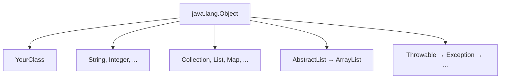

`Object.class.getSuperclass()` returns `null` — Object is the only class with no parent. Three practical consequences:

1. **Every reference is-a Object.** You can declare `Object o = anything;` and store any reference in it.
2. **Every class inherits Object's eleven methods.** They're always available; some are useful as-is, others should be overridden.
3. **The vtable of every class starts with Object's method slots** ([T04](./T04-inheritance-and-super.md)) — the JVM relies on Object's slot indexes being at known positions.

## The Eleven Methods

Object's instance methods (Java 21 / OpenJDK):

| # | Method | Purpose | Default behavior |
|---|--------|---------|------------------|
| 1 | `String toString()` | Human-readable representation | `ClassName@hexHash` |
| 2 | `boolean equals(Object o)` | Logical equality | identity (`this == o`) |
| 3 | `int hashCode()` | Hash code consistent with `equals` | identity hash code (mark word) |
| 4 | `Class<?> getClass()` | Runtime class | reads klass pointer |
| 5 | `Object clone()` | Shallow field copy | works only if class implements `Cloneable` |
| 6 | `void finalize()` | Pre-GC hook | does nothing; deprecated |
| 7 | `void wait()` | Release monitor and wait | blocks until notify |
| 8 | `void wait(long ms)` | Wait with timeout | blocks for up to `ms` |
| 9 | `void wait(long ms, int ns)` | Nanosecond precision wait | blocks for `ms`+`ns/1_000_000` |
| 10 | `void notify()` | Wake one waiting thread | signals one of the waiters |
| 11 | `void notifyAll()` | Wake all waiting threads | signals all waiters |

The constructor `Object()` is also implicitly inherited — every `<init>` chain bottoms out at `Object.<init>` ([T02](./T02-fields-methods-constructors-this.md)/[T04](./T04-inheritance-and-super.md)).

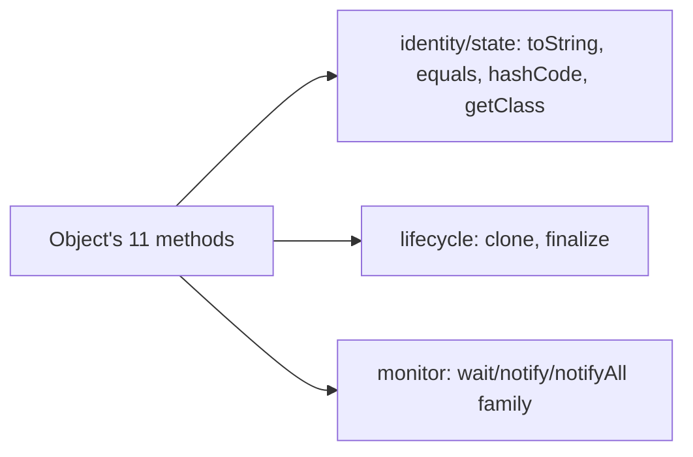

## `toString()`

Returns a string representation of the object. Useful for logging, debugging, and any `System.out.println(obj)` call (which calls `obj.toString()` internally).

The default:

```java
public String toString() {
    return getClass().getName() + "@" + Integer.toHexString(hashCode());
}
```

Output: `com.example.Point@4eec7777`. Almost never what you want for any class with state — override it.

```java
public class Point {
    int x, y;
    @Override
    public String toString() {
        return "Point(" + x + ", " + y + ")";
    }
}
```

Best practice: include the class name and the key fields. Records ([T14](./T14-record-types.md)) generate a sensible `toString` automatically (`Point[x=3, y=4]`).

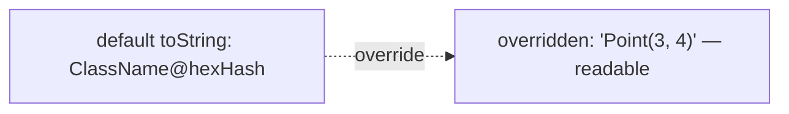

> [!TIP]
> Even for non-record classes, IDE-generated `toString` is the way to go. IntelliJ's "Generate → toString" handles the format and updates if fields change.

## `equals(Object o)`

Tests logical equality between objects. The default is identity:

```java
public boolean equals(Object obj) {
    return (this == obj);
}
```

For value types — classes whose objects are equal when their fields match — override `equals`:

```java
public class Money {
    private final long cents;
    private final String currency;

    @Override
    public boolean equals(Object o) {
        if (this == o) return true;
        if (!(o instanceof Money m)) return false;
        return cents == m.cents && currency.equals(m.currency);
    }
}
```

The canonical pattern:
1. Identity check (`this == o`) — quick win.
2. Type check via `instanceof` (Java 16+ pattern binding makes it cleaner).
3. Field-by-field comparison.

**You MUST override `hashCode` when you override `equals`** — the contract requires it. Full deep-dive in [T10](./T10-equals-hashcode-tostring-contracts.md).

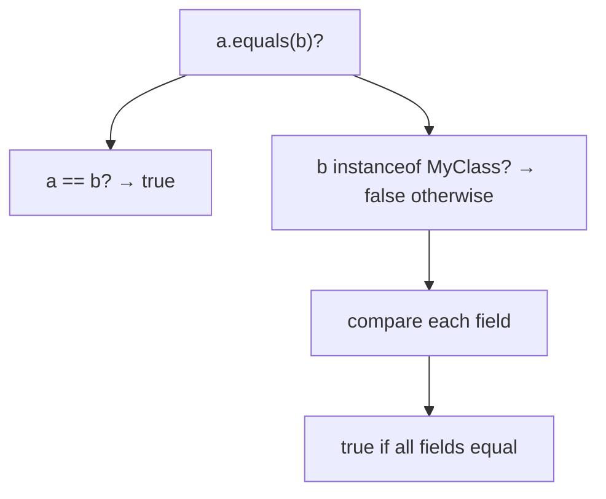

## `hashCode()`

Returns an `int` hash code used by hash-based collections (`HashMap`, `HashSet`, `Hashtable`, `LinkedHashMap`). The default returns the **identity hash code** — a value derived from the object's address (technically, lazily computed and cached in the mark word from [T01](./T01-classes-and-objects.md)).

For value types, override `hashCode` to match `equals`:

```java
@Override
public int hashCode() {
    return Objects.hash(cents, currency);
}
```

The **contract** between `equals` and `hashCode`:

1. If `a.equals(b)`, then `a.hashCode() == b.hashCode()` — required.
2. The reverse is *not* required (hash collisions are allowed).
3. The hash must be stable while the object is in a hash-based collection (avoid mutating fields used in `hashCode`).

Breaking this contract means `HashMap.get` may not find the value you `put`. The deep coverage is in [T10](./T10-equals-hashcode-tostring-contracts.md).

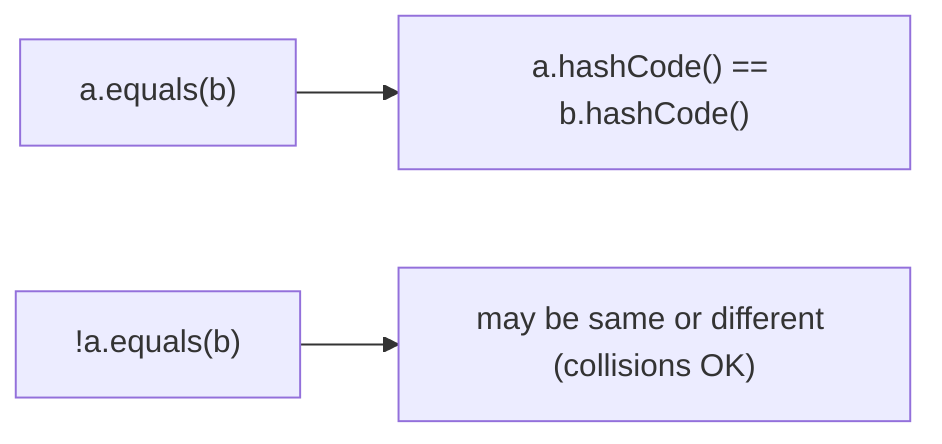

## `getClass()`

Returns the runtime `Class<?>` of the object — a handle to the **class metadata** in Metaspace ([T01](./T01-classes-and-objects.md)).

```java
Point p = new Point(3, 4);
Class<? extends Point> c = p.getClass();
System.out.println(c.getName());           // com.example.Point
System.out.println(c.getSimpleName());     // Point
System.out.println(c == Point.class);      // true — there's one Class per class
```

`getClass()` is `final` on Object — you cannot override it. The implementation reads the **klass pointer** from the object header (the 4-byte slot at header offset 8 on 64-bit compressed-oops HotSpot — [T01](./T01-classes-and-objects.md)).

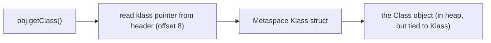

`Class<?>` is the entry point for **reflection** — `Method[] methods = c.getMethods();`, `Field[] fields = c.getDeclaredFields();`, `Annotation[] anns = c.getAnnotations();`. Reflection lives in `java.lang.reflect`; full coverage in [L1/C02/T17 Reflection](../C02-collections-and-core-apis/T17-reflection.md).

### `getClass()` vs `instanceof`

`getClass()` returns the *exact* class; `instanceof` checks "this or any subclass." Use accordingly:

```java
Animal a = new Dog();
a.getClass() == Dog.class;     // true
a.getClass() == Animal.class;  // false
a instanceof Animal;           // true (also Dog)
a instanceof Dog;              // true
```

`getClass()` for "exact type match"; `instanceof` for "is-a relationship." Both are fast (~1 ns).

## `clone()`

Produces a **shallow field-by-field copy** of the object. Requires the class to implement the marker interface `Cloneable`, which is a hack from early Java. The default `Object.clone` checks for the interface and throws `CloneNotSupportedException` if absent.

```java
public class Point implements Cloneable {
    int x, y;
    @Override
    public Point clone() {
        try {
            return (Point) super.clone();   // covariant return
        } catch (CloneNotSupportedException e) {
            throw new AssertionError(e);    // impossible since we implement Cloneable
        }
    }
}
```

Three problems with `clone`:

1. **Shallow copy.** Fields that are references are copied as references — both the original and the clone share the same nested objects. Mutating a nested object affects both.
2. **No constructor runs.** `Object.clone` does its work via JVM intrinsics; the class's constructor is skipped. Invariants that the constructor enforces may be bypassed.
3. **Awkward interface design.** `Cloneable` has no methods; it's a marker that `Object.clone` checks at runtime. The whole design is widely regarded as a mistake (Bloch, Effective Java item 13).

Modern alternatives:

- **Copy constructor**: `public Point(Point other) { this.x = other.x; this.y = other.y; }`. Explicit, type-safe.
- **Static factory**: `public static Point copy(Point other) { ... }`.
- **Records**: immutable, no copy needed.
- **Defensive copy**: `new ArrayList<>(other)`.

Use `clone` only when forced (e.g., implementing `Cloneable` for legacy APIs).

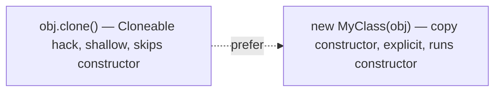

## `finalize()` — Deprecated

A method called by the GC **before reclaiming an unreachable object**. Historically used for cleanup (closing file handles, releasing native resources). **Deprecated since Java 9; finalization removal is planned (JEP 421).**

Problems:

- **Unreliable timing.** Finalizers may run long after the object is unreachable, or never (if the JVM exits first).
- **Performance.** Finalizable objects bypass fast-path allocation and are processed through a separate finalization queue.
- **Security and safety hazards.** A finalizer can resurrect a dying object by storing `this` in a global. Resurrection breaks GC invariants.

Modern replacements:

- **`try-with-resources`** + `AutoCloseable` ([L1/C02/T10](../C02-collections-and-core-apis/T10-custom-exceptions-and-try-with-resources.md)) — deterministic cleanup at scope exit.
- **`Cleaner`** (`java.lang.ref.Cleaner`) — a registration-based hook that runs on a background thread when the object becomes unreachable. Better than `finalize` but still non-deterministic.

```java
public class Resource implements AutoCloseable {
    private final FileChannel channel;
    public Resource(Path p) throws IOException {
        this.channel = FileChannel.open(p);
    }
    @Override
    public void close() throws IOException {
        channel.close();
    }
}

try (Resource r = new Resource(path)) {
    // use r
}   // close() called deterministically at end of block
```

> [!WARNING]
> Do not write new `finalize()` methods. Use `try-with-resources` for deterministic cleanup; use `Cleaner` for non-deterministic backup. JEP 421 (Deprecate Finalization for Removal) signals the language's commitment to ending finalization.

## Monitor Methods — `wait`, `notify`, `notifyAll`

Every Java object has an **intrinsic monitor** (a lock and a wait set) — part of the object header's mark word ([T01](./T01-classes-and-objects.md)). The monitor methods coordinate threads via this monitor.

```java
synchronized (obj) {
    while (!condition) {
        obj.wait();    // releases monitor; blocks until notify
    }
    // ... condition is true here
}

// elsewhere:
synchronized (obj) {
    condition = true;
    obj.notify();      // wake one waiter
}
```

Three rules:

1. **`wait`/`notify`/`notifyAll` must be called from inside a `synchronized` block on the same object.** Otherwise `IllegalMonitorStateException`.
2. **`wait` releases the monitor while blocked** and re-acquires it before returning. Other threads can enter the same `synchronized` block while one is waiting.
3. **`notify` wakes one waiter** (no guarantee which); `notifyAll` wakes all.

Full mechanism — biased locking history, mark-word bit transitions, JMM happens-before edges — is in **L3/C01 Concurrency**. For this topic, recognize the methods exist on every object and their basic usage.

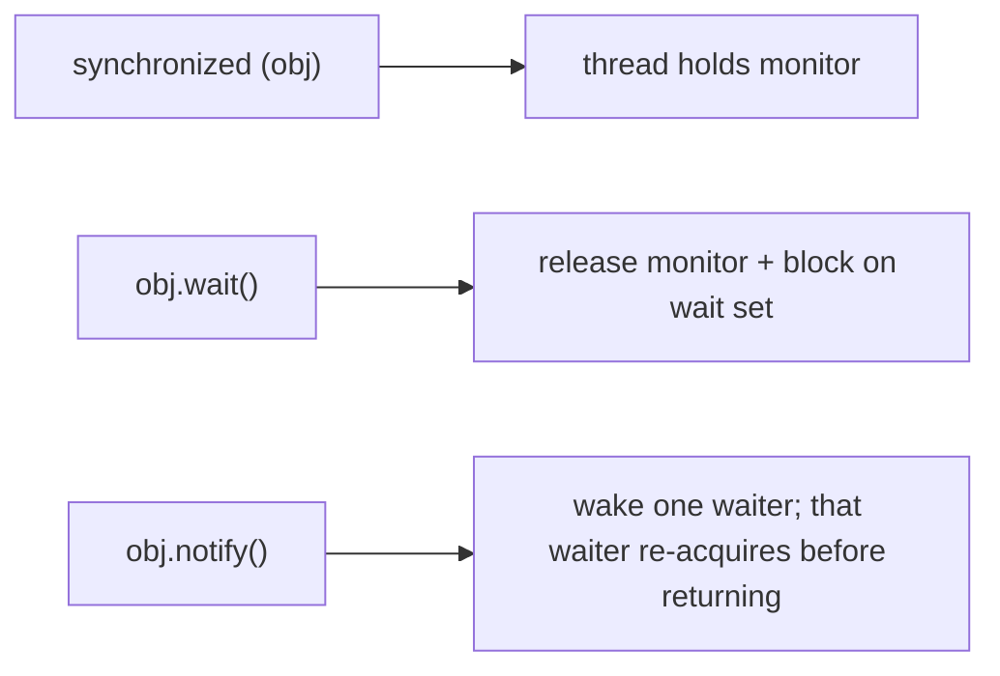

> [!INTERVIEW]
> "Why are `wait`/`notify` on Object and not on Thread?" Because the wait set belongs to the **monitor of an object**, not to a thread. Multiple threads can be waiting on the same object; multiple objects can have waiters. The object is the synchronization point. (Modern code prefers `java.util.concurrent.locks` over intrinsic monitors anyway — covered L3/C01.)

### Reference Objects in Physical Memory

`WeakReference`, `SoftReference`, and `PhantomReference` are real heap objects with measurable cost. Their layouts on a 64-bit compressed-oops JVM:

```
java.lang.ref.Reference (abstract base):
  +0:   header              ; 12 bytes
  +12:  referent            ; 4 bytes (compressed ref to the actual object)
  +16:  queue               ; 4 bytes (ref to ReferenceQueue, or special sentinel)
  +20:  next                ; 4 bytes (next in pending/enqueue linked list)
  +24:  discovered          ; 4 bytes (GC-internal: discovered chain during marking)
  +28:  padding             ; 4 bytes (align to 8)
  total: 32 bytes
```

`WeakReference` and `SoftReference` add no fields — both are 32 bytes. `PhantomReference` adds nothing either. `SoftReference` does add a `timestamp` (`long` for last-access time, 8 bytes), making it **40 bytes** total.

**Cost of using reference types:**

| Strategy | Per-element overhead |
|----------|---------------------|
| Strong reference (just a field) | 4 bytes (compressed ref) |
| `WeakReference<T>` | 4 (ref) + 32 (Reference object) = **36 bytes** |
| `SoftReference<T>` | 4 (ref) + 40 (Reference object) = **44 bytes** |
| `PhantomReference<T>` + `Cleaner` registration | 4 + 32 + ~16 (Cleanable bookkeeping) = **52 bytes** |

A `WeakHashMap<String, byte[]>` with 1 million entries: ~36 MB of Reference objects in addition to the map's main data. **Not free.**

### ObjectMonitor in Physical Memory

When a contended `synchronized` block inflates an object's lock to a heavyweight `ObjectMonitor`, the JVM allocates a real C++ struct **outside the Java heap** (in the JVM's own native allocation pool). Its size on x86-64 OpenJDK:

```
ObjectMonitor (C++ struct in libjvm):
  +0:    _header (markWord*)        ; 8 bytes
  +8:    _object (oop)               ; 8 bytes
  +16:   _allocation_state           ; 8 bytes
  +24:   _owner (Thread*)            ; 8 bytes — current lock holder
  +32:   _previous_owner_tid         ; 8 bytes
  +40:   _recursions                 ; 8 bytes — nested re-entry count
  +48:   _EntryList                  ; 8 bytes — doubly-linked parked waiters
  +56:   _cxq (Contention Queue)     ; 8 bytes — spinning queue
  +64:   _succ (Thread*)             ; 8 bytes — preselected next owner
  +72:   _WaitSet                    ; 8 bytes — obj.wait() threads
  +80:   _waiters (count)            ; 4 bytes
  +84:   _WaitSetLock                ; ~4 bytes
  +88:   ...                          ; recursion stats, ~8 more bytes
  total: ~96-128 bytes per ObjectMonitor
```

A heavily-contended application with 1,000 inflated monitors burns **~100 KB of native memory** (not Java heap). When monitors deflate, the struct is recycled to a global pool — typical steady-state pool size is a few hundred KB.

### Synchronized Fast-Path — Cycle-by-Cycle CPU Trace

The uncontended thin-lock fast path that the JIT inlines into a `synchronized(obj) { ... }` block:

```
; Acquire (thin lock attempt)
mov   r10, [rdi + 0]               ; ~4 cycles — load current mark word
mov   r11, r10
or    r11, 1                       ; set the "thin-locked" bit pattern
lea   r12, [rsp - 16]              ; r12 = address of a BasicLock on stack
mov   [r12 + 0], r10               ; save displaced mark word in BasicLock
lock cmpxchg [rdi + 0], r12        ; ~25 cycles — atomic install BasicLock ptr in mark word
jne   slow_path                    ; failed CAS = contention → slow path

; --- inside synchronized block: user code runs ---

; Release
mov   r10, [r12 + 0]               ; ~1 cycle — load saved mark word
lock cmpxchg [rdi + 0], r10        ; ~25 cycles — restore mark word
jne   slow_path_release            ; deflation/inflation happened
```

**Total uncontended synchronized: ~55 cycles ≈ 18 ns** — dominated by the two `lock cmpxchg` operations (each ~25 cycles on modern Intel, slightly faster on AMD Zen 4+).

Under contention, the slow path inflates to an ObjectMonitor:

```
slow_path:
    ; ~200-500 cycles of allocation + CAS install of monitor ptr
    ; if still contended, park via futex (Linux) / WaitForSingleObject (Windows)
    ; futex syscall: ~5,000-10,000 cycles (~2-3 µs)
```

Contention costs explode by **100×** compared to uncontended. This is why lock granularity matters in concurrent Java code, and why `java.util.concurrent.locks.ReentrantLock` (which has more flexible queueing) is sometimes preferred for known-contended hot spots.

### Identity Hash Generation — Memory Write Cost

`obj.hashCode()` (default identity version) is a single mark-word read most of the time:

```
mov   rax, [rdi + 0]               ; ~4 cycles — load mark word
test  rax, HASH_BIT_MASK            ; check if hash exists
jz    generate_new                   ; not yet computed
shr   rax, HASH_SHIFT                ; extract hash bits
and   rax, HASH_VALUE_MASK
ret
```

Cost: **~5 cycles ≈ 1.5 ns** when the hash is already cached. When generating for the first time:

```
generate_new:
    call   thread_local_lcg_advance ; ~10 cycles — Park-Miller LCG
    ; build new mark word with hash bits set
    lock cmpxchg [rdi + 0], new_mw  ; ~25 cycles — install atomically
    ret
```

Cost: **~40 cycles ≈ 12 ns** on first call. The result is cached in the mark word for the object's lifetime; subsequent calls hit the fast path. **This is why "hashCode is O(1)" — it's literally a single load on the warm path.**

## Architecture Layer — Object's Vtable Presence

Every class's vtable starts with slots for Object's methods. These slot indexes are **JVM-internal constants** known to the runtime — `equals` is always at the same slot index in every class's vtable, so a polymorphic `equals` call can dispatch in one indexed lookup.

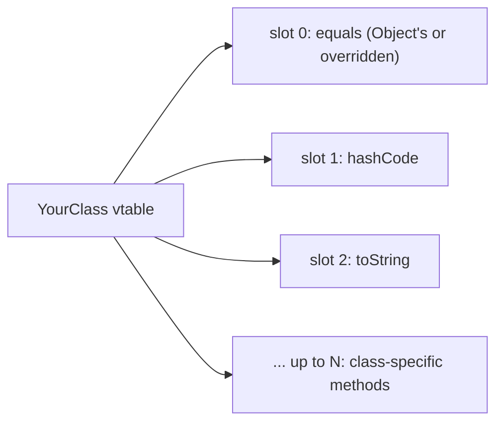

This is one of the (many) reasons Java's universal root design is performance-friendly: the JIT knows where to find `equals`, `hashCode`, `toString` on any object without runtime search.

Other architectural touches:

- **`getClass()` reads one machine word.** It's effectively free (~1 ns).
- **`identityHashCode` is cached in the mark word.** Lazy: zero until first call, then computed and stored.
- **Monitor methods involve atomic mark-word manipulation** — `lock cmpxchg` on x86; LL/SC on ARM. ~20–50 ns uncontended; orders of magnitude more under contention.

## Deeper JVM Internals — Mark Word Transitions, ObjectMonitor, Identity Hash, and Reference Types

`Object`'s methods touch the deepest parts of the JVM: the **mark word bit layout** that drives both `hashCode` and the monitor methods; the **`ObjectMonitor`** struct that backs inflated locks; the **identity hash generation** algorithm; and the **`java.lang.ref` family** that replaces `finalize` for cleanup. This section walks them.

### Mark Word Bit Layout — State by State

Recall from [T01 deeper section](./T01-classes-and-objects.md#deeper-jvm-internals--what-a-class-really-is-at-runtime) that the mark word's bottom 2 bits encode the state. The full layouts on 64-bit HotSpot (post-Java-15, biased locking removed):

```
Unlocked (no hash yet):
  bits 63......................................2  1  0
       | unused (62 bits, all zeros)            |    | 01 |

Unlocked + hash computed:
  bits 63........33  32..............3  2  1  0
       | unused    | identity_hash    |  | age (4) | 01 |
       Wait, the layout is:
  bits 63........38  37..........34  33..........3  2..0
       | identity_hash (31)        | age (4)    | unused | lock (2 = 01) |

Thin-locked (stack-locked, lock held by one thread, no contention):
  bits 63..............................2  1  0
       | ptr to BasicLock on thread stack |    | 00 |

Inflated (ObjectMonitor allocated; lock contended at some point):
  bits 63..............................2  1  0
       | ptr to ObjectMonitor*           |    | 10 |

Marked-for-GC (during collection; reused mark word bits as forwarding pointer):
  bits 63..............................2  1  0
       | forwarding ptr                   |    | 11 |
```

(Numbers slightly differ across JVM versions; this is the modern OpenJDK layout.)

The state transitions:

| From | Trigger | To |
|------|---------|-----|
| Unlocked | first `synchronized(obj)` | Thin-locked |
| Thin-locked | contention from another thread | Inflated |
| Inflated | last waiter releases + monitor deflation | Unlocked (with hash, if any) |
| Unlocked | first `obj.hashCode()` call | Unlocked-with-hash (in place) |
| Any | GC marking phase | Marked-for-GC (transient) |

A subtle interaction: **identity hash and thin-lock fight for the same bits.** If `obj.hashCode()` was called (so the mark word holds the hash), the JVM cannot use thin-locking — the hash bits would be overwritten by the stack-lock pointer. Synchronization on a hash-bearing object goes straight to inflation. Code paths that frequently synchronize on the same object should avoid calling `hashCode()` on it to keep thin-locking available.

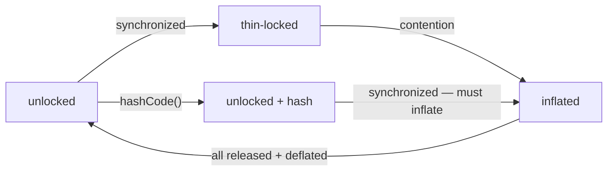

### ObjectMonitor — The Heavyweight Lock

When a thin lock inflates, the JVM allocates an **`ObjectMonitor`** struct (in C++ heap, not Java heap). The mark word is rewritten to hold a pointer to this struct + the `10` lock-state bits.

ObjectMonitor fields (approximate):

| Field | Purpose |
|-------|---------|
| `_owner` | thread* currently holding the lock; null if unlocked |
| `_recursions` | count of nested acquisitions by `_owner` |
| `_cxq` | "ContentionQueue" — singly-linked list of threads spinning to acquire |
| `_EntryList` | doubly-linked list of threads parked waiting for the lock |
| `_WaitSet` | doubly-linked list of threads in `obj.wait()` |
| `_succ` | thread* preselected to be next owner (avoids thundering-herd wake) |
| `_object` | back-pointer to the heap object this monitor backs |

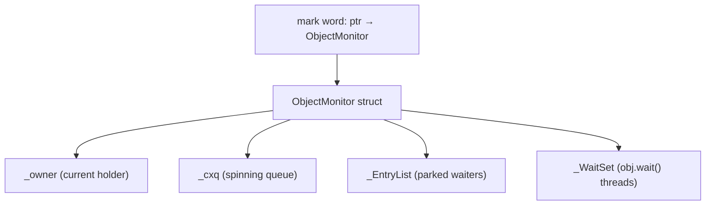

**Costs by state:**

| Operation | Latency |
|-----------|---------|
| Uncontended thin-lock acquire | ~20 cycles (one `lock cmpxchg`) |
| Uncontended inflated acquire | ~40–60 cycles (CAS + branch) |
| Contended acquire (spin then park) | hundreds of ns to microseconds |
| `obj.wait()` (parked) | OS futex syscall, microseconds |
| `obj.notify()` (one waiter selected) | ~100 ns |
| `obj.notifyAll()` (all waiters scheduled) | proportional to wait set size |

### Monitor Deflation

ObjectMonitors are expensive. The JVM **deflates** them when:
- The owner releases.
- The wait set is empty.
- The entry list is empty.
- A safepoint occurs.

Deflation transitions the mark word back to unlocked (or unlocked+hash) and recycles the ObjectMonitor for the global pool. The thread that triggers deflation is typically the GC's safepoint operation or a dedicated deflation thread.

This is why "synchronization overhead is paid only when needed" — long-uncontended monitors are deflated, freeing the heavyweight struct.

### Identity Hash Code Generation Algorithm

`System.identityHashCode(obj)` returns the value derived from the object's identity, stored in the mark word. The first call generates and caches; subsequent calls read the cache.

HotSpot has three algorithms selectable via `-XX:hashCode=N`:

| N | Algorithm |
|---|-----------|
| 0 | Random — `os::random()` (LCG-based, fast) |
| 1 | Memory-address based: `(obj_address >> 3) ^ thread_state ^ stamp` |
| 2 | Identity hash code disabled (returns 1 always — testing only) |
| 3 | Linear sequence — incrementing per-thread counter |
| 4 | Object address directly (unsafe — addresses change under GC) |
| 5 | DCE-Park-Miller LCG, thread-local state (modern default) |

The default (5) is a thread-local linear-congruential generator: each thread holds an integer state; `hashCode()` advances the state by Park-Miller's multiplier and XOR-mixes to get the hash. Fast (~1 ns), well-distributed, deterministic per thread.

The hash is **stored in the mark word** at first call. It's 31 bits (the highest bit collides with a state flag); collisions are possible across many objects but distributed enough to be useful for `HashMap`.


The mark word storage is what makes the hash **stable across GC moves**: even when the GC relocates the object to a new memory address, the hash value travels in the header. This is the *only* sense in which "the hash code is based on identity" — it's not the current address, but a once-generated value tied to the object's identity for life.

### The `java.lang.ref` Family — Cleanup Without `finalize`

`finalize` is replaced by the **reference type** family in `java.lang.ref`:

| Type | When cleared/enqueued | Use case |
|------|----------------------|----------|
| `WeakReference<T>` | when no strong refs left; before GC reclaim | caches that should not prevent collection |
| `SoftReference<T>` | when no strong refs left; on memory pressure | memory-sensitive caches |
| `PhantomReference<T>` | when fully unreachable, before reclaim | post-mortem cleanup hooks |

Each type has a constructor accepting a `ReferenceQueue`. When the GC decides the referenced object is collectible, it:
1. Clears the reference (`get()` will return `null` for Weak/Soft; PhantomReferences' `get()` always returns `null`).
2. Enqueues the reference object into its queue.

A **cleanup thread** (the application's, or `Cleaner`'s internal one) polls the queue and processes each cleared reference.

### `Cleaner` Internals

`java.lang.ref.Cleaner` (Java 9+) is a class that wraps the boilerplate of `PhantomReference` + reference queue + cleanup thread. Internally:

```java
public final class Cleaner {
    private final ReferenceQueue<Object> queue;
    private final Thread cleanupThread;

    public Cleanable register(Object obj, Runnable cleanup) {
        PhantomCleanable pc = new PhantomCleanable(obj, queue, cleanup);
        return pc;
    }

    // background thread:
    void run() {
        while (true) {
            Reference<?> r = queue.remove();          // blocks until enqueued
            ((Cleanable) r).clean();                  // runs the cleanup Runnable
        }
    }
}
```

Each `PhantomCleanable` holds a strong reference to its `Runnable`. When the registered object becomes unreachable, GC enqueues the PhantomCleanable; the cleanup thread runs the Runnable.

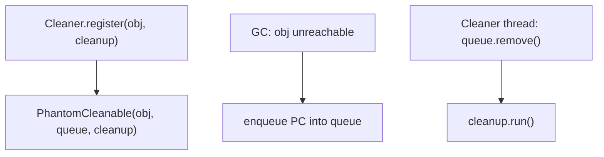

**Critical rule**: the `Runnable` (and its captured state) must NOT hold a strong reference to the registered object — otherwise the object stays reachable forever. This is the same rule as for `finalize` but explicit and harder to forget. Lambdas that capture `this` of the registered object create the bug instantly; pass a static method or a separate "holder" object.

### `Cleaner` vs `try-with-resources` — When Each Is Right

- **`try-with-resources` + `AutoCloseable`** — for resources whose lifetime is **scoped** to a method or block. Deterministic; runs at scope exit. Always preferred.
- **`Cleaner`** — for resources whose lifetime is tied to **object lifetime** (cannot be predicted by the caller). Non-deterministic; runs sometime after the object becomes unreachable. Backup safety net.
- **`finalize`** — never. Deprecated; will be removed.

A class with native resources typically uses **both**: `try-with-resources` for the normal close path, `Cleaner` as a fail-safe if the caller forgets:

```java
public final class NativeBuffer implements AutoCloseable {
    private static final Cleaner CLEANER = Cleaner.create();
    private final Cleaner.Cleanable cleanable;
    private final long nativePtr;

    public NativeBuffer(int size) {
        this.nativePtr = malloc(size);
        this.cleanable = CLEANER.register(this, new ReleaseAction(nativePtr));
    }
    @Override public void close() { cleanable.clean(); }   // explicit cleanup

    private record ReleaseAction(long ptr) implements Runnable {
        @Override public void run() { free(ptr); }         // no ref to NativeBuffer
    }
}
```

### Native Intrinsics for Object Methods

HotSpot recognizes certain Object methods as **intrinsics** and emits inline native code instead of going through the normal call:

- `Object.getClass()` — inlined as a single klass-pointer load.
- `Object.hashCode()` — inlined as mark-word read + Park-Miller generation.
- `System.identityHashCode(o)` — same as above.
- `Object.equals(Object)` (the default) — inlined as a pointer compare.

These intrinsics are why "Object methods are essentially free" — they're not even real method calls in compiled code. `-XX:+PrintIntrinsics` lists what was intrinsified.

### The Mark Word and GC

During garbage collection, the mark word is repurposed as a **forwarding pointer** during compaction. The original mark word's contents (lock state, hash) are saved aside before GC marks the object; restored after.

This is why **stop-the-world GCs can rewrite mark words atomically** — at a safepoint, no application thread is reading or writing them; the GC has free rein.

ZGC and Shenandoah (concurrent GCs) handle this differently: they use **load barriers** to repair forwarding-pointer reads on the fly. The cost is paid per reference read, not at a single STW pause.

## Common Mistakes

> [!WARNING]
> **Overriding `equals` without `hashCode`.** Breaks hash-based collections. [T10](./T10-equals-hashcode-tostring-contracts.md) deep-dives.

> [!WARNING]
> **Default `toString` in production logs.** `Point@4eec7777` doesn't tell you what point it was. Always override `toString` for any class with state.

> [!WARNING]
> **Using `clone()` for deep copies.** It's shallow. Use copy constructors or the `Cloneable` interface only when forced by legacy APIs.

> [!WARNING]
> **Writing new `finalize()` methods.** Deprecated, unreliable, slow. Use `try-with-resources` for deterministic cleanup; `Cleaner` for non-deterministic backup.

> [!WARNING]
> **`wait`/`notify` outside `synchronized`.** Runtime `IllegalMonitorStateException`. Either synchronize first or use `java.util.concurrent.locks`.

> [!WARNING]
> **Confusing `getClass()` with `instanceof`.** `getClass()` checks exact type; `instanceof` checks IS-A. Use the right one for your purpose.

> [!WARNING]
> **Trying to override `getClass()`.** It's `final` on Object. The JVM hard-codes its behavior to read the klass pointer.

> [!WARNING]
> **Calling `notify` instead of `notifyAll`.** `notify` wakes one arbitrary waiter; if it's the wrong one for the actual condition, the right one keeps sleeping. Prefer `notifyAll` unless you have a proven optimization.

> [!INTERVIEW]
> Common interview questions:
> 1. **How many methods are on Object?** Eleven (Java 21): `toString`, `equals`, `hashCode`, `getClass`, `clone`, `finalize`, `wait` (3 overloads), `notify`, `notifyAll`. Plus the `Object()` constructor.
> 2. **What's the default `equals`?** Identity equality (`this == o`).
> 3. **What's the default `hashCode`?** Identity hash code — derived from the object's identity, cached in the mark word.
> 4. **Why does the JVM cache the identity hash code in the mark word?** Successive `hashCode()` calls must return the same value, but the GC may relocate the object — without caching, the hash would change. Storing it in the mark word freezes it for the object's lifetime.
> 5. **Why is `clone` deprecated-by-convention?** Shallow, skips the constructor, requires `Cloneable` hack. Modern Java uses copy constructors, factories, or records.
> 6. **Why is `finalize` deprecated?** Unreliable timing; performance cost; security hazards (resurrection). Replaced by `try-with-resources` + `Cleaner`.
> 7. **Why are `wait`/`notify` on Object?** The wait set belongs to the monitor of an object, not to a thread. Multiple threads can wait on one object.
> 8. **What's the difference between `notify` and `notifyAll`?** `notify` wakes one arbitrary waiter; `notifyAll` wakes all. Prefer `notifyAll` for correctness.
> 9. **Can you override `getClass`?** No — it's `final` on Object. The JVM hard-codes it to read the klass pointer.
> 10. **What's the cost of `obj.getClass()`?** One machine-word load from the object header. ~1 ns.
> 11. **How does the JVM know `equals`'s vtable slot?** Object's methods are at fixed slot indexes known to the runtime; every class's vtable starts with them.
> 12. **What's a marker interface like `Cloneable` actually do?** Nothing at runtime by itself; serves as a flag the JVM/clone implementation checks. Modern code prefers annotations or sealed interfaces.

## Practice

1. **Default `toString` observation.** Create a `Point` without overriding `toString`. Print it. Observe `com.example.Point@hex`. Override; observe readable output.

2. **Identity vs value equality.** Create two `Point` instances with same fields. Compare `==`, default `.equals` (both false). Override `equals`; rerun (`==` still false, `.equals` true).

3. **`hashCode` consistency with `equals`.** Override `equals` field-by-field but NOT `hashCode`. Add two equal points to a `HashSet`; observe both got added (broken contract). Override `hashCode` to match; rerun, observe set size is 1.

4. **`getClass()` exact vs `instanceof`.** Create `Animal a = new Dog()`. Compare `a.getClass() == Animal.class` (false) vs `a instanceof Animal` (true). Compare `a.getClass() == Dog.class` (true) vs `a instanceof Dog` (true).

5. **`Class<?>` reflection.** Use `getClass().getDeclaredFields()` to list all fields of an object. Use `getDeclaredMethods()` to list all methods.

6. **Shallow `clone` trap.** Create a class with a `List<String>` field, implement `Cloneable`, clone. Mutate the clone's list. Observe the original's list was mutated too. Refactor to deep-copy the list explicitly.

7. **Copy constructor refactor.** Replace `clone` with a copy constructor. Verify clarity is better and the original/clone share no state.

8. **`AutoCloseable` for cleanup.** Build a `Resource implements AutoCloseable`. Use it in `try (...)`. Observe `close()` runs deterministically. Then compare with a `finalize()` version; observe non-deterministic cleanup.

9. **`Cleaner` for non-deterministic cleanup.** Build a class registered with `Cleaner` for resource release. Compare to `finalize` — `Cleaner` is preferred but still non-deterministic.

10. **`wait`/`notify` IllegalMonitorStateException.** Call `obj.wait()` outside a `synchronized` block. Observe the exception. Wrap in `synchronized (obj)` to fix.

11. **`notify` vs `notifyAll` race.** Set up two waiters waiting on different conditions on the same object. Call `notify`. Observe potential deadlock if the wrong waiter wakes. Switch to `notifyAll`; observe both wake (one re-waits if its condition isn't met).

12. **Vtable slot inspection.** Use SA or jol-cli to dump a class's vtable. Confirm `equals`, `hashCode`, `toString` are at predictable slot indexes inherited from Object.

13. **Identity hash code in mark word.** Use JOL to dump an object's mark word before and after `obj.hashCode()`. Observe the hash bits getting populated on first call.

14. **`getClass() == final` proof.** Try to override `getClass()` in your class. Observe compile error.

15. **End-to-end explain-it-back.** Take `Point p = new Point(3, 4); System.out.println(p);`. Trace through: (a) `Point` extends `Object` implicitly; (b) `new Point()` runs `Object.<init>` via the constructor chain; (c) `System.out.println(Object)` calls `obj.toString()`; (d) `invokevirtual Object.toString:()Ljava/lang/String;` dispatches via vtable to `Point.toString` (if overridden) or `Object.toString` (default); (e) `Object.toString` calls `getClass().getName() + "@" + Integer.toHexString(hashCode())`; (f) `hashCode` reads identity hash from mark word (or computes + caches). Twelve sentences max.

## Recap

You should now be able to:

**Language layer.**

- Name the eleven methods on `Object` and what each does at the default level.
- Recognize that every class implicitly extends `Object` and inherits all eleven.
- Distinguish identity equality (`==`, default `equals`) from value equality (overridden `equals`).
- Override `toString`, `equals`, and `hashCode` for value-bearing classes, respecting their contracts.
- Choose between `getClass()` (exact type) and `instanceof` (IS-A relationship).
- Avoid `clone` in new code; prefer copy constructors or static factories or records.
- Avoid `finalize`; use `try-with-resources` + `AutoCloseable` for deterministic cleanup, `Cleaner` for non-deterministic backup.
- Use monitor methods (`wait`/`notify`/`notifyAll`) only inside `synchronized` blocks on the same object.

**Memory layer.**

- Identify Object's vtable slots as the first entries in every class's vtable, at known indexes.
- Locate the identity hash code in the object header's mark word; recognize it's lazy and cached.
- Identify `getClass()` as a one-instruction klass-pointer load.
- Recognize the monitor data (lock state, wait set, GC age) as packed into the mark word.

**Architecture layer.**

- Quantify Object-method costs: `getClass` ~1 ns; `hashCode` ~1–3 ns (with mark-word read); `equals` default ~1 ns (pointer compare); monitor operations ~20–50 ns uncontended.
- Recognize the JIT inlines all of these in hot code.
- Apply the eq/hashCode contract correctly to avoid silent bugs in hash-based collections.

The next topic ([T10 equals, hashCode, toString contracts](./T10-equals-hashcode-tostring-contracts.md)) deep-dives the three methods you'll most often override and the contract you must preserve. This is the most-asked-about part of `Object` in interviews and the most-broken in production code.

## Next

Continue to [equals, hashCode, toString contracts](./T10-equals-hashcode-tostring-contracts.md) — the precise rules every override of `equals` must follow (reflexive, symmetric, transitive, consistent, null-safe), the contract that `equals` and `hashCode` jointly maintain, and the patterns that get it right. Records ([T14](./T14-record-types.md)) generate compliant implementations automatically; for non-record classes, T10 shows you how.
