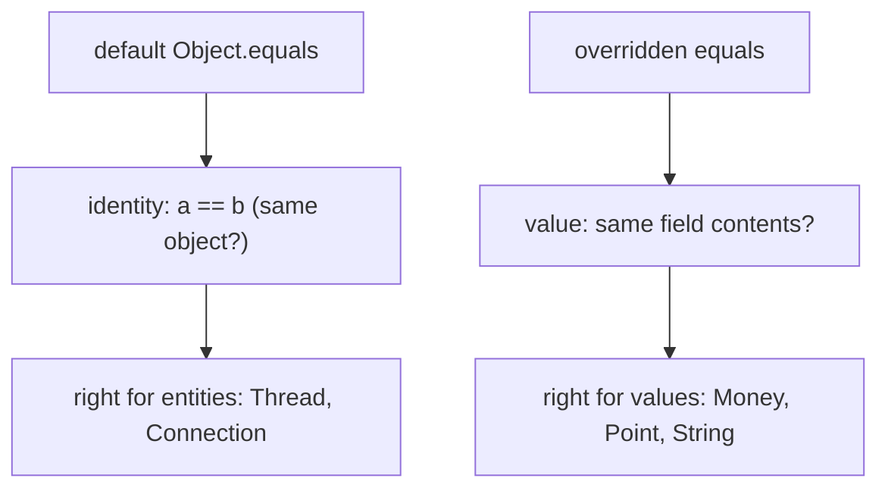
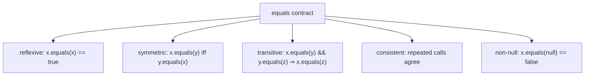
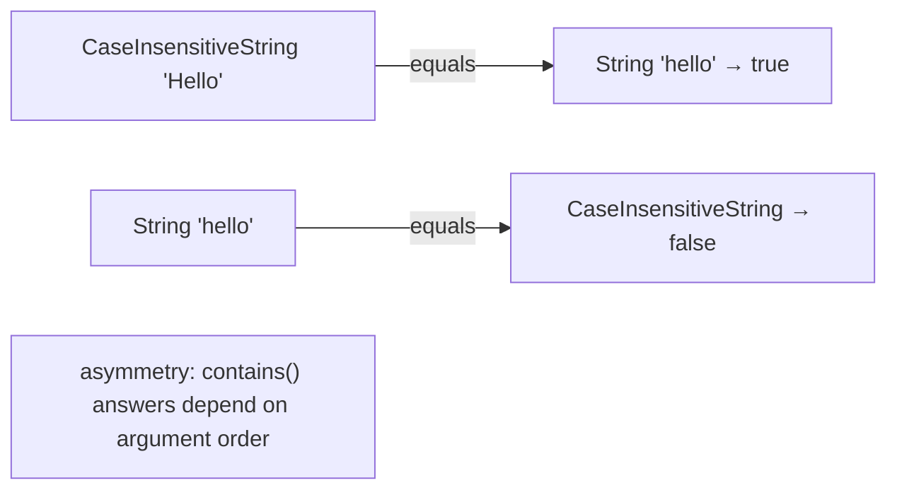
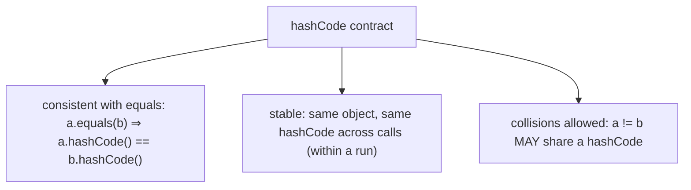
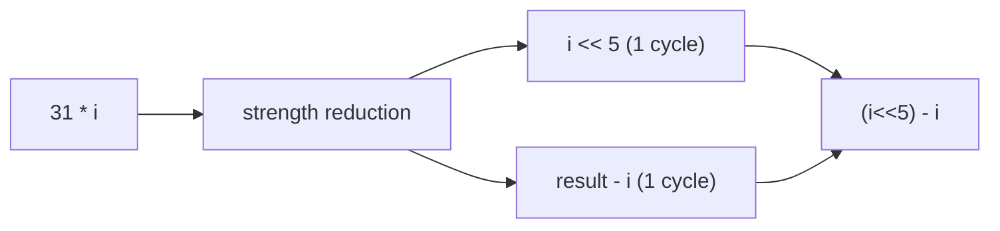
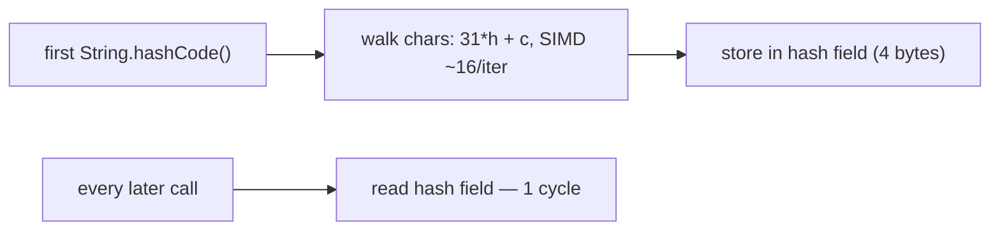
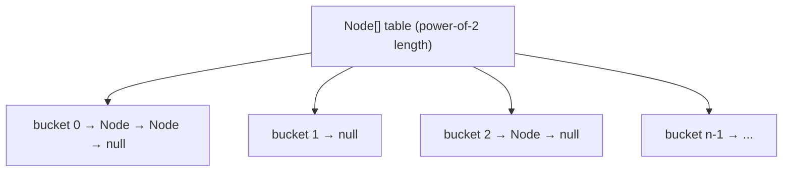
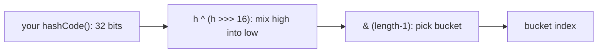
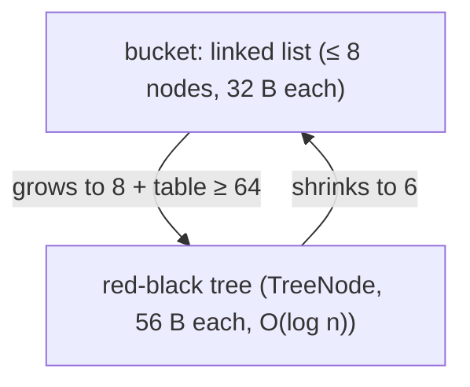
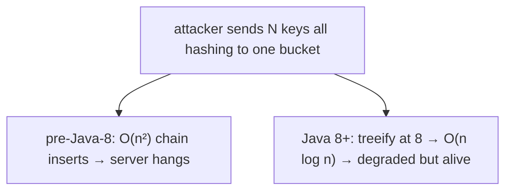

# equals, hashCode, toString contracts

Three methods on `Object` define how your objects *compare*, *hash*, and *print*: `equals(Object)`, `hashCode()`, and `toString()`. [T09](./T09-object-class-and-its-methods.md) introduced them at the surface — their defaults and when to override. This topic is the deep treatment, because these three methods carry **contracts** the language doesn't enforce but the entire collections framework silently depends on. Override `equals` without `hashCode` and your objects vanish from `HashSet`s. Write an asymmetric `equals` and `list.contains()` returns different answers depending on argument order. Mutate a field used in `hashCode` after putting the object in a `HashMap` and the entry becomes unreachable — still in the map, occupying memory, but `get` can never find it. These are not theoretical: they are the single most common category of subtle bug in production Java, and the most-asked-about topic in Java interviews.

The depth bar here is not just "here's the recipe." It's understanding **why** the contracts have the exact shape they do (they encode the mathematical properties of an equivalence relation, which hash tables require to function); **how** the methods physically interact with memory (the identity hash cached in the mark word, `String`'s dedicated `hash` field, the `HashMap.Node[]` table, the red-black `TreeNode` treeification at bucket size 8); and **how** they execute on the processor (why the multiplier 31 is chosen for *strength reduction* into a shift-and-subtract, how collision-chain walks thrash the cache, how a maliciously-crafted set of colliding keys turns an O(1) `HashMap` into an O(n²) denial-of-service vector). By the end you will write contract-correct implementations by hand, know exactly when to let records or Lombok generate them, and be able to reason about the memory and CPU cost of every hash-based lookup in your program.

> [!NOTE]
> Prerequisites: [Object class & its methods](./T09-object-class-and-its-methods.md) (`L1/C01/T09`) — the eleven Object methods, default `equals`/`hashCode`/`toString`, identity hash in the mark word; [Classes & objects](./T01-classes-and-objects.md) (`L1/C01/T01`) — object header, mark word, heap layout; [Fields, methods, constructors, this](./T02-fields-methods-constructors-this.md) (`L1/C01/T02`) — `final` fields, immutability; [Encapsulation](./T03-encapsulation-and-access-modifiers.md) (`L1/C01/T03`) — why immutable fields make safe hash keys.

## Why Value Equality Exists — The Design Problem

By default, every Java object is equal only to itself. `new Point(3,4).equals(new Point(3,4))` is `false` because the inherited `Object.equals` compares **identity** — are these the same object in memory? — not **state** — do they hold the same values? ([T09](./T09-object-class-and-its-methods.md)).

This default is *correct* for entities with identity: a `Thread`, a database `Connection`, a UI `Window`. Two threads with identical names are still two different threads. But it is *wrong* for **value types** — `Money`, `Point`, `LocalDate`, `Color`, `String`. Two `Money(100, "USD")` objects represent the *same amount*; a program that treats them as different is broken. The whole point of a value type is that its identity doesn't matter, only its contents.

So the language gives you a hook: override `equals` to define *what equal means for your type*, and the collections framework, your business logic, and every `if (a.equals(b))` will use your definition.



### How Other Languages Handle This — and What Java's Choice Costs

The "value equality" problem is universal; every language solves it, and the trade-offs are instructive:

| Language | Equality mechanism | Hashing mechanism | Contract enforcement |
|----------|--------------------|--------------------|----------------------|
| **Java** | override `equals(Object)` | override `hashCode()` | **none** — silently broken if you forget |
| **C++** | overload `operator==` (non-virtual) | specialize `std::hash<T>` (separate) | none; two unrelated mechanisms |
| **Python** | define `__eq__` | define `__hash__` | **partial** — defining `__eq__` without `__hash__` makes the object *unhashable* |
| **Rust** | derive/impl `PartialEq` + `Eq` | derive/impl `Hash` | **compile-time** — `HashMap` keys must be `Eq + Hash` |
| **C#** | override `Equals` + `==` operator | override `GetHashCode` | none (like Java); analyzers warn |
| **Kotlin** | `data class` auto-generates | auto-generates | enforced for data classes |

Three of these are worth studying because they show what Java *didn't* do:

**Python disables hashing when you change equality.** If you write `__eq__` but not `__hash__`, Python sets `__hash__ = None`, and any attempt to use the object as a dict key raises `TypeError: unhashable type`. Python's designers decided: *if you redefined equality, you almost certainly broke the default identity hash, so we'll stop you from using a broken hash rather than let you corrupt a dict silently.* Java made the opposite choice — it lets you break it and find out at runtime when your `HashMap` misbehaves.

**Rust encodes the reflexivity property in the type system.** Rust has *two* equality traits: `PartialEq` (equality that may not be reflexive) and `Eq` (a marker trait promising reflexivity — `a == a` always). Floating-point types implement `PartialEq` but **not** `Eq`, because `NaN != NaN` violates reflexivity. A `HashMap` key must be `Eq + Hash` — so the compiler *rejects* using a bare `f64` as a hash key, forcing you to handle the NaN problem explicitly. Java has no such distinction; you can use `Double` as a `HashMap` key and the NaN trap is yours to discover. This is the single sharpest illustration of why the `equals` contract's five properties matter — Rust lifted one of them (reflexivity) into a compile-checked trait.

**C++ keeps equality and hashing completely unrelated.** `operator==` and `std::hash` are separate; nothing ties them together. The contract "equal objects must hash equal" exists only in documentation and programmer discipline. Java at least co-locates both methods on `Object` and documents the joint contract — a middle ground between Rust's enforcement and C++'s laissez-faire.

Java's position: **the contract is real but unenforced.** The language trusts you to honor it; the collections framework assumes you did. The rest of this topic is about honoring it correctly, and understanding exactly what breaks when you don't.

## The `equals` Contract — Five Properties

`Object.equals`'s Javadoc specifies five properties any override must satisfy. These are not arbitrary style rules — they are the axioms of an **equivalence relation**, the mathematical structure that hash tables and sorted collections require to behave correctly. Violate one and some collection, somewhere, will silently malfunction.



### 1. Reflexive — `x.equals(x)` Must Be True

An object must equal itself. This sounds trivial and is almost never violated *deliberately* — but it can break by accident. Consider an object whose `equals` compares against the current time, or against a mutable external resource: `x.equals(x)` could return `false` if the world changed between the two field reads. The fix is to make equality depend only on the object's own immutable state.

The collection that depends on reflexivity: `List.contains`. `list.contains(x)` is implemented as "does any element `e` satisfy `x.equals(e)`?" If you add `x` to the list and `x.equals(x)` is false, `list.contains(x)` returns false for an element that is literally in the list.

### 2. Symmetric — `x.equals(y)` iff `y.equals(x)`

If `x` equals `y`, then `y` must equal `x`. The classic violation is a class that tries to be equal to a *different* type:

```java
public final class CaseInsensitiveString {
    private final String s;
    public CaseInsensitiveString(String s) { this.s = s; }

    @Override public boolean equals(Object o) {
        if (o instanceof CaseInsensitiveString cis)
            return s.equalsIgnoreCase(cis.s);
        if (o instanceof String str)                  // BUG: tries to equal a String
            return s.equalsIgnoreCase(str);
        return false;
    }
}

CaseInsensitiveString cis = new CaseInsensitiveString("Hello");
String str = "hello";
cis.equals(str);   // true  — CaseInsensitiveString knows how to compare to String
str.equals(cis);   // false — String has no idea what CaseInsensitiveString is
```

`cis.equals(str)` is true but `str.equals(cis)` is false — asymmetry. Now `list.contains` gives different answers depending on which object is in the list and which is the argument. A `HashSet` containing `cis` might or might not "contain" `str` depending on internal ordering. The fix: **never try to be equal to a foreign type.** Remove the `String` branch; `CaseInsensitiveString` equals only other `CaseInsensitiveString`s.



### 3. Transitive — Equal Chains Must Close

If `x` equals `y` and `y` equals `z`, then `x` must equal `z`. This is the property that **inheritance breaks**, and it's the deepest trap in the whole topic.

Suppose `Point` has value equality on `(x, y)`, and `ColorPoint extends Point` adds a color:

```java
public class Point {
    final int x, y;
    Point(int x, int y) { this.x = x; this.y = y; }
    @Override public boolean equals(Object o) {
        if (!(o instanceof Point p)) return false;
        return x == p.x && y == p.y;
    }
}

public class ColorPoint extends Point {
    final Color color;
    ColorPoint(int x, int y, Color color) { super(x, y); this.color = color; }
    @Override public boolean equals(Object o) {
        if (!(o instanceof ColorPoint cp)) return false;
        return super.equals(cp) && color == cp.color;
    }
}
```

Now:

```java
Point p          = new Point(1, 2);
ColorPoint cpRed = new ColorPoint(1, 2, RED);

p.equals(cpRed);   // true  — Point.equals ignores color; sees (1,2) == (1,2)
cpRed.equals(p);   // false — ColorPoint.equals requires o to be a ColorPoint
```

That's already asymmetric. If you "fix" symmetry by making `ColorPoint.equals` ignore color when compared to a plain `Point`, you destroy transitivity:

```java
ColorPoint cpRed   = new ColorPoint(1, 2, RED);
Point      p       = new Point(1, 2);
ColorPoint cpBlue  = new ColorPoint(1, 2, BLUE);

cpRed.equals(p);     // true (ignores color, mixed comparison)
p.equals(cpBlue);    // true (ignores color)
cpRed.equals(cpBlue);// false (both ColorPoints → color checked → RED != BLUE)
// red ~ point ~ blue, but red !~ blue. Transitivity broken.
```

This is the famous result from *Effective Java* Item 10: **there is no way to extend an instantiable class with a new value component while preserving the `equals` contract.** The mathematics simply doesn't allow it. The escapes:

1. **Favor composition over inheritance.** Give `ColorPoint` a `private final Point point;` field instead of extending `Point`. Now the two types are unrelated and each has its own clean `equals`.
2. **Use `getClass()` instead of `instanceof`** (next section) — this makes `Point` and `ColorPoint` *never* equal, restoring the contract at the cost of Liskov substitutability.
3. **Make the class hierarchy a `sealed` set of records** ([T14](./T14-record-types.md), [T15](./T15-sealed-classes-and-interfaces.md)) — records are `final`, so the extension problem never arises.

The collection that depends on transitivity: every hash-based and sorted collection. A `TreeSet` using a broken equality can place the "same" element in two positions.

### 4. Consistent — Repeated Calls Must Agree

`x.equals(y)` must keep returning the same result as long as neither object's `equals`-relevant state changes. The textbook violation is `java.net.URL.equals`, which performs a **DNS lookup** to resolve host names to IP addresses and compares *those*. Two URLs can be equal or not depending on network conditions and DNS cache state — a method call that does I/O and can change its answer. (The JDK is stuck with this for backward compatibility; use `URI` instead, which compares textually.)

The lesson: `equals` should be a **pure function of immutable, in-memory state.** No I/O, no clocks, no random numbers, no mutable fields that callers can change behind your back.

### 5. Non-Null — `x.equals(null)` Must Return False

For any non-null `x`, `x.equals(null)` must return `false` — never `true`, never throw `NullPointerException`. The canonical recipe handles this automatically because `instanceof` returns `false` for `null`:

```java
if (!(o instanceof Point p)) return false;   // null fails instanceof → returns false. Correct.
```

If you instead write `o.getClass() == Point.class`, you must guard against `o == null` first (calling `getClass()` on null NPEs). The `instanceof` form is null-safe for free — one of the reasons it's the recommended idiom.

## Writing `equals` — The Canonical Recipe

The five-step recipe that satisfies all five properties:

```java
@Override
public boolean equals(Object o) {
    // 1. Identity short-circuit: same object is always equal. Fast path.
    if (this == o) return true;

    // 2. Type check via pattern-binding instanceof (Java 16+).
    //    Handles null (instanceof null == false) and wrong types in one line.
    if (!(o instanceof Money other)) return false;

    // 3. Compare each significant field, cheapest first.
    return cents == other.cents
        && currency.equals(other.currency);   // Objects.equals(currency, other.currency) if nullable
}
```

Step 1 is a **performance optimization, not a correctness requirement** — but it matters: for objects frequently compared to themselves (common in collections), the `this == o` reference compare is one CPU instruction (~1 cycle) versus a full field-by-field walk. Order the field comparisons in step 3 from cheapest/most-likely-to-differ to most expensive — a mismatch on the first field short-circuits the `&&` and skips the rest.

### `getClass()` vs `instanceof` — The Substitutability Trade-off

The type check in step 2 has two forms, and the choice is a genuine design decision:

```java
// Form A — instanceof: allows subclass instances to be equal to this class
if (!(o instanceof Point p)) return false;

// Form B — getClass: requires the EXACT same class
if (o == null || getClass() != o.getClass()) return false;
```

| | `instanceof` (Form A) | `getClass()` (Form B) |
|--|----------------------|----------------------|
| Subclass can equal parent | yes | no |
| Preserves Liskov substitutability | yes | **no** (a subclass instance is never `equals` to a parent instance) |
| Survives adding state in a subclass | **no** (breaks symmetry/transitivity) | yes |
| Null handling | automatic | manual guard needed |

**Use `instanceof`** when subclasses add no value-significant state (e.g., subclasses that only add behavior). **Use `getClass()`** when you want strict type-identical equality and accept the Liskov violation. In practice: if you favor composition over inheritance (you should), the question rarely arises — each value type is `final` and stands alone. Records sidestep it entirely (they're `final`).

### The Float and Double Trap

Never compare `float`/`double` fields with `==` in `equals`. Two reasons, both rooted in IEEE 754:

```java
// WRONG
return this.value == other.value;   // breaks for NaN and signed zero

// RIGHT
return Double.compare(this.value, other.value) == 0;
```

- **NaN.** `Double.NaN == Double.NaN` is `false` (IEEE 754 mandates it). But for `equals` you want `NaN.equals(NaN)` to be `true` — otherwise an object with a NaN field isn't reflexive (`x.equals(x)` fails). `Double.compare(NaN, NaN) == 0` correctly returns "equal."
- **Signed zero.** `0.0 == -0.0` is `true`, but `Double.compare(0.0, -0.0)` is `1` (they're distinct bit patterns). Boxing agrees: `Double.valueOf(0.0).equals(Double.valueOf(-0.0))` is `false`. Using `Double.compare` keeps your `equals` consistent with how `Double` objects and the collections framework treat these values.

This is exactly the property Rust encodes by making `f64` `PartialEq` but not `Eq` — the reflexivity violation of `NaN`. Java doesn't warn you; `Double.compare` is the manual fix.

### The Array Field Trap

If a field is an array, `==` and the inherited `array.equals` both test **reference identity**, not contents:

```java
int[] a = {1, 2, 3}, b = {1, 2, 3};
a.equals(b);            // false — Object.equals, reference identity
Arrays.equals(a, b);    // true  — element-by-element
```

Use `Arrays.equals(a, b)` for one-dimensional arrays and `Arrays.deepEquals(a, b)` for nested arrays. The same applies to `hashCode`: use `Arrays.hashCode(a)` / `Arrays.deepHashCode(a)`. (This is why records with array components are tricky — the generated `equals` uses `Arrays`-unaware `Object.equals` on the array reference; prefer `List<T>` over `T[]` in records.)

## The `hashCode` Contract

`hashCode()` returns an `int` used to bucket objects in hash-based collections. Its contract has three clauses:



1. **Consistency with `equals` (the critical one).** If `a.equals(b)`, then `a.hashCode() == b.hashCode()` **must** hold. This is the clause everyone forgets, and forgetting it is what makes objects vanish from `HashSet`s.
2. **Stability.** Repeated `hashCode()` calls on the same object must return the same value, as long as `equals`-relevant state doesn't change.
3. **Collisions are legal.** Unequal objects *may* return the same hashCode. A hashCode is a *bucket hint*, not a unique ID. `equals` is the tiebreaker within a bucket. (The reverse implication — equal hashCodes imply equal objects — is **false** and must never be assumed.)

Note the asymmetry: equal objects **must** hash equal, but equal hashes **need not** mean equal objects. A perfect hash (no collisions) is ideal but impossible in general — there are 2³² possible `int` hashes and potentially infinitely many objects.

### Why Forgetting `hashCode` Breaks `HashMap` — The Physical Mechanism

```java
// equals overridden, hashCode NOT overridden (still identity hash from Object)
Money m1 = new Money(100, "USD");
Money m2 = new Money(100, "USD");
m1.equals(m2);          // true — we overrode equals

Map<Money, String> map = new HashMap<>();
map.put(m1, "first");
map.get(m2);            // null! — m2 hashes to a DIFFERENT bucket than m1
```

`m1` and `m2` are `equals`, but their *identity* hash codes (from the unoverridden `Object.hashCode`, derived from each object's mark word — [T09](./T09-object-class-and-its-methods.md)) are almost certainly different. `HashMap` uses the hash code to pick a **bucket** (array slot), then searches only that bucket with `equals`. `m2` lands in a different bucket than `m1`, the search never reaches `m1`, and `get` returns `null`. The entry is physically in the map's memory, occupying bytes, permanently unreachable.

This is why **you must override both or neither.** Overriding `equals` alone is the single most common Java contract bug.

## Writing `hashCode` — The Recipe

The standard implementation combines the same fields `equals` uses:

```java
@Override
public int hashCode() {
    return Objects.hash(cents, currency);   // simplest; boxes args + allocates an array
}
```

Or, hand-rolled for hot paths (no boxing, no array allocation):

```java
@Override
public int hashCode() {
    int result = Long.hashCode(cents);      // seed with first field
    result = 31 * result + currency.hashCode();
    return result;
}
```

Both follow the same algorithm: start with one field's hash, then for each subsequent field compute `31 * accumulated + fieldHash`. The two implementations differ only in cost: `Objects.hash(...)` takes varargs, which **allocates an `Object[]`** and **boxes** each primitive argument — ~32-80 bytes of garbage per call. Fine for cold paths; wasteful in a method called millions of times per second (a `hashCode` invoked inside a `HashMap` resize loop). The hand-rolled form allocates nothing.

> [!WARNING]
> `Objects.hash(a, b, c)` is convenient but allocates an array and boxes primitives on every call. In hot code (objects used as keys in large, frequently-resized maps), hand-roll the `31 * result + field` form, or cache the hash for immutable objects (see below).

### Why the Multiplier Is 31

The magic number `31` in `31 * result + field` appears in `String.hashCode`, `Objects.hash`, `Arrays.hashCode`, and every IDE-generated `hashCode`. Three reasons, in order of importance:

**1. It's odd.** Multiplying by an *even* number throws away one bit of information per multiply, because the low bit becomes 0 and the high bit shifts off the end of the `int`. Over several fields, an even multiplier loses entropy and clusters hashes. Any odd multiplier avoids this. (The pathological case: multiplying by 2 is a left shift, so `31*` becoming `2*` would make `hashCode` lose the top bits entirely after 32 fields.)

**2. It's prime.** A prime multiplier distributes hashes more uniformly for certain structured inputs (e.g., short ASCII strings), reducing collisions. The benefit is modest and the reason is partly historical, but it does no harm.

**3. It strength-reduces to a shift and subtract.** This is the deep one. `31 * i` is algebraically `32 * i - i`, and `32 * i` is `i << 5`. So:

```
31 * i  ≡  (i << 5) - i
```

The JIT (and historically the C compiler for `String.hashCode`) emits a **left-shift-by-5 plus a subtract** — two single-cycle ALU operations — instead of a hardware multiply. On the 1990s CPUs Java was designed for, integer multiply took 4-10 cycles while shift and subtract took 1 each; the strength reduction was a real 2-5× speedup for `String.hashCode`, which the JVM calls constantly. On modern CPUs `imul` is ~3 cycles (pipelined to ~1 throughput), so the win is smaller, but the JIT still performs the reduction because shift+sub frees the multiplier execution port for other work.



You can confirm it: compile a `31 * x` expression and disassemble with `-XX:+PrintAssembly`. On x86-64 you'll typically see something like `mov eax, edx; shl eax, 5; sub eax, edx` — no `imul`. (Bloch notes in *Effective Java* that the choice of 31 was partly *because* of this strength-reduction property; it's a number chosen for the machine, not just the math.)

### Caching the Hash for Immutable Objects

If an object is immutable and its `hashCode` is expensive (many fields, or a large collection), compute it **once and cache** it. This is exactly what `String` does (see the memory section below). The pattern:

```java
public final class BigKey {
    private final List<String> parts;
    private int hash;            // 0 until computed; cached thereafter

    @Override public int hashCode() {
        int h = hash;
        if (h == 0 && !parts.isEmpty()) {   // 0 is the "not computed yet" sentinel
            h = parts.hashCode();
            hash = h;
        }
        return h;
    }
}
```

The subtlety: `0` doubles as both "not yet computed" and a legitimate hash value. If the real hash happens to be `0`, you recompute every time (harmless, just not cached). `String` solved this more precisely in Java 9 by adding a separate `boolean hashIsZero` field — covered next.

## Memory Layer — Where Hash Codes Physically Live

Hash codes occupy real bytes, and *where* they live differs between identity hashing and overridden hashing.

### Identity Hash: In the Mark Word

The default `Object.hashCode` (identity hash) is **not stored in a field**. It's computed lazily and cached in the object's **mark word** — the first 8 bytes of every object header ([T01](./T01-classes-and-objects.md), [T09](./T09-object-class-and-its-methods.md)). The mark word layout for an unlocked object with a computed hash (64-bit HotSpot):

```
mark word, 8 bytes:
  bits 63...........38  37.....34  33.....3  2..0
       | identity hash  | age (4) | unused  | lock (01) |
         (31 bits)
```

First call to `hashCode()` runs the thread-local Park-Miller generator (~40 cycles), CAS-installs the 31-bit value into the mark word, and returns it. Subsequent calls read it directly (~5 cycles — [T09](./T09-object-class-and-its-methods.md)). **Zero extra heap bytes** — it rides in the header that every object already pays for. This is the cost-free case: the universal 12-byte header ([T01](./T01-classes-and-objects.md)) earns its keep by holding the identity hash.

### Overridden Hash: Computed Each Call, Unless You Cache It

An overridden `hashCode()` is **not** stored in the mark word — the JVM has no idea your method exists or what it returns. It runs your method body every call. For a `Money { long cents; String currency; }`:

```
hashCode() execution:
  Long.hashCode(cents)        ; ~2 cycles (xor of high/low 32 bits)
  currency.hashCode()         ; ~5 cycles if String hash already cached
  31 * result + ...           ; ~2 cycles (shift + sub + add)
  total: ~10 cycles ≈ 3 ns per call, recomputed every time
```

If the object is a frequently-used map key, this recomputation happens on every `put`, `get`, `containsKey`, and during every internal resize. Caching (previous section) trades 4 bytes of object memory for eliminating the recompute.

### String's Dedicated Hash Field — A Case Study

`String` is the most common `HashMap` key in all of Java, so the JDK caches its hash in a dedicated field. The Java 9+ `String` instance layout:

```java
public final class String {
    private final byte[] value;     // the characters (Latin-1 or UTF-16)
    private final byte   coder;     // 0 = Latin-1, 1 = UTF-16
    private int          hash;      // cached hashCode, 0 until computed
    private boolean      hashIsZero;// true once we've computed it and it WAS 0
}
```

Physical bytes of a `String` *object* (not counting the separate `byte[]`):

```
offset  field         size
+0      object header  12 bytes (mark word 8 + klass ptr 4)
+12     value (ref)    4 bytes  (compressed oop to the byte[])
+16     hash (int)     4 bytes  ← the cached hash
+20     coder (byte)   1 byte
+21     hashIsZero     1 byte
+22     padding        2 bytes
total: 24 bytes
```

So **4 of every String object's 24 bytes are the cached hash code.** The `hashIsZero` boolean (1 byte) solves the "is 0 the hash or 'not computed'?" ambiguity precisely: `hash == 0 && !hashIsZero` means "not computed yet"; `hash == 0 && hashIsZero` means "computed, and it really is 0." `String.hashCode`:

```java
public int hashCode() {
    int h = hash;
    if (h == 0 && !hashIsZero) {       // not computed yet
        h = isLatin1() ? StringLatin1.hashCode(value)
                       : StringUTF16.hashCode(value);
        if (h == 0) hashIsZero = true; // remember that the real hash is 0
        else        hash = h;          // cache the nonzero hash
    }
    return h;
}
```

The first `hashCode()` walks the characters (`31*h + char` per character — O(length), and SIMD-vectorized in modern JVMs via `StringLatin1.hashCode` intrinsics, ~16 chars/iteration). Every call after is a single 4-byte field read (~1 cycle). This is why using `String` keys in a `HashMap` is fast: each key's hash is computed once across its entire lifetime, even if it's looked up a billion times.



## Memory Layer — How `HashMap` Physically Stores and Looks Up

To understand why the contracts matter, you have to see what `HashMap` does with your `hashCode` and `equals` in memory.

### The Table and the Node

A `HashMap` holds a `Node<K,V>[] table` — an array of bucket heads. Each `Node` is a small heap object:

```java
static class Node<K,V> {
    final int hash;     // the SPREAD hash (see below), cached at insertion
    final K key;        // your key object (a reference)
    V value;            // your value object (a reference)
    Node<K,V> next;     // next node in this bucket's collision chain
}
```

Physical bytes of one `Node` (compressed oops):

```
+0   header     12 bytes
+12  hash (int)  4 bytes
+16  key (ref)   4 bytes
+20  value (ref) 4 bytes
+24  next (ref)  4 bytes
+28  padding     4 bytes
total: 32 bytes per entry
```

So **every `HashMap` entry costs 32 bytes of `Node`** on top of the key and value objects themselves, plus its slot in the `table` array (4 bytes). A `HashMap` with a million entries holds ~32 MB of `Node` objects + a 4 MB+ table array — before counting the keys and values. (`HashMap`'s default **load factor 0.75** means the table is sized to ~1.33× the entry count, so the table for 1M entries is ~2M slots = 8 MB.)



### Bucket Index — Why the Table Length Is a Power of Two

To find a key's bucket, `HashMap` computes `(table.length - 1) & hash`. Because `table.length` is **always a power of two**, `length - 1` is a mask of all-ones in the low bits (e.g., length 16 → mask `0b1111`), and the `&` extracts the low bits of the hash. This is a single 1-cycle AND instruction — far cheaper than the `hash % length` modulo (a 20-40 cycle integer divide) that a non-power-of-two table would require.

```
table.length = 16 = 0b10000
mask         = 15 = 0b01111
bucket       = hash & 0b01111   ; low 4 bits of hash, ~1 cycle
```

### Hash Spreading — Why `HashMap` Doesn't Trust Your `hashCode` Directly

Because the bucket index uses only the **low** bits of the hash, two keys whose hashes differ only in the *high* bits would collide. Many real `hashCode` implementations produce hashes that vary mostly in high bits (e.g., `Float.hashCode`, or keys that are powers of two). To defend against this, `HashMap` **spreads** your hash before masking:

```java
static final int hash(Object key) {
    int h;
    return (key == null) ? 0 : (h = key.hashCode()) ^ (h >>> 16);
}
```

It XORs the top 16 bits down into the bottom 16. This mixes high-bit entropy into the low bits that actually choose the bucket, at the cost of one shift and one XOR (~2 cycles). It's a cheap insurance policy that turns a mediocre `hashCode` into an acceptable bucket distribution.



### Collision Chains and Treeification

When two keys land in the same bucket (same spread-and-masked index), `HashMap` stores them in a **linked list** hanging off that bucket's `Node.next`. A `get` walks the chain calling `equals` on each node until it finds a match. With a good `hashCode`, chains stay length 0-1 and lookup is O(1). With a bad `hashCode`, chains grow and lookup degrades toward O(n).

Java 8 added a defense: when a single bucket's chain reaches **8 nodes** (`TREEIFY_THRESHOLD`) *and* the table has at least **64 slots** (`MIN_TREEIFY_CAPACITY`), `HashMap` converts that bucket's linked list into a **red-black tree** of `TreeNode`s, making worst-case lookup O(log n) instead of O(n). The `TreeNode` is much larger than a plain `Node`:

```java
static final class TreeNode<K,V> extends LinkedHashMap.Entry<K,V> {
    TreeNode<K,V> parent, left, right, prev;
    boolean red;
    // inherits hash, key, value, next (Node) + before, after (Entry)
}
```

Physical bytes:

```
Node fields           16 bytes (hash, key, value, next)
Entry adds            8 bytes  (before, after — from LinkedHashMap.Entry)
TreeNode adds         17 bytes (parent, left, right, prev, red)
+ header              12 bytes
+ padding             to 8-byte align
total: ~56 bytes per TreeNode
```

So treeification **nearly doubles per-node memory (32 → 56 bytes)** but converts the collision walk from O(n) to O(log n). It de-treeifies back to a list (`UNTREEIFY_THRESHOLD = 6`) if the bucket shrinks. The asymmetry (treeify at 8, untreeify at 6) is hysteresis to avoid thrashing around the threshold.



> [!IMPORTANT]
> Treeification requires the keys to be `Comparable` to order the red-black tree. If your keys are not `Comparable`, `HashMap` falls back to comparing by identity-hash and class name for tree ordering — it still works, but the tree balance is weaker. This is one reason value-type keys often implement `Comparable` even when not strictly required.

## Architecture Layer — Hash Performance on the Processor

The contracts are about correctness; their *performance* consequences live in the CPU's cache and branch predictor.

### A Good Hash Is a Cache Story

A `HashMap.get` with a well-distributed hash:

```
1. compute spread hash         ~10 cycles (your hashCode + spread)
2. mask to bucket index        ~1 cycle (AND)
3. load table[index]           ~4 cycles (L1 hit if table is hot)
4. compare hash + equals       ~5 cycles (chain length 1)
total: ~20 cycles ≈ 6 ns
```

Step 3 is the interesting one: `table[index]` is a near-random array access (the whole point of hashing is to scatter keys uniformly), so it's **prefetcher-hostile**. The CPU cannot predict which bucket you'll touch next, so each `get` on a cold map is likely an L2 or L3 miss (~12-60 cycles) for the table slot, then *another* miss to load the `Node` object (separate heap allocation), then *another* to load the key object for `equals`. A `HashMap.get` on a large, cold map can be **3 cache misses ≈ 150-300 cycles ≈ 50-90 ns** — versus ~6 ns when everything is L1-hot. This is why hash lookups that look O(1) in Big-O can be 10-15× slower in practice on large maps that don't fit in cache: the constant factor is dominated by memory latency, not computation.

### A Bad Hash Is a Collision Walk

If many keys collide (poor `hashCode`), the `get` walks a long chain:

```
chain of N colliding nodes:
  for each node: load Node (cache miss), compare hash, call equals (cache miss to load key)
  ~2 cache misses × N nodes
```

For a 100-node chain, that's ~200 cache misses ≈ 20,000 cycles ≈ 6 µs per lookup — a thousand times slower than the O(1) case. Treeification caps this at O(log n) ≈ 7 comparisons for the same 100 nodes, ~14 misses ≈ 1,400 cycles. Still slow, but bounded.

### Branch Prediction in `equals` Chains

A field-by-field `equals` is a chain of `&&` short-circuits, each compiling to a compare-and-branch. The CPU's branch predictor learns the pattern: if most `equals` calls fail on the first field (common — most candidate objects differ), the predictor correctly assumes "first field differs, return false" and the misprediction cost is near zero. If `equals` calls usually *succeed* (e.g., deduplication where most candidates match), the predictor learns *that*. The cost shows up only when the success/failure pattern is unpredictable (~50/50), where each mispredict costs ~15-20 cycles. Ordering `equals` comparisons so the most-discriminating field comes first helps the predictor and short-circuits sooner.

### Hash Flooding — When a Bad Hash Becomes a Security Vulnerability

The collision-walk cost is not just a performance footnote; it's a **denial-of-service attack vector**. If an attacker controls the *keys* inserted into a `HashMap` — and they often do, because web frameworks parse HTTP POST parameters, JSON object keys, and HTTP headers into `HashMap`s — they can craft thousands of distinct keys that all hash to the **same bucket**. Inserting `n` such keys is O(n²) (each insert walks the growing chain), and a few tens of thousands of crafted keys can pin a CPU core for seconds, hanging the server.

This was a real, widespread vulnerability disclosed in 2011 (the 28C3 talk "Efficient Denial of Service Attacks on Web Application Platforms," CVE-2011-4858 and relatives) affecting Java, PHP, Python, Ruby, and ASP.NET simultaneously — all used hash tables with predictable string hashing for request parameters. A single ~1 MB POST request with colliding parameter names could consume *minutes* of CPU.

Java's mitigations:
- **Treeification (Java 8+)** caps the worst case at O(n log n) instead of O(n²) — the attack still slows things but no longer hangs the server. This is the *primary* reason treeification was added; it's a security feature as much as a performance one.
- **Randomized string hashing** was considered (`jdk.map.althashing.threshold`) but largely superseded by treeification.



The lesson reaches back to the contract: a `hashCode` that distributes poorly isn't just slow, it's a liability. For keys that come from untrusted input, a well-distributed hash is a security control.

## `toString` — The Human-Readable Method

`toString` has no five-property contract — it's for humans, not collections — but it has strong conventions. The default is the unhelpful `getClass().getName() + "@" + Integer.toHexString(hashCode())` ([T09](./T09-object-class-and-its-methods.md)): `com.example.Money@1b6d3586`. Override it for any class you'll ever log or debug.

```java
@Override
public String toString() {
    return "Money[cents=" + cents + ", currency=" + currency + "]";
}
```

Conventions worth following:

- **Include the class name and the significant fields.** Enough to identify the object in a log line.
- **Don't make it parseable as an API.** `toString` output is for humans and may change; if callers need structured data, expose accessors or a real serialization format. Documenting a `toString` format locks you into it forever.
- **Never put secrets in `toString`.** Passwords, tokens, full credit-card numbers in a `toString` end up in log files — a classic data-leak. Mask them: `"card=****" + last4`.
- **Beware cycles and cost.** A `toString` that walks a large collection or a cyclic object graph can be slow or stack-overflow. The default `AbstractCollection.toString` walks every element.

`toString` is called implicitly by string concatenation (`"x=" + obj`), `System.out.println(obj)`, logging frameworks, debuggers (the "Variables" pane), and assertion messages. A good `toString` pays for itself the first time you debug a production incident from logs.

## Records and the Auto-Generated Trio

Since Java 16, a **record** generates contract-correct `equals`, `hashCode`, and `toString` automatically from its components ([T14](./T14-record-types.md)):

```java
public record Money(long cents, String currency) { }

Money a = new Money(100, "USD");
Money b = new Money(100, "USD");
a.equals(b);        // true  — generated equals compares cents and currency
a.hashCode() == b.hashCode();  // true — generated hashCode is consistent
a.toString();       // "Money[cents=100, currency=USD]"
```

The generated implementations:
- `equals` checks `getClass()` (exact-class, not `instanceof`) then compares each component with the right method (`==` for primitives via `Double.compare` for floating point, `Objects.equals` for references).
- `hashCode` combines component hashes (using an `invokedynamic`-bootstrapped method, `ObjectMethods.bootstrap`, that the JVM generates once).
- `toString` produces `RecordName[comp1=val1, comp2=val2]`.

**For pure value types, records are the correct default** — they eliminate the entire category of hand-written-contract bugs. The generated `equals` uses `getClass()`, and records are `final`, so the inheritance-transitivity trap cannot occur. The one caveat: a record with an **array component** generates an `equals` that compares the array by reference (because it uses `Objects.equals`, not `Arrays.equals`) — so `new Data(new int[]{1}).equals(new Data(new int[]{1}))` is `false`. Prefer `List<T>` over `T[]` in records, or override `equals`/`hashCode` explicitly for array components.

### Lombok and AutoValue — Generation for Non-Record Classes

Before records (and for classes that need mutability or inheritance), two libraries generate the trio:

- **Lombok** (`@EqualsAndHashCode`, `@ToString`, `@Data`) — annotation-processor that *modifies the bytecode* at compile time to inject the methods. Zero runtime dependency; the generated code is real bytecode. Caveat: it's "magic" — the source doesn't show the methods, which can confuse debuggers and code review. `@EqualsAndHashCode(callSuper = true)` is needed for subclasses to include the parent's fields.
- **Google AutoValue** (`@AutoValue`) — generates a *concrete subclass* with the methods as readable source you can inspect. More verbose, less magic, favored where transparency matters.

Both predate records and remain useful for classes that can't be records (e.g., need mutable fields, JPA entities, builders). For new immutable value types on Java 16+, **prefer records** — no library, no annotation processor, language-guaranteed correctness.

## Common Mistakes

> [!WARNING]
> **Overriding `equals` without `hashCode` (or vice versa).** The number-one Java contract bug. Equal objects with unequal hashes vanish from `HashSet`/`HashMap`. Always override both together; let the IDE generate both at once, or use a record.

> [!WARNING]
> **Using a mutable field in `equals`/`hashCode`, then mutating it after insertion into a hash collection.** The object's hash changes, it's now in the "wrong" bucket, and `get`/`contains`/`remove` can never find it — a silent leak. Keys must be effectively immutable. Records with mutable array components are a sneaky version of this.

> [!WARNING]
> **Comparing `float`/`double` with `==` in `equals`.** Breaks for `NaN` (loses reflexivity) and signed zero. Use `Float.compare`/`Double.compare`.

> [!WARNING]
> **Comparing arrays with `==` or `.equals` in `equals`.** That's reference identity. Use `Arrays.equals`/`Arrays.deepEquals` and `Arrays.hashCode`/`Arrays.deepHashCode`.

> [!WARNING]
> **`equals` that tries to be equal to a foreign type.** Breaks symmetry (the foreign type doesn't reciprocate). A type should equal only its own type.

> [!WARNING]
> **Extending an instantiable class and adding a value field, then overriding `equals`.** Breaks symmetry or transitivity — there is no contract-preserving way to do it. Use composition or sealed records instead.

> [!WARNING]
> **`hashCode` that returns a constant** (e.g., `return 42;`). It's technically *legal* (equal objects hash equal — trivially), but it puts every entry in one bucket, degrading `HashMap` to O(n) (or O(log n) after treeification). A correctness-preserving performance disaster, and a self-inflicted hash-flooding vulnerability.

> [!WARNING]
> **`Objects.hash(...)` in hot paths.** It allocates an array and boxes primitives every call. Hand-roll `31 * result + field` or cache the hash for immutable objects.

> [!WARNING]
> **Secrets in `toString`.** Passwords/tokens leak into logs. Mask sensitive fields.

> [!WARNING]
> **`getClass()`-based `equals` without a null guard.** `o.getClass()` NPEs if `o` is null. The `instanceof` form is null-safe; the `getClass` form needs `o == null || ...` first.

> [!INTERVIEW]
> Common interview questions for this topic:
> 1. **What's the relationship between `equals` and `hashCode`?** If `a.equals(b)` then `a.hashCode() == b.hashCode()` must hold. The reverse is not required (collisions are legal). Override both or neither.
> 2. **What are the five properties of the `equals` contract?** Reflexive, symmetric, transitive, consistent, non-null.
> 3. **Why can't you extend a class and add a value field while preserving `equals`?** Mixed-type comparisons force you to break either symmetry (subclass requires exact type) or transitivity (subclass ignores its extra field when compared to the parent). *Effective Java* Item 10.
> 4. **`getClass()` vs `instanceof` in `equals` — trade-off?** `instanceof` allows subclass equality but breaks when subclasses add state; `getClass()` is strict (violates Liskov but preserves the contract). Records use `getClass()`.
> 5. **Why 31 as the hashCode multiplier?** Odd (no bit loss), prime (better distribution), and strength-reduces to `(i<<5) - i` (shift + subtract, faster than multiply on older CPUs; the JIT still does it).
> 6. **Where is the default (identity) hashCode stored?** In the object's mark word (header), lazily computed and cached. Zero extra heap bytes.
> 7. **How does `HashMap` use `hashCode`?** Spreads it (`h ^ (h>>>16)`), masks to a bucket (`& (length-1)`, power-of-2 table), stores in a `Node`, searches the bucket chain with `equals`.
> 8. **What happens at bucket size 8?** Treeification — the linked list becomes a red-black tree (O(log n) instead of O(n)), if the table is ≥ 64 slots. `TreeNode` is ~56 bytes vs `Node`'s 32.
> 9. **What's hash flooding?** A DoS where an attacker sends keys that all collide, degrading `HashMap` to O(n²) inserts. Treeification (Java 8+) mitigates it to O(n log n).
> 10. **Why does `String` have a `hash` field?** Caches the hashCode (computed once, read forever) — 4 bytes per String — because Strings are the most common map keys.
> 11. **Why compare floats with `Double.compare` in `equals`?** `NaN == NaN` is false (breaks reflexivity); `0.0 == -0.0` is true but they're distinct values. `Double.compare` fixes both.
> 12. **Do records solve this?** Yes — they auto-generate contract-correct `equals`/`hashCode`/`toString`, are `final` (no inheritance trap), and use `getClass()`. Caveat: array components compare by reference.
> 13. **What does `toString`'s contract require?** Nothing formally (it's for humans), but conventions: include class + fields, don't leak secrets, don't make it a parseable API.
> 14. **Why is `HashMap`'s table always a power of two?** So bucket index is `hash & (length-1)` — a 1-cycle AND instead of a 20-40 cycle modulo.

## Practice

1. **The vanishing key.** Write a mutable `Point` with overridden `equals` and `hashCode` over `(x, y)`. Put it in a `HashSet`. Mutate `x`. Call `set.contains(point)` — observe `false` even though the object is in the set. Print `set.size()` (still 1). Explain the bucket mismatch.

2. **equals without hashCode.** Write `Money` overriding only `equals`. Put `new Money(100,"USD")` in a `HashMap`, look up with a different equal `Money`. Observe `null`. Add the `hashCode` override; observe it works.

3. **Symmetry break.** Implement `CaseInsensitiveString` that tries to equal `String`. Demonstrate `cis.equals(str)` true but `str.equals(cis)` false. Show how `List.contains` gives order-dependent answers. Fix it.

4. **Transitivity break.** Implement `Point` and `ColorPoint extends Point` with the broken mixed-comparison `equals`. Construct `red, point, blue` and demonstrate `red~point`, `point~blue`, but `red≁blue`. Refactor `ColorPoint` to use composition.

5. **Float trap.** Write a class with a `double` field using `==` in `equals`. Show `x.equals(x)` is false when the field is `NaN`. Switch to `Double.compare`; observe reflexivity restored.

6. **Array trap.** Write a class with an `int[]` field using `==` in `equals`. Show two objects with identical array *contents* are "unequal." Switch to `Arrays.equals` + `Arrays.hashCode`; observe the fix.

7. **Why 31 — see the assembly.** Write `int h(int x) { return 31 * x; }`. Run with `-XX:+UnlockDiagnosticVMOptions -XX:+PrintAssembly` (needs hsdis). Find the compiled code; confirm it's `shl ...,5` + `sub` rather than `imul`.

8. **String hash caching.** Use reflection or JOL to read a `String`'s `hash` field before and after calling `hashCode()`. Observe it's 0 before, populated after. Time a million `hashCode()` calls on the same String — confirm the first is O(length), the rest O(1).

9. **HashMap Node memory.** Use JOL (`jol-cli internals java.util.HashMap$Node`) to confirm the 32-byte Node layout. Then build a `HashMap` of 1M entries and measure heap before/after; confirm ~32 MB of Nodes plus the table array.

10. **Force treeification.** Write a key class whose `hashCode` always returns the same value (forcing all keys into one bucket). Insert 100 keys into a `HashMap`. Use a debugger or reflection to confirm the bucket became a `TreeNode` tree. Make the key `Comparable` and observe the tree orders properly.

11. **Hash flooding microbenchmark.** Insert 50,000 keys with a constant `hashCode` (all collide) into a `HashMap`; time it. Compare with 50,000 well-distributed keys. Observe the O(n²) vs O(n) difference (seconds vs milliseconds). Confirm treeification keeps the colliding case from being catastrophic.

12. **Bucket distribution.** Write a poor `hashCode` that varies only in the high 16 bits (e.g., `return field << 16;`). Insert keys and measure chain lengths (via reflection on the table). Then observe how `HashMap`'s spread function (`h ^ (h>>>16)`) salvages the distribution — compare to a hypothetical no-spread map.

13. **Objects.hash allocation cost.** Microbenchmark `Objects.hash(a, b, c)` vs a hand-rolled `31*...` hashCode over the same fields, called 10M times. Use `-XX:+PrintGC` or async-profiler to observe the array allocations from `Objects.hash`. Quantify the difference.

14. **Records.** Convert your hand-written `Money` into `record Money(long cents, String currency)`. Verify the generated `equals`/`hashCode`/`toString` behave identically. Then make a record with an `int[]` component and demonstrate the array-reference-equality surprise; fix by switching to `List<Integer>`.

15. **toString secret leak.** Write a `Credentials` class with a `password` field and a naive `toString` that includes it. Log an instance. Observe the password in the log. Fix by masking. Discuss why this is a common production incident.

16. **End-to-end explain-it-back.** Trace `map.get(key)` for a `HashMap<String,V>` from source to CPU: (a) `key.hashCode()` — first call walks chars + caches in the `hash` field, later calls read 4 bytes; (b) `HashMap` spreads `h ^ (h>>>16)`; (c) masks `& (table.length-1)` — 1-cycle AND on the power-of-2 table; (d) loads `table[index]` — likely a cache miss on a large map; (e) walks the bucket chain calling `equals` — more cache misses per node; (f) returns the value or null. Give cycle estimates for the all-L1-hot case (~20 cycles) and the cold-large-map case (~150-300 cycles). Twelve sentences max.

## Recap

You should now be able to:

**Language layer.**

- State the five `equals` properties (reflexive, symmetric, transitive, consistent, non-null) and give a concrete violation and its consequence for each.
- State the three `hashCode` clauses (consistent-with-equals, stable, collisions-allowed) and explain why "override both or neither."
- Write a contract-correct `equals` using the five-step recipe (identity check, `instanceof` type check, field comparisons cheapest-first).
- Choose between `getClass()` and `instanceof` understanding the substitutability vs extensibility trade-off.
- Handle the float/double trap (`Double.compare`), the array trap (`Arrays.equals`/`hashCode`), and the inheritance-transitivity trap (composition or sealed records).
- Write a `hashCode` with the `31 * result + field` idiom or `Objects.hash`, knowing the allocation cost difference.
- Explain why extending an instantiable class and adding a value field cannot preserve the contract.
- Follow `toString` conventions (class + fields, no secrets, not a parseable API).
- Recognize when to use records (preferred for value types) or Lombok/AutoValue (for non-record classes).

**Memory layer.**

- Locate the identity hash in the mark word (zero extra heap bytes) vs an overridden hash (recomputed each call unless cached).
- Describe `String`'s dedicated `hash` (4 bytes) + `hashIsZero` (1 byte) fields and why they exist.
- Describe the `HashMap.Node` layout (32 bytes: header + hash + key + value + next) and the per-entry memory cost.
- Explain treeification: linked-list `Node` (32 B) → red-black `TreeNode` (~56 B) at bucket size 8 with table ≥ 64, for O(log n) worst-case lookup.
- Explain why the table is a power of two (`& (length-1)` masking vs modulo) and why `HashMap` spreads the hash (`h ^ (h>>>16)`).

**Architecture layer.**

- Explain why 31 strength-reduces to `(i<<5) - i` and why that mattered (and still matters) for `String.hashCode`.
- Explain why a `HashMap.get` on a large cold map is dominated by cache misses (~150-300 cycles, ~3 misses) despite being "O(1)."
- Explain how a bad `hashCode` turns lookups into collision walks (O(n)) and how treeification bounds the damage (O(log n)).
- Explain hash flooding as a DoS vector and why treeification (Java 8+) is a security mitigation, not just a performance one.
- Reason about branch prediction in `equals` chains and why discriminating-field-first ordering helps.

`equals`/`hashCode`/`toString` are where OOP correctness meets the collections framework and the hardware. Get the contracts right — or use records — and every `HashMap`, `HashSet`, `contains`, and `distinct()` in your program just works. Get them wrong and the failures are silent, intermittent, and maddening. This is the single highest-leverage correctness topic in core Java.

## Next

Continue to [static members, blocks & nested classes](./T11-static-members-blocks-and-nested-classes.md) — the class-level (not instance-level) members: `static` fields and methods, `static { }` initializer blocks and their `<clinit>` mechanics, `static` nested classes, and where all of this lives in memory (Metaspace, the `Class` mirror, the per-class data area). After the instance-focused topics T01–T10, T11 turns to what belongs to the *class itself* rather than to its objects.
