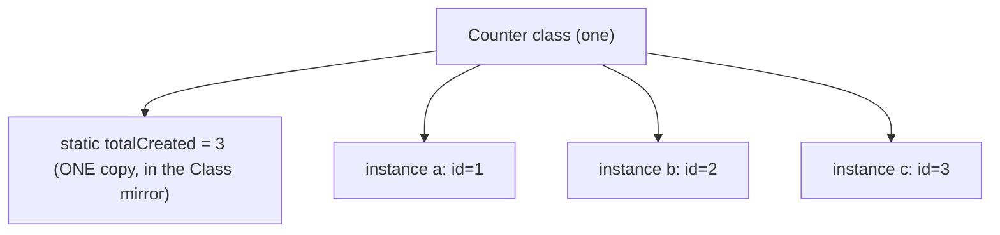
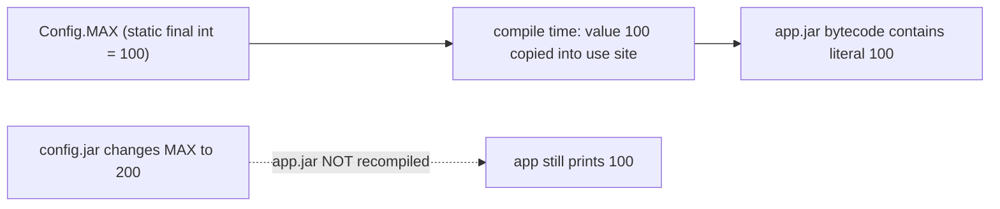
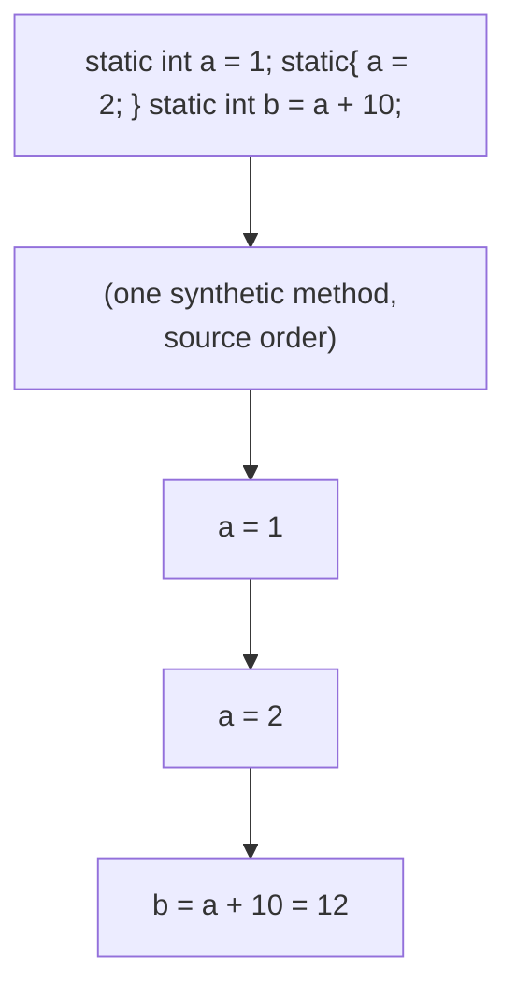
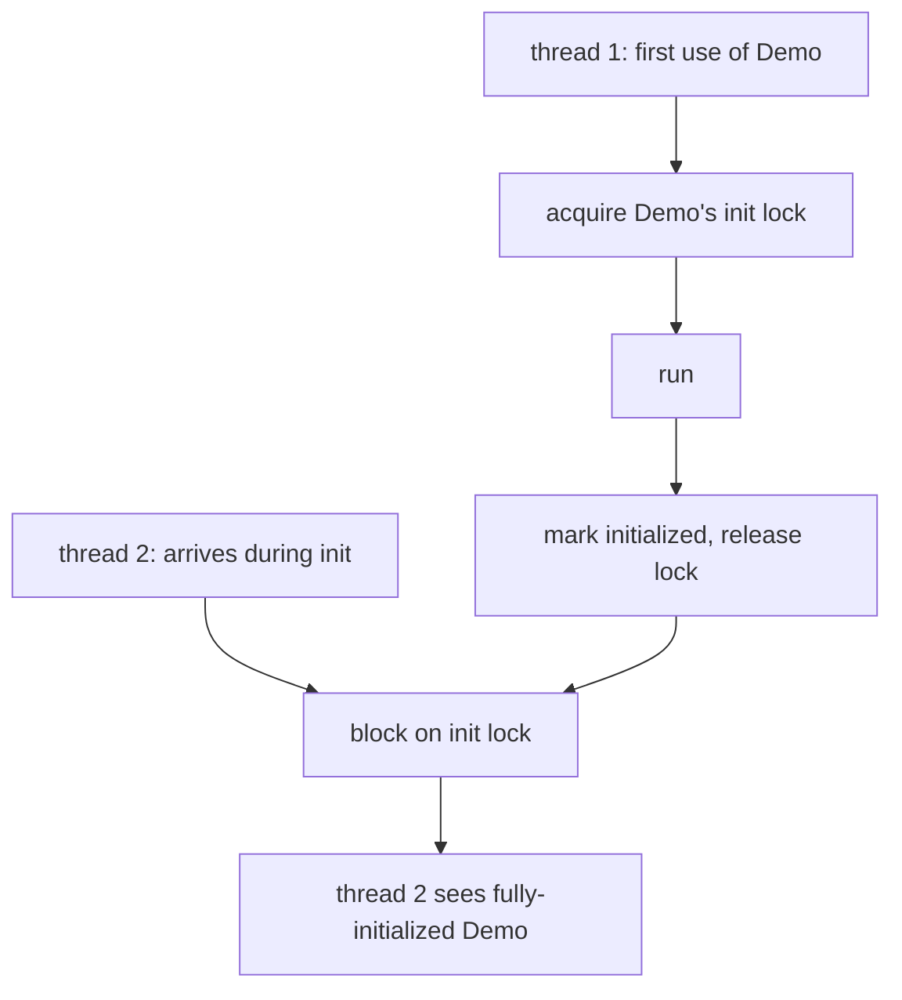
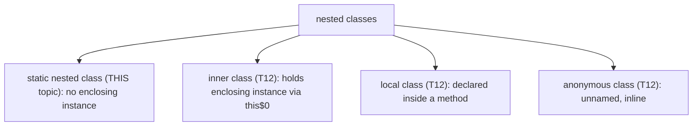
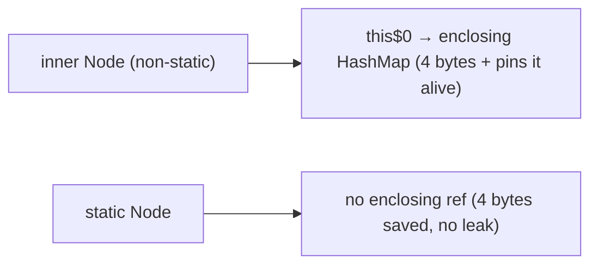
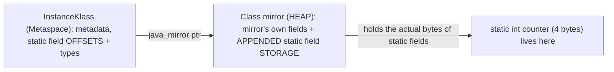
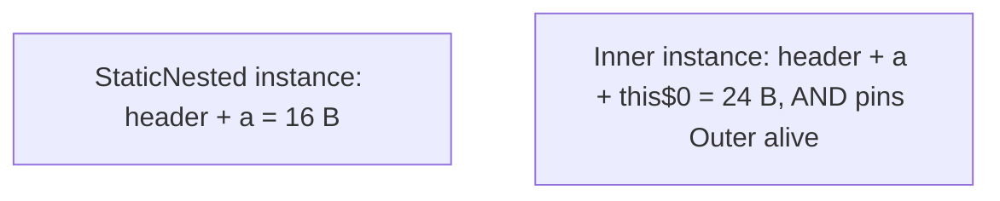
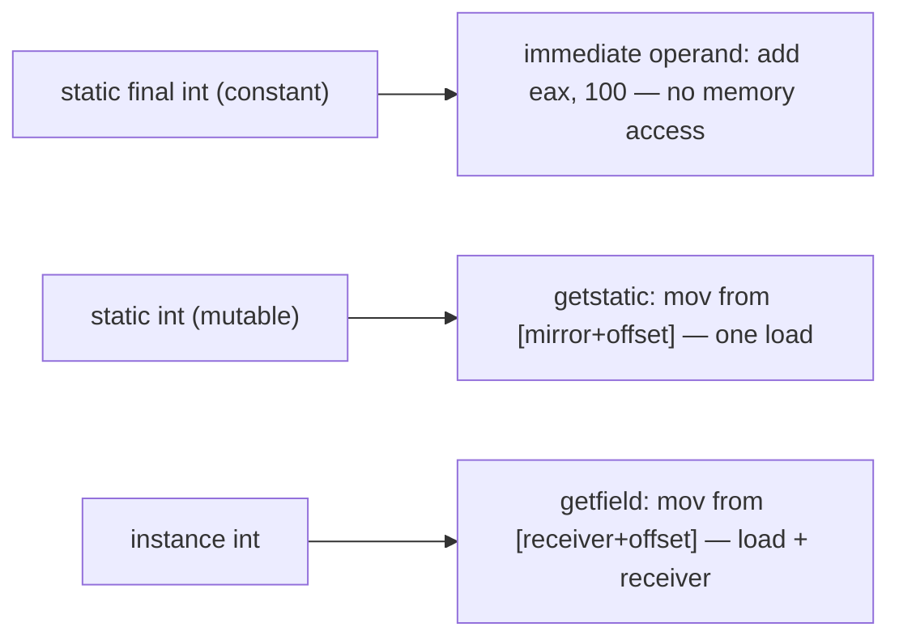
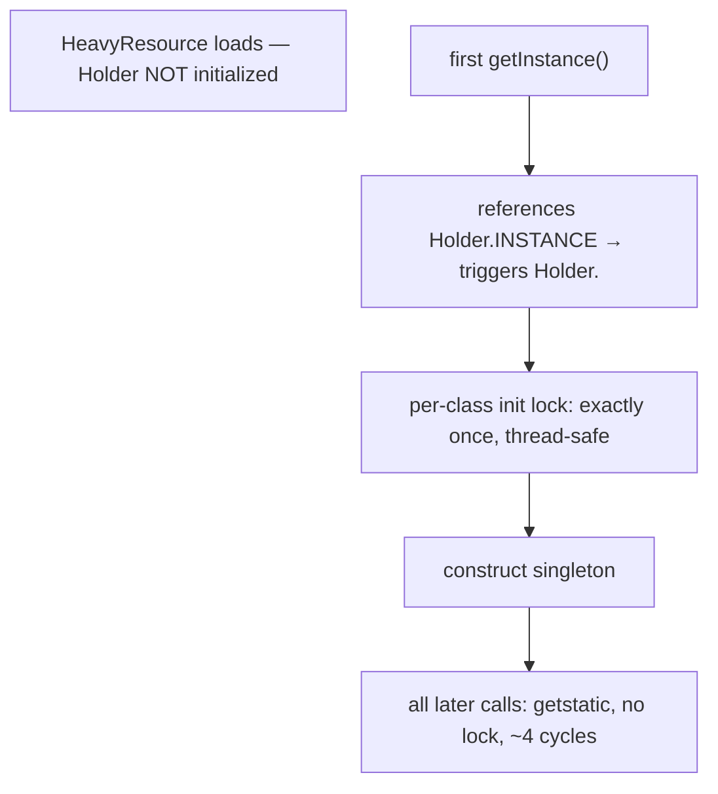

# static members, blocks & nested classes

Everything in topics [T01](./T01-classes-and-objects.md)–[T10](./T10-equals-hashcode-tostring-contracts.md) belonged to **instances** — each object had its own fields, its own `equals`, its own state. This topic covers the members that belong to the **class itself**, not to any instance: **`static` fields** (one copy shared by every object), **`static` methods** (callable without an object, no `this`), **`static { }` initializer blocks** (run once when the class loads), and **`static` nested classes** (helper types declared inside another class with no link to an enclosing instance). The `static` keyword is the language's way of saying "this belongs to the type, not to its values." `Math.PI`, `Integer.parseInt`, `Collections.emptyList`, `HashMap.Node` — all the workhorses of the JDK are static members.

The depth bar here is mostly about **where static state physically lives and when it runs**. A `static int counter` is exactly **4 bytes for the entire program**, no matter how many instances exist — but those 4 bytes do not live where most people think. Since JDK 8, static fields are stored in the **`java.lang.Class` mirror object on the Java heap** (not in Metaspace, and not in PermGen, which was deleted) — appended after the mirror's own fields, which is why static-referenced objects are reclaimed only when the class's loader is unloaded, making **static fields the most common cause of memory leaks**. Static initialization runs in a synthetic method named `<clinit>` exactly once, guarded by a **per-class initialization lock** that makes it thread-safe for free — a property the elegant *initialization-on-demand holder* idiom exploits to build lazy singletons with zero synchronization. At the processor level, `getstatic` resolves to a single load from the mirror's known address, and a `static final` primitive is folded into the instruction stream as an **immediate operand** — literally faster than reading an instance field. By the end you will know exactly how many bytes each kind of static member costs, where it lives, when its initializer fires, and what instruction the CPU executes to read it.

> [!NOTE]
> Prerequisites: [Classes & objects](./T01-classes-and-objects.md) (`L1/C01/T01`) — class loading's five phases, the `Class` mirror, Metaspace, `<clinit>` introduction; [Fields, methods, constructors, this](./T02-fields-methods-constructors-this.md) (`L1/C01/T02`) — instance vs static methods, `this`, `<init>` vs `<clinit>`; [Encapsulation](./T03-encapsulation-and-access-modifiers.md) (`L1/C01/T03`) — access modifiers, `ACC_STATIC` flag, the `invokestatic`/`getstatic` opcodes; [Object class](./T09-object-class-and-its-methods.md) and [equals/hashCode](./T10-equals-hashcode-tostring-contracts.md) — `HashMap.Node` is a static nested class (a concrete example used throughout).

## Static vs Instance — The Fundamental Split

Every member of a class is either **per-instance** or **per-class**:

```java
public class Counter {
    static int totalCreated = 0;   // per-class: ONE copy, shared by all Counters
    int id;                        // per-instance: each Counter has its own id

    Counter() {
        id = ++totalCreated;       // increment the shared counter; assign this instance's id
    }
}

Counter a = new Counter();   // totalCreated → 1, a.id = 1
Counter b = new Counter();   // totalCreated → 2, b.id = 2
Counter c = new Counter();   // totalCreated → 3, c.id = 3
// Counter.totalCreated == 3  (one shared value)
// a.id==1, b.id==2, c.id==3  (three independent values)
```

`totalCreated` exists **once**, owned by the `Counter` *class*. `id` exists **per object** — three `Counter`s mean three `id` fields in three separate heap allocations. This is the entire distinction: `static` = belongs to the type; non-`static` (instance) = belongs to each value of the type.



The same split applies to methods: a `static` method belongs to the class and has no `this`; an instance method belongs to an object and has an implicit `this` ([T02](./T02-fields-methods-constructors-this.md)).

## Why "Static" Exists — The Class-Level State Problem

Some data and behavior genuinely belong to a *type*, not to any one of its values:

- A **constant** every instance shares: `Math.PI`, `Integer.MAX_VALUE`, `Color.RED`. Storing π in every `Circle` would waste 8 bytes per circle for a value that never differs.
- A **counter** or **registry** tracking all instances: a connection pool's "active connections" count, a cache shared across all callers.
- A **factory** or **utility** that produces or operates on instances without needing one to start: `Integer.parseInt("42")`, `List.of(1, 2, 3)`, `Collections.sort(list)`. You can't have an instance of `Integer` *before* you've parsed the string — the method must be callable on the class.
- The **program entry point**: `public static void main(String[])` — the JVM calls it before any object exists ([L0/C02/T01](../../L0-foundations/C02-java-core/T01-program-structure-class-main-statements.md)).

Without `static`, none of these would be expressible cleanly. You'd need a dummy instance just to call `parseInt`, and you'd duplicate constants across every object.

### How Other Languages Handle Class-Level Members

`static` is one of the oldest OOP features, and the design space is well-explored:

| Language | Class-level state | Notes |
|----------|-------------------|-------|
| **C++** | `static` members; defined *outside* the class body (one-definition rule) | storage allocated once in the data segment; `static` member functions have no `this` |
| **Java** | `static` keyword on fields/methods/nested classes | storage in the `Class` mirror; lazy class init |
| **C#** | `static` members + `static` constructors | static ctor runs lazily on first use, like Java's `<clinit>` |
| **Python** | class variables (assigned in the class body) | shared by instances, but instances can shadow them — a frequent bug |
| **Kotlin** | **no `static` keyword** — `companion object` instead | a singleton object nested in the class; `@JvmStatic` bridges to real statics for Java interop |
| **Rust** | associated functions/consts (`impl` block); `static` items for globals | no inheritance, so no "static inheritance" complications |

Two are worth a closer look:

**Kotlin deliberately removed `static`.** Instead, you write a `companion object` — a singleton nested in the class. The reasoning: `static` is a special-case namespace that doesn't fit the object model (you can't pass `Math` as an object, you can't make a static method satisfy an interface). A companion object *is* a real object, so it can implement interfaces, be passed around, and be extended. The cost: an extra level of indirection (Kotlin's `Foo.bar()` compiles to `Foo.Companion.bar()` unless annotated `@JvmStatic`). This is a pointed critique of Java's design: **`static` members are a procedural island inside an object-oriented language.**

**Python class variables leak through instances.** In Python, `instance.classVar` reads the class variable, but `instance.classVar = x` *creates a new instance variable that shadows it*. This silent shadowing is a classic Python bug. Java avoids it: `instance.staticField = x` modifies the one shared static (and the compiler warns you to write `ClassName.staticField` instead). Java's stricter rule trades Python's flexibility for fewer surprises.

The broader critique that applies to Java too: **mutable static state is global state**, and global state is the enemy of testability, concurrency, and modularity. The dependency-injection movement (Spring, Guice) exists largely to *avoid* `static` mutable state. We'll return to this in [§ Common Mistakes](#common-mistakes). Use `static` freely for constants and pure utilities; use it cautiously for mutable state.

## Static Fields

A `static` field is declared with the keyword and accessed through the class name:

```java
public class Physics {
    public static final double SPEED_OF_LIGHT = 299_792_458.0;  // constant
    static int simulationCount = 0;                              // mutable shared state
}

double c = Physics.SPEED_OF_LIGHT;   // access via ClassName.field
Physics.simulationCount++;           // modify the one shared value
```

You *can* access a static field through an instance reference (`somePhysics.simulationCount`), but it's misleading — it reads/writes the shared static, not anything on the instance — and IDEs warn against it. Always qualify with the class name.

### `static final` Constants — Compile-Time Inlined

A `static final` field of a **primitive type or `String`**, initialized with a **compile-time constant expression**, is a **compile-time constant** ([L0/C02/T03](../../L0-foundations/C02-java-core/T03-literals-and-constants-final.md)). The compiler does not generate a field read at the use site — it **inlines the literal value** directly into the bytecode:

```java
class Config { public static final int MAX = 100; }

// elsewhere:
int x = Config.MAX + 1;
// compiles to: bipush 100; iconst_1; iadd  —  no getstatic! The 100 is baked in.
```

This has a famous consequence — **the cross-JAR recompile gotcha**. If `Config.MAX` is in `config.jar` and your code is in `app.jar`, the value `100` is *copied into* `app.jar` at compile time. Bumping `MAX` to `200` in `config.jar` and redeploying *only* `config.jar` leaves `app.jar` still using the old `100` — it was inlined, there's no runtime link to follow. You must recompile `app.jar`. This bites teams who treat constants as runtime-configurable. (Non-constant statics — e.g., `static final int MAX = computeMax();` — are *not* inlined; they're read at runtime via `getstatic` and pick up changes on redeploy.)



### Mutable Static State

A non-`final` static field is mutable shared state — effectively a global variable scoped to the class name. Useful for counters, caches, registries, and singletons; dangerous because *any* code can change it, and it persists for the life of the class (next section).

```java
public class IdGenerator {
    private static long next = 0;
    public static synchronized long nextId() { return ++next; }  // synchronized: shared mutable state across threads
}
```

The `synchronized` is necessary because `++next` is read-modify-write and multiple threads share the one `next` ([L0/C02/T04 operators](../../L0-foundations/C02-java-core/T04-operators-arithmetic-relational-logical-bitwise-assignment.md) non-atomicity; full JMM in L3/C01). A non-synchronized static counter incremented by many threads loses updates. This is the recurring tax of mutable static state: it's shared by everything, including all threads.

## Static Methods

A `static` method belongs to the class, has **no `this`**, and is called `ClassName.method(args)` ([T02](./T02-fields-methods-constructors-this.md)):

```java
public final class MathUtils {
    private MathUtils() {}   // private constructor: utility class, never instantiated (T03)

    public static int clamp(int x, int lo, int hi) {
        return Math.max(lo, Math.min(hi, x));   // no instance state needed
    }
}

int y = MathUtils.clamp(value, 0, 100);
```

Static methods cannot access instance fields or call instance methods by simple name (there's no `this` to resolve them against — [T02](./T02-fields-methods-constructors-this.md)). They can only touch static state and their parameters. Three idiomatic uses:

1. **Utility methods** — stateless operations grouped in a `final` class with a `private` constructor (`Math`, `Collections`, `Arrays`, `Objects`).
2. **Static factory methods** — alternatives to constructors that can have descriptive names, cache instances, and return subtypes: `Integer.valueOf(int)` (caches −128..127, [L0/C02/T05](../../L0-foundations/C02-java-core/T05-type-conversion-and-casting.md)), `List.of(...)`, `Optional.empty()`, `LocalDate.now()`. *Effective Java* Item 1 advocates these over constructors.
3. **The `main` entry point.**

At the bytecode level, a static method is invoked with **`invokestatic`** — no receiver, no vtable lookup, fully bound at link time. This makes static methods the **most JIT-inline-friendly** of all calls ([T05](./T05-method-overriding.md)): there is exactly one target, always, so the JIT inlines without any guard.

> [!INTERVIEW]
> "Can a static method be overridden?" No. Static methods are not virtual — they're resolved by the compile-time type, not the runtime object ([T04](./T04-inheritance-and-super.md)). A subclass declaring a static method with the same signature **hides** (not overrides) the parent's. `@Override` on a static method is a compile error. There's no `this`, so there's nothing to dynamically dispatch on.

## Static Initializer Blocks and `<clinit>`

A `static { }` block in the class body runs **once**, when the class is initialized, in source order with the static field initializers. It's for setup too complex for a single initializer expression:

```java
public class Lookup {
    static final Map<String, Integer> ROMAN;
    static {
        Map<String, Integer> m = new HashMap<>();
        m.put("I", 1); m.put("V", 5); m.put("X", 10);
        // ... more entries
        ROMAN = Collections.unmodifiableMap(m);
    }
    static final int[] SQUARES = new int[100];
    static {
        for (int i = 0; i < SQUARES.length; i++) SQUARES[i] = i * i;
    }
}
```

Common uses: populating lookup tables, loading native libraries (`System.loadLibrary("...")`), registering JDBC drivers (the old `Class.forName("...")` pattern), validating environment assumptions at load time.

### The `<clinit>` Method

The compiler gathers **all** static field initializers and **all** `static { }` blocks, in **source order**, into a single synthetic method named **`<clinit>`** (class initializer) — the static counterpart to `<init>` ([T02](./T02-fields-methods-constructors-this.md)). The JVM calls `<clinit>` exactly once, during the *initialize* phase of class loading ([T01](./T01-classes-and-objects.md)), triggered by first active use (first `new`, first static access, etc.).

```java
class Demo {
    static int a = 1;          // \
    static { a = 2; }          //  > all spliced into <clinit> in source order
    static int b = a + 10;     // /  → a=1, then a=2, then b=12
}
```



`javap -c` reveals the spliced method:

```
static {};
  Code:
     0: iconst_1
     1: putstatic   #2  // Field a:I        ; a = 1
     4: iconst_2
     5: putstatic   #2  // Field a:I        ; a = 2  (from the block)
     8: getstatic   #2  // Field a:I
    11: bipush      10
    13: iadd
    14: putstatic   #3  // Field b:I        ; b = a + 10
    17: return
```

There is no separate "static block phase" at runtime — javac splices everything into `<clinit>`. The JVM just runs one method.

### Static Initialization Is Thread-Safe — The Per-Class Lock

The JVM guarantees `<clinit>` runs **exactly once**, even if many threads trigger initialization simultaneously. It does this with a **per-class initialization lock** (JLS §12.4.2): the first thread to initialize the class acquires the lock and runs `<clinit>`; other threads block until it completes, then see the fully-initialized class. This is a JVM-provided, double-checked-locking-correct mechanism you get for free — and it's the basis of the *initialization-on-demand holder* idiom ([§ The Initialization-on-Demand Holder Idiom](#the-initialization-on-demand-holder-idiom)).



### When `<clinit>` Throws — `ExceptionInInitializerError`

If `<clinit>` throws (a static initializer fails), the JVM wraps it in **`ExceptionInInitializerError`** and marks the class **erroneous**. Crucially, *every subsequent attempt* to use that class throws **`NoClassDefFoundError`** — not the original exception, and not a retry. The class is permanently unusable for the life of the classloader.

```java
class Broken {
    static final int X = 1 / 0;   // ArithmeticException in <clinit>
}

// First use:    ExceptionInInitializerError (caused by ArithmeticException)
// Every use after: NoClassDefFoundError: Could not initialize class Broken
```

This is a notorious production trap: a misconfigured static initializer (a missing config file, a failed `System.loadLibrary`) makes a class throw `ExceptionInInitializerError` once, then throw the much more confusing `NoClassDefFoundError` forever after — and engineers chase the *second* error not realizing the real failure was the *first* one, often logged seconds earlier ([L0/C02/T15](../../L0-foundations/C02-java-core/T15-variable-scope-and-lifetime.md) callback). **Always read the *first* stack trace.**

### Static Initialization Deadlock

If two classes' `<clinit>` methods reference each other (A's static init uses B, B's static init uses A), and two threads trigger A and B simultaneously, each thread holds one class's init lock and waits for the other — a **classic deadlock** that's hard to diagnose because it's invisible in the source. Avoid circular static-initialization dependencies.

## Static Import

`import static` brings a class's static members into scope so you can use them unqualified:

```java
import static java.lang.Math.PI;
import static java.lang.Math.max;
import static org.junit.jupiter.api.Assertions.*;   // common in tests

double area = PI * r * r;        // instead of Math.PI
int m = max(a, b);               // instead of Math.max
assertEquals(expected, actual);  // instead of Assertions.assertEquals
```

Useful for `Math`, test assertions, and DSLs. Overuse harms readability (where did `max` come from?), so import specific members, not wildcards, outside of tests.

## Nested Classes — The Four Kinds

A class declared inside another class is a **nested class**. There are four kinds; this topic covers the **`static` nested class**, and [T12](./T12-inner-local-and-anonymous-classes.md) covers the three non-static ones:



The defining difference: a **`static` nested class has no implicit reference to an enclosing instance**; an **inner class does**. That one fact drives everything about their memory cost and use cases.

## Static Nested Classes

A `static` nested class is a normal class that happens to be declared inside another, for namespacing and encapsulation. It does **not** capture an enclosing instance — it's independent.

```java
public class HashMap<K,V> {
    static class Node<K,V> {        // static nested: a plain helper, no HashMap instance link
        final int hash;
        final K key;
        V value;
        Node<K,V> next;
        Node(int hash, K key, V value, Node<K,V> next) { /* ... */ }
    }
    // ...
}

// HashMap.Node is just a class scoped inside HashMap.
// Creating one needs NO HashMap instance:
HashMap.Node<String,Integer> n = new HashMap.Node<>(h, "k", 1, null);
```

This is exactly how the real `HashMap` declares `Node` ([T10](./T10-equals-hashcode-tostring-contracts.md)) — a static nested class, because a node doesn't need a back-reference to its map. The same pattern: `Map.Entry`, `AbstractMap.SimpleEntry`, `Thread.State`, builder classes (`StringBuilder` is top-level, but many builders are static nested like `Stream.Builder`).

Why declare a helper class *inside* another rather than as a top-level class?

1. **Logical grouping** — `Node` is meaningless outside `HashMap`; nesting signals that.
2. **Encapsulation** — a `private static` nested class is invisible outside the enclosing class; nest mates can access each other's privates ([T03 deeper section](./T03-encapsulation-and-access-modifiers.md#deeper-jvm-internals--nest-based-access-binary-compatibility-and-the-access-check-pipeline)).
3. **Namespacing** — `HashMap.Node` reads better than a top-level `HashMapNode`.

### Why `static` Nested Beats Inner — *Effective Java* Item 24

**If a nested class doesn't need access to an enclosing instance, make it `static`.** A non-static (inner) class silently holds a hidden reference to its enclosing instance (the `this$0` field — [T12](./T12-inner-local-and-anonymous-classes.md), and the memory section below). That hidden reference:

- **Wastes 4 bytes** per instance (the `this$0` field).
- **Leaks memory**: as long as the inner-class instance is alive, the *entire enclosing instance* it points to cannot be garbage-collected — even if nothing else references it. A long-lived inner-class object (e.g., an iterator stored in a cache, a listener registered globally) pins its enclosing object forever.

Making the nested class `static` when it doesn't need the enclosing instance eliminates both costs. This is one of the most impactful small refactorings in *Effective Java* — and the reason `HashMap.Node` is `static`.



## Memory Layer — Where Static Fields Physically Live

This is the part most resources get wrong, so be precise. Static fields do **not** live in instances, and (since JDK 8) they do **not** live in Metaspace either.

### The History: PermGen → Metaspace + the Class Mirror

- **Pre-JDK 8 (PermGen era):** static fields lived in the class's metadata in the **Permanent Generation**, a special heap region with a fixed maximum size. Filling PermGen (too many loaded classes, classloader leaks) caused the dreaded `OutOfMemoryError: PermGen space`.
- **JDK 8+ (Metaspace era):** PermGen was deleted (JEP 122). Class *metadata* (the `InstanceKlass`, method bytecode, constant pool, vtable) moved to **Metaspace** (native memory, grows on demand — [T01](./T01-classes-and-objects.md)). But the static field *storage* moved somewhere else: **the `java.lang.Class` mirror object on the regular Java heap.**

### Static Fields Live in the Class Mirror (on the Heap)

When a class loads, the JVM creates its **mirror** — the `java.lang.Class<Foo>` object that `Foo.class` and `obj.getClass()` return ([T01](./T01-classes-and-objects.md), [T09](./T09-object-class-and-its-methods.md)). The mirror is a normal heap object, and HotSpot **appends the class's static fields to the end of the mirror object**. So `Foo`'s static `int counter` physically lives as 4 bytes inside the `Class<Foo>` heap object, at an offset the `InstanceKlass` (in Metaspace) records.



Two consequences fall out of this design:

1. **Static-referenced objects are GC roots tied to the mirror.** A `static List<X> cache` keeps its list (and everything the list references) reachable as long as the `Class` mirror is alive. The mirror is alive as long as its **classloader** is alive. For the application classloader (which never dies in a normal run), that's *forever*. This is why **a growing static collection is the textbook Java memory leak** — nothing ever reclaims it ([L0/C02/T15](../../L0-foundations/C02-java-core/T15-variable-scope-and-lifetime.md)).
2. **Static fields *can* be garbage collected** — but only when the whole class is unloaded, which requires its classloader to become unreachable. This is why app servers (Tomcat) and frameworks (Spring DevTools) that hot-reload code use a fresh classloader per reload: dropping the old loader lets its classes, mirrors, and static fields be reclaimed. A `static` field that points back into the application (e.g., a `ThreadLocal` holding a class from the reloadable loader) pins the old loader and causes the infamous "classloader leak."

### The Byte Math — Why Static Saves Memory

A `static int counter` is **4 bytes total**, in the one mirror, regardless of instance count. An instance `int counter` is **4 bytes × number of instances**.

| Field | 1 instance | 1,000 instances | 1,000,000 instances |
|-------|-----------:|----------------:|--------------------:|
| `int counter` (instance) | 4 B | ~4 KB | ~4 MB |
| `static int counter` | 4 B | 4 B | 4 B |

For a value that's genuinely shared (a constant, a global count), `static` is the correct and memory-efficient choice. Putting π in every `Circle` instance would waste 8 bytes per circle; `static final double PI` costs 8 bytes once. This is why constants are always `static final`.

## Memory Layer — Nested Class Files and the Missing `this$0`

Each nested class compiles to its **own `.class` file**, named `Outer$Nested.class` (the `$` is the binary-name separator). `HashMap.Node` becomes `HashMap$Node.class` on disk; `HashMap.TreeNode` becomes `HashMap$TreeNode.class`. The JVM loads them as ordinary classes; the `$` is just a naming convention (legal in identifiers but conventionally reserved for the compiler).

The crucial memory difference between static nested and inner classes is the **synthetic `this$0` field**:

```java
class Outer {
    int x;
    static class StaticNested { int a; }   // no this$0 — independent
    class Inner            { int a; }       // has synthetic this$0 → Outer (4 bytes)
}
```

Instance sizes (compressed oops):

```
StaticNested:  12 (header) + 4 (a) = 16 bytes
Inner:         12 (header) + 4 (a) + 4 (this$0 ref) = 20 → 24 bytes (padded)
```

The inner class instance carries an extra **4-byte reference to its enclosing `Outer`** — the `this$0` field the compiler synthesizes. Beyond the 4 bytes, that reference **keeps the `Outer` instance alive** for as long as the `Inner` lives. For a class you create millions of (an iterator, a node, an event), making it `static` saves 4–8 bytes each *and* avoids pinning the enclosing object. You can see `this$0` with `javap -p Outer$Inner` (it appears as `final Outer this$0;`).



## Architecture Layer — `getstatic`, `putstatic`, and the CPU

Static field access uses dedicated opcodes distinct from instance access:

| Access | Instance opcode | Static opcode |
|--------|-----------------|---------------|
| read | `getfield` (needs receiver on stack) | `getstatic` (no receiver) |
| write | `putfield` (needs receiver) | `putstatic` (no receiver) |
| call | `invokevirtual`/`invokespecial`/`invokeinterface` | `invokestatic` |

### `getstatic` Resolves to a Fixed Address

`getstatic Foo.counter` is resolved once (at first execution) to the **mirror's heap address + the static field's offset** ([T03 deeper section](./T03-encapsulation-and-access-modifiers.md#deeper-jvm-internals--nest-based-access-binary-compatibility-and-the-access-check-pipeline) — the constant pool entry is patched). After resolution, the JIT emits a single load from a known address:

```
; getstatic Foo.counter  (after resolution)
mov   eax, [mirror_address + counter_offset]   ; one load, no receiver, ~4 cycles (L1 hit)
```

Compare with an instance field read `getfield`, which needs the receiver in a register first (`mov eax, [rdi + offset]`). The static read has **no receiver to load or null-check** — it can be marginally cheaper. (The mirror address is a constant the JIT bakes in; on a moving GC the address may need a relocation, handled by the GC's barriers.)

### `static final` Folds to an Immediate — Zero Memory Access

For a `static final` primitive constant, there is no load at all. The value is an **immediate operand** in the instruction stream ([§ static final Constants](#static-final-constants--compile-time-inlined)):

```java
static final int LIMIT = 100;
int y = x + LIMIT;
```

```
; no getstatic — LIMIT is folded in
add   eax, 100        ; the 100 is an immediate, baked into the instruction
```

This is **faster than any field access** — the constant is in the instruction itself, fetched with the code, no data load, no cache miss possible. It's why hot loops bounded by `static final` constants optimize perfectly: the JIT knows the bound at compile time and can unroll/vectorize against it ([L0/C02/T09 loops](../../L0-foundations/C02-java-core/T09-loops-while-do-while-for-for-each.md)).



### `invokestatic` Is the Most Inline-Friendly Call

A static method call is `invokestatic` — no receiver, no vtable, no itable, no polymorphism. There is exactly **one** possible target, known at link time. The JIT inlines it unconditionally with no type guard and no deoptimization risk ([T05](./T05-method-overriding.md)). This is why utility methods (`Math.max`, `Integer.parseInt`) and static factories are essentially free in hot code — they inline away completely.

### Memory Ordering — Mutable Statics Across Threads

A non-`final`, non-`volatile` static field shared across threads has **no visibility guarantee**: thread B may never see thread A's write, or see it stale, because each CPU core caches the value independently and there's no memory barrier forcing a flush. Mutable static state shared across threads needs `volatile` (for visibility) or `synchronized`/locks (for atomicity + visibility) — full treatment in **L3/C01 concurrency**. A `static final` field is safe (frozen at `<clinit>`, like the JMM final-freeze of [T02](./T02-fields-methods-constructors-this.md)); a `static volatile` field is visible but not atomic for compound ops; a plain `static` field is a data-race waiting to happen.

## The Initialization-on-Demand Holder Idiom

Here's the elegant payoff that combines **static nested classes** + **lazy class initialization** + **the per-class init lock** into a thread-safe lazy singleton with **zero synchronization**:

```java
public class HeavyResource {
    private HeavyResource() { /* expensive setup */ }

    private static class Holder {                 // static nested, not loaded until referenced
        static final HeavyResource INSTANCE = new HeavyResource();
    }

    public static HeavyResource getInstance() {
        return Holder.INSTANCE;                   // first call triggers Holder's <clinit>
    }
}
```

How it works, mechanism by mechanism:

1. `HeavyResource` loads, but `Holder` does **not** — a nested class is initialized lazily, only on first active use ([T01](./T01-classes-and-objects.md)). So `INSTANCE` is *not* created when `HeavyResource` loads.
2. The first call to `getInstance()` references `Holder.INSTANCE`, which is the first active use of `Holder`, triggering `Holder`'s `<clinit>`, which constructs the singleton.
3. The JVM's **per-class init lock** ([§ Static Initialization Is Thread-Safe](#static-initialization-is-thread-safethe-per-class-lock)) guarantees `<clinit>` runs exactly once, even under concurrent `getInstance()` calls from many threads. No `synchronized`, no `volatile`, no double-checked locking — the JVM does the locking for you.
4. After initialization, `getInstance()` is just `getstatic Holder.INSTANCE` — a single load, no lock, no branch. Fully optimal.



This idiom is *lazy* (the resource isn't built until first needed), *thread-safe* (the JVM's init lock), and *fast* (no synchronization on the hot path). It's the recommended lazy-singleton pattern in Java when you can't use an enum singleton (the *simplest* singleton, *Effective Java* Item 3, covered with enums in [T13](./T13-enum-types-with-fields-methods.md)). It is a direct, practical consequence of understanding exactly how static initialization works.

## Common Mistakes

> [!WARNING]
> **Mutable static state as a hidden global.** A `static` mutable field is a global variable. It couples unrelated code, breaks under concurrency without synchronization, and makes tests non-deterministic (one test's mutation leaks into the next). Prefer dependency injection; reserve mutable statics for genuine process-wide state (and synchronize it).

> [!WARNING]
> **Static collection memory leak.** `static List<X> cache = new ArrayList<>();` that only grows is reachable from the class mirror (a GC root) forever — nothing reclaims it. Bound the size, use a cache with eviction (Caffeine, `LinkedHashMap` LRU), or `WeakReference`. The single most common Java memory leak.

> [!WARNING]
> **Inner class where static nested would do.** A non-static nested class that doesn't use the enclosing instance still carries `this$0` (4 bytes) and pins the enclosing object alive. Make it `static`. *Effective Java* Item 24.

> [!WARNING]
> **`static final` treated as runtime-configurable.** Primitive/String `static final` constants are inlined into callers at compile time; changing the value requires recompiling every caller, not just the defining class. For runtime-tunable values, use a non-constant static (`static final int MAX = config.get(...)`) or a config system.

> [!WARNING]
> **Reading the second error, not the first.** A failed `static` initializer throws `ExceptionInInitializerError` *once*, then `NoClassDefFoundError` forever. The real cause is in the *first* stack trace; the `NoClassDefFoundError` is a symptom. Find the original `ExceptionInInitializerError`.

> [!WARNING]
> **Accessing a static through an instance.** `obj.staticField` compiles but reads the shared static, not anything on `obj` — misleading. Always `ClassName.staticField`. (Worse: `obj.staticMethod()` where `obj` is `null` still works, because no instance is actually needed — a confusing edge case.)

> [!WARNING]
> **Circular static initialization.** If class A's `<clinit>` uses B and B's uses A, concurrent first-use from two threads can deadlock on the two init locks. Avoid mutual static-init dependencies.

> [!WARNING]
> **Non-thread-safe static counters.** `static int count; count++;` from multiple threads loses updates (read-modify-write race). Use `AtomicInteger`, `synchronized`, or a `LongAdder` for high contention.

> [!INTERVIEW]
> Common interview questions for this topic:
> 1. **Where do static fields live?** Since JDK 8, in the `java.lang.Class` **mirror object on the heap** (appended after the mirror's fields), not in instances, not in Metaspace, not in the deleted PermGen. The `InstanceKlass` in Metaspace holds the offsets/types.
> 2. **What is `<clinit>`?** The synthetic class-initializer method holding all static field initializers + `static {}` blocks in source order. Runs exactly once at first active use, guarded by a per-class init lock. (vs `<init>`, the per-instance constructor.)
> 3. **Is static initialization thread-safe?** Yes — the JVM holds a per-class lock during `<clinit>`; concurrent triggers block until it completes. This is what the initialization-on-demand holder idiom exploits.
> 4. **What happens if a static initializer throws?** `ExceptionInInitializerError` the first time, then `NoClassDefFoundError` on every subsequent use — the class is permanently erroneous.
> 5. **static nested vs inner class — difference?** Static nested has no enclosing-instance reference; inner has a synthetic `this$0` (4 bytes) pinning the enclosing object. Prefer static when the enclosing instance isn't needed (EJ Item 24).
> 6. **Why is `static final int X = 100` faster than `static int X = 100`?** The `final` constant is inlined as an immediate operand (no memory access); the mutable static needs a `getstatic` load from the mirror.
> 7. **Can static methods be overridden?** No — they're hidden, not overridden. Resolved by compile-time type, dispatched with `invokestatic` (no vtable). `@Override` on a static is a compile error.
> 8. **Why are static collections a memory leak?** The class mirror is a GC root (alive as long as the classloader); a static collection it references stays reachable forever unless explicitly cleared.
> 9. **What opcode reads a static field?** `getstatic` (write: `putstatic`); no receiver, resolves to mirror-address + offset. Instance fields use `getfield`/`putfield` (need a receiver).
> 10. **What's the cross-JAR constant gotcha?** A `static final` primitive/String is copied into callers at compile time; changing it in the defining JAR without recompiling callers leaves them using the stale inlined value.
> 11. **How does the initialization-on-demand holder idiom work?** A static nested holder class is initialized lazily on first reference to its `INSTANCE` field; the JVM's init lock makes it thread-safe with no explicit synchronization.
> 12. **Why did Kotlin drop `static`?** `static` members aren't real objects (can't implement interfaces, can't be passed around). Kotlin uses `companion object` — a real singleton — instead.

## Practice

1. **Shared counter.** Write `Counter` with a `static int total` incremented in the constructor and an instance `int id`. Create five `Counter`s; print `Counter.total` (5) and each `id` (1–5). Explain which is shared and which is per-instance.

2. **`<clinit>` order.** Write a class with interleaved static field initializers and `static {}` blocks that print as they run. Predict the output order; verify it matches source order. Run `javap -c` and find the spliced `<clinit>`.

3. **`getstatic` vs `getfield` bytecode.** Write a class with one static and one instance `int` field, each read by a method. `javap -c` both methods; confirm `getstatic` (no `aload_0`) vs `getfield` (preceded by `aload_0`).

4. **`static final` inlining.** Define `static final int MAX = 100` in class A; use `A.MAX` in class B. `javap -c` B; confirm the `100` is a `bipush`/`ldc` literal, not a `getstatic`. Then change `MAX` to `static final int MAX = compute()` (non-constant); recompile B; confirm it now uses `getstatic`.

5. **Cross-JAR gotcha.** Compile A (with `static final int MAX=100`) and B (using `A.MAX`) separately. Change A's `MAX` to `200`, recompile *only* A. Run B; observe it still prints `100`. Recompile B; now `200`. Explain.

6. **ExceptionInInitializerError → NoClassDefFoundError.** Write a class with `static final int X = 1/0;`. In a `try/catch`, use the class twice. Observe `ExceptionInInitializerError` first, `NoClassDefFoundError` second. Print both stack traces; identify the real cause.

7. **Static nested memory.** Declare `Outer` with a `static class StaticNested { int a; }` and a `class Inner { int a; }`. Use JOL (`jol-cli internals`) to dump both. Confirm `Inner` has a `this$0` field (~4 bytes bigger). Run `javap -p Outer$Inner` to see `this$0`.

8. **Inner-class leak.** Create a long-lived `Inner` instance (store it in a static list) from a short-lived `Outer`. Use a heap dump (jmap/VisualVM) to confirm the `Outer` is *not* collected — pinned by `this$0`. Refactor `Inner` to `static`; confirm the `Outer` is now collectible.

9. **Initialization-on-demand holder.** Implement the lazy singleton holder idiom. Add print statements to confirm the singleton is built on the *first* `getInstance()`, not when the outer class loads. Hammer `getInstance()` from 100 threads; confirm exactly one construction.

10. **Static counter race.** Increment a `static int count` from 1,000 threads × 1,000 increments each. Observe the final count is < 1,000,000 (lost updates). Fix with `AtomicInteger`; confirm exactly 1,000,000.

11. **Static field is a GC root.** Add objects to a `static List` in a loop with `-Xmx64m`. Observe `OutOfMemoryError` (the list never shrinks). Switch to a bounded LRU (`LinkedHashMap` with `removeEldestEntry`); confirm steady memory.

12. **Utility class.** Write a `final` utility class with a `private` constructor that throws `AssertionError`, and static methods. Confirm `new` fails to compile; confirm reflection (`setAccessible` + `newInstance`) hits the `AssertionError`. Explain why this pattern exists.

13. **Static method hiding.** Declare `static String label()` in both a parent and a child. Call via `Parent p = new Child(); p.label()`. Observe the *parent's* runs (static dispatch by reference type). Add `@Override` to the child's; observe the compile error.

14. **Mirror holds statics — heap dump.** Write a class with a `static byte[] big = new byte[10_000_000]`. Take a heap dump; find the `Class<YourClass>` mirror object; confirm the `big` array is referenced from it (the mirror is the GC root keeping it alive).

15. **End-to-end explain-it-back.** Trace `int y = Config.MAX + Counter.total;` where `MAX` is `static final int = 100` and `total` is a mutable `static int`. Explain: (a) `Config.MAX` is folded to the immediate `100` — no memory access; (b) `Counter.total` compiles to `getstatic`, resolved once to the `Counter` mirror's heap address + offset, then a single `mov` load; (c) the add; (d) why one is faster than the other; (e) where each value physically lives. Twelve sentences max.

## Recap

You should now be able to:

**Language layer.**

- Distinguish per-class (`static`) members from per-instance members, and explain when each is correct.
- Declare and use static fields, static methods, and `static {}` initializer blocks.
- Explain why `static final` primitive/String constants are compile-time constants (and the cross-JAR recompile gotcha).
- Use static factory methods and recognize them across the JDK (`valueOf`, `of`, `now`, `empty`).
- Understand `<clinit>` — what it gathers, when it runs (first active use), and that it runs exactly once.
- Diagnose `ExceptionInInitializerError` → `NoClassDefFoundError` (read the first error) and avoid circular static-init deadlock.
- Declare static nested classes and explain why they're preferred over inner classes when the enclosing instance isn't needed (Effective Java Item 24).
- Use `import static` judiciously.

**Memory layer.**

- State where static fields physically live: the `java.lang.Class` **mirror object on the heap** (since JDK 8), not in instances, not in Metaspace, not in PermGen.
- Explain why static fields are GC roots (alive with the classloader) and why static collections are the classic memory leak.
- Compute the byte savings: `static int` is 4 bytes total vs 4 bytes × instances for an instance field.
- Identify the `this$0` field on inner-class instances (4 bytes + pins the enclosing object) that static nested classes don't have.
- Recognize `Outer$Nested.class` as the compiled nested-class file.
- Read a `<clinit>` in `javap -c` output.

**Architecture layer.**

- Distinguish `getstatic`/`putstatic`/`invokestatic` from the instance opcodes, and explain why static access needs no receiver.
- Explain why `static final` constants fold to immediate operands (no memory access — faster than any field read) while mutable statics use a `getstatic` load from the mirror.
- Explain why `invokestatic` is the most JIT-inline-friendly call (one target, no vtable, no guard).
- Explain why mutable static state shared across threads needs `volatile`/synchronization (no visibility guarantee otherwise).
- Trace the initialization-on-demand holder idiom through lazy class init + the per-class init lock to show how it achieves thread-safe lazy singletons with zero synchronization.

Static members are where Java's object model meets process-global concerns: constants, factories, registries, and the class-loading lifecycle. Used well (constants, pure utilities, the holder idiom) they're indispensable; used carelessly (mutable global state, unbounded caches) they're the leading cause of leaks and flaky tests. The next topic, [T12](./T12-inner-local-and-anonymous-classes.md), covers the three **non-static** nested classes — inner, local, and anonymous — where the `this$0` enclosing-instance link we kept avoiding here becomes the whole point.

## Next

Continue to [Inner, local & anonymous classes](./T12-inner-local-and-anonymous-classes.md) — the non-static nested classes that *do* capture an enclosing instance (inner) or a method's local variables (local and anonymous). We'll see the `this$0` synthetic field in full, how anonymous classes capture effectively-final locals by copying them into synthetic fields, the memory cost of each, and how lambdas (which largely replaced anonymous classes) differ in both syntax and the bytecode the JVM generates.
