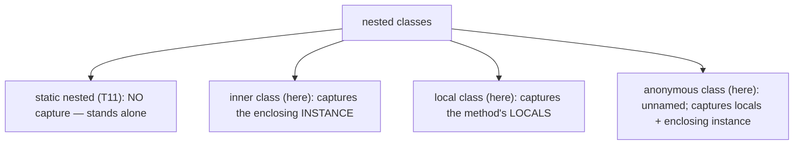
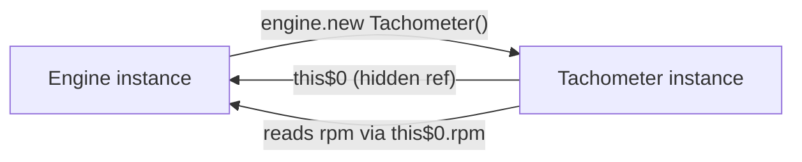
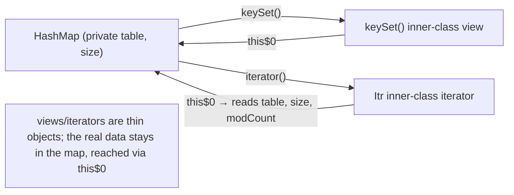
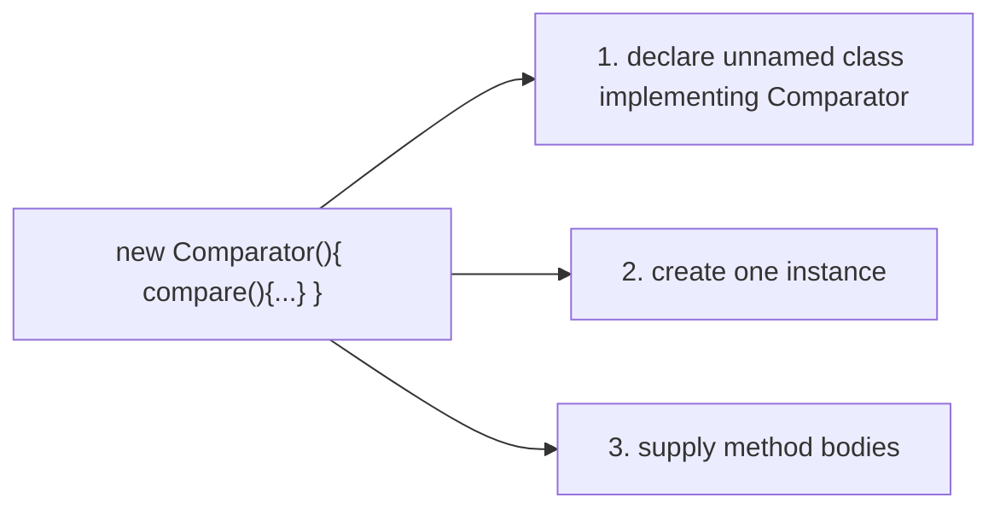
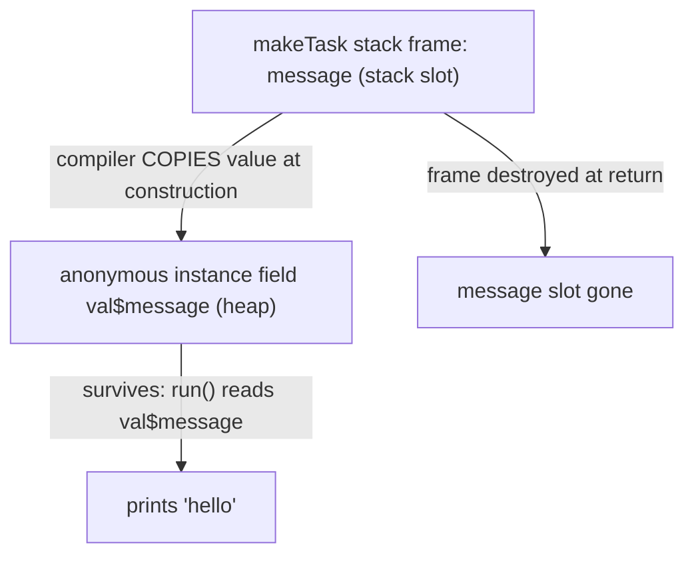
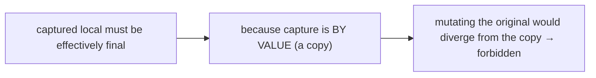
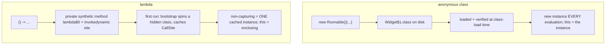
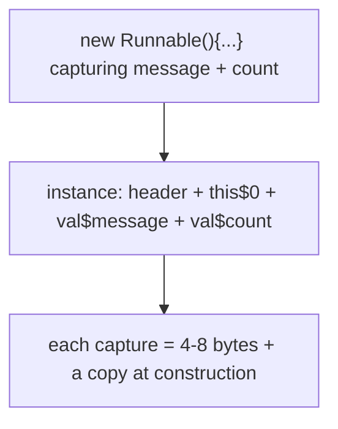
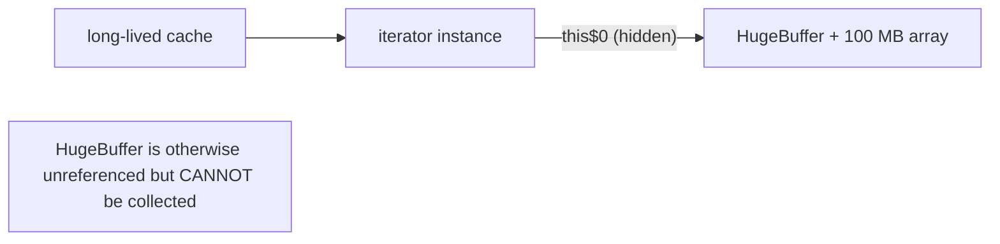
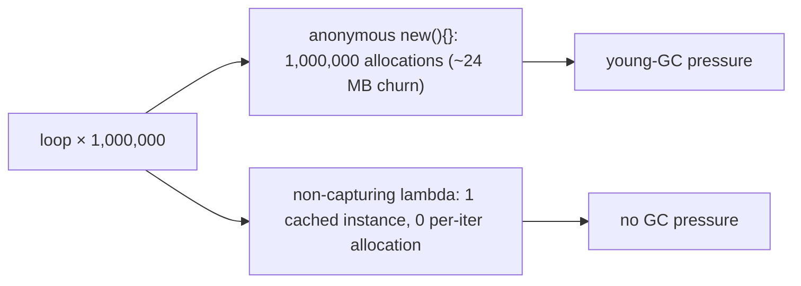

# Inner, local & anonymous classes

[T11](./T11-static-members-blocks-and-nested-classes.md) covered the **`static` nested class** — a helper type that stands alone with no link to an enclosing instance. This topic covers the three **non-static** nested classes, all of which *do* capture something from their surroundings: the **inner class** (captures the enclosing *instance*), the **local class** (declared inside a method, captures the method's *local variables*), and the **anonymous class** (an unnamed class-and-instance in a single expression, the pre-lambda workhorse for callbacks). The unifying theme is **capture** — these classes reach out and grab state from the context that created them, and that capture is implemented by the compiler synthesizing hidden fields you never wrote.

The depth bar here is the **physical mechanism of capture**. When an inner class captures its enclosing instance, the compiler adds a synthetic 4-byte field named **`this$0`** holding a reference to the outer object — and that reference keeps the entire outer object alive for the garbage collector, the leak that *Effective Java* Item 24 warns about. When an anonymous or local class captures a method's local variable, the compiler **copies the value into a synthetic final field named `val$x`**, because the variable lives on the stack frame that dies when the method returns while the class instance may outlive it — which is *why* captured locals must be **effectively final** (the copy must not be able to drift from the original). Lambdas look like a lighter syntax for anonymous classes but are a fundamentally different mechanism: no `.class` file on disk, an `invokedynamic` bootstrap instead of a constructor, and a `this` that means the *enclosing* instance rather than the lambda itself. By the end you will read the synthetic `this$0` and `val$` fields in `javap -p` output, compute the exact byte cost of each capture, explain why a non-static iterator can pin a 100 MB object graph alive, and know precisely when a lambda is cheaper than an anonymous class and why.

> [!NOTE]
> Prerequisites: [static members, blocks & nested classes](./T11-static-members-blocks-and-nested-classes.md) (`L1/C01/T11`) — the four kinds of nested class, the `this$0` field, `Outer$Nested.class` files, the enclosing-instance leak; [Classes & objects](./T01-classes-and-objects.md) (`L1/C01/T01`) — object header, heap layout, instance byte sizes; [Fields, methods, constructors, this](./T02-fields-methods-constructors-this.md) (`L1/C01/T02`) — `this`, `<init>`, instance initializer blocks; [Polymorphism](./T06-polymorphism-compile-time-vs-runtime.md) (`L1/C01/T06`) — lambda `invokedynamic`/LambdaMetafactory mechanics; [Variable scope & lifetime](../../L0-foundations/C02-java-core/T15-variable-scope-and-lifetime.md) (`L0/C02/T15`) — local variables live on the stack frame and die at method return.

## The Three Non-Static Nested Classes

Recall the four kinds of nested class ([T11](./T11-static-members-blocks-and-nested-classes.md)). T11 covered the first; this topic covers the other three:



| Kind | Declared | Captures | `.class` file |
|------|----------|----------|---------------|
| static nested | inside a class, `static` | nothing | `Outer$Nested.class` |
| inner | inside a class, non-`static` | enclosing instance (`this$0`) | `Outer$Inner.class` |
| local | inside a method | locals (`val$`) + enclosing instance | `Outer$1Local.class` |
| anonymous | inline expression | locals (`val$`) + enclosing instance | `Outer$1.class` (numbered) |

The single distinction that drives everything: a `static` nested class captures nothing; the other three reach into their surroundings, and the compiler implements that reach with synthetic fields.

## Inner (Non-Static Nested) Classes

An **inner class** is a nested class *without* the `static` keyword. Every inner-class instance is tied to an instance of the enclosing class — it cannot exist without one — and through that tie it can access the enclosing instance's fields and methods, **including private ones**.

```java
public class Engine {
    private int rpm = 800;                 // private — but the inner class can see it

    public class Tachometer {              // inner class: non-static
        public String read() {
            return rpm + " rpm";           // reads Engine's private field directly
        }
    }

    public Tachometer newTachometer() {
        return new Tachometer();           // inside Engine, the enclosing instance is implicit
    }
}
```

The `Tachometer` reads `Engine`'s private `rpm` as if it were its own. This works because every `Tachometer` holds a hidden reference to the `Engine` that created it — the synthetic `this$0` field (memory section below). `rpm` is really `this$0.rpm`.

### Creating an Inner Class — The Qualified `new`

Inside the enclosing class, `new Tachometer()` works because the enclosing `this` is implicit. From *outside*, you need to name which enclosing instance the inner instance belongs to, using the rarely-seen **qualified `new`** syntax:

```java
Engine engine = new Engine();
Engine.Tachometer tach = engine.new Tachometer();   // outer.new Inner()
```

`engine.new Tachometer()` reads "create a `Tachometer` belonging to `engine`." The `engine` becomes the inner instance's `this$0`. This syntax is uncommon precisely because inner classes are usually created *from inside* the enclosing class, where the enclosing `this` is implicit.



### `Outer.this` — Disambiguating the Two `this`es

Inside an inner class there are *two* enclosing objects: the inner instance (`this`) and the outer instance. To name the outer one explicitly — when a field name collides, or when you need to pass the outer object somewhere — use **`Outer.this`**:

```java
public class Engine {
    private int rpm;
    public class Tachometer {
        private int rpm;                       // shadows Engine.rpm
        void sync() {
            this.rpm = Engine.this.rpm;        // inner's rpm = outer's rpm
        }
        Engine engine() { return Engine.this; }// hand back the enclosing instance
    }
}
```

`Engine.this` is the enclosing instance — exactly the value of the hidden `this$0` field.

### Where Inner Classes Are Used — Iterators and Views

The killer use case is an object that needs intimate access to its enclosing object's private internals. Two canonical examples in the JDK:

**Iterators.** `ArrayList`'s iterator is a non-static inner class (`ArrayList.Itr`) so it can read the list's private `elementData` array, `size`, and `modCount` (the fail-fast modification counter) directly:

```java
// simplified from java.util.ArrayList
public class ArrayList<E> {
    Object[] elementData;
    int size;
    int modCount;

    private class Itr implements Iterator<E> {   // inner: needs the list's privates
        int cursor;
        public boolean hasNext() { return cursor != size; }      // reads outer's size
        public E next() {
            if (modCount != expectedModCount) throw new ConcurrentModificationException();
            return (E) elementData[cursor++];                     // reads outer's array
        }
    }
    public Iterator<E> iterator() { return new Itr(); }
}
```

**Collection views.** `Map.keySet()`, `Map.values()`, and `Map.entrySet()` return inner-class *views* backed by the map. A `keySet` isn't a copy — it's a thin inner-class object holding a `this$0` to the map; iterating it walks the map's buckets, and `keySet.remove(k)` removes from the map. This is how a view stays live: it reaches the map's internals through `this$0`.



## Local Classes

A **local class** is a class declared inside a method body (or block). It's scoped to that method — invisible outside it — and can capture the method's effectively-final local variables *and* (if the method is an instance method) the enclosing instance.

```java
public List<String> badges(String prefix) {
    class Badge {                        // local class, visible only in this method
        final int n;
        Badge(int n) { this.n = n; }
        String render() { return prefix + "-" + n; }   // captures the parameter `prefix`
    }
    List<String> out = new ArrayList<>();
    for (int i = 0; i < 3; i++) out.add(new Badge(i).render());
    return out;
}
```

Local classes are **rare in modern code** — lambdas and anonymous classes cover almost every case more concisely. They're occasionally useful when you need a *named* class with *multiple methods* or its own *fields*, scoped to a single method (e.g., a small state machine used only there). The capture mechanics are identical to anonymous classes (below).

## Anonymous Classes

An **anonymous class** declares a class and creates a single instance of it in one expression, without giving the class a name. It was the dominant way to write callbacks, comparators, and event handlers before lambdas (Java 8).

```java
// Pre-lambda: an anonymous Comparator
Comparator<String> byLength = new Comparator<String>() {
    @Override public int compare(String a, String b) {
        return Integer.compare(a.length(), b.length());
    }
};

// Pre-lambda: an anonymous Runnable
Runnable task = new Runnable() {
    @Override public void run() { System.out.println("working"); }
};
```

The syntax `new Type() { body }` does three things at once: declares an unnamed class that extends `Type` (or implements it, if `Type` is an interface), creates one instance, and supplies the body. Rules:

- **Exactly one supertype.** An anonymous class can **extend one class** OR **implement one interface** — never both, never multiple interfaces. (If you need more, use a named class.)
- **No constructor.** The class has no name, so you can't declare a constructor. To pass arguments, pass them to the superclass constructor: `new ArrayList<String>(16) { ... }`. For initialization logic, use an **instance initializer block** `{ ... }` ([T02](./T02-fields-methods-constructors-this.md)).
- **Captures.** Like local classes, anonymous classes capture effectively-final locals and the enclosing instance.

```java
// passing a constructor argument + instance initializer
List<String> seeded = new ArrayList<String>(10) {   // calls ArrayList(int)
    {                                                 // instance initializer (no constructor possible)
        add("a"); add("b");
    }
};
```

Anonymous classes are still useful when you need to **implement multiple methods**, **hold fields/state**, or **extend a class** (not just an interface) — cases lambdas can't handle. For a single-method functional interface, prefer a lambda.



## Variable Capture and Effectively Final

The deepest concept in this topic: how local classes and anonymous classes **capture local variables**, and why those variables must be **effectively final**.

A local variable lives in its method's **stack frame** ([L0/C02/T15](../../L0-foundations/C02-java-core/T15-variable-scope-and-lifetime.md)). When the method returns, the frame is destroyed and the variable's storage is gone. But an anonymous-class instance created in that method can **outlive the method** — it might be returned, stored in a field, or registered as a listener that fires hours later:

```java
Runnable makeTask(String message) {
    return new Runnable() {
        public void run() { System.out.println(message); }   // uses `message` after makeTask returns
    };
}

Runnable r = makeTask("hello");   // makeTask's frame is GONE now
r.run();                          // but this still prints "hello" — how?
```

When `r.run()` executes, `makeTask`'s stack frame — where `message` lived — was destroyed long ago. So the anonymous instance cannot reference the stack slot. Instead, **the compiler copies `message`'s value into a synthetic field of the anonymous class at construction time.** The captured variable becomes a heap field that lives as long as the instance does.



### Why "Effectively Final"

Because capture is **by value** (a copy), Java requires the captured variable to be **effectively final** — assigned once and never changed after. The reason is *consistency*: if you could mutate `message` after the anonymous class captured it, the source would *look* like the class sees the new value, but the class actually holds a stale copy. To avoid this confusing divergence, Java forbids mutating captured locals:

```java
int count = 0;
Runnable r = () -> System.out.println(count);   // captures count
count++;                                          // COMPILE ERROR: count must be effectively final
```

"Effectively final" (Java 8+) means the variable *could* be `final` — it's never reassigned — without you writing the keyword. Java 7 and earlier required the explicit `final` keyword on captured locals; Java 8 relaxed it to "effectively final" to reduce boilerplate, especially for lambdas.



### The Mutable-Holder Workaround

Sometimes you genuinely need a closure to update outer state — a counter, an accumulator. Since you can't mutate the captured *variable*, you capture an effectively-final *reference* to a mutable *container* and mutate its contents:

```java
int[] count = {0};                          // the array reference is effectively final
List.of("a", "b", "c").forEach(s -> count[0]++);   // mutate the array's element, not the variable
System.out.println(count[0]);               // 3

// cleaner: AtomicInteger
AtomicInteger counter = new AtomicInteger();
List.of("a", "b", "c").forEach(s -> counter.incrementAndGet());
```

The `count` *variable* (the array reference) never changes — only `count[0]` (the array's contents) does. The capture is of the reference, which is effectively final; the mutation is of the heap object it points to. This is a common idiom and a deliberate signal that you're updating shared state. (For real concurrent accumulation, use `AtomicInteger`/`LongAdder` — [L3/C01].)

## Lambdas vs Anonymous Classes — Not the Same Mechanism

Lambdas *look* like terse anonymous classes, and for a single-method interface they're interchangeable in *behavior*. But they are **completely different mechanisms** under the hood, and the differences are observable.

```java
// anonymous class
Runnable a = new Runnable() { public void run() { System.out.println(this); } };
// lambda
Runnable l = () -> System.out.println(this);
```

| Aspect | Anonymous class | Lambda |
|--------|-----------------|--------|
| `.class` file on disk | yes — `Outer$1.class` | **no** — generated at runtime as a hidden class |
| Compilation | a real class, loaded at class-load time | `invokedynamic` + `LambdaMetafactory` bootstrap ([T06](./T06-polymorphism-compile-time-vs-runtime.md)) |
| `this` refers to | **the anonymous instance** | **the enclosing instance** |
| Can extend a class | yes | no — functional interface only |
| Can have fields/multiple methods | yes | no — single abstract method |
| Non-capturing instance | a new object each time | **a single cached instance** ([T06](./T06-polymorphism-compile-time-vs-runtime.md)) |
| Capture mechanism | synthetic `val$` fields | captured args passed to the bootstrapped factory |

The **`this` difference** is the one that bites people. In an anonymous class, `this` is the anonymous object; to reach the enclosing instance you write `Outer.this`. In a lambda, the lambda has *no* `this` of its own — `this` means exactly what it means in the enclosing method: the enclosing instance. So:

```java
public class Widget {
    String name = "widget";
    void demo() {
        Runnable anon = new Runnable() {
            public void run() { System.out.println(this.getClass()); }  // the anonymous class
        };
        Runnable lamb = () -> System.out.println(this.getClass());      // Widget
        anon.run();   // class Widget$1
        lamb.run();   // class Widget
    }
}
```

The bytecode story (full detail in [T06](./T06-polymorphism-compile-time-vs-runtime.md)): an anonymous class produces a real `Widget$1.class` loaded by the classloader; a lambda produces a private synthetic method holding the body plus an `invokedynamic` site that, on first execution, spins a hidden class in memory and caches it. **A program with 1,000 anonymous classes loads 1,000 `.class` files; the same program with 1,000 lambdas loads zero extra `.class` files** (they're generated on demand and many are cached singletons). This is a real startup-time and metaspace difference at scale.



**When to use which:** lambda for a single-method functional interface (the 95% case). Anonymous class when you must extend a class, implement multiple methods, hold instance fields, or need `this` to refer to the new object (e.g., self-registering/deregistering listeners).

## Cross-Language Perspective — Closures and Capture

Capture is the universal mechanism behind **closures** — functions that "close over" variables from their defining scope. Every language with closures faces the same question Java did: *what happens to a captured local when the enclosing function returns?* The answers differ instructively:

| Language | Capture semantics | Mutable captured locals? |
|----------|-------------------|--------------------------|
| **Java** | by value (copies into `val$` field); requires effectively-final | no (use a holder) |
| **JavaScript** | by reference (the variable is heap-allocated in the closure environment) | **yes** — closures see mutations |
| **Python** | by reference (cell objects); `nonlocal` to rebind | yes (with `nonlocal`) |
| **Swift** | by reference by default; `[capture]` lists for value capture | yes |
| **Kotlin** | by reference (wraps mutable captured vars in a `Ref` object) | **yes** — Kotlin lets you mutate captured vars |
| **C++** | **explicit capture list**: `[=]` by value, `[&]` by reference | yes (your choice) |

Two contrasts illuminate Java's design:

**JavaScript/Python/Kotlin capture by reference**, which means a closure and its enclosing scope *share* the variable — mutations in one are visible in the other. The cost: the captured variables must be **heap-allocated** (boxed into an "environment" or "cell" object), because they outlive the stack frame. The famous JavaScript "loop variable in a closure" bug (`for (var i...)` where all closures see the final `i`) comes directly from by-reference capture of a shared mutable variable. Kotlin makes captured `var`s work by silently wrapping them in a `Ref.IntRef` heap object — the same mutable-holder trick Java makes you write by hand, done automatically.

**C++ forces you to choose** with an explicit capture list: `[=]` copies (by value, like Java), `[&]` captures by reference (a pointer to the stack variable — *dangling* if the lambda outlives the scope, a classic C++ footgun). Java removed the choice and the footgun: always by value, always safe, at the cost of not being able to mutate captured locals directly.

Java's "capture by value of an effectively-final local" is the **safest** point in this design space: no shared-mutable-variable bugs (JS), no dangling references (C++), no hidden heap boxing of every captured var (Kotlin does box, Java copies a value). The price is the effectively-final restriction and the mutable-holder workaround when you really need shared mutation.

## Memory Layer — `this$0` and `val$` Fields in Physical Bytes

The synthetic fields the compiler generates for capture have exact byte costs. Let's measure them.

### The `this$0` Field

Every **inner-class** instance carries a synthetic `final` field — conventionally printed as `this$0` — holding a reference to the enclosing instance. With compressed oops it's **4 bytes**. The compiler:

1. Adds `final Outer this$0;` to the inner class.
2. Gives the inner class's constructor a hidden **first parameter** of type `Outer`.
3. Assigns the parameter to `this$0` in the constructor, before the body runs.
4. Rewrites `new Inner()` (inside `Outer`) to pass the enclosing `this`, and `outer.new Inner()` to pass `outer`.

```java
class Outer {
    int x;
    class Inner { int a; }
}
```

`javap -p Outer$Inner` reveals the synthetic field and constructor:

```
class Outer$Inner {
  final Outer this$0;                  // synthetic, 4 bytes
  int a;
  Outer$Inner(Outer);                  // hidden Outer parameter
    Code:
       0: aload_0
       1: aload_1
       2: putfield this$0:LOuter;      // this.this$0 = the Outer argument
       ...
}
```

Instance byte layout:

```
Outer$Inner instance (compressed oops):
  +0   header   12 bytes
  +12  this$0    4 bytes  (synthetic ref to Outer)
  +16  a         4 bytes
  total: 20 → padded to 24 bytes
```

A `static` nested class with the same `int a` is **16 bytes** (header + a, padded). The inner class is **24 bytes** — the `this$0` reference plus padding adds 8 bytes per instance. For an iterator created millions of times, that's real memory.

### `val$` Capture Fields

Each captured local variable becomes a synthetic `final` field named `val$x` (the original variable name with a `val$` prefix). A captured `int` is 4 bytes; a captured reference is 4 bytes (compressed); a captured `long`/`double` is 8 bytes.

```java
Runnable makeTask(String message, int count) {
    return new Runnable() {
        public void run() { System.out.println(message + count); }
    };
}
```

`javap -p Outer$1` (the anonymous class):

```
class Outer$1 implements Runnable {
  final String val$message;            // captured String, 4 bytes
  final int val$count;                 // captured int, 4 bytes
  final Outer this$0;                  // enclosing instance, 4 bytes (if makeTask is an instance method)
  Outer$1(Outer, String, int);         // hidden params: enclosing + each capture
}
```

Instance byte layout:

```
Outer$1 instance:
  +0   header        12 bytes
  +12  this$0         4 bytes  (enclosing Outer — only if makeTask is non-static)
  +16  val$message    4 bytes  (captured String ref)
  +20  val$count      4 bytes  (captured int)
  total: 24 bytes
```

**Each capture costs 4–8 bytes per instance**, plus the construction-time copy. A closure capturing five locals is five synthetic fields. This is usually negligible, but in hot loops creating many short-lived closures it adds allocation pressure — which is exactly where lambdas + escape analysis ([T06](./T06-polymorphism-compile-time-vs-runtime.md)) help by eliminating the allocation entirely.



### The `.class` Files on Disk

Each non-static nested class compiles to its own file, named by the compiler's convention:

| Source | `.class` file |
|--------|---------------|
| named inner class `Inner` | `Outer$Inner.class` |
| named local class `Badge` in method | `Outer$1Badge.class` (number disambiguates same-named locals) |
| anonymous class (1st in `Outer`) | `Outer$1.class` |
| anonymous class (2nd in `Outer`) | `Outer$2.class` |

Anonymous classes are numbered sequentially in source order. This is why a class with many anonymous classes produces `Outer$1.class`, `Outer$2.class`, … `Outer$17.class` — a directory full of numbered files. Each is a real class the JVM loads, verifies, and holds metadata for in Metaspace (~500–700 bytes each, [T01](./T01-classes-and-objects.md)). Lambdas produce none of these files.

## Memory Layer — The Enclosing-Instance Leak

This is the concrete mechanism behind *Effective Java* Item 24's warning ([T11](./T11-static-members-blocks-and-nested-classes.md)). Because an inner-class (or capturing anonymous-class) instance holds `this$0`, **the enclosing instance cannot be garbage-collected as long as the inner instance is reachable** — even if nothing else references the enclosing object.

```java
public class HugeBuffer {
    private final byte[] data = new byte[100_000_000];  // 100 MB

    public Iterator<Byte> iterator() {
        return new Iterator<>() {        // anonymous inner: holds this$0 → HugeBuffer
            int i = 0;
            public boolean hasNext() { return i < data.length; }
            public Byte next() { return data[i++]; }
        };
    }
}

// somewhere:
Iterator<Byte> it = new HugeBuffer().iterator();
// the HugeBuffer is now unreferenced EXCEPT through it.this$0
// as long as `it` is alive, the 100 MB buffer cannot be collected
```

The `HugeBuffer` is logically dead — no variable points to it — but the iterator's `this$0` keeps it (and its 100 MB array) alive. If `it` is stored in a long-lived cache or registry, the 100 MB leaks. This is insidious because the leak is *invisible in the source* — you never wrote the `this$0` field.



The fix, per Item 24: if the nested class doesn't *need* the enclosing instance, make it `static` ([T11](./T11-static-members-blocks-and-nested-classes.md)). If it does need some outer state, capture *only that state* (e.g., copy the needed array reference into a field) rather than the whole enclosing instance — or use a `static` nested class with an explicit, minimal constructor parameter. The general principle: **capture the least you need.**

## Architecture Layer — Construction Cost and Access

### Construction Cost

Creating a capturing anonymous-class instance does real work at the `new` site:

```
new Outer$1(enclosing, message, count):
  1. allocate the instance (TLAB bump, ~10 ns — T01)
  2. write header (~3 ns)
  3. store this$0 = enclosing       (~1 cycle)
  4. store val$message = message    (~1 cycle)
  5. store val$count = count        (~1 cycle)
  total: ~15-30 ns + one heap object per creation
```

Every capture is one field store at construction. For an anonymous class created once, this is nothing. In a hot loop creating one per iteration, it's allocation + GC pressure proportional to the loop count — the same trap as capturing lambdas without escape analysis ([T06](./T06-polymorphism-compile-time-vs-runtime.md)).

### Why Lambdas Are Cheaper

A non-capturing lambda is a **cached singleton** — created once, reused forever ([T06](./T06-polymorphism-compile-time-vs-runtime.md)). An anonymous class with no captures still allocates a *new instance every time* the expression runs (the compiler doesn't cache anonymous instances). So:

```java
for (int i = 0; i < 1_000_000; i++) {
    Runnable a = new Runnable() { public void run() {} };  // 1,000,000 allocations
    Runnable l = () -> {};                                  // 1 cached instance, 0 allocations
}
```

The non-capturing anonymous class allocates a million objects; the equivalent non-capturing lambda allocates **one** (cached at the `invokedynamic` CallSite). This is a concrete reason to prefer lambdas: they're not just terser, they allocate less.



### Accessing Enclosing Privates — Bridges vs Nest Mates

When an inner class reads the enclosing class's `private` field (`rpm` in the `Tachometer` example), how does the JVM allow it? They're different classes; normally `private` blocks cross-class access ([T03](./T03-encapsulation-and-access-modifiers.md)).

- **Pre-Java 11:** the compiler generated synthetic **bridge accessor methods** (`access$000`, `access$100`) — package-private wrappers in the enclosing class that the inner class called to reach the privates. Every private field/method an inner class touched spawned a synthetic accessor, bloating the class and adding an extra method call per access ([T03 deeper section](./T03-encapsulation-and-access-modifiers.md#deeper-jvm-internals--nest-based-access-binary-compatibility-and-the-access-check-pipeline)).
- **Java 11+ (JEP 181, nest-based access):** the enclosing class and all its nested classes form a **nest** (declared via `NestHost`/`NestMembers` attributes). Nest mates can access each other's privates **directly** — no synthetic bridges, direct `getfield`/`putfield`. Cleaner bytecode, lower memory, faster access.

So on Java 11+, `this$0.rpm` is a direct `getfield` through the `this$0` reference; pre-11 it was `access$000(this$0)`, an extra call. The `this$0` indirection itself remains (one pointer hop to reach the enclosing instance, ~4 cycles for the load), but the access-control bridge is gone.

### Virtual Call Inlining

A call through an anonymous-class instance (`comparator.compare(a, b)`) is an `invokeinterface`/`invokevirtual` ([T06](./T06-polymorphism-compile-time-vs-runtime.md)). If the call site sees only one anonymous-class type (monomorphic), the JIT inlines the body via inline caching ([T05](./T05-method-overriding.md)) — the anonymous class's method body is spliced into the caller, and the dispatch vanishes. So a hot anonymous-class callback is as fast as a direct call once warmed up, same as a lambda. The construction cost (allocation) is the only steady-state difference, and only when captures or non-caching apply.

## Common Mistakes

> [!WARNING]
> **The enclosing-instance leak.** A non-static inner class (or capturing anonymous class) holds `this$0`, pinning the entire enclosing object alive. A long-lived iterator/listener/callback can leak a huge object graph. If the nested class doesn't need the enclosing instance, make it `static` (Effective Java Item 24).

> [!WARNING]
> **Mutating a captured local.** `int n = 0; Runnable r = () -> n++;` is a compile error — captured locals must be effectively final. Use a one-element array or `AtomicInteger` to update shared state through a captured reference.

> [!WARNING]
> **`this` confusion in anonymous classes vs lambdas.** In an anonymous class, `this` is the anonymous instance (use `Outer.this` for the enclosing). In a lambda, `this` is the enclosing instance. Registering/deregistering a listener via `this` works in an anonymous class but means something different in a lambda.

> [!WARNING]
> **Expecting an anonymous class to implement two interfaces.** It can extend one class OR implement one interface — never multiple. Use a named class.

> [!WARNING]
> **Trying to give an anonymous class a constructor.** It has no name, so no constructor. Pass args to the superclass constructor, and use an instance initializer block `{ ... }` for setup logic.

> [!WARNING]
> **Anonymous-class allocation in hot loops.** Each evaluation of a `new X(){}` expression allocates a fresh instance (no caching), even with no captures. A non-capturing lambda caches a singleton. In hot paths, prefer lambdas.

> [!WARNING]
> **The pre-Java-8 loop-capture bug.** Before effectively-final, capturing a loop variable required copying it to a `final` local inside the loop (`final int j = i;`). Java 8's for-each loop variable is effectively final per iteration, so `for (String s : list) runnables.add(() -> use(s));` works — but a classic indexed `for (int i...)` still can't capture `i` directly (it's reassigned).

> [!INTERVIEW]
> Common interview questions for this topic:
> 1. **Inner vs static nested class?** Inner is non-static and holds a hidden `this$0` reference to the enclosing instance (4 bytes + pins it alive); static nested has no enclosing reference. Prefer static when the enclosing instance isn't needed.
> 2. **What is `this$0`?** The synthetic `final` field the compiler adds to every inner-class instance, holding the enclosing instance. `Outer.this` reads it. It's why inner classes can access enclosing privates and why they can leak the enclosing object.
> 3. **Why must captured locals be effectively final?** Capture is by value — the compiler copies the local into a synthetic `val$` field because the stack variable dies when the method returns. Forbidding mutation keeps the copy consistent with the source.
> 4. **How do you mutate state from a lambda/anonymous class?** Capture an effectively-final reference to a mutable holder (one-element array, `AtomicInteger`) and mutate its contents, not the variable.
> 5. **Lambda vs anonymous class — same thing?** No. Anonymous class = a real `.class` file, allocated each time, `this` = the instance. Lambda = `invokedynamic` + generated hidden class, non-capturing ones cached as a singleton, `this` = enclosing instance.
> 6. **What does `this` mean in a lambda?** The enclosing instance — lambdas have no `this` of their own. In an anonymous class, `this` is the anonymous instance.
> 7. **How does an inner class access the outer's private fields?** Via `this$0`. Pre-Java-11 through synthetic `access$NNN` bridge methods; Java 11+ via nest-based access (direct, no bridges).
> 8. **What's the `qualified new` syntax?** `outer.new Inner()` — creates an inner instance belonging to a specific enclosing instance, used when constructing from outside the enclosing class.
> 9. **Can an anonymous class capture `this` of the enclosing class?** Yes, via `Outer.this`, and it does so by storing the enclosing instance in `this$0`.
> 10. **Why prefer lambdas in hot loops?** Non-capturing lambdas are cached singletons (zero allocation per use); anonymous classes allocate a new instance every time.
> 11. **What `.class` files do anonymous classes produce?** `Outer$1.class`, `Outer$2.class`, … numbered sequentially. Lambdas produce none (generated at runtime).
> 12. **How do other languages differ on capture?** JS/Python/Kotlin capture by reference (closures share and can mutate the variable, requiring heap boxing); C++ lets you choose `[=]`/`[&]`; Java is always by value of an effectively-final local — the safest but least flexible.

## Practice

1. **Inner class reading outer private.** Write `Engine` with a `private int rpm` and an inner `Tachometer` that returns `rpm`. Construct via `engine.new Tachometer()`. Confirm it reads the private field. Then try `new Tachometer()` from outside `Engine` (without an enclosing instance) — observe the compile error.

2. **`Outer.this`.** Give an inner class a field that shadows an outer field. Use `Outer.this.field` to read the outer one and `this.field` for the inner one. Confirm both resolve correctly.

3. **`javap -p` the `this$0`.** Compile an inner class. Run `javap -p Outer$Inner`. Identify the synthetic `final Outer this$0;` field and the constructor's hidden `Outer` parameter.

4. **Static nested vs inner byte size.** Declare both a `static class SN { int a; }` and an inner `class IN { int a; }` in the same `Outer`. Use JOL to dump both instances. Confirm `IN` is ~8 bytes larger (the `this$0` field + padding).

5. **Anonymous Comparator → lambda.** Write a sort using an anonymous `Comparator`. Convert it to a lambda. Confirm identical behavior. Then `javap` the enclosing class — find the `Outer$1.class` for the anonymous version; confirm the lambda version produces no extra `.class` file (look for `invokedynamic` + a `lambda$` synthetic method instead).

6. **Capture and effectively-final.** Write a method returning a `Runnable` that prints a captured parameter. Confirm it prints the value even after the method returns. Then try to reassign the parameter after capture — observe the compile error.

7. **`val$` fields.** Capture two locals (a `String` and an `int`) in an anonymous class. `javap -p` the `Outer$1` class. Identify the `val$` fields and the constructor parameters that initialize them.

8. **Mutable-holder workaround.** Try to increment a captured `int` from inside a `forEach` lambda — observe the compile error. Fix with a one-element `int[]`. Then fix with `AtomicInteger`. Explain why the array reference is effectively final while its contents are mutable.

9. **`this` difference.** In an instance method of a `Widget` class, create both an anonymous `Runnable` and a lambda `Runnable`, each printing `this.getClass()`. Run both. Confirm the anonymous prints `Widget$1` and the lambda prints `Widget`.

10. **Enclosing-instance leak.** Write a `HugeBuffer` with a large array and an `iterator()` returning an anonymous inner iterator. Create a buffer, get its iterator, drop the buffer reference, and take a heap dump — confirm the buffer is still alive (pinned by `this$0`). Refactor the iterator to a `static` nested class taking the array as a constructor argument; confirm the buffer is now collectible.

11. **Non-capturing anonymous allocation.** In a loop of 1,000,000 iterations, create a non-capturing anonymous `Runnable` each iteration; measure allocation with `-XX:+PrintGC` or a profiler. Replace with a non-capturing lambda; confirm the allocation drops to ~zero (one cached instance).

12. **Local class.** Write a method with a local class that has a field and two methods, using a captured parameter. Confirm it compiles and works. Discuss when a local class is preferable to an anonymous class (named, multiple methods, multiple instances in the method).

13. **Anonymous class with constructor arg + instance initializer.** Create `new ArrayList<String>(10) { { add("x"); } }`. Confirm the initializer runs and the capacity arg is passed. Explain why you can't write a constructor.

14. **Nest-based access (Java 11+).** Compile an inner class accessing an outer private on Java 11+. Run `javap -v Outer` and find the `NestMembers` attribute; run `javap -v Outer$Inner` and find `NestHost`. Compare with Java 8 bytecode (if available) showing synthetic `access$000` methods.

15. **End-to-end explain-it-back.** Trace `makeTask("hi")` returning `new Runnable(){ run(){ print(message); } }`: (a) the compiler generates `Outer$1` with a `val$message` field and a constructor taking the captured value (plus `this$0` if `makeTask` is an instance method); (b) `new Outer$1(this, "hi")` allocates the instance and copies `"hi"` into `val$message`; (c) `makeTask` returns; its stack frame (where the parameter lived) is destroyed; (d) `r.run()` reads `val$message` from the heap instance — still `"hi"`; (e) why the value had to be copied rather than referenced; (f) the byte cost of the instance. Twelve sentences max.

## Recap

You should now be able to:

**Language layer.**

- Distinguish inner, local, and anonymous classes, and explain what each captures (enclosing instance, locals, or both).
- Use an inner class to access enclosing private state; create one with `outer.new Inner()`; disambiguate with `Outer.this`.
- Recognize the canonical inner-class use cases (iterators, collection views) and why they need the enclosing instance.
- Write an anonymous class (extend one class or implement one interface; no constructor; instance initializer for setup).
- Explain variable capture: locals are copied into synthetic fields because the stack frame dies; this is why captured locals must be effectively final.
- Apply the mutable-holder workaround (array / `AtomicInteger`) to update state from a closure.
- Explain how lambdas differ from anonymous classes (mechanism, `this` semantics, caching, `.class` files) and choose the right one.

**Memory layer.**

- Identify the synthetic `this$0` field (4 bytes) on inner-class instances and the `val$x` fields (4–8 bytes each) on capturing classes; read them in `javap -p`.
- Compute instance byte sizes for inner and anonymous classes including capture fields.
- Recognize the `.class` files produced (`Outer$Inner`, `Outer$1`, `Outer$1Local`) and that lambdas produce none.
- Explain the enclosing-instance leak: `this$0` pins the enclosing object alive, and how making the class `static` (or capturing minimally) fixes it.

**Architecture layer.**

- Quantify capture construction cost (one field store per capture + one allocation).
- Explain why non-capturing lambdas (cached singletons) allocate less than non-capturing anonymous classes (new instance each time).
- Explain enclosing-private access: pre-Java-11 synthetic `access$NNN` bridges vs Java 11+ direct nest-based access.
- Explain how the JIT inlines monomorphic anonymous-class/lambda callbacks so dispatch is free after warm-up.
- Compare Java's capture-by-value-of-effectively-final with by-reference capture (JS/Python/Kotlin) and explicit capture lists (C++), and the safety trade-offs.

Inner, local, and anonymous classes are about **capturing context** — the enclosing instance or a method's locals — and the compiler implements that capture with synthetic fields you never see in the source but pay for in bytes and lifetime. Lambdas largely replaced anonymous classes for single-method callbacks, but the capture concepts (effectively-final, the mutable-holder workaround) carry straight over to lambdas. The next topic, [T13](./T13-enum-types-with-fields-methods.md), covers **enums** — a special, powerful kind of class for fixed sets of constants, where each constant is effectively a singleton instance and the compiler generates a great deal on your behalf.

## Next

Continue to [enum types (with fields/methods)](./T13-enum-types-with-fields-methods.md) — Java's type-safe enumeration, far more than named integers. Each enum constant is a singleton instance of the enum class; enums can have fields, methods, and constructors; they're the *Effective Java*-recommended singleton; and the compiler generates `values()`, `valueOf()`, `ordinal()`, and `name()` plus a great deal of memory structure we'll dissect. After the nested-class detour, T13 returns to a focused, deeply-mechanized single language feature.
