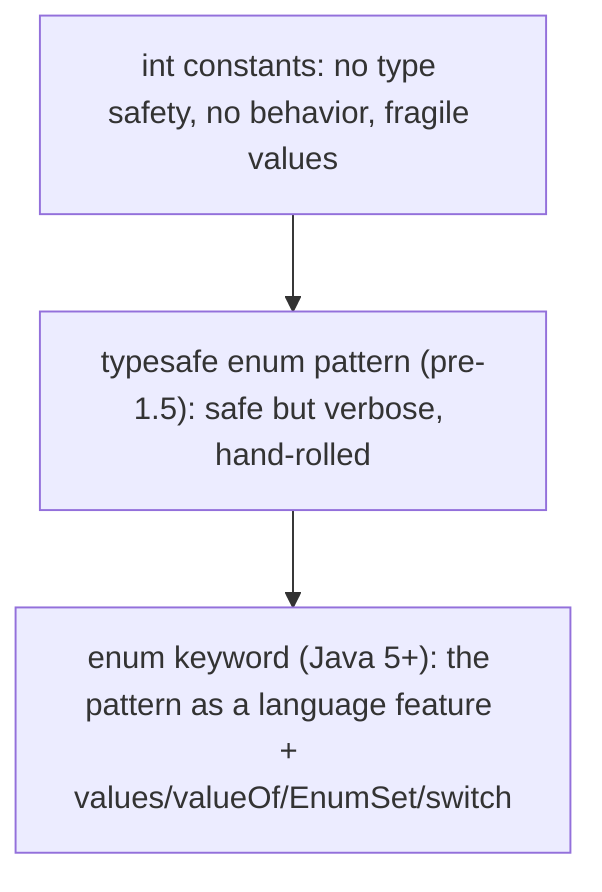
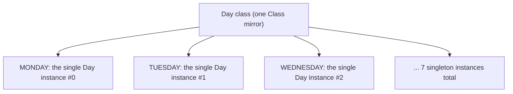
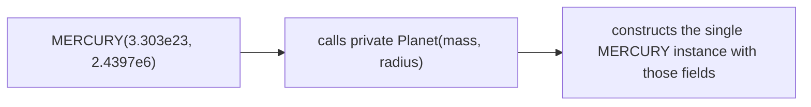
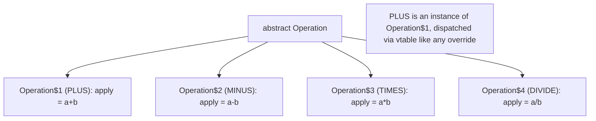
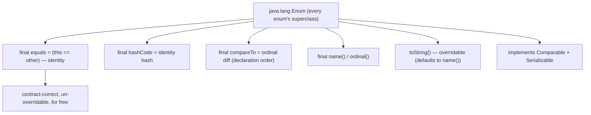
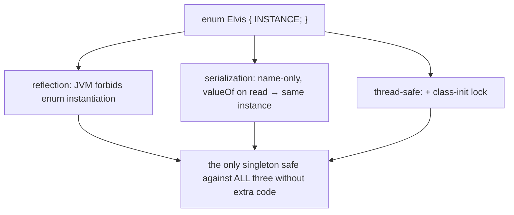
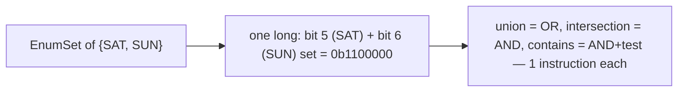
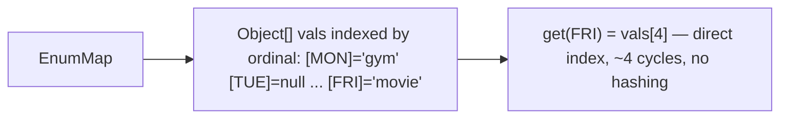
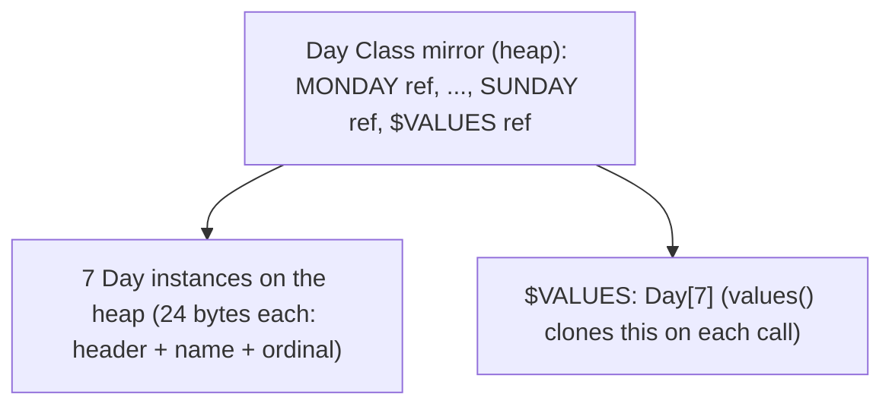
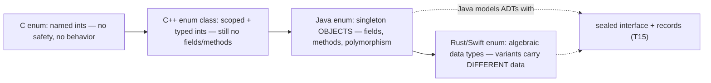

# enum types (with fields/methods)

An **enum** is a class whose instances are a **fixed, named, compile-time-known set of constants** — `Day.MONDAY`, `Suit.HEARTS`, `HttpStatus.NOT_FOUND`. It looks like the "named integer constants" feature of C, but it is far more: each enum constant is a **full-fledged singleton object** of the enum's class, and that class can have **fields, constructors, methods, and even per-constant behavior**. Enums are how Java models a closed set of options type-safely — you cannot pass `42` where a `Day` is expected, cannot misspell a constant without a compile error, and cannot create a `Day` that isn't one of the seven. They are also the language's **best singleton** (one constant, `INSTANCE`), the backing for two specialized blazing-fast collections (`EnumSet`, `EnumMap`), and the cleanest target for `switch`.

The depth bar here is the **machinery the compiler generates and where it lives in memory**. Each enum constant compiles to a `public static final` field holding a singleton instance, all of them constructed once in the class initializer `<clinit>` ([T11](./T11-static-members-blocks-and-nested-classes.md)) and stored in the enum's `Class` mirror on the heap. The constants share a synthetic `$VALUES` array, which `values()` defensively **clones on every call** (a real allocation cost people forget). Constant-specific method bodies aren't magic — each one is an **anonymous subclass** of the enum ([T12](./T12-inner-local-and-anonymous-classes.md)), so `Operation.PLUS` is literally an instance of a synthetic `Operation$1` class. Because constants are singletons, enum equality is **identity** (`==`, one CPU instruction) — `Enum.equals` is `final` and just does `this == other` — and `EnumSet` exploits this by representing a set of constants as the **bits of a single `long`** (set operations are one bitwise instruction), while `EnumMap` is just an **array indexed by ordinal** (no hashing, no `Node` objects). A `switch` on an enum compiles to a `tableswitch` (an O(1) jump table) over a synthetic ordinal map. By the end you will know exactly how many bytes an enum constant, an `EnumSet`, and an `EnumMap` occupy, why enums are the only reflection-and-serialization-safe singleton, and why `EnumSet` is ~20× smaller and faster than `HashSet` of the same constants.

> [!NOTE]
> Prerequisites: [static members, blocks & nested classes](./T11-static-members-blocks-and-nested-classes.md) (`L1/C01/T11`) — `static final` fields, `<clinit>`, the class-init lock, where statics live; [Inner, local & anonymous classes](./T12-inner-local-and-anonymous-classes.md) (`L1/C01/T12`) — anonymous subclasses (constant-specific bodies use them); [Classes & objects](./T01-classes-and-objects.md) (`L1/C01/T01`) — object header, `==` identity, singleton concept; [equals/hashCode](./T10-equals-hashcode-tostring-contracts.md) (`L1/C01/T10`) — why identity equality is correct for singletons; [L0/C02/T08 control flow](../../L0-foundations/C02-java-core/T08-control-flow-if-else-switch-switch-expressions.md) — `switch` and the enum `$SwitchMap` mechanism.

## Why Enums Exist — The int-Constant Problem

Before Java 5 (2004), programmers faked enumerations with `static final int` constants:

```java
public class Suit {
    public static final int HEARTS   = 0;
    public static final int DIAMONDS = 1;
    public static final int CLUBS    = 2;
    public static final int SPADES   = 3;
}

void play(int suit) { ... }
play(Suit.HEARTS);   // works
play(42);            // ALSO COMPILES — 42 is a valid int, but not a valid suit
play(someColor);     // a Color constant (also an int) compiles — no type safety
```

This **int-enum pattern** has fatal flaws:

- **No type safety.** Any `int` is accepted where a "suit" is expected — `42`, a `Color` constant, a loop index. The compiler can't help.
- **No namespace.** `HEARTS` from `Suit` and `HEARTS` from a card game's `Rank` collide unless prefixed.
- **Brittle printing.** Printing a suit shows `0`, not `HEARTS`. You'd write a manual `int → String` lookup.
- **Fragile values.** If you insert a constant or reorder them, the `int` values shift, silently corrupting any data persisted as those ints.
- **No behavior.** You can't attach a method to `HEARTS` (e.g., `color()` returning red/black).

Joshua Bloch's pre-Java-5 workaround was the **typesafe enum pattern**: a `final` class with a `private` constructor and `public static final` instances ([T03](./T03-encapsulation-and-access-modifiers.md) — private constructor for controlled instantiation):

```java
// the pre-Java-5 hand-rolled pattern
public final class Suit {
    private final String name;
    private Suit(String name) { this.name = name; }
    public static final Suit HEARTS   = new Suit("hearts");
    public static final Suit DIAMONDS = new Suit("diamonds");
    // ... type-safe (only Suit instances), but verbose and no switch/serialization support
}
```

Java 5 turned this pattern into a **language feature** — the `enum` keyword generates all of it (and more: `values()`, `valueOf()`, `ordinal()`, serialization, `switch` support, `EnumSet`/`EnumMap`). The modern enum *is* Bloch's pattern, built into the language.



## Declaring an Enum — Constants Are Singletons

The basic form:

```java
public enum Day {
    MONDAY, TUESDAY, WEDNESDAY, THURSDAY, FRIDAY, SATURDAY, SUNDAY;
}

Day today = Day.WEDNESDAY;
play(today);          // type-safe — only a Day fits
play(42);             // COMPILE ERROR — 42 is not a Day
System.out.println(today);   // "WEDNESDAY" — readable by default
```

Each constant — `MONDAY`, `TUESDAY`, … — is a **`public static final` field** holding the **single instance** of `Day` that represents that day. There is exactly one `MONDAY` object for the entire program's lifetime; every reference to `Day.MONDAY` is that same object. This singleton property is *guaranteed* by the JVM (constructed once in `<clinit>`, [T11](./T11-static-members-blocks-and-nested-classes.md)), which is why you compare enums with `==`:

```java
if (today == Day.WEDNESDAY) { ... }   // identity comparison — correct AND fast (1 cycle)
```



## Enums with Fields, Constructors, and Methods

The power of Java enums: each constant is a real object, so the enum class can have **fields** (per-constant data), a **constructor** (to set them), and **methods** (behavior). The canonical example — planets with mass and radius computing surface gravity:

```java
public enum Planet {
    MERCURY(3.303e+23, 2.4397e6),
    VENUS  (4.869e+24, 6.0518e6),
    EARTH  (5.976e+24, 6.37814e6),
    MARS   (6.421e+23, 3.3972e6);

    private final double mass;     // per-constant field
    private final double radius;   // per-constant field

    Planet(double mass, double radius) {   // constructor — implicitly private
        this.mass = mass;
        this.radius = radius;
    }

    private static final double G = 6.67300E-11;

    public double surfaceGravity() {        // behavior shared by all constants
        return G * mass / (radius * radius);
    }
    public double surfaceWeight(double otherMass) {
        return otherMass * surfaceGravity();
    }
}

double earthWeight = 175;
double mass = earthWeight / Planet.EARTH.surfaceGravity();
for (Planet p : Planet.values())
    System.out.printf("Weight on %s: %.2f%n", p, p.surfaceWeight(mass));
```

Each constant passes its arguments to the constructor: `MERCURY(3.303e+23, 2.4397e6)` calls `Planet(double, double)` with those values. The **constructor is implicitly `private`** — you cannot write `new Planet(...)`; the only `Planet` instances that will ever exist are the four constants, created when the `Planet` class initializes. This is enforced: an enum constructor cannot be `public` or `protected`.



## Constant-Specific Method Bodies — Anonymous Subclasses

Sometimes each constant needs **different behavior**, not just different data. An arithmetic `Operation` enum where `PLUS` adds and `MINUS` subtracts:

```java
public enum Operation {
    PLUS  { public int apply(int a, int b) { return a + b; } },
    MINUS { public int apply(int a, int b) { return a - b; } },
    TIMES { public int apply(int a, int b) { return a * b; } },
    DIVIDE{ public int apply(int a, int b) { return a / b; } };

    public abstract int apply(int a, int b);   // each constant MUST implement
}

int r = Operation.TIMES.apply(6, 7);   // 42 — dispatches to TIMES's body
```

Each `{ ... }` after a constant is a **constant-specific class body** — and here is the deep mechanism: **each one is an anonymous subclass of `Operation`** ([T12](./T12-inner-local-and-anonymous-classes.md)). `PLUS` is not an instance of `Operation`; it's an instance of a synthetic `Operation$1` class that extends `Operation` and overrides `apply`. `MINUS` is an instance of `Operation$2`, and so on. The compiler generates one anonymous subclass per constant-with-a-body.



This is why an enum with constant-specific bodies **cannot be `final`** at the bytecode level — it must be subclassable (by its own synthetic subclasses). The dispatch of `TIMES.apply(6, 7)` is an ordinary virtual call ([T05](./T05-method-overriding.md)) through `Operation$3`'s vtable. The constant-specific body pattern is the enum equivalent of a strategy table ([T06](./T06-polymorphism-compile-time-vs-runtime.md)) — far cleaner than a `switch` inside a single `apply` method, and the compiler forces every constant to implement the `abstract` method, so adding a constant without behavior is a compile error.

### Abstract Methods Force Completeness

Declaring `public abstract int apply(int, int)` means **every constant must provide a body** — the compiler rejects a constant that doesn't. This is the enum's killer feature for closed behavior sets: add `MODULO` to the enum and you *cannot compile* until you give it an `apply`. Contrast with a `switch`-based design, where adding a case is easy to forget (and silently falls through). The abstract-method enum makes the compiler your completeness checker.

## The Compiler-Generated Members

Every enum gets four methods (and constants) generated automatically:

| Member | Returns | Notes |
|--------|---------|-------|
| `values()` | `E[]` — all constants, in declaration order | **clones** the backing array each call (allocation) |
| `valueOf(String)` | the constant with that exact name | throws `IllegalArgumentException` if none |
| `ordinal()` | `int` — 0-based declaration position | **fragile** — don't persist it |
| `name()` | `String` — the constant's identifier | `final`; stable; use for persistence |

```java
Day[] all = Day.values();            // [MONDAY, TUESDAY, ..., SUNDAY]
Day d = Day.valueOf("FRIDAY");       // Day.FRIDAY
Day bad = Day.valueOf("FUNDAY");     // throws IllegalArgumentException
int pos = Day.WEDNESDAY.ordinal();   // 2
String n = Day.WEDNESDAY.name();     // "WEDNESDAY"
```

Two cautions:

- **`values()` allocates.** It returns a fresh clone of the internal `$VALUES` array every call (so callers can't corrupt the shared array — a defensive copy, [T01](./T01-classes-and-objects.md)). Calling `values()` in a hot loop allocates an array each iteration; hoist it to a local or a `static final` cache.
- **`ordinal()` is fragile.** It's the declaration position, so inserting or reordering constants changes ordinals. **Never persist `ordinal()` to a database or wire format** — reorder the enum later and your stored data points to the wrong constant. Persist `name()` (stable text) or an explicit `code` field instead.

## Enum extends `java.lang.Enum` — Implications

Every enum implicitly extends **`java.lang.Enum<E>`** (you cannot write the `extends` clause). This base class provides the singleton-correct, `final` implementations:

```java
// java.lang.Enum (abridged)
public abstract class Enum<E extends Enum<E>> implements Comparable<E>, Serializable {
    private final String name;
    private final int ordinal;
    protected Enum(String name, int ordinal) { this.name = name; this.ordinal = ordinal; }

    public final String name()  { return name; }
    public final int ordinal()  { return ordinal; }
    public final boolean equals(Object other) { return this == other; }  // identity!
    public final int hashCode() { return super.hashCode(); }             // identity hash
    public final int compareTo(E o) { return ordinal - o.ordinal; }      // by declaration order
    protected final Object clone() throws CloneNotSupportedException {
        throw new CloneNotSupportedException();                          // singletons can't be cloned
    }
}
```

Consequences worth internalizing:

1. **An enum cannot extend another class.** Its one inheritance slot is used by `Enum` ([T04](./T04-inheritance-and-super.md) single inheritance). An enum **can implement interfaces**, though — common for shared behavior across enums.
2. **`equals`, `hashCode`, `compareTo`, `name`, `ordinal` are all `final`** — you cannot override them. `equals` is identity (correct: each constant is a singleton, [T10](./T10-equals-hashcode-tostring-contracts.md)), `compareTo` orders by declaration position, `hashCode` is the identity hash. You get a contract-correct `equals`/`hashCode` for free, and they're un-break-able.
3. **`toString()` can be overridden** (it returns `name()` by default) for display purposes — but `name()` stays fixed. Override `toString` for user-facing text, keep `name()` for the stable identifier.
4. **Enums are `Comparable`** by ordinal — natural order is declaration order. `TreeSet<Day>` and `Collections.sort(days)` order by declaration.



## The Enum Singleton — The Best Singleton in Java

A single-constant enum is the **simplest and safest singleton** ([T11](./T11-static-members-blocks-and-nested-classes.md) discussed the holder idiom; this is better). *Effective Java* Item 3 calls it the best approach:

```java
public enum Elvis {
    INSTANCE;
    private final List<String> songs = loadSongs();
    public void sing() { ... }
}

Elvis.INSTANCE.sing();
```

Why it beats every hand-rolled singleton:

- **Reflection-safe.** A normal singleton's `private` constructor can be defeated by `constructor.setAccessible(true); constructor.newInstance()` ([T03](./T03-encapsulation-and-access-modifiers.md)). The JVM **forbids reflective instantiation of enums** — `Constructor.newInstance` on an enum throws `IllegalArgumentException: Cannot reflectively create enum objects`. There is no way to make a second instance.
- **Serialization-safe.** A normal serializable singleton deserializes into a *new* instance unless you write a `readResolve()` method. Enums are serialized **specially** — only the constant's `name` is written, and deserialization calls `valueOf(name)`, returning the *existing* constant. You cannot deserialize a duplicate.
- **Thread-safe with zero code.** The constant is constructed in `<clinit>`, guarded by the JVM's per-class initialization lock ([T11](./T11-static-members-blocks-and-nested-classes.md)). No `synchronized`, no `volatile`, no double-checked locking.



The one limitation: an enum singleton can't lazily initialize (it's built when the enum class loads) and can't extend a class. For most singletons, neither matters.

## EnumSet — A Bitmask in Disguise

`EnumSet<E>` is a `Set` implementation specialized for enum elements. Its secret: for an enum with **≤ 64 constants**, it stores the entire set as the **bits of a single `long`**, where bit *i* is set if the constant with ordinal *i* is present.

```java
EnumSet<Day> weekend = EnumSet.of(Day.SATURDAY, Day.SUNDAY);
EnumSet<Day> workdays = EnumSet.complementOf(weekend);     // MONDAY..FRIDAY
EnumSet<Day> all = EnumSet.allOf(Day.class);

weekend.contains(Day.SATURDAY);   // true
EnumSet<Day> union = EnumSet.copyOf(weekend); union.addAll(workdays);
```

Internally (`java.util.RegularEnumSet`):

```java
class RegularEnumSet<E> extends EnumSet<E> {
    private long elements = 0L;   // bit i = constant with ordinal i is present
    // add(e):       elements |=  (1L << e.ordinal());
    // contains(e):  (elements & (1L << e.ordinal())) != 0;
    // union:         elements |  other.elements;   (one OR instruction)
    // intersection:  elements &  other.elements;   (one AND instruction)
}
```

Set operations are **single bitwise CPU instructions** ([L0/C02/T04 bitwise ops](../../L0-foundations/C02-java-core/T04-operators-arithmetic-relational-logical-bitwise-assignment.md)) — `add` is an OR, `contains` is an AND-and-test, union/intersection/difference are one instruction each over two `long`s. This is **dramatically** faster and smaller than a `HashSet`:

| | `EnumSet<Day>` | `HashSet<Day>` |
|--|----------------|-----------------|
| storage for any subset | one `long` (8 bytes) + ~16 B object | a `HashMap` + a `Node` (32 B) per element |
| memory for 7 elements | ~24 bytes total | ~300+ bytes |
| `contains` | 1 AND + test (~2 cycles) | hash + spread + bucket + equals (~20+ cycles) |
| union of two sets | 1 OR instruction | iterate + add each |

For enums with **> 64 constants**, `EnumSet` switches to `JumboEnumSet` backed by a `long[]` — still a compact bit-vector, just multiple words. **Always use `EnumSet` over `HashSet` for enum elements** — it's the textbook case where a specialized collection crushes the general one.



## EnumMap — An Array in Disguise

`EnumMap<K extends Enum<K>, V>` is a `Map` specialized for enum keys. Its secret: it's just an **array indexed by the key's ordinal**. No hashing, no `Node` objects, no collision chains ([T10](./T10-equals-hashcode-tostring-contracts.md) contrast).

```java
EnumMap<Day, String> plans = new EnumMap<>(Day.class);
plans.put(Day.MONDAY, "gym");
plans.put(Day.FRIDAY, "movie");
plans.get(Day.MONDAY);   // "gym"
```

Internally:

```java
class EnumMap<K, V> {
    private transient Object[] vals;   // indexed by key.ordinal()
    // put(k, v):  vals[k.ordinal()] = maskNull(v);
    // get(k):     return unmaskNull(vals[k.ordinal()]);
}
```

`put`/`get` are **direct array indexing** — `vals[ordinal]` — a single memory access (~4 cycles, [T10](./T10-equals-hashcode-tostring-contracts.md)), versus `HashMap`'s hash-spread-bucket-walk-equals dance (~20+ cycles, with potential cache misses). The array is sized to the number of constants (one slot per possible key), so a sparse `EnumMap` "wastes" empty slots — but those are 4-byte null references, far cheaper than `HashMap`'s 32-byte `Node` per entry. Keys are always in ordinal order on iteration (no rehashing). **Use `EnumMap` over `HashMap` for enum keys.**



## switch on Enums

A `switch` over an enum is clean and the compiler verifies the cases are valid constants:

```java
String mood = switch (today) {        // switch expression (Java 14+)
    case SATURDAY, SUNDAY -> "relaxed";
    case FRIDAY           -> "excited";
    default               -> "neutral";
};
```

Note the case labels are the *bare* constant names (`SATURDAY`, not `Day.SATURDAY`) — the switch knows the enum type. Under the hood ([L0/C02/T08](../../L0-foundations/C02-java-core/T08-control-flow-if-else-switch-switch-expressions.md)), the compiler generates a synthetic **`$SwitchMap$Day`** `int[]` that maps each ordinal to a dense case number, then emits a **`tableswitch`** (an O(1) jump table) over that mapped value. The indirection exists because the switch class and the enum class may be compiled separately — hardcoding ordinals would break if the enum were recompiled with reordered constants. The `$SwitchMap` is lazily built and tolerates a missing constant (swallows `NoSuchFieldError`), so a switch compiled against an old enum version still runs. Java 21 adds **pattern-matching switch** with exhaustiveness checking for enums (and sealed types, [T15](./T15-sealed-classes-and-interfaces.md)).

## Memory Layer — Where Enum Constants Live

For `enum Day { MONDAY, ..., SUNDAY; }`, the compiler generates roughly:

```java
public final class Day extends Enum<Day> {
    public static final Day MONDAY    = new Day("MONDAY", 0);
    public static final Day TUESDAY   = new Day("TUESDAY", 1);
    // ... SUNDAY = new Day("SUNDAY", 6);
    private static final Day[] $VALUES = { MONDAY, TUESDAY, ..., SUNDAY };

    private Day(String name, int ordinal) { super(name, ordinal); }
    public static Day[] values()   { return $VALUES.clone(); }   // defensive copy
    public static Day valueOf(String name) { return Enum.valueOf(Day.class, name); }
}
```

Where each piece physically lives ([T11](./T11-static-members-blocks-and-nested-classes.md) callback — statics live in the `Class` mirror on the heap):

- **The constants** (`MONDAY`, …, `SUNDAY`) are `static final` fields → stored in `Day`'s **`Class` mirror on the heap**, each holding a reference to one `Day` instance.
- **The `Day` instances** themselves are ordinary heap objects. Each contains: the object header (12 B) + the inherited `Enum.name` ref (4 B) + the inherited `Enum.ordinal` int (4 B) + any custom fields. A bare `Day` (no extra fields) is **12 + 4 + 4 = 20 → 24 bytes** (padded). A `Planet` (two `double` fields) is `12 + 4 (name) + 4 (ordinal) + 8 (mass) + 8 (radius) = 36 → 40 bytes`.
- **The `$VALUES` array** is a `static final Day[]` in the mirror, holding all constants — sized to the constant count (7 refs + 16 B array header = ~44 bytes for `Day`).
- **`<clinit>`** constructs every constant in declaration order, assigns the static fields, then builds `$VALUES` — all once, at class init, under the per-class lock ([T11](./T11-static-members-blocks-and-nested-classes.md)).

```
Day instance (bare enum) byte layout:
  +0   header   12 bytes
  +12  name      4 bytes  (Enum.name — ref to the interned "MONDAY" String)
  +16  ordinal   4 bytes  (Enum.ordinal — the int 0..6)
  total: 20 → 24 bytes per constant
```

`javap -p -c Day` reveals the generated static fields, the `$VALUES` array, the private constructor, and the `<clinit>` building it all.



## Architecture Layer — Why Enums Are Fast

Enums turn several common operations into the cheapest possible CPU work:

- **Equality is `==`.** Because constants are singletons, `day == Day.MONDAY` is a single pointer compare (~1 cycle), and `Enum.equals` is `final` and *is* `==`. No field comparison, no method-call overhead. (Contrast `String.equals`, which walks characters.)
- **`EnumMap`/`EnumSet` indexing is direct.** `vals[ordinal]` is a scaled-index memory access (~4 cycles); the `EnumSet` bit test is an AND (~1 cycle). No hash computation, no spread function, no bucket walk, no `equals` chain ([T10](./T10-equals-hashcode-tostring-contracts.md)) — the entire `HashMap` machinery is bypassed because the ordinal *is* the index.
- **`switch` is a jump table.** `tableswitch` on the `$SwitchMap`-translated ordinal is an O(1) indexed jump (~2-3 cycles, [L0/C02/T08](../../L0-foundations/C02-java-core/T08-control-flow-if-else-switch-switch-expressions.md)), regardless of how many constants — versus an `if/else` chain that's O(n) comparisons.
- **Constants fold at JIT time.** Each constant is a `static final` reference; the JIT treats it as a known constant ([T11](./T11-static-members-blocks-and-nested-classes.md)), so `x == Day.MONDAY` can compile to a comparison against a baked-in address, and branches on enum constants can be predicted/specialized.

The net effect: code that dispatches on a closed set of options (state machines, command tables, configuration flags) is both *cleaner* and *faster* with enums than with ints, strings, or class hierarchies — the rare case where the type-safe, readable choice is also the fastest.

## Cross-Language Perspective — Enums Across Languages

"Enumeration" means very different things across languages, and the spectrum illuminates Java's choice:

| Language | Enum is… | Can carry data? | Methods? |
|----------|----------|-----------------|----------|
| **C** | named `int`s | no | no |
| **C++ (`enum class`)** | scoped, typed `int`s | no | no |
| **Java** | singleton objects of a class | yes (fields) | yes (incl. per-constant) |
| **C#** | named integers (typed) | no (use attributes/classes) | no |
| **Kotlin** | enum classes (like Java) + sealed classes for richer cases | yes | yes |
| **Rust** | **algebraic data types** (sum types) | **yes — each variant carries different data** | yes (impl block) |
| **Swift** | enums with associated values (like Rust) | yes | yes |

Two contrasts matter:

**C and C++ enums are just integers.** C's `enum Color { RED, GREEN }` makes `RED == 0` — assignable to any `int`, no type safety, no behavior. C++11's `enum class` adds scoping and type-safety (no implicit `int` conversion) but is *still* an integer underneath with no fields or methods. Java's enum is a genuine *class* — this is why it can do everything an object can (fields, methods, interfaces, polymorphism) and why it costs 24 bytes per constant instead of being a bare `int`.

**Rust and Swift enums are more powerful than Java's.** A Rust enum is an *algebraic data type* — each variant can carry **different** payload data: `enum Shape { Circle(f64), Rectangle(f64, f64) }`. A `Shape` is *either* a circle with a radius *or* a rectangle with two sides — a "sum type." Java enums can't do this directly: every constant is the same class with the same fields. Java approximates Rust-style sum types with **sealed interfaces + records** ([T15](./T15-sealed-classes-and-interfaces.md)) — `sealed interface Shape permits Circle, Rectangle` where each is a `record` with its own fields. So Java splits what Rust unifies: `enum` for a fixed set of *same-shaped* constants, `sealed` + `record` for a fixed set of *different-shaped* variants. Knowing both lets you pick the right tool: `enum Day` (seven same-shaped constants) vs `sealed interface Shape` (variants with different data).



## Common Mistakes

> [!WARNING]
> **Persisting `ordinal()`.** The ordinal is the declaration position; inserting or reordering constants shifts ordinals, silently corrupting any data stored as ordinals. Persist `name()` (stable) or an explicit immutable `code` field. `ordinal()` is for `EnumSet`/`EnumMap` internals, not your data model.

> [!WARNING]
> **`HashSet`/`HashMap` instead of `EnumSet`/`EnumMap`.** For enum elements/keys, the specialized collections are ~20× smaller and faster (bitmask / array vs hashing + Nodes). There is almost never a reason to use `HashSet<MyEnum>` or `HashMap<MyEnum, V>`.

> [!WARNING]
> **`values()` in a hot loop.** It clones the backing array every call (a defensive copy). Hoist it to a local or a `static final` cache if you iterate repeatedly.

> [!WARNING]
> **`switch` on an enum without `default`, then adding a constant.** Pre-pattern-switch, a non-exhaustive `switch` silently does nothing for the new constant. Use an exhaustive pattern switch (Java 21) for compile-time checking, or an `abstract` method on the enum (the compiler forces every constant to implement it).

> [!WARNING]
> **Mutable enum state.** Enum constants are singletons shared across the whole program (and all threads). A mutable field on an enum constant is global mutable state — a thread-safety hazard and a hidden coupling. Keep enum fields `final`.

> [!WARNING]
> **Trying to extend a class from an enum.** An enum already extends `Enum`; its single inheritance slot is used. Implement an interface instead if you need shared behavior.

> [!WARNING]
> **Comparing enums with `.equals` instead of `==`.** Both work (`Enum.equals` is `==`), but `==` is clearer (signals singleton identity), null-safe (`x == null` doesn't NPE, whereas `x.equals` does if `x` is null), and a hair faster. Prefer `==` for enums.

> [!INTERVIEW]
> Common interview questions for this topic:
> 1. **What is an enum constant, really?** A `public static final` field holding a singleton instance of the enum's class, constructed once in `<clinit>`. There's exactly one instance per constant for the program's life.
> 2. **Why compare enums with `==`?** Constants are singletons, so identity equality is correct; `Enum.equals` is `final` and literally returns `this == other`. `==` is also null-safe and ~1 cycle.
> 3. **How do constant-specific method bodies work?** Each `CONSTANT { ... }` is an anonymous subclass of the enum; the constant is an instance of that synthetic subclass (`MyEnum$1`), and the method is a vtable override.
> 4. **Why is the enum singleton the best singleton?** It's reflection-safe (JVM forbids reflective enum instantiation), serialization-safe (only the name is serialized; `valueOf` returns the existing constant), and thread-safe for free (`<clinit>` + class-init lock).
> 5. **Why not persist `ordinal()`?** It's the declaration position; reordering/inserting constants changes it, corrupting stored data. Use `name()` or an explicit field.
> 6. **How is `EnumSet` implemented?** As a bitmask in a single `long` (≤64 constants; `long[]` beyond), with set operations as single bitwise instructions — ~20× smaller and faster than `HashSet`.
> 7. **How is `EnumMap` implemented?** As an array indexed by the key's ordinal — direct indexing, no hashing, no `Node` objects.
> 8. **Can an enum extend a class? Implement an interface?** No class extension (it extends `Enum`); yes interfaces.
> 9. **What does `values()` cost?** It clones the backing `$VALUES` array on every call — a defensive-copy allocation. Hoist it out of hot loops.
> 10. **How does `switch` on an enum work under the hood?** A synthetic `$SwitchMap` `int[]` maps ordinals to dense case numbers; a `tableswitch` (O(1) jump table) dispatches on the mapped value. The indirection survives separate compilation.
> 11. **How big is an enum constant in memory?** Header (12) + `name` ref (4) + `ordinal` int (4) = 24 bytes for a bare constant, plus any custom fields.
> 12. **Java enum vs Rust enum?** Java enums are same-shaped singleton objects; Rust enums are algebraic data types where each variant carries different data. Java models the latter with sealed interfaces + records.
> 13. **Why is an enum constructor `private`?** To guarantee the only instances are the declared constants — no external `new`. The compiler enforces it.
> 14. **What does an enum get for free from `Enum`?** `name()`, `ordinal()`, `equals` (identity, final), `hashCode` (identity, final), `compareTo` (by ordinal, final), `Comparable`, `Serializable`.

## Practice

1. **Planet enum.** Implement the `Planet` enum with `mass`/`radius` fields and `surfaceGravity()`. Loop `Planet.values()` printing each planet's surface gravity. Confirm the constructor is implicitly private (try `new Planet(...)` — compile error).

2. **Constant-specific bodies + the anonymous subclass.** Implement `Operation` with `PLUS`/`MINUS`/`TIMES`/`DIVIDE` constant-specific `apply` bodies and an `abstract int apply(int,int)`. Then run `Operation.PLUS.getClass()` and `Operation.class` — confirm they *differ* (`PLUS` is an instance of a synthetic subclass like `Operation$1`). Inspect with `javap` to find `Operation$1.class` etc.

3. **Abstract method forces completeness.** Add a `MODULO` constant to `Operation` *without* an `apply` body. Observe the compile error. Add the body; it compiles. Discuss why this beats a `switch`-based design.

4. **`values()` clones.** Call `Day.values()` twice and compare the two arrays with `==` (different objects) and `Arrays.equals` (same contents). Confirm `values()` allocates a fresh array each call. Benchmark `values()` in a tight loop vs a hoisted `static final Day[] DAYS`.

5. **`ordinal()` fragility.** Persist `Day.WEDNESDAY.ordinal()` (2) to a file. Reorder the enum so `WEDNESDAY` is first. Read the file: ordinal 2 now maps to a different day. Demonstrate the corruption. Refactor to persist `name()` instead; confirm it survives reordering.

6. **`valueOf` and the exception.** Call `Day.valueOf("FRIDAY")` (works) and `Day.valueOf("Friday")` (throws — case-sensitive) and `Day.valueOf("FUNDAY")` (throws `IllegalArgumentException`). Catch and handle gracefully.

7. **Enum singleton — reflection-safe.** Write `enum Elvis { INSTANCE; }`. Try to instantiate it reflectively (`Elvis.class.getDeclaredConstructor(...).newInstance(...)`). Observe `IllegalArgumentException: Cannot reflectively create enum objects`. Contrast with a normal `private`-constructor singleton, which `setAccessible(true)` defeats.

8. **Enum singleton — serialization-safe.** Serialize and deserialize an `enum` singleton; confirm `deserialized == Elvis.INSTANCE` (same instance). Contrast with a normal serializable singleton without `readResolve` (deserializes to a *new* instance).

9. **`EnumSet` as a bitmask.** Build `EnumSet.of(Day.SATURDAY, Day.SUNDAY)`. Use reflection to read the private `elements` `long` field; confirm bits 5 and 6 are set (`0b1100000`). Compute a union with `EnumSet.range(Day.MONDAY, Day.FRIDAY)`; confirm the `long` is now all 7 bits.

10. **`EnumSet` vs `HashSet` memory + speed.** Measure the memory (JOL or heap dump) of `EnumSet.allOf(Day.class)` vs `new HashSet<>(Arrays.asList(Day.values()))`. Confirm the EnumSet is ~20× smaller. Microbenchmark `contains` on both.

11. **`EnumMap` as an array.** Build an `EnumMap<Day, String>`. Use reflection to read its private `vals` `Object[]`; confirm it's indexed by ordinal (entry for `FRIDAY` at index 4). Compare memory with a `HashMap<Day, String>` of the same entries.

12. **`switch` SwitchMap.** Write a `switch` on a `Day`. Compile and `javap -c -p` the enclosing class; find the synthetic `$SwitchMap$Day` `int[]` field and the `tableswitch`. Explain why the indirection exists (separate compilation).

13. **Enum implementing an interface.** Define `interface HasColor { String color(); }`. Make a `Suit` enum implement it with a per-constant or field-based `color()`. Confirm an enum can implement an interface (but not extend a class).

14. **`==` vs `.equals` null-safety.** Compare a possibly-null `Day` variable to `Day.MONDAY` with both `==` and `.equals`. Confirm `==` handles null safely while `nullDay.equals(MONDAY)` NPEs. Prefer `==` for enums.

15. **End-to-end explain-it-back.** Trace `EnumSet.of(SAT, SUN).contains(SAT)` and `Operation.TIMES.apply(6, 7)`: (a) `EnumSet.of` builds a `RegularEnumSet` with `elements = (1<<5)|(1<<6)`; (b) `contains(SAT)` is `(elements & (1<<5)) != 0` — one AND + test, ~2 cycles; (c) `TIMES` is an instance of synthetic `Operation$3`; (d) `.apply` is a virtual call through `Operation$3`'s vtable to its `a*b` body; (e) why this is faster/cleaner than int constants + a switch; (f) where the constants and the `long` physically live. Twelve sentences max.

## Recap

You should now be able to:

**Language layer.**

- Declare an enum and explain that each constant is a singleton instance of the enum's class.
- Add fields, a (private) constructor, and methods to an enum; pass per-constant arguments.
- Write constant-specific method bodies and recognize them as anonymous subclasses; use `abstract` enum methods to force every constant to implement behavior.
- Use the generated `values()`, `valueOf()`, `ordinal()`, `name()` — and avoid persisting `ordinal()`.
- Explain that an enum extends `Enum` (no class extension, can implement interfaces) and gets `final` identity `equals`/`hashCode` and ordinal `compareTo`.
- Use a single-constant enum as the reflection-/serialization-/thread-safe singleton.
- Choose `EnumSet`/`EnumMap` over `HashSet`/`HashMap` for enum elements/keys.
- Distinguish Java enums (same-shaped singletons) from Rust-style algebraic data types (variants with payloads — modeled in Java with sealed + records).

**Memory layer.**

- State where enum constants live: `static final` fields in the enum's `Class` mirror, each referencing a heap instance.
- Compute an enum instance's size: header (12) + `name` ref (4) + `ordinal` (4) + custom fields = 24 bytes bare.
- Recognize the synthetic `$VALUES` array and that `values()` clones it (a defensive-copy allocation).
- Explain `EnumSet` as a single `long` bitmask (≤64 constants) and `EnumMap` as an ordinal-indexed array — and the large memory win over hash-based collections.

**Architecture layer.**

- Explain why enum equality is `==` (singleton identity, ~1 cycle) and `Enum.equals` is `final`.
- Explain why `EnumSet` set operations are single bitwise instructions and `EnumMap` access is direct array indexing (no hashing).
- Explain why `switch` on an enum is a `tableswitch` (O(1) jump table) via the synthetic `$SwitchMap`.
- Explain how the JIT constant-folds enum constants (`static final`) for fast comparisons and branch specialization.

Enums are deceptively deep: a fixed set of singleton objects, generated by the compiler with fields, methods, polymorphism, and two specialized collections — type-safe, readable, *and* the fastest way to model a closed set of options. The next topic, [T14](./T14-record-types.md), covers **records** — the other compiler-generates-everything feature, for immutable data carriers, which (together with sealed types) gives Java the algebraic-data-type modeling that enums alone can't.

## Next

Continue to [record types](./T14-record-types.md) — Java's concise immutable data carrier (Java 16+). Like enums, records have the compiler generate a great deal (the canonical constructor, accessors, `equals`/`hashCode`/`toString` — the [T10](./T10-equals-hashcode-tostring-contracts.md) trio done correctly for free). We'll dissect the generated members, the `invokedynamic`-based `equals`/`hashCode`/`toString`, the compact-constructor syntax, the memory layout, and how records + sealed interfaces ([T15](./T15-sealed-classes-and-interfaces.md)) bring Rust-style algebraic data types to Java.
