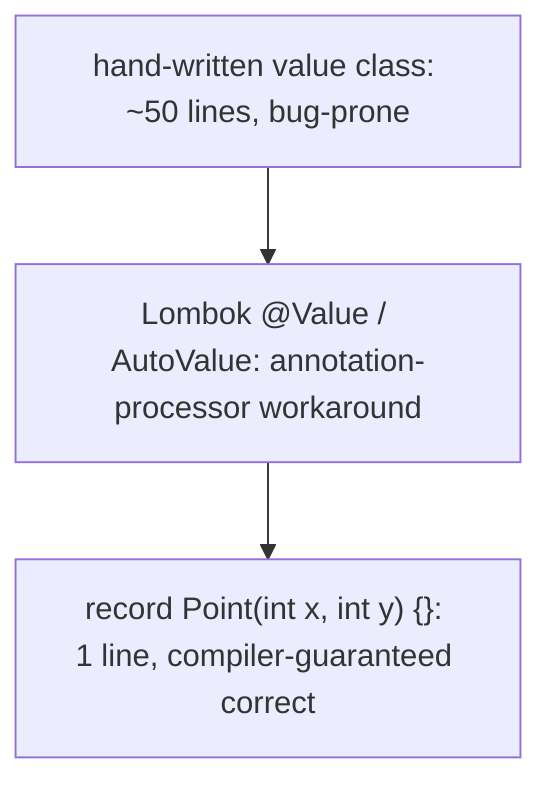
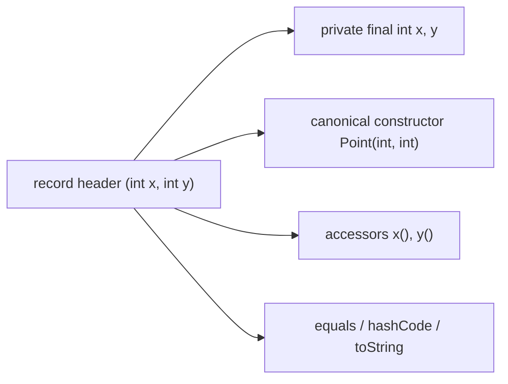
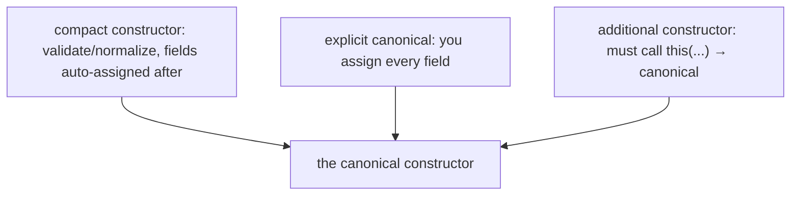
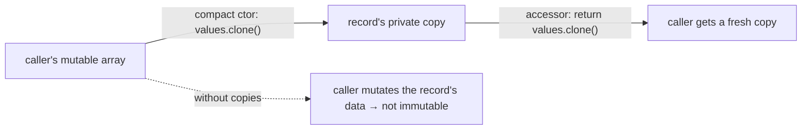
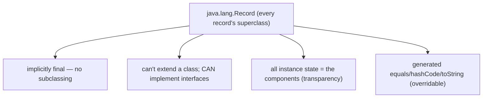
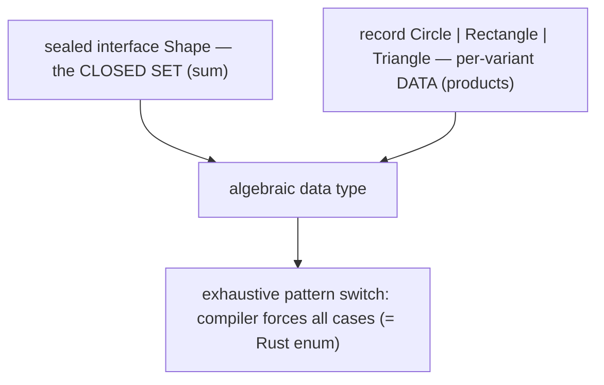
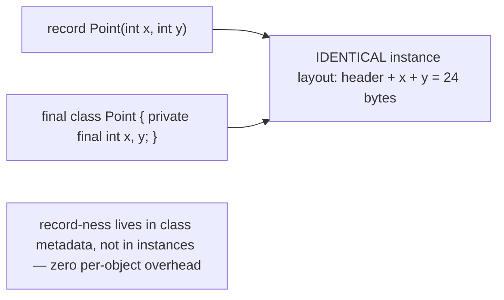
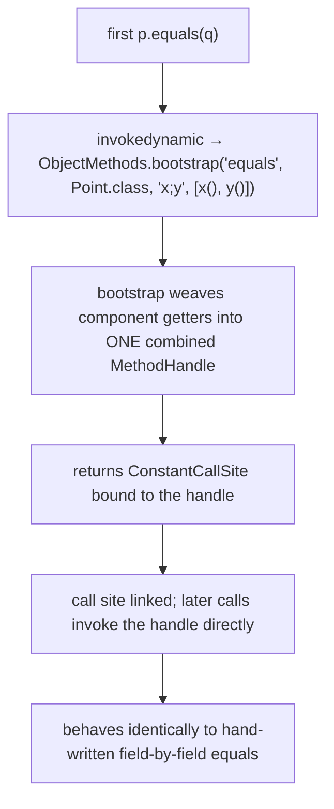
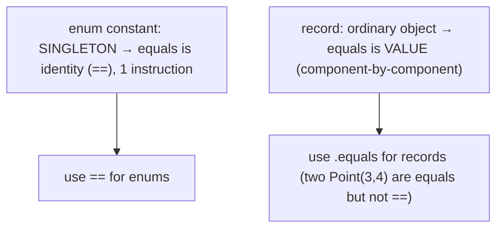

# record types

A **record** is a concise, immutable **data carrier** — a class whose entire purpose is to hold a fixed group of values and expose them. `record Point(int x, int y) {}` is a complete, correct, immutable class: the compiler generates a constructor, a private final field and a public accessor for each component, and contract-correct `equals`, `hashCode`, and `toString` ([T10](./T10-equals-hashcode-tostring-contracts.md)) — everything a hand-written value class needs, in one line instead of fifty. Records (final in Java 16, JEP 395) are the second "compiler-generates-everything" feature alongside enums ([T13](./T13-enum-types-with-fields-methods.md)): where an enum is a fixed set of *same-shaped singleton constants*, a record is a *transparent immutable tuple* with a name. Together with sealed types ([T15](./T15-sealed-classes-and-interfaces.md)), records give Java the algebraic-data-type modeling that Rust, Scala, and Kotlin have — and they're the target of Java 21's pattern-matching deconstruction.

The depth bar here is the **machinery behind the generated members** — and it's genuinely novel. A record's `equals`, `hashCode`, and `toString` are **not** emitted as hand-written field-by-field bytecode. Each compiles to a **single `invokedynamic` instruction** bootstrapped by **`java.lang.runtime.ObjectMethods.bootstrap`** ([T06](./T06-polymorphism-compile-time-vs-runtime.md) `invokedynamic` callback), which receives the record's component getters as `MethodHandle`s and, on first call, weaves them into one combined handle that does the field-by-field work — then caches it in a `ConstantCallSite` so every later call is direct. This is why a record's `equals` is three opcodes of bytecode yet behaves identically to a 10-line hand-written version, and why it JIT-inlines to the same machine code. A record's **instance layout in memory is identical to an equivalent `final` class** — header plus one field per component, reordered by size ([T01](./T01-classes-and-objects.md)) — with **zero extra overhead**; records are not boxed or specially represented at the instance level. The class file carries a **`Record` attribute** listing the components, which is how reflection (`getRecordComponents()`) and pattern-matching deconstruction know a record's state *is* its components. By the end you will read the `invokedynamic ObjectMethods` bootstrap in `javap -v`, explain why records have exactly zero memory overhead versus a hand-written class, defensively copy a mutable component correctly, and know when a record is the right tool versus when it isn't.

> [!NOTE]
> Prerequisites: [equals, hashCode, toString contracts](./T10-equals-hashcode-tostring-contracts.md) (`L1/C01/T10`) — the trio records generate for free, value vs identity equality, the array-component trap; [Classes & objects](./T01-classes-and-objects.md) (`L1/C01/T01`) — object header, field layout, byte sizes; [Fields, methods, constructors, this](./T02-fields-methods-constructors-this.md) (`L1/C01/T02`) — constructors, final fields, immutability; [enum types](./T13-enum-types-with-fields-methods.md) (`L1/C01/T13`) — the parallel compiler-generates-everything feature, extends-a-marker-class pattern; [Polymorphism](./T06-polymorphism-compile-time-vs-runtime.md) (`L1/C01/T06`) — `invokedynamic` and bootstrap/`CallSite` mechanics.

## Why Records Exist — The Data-Carrier Boilerplate Problem

A huge fraction of real classes are pure **data carriers**: a `Point`, a `Money`, an HTTP `Request`, a coordinate, a DTO returned from a service. Their job is to bundle a few values, let you read them, compare two for equality, and print them. Hand-written, a correct immutable two-field value class is **~50 lines**:

```java
public final class Point {
    private final int x;
    private final int y;
    public Point(int x, int y) { this.x = x; this.y = y; }
    public int x() { return x; }
    public int y() { return y; }
    @Override public boolean equals(Object o) {
        if (this == o) return true;
        if (!(o instanceof Point p)) return false;
        return x == p.x && y == p.y;
    }
    @Override public int hashCode() { return Objects.hash(x, y); }
    @Override public String toString() { return "Point[x=" + x + ", y=" + y + "]"; }
}
```

Every line is mechanical and every line is a place to introduce a bug — forget to update `equals` when you add a field, mismatch `hashCode` with `equals` ([T10](./T10-equals-hashcode-tostring-contracts.md)), typo the `toString`. The boilerplate is so painful that an entire ecosystem grew to generate it: **Lombok** (`@Value`, `@Data`) modifies bytecode at compile time; **Google AutoValue** (`@AutoValue`) generates a subclass; IDEs have "Generate equals/hashCode" wizards ([T10](./T10-equals-hashcode-tostring-contracts.md)). All of these are workarounds for a missing language feature.

Java 16 added the feature. The entire class above becomes:

```java
public record Point(int x, int y) { }
```

One line, behaviorally equivalent (and *better* — the generated members are guaranteed contract-correct). The `(int x, int y)` is the **record header**, listing the **components**. From it the compiler generates the fields, constructor, accessors, and the [T10](./T10-equals-hashcode-tostring-contracts.md) trio.



## Declaring a Record — What the Compiler Generates

From `record Point(int x, int y) {}` the compiler generates, automatically:

1. **A `private final` field per component** — `private final int x;` and `private final int y;`.
2. **A canonical constructor** — `Point(int x, int y)` that assigns each field.
3. **A public accessor per component** — `public int x()` and `public int y()` (note: `x()`, **not** `getX()`).
4. **`equals(Object)`** — value equality comparing all components ([T10](./T10-equals-hashcode-tostring-contracts.md)).
5. **`hashCode()`** — combining all components, consistent with `equals`.
6. **`toString()`** — `Point[x=1, y=2]` format.

```java
Point p = new Point(3, 4);
int xx = p.x();              // 3 — accessor is x(), not getX()
Point q = new Point(3, 4);
p.equals(q);                 // true — value equality, generated
p.hashCode() == q.hashCode();// true — consistent
System.out.println(p);       // Point[x=3, y=4]
```



The accessor naming — `x()` rather than `getX()` — is deliberate. Records break with the JavaBeans `getX`/`setX` convention because they're a *new* kind of type: a transparent carrier whose components *are* its API. (Some frameworks that expect JavaBeans getters need configuration to work with records; modern Jackson, Spring, etc. support records directly.)

## The Canonical Constructor and the Compact Form

The **canonical constructor** is the one whose parameters match the components. You usually don't write it — the compiler generates one that just assigns the fields. But you often want to **validate** or **normalize** the inputs, and records give you a concise way: the **compact constructor**.

```java
public record Range(int lo, int hi) {
    Range {                                       // compact: no parameter list
        if (lo > hi)
            throw new IllegalArgumentException("lo > hi");
        // no explicit field assignment — the compiler appends this.lo = lo; this.hi = hi;
    }
}
```

The compact constructor has **no parameter list** and **no field assignments** — you write only the validation/normalization logic, and the compiler appends `this.lo = lo; this.hi = hi;` after your code. You can even **reassign the parameters** to normalize, and the (modified) values get assigned to the fields:

```java
public record Name(String first, String last) {
    Name {
        first = first.strip();          // normalize — the stripped value is what gets stored
        last  = last.strip();
        if (first.isBlank()) throw new IllegalArgumentException("first blank");
    }
}
new Name("  Ada  ", "Lovelace").first();   // "Ada" — stripped
```

You can instead write the **full canonical constructor** explicitly (when you need to, e.g., for clarity), but then you must assign every field yourself:

```java
public record Range(int lo, int hi) {
    public Range(int lo, int hi) {              // explicit canonical — must assign all fields
        if (lo > hi) throw new IllegalArgumentException();
        this.lo = lo;
        this.hi = hi;
    }
}
```

**Additional (non-canonical) constructors** are allowed but must delegate to the canonical one via `this(...)` ([T02](./T02-fields-methods-constructors-this.md) constructor chaining):

```java
public record Range(int lo, int hi) {
    public Range(int single) { this(single, single); }   // delegates to canonical
}
```



## Records Are Shallowly Immutable — The Defensive-Copy Trap

A record's fields are `final`, so the *references* can't be reassigned. But `final` only freezes the reference, not the object it points to ([T02](./T02-fields-methods-constructors-this.md), [T10](./T10-equals-hashcode-tostring-contracts.md)). A record with a **mutable component** (an array, a `List`, a `Date`) is only **shallowly immutable** — callers can mutate the contained object behind the record's back:

```java
public record Data(int[] values) { }

int[] arr = {1, 2, 3};
Data d = new Data(arr);
arr[0] = 999;              // mutates the array the record holds!
d.values()[0] = -1;        // the accessor returns the SAME array — also mutable
System.out.println(d.values()[0]);   // -1 — the record's "immutable" data changed
```

To make the record genuinely immutable, **defensively copy** the mutable component on the way in (compact constructor) and on the way out (override the accessor):

```java
public record Data(int[] values) {
    public Data {                         // compact: copy on the way IN
        values = values.clone();
    }
    public int[] values() {               // override accessor: copy on the way OUT
        return values.clone();
    }
}
```

Now the record holds its own private copy, and the accessor hands out copies, so no caller can mutate the record's state. The same applies to `List` (`List.copyOf(...)`), `Date` (`new Date(d.getTime())`), and any mutable type. **This is the single most common record bug** — and it's the same trap as the array-component caveat from [T10](./T10-equals-hashcode-tostring-contracts.md): the generated `equals`/`hashCode` also use the array *reference* (via `Objects.equals`/`Arrays`-unaware), so a record with an array component has surprising equality too. Prefer immutable component types (`List` over `[]`, `Instant` over `Date`) so the issue never arises.



> [!WARNING]
> A record is only as immutable as its components. `record Data(int[] arr)` is *not* immutable — the array is mutable. Defensively copy in the compact constructor and the accessor, or (better) use an immutable component type like `List<Integer>` (and `List.copyOf` to snapshot it).

## Records extend `Record` — Implications

Every record implicitly extends **`java.lang.Record`** (you cannot write the `extends` clause), exactly as every enum extends `Enum` ([T13](./T13-enum-types-with-fields-methods.md)). `Record` is an abstract marker class that declares `equals`, `hashCode`, `toString` as abstract (forcing every record to have them — the compiler always does).

Consequences:

1. **A record cannot extend a class** — its single inheritance slot is used by `Record` ([T04](./T04-inheritance-and-super.md)). It **can implement interfaces**, which is how records participate in sealed hierarchies ([§ Records + Sealed](#records--sealed--algebraic-data-types)).
2. **A record is implicitly `final`** — it cannot be subclassed. This is essential for the equality contract ([T10](./T10-equals-hashcode-tostring-contracts.md) — the inheritance-transitivity trap can't occur) and for sound pattern-matching deconstruction.
3. **All instance state is the components.** A record cannot declare additional **instance** fields — every piece of per-instance state must be a component. (It *can* have `static` fields.) This is the **transparency** guarantee: a record's state is exactly, publicly, its components — which is what makes deconstruction sound.
4. **The generated `equals`/`hashCode`/`toString`** use all components and can be overridden if you really need custom behavior (rare; usually a sign you don't want a record).



## Additional Members

A record is a real class, so beyond the components it can have:

- **Static fields and methods** — constants, static factories (`Point.ORIGIN`, `Point.of(...)`).
- **Instance methods** — derived computations (`record Point(int x, int y) { double distanceTo(Point o) {...} }`).
- **Compact/canonical/additional constructors** (above).
- **Generics** — `record Pair<A, B>(A first, B second) {}`.
- **Nested records** — implicitly `static` (like other nested types in a record/interface).
- **Local records** (Java 16+) — declared inside a method, handy for grouping intermediate values in a stream pipeline:

```java
List<String> topSellers(List<Order> orders) {
    record Tally(String product, long count) {}   // local record, method-scoped
    return orders.stream()
        .collect(groupingBy(Order::product, counting()))
        .entrySet().stream()
        .map(e -> new Tally(e.getKey(), e.getValue()))
        .sorted(comparingLong(Tally::count).reversed())
        .map(Tally::product)
        .toList();
}
```

What a record **cannot** have: additional instance fields (all state is components), a no-arg canonical constructor (unless it has zero components), or a superclass other than `Record`.

## Records + Sealed = Algebraic Data Types

The combination that gives Java the modeling power of Rust/Scala/Kotlin enums ([T13](./T13-enum-types-with-fields-methods.md) callback): a **sealed interface** ([T15](./T15-sealed-classes-and-interfaces.md)) with **record** implementations is an **algebraic data type** (a "sum of products"):

```java
sealed interface Shape permits Circle, Rectangle, Triangle {}
record Circle(double radius)                  implements Shape {}
record Rectangle(double width, double height) implements Shape {}
record Triangle(double base, double height)   implements Shape {}
```

A `Shape` is **exactly one of** `Circle`, `Rectangle`, or `Triangle` (the `sealed` clause closes the set), and **each carries its own data** (the record components). This is precisely Rust's `enum Shape { Circle(f64), Rectangle(f64, f64) }` ([T13](./T13-enum-types-with-fields-methods.md)) — Java splits across two features (`sealed` for the closed set, `record` for the per-variant data) what Rust unifies in one `enum`. The payoff is exhaustive, type-safe pattern matching:

```java
double area(Shape s) {
    return switch (s) {                       // exhaustive — compiler checks all cases covered
        case Circle c    -> Math.PI * c.radius() * c.radius();
        case Rectangle r -> r.width() * r.height();
        case Triangle t  -> 0.5 * t.base() * t.height();
    };
}
```

Because `Shape` is sealed and the cases are records, the compiler *knows* the complete set and *forces* you to handle every one — add a `Pentagon` to the `permits` clause and every non-exhaustive switch fails to compile, pointing you at exactly the code that needs updating. This compile-time completeness is the same guarantee the abstract-enum-method pattern gives ([T13](./T13-enum-types-with-fields-methods.md)), generalized to variants with different shapes.



## Pattern Matching and Record Deconstruction

Java 21 adds **record patterns** — deconstructing a record into its components in `instanceof` and `switch`:

```java
// instanceof with deconstruction
if (obj instanceof Point(int x, int y)) {     // binds x and y directly
    System.out.println(x + y);
}

// switch with deconstruction
String describe(Shape s) {
    return switch (s) {
        case Circle(double r)            -> "circle r=" + r;
        case Rectangle(double w, double h) -> "rect " + w + "x" + h;
        case Triangle(double b, double h)  -> "triangle";
    };
}

// nested deconstruction
record Line(Point start, Point end) {}
if (obj instanceof Line(Point(var x1, var y1), Point(var x2, var y2))) {
    double len = Math.hypot(x2 - x1, y2 - y1);
}
```

The pattern `Point(int x, int y)` checks `obj` is a `Point` and binds `x = obj.x()`, `y = obj.y()` — it **calls the accessors** and binds the results. Deconstruction is *sound* precisely because records are transparent: the compiler knows `Point`'s state is exactly `(x, y)`, so the pattern is guaranteed to capture everything. A regular class can hide or transform its state, so it can't be deconstructed this way — which is *why* this feature is records-only. Nested patterns deconstruct recursively, making it natural to match against tree-shaped data (ASTs, JSON, geometry) — the bread and butter of functional languages, now in Java.

## When Records Don't Fit

Records are for **transparent, immutable data carriers**. They're the wrong tool when:

- **You need mutability.** A record's components are `final`. For a mutable bean (a builder's accumulating state, a JPA entity that the persistence layer mutates), use a regular class.
- **You need to extend a class.** Records extend `Record`; if you need another superclass, use a regular class (you can still implement interfaces).
- **The state isn't transparently the components.** If you want to hide internal representation, compute fields lazily, or expose an API that differs from the stored fields, a record's transparency works against you.
- **JPA/Hibernate entities.** Most ORMs require a no-arg constructor and mutable fields — records provide neither. (Some support records for immutable projections/DTOs, not entities.)
- **You need `setX`/JavaBeans semantics** for a framework that hard-requires them and can't be configured for records.

For everything else that's "a few values bundled together and read back" — DTOs, value objects, tuples, sealed-hierarchy variants, intermediate stream results — records are the right default.

## Memory Layer — A Record Is Just a Final Class

A record has **zero memory overhead** versus an equivalent hand-written `final` class. `record Point(int x, int y)` produces an instance with the *identical* byte layout to a hand-written `final class Point { private final int x, y; }`:

```
Point record instance (compressed oops):
  +0   header   12 bytes  (mark word 8 + klass ptr 4)
  +12  x         4 bytes
  +16  y         4 bytes
  total: 20 → 24 bytes (padded to 8-byte alignment)
```

There is **no** "record header flag," no boxing, no extra field, no tag — at the instance level a record is indistinguishable in memory from a normal object ([T01](./T01-classes-and-objects.md)). Components are laid out as `private final` fields, **reordered by descending size** like any class ([T01](./T01-classes-and-objects.md)): `record Mixed(boolean b, long c, int d)` stores `c` (8) before `d` (4) before `b` (1), regardless of header order. The "record-ness" lives entirely in the **class metadata** (the `Record` attribute and the generated methods), not in instances. So switching a value class to a record changes nothing about its heap footprint — you pay exactly what the data costs.



## Memory Layer — The `invokedynamic ObjectMethods` Bootstrap

Here is the deep, novel mechanism. The generated `equals`, `hashCode`, and `toString` are **not** compiled as hand-written field-by-field bytecode. Each is a tiny method containing a **single `invokedynamic` instruction**:

```
public final boolean equals(java.lang.Object);
  Code:
     0: aload_0
     1: aload_1
     2: invokedynamic #18, 0   // InvokeDynamic #0:equals:(LPoint;Ljava/lang/Object;)Z
     7: ireturn

public final int hashCode();
  Code:
     0: aload_0
     1: invokedynamic #22, 0   // InvokeDynamic #1:hashCode:(LPoint;)I
     6: ireturn

public final String toString();
  Code:
     0: aload_0
     1: invokedynamic #25, 0   // InvokeDynamic #2:toString:(LPoint;)Ljava/lang/String;
     6: areturn
```

Each `invokedynamic` names a **bootstrap method**: **`java.lang.runtime.ObjectMethods.bootstrap`**. Its static arguments (in the `BootstrapMethods` class-file attribute) are:

- the **record class** (`Point.class`),
- a **string of component names** (`"x;y"`),
- a **`MethodHandle` for each component accessor** (handles to `Point::x` and `Point::y`).

On the **first** execution of (say) `equals`, the JVM calls `ObjectMethods.bootstrap`, passing which operation is wanted (`"equals"`). The bootstrap **weaves the component getters into one combined `MethodHandle`** that performs the field-by-field comparison (for `equals`), the `31*h + ...` combination (for `hashCode`), or the `Point[x=.., y=..]` assembly (for `toString`). It returns a **`ConstantCallSite`** ([T06](./T06-polymorphism-compile-time-vs-runtime.md)) bound to that handle. The JVM links the call site to the handle; **every subsequent call skips the bootstrap** and invokes the cached handle directly.



Why this design rather than emitting the field comparisons directly into the method?

- **Compactness.** The record class file is tiny — three `invokedynamic` opcodes instead of dozens of `getfield`/compare/branch instructions per method. For a 10-component record, hand-emitted `equals` would be a long sequence; the indy is always one opcode.
- **Centralized correctness.** The actual comparison logic lives once, in the JDK's `ObjectMethods` runtime class, not duplicated into every record's bytecode. A bug fix or optimization in `ObjectMethods` improves every record without recompiling.
- **Flexibility.** The bootstrap can choose the optimal handle shape for the component types (e.g., using `Double.compare` for `double` components — the [T10](./T10-equals-hashcode-tostring-contracts.md) float trap, handled correctly and automatically).

This is the same `invokedynamic`-as-a-lazy-code-generator pattern that powers lambdas ([T06](./T06-polymorphism-compile-time-vs-runtime.md)) and string concatenation: defer the real work to a bootstrap that builds (and caches) a `MethodHandle` on first use.

## Memory Layer — The `Record` Attribute and Reflection

A record's class file carries a **`Record` attribute** listing each component (name, descriptor, generic signature, annotations). This attribute is how the JVM and reflection *know* a class is a record and what its components are:

```java
Point.class.isRecord();                 // true
RecordComponent[] comps = Point.class.getRecordComponents();
for (RecordComponent c : comps) {
    System.out.println(c.getName() + " : " + c.getType());   // x : int,  y : int
    Method accessor = c.getAccessor();                       // the x() / y() Method
}
```

`getRecordComponents()` returns the components **in declaration order** (unlike `getDeclaredFields()`, which has no ordering guarantee). Frameworks (Jackson, validation, mapping libraries) use this reflective view to serialize/deserialize records component-by-component, and the *compiler* uses the same component information to drive pattern-matching deconstruction. The `Record` attribute is the metadata that makes records *transparent* to tools.

## Architecture Layer — Generated Methods at JIT Time

Despite the `invokedynamic` indirection, records are **not slower** than hand-written value classes in steady state:

- **`equals`/`hashCode`/`toString`**: the `invokedynamic` bootstraps **once** into a `ConstantCallSite` ([T06](./T06-polymorphism-compile-time-vs-runtime.md)); after that, the call is to a fixed `MethodHandle`. The JIT inlines through the constant call site and the combined handle, producing the **same machine code** a hand-written field-by-field method would — a sequence of `getfield` + compare for `equals`, etc. The bootstrap cost is paid once, at first call; everything after is direct and inlinable.
- **Accessors**: `point.x()` is a trivial getter returning a field — the JIT inlines it to a **single field load** (`mov eax, [rdi+12]`, [T04](./T04-inheritance-and-super.md)/[T01](./T01-classes-and-objects.md)), identical to reading a public field. No method-call overhead in hot code.
- **Construction**: the canonical constructor is a few field stores; with escape analysis ([T01](./T01-classes-and-objects.md)/[T02](./T02-fields-methods-constructors-this.md)) a short-lived record can be scalar-replaced and never allocated.
- **Record deconstruction** in a pattern switch compiles to **accessor calls** (`obj.x()`, `obj.y()`), which inline to field loads — so `case Point(int x, int y)` is as cheap as reading two fields after the type check.

### Records Use Value Equality — Not Identity (Unlike Enums)

A crucial contrast with enums ([T13](./T13-enum-types-with-fields-methods.md)): an **enum** constant is a singleton, so enum `equals` is **identity** (`==`, one instruction). A **record** is an ordinary (non-singleton) object, so record `equals` is **value equality** — two distinct `Point(3,4)` objects are `equals` (their components match) but **not** `==` (different objects):

```java
Point a = new Point(3, 4), b = new Point(3, 4);
a == b;        // false — two distinct heap objects
a.equals(b);   // true  — value equality, component-by-component
```

This is the right semantics for a value type (you care about the *value*, not which object holds it) and the reason records are safe `HashMap` keys ([T10](./T10-equals-hashcode-tostring-contracts.md)) — their `equals`/`hashCode` are value-based and consistent. Use `equals` (not `==`) to compare records; use `==` only for enums and genuine identity checks.



## Cross-Language Perspective — Data Carriers Everywhere

Generated data carriers are a feature every modern language has, and the comparison shows what Java chose to include and omit:

| Language | Feature | Generates | Extra |
|----------|---------|-----------|-------|
| **Java** | `record` | constructor, accessors, equals/hashCode/toString | pattern deconstruction; **no** copy/with (yet) |
| **Kotlin** | `data class` | equals/hashCode/toString, `copy()`, `componentN()` | destructuring via `componentN` |
| **Scala** | `case class` | equals/hashCode/toString, `apply`/`unapply`, `copy` | pattern matching via `unapply` |
| **C#** | `record` | equals/hashCode/toString, `Deconstruct`, `with`-expressions | value equality, non-destructive mutation |
| **Rust** | `struct` + `#[derive(...)]` | opt-in: `PartialEq`, `Hash`, `Debug`, `Clone` | explicit, à la carte derivation |
| **Lombok (Java pre-16)** | `@Value` | the same, via bytecode weaving | the workaround records replaced |

Two observations:

**Java records are deliberately minimal.** Kotlin generates `copy()` (make a modified clone) and `componentN()` (positional destructuring); Scala and C# generate similar conveniences. Java records generate **neither** — no `copy`/`with` method (a "with-expression" feature is planned for a future Java), no `componentN` (destructuring is done by *pattern matching* instead, which is more general). The Java designers chose a smaller core, leaning on pattern matching for deconstruction rather than positional `componentN` accessors.

**Rust's à-la-carte derivation is the opposite philosophy.** Rust makes you *opt in* to each generated trait (`#[derive(PartialEq, Hash, Clone)]`) — nothing is automatic. Java records bundle equals/hashCode/toString as a fixed package (you get all three or you don't use a record). Rust's approach is more flexible (derive only what you need) at the cost of more annotation; Java's is simpler (one keyword, a standard package) at the cost of less control. Both are reactions to the same boilerplate problem; they sit at opposite ends of the explicit/implicit spectrum, with Lombok (Java's pre-record workaround) closest to Rust's opt-in model.

## Common Mistakes

> [!WARNING]
> **Expecting `getX()`.** Record accessors are named after the component — `point.x()`, not `point.getX()`. Frameworks that hard-require JavaBeans getters may need configuration; modern Jackson/Spring support records natively.

> [!WARNING]
> **Mutable component, not defensively copied.** `record Data(int[] arr)` is *not* immutable — callers can mutate the array. Copy in the compact constructor and override the accessor to copy out, or use an immutable component type (`List.copyOf`).

> [!WARNING]
> **Trying to add an instance field.** All instance state must be components — a record can't declare extra instance fields. (Static fields are fine.) If you need hidden per-instance state, you don't want a record.

> [!WARNING]
> **Trying to extend a class.** Records extend `Record`; they can't extend another class. Implement an interface instead (which is how records join sealed hierarchies).

> [!WARNING]
> **Overriding an accessor to return something different.** An accessor must return the corresponding component's value (the equals/hashCode/toString contract assumes it). Override it only to defensively copy, never to transform the value.

> [!WARNING]
> **Using a record where you need mutability.** A builder's accumulating state, a JPA entity, a mutable bean — these need a regular class. Records are immutable carriers.

> [!WARNING]
> **`==` instead of `.equals` on records.** Records use value equality (unlike singleton enums). `new Point(3,4) == new Point(3,4)` is `false`; use `.equals`.

> [!INTERVIEW]
> Common interview questions for this topic:
> 1. **What does a record generate?** A private final field per component, a canonical constructor, an accessor per component (`x()`, not `getX()`), and contract-correct `equals`/`hashCode`/`toString`.
> 2. **How are the generated `equals`/`hashCode`/`toString` implemented?** As a single `invokedynamic` each, bootstrapped by `ObjectMethods.bootstrap`, which weaves the component accessors into one cached `MethodHandle`. Not hand-emitted field comparisons.
> 3. **Do records have memory overhead vs a hand-written class?** No — identical instance layout (header + one field per component, reordered by size). The record-ness is in class metadata, not instances.
> 4. **What's a compact constructor?** A canonical constructor with no parameter list and no field assignments — you write only validation/normalization, and the compiler appends the field assignments (using your possibly-modified parameter values).
> 5. **Are records immutable?** Shallowly — fields are `final`, but a mutable component (array, `List`, `Date`) can be mutated through its reference. Defensively copy or use immutable component types.
> 6. **Why can't a record extend a class?** It implicitly extends `Record` (single inheritance used). It can implement interfaces.
> 7. **Why are records final?** To preserve the equality contract (no inheritance-transitivity trap) and to make pattern-matching deconstruction sound.
> 8. **What's the transparency guarantee?** A record's instance state is exactly its components, publicly — which is why the compiler can soundly deconstruct it in patterns.
> 9. **Record vs enum equality?** Records use value equality (`equals`, component-by-component); enums use identity (`==`, singletons).
> 10. **How do records + sealed interfaces relate?** Together they form algebraic data types — a sealed interface (closed set) with record implementations (per-variant data) = Rust-style sum types, with exhaustive pattern matching.
> 11. **What's the `Record` class-file attribute for?** It lists the components; `getRecordComponents()` reads it, and the compiler uses it for deconstruction. It's how a class is known to be a record.
> 12. **When shouldn't you use a record?** When you need mutability, class inheritance, hidden/transformed state, or JavaBeans semantics (e.g., JPA entities).
> 13. **What does Kotlin/Scala/C# generate that Java records don't?** `copy()`/`with` and positional `componentN` destructuring; Java relies on pattern matching for deconstruction and (so far) omits copy/with.
> 14. **Can a record have additional constructors?** Yes, but they must delegate to the canonical constructor via `this(...)`.

## Practice

1. **Declare and inspect.** Write `record Point(int x, int y) {}`. Run `javap -p Point`; identify the two `private final` fields, the canonical constructor, the `x()`/`y()` accessors, and `equals`/`hashCode`/`toString`. Confirm the accessor is `x()`, not `getX()`.

2. **Value equality.** Create two `Point(3,4)` objects. Compare with `==` (false) and `.equals` (true). Put one in a `HashMap` as a key and look up with the other; confirm it works (value-based hashCode/equals).

3. **Compact constructor validation.** Write `record Range(int lo, int hi)` with a compact constructor rejecting `lo > hi`. Confirm `new Range(5, 1)` throws. Confirm `new Range(1, 5)` works and the fields are assigned (you wrote no `this.lo = lo`).

4. **Compact constructor normalization.** Write `record Name(String first, String last)` whose compact constructor strips whitespace. Confirm `new Name("  Ada ", "Lovelace").first()` returns `"Ada"` — the parameter reassignment flows into the field.

5. **The mutable-component trap.** Write `record Data(int[] values) {}`. Construct one from an array, then mutate the original array and the accessor's return; confirm the record's "immutable" data changed. Fix with defensive copies in the compact constructor and accessor; confirm the record is now isolated.

6. **Instance-field restriction.** Try to add a `private int extra;` instance field to a record. Observe the compile error. Then add a `static int COUNT;` — confirm static fields are allowed.

7. **Can't extend a class.** Try `record Point(int x, int y) extends Object {}` or extending any class. Observe the compile error. Then implement an interface (`record Point(...) implements Comparable<Point>`) — confirm it works.

8. **The invokedynamic bootstrap.** Run `javap -v Point`. Find the `equals`/`hashCode`/`toString` methods — confirm each is a single `invokedynamic`. In the `BootstrapMethods` attribute, find `ObjectMethods.bootstrap` and its static args (the class, the `"x;y"` names, the accessor handles).

9. **Byte layout identical to a class.** Use JOL (`jol-cli internals`) to dump a `record Point(int x, int y)` and a hand-written `final class Point2 { private final int x, y; }`. Confirm identical 24-byte layouts. Then dump `record Mixed(boolean b, long c, int d)` and confirm size-reordering (c before d before b).

10. **Reflection.** Call `Point.class.isRecord()` (true) and `getRecordComponents()`; print each component's name, type, and accessor `Method`. Confirm they're in declaration order.

11. **Sealed + record ADT.** Define `sealed interface Shape permits Circle, Rectangle` with two record implementations. Write an `area(Shape)` switch. Add a `Triangle` to `permits` without updating the switch; observe the exhaustiveness compile error pointing at the switch.

12. **Record deconstruction.** Using Java 21+, write `if (obj instanceof Point(int x, int y))` and use `x`/`y` directly. Then a `switch` deconstructing `Circle(double r)` / `Rectangle(double w, double h)`. Then nested: deconstruct a `record Line(Point start, Point end)` into all four coordinates.

13. **Local record in a stream.** Write a method that uses a local `record Tally(String key, long count)` to carry intermediate values through a stream pipeline (group, count, sort, map). Confirm the local record is method-scoped (invisible outside).

14. **Float component correctness.** Write `record Measure(double value)`. Confirm `new Measure(Double.NaN).equals(new Measure(Double.NaN))` is `true` (the generated equals uses `Double.compare`, handling the [T10](./T10-equals-hashcode-tostring-contracts.md) NaN trap correctly — for free).

15. **End-to-end explain-it-back.** Trace `new Point(3,4).equals(new Point(3,4))`: (a) the record's `equals` is one `invokedynamic` → `ObjectMethods.bootstrap`; (b) first call: the bootstrap weaves the `x()`/`y()` accessor handles into one combined `MethodHandle` comparing both components, returns a `ConstantCallSite`; (c) the call site is linked; later calls invoke the handle directly; (d) the JIT inlines through it to `getfield x` + compare + `getfield y` + compare — same as hand-written; (e) why this is compact in bytecode yet fast at runtime; (f) why the two objects are `.equals` but not `==`. Twelve sentences max.

## Recap

You should now be able to:

**Language layer.**

- Declare a record and list what the compiler generates (fields, canonical constructor, accessors, `equals`/`hashCode`/`toString`).
- Use the compact constructor to validate and normalize, knowing the field assignments are appended automatically.
- Write explicit canonical and additional (delegating) constructors when needed.
- Recognize that records are shallowly immutable and defensively copy mutable components (or use immutable component types).
- Explain that a record extends `Record` (final, no class extension, interfaces OK) and that all instance state is the components (transparency).
- Add static members, instance methods, generics, nested and local records.
- Combine sealed interfaces with records to model algebraic data types and use exhaustive pattern matching.
- Deconstruct records in `instanceof` and `switch` (Java 21), including nested patterns.
- Decide when a record fits (immutable transparent carrier) and when it doesn't (mutability, inheritance, hidden state, JPA entities).

**Memory layer.**

- State that a record's instance layout is identical to an equivalent `final` class — header + one field per component, reordered by size, **zero overhead**.
- Explain that the generated `equals`/`hashCode`/`toString` are a single `invokedynamic` each, bootstrapped by `ObjectMethods.bootstrap`, which weaves the component accessors into one cached `MethodHandle` (`ConstantCallSite`).
- Explain why this design is compact (one opcode vs many) and centralizes correctness in the JDK runtime.
- Identify the `Record` class-file attribute and use `isRecord()`/`getRecordComponents()` reflection.

**Architecture layer.**

- Explain why records are not slower than hand-written classes: the bootstrap runs once, then the JIT inlines through the constant call site and the combined handle to the same machine code; accessors inline to single field loads.
- Contrast record equality (value-based, `equals`) with enum equality (identity, `==`) and explain why each is correct for its type.
- Explain that record deconstruction compiles to accessor calls (inlined to field loads).
- Compare Java records with Kotlin data classes, Scala case classes, C# records, Rust derive, and Lombok — and explain Java's deliberately minimal choice (pattern matching over `copy`/`componentN`).

Records and enums are Java's two "compiler-generates-everything" features: enums for fixed sets of same-shaped singleton constants, records for transparent immutable tuples. The next topic, [T15](./T15-sealed-classes-and-interfaces.md), completes the trio that powers modern Java data modeling — **sealed classes and interfaces**, the "closed set of permitted subtypes" feature that, combined with records, gives Java exhaustive, type-safe algebraic data types and pattern matching.

## Next

Continue to [Sealed classes & interfaces](./T15-sealed-classes-and-interfaces.md) — the `sealed`/`permits` feature that closes a type hierarchy to a known set of subtypes. We've used it informally here (sealed interface + records = ADT); T15 covers the full mechanism: the `permits` clause, the `final`/`sealed`/`non-sealed` rules for subtypes, the `PermittedSubclasses` class-file attribute, how the compiler uses it for exhaustiveness checking in pattern switches, and how sealed hierarchies model closed domains (states, commands, expression trees) with compile-time completeness guarantees.
