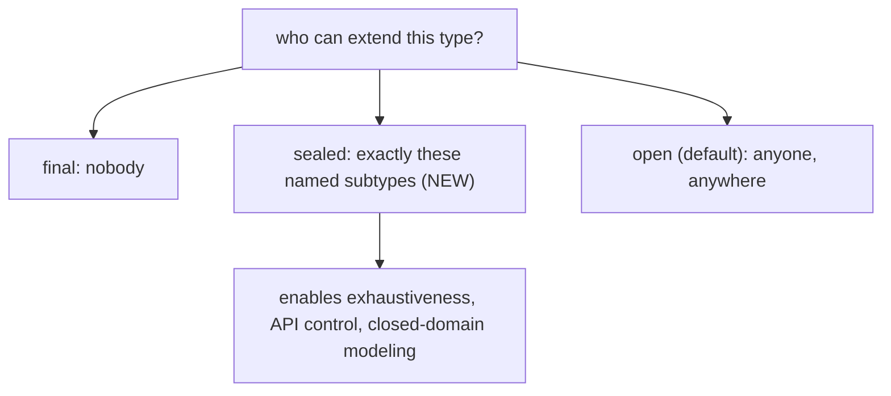
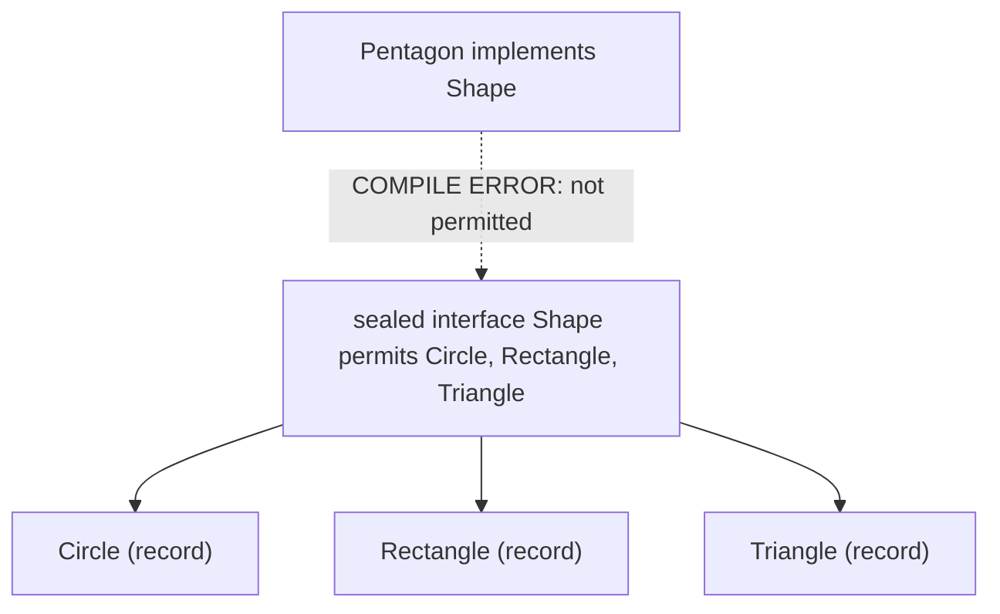
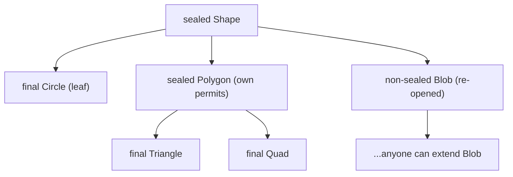
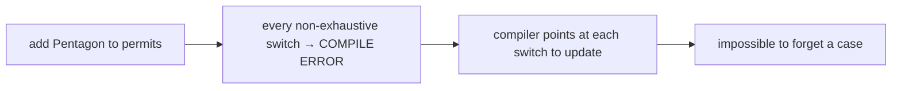
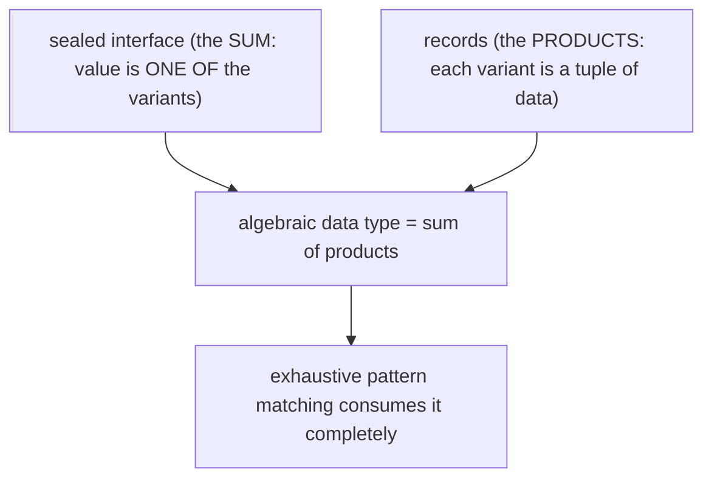
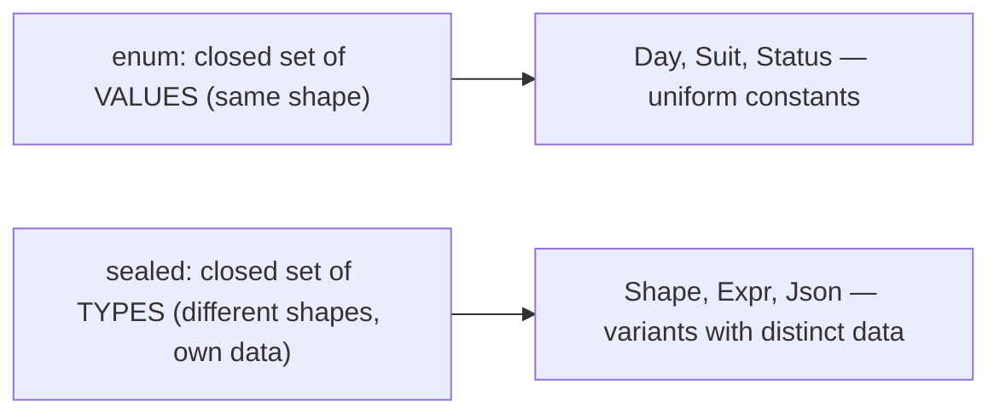
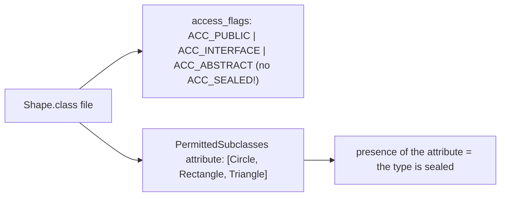
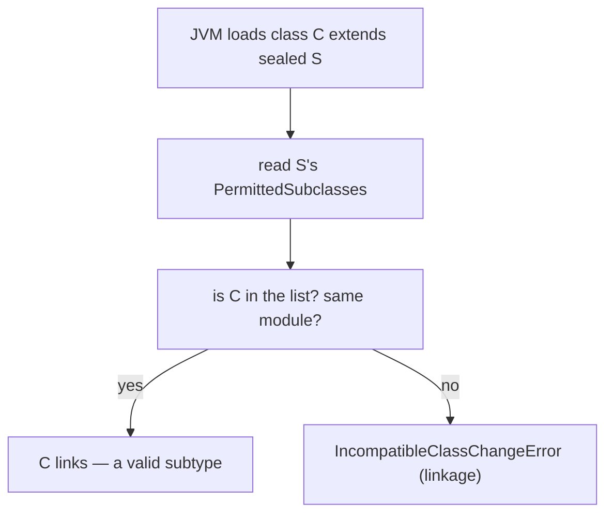
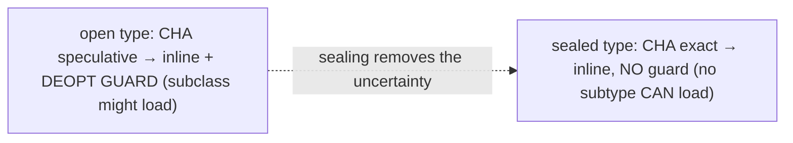
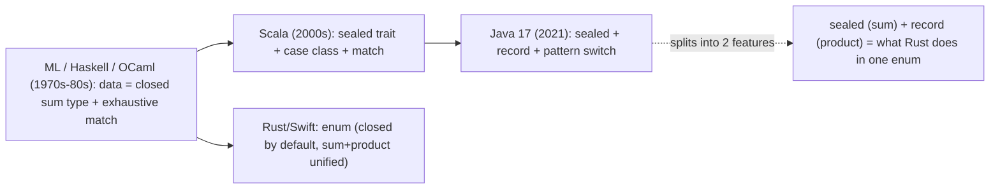

# Sealed classes & interfaces

A **sealed** type restricts *which other types* may extend or implement it to an **explicitly listed, known set**. `sealed interface Shape permits Circle, Rectangle, Triangle` says: a `Shape` is **exactly one of** `Circle`, `Rectangle`, or `Triangle` — no other type, anywhere, can implement `Shape`. This is the third and final piece of Java's modern data-modeling trio: **enums** ([T13](./T13-enum-types-with-fields-methods.md)) for a closed set of *same-shaped constant values*, **records** ([T14](./T14-record-types.md)) for *transparent immutable carriers*, and **sealed types** (Java 17, JEP 409) for a closed set of *different-shaped variant types*. Together — a sealed interface with record implementations — they give Java the **algebraic data types** and **exhaustive pattern matching** that functional languages have had for decades, with the compiler verifying you've handled every case.

The depth bar here is what "closed" *means* to the compiler, the verifier, and the JIT. Before sealed types, a Java type had only two extension states: `final` (no subtypes allowed) or open (any subtype, anywhere, including ones the author never imagined). Sealing adds the missing middle: *these specific subtypes and no others*. That closure is recorded in the class file as a **`PermittedSubclasses` attribute** (there is no `ACC_SEALED` flag — the attribute's presence *is* the sealing), and it is **enforced by the JVM verifier at class-load time**: a class that claims to extend a sealed type but isn't in its permits list fails to load with `IncompatibleClassChangeError`. The closure is also *information* the compiler exploits for **exhaustiveness checking** — a `switch` over a sealed type needs no `default` because the compiler knows the complete set of cases, and adding a permitted subtype turns every non-exhaustive switch into a compile error that points at exactly the code to update. The JIT can use the same closed-set knowledge for **exact Class Hierarchy Analysis**: when the set of implementors is provably finite and load-time-locked, devirtualization needs no speculative deopt guard. By the end you'll read the `PermittedSubclasses` attribute in `javap -v`, explain the `final`/`sealed`/`non-sealed` rule for every permitted subtype, model an AST or a state machine as a sealed hierarchy with compile-time-complete handling, and place Java's feature in the 50-year lineage of ML-family sum types.

> [!NOTE]
> Prerequisites: [Inheritance & super](./T04-inheritance-and-super.md) (`L1/C01/T04`) — `extends`, `final` classes, single inheritance, CHA; [Interfaces](./T08-interfaces-default-static-private-methods.md) (`L1/C01/T08`) — `implements`, multiple interface inheritance, class-file attributes; [enum types](./T13-enum-types-with-fields-methods.md) (`L1/C01/T13`) — closed set of values, the Rust-ADT comparison; [record types](./T14-record-types.md) (`L1/C01/T14`) — records as ADT variants, pattern deconstruction; [Polymorphism](./T06-polymorphism-compile-time-vs-runtime.md) (`L1/C01/T06`) — pattern-switch `invokedynamic`, dispatch.

## Why Sealed Exists — The Missing Third Option

Before Java 17, a type author had exactly **two** choices for who could extend a class or implement an interface:

1. **`final`** — *nobody* can extend it. Total lockdown. `String`, every record, every enum.
2. **Open** (no modifier) — *anyone, anywhere* can extend it, including code in other modules, other JARs, written years later by people you'll never meet.

There was no way to say the most common and useful thing: *"these specific subtypes, and no others."* You couldn't express "a `Shape` is a `Circle`, a `Rectangle`, or a `Triangle` — that's the complete list." The best you could do was a comment and a prayer, or a package-private constructor hack that broke for interfaces.

This gap had real costs:

- **No exhaustiveness.** A `switch` over a "shape" had to include a `default` case (or risk missing one) because the compiler couldn't know the set was complete. You could never get a compile error for "you forgot to handle `Triangle`."
- **No API control.** A library exposing an interface couldn't prevent users from implementing it in unexpected ways, so it couldn't safely evolve the interface (adding a method breaks all implementors — [T08](./T08-interfaces-default-static-private-methods.md)).
- **No closed-domain modeling.** Domains that are *genuinely* closed — the states of a traffic light, the node types of a syntax tree, the messages of a protocol — couldn't be modeled as such.

`sealed` fills the gap. It is the **third option**: a type that permits a *specific, named* set of direct subtypes and no others.



## Declaring a Sealed Type and `permits`

A sealed type lists its permitted direct subtypes with a `permits` clause:

```java
public sealed interface Shape
        permits Circle, Rectangle, Triangle {
    double area();
}

public record Circle(double radius)               implements Shape {
    public double area() { return Math.PI * radius * radius; }
}
public record Rectangle(double width, double height) implements Shape {
    public double area() { return width * height; }
}
public record Triangle(double base, double height)   implements Shape {
    public double area() { return 0.5 * base * height; }
}
```

`Shape` can be implemented by `Circle`, `Rectangle`, and `Triangle` — and by **nothing else**. A fourth type `class Pentagon implements Shape {}` declared anywhere is a **compile error**: `Pentagon` is not in `Shape`'s permits list. The set is closed.



## The Three Rules for Permitted Subtypes

Every direct subtype of a sealed type must itself declare *how it continues the hierarchy* — it must be exactly one of **`final`**, **`sealed`**, or **`non-sealed`**:

```java
public sealed interface Shape permits Circle, Polygon, Blob {}

public final class Circle implements Shape {}        // final: leaf, no further extension

public sealed interface Polygon extends Shape        // sealed: continues the closed hierarchy
        permits Triangle, Quad {}
public final class Triangle implements Polygon {}
public final class Quad implements Polygon {}

public non-sealed interface Blob extends Shape {}    // non-sealed: re-opens — anyone can implement Blob
```

The three modifiers, and what each means:

| Modifier | Meaning |
|----------|---------|
| **`final`** | This subtype is a leaf — nothing can extend it further. (Records and enums are implicitly `final`, so they satisfy this automatically.) |
| **`sealed`** | This subtype continues the closed hierarchy with *its own* `permits` clause — the closure propagates down. |
| **`non-sealed`** | This subtype **re-opens** the hierarchy — anyone, anywhere can now extend *this* subtype. It is the deliberate escape hatch that breaks the closed-set guarantee for that branch. |



The rule exists because sealing is only meaningful if it **propagates**. If a permitted subtype could be silently open, the "closed set" guarantee would leak — someone could extend the subtype and indirectly become a `Shape`. Forcing each subtype to declare `final` (stop), `sealed` (continue closed), or `non-sealed` (explicitly open) makes the closure *complete and visible*. `non-sealed` is the one intentional crack: it says "I want this branch extensible," and you accept that exhaustiveness no longer holds below it.

> [!WARNING]
> Every direct subtype of a sealed type **must** be `final`, `sealed`, or `non-sealed` — forgetting the modifier is a compile error. Records and enums are implicitly `final`, so a record/enum permitted subtype needs nothing extra; a plain class or interface must choose explicitly.

## Locality Rules and `permits` Omission

Two constraints keep the author of a sealed type in control of its subtypes:

1. **Same module (or same package if on the classpath).** Permitted subtypes must be in the **same module** as the sealed type. If the sealed type is in the unnamed module (plain classpath, no `module-info`), the permitted subtypes must be in the **same package**. You cannot permit a subtype from a module/package you don't control — sealing is *your* closed set, not something others can join.
2. **Direct subtypes only.** The `permits` clause lists *direct* subtypes; the hierarchy continues via each subtype's own `sealed`/`permits`.

If all the permitted subtypes are declared in the **same source file** as the sealed type, you may **omit the `permits` clause** — the compiler infers it:

```java
// Shape.java — all in one file, permits inferred
public sealed interface Shape {            // no permits clause needed
    record Circle(double r)    implements Shape {}
    record Rectangle(double w, double h) implements Shape {}
    record Triangle(double b, double h)  implements Shape {}
}
```

This is the idiomatic, compact form for a small closed hierarchy: the sealed interface and its record variants in one file, `permits` inferred. (Nested records inside an interface are implicitly `static` and `final`, [T14](./T14-record-types.md), so they need no modifier.)

## Sealed Classes vs Sealed Interfaces

Both classes and interfaces can be sealed:

- **Sealed interface** — restricts which classes may *implement* it and which interfaces may *extend* it. The most common form (interfaces are the natural ADT root; a value can be any one variant).
- **Sealed class** — restricts which classes may *extend* it. Can be `abstract` (a pure base) or concrete. Used when the variants share state or a partial implementation ([T07](./T07-abstraction-and-abstract-classes.md) abstract classes).

```java
public sealed abstract class Expr permits Num, BinOp {
    abstract int eval();
}
public final class Num extends Expr {
    final int value;
    Num(int value) { this.value = value; }
    int eval() { return value; }
}
public sealed abstract class BinOp extends Expr permits Add, Mul {
    final Expr left, right;
    BinOp(Expr left, Expr right) { this.left = left; this.right = right; }
}
public final class Add extends BinOp {
    Add(Expr l, Expr r) { super(l, r); }
    int eval() { return left.eval() + right.eval(); }
}
public final class Mul extends BinOp {
    Mul(Expr l, Expr r) { super(l, r); }
    int eval() { return left.eval() * right.eval(); }
}
```

Sealing is **orthogonal to access modifiers** ([T03](./T03-encapsulation-and-access-modifiers.md)): a `public sealed interface` is *visible* to everyone but *extendable* only by its permits list. Access controls who can *see/use* the type; sealing controls who can *extend* it. They're independent dimensions.

## Exhaustive Pattern Matching — The Payoff

The single biggest reason sealed types exist: they make **pattern matching exhaustive**. Because the compiler knows the *complete* set of subtypes, a `switch` over a sealed type needs **no `default`** — the compiler verifies every permitted subtype is handled:

```java
double area(Shape s) {
    return switch (s) {                       // NO default needed — exhaustive
        case Circle c    -> Math.PI * c.radius() * c.radius();
        case Rectangle r -> r.width() * r.height();
        case Triangle t  -> 0.5 * t.base() * t.height();
    };
}
```

The payoff appears when the hierarchy *changes*. Add a `Pentagon` to `Shape`'s permits list, and **every non-exhaustive switch across the entire codebase fails to compile**, each error pointing at exactly the switch that now misses a case. The compiler becomes your refactoring checklist: it's *impossible* to add a variant and forget to handle it somewhere. This is the same compile-time-completeness guarantee the abstract-enum-method pattern gives ([T13](./T13-enum-types-with-fields-methods.md)), generalized to variants of different shapes — and it's the property that makes large closed-domain refactors safe.



> [!NOTE]
> For separate-compilation safety, the compiler inserts a hidden synthetic `default` in exhaustive sealed switches that throws `MatchException` if — at runtime — the value is somehow a subtype the switch didn't know about (e.g., the sealed hierarchy was recompiled with a new variant after the switch was compiled). At *compile* time you still get the exhaustiveness error; the synthetic default only guards the recompiled-separately edge case.

## Sealed + Records = Algebraic Data Types

A sealed interface whose variants are records is an **algebraic data type** (ADT) — a "**sum of products**." The sealed interface is the **sum** (a value is one of N variants); each record is a **product** (a variant is a tuple of its components). This is precisely the data model functional languages are built around, and precisely Rust's `enum` ([T13](./T13-enum-types-with-fields-methods.md)):

```java
// Java: sealed (sum) + records (products)
sealed interface Json {}
record JNull()                       implements Json {}
record JBool(boolean value)          implements Json {}
record JNumber(double value)         implements Json {}
record JString(String value)         implements Json {}
record JArray(List<Json> items)      implements Json {}
record JObject(Map<String, Json> fields) implements Json {}
```

```rust
// Rust: one enum unifies sum + products
enum Json {
    Null,
    Bool(bool),
    Number(f64),
    String(String),
    Array(Vec<Json>),
    Object(HashMap<String, Json>),
}
```

Java **splits across two features** (`sealed` for the sum, `record` for each product) what Rust unifies in one `enum`. The result is the same: a closed set of variants, each carrying its own typed data, consumed by exhaustive pattern matching. Processing such a tree is clean and complete:

```java
String render(Json j) {
    return switch (j) {
        case JNull()           -> "null";
        case JBool(var b)      -> String.valueOf(b);
        case JNumber(var n)    -> String.valueOf(n);
        case JString(var s)    -> "\"" + s + "\"";
        case JArray(var items) -> items.stream().map(this::render).collect(joining(",", "[", "]"));
        case JObject(var f)    -> f.entrySet().stream()
                                   .map(e -> "\"" + e.getKey() + "\":" + render(e.getValue()))
                                   .collect(joining(",", "{", "}"));
    };   // exhaustive — the compiler guarantees every JSON variant is handled
}
```

The record deconstruction patterns (`JBool(var b)`, [T14](./T14-record-types.md)) bind the variant's data; the sealed interface guarantees the switch is complete. **This combination — sealed + records + pattern matching — is the headline of modern Java's data modeling**, and the reason the three features (T13, T14, T15) were designed together.



## Sealed vs Enum — Closed Set of Types vs Values

Enums and sealed types both model *closed sets*, but at different levels — a distinction worth internalizing ([T13](./T13-enum-types-with-fields-methods.md) callback):

| | **enum** | **sealed type** |
|--|----------|------------------|
| Closes a set of… | **values** (constant instances) | **types** (subtype variants) |
| Variants are… | the **same** type/shape | **different** types, each with its own data/behavior |
| Each variant holds… | the same fields (if any) | its own distinct components |
| Example | `enum Day { MON, TUE, ... }` (7 same-shaped constants) | `sealed Shape permits Circle, Rectangle` (variants with different fields) |
| Exhaustive switch | yes (over constants) | yes (over subtypes) |

**Rule of thumb:** if your variants are *uniform constants* (days of the week, suits, statuses with no per-variant data), use an **enum**. If your variants have *different shapes* (a circle has a radius, a rectangle has width+height), use a **sealed interface + records**. An enum is a closed set of *values*; a sealed type is a closed set of *types*.



## Modeling Closed Domains

Sealed hierarchies shine wherever a domain is *genuinely* a fixed set of alternatives:

- **Expression trees / ASTs** — `sealed interface Expr permits Num, Add, Mul, Neg`. The complete grammar is the permits list; an interpreter/compiler `switch`es over it exhaustively.
- **State machines** — `sealed interface State permits Idle, Connecting, Connected, Failed`. Transitions are total functions over a known set of states.
- **Protocol messages / commands** — `sealed interface Command permits Start, Stop, Pause, Seek`. A dispatcher handles each, with the compiler ensuring none is missed.
- **Result/Either types** — `sealed interface Result<T> permits Success, Failure`, where `Success` carries the value and `Failure` carries the error — a typed alternative to exceptions for expected failures.

```java
sealed interface Result<T> permits Success, Failure {}
record Success<T>(T value)         implements Result<T> {}
record Failure<T>(String error)    implements Result<T> {}

<T> T orElseThrow(Result<T> r) {
    return switch (r) {
        case Success<T>(var value) -> value;
        case Failure<T>(var error) -> throw new RuntimeException(error);
    };
}
```

In each case the **sealed hierarchy makes the domain's closedness a checked property of the program** — the set of states/commands/results is finite, named, and exhaustively handled, with the compiler enforcing completeness.

## Memory Layer — The `PermittedSubclasses` Attribute

Sealing is recorded in the class file as a **`PermittedSubclasses` attribute** (JEP 409). There is **no `ACC_SEALED` access flag** — unlike `final` (`ACC_FINAL`, [T03](./T03-encapsulation-and-access-modifiers.md)) or `interface` (`ACC_INTERFACE`, [T08](./T08-interfaces-default-static-private-methods.md)), sealing isn't a flag bit; the *presence* of a non-empty `PermittedSubclasses` attribute *is* what makes a class sealed. The attribute is a list of constant-pool class references — the permitted direct subtypes:

```
$ javap -v Shape
public abstract interface Shape
  flags: (0x0601) ACC_PUBLIC, ACC_INTERFACE, ACC_ABSTRACT
  ...
  PermittedSubclasses:
    Circle
    Rectangle
    Triangle
```

The attribute lives in the class file's attributes section (alongside `Record`, `NestMembers`, `BootstrapMethods` — [T12](./T12-inner-local-and-anonymous-classes.md)/[T14](./T14-record-types.md)). It costs a few bytes per permitted subtype in the sealed type's metadata (a `u2` constant-pool index each, plus the attribute header) — trivial, and entirely in **class metadata, not instances**. Sealing has **zero instance-level memory cost**: a `Circle` object is exactly the bytes of its components ([T14](./T14-record-types.md)), with no sealing tag. The closure is purely a property of the *types*, recorded once in the sealed type's class file.



## Memory Layer — Load-Time Verifier Enforcement

The closed set is not just a compile-time check — it's **enforced by the JVM verifier at class-load time** ([T03 deeper section](./T03-encapsulation-and-access-modifiers.md#deeper-jvm-internals--nest-based-access-binary-compatibility-and-the-access-check-pipeline) link-time enforcement, [T07](./T07-abstraction-and-abstract-classes.md) `new`-on-abstract verification). When the JVM loads a class `C` that declares it `extends`/`implements` a sealed type `S`, the verifier:

1. Loads `S` and reads its `PermittedSubclasses` attribute.
2. Checks that `C` is in the list.
3. Checks that `C` and `S` are in the same module (or package, for the unnamed module).
4. If either check fails, **rejects the class with `IncompatibleClassChangeError`** — a `LinkageError` thrown at load time, before any instance can be created.



This load-time check is why sealing can't be defeated by bytecode manipulation or a hand-crafted class: even if you forge a `.class` file claiming `implements Shape`, the verifier rejects it at load time because it isn't in `Shape`'s permits list. The guarantee is enforced by the JVM, not merely the compiler — the same dual compile-time-plus-load-time enforcement model as access modifiers ([T03](./T03-encapsulation-and-access-modifiers.md)) and abstract instantiation ([T07](./T07-abstraction-and-abstract-classes.md)). Cost: one verification per subtype class load (a list lookup, ~microseconds), paid once; zero per-instance, zero per-call.

## Memory Layer — Reflection

Sealing is reflectively visible:

```java
Shape.class.isSealed();                  // true
Class<?>[] permitted = Shape.class.getPermittedSubclasses();
// [Circle.class, Rectangle.class, Triangle.class]
```

`isSealed()` returns `true` iff the class has a `PermittedSubclasses` attribute. `getPermittedSubclasses()` returns the permitted direct subtypes (an empty array for non-sealed types). Frameworks use this to discover the complete variant set — e.g., a serialization library can enumerate all subtypes of a sealed type to register them, or a documentation tool can render the closed hierarchy. The reflective view mirrors the `PermittedSubclasses` attribute exactly.

## Architecture Layer — Exact CHA and Bounded Devirtualization

Sealing gives the JIT something it normally has to *speculate* about: the **complete, finite, load-time-locked set of implementors** of a type. Recall Class Hierarchy Analysis ([T05](./T05-method-overriding.md)): to inline a virtual call, the JIT checks whether any subclass overrides the method, and if it inlines under a "no override loaded yet" assumption, it must install a **deoptimization guard** in case a new overriding subclass loads later ([T05 deeper section](./T05-method-overriding.md#deeper-jvm-internals--method-struct-compiledic-and-deoptimization)).

A sealed type changes the calculus: its set of subtypes **cannot grow** — the verifier forbids any non-permitted subtype from loading. So for a sealed type:

- **CHA is exact, not speculative.** The JIT knows *all* possible implementors at compile time. There is no "what if a new subclass loads" — none can.
- **Devirtualization can skip the deopt guard.** A sealed type with **one** permitted (final) implementor is provably monomorphic — the call inlines unconditionally, no guard needed. With **two or three**, the JIT can emit a bounded type-check chain (like a polymorphic inline cache, [T05](./T05-method-overriding.md)) with **no fallback megamorphic path**, because there *is* no other possible type.
- **Pattern switches compile to dense dispatch.** A `switch` over a sealed type has a known, dense set of cases, so the `invokedynamic SwitchBootstraps.typeSwitch` ([T06 deeper section](./T06-polymorphism-compile-time-vs-runtime.md#deeper-jvm-internals--invokedynamic-lambdametafactory-and-pattern-switch-bootstrap)) can build a perfect-hash or direct branch table over the closed set, rather than a fallback chain.



> [!NOTE]
> **Honesty about realization:** the *information* sealing provides (a closed, load-time-enforced implementor set) is exactly what a JIT needs for guard-free devirtualization, and HotSpot's CHA already exploits "effectively final" hierarchies. How aggressively today's JIT specializes *specifically because of* the `sealed` keyword varies by JVM version and is an area of ongoing optimization (and a building block for Project Valhalla's specialization). The compile-time exhaustiveness and load-time enforcement are fully realized today; treat the JIT benefit as "sealing provides the guarantee the optimizer wants," with the degree of exploitation improving over time.

## Cross-Language Perspective — Closed Sum Types

Sealed types bring a 50-year-old idea from the **ML family** of languages into Java. The lineage:

| Language | Closed sum type | Notes |
|----------|-----------------|-------|
| **Hope / ML / OCaml / Haskell / F#** (1970s–) | `data`/`type` algebraic data types | the origin — `data Shape = Circle Double \| Rect Double Double`, exhaustive `match` |
| **Scala** | `sealed trait`/`sealed abstract class` | the **direct inspiration** for Java's feature; sealed + case classes + match for ~20 years |
| **Kotlin** | `sealed class`/`sealed interface` | same idea; subtypes in the same module/package |
| **Rust** | `enum` (closed **by default**) | variants ARE the closed set — no keyword needed; unifies sum + product |
| **Swift** | `enum` with associated values | closed by default, like Rust |
| **Java** | `sealed` + `permits` + records | sum (sealed) + products (records), explicit permits |

Two observations:

**Scala is the direct ancestor.** Java's `sealed` is consciously modeled on Scala's `sealed trait` (Scala has had it since the early 2000s). The combination Scala pioneered on the JVM — `sealed trait` + `case class` + `match` — is exactly Java's `sealed interface` + `record` + pattern `switch`. Java spent two decades catching up to a feature its own platform-mate had all along; the design even shares the same exhaustiveness semantics.

**The ML family had it first, and unified.** Functional languages have built around closed sum types since the 1970s — `data Tree = Leaf | Node Tree Int Tree` is the canonical first example in any Haskell tutorial, and exhaustive pattern matching is the natural way to consume it. Rust and Swift inherited this directly, making `enum` *closed by default* and *able to carry data* — one feature for what Java splits into `sealed` + `record`. Java's split is partly historical (it already had `enum` meaning "closed set of constants" and `record` arriving separately) and partly deliberate (records and sealing are independently useful). The end state, though, is that **Java in 2021 finally has the typed-functional data modeling that ML had in 1980 and Scala had in 2004** — closed sums, transparent products, and a compiler that checks you handled every case.



## Common Mistakes

> [!WARNING]
> **Forgetting the `final`/`sealed`/`non-sealed` modifier on a permitted subtype.** Every direct subtype of a sealed type must declare one. A plain `class Circle implements Shape {}` (no modifier) is a compile error. Records and enums are implicitly `final`, so they're fine as-is.

> [!WARNING]
> **`non-sealed` silently defeats exhaustiveness.** A `non-sealed` branch re-opens the hierarchy — anyone can extend it, so the set below it is no longer closed, and a switch over the sealed type now needs a `default` (the compiler can't prove completeness). Use `non-sealed` only when you genuinely want extensibility, and know you're trading away the exhaustiveness guarantee.

> [!WARNING]
> **Permitted subtype in a different module/package.** Permitted subtypes must be in the same module (or same package on the classpath). You can't permit a type you don't control. Keep the sealed type and its variants together.

> [!WARNING]
> **Using sealed where an enum or a plain interface fits better.** If the variants are uniform constants, use an `enum`. If you don't need a closed set (any implementation is fine), use a plain interface. Reach for `sealed` when you specifically want a *closed set of differently-shaped types*.

> [!WARNING]
> **Expecting only compile-time enforcement.** Sealing is enforced at *both* compile time (the `permits` check, exhaustiveness) and *load time* (the verifier's `PermittedSubclasses` check → `IncompatibleClassChangeError`). A forged class can't sneak into a sealed hierarchy at runtime.

> [!WARNING]
> **Adding a `default` to a sealed switch out of habit.** An exhaustive switch over a sealed type needs no `default` — and *omitting* it is better, because then adding a variant later produces a helpful compile error. Adding a `default` silently swallows new variants, throwing away the exhaustiveness benefit.

> [!INTERVIEW]
> Common interview questions for this topic:
> 1. **What problem do sealed types solve?** They add the missing "third option" between `final` (no subtypes) and open (any subtype): a *specific named set* of permitted subtypes, enabling exhaustiveness, API control, and closed-domain modeling.
> 2. **What are the three rules for a permitted subtype?** It must be `final` (leaf), `sealed` (continues closed with its own permits), or `non-sealed` (re-opens for unrestricted extension). Records/enums are implicitly `final`.
> 3. **How is sealing recorded in the class file?** As a `PermittedSubclasses` attribute listing the permitted direct subtypes. There is no `ACC_SEALED` flag — the attribute's presence is the sealing.
> 4. **How is sealing enforced at runtime?** The verifier checks at class-load time that a class claiming to extend a sealed type is in its permits list (and same module); otherwise `IncompatibleClassChangeError`.
> 5. **Why does a sealed switch need no `default`?** The compiler knows the complete set of subtypes, so it can verify every case is handled — exhaustiveness. Adding a variant turns non-exhaustive switches into compile errors.
> 6. **Sealed vs enum?** Enum closes a set of *values* (same-shaped constants); sealed closes a set of *types* (variants with different data/behavior). Enum for uniform constants, sealed+records for differently-shaped variants.
> 7. **What's an algebraic data type in Java?** A sealed interface (the sum: one of N variants) with record implementations (the products: each variant's data) — Java's equivalent of a Rust `enum`, consumed by exhaustive pattern matching.
> 8. **What's `non-sealed` for?** The escape hatch — it re-opens a branch of a sealed hierarchy for unrestricted extension, deliberately trading away exhaustiveness for that branch.
> 9. **Locality rules?** Permitted subtypes must be in the same module (same package on the classpath) and directly extend/implement the sealed type. `permits` can be omitted if all subtypes are in the same source file.
> 10. **How does sealing help the JIT?** It makes Class Hierarchy Analysis exact (the implementor set can't grow), so devirtualization can skip the deopt guard a normal open type would need.
> 11. **Can a sealed class be abstract? Concrete?** Both. A sealed *interface* restricts implementors/extenders; a sealed *class* (abstract or concrete) restricts subclasses.
> 12. **Memory cost of sealing?** A few bytes of class metadata (the `PermittedSubclasses` attribute); zero per-instance cost — instances are normal objects.
> 13. **Where did Java's sealed types come from?** The ML family (Haskell/OCaml/ML algebraic data types) via Scala's `sealed trait` — the direct inspiration. Java's sealed + record + pattern-switch mirrors Scala's sealed + case class + match.
> 14. **Can reflection see sealing?** Yes — `Class.isSealed()` and `getPermittedSubclasses()`.

## Practice

1. **Sealed interface + records + exhaustive switch.** Define `sealed interface Shape permits Circle, Rectangle, Triangle` with three record implementations, each computing `area()`. Write an `area(Shape)` switch with no `default`; confirm it compiles. Remove a case; confirm the exhaustiveness compile error.

2. **The payoff.** Add a `Pentagon` to the permits list (and a record). Observe that your existing `area` switch now fails to compile, pointing at the missing case. Add the case; it compiles. Reflect on how this makes refactors safe.

3. **The three subtype rules.** Declare a sealed interface with three permitted subtypes: one `final` class, one `sealed` interface (with its own permits), one `non-sealed` interface. Confirm all compile. Then remove a modifier from one subtype; observe the compile error demanding `final`/`sealed`/`non-sealed`.

4. **`non-sealed` defeats exhaustiveness.** Make one branch `non-sealed`. Try a no-`default` switch over the sealed root; observe the compiler now *requires* a `default` (it can't prove completeness through the re-opened branch). Discuss the trade-off.

5. **`permits` omission.** Put a sealed interface and its record variants in one source file with no `permits` clause. Confirm it compiles (the compiler infers permits). Move one variant to another file; observe you now must add an explicit `permits` clause.

6. **Module/package locality.** On the classpath, declare a sealed interface in package `a` and try to permit a subtype in package `b`. Observe the compile error. Move it to package `a`; it compiles.

7. **`PermittedSubclasses` attribute.** Run `javap -v` on a sealed type. Find the `PermittedSubclasses` attribute and confirm it lists the permitted subtypes. Confirm there's no `ACC_SEALED` flag in the access flags.

8. **Load-time enforcement.** Compile `Shape` (sealed) and `Circle` (permitted). Then hand-craft or use ASM to produce a `Rogue` class claiming `implements Shape` but *not* in the permits list. Try to load it; observe `IncompatibleClassChangeError` at load time (not just compile time).

9. **Reflection.** Call `isSealed()` (true) and `getPermittedSubclasses()` on a sealed type; print the permitted subtypes. Call them on a non-sealed type; confirm `false` and an empty array.

10. **Sealed class with shared state.** Model an expression tree as a sealed *abstract class* `Expr permits Num, Add, Mul` where `BinOp` subtypes share `left`/`right` fields. Write an `eval(Expr)` switch. Compare with the sealed-interface-of-records version; discuss when shared state favors a sealed class.

11. **ADT — JSON model.** Build the `Json` sealed hierarchy (Null/Bool/Number/String/Array/Object as records). Write an exhaustive `render(Json)` switch using record deconstruction. Add a `JRaw` variant; observe the switch break until handled.

12. **Result type.** Define `sealed interface Result<T> permits Success, Failure`. Write `map`/`orElse` operations as exhaustive switches. Compare with throwing exceptions for expected failures.

13. **Sealed vs enum decision.** Take a `Status` modeled as an enum (uniform constants) and a `Shape` modeled as sealed+records (varied data). Try to force-fit each into the other representation; articulate why each fits its chosen feature.

14. **JIT devirtualization (observational).** Write a hot loop calling `shape.area()` over a sealed `Shape` with one permitted final implementor. Run with `-XX:+PrintInlining`; observe the call inlines. Discuss why a sealed single-implementor hierarchy is provably monomorphic (no deopt guard needed).

15. **End-to-end explain-it-back.** Trace the lifecycle of `sealed interface Shape permits Circle` + `record Circle(...)`: (a) the compiler writes `PermittedSubclasses: [Circle]` into `Shape.class` (no `ACC_SEALED` flag); (b) a `switch` over `Shape` is exhaustive at compile time with `Circle` as the only case, no `default`; (c) at load time the verifier checks `Circle` is in `Shape`'s permits list — a forged `Rogue implements Shape` fails with `IncompatibleClassChangeError`; (d) the JIT knows `Shape`'s implementor set can't grow, so `shape.area()` devirtualizes without a deopt guard; (e) reflection sees it via `isSealed()`/`getPermittedSubclasses()`; (f) why this is "the missing third option" between final and open. Twelve sentences max.

## Recap

You should now be able to:

**Language layer.**

- Explain sealing as the missing "third option" between `final` (no subtypes) and open (any subtype): a specific named set of permitted subtypes.
- Declare a `sealed` class or interface with a `permits` clause (or omit it when all subtypes share the source file).
- Apply the three-rule requirement: every permitted subtype must be `final`, `sealed`, or `non-sealed`.
- Apply the locality rules (same module/package, direct subtypes only).
- Use exhaustive pattern matching over a sealed type with no `default`, and recognize that adding a variant breaks non-exhaustive switches at compile time.
- Combine sealed interfaces with records to model algebraic data types (sum of products) and consume them with deconstruction patterns.
- Distinguish sealed types (closed set of *types* with different shapes) from enums (closed set of *values* with the same shape).
- Model closed domains (ASTs, state machines, commands, Result types) as sealed hierarchies.
- Recognize that `non-sealed` re-opens a branch and trades away exhaustiveness.

**Memory layer.**

- Identify the `PermittedSubclasses` class-file attribute as what records sealing (there is no `ACC_SEALED` flag).
- Explain load-time verifier enforcement: a non-permitted subtype fails to load with `IncompatibleClassChangeError`.
- Recognize that sealing has zero per-instance memory cost — it's pure class metadata.
- Use `isSealed()` and `getPermittedSubclasses()` reflection.

**Architecture layer.**

- Explain why sealing makes Class Hierarchy Analysis exact (the implementor set can't grow), enabling guard-free devirtualization.
- Recognize that a single-implementor sealed type is provably monomorphic and that pattern switches over sealed types compile to dense dispatch.
- Be honest about which JIT benefits are fully realized today vs forward-looking (the compile-time and load-time guarantees are fully real now).
- Place Java's sealed types in the ML-family lineage (Haskell/OCaml → Scala `sealed trait` → Java), and compare with Rust/Swift `enum` (closed by default, sum+product unified).

Sealed types complete the modern-Java data-modeling trio: **enums** for closed sets of constant values ([T13](./T13-enum-types-with-fields-methods.md)), **records** for transparent immutable carriers ([T14](./T14-record-types.md)), and **sealed types** for closed sets of variant types — together giving Java exhaustive, type-safe algebraic data types and pattern matching. With T15, the core object-modeling features of L1/C01 are nearly complete; the remaining topics turn to how classes are *organized* (packages, modules) and *copied/protected* (cloning, immutability).

## Next

Continue to [Packages & imports](./T16-packages-and-imports.md) — how Java organizes classes into namespaces. After fourteen topics on *what* classes are and how they relate, T16 covers *where they live*: the package as a namespace and access boundary ([T03](./T03-encapsulation-and-access-modifiers.md) package-private callback), the `package` and `import` declarations, fully-qualified names, the directory-mirrors-package convention, the classpath, and how the JVM resolves a class name to a `.class` file on disk — the on-disk and on-classpath reality beneath every type we've discussed.
