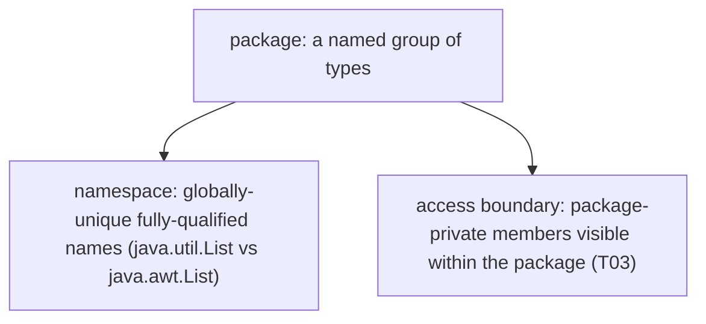
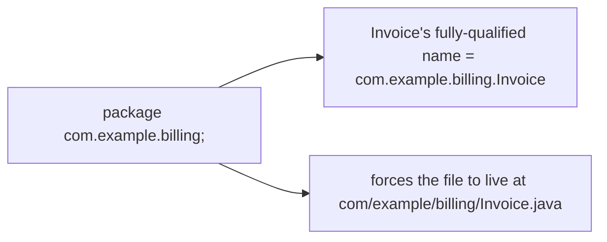
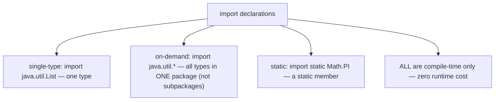
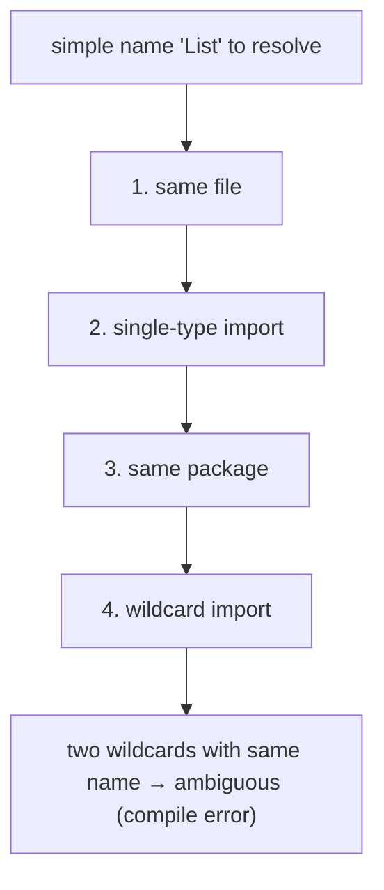
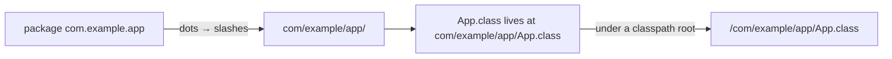
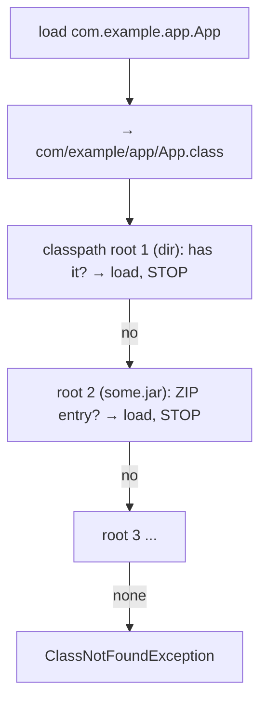
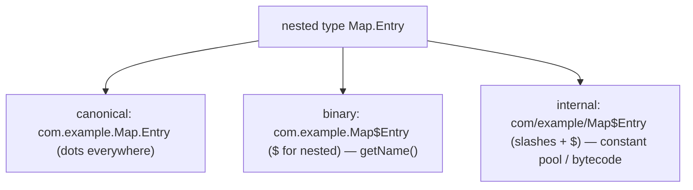
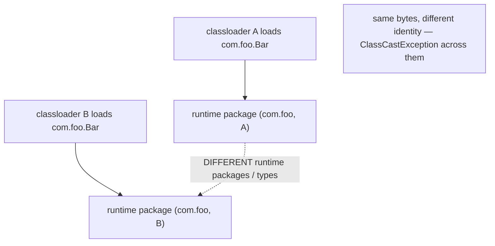
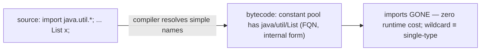
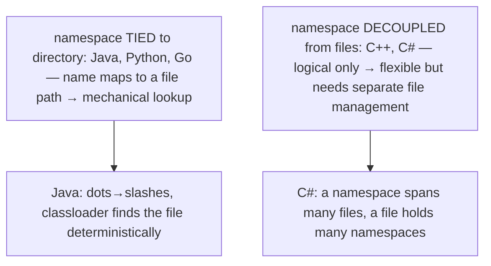

# Packages & imports

A **package** is Java's unit of **namespace** and **access boundary**: a named group of related types (`java.util`, `com.example.billing`) that gives every class a globally-unique **fully-qualified name** and defines the default visibility tier (package-private — [T03](./T03-encapsulation-and-access-modifiers.md)). The `package` declaration names the group; `import` declarations let you refer to types from *other* packages by their short names instead of spelling out the full path every time. After fifteen topics on *what* classes are and how they relate, this one covers *where they live* — the on-disk directory layout, the classpath, and the precise mechanism by which a name like `com.example.App` becomes a `.class` file loaded into the JVM.

The depth bar here is the **physical reality beneath the names**. The package structure is not just a logical grouping — it is a **hard requirement on directory layout**: `package com.example.app;` *forces* the class to live at `com/example/app/App.class` relative to a classpath root, because the **classloader resolves a class name to a file by translating dots to slashes and appending `.class`** ([T01](./T01-classes-and-objects.md) class loading). At the bytecode level, a class's fully-qualified name is stored in the constant pool in **internal form with slashes** (`com/example/app/App`), and **`import` declarations vanish entirely at compile time** — every type reference in the `.class` file is already fully qualified, so imports cost exactly *zero* at runtime; they're purely a compile-time convenience for writing short names. Most subtly, a class's **runtime identity is the pair (package name, defining classloader)**, not the package name alone — which is why two `com.foo.Bar` classes loaded by different classloaders are *different types* in *different runtime packages*, the foundation of classloader isolation in application servers and the reason package-private access is classloader-scoped ([T03 deeper section](./T03-encapsulation-and-access-modifiers.md#deeper-jvm-internals--nest-based-access-binary-compatibility-and-the-access-check-pipeline)). By the end you'll trace a class name through the classpath to a `.class` file on disk, read the internal-form names in a constant pool, prove that imports leave no runtime trace, and explain why the same package name can mean two different things at runtime.

> [!NOTE]
> Prerequisites: [Classes & objects](./T01-classes-and-objects.md) (`L1/C01/T01`) — class loading (load/verify/prepare/resolve/init), classloaders, the constant pool, binary names; [Encapsulation](./T03-encapsulation-and-access-modifiers.md) (`L1/C01/T03`) — package-private (default) access, classloader-scoped package identity; [static members](./T11-static-members-blocks-and-nested-classes.md) (`L1/C01/T11`) — `import static`; [Inheritance](./T04-inheritance-and-super.md) (`L1/C01/T04`) — binary names with `$` for nested types; [Sealed types](./T15-sealed-classes-and-interfaces.md) (`L1/C01/T15`) — the module/package locality rule that JPMS (T17) tightens.

## Why Packages Exist — Namespaces and Boundaries

Two classes named `List` exist in the JDK: `java.util.List` (the collection) and `java.awt.List` (an old UI widget). Two classes named `Date` exist: `java.util.Date` and `java.sql.Date`. Without a namespace mechanism, these would collide — you could only have one `List` on the classpath. Packages solve this by giving every class a **fully-qualified name** that is globally unique: the package path plus the simple name. `java.util.List` and `java.awt.List` are different types with different fully-qualified names, coexisting peacefully.

Packages serve **two** distinct purposes:

1. **Namespace** — disambiguating same-named types and organizing thousands of classes into a navigable hierarchy (`java.util`, `java.util.concurrent`, `java.util.stream`, …).
2. **Access boundary** — the package is the scope of **package-private** (default) access ([T03](./T03-encapsulation-and-access-modifiers.md)): members with no access modifier are visible to every class *in the same package* and invisible elsewhere. Packages are how you group classes that cooperate closely and share internals while hiding those internals from the outside world.



## The `package` Declaration

A source file declares its package with a `package` statement — the **first non-comment line** in the file, before any `import` or type declaration:

```java
package com.example.billing;          // must be first (after comments)

import java.util.List;

public class Invoice { ... }
```

This places `Invoice` in the `com.example.billing` package; its fully-qualified name is `com.example.billing.Invoice`. The convention is **reverse domain name**: an organization that owns `example.com` uses package names starting `com.example`, guaranteeing global uniqueness (no two organizations share a domain). The JDK reserves `java.*` and `javax.*` (and increasingly `jdk.*`); never put your code there.



A file with **no** `package` declaration belongs to the **default (unnamed) package** ([§ The Default Package](#the-default-unnamed-package)).

## Fully-Qualified vs Simple Names

Every type has a **simple name** (`Invoice`) and a **fully-qualified name** (`com.example.billing.Invoice`). Inside its own package, and after importing, you use the simple name. To refer to a type from another package *without* importing, you spell out the FQN:

```java
// without import — fully-qualified name inline
java.util.List<String> names = new java.util.ArrayList<>();

// with import — simple name
import java.util.List;
import java.util.ArrayList;
List<String> names = new ArrayList<>();
```

The FQN is occasionally **mandatory** — when you need two same-named types from different packages in one file, you can import at most one of them; the other must be fully qualified:

```java
import java.util.Date;                 // import one Date

class Scheduler {
    java.util.Date when;               // the imported one (could write `Date`)
    java.sql.Date dbDate;              // the OTHER Date — must be fully qualified
}
```

You cannot `import java.util.Date` *and* `import java.sql.Date` — the simple name `Date` would be ambiguous. Import one, fully-qualify the other.

## `import` Declarations

An `import` lets you use a type's simple name. Three forms:

### Single-Type Import

```java
import java.util.List;                 // exactly java.util.List
```

Imports one specific type. Clear and unambiguous; the recommended default.

### On-Demand (Wildcard) Import

```java
import java.util.*;                    // all types in java.util, by simple name
```

Makes *every* type in `java.util` available by its simple name. Two critical facts:

- **It does NOT import subpackages.** `import java.util.*;` makes `List`, `Map`, `ArrayList` available but **not** `java.util.concurrent.ConcurrentHashMap` — `concurrent` is a *different* package. There is no "recursive" import; each package is imported separately.
- **It is purely a compile-time convenience.** A wildcard import does not make your class larger, slower, or load more classes. It only affects how the *compiler* resolves simple names in this source file. At runtime there is no difference whatsoever between wildcard and single-type imports ([§ Architecture Layer](#architecture-layer--imports-are-compile-time-only)).

Style guides often discourage wildcard imports because they hide *which* types you use and can introduce ambiguity, but they have zero runtime cost.

### Static Import

```java
import static java.lang.Math.PI;       // a static member
import static java.lang.Math.max;
import static org.junit.jupiter.api.Assertions.*;   // common in tests

double area = PI * r * r;              // instead of Math.PI
```

Imports `static` members (fields, methods) so you can use them unqualified ([T11](./T11-static-members-blocks-and-nested-classes.md)). Useful for `Math`, test assertions, and DSLs; overuse harms readability.



## `java.lang` Auto-Import and Resolution Rules

The package **`java.lang`** is **automatically imported** into every source file — `String`, `Object`, `Integer`, `System`, `Thread`, `Math`, `Exception`, and the rest are usable by simple name with no `import`. This is why `String` "just works" everywhere ([L0/C02/T01](../../L0-foundations/C02-java-core/T01-program-structure-class-main-statements.md)). Your own package's types are likewise visible without import (same package).

When a simple name could resolve multiple ways, Java applies a **precedence** (JLS §6.5):

1. A type declared in the **same compilation unit** (same file).
2. A **single-type import**.
3. A type declared in the **same package** (implicit).
4. An **on-demand (wildcard) import**.

So a single-type import **beats** a wildcard import, and a same-package type beats a wildcard. The ambiguous case: if **two wildcard imports** both provide the same simple name (e.g., `import java.util.*;` and `import java.awt.*;` both have `List`), the name is **ambiguous** — a compile error — and you must add a single-type import or use the FQN to disambiguate.



## The Default (Unnamed) Package

A source file with no `package` declaration is in the **default (unnamed) package**. It's legal for tiny throwaway programs (a single `Main.java` with no package), but **forbidden for any real code** for one decisive reason: **types in the default package cannot be imported.** There is no package name to write in an `import`, so a packaged class can never refer to a default-package class by simple name. Default-package code is an island — unusable from organized code. (JPMS, [T17](./T17-java-module-system-jpms.md), goes further: a *named module* may not contain types in the unnamed package at all.)

> [!WARNING]
> Never put real code in the default package. It can't be imported by any packaged class, so it's unreachable from organized code. Always declare a package — even `package app;` is better than none.

## Naming Conventions and `package-info.java`

Conventions:

- **All lowercase**, dot-separated, reverse-domain: `com.example.billing.invoice`.
- **No Java keywords** as path segments (a domain like `int.example.com` would force the illegal `package com.example.int;` — the workaround is an underscore, `int_`).
- **Singular or domain-meaningful** segment names; group by feature/layer.

A package can carry documentation and package-level annotations via a special file **`package-info.java`** — a source file containing *only* the package declaration (with its Javadoc and annotations) and nothing else:

```java
/**
 * Billing domain: invoices, payments, and ledger entries.
 */
@NonNullApi                          // a package-level annotation (e.g., nullability default)
package com.example.billing;

import org.example.annotations.NonNullApi;
```

It compiles to `package-info.class` and is the canonical place for package Javadoc and for annotations that apply to the whole package (nullability defaults, API-status markers).

## Packages as Access Boundaries

The package is the scope of **package-private** (default) access ([T03](./T03-encapsulation-and-access-modifiers.md)): a class, field, or method with no access modifier is visible to every type *in the same package* and nowhere else. This makes the package the natural unit for a cohesive group of cooperating classes that share internals:

```java
package com.example.engine;

class Piston { void fire() { ... } }   // package-private class — internal to the engine package

public class Engine {                  // public — the package's API
    private final Piston[] pistons;
    void cycle() { for (var p : pistons) p.fire(); }   // can use Piston; outside code can't
}
```

`Piston` is an implementation detail of `com.example.engine`, invisible outside it; `Engine` is the public face. This is the "internal-API tier" ([T03](./T03-encapsulation-and-access-modifiers.md)) — a level of encapsulation between `private` (one class) and `public` (everyone). Packages thus do double duty: namespace *and* encapsulation boundary.

## Split Packages — Classpath vs JPMS

A **split package** is the same package name spread across **multiple JARs or locations**. On the classpath this is *legal but problematic*: the classloader merges the package's types from wherever it finds them, scanning the classpath in order. It causes subtle bugs (which JAR's version of a class wins depends on classpath order) and is a classic source of "it works on my machine."

Under **JPMS** ([T17](./T17-java-module-system-jpms.md)), split packages are **forbidden**: a package must belong to **exactly one module**. This is one of the biggest friction points when migrating legacy classpath applications to modules — libraries that historically split a package across JARs (some old logging and XML libraries did) won't load as modules until the split is resolved. The rule exists so the module system can answer "which module owns this package?" unambiguously.

## Memory Layer — The Directory Mirrors the Package

The package name is not just a label — it **dictates the directory structure on disk**, and this is a *hard requirement* enforced by the toolchain. `package com.example.app;` means:

```
source:   com/example/app/App.java       ← .java file lives here
compiled: com/example/app/App.class      ← .class file lives here (under a classpath root)
```

The compiler translates the dotted package name to a directory path (dots → directory separators) and **requires** the `.class` output at that path. The classloader does the *same* translation in reverse to *find* a class ([§ Class-Name Resolution](#memory-layer--class-name-to-class-file-resolution)). So the directory layout and the package name are two views of the same thing, kept in lockstep by both compiler and runtime.



This rigidity is the price of mechanical resolution: given a fully-qualified name, the runtime knows *exactly* where to look without searching. Moving a class to a new package means moving its file *and* updating the `package` declaration — they cannot diverge.

## Memory Layer — Class-Name to `.class`-File Resolution

How does the JVM turn the name `com.example.app.App` into a loaded class? Through the **classpath** and the classloader ([T01](./T01-classes-and-objects.md) class loading).

The **classpath** (`-cp` / `-classpath` / the `CLASSPATH` env var, or the module path under JPMS) is an **ordered list of roots**. Each root is either a **directory** or a **JAR file** (a ZIP archive of `.class` files + resources + `META-INF/MANIFEST.MF`). To load `com.example.app.App`, the application classloader:

1. Translates the name to an internal path: `com/example/app/App.class`.
2. Walks the classpath roots **in order**:
   - For a **directory** root `D`: look for the file `D/com/example/app/App.class`.
   - For a **JAR** root `J`: look for the ZIP entry `com/example/app/App.class` inside `J`.
3. **First match wins** — the first root that contains the entry provides the class; the search stops.
4. If no root has it: `ClassNotFoundException` / `NoClassDefFoundError`.



Two consequences:

- **Classpath order matters.** If two roots both contain `com/example/app/App.class` (a duplicate class, common with conflicting library versions), the **first** one wins. This is "JAR hell" / "classpath hell" — the wrong version silently shadows the right one based on ordering.
- **Lookup has a cost.** Finding a class is a linear walk of the classpath until a match; a classpath with hundreds of JARs makes first-load of each class do real I/O. The classloader **caches** loaded classes (a class loads once — [T01](./T01-classes-and-objects.md)), so the cost is per-class-first-load, not per-use. Large classpaths are a real startup-time tax (and a motivation for JPMS and AOT/CDS).

## Memory Layer — Binary Names, Internal Form, and the Constant Pool

A type has several name forms, and the JVM uses a specific one internally:

| Form | Example | Where used |
|------|---------|------------|
| **Canonical name** | `com.example.Map.Entry` | source, Javadoc, `Class.getCanonicalName()` |
| **Binary name** | `com.example.Map$Entry` | `Class.getName()`, reflection (`$` for nested — [T04](./T04-inheritance-and-super.md)/[T12](./T12-inner-local-and-anonymous-classes.md)) |
| **Internal form** | `com/example/Map$Entry` | the `.class` file constant pool, JVM bytecode |



In the **constant pool** ([T01](./T01-classes-and-objects.md)), every class reference is a `CONSTANT_Class_info` pointing to a `CONSTANT_Utf8` holding the **internal form** — slashes for package separators, `$` for nested types. So a method that uses `java.util.List` has, in its class file, a constant-pool entry `java/util/List` regardless of how you wrote it in source:

```
$ javap -v MyClass
Constant pool:
  #7 = Class    #8         // java/util/List
  #8 = Utf8     java/util/List
  ...
```

This is the proof of the next point: **the source-level dotted name and the imports are gone by the time you have a `.class` file** — only the internal-form FQN survives in the constant pool. The JVM never sees `import java.util.List;` or even the dotted `java.util.List`; it sees `java/util/List` and resolves it.

## Memory Layer — Runtime Package Identity Is (Package, Classloader)

The subtlest and most important point: **a package's runtime identity is the pair (package name, defining classloader)** — not the package name alone ([T03 deeper section](./T03-encapsulation-and-access-modifiers.md#deeper-jvm-internals--nest-based-access-binary-compatibility-and-the-access-check-pipeline)). Two classes both named `com.foo.Bar`, loaded by **two different classloaders**, are in **two different runtime packages** and are **two different types** — `bar1.getClass() != bar2.getClass()`, and assigning one to the other throws `ClassCastException` even though their bytes are identical.



This is the foundation of **classloader isolation**: an application server (Tomcat, JBoss) gives each deployed web app its own classloader, so two apps can each have `com.app.Config` without interfering — they're distinct runtime types in distinct runtime packages. It's also why **package-private access is classloader-scoped** ([T03](./T03-encapsulation-and-access-modifiers.md)): two same-named-package classes from different loaders *cannot* access each other's package-private members, because they aren't really in the same (runtime) package. The `getClass().getPackage()` returns a `Package` object scoped to that class's classloader.

## Architecture Layer — Imports Are Compile-Time Only

The single most important architecture fact: **`import` declarations leave no trace in the bytecode and cost exactly nothing at runtime.** An import is a *compile-time name-resolution aid* — it tells the compiler "when I write `List`, I mean `java.util.List`." Once the compiler has resolved every simple name to a fully-qualified one, the imports have done their job and are discarded. The `.class` file's constant pool contains only **fully-qualified internal-form names** (`java/util/List`); there is no "imports" section, no list of wildcard imports, nothing.

Therefore:

- A **wildcard import** (`import java.util.*;`) and a **single-type import** (`import java.util.List;`) produce **byte-for-byte identical bytecode** if you use the same types. The wildcard doesn't load extra classes or bloat anything.
- **Removing unused imports** changes nothing at runtime — it's purely a source-hygiene matter.
- The **JIT and the runtime never see packages as a concept** — they see resolved klass pointers ([T01](./T01-classes-and-objects.md)/[T04](./T04-inheritance-and-super.md)). The package only matters during *name resolution* at class-load time (to find the file) and *access checks* (package-private scope). After resolution, a type is just its `Klass`.



The runtime cost that *does* exist is **class lookup** (the classpath scan, [§ Resolution](#memory-layer--class-name-to-class-file-resolution)) — but that's a function of the classpath and the classes you actually load, entirely independent of how you wrote your imports.

## Cross-Language Perspective — Namespaces and Files

Languages differ sharply on whether the namespace is tied to the filesystem:

| Language | Namespace unit | Tied to directory? | `import`/`using` timing |
|----------|----------------|--------------------|-----------------------|
| **Java** | package | **yes** — directory mirrors package (enforced) | compile-time only |
| **C++** | `namespace` | **no** — purely logical; headers + include paths handle files separately | `#include` is textual (preprocessor); `using` is compile-time |
| **Python** | module (`.py`) / package (dir) | **yes** — directory is a package | **runtime** — `import` *executes* the module |
| **C#** | `namespace` | **no** — decoupled; one file can have many namespaces, one namespace many files | compile-time |
| **Go** | package | **yes** — directory is a package (all files in a dir = one package) | compile-time |
| **Rust** | module (`mod`) | optional — modules can map to files or be inline | compile-time (`use`) |

Two contrasts illuminate Java's choices:

**Python's `import` runs code.** In Python, `import foo.bar` is a *runtime statement* that finds the module, **executes its top-level code** (defining functions, running initializers — like a `<clinit>`, [T11](./T11-static-members-blocks-and-nested-classes.md)), and binds a name in the current scope. This is why Python imports can have side effects and can be slow, and why circular imports are a runtime hazard. Java's `import` is the opposite: a *compile-time* directive with no runtime presence, no execution, no side effects. (Java's runtime class *loading* — which does trigger `<clinit>` — is a separate mechanism, driven by *use*, not by `import`.)

**C# and C++ decouple namespaces from files.** A C# namespace can span many files and a file can contain many namespaces — the compiler doesn't care where a type physically lives. Java enforces the opposite: one public type per file, the file named after the type, in a directory mirroring the package. The trade-off: Java's rigidity makes class resolution *mechanical* (a name maps to exactly one file path), enabling the simple classpath-walk classloader, at the cost of flexibility (you can't reorganize files without changing packages). Go made the same directory-is-package choice as Java (enforced at the directory level rather than per-file). Java's convention-turned-requirement is what lets the classloader find any class with a deterministic path translation — no index, no search, just dots-to-slashes.



## Common Mistakes

> [!WARNING]
> **Real code in the default package.** Types with no `package` declaration can't be imported by packaged code — they're unreachable. Always declare a package.

> [!WARNING]
> **Wildcard import ambiguity.** Two `import x.*;` that both contain the same simple name make that name ambiguous (compile error). Add a single-type import or use the FQN to disambiguate.

> [!WARNING]
> **Assuming `import pkg.*` imports subpackages.** It imports only the types *directly* in `pkg`, not `pkg.sub`. Each package is imported separately; there is no recursive wildcard.

> [!WARNING]
> **File in the wrong directory for its package.** `package com.example.app;` requires the file at `com/example/app/`. A mismatched directory causes a compile error (or a class that can't be found at load time). The directory and the package declaration must agree.

> [!WARNING]
> **Confusing `import` (compile-time) with Python-style runtime import.** Java imports vanish at compile time and never execute anything. They don't load classes or run code. Class *loading* (which does run `<clinit>`) is triggered by *use*, not by `import`.

> [!WARNING]
> **Split packages, especially under JPMS.** The same package across multiple JARs is fragile on the classpath (order-dependent shadowing) and *forbidden* under JPMS (a package belongs to exactly one module). Don't split packages.

> [!WARNING]
> **Relying on classpath order for correctness.** If two JARs provide the same class, the first on the classpath wins — a fragile, invisible dependency on ordering. Resolve duplicate/conflicting classes (dependency management) rather than depending on order.

> [!INTERVIEW]
> Common interview questions for this topic:
> 1. **What are the two purposes of a package?** Namespace (globally-unique fully-qualified names) and access boundary (package-private/default visibility scope).
> 2. **Do imports have a runtime cost?** No — imports are compile-time only and vanish from the bytecode. The constant pool stores fully-qualified internal-form names; wildcard and single-type imports produce identical bytecode.
> 3. **How does the JVM find a class file?** It translates the FQN to `path/with/slashes.class` and walks the classpath roots (directories and JARs) in order, first-match-wins.
> 4. **What is the internal form of a class name?** Slashes for package separators and `$` for nested types — `java/util/Map$Entry` — as stored in the constant pool.
> 5. **What's a package's runtime identity?** The pair (package name, defining classloader). Two same-named-package classes from different classloaders are different runtime packages and different types.
> 6. **Why can't default-package code be used from real code?** There's no package name to import, so packaged classes can't refer to it.
> 7. **Does `import java.util.*` import `java.util.concurrent`?** No — wildcard imports cover only the types directly in the named package, not subpackages.
> 8. **What's the import resolution precedence?** Same file > single-type import > same package > wildcard import. Two wildcards providing the same name is ambiguous.
> 9. **What's a split package and why is it a problem?** The same package across multiple JARs — order-dependent on the classpath, forbidden under JPMS (a package belongs to one module).
> 10. **Why is the directory layout tied to the package?** The classloader resolves names by translating dots to slashes; the file *must* be at the mirrored path so the lookup is mechanical (no search).
> 11. **What's auto-imported?** `java.lang` (String, Object, Math, …) and the current package.
> 12. **What's `package-info.java` for?** Package-level Javadoc and annotations (nullability defaults, API markers); compiles to `package-info.class`.
> 13. **How is Java's `import` different from Python's?** Java's is compile-time, no execution, no runtime trace. Python's `import` runs the module's code at runtime.
> 14. **Why does classpath order matter?** Duplicate classes across roots resolve to the first match — the wrong version can silently shadow the right one.

## Practice

1. **Package + directory.** Create `package com.example.app;` with `App.java` at `com/example/app/App.java`. Compile and run. Then move the file to the wrong directory; observe the compile/run failure. Restore.

2. **FQN disambiguation.** Write a class that uses both `java.util.Date` and `java.sql.Date`. Import one; fully-qualify the other. Confirm you can't import both (ambiguous simple name).

3. **Wildcard ≠ subpackages.** `import java.util.*;` then try to use `ConcurrentHashMap` by simple name; observe it's not found (it's in `java.util.concurrent`). Add the right import.

4. **Wildcard ambiguity.** `import java.util.*;` and `import java.awt.*;` then use `List`; observe the ambiguity compile error. Resolve with a single-type import.

5. **Imports vanish — prove it.** Write two versions of a class, one with `import java.util.List;` and one with `import java.util.*;`, using `List` identically. Compile both; `javap -v` both; confirm **identical** constant pools and bytecode. Then `javap -c` and find `java/util/List` (internal form) in the constant pool — note there's no "imports" section.

6. **Internal vs binary vs canonical name.** For a nested type `Map.Entry`, print `getCanonicalName()` (`java.util.Map.Entry`), `getName()` (`java.util.Map$Entry`), and find the internal form (`java/util/Map$Entry`) in a class file's constant pool. Tabulate the three.

7. **Classpath first-match-wins.** Put two copies of the same class (different behavior) in two directories. Run with both on the classpath in one order, then the other; observe which one wins changes with order. Explain "classpath hell."

8. **Class-name resolution.** Run a program with `-verbose:class` and watch a class load. Confirm the JVM resolves `com/example/app/App.class` from a classpath root. Try loading a non-existent class; observe `ClassNotFoundException`.

9. **JAR as a ZIP.** Build a JAR; open it with `unzip -l` (it's a ZIP); confirm the `.class` files are at package-mirrored paths and there's a `META-INF/MANIFEST.MF`. Add it to the classpath and load a class from it.

10. **Default-package unreachability.** Put a class in the default package (no `package` decl). From a packaged class, try to import or reference it; observe you can't. Move it into a package; now it works.

11. **Package-private boundary.** Create two classes in the same package, one package-private. Access it from a class in the *same* package (works) and from a class in a *different* package (compile error). Confirm the package is the access scope ([T03](./T03-encapsulation-and-access-modifiers.md)).

12. **Runtime package identity.** Load the same class via two separate `URLClassLoader`s. Confirm `c1 != c2` (different `Class` objects), assigning one instance to the other's type throws `ClassCastException`, and `getClass().getPackage()` differs. Explain (package, classloader) identity.

13. **`package-info.java`.** Add a `package-info.java` with Javadoc and a package-level annotation. Compile; confirm a `package-info.class` is produced. Read the annotation reflectively via `Package.getAnnotations()`.

14. **`import static`.** Convert a class using `Math.max`/`Math.PI` to use `import static`. Confirm identical behavior and (via `javap`) identical bytecode — the static import is also compile-time only.

15. **End-to-end explain-it-back.** Trace loading `com.example.app.App`: (a) the source `package com.example.app;` forced the file to `com/example/app/App.java` → `App.class`; (b) at runtime the classloader translates the name to `com/example/app/App.class` and walks the classpath roots first-match-wins; (c) the loaded class's constant pool holds type refs in internal form (`java/util/List`) — the imports that produced those refs are gone; (d) the class's runtime identity is (com.example.app, this classloader); (e) why two classloaders give two different `App` types; (f) why none of this depends on whether you used wildcard or single-type imports. Twelve sentences max.

## Recap

You should now be able to:

**Language layer.**

- Explain a package's two roles: namespace (unique FQNs) and access boundary (package-private scope).
- Write a `package` declaration (reverse-domain, first non-comment line) and understand it forces the directory layout.
- Distinguish fully-qualified from simple names and know when an FQN is mandatory (same-named types from two packages).
- Use single-type, on-demand (wildcard), and static imports — and know wildcards don't cover subpackages and have zero runtime cost.
- Apply the import resolution precedence (same file > single-type > same package > wildcard) and resolve wildcard ambiguity.
- Avoid the default package for real code; use `package-info.java` for package docs/annotations.
- Recognize split packages as fragile on the classpath and forbidden under JPMS.

**Memory layer.**

- Explain the directory-mirrors-package requirement and how the classloader uses dots-to-slashes translation to find a file.
- Trace class-name resolution through the classpath (ordered roots, directories and JARs, first-match-wins) and explain classpath-order shadowing.
- Distinguish canonical, binary (`$` for nested), and internal (slashes) name forms; locate internal-form names in the constant pool.
- Explain that a package's runtime identity is (package name, classloader), enabling classloader isolation and scoping package-private access.

**Architecture layer.**

- Explain that imports are compile-time only — they vanish from bytecode, cost nothing at runtime, and wildcard ≡ single-type in the generated code.
- Distinguish the (real) class-lookup cost from the (zero) import cost.
- Explain that the JIT/runtime never sees packages as a concept — only resolved klass pointers — with packages mattering only at name resolution and access checks.
- Compare Java's directory-mirrors-package convention with C++/C# (decoupled), Python (runtime import that executes code), and Go (directory-is-package), and explain why Java's choice enables mechanical class resolution.

Packages are the organizational and physical substrate beneath every type in L1: the namespace that makes names unique, the boundary that scopes package-private access, and the directory structure the classloader walks to find your classes. The next topic, [T17](./T17-java-module-system-jpms.md), builds *above* packages — the **Java Platform Module System** groups packages into modules with explicit `exports` and `requires`, adding a stronger encapsulation tier (modules can hide whole packages) and reliable configuration (no more classpath hell), and it's where the split-package prohibition and the unnamed-package restriction we mentioned become enforced rules.

## Next

Continue to [Java Module System (JPMS)](./T17-java-module-system-jpms.md) — the module layer above packages (Java 9+, Project Jigsaw). A module groups packages and declares, in `module-info.java`, which packages it `exports` (its public API) and which other modules it `requires` (its dependencies). JPMS adds strong encapsulation (non-exported packages are invisible *even if public* — [T03](./T03-encapsulation-and-access-modifiers.md)'s module pipeline), reliable configuration (dependencies checked at startup, no more classpath hell), and the enforcement of the split-package and unnamed-package rules T16 previewed — the strongest encapsulation tier in Java.
