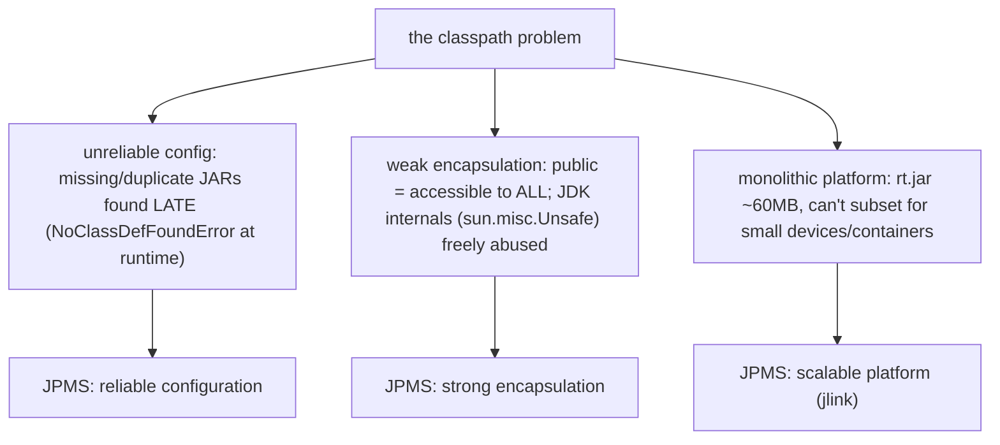
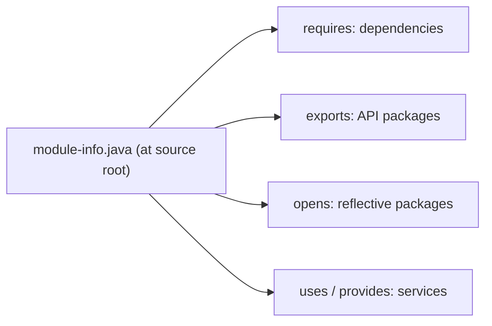
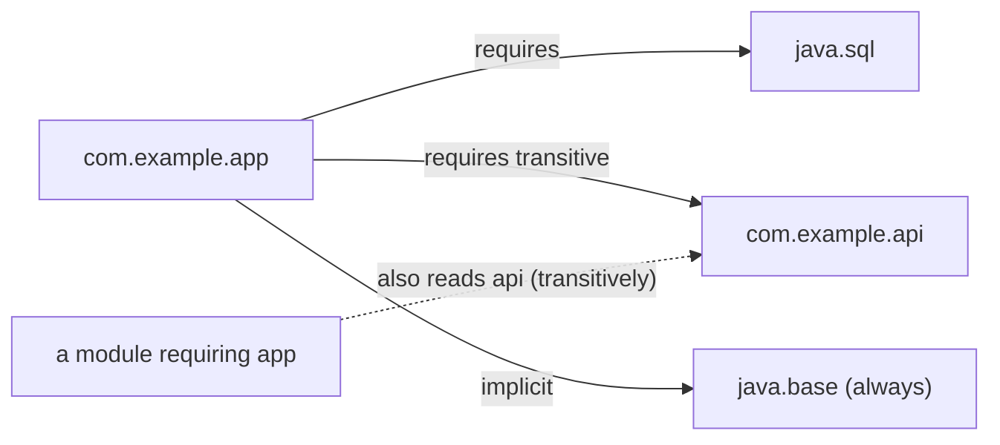
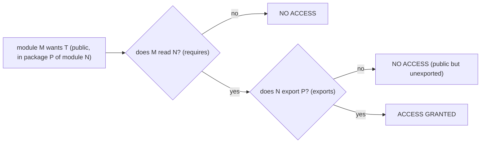
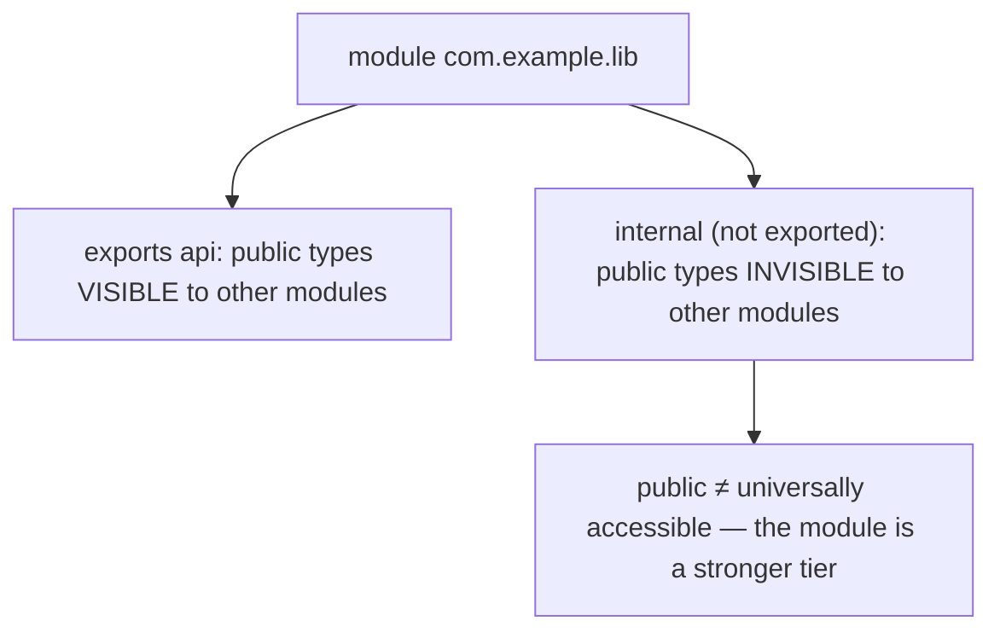
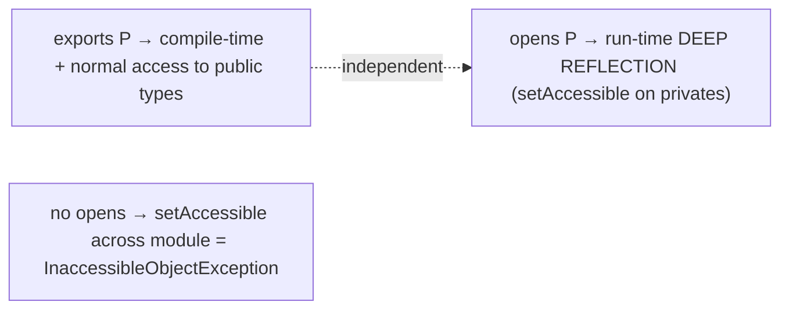
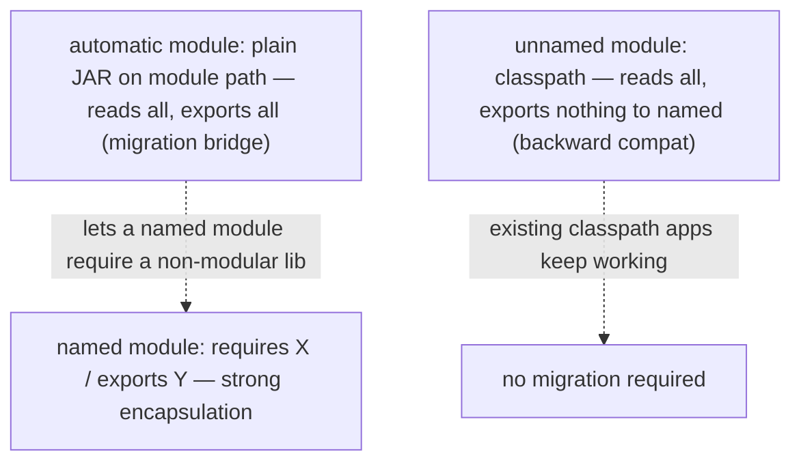
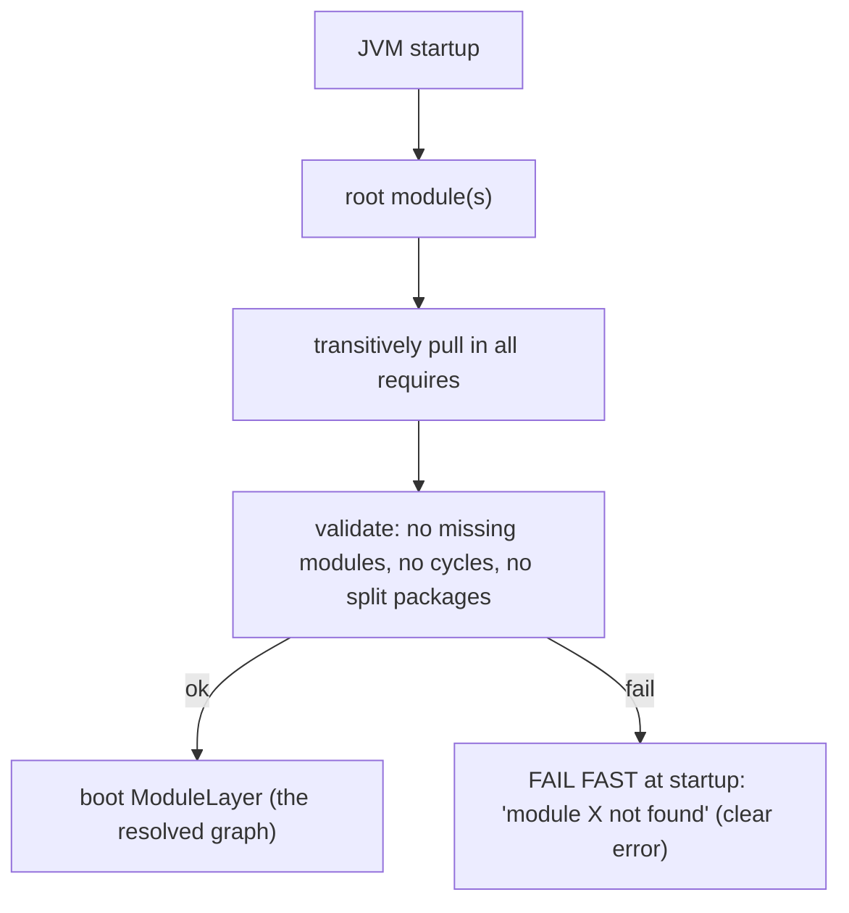
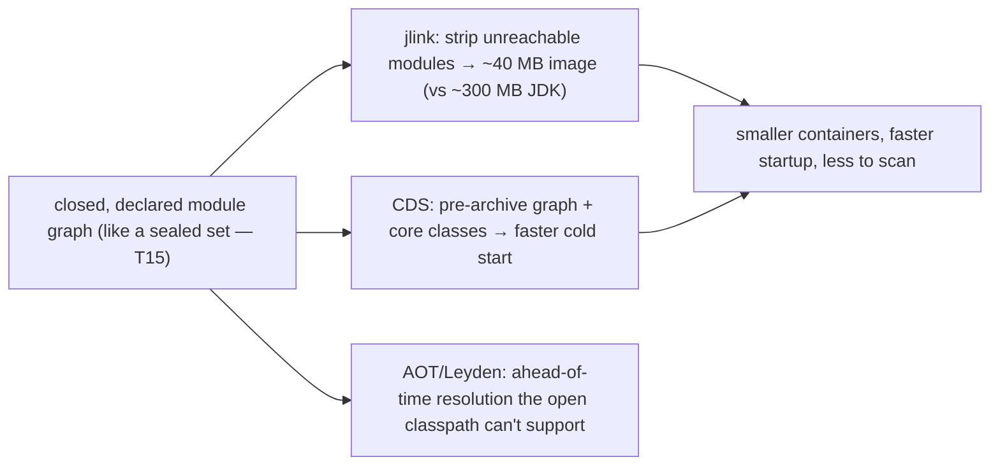
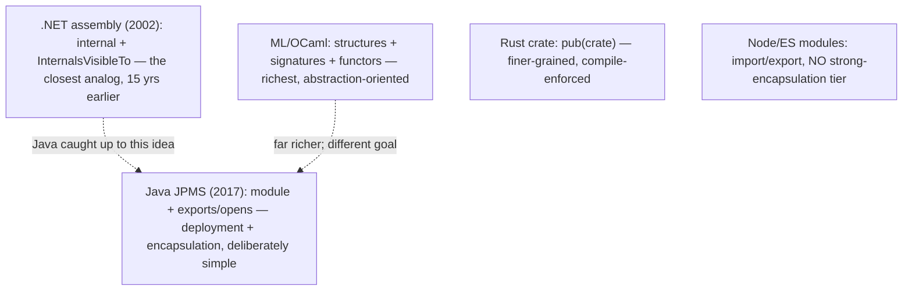

# Java Module System (JPMS)

The **Java Platform Module System** (JPMS, Java 9+, Project Jigsaw / JEP 261) adds a layer *above* packages: a **module** is a named, self-describing group of packages that explicitly declares **what it depends on** (`requires`) and **what it makes available to others** (`exports`). Where [T16](./T16-packages-and-imports.md) covered the package as a namespace and the classpath as a flat, order-dependent bag of classes, JPMS replaces that bag with a **validated graph of modules** — each one a unit of dependency, encapsulation, and deployment. It is the largest structural change in Java's history: the JDK itself was split from a monolithic `rt.jar` into ~70 modules, and `module-info.java` became the top-level descriptor of a module's API surface and dependencies.

The depth bar here is the **three problems JPMS solves and the precise mechanism of each**. First, **reliable configuration**: the module graph is *resolved and validated at JVM startup* — a missing dependency fails fast with a clear `module not found`, instead of the classpath's lazy `NoClassDefFoundError` discovered deep in execution months later. Second, **strong encapsulation**: a `public` type in a package that a module does *not* `export` is **invisible to other modules** — `public` no longer means "accessible to everyone on the classpath"; the module boundary is a *stronger* tier than `public` ([T03](./T03-encapsulation-and-access-modifiers.md)). This is enforced at the access-check level: for module M to use a public type in package P of module N, **M must read N (`requires`) and N must export P (`exports`)** — both, a two-part rule. Third, **a scalable platform**: because the JDK is modular and the module graph is a closed, declared set, `jlink` can assemble a custom runtime image containing only the modules an app needs (a 40 MB runtime instead of a 300 MB JDK), and the closed graph enables startup optimizations (CDS). At the memory level, a module compiles to a special `module-info.class` carrying the `ACC_MODULE` flag and a `Module` attribute with the requires/exports/opens tables; the resolved graph becomes a `ModuleLayer` at startup, and every loaded class belongs to a `Module` object. By the end you'll write a `module-info.java`, explain why a public class can be invisible, trace the readability-plus-accessibility rule, read `module-info.class` in `javap`, and place JPMS among .NET assemblies, Rust crates, and ML modules — including an honest account of why, despite all this, most application code still runs on the classpath.

> [!NOTE]
> Prerequisites: [Packages & imports](./T16-packages-and-imports.md) (`L1/C01/T16`) — packages, the classpath, split packages, runtime package identity; [Encapsulation](./T03-encapsulation-and-access-modifiers.md) (`L1/C01/T03`) — access modifiers, the module access pipeline, `--add-opens`, `InaccessibleObjectException`; [Sealed types](./T15-sealed-classes-and-interfaces.md) (`L1/C01/T15`) — closed-set / closed-world reasoning; [Interfaces](./T08-interfaces-default-static-private-methods.md) (`L1/C01/T08`) — services and the ServiceLoader SPI; [Classes & objects](./T01-classes-and-objects.md) (`L1/C01/T01`) — class loading, classloaders, the constant pool.

## Why JPMS Exists — Three Problems

Before Java 9, the classpath ([T16](./T16-packages-and-imports.md)) was the only way to assemble an application, and it had three deep, long-standing problems that JPMS was designed to solve:



1. **Unreliable configuration ("classpath hell").** The classpath is a flat, ordered list with no declared dependencies. Missing a JAR? You find out as a `NoClassDefFoundError` at the moment the missing class is first used — possibly deep in production, months later. Two versions of the same library? Whichever is first on the classpath silently wins ([T16](./T16-packages-and-imports.md)). There's no startup check that the configuration is even *complete*.

2. **Weak encapsulation.** `public` meant "accessible to all code on the classpath" — there was no way for a library to expose *some* packages as API while hiding others as internal. So the ecosystem reached into JDK internals (`sun.misc.Unsafe`, `com.sun.*`) en masse, which froze the JDK: the maintainers couldn't change internals without breaking everyone. There was no enforceable boundary above `public`.

3. **Monolithic platform.** The JDK shipped as one giant `rt.jar` (~60 MB). You couldn't ship "just the parts my app uses" to a small device or a container. The platform didn't scale down.

JPMS addresses all three: a module **declares** its dependencies (reliable configuration), **controls** which packages it exports (strong encapsulation), and is a **unit** that tools like `jlink` can compose into a minimal runtime (scalable platform).

## The Module and `module-info.java`

A module is described by a **`module-info.java`** file at the **root** of its source (not inside any package). It names the module and lists directives:

```java
module com.example.app {
    requires java.sql;                        // depend on the java.sql module
    requires transitive com.example.api;      // depend on, AND re-export to my consumers
    requires static com.example.annotations;  // compile-time only, optional at runtime

    exports com.example.app.api;              // make this package's public types available to all
    exports com.example.app.spi to com.example.plugin;  // qualified: only to com.example.plugin

    opens com.example.app.model;              // allow deep reflection into this package
    opens com.example.app.entity to org.hibernate.orm;  // qualified opens

    uses com.example.spi.Backend;             // I consume this service (ServiceLoader)
    provides com.example.spi.Backend          // I provide an implementation
        with com.example.app.LocalBackend;
}
```

The module name follows the same reverse-domain convention as packages ([T16](./T16-packages-and-imports.md)). The body is a set of **directives** describing dependencies (`requires`), the exported API (`exports`), reflective openness (`opens`), and services (`uses`/`provides`). `module-info.java` compiles to `module-info.class` ([§ Memory Layer](#memory-layer--module-infoclass-and-the-module-graph)).



## `requires` — Declaring Dependencies

`requires N` says this module depends on module `N`; `N`'s **exported** packages become readable here. Three flavors:

- **`requires N`** — a normal dependency, present at both compile and run time.
- **`requires transitive N`** — like `requires`, **plus** implied readability: any module that requires *this* module also automatically reads `N`. Use it when `N`'s types appear in *your* public API — e.g., a method you export *returns* an `N` type, so your consumers need to read `N` to use that return value. Without `transitive`, every consumer would have to redundantly `requires N` too.
- **`requires static N`** — a **compile-time-only** dependency; `N` may be *absent* at run time. For optional dependencies and compile-time-only annotation libraries.

`java.base` — the core module containing `Object`, `String`, collections, `java.lang`, `java.util`, etc. — is **implicitly required by every module**; you never declare it. It's the module equivalent of `java.lang`'s auto-import ([T16](./T16-packages-and-imports.md)).



## `exports` — Declaring the API

`exports P` makes the **public and protected types** in package `P` accessible to any module that reads this one. Packages that are *not* exported are **module-private** — invisible outside the module even if their types are `public` ([§ Strong Encapsulation](#strong-encapsulation--public-is-no-longer-universal)).

- **`exports P`** — unqualified: `P` is available to *all* modules that read this one.
- **`exports P to M1, M2`** — **qualified** export: `P` is available *only* to the named modules. For sharing internals with specific friends — your own test module, a tightly-coupled companion module, an implementation module that a facade delegates to. (This is the module analog of C#'s `InternalsVisibleTo` — [§ Cross-Language](#cross-language-perspective--module-systems).)

A module typically exports a small **api** package and keeps **internal** packages unexported — the cleanest expression yet of "public API vs implementation detail," now enforced at the module boundary rather than relying on package-private ([T03](./T03-encapsulation-and-access-modifiers.md)).

## The Readability + Accessibility Two-Part Rule

This is the core access rule of JPMS, and it has **two** independent halves that **both** must hold. For code in module **M** to access a `public` type **T** in package **P** of module **N**:

1. **Readability** — M must **read** N: M `requires N` (or N is implicitly read, like `java.base`). Readability is about *modules*.
2. **Accessibility** — N must **export P**: N `exports P` (unqualified, or qualified to M). Accessibility is about *packages*.



Both are necessary; neither alone suffices. Readability without an export = no access (you can see the module but not the package). An export without readability = no access (the package is offered but you didn't ask to read the module). And of course, *within* an accessible exported package, the normal access modifiers still apply ([T03](./T03-encapsulation-and-access-modifiers.md)) — `public`/`protected` types are reachable, package-private and `private` are not. **The module checks happen *first* (readability, then export), then the member access-modifier check** — the same layered pipeline from [T03's module section](./T03-encapsulation-and-access-modifiers.md#deeper-jvm-internals--nest-based-access-binary-compatibility-and-the-access-check-pipeline).

## Strong Encapsulation — `public` Is No Longer Universal

The most consequential conceptual change: **a `public` type in a non-exported package is invisible to other modules.** Before JPMS, `public` was the top of the access hierarchy — accessible everywhere. Now the *module* sits above it:

```java
module com.example.lib {
    exports com.example.lib.api;       // exported — its public types are reachable
    // com.example.lib.internal is NOT exported
}

// in com.example.lib.internal:
public class Engine { ... }            // public, but in an unexported package

// in another module that requires com.example.lib:
import com.example.lib.internal.Engine;   // COMPILE ERROR: package not exported (even though Engine is public)
```

`Engine` is `public`, yet another module cannot see it — the package isn't exported. **"public" now means "public *within the module*, and to other modules only if the package is exported."** This is what finally let the JDK strongly encapsulate `sun.misc.Unsafe` and `jdk.internal.*`: those packages aren't exported, so cross-module access is blocked, and the JDK can finally evolve its internals. It's also the tool library authors needed: export a clean `api` package, hide everything else, and evolve the internals freely.



> [!IMPORTANT]
> Under JPMS, `public` is *not* the strongest "accessible everywhere" tier anymore. The full visibility ladder is: `private` (class) < package-private (package) < `protected`/`public` *within the module* < `public` *in an exported package* (cross-module). The module boundary outranks `public`.

## `opens` — Reflective Access

Exporting a package grants **compile-time and normal-access** visibility, but it does **not** grant deep reflective access (calling `setAccessible(true)` on private members — [T03](./T03-encapsulation-and-access-modifiers.md)). Frameworks like Hibernate, Jackson, and Spring reflect into your classes' private fields to inject/serialize them. For that, a package must be **opened**:

- **`opens P`** — package `P` is open for **deep reflection** (private-member `setAccessible`) by any module at run time. It does *not* grant compile-time accessibility (opens ≠ exports for compilation).
- **`opens P to M1`** — qualified opens to specific modules (e.g., `opens com.example.entity to org.hibernate.orm`).
- **`open module M { ... }`** — the *whole* module is open; every package is reflectively accessible. The migration shortcut for heavily-reflective applications.

Without `opens`, a framework's `setAccessible(true)` across the module boundary throws **`InaccessibleObjectException`** ([T03](./T03-encapsulation-and-access-modifiers.md)). This is the single most common JPMS migration pain: a Spring/Hibernate app that worked on the classpath fails reflectively on the module path until the entity/model packages are opened. `exports` (compile-time API access) and `opens` (run-time reflective access) are **independent** — a package can be exported, opened, both, or neither.



## `uses` / `provides` — Services

JPMS integrates the **ServiceLoader** SPI ([T08](./T08-interfaces-default-static-private-methods.md) interfaces as contracts) into the module descriptor. A service is an interface (or abstract class); providers implement it; consumers discover implementations at run time without compile-time coupling:

```java
// the service interface module
module com.example.spi {
    exports com.example.spi;            // the Backend interface
}

// a consumer module
module com.example.app {
    requires com.example.spi;
    uses com.example.spi.Backend;       // "I will load Backend implementations"
}

// a provider module
module com.example.local {
    requires com.example.spi;
    provides com.example.spi.Backend    // "I provide this implementation"
        with com.example.local.LocalBackend;
}
```

The consumer calls `ServiceLoader.load(Backend.class)` and gets every provider declared via `provides ... with` across the module graph — a decoupled plugin mechanism the module system wires up. `uses` declares consumption (so the resolver knows the service is needed); `provides ... with` declares an implementation. This replaces the classpath-era `META-INF/services` files with a first-class, validated declaration.

## Module Path vs Classpath

JPMS introduces the **module path** alongside the legacy classpath:

- **`--module-path` / `-p`** — where *modules* (modular JARs, exploded module directories) are found. Modules here are resolved into the module graph and subject to module rules.
- **`-classpath` / `-cp`** — the legacy path; everything here lands in the **unnamed module** ([§ Named/Automatic/Unnamed](#named-automatic-and-unnamed-modules)) with classpath semantics.
- **Launching** — `java --module com.example.app/com.example.app.Main` (or `-m`) runs a module's main class; the resolver builds the graph rooted at that module.

You can mix both paths during migration, but they have different semantics: module-path code is encapsulated and dependency-checked; classpath code is the old free-for-all.

## Named, Automatic, and Unnamed Modules

Three kinds of module coexist, which is what makes gradual migration possible:

| Kind | What it is | Reads | Exports |
|------|-----------|-------|---------|
| **Named** | a JAR with `module-info.class` | only what it `requires` | only what it `exports` |
| **Automatic** | a plain (non-modular) JAR **on the module path** | **all** modules + the unnamed module | **all** its packages |
| **Unnamed** | everything **on the classpath** | **all** modules | nothing (to named modules) |

- **Named module** — fully described by `module-info`. Strong encapsulation and explicit dependencies apply. The end state.
- **Automatic module** — a non-modularized library placed on the module path. It gets an **automatic name** (from the `Automatic-Module-Name` manifest header if present, otherwise *derived from the JAR filename*), **exports all** its packages, and **reads everything**. It's the **migration bridge**: it lets a *named* module `requires` a library that hasn't been modularized yet. The filename-derived name is unstable across renames — **always set `Automatic-Module-Name` in your JAR's manifest** if you publish one, so consumers can `requires` a stable name.
- **Unnamed module** — all classpath code. It **reads all** modules (so classpath apps can use modular libraries), but **exports nothing to named modules** (there's no name to `requires`). This is the backward-compatibility bucket: existing classpath applications keep working unchanged, which is why most code still runs here.



## Split Packages Forbidden; The Modular JDK

JPMS **forbids split packages** ([T16](./T16-packages-and-imports.md)): a package must belong to **exactly one module**. Two named modules exporting the same package, or a named module and the unnamed module both containing a package, is an error. This is what makes "which module owns this package?" answerable — and it's a major migration hurdle for legacy libraries that historically split a package across JARs (some old logging/XML libraries did).

The **JDK itself is modularized** (Java 9 split `rt.jar` into ~70 modules):

- **`java.base`** — the always-implicitly-required core (`java.lang`, `java.util`, `java.io`, collections, …).
- **`java.sql`**, **`java.xml`**, **`java.desktop`**, **`java.logging`**, **`java.net.http`**, … — separable functional modules you `requires` only if needed.

This is why a modern minimal app needn't drag in AWT/Swing (`java.desktop`) or SQL (`java.sql`) unless it asks for them — and why `jlink` can build a runtime with just the modules used.

Two tools support this:

- **`jdeps`** — static dependency analyzer: shows module/package dependencies, flags uses of internal or removed APIs, suggests a `module-info`.
- **`jlink`** — assembles a **custom runtime image** containing only your modules plus their transitive JDK module dependencies. Result: a self-contained ~40 MB runtime instead of a full ~300 MB JDK — ideal for containers and small deployments.

## Memory Layer — `module-info.class` and the Module Graph

`module-info.java` compiles to a special **`module-info.class`** — a class file that describes a *module*, not a type. Its structure ([T03 deeper section](./T03-encapsulation-and-access-modifiers.md#deeper-jvm-internals--nest-based-access-binary-compatibility-and-the-access-check-pipeline) introduced it):

- **`access_flags` = `ACC_MODULE` (0x8000)** — marks this as a module descriptor, not a class. The verifier rejects any attempt to `new module-info()`.
- **`Module` attribute** — the heart: tables for `requires` (each with its own flags: `ACC_TRANSITIVE`, `ACC_STATIC_PHASE`), `exports` (with optional `to` target lists), `opens` (with optional `to`), `uses`, and `provides ... with`.
- **`ModulePackages` attribute** — all packages in the module.
- **`ModuleMainClass` attribute** — the launch class, if any.

```
$ javap -v module-info.class
Module:
  flags: (0x8000) ACC_MODULE
  requires:
    java.base   (0x8000) ACC_MANDATED
    java.sql
    com.example.api  (0x0020) ACC_TRANSITIVE
  exports:
    com.example.app.api
    com.example.app.spi  to  com.example.plugin
  opens:
    com.example.app.model
  uses:    com.example.spi.Backend
  provides: com.example.spi.Backend with com.example.app.LocalBackend
```

### The Module Graph, Resolved at Startup

At JVM startup, the module system **resolves** the module graph: starting from the root module(s), it transitively pulls in every `requires`d module, then **validates** the whole graph — no missing modules, no `requires` cycles, no split packages, no duplicate exports. The validated result is a **`Configuration`**, instantiated as the **boot `ModuleLayer`**. This happens **once**, at startup.



This is **reliable configuration** in action: a missing or inconsistent dependency makes the JVM **fail at startup with a clear message** (`module java.sql not found`), instead of the classpath's lazy `NoClassDefFoundError` surfacing deep in execution at the first use of a missing class. The graph is checked *before* `main` runs.

Each loaded class belongs to a **`Module`** object — `clazz.getModule()` returns it (a named module's classes return that module; classpath classes return their classloader's unnamed module). Modules interact with classloaders: the JDK uses three built-in loaders — **bootstrap** (`java.base` + core), **platform** (other JDK modules), **application** (your modules + classpath) — and each named module is assigned to one. A module is *not* a classloader (one loader hosts many modules), but they cooperate to enforce the graph.

## Architecture Layer — Access Checks, jlink, and Escape Hatches

### Module Access Checks Cost Nothing at Steady State

The readability + accessibility checks happen at **link/resolution time** — when a cross-module type reference is first resolved, the JVM verifies M reads N and N exports P, then **patches the constant-pool entry** with the resolved reference ([T16](./T16-packages-and-imports.md)/[T03](./T03-encapsulation-and-access-modifiers.md)). Subsequent uses hit the resolved entry directly; the JIT sees only klass pointers ([T01](./T01-classes-and-objects.md)/[T04](./T04-inheritance-and-super.md)). So **strong encapsulation has zero per-call runtime cost** — it's a one-time check per reference, exactly like access-modifier checks. The module graph affects *what links*, not *how fast linked code runs*.

### jlink, CDS, and the Closed Graph

Because the module graph is a **closed, declared set** (like a sealed type's closed implementor set — [T15](./T15-sealed-classes-and-interfaces.md)), tools can reason about the *whole world* of an application:

- **`jlink`** strips everything not reachable from the root module, producing a smaller image. Fewer classes means less to scan at startup and a smaller container.
- **CDS (Class Data Sharing)** can pre-archive the module graph and core classes into a memory-mappable file, so startup skips re-parsing them — a measurable cold-start win, important for serverless/containers.
- The closed graph is also the substrate for **AOT** experiments (and Project Leyden): knowing the complete module set enables ahead-of-time resolution that the open classpath can't support.

### The Escape Hatches: `--add-opens` / `--add-exports`

Real-world migration needs a way to open/export a package *without* editing `module-info` (you often can't — it's the JDK's or a third party's). Two command-line flags ([T03 deeper section](./T03-encapsulation-and-access-modifiers.md#deeper-jvm-internals--nest-based-access-binary-compatibility-and-the-access-check-pipeline)):

```
--add-exports java.base/sun.security.util=ALL-UNNAMED   # grant compile/access to a non-exported package
--add-opens   java.base/java.lang=ALL-UNNAMED            # grant deep reflection into a non-opened package
```

`ALL-UNNAMED` targets all classpath code. These are how legacy reflective frameworks (older Spring, Hibernate, ASM, Mockito) keep working on modern JDKs — they pry open packages JPMS would otherwise seal. They are tactical compatibility flags, not a design tool; needing many of them signals a migration that isn't finished.



## Cross-Language Perspective — Module Systems

JPMS joins a long tradition of module systems, and the comparison is clarifying:

| Language | Unit | Encapsulation tier above "public" | Qualified sharing |
|----------|------|-----------------------------------|-------------------|
| **Java (JPMS)** | module | unexported package (public-but-hidden) | `exports P to M` |
| **.NET** | assembly | `internal` (assembly-scoped) | `[InternalsVisibleTo]` |
| **Rust** | crate | `pub(crate)` (crate-scoped) | `pub(in path)` |
| **OCaml / SML** | structure + signature | signature hides what it omits | functors (modules over modules) |
| **Node / ES modules** | file/package | none (exported = public) | — |

Two contrasts:

**.NET assemblies are the closest mainstream analog**, and they predate JPMS by ~15 years (.NET 1.0, 2002). An *assembly* is a deployment + versioning + access unit; the `internal` access modifier means "visible within this assembly" — exactly a non-exported package's role. `[InternalsVisibleTo("FriendAssembly")]` is the direct equivalent of `exports P to M` — a qualified grant to a named friend. .NET had this "module is a stronger tier than public" model from the start; Java took until 2017. The lesson: JPMS isn't novel in concept — it's Java catching up to a deployment-unit-as-encapsulation-boundary idea other platforms had long settled.

**The ML family had the deepest module system, and a different goal.** OCaml/SML modules (*structures*), *signatures* (module interfaces), and *functors* (modules parameterized by other modules) form a powerful, type-checked module language — far richer than JPMS, oriented toward *abstraction and parametric reuse* rather than *deployment and encapsulation*. JPMS is deliberately simpler: it solves dependency reliability, encapsulation, and platform scaling, not generic-module composition. Different problems, different sophistication.



### Why Adoption Has Been Slow — An Honest Account

Despite solving real problems, **most application code still runs on the classpath (the unnamed module)**, not as named modules. Three reasons:

1. **Migration cost.** Every library needs a `module-info` or at least a stable `Automatic-Module-Name`; split packages must be resolved; reflective frameworks need `opens`. For a large app with hundreds of dependencies, that's a significant, low-immediate-reward effort.
2. **The carrot isn't compelling enough for many.** Classpath apps keep working (the unnamed module reads everything), so the incentive to migrate — `jlink` slimness, strong encapsulation of your own code — doesn't outweigh the cost for typical server applications that ship a full JDK in a container anyway.
3. **The JDK already captured the main benefit.** The *platform* is modular, so the JDK can evolve and `jlink` works — and you get that automatically. The remaining benefit (modularizing *your* code) is optional, and many teams reasonably skip it.

So JPMS "won" *inside* the JDK (the platform is modular, internals are encapsulated, `jlink` exists) but is **optional and underused for application code**. Understanding it remains essential — you hit `InaccessibleObjectException` and `--add-opens` the moment a reflective library meets a modern JDK — but you can write excellent Java for years without authoring a `module-info`.

## Common Mistakes

> [!WARNING]
> **Forgetting to `exports` a package.** A `public` type in a non-exported package is invisible to other modules. If consumers can't see your API, check that its package is exported (and that they `requires` your module).

> [!WARNING]
> **Reflective access without `opens`.** Frameworks doing `setAccessible(true)` across a module boundary need the target package `opens`-ed, or they throw `InaccessibleObjectException`. `exports` is not enough — `exports` ≠ `opens`. Open model/entity packages to the framework's module.

> [!WARNING]
> **Split packages.** A package in two modules (or a module and the classpath) is forbidden under JPMS. Legacy libraries that split packages won't modularize until the split is resolved.

> [!WARNING]
> **Relying on a filename-derived automatic-module name.** Without an `Automatic-Module-Name` manifest header, an automatic module's name comes from the JAR filename — unstable across renames/versions, and a consumer's `requires` breaks if it changes. Always set `Automatic-Module-Name` in published JARs.

> [!WARNING]
> **Mixing module path and classpath carelessly.** The same JAR behaves differently on the two paths (named/automatic vs unnamed). Code split across both can hit confusing visibility and split-package issues. Be deliberate about which path each artifact is on.

> [!WARNING]
> **Assuming `public` still means universally accessible.** Under JPMS it doesn't — the module boundary outranks `public`. A public type in an unexported package is module-private.

> [!WARNING]
> **Overusing `--add-opens`/`--add-exports`.** They're compatibility escape hatches, not design tools. Needing many of them means the migration is incomplete (or a dependency hasn't modularized). Fine as a bridge, a smell as a permanent fixture.

> [!INTERVIEW]
> Common interview questions for this topic:
> 1. **What three problems does JPMS solve?** Reliable configuration (vs classpath hell), strong encapsulation (vs `public`-means-everywhere), and a scalable platform (modular JDK + `jlink`).
> 2. **What's the two-part access rule?** Module M accesses public type T in package P of module N iff M *reads* N (`requires`) **and** N *exports* P (`exports`). Both required.
> 3. **How did `public` change under JPMS?** A `public` type in a non-exported package is invisible to other modules — the module boundary is a stronger tier than `public`.
> 4. **`exports` vs `opens`?** `exports` grants compile-time + normal access to public types; `opens` grants run-time deep reflection (`setAccessible` on privates). Independent — a package can be either, both, or neither.
> 5. **`requires transitive` — when?** When your module's public API exposes another module's types (e.g., a returned type), so your consumers implicitly read it without redeclaring.
> 6. **Named vs automatic vs unnamed modules?** Named: has `module-info`, strong encapsulation. Automatic: plain JAR on the module path, reads all + exports all (migration bridge). Unnamed: classpath, reads all + exports nothing to named (backward compat).
> 7. **What's reliable configuration?** The module graph is resolved and validated at startup — a missing dependency fails fast with a clear error, vs the classpath's lazy `NoClassDefFoundError` at first use.
> 8. **How is a module compiled?** To `module-info.class` with `ACC_MODULE` and a `Module` attribute holding the requires/exports/opens/uses/provides tables.
> 9. **What's `java.base`?** The core module (java.lang, java.util, …), implicitly required by every module.
> 10. **Why are split packages forbidden?** So the system can answer "which module owns this package?" unambiguously; a package belongs to exactly one module.
> 11. **What does `jlink` do?** Builds a custom runtime image with only the modules an app needs — a small, self-contained runtime instead of a full JDK.
> 12. **What's the runtime cost of module access checks?** Zero at steady state — they're resolved once at link time and the constant pool is patched; the JIT sees only klass pointers.
> 13. **Closest analog in another language?** .NET assemblies (`internal` ≈ unexported package, `InternalsVisibleTo` ≈ qualified export). Rust crates (`pub(crate)` ≈ unexported).
> 14. **Why has adoption been slow?** Migration cost (module-info/opens/split-packages), insufficient incentive (classpath apps keep working), and the JDK already captured the main benefit (modular platform + jlink) automatically.

## Practice

1. **First module.** Create a module `com.example.greet` with `module-info.java` exporting one package. Compile with `--module-source-path`, run with `java --module com.example.greet/...Main`. Confirm it runs from the module path.

2. **Two-module requires/exports.** Split into `com.example.api` (exports an interface) and `com.example.app` (`requires` it, uses the interface). Confirm `app` can use `api`'s exported type. Remove the `exports` from `api`; observe the compile error in `app`.

3. **Strong encapsulation.** Put a `public class Internal` in an *unexported* package of `api`. Try to import it from `app`; observe the compile error ("package not exported") despite `Internal` being public. Add the package to `exports`; it now works.

4. **Readability without export, and vice versa.** Demonstrate that `requires` without the target's `exports` fails, and that an `exports` the consumer doesn't `requires` also fails — both halves of the rule are needed.

5. **`requires transitive`.** Make `api` `requires transitive` a third module whose type appears in `api`'s public method signatures. Confirm `app` can use that type *without* declaring `requires` for it. Change to plain `requires`; observe `app` now needs its own `requires`.

6. **`opens` and reflection.** Write a class with a private field in a package that's `exports`-ed but not `opens`-ed. From another module, `setAccessible(true)` on the field; observe `InaccessibleObjectException`. Add `opens` for the package; the reflection now succeeds.

7. **Qualified exports.** `exports com.example.api.spi to com.example.plugin`. Confirm `com.example.plugin` can access it but a third module cannot.

8. **ServiceLoader.** Define a service interface module, a consumer (`uses`), and two provider modules (`provides ... with`). Use `ServiceLoader.load` in the consumer; confirm it discovers both providers without compile-time coupling.

9. **`module-info.class`.** Compile a `module-info.java` and run `javap -v module-info.class`. Identify `ACC_MODULE`, the `requires`/`exports`/`opens` tables, and the `ACC_TRANSITIVE`/`ACC_MANDATED` flags on individual entries.

10. **Automatic module.** Take a plain (non-modular) JAR and place it on the module path. Find its automatic name (`jar --describe-module` or derive from the filename). `requires` it from a named module. Then add an `Automatic-Module-Name` to its manifest and confirm the name changes (and why the filename-derived one is unstable).

11. **Reliable configuration vs classpath.** Run a modular app missing a required module; observe the startup `module not found` failure. Run a classpath app missing a JAR; observe the *lazy* `NoClassDefFoundError` only when the class is first used. Contrast fail-fast vs fail-late.

12. **`jdeps`.** Run `jdeps` on a classpath JAR; read the module/package dependencies and any flagged internal-API uses. Use `jdeps --generate-module-info` to draft a `module-info`.

13. **`jlink`.** Build a custom runtime image for a small modular app with `jlink --add-modules`. Compare its size with the full JDK. Run the app with the custom image (no separate JDK).

14. **`--add-opens` escape hatch.** Take a reflective operation that fails with `InaccessibleObjectException` on a JDK package. Add `--add-opens java.base/java.lang=ALL-UNNAMED` and confirm it now works. Discuss why this is a bridge, not a design.

15. **End-to-end explain-it-back.** Trace module M using a public type T in package P of module N: (a) at compile and startup, the resolver validates M `requires` N and N `exports` P (both); (b) `module-info.class` for each carries `ACC_MODULE` + the requires/exports tables; (c) the module graph resolves once at startup into the boot `ModuleLayer`, failing fast if N is missing; (d) the first cross-module reference to T resolves the readability+export check, then patches the constant pool — later uses are direct; (e) `T.class.getModule()` returns N; (f) why a public T in an *unexported* P would be invisible despite being public. Twelve sentences max.

## Recap

You should now be able to:

**Language layer.**

- Explain the three problems JPMS solves (reliable configuration, strong encapsulation, scalable platform) and how each maps to a module mechanism.
- Write a `module-info.java` with `requires` (incl. `transitive`/`static`), `exports` (incl. qualified), `opens`, and `uses`/`provides`.
- State the two-part access rule: M reads N (`requires`) **and** N exports P (`exports`), both required.
- Explain strong encapsulation — `public` in an unexported package is module-private; the module outranks `public`.
- Distinguish `exports` (compile/access) from `opens` (run-time reflection) and know when each is needed.
- Use services (`uses`/`provides`) with `ServiceLoader`.
- Distinguish named, automatic, and unnamed modules and their reads/exports behavior, and use automatic modules as a migration bridge.
- Recognize the split-package prohibition and the modular JDK (`java.base` always required).

**Memory layer.**

- Identify `module-info.class` by its `ACC_MODULE` flag and `Module` attribute (requires/exports/opens/uses/provides tables with per-entry flags).
- Explain that the module graph is resolved and validated once at startup into a `ModuleLayer`, giving reliable configuration (fail-fast vs lazy `NoClassDefFoundError`).
- Explain that each class belongs to a `Module` (`getModule()`), and how modules relate to the boot/platform/application classloaders.

**Architecture layer.**

- Explain that module access checks are resolved once at link time and cost nothing at steady state (the JIT sees only klass pointers).
- Explain how the closed module graph enables `jlink` slim images and CDS startup wins.
- Use `--add-opens`/`--add-exports` as compatibility escape hatches and recognize them as bridges, not design.
- Compare JPMS with .NET assemblies (the closest analog), Rust crates, and ML modules, and give an honest account of why JPMS is dominant inside the JDK but underused for application code.

JPMS is the top of Java's encapsulation hierarchy — above `private`, package-private, and `public` sits the module boundary, the only tier that can hide a `public` type. With T16 (packages) and T17 (modules), the *organization* of types is complete; the final two C01 topics return to individual objects — how to *copy* them ([T18](./T18-object-cloning-and-cloneable.md)) and how to make them *unchangeable* ([T19](./T19-immutability-and-immutable-class-design.md)).

## Next

Continue to [Object cloning & Cloneable](./T18-object-cloning-and-cloneable.md) — how to copy an object, and why Java's built-in `clone()`/`Cloneable` mechanism is widely considered broken. We previewed it in [T09](./T09-object-class-and-its-methods.md) (shallow, constructor-skipping, an awkward marker interface); T18 gives the full treatment — shallow vs deep copy, the `Cloneable` contract's flaws, `clone()`'s interaction with `final` fields and inheritance, and the modern alternatives (copy constructors, static factories, records, serialization-based deep copy) that have largely replaced it.
