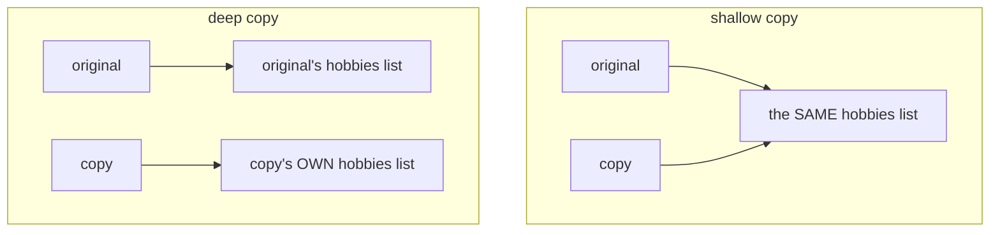
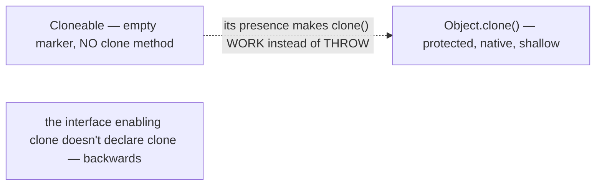
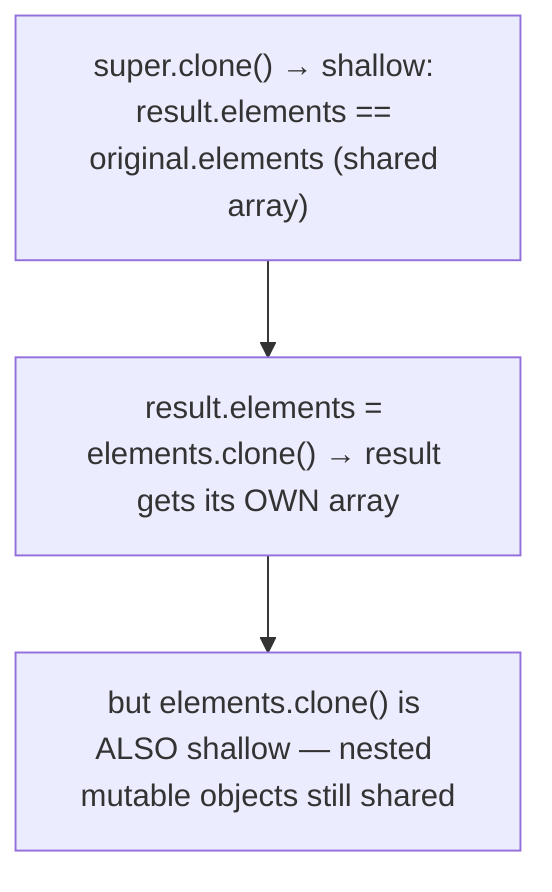
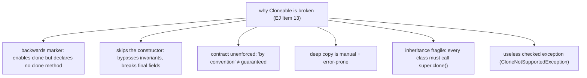
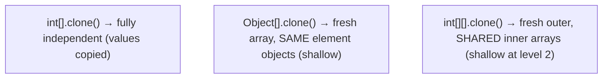
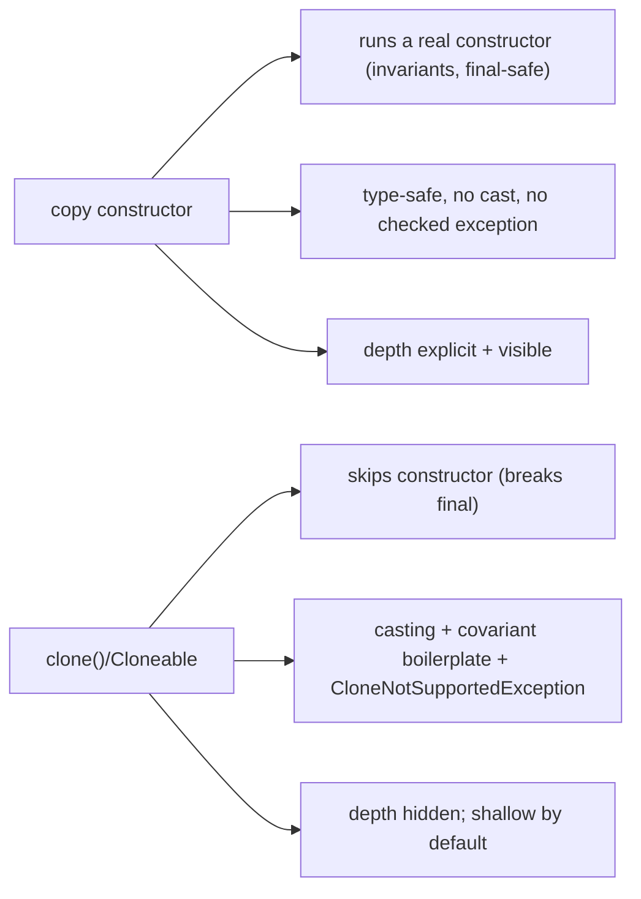
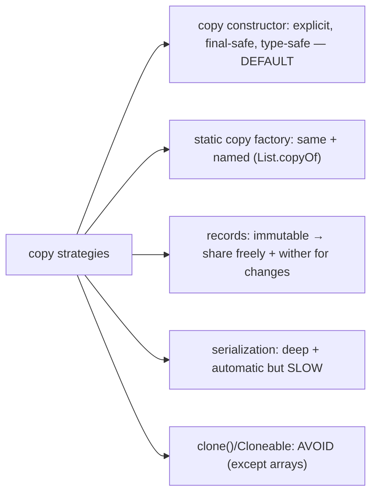
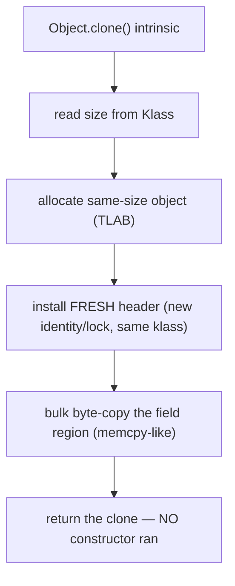
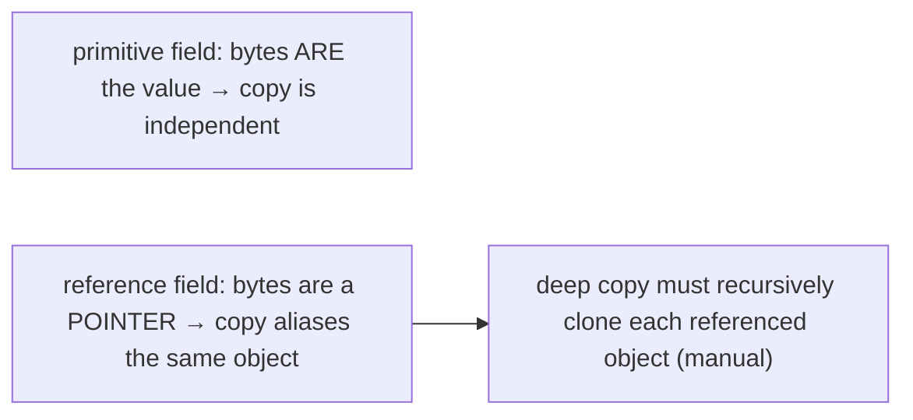
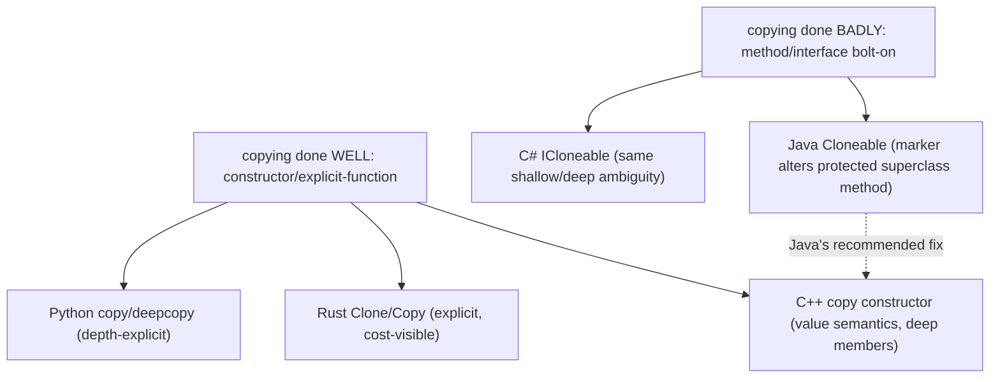

# Object cloning & Cloneable

**Cloning** is making a copy of an object. Java's built-in mechanism — `Object.clone()` plus the `Cloneable` marker interface — is the textbook example of a *well-intentioned feature that went wrong*. We previewed it in [T09](./T09-object-class-and-its-methods.md): `clone()` is `protected` on `Object`, does a **shallow** field-by-field copy, **skips the constructor entirely**, and is gated by a marker interface that — bizarrely — doesn't declare the `clone` method it enables. This topic gives the full treatment: shallow vs deep copy, the (broken) `Cloneable` contract, why `clone()` fights against `final` fields and inheritance, and the **modern alternatives** — copy constructors, static factories, records, and serialization-based deep copy — that have almost entirely replaced it. Knowing *why* `Cloneable` is broken is more valuable than knowing how to use it, because the right answer in modern code is usually "don't."

The depth bar here is the **mechanism of the copy** and **where copies share state**. `Object.clone()` is a **JVM intrinsic**: it allocates a new object of the same class and size, then **bulk-copies the field bytes** of the original into it — essentially an allocation plus a `memcpy` of the instance's field region ([T01](./T01-classes-and-objects.md)), with **no constructor call** and **no field-by-field bytecode**. That byte-copy is exactly why the copy is *shallow*: a reference field is copied as its **pointer value**, so the clone and the original end up pointing at the *same* nested object — the aliasing problem from [T12](./T12-inner-local-and-anonymous-classes.md) in its purest form. A "deep" copy must recursively clone every reachable mutable object, and the constructor-skipping byte-copy collides head-on with `final` fields ([T02](./T02-fields-methods-constructors-this.md)): you cannot reassign a `final` field after `super.clone()` returns it, so `clone()` is fundamentally incompatible with deep-copying `final` mutable state. By the end you'll trace `clone()`'s intrinsic byte-copy, explain precisely why it shares nested state, defensively deep-copy correctly, and reach for a copy constructor instead — knowing the one place `clone()` is still the right tool (copying arrays).

> [!NOTE]
> Prerequisites: [Object class & its methods](./T09-object-class-and-its-methods.md) (`L1/C01/T09`) — `clone()`'s default behavior, the `Cloneable` marker, the shallow-copy preview; [Classes & objects](./T01-classes-and-objects.md) (`L1/C01/T01`) — object header, field layout, reference-vs-object, allocation; [Fields, methods, constructors, this](./T02-fields-methods-constructors-this.md) (`L1/C01/T02`) — constructors, `final` fields, copy-constructor pattern; [Inner/anonymous classes](./T12-inner-local-and-anonymous-classes.md) (`L1/C01/T12`) — aliasing (shared mutable state); [record types](./T14-record-types.md) (`L1/C01/T14`) — immutable carriers that sidestep copying.

## Why Copying Is Hard — Shallow vs Deep

Copying a primitive is trivial — `int b = a;` makes an independent copy of the value. Copying an *object* is where the difficulty starts, because objects contain **references to other objects** ([T01](./T01-classes-and-objects.md)). There are two fundamentally different copies:

- **Shallow copy** — copy the object's fields *as they are*. Reference fields are copied as references, so the copy and the original **share** the nested objects they point to. Mutating a shared nested object through one is visible through the other.
- **Deep copy** — recursively copy the entire object graph, so the copy is **completely independent** — no shared nested objects.

```java
class Person {
    String name;
    List<String> hobbies;          // a reference field
}

Person original = new Person();
original.hobbies = new ArrayList<>(List.of("chess"));

Person shallow = shallowCopy(original);
shallow.hobbies.add("go");         // mutates the SHARED list
original.hobbies;                  // [chess, go] — the original changed too!
```



The choice matters enormously: a shallow copy that you *think* is independent is the same aliasing bug from [T12](./T12-inner-local-and-anonymous-classes.md) — the "copy" silently shares mutable state. Most cloning bugs are shallow-when-you-needed-deep.

## `Object.clone()` and `Cloneable`

Java's built-in copy mechanism has two pieces, and both are oddly designed.

**`Object.clone()`** is a `protected native` method:

```java
protected native Object clone() throws CloneNotSupportedException;
```

It does a **shallow, field-by-field copy** — but only if the object's class implements `Cloneable`; otherwise it throws `CloneNotSupportedException`. Being `protected`, it's not callable from outside the class hierarchy by default — you must override it (typically to make it `public`).

**`Cloneable`** is a **marker interface** ([T08](./T08-interfaces-default-static-private-methods.md)) — it declares **no methods**:

```java
public interface Cloneable { }     // completely empty
```

Here's the first oddity: `Cloneable` doesn't declare `clone()`. Instead, it acts as a *flag* that changes the behavior of `Object.clone()` — with `Cloneable`, `clone()` works; without it, `clone()` throws. **The interface that enables cloning doesn't contain the clone method** (which lives on `Object`, protected). This is backwards from how interfaces normally work (an interface declares the methods it promises — [T08](./T08-interfaces-default-static-private-methods.md)), and it's the first sign that `Cloneable` is a flawed design.



## The Clone Recipe

To make a class cloneable, you implement `Cloneable` and override `clone()` to be `public`, calling `super.clone()`:

```java
public class Point implements Cloneable {
    int x, y;

    @Override
    public Point clone() {                          // public + covariant return (T05)
        try {
            return (Point) super.clone();           // Object.clone does the shallow copy
        } catch (CloneNotSupportedException e) {
            throw new AssertionError(e);            // impossible — we implement Cloneable
        }
    }
}
```

The covariant return type (`Point` instead of `Object` — [T05](./T05-method-overriding.md)) lets callers clone without casting. The `try/catch` is boilerplate: `super.clone()` declares the checked `CloneNotSupportedException`, but since we implement `Cloneable` it can never actually throw — so we wrap it in an `AssertionError`.

For a class with only **primitive or immutable** fields (like `Point`), this is enough — the shallow copy *is* a correct independent copy, because there are no mutable nested objects to share. But for **mutable reference fields**, the shallow `super.clone()` shares them, and you must deep-copy explicitly:

```java
public class Stack implements Cloneable {
    private Object[] elements;
    private int size;

    @Override
    public Stack clone() {
        try {
            Stack result = (Stack) super.clone();   // shallow: result.elements == this.elements (shared!)
            result.elements = elements.clone();      // deep-copy the array so result has its own
            return result;
        } catch (CloneNotSupportedException e) {
            throw new AssertionError(e);
        }
    }
}
```

After `super.clone()`, `result.elements` points at the *same* array as the original — sharing. The fix: clone the array into a fresh one. But note — `elements.clone()` is *itself* shallow: if `elements` held mutable objects, those would still be shared. A genuinely deep copy of a deep graph requires *recursive* cloning, which gets complicated fast.



## The `final`-Field Problem

Here's a deep flaw. The deep-copy fix requires **reassigning** a field after `super.clone()`: `result.elements = elements.clone()`. But if `elements` were **`final`** ([T02](./T02-fields-methods-constructors-this.md)), this is a **compile error** — you cannot reassign a `final` field:

```java
public class Stack implements Cloneable {
    private final Object[] elements;          // final
    @Override public Stack clone() {
        Stack result = (Stack) super.clone();
        result.elements = elements.clone();    // COMPILE ERROR: cannot assign a final field
        return result;
    }
}
```

So **`clone()` is fundamentally incompatible with `final` mutable fields.** To deep-copy with `clone()`, you must make the field non-`final` — directly undermining immutability ([T02](./T02-fields-methods-constructors-this.md)/[T19](./T19-immutability-and-immutable-class-design.md)). This is one of the most damning facts about `Cloneable`: it forces you to choose between cloneability and `final` fields. A copy constructor ([§ Copy Constructors](#modern-alternative-copy-constructors)) has no such problem — it assigns `final` fields normally, because it's a real constructor running before the object is "frozen."

This collision exists *because* `clone()` skips the constructor. A constructor is the *only* place a `final` field may be assigned ([T02](./T02-fields-methods-constructors-this.md)); `clone()` produces a fully-formed object *without* running one, so by the time your `clone()` override runs, the `final` fields are already set (by the byte-copy) and frozen.

## The Clone Contract — All by Convention

`Object.clone()`'s Javadoc specifies a contract, but **none of it is enforced** by the language — it's all "by convention," which a well-behaved `clone()` *should* satisfy:

- `x.clone() != x` — the clone is a **different object**.
- `x.clone().getClass() == x.getClass()` — the clone has the **same runtime class**.
- `x.clone().equals(x)` — the clone is **equal** to the original (typically, not strictly required).

`super.clone()` naturally satisfies the first two (it allocates a new object of the original's runtime class). But a `clone()` that does `return new Point(x, y)` instead of `super.clone()` would *break* the second for subclasses — a `ColorPoint`'s inherited clone would return a `Point`, not a `ColorPoint`. This is why the recipe insists on `super.clone()`: it preserves the runtime class through the hierarchy.

> [!WARNING]
> Because the contract is unenforced, a class can implement `Cloneable` and have a `clone()` that violates it (wrong class, not equal, even `x.clone() == x`). You can't *rely* on `clone()` behaving correctly for an arbitrary `Cloneable` type the way you can rely on `equals`/`hashCode` semantics — another reason to avoid the mechanism.

## Why `Cloneable` Is Broken

*Effective Java* Item 13 ("Override clone judiciously") is, in practice, "avoid `Cloneable`." The reasons compound:

1. **The marker interface is backwards.** `Cloneable` enables `Object.clone` but declares no `clone` method — it changes the behavior of a `protected` superclass method instead of providing one. No other Java interface works this way.
2. **It skips the constructor.** `clone()` produces an object without running any constructor, so constructor-enforced invariants ([T02](./T02-fields-methods-constructors-this.md)) are bypassed, and `final` fields can't be deep-copied (above).
3. **The contract is vague and unenforced.** "By convention" guarantees aren't guarantees.
4. **Deep copy is hard and manual.** You must recursively clone every mutable field; miss one and you have a silent sharing bug. There's no help from the mechanism.
5. **Inheritance is fragile.** Every class in the hierarchy must cooperate (call `super.clone()`); one that doesn't breaks cloning for all its subclasses.
6. **It throws a checked exception** (`CloneNotSupportedException`) that, in correct code, can never happen — pure boilerplate.

The verdict: **don't make new classes `Cloneable`; don't call `clone()` on objects** (except arrays). Use a copy constructor or factory. `Cloneable` persists only for backward compatibility and in some legacy APIs.



## Array `clone()` — The One Good Use

There is exactly one place `clone()` is the idiomatic, correct choice: **copying an array.** Arrays implicitly implement `Cloneable` and override `clone()` to be `public` with a covariant return ([T01](./T01-classes-and-objects.md)):

```java
int[] a = {1, 2, 3};
int[] b = a.clone();          // a fresh, independent int[] — the right way to copy an array
b[0] = 99;                    // a is unchanged
```

For a **primitive** array, `clone()` produces a fully independent copy (the values are copied). For a **reference** array, `clone()` is *shallow* — a fresh array, but the elements are the **same objects**:

```java
String[] a = {"x", "y"};
String[] b = a.clone();       // fresh array; b[0] == a[0] (same String objects — fine, Strings are immutable)

Point[] pa = {new Point(1,1)};
Point[] pb = pa.clone();      // fresh array, but pb[0] == pa[0] — the SAME Point (mutable! shared)
```

And a **2-D array** clone is shallow at the second level — the outer array is fresh but the inner arrays are shared ([T01](./T01-classes-and-objects.md) multi-D arrays):

```java
int[][] grid = {{1,2},{3,4}};
int[][] copy = grid.clone();  // outer fresh, but copy[0] == grid[0] (inner arrays SHARED)
copy[0][0] = 99;              // grid[0][0] is now 99 too
```

So `array.clone()` is the right way to copy *a* one-dimensional array, but for arrays of mutable objects or multi-dimensional arrays you still need element-wise deep copying. (`Arrays.copyOf` is an equivalent idiom and allows resizing.)



## Modern Alternative: Copy Constructors

The recommended replacement is a **copy constructor** — a constructor that takes an instance of the same class and copies its state ([T02](./T02-fields-methods-constructors-this.md)):

```java
public final class Stack {
    private final Object[] elements;          // final — works fine with a copy constructor
    private final int size;

    public Stack(Stack other) {               // copy constructor
        this.elements = other.elements.clone();   // deep-copy as needed
        this.size = other.size;
    }
}

Stack copy = new Stack(original);             // explicit, clear, type-safe
```

Why it's better than `clone()` on every axis:

- **It runs a real constructor** — invariants are enforced, `final` fields are assigned normally (no `final` problem).
- **It's type-safe** — no casting, no covariant-return boilerplate.
- **No checked exception** — no `CloneNotSupportedException` to catch.
- **No magic marker interface** — it's an ordinary constructor.
- **Clear about depth** — you write the field copies, so shallow vs deep is explicit and visible.

The JDK's own collections use this pattern: `new ArrayList<>(other)`, `new HashMap<>(other)`, `new HashSet<>(other)` are all copy constructors. **When you need to copy, write a copy constructor.**



## Modern Alternative: Static Copy Factories

A **static copy factory** is the same idea with a named method ([T11](./T11-static-members-blocks-and-nested-classes.md) static factories):

```java
public static Stack copyOf(Stack other) { return new Stack(other); }
```

The JDK uses `List.copyOf`, `Set.copyOf`, `Map.copyOf` (Java 10+) — these return *immutable* copies. A factory can have a descriptive name, can return a subtype or a cached instance, and reads well at the call site (`Stack.copyOf(original)`). Copy constructors and copy factories are interchangeable; pick by taste and API style.

## Modern Alternative: Records and "Withers"

A **record** ([T14](./T14-record-types.md)) is *immutable*, so you rarely need to copy it at all — you can freely *share* an immutable object because no one can mutate it ([T19](./T19-immutability-and-immutable-class-design.md)). When you need a *modified* copy (change one component, keep the rest), you write a **"wither"**:

```java
public record Point(int x, int y) {
    public Point withX(int newX) { return new Point(newX, y); }   // a modified copy
}

Point p = new Point(3, 4);
Point q = p.withX(10);        // Point[x=10, y=4] — p unchanged
```

(Java records don't auto-generate `copy`/`with` the way Kotlin data classes do — [T14](./T14-record-types.md) — though a `with`-expression feature is planned.) For immutable data, the combination "share freely + wither for changes" eliminates the copying problem entirely — there's nothing mutable to deep-copy.

## Modern Alternative: Serialization-Based Deep Copy

For a genuinely deep copy of a complex object graph, **serialization round-trip** works automatically: serialize the object to bytes, then deserialize — the result is a deep copy of the entire reachable graph (handling cycles correctly):

```java
// requires the types to be Serializable
T deepCopy = SerializationUtils.clone(original);   // Apache Commons Lang
```

It's **deep and automatic** — no manual field-by-field recursion. The cost: it's **slow** (reflection + I/O serialization overhead, often 10–100× a hand-written copy), requires everything to be `Serializable`, and Java serialization has well-known security pitfalls ([L1/C02/T21](../C02-collections-and-core-apis/T21-serialization-and-deserialization.md)). Reserve it for the rare case where you need a deep copy of an arbitrary complex graph and performance doesn't matter. (Modern alternatives use a serialization library like Jackson — `mapper.readValue(mapper.writeValueAsBytes(x), X.class)` — to the same effect.)



## Memory Layer — `clone()` Is an Intrinsic Byte-Copy

What does `Object.clone()` actually *do* at the machine level? HotSpot treats it as an **intrinsic** ([T09](./T09-object-class-and-its-methods.md) intrinsics): rather than a generic method call, the JIT emits specialized code that:

1. **Reads the original's size** from its `Klass` ([T01](./T01-classes-and-objects.md) — the `_layout_helper`).
2. **Allocates a new object** of the same class and size (TLAB bump-pointer, [T01](./T01-classes-and-objects.md)).
3. **Installs a fresh header** — the clone gets a *new* mark word (its own identity hash will be computed lazily, its own lock state — [T01](./T01-classes-and-objects.md)/[T09](./T09-object-class-and-its-methods.md)) and the same klass pointer.
4. **Bulk-copies the field region** — a `memcpy`-style copy of all the instance's field bytes from the original to the clone, in one shot (like `System.arraycopy`'s intrinsic — [T01](./T01-classes-and-objects.md)).



Crucially, there is **no constructor call** and **no field-by-field bytecode** — it's allocate + memcpy. This is fast: a shallow clone of a small object is roughly the cost of one allocation plus a short memory copy — tens of nanoseconds. It's also exactly why `clone()` *can't* run your invariants or assign `final` fields through a constructor: it bypasses construction entirely, fabricating a fully-formed object from the original's bytes.

## Memory Layer — Why the Byte-Copy Is Shallow

The byte-copy is shallow for a precise, physical reason. A **reference field** holds a *pointer* (4 bytes with compressed oops — [T01](./T01-classes-and-objects.md)) to a nested heap object. The `memcpy` copies that pointer's *bits* into the clone's corresponding field. Now the clone's field holds the **same pointer value** → it points at the **same nested object**. The clone and the original *alias* their nested objects ([T12](./T12-inner-local-and-anonymous-classes.md)):

```
original:  [header][hobbies: 0x4A2F]  ──┐
                                         ├──► the SAME List object at 0x4A2F
clone:     [header][hobbies: 0x4A2F]  ──┘
```

The byte-copy has no way to know that `0x4A2F` is a reference that *also* needs copying — to it, those 4 bytes are just 4 bytes. So **primitive fields copy correctly** (their bytes *are* their values) but **reference fields share** (their bytes are a pointer, copied verbatim). A deep copy must, *after* the byte-copy, walk each reference field and recursively clone the object it points at — which is the manual work `clone()` overrides have to do, and which has no support from the intrinsic.



## Architecture Layer — `clone()` vs Copy Constructor Cost

Both copying strategies are fast and JIT-friendly:

- **`clone()` intrinsic**: allocate + one bulk byte-copy. For a large flat object (many primitive fields), the single `memcpy` can be marginally faster than a copy constructor's field-by-field stores — one wide copy vs N individual writes.
- **Copy constructor**: allocate (via `new`) + N field-by-field assignments. The JIT inlines the constructor ([T02](./T02-fields-methods-constructors-this.md)) and the stores are cheap; for small objects, indistinguishable from the intrinsic.
- **Escape analysis** ([T01](./T01-classes-and-objects.md)) can eliminate a short-lived clone or copy entirely if it doesn't escape — both strategies benefit.

The performance difference is **negligible** in practice — both are dominated by the allocation. **Choose by clarity and correctness, not speed**: the copy constructor wins decisively there (explicit depth, `final`-safe, type-safe, no broken contract), and its tiny theoretical disadvantage on huge flat objects never matters. The byte-copy's only real edge — copying a large array or a large flat struct in one shot — is exactly the case where `array.clone()`/`Arrays.copyOf` (which use the same intrinsic) remain idiomatic.

## Cross-Language Perspective — Copying Across Languages

Every language must answer "how do I copy an object?", and the designs reveal what Java got wrong:

| Language | Copy mechanism | Default depth | Verdict |
|----------|----------------|---------------|---------|
| **Java** | `Cloneable` + `clone()` | shallow | broken; use copy constructors |
| **C++** | copy constructor `T(const T&)` + `operator=` | deep for members (value semantics) | the well-designed model |
| **Rust** | `Clone` trait (`.clone()`) + `Copy` (bitwise) | deep by convention; explicit | clean, explicit |
| **Python** | `copy.copy` (shallow) / `copy.deepcopy` (deep) | you choose explicitly | clear |
| **C#** | `ICloneable.Clone()` | ambiguous (shallow/deep) | also broken; MS discourages it |
| **Kotlin** | `data class` `.copy()` | shallow, component-wise | convenient, still shallow |

Two contrasts:

**C++ is the model Java should have followed.** C++ uses **value semantics**: a copy constructor `T(const T& other)` and copy-assignment `operator=` define copying, and the default copies each member (recursively, so member objects are deep-copied by *their* copy constructors). Joshua Bloch explicitly says the Java analog of a C++ copy constructor is *a Java copy constructor* — which is exactly the recommended replacement for `Cloneable`. C++ got copying right in 1985 by making it a constructor with value semantics; Java bolted on a marker-interface-plus-protected-method scheme that's been regretted ever since.

**Rust separates cheap copy from expensive copy.** Rust has *two* traits: **`Copy`** for types that are trivially bitwise-copyable (no heap ownership — like primitives; assignment copies instead of moves) and **`Clone`** for types where copying may be expensive or deep (`.clone()` is always explicit, never implicit). This makes the cost of a copy *visible in the code* — a `.clone()` call signals "this might be expensive," while a `Copy` type's assignment is known-cheap. Java's `clone()` hides this distinction; Python's `copy` vs `deepcopy` makes the *depth* explicit but not the *cost*.

The universal lesson: languages that made copying a **constructor with value semantics** (C++) or an **explicit, depth-clear function** (Rust `Clone`, Python `deepcopy`) fare well; languages that made it a **method/interface bolted onto the object model** (Java `Cloneable`, C# `ICloneable`) regret it. Java's `Cloneable` is the canonical cautionary tale of a marker interface magically altering a superclass method's behavior.



## Common Mistakes

> [!WARNING]
> **Calling `clone()` without implementing `Cloneable`.** Throws `CloneNotSupportedException` at runtime. (And implementing `Cloneable` correctly is itself error-prone — prefer a copy constructor.)

> [!WARNING]
> **Shallow clone sharing mutable nested state.** `super.clone()` copies reference fields as references — the clone shares the original's mutable nested objects. Deep-copy each mutable field, or you have a silent aliasing bug ([T12](./T12-inner-local-and-anonymous-classes.md)).

> [!WARNING]
> **`clone()` with `final` mutable fields.** You can't reassign a `final` field after `super.clone()`, so you can't deep-copy it — `clone()` forces you to drop `final`, undermining immutability. Use a copy constructor, which assigns `final` fields normally.

> [!WARNING]
> **Forgetting covariant return / `super.clone()`.** A `clone()` that returns `Object` forces callers to cast; one that does `return new MyClass(...)` instead of `super.clone()` breaks the same-runtime-class contract for subclasses.

> [!WARNING]
> **Using `clone()` when a copy constructor would do.** For your own classes, prefer a copy constructor or static factory — clearer, `final`-safe, type-safe, no broken contract. Reserve `clone()` for copying arrays.

> [!WARNING]
> **Assuming `array.clone()` is deep.** It's shallow for reference arrays (elements shared) and multi-dimensional arrays (inner arrays shared). Deep-copy elements explicitly when they're mutable.

> [!INTERVIEW]
> Common interview questions for this topic:
> 1. **Shallow vs deep copy?** Shallow copies fields as-is (reference fields share the nested objects); deep recursively copies the whole graph (fully independent).
> 2. **What does `Object.clone()` do?** A shallow, field-by-field copy via a JVM intrinsic — allocate same-size + bulk byte-copy — with **no constructor call**, gated by the `Cloneable` marker.
> 3. **Why is `Cloneable` considered broken?** The marker declares no `clone` method (backwards); `clone()` skips the constructor (bypassing invariants, can't deep-copy `final` fields); the contract is unenforced; deep copy is manual; inheritance is fragile; it throws a useless checked exception.
> 4. **Why can't `clone()` deep-copy a `final` field?** Deep copy requires reassigning the field after `super.clone()`, but `final` fields can't be reassigned — `clone()` skips the constructor that would normally set them.
> 5. **Why is the byte-copy shallow?** Reference fields are copied as pointer bits, so the clone's field points at the same nested object. Primitives copy correctly; references alias.
> 6. **What's the modern alternative?** A copy constructor (`new ArrayList<>(other)`) or static factory (`List.copyOf`) — explicit, `final`-safe, type-safe, no broken contract.
> 7. **When is `clone()` still the right tool?** Copying arrays — `array.clone()` / `Arrays.copyOf` is idiomatic (though shallow for reference/multi-D arrays).
> 8. **Does `clone()` call a constructor?** No — it's an intrinsic byte-copy that fabricates the object from the original's bytes, skipping construction entirely.
> 9. **What's the clone contract?** `x.clone() != x`, `x.clone().getClass() == x.getClass()`, usually `x.clone().equals(x)` — all by convention, unenforced.
> 10. **How do you deep-copy a complex graph automatically?** Serialization round-trip (slow, requires `Serializable`) — or a serialization library (Jackson). Or recursive manual copy.
> 11. **How does C++ handle copying, and how does it relate to Java?** Copy constructor + `operator=` with value semantics (deep for members). The Java analog is a copy constructor — the recommended `Cloneable` replacement.
> 12. **Is `array.clone()` deep?** Independent for primitive arrays; shallow for reference arrays (shared elements) and multi-D arrays (shared inner arrays).
> 13. **Cost of `clone()` vs a copy constructor?** Negligible difference — both dominated by allocation; the intrinsic's single memcpy can edge out field-by-field stores for huge flat objects, but clarity/correctness favor the copy constructor.
> 14. **Why does `clone()` get a fresh header but copied fields?** The clone is a new object (new identity hash, new lock state in a fresh mark word) holding a byte-copy of the original's field values.

## Practice

1. **Shallow sharing bug.** Write a `Person` with a mutable `List<String> hobbies`, implement `Cloneable` with the naive `return (Person) super.clone()`. Clone, mutate the clone's list, observe the *original's* list changed. Explain the aliasing.

2. **Deep-copy fix.** Fix #1 by cloning the list in the `clone()` override (`result.hobbies = new ArrayList<>(hobbies)`). Confirm original and clone are now independent.

3. **`CloneNotSupportedException`.** Write a class with a `clone()` that calls `super.clone()` but does *not* implement `Cloneable`. Call it; observe the checked exception. Add `implements Cloneable`; it works.

4. **`clone()` skips the constructor — prove it.** Add a side-effecting constructor (print, or increment a static counter) to a `Cloneable` class. Clone an instance; confirm the constructor did **not** run (no print, counter unchanged).

5. **The `final`-field wall.** Make a mutable field `final` in a `Cloneable` class and try to deep-copy it in `clone()` (`result.field = field.clone()`). Observe the compile error. Refactor to a copy constructor; confirm it assigns the `final` field with no problem.

6. **Array clone depth.** Clone an `int[]` (confirm independent), an `Object[]` of mutable `Point`s (confirm the array is fresh but elements shared — mutate a Point via one array, see it via the other), and an `int[][]` (confirm inner arrays shared). Tabulate the three.

7. **Covariant return.** Write `clone()` returning `Object` (callers must cast) vs returning the class type (no cast). Confirm the covariant version is more usable.

8. **Contract violation.** Write a `clone()` that does `return new MyClass(...)` instead of `super.clone()`. Subclass it; confirm the subclass's inherited `clone()` returns the *wrong* runtime class (the parent), violating the contract.

9. **Copy constructor.** Rewrite a `Cloneable` class as a `final` class with a copy constructor (and `final` fields). Confirm it's simpler, `final`-safe, and has no checked exception. Note the JDK collections all work this way (`new ArrayList<>(other)`).

10. **Static copy factory.** Add a `copyOf` static factory delegating to the copy constructor. Compare readability at the call site (`X.copyOf(o)` vs `new X(o)` vs `o.clone()`).

11. **Record + wither.** Convert a small value class to a record. Confirm you don't need to copy it to share it (it's immutable). Add a `withX` wither for a modified copy; confirm the original is unchanged.

12. **Serialization deep copy.** Make a graph of `Serializable` objects with shared mutable nested state. Deep-copy via serialize→deserialize (Apache `SerializationUtils.clone` or a Jackson round-trip). Confirm the copy is fully independent. Time it vs a hand-written copy; observe it's much slower.

13. **`clone()` intrinsic timing.** Microbenchmark `clone()` vs a copy constructor for a small object and a large flat object (many primitive fields). Observe both are fast and dominated by allocation; note the intrinsic's slight edge for the large flat case.

14. **Fresh header.** Clone an object after calling `System.identityHashCode` on the original. Confirm the clone gets a *different* identity hash (a fresh mark word — [T09](./T09-object-class-and-its-methods.md)), proving the clone is a distinct object with its own header.

15. **End-to-end explain-it-back.** Trace `original.clone()` for a `Cloneable` class with one `int` and one `List` field: (a) the intrinsic reads the size, allocates a same-size object, installs a fresh header; (b) it bulk byte-copies the field region — the `int` copies correctly, the `List` field copies the *pointer* (clone and original now share the list); (c) no constructor ran (so `final` fields couldn't be reassigned); (d) your override must `result.list = new ArrayList<>(list)` to deep-copy — impossible if `list` were `final`; (e) why a copy constructor avoids all of this; (f) why `array.clone()` is the one place this mechanism is still idiomatic. Twelve sentences max.

## Recap

You should now be able to:

**Language layer.**

- Distinguish shallow copy (shared nested objects) from deep copy (fully independent) and recognize shallow-when-you-needed-deep as the core cloning bug.
- Use the `Object.clone()` + `Cloneable` mechanism (override `clone()` public, call `super.clone()`, covariant return, deep-copy mutable fields) — and know why you usually shouldn't.
- Explain why `Cloneable` is broken: backwards marker interface, skips the constructor, unenforced contract, manual deep copy, fragile inheritance, useless checked exception.
- Explain why `clone()` is incompatible with `final` mutable fields (can't reassign after the constructor-skipping copy).
- Use the modern alternatives: copy constructors (the default), static copy factories, immutable records + withers, serialization-based deep copy.
- Recognize `array.clone()` as the one idiomatic use of `clone()` — and that it's shallow for reference and multi-dimensional arrays.

**Memory layer.**

- Explain `Object.clone()` as a JVM intrinsic: allocate a same-size object, install a fresh header, bulk byte-copy the field region — no constructor, no field-by-field bytecode.
- Explain precisely why the byte-copy is shallow: reference fields are copied as pointer bits, so the clone aliases the original's nested objects; primitives copy correctly.
- Recognize that the clone gets a fresh mark word (new identity/lock state) but copied field values.

**Architecture layer.**

- Compare `clone()`'s intrinsic byte-copy with a copy constructor's field-by-field stores — both fast, both JIT-inlinable, both EA-eliminable; the difference is negligible and clarity/correctness favor the copy constructor.
- Compare Java's `Cloneable` with C++ copy constructors (value semantics, the model to emulate), Rust's `Clone`/`Copy` traits (explicit, cost-visible), Python's `copy`/`deepcopy` (depth-explicit), and C#'s `ICloneable` (also broken) — and articulate why constructor/function-based copying beats marker-interface copying.

`Cloneable` is the chapter's cautionary tale: a feature whose design fights the language (skipping constructors, breaking `final`, an inverted marker interface) and whose right answer is "use something else." The final C01 topic, [T19](./T19-immutability-and-immutable-class-design.md), is the positive counterpart — **immutability**, where objects are designed *never* to change, so copying becomes unnecessary (you share freely) and the whole class of mutation and aliasing bugs disappears.

## Next

Continue to [Immutability & immutable class design](./T19-immutability-and-immutable-class-design.md) — the design discipline that makes objects unchangeable after construction, eliminating the mutation, aliasing, and defensive-copy problems that have recurred through this chapter ([T02](./T02-fields-methods-constructors-this.md) `final` fields, [T10](./T10-equals-hashcode-tostring-contracts.md) safe hash keys, [T12](./T12-inner-local-and-anonymous-classes.md) aliasing, [T14](./T14-record-types.md) records, and this topic's copying woes). T19 brings the threads together: the rules for an immutable class, the JMM `final`-field safe-publication guarantee, why immutable objects are inherently thread-safe and shareable, and the performance trade-offs — the capstone of L1's object-modeling chapter.
